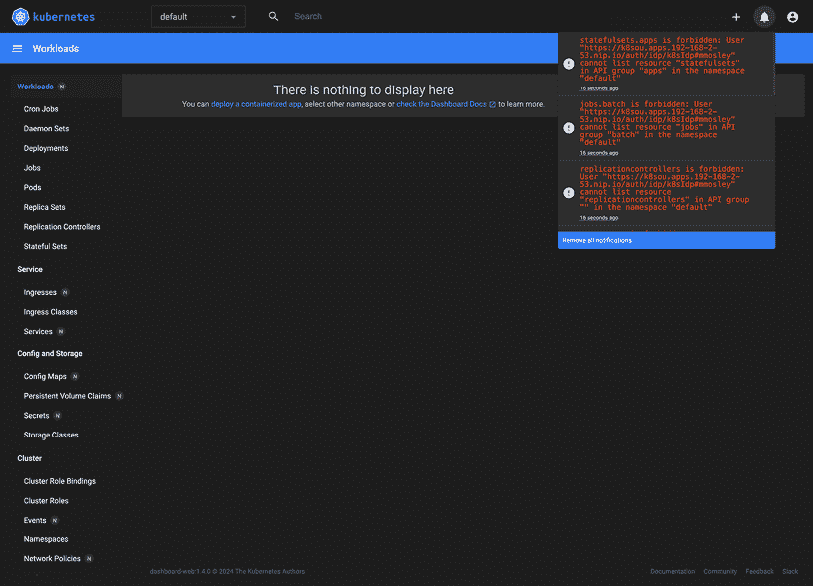
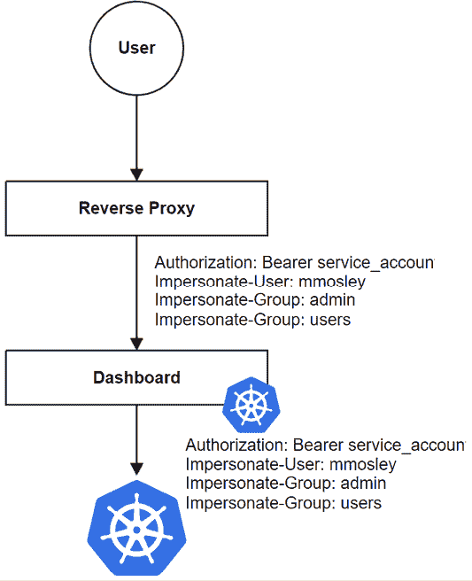
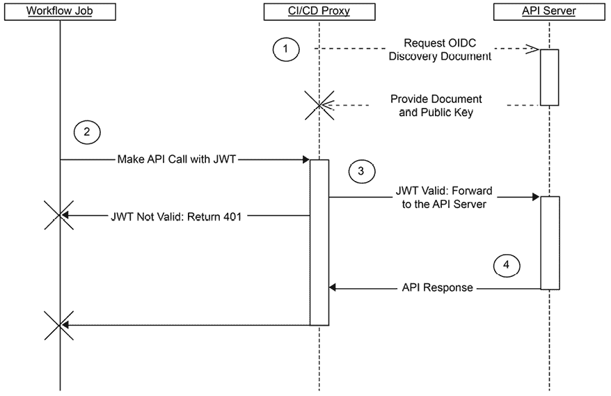
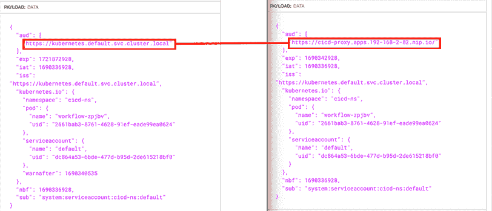

# 6

# 将身份验证集成到你的集群中

一旦集群建立，用户需要安全地与其交互。对于大多数企业而言，这意味着对个体用户和管道进行身份验证，确保他们只能访问完成工作所需的内容。这被称为最小特权访问。最小特权原则是一种安全实践，旨在为用户、系统、应用程序或进程提供执行任务所需的最低访问权限。对于 Kubernetes 来说，这可能会很具挑战性，因为集群是一个 API 集合，而不是具有前端的应用程序，无法提示身份验证，也没有提供管理凭据的安全方式。

未能创建身份验证策略可能导致集群被接管。一旦集群可能被攻击者入侵，几乎无法确定攻击者是否已被清除，你将不得不重新开始。被攻击的集群还可能导致其他系统的漏洞，如应用程序可能访问的数据库。身份验证是确保这一切不发生的第一步。

在本章中，你将学习如何使用 **OpenID Connect** 协议和 Kubernetes 身份伪造将企业身份验证集成到你的集群中。我们还将介绍几个反模式，并解释为什么你应该避免使用它们。为了结束本章，你还将学习如何安全地将你的管道集成到你的集群中。

本章将涵盖以下主题：

+   了解 Kubernetes 如何识别你的身份

+   了解 OpenID Connect

+   配置 KinD 以支持 OpenID Connect

+   引入身份伪造将身份验证与云托管的集群集成

+   配置集群进行身份伪造

+   在没有 OpenUnison 的情况下配置身份伪造

+   从管道进行身份验证

让我们开始吧！

# 技术要求

为了完成本章中的练习，你将需要以下资源：

+   一台拥有 8 GB 内存的 Ubuntu 22.04 服务器

+   使用 *第二章* 中配置的配置运行的全新 KinD 集群，*使用 KinD 部署 Kubernetes*

你可以在以下 GitHub 仓库访问本章的代码：[`github.com/PacktPublishing/Kubernetes-An-Enterprise-Guide-Third-Edition/tree/main/chapter6`](https://github.com/PacktPublishing/Kubernetes-An-Enterprise-Guide-Third-Edition/tree/main/chapter6)。

# 获取帮助

我们尽力测试所有内容，但在我们的集成实验室中，有时会有六个或更多的系统。鉴于技术的流动性，有时在我们的环境中有效的东西在你的环境中可能不起作用。别担心——我们在这里帮助你！在我们的 GitHub 仓库中提交问题：[`github.com/PacktPublishing/Kubernetes-An-Enterprise-Guide-Third-Edition/issues`](https://github.com/PacktPublishing/Kubernetes-An-Enterprise-Guide-Third-Edition/issues)，我们将很乐意帮助你！

# 了解 Kubernetes 如何识别你的身份

在 1999 年的科幻电影 *黑客帝国* 中，Neo 在等待见 Oracle 时与一个孩子交谈。孩子向他解释说，操控矩阵的诀窍在于意识到“*没有勺子*”。

这是在 Kubernetes 中查看用户的一种很好的方式，因为它们并不存在。除了稍后讨论的服务帐户外，Kubernetes 中没有名为“用户”或“组”的对象。每次 API 交互都必须包含足够的信息，告知 API 服务器用户是谁，以及该用户属于哪些组。此声明可以根据你计划如何将身份验证集成到集群中，采取不同的形式。

在本节中，我们将深入探讨 Kubernetes 可以通过不同方式将用户与集群关联的详细信息。

## 外部用户

从集群外部访问 Kubernetes API 的用户通常会使用两种身份验证方法之一：

+   **证书**：你可以通过使用包含有关你信息的客户端证书来声明你是谁，例如你的用户名和组。该证书在 TLS 协商过程中作为一部分使用。

+   **持有者令牌**：嵌入在每个请求中，持有者令牌可以是一个自包含的令牌，包含验证自身所需的所有信息，或者是一个可以通过 API 服务器中的 Webhook 交换获取这些信息的令牌。

还有一种第三种身份验证方法，即使用 **服务帐户**。然而，强烈不推荐使用服务帐户从集群外部访问 API 服务器。我们将在 *其他身份验证选项* 部分讨论使用服务帐户的风险和问题。

## Kubernetes 中的组

不同的用户可以通过组分配相同的权限，而无需为每个用户单独创建 `RoleBinding` 对象。Kubernetes 包含两种类型的组：

+   **系统分配的**：这些组以 `system:` 前缀开始，由 API 服务器分配。例如，`system:authenticated` 组会分配给所有经过身份验证的用户。另一个系统分配的组示例是 `system:serviceaccounts:namespace` 组，其中 `Namespace` 是包含该组中命名的命名空间内所有服务帐户的命名空间的名称。

+   **用户声明组**：这些组由身份验证系统声明，可能包含在提供给 API 服务器的令牌中，或通过身份验证 Webhook 提供。对于这些组的命名没有标准或要求。与用户一样，组并不是 API 服务器中的对象。组是在身份验证时由外部用户声明的，并且系统生成的组在本地进行跟踪。在声明用户的组时，唯一标识符和组之间的主要区别是唯一标识符应该是唯一的，而组则不需要。

尽管你可能通过组获得访问权限，但所有访问仍然是根据用户的唯一标识符进行跟踪和审计的。

## 服务帐户

服务账户是 API 服务器中的对象，用于追踪哪些 Pods 可以访问各种 API。服务账户令牌被称为 **JSON Web Tokens**，或 **JWTs**，根据令牌的生成方式，有两种方法可以获取服务账户：

+   第一个方法是通过 Kubernetes 在创建 ServiceAccount 时生成的秘密。

+   第二种方法是通过 `TokenRequest` API，它用于通过挂载点或从集群外部将密钥注入 Pods。所有服务账户都通过将令牌作为请求头注入 API 服务器来使用。API 服务器将其识别为服务账户并进行内部验证。

我们将在本章稍后部分讨论如何在特定上下文中创建这些令牌。

与用户不同，服务账户 **不能** 被分配到任意的组。服务账户只能是预定义组的成员；你不能创建特定的服务账户组来分配角色。

现在我们已经探讨了 Kubernetes 如何识别用户的基本原理，接下来我们将探讨这一框架如何融入 **OpenID Connect**（**OIDC**）协议中。OIDC 提供了大多数企业所需的安全性，并且是基于标准的，但 Kubernetes 并未像许多 Web 应用程序那样使用它。理解这些差异以及 Kubernetes 为什么需要这些差异，是将集群集成到企业安全环境中的一个重要步骤。

# 理解 OpenID Connect

**OpenID Connect** 是一种标准的身份联合协议。它基于 **OAuth2** 规范，并具有一些非常强大的功能，使其成为与 Kubernetes 集群交互的首选方案。

OpenID Connect 的主要好处如下：

+   **短期令牌**：如果令牌被泄露，例如通过日志消息或安全漏洞，你希望令牌尽快过期。在 OIDC 中，你可以指定令牌的有效期为 1 到 2 分钟，这意味着攻击者在尝试使用令牌时，令牌很可能已经过期。

+   **用户和组成员资格**：当我们开始讨论 *第七章：RBAC 策略和审计* 中的授权时，我们会立即看到，通过组管理访问权限比直接引用用户更为重要。OIDC 令牌可以嵌入用户的标识符及其所属组，从而简化访问管理。

+   **与超时策略相关的刷新令牌**：使用短期令牌时，你需要能够在需要时刷新它们。刷新令牌的有效期可以限定在企业的 Web 应用程序空闲超时策略内，从而保持集群与其他基于 Web 的应用程序的合规性。

+   **kubectl 无需插件**：`kubectl` 二进制文件本身原生支持 OpenID Connect，因此无需任何额外的插件。如果你需要从跳板机或虚拟机访问集群，而无法将 **命令行界面** (**CLI**) 工具直接安装到工作站，这尤其有用。不过，也有一些方便的插件，我们将在本章稍后讨论。

+   **更多的多因素认证选项**：许多最强的多因素认证选项需要使用网页浏览器。例如，FIDO 和 WebAuthn，它们使用硬件令牌。

OIDC 是一个经过同行评审的标准，已经使用了几年，并且正在迅速成为身份联合的首选标准。使用现有的标准而不是定制开发的标准，意味着 Kubernetes 利用了这些同行评审的现有专业知识，而不是创建一个新的身份验证协议，这些经验尚未经过验证。

身份联合是用于描述在不共享用户机密信息或密码的情况下进行身份数据和认证的术语。身份联合的经典例子是登录到你的员工网站，并能够访问你的福利提供商，而无需再次登录。你的员工网站不会将你的密码与福利提供商共享。相反，员工网站会声明你在某个时间和日期登录，并提供一些关于你的信息。通过这种方式，你的账户在两个孤岛（你的员工网站和福利门户）之间实现了联合，而福利门户并不知道你员工网站的密码。

如你所见，OIDC 有多个组件。为了充分理解 OIDC 的工作原理，我们首先来了解一下 OpenID Connect 协议。

## OpenID Connect 协议

我们将关注 OIDC 协议的两个方面：

+   使用令牌与 `kubectl` 和 API 服务器进行交互

+   刷新令牌以保持令牌的最新状态

我们不会过多关注获取令牌的过程。虽然获取令牌的协议遵循标准，但登录过程并不遵循标准。从身份提供者那里获取令牌的方式会有所不同，这取决于你选择实现你的 OIDC **身份提供者** (**IdP**) 的方式。

OIDC 登录过程生成三个令牌：

+   `access_token`：此令牌用于向身份提供者可能提供的 Web 服务发起认证请求，例如获取用户信息。Kubernetes 不使用此令牌，并且可以丢弃。此令牌没有标准格式，可能是 JWT，也可能不是。

+   `id_token`：这是一个 JWT 令牌，封装了你的身份信息，包括你的唯一标识符、组信息以及 API 服务器可以用来授权访问的过期信息。JWT 由你的身份提供者的证书签名，并且 Kubernetes 只需要通过检查 JWT 的签名来验证它。这就是你在每次请求时传递给 Kubernetes 用于身份验证的令牌。

+   `refresh_token`：`kubectl` 知道如何在 `id_token` 过期后自动为你刷新令牌。为此，它会调用你的 IdP 的 `token` 端点，使用 `refresh_token` 获取一个新的 `id_token`。`refresh_token` 只能使用一次，并且是不可见的，意味着作为令牌持有者的你无法查看它的格式，实际上你也不需要关心。它要么有效，要么无效。`refresh_token` 永远不会传递给 Kubernetes（或任何其他应用）。它仅用于与 IdP 的通信。

`refresh_token` 在特定情况下可以允许多次使用。Kubernetes **Go SDK** 在多个进程几乎同时尝试从相同的 `kubectl` 配置文件刷新令牌时，通常会出现一些已知的问题，这会导致用户的会话丢失，迫使用户重新登录以获取一组新的令牌。许多身份提供者以不同的方式处理这个过程。有些允许 `refresh_token` 在不同的时间内重新使用。审查身份提供者时，检查这个功能部分非常重要，因为它通常默认设置得更“开放”，以提供更好的用户体验。允许 `refresh_token` 长期复用会使 `refresh_token` 提供的安全性大部分失效，因此应该非常小心地使用。

一旦获得了你的令牌，你就可以使用它们与 API 服务器进行身份验证。使用令牌的最简单方法是将它们添加到`kubectl`配置中，通过命令行参数进行配置：

```
kubectl config set-credentials username --auth-provider=oidc --auth-provider-arg=idp-issuer-url=https://host/uri --auth-provider-arg=client-id=kubernetes --auth-provider-arg=refresh-token=$REFRESH_TOKEN --auth-provider-arg=id-token=$ID_TOKEN 
```

`config set-credentials` 有一些需要提供的选项。我们已经解释了 `id-token` 和 `refresh-token`，但还有两个额外的选项：

+   `idp-issuer-url`：这是我们用于配置 API 服务器的相同 URL，指向用于 IdP 发现 URL 的基础 URL。

+   `client-id`：这是你的 IdP 用来标识你配置的字段。它对于 Kubernetes 部署是唯一的，并且不被认为是秘密信息。

OpenID Connect 协议有一个可选元素，称为 `client_secret`，它在 OIDC 客户端和 IdP 之间共享。它用于在发起请求之前“验证”客户端，例如刷新令牌。虽然 Kubernetes 将其作为一个选项支持，但建议不要使用它，而是配置你的 IdP 使用公共端点（该端点根本不使用秘密）。

客户端密钥没有实际价值，因为您需要与每个潜在用户共享它，而且由于它是密码，您的企业合规框架可能要求定期更换，从而带来支持上的困难。总体而言，就安全性而言，它的潜在缺点并不值得。

不要使用客户端密钥，您应该确保您的端点使用 **代码交换证明密钥** (**PKCE**) 协议。这个协议最初是为了在没有客户端密钥的 OIDC 请求中增加一层随机性而创建的。虽然在刷新过程中 `kubectl` 命令不会利用这个协议，但您可能会将集群中的多个应用程序集成到身份提供者中（例如仪表板），这些应用程序可能具有 CLI 组件，并且无法使用客户端密钥。**ArgoCD**，我们将在最后两章中进行集成，就是一个很好的例子。它的 CLI 工具支持单点登录（SSO），但不同于 `kubectl`，它会为您启动 SSO。启动时，它会包含 PKCE，因为在每个用户的工作站上您都不会有 `client_secret`。

Kubernetes 要求您的身份提供者支持发现 URL 端点，这是一个提供 JSON 的 URL，告知您可以在哪里获取用于验证 JWT 的密钥以及可用的各种端点。要访问发现端点，请将任何发布者 URL 后加`/.well-known/openid-configuration`，该 URL 将提供 OIDC 端点信息。

经过对 OpenID Connect 协议和令牌如何与 Kubernetes 配合工作进行探讨后，接下来我们将逐步了解 Kubernetes 和 `kubectl` 中的各个组件如何相互作用。

## 遵循 OIDC 和 API 的交互

一旦`kubectl`配置完成，所有 API 交互将按照以下顺序进行：


图 6.1：Kubernetes/kubectl OpenID Connect 顺序图

上述图表来自 Kubernetes 的认证页面：[`kubernetes.io/docs/reference/access-authn-authz/authentication/#openid-connect-tokens`](https://kubernetes.io/docs/reference/access-authn-authz/authentication/#openid-connect-tokens)。认证请求涉及以下步骤：

1.  **登录到您的身份提供者（IdP）**：这对于每个 IdP 都不同。可能需要在 Web 浏览器中的表单中提供用户名和密码、一个多因素令牌，或者一个证书。具体内容将取决于每个实现。

1.  **向用户提供令牌**：一旦认证通过，用户需要一种方式来生成 `kubectl` 访问 Kubernetes API 所需的令牌。这可以是一个应用程序，使用户可以轻松地将令牌复制并粘贴到配置文件中，或者可以是一个需要下载的新文件。

1.  这个步骤是将 `id_token` 和 `refresh_token` 添加到 `kubectl` 配置中的步骤。如果令牌是在浏览器中展示给用户的，它们可以手动添加到配置中。或者，一些解决方案在此步骤提供了一个新的 `kubectl` 配置供下载。还有一些 `kubectl` 插件，会启动一个 Web 浏览器来开始身份验证过程，一旦完成，便会为你生成配置。

1.  **注入 id_token**：一旦调用了 `kubectl` 命令，每个 API 调用都会包括一个额外的头部，称为 **Authorization** 头部，里面包含 `id_token`。

1.  **JWT 签名验证**：一旦 API 服务器从 API 调用中接收到 `id_token`，它会使用身份提供者提供的公钥对签名进行验证。API 服务器还会验证签发者是否与 API 服务器配置中的签发者匹配，并且接收者是否与 API 服务器配置中的客户端 ID 匹配。

1.  **检查 JWT 的过期时间**：令牌只有在有限的时间内有效。API 服务器会确保令牌没有过期。如果令牌已经过期，API 服务器将返回 401 错误代码。

1.  **授权检查**：现在用户已经通过身份验证，API 服务器将通过将提供的 `id_token` 中的用户标识符和声明的组与内部政策匹配，来确定该用户是否能够执行请求的操作。

1.  **执行 API**：所有检查完成后，API 服务器会执行请求，生成一个响应并将其发送回 `kubectl`。

1.  **格式化响应以供用户使用**：一旦 API 调用（或一系列 API 调用）完成，响应将以 JSON 格式被 `kubectl` 格式化并呈现给用户。

从一般意义上讲，身份验证是验证你是否是你自己的过程。我们大多数人遇到这个过程时，是在将用户名和密码输入到网站时；我们是在证明我们是谁。在企业环境中，授权则是决定我们是否被允许做某件事的过程。首先，我们进行身份验证，然后进行授权。

构建在 API 安全性基础上的标准并不假设进行身份验证，而是直接进行授权，基于某种令牌。并不假设调用者必须被识别。例如，当你使用物理钥匙开门时，门并不知道你是谁，只知道你拥有正确的钥匙。这个术语可能会让人感到困惑，所以如果你有些迷茫也不必感到不好意思，你并不孤单！

`id_token` 是自包含的；API 服务器所需了解的所有关于你的信息都包含在该令牌中。API 服务器通过使用身份提供者提供的证书来验证 `id_token`，并验证该令牌是否过期。只要这些信息匹配，API 服务器就会根据自己的 RBAC 配置继续授权你的请求。我们稍后会详细介绍这个过程。最后，假设你已获得授权，API 服务器将提供响应。

请注意，Kubernetes 从未接触过你的密码或任何其他你所知道的秘密信息。唯一共享的是 `id_token`，而且它是临时的。这导致几个重要的要点：

+   由于 Kubernetes 从不接触你的密码或其他凭证，它无法泄露这些信息。这可以为你节省大量与安全团队合作的时间，因为所有与保护密码相关的任务和控制都可以跳过！

+   `id_token` 是自包含的，这意味着如果它被泄露，除了重新设置身份提供者（identity provider）的密钥外，你无法采取任何措施来防止它被滥用。这就是为什么你的 `id_token` 必须具有短生命周期的原因。在 1 到 2 分钟内，攻击者获取 `id_token`、识别它并加以滥用的可能性非常低。

如果在执行调用时，`kubectl` 发现 `id_token` 已过期，它将尝试通过使用 `refresh_token` 调用 IdP 的令牌端点来刷新它。如果用户的会话仍然有效，IdP 会生成新的 `id_token` 和 `refresh_token`，并将其存储在 `kubectl` 配置中。这个过程是自动进行的，无需用户干预。此外，`refresh_token` 只能使用一次，因此如果有人试图使用已使用过的 `refresh_token`，你的 IdP 将会失败，无法完成刷新过程。

一旦发生突发的安全事件，某人可能需要立即被锁定；可能是他们被带走了，或者他们的会话已被泄露。令牌的撤销取决于你的 IdP，因此在选择 IdP 时，确保它支持某种形式的会话撤销。

最后，如果 `refresh_token` 已过期或会话已被撤销，API 服务器将返回一个 `401 Unauthorized` 消息，表示它将不再支持该令牌。

我们花费了相当多的时间来研究 OIDC 协议。现在，让我们深入了解一下 `id_token`。

### id_token

`id_token` 是一个 JSON Web 令牌，它是经过 base64 编码并数字签名的。该 JSON 包含一系列属性，称为声明（claims），在 OIDC 中有一些标准的声明，但大多数情况下，你最关心的声明如下：

+   `iss`：发行者，必须与 `kubectl` 配置中的发行者匹配

+   `aud`：你的客户端 ID

+   `sub`：你的唯一标识符

+   `groups`：这不是一个标准声明，但它应该填充与 Kubernetes 部署特别相关的组。

许多部署尝试通过你的电子邮件地址来识别你。这是一种反模式，因为你的电子邮件地址通常是基于你的名字，而名字是会变化的。`sub` 声明应该是一个唯一的标识符，它是不可变的，永远不会改变。这样，如果你的电子邮件因名字的变化而改变，也不会有问题。虽然这可能会使得调试“谁是 cd25d24d-74b8-4cc4-8b8c-116bf4abbd26?”变得更加困难，但它会提供一个更简洁、更易于维护的集群。

还有其他几个声明，表示何时不再接受 `id_token`。这些声明的单位都是从纪元（1970 年 1 月 1 日）UTC 时间起的秒数：

+   `exp`：`id_token` 过期的时间。

+   `iat`：`id_token` 创建的时间。

+   `nbf`：`id_token` 应该允许的最早时间。

为什么令牌不能只有一个过期时间？

系统生成 `id_token` 的时钟与评估它的系统的时钟可能不会完全一致。通常会有一些偏差，取决于时钟设置的方式，这个偏差可能是几分钟。除了过期时间外，再加上一个不早于时间（not-before）可以为标准时间偏差提供一些余地。

在 `id_token` 中还有其他一些声明，这些声明实际上并不重要，但它们为附加上下文提供了信息。示例包括你的名字、联系信息、组织等。

虽然令牌的主要用途是与 Kubernetes API 服务器交互，但它们并不仅限于 API 交互。除了访问 API 服务器外，webhook 调用也可能接收到你的 `id_token`。

你可能已经将 OPA 部署为集群上的验证 webhook。当有人提交 pod 创建请求时，webhook 会接收到用户的 `id_token`，这个令牌可以用于做出决策。**开放策略代理**（**OPA**）是一个用于验证和授权请求的工具。它通常在 Kubernetes 中作为一个准入控制器 webhook 部署。如果你还没有接触过 OPA 或准入控制器，我们将在*第十一章*，*使用开放策略代理扩展安全性*中深入介绍这两者。

一个示例是在准入控制器检查用户的 `id_token` 时，你希望确保 PVC 根据提交者的组织映射到特定的 PV。组织信息包含在 `id_token` 中，并被传递到 Kubernetes，然后传递到 OPA webhook。由于令牌已被传递给 webhook，信息就可以在你的 OPA 策略中使用。

我们已经花了大量时间讲解 OpenID Connect 及其如何用于身份验证 API 调用到 Kubernetes 集群。虽然它可能是最好的整体选项，但它并不是唯一的选项。在接下来的部分中，我们将查看其他选项以及何时适合使用它们。

## 其他身份验证选项

在本节中，我们重点介绍了 OIDC，并阐述了它为何是最佳的认证机制。它当然不是唯一的选项，我们将在本节中介绍其他选项，并讲解它们何时适用。

### 证书

这通常是每个人第一次认证到 Kubernetes 集群。

一旦 Kubernetes 安装完成，一个包含证书和私钥的预构建 `kubectl config` 文件就会被创建并准备好使用。这个文件的创建位置取决于发行版。这个文件应该仅在“紧急情况下打破玻璃”时使用，当其他所有身份验证方式都不可用时。它应该受到贵组织的特权访问标准的控制。当使用此配置文件时，它无法识别用户，并且很容易被滥用，因为它无法提供简单的审计跟踪。

虽然这是证书认证的标准用例，但并不是唯一的用例。正确实施的证书认证是行业内最强的认证凭证之一。

美国联邦政府在其最重要的任务中使用证书认证。高层次上，证书认证涉及使用客户端密钥和证书来协商与 API 服务器的 HTTPS 连接。API 服务器可以获取用于建立连接的证书，并将其与**证书颁发机构**（**CA**）证书进行验证。一旦验证通过，系统将从证书中提取属性并映射到用户和 API 服务器可识别的组。

为了获得证书认证的安全性好处，私钥需要在隔离的硬件上生成，通常是以智能卡的形式，并且永远不能离开该硬件。生成证书签名请求并提交给证书颁发机构（CA），CA 会签名公钥，从而创建证书，之后将其安装在专用硬件上。CA 在任何时候都不会获取私钥，因此即使 CA 被攻破，也无法获得用户的私钥。如果需要撤销证书，它会被添加到撤销列表中，该列表可以从**LDAP**目录或文件中提取，也可以通过**OCSP**协议进行检查。

这可能看起来是一个吸引人的选项，那为什么不在 Kubernetes 中使用证书呢？

+   智能卡集成使用的标准是**PKCS11**，但是`kubectl`或 API 服务器都不支持该标准。

+   API 服务器无法检查证书撤销列表或使用**OCSP**，因此一旦证书被签发，就无法撤销它。由于 API 服务器无法撤销证书，任何拥有证书的人都可以继续使用它，直到它过期。

此外，正确生成密钥对的过程很少被使用。它需要构建一个复杂的界面，这对用户来说很难操作，并且需要运行命令行工具。为了解决这个问题，证书和密钥对通常是为你生成的，你只需下载它们或通过邮件接收，这就削弱了整个过程的安全性。

你不应使用证书认证的另一个原因是，它很难利用群组。尽管你可以将群组嵌入证书的主题中，但你无法撤销证书。因此，如果用户的角色发生变化，你可以为他们颁发新的证书，但无法阻止他们使用旧的证书。虽然你可以在 `RoleBindings` 和 `ClusterRoleBindings` 中直接引用用户，但这是一种反模式，会使得在即使是小型集群中也难以跟踪访问权限。

正如本节介绍中所述，使用证书进行身份验证在“紧急情况时打破玻璃”是一种良好的证书身份验证方式。如果所有其他身份验证方法出现问题，证书认证可能是进入集群的唯一途径。

在证书之后，最常见的替代方案是使用 `ServiceAccount` 令牌。接下来我们将讨论这个问题，并解释为什么不应该从集群外部使用它们。

### 服务账户

`ServiceAccount` 旨在为在集群中运行的容器提供身份，以便当这些容器调用 API 服务器时，它们可以进行身份验证并应用 RBAC 规则。不幸的是，用户开始使用与 `ServiceAccount` 对象关联的令牌从集群外部访问 API 服务器，这带来了多个问题：

+   **令牌的安全传输**：服务账户是自包含的，不需要任何解锁或验证所有权的机制，因此如果令牌在传输过程中被盗取，你无法阻止其使用。你可以建立一个系统，让用户登录并下载包含令牌的文件，但你现在拥有的是一个安全性大大降低的 OIDC 版本。

+   **没有过期时间**：当你解码一个传统的服务账户令牌时，并没有任何信息告诉你令牌何时过期。这是因为令牌永不过期。你可以通过删除服务账户并重新创建它来撤销令牌，但这意味着你需要建立一个系统来执行这个操作。再次说明，你已经构建了一个能力较弱的 OIDC 版本。

+   **审计**：服务账户一旦密钥被获取，所有者可以轻松地将其发放出去。如果多个用户共享一个密钥，那么审计账户使用情况就变得非常困难。

从 Kubernetes 1.24 开始，静态的 `ServiceAccount` 令牌默认被禁用，并用短期有效的令牌替代，这些令牌通过 `TokenRequest` API 被“投影”到你的容器中。我们将在下一节详细讲解这些令牌。这里提供生成静态令牌的说明，作为反模式的示例。虽然在某些狭窄的使用场景中，静态令牌是有用的，但它们应避免在集群外部使用。它们通常由管道使用，接下来我们将在本章中探讨替代方法。

服务账户看似提供了一种简便的访问方法。创建它们很简单。以下命令创建一个服务账户对象，并创建一个与之关联的密钥，用来存储该服务账户的令牌：

```
kubectl create sa mysa -n default
kubectl create -n default -f - <<EOF
apiVersion: v1
kind: Secret
metadata:
  name: mysa-secret
  annotations:
    kubernetes.io/service-account.name: mysa
type: kubernetes.io/service-account-token
EOF 
```

上述步骤：

1.  创建一个 `ServiceAccount` 对象

1.  创建一个与 `ServiceAccount` 绑定的令牌的 `Secret`

接下来，以下命令将以 JSON 格式检索服务账户的令牌，并只返回令牌的值。然后可以使用此令牌访问 API 服务器：

```
kubectl get secret mysa-secret -o json | jq -r '.data.token' | base64 -d 
```

为了演示这一点，让我们直接调用 API 端点，不提供任何凭证（确保你使用的是自己本地控制平面的端口）：

```
curl -v --insecure https://0.0.0.0:6443/api 
```

你将收到以下信息：

```
.
.
.
{
  "kind": "Status",
  "apiVersion": "v1",
  "metadata": {
  },
  "status": "Failure",
  "message": "forbidden: User \"system:anonymous\" cannot get path
\"/api\"",
  "reason": "Forbidden",
  "details": {
  },
  "code": 403
* Connection #0 to host 0.0.0.0 left intact 
```

默认情况下，大多数 Kubernetes 发行版不允许匿名访问 API 服务器，因此我们收到了 `403` 错误，因为我们没有指定用户。

现在，让我们将我们的服务账户添加到 API 请求中：

```
export KUBE_AZ=$(kubectl get secret mysa-secret -o json | jq -r '.data.token' | base64 -d)
curl  -H "Authorization: Bearer $KUBE_AZ" --insecure
https://0.0.0.0:6443/api
{
  "kind": "APIVersions",
  "versions": [
    "v1"
  ],
  "serverAddressByClientCIDRs": [
    {
      "clientCIDR": "0.0.0.0/0",
      "serverAddress": "172.17.0.3:6443"
    }
  ]
} 
```

成功了！我们成功使用了一个静态的 `ServiceAccount` 令牌来验证 API 服务器。正如我们之前所说，这是一个反模式。除了令牌本身的问题外，我们还会发现无法将服务账户放入任意组中。这意味着 RBAC 绑定要么直接绑定到服务账户，要么使用服务账户所在的预构建组。我们将在讨论授权时探讨为何这是个问题，但这里是为什么这是个问题的一个示例：直接绑定意味着，为了知道一个用户是否应该访问，你需要处理每一个绑定，逐一查找用户，而不是简单地查看一个已经将用户按组组织好的外部数据库，这增加了合规负担。

最后，服务账户从未设计为在集群外部使用。这就像用锤子拧螺丝一样。用足够的力气和耐心，你可能能把它拧进去，但这不美观，最终结果也不会让任何人满意。

现在我们已经讨论了 `ServiceAccount` 令牌的工作原理，并且了解到不应将它们用于用户，接下来我们将探讨为何应利用 `TokenRequest` API 为你的 `ServiceAccounts` 生成短期有效的令牌。

### TokenRequest API

`TokenRequest` API 是 Kubernetes 1.24+ 中生成 `ServiceAccount` 令牌的方式。该 API 消除了使用静态传统服务账户，取而代之的是将账户投影到你的 Pod 中。这些投影的令牌是短生命周期的，并且对每个独立的 Pod 都是唯一的。最后，这些令牌一旦与其关联的 Pod 被销毁就会失效。这使得嵌入 Pod 中的服务账户令牌更加安全。

该 API 提供了另一个很棒的功能：你可以与第三方服务一起使用它。一个例子是使用 HashiCorp 的 Vault 秘密管理系统来验证 Pod，而无需对 API 服务器进行令牌审核 API 调用来验证它。我们将在 *第八章*，*管理机密* 中探索这种方法。

这个功能使得你的 Pod 更容易且更安全地调用外部 API。

`TokenRequest` API 允许你为特定作用域请求一个短生命周期的服务账户。尽管它提供了稍微更好的安全性，因为它会过期并且具有有限的作用域，但它仍然绑定于一个服务账户，这意味着没有组，并且仍然存在安全地将令牌传递给用户和审计其使用的问题。

从 1.24 开始，所有服务账户令牌默认通过 `TokenRequest` API 投影到 Pod 中。尽管新令牌有效期为一年，因此并不算非常短生命周期！不过，即使令牌设置为快速过期，API 服务器也不会拒绝它。它会记录有人在使用过期令牌。这是为了让从无限期令牌到短生命周期令牌的过渡更加平滑。

有些人可能会被诱惑用令牌进行用户身份验证。然而，由 `TokenRequest` API 生成的令牌仍然是为 Pod 与集群通信或与第三方 API 通信而设计的；它们并不适用于用户使用。为了使用它们，你需要创建并安全地传输它们。由于它们仍然是持有者令牌，这可能导致令牌丢失并最终发生泄露。如果你处于需要使用它们的情况，因为没有其他技术选择：

1.  尽可能使令牌的生命周期尽量短

1.  创建自动化的轮换过程

1.  确保你的 SIEM 监控这些账户在预期场景之外的使用情况

类似于静态 `ServiceAccount` 令牌，在某些情况下，你可能需要一个可以从集群外部使用的令牌，例如引导集成或简单的测试。现在，`kubectl` 命令包含 `token` 子命令，可以为 `ServiceAccount` 生成一个短生命周期的令牌，而无需创建静态 `Secret`：

```
$ export KUBE_AZ=$(kubectl create token mysa -n default)
$ curl  -H "Authorization: Bearer $KUBE_AZ" --insecure \
https://0.0.0.0:6443/api
{
  "kind": "APIVersions",
  "versions": [
    "v1"
  ],
  "serverAddressByClientCIDRs": [
    {
      "clientCIDR": "0.0.0.0/0",
      "serverAddress": "172.17.0.3:6443"
    }
  ]
} 
```

我们从 `kubectl` 获取的令牌有效期为一个小时。这是可以调整的，但对于需要外部令牌的少数使用场景，这比创建静态令牌要好得多。

### 自定义身份验证 Webhook

如果你已经拥有一个不使用现有标准的身份平台，可以通过自定义身份验证 Webhook 来集成它，而不必自定义 API 服务器。这一功能通常由托管 Kubernetes 实例的云提供商使用。

你可以定义一个身份验证 Webhook，API 服务器将调用它并使用一个令牌来验证该令牌并获取用户信息。除非你管理的是一个公共云并且在为其构建 Kubernetes 发行版，否则不要这么做。编写自己的身份验证系统就像是编写自己的加密算法 —— 还是别做了。我们见过的每一个 Kubernetes 自定义身份验证系统最终都变成了 OIDC 的模仿版本，或者是“传递密码”。就像用锤子拧螺丝一样，你能做到，但会非常痛苦。主要原因是，你更有可能把螺丝钉打进自己的脚，而不是把它拧进木板。

到目前为止，我们专注于 Kubernetes 身份验证的基本原理，探讨了推荐的模式和反模式。接下来，让我们通过配置 Kubernetes 集群中的身份验证，将这些理论付诸实践。

# 配置 KinD 以支持 OpenID Connect

对于我们的示例部署，我们将使用来自客户 FooWidgets 的场景。FooWidgets 拥有一个 Kubernetes 集群，他们希望通过 OIDC 集成。拟议的解决方案需要满足以下要求：

+   Kubernetes 必须使用我们的中央身份验证系统 —— Active Directory

+   我们需要能够将 Active Directory 组映射到我们的 RBAC `RoleBinding` 对象中

+   用户需要访问 Kubernetes Dashboard

+   用户需要能够使用 CLI

+   必须满足所有企业合规性要求

+   其他集群管理应用程序也需要集中管理

让我们详细探讨每一个要求，并解释我们如何满足客户的需求。

## 满足要求

我们企业的需求涉及多个移动部件，既包括集群内部，也包括集群外部。我们将逐一检查这些组件及其与构建身份验证集群的关系。

### 使用 LDAP 和 Active Directory 与 Kubernetes 配合

目前大多数企业使用 **Active Directory** 来存储用户及其凭据的信息，且通常使用 Microsoft™ 的解决方案。根据企业的规模，通常会有多个域或森林存储用户数据。

我们需要一个能够与每个域通信的解决方案。您的企业可能拥有用于 OpenID Connect 集成的多种工具和产品，或者您可能只想通过 LDAP 进行连接。**LDAP**，即**轻量级目录访问协议**，是一种标准协议，已经使用了 30 多年，至今仍是与 Active Directory 直接通信的标准方式。通过使用 LDAP，您可以查找用户并验证他们的密码。这也是最简单的启动方式，因为它不需要与身份提供者集成。您只需要一个服务账户和凭据！

对于 FooWidgets，我们将直接连接到 Active Directory 进行所有身份验证。

别担心——您无需提前准备好 Active Directory 就可以进行这个练习。我们将一步步通过将演示目录部署到我们的 KinD 集群中来进行操作。

### 将 Active Directory 组映射到 RBAC 角色绑定

当我们开始讨论授权时，这一点将变得非常重要。Active Directory 会列出用户所在的所有组，并将其列在`memberOf`属性中。我们可以直接从已登录用户的帐户中读取此属性，以获取他们的组。这些组将嵌入到我们的`id_token`中的`groups`声明中，并可以直接在 RBAC 绑定中引用。这样，我们就可以集中管理授权，而不必手动操作 RBAC 绑定，从而简化管理并减少我们在集群中需要管理和维护的对象数量。

### Kubernetes 仪表盘访问

仪表盘是快速访问集群信息并进行快速更新的强大工具。与人们普遍认为仪表盘存在安全问题不同，当正确部署时，它不会产生任何安全隐患。正确的部署方式是不授予任何权限，而是依赖用户自己的凭据。我们将通过反向代理实现这一点，反向代理会在每次请求时注入用户的 OIDC 令牌，然后仪表盘在调用 API 服务器时将使用该令牌。通过这种方法，我们将能够像管理任何其他 Web 应用程序一样限制对仪表盘的访问。

使用`kubectl`内置的代理和端口转发并不是访问仪表盘的最佳策略，原因有几个。许多企业不会在本地安装 CLI 工具，这迫使您必须通过跳板机访问像 Kubernetes 这样的特权系统，这意味着端口转发将无法使用。即使您可以在本地运行`kubectl`，在回环地址（`127.0.0.1`）上打开端口意味着您的系统上的任何程序都可以使用它，而不仅仅是您在浏览器中使用。尽管浏览器有控制措施来阻止恶意脚本访问回环地址上的端口，但这并不能阻止您工作站上的其他程序。最后，这也不是一个理想的用户体验。

我们将在*第十章*中深入探讨这一机制的细节及其为何有效，*部署安全的 Kubernetes 仪表盘*。

### Kubernetes CLI 访问

大多数开发人员希望能够访问`kubectl`以及其他依赖`kubectl`配置的工具。例如，Visual Studio Code 的 Kubernetes 插件不需要任何特别的配置。它只是使用`kubectl`内建的配置。大多数企业会严格限制你能够安装的二进制文件，因此我们希望最小化任何额外的工具和插件。

### 企业合规要求

云原生并不意味着你可以忽视企业的合规要求。大多数企业有一些要求，例如要求 20 分钟的空闲超时、特权访问的多因素认证等。我们实施的任何解决方案都必须通过控制电子表格的审批才能上线。而且，毫无疑问，所有内容都必须加密（我指的是所有内容）。

### 整合所有内容

为了满足这些需求，我们将使用**OpenUnison**。它提供了预构建的配置，可与 Kubernetes、仪表板、CLI 和 Active Directory 配合使用。

它的部署速度也非常快，因此我们不需要专注于特定提供商的实现细节，而是可以专注于 Kubernetes 的配置选项。我们的架构将是这样的：


图 6.2：身份验证架构

尽管我们在此实例中使用的是“Active Directory”，但你的企业可能已经有现成的身份提供者，如**Okta**、**Entra**（前身为 Azure Active Directory）、**KeyCloak**等。在这些情况下，仍然建议在集群中使用身份提供者，不仅支持集群内的 SSO，还支持集群管理应用程序。随着我们继续进行本书的内容，我们将集成监控系统、日志记录、GitOps 系统等。从管理角度来看，配置 SSO 与所有这些应用程序可能会很困难，因此拥有一个由你作为集群所有者控制的身份提供者，可以为你提供更大的灵活性，使得通过将管理应用程序与企业认证集成来提供更好的安全性，而不是依赖像端口转发这样的未经认证的方法。

在我们的实现中，我们将使用两个主机名：

+   `k8s.apps.X-X-X-X.nip.io`：访问 OpenUnison 门户，我们将在这里启动登录并获取令牌

+   `k8sdb.apps.X-X-X-X.nip.io`：访问 Kubernetes 仪表板

简单回顾一下，`nip.io`是一个公共 DNS 服务，它会返回你主机名中嵌入的 IP 地址。在实验环境中，这非常有用，因为设置 DNS 可能会非常麻烦。在我们的示例中，`X-X-X-X`是你 Docker 主机的 IP。

当用户尝试访问 `https://k8s.apps.X-X-X-X.nip.io/` 时，系统将要求他们输入用户名和密码。用户提交后，OpenUnison 会通过 Active Directory 查找用户，检索用户的个人资料信息。此时，OpenUnison 会在 OpenUnison 命名空间中创建用户对象，用于存储用户信息并创建 OIDC 会话。

之前我们描述了 Kubernetes 没有用户对象的情况。Kubernetes 允许你通过 **自定义资源定义**（**CRDs**）扩展基础 API。OpenUnison 定义了一个用户 CRD 来帮助实现高可用性，并避免需要一个数据库来存储状态。这些用户对象不能用于 RBAC。

一旦用户登录 OpenUnison，他们可以获取 `kubectl` 配置来使用 CLI 或 Kubernetes Dashboard ([`kubernetes.io/docs/tasks/access-application-cluster/web-ui-dashboard/`](https://kubernetes.io/docs/tasks/access-application-cluster/web-ui-dashboard/)) 从浏览器访问集群。当用户准备好时，他们可以退出 OpenUnison，这将结束他们的会话并使他们的 `refresh_token` 失效，这样他们就无法在重新登录之前使用 `kubectl` 或仪表板。如果他们在午餐时未退出，回到办公桌时，`refresh_token` 将会过期，因此他们需要重新登录才能与 Kubernetes 交互。

现在我们已经走过了用户如何登录并与 Kubernetes 交互的过程，接下来我们将部署 OpenUnison 并将其集成到集群中进行身份验证。

### 部署 OpenUnison

我们已经自动化了 OpenUnison 的部署，因此没有任何手动步骤。由于我们想从一个新的集群开始，我们将删除当前的集群，并执行 `chapter2` 文件夹中的 `create-cluster.sh` 脚本来创建一个全新的 KinD 集群。我们还在 `chapter6` 目录中添加了一个名为 `deploy_openunison_imp_noimpersonation.sh` 的脚本。你可以按照以下步骤创建新集群并集成 OIDC：

```
cd Kubernetes-An-Enterprise-Guide-Third-Edition/chapter2
kind delete cluster -n cluster01
./create-cluster.sh
cd  ../chapter6/user-auth
./deploy_openunison_imp_noimpersonation.sh 
```

这可能需要几分钟，具体取决于你的硬件。这个脚本做了几件事情：

1.  使用一个名为 **ApacheDS** 的项目创建一个替代的“Active Directory”。你不需要了解 ApacheDS 的任何内容，除了它充当我们“Active Directory”的角色。

1.  部署 Kubernetes Dashboard 版本 2.7。

1.  下载 `ouctl` 工具和 OpenUnison helm charts。

1.  更新 `values.yaml` 文件，以便与您的 Ubuntu 虚拟机的 IP 配合使用。

1.  部署 OpenUnison。

你可以通过使用分配的 nip.io 地址，从网络中的任何机器登录到 OIDC 提供程序。由于我们将使用仪表板测试访问，你可以使用任何带浏览器的机器。

在浏览器中打开 `network.openunison_host`，它位于你运行上述脚本时创建的 `/tmp/openunison-values.yaml` 文件中。系统会提示输入用户名 `mmosley` 和密码 `start123`，然后点击 **Sign in**。

有关如何在存储库的 `README` 文件中添加自己的用户帐户的说明，请查看 `chapter6` 目录。


图 6.3：OpenUnison 登录界面

当你这样做时，你会看到这个屏幕：


图 6.4：OpenUnison 主屏幕

点击**Kubernetes 仪表盘**链接来测试 OIDC 提供者。当你看到初始仪表盘屏幕时不要惊慌，会看到类似以下的内容：


图 6.5：在完成与 API 服务器的 SSO 集成之前的 Kubernetes 仪表盘

看起来像是很多错误！我们在仪表板上，但似乎没有任何权限。这是因为 API 服务器不信任 OpenUnison 生成的令牌。为了解决这个问题，下一步是告诉 Kubernetes 信任 OpenUnison 作为其 OpenID Connect 身份提供者。

### 配置 Kubernetes API 使用 OIDC

到此为止，你已将 OpenUnison 部署为 OIDC 提供者，并且它已经在运行，但是你的 Kubernetes 集群尚未配置为使用它作为提供者。

要配置 API 服务器使用 OIDC 提供程序，您需要向 API 服务器添加 OIDC 选项，并提供 OIDC 证书，以便 API 将信任 OIDC 提供程序。

因为我们使用的是 KinD，所以可以使用几个 `kubectl` 和 `docker` 命令来添加所需的选项。

要向 API 服务器提供 OIDC 证书，我们需要提取证书并将其复制到 KinD 主服务器上。我们可以在 Docker 主机上使用两个命令来完成这个操作：

1.  第一个命令从其密钥中提取 OpenUnison 的 TLS 证书。这与 OpenUnison 的 Ingress 对象引用的相同密钥。我们使用 `jq` 实用程序从密钥中提取数据，然后对其进行 Base64 解码：

    ```
    kubectl get secret ou-tls-certificate -n openunison -o json | jq -r '.data["tls.crt"]' | base64 -d > ou-ca.pem 
    ```

1.  第二个命令将证书复制到主服务器的 `/etc/kubernetes/pki` 目录中：

    ```
    docker cp ou-ca.pem cluster01-control-plane:/etc/kubernetes/pki/ou-ca.pem 
    ```

1.  正如我们之前提到的，要将 API 服务器与 OIDC 集成，我们需要具有 API 选项的 OIDC 值。要列出我们将使用的选项，请在 `openunison` 命名空间中描述 `api-server-config` ConfigMap：

    ```
    kubectl describe configmap api-server-config -n openunison
    Name:         api-server-config
    Namespace:    openunison
    Labels:       <none>
    Annotations:  <none>
    Data
    ====
    oidc-api-server-flags:
    ----
    --oidc-issuer-url=https://k8sou.apps.192-168-2-131.nip.io/auth/idp/k8sIdp
    --oidc-client-id=Kubernetes
    --oidc-username-claim=sub
    --oidc-groups-claim=groups
    --oidc-ca-file=/etc/kubernetes/pki/ou-ca.pem 
    ```

1.  接下来，编辑 API 服务器配置。通过在 API 服务器上更改标志来配置 OpenID Connect。这就是为什么托管的 Kubernetes 通常不提供 OpenID Connect 作为选项的原因，但我们将在本章后面详细介绍。每个发行版处理这些更改的方式都不同，因此请参考您供应商的文档。对于 KinD，请进入控制平面并更新清单文件：

    ```
    docker exec -it cluster01-control-plane bash
    apt-get update
    apt-get install vim -y
    vi /etc/kubernetes/manifests/kube-apiserver.yaml 
    ```

1.  在`command`下添加 ConfigMap 输出的标志。确保在前面加上空格和破折号（`-`）。确保更新网址以匹配你的网址。完成后应如下所示：

    ```
     - --kubelet-preferred-address-types=InternalIP,ExternalIP,Hostname
        - --oidc-issuer-url=https://k8sou.apps.192-168-2-131.nip.io/auth/idp/k8sIdp
        - --oidc-client-id=Kubernetes
        - --oidc-username-claim=sub
        - --oidc-groups-claim=groups
        - --oidc-ca-file=/etc/kubernetes/pki/ou-ca.pem
        - --proxy-client-cert-file=/etc/kubernetes/pki/front-proxy-client.crt 
    ```

1.  退出 vim 和 Docker 环境（*Ctrl* + *D*），然后查看 `api-server` pod：

    ```
    kubectl get pod kube-apiserver-cluster01-control-plane -n kube-system
    NAME                                       READY  STATUS       RESTARTS  AGE
    kube-apiserver-cluster-auth-control-plane  1/1    Running      0         73s 
    ```

请注意，它只有 `73s` 的历史。这是因为 KinD 检测到清单发生了变化，并重新启动了 API 服务器。

API 服务器 pod 被称为静态 pod。这个 pod 不能直接修改；它的配置必须从磁盘上的清单文件进行修改。这使得你能够管理由 API 服务器作为容器管理的进程，但如果出现问题，你不需要直接编辑 etcd 中的 pod 清单。

一旦你更新了 API 服务器标志，下一步是验证你是否可以登录到你的集群。接下来让我们逐步走过这些步骤。

### 验证 OIDC 集成

一旦 OpenUnison 和 API 服务器已集成，我们需要测试连接是否正常：

1.  为了测试集成，重新登录 OpenUnison，然后再次点击 **Kubernetes Dashboard** 链接。

1.  点击右上角的铃铛，你会看到一个不同的错误：



图 6.6：SSO 已启用，但用户未授权访问任何资源

OpenUnison 和 Kubernetes 之间的 SSO 已经工作！然而，新的错误 `service is forbidden: User https://...` 是一个授权错误，**而非**认证错误。此时，API 服务器已经知道我们是谁，但未允许我们访问 API。

1.  我们将在下一章深入探讨 RBAC 和授权的细节，但现在，创建这个 RBAC 绑定：

    ```
    kubectl create -f - <<EOF
    apiVersion: rbac.authorization.k8s.io/v1
    kind: ClusterRoleBinding
    metadata:
       name: ou-cluster-admins
    subjects:
    - kind: Group
      name: cn=k8s-cluster-admins,ou=Groups,DC=domain,DC=com 
      apiGroup: rbac.authorization.k8s.io
    roleRef:
      kind: ClusterRole
      name: cluster-admin
      apiGroup: rbac.authorization.k8s.io
    EOF
    clusterrolebinding.rbac.authorization.k8s.io/ou-cluster-admins created 
    ```

1.  最后，返回仪表盘，你会看到你对集群有了完全访问权限，并且所有错误消息都消失了。

API 服务器和 OpenUnison 已经连接。此外，已经创建了一个 RBAC 策略，使我们的测试用户能够以管理员身份管理集群。通过登录 Kubernetes Dashboard 验证了访问权限，但大多数交互将通过 `kubectl` 命令进行。下一步是验证我们是否能够使用 `kubectl` 访问集群。

### 使用你的令牌与 kubectl 配合使用

本节假设你有一台网络上的机器，已安装浏览器并运行 `kubectl`。

使用仪表盘有其使用场景，但在大多数情况下，你可能会使用 `kubectl` 与 API 服务器进行交互，而不是使用仪表盘。在本节中，我们将解释如何获取你的 JWT 以及如何将其添加到 Kubernetes 配置文件中，以便你可以使用 `kubectl`：

1.  你可以从 OpenUnison 仪表盘中获取你的令牌。导航到 OpenUnison 首页，点击标有 **Kubernetes Tokens** 的密钥。你将看到如下的界面：


图 6.7：OpenUnison kubectl 配置工具

OpenUnison 提供了一个命令行，你可以将其复制并粘贴到主机会话中，以便将所有所需的信息添加到你的配置中。

1.  首先，点击 **kubectl Command**（如果你是 Windows 用户，则点击 **kubectl Windows Command**）旁边的双文档按钮，将你的 `kubectl` 命令复制到剪贴板。保持网页浏览器在后台打开。

1.  在粘贴 OpenUnison 中的 `kubectl` 命令之前，你可能想备份原始配置文件：

    ```
    export KUBECONFIG=$(mktemp)
    kubectl get nodes
    W0804 13:43:26.624417 3878806 loader.go:222] Config not found: /tmp/tmp.tqcXxwBh0H
    to the server localhost:8080 was refused - did you specify the right host or port? 
    ```

1.  然后，转到你的主机控制台，将命令粘贴到控制台中（以下输出已被简化，但你的粘贴操作将以相同的输出开始）：

    ```
    export TMP_CERT=$(mktemp) && echo -e "-----BEGIN CER. . .
    Cluster "no-impersonation" set.
    Context "no-impersonation" created
    User "mmosley@no-impersonation" set.
    Switched to context "no-impersonation". 
    ```

1.  现在，验证你是否可以使用 `kubectl get nodes` 查看集群节点：

    ```
    kubectl get nodes
    NAME                      STATUS   ROLES           AGE     VERSION
    cluster01-control-plane   Ready    control-plane   7m47s   v1.27.3
    cluster01-worker          Ready    <none>          7m26s   v1.27.3 
    ```

1.  你现在使用的是登录凭据，而不是主证书！在工作过程中， session 会自动刷新。你可以使用 `kubectl auth whoami` 命令验证你的身份：

    ```
    kubectl auth whoami
    ATTRIBUTE   VALUE
    Username    https://k8sou.apps.192-168-2-82.nip.io/auth/idp/k8sIdp#mmosley
    Groups      [cn=group2,ou=Groups,DC=domain,DC=com cn=k8s-cluster-admins,ou=Groups,DC=domain,DC=com system:authenticated] 
    ```

此命令将告诉你 API 服务器认为你是谁，包括你的用户组。这在调试授权时非常有用。

当我在 2015 年首次开始使用 Kubernetes 时，我打开的第一个问题就是为这个特性而开。我在调试 OpenUnison 与 Kubernetes 集成时，看到它在 1.0.26 版本中初步实现，并在 1.0.28 版本中正式发布，我感到非常激动。它在 1.27 中是一个 beta 特性，我们已经预配置了 KinD 集群来支持它。如果你想在其他集群中使用这个特性，可能需要与供应商合作，因为它需要 API 服务器的命令行参数。

1.  注销 OpenUnison 并观察节点列表。在一两分钟内，你的令牌将过期并停止工作：

    ```
    kubectl get nodes
    Unable to connect to the server: failed to refresh token: oauth2: cannot fetch token: 401 Unauthorized 
    ```

恭喜！你现在已经设置好了集群，使其完成以下操作：

+   使用 LDAP 进行身份验证，利用企业现有的身份验证系统

+   使用来自集中式身份验证系统的用户组来授权访问 Kubernetes（我们将在下一章详细讲解如何操作）

+   使用集中式凭据，授予用户对 CLI 和 Dashboard 的访问权限

+   通过使用短期有效的令牌，维护企业的合规要求，并提供过期机制

+   确保所有内容都使用 TLS，从用户的浏览器到 Ingress 控制器，再到 OpenUnison、Dashboard，最终到 API 服务器

你已经将本章中的大部分建议集成到你的集群中。你还使得访问变得更容易，因为你不再需要预配置配置文件了。

接下来，你将学习如何将集中式身份验证集成到你的托管集群中。

# 引入模拟身份功能，以将身份验证与云托管集群集成

使用来自 Google、Amazon、Microsoft 和 DigitalOcean（以及其他许多云服务商）的托管 Kubernetes 服务非常流行。

这些服务通常非常快速地启动并运行，它们有一个共同点：它们大多不支持 OpenID Connect（Amazon 的 EKS 现在支持 OpenID Connect，但集群必须运行在公共网络上并拥有商业签名的 TLS 证书）。

在本章前面，我们讨论了 Kubernetes 如何通过 webhooks 支持自定义身份验证解决方案，并且你永远不应该使用这种方法，除非你是一个公共云服务提供商或其他托管 Kubernetes 系统的主机。事实上，几乎每个云服务商都有自己使用 webhooks 的方式，这些方式使用了各自的身份和访问管理实现。那么，为什么不直接使用供应商提供的呢？有几个原因可能使你不想使用云服务商的 IAM 系统：

+   **技术性**：你可能希望以安全的方式支持云服务商未提供的功能，比如仪表盘。

+   **组织性**：将管理 Kubernetes 的访问与云服务的 IAM 紧密结合，会给云团队带来额外的负担，这意味着他们可能不愿意管理对你的集群的访问。

+   **用户体验**：你的开发人员和管理员可能需要跨多个云平台工作。提供一致的登录体验使他们更轻松，并且需要学习的工具更少。

+   **安全性与合规性**：云实现可能不提供符合企业安全要求的选项，如短期令牌和空闲超时。

话虽如此，使用云服务商的实现可能也有其理由。然而，你需要平衡这些需求。如果你希望继续使用集中式的身份验证和授权来管理托管的 Kubernetes，你将需要学习如何使用冒充。

## 什么是 impersonation（冒充）？

Kubernetes **冒充**是一种告诉 API 服务器你是谁的方法，而无需知道你的凭证或强制 API 服务器信任 OpenID Connect 身份提供者。这在你无法配置 OpenID Connect（如托管 Kubernetes 服务通常是这种情况），或者你希望支持多个身份提供者的访问时非常有用。

当你使用`kubectl`时，API 服务器不会直接接收你的`id_token`，而是会接收一个服务账户或身份认证证书，这些证书将被授权冒充用户，并且包含一组头信息，告诉 API 服务器代理代表谁行事：


图 6.8：用户使用冒充时与 API 服务器交互的示意图

反向代理负责确定如何从用户提供的`id_token`（或任何其他令牌）映射到`Impersonate-User`和`Impersonate-Group` HTTP 头。仪表盘不应以具有特权身份的方式部署，因为冒充功能属于这种身份的范围。

要允许 2.x 仪表盘使用冒充功能，使用类似的模型，但不是访问 API 服务器，而是访问仪表盘：



图 6.9：带有冒充功能的 Kubernetes 仪表盘

用户与反向代理的交互方式与任何 Web 应用程序相似。反向代理使用自己的服务账户并添加模拟头信息。仪表板通过所有请求将此信息传递给 API 服务器。仪表板从不拥有自己的身份。

现在我们了解了模拟是什么，以及它如何帮助我们安全访问 Kubernetes 仪表板和 Kubernetes API，我们将详细介绍在实施时从安全角度考虑的事项。

## 安全考虑

服务账户有一定的超级权限：它可以被用来模拟**任何人**（取决于您的 RBAC 定义）。如果您从集群内部运行您的反向代理，则服务账户是可以接受的，特别是如果结合 `TokenRequest` API 以保持令牌的短寿命。

在本章的早些时候，我们谈到了用于 `ServiceAccount` 对象的遗留令牌没有过期。这在这里很重要，因为如果您将您的反向代理托管在集群外，那么如果它被 compromise，某人可以使用该服务账户作为任何人访问 API 服务。确保您经常轮换该服务账户。如果您在集群外运行代理，最好使用短寿命证书而不是服务账户。

在集群上运行代理时，您希望确保它被锁定。至少它应该在自己的命名空间中运行，也不要在 `kube-system` 中。您希望尽量减少可以访问的人数。始终使用多因素身份验证来进入该命名空间是一个好主意，同样使用控制哪些 Pod 可以访问反向代理的网络策略也是如此。

基于我们刚学到的有关模拟的概念，下一步是更新我们集群的配置，以使用模拟而不是直接使用 OpenID Connect。您不需要云管理的集群来处理模拟。

# 配置您的集群进行模拟

让我们为我们的集群部署一个模拟代理。就像直接将我们的集群集成到 OpenUnison 中使用 OpenID Connect 一样，我们已经自动化部署，因此您不需要手动配置 OpenUnison。我们将清理旧的集群并重新开始：

```
cd Kubernetes-An-Enterprise-Guide-Third-Edition/chapter2
kind delete cluster -n cluster01
./create-cluster.sh
cd  ../chapter6/user-auth
./deploy_openunison_imp_impersonation.sh 
```

此脚本与我们原始的脚本的区别在于：

+   配置 OpenUnison 生成 `NetworkPolicy` 对象以限制仅允许来自我们的 NGINX `Ingress` 控制器和 API 服务器的请求

+   配置 OpenUnison 的 `ServiceAccount` 令牌，使其仅有效 10 分钟，而不是典型的一小时或一天

+   配置 OpenUnison 的 `values.yaml` 以部署 kube-oidc-proxy 处理传入的 API 服务器请求。

+   创建 cluster-admin 的 `ClusterRoleBinding`，以便您的用户可以与您的集群一起工作

一旦脚本运行完成，您可以像之前一样使用相同的账户 `mmosley` 登录。

OpenUnison 的 helm charts 会创建 `NetworkPolicies`，并将其 `ServiceAccount` token 的生命周期约束为与我们上面讨论的安全最佳实践一致。我们必须确保任何不应与我们假扮代理交互的系统不会与其交互，从而减少潜在的攻击面，确保任何能够假扮其他用户的 token 会迅速过期。

接下来，我们将通过测试基于假扮的集成来进行演示。

## 测试假扮

现在，让我们测试一下我们的假扮设置。按照以下步骤操作：

1.  在浏览器中输入你的 OpenUnison 部署的 URL。这与最初用于 OIDC 部署的 URL 相同。

1.  登录到 OpenUnison，然后点击仪表板。

1.  点击右上角的小圆形图标，查看你当前以谁的身份登录。

1.  接下来，返回到 OpenUnison 主面板，点击 **Kubernetes Tokens** 标签。

1.  注意，传递给 `kubectl` 的 `--server` 标志不再是 IP 地址，而是来自 `/tmp/openunison-values.yaml` 文件中的 `network.api_server_host` 的主机名。这就是假扮。你不再直接与 API 服务器交互，而是通过 `kube-oidc-proxy` 的反向代理进行交互。

1.  最后，让我们将 OpenUnison tokens 页面上的 `kubectl` 命令复制并粘贴到 shell 中：

    ```
    export TMP_CERT=$(mktemp) && echo -e "-----BEGIN CERTIFI...
    Cluster "impersonation" set.
    Context "impersonation" created.
    User "mmosley@impersonation" set.
    Switched to context "impersonation". 
    ```

1.  要验证你是否有访问权限，请列出集群节点：

    ```
    kubectl get nodes
    NAME                      STATUS   ROLES           AGE   VERSION
    cluster01-control-plane   Ready    control-plane   37m   v1.27.3
    cluster01-worker          Ready    <none>          37m   v1.27.3 
    ```

1.  就像在 OIDC 集成中一样，你可以使用 `kubectl auth whoami` 来验证你的身份：

    ```
    kubectl auth whoami
    ATTRIBUTE   VALUE
    Username    mmosley
    Groups      [cn=group2,ou=Groups,DC=domain,DC=com cn=k8s-cluster-admins,ou=Groups,DC=domain,DC=com system:authenticated] 
    ```

使用假扮而不是 OIDC 集成时，你的身份的主要区别在于你的用户名前面没有身份提供者的 URL。

1.  就像你在集成 OpenID Connect 的初始部署时一样，一旦你退出 OpenUnison 页面，几分钟内 token 将会过期，你将无法刷新它们：

    ```
    kubectl get nodes
    Unable to connect to the server: failed to refresh token: oauth2: cannot fetch token: 401 Unauthorized 
    ```

你现在已经验证了集群在假扮模式下能正常工作。你不再直接向 API 服务器进行身份验证，而是通过假扮反向代理（OpenUnison）将所有请求转发到 API 服务器，并附带正确的假扮头部。你仍然满足企业需求，提供了登录和登出过程，并集成了你的 Active Directory 群组。

你还会注意到，你现在可以从网络上的任何系统访问你的集群！这可能会使得本书中接下来的示例更加容易执行。

假扮不仅仅是访问你的集群。接下来，我们将看看如何从 `kubectl get debug` 授权策略中使用假扮。

## 使用假扮进行调试

模拟操作可用于调试身份验证和授权配置。当你开始编写 RBAC 策略时，它将变得更加有用。作为管理员，你可以通过在 `kubectl` 命令中添加 `--as` 和 `--as-groups` 参数来作为其他人运行命令。例如，如果你以一个随机用户的身份运行 `kubectl get nodes`，它将失败：

```
kubectl get nodes --as somerandomuser
Error from server (Forbidden): nodes is forbidden: User "somerandomuser" cannot list resource "nodes" in API group "" at the cluster scope 
```

然而，如果我们添加我们的管理员组：

```
kubectl get nodes --as somerandomuser --as-group=cn=k8s-cluster-admins,ou=Groups,DC=domain,DC=com
NAME                      STATUS   ROLES           AGE   VERSION
cluster01-control-plane   Ready    control-plane   17m   v1.27.3
cluster01-worker          Ready    <none>          17m   v1.27.3 
```

你可以看到它工作了。这是因为 API 服务器将我们的用户视为属于我们为其创建 RBAC 绑定的组 `cn=k8s-cluster-admins,ou=Groups,DC=domain,DC=com`。实际上，如果我们运行 `kubectl auth whoami` 并带上这些参数，我们将看到 API 服务器是如何看待我们的：

```
kubectl auth whoami --as=someuser --as-group=cn=k8s-cluster-admins,ou=Groups,DC=domain,DC=com
ATTRIBUTE                                VALUE
Username                                 someuser
Groups                                   [cn=k8s-cluster-admins,ou=Groups,DC=domain,DC=com system:authenticated]
Extra: originaluser.jetstack.io-groups   [cn=group2,ou=Groups,DC=domain,DC=com cn=k8s
cluster-admins,ou=Groups,DC=domain,DC=com]
Extra: originaluser.jetstack.io-user     [mmosley] 
```

在上述示例中，API 服务器看到请求来自 *someuser*，并根据 `kubectl` 发送的模拟头部，将其与适当的组进行匹配。

额外的 `Extra` 属性存在是因为在我们从 `kubectl -> kube-oidc-proxy` 执行模拟请求时，`kube-oidc-proxy` 会进行一次独立的模拟操作，并使用新的头部，添加 `extra-info` 头部以包含在内，从而让审计日志显示出发起请求的原始用户是谁。在将请求转发到 API 服务器之前，kube-oidc-proxy 会先执行 `SubjectAccessReview`，确保用户 `mmosley` 和其组有权模拟 `someuser` 及该组。

我们能够快速配置使用 OpenUnison 的模拟操作，其中大部分实现细节对你是隐藏的。如果你想在没有 OpenUnison 的情况下配置一个模拟代理怎么办？

## 在没有 OpenUnison 的情况下配置模拟

OpenUnison 自动化了几个关键步骤来使模拟操作生效。你可以使用任何能生成正确头信息的反向代理。自己进行配置时，有三个关键项目需要理解：RBAC、默认组和入站模拟。

## 模拟 RBAC 策略

RBAC 将在下一章中讲解，但现在，授权服务账户进行模拟的正确策略如下：

```
apiVersion: rbac.authorization.k8s.io/v1
kind: ClusterRole
metadata:
  name: impersonator
rules:
- apiGroups:
  - ""
  resources:
  - users
  - groups
  verbs:
  - impersonate 
```

为了限制可以被模拟的账户，可以在规则中添加 `resourceNames`。例如，如果你只想允许模拟用户 `mmosley`：

```
apiVersion: rbac.authorization.k8s.io/v1
kind: ClusterRole
metadata:
  name: impersonator
rules:
- apiGroups:
  - ""
  resources:
  - users   resourceNames:
  - mmosley
  verbs:
  - impersonate 
```

上述第一个 `ClusterRole` 告诉 Kubernetes，成员可以模拟所有用户和组（如果指定了 `resourceNames`，也可以是特定用户或组）。一定要小心哪些账户被授予此 `ClusterRole`，因为它使你基本上成为了一个 `cluster`-`admin`，因为你可以模拟 `system`:`masters` 组，绕过 RBAC，允许任何获得此角色授权的人成为全球管理员，进而以任何方式破坏你的集群。

在配置特定用户和组的模拟时，将 `ClusterRole` 拆分为多个单独的 `ClusterRole`，每个用户或组对应一个 `ClusterRole`。这样，你就不会有人以创建该用户的组名来模拟一个组，从而避免不必要的后果。

在配置了 RBAC 之后，下一步的要求是将默认组添加到模拟请求中。

## 默认组

当模拟用户时，Kubernetes 不会将默认组 `system:authenticated` 添加到模拟组的列表中。当使用一个反向代理，并且该代理不知道特别需要为这个组添加头部时，需要手动配置代理来添加该头部。否则，像调用 `/api` 端点这样的简单操作会失败，因为除了集群管理员外，其他任何人都没有授权。

本章的大部分内容集中在对将与 API 服务器交互的用户进行身份验证。Kubernetes 及其提供的 API 的一个主要优势是能够自动化你的系统。接下来，我们将探讨如何将我们迄今为止学到的知识应用于自动化系统的身份验证。

## 入站模拟

我们已经展示了如何使用带有 `--as` 和 `--as-group` 参数的 `kubectl` 命令来模拟用户以进行调试。如果你使用模拟来管理对集群的访问，模拟代理如何知道试图模拟其他用户的用户是否确实有权这么做？在 Kubernetes 中，你需要构建一个 `ClusterRole` 和 `ClusterRoleBinding` 来使特定用户可以模拟其他特定用户，但你的代理如何知道你有权限模拟某人呢？

在我们之前的示例中：

```
kubectl auth whoami --as=someuser --as-group=cn=k8s-cluster-admins,ou=Groups,DC=domain,DC=com
ATTRIBUTE                                VALUE
Username                                 someuser
Groups                                   [cn=k8s-cluster-admins,ou=Groups,DC=domain,DC=com system:authenticated]
Extra: originaluser.jetstack.io-groups   [cn=group2,ou=Groups,DC=domain,DC=com cn=k8s
cluster-admins,ou=Groups,DC=domain,DC=com]
Extra: originaluser.jetstack.io-user     [mmosley] 
```

我们看到 `mmosley` 模拟了 `someuser`。Kubernetes 允许这种模拟，因为 `mmosley` 是 `cn=k8s-cluster-admins,ou=Groups,DC=domain,DC=com` 组的成员，而该组有一个绑定到 `cluster-admin ClusterRole` 的 `ClusterRoleBinding`。然而，这个请求是通过 `kube-oidc-proxy` 传递的，那么 kube-oidc-proxy 是如何知道集群会授权这个请求的呢？在每次包含模拟头部的请求发送到 kube-oidc-proxy 时，都会创建一个 `SubjectAccessReview` 来检查 `mmosley` 是否被允许模拟 `someuser`。如果检查失败，kube-oidc-proxy 会拒绝该请求。

你的模拟代理也需要做出相同的选择。这里有三种方法：

+   **删除并忽略所有入站的模拟头部**：你的代理将忽略并移除所有入站的模拟头部，使得 `--as` 和 `--as-group` 标志失效。这可以限制访问，但也会限制功能。

+   **保持自定义授权方案**：在生成模拟头部之前，代理可以拥有自己的授权系统来确定哪些用户被允许模拟其他用户。这意味着需要维护一个额外的授权系统，这可能会导致配置错误，最终引发安全漏洞。

+   **查询 Kubernetes 授权决策**：这是 kube-oidc-proxy 和 Pinniped（VMware 的一个工具，扮演类似于 OpenUnison 的角色）用来确保入站模拟已被授权的方法。这是最好的方法，因为它使用与集群相同的规则来管理访问，简化了管理并降低了配置错误导致安全漏洞的可能性。

即使你已经授权了入站模拟，也很重要记录模拟已发生。kube-oidc-proxy 项目在两个地方执行此操作：

+   **代理日志**：每次入站模拟都会被记录到控制台（这些日志应该由日志聚合器捕获）

+   **API 服务器审计日志**：额外的信息头部会告诉 API 服务器原始用户是谁，这些信息会被包含在审计日志中。我们将在下一节看到如何设置和检查审计日志。

入站模拟是一个非常难以管理的过程。如果你希望允许这种操作，应该使用专门的模拟代理。否则，最好的做法是删除所有入站模拟头部，以避免账户被接管。

到目前为止，我们只讨论了整体的用户，没有加入任何上下文。许多企业要求与集群交互进行管理工作的用户拥有超出其常规账户的权限。接下来，我们将看看如何在 Kubernetes 中实施特权访问管理。

## 对集群的特权访问

除了管理身份验证外，大多数企业还要求有“特权访问管理”概念，不仅限制用户的访问，还限制时间。大多数企业要求某种变更控制过程，以确保对生产系统的变更受到跟踪和批准。这项要求通常来自大型企业中所需的各种合规性和监管框架。

在 Kubernetes 中，一般有三种方法来管理特权访问，我们将介绍这三种方法及其优缺点。

## 使用特权用户账户

企业通常要求管理员拥有两个账户，一个用于日常任务，另一个用于进行管理变更。这种做法通常通过**特权访问管理器**（**PAM**）来实现，当管理员被授权执行工作时，PAM 会为用户生成一个新密码。这种方法符合大多数框架的要求，因为需要通过某人批准来解锁管理员账户。一旦管理员完成工作，他们将账户归还到 PAM 中，从而将其锁定。或者，通常会设置账户可以被借用的时间限制，一旦时间到期，账户将由 PAM 自动锁定。

这种方法的主要好处是特权账户的管理是在 Kubernetes 之外进行的。这是其他人的责任，消除了集群所有者需要管理的部分，无论是通过之前提到的 PAM 还是其他引擎。值得注意的是，作为集群管理员，你仍然负责授权访问，因此本章中的相同建议仍然适用。

采用这种方法的另一个原因是防止针对管理员的钓鱼攻击。例如，如果你的集群与 Active Directory 集成，并允许桌面 SSO，恶意行为者可能会向你的管理员发送一封电子邮件，执行一个以管理员身份运行的命令，而不需要知道管理员的凭证！如果你至少要求密码，攻击者需要采取额外的步骤。

有人认为这种方法不是最有效或最安全的，但它通常是现有的做法。你会发现，沿用现有框架比重新发明它们要容易得多。

## 模拟特权用户

除了使用外部 PAM 通过密码解锁用户外，另一种方法是通过`kubectl`的`--as`命令行参数模拟特权用户。其思路是模拟 Unix 中的`sudo`命令，提升你的权限，以防止意外的管理操作。

这种方法更可能带来弊大于利。为了使其生效，你至少需要为每个用户创建一个 RBAC `ClusterRole`和`ClusterRoleBinding`，以维护单独的特权账户。如果你有 100 个管理员，那么在授权访问资源之前，你就需要创建 200 个额外的对象。除了创建这些对象外，当时机成熟时，你还需要删除它们。虽然自动化可以提供帮助，但对象的激增使得隐藏配置错误变得更容易。对象越少越好。

任何太复杂以至于难以追踪的安全性，更有可能会产生安全漏洞。在这种情况下，你可能会决定通过只创建一个用于模拟的`ClusterRole`和一个包含多个`Subjects`的`ClusterRoleBinding`，来减少创建的对象数量。这实际上并没有减少管理这种解决方案的复杂性，因为：

+   你仍然需要管理一个可能快速增长的 Subjects 列表。

+   你的特权用户现在看起来与 API 服务器具有相同的身份，从而失去了大量的粒度和价值。

值得注意的是，API 服务器确实跟踪并记录了最初请求者的信息，但现在它位于一个不同的字段中，你的系统需要查找该字段。

这种额外的工作几乎没有任何好处。如果没有某种额外的自动化工具，你无法有效地限制访问时间，仅仅要求在`kubectl`中添加命令行参数不太可能阻止某人通过按上箭头查找先前运行的命令（其中包含`--as`参数），即使他们并非故意这么做。

这种方法弊大于利。它不会提供任何有意义的安全性，反而会以更复杂的方式管理集群，可能会比修补漏洞更容易造成安全隐患。

## 临时授权特权

假设你根据组编写了 RBAC 策略，那么你真正需要做的就是临时将用户分配到特权组中，从而提升其权限。工作流程与使用特权账户类似，但你使用的是标准账户，而不是一个完全独立的账户。例如，在我们当前的集群中，假设`mmosley`不是 AD 组`cn=k8s-cluster-admins,ou=Groups,DC=domain,DC=com`的成员。外部工作流引擎将在需要批准的工作完成后将他们加入该组。完成后，`mmosley`执行其任务，并且在任务完成后，其在`cn=k8s-cluster-admins,ou=Groups,DC=domain,DC=com`中的成员资格将被撤销。

这样我们可以获得与特权账户相同的好处，而无需管理额外的账户。这种方法存在多个风险：

+   钓鱼攻击：如果你使用的是用于日常任务（如电子邮件）的标准账户，那么你的凭据被盗的风险会更高。

+   逗留过久：长期有效的凭证，如令牌或证书，可能会在政策要求访问已过期时仍授予访问权限。

为了应对这些风险，特权用户必须：

+   需要重新认证：确保管理员必须重新输入凭据有助于防范恶意脚本和可执行文件。

+   使用多因素认证：要求管理员提供第二个身份验证因素，最好是一个无法被钓鱼攻击的因素，将有助于防范大多数攻击。

+   使用短期令牌：如果你的令牌有效期为八小时，那么四小时的变更窗口还有什么意义？

通过这些额外的缓解措施，特权授权将为集群所有者减少最少的工作量，因为所有的工作都被外部化。只需按组授权即可！

尽管这样做提供了最佳的用户体验，但大多数大型企业可能已经拥有特权访问管理器，因此这种方法最有可能被采纳。

在了解了多种与我们集群交互的用户身份验证方法后，下一步是看看流水线和自动化如何进行身份验证。

# 从流水线进行身份验证

到目前为止，本章专注于用户如何进行 Kubernetes 认证。无论是运维人员还是开发人员，用户通常会与集群交互，更新对象、调试问题、查看日志等等。然而，这并没有涵盖所有的使用场景。大多数 Kubernetes 部署与管道配合使用，管道是将代码从源代码传递到二进制文件，再到容器，最终运行在集群中的过程。我们将在*第十八章，提供多租户平台*中详细讨论管道。现在，主要的问题是，“*你的管道如何安全地与 Kubernetes 进行通信？*”

如果你的管道运行在正在更新的同一个集群中，这个问题很容易回答。你可以通过 RBAC 授予管道的服务账户相应的权限来完成它需要做的事情。这就是服务账户存在的原因——为集群内的进程提供身份。

如果你的管道运行在集群外呢？Kubernetes 是一个 API，本章中呈现的所有选项都适用于管道，正如它们适用于用户一样。传统的服务账户令牌没有过期时间，容易被滥用。`TokenRequest` API 可以为你提供短期令牌，但你仍然需要身份验证才能获取它。如果你的集群和管道运行在同一云提供商上，你可能可以使用其集成的 IAM 系统。例如，你可以在 **Amazon CodeBuild** 中生成一个 IAM 角色，该角色可以与 EKS 集群进行通信，而无需静态的服务账户。对于 Azure DevOps 和 AKS 同样适用。

如果云提供商的 IAM 功能无法满足你的需求，有三种选择。第一种是动态生成一个令牌给管道，和为用户生成令牌的方式相同，通过身份提供者进行身份验证，然后使用返回的 `id_token` 来进行 API 调用。第二种是生成可以与 API 服务器一起使用的证书。最后，你可以利用模拟来认证管道的令牌。让我们来看看这三种选择，并了解我们的管道如何使用它们。

## 使用令牌

Kubernetes 不区分来自人类用户还是管道的 API 调用。鉴于本章中提到的可能丢失令牌的风险，短期令牌是与 API 服务器交互的一个不错的方式。大多数 Kubernetes 的客户端 SDK 知道如何刷新这些令牌。最大的问题是，如何获取一个管道可以使用的令牌？

大多数企业已经有某种类型的服务账户管理系统。在这里，“服务账户”是一个通用术语，指的是由某种服务使用的账户，而不是 Kubernetes 中的 `ServiceAccount` 对象。这些服务账户管理系统通常有自己的方式来处理任务，如凭证轮换和授权管理。它们还拥有自己的合规工具，使得通过安全审查流程变得更加容易！

假设你有一个企业服务帐户用于你的管道，如何将该凭据转换为令牌？我们基于我们在 OIDC 集成身份提供者中的凭据生成令牌；如果能在我们的管道中使用这个，那就太好了！通过 OpenUnison，这非常简单，因为为我们提供令牌的页面实际上只是 API 的前端。下一个问题是如何向 OpenUnison 进行身份验证。我们可以编写一些代码来模拟浏览器并逆向工程登录过程，但这看起来很丑陋。如果表单更改，我们的代码也会失效。最好是配置 API，使用更适合 API 的身份验证方式，比如 HTTP 基本身份验证。

OpenUnison 可以通过创建配置自定义资源来扩展。实际上，OpenUnison 的大部分配置都是通过这些自定义资源完成的。目前的令牌服务假设你正在使用默认的 OpenUnison 表单登录机制进行身份验证，而不是适合管道的基本身份验证。为了让 OpenUnison 支持 API 身份验证，我们需要告诉它：

+   通过定义认证机制，启用通过 HTTP 基本身份验证进行身份验证

+   创建一个认证链，使用基本身份验证机制完成认证过程

+   定义一个可以提供令牌 API 的应用程序，使用新创建的认证链进行身份验证

我们不会深入讲解如何在 OpenUnison 中实现这一点，而是专注于最终结果。`chapter6`文件夹包含了一个 Helm 图表，你可以使用它来配置这个 API。使用你部署 OpenUnison 时使用的相同`openunison-values.yaml`文件运行它：

```
cd chapter6/pipelines
helm install orchestra-token-api token-login -n openunison -f /tmp/openunison-values.yaml
NAME: orchestra-token-api
LAST DEPLOYED: Mon Jul 24 18:47:04 2023
NAMESPACE: openunison
STATUS: deployed
REVISION: 1
TEST SUITE: None 
```

部署完成后，我们可以使用`curl`进行测试：

```
$ export KUBE_AZ=$(curl --insecure -u 'pipeline_svc_account:start123' \
https://k8sou.apps.192-168-2-114.nip.io/k8s-api-token/token/user\
 | jq -r '.token.id_token')
curl --insecure   -H "Authorization: Bearer $KUBE_AZ"  https://k8sapi.apps.192-168-2-114.nip.io/api
{
  "kind": "APIVersions",
  "versions": [
    "v1"
  ],
  "serverAddressByClientCIDRs": [
    {
      "clientCIDR": "0.0.0.0/0",
      "serverAddress": "172.18.0.2:6443"
    }
  ]
} 
```

如果你使用直接集成 OpenID Connect，请将`k8sapi.apps.192-168-2-114.nip.io`替换为`0.0.0.0:6443`，直接对 API 服务器运行`curl`命令。

现在，等待一两分钟，再次尝试`curl`命令，你会看到你不再被认证。这种示例对于运行单个命令很有用，但大多数管道会运行多个步骤，而且单个令牌的生命周期不足以支撑。我们可以编写代码来利用`refresh_token`，但大多数 SDK 会为我们处理这个问题。与其仅获取`id_token`，不如生成一个完整的`kubectl`配置：

```
$ export KUBECONFIG=$(mktemp)
$ kubectl get nodes
The connection to the server localhost:8080 was refused – did you specify the right host or port?
curl --insecure -u 'pipeline_svc_account:start123' https://k8sou.apps.192-168-2-114.nip.io/k8s-api-token/token/user 2>/dev/null | jq -r '.token["kubectl Command"]' | bash
Cluster "impersonation" set.
Context "impersonation" created.
User "pipelinex-95-xsvcx-95-xaccount@impersonation" set.
Switched to context "impersonation".
$ kubectl get nodes
NAME                      STATUS   ROLES           AGE    VERSION
cluster01-control-plane   Ready    control-plane   130m   v1.27.3
cluster01-worker          Ready    <none>          129m   v1.27.3 
```

我们正在安全地获取一个短期令牌，同时使用我们的标准工具与 API 服务器进行交互！这个解决方案仅在你的服务帐户存储并通过 LDAP 目录访问时有效。如果不是这种情况，你可以扩展 OpenUnison 的配置来支持任意数量的配置选项。欲了解更多信息，请访问 OpenUnison 的文档：[`openunison.github.io/`](https://openunison.github.io/)。

这个解决方案是针对 OpenUnison 的，因为目前没有标准将用户凭证转换为 `id_token`。这是由每个身份提供者处理的细节。你的身份提供者可能有一个 API，可以轻松生成 `id_token`，但更可能的是你需要一些工具来充当代理，因为身份提供者不知道如何生成完整的 `kubectl` 配置。

## 使用证书

前述过程工作良好，但需要 OpenUnison 或类似工具。如果你希望采用中立供应商的方式，可以使用证书作为凭据，而不是尝试生成令牌。在本章早些时候，我提到过，证书认证不应被用户使用，因为 Kubernetes 缺乏撤销支持，并且大多数证书的部署并不正确。这两个问题通常通过管道容易缓解，因为部署可以自动化。

如果你的企业要求你使用一个中央存储库来管理服务账户，这种方法可能行不通。这个方法的另一个潜在问题是，你可能希望使用企业 CA 来为服务账户生成证书，但 Kubernetes 不知道如何信任第三方 CA。目前关于启用该功能的讨论还在进行中，但尚未实现。

最后，你不能为许多托管集群生成证书。大多数托管的 Kubernetes 发行版，如 EKS，不会将用于通过内置 API 签名请求的私钥提供给集群直接使用。在这种情况下，你将无法生成集群接受的证书。

话虽如此，让我们一起走过这个过程：

1.  首先，我们将生成一个密钥对和 **证书签名请求** (**CSR**)：

    ```
    $ openssl req -out sa_cert.csr \
    -new -newkey rsa:2048 -nodes -keyout sa_cert.key \
    -subj '/O=k8s/O=sa-cluster-admins/CN=sa-cert/'
    Generating a RSA private key
    ..........+++++
    .................................+++++
    writing new private key to 'sa_cert.key'
    ----- 
    ```

1.  接下来，我们将把 CSR 提交给 Kubernetes：

    ```
    $ cat <<EOF | kubectl apply -f -
    apiVersion: certificates.k8s.io/v1
    kind: CertificateSigningRequest
    metadata:
      name: sa-cert
    spec:
      request: $(cat sa_cert.csr | base64 | tr -d '\n')
      signerName: kubernetes.io/kube-apiserver-client
      usages:
      - digital signature
      - key encipherment
      - client auth
    EOF 
    ```

1.  一旦 CSR 提交给 Kubernetes，我们需要批准该提交：

    ```
    $ kubectl certificate approve sa-cert
    certificatesigningrequest.certificates.k8s.io/sa-cert approved 
    ```

1.  审核通过后，我们将下载生成的证书并保存为 `pem` 文件：

    ```
    $ kubectl get csr sa-cert -o jsonpath='{.status.certificate}' | base64 --decode > sa_cert.crt 
    ```

1.  接下来，我们将配置 `kubectl` 来使用我们新批准的证书：

    ```
    $ cp ~/.kube/config ./sa-config
    $export KUBECONFIG=./sa-config
    $ kubectl config set-credentials kind-cluster01 --client-key=./sa_cert.key \
    --client-certificate=./sa_cert.crt
    $ kubectl get nodes
    Error from server (Forbidden): nodes is forbidden: User "sa-cert" cannot list resource "nodes" in API group "" at the cluster scope 
    ```

API 服务器已接受我们的证书，但尚未授权它。我们的 CSR 中的 `o` 是名为 `sa-cluster-admins` 的主题，Kubernetes 将其翻译为“用户 `sa-cert` 属于 `sa-cluster-admins` 组”。我们接下来需要授权该组为集群管理员：

```
$ export KUBECONFIG=
$ kubectl create -f chapter6/pipelines/sa-cluster-admins.yaml
$ export KUBECONFIG=./sa-config
$ kubectl get nodes
NAME                      STATUS   ROLES           AGE    VERSION
cluster01-control-plane   Ready    control-plane   138m   v1.27.3
cluster01-worker          Ready    <none>          138m   v1.27.3 
```

现在你有了一对密钥，可以在你的管道中使用与集群进行交互！在自动化这个过程中要小心。提交给 API 服务器的 CSR 可以设置任何它想要的组，包括 `system:masters`。如果生成的证书在主题中包含 `system:masters` 作为 `o`，它不仅可以在你的集群中执行任何操作，还会绕过所有的 RBAC 授权。事实上，它将绕过所有授权！

如果你打算走证书的路线，可以考虑一些替代方案，例如使用身份提供者的证书，而不是直接连接到 API 服务器。这与我们基于令牌的身份验证类似，但不同的是，它不使用 HTTP 基本身份验证中的用户名和密码，而是使用证书。这为你提供了一个强大的凭证，可以由企业证书颁发机构颁发，同时避免了使用密码。

接下来，我们将探索如何使用管道自身的身份进行身份验证。

## 使用管道的身份

在过去的一两年里，关于提高供应链安全性的讨论已经成为 Kubernetes 和安全专业人员的核心话题。这一讨论的一部分促使更多的管道系统为工作流提供唯一的身份，这些身份可以用于与远程系统（如 Kubernetes 集群）进行交互。这提供了最佳的解决方案，因为每个工作流都是独特的，并且它可以拥有一个短期的令牌，不需要 Kubernetes 集群与工作流之间共享密钥。

使用工作流身份与 Kubernetes 集群的挑战在于，一个集群只能接受一个 OpenID Connect 发行者，而且托管集群甚至无法做到这一点。前面我们探讨了如何通过模拟身份验证 API 请求来访问集群，而无需直接在 API 服务器标志中启用 OpenID Connect。事实证明，这种方法在 CI/CD 管道中也同样适用。你可以将模拟代理配置为信任为你的工作流颁发令牌的身份提供者，而不是信任为用户颁发令牌的身份提供者。

我们将通过 CI/CD Proxy 来演示这个过程（[`cicd-proxy.github.io`](https://cicd-proxy.github.io)）。这是 Tremolo Security 围绕 `kube-oidc-proxy` 项目构建的一组 Helm 图表，旨在简化与管道的集成。`kube-oidc-proxy` 是由 **JetStack** 创建的，但该项目的开发在 2021 年初结束。Tremolo Security 对该项目进行了分叉，添加了几个功能，并根据需要更新其依赖关系和修复了 bug。如果你之前在本章中进行过模拟身份验证的实验，你已经运行了 Tremolo 的 kube-oidc-proxy。OpenUnison Helm 图表会为你自动集成它。

我们将模拟一个工作流，使用 CI/CD 代理删除集群中的一些 pods。虽然我们将在本书的后面部分使用 GitLab，但为了展示管道如何安全地进行身份验证，这个部署非常复杂。为了模拟我们的工作流，我们将运行一个简单的`Job`，通过`TokenRequest` API 挂载一个令牌，且令牌的受众是我们的 CI/CD 代理，而不是 API 服务器。然后，我们的 CI/CD 代理会模拟投影令牌中的`sub`声明中的 ServiceAccount，该账户被允许删除我们命名空间中的 pods。CI/CD 代理将被配置为信任我们集群的 OIDC 发现 URL，从而完成信任的循环。让我们来看看这些信任是如何汇聚的。



图 6.10：工作流认证顺序

上面的图示展示了以下事件顺序：

1.  当 CI/CD 代理启动时，它会访问集群的 OIDC 发现文档，以拉取正确的密钥来验证传入的令牌。由于我们信任自己集群的令牌，我们使用[`kubernetes.default.svc.cluster.local/`](https://kubernetes.default.svc.cluster.local/)作为发行者，因此我们将拉取[`kubernetes.default.svc.cluster.local/.well-known/openid-configuration`](https://kubernetes.default.svc.cluster.local/.well-known/openid-configuration)。

1.  当我们的工作流`Job`启动时，它会被投影一个令牌，该令牌的受众是我们的 CI/CD 代理。这是与每个`pod`默认提供的`ServiceAccount`令牌一起使用的。如果我们检查这个令牌，我们会看到它与标准令牌的不同之处。

    

    图 6.11：令牌比较

上图是一个典型的`ServiceAccount`令牌（左侧）与一个用于 CI/CD 代理的令牌（右侧）的并排对比。两者都绑定到特定的`pod`，但左侧的令牌用于 API 服务器，而右侧的令牌则用于我们的代理。即使它们由同一组密钥签名，并且具有相同的发行者，它们也不能互换使用。如果你尝试使用右侧的令牌访问 API 服务器，它会因为受众无效而被拒绝。如果你尝试使用左侧的令牌访问我们的代理，也是如此。这两个令牌的另一个主要区别是，右侧的令牌在创建后的 10 分钟内过期。这意味着如果攻击者获得了此令牌，他们只能使用它 10 分钟，从而增加了令牌的安全性。

1.  一旦我们的`Job`使用`kubectl`调用我们的代理，而不是直接调用 API 服务器，代理会检查令牌以确保它被正确签名并构建。然后，代理将请求转发到 API 服务器，但使用的是它自己的令牌，并且添加了模拟头信息。

1.  最后，API 服务器会像处理由我们的`Job`发出的请求一样，处理该请求。

在整个操作过程中，不需要分发或轮换共享密钥。几乎没有任何可以被泄露的内容。由于 OIDC 发现文档由我们的身份提供商控制，如果密钥需要轮换，我们的代理会自动获取更新。理论讲解完毕，接下来让我们部署示例。

首先，从一个全新的集群开始：

```
cd Kubernetes-An-Enterprise-Guide-Third-Edition/chapter2
kind delete cluster -n cluster01
./create-cluster.sh 
```

一旦集群创建完成，接下来部署 CI/CD 代理。我们不想陷入具体的步骤，因此我们自动化了部署过程：

```
cd ../chapter6/pipelines/cicd-proxy
./deploy-proxy.sh 
```

这个脚本运行大约需要一两分钟。它做了几件事：

1.  从 JetStack 部署 cert-manager 项目并创建一个内部 CA，用于签发证书

1.  启用匿名访问 API 服务器的 OIDC 发现文档

1.  使用 Tremolo Security 的 Helm 图表部署 CI/CD 代理

1.  创建一个目标命名空间和 `Deployment`，我们可以用来测试删除 Pods 的操作

1.  为我们模拟的用户创建一个 RBAC 绑定，使其能够列出并删除目标命名空间中的 Pods

一旦一切部署完成，下一步是创建我们的 `Job` 并检查日志：

```
./run_workflow.sh
kubectl logs -l job-name=workflow -n cicd-ns
User "remote" set.
Context "remote" created.
Switched to context "remote".
pod "test-pods-777b69dc55-4bmwd" deleted 
```

我们可以看到，我们成功地使用投影令牌删除了我们的 Pods！

这看起来似乎需要做很多工作来删除一个 `Pod`。或许直接创建一个 `ServiceAccount` 令牌并将其存储在我们的工作流能够访问的地方会更简单。但那样会是一种安全和 Kubernetes 反模式。意味着只要 Pod 存在于集群的 etcd 数据库中，就可以不受限制地使用它。你可以创建一个轮换系统，但就像自定义认证一样，你现在是在模仿 OpenID Connect 已有的安全性。同时，你也在构建额外的自动化，这些自动化也需要被保护。因此，看起来需要额外工作，但实际上会为你节省时间，并让你的安全团队更加满意！

在讨论如何从管道正确地认证到集群之后，接下来我们来探讨管道认证中的一些反模式。

## 避免反模式

事实证明，适用于用户认证的大部分反模式同样适用于管道认证。鉴于认证代码的性质，有一些特定的事项需要留意。

首先，不要使用个人账户进行管道操作。这很可能违反你所在企业的政策，并且可能会暴露你的账户，甚至可能对你的雇主造成问题。你的企业账户（分配给企业中其他所有人）通常附带一些规则。仅仅在代码中使用它可能会违反这些规则。我们接下来讨论的其他反模式也会增加风险。

接下来，绝不要将你的服务账户凭证放入 Git 中，即使是加密过的。将凭证直接包含在存储在 Git 中的对象中是很常见的做法，因为你现在有了变更控制，但这样做很容易不小心将 Git 仓库推送到公共空间。安全性在很大程度上是关于保护用户免受可能泄露敏感信息的意外情况。即使 Git 中的凭证经过加密，如果加密密钥也存储在 Git 中，也可能被滥用。每个云服务提供商都有一个秘密管理系统，将你的凭证同步到 Kubernetes Secret 对象中。你也可以使用 Vault，稍后在本书中我们将介绍。这个方法要好得多，因为这些工具专门设计用于管理敏感数据。Git 的目的是方便共享和协作，这使得它不适合用于秘密管理。

最后，不要使用集群外的旧版服务账户令牌。我知道我在这一章中说了十几次，但这非常重要。当使用持票令牌时，任何携带该令牌的东西都是潜在的攻击面。例如，有些网络提供商会泄漏令牌。这是一种常见的反模式。如果供应商告诉你生成服务账户令牌，请反对——你正在将企业的数据置于风险之中。

# 摘要

本章详细介绍了 Kubernetes 如何识别用户及其所属的群组。我们详细说明了 API 服务器如何与身份交互，并探讨了几种认证选项。最后，我们详细介绍了 OpenID Connect 协议以及它如何应用于 Kubernetes。

学习 Kubernetes 如何认证用户以及 OpenID Connect 协议的细节是构建集群安全的重要部分。理解这些细节及其如何应用于常见企业需求，将帮助你决定最适合的认证方式，同时也为我们探讨的反模式提供了避免的正当理由。

在下一章中，我们将应用认证过程来授权访问 Kubernetes 资源。仅仅知道某人是谁不足以保护你的集群。你还需要控制他们可以访问的内容。

# 问题

1.  OpenID Connect 是一个经过广泛同行评审和使用的标准协议。

    1.  真实的

    1.  错误的

1.  Kubernetes 使用哪个令牌来授权你访问 API？

    1.  `access_token`

    1.  `id_token`

    1.  `refresh_token`

    1.  `certificate_token`

1.  在什么情况下，证书认证是一个好主意？

    1.  管理员和开发人员的日常使用

    1.  来自外部 CI/CD 流水线和其他服务的访问

    1.  在紧急情况下使用“破玻璃”机制，当所有其他认证解决方案不可用时

1.  你应该如何识别访问集群的用户？

    1.  电子邮件地址

    1.  Unix 登录 ID

    1.  Windows 登录 ID

    1.  一个不基于用户姓名的不可变 ID

1.  在 Kubernetes 中，OpenID Connect 配置选项设置在哪里？

    1.  取决于发行版

    1.  在 ConfigMap 对象中

    1.  在一个秘密中

    1.  设置为 Kubernetes API 服务器可执行文件的标志

1.  使用集群时，用户带入的群组是唯一需要的群组。

    1.  正确

    1.  错误

1.  仪表盘应具有自己的特权身份以正常工作。

    1.  正确

    1.  错误

# 答案

1.  a: 正确

1.  b: `id_token`

1.  c: 在紧急情况下打破玻璃，当其他所有身份验证解决方案不可用时

1.  d: 一个不基于用户姓名的不可变 ID

1.  d: 设置为 Kubernetes API 服务器可执行文件的标志

1.  b: 错误

1.  b: 错误
