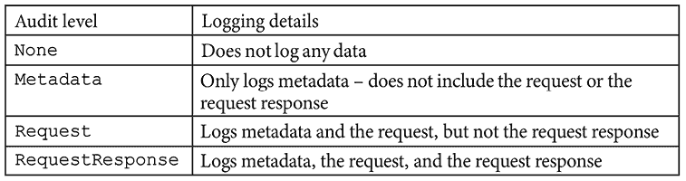

# 第七章：RBAC 策略与审计

身份验证仅是管理集群访问的第一步。一旦授予对集群的访问权限，就需要限制账户的操作权限，具体取决于账户是为自动化系统还是用户所使用。授权访问资源是防止意外问题和恶意行为者滥用集群的重要部分。

本章将详细介绍 Kubernetes 如何通过其 **基于角色的访问控制** (**RBAC**) 模型授权访问。本章的第一部分将深入探讨 Kubernetes RBAC 如何配置、可用的选项以及如何将理论应用于实际示例。调试和故障排除 RBAC 策略将是第二部分的重点。

本章将涵盖以下主题：

+   RBAC 介绍

+   将企业身份映射到 Kubernetes 以授权访问资源

+   实现命名空间多租户

+   Kubernetes 审计

+   使用 `audit2rbac` 来调试策略

完成本章后，你将掌握通过 Kubernetes 的集成 RBAC 模型管理集群访问权限并调试出现问题时的工具。接下来，让我们深入探讨本章的技术要求。

# 技术要求

本章具有以下技术要求：

+   运行 Docker 的 Ubuntu 22.04+ 服务器，至少需要 4 GB 的 RAM，建议使用 8 GB。

+   来自仓库中 `chapter7` 文件夹的脚本，您可以通过访问本书的 GitHub 仓库来获取：[`github.com/PacktPublishing/Kubernetes-An-Enterprise-Guide-Third-Edition`](https://github.com/PacktPublishing/Kubernetes-An-Enterprise-Guide-Third-Edition)

# RBAC 介绍

**RBAC** 代表 **基于角色的访问控制**。它的核心思想是构建权限集，这些权限集被称为 **Role**，以及这些权限适用的主体（用户）列表。在本章中，我们将通过构建角色及其相应的绑定，来构建集群中的权限。

## 什么是 Role？

在 Kubernetes 中，**Role** 是一种将权限绑定到标准化的特定架构对象中的方式。通过将 **Role** 规范化为这种架构，你可以标准化并自动化它们的创建和管理。

角色包含规则，规则是资源和动词的集合。倒推过来，我们有以下内容：

+   **动词**：可以在 API 上执行的操作，例如读取（`get`）、写入（`create`、`update`、`patch` 和 `delete`），或者列出和监视。

+   **资源**：要将动词应用于的 API 名称，例如 `services`、`endpoints` 等。也可以列出特定的子资源，如 `logs` 和 `status`。可以命名特定的资源，以便为对象提供非常具体的权限。

角色并不指定谁可以对资源执行动词——这一点由 `RoleBindings` 和 `ClusterRoleBindings` 处理。我们将在 *RoleBindings 和 ClusterRoleBindings* 部分了解更多内容。

“角色”一词可以有多种含义，RBAC 在其他上下文中也经常使用。在企业界，“角色”一词通常与业务角色相关联，并用来表示该角色的授权，而非某个特定人员。


图 7.1：RBAC 与基于授权的访问控制

例如，在 *图 7.1* 中，一个用户是应付账款角色的成员。作为该角色的成员，自动获得“开支票”的授权。如果该用户的工作变为应收账款，他们的权限会自动发生变化，因为权限与用户的角色相关联。在企业 RBAC 模型中，将用户与“角色”绑定的通常是某种上下文，而不是特定的组成员身份或属性值。例如，用户可能根据他们的“角色”位于公司目录的不同位置。

这与 Kubernetes 使用“角色”一词表示权限列表的方式不同，这些权限并非因为业务角色而绑定在一起，而是基于技术需求。正如我们在学习绑定时将看到的，Kubernetes 角色与账户和组紧密绑定，虽然 `Role` 的权限是为了特定功能而分组的，但该功能的定义低于“企业”角色的技术层次。

现在我们已经区分了“企业”角色的定义与 Kubernetes 中 `Role` 的定义，让我们深入了解如何构建 `Role`。

角色所基于的每个资源通过以下方式标识：

+   `apiGroups`：资源所属的组列表

+   `resources`：资源的对象类型名称（以及可能的子资源）

+   `resourceNames`：应用此规则的特定对象的可选列表

每个规则 *必须* 包含 `apiGroups` 和 `resources` 列表。`resourceNames` 是可选的。

一旦在规则中识别出资源，就可以指定动词。动词是对资源可以执行的操作，它提供对 Kubernetes 中对象的访问。

如果对对象的期望访问是 `all`，则无需添加每个动词；相反，可以使用通配符字符来标识所有的 `verbs`、`resources` 或 `apiGroups`。

## 识别角色

Kubernetes 授权页面（[`kubernetes.io/docs/reference/access-authn-authz/rbac/`](https://kubernetes.io/docs/reference/access-authn-authz/rbac/)）使用以下 `Role` 作为示例，允许某人获取 Pod 的详细信息及其日志：

```
apiVersion: rbac.authorization.k8s.io/v1
kind: Role
metadata:
  namespace: default
  name: pod-and-pod-logs-reader
rules:
- apiGroups: [""]
  resources: ["pods", "pods/log"]
  verbs: ["get", "list"] 
```

在定义`Role`管理什么之前，需要注意的是，`Role`对象是命名空间的，因此`Role`创建所在的`namespace`意味着它定义的权限仅适用于该命名空间。在这个示例中，`Role`仅适用于`default namespace`。

反向推理如何定义此`Role`，我们将从`resources`开始，因为这是最容易找到的部分。Kubernetes 中的所有对象都是通过 URL 表示的。如果你想获取`default` `namespace`中所有 Pod 的信息，你可以调用`/api/v1/namespaces/default/pods` URL；如果你想获取某个特定 Pod 的日志，你可以调用`/api/v1/namespaces/default/pods/mypod/log` URL。

该 URL 模式适用于所有命名空间范围的对象。pods 与`resources`对齐，`pods/log`也一样。当试图识别你想要授权的资源时，可以使用 Kubernetes API 文档中的`api-reference`文档，网址为[`kubernetes.io/docs/reference/#api-reference`](https://kubernetes.io/docs/reference/#api-reference)。

如果你尝试访问对象名称之后的额外路径组件（如 Pod 上的`status`和`logs`），则需要明确授权。授权`Pods`并不会立即授权`logs`或`status`。

基于 URL 映射到`resources`，你接下来的想法可能是`verbs`字段将是 HTTP 动词。但事实并非如此，Kubernetes 中没有`GET`动词。动词是由 API 服务器中的对象模式定义的。好消息是，HTTP 动词和 RBAC 动词之间存在静态映射关系（[`kubernetes.io/docs/reference/access-authn-authz/authorization/#determine-the-request-verb`](https://kubernetes.io/docs/reference/access-authn-authz/authorization/#determine-the-request-verb)）。查看这个 URL，你会注意到除了 HTTP 动词外，还有用于**模拟**的动词。这是因为 RBAC 模型不仅用于授权特定的 API，还用于授权谁可以模拟用户。本章的重点将是标准 HTTP 动词的映射。

最后需要识别的组件是`apiGroups`。API 将属于一个 API 组，而该组将是其 URL 的一部分。你可以通过查看你要授权的对象的 API 文档或使用`kubectl api-resources`命令来找到该组。例如，要获取`Ingress`对象的`apiGroups`，你可以运行：

```
kubectl api-resources -o wide | grep Ingress
ingressclasses networking.k8s.io/v1 false IngressClass [create delete deletecollection get list patch update watch]
ingresses ing networking.k8s.io/v1 true Ingress [create delete deletecollection get list patch update watch] 
```

第二个结果展示了你在`Ingress`对象的 YAML 版本中的`apiVersion`。可以将其用于`apiGroups`，但不包括版本号。要将`Role`应用于`Ingress`对象，`apiGroups`应该是`networking.k8s.io`。

RBAC 模型中的不一致性可能使调试变得困难，至少可以说是这样。本章的最后一个实验将带你逐步走过调试过程，并大大减少定义规则时的猜测。

现在我们已经定义了角色的内容以及如何定义特定权限，重要的是要注意，角色可以在命名空间和集群级别都进行应用。

## 角色与集群角色

RBAC 规则可以作用于特定的命名空间，或者作用于整个集群。以之前的示例为例，如果我们将其定义为 `ClusterRole` 而不是 `Role`，并移除命名空间，那么我们将拥有一个 `Role`，它授权某人查看整个集群中所有 pod 的详细信息和日志。这个新的 `Role` 还可以在各个命名空间中使用，将权限分配给特定命名空间中的 pod：

```
apiVersion: rbac.authorization.k8s.io/v1
kind: ClusterRole
metadata:
  name: cluster-pod-and-pod-logs-reader
rules:
- apiGroups: [""]
  resources: ["pods", "pods/log"]
  verbs: ["get", "list"] 
```

是否将该权限应用于整个集群，还是仅在特定命名空间的范围内应用，取决于它与所适用的主体的绑定方式。这将在 *RoleBindings 和 ClusterRoleBindings* 部分进行介绍。

除了在集群中应用一组规则外，`ClusterRoles` 还用于将规则应用于那些未映射到命名空间的资源，例如 `PersistentVolume` 和 `StorageClass` 对象。

在了解了如何定义 `Role` 之后，接下来让我们探讨为特定目的设计 `Role` 的不同方式。在接下来的部分中，我们将看一下定义 `Role` 的不同模式及其在集群中的应用。

## 负面角色

最常见的授权请求之一是“*我可以写一个角色，允许我做所有事情，除了 xyz*”。在 RBAC 中，答案是*不行*。RBAC 要求要么允许每个资源，要么列举出特定资源和动词。在 RBAC 中有两个原因：

+   **通过简化实现更好的安全性**：能够强制执行一个规则，表示*每个秘密都允许，除了这个*，需要一个比 RBAC 提供的更复杂的评估引擎。引擎越复杂，测试和验证就越难，且更容易出错。一个更简单的引擎在编写和保持安全性方面要简单得多。

+   **意外后果**：允许某人做所有事情*除了* xyz，会在集群增长并添加新功能时，以意想不到的方式打开出现问题的大门。

首先，具有这种能力的引擎既难以构建也难以维护。同时，它也使得规则的追踪变得更加困难。为了表达这种类型的规则，你不仅需要有授权规则，还需要对这些规则进行排序。例如，要表达*我想允许所有内容，除了这个秘密*，你首先需要一个规则来表示*允许一切*，然后再有一个规则表示*拒绝这个秘密*。如果你将规则顺序调换，变成*拒绝这个秘密*，再*允许一切*，那么第一个规则就会被覆盖。你可以为不同的规则分配优先级，但这会让它变得更加复杂。

有几种方法可以实现这种模式，要么通过使用自定义授权 webhook，要么通过使用控制器动态生成 RBAC `Role` 对象。这两种方法都应被视为安全反模式，因此在本章中不会进行讲解。

第二点涉及到意外后果。支持使用操作员模式支持不是 Kubernetes 的基础设施的配置正变得越来越普遍，其中自定义控制器寻找新的 **CustomResourceDefinition** (**CRD**) 的实例来配置基础设施，例如数据库。

亚马逊网络服务为此目的发布了一个操作员（[`github.com/aws/aws-controllers-k8s`](https://github.com/aws/aws-controllers-k8s)）。这些操作员在其自己的命名空间中以其云的管理凭据运行，以查找其对象的新实例以供资源配给。如果您的安全模型允许“除了…”之外的所有内容，那么一旦部署，您集群中的任何人都可以配置具有实际成本并可能创建安全漏洞的云资源。从安全角度来看，列举您的资源是了解正在运行的内容及其访问权限的重要部分。

Kubernetes 集群的趋势是通过自定义资源 API 在集群外部提供对基础设施的更多控制。您可以为任何类型的 API 驱动的云基础设施提供从虚拟机到额外节点的任何内容的资源配给。除了 RBAC 之外，还有其他工具可以用来减轻某人可能创建不应有的资源的风险，但这些工具应作为辅助措施。

到目前为止，我们已经看到如何为特定用例创建权限。如果您需要某些灵活性，以能够动态定义权限而不是我们现在提供的静态列表，那么接下来我们将发现如何使用聚合的 `ClusterRoles` 提供权限列表的动态方法。

## 聚合的 ClusterRoles

`ClusterRoles` 很快就会变得混乱并且难以维护。最好将它们拆分成更小的 `ClusterRoles`，以便根据需要进行组合。以 `admin` `ClusterRole` 为例，旨在允许某人在特定命名空间内执行几乎任何操作。当我们查看 `admin` `ClusterRole` 时，它列举了几乎所有的资源。你可能会认为有人编写了这个 `ClusterRole`，以便它包含所有这些资源，但那样做效率非常低，而且当新的资源类型添加到 Kubernetes 时会发生什么呢？`admin` `ClusterRole` 是一个聚合的 `ClusterRole`。看一看 `ClusterRole`：

```
kind: ClusterRole
apiVersion: rbac.authorization.k8s.io/v1
metadata:
  name: admin
  labels:
    kubernetes.io/bootstrapping: rbac-defaults
  annotations:
    rbac.authorization.kubernetes.io/autoupdate: 'true'
rules:
.
.
.
aggregationRule:
  clusterRoleSelectors:
    - matchLabels:
        rbac.authorization.k8s.io/aggregate-to-admin: 'true' 
```

关键在于 `aggregationRule` 部分。此部分告诉 Kubernetes 将所有带有 `rbac.authorization.k8s.io/aggregate-to-admin` 标签为 `true` 的 `ClusterRoles` 的规则结合起来。当创建新的 CRD 时，管理员无法创建该 CRD 的实例，除非添加包含此标签的新的 `ClusterRole`。为允许命名空间管理员用户创建新的 `myapi/superwidget` 对象的实例，请创建一个新的 `ClusterRole`：

```
apiVersion: rbac.authorization.k8s.io/v1
kind: ClusterRole
metadata:
  name: aggregate-superwidget-admin
  labels:
    # Add these permissions to the "admin" default role.
    rbac.authorization.k8s.io/aggregate-to-admin: "true"
rules:
- apiGroups: ["myapi"]
  resources: ["superwidgets"]
  verbs: ["get", "list", "watch", "create", "update", "patch", "delete"] 
```

下次查看 `admin` `ClusterRole` 时，它将包括 `myapi/superwidgets`。您还可以直接引用此 `ClusterRole` 获取更具体的权限。

到目前为止，我们一直专注于通过`Roles`和`ClusterRoles`创建权限列表。接下来，我们将研究如何将这些权限分配给用户和服务。

## RoleBindings 和 ClusterRoleBindings

一旦定义了权限，就需要将其分配给某个对象才能启用。“某个对象”可以是用户、组或服务帐户。这些选项称为**主体**。与`Roles`和`ClusterRoles`一样，`RoleBinding`将`Role`或`ClusterRole`绑定到特定的命名空间，而`ClusterRoleBinding`则在整个集群中应用`ClusterRole`。一个绑定可以有多个主体，但只能引用一个`Role`或`ClusterRole`。为了将本章前面创建的`pod-and-pod-logs-reader` `Role`分配给默认命名空间中的服务帐户`mysa`、名为`podreader`的用户或任何属于`podreaders`组的人，可以创建一个`RoleBinding`：

```
apiVersion: rbac.authorization.k8s.io/v1
kind: RoleBinding
metadata:
  name: pod-and-pod-logs-reader
  namespace: default
subjects:
- kind: ServiceAccount
  name: mysa
  namespace: default
  apiGroup: rbac.authorization.k8s.io
- kind: User
  name: podreader
- kind: Group
  name: podreaders
roleRef:
  kind: Role
  name: pod-and-pod-logs-reader
  apiGroup: rbac.authorization.k8s.io 
```

前面的`RoleBinding`列出了三个不同的主体：

+   `ServiceAccount`：集群中的任何服务帐户都可以被授权到`RoleBinding`。必须包括命名空间，因为`RoleBinding`可以在任何命名空间中授权服务帐户，而不仅仅是定义`RoleBinding`的命名空间。

+   `User`：用户是通过认证过程确认的。请记住，在*第六章*，*将认证集成到集群中*中提到，Kubernetes 中没有表示用户的对象。

+   `Group`：与用户一样，组是作为认证过程的一部分进行确认的，也没有与之关联的对象。

最后，引用了我们之前创建的`Role`。以类似的方式，为了为相同的主体赋予跨集群读取 pod 及其日志的能力，可以创建一个`ClusterRoleBinding`来引用本章前面创建的`cluster-pod-and-pod-logs-reader` `ClusterRole`：

```
apiVersion: rbac.authorization.k8s.io/v1
kind: ClusterRoleBinding
metadata:
  name: cluster-pod-and-pod-logs-reader
subjects:
- kind: ServiceAccount
  name: mysa
  namespace: default
  apiGroup: rbac.authorization.k8s.io
- kind: User
  name: podreader
- kind: Group
  name: podreaders
roleRef:
  kind: ClusterRole
  name: cluster-pod-and-pod-logs-reader
  apiGroup: rbac.authorization.k8s.io 
```

`ClusterRoleBinding`绑定到相同的主体，但绑定的是`ClusterRole`而不是命名空间绑定的`Role`。现在，这些用户可以读取所有命名空间中的所有 pod 详细信息和`Pod/logs`，而不仅仅是默认命名空间中的 pod 详细信息和`Pod/logs`。

到目前为止，我们的重点一直是在将`Role`与`RoleBinding`和`ClusterRole`与`ClusterRoleBinding`结合。如果你想定义作用于多个命名空间的相同权限，你需要一种方法来做到这一点，而不必每次都重复创建相同的`Role`。接下来，我们将介绍如何通过结合`ClusterRoles`和`RoleBindings`来简化`Role`管理。

### 合并 ClusterRoles 和 RoleBindings

我们有一个用例，日志聚合器希望从多个命名空间的 pod 中提取日志，但并非所有命名空间都需要。这时`ClusterRoleBinding`过于宽泛。虽然可以在每个命名空间中重新创建`Role`，但这种做法效率低下且维护困难。相反，定义一个`ClusterRole`，并在适用的命名空间中通过`RoleBinding`引用它。这样可以重用权限定义，同时将这些权限应用到特定命名空间。通常，注意以下几点：

+   `ClusterRole` + `ClusterRoleBinding` = 集群级别的权限

+   `ClusterRole` + `RoleBinding` = 命名空间特定权限

若要在特定命名空间中应用我们的`ClusterRoleBinding`，需要创建一个`Role`，引用`ClusterRole`而不是命名空间特定的`Role`对象：

```
apiVersion: rbac.authorization.k8s.io/v1
kind: RoleBinding
metadata:
  name: pod-and-pod-logs-reader
  namespace: default
subjects:
- kind: ServiceAccount
  name: mysa
  namespace: default
  apiGroup: rbac.authorization.k8s.io
- kind: User
  name: podreader
- kind: Group
  name: podreaders
roleRef:
  kind: ClusterRole
  name: cluster-pod-and-pod-logs-reader
  apiGroup: rbac.authorization.k8s.io 
```

上述的`RoleBinding`让我们可以重用现有的`ClusterRole`。这样减少了需要在集群中跟踪的对象数量，也便于在需要更改`ClusterRole`权限时更新集群中的权限。

在构建了我们的权限并定义了如何分配之后，接下来我们将看看如何将企业身份映射到集群策略中。

# 将企业身份映射到 Kubernetes 中以授权访问资源

集中化身份验证的一个好处是利用企业现有的身份，而无需创建用户与集群交互时需要记住的新凭证。了解如何将策略映射到这些集中化用户非常重要。在*第六章*，*将身份验证集成到集群中*中，你创建了一个集群，并将其与“企业**Active Directory**”进行了集成。为了完成集成，创建了以下`ClusterRoleBinding`：

```
apiVersion: rbac.authorization.k8s.io/v1
kind: ClusterRoleBinding
metadata:
  name: ou-cluster-admins
subjects:
- kind: Group
  name: cn=k8s-cluster-admins,ou=Groups,DC=domain,DC=com
  apiGroup: rbac.authorization.k8s.io
roleRef:
  kind: ClusterRole
  name: cluster-admin
  apiGroup: rbac.authorization.k8s.io 
```

这个绑定允许所有属于`cn=k8s-cluster-admins,ou=Groups,DC=domain,DC=com`组的用户拥有完整的集群访问权限。当时，重点是身份验证，因此没有提供关于为什么创建这个绑定的很多细节。

如果我们想直接授权给我们的用户怎么办？那样，我们就能控制谁可以访问我们的集群。我们的 RBAC `ClusterRoleBinding` 将会有所不同：

```
apiVersion: rbac.authorization.k8s.io/v1
kind: ClusterRoleBinding
metadata:
  name: ou-cluster-admins
subjects:
- kind: User
  name: https://k8sou.apps.192-168-2-131.nip.io/auth/idp/k8sIdp#mmosley
  apiGroup: rbac.authorization.k8s.io
roleRef:
  kind: ClusterRole
  name: cluster-admin
  apiGroup: rbac.authorization.k8s.io 
```

使用与之前相同的`ClusterRole`，这个`ClusterRoleBinding`将只会赋予我的测试用户`cluster-admin`权限。

第一个需要指出的问题是，用户的用户名前面有我们**OpenID Connect**发行者的 URL。当 OpenID Connect 最初被引入时，认为 Kubernetes 会与多个身份提供者以及不同类型的身份提供者集成，因此开发者希望你能够轻松地区分来自不同身份源的用户。例如，域 1 中的 `mmosley` 与域 2 中的 `mmosley` 是不同的用户。为了确保用户身份不会与跨身份提供者的其他用户冲突，Kubernetes 要求身份提供者的发行者 URL 被添加到用户名的前面。如果你在 API 服务器标志中定义的用户名声明是 `mail`，则此规则不适用。如果你使用的是证书或模拟身份，也不适用。

除了不一致的实现要求外，这种方法可能在几个方面引发问题：

+   **更改身份提供者 URL**：今天，你正在使用某个身份提供者的一个 URL，但明天你决定更换它。现在，你需要遍历每个`ClusterRoleBinding`并更新它们。

+   **审计**：你无法查询与某个用户关联的所有 `RoleBindings`。你需要枚举每个绑定。

+   **大规模绑定**：根据用户数量的不同，绑定可能变得非常庞大，难以追踪。

尽管有工具可以帮助你管理这些问题，但将绑定与组关联，而不是与单个用户关联，会更容易一些。你可以使用 `mail` 属性来避免 URL 前缀，但这被视为一种反模式，如果因为任何原因更改了电子邮件地址，将导致集群出现同样复杂的问题。

到目前为止，我们已经学习了如何定义访问策略并将这些策略映射到企业用户。接下来，我们需要确定如何将集群划分为租户。

# 实现命名空间多租户

部署给多个利益相关者或租户的集群应该按命名空间进行划分。这是 Kubernetes 从一开始就设计的边界。在部署命名空间时，通常会为命名空间中的用户分配两个 `ClusterRoles`：

+   `admin`：这个聚合型 `ClusterRole` 提供对 Kubernetes 附带的几乎所有资源和操作的访问权限，使得 `admin` 用户成为其命名空间的管理者。唯一的例外是任何可能影响整个集群的命名空间范围对象，例如 `ResourceQuotas`。

+   `edit`：与 `admin` 类似，但没有创建 RBAC `Roles` 或 `RoleBindings` 的权限。

需要注意的是，`admin` `ClusterRole` 本身无法对命名空间对象进行更改。命名空间是集群范围的资源，因此只能通过 `ClusterRoleBinding` 来分配权限。

根据你的多租户策略，`admin` `ClusterRole` 可能不合适。生成 RBAC `Role` 和 `RoleBinding` 对象的能力意味着命名空间管理员可能会授予自己更改资源配额的权限。这是 RBAC 往往崩溃的地方，并需要一些额外的选项：

+   **不要授予 Kubernetes 访问权限**：许多集群拥有者希望将 Kubernetes 排除在用户之外，并限制用户与外部 CI/CD 工具的交互。这对于微服务非常有效，但在多个线路上开始变得不太适用。首先，将更多传统应用迁移到 Kubernetes 意味着更多传统管理员需要直接访问其命名空间。其次，如果 Kubernetes 团队将用户排除在集群之外，那么他们就需要为此负责。拥有 Kubernetes 的人可能不希望成为应用程序所有者不满的原因，而且通常，应用程序所有者希望能够控制自己的基础设施，以确保他们能够处理任何影响其性能的情况。

+   **将访问视为特权**：大多数企业要求特权用户访问基础设施。这通常通过特权访问模型来实现，其中管理员拥有一个独立账户，该账户需要“签出”后才能使用，并且只有在某些时刻获得授权，通常是由“变更委员会”或流程批准。这些账户的使用会受到严格监控。如果你已经有一个现成的系统，特别是与企业的中央认证系统集成的系统，这种方法是非常好的。

+   **为每个租户提供一个集群**：此模型将多租户管理从集群层移至基础设施层。你并没有消除问题，只是将其处理的位置进行了更改。这可能导致管理上的扩展，变得难以控制，并且根据你实施 Kubernetes 的方式，成本可能会迅速飙升。在*第九章*，*使用 vClusters 构建多租户集群*中，我们将探讨如何为每个租户提供独立的集群，而不必过多担心扩展问题。

+   **准入控制器**：这些增强了 RBAC，通过限制可以创建的对象。例如，准入控制器可以决定阻止创建一个 RBAC 策略，即使 RBAC 明确允许创建该策略。这个话题将在*第十一章*，*使用开放策略代理扩展安全性*中进行讨论。

除了授权访问命名空间和资源外，多租户解决方案还需要知道如何为租户提供服务。这个话题将在最后几章中讨论——*第十八章*，*为多租户平台提供服务*，以及*第十九章*，*构建开发者门户*。

现在我们已经有了实施授权策略的策略，接下来我们需要一种方法来调试这些策略，并且要知道这些策略何时被违反。Kubernetes 提供了审计功能，接下来的部分将重点介绍此功能，我们将向 KinD 集群添加审计日志，并调试 RBAC 策略的实施。

# Kubernetes 审计

Kubernetes 审计日志是你从 API 角度追踪集群活动的地方。它采用 JSON 格式，直接读取较为困难，但使用像 OpenSearch 这样的工具进行解析则更加容易。在 *第十五章*，*管理集群与工作负载* 中，我们将介绍如何使用 **OpenSearch** 堆栈创建一个完整的日志记录系统。

## 创建审计策略

策略文件用于控制记录哪些事件以及将日志存储在哪里，可以是标准日志文件或 webhook。我们在 GitHub 仓库的 `chapter7` 目录中包含了一个示例审计策略，接下来我们会将其应用于我们在全书中使用的 KinD 集群。

**审计策略** 是一组规则，告诉 API 服务器哪些 API 调用需要记录以及如何记录。当 Kubernetes 解析策略文件时，所有规则按顺序应用，并且只会应用第一个匹配的策略事件。如果你为某个事件设置了多个规则，可能不会在日志文件中收到预期的数据。因此，你需要小心确保事件创建正确。

策略使用 `audit.k8s.io` API 和 `Policy` 清单类型。以下示例展示了策略文件的开始部分：

```
apiVersion: audit.k8s.io/v1
kind: Policy
rules:
  - level: Request
    userGroups: ["system:nodes"]
    verbs: ["update","patch"]
    resources:
      - group: "" # core
        resources: ["nodes/status", "pods/status"]
    omitStages:
      - "RequestReceived" 
```

虽然策略文件看起来像是一个标准的 Kubernetes 清单，但你不能使用 `kubectl` 应用它。策略文件是与 API 服务器使用 `--audit-policy-file` API 标志一起应用的。这将在 *启用集群审计* 部分中解释。

为了理解规则及其日志记录内容，我们将详细讲解每个部分。

规则的第一部分是 `level`，它决定了事件将记录哪些类型的信息。事件可以分配四个级别：



表 7.1：Kubernetes 审计级别

`userGroups`、`verbs` 和 `resources` 的值告诉 API 服务器哪个对象和操作会触发审计事件。在这个示例中，只有来自 `system:nodes` 的请求，并且尝试对 `core` API 上的 `node/status` 或 `pod/status` 执行 `update` 或 `patch` 操作时，才会创建事件。

`omitStages` 告诉 API 服务器跳过在某个阶段的日志记录事件，这有助于你限制日志记录的数据量。API 请求经过四个阶段：


表 7.2：审计阶段

在我们的示例中，我们设置了事件来忽略`RequestReceived`事件，这告诉 API 服务器不要记录任何传入 API 请求的数据。

每个组织都有自己的审计策略，策略文件可能变得又长又复杂。在你掌握可以创建哪些类型事件之前，不要害怕设置一个记录所有内容的策略。记录所有内容并不是一个好的实践，因为日志文件会变得非常大。即使将日志推送到外部系统，如 **OpenSearch**，在处理和管理方面依然会有成本。微调审计策略是一项需要随着时间积累经验才能掌握的技能，随着你对 API 服务器了解的深入，你将逐渐学会哪些事件最值得审计。

策略文件只是启用集群审计的起点，现在我们已经理解了策略文件，接下来让我们解释如何在集群上启用审计。

## 在集群上启用审计

启用审计是 Kubernetes 每个发行版特有的。在本节中，我们将启用 KinD 中的审计日志，以便了解底层步骤。快速回顾一下，上一章的最终成果是启用了模拟的 KinD 集群（而不是直接与 OpenID Connect 集成）。本章中其余的步骤和示例假设我们使用的是这个集群。从一个新的集群开始，并在 *第六章* 中使用模拟部署 **OpenUnison**：

```
cd Kubernetes-An-Enterprise-Guide-Third-Edition/chapter2
kind delete cluster -n cluster01
./create-cluster.sh
cd  ../chapter6/user-auth
./deploy_openunison_imp_impersonation.sh 
```

接下来，我们将配置 API 服务器将审计日志数据发送到文件中。这比设置一个开关更复杂，因为 KinD 所依赖的安装程序 kubeadm 将 API 服务器作为静态 Pod(s) 运行。API 服务器是 Kubernetes 内部的一个容器！这意味着，为了让我们告诉 API 服务器将日志数据写入哪里，我们首先必须有一个存储位置，然后配置 API 服务器的 Pod 将该位置用作卷。我们将手动演练这个过程，以便让你熟悉修改 API 服务器上下文的操作。

你可以手动按照本节中的步骤操作，或者可以执行 GitHub 仓库中 `chapter7` 目录下的包含脚本 `enable-auditing.sh`：

1.  首先，将示例审计策略从 `chapter7` 目录复制到 API 服务器：

    ```
    $ cd chapter7
    $ docker exec -ti cluster01-control-plane mkdir /etc/kubernetes/audit
    $ docker cp cm/k8s-audit-policy.yaml cluster01-control-plane:/etc/kubernetes/audit/ 
    ```

1.  接下来，在 API 服务器上创建存储审计日志和策略配置的目录。由于我们需要在下一步中修改 API 服务器文件，因此我们将 `exec` 进入容器：

    ```
    $ docker exec -ti cluster01-control-plane mkdir /var/log/k8s 
    ```

到目前为止，你已经在 API 服务器上配置了审计策略，并且可以启用 API 选项以使用该文件。

1.  在 API 服务器上，编辑 `kubeadm` 配置文件（你需要安装一个编辑器，如 vi，通过运行 `apt-get update; apt-get install vim`），文件路径为 `/etc/kubernetes/manifests/kube-apiserver.yaml`，这也是我们之前为了启用 OpenID Connect 而更新的文件。为了启用审计，我们需要添加三个值。

需要注意的是，许多 Kubernetes 集群可能只需要文件和 API 选项。由于我们使用 KinD 集群进行测试，所以我们需要第二步和第三步。

首先，为 API 服务器添加启用审计日志的**命令行标志**。除了策略文件外，我们还可以添加选项来控制日志文件的轮换、保留和最大大小：

```
- --tls-private-key-file=/etc/kubernetes/pki/apiserver.key
**-****--audit-log-path=/var/log/k8s/audit.log**
**-****--audit-log-maxage=1**
**-****--audit-log-maxbackup=10**
**-****--audit-log-maxsize=10**
**-****--audit-policy-file=/etc/kubernetes/audit/k8s-audit-policy.yaml** 
```

请注意，选项指向的是您在上一步复制的策略文件。

1.  接下来，将**存储策略配置和生成日志的目录**添加到`volumeMounts`部分：

    ```
    - mountPath: /usr/share/ca-certificates
      name: usr-share-ca-certificates
      readOnly: true
    **-****mountPath:****/var/log/k8s**
    **name:****var-log-k8s**
    **readOnly:****false**
    **-****mountPath:****/etc/kubernetes/audit**
    **name:****etc-kubernetes-audit**
    **readOnly:****true** 
    ```

1.  最后，将**hostPath**配置添加到`volumes`部分，以便 Kubernetes 知道在哪里挂载本地路径：

    ```
     - hostPath:
          path: /usr/share/ca-certificates
          type: DirectoryOrCreate
        name: usr-share-ca-certificates
    **-****hostPath:**
    **path:****/var/log/k8s**
    **type:****DirectoryOrCreate**
    **name:****var-log-k8s**
    **-****hostPath:**
    **path:****/etc/kubernetes/audit**
    **type:****DirectoryOrCreate**
    **name:****etc-kubernetes-audit** 
    ```

1.  保存并退出文件。

1.  与所有 API 选项更改一样，您需要重启 API 服务器以使更改生效；然而，KinD 会检测到文件已更改，并自动重启 API 服务器的 Pod。

退出附加的 Shell 并检查`kube-system`命名空间中的 Pod：

```
$ kubectl get pod kube-apiserver-cluster01-control-plane -n kube-system
NAME                                     READY   STATUS       RESTARTS   AGE
kube-apiserver-cluster01-control-plane   1/1     Running      0          47s 
```

API 服务器被突出显示，表明它仅运行了 47 秒，显示其成功重启。

验证 API 服务器正在运行后，让我们查看审计日志，以确认其正常工作。要检查日志，您可以使用`docker exec`命令来查看`audit.log`：

```
$ docker exec cluster01-control-plane  tail /var/log/k8s/audit.log 
```

该命令生成以下日志数据：

```
{"kind":"Event","apiVersion":"audit.k8s.io/v1","level":"Metadata","auditID":"451ddf5d-763c-4d7c-9d89-7afc6232e2dc","stage":"ResponseComplete","requestURI":"/apis/discovery.k8s.io/v1/namespaces/default/endpointslices/kubernetes","verb":"get","user":{"username":"system:apiserver","uid":"7e02462c-26d1-4349-92ec-edf46af2ab31","groups":["system:masters"]},"sourceIPs":["::1"],"userAgent":"kube-apiserver/v1.21.1 (linux/amd64) kubernetes/5e58841","objectRef":{"resource":"endpointslices","namespace":"default","name":"kubernetes","apiGroup":"discovery.k8s.io","apiVersion":"v1"},"responseStatus":{"metadata":{},"code":200},"requestReceivedTimestamp":"2021-07-12T08:53:55.345776Z","stageTimestamp":"2021-07-12T08:53:55.365609Z","annotations":{"authorization.k8s.io/decision":"allow","authorization.k8s.io/reason":""}} 
```

这个 JSON 中有很多信息，直接查看日志文件很难找到特定事件。幸运的是，现在您已经启用了审计，可以将事件转发到中央日志服务器。我们将在*第十五章*，*使用 Prometheus 监控集群和工作负载*中做到这一点，在那里我们将部署**EFK**堆栈。

现在我们已经启用了审计，下一步是练习调试 RBAC 策略。

# 使用 audit2rbac 调试策略

有一个工具叫做`audit2rbac`，可以将审计日志中的错误逆向工程为 RBAC 策略对象。在本节中，我们将使用该工具生成一个 RBAC 策略，因为我们发现我们的一个用户无法执行他们需要做的操作。这是一个典型的 RBAC 调试过程，学习如何使用该工具可以节省您数小时的时间来隔离 RBAC 问题：

1.  在前一章中，我们创建了一个通用的 RBAC 策略，允许`cn=k8s-cluster-admins,ou=Groups,DC=domain,DC=com`组的所有成员成为我们集群的管理员。如果您已经登录到 OpenUnison，请退出登录。

1.  现在，使用用户名`jjackson`和密码`start123`重新登录。

1.  接下来，点击**登录**。登录后，转到仪表板。就像 OpenUnison 首次部署时一样，由于集群管理员的 RBAC 策略不再适用，您将不会看到任何命名空间或其他信息。

1.  接下来，从令牌屏幕中复制您的`kubectl`配置，并确保将其粘贴到不是主 KinD 终端的窗口中，以免覆盖主配置。

1.  一旦您的令牌设置完成，尝试创建一个名为`not-going-to-work`的命名空间：

    ```
    PS C:\Users\mlb> kubectl create ns not-going-to-work
    Error from server (Forbidden): namespaces is forbidden: User "jjackson" cannot create resource "namespaces" in API group "" at the cluster scope 
    ```

这里有足够的信息可以反向推断出一个 RBAC 策略。

1.  为了消除此错误消息，请使用您的 KinD 管理员用户创建一个包含`"namespaces"`资源、`apiGroups`设置为`""`、操作符为`"create"`的`ClusterRole`：

    ```
    apiVersion: rbac.authorization.k8s.io/v1
    kind: ClusterRole
    metadata:
      name: cluster-create-ns
    rules:
    - apiGroups: [""]
      resources: ["namespaces"]
      verbs: ["create"] 
    ```

1.  接下来，为用户和此`ClusterRole`创建一个`ClusterRoleBinding`：

    ```
    apiVersion: rbac.authorization.k8s.io/v1
    kind: ClusterRoleBinding
    metadata:
      name: cluster-create-ns
    subjects:
    - kind: User
      name: jjackson
      apiGroup: rbac.authorization.k8s.io
    roleRef:
      kind: ClusterRole
      name: cluster-create-ns
      apiGroup: rbac.authorization.k8s.io 
    ```

1.  一旦`ClusterRole`和`ClusterRoleBinding`创建完成，再次运行命令，它就会成功：

    ```
    PS C:\Users\mlb> kubectl create ns not-going-to-work
    namespace/not-going-to-work created 
    ```

不幸的是，这可能不是大多数 RBAC 调试的常见方式。大多数情况下，调试 RBAC 不会这么清晰或简单。通常，调试 RBAC 意味着系统之间会出现意外的错误消息。例如，如果您正在部署用于监控的`kube-prometheus`项目，通常希望通过`Service`对象进行监控，而不是明确列出 Pod。为了实现这一点，Prometheus 的`ServiceAccount`需要能够列出您希望监控的服务所在命名空间中的`Service`对象。Prometheus 不会告诉您需要进行此操作；您只是看不到列出的服务。调试的更好方法是使用一个可以读取审计日志并基于日志中的失败反向推断出角色和绑定的工具。

`audit2rbac`工具是执行此操作的最佳方式。它会读取审计日志，并为您提供一组有效的策略。这些策略可能不是完全需要的策略，但它将提供一个很好的起点。让我们试试看：

1.  首先，连接到您集群的`control-plane`容器，并从 GitHub 下载该工具（[`github.com/liggitt/audit2rbac/releases`](https://github.com/liggitt/audit2rbac/releases)）：

    ```
    root@cluster01-control-plane:/# curl -L https://github.com/liggitt/audit2rbac/releases/download/v0.8.0/audit2rbac-linux-amd64.tar.gz 2>/dev/null > audit2rbac-linux-amd64.tar.gz
    root@cluster01-control-plane:/# tar -xvzf audit2rbac-linux-amd64.tar.gz 
    ```

1.  使用该工具之前，请确保关闭包含 Kubernetes 仪表板的浏览器，以避免污染日志。另外，删除之前创建的`cluster-create-ns` `ClusterRole`和`ClusterRoleBinding`。最后，尝试创建`still-not-going-to-work`命名空间：

    ```
    PS C:\Users\mlb> kubectl create ns still-not-going-to-work
    Error from server (Forbidden): namespaces is forbidden: User "jjackson" cannot create resource "namespaces" in API group "" at the cluster scope 
    ```

1.  接下来，使用`audit2rbac`工具检查您的测试用户是否存在任何失败：

    ```
    root@cluster01-control-plane:/# ./audit2rbac --filename=/var/log/k8s/audit.log  --user=jjackson
    Opening audit source...
    Loading events...
    Evaluating API calls...
    Generating roles...
    apiVersion: rbac.authorization.k8s.io/v1
    kind: ClusterRole
    metadata:
      annotations:
        audit2rbac.liggitt.net/version: v0.8.0
      labels:
        audit2rbac.liggitt.net/generated: "true"     audit2rbac.liggitt.net/user: jjackson
      name: audit2rbac:jjackson
    rules:
    - apiGroups:
      - ""   resources:
      - namespaces
      verbs:
      - create
    ---
    apiVersion: rbac.authorization.k8s.io/v1
    kind: ClusterRoleBinding
    metadata:
      annotations:
        audit2rbac.liggitt.net/version: v0.8.0
      labels:
        audit2rbac.liggitt.net/generated: "true"     audit2rbac.liggitt.net/user: jjackson
      name: audit2rbac:jjackson
    roleRef:|
      apiGroup: rbac.authorization.k8s.io
      kind: ClusterRole|
      name: audit2rbac:jjackson
    subjects:
    - apiGroup: rbac.authorization.k8s.io
      kind: User
      name: jjackson
    Complete! 
    ```

1.  此命令生成的策略将允许测试用户创建命名空间。然而，这变成了一种反模式，明确授权用户访问权限。

1.  为了更好地利用这个策略，最好使用我们的组：

    ```
    apiVersion: rbac.authorization.k8s.io/v1
    kind: ClusterRole
    metadata:
      name: create-ns-audit2rbac
    rules:
    - apiGroups:
      - ""
      resources:
      - namespaces
      verbs:
      - create
    ---
    apiVersion: rbac.authorization.k8s.io/v1
    kind: ClusterRoleBinding
    metadata:
      name: create-ns-audit2rbac
    roleRef:
      apiGroup: rbac.authorization.k8s.io
      kind: ClusterRole
      name: create-ns-audit2rbac
    subjects:
    - apiGroup: rbac.authorization.k8s.io
      kind: Group
      name: cn=k8s-create-ns,ou=Groups,DC=domain,DC=com 
    ```

主要的变化已经突出显示。现在，`ClusterRoleBinding`不再直接引用用户，而是引用了`cn=k8s-create-ns,ou=Groups,DC=domain,DC=com`组，这样该组的任何成员现在都可以创建命名空间。

# 总结

本章的重点是**RBAC**策略创建和调试。我们探讨了 Kubernetes 如何定义授权策略以及如何将这些策略应用于企业用户。我们还了解了这些策略如何帮助在集群中实现多租户功能。最后，我们在 KinD 集群中启用了审计日志，并学习了如何使用`audit2rbac`工具来调试 RBAC 问题。

使用 Kubernetes 内建的 RBAC 策略管理对象可以让你启用集群中进行操作和开发所需的访问权限。了解如何设计策略有助于限制问题的影响，增强让用户自主完成更多工作的信心。

在下一章，*第八章*，*管理秘密*，我们将学习 Kubernetes 如何管理秘密数据，以及如何使用 HashiCorp Vault 和 External Secrets Operator 将外部秘密集成到集群中。

# 问题

1.  对错 – ABAC 是授权访问 Kubernetes 集群的首选方法。

    1.  正确

    1.  错误

1.  `Role`的三个组成部分是什么？

    1.  主语、名词和动词

    1.  资源、操作和组

    1.  `apiGroups`、资源和动词

    1.  组、资源和子资源

1.  你可以去哪里查找资源信息？

    1.  Kubernetes API 参考

    1.  图书馆

    1.  教程和博客文章

1.  如何在命名空间之间重用`Roles`？

    1.  你不能；你需要重新创建它们。

    1.  定义一个`ClusterRole`并在每个命名空间中通过`RoleBinding`引用它。

    1.  在一个命名空间中引用`Role`，通过其他命名空间的`RoleBindings`进行引用。

    1.  以上都不是。

1.  绑定应该如何引用用户？

    1.  直接列出每个用户。

    1.  `RoleBindings`应该仅引用服务账户。

    1.  只有`ClusterRoleBindings`应该引用用户。

    1.  在可能的情况下，`RoleBindings`和`ClusterRoleBindings`应该引用组。

1.  对错 – RBAC 可以授权访问除了一个资源外的所有资源。

    1.  正确

    1.  错误

1.  对错 – RBAC 是 Kubernetes 中唯一的授权方法。

    1.  正确

    1.  错误

# 答案

1.  a: 错误

1.  b: 资源、操作和组

1.  a: Kubernetes API 参考

1.  b: 定义一个`ClusterRole`并在每个命名空间中通过`RoleBinding`引用它。

1.  d: 在可能的情况下，`RoleBindings`和`ClusterRoleBindings`应该引用组。

1.  b: 错误

1.  b: 错误

# 加入我们书籍的 Discord 空间

加入本书的 Discord 工作区，参加每月与作者的*问我任何问题*环节：

[`packt.link/K8EntGuide`](https://packt.link/K8EntGuide)


