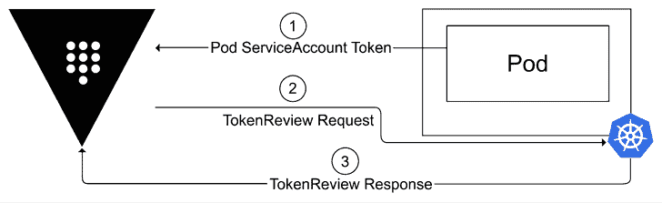

# 8

# 管理机密

每个人都有秘密，Kubernetes 集群也不例外。**机密**可以用于存储连接数据库的凭据、加密或身份验证的私钥，或任何其他被认为是机密的信息。在本章中，我们将探讨为何机密数据需要与其他配置数据以不同方式处理，如何对集群的机密进行威胁建模，以及如何将外部机密管理器集成到您的集群中。

在*第六章*《将身份验证集成到您的集群》中，我们为**OpenUnison**创建了一些机密。这些机密是简单的 Kubernetes 对象，并没有与其他配置数据有所不同地处理。这使得我们很难遵循常见的企业机密数据要求，例如定期轮换和使用情况跟踪。了解企业为什么通常有这些要求，以及如何实施这些要求，非常重要。同时，也要能够从现实角度进行威胁建模，并避免通过试图提高安全性而创建安全漏洞。

本章将介绍为何需要将机密数据与其他配置数据区别对待，并提供您所需的工具，以确定您的机密管理需求并构建您的机密管理平台。我们将涵盖：

+   检查机密与配置数据之间的区别

+   了解机密管理器

+   将机密集成到您的部署中

# 技术要求

本章具有以下技术要求：

+   一台运行 Docker 的 Ubuntu 22.04+服务器，至少需要 4 GB 内存，建议 8 GB 内存

+   从`chapter8`文件夹中的脚本，您可以通过访问本书的 GitHub 仓库来获取：[`github.com/PacktPublishing/Kubernetes-An-Enterprise-Guide-Third-Edition`](https://github.com/PacktPublishing/Kubernetes-An-Enterprise-Guide-Third-Edition)

# 获取帮助

我们尽力测试所有内容，但在我们的集成实验室中，有时会有六个或更多系统。鉴于技术的流动性，有时候在我们的环境中有效的东西在您的环境中可能不起作用。别担心，我们在这里帮忙！在我们的 GitHub 仓库上打开一个问题：[`github.com/PacktPublishing/Kubernetes-An-Enterprise-Guide-Third-Edition/issues`](https://github.com/PacktPublishing/Kubernetes-An-Enterprise-Guide-Third-Edition/issues)，我们将很乐意为您提供帮助！

# 检查机密与配置数据之间的区别

什么使得`Secret`与存储在`ConfigMap`或**CRD**中的配置数据不同？从 Kubernetes 的角度来看，唯一的实际区别是，`ConfigMap`和 CRD 都表示为文本，而`Secret`则表示为**base64**编码的字符串，这使得机密可以包含二进制数据。

如果你对 base64 不熟悉，它是一种编码过程，使用 64 个字符集将二进制数据转换为 ASCII 字符字符串。这提供了一种可靠的方法，将二进制信息在传输过程中作为文本发送，当直接的二进制支持不可用或纯文本传输可能导致数据损坏的风险时，它非常有用，因此适用于传输图像、音频和二进制文件。

编码和加密这两个术语之间可能会有一些混淆。加密需要密钥来解码，而编码则不需要。虽然编码可能为文本提供一些模糊性，但它并不保护文本。如果你在编码数据时不需要密钥，那就不是加密。

现在，让我们来看看一个`Secret`对象：

```
apiVersion: v1
kind: Secret
metadata:
  creationTimestamp: "2023-07-30T00:04:51Z"
  name: orchestra-secrets-source
  namespace: openunison
  resourceVersion: "2958"
  uid: 2236389e-e751-4030-8d51-96325d302815
type: Opaque
data:
  AD_BIND_PASSWORD: JHRhcnQxMjM=
  K8S_DB_SECRET: VHloc...
  OU_JDBC_PASSWORD: c3RhcnR0MTIz
  SMTP_PASSWORD: c3RhcnQxMjM=
  unisonKeystorePassword: R2VHV3... 
```

这看起来与`ConfigMap`非常相似，但有两个不同之处：

+   添加`type`指令告诉 Kubernetes 这是什么类型的`Secret`。

+   `data`部分的所有字段都是 base64 编码的。

`type`指令告诉 Kubernetes 你正在创建哪种类型的`Secret`。在这种情况下，`type` `Opaque`意味着`Secret`的`data`部分没有特定格式。这将是你最常见的`type`。

`type`指令没有任何要求；如果你希望提供自己的值，可以随意指定。然而，如果你提供了 Kubernetes 预定义的类型之一，集群会验证格式是否匹配。你可以在 Kubernetes 的`Secret`文档中找到预定义类型的列表：[`kubernetes.io/docs/concepts/configuration/secret/#secret-types`](https://kubernetes.io/docs/concepts/configuration/secret/#secret-types)

例如，如果你将`type`设置为`kubernetes.io/tls`，那么你的`Secret`必须包含一个名为`tls.crt`（即，base64 编码的 PEM 证书）的键，以及一个名为`tls.key`（即，base64 编码的 PEM 私钥）的键，否则 API 服务器将无法创建你的`Secret`并返回错误。以下是一个示例：

```
$ kubectl create -f - <<EOF
heredoc> apiVersion: v1
kind: Secret
metadata:
  name: not-tls
  namespace: default
type: kubernetes.io/tls
data:
  AD_BIND_PASSWORD: JHRhcnQxMjM=
EOF
The Secret "not-tls" is invalid:
* data[tls.crt]: Required value * data[tls.key]: Required value 
```

数据的 base64 编码有一个非常简单的原因，但也是许多困惑的来源。Kubernetes 的`Secret`数据*必须*是 base64 编码的，因为机密数据通常是区分大小写的或是二进制数据，因此必须编码以确保它在从 YAML - JSON - 二进制存储的转换过程中能够正常存活。

要理解 YAML 在 Kubernetes API 服务器中如何存储非常重要，因为这有助于理解为什么需要这种方式。

当我们处理 YAML 文件时，文本在文件中由一个字节（或多个字节）表示。然后，`kubectl`将该 YAML 转换为 JSON 以与 Kubernetes API 进行交互。发送到 API 服务器的 JSON 在存储时会被转换为二进制格式。我们在许多基于文本的格式中遇到的问题是，有多种方法可以以二进制格式表示文本数据。

例如，**UTF-8** 是最常见的编码方式之一，它可以使用从一个到四个字节来表示某个字符。**UTF-16** 使用一个到四个 16 位的“代码单元”。**ASCII** 只能编码英文字母、阿拉伯数字和常见的英文标点符号。如果 YAML、JSON 和二进制之间的编码转换涉及到编码类型的切换，数据可能会丢失或损坏。

在文本中保留二进制数据就是 base64 标准的应用所在。Base64 允许将任何数据以 ASCII 文本的形式存储，这是一种在不同编码类型中通用的子集。这意味着 base64 编码的数据可以可靠地跨编码类型进行传输。

如果你仍然对为什么将你的机密数据进行 base64 编码感到怀疑，试想一下你是否曾将一个在 Windows 上创建的文件复制到 Linux 系统，并开始在文本中看到 `^M`？这就是跨系统的额外风险：不同的系统用不同的控制字符表示换行。将机密数据进行 base64 编码意味着 YAML 文件中的信息与存储的字节逐字节相同。

一件非常重要的事情是，base64 编码并不是加密。编码没有安全性上的好处，它不能阻止别人窃取你的机密。

既然我们知道为什么 `Secret` `data` 是 base64 编码的，为什么 `Secrets` 要作为独立的对象存在？为什么不直接对 `ConfigMaps` 进行 base64 编码呢？答案是为了更容易使用 RBAC 限制访问权限。在上一章中，我们探讨了 Kubernetes 的 RBAC 系统，用于授权对资源的访问。在之前的一章中，我们探讨了 Kubernetes 如何创建 `ServiceAccount` 令牌，并将其存储在 `Secret` 对象中。结合这两章的知识，我们可以看到，将敏感数据存储在 `ConfigMap` 中可能会带来意想不到的后果，特别是在考虑到 `view` `ClusterRole` 时，它旨在为 `namespace` 提供只读访问权限。这个 `ClusterRole` 不包括 `Secret` 类型，因此 `view` 只会允许你读取 `ConfigMaps`、查看 Pod 状态等，但不能读取 `Secret`。这是因为 `Secret` 可能包含一个绑定到更高权限的 `Role` 或 `ClusterRole` 的 `ServiceAccount` 令牌，如果不小心，拥有只读访问权限的用户可能会提升访问权限。如果将机密数据存储在 `ConfigMaps` 中，RBAC 就需要支持某种方法来排除资源或列举出应允许 `view ClusterRole` 查看特定的 `ConfigMap` 对象，这使得它可能会被使用不当。

现在我们知道了 `Secret` 与其他配置对象的不同之处，接下来我们将探讨为什么你需要将 `Secret` 对象与 `ConfigMaps` 和 CRDs 区别对待。

## 在企业中管理 Secrets

这本书的标题中包含“企业”一词，秘密数据管理是一个非常重要的领域。大多数企业对于秘密管理有非常具体的规则。其中一些规则要求能够审计秘密何时被使用，另一些规则则要求秘密定期轮换。遵循这些规则的过程被称为“合规”，并且通常是任何企业部署中的最大成本驱动因素之一。

安全性和合规性通常被放在一起讨论，但它们并不意味着相同的事情。构建一个 100% 合规的系统是很容易的，这样会让你的审计员满意，但却可能无法保护你的应用和数据的安全。这就是为什么理解你在平台中构建某些功能的目的非常重要。你需要问自己，它们是在满足合规性、安全性，还是两者兼顾？

为了回答这个问题，你需要理解数据和系统面临的威胁。这个过程被称为**威胁建模**，并且已经有许多书籍专门讨论这一主题。在本章中，我们将基于 Kubernetes 秘密在应用程序部署中的位置，构建一个非常基础的威胁模型。我们将从静态秘密开始。

### 静态秘密的威胁

当一个秘密，比如凭证或密钥，处于存储状态时，它被称为“静态”，因为数据没有被移动。几乎每个合规框架都要求静态数据必须进行加密。这是有道理的；你为什么不加密存储中的数据呢？在 Kubernetes 中，你可以配置 `etcd` 来加密静态数据，你可能认为自己不仅满足了合规要求（通常称为“打勾”），而且提高了集群的安全性！但事实远比这复杂。

在我们深入探讨 Kubernetes 如何加密静态数据之前，先快速回顾一下加密的基本原理。所有的加密都涉及三个基本组件：

+   **数据**：可以是加密后的密文，也可以是解密后的明文。

+   **密钥**：用于将明文加密为密文，也用于将密文解密为明文。

+   **算法**：将密钥和数据结合的某种过程，用于加密或解密。

每本关于加密的书或课程都会教你，密钥永远是一个秘密，而算法的保密性不应被依赖。这意味着，如果攻击者知道你使用的是 AES-256，这其实并不重要，因为密钥才是秘密。

这里重要的是，如果你使用加密，你必须有一个密钥来加密和解密数据。不同算法的工作方式、块加密与流加密的区别、密钥的生成方式等存在许多细微差别。虽然这些差别非常有趣，但它们对本讨论并不重要。关键是，你需要在同一时间将密钥和数据放在一起，这限制了加密静态数据的安全影响，因为只有当数据和密钥分开时，安全性才会得到提高。

完成了关于加密的旁白，你可能开始意识到在 Kubernetes 数据库中加密数据的问题。Kubernetes 确实支持数据加密，我们不会在这里详细讨论它，因为涉及的复杂性，除非从高层次进行描述。

Kubernetes 加密通过配置 `EncryptionConfiguration` 对象来工作，该对象指定了哪些数据被加密以及使用什么密钥进行加密。这个对象可以从运行 API 服务器的主机访问。你看出这个问题了吗？如果有人可以访问集群，他们就有密钥！

如果你的 `etcd` 实例运行在不同的服务器上，那么会有一些额外的安全性，但是当你需要为密钥轮换进行解密和重新加密时，这种好处是否能抵消相关的风险呢？这是你需要自己做出的决定。

加密静态数据会让你的集群更加安全吗？考虑一下“**CIA 三位一体**”安全模型，它通常用于描述系统的安全需求和影响。**CIA** 代表：

+   **机密性**：我们能确保只有我们自己能够访问这些数据吗？

+   **完整性**：我们怎么确定数据没有被篡改？

+   **可用性**：我们需要数据时，它是否可用？

加密数据有助于保护 CIA 三位一体中的 C+I 部分，前提是我们可以信任密钥（我们稍后会谈到）。如果密钥轮换需要停机，或者停机风险较高，那么我们的“A”（可用性）可能会受到影响。

有一种观点认为加密并不能提供数据完整性保证，因为加密数据可能会被破坏，需要使用签名来验证数据。**签名**本质上是一种使用私钥加密、可以通过公钥验证的加密方式，所以这仍然是加密。如果有人可以篡改加密数据，绕过你的密钥或使用你的密钥，那么数据就无法信任。这就是为什么我把完整性视为加密的一个好处。

说到密钥，或许我们并不把密钥存储在本地。Kubernetes 确实支持外部密钥管理系统。我们将在本章后面深入探讨集群如何与保管库或**KMS**进行身份验证。现在，重要的是要确保生成的身份验证令牌被正确地分配给目标系统，你需要一个本地密钥用于身份验证，这会带来与将解密密钥存储在集群本地相同的影响：本地的安全漏洞意味着攻击者会同时拥有密钥和加密数据，从而能够解密数据。

所以，你已经完成了加密集群数据的过程，并且打了勾。你的集群安全吗？这时，安全和合规性并不完全相同。如果你将这个加密的数据库部署到一个拥有多个用户共享的单一用户账户的系统上，你就创造了一种新的攻击方式，而你却以为自己是安全的！需要注意的是，大多数合规框架仍然要求某种形式的授权管理，但许多供应商将此推给了另一个系统，通常的回答是“我们把密钥保存在保管库中”，这就形成了一个循环合规问题。这些复杂性正是使得保障 Kubernetes 安全并保持合规性变得如此困难的原因。

在研究了如何加密 Kubernetes 静态数据后，我们接下来将探讨 Kubernetes 系统之间传输中的机密威胁。

### 传输中的机密威胁

在花时间研究静态数据加密的问题后，你可能会认为相同的问题也适用于传输中的数据。密钥需要和数据在同一个地方，那么为什么还要费劲呢？

事实证明，情况并非如此。像**JetStack**的 cert-manager 这样的 Kubernetes 和 API 驱动的证书颁发机构使得证书管理几乎不存在。在认证章节中，我们已经使用内部证书部署了 cert-manager，并测试了管道认证。我们部署了 cert-manager，并使用了一个私钥和一个自签名的根证书，该证书有效期为十年。我们在整个集群中信任这个证书，并配置了我们的 Ingress 对象，以使用这个内部 CA 生成三个月有效期的证书。NGINX 和 cert-manager 的结合确保我们不需要再考虑证书的续期问题。

对于集群内部的通信，你可以使用相同的方法，或者部署像 Istio 这样的服务网格来生成证书并提供 TLS。我们将在本书后面深入探讨这一内容。

从可用性的角度来看，传输中的数据比静态数据更加短暂。如果由于证书过期而导致可用性中断，现有技术可以执行重试操作来缓解这一风险。

关键是，没理由不对传输中的数据进行加密。虽然 CA 和私钥仍然存在于集群中，因此一旦集群被攻破，流量就可能被解密，但由于密钥轮换，系统的可用性下降的可能性大大降低，这使得这个决策变得更加容易。

如果加密传输中的数据能增加安全性，它是否符合合规性要求？这就是与“静态数据”场景相反的地方。从技术角度看，建立一个证书授权机构（CA）是相对简单的。早在我们还没有 cert-manager 或 Kubernetes 之前，我为一个客户构建了一个基于 API 的 CA，他们希望使用 Java 和 `openssl` 命令来限制移动应用程序访问 API。构建一个符合合规性的 CA 则要困难得多。它通常涉及大量的管理工作和规定。因此，尽管大多数大型企业拥有可以使用的内部 CA，但你无法在 Kubernetes 中使用它。如果你的集群不符合 CA 的所有规则，那就会使这些规则的合规性失效，从而破坏合规性。

常见的妥协方式是让你的入口控制器使用通配符证书，而集群内部通信使用内部 CA。

有一种强烈的观点认为，自动化的增加克服了集群内 CA 密钥带来的弱点，但由于合规性通常是法律要求，这些观点通常会失败。这也是为什么理解安全性与合规性之间的差异如此重要。在这两个用例中，我们展示了它们如何发生冲突，并且为什么你需要理解这些冲突，以便做出设计决策。

走过如何加密传输中的秘密数据后，最后一个需要探讨的场景是当秘密数据被用于你的应用程序时的情况。

### 在应用程序中保护秘密数据

让我们走一遍一个潜在的且非常常见的场景。你已经建立了一个“安全”的集群。你的秘密数据全部存储在一个设计良好的秘密管理工具中。你遵循了所有关于如何管理这些数据的指导。每个连接都被加密。你的应用程序加载后，获取密码并连接到数据库。结果发现，两年前有人发现了你解析库中的一个漏洞，攻击者借此漏洞在你的应用上打开了一个 shell，获取了那个密码，而由于你需要连接到数据库，他们能够连接并提取所有数据！

出了什么问题？回到前面提到的两个场景，我们多次强调过，必须掌握秘密数据才能使用它。这意味着，如果你的应用程序存在安全漏洞，那么无论你的秘密管理过程设计得多么完善，它都将成为最薄弱的环节。

这并不意味着我们应该放弃秘密管理。供应链安全是一个独立的关注点，我们将在本书稍后讨论。重点是，当你考虑如何构建秘密管理系统和流程时，要记住，应用程序很可能是最容易失控的地方，你必须据此进行规划。例如，增加影响自动化的额外层级可能不会带来额外的安全性，但你可能会迫使开发人员花时间绕过你的系统，或不必要地提高成本。

现在我们已经了解了秘密如何被攻击，我们可以探讨秘密管理器是如何工作的，并查看在集群中管理秘密数据的不同策略。

# 理解秘密管理器

我们已经讲解了 `Secrets` 的特殊之处以及如何处理秘密数据，现在需要讨论如何管理它们。大多数集群管理 `Secrets` 的方式有四种：

+   **Kubernetes Secrets**：将所有秘密存储为 `Secret` 对象，而无需任何外部管理。

+   **Sealed Secrets**：秘密数据在存储在 Git 中的文件中加密。

+   **外部秘密管理器**：使用外部服务，如 HashiCorp 的 Vault 或基于云的秘密管理器，来存储你的集群的秘密。

+   **混合模式**：通过将外部秘密管理器中的秘密数据同步到通用的 Kubernetes `Secret` 对象中，你可以获得一种方法，既能使用 `Secrets` API，又能保持关于秘密数据的真实来源在集群外部。

让我们逐一讲解管理秘密的每种方法。

## 将秘密存储为 Secret 对象

第一个选项看起来是最简单的。利用 Kubernetes `Secret` 对象提供了几个好处：

+   访问 `Secret` 对象有一个标准 API。

+   API 大部分可以通过 RBAC 进行限制。

+   容器有多种方式可以访问 `Secret` 对象，而无需进行 API 调用。

最后两点可能是把双刃剑。当 Kubernetes 最初创建时，其中一个目标是让应用程序开发者能够在 Kubernetes 上运行工作负载，而无需应用程序了解任何 Kubernetes 相关的内容。这意味着，拥有一个标准的 `Secret` API 比提供应用程序访问秘密数据的简便方式要次要。为此，Kubernetes 提供了最简单的方式来访问秘密数据，即将秘密挂载为容器中的虚拟文件，或将它们设置为环境变量。我们将在本章稍后讨论这两种方法的优缺点。这一设计决策的影响是，虽然你可以通过使用 RBAC 限制谁可以通过 API 访问 `Secret`，但你无法限制谁可以将 `Secret` 挂载到 `Namespace` 内的 Pod 中。

本书中之前已经提到过这一点，并且会经常重复。`Namespace` 是 Kubernetes 中的安全边界。如果你想限制对特定 `Secrets` 的访问，就该创建一个新的 `Namespace`。

2022 年 4 月，Mac Chaffee 写了一篇很棒的博客文章，标题为*Plain Kubernetes Secrets are fine*（[`www.macchaffee.com/blog/2022/k8s-secrets/`](https://www.macchaffee.com/blog/2022/k8s-secrets/)），他很好地总结了从安全角度来看，使用普通 Kubernetes `Secrets`是可以的。这篇博客文章指出，在决定如何保护秘密数据之前，你需要先评估这些数据可能面临的威胁。你可能会在这篇博客文章中看到上一部分的很多相同论点。Mac 在表达我一直认为正确的观点时做得更好，我真的很喜欢他的处理方式。文章的“简短总结”是：

+   像**Vault**这样的秘密管理器，通常并不会以一种能增加额外安全性的方式部署，这和其他任何键/值数据库没有区别。

+   对秘密进行静态加密并不能解决任何问题。

+   你的应用程序是最有可能丢失秘密的地方。

如果一个 Kubernetes `Secret`已经足够好，为什么我们还要使用秘密管理器呢？这里有两个原因：合规性和**GitOps**。

从合规性角度来看，大多数合规框架要求你不仅要知道秘密数据何时发生变化，还要知道它何时被使用。例如，**NIST-800-53**要求你持续监控凭证的使用情况（凭证构成了大部分秘密数据）。虽然你可以在 Kubernetes 中设置日志记录来追踪这一点，但将其集中在一个地方进行审计会更方便。

我们应该评估秘密管理器的下一个原因是**GitOps**。在接下来的两章中，我们将探讨 GitOps，其中一个重要部分是将我们的配置存储在 Git 仓库中。你绝对不应该，也**绝对**不能将秘密数据存储在 Git 仓库中，无论是以明文形式还是加密数据的形式。Git 仓库设计上容易被分叉。一旦被分叉，你就失去了对该仓库的控制。回到合规性，这带来了一个大风险，因为你无法知道是否有开发人员将你的内部仓库分叉并不小心推送到了公开的 GitHub 仓库中。还有其他原因表明在 Git 中存储秘密应该被视为反模式，但我们会在讨论密封秘密时再深入探讨。使用秘密管理器使我们能够将秘密数据从集群中外部化，尽管`Secret`对象对于大多数集群来说可能已经足够。

了解了为什么从安全角度来看常规的 Kubernetes `Secrets`通常是可以的，现在让我们来看看什么是密封秘密以及为什么它们是反模式。

### 密封秘密

如果你将 Kubernetes 清单外部化到 Git 仓库中，你可能会想要将敏感的秘密数据也存储在那里。不过，你不希望任何人获取这些数据，于是你决定加密它。然而，现在你需要解密它，以便将其重新导入到集群中。Bitnami（现为 VMware 所拥有）发布了一款名为 **Sealed Secrets** 的工具（[`github.com/bitnami-labs/sealed-secrets`](https://github.com/bitnami-labs/sealed-secrets)），它正是为了解决这个问题。你可以将操作员安装到集群中，当它看到一个 `SealedSecret` 时，它会为你解密它。

这看起来是一个简单而优雅的解决方案，用于安全地外部化敏感数据。不幸的是，它表面上的简洁性正是导致这个解决方案成为反模式的原因。

Sealed Secrets 的第一个问题是敏感数据存储在 Git 中。我们在前一节中已经指出，从安全的角度来看，这个做法是一个坏主意。秘密管理的主要目标之一是能够追踪秘密的使用情况。开发者很容易将一个内部仓库推送到 GitHub 或 GitLab 等公共服务上。看看这个简单的命令行：

```
$ git remote set-url origin https://github.com/new-repository.git
$ git push 
```

只要用户登录了 GitHub，你的内部仓库现在就是公开的！理论上，你可以限制对公共 Git 仓库的访问，但那可能适得其反。我的一般建议是，永远不要将你不希望出现在 GitHub 上的内容放入 Git。一旦代码被推送到 GitHub 或任何其他远程仓库，你就失去了所有控制权。

针对将数据推送到公共仓库这个问题，你的第一反应可能是：“但它是加密的！”作为一个物种，我们很不擅长保守秘密。作为一个行业，我们更不擅长保护用来加密秘密的密钥。如果你丢失了仓库，很有可能你也会丢失密钥。

> “三个人可以保守一个秘密，前提是其中两个已经死了。”——本杰明·富兰克林

这不仅仅在 Kubernetes 世界中成立，实际上在任何技术领域都是如此。这就是为什么计划好如何应对丢失敏感数据，并能够快速更换它们是如此重要的原因。如果你的 Git 仓库包含敏感数据（无论是否加密），并且它被推送到了你公司外部，你会希望：

1.  对所有 Sealed Secrets 进行操作并生成新的秘密数据（即凭证）。

1.  生成一个新的加密密钥。

1.  重新加密并重新推送所有 Sealed Secrets 到 Git。

根据你的集群大小以及密钥管理的情况，这可能会很快变成一项艰巨的任务。事实证明，秘密管理工具在处理这种失败模式时表现得非常出色。

除了能够处理丢失仓库的失败模式之外，你还需要考虑丢失用来加密和解密敏感数据的密钥。如果你丢失了用来加密秘密的密钥，并且丢失了秘密…可以说，你正为一个糟糕的一周做准备，或者某些人所称的*简历建设事件*。

尽管 Sealed Secrets 看起来是处理密钥管理的一种简单方式，但它们在应对大多数安全漏洞后的失败时没有考虑到可接受的处理方式。虽然你不希望将机密数据存储在 Git 中，但将有关机密的元数据存储在 Git 中是可以接受的。我们将在下一节中看到，密钥管理器可以通过描述获取密钥数据位置的元数据集成到你的集群中，而无需在存储库中存储任何机密。

### 外部密钥管理器

在上一节中，我们讨论了为什么将 `Secrets` 存储在 Git 中，无论是加密还是未加密，都是一种反模式。我们还讨论了，你可能希望将密钥数据管理外部化，以便使合规性和 **GitOps** 更加简便。满足这些要求的最常见方法是使用密钥管理器。

密钥管理器是键值数据库，具有一些通用键值数据库中通常没有的附加功能：

+   **认证**：密钥管理器通常可以使用多种方法进行认证。最佳解决方案允许你直接使用 Pod 的凭证或使用从中派生的凭证。这使得密钥管理器能够跟踪哪些工作负载正在处理机密数据，并为管理对这些数据的访问提供更丰富的策略。

+   **策略**：大多数密钥管理器提供比通用数据库更丰富的策略框架。结合灵活的认证，密钥管理器的选项可以帮助将密钥锁定到工作负载，同时跟踪使用情况，而无需管理员参与每次的入驻过程。

+   **审计**：除了跟踪更改外，密钥管理器还会跟踪读取操作。这是一个关键的合规性要求。

密钥管理器的认证工具非常重要。如果你使用通用凭证来访问密钥管理器，它实际上并不会增加太多的安全性或合规性。在*第六章*，*将认证集成到集群中*，我们讨论了每个 pod 如何根据其 `ServiceAccount` 获取唯一的身份，并且如何通过使用集群的 OIDC 发现文档或提交 `TokenReview` 来验证该 token 是否仍然有效。当与密钥管理器进行通信时，应该使用此 token。如果你在云托管的 Kubernetes 上运行，这个身份也可以是云提供的身份。关键是，你使用的是本地身份，而不是静态密钥。这个本地身份会出现在你的审计日志中，允许你的安全团队和审计员知道是谁在访问密钥。

最后，利用你的`Pod`身份来访问秘密管理工具，使得上手和自动化更为简便。我们将在本书稍后讨论多租户的多种形式，这些形式都具备自动化的共同点。大多数秘密管理工具都简化了设计策略的过程，这些策略允许根据身份验证令牌中的信息（如`namespace`）来划分秘密访问权限。这意味着在为新租户引导时，你不需要每次都向秘密管理工具发出 API 请求。

有多个秘密管理工具可用；每个主要云服务商都有自己的解决方案，并且有多个开源管理工具：

+   **HashiCorp Vault**: [`github.com/hashicorp/vault`](https://github.com/hashicorp/vault)

+   **CyberArk Conjur**: [`github.com/cyberark/conjur`](https://github.com/cyberark/conjur)

+   **VMware Tanzu Secrets Manager**: [`github.com/vmware-tanzu/secrets-manager`](https://github.com/vmware-tanzu/secrets-manager)

我们不希望你必须注册云服务，因此在本章的示例中（以及本书其余部分需要秘密时），我们将使用 HashiCorp 的 Vault。

2023 年 8 月，HashiCorp 宣布其项目，包括**Vault**，的许可变更，从**Mozilla 公共许可证**（**MPL**）变更为**商业源代码许可证**（**BUSL**）。虽然 BUSL 并不是开放源代码协会（Open Source Institute）认可的开放源代码™许可证，但它允许在生产环境和非生产环境中免费使用。我们决定继续使用 Vault，因为尽管 HashiCorp 项目的社区提出了分叉或转移的呼声，但企业已经在软件、人员和自动化方面为 Vault 部署投入了数十万美元。它仍然是最常见的秘密管理工具，且可能会持续一段时间。

要部署 Vault，请从一个新的集群开始，并运行`chapter8/vault/deploy_vault.sh`脚本：

```
$ cd chapter8/vault/
$ ./deploy_vault.sh 
```

该脚本通过以下方式将 Vault 部署到集群中：

1.  部署带有自签名 CA 的 cert-manager 用于入口证书

1.  安装**Vault Helm 图表**

1.  使用 UI 和`ClusterIP` `Service`对象将 Vault 部署到集群中

1.  检索用于解封 Vault 数据库的密钥

1.  解封 Vault 数据库

1.  部署`Ingress`对象后，你可以通过 NGINX 访问 UI 和 Web 服务

Vault 加密其数据，因此当你启动 Pod 时，需要“解封”它以便管理。你可以通过先从部署生成的`~/unseal-keys.json`文件中检索令牌，登录到你的 Vault 实例：

```
$ jq -r '.root_token' < ~/unseal-keys.json
hvs.OFotf6LlPTI1bRhqNDMyYf7N 
```

接下来，使用此令牌通过访问[`vault.apps.IP.nip.io`](https://vault.apps.IP.nip.io)登录 Vault，其中`IP`是你的 Kubernetes 集群的 IP 地址，点被替换为连字符。例如，我们的集群的 IP 是`192.168.2.82`，因此我们的 Vault URL 是[`vault.apps.192-168-2-82.nip.io/`](https://vault.apps.192-168-2-82.nip.io/)。

我们不会深入讨论 Vault 如何配置，除了一些具体的例子来说明如何将外部的密钥管理器集成到你的集群中。如果你想了解所有选项，可以在线查看文档：[`developer.hashicorp.com/vault/docs`](https://developer.hashicorp.com/vault/docs)。同时也需要指出，这并不是一个适用于生产的部署，因为它没有高可用性，也没有围绕启动和管理入驻流程的任何机制。

部署 Vault 后，下一步是将 Vault 集成到我们的集群中。之前我们讨论过，使用`Pod`的身份与密钥管理器交互是很重要的。我们将通过配置 Vault 来提交`TokenReview`，以验证令牌是否由我们的集群颁发，并且与该身份关联的 Pod 是否仍然运行。



图 8.1：Vault 与 Kubernetes 的集成。

上图展示了流程：

1.  一个 Pod 使用其通过`TokenRequest` API 投射的`ServiceAccount`令牌向 Vault API 发出请求。

1.  Vault 向 API 服务器提交`TokenReview`请求，携带`Pod`的令牌。

1.  API 服务器验证令牌是否仍然有效。

使用上述过程使我们能够验证`Pod`的令牌，从而确认与该令牌关联的 Pod 仍然有效。如果攻击者窃取了 Pod 的令牌并试图在 Pod 被销毁后使用它，那么`TokenReview`请求将被拒绝。

除了使用`TokenReview` API 外，Vault 还可以配置为使用 OIDC 来验证令牌，而无需回调 API 服务器。我们不会走这条路，因为我们希望 Vault 验证与令牌关联的 Pod 是否仍然有效。

为了将 Vault 集成到我们的集群中，运行`chapter8/vault/vault_integrate_cluster.sh`：

```
$ cd chapter8/vault/
$ ./vault_integrate_cluster.sh 
```

这个脚本将通过以下方式将你的 Vault 部署与 KinD 集群集成：

1.  创建`vault-integration`命名空间和`vault-client ServiceAccount`。

1.  为`vault-client ServiceAccount`创建一个`ClusterRoleBinding`，将其绑定到`system:auth-delegator ClusterRole`。

1.  为`vault-client`的`ServiceAccount`创建一个大约有效一年期的令牌。

1.  为我们的 API 服务器创建一个`Ingress`，使 Vault 能够与其通信。

1.  创建与我们集群的 Vault Kubernetes 认证配置。

Vault 的部署被视为独立部署，尽管它运行在我们的集群上，因为 Vault 在企业部署中通常是这样运行的。Vault 是一个复杂的系统，运行它需要高度专业的知识，因此将 Vault 知识集中到一个集中团队中会更容易。

你可能还会注意到，我们正在为 Vault 创建一个有效期为一年的令牌，用来与集群进行交互。这违反了我们使用短期令牌的目标。这是一个先有鸡还是先有蛋的问题，因为 Vault 需要对 Kubernetes 进行身份验证才能验证令牌。集群可以配置为允许匿名的 `TokenReview` 访问，这样就可能暴露于潜在的升级攻击中。

如果 Vault 支持像我们在 *第六章*《将身份验证集成到您的集群》中定义的工作负载那样，使用它自己的 OIDC 令牌与 Kubernetes 进行通信，那就太好了，但目前还不具备这样的能力。

我们已经介绍了外部机密管理器与其他键值存储的不同，并部署了 HashiCorp 的 Vault。Vault 已经部署并集成到集群中。现在你已经建立了一个与外部化机密数据工作并探索将其集成到集群的不同方式的基础。接下来，我们将讨论使用外部机密管理器和原生 Kubernetes `Secrets` 的混合方法。

### 使用外部机密管理和机密对象的混合方式

到目前为止，我们已经讨论了使用通用 Kubernetes `Secret` 对象、将机密数据存储在 Git 中的加密文件中的反模式，以及最终使用外部机密管理器。由于我们已经确定基于我们的威胁模型，普通的 Kubernetes `Secrets` 不太可能构成重大风险，但我们更倾向于将机密外部化到像 Vault 这样的工具中，因此，如果我们能使用 Kubernetes `Secrets` API 来访问外部保管库中的机密数据，那就太好了。

使用 `Secret` API 访问外部机密数据不太可能发生。然而，我们可以将机密数据从我们的 Vault 同步到 Kubernetes `Secret` 对象中。这种混合方法使我们能够结合两者的优点：

+   **集中化的机密数据**：我们机密数据的真实来源是我们的 Vault。`Secret` 对象中的数据是该数据的副本。

+   **元数据可以存储在 Git 中**：用于描述机密数据存储位置的元数据本身并不是机密的。它可以存储在 Git 中，而不会像存储实际的机密数据那样带来负面后果。

+   **审计数据**：可以在 API 服务器的访问日志和 Vault 的访问日志中配置访问审计日志。

有多个项目支持将机密从保管库同步到 Kubernetes。最常见的两个项目是：

+   **Kubernetes Secret Store CSI Driver** [(https://secrets-store-csi-driver.sigs.k8s.io/introduction](https://secrets-store-csi-driver.sigs.k8s.io/introduction))：Secret Store CSI 驱动程序是 Kubernetes 项目中的**特别兴趣小组**（**SIG**），为访问 Vault 等密钥存储提供存储驱动程序。它包括一个同步引擎，将生成通用的`Secret`对象。使用这个项目的主要挑战是，在你能够将 Vault 中的数据同步到`Secret`之前，需要先将其挂载到 Pod。  

+   **外部密钥操作员** ([`external-secrets.io/latest/`](https://external-secrets.io/latest/))：外部密钥操作员项目提供将密钥数据直接同步到`Secret`对象。  

本节将重点介绍如何使用**外部密钥操作员**项目。我们选择使用外部密钥操作员，因为它不要求 Pod 在同步到`Secret`之前先挂载密钥数据。首先，部署同步操作员：  

```
$ cd chapter8/external-secrets
$ ./install_external_secrets.sh 
```

上述脚本完成了以下几件事情：  

+   部署**外部密钥操作员**  

+   创建一个`Namespace`来存储同步后的 Secret 对象  

+   创建一个`ServiceAccount`来访问 Vault  

+   在 Vault 中创建一个密钥密码

+   在 Vault 中创建一个策略，以通过上述`ServiceAccount`访问密钥  

+   创建一个`ExternalSecret`对象，告诉操作员在哪里以及如何将我们的密钥数据同步到集群中  

这里有很多操作。操作员本身是通过 Helm chart 部署的。我们用来存储`Secret`及其相关`ServiceAccount`的`namespace`基于 Vault 集成构建，允许 Pod 使用特定的身份，而不是使用静态的`ServiceAccount`令牌。在创建了`Namespace`和`ServiceAccount`之后，会创建 Vault 策略，允许`ServiceAccount`读取密钥数据。最后，创建一个`SecretStore`和`ExternalSecret`对象，告诉操作员如何同步密钥数据。接下来，我们来看一下这些对象。首先，我们创建了`SecretStore`，告诉操作员 Vault 的位置以及如何访问它：  

```
apiVersion: external-secrets.io/v1beta1
kind: SecretStore
metadata:
  name: vault-backend
  namespace: my-ext-secret
spec:
  provider:
    vault:
      server: "https://vault.apps.192-168-2-82.nip.io"
      path: "secret"
      version: "v1"
      caProvider:
        type: "ConfigMap"
        name: "cacerts"
        key: "tls.crt"
        namespace: "my-ext-secret"
      auth:
          mountPath: "kubernetes"
          serviceAccountRef:
            name: "ext-secret-vault" 
```

第一个对象`SecretStore`告诉**外部密钥操作员**密钥存储的位置以及如何访问它。在这种情况下，我们通过 URL `https://vault.apps.192-168-2-82.nip.io`连接到 Vault，并使用存储在`cacerts` `ConfigMap`中的证书来进行 TLS 信任。`auth`部分告诉操作员如何进行身份验证，使用`ServiceAccount ext-secret-vault`的令牌。定义了`SecretStore`后，下一步是开始定义需要创建的`Secret`对象。  

为了将密钥数据同步到`Secret`对象，需要有一个`ExternalSecret`对象：  

```
apiVersion: external-secrets.io/v1beta1
kind: ExternalSecret
metadata:
  name: my-external-secret
  namespace: my-ext-secret
spec:
  refreshInterval: 1m
  secretStoreRef:
    kind: SecretStore
    name: vault-backend
  target:
    name: secret-to-be-created
    creationPolicy: Owner
  data:
    - secretKey: somepassword
      remoteRef:
        key: /data/extsecret/config
        property: some-password 
```

`ExternalSecret`对象定义了如何将数据从 Vault 同步到你的集群。在这里，数据是从与 Vault 部署通信的`SecretStore`中提取的。该对象指示**External Secrets Operator**从 Vault 中的`/data/extsecret/config`对象中获取值，并在`Secret secret-to-be-created`中创建`somepassword`密钥，该值来自`some-password`属性。

为了提供一些背景信息，以下是脚本中的 Vault 配置：

```
vault kv put secret/data/extsecret/config some-password=mysupersecretp@ssw0rd 
```

一旦同步过程运行，我们可以看到现在在我们的`Secret`中有来自 Vault 的数据：

```
$ kubectl get secret secret-to-be-created -n my-ext-secret -o json | jq -r '.data.somepassword' | base64 -d
mysupersecretp@ssw0rd 
```

基于**External Secrets Operator**项目提供的方法，可以在 git 仓库中创建和存储访问机密数据的元数据，而不会对安全性产生不利影响。集群能够使用定义良好的`Secrets` API 访问机密，同时仍能享受将机密数据外部化的好处。

在下一节中，我们将查看如何从工作负载中使用现在在集群中可用的机密数据。

# 将机密集成到你的部署中

到目前为止，本章重点讨论了如何存储和管理机密数据。我们已经介绍了管理机密的不同策略及其相关的风险和收益。本节将重点讨论如何在工作负载中使用这些机密数据。

工作负载有四种方式可以消耗机密数据：

+   **卷挂载**：与从`PersistentVolumeClaim`读取文件类似，机密可以挂载到 Pod 中并作为文件访问。此方法可以用于外部机密和`Secret`对象。当与安全团队合作时，这通常是首选方法。如果在 Pod 运行时更新了`Secret`，该卷最终会更新，尽管这可能需要一些时间，具体取决于你的 Kubernetes 发行版。

+   **环境变量**：机密数据可以注入到环境变量中，并像其他任何环境变量一样被工作负载使用。这通常被称为“不安全”，因为应用程序开发人员常常为了调试目的而转储环境变量。在生产环境中，调试组件意外地泄漏环境变量并不罕见。如果可能的话，最好避免这种方法。需要注意的是，如果在 Pod 运行时更新了`Secret`，运行中的 Pod 中的环境变量将不会更新。

+   **Secrets API**：Kubernetes 是一个 API，`Secrets`可以通过`Secret` API 直接访问。与环境变量或卷挂载相比，这种方法提供了更多灵活性，但需要了解如何调用 API。如果你需要能够动态地检索`Secrets`，这是一个不错的方法，但对于大多数应用来说可能是过度设计。

+   **Vault API**：每个外部 Vault 都提供一个 API。虽然我们正在使用像**External Secrets Operator**或 sidecar 这样的工具与这些 API 交互，但没有任何东西阻止开发者自己调用这些 API。这会减少外部配置，但代价是将系统紧密绑定到特定的项目或供应商。

接下来，我们将逐步走过这些选项，看看它们是如何实现的。

## 卷挂载

向工作负载添加`Secrets`的首选方式是将它们视为文件并加载到应用程序中。这种方法比上面列出的其他方法有多个优势：

+   **在调试过程中泄露的可能性较小**：没有任何东西可以阻止开发者将文件内容打印到日志或输出流中，但调用`env`命令不会自动打印出机密数据。

+   **可以更新**：当文件被更新时，该更新会反映在你的 pod 中。对于通过卷挂载的机密数据也是如此。如果 pod 中的应用程序知道检查更新，它最终会获取到这些更新。

+   **更丰富的选项**：挂载到卷上的配置文件不仅仅是名称/值对。它可以是完整的配置文件，从而简化管理。

将机密作为卷挂载自 Kubernetes 的`Secrets`功能已经有一段时间了。在这一节中，我们将介绍如何挂载通用 Kubernetes `Secret`对象，并直接使用**Vault Sidecar**与我们的 Vault 部署进行交互。

### 使用 Kubernetes Secrets

将 Kubernetes `Secret`作为卷挂载到 pod 中，只需要在 spec 中命名该`Secret`。例如，如果你从`chapter8/integration/volumes/volume-secrets.yaml`创建了 pod：

```
apiVersion: v1
kind: Pod
metadata:
  labels:
    run: test-volume
  name: test-volume-secrets
  namespace: my-ext-secret
spec:
  containers:
  - image: busybox
    name: test
    resources: {}
    command:
    - sh
    - -c
    - 'cat /etc/secrets/somepassword'
    volumeMounts:
    - name: mypassword
      mountPath: /etc/secrets
  volumes:
  - name: mypassword
    secret:
      secretName: secret-to-be-created
  dnsPolicy: ClusterFirst
  restartPolicy: Never 
```

它将生成以下日志：

```
$ kubectl logs test-volume-secrets -n my-ext-secret
myN3wP@ssw0rd 
```

这个 pod 将我们从 Vault 同步的`Secret`直接添加到 pod 中。我们可以在 Vault 中更新该机密，并查看它在长期运行的 pod 中的挂载值发生了什么变化。首先，创建`chapter8/integration/volumes/volume-secrets-watch.yaml`中的 pod：

```
$ cd chapter8/integration/volumes
$ kubectl create -f ./volume-secrets-watch.yaml
$ kubectl logs -f test-volumes-secrets-watch -n my-ext-secret
Fri Sep 15 14:52:45 UTC 2023
myN3wP@ssw0rd
----------
Fri Sep 15 14:52:46 UTC 2023
myN3wP@ssw0rd
----------
Fri Sep 15 14:52:47 UTC 2023
myN3wP@ssw0rd
---------- 
```

现在我们在监视挂载的卷，让我们更新 Vault 中的机密：

```
$ . ../../vault/vault_cli.sh
$ vault kv put secret/data/extsecret/config some-password=An0therPassw0rd
Success! Data written to: secret/data/extsecret/config
$ kubectl get secret secret-to-be-created -n my-ext-secret -o json | jq -r '.data.somepassword' | base64 -d
An0therPassw0rd 
```

可能需要一两分钟，但我们集群中的`Secret`会被同步。接下来，让我们查看我们正在运行的 pod：

```
$ kubectl logs -f test-volumes-secrets-watch -n my-ext-secret
Fri Sep 15 14:52:45 UTC 2023
myN3wP@ssw0rd
----------
.
.
.
Fri Sep 15 14:56:33 UTC 2023
An0therPassw0rd
----------
Fri Sep 15 14:56:34 UTC 2023
An0therPassw0rd
----------
Fri Sep 15 14:56:35 UTC 2023
An0therPassw0rd
---------- 
```

我们可以看到卷确实得到了更新。所以，如果我们有一个长时间运行的 pod，我们可以监视挂载的卷，查找更新。

在这一节中，我们将`Secret`直接集成到 pod 中。当使用外部机密库（如 HashiCorp 的 Vault）时，这需要使用像**External Secrets Operator**这样的工具来同步`Secret`。接下来，我们将使用 Vault 的 injector sidecar 直接从 Vault 创建一个卷。

### 使用 Vault 的 Sidecar Injector

在上一节中，我们将一个通用的 Kubernetes `Secret`集成到我们的 pod 中。在这一节中，我们将直接使用 Vault 的 injector **sidecar**与 Vault 进行集成。

**Sidecar**是与主工作负载一起运行的特殊容器，用于执行额外的功能，且透明地独立于主工作负载。Sidecar 模式使你能够创建拦截网络流量、管理日志，或者在 Vault 的情况下，注入机密的容器。从 1.28 版本开始，sidecar 从一个广为人知的模式转变为成为一个一等配置选项。这种方法仍然非常新，尚未被大多数实现采用。你可以在 Kubernetes 博客中了解更多有关 sidecar 变化的内容，链接：[`kubernetes.io/blog/2023/08/25/native-sidecar-containers/`](https://kubernetes.io/blog/2023/08/25/native-sidecar-containers/)。

Vault 的**sidecar 注入器**有两个主要组件，让我们能够将机密数据注入到 Pod 中：

+   **注入器变异接收控制器**：我们将在*第十一章*中更详细地讨论接收控制器，*通过 Open Policy Agent 扩展安全性*。现在，你需要知道的是，这个控制器会寻找具有特定`annotations`的 Pod，以配置与 Vault 服务交互的 sidecar。

+   **Sidecar**：Sidecar 负责与我们的 Vault 部署进行交互的工作。你不需要手动配置 sidecar，接收控制器变异器会根据`annotations`为你完成这个任务。

首先，让我们看一下从 Vault 直接获取机密数据的 Pod：

```
apiVersion: v1
kind: Pod
metadata:
  labels:
    run: watch-vault-volume
  name: test-vault-vault-watch
  namespace: my-ext-secret
  annotations:     **vault.hashicorp.com/agent-inject:****"true"**
**vault.hashicorp.com/service:****"https://vault.apps.192-168-2-82.nip.io"**
**vault.hashicorp.com/log-level:****trace**
**vault.hashicorp.com/role:****extsecret**
**vault.hashicorp.com/tls-skip-verify:****"true"**
**vault.hashicorp.com/agent-inject-secret-myenv:****'secret/data/extsecret/config'**
**vault.hashicorp.com/secret-volume-path-myenv:****'/etc/secrets'**
**vault.hashicorp.com/agent-inject-template-myenv:****|**
 **{{****-****with****secret****"secret/data/extsecret/config"****-****}}**
**MY_SECRET_PASSWORD="{{****index****.Data****"some-password"****}}"**
 **{{****-****end** **}}**
spec:
  containers:
  - image: ubuntu:22.04
    name: test
    resources: {}
    command:
    - bash
    - -c
    - 'while [[ 1 == 1 ]]; do date && cat /etc/secrets/myenv && echo "" && echo "----------" && sleep 1; done'
  dnsPolicy: ClusterFirst
  restartPolicy: Never
**serviceAccountName:****ext-secret-vault**
**serviceAccount:****ext-secret-vault** 
```

让我们集中讨论 Vault 的连接选项：

```
vault.hashicorp.com/agent-inject: "true"
vault.hashicorp.com/service: "https://vault.apps.192-168-2-82.nip.io" vault.hashicorp.com/log-level: trace
vault.hashicorp.com/role: extsecret
vault.hashicorp.com/tls-skip-verify: "true" 
```

第一个`annotation`告诉接收控制器我们希望为这个 Pod 生成 sidecar 配置。接下来的`annotation`告诉 Vault Vault 服务的位置。然后我们启用详细日志记录，并设置认证的角色。这个角色在 Vault 中是在`chapter8/external-secrets/install_external_secrets.sh`中创建的，具体如下：

```
vault write auth/kubernetes/role/extsecret \
     bound_service_account_names=ext-secret-vault \
     bound_service_account_namespaces=my-ext-secret \
     policies=extsecret \
     ttl=24h 
```

角色将我们的`ServiceAccount`映射到一个允许的策略。最后，我们告诉代理跳过 TLS 验证。在生产环境中，你不应该跳过 TLS 验证。我们可以挂载我们的 CA 证书，这也是你在生产环境中应该做的。

请注意，我们没有指定用于认证的密钥或`Secret`。这是因为我们使用的是我们`Pod`本身的身份。Pod 上的`serviceAccount`和`serviceAccountName`选项决定了使用哪个身份。当我们配置外部机密时，我们使用了`ext-secret-vault ServiceAccount`，因此我们在这里复用了该身份。

定义了如何与 Vault 通信后，接下来让我们看一下如何定义我们的数据：

```
vault.hashicorp.com/agent-inject-secret-myenv: 'secret/data/extsecret/config'
vault.hashicorp.com/secret-volume-path-myenv: '/etc/secrets'
vault.hashicorp.com/agent-inject-template-myenv: |
  {{- with secret "secret/data/extsecret/config" -}}
  MY_SECRET_PASSWORD="{{ index .Data "some-password" }}"
  {{- end }} 
```

第一个 annotation 说：“创建一个名为`myenv`的配置，指向 Vault 对象`/secret/data/extsecret/config`。”`myenv`就像一个变量，允许你在多个`annotations`中跟踪配置选项。接下来的`annotation`表示我们希望将所有内容放入`/etc/secrets/myenv`文件中。如果我们没有指定这个 annotation，sidecar 将把生成的`myenv`文件放入`/vault/secrets`目录。

最终的 `annotation` 创建了 `myenv` 文件的内容。如果语法看起来像 Helm，那是因为它使用了相同的模板引擎。在这里，我们创建了一个名称/值对的文件。这也可以是一个配置文件模板。

现在我们已经完成了配置，让我们来创建对象：

```
$ cd chapter8/integration/volumes
$ ./create-vault.sh
$ kubectl logs -f test-vault-vault-watch -n my-ext-secret
Defaulted container "test" out of: test, vault-agent, vault-agent-init (init)
Fri Sep 15 18:24:09 UTC 2023
MY_SECRET_PASSWORD="An0therPassw0rd"
----------
Fri Sep 15 18:24:10 UTC 2023
MY_SECRET_PASSWORD="An0therPassw0rd" 
```

我们的原始工作负载并不了解 Vault，但能够从生成的模板中检索秘密数据。有些场景中 Vault 会刷新模板，但这些是 Vault 特有的配置选项，我们不打算深入探讨。

基于注解的 sidecar 注入是与 Kubernetes 集成的秘密管理中的一种常见模式。如果你打算集成其他外部秘密管理系统，这是一个一致的使用方式。

我们已经看过如何使用卷将秘密绑定到工作负载，既可以使用标准的 Kubernetes `Secret` 对象，也可以使用我们的外部 Vault。这两种方法都允许你将秘密外部化。接下来，我们将讨论如何将秘密数据注入为环境变量。

## 环境变量

使用环境变量是获取任何数据的最简单方法。每种语言和平台都有一种标准的方式来访问环境变量。尽管这种方式很容易访问，但开发者常常会为了调试而打印出或转储所有的环境变量。这样一来，数据可能会出现在日志中，甚至更糟，出现在打印出环境变量的调试网页上。这种机制通常会被安全团队标记出来，因此如果可能的话应该避免使用。然而，一些工作负载确实需要环境变量，因此我们来看一下如何将 Kubernetes `Secrets` 和来自外部 Vault 的秘密集成到 Pod 中。

### 使用 Kubernetes Secrets

Kubernetes 可以将 `Secret` 对象的数据直接插入到容器的 `Pod` 定义中的环境变量里。这里是一个简单的示例：

```
apiVersion: v1
kind: Pod
metadata:
  labels:
    run: test
  name: test-envvars-secrets
  namespace: my-ext-secret
spec:
  containers:
  - image: busybox
    name: test
    resources: {}
    command:
    - env
**env:**
**-****name:****MY_SECRET_PASSWORD**
**valueFrom:**
**secretKeyRef:**
**name:****secret-to-be-created**
**key:****somepassword**
  dnsPolicy: ClusterFirst
  restartPolicy: Never 
```

看 `.spec.containers[name=test].env`，你可以看到我们从现有的 `Secret` 创建了一个环境变量。这个容器的命令仅仅是 `env` 命令，它会打印出所有的环境变量。要查看这个容器的运行效果，应用来自 `chapter8/integration/envvars/envars-secrets.yaml` 的 YAML：

```
$ cd chapter8/integration/envvars
$ kubectl create -f ./envars-secrets.yaml
$ kubectl logs -f -l run=test -n my-ext-secret
**MY_SECRET_PASSWORD=An0therPassw0rd**
KUBERNETES_SERVICE_PORT_HTTPS=443
KUBERNETES_PORT=tcp://10.96.0.1:443
KUBERNETES_PORT_443_TCP=tcp://10.96.0.1:443
KUBERNETES_PORT_443_TCP_PROTO=tcp
KUBERNETES_PORT_443_TCP_PORT=443
KUBERNETES_PORT_443_TCP_ADDR=10.96.0.1
KUBERNETES_SERVICE_HOST=10.96.0.1
KUBERNETES_SERVICE_PORT=443
HOME=/root 
```

如果我们更新 `Secret` 会发生什么？Kubernetes 不会更新环境变量。让我们验证一下这一点。首先，创建一个监视我们环境变量的 Pod：

```
$ cd chapter8/integration/envvars
$ kubectl create -f ./envars-secrets-watch.yaml
$ kubectl logs -f -l run=watch-env -n my-ext-secret
Fri Sep 15 12:43:30 UTC 2023
MY_SECRET_PASSWORD=An0therPassw0rd
Fri Sep 15 12:43:31 UTC 2023
MY_SECRET_PASSWORD=An0therPassw0rd 
```

这个 Pod 将持续回显我们创建的环境变量。接下来，让我们更新 Vault：

```
$ . ../../vault/vault_cli.sh
$ vault kv put secret/data/extsecret/config some-password=myN3wP@ssw0rd
Success! Data written to: secret/data/extsecret/config
$ kubectl get secret secret-to-be-created -n my-ext-secret -o json | jq -r '.data.somepassword' | base64 -d
myN3wP@ssw0rd 
```

我们的新密码同步到 `Secret` 中可能需要最多一分钟的时间。请等待同步完成。一旦同步完成，让我们查看日志：

```
ubuntu@book-v3:~/Kubernetes-An-Enterprise-Guide-Third-Edition/chapter8/vault$ kubectl logs -f -l run=watch-env -n my-ext-secret
**Fri Sep 15 12:48:41 UTC 2023**
**MY_SECRET_PASSWORD=An0therPassw0rd**
**Fri Sep 15 12:48:42 UTC 2023**
**MY_SECRET_PASSWORD=An0therPassw0rd**
**Fri Sep 15 12:48:43 UTC 2023**
**MY_SECRET_PASSWORD=An0therPassw0rd** 
```

Pod 中的环境变量未更新。你可以继续运行它，但它不会发生变化。如果你希望支持环境变量的动态变化，你需要某些机制来监控 `Secret` 并在需要时重启工作负载。

现在我们能够将 Kubernetes `Secret` 作为环境变量进行使用，接下来，我们将与 Vault 侧车一起工作，将这个变量集成到 pod 中。

### 使用 Vault 侧车

**Vault 侧车**不支持直接注入环境变量，因为侧车镜像无法共享环境变量。如果你的 pod 确实需要环境变量，你需要生成一个包含导出这些变量的脚本的文件。这里有一个例子：

```
apiVersion: v1
kind: Pod
metadata:
  labels:
    run: watch-vault-env
  name: test-envvars-vault-watch
  namespace: my-ext-secret
  annotations:
    vault.hashicorp.com/agent-inject: "true"
    vault.hashicorp.com/log-level: trace
    vault.hashicorp.com/role: extsecret
    vault.hashicorp.com/tls-skip-verify: "true"
    vault.hashicorp.com/agent-inject-secret-myenv: 'secret/data/extsecret/config'
    vault.hashicorp.com/agent-inject-template-myenv: |
          {{- with secret "secret/data/extsecret/config" -}}
            export MY_SECRET_PASSWORD="{{ index .Data "some-password" }}"
          {{- end }}
spec:
  containers:
  - image: ubuntu:22.04
    name: test
    resources: {}
    command:
    - bash
    - -c
**-****'echo "sleeping 5 seconds"; sleep 5;source /vault/secrets/myenv ; env | grep MY_SECRET_PASSWORD'**
  dnsPolicy: ClusterFirst
  restartPolicy: Never
  serviceAccountName: ext-secret-vault
  serviceAccount: ext-secret-vault 
```

这个 pod 定义几乎与我们之前创建的基于卷的 Vault 集成完全相同。主要的区别在于，我们在容器中运行一个命令，从我们在注释中创建的模板生成环境变量。虽然这种方法可以工作，但它意味着需要更新你的清单，以便它们查找特定的文件。这种方法打破了清单可重用性的既定模式，并且会使得使用外部生成的镜像变得困难。

尝试通过外部秘密管理器生成环境变量的问题强化了这一点：这是一种反模式，应当避免。接下来，我们将直接使用 Kubernetes API 来获取 `Secrets`。

## 使用 Kubernetes Secrets API

到目前为止，我们主要关注与 API 交互的抽象，以便我们的工作负载不需要了解 Kubernetes API。对于大多数工作负载来说，这是合理的，因为秘密元数据通常是静态的。例如，你的应用程序可能需要与一个数据库通信，虽然凭证可能会发生变化，但你需要凭证这一事实不会改变。那如果你需要更动态的东西呢？如果你正在构建一个为其他系统提供服务的系统，可能就需要这种动态性。在本节中，我们将介绍为什么你会直接从 pod 中调用 `Secrets` API。

你可能会问的第一个问题是“为什么？”在 Kubernetes `Secrets` API 上有多种抽象选项的情况下，为什么你还要直接调用 Kubernetes API？最近有一些有趣的趋势，可能会让这种做法成为现实：

+   **更多的单体架构**：近几个月来，重新审视微服务是否是大多数系统的正确架构成为一种趋势。向单体架构转变最显著的例子之一是亚马逊的 Prime Video **服务质量**（**QoS**）从 Lambda 转向单体架构。我们在*第十七章*《在 Istio 上构建和部署应用程序》中讨论了这些方法之间的权衡。如果你要构建一个单体应用，可能需要提供更多的灵活性来访问你的 `Secrets`。静态元数据定义可能不足以满足需求。

+   **Kubernetes 作为数据中心 API**：事实证明，Kubernetes 的 API 足够简单，可以轻松适应多个使用场景，同时又足够强大，能够进行扩展。一个很好的例子是**KubeVirt** ([`kubevirt.io/`](https://kubevirt.io/)) 项目，它让你的 Kubernetes 集群能够管理和部署虚拟机。越来越多的工作负载开始使用**自定义资源定义**（**CRDs**）来存储配置信息，并且由于你永远不会将秘密存储在 CRD 中，因此你可能需要与`Secrets` API 进行交互，以访问你的秘密数据。

+   **平台工程**：越来越多的团队开始转向创建**内部开发者平台**（**IDP**）的理念，该平台提供一站式自服务访问，允许访问 Kubernetes 等服务。如果你的 IDP 是基于 Kubernetes 构建的，你可能需要与`Secrets` API 进行交互。

    本书花了相当多的篇幅讨论 Kubernetes 中的身份问题，并且会经常提到 IdP。这里的“d”很重要，因为**IdP**是**身份提供者**，而**IDP**是**内部开发者门户**。

考虑到这些要点，你可能会发现自己需要直接与 Kubernetes API 交互以检索`Secrets`。好消息是，你在`Secrets` API 上的操作与任何其他 API 没什么不同。大多数 Kubernetes 客户端 SDK 甚至处理从`Secret`对象中解码 base64 数据的工作。

由于这不是一本编程书籍，而且与 API 交互有很多种方式，我们不会深入探讨任何 SDK 的具体内容。我们将提供一些具体的指导：

+   **使用你的 Pod 身份**：就像与外部 Vault 交互一样，使用 Pod 自身的身份与 API 服务器进行交互。不要使用硬编码的 Secret。

+   **使用 SDK**：这是一个很好的通用建议。是的，你可以通过直接的 RESTful 调用使用 Kubernetes API，但让 SDK 为你处理这项工作。它会让生活更轻松，并减少安全问题（谁没有在测试 HTTPS 调用时不小心记录了令牌呢？我说的是，除了我之外）。

+   **在 CRD 中存储元数据**：任何需要描述秘密的情况都应在 CRD 中进行。这为你提供了一个模式语言，借此你可以生成自己的 SDK。

虽然与`Secrets` API 进行交互比使用 Kubernetes 的多个抽象层来与秘密交互更困难，但它提供了其他常见抽象层所没有的巨大灵活性。接下来，我们将探讨直接与我们的 Vault API 交互是否能提供相同的好处。

## 使用 Vault API

每个 Vault 服务都有一个 API。这就是与其集成的 sidecar 如何与 Vault 进行交互，从而将秘密注入到你的工作负载中的方式。在前面的部分中，我们讲解了直接调用 Kubernetes `Secrets` API 的优点。那么，是否可以将相同的逻辑应用于 Vault API？直接调用 Vault API 或任何秘密管理 API 的理由与调用 `Secrets` API 相同。

直接调用 Vault API 的缺点是什么？主要的缺点是你现在将工作负载紧密绑定到一个特定的供应商或项目上。Kubernetes API 的一个好处是它在不同的实现中相对一致。虽然这并非总是如此，但至少在 `Secret` API 中是这样。

不幸的是，目前没有一个标准的秘密 API，未来也可能永远不会有。HashiCorp、AWS、微软、谷歌、VMWare 等公司都有自己关于如何管理秘密的想法，且没有太多动力去创建标准。语言绑定的集成也没有标准。例如，数据库领域通常有用于编程语言集成的常见标准，如 Java 中的 JDBC 标准。如果 Kubernetes 能够使 `Secrets` API 可插拔，那将是很棒的，但这永远不会发生。技术和非技术层面的复杂性使得 Kubernetes 不可能承担这样的任务。

话虽如此，在将工作负载直接集成到 Vault API 时，应该遵循与使用 Kubernetes `Secrets` API 时相同的建议。确保你使用了语言 SDK，并依赖于工作负载的身份。

# 总结

本章讲解了秘密管理的多个方面。我们首先讨论了秘密数据和更通用的配置数据之间的区别。我们考虑了为什么 Kubernetes 将 Secret 对象存储并表示为 base64 编码的文本，以及为什么不应将秘密数据存储在 git 中。还讨论了在 Kubernetes 集群中对秘密数据进行威胁建模。接下来，我们介绍了存储和管理秘密数据的各种方式，包括 Secret 对象、外部保险库、Sealed Secrets 和混合方法。最后，我们讲解了如何通过卷挂载、环境变量以及直接通过 API 将秘密集成到工作负载中。

完成本章后，你应该已经拥有足够的信息和示例来为你的集群构建自己的秘密管理策略。

在下一章中，我们将开始关注虚拟集群的多租户。

# 问题

1.  合规性和安全性是同一回事。

    1.  正确

    1.  错误

1.  Base64 是一种加密方式。

    1.  正确

    1.  错误

1.  身份验证外部 Vault 的最佳方式是：

    1.  使用密码

    1.  使用 `Pod` 的身份

    1.  使用每三个月更换一次的密码

1.  在更新秘密时，哪种集成类型会在 pod 中自动更新？

    1.  带有环境变量的 `Secret`

    1.  一个带有环境变量的外部保险库

    1.  一个带有卷的外部保险库

    1.  一个带有卷的`Secret`

1.  在讨论 IT 安全时，CIA 代表什么？

    1.  保密性、完整性、可用性

    1.  中央情报局

    1.  保密性、趣味性、可用性

    1.  美国烹饪学院

# 答案

1.  b – 错误

1.  b – 错误

1.  c – 使用你的`Pod`身份

1.  d – 一个带有卷的`Secret`

1.  a – 保密性、完整性、可用性
