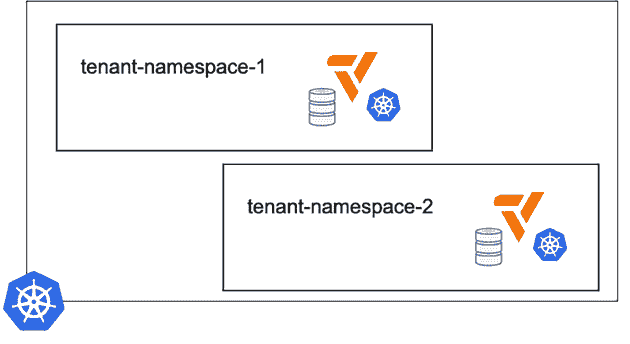
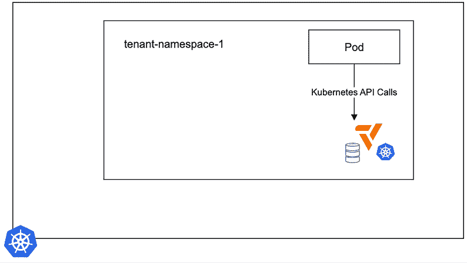
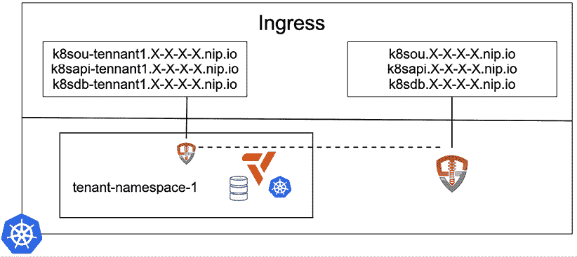
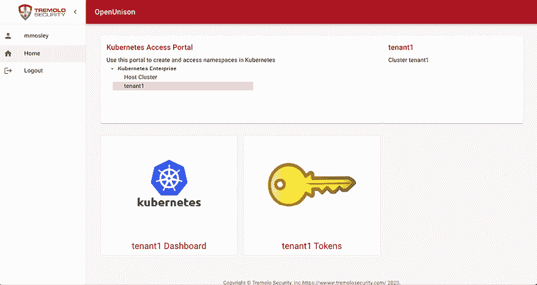
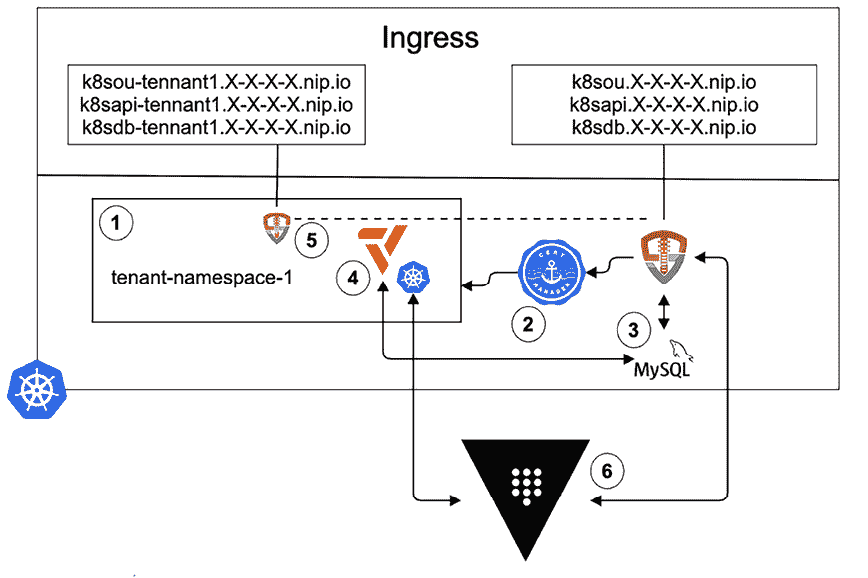
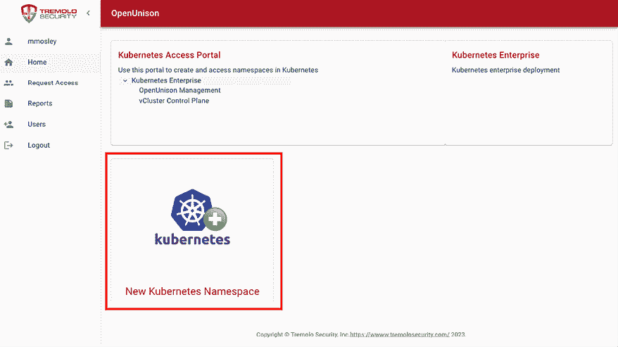
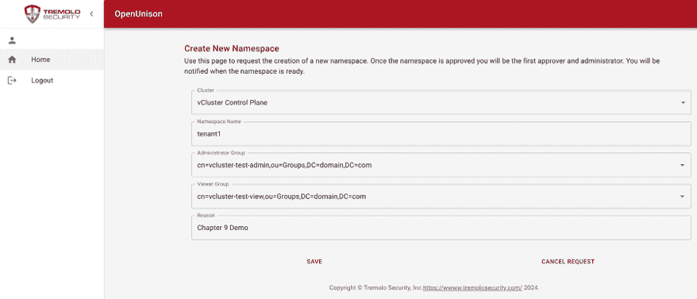
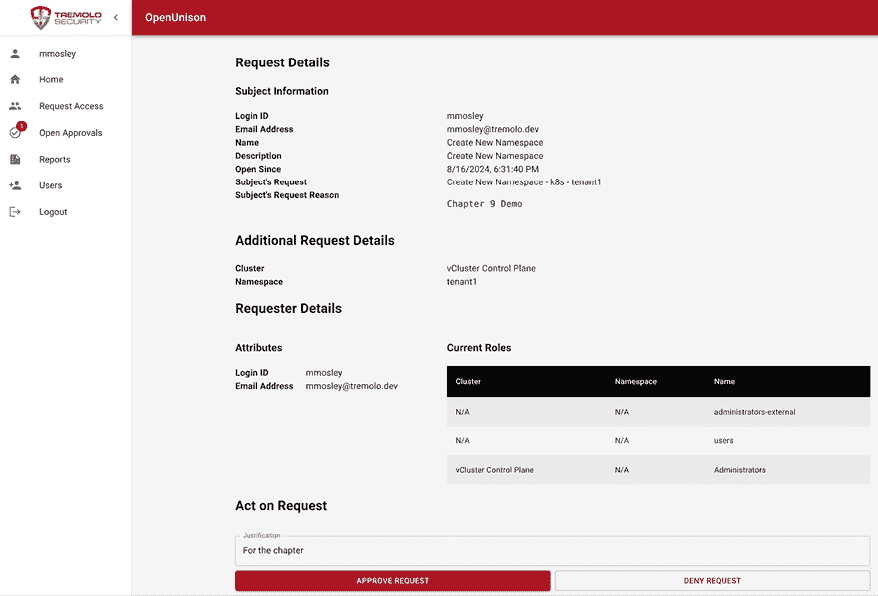

# 第九章：使用 vClusters 构建多租户集群

我们在前几章中提到了多租户，但这是第一章，我们将重点讨论 Kubernetes 中的多租户挑战，以及如何通过一种相对较新的技术“虚拟集群”来应对这些挑战。在本章中，我们将探索虚拟集群的使用案例，它们是如何实现的，如何以自动化的方式部署它们，以及如何通过`Pod`的身份与外部服务进行交互。最后，我们将通过构建和部署一个自助式多租户门户来结束本章内容。

本章将覆盖以下内容：

+   多租户的好处与挑战

+   使用 vClusters 作为租户

+   构建一个具有自助服务的多租户集群

# 技术要求

本章将涉及比前几章更大的工作量，因此需要一个更强大的集群。 本章有以下技术要求：

+   一台运行 Docker 的 Ubuntu 22.04+服务器，最低需要 8 GB 内存，建议 16 GB

+   来自`chapter9`文件夹的脚本，可以通过访问本书的 GitHub 仓库获取：[`github.com/PacktPublishing/Kubernetes-An-Enterprise-Guide-Third-Edition`](https://github.com/PacktPublishing/Kubernetes-An-Enterprise-Guide-Third-Edition)

# 获取帮助

我们尽力测试所有内容，但有时我们的集成实验室中可能有六个或更多的系统。鉴于技术的不断变化，有时在我们的环境中能正常工作，而在你的环境中却不能。别担心，我们在这里为你提供帮助！请在我们的 GitHub 仓库上打开一个问题：[`github.com/PacktPublishing/Kubernetes-An-Enterprise-Guide-Third-Edition/issues`](https://github.com/PacktPublishing/Kubernetes-An-Enterprise-Guide-Third-Edition/issues)，我们很乐意帮助你！

# 多租户的好处与挑战

在深入探讨虚拟集群和**vCluster**项目之前，让我们首先探讨一下是什么使得多租户 Kubernetes 如此有价值，却又如此难以实现。到目前为止，我们提到了多租户的挑战，但我们的重点一直是配置和构建单一集群。这是我们第一次直接解决多租户及其实现方法。本章的第一个主题是多租户 Kubernetes 是什么，以及为什么你应该考虑使用它。

## 探索多租户的好处

Kubernetes 通过 API 和数据库协调工作负载的资源分配。这些工作负载通常由需要特定计算资源和内存的 Linux 进程组成。在 Kubernetes 发展初期的五到六年里，主流的趋势是为每个“应用程序”分配一个专用集群。需要注意的是，当我们提到“应用程序”时，它可以指一个单体应用程序、一组微服务或几个相互关联的单体应用程序。这种方法明显效率低下，导致管理复杂性激增并可能浪费资源。为了更好地理解这一点，让我们来看看单个集群中的所有元素：

+   **etcd 数据库**：你应该始终拥有奇数个 `etcd` 实例；至少需要三个 `etcd` 实例以保持高可用性。

+   **控制平面节点**：与 `etcd` 类似，你至少需要两个控制平面节点，但为了高可用性，通常需要三个节点。

+   **工作节点**：无论基础设施上的负载如何，你至少需要两个节点。

控制平面需要资源，因此即使大多数 Kubernetes 发行版不再需要专门的控制平面节点，它仍然是额外的组件需要管理。看看你的工作节点，这些节点的利用率是多少？如果你有一个高负载的系统，你将能充分利用硬件，但你的所有应用程序是否总是如此高负载？让多个“应用程序”共享单一基础设施可以大大降低硬件利用率，减少所需集群数量，无论你是在预付费基础设施还是按需付费基础设施上运行。过度配置资源将增加功耗、冷却需求、机架空间等，这些都会增加额外的成本。更少的服务器还意味着减少硬件的维护需求，进一步降低成本。

除了硬件成本，集群每应用程序的方法还带来了人力成本。Kubernetes 技能非常昂贵且难以在市场上找到。这可能就是你正在阅读这本书的原因！如果每个应用程序组都需要维护自己的 Kubernetes 专业知识，那么就意味着要重复获取那些难以获得的技能，也增加了成本。通过集中基础设施资源，可以建立一个专门负责 Kubernetes 部署的集中团队，消除其他团队（其主要关注点不在基础设施开发）重复这些技能的必要性。

多租户还有重要的安全优势。通过共享基础设施，更容易集中执行安全要求。以身份验证为例，如果每个应用都有自己的集群，如何执行统一的身份验证要求？如何以自动化的方式添加新集群？如果你使用 OIDC，是不是要为每个集群集成一个身份提供者？

集中基础设施的另一个好处是密钥管理。如果你有一个集中式 Vault 部署，你是否希望为每个应用集成一个新集群？在*第八章*中，我们将一个集群与 Vault 集成；如果你有大量集群扩展，相同的集成需要在每个单独的集群上完成——这如何实现自动化和管理？

迁移到多租户架构可以通过减少运行工作负载所需的基础设施数量，从而降低长期成本。它还减少了管理基础设施所需的管理员人数，并使得集中安全和策略执行变得更加容易。

虽然多租户提供了显著的优势，但它也带来了一些挑战。接下来，我们将探讨实现多租户 Kubernetes 集群的挑战。

## 多租户 Kubernetes 的挑战

我们探讨了多租户 Kubernetes 的好处，尽管多租户的采用正在增长，但为什么它不像每应用一个集群的方法那样普遍？

创建一个多租户 Kubernetes 集群需要考虑安全性、可用性和管理等多个方面。实施这些挑战的解决方案通常是非常具体的，并且需要与第三方工具集成，这些工具往往不在大多数发行版的范围内。

大多数企业在管理孤岛的基础上增加了额外的复杂性。应用程序所有者根据自己的标准和管理进行评判。任何收入与某些标准挂钩的人都会想确保尽可能多地控制这些标准，即使这是出于错误的原因。这种孤岛效应可能对任何没有给予应用程序所有者适当控制的集中化努力产生负面影响。由于这些孤岛对每个企业来说都是独特的，因此单一发行版无法以易于推广的方式考虑这些问题。与其处理这些额外的复杂性，供应商更容易推销每应用一个集群的方法。

鉴于市场上很少有多租户 Kubernetes 发行版，下一个问题是：“使一个通用的 Kubernetes 集群支持多租户有哪些挑战？”

我们将通过影响的角度来分析这个问题的答案：

+   **安全性**：大多数容器实际上只是 Linux 进程。我们将在*第十二章*，*使用 Gatekeeper 进行节点安全*中详细讨论这一点。目前需要理解的是，主机上的进程之间几乎没有安全隔离。如果你在运行来自多个应用程序的进程，你需要确保一个突破不会影响其他进程。

+   **容器突破**：尽管这对任何集群都很重要，但在多租户集群中这是必不可少的。我们将在*第十三章*，*KubeArmor 保护你的运行时*中讨论如何保护我们的容器运行时。

+   **影响**：任何集中式基础设施的问题都会对多个应用程序产生不利影响。这通常被称为“爆炸半径”。如果一次升级出现问题或失败，谁会受到影响？如果发生容器突破，谁会受到影响？

+   **资源瓶颈**：虽然集中式基础设施确实可以更好地利用资源，但它也可能会造成瓶颈。你多快能将一个新租户加入进来？应用程序所有者在自己的租户中有多少控制权？授予或撤销访问权限有多困难？如果你的多租户解决方案跟不上应用程序所有者的步伐，应用程序所有者将自行承担基础设施。这将导致资源浪费、配置漂移以及所有集群的报告和审计困难。

+   **限制**：一个过于限制的集中式平台会导致应用程序所有者选择维护自己的基础设施或将基础设施外包给第三方解决方案。这是任何集中式服务中最常见的问题之一，最能说明这一点的就是**平台即服务**（**PaaS**）实现的兴衰，这些实现未能提供应用工作负载所需的灵活性。

尽管这些问题可以应用于任何集中式服务，但它们对 Kubernetes 确实有一些独特的影响。例如，如果每个应用程序都有自己的命名空间，那么应用程序如何在该命名空间内正确划分不同的逻辑功能？是否应该为每个应用程序授予多个命名空间？

Kubernetes 集群设计的另一个重大影响是**自定义资源定义**（**CRDs**）的部署和管理。CRDs 是集群级别的对象，几乎不可能在同一个集群中运行多个版本；正如我们在前面的章节中指出的，CRDs 作为存储配置数据的一种方式越来越受欢迎。多租户集群可能会遇到版本冲突，需要进行管理。

这些挑战将在后续章节中得到解决，但在本章中，我们将重点讨论两个方面：

+   **租户边界**：租户的范围是什么？租户在该边界内拥有多少控制权？

+   **自助服务**：集中式 Kubernetes 服务如何与用户交互？

我们将通过向集群中添加两个组件来解决这两个方面的问题。OpenUnison 已经被引入以处理身份验证，并将扩展其自服务功能，提供命名空间即服务（namespace as a Service）。另一个外部系统是 Loft Labs 提供的 vCluster。

由于我们已经使用 OpenUnison 演示了命名空间即服务，接下来我们可以继续探讨其他挑战，例如使用 vCluster 项目处理 CRD 版本控制问题。

# 为租户使用 vCluster

在 *KinD* 章节中，我们解释了 KinD 是如何嵌套在 Docker 中为我们提供完整的 Kubernetes 集群的。我们将其与套娃进行比较，组件嵌入到其他组件中，这可能会让刚接触容器和 Kubernetes 的用户感到困惑。vCluster 是一个类似的概念——它在主宿主集群中创建一个虚拟集群，虽然它看起来是一个标准的 Kubernetes 集群，但它实际上是嵌套在宿主集群中的。在阅读本章其余部分时，请记住这一点。

在上一节中，我们讲解了多租户的好处与挑战，以及这些挑战如何影响 Kubernetes。本节将介绍 Loft Labs 的 vCluster 项目，它允许你在一个无特权的命名空间内运行 Kubernetes 控制平面。这使得每个租户可以获得自己的“虚拟”Kubernetes 基础设施，完全控制而不会影响其他租户的实现或“主集群”中的其他工作负载。



图 9.1：vCluster 的逻辑布局

在上面的图示中，每个租户都获得自己的命名空间，其中运行一个 vCluster。vCluster 是由三部分组成的：

+   **数据库**：用于存储 vCluster 内部信息的地方。这可以是 `etcd` 或关系型数据库，具体取决于你部署 vCluster 的集群类型。

+   **API 服务器**：vCluster 包含一个自己的 API 服务器，供其 Pod 与之交互。这个 API 服务器由 vCluster 管理的数据库支持。

+   **同步引擎**：虽然 vCluster 有自己的 API 服务器，但其所有 Pod 都运行在宿主集群中。为了实现这一点，vCluster 在宿主集群和 vCluster 之间同步某些对象。我们将在接下来的部分详细介绍这一点。

vCluster 方法的好处在于，从 `Pod` 的视角来看，它是在一个私有集群内工作，尽管它实际上运行在一个主宿主集群中。租户可以将自己的集群划分为适合的命名空间，并根据需要部署 CRD 或操作器。



图 9.2：Pod 视角下的 vCluster

在上面的示意图中，我们看到 Pod 部署到租户的命名空间中，但它并不是与宿主集群的 API 服务器通信，而是与 vCluster 的 API 服务器通信。这是因为从 vCluster 同步到宿主集群的 Pod 定义，其环境变量和 DNS 被覆盖，指示 Pod 将宿主的 `kubernetes.default.svc` 指向 vCluster，而不是宿主集群的 API 服务器。

由于 Pod 运行在宿主集群中，而 vCluster 也运行在宿主集群中，因此所有的 Pods 都受到命名空间中设置的 `ResourceQuotas` 的约束。这意味着任何部署到 vCluster 中的 Pod 都受制于与直接部署到命名空间中的 Pod 相同的规则，包括由配额、策略或其他准入控制器创建的限制。在*第十一章*，*使用 Open Policy Agent 扩展安全性*，你将学习如何使用准入控制器在集群中强制执行策略。由于 Pod 运行在宿主集群中，你只需将这些策略应用到宿主集群上。这大大简化了我们的安全实施，因为现在可以将 `cluster-admin` 访问权限授予虚拟集群中的租户，而不会危及宿主集群的安全性。

另一个重要的说明是，宿主集群负责运行你的 Pod，因此它也负责所有 vCluster 的 `Ingress` 流量。你不必在每个 vCluster 上重新部署 `Ingress` 控制器——它们共享宿主的 `Ingress` 控制器，减少了维护额外的 `Ingress` 部署或为每个 vCluster 创建多个通配符域名的需要。

现在，我们基本理解了什么是 vCluster，以及它如何帮助解决 Kubernetes 中多租户的一些挑战，接下来的步骤是部署一个 vCluster 并查看其内部工作原理。

## 部署 vClusters

在上一节中，我们关注了 vCluster 的工作原理及其实现方式。在本节中，我们将部署一个 vCluster 和一个简单的工作负载，以便查看运行在 vCluster 中的 Pod 与部署到宿主集群中的 Pod 之间发生了什么变化。

第一步是创建一个新的集群——我们将删除现有的 KinD 集群并部署一个新的集群。然后，我们将在 `chapter9` 目录中执行一个名为 `deploy_vcluster_cli.sh` 的脚本：

```
$ kind delete cluster -n cluster01
$ cd chapter2
$ ./create-cluster.sh
$ cd ../chapter9
$ ./deploy_vcluster_cli.sh 
```

此时，我们已经有了一个新的集群和部署 vCluster 的 CLI 工具。

下一步是创建一个 vCluster。首先，我们将创建一个名为 `tenant1` 的新 `namespace`，然后使用 vCluster 工具在新命名空间中创建一个名为 `myvcluster` 的新 vCluster：

```
$ kubectl create ns tenant1
$ vcluster create myvcluster --distro k3s -n tenant1 
```

一旦 `vcluster` 命令完成，我们就会拥有一个正在运行的 vCluster，它是使用 `k3s` 构建的，并在宿主集群中运行。从逻辑上讲，它是一个独立的集群，我们可以通过 vCluster 的 kubeconfig 或 `vcluster` 工具直接“连接”到它。

`vCluster` 旨在支持多个 Kubernetes 集群实现。默认且最常见的是 `k3s`，这是一种 Kubernetes 实现，它用关系数据库替代了 `etcd`，并将多个二进制文件替换为一个单一的二进制文件。它最初是为边缘部署而开发的，但对于单租户环境也非常适用。我们可以使用 **Mirantis** 的 `k0s` 或甚至一个原生 Kubernetes，但 `k3s` 对于大多数情况来说表现很好。

让我们断开连接，看看在我们的主机上运行了什么：

```
$ vcluster disconnect
info   Successfully disconnected from vcluster: myvcluster and switched back to the original context: kind-cluster01
$ kubectl get pods -n tenant1
NAME                                                  READY   STATUS    RESTARTS   AGE
coredns-864d4658cb-mdcx5-x-kube-system-x-myvcluster   1/1     Running   0          4m45s
myvcluster-0                                          2/2     Running   0          5m12s 
```

如上面的输出所示，在 `tenant1` 命名空间下有两个 pod 正在运行：CoreDNS 和我们的 vCluster。如果我们查看我们命名空间中的服务，你会看到一个类似下面的服务列表：

```
$ kubectl get svc -n tenant1
NAME                                  TYPE        CLUSTER-IP      EXTERNAL-IP   PORT(S)                         AGE
kube-dns-x-kube-system-x-myvcluster   ClusterIP   10.96.142.24    <none>        53/UDP,53/TCP,9153/TCP          7m18s
myvcluster                            NodePort    10.96.237.247   <none>        443:32489/TCP,10250:31188/TCP   7m45s
myvcluster-headless                   ClusterIP   None            <none>        443/TCP                         7m45s
myvcluster-node-cluster01-worker      ClusterIP   10.96.209.122   <none>        10250/TCP                       7m18s 
```

有几个服务已配置指向我们 vCluster 的 API 服务器和 DNS 服务器，从而提供对 vCluster 的访问，使其在逻辑上看起来像是一个“完整”的标准集群。

现在让我们连接到我们的 vCluster 并部署一个 pod。在 `chapter9/simple` 目录下，我们有一个 pod 清单，将用于我们的示例。首先，我们将连接到集群并使用 `kubectl` 在 `chapter9/simple` 目录下部署示例 pod：

```
$ vcluster connect myvcluster -n tenant1
$ cd chapter9/simple
$ kubectl create -f ./virtual-pod.yaml
$ kubectl logs -f virtual-pod
Wed Sep 20 17:50:03 UTC 2023
KUBERNETES_SERVICE_PORT_HTTPS=443
KUBERNETES_SERVICE_PORT=443
HOSTNAME=virtual-pod
PWD=/
HOME=/root
KUBERNETES_PORT_443_TCP=tcp://10.96.237.247:443
SHLVL=1
KUBERNETES_PORT_443_TCP_PROTO=tcp
**KUBERNETES_PORT_443_TCP_ADDR=10.96.237.247**
KUBERNETES_SERVICE_HOST=10.96.237.247
KUBERNETES_PORT=tcp://10.96.237.247:443
KUBERNETES_PORT_443_TCP_PORT=443
PATH=/usr/local/sbin:/usr/local/bin:/usr/sbin:/usr/bin:/sbin:/bin
_=/usr/bin/env
search default.svc.cluster.local svc.cluster.local cluster.local
**nameserver 10.96.142.24** 
```

请注意，`Pod` 的环境变量使用 `10.96.237.247` 作为 API 服务器的 IP 地址；这是在主机上运行的 `mycluster` 服务的 `ClusterIP`。此外，名字服务器是 `10.96.142.24`，这是我们 vCluster 的 `kube-dns 服务` 在主机上的 `ClusterIP`。就 pod 而言，它认为自己是在 vCluster 内部运行的。它对主机集群一无所知。接下来，断开与 vCluster 的连接，并查看我们主机集群中 `tenant1` 命名空间下的 pods：

```
$ vcluster disconnect
$ kubectl get pods -n tenant1
NAME                                                  READY   STATUS    RESTARTS   AGE
coredns-864d4658cb-mdcx5-x-kube-system-x-myvcluster   1/1     Running   0          22m
myvcluster-0                                          2/2     Running   0          22m
**virtual-pod-x-default-x-myvcluster                    1/1     Running   0          7m11s** 
```

请注意，您的 vCluster 的 pod 正在您的主机集群中运行。主机上 `Pod` 的名称包括 pod 的名称和来自 vCluster 的命名空间。让我们来看一下 pod 的定义。我们不会在这里放入所有输出，因为它会占用多页。我们想指出的是，除了我们的原始定义外，pod 还包括一个硬编码的 `env` 部分：

```
env:
    - name: KUBERNETES_PORT
      value: tcp://10.96.237.247:443
    - name: KUBERNETES_PORT_443_TCP
      value: tcp://10.96.237.247:443
    - name: KUBERNETES_PORT_443_TCP_ADDR
      value: 10.96.237.247
    - name: KUBERNETES_PORT_443_TCP_PORT
      value: "443"
    - name: KUBERNETES_PORT_443_TCP_PROTO
      value: tcp
    - name: KUBERNETES_SERVICE_HOST
      value: 10.96.237.247
    - name: KUBERNETES_SERVICE_PORT
      value: "443"
    - name: KUBERNETES_SERVICE_PORT_HTTPS
      value: "443" 
```

它还包括自己的 `hostAliases`：

```
hostAliases:
  - hostnames:
    - kubernetes
    - kubernetes.default
    - kubernetes.default.svc
    ip: 10.96.237.247 
```

因此，尽管 `Pod` 正在我们的主机集群中运行，但所有告诉 pod 它在哪里运行的内容都指向了我们的 vCluster。

在这一部分，我们启动了我们的第一个 vCluster 和一个在该 vCluster 中运行的 pod，以观察它如何被改变以便在我们的主机集群中运行。在下一部分，我们将研究如何访问我们的 vCluster，同时保持与主机集群相同的企业安全要求。

## 安全访问 vClusters

在上一部分，我们部署了一个简单的 vCluster，并使用 `vcluster connect` 命令访问了 vCluster。该命令首先创建一个端口转发到 vCluster 的 API 服务器 `Service`，然后将一个带有主证书的上下文添加到我们的 `kubectl` 配置文件中，这类似于我们的 KinD 集群。

我们在*第六章*，*将认证集成到你的集群中*，花费了大量篇幅讲解了为什么这是一个反模式，这些理由同样适用于虚拟集群（vClusters）。你仍然需要将企业认证集成到你的虚拟集群中。让我们看看两种方法：

+   **去中心化**：你可以将认证留给集群所有者处理。这会消解多租户的一些优点，并且要求每个集群都当作一个新的集成来接入企业的身份系统。

+   **集中化**：如果你在主机集群中托管**身份提供者**（**IdP**），你可以将每个虚拟集群与该 IdP 关联，而不是直接连接到集中式身份存储。除了提供集中认证外，这种方法还使得自动化新虚拟集群的加入变得更容易，并且限制了需要存储在虚拟集群中的凭证等敏感信息的数量。

在多租户环境中，选择是明确的；你的主机集群也应该承载中央认证功能。

关于虚拟集群访问，接下来需要理解的是到虚拟集群的网络路径。`vcluster`命令会创建一个本地的端口转发到你的 API 服务器。这意味着每当用户想要使用他们的 API 服务器时，都需要设置端口转发到 API 服务器。这并不是一个理想的**用户体验**（**UX**），并且容易出错。最好是直接连接到我们虚拟集群的 API 服务器，就像我们为任何标准 Kubernetes 集群所做的一样。设置直接网络访问到虚拟集群的 API 服务器的挑战在于，尽管它是`NodePort`，但节点通常不会直接暴露到网络上。它们通常会被负载均衡器包围，并依赖`Ingress`控制器来提供对集群资源的访问。

答案是使用我们主机集群已经为虚拟集群提供的应用基础设施。

在*第六章*，*将认证集成到你的集群中*，我们讨论了如何在云管理的集群中使用代理伪装。相同的场景也可以应用于虚拟集群。虽然你可以配置`k3s`使用 OIDC 进行认证，但使用代理伪装大大简化了网络管理，因为我们不需要创建新的负载均衡器或基础设施来支持我们的虚拟集群。



图 9.3：带认证的虚拟集群

在上面的图示中，我们可以看到网络和身份验证如何在我们的主集群中结合。主集群将拥有一个 OpenUnison，用于验证用户身份并连接到我们的 Active Directory。我们的 vCluster 将有自己的 OpenUnison，并与主集群的 OpenUnison 建立信任关系。vCluster 将使用 kube-oidc-proxy 将 OpenUnison 的身份验证令牌转换为模拟头，以便传递给 vCluster 的 API 服务器。这种方式为我们提供了一个集中式的身份验证和网络系统，同时也使得 vCluster 所有者能够轻松地整合自己的管理应用程序，而无需主集群团队的介入。像**ArgoCD**和**Grafana**这样的本地集群管理应用程序都可以集成到 vCluster 的 OpenUnison 中，而不是主集群的 OpenUnison 中。

为了展示我们的设置如何运行，首先需要更新我们的 vCluster，以便它能够通过 vcluster 工具将`Ingress`对象从 vCluster 同步到主集群。在`chapter/host`目录中，我们有一个名为`vcluster-values.yaml`的更新值文件；我们将使用此值文件来升级`tenant1`命名空间中的 vCluster：

```
$ cd chapter9/host
$ vcluster create myvcluster --upgrade -f ./vcluster-values.yaml -n tenant1 
```

这个命令将更新我们的 vCluster，以便将我们在 vCluster 中创建的`Ingress`对象同步到主集群中。接下来，我们需要在主集群中运行 OpenUnison：

```
$ vcluster disconnect
$ ./deploy_openunison_imp_impersonation.sh 
```

在部署之前，我们需要确保我们是在主集群上运行，而不是在 vCluster 上。我们刚才运行的脚本与*第六章*中的内容相似，*将身份验证集成到集群中*；它将把“Active Directory”和 OpenUnison 部署到 vCluster 中。一旦 OpenUnison 被部署，最后一步是运行 OpenUnison 的卫星部署过程：

```
$ vcluster disconnect
$ ./deploy_openunison_vcluster.sh 
```

这个脚本类似于主集群的部署脚本，但有一些关键的不同之处：

+   我们 OpenUnison 的值不包含任何身份验证信息。

+   我们 OpenUnison 的值与主集群有不同的集群名称。

+   脚本并未运行`ouctl install-auth-portal`，而是运行`ouctl install-satelite`，该命令设置 OpenUnison 在卫星集群和主集群之间使用 OIDC。这个命令为我们创建了`values.yaml`文件中的`oidc`部分。

脚本执行完毕后，您可以像在*第六章*中一样登录 OpenUnison。在浏览器中，访问`https://k8sou.apps.X-X-X-X.nip.io`，其中 X-X-X-X 是您集群的 IP 地址，但使用破折号代替点。由于我们的集群位于`192.168.2.82`，我们使用`https://k8sou.apps.192-168-2-82.nip.io/`。登录时，请使用用户`mmosley`和密码`start123`。

登录后，您会看到现在有一个树形结构，其中包含**主集群**和**tenant1**的选项。您可以点击**tenant1**，然后点击**tenant1 Tokens**标签。



图 9.4：OpenUnison 门户页面

新页面加载后，您可以获取您的`kubectl`配置并将其粘贴到终端中：

``

图 9.5：OpenUnison kubectl 配置生成器

根据您正在使用的客户端，您可以将此命令粘贴到 Windows 或 Linux/macOS 终端中，并开始使用您的 vCluster，而无需分发`vcluster` CLI 工具，并且可以使用您企业的身份验证要求。

在本节中，我们探讨了如何将企业身份验证集成到我们的 vCluster 中，以及如何为我们的 vCluster 提供一致的网络访问。在下一节中，我们将探讨如何将我们的 vCluster 与外部服务（如 HashiCorp 的 Vault）集成。

## 从 vCluster 访问外部服务

在上一章中，我们将 HashiCorp Vault 实例集成到我们的集群中。我们的 Pods 使用投影到 Pod 中的令牌与 Vault 进行通信，使我们能够在没有共享密钥或令牌的情况下进行 Vault 身份验证，并使用短期令牌。依赖短期令牌减少了被泄露的令牌被用于攻击集群的风险。

与 Vault 一起使用的基于 Pod 的身份在 vCluster 中变得更加复杂，因为用于创建`Pod`令牌的密钥是 vCluster 特有的。此外，Vault 需要了解每个 vCluster，以便验证在 vCluster 中使用的投影令牌。

如果我们在宿主集群中运行自己的 Vault，我们可以自动化入驻过程，以便每个新的 vCluster 都能作为独立集群注册到 Vault 中。这种方法的挑战在于 Vault 是一个复杂的系统，通常由专门的团队运行，并有自己的入驻流程。以适合拥有 Vault 的团队的方式添加新 vCluster，可能并不像调用一些 API 那么简单。因此，在我们实施将 vCluster 集成到 Vault 的策略之前，需要先了解 vCluster 如何处理身份。

运行在 vCluster 中的 Pod 有两个不同的身份：

+   **vCluster 身份**：从 vCluster 投影到我们 Pod 中的令牌作用范围仅限于 vCluster 的 API 服务器。该令牌由宿主集群无法识别的唯一密钥签名。它与 Pod 在 vCluster 的 API 服务器内运行时所使用的`ServiceAccount`相关联。

+   **宿主集群身份**：尽管 Pod 在 vCluster 中定义，但它是在宿主集群中执行的。这意味着 Pod 的安全上下文将以宿主集群为基础运行，并且需要与 vCluster 不同的身份。它将拥有自己的名称和签名密钥。

如果我们检查从 vCluster 同步到宿主集群的 Pod，我们会看到一个注解，其中包含一个令牌：

```
vcluster.loft.sh/token-ejijuegk: >-
      eyJhbGciOiJSUzI1NiIsImtpZCI6IkVOZDVhZnEzUzdtLXBSR2JUM3RJUkRHM0FqWkhzQV9KSkNZcm8yMHdNVUUifQ… 
```

这个令牌是通过 Pod 中后续的 `fieldPath` 配置注入到我们的 Pod 中的。这可能是一个安全问题，因为任何记录 `Pod` 创建的日志（如审计日志）现在都可能泄露令牌。vCluster 项目有一个配置，用于在主集群中为项目令牌生成 `Secret` 对象，这样它们就不会出现在 Pod 清单中。将以下内容添加到我们的 `values.yaml` 文件中将解决这个问题：

```
syncer:
  extraArgs:
    - --service-account-token-secrets=true 
```

完成这些操作后，让我们更新集群并重新部署所有 `Pods`：

```
$ vcluster disconnect
$ vcluster create myvcluster --upgrade -f ./vcluster-values-secrets.yaml -n tenant1
$ kubectl delete pods --all --all-namespaces --force 
```

一会儿，vCluster 中的 Pod 将恢复。检查 `Pod` 后，我们看到令牌不再出现在 `Pod` 的清单中，而是被挂载到了主机中的 `Secret` 上。这无疑是一个改进，因为审计系统通常会对记录 `Secrets` 的内容更加谨慎。接下来，让我们检查一下令牌的声明。

如果我们检查这个令牌，我们会看到一些问题：

```
{
  "aud": [
    "https://kubernetes.default.svc.cluster.local"
  ],
 **"exp": 2010881742,**
 **"iat": 1695521742,**
  "iss": "https://kubernetes.default.svc.cluster.local",
  "kubernetes.io": {
    "namespace": "openunison",
    "pod": {
      "name": "openunison-orchestra-d7bc468bc-qhpts",
      "uid": "fb6874f7-c01c-4ede-9062-ce5409509200"
    },
    "serviceaccount": {
      "name": "openunison-orchestra",
      "uid": "3d9c9147-d0e0-43f6-9e4d-a0d7db0c6b8c"
    }
  },
  "nbf": 1695521742,
  "sub": "system:serviceaccount:openunison:openunison-orchestra"
} 
```

`exp` 和 `iat` 声明是加粗的，因为当你将其从 Unix 纪元时间转换为人类可以理解的时间时，该令牌有效的时间是从`2023 年 9 月 24 日星期天凌晨 2:15:42`到`2033 年 9 月 21 日星期三凌晨 2:15:42`。这可是一个十年的令牌！这忽略了令牌在 Pod 中被配置为只在十分钟内有效的事实。这是 vCluster 中的已知问题。好消息是，令牌本身是投影的，因此当它们投影到的 Pod 死亡时，API 服务器将不再接受这些令牌。

vCluster 令牌长度的问题出现在访问外部服务时，因为这对我们生成的任何令牌都适用，不仅仅是 vCluster API 服务器的令牌。当我们在上一章中将集群集成到 Vault 时，我们使用了 `Pod` 的身份，这样我们就能利用短期有效且不静态的令牌，并且它们有明确的过期时间。十年的令牌实际上是一个没有过期时间的令牌。主要的缓解措施是，我们配置了 Vault 来验证令牌的状态，在接受之前检查令牌是否有效，因此绑定到已销毁 Pod 的令牌将被 Vault 拒绝。

使用 vCluster 注入的身份的替代方法是利用主集群注入的身份。这个身份将受到与主集群中 `TokenRequest` API 生成的其他身份相同的规则约束。采用这种方法有两个问题：

+   **vCluster 禁用主机令牌**：在主机同步的 Pod 中，`automountServiceAccountToken` 为 false。这是为了防止 vCluster 和主集群之间发生冲突，因为我们的 Pod 不应该知道主集群的存在！我们可以通过创建一个变异 webhook 来解决这个问题，它将在主集群中添加一个 `TokenRequest` API 投影，供我们的 Pod 访问。

+   **主机令牌没有 vCluster 命名空间**：当我们为已同步的 pod 生成主机令牌时，命名空间将嵌入在 `ServiceAccount` 的名称中，而不是作为令牌中的声明。这意味着大多数外部服务的策略语言将无法基于主机令牌接受策略，而是通过命名空间配置，无需为每个 vCluster 命名空间创建新策略。

这两种方法都有优缺点。使用 vCluster 令牌的最大好处是，你可以轻松创建一个策略，允许你基于 vCluster 内的命名空间来限制对机密的访问，而无需为每个命名空间创建新的策略。缺点是 vCluster 令牌存在问题，并且现在你需要将每个单独的 vCluster 纳入到 Vault 中。使用主机令牌可以更好地缓解 vCluster 令牌的问题，但你无法轻松为 Vault 中的每个 vCluster 创建通用策略。

在本节中，我们花时间了解了 vCluster 如何管理 pod 身份，以及这些身份如何用于与外部服务（如 Vault）进行交互。在下一节中，我们将讨论创建高可用 vCluster 和管理操作所需的内容。

## 创建和操作高可用 vClusters

到目前为止，本章我们已经专注于 vCluster 如何工作、如何安全地访问 vCluster，以及 vCluster 如何处理 pod 身份以与外部系统交互。在本节中，我们将专注于如何部署和管理高可用 vClusters。许多 vCluster 的文档和示例都将其作为开发或测试工具来讨论。对于本章前面讨论的用例，我们希望专注于创建能够运行生产工作负载的 vClusters。构建生产就绪 vClusters 的第一步是理解如何以允许个别组件发生故障或停机的方式运行 vCluster，而不会影响 vCluster 的运行能力。

### 理解 vCluster 高可用性

让我们定义一个高可用 vCluster 的目标以及我们当前部署与该目标之间的差距。当你拥有一个高可用 vCluster 时，你需要确保：

+   在升级或迁移到另一个物理节点时，你可以继续与 API 服务器交互，无论是在主机集群还是 vCluster 中。

+   如果发生灾难性问题，你可以从备份中恢复。

在运行 vCluster 时，关于能够与 API 服务器交互的第一个要点会在升级主机集群节点时变得清晰。在升级过程中，你希望 API 服务器能够继续运行。你希望能够继续从虚拟 API 服务器同步对象到主机；你还希望与 API 服务器交互的 pod 在主机升级时仍然能够正常工作。例如，如果你使用的是 OpenUnison，那么你希望它能够创建会话对象，以便用户可以在主机集群操作进行时与他们的 vCluster 交互。

灾难恢复的第二个要点也非常重要。我们希望永远不需要它，但如果我们的 vCluster 被不可逆地损坏，怎么办？我们能否恢复到一个已知是正常的状态？

了解如何运行高可用 vCluster 的第一个方面是，它将需要多个实例的 pod 来运行 API 服务器、同步器和 CoreDNS。如果我们查看 `tenant1` 命名空间，我们会看到 vCluster 中有一个 pod 与一个 `StatefulSet` 关联，该 `StatefulSet` 托管 vCluster 的 API 服务器和同步器。还有一个 pod 是从 vCluster 内部同步的，用于 CoreDNS。我们希望每个 pod 至少有两个实例（最好是三个），这样我们就可以告诉 API 服务器使用 `PodDisruptionBudget`，确保我们有最少数量的实例运行，以便在发生某些事件时，可以停掉其中一个实例。

第二个要理解的方面是 vCluster 如何管理数据。我们当前的部署使用了 `k3s`，它使用本地 SQLite 数据库，并将数据存储在 `PersistentVolume` 上。这对于开发来说效果不错，但对于生产集群，我们希望每个 vCluster 组件都能使用相同的数据。对于基于 `k3s` 的 vCluster，这意味着需要使用支持的关系型数据库或 `etcd`。我们可以部署 `etcd`，但关系型数据库通常更易于管理。我们将在集群内部署数据库，但使用外部数据库也是完全可行的。在我们的练习中，我们将使用 MySQL。我们不会为示例构建高可用数据库，因为每个数据库都有其自身的高可用性机制。不过，如果这是生产部署，你需要确保数据库是按照项目推荐的高可用部署方式构建的，并且有定期的备份和恢复计划。话虽如此，让我们从拆除当前集群并创建新集群开始：

```
$ kind delete cluster -n cluster01
$ cd chapter2/HAdemo
$ ./create-multinode.sh 
```

等待新的多节点集群启动完成。一旦它运行起来，部署 MySQL：

```
$ cd ../../chapter9/ha
$ ./deploy_mysql.sh 
```

如果 `deploy_mysql.sh` 脚本因“无法通过套接字连接到本地 MySQL 服务器”而失败，请稍等片刻然后重新运行。重新运行是安全的。该脚本：

1.  使用自签名的 `ClusterIssuers` 部署 cert-manager 项目。

1.  为 MySQL 创建 TLS 密钥对。

1.  安装 MySQL 作为`StatefulSet`并配置它以接受 TLS 认证。

1.  为我们的集群创建一个数据库，并配置一个用户通过 TLS 认证进行身份验证。

在部署并配置好 MySQL 的 TLS 认证后，我们接下来将创建`tenant`命名空间，并创建一个证书来映射到我们的数据库用户：

```
$ kubectl create -f ./vcluster-tenant1.yaml 
```

最后，我们可以部署我们的 vCluster：

```
$ vcluster create tenant1 --distro k3s --upgrade -f ./vcluster-ha-tenant1-vaules.yaml -n tenant1 --connect=false 
```

这将花费几分钟，但你将在`tenant1`命名空间中拥有四个 Pod：

```
NAME                                               READY   STATUS    RESTARTS   AGE
coredns-6ccdd78696-r5kmd-x-kube-system-x-tenant1   1/1     Running   0          88s
coredns-6ccdd78696-rw9lv-x-kube-system-x-tenant1   1/1     Running   0          88s
tenant1-0                           2/2     Running   0          2m16s
tenant1-1   0          2m16s 
```

现在我们可以利用`PodDisruptionBudget`来告诉 Kubernetes，在升级过程中保持一个 vCluster Pod 持续运行。

说到升级，下一个问题是如何升级我们的 vCluster。现在我们有了一个高可用性的 vCluster，我们可以考虑将 vCluster 升级到新版本。

### 升级 vCluster

你需要了解如何升级你的 vCluster。你要确保你的 vCluster 和主集群不会分离得太远。虽然同步到主集群中的 Pod 将与 vCluster 的 API 服务器进行通信，但对同步 Pod（和其他同步对象）的任何影响都可能影响你的工作负载。

鉴于保持最新状态的重要性，值得报告的是，升级 vCluster 非常简单。重要的是要记住，vCluster 负责编排集群并同步对象，但集群本身是由它们自己的实现进行管理的。在我们的部署中，我们使用`k3s`，它会在部署新 Pod 时升级数据库中的数据存储。由于`vcluster create`命令是 Helm 的一个包装器，我们只需要用新镜像更新我们的值并重新部署：

```
$ kubectl get pod tenant1-0 -n tenant1 -o json | jq -r '.spec.initContainers[0].image'
rancher/k3s:v1.29.5-k3s1
$ vcluster create tenant1 --upgrade -f ./vcluster-ha-tenant1-vaules-upgrade.yaml -n tenant1 --connect=false 
```

该命令将我们的 vCluster 升级为使用`k3s 1.30`镜像，实际上就是对我们安装的 Helm 图表执行升级。你正在利用 Kubernetes 的强大功能来简化升级！运行完成后，你可以检查 Pod 是否已经在运行`k3s 1.30`：

```
$ kubectl get pod tenant1-0 -n tenant1 -o json | jq -r '.spec.initContainers[0].image'
rancher/k3s:v1.30.1-k3s1 
```

我们已经涵盖了如何创建高可用集群以及如何升级 vCluster。这些内容足以开始构建一个多租户集群。在下一节中，我们将整合所学内容，构建一个每个租户都有自己 vCluster 的多租户集群。

# 使用自助服务构建多租户集群

在前面的章节中，我们探讨了多租户如何工作，vCluster 项目如何帮助解决多租户挑战，以及如何配置具有安全访问和高可用性的 vCluster。每个独立的组件都作为一个单独的部分进行讨论。接下来的问题是如何将这些组件整合成一个单一的服务。在本节中，我们将演示如何为多租户集群创建一个自助平台。

多租户的一个最重要方面是可重复性。你能否以一致的方式创建每个租户？除了确保方法是可重复的外，客户需要花费多少工作来获取一个新租户？记住，本书聚焦于企业，企业几乎总是有合规性要求。你还需要考虑如何将合规性要求整合到入驻过程当中。

对可重复性和合规性的需求通常会导致需要为新租户提供自助服务门户。创建自助服务门户已经成为许多项目的重点，通常作为“平台工程”计划的一部分。我们将从 OpenUnison 的命名空间作为服务门户来构建我们的自助服务平台。以 OpenUnison 作为起点，可以让我们专注于组件如何集成，而不是深入编写集成代码的具体细节。这个多租户自助入驻门户将作为起点，随着我们在本书中探索更多多租户方面的内容，逐步完善。

我们将首先通过定义需求来接近我们的多租户集群，然后分析每个需求如何得到满足，最后推出我们的集群和门户。完成本节后，你将拥有一个可以构建的多租户平台的起始框架。

## 分析需求

我们对每个租户的要求将类似于物理集群的要求。我们将希望：

+   **通过授权隔离租户**：谁应该有权限更新每个租户？什么驱动了访问权限？到目前为止，我们主要关注集群管理员，但现在我们需要关注租户管理员。

+   **强制企业身份验证**：当开发者或管理员访问租户时，我们需要确保使用的是企业身份验证。

+   **外部化秘密**：我们要确保秘密数据的真实来源位于集群之外，这样可以让我们的安全团队更容易进行审计。

+   **高可用性与灾难恢复**：在某些情况下，我们需要关注租户的 API 服务器是否在运行。我们需要依赖 Kubernetes 确保即使在这些情况下，租户也能继续进行工作。

+   **传输中的加密**：所有组件之间的连接都需要加密。

+   **Helm Charts 中无秘密**：将秘密数据保存在图表中意味着它作为 `Secret` 存储在我们的命名空间中，从而违反了外部化秘密数据的要求。

我们在本章中已经处理了大多数这些需求。关键问题是，“我们如何将一切整合并自动化？”通过阅读本章并查看脚本，你应该能大致看到这个实现的方向。就像任何企业项目一样，我们需要了解孤岛效应如何影响我们的实施。对于我们的平台，我们假设：

+   **Active Directory 不能自动更新**：通常情况下，你不会被赋予通过 API 在 **Active Directory**（**AD**）中创建自己组的权限。尽管与 AD 的交互只需要 LDAP 功能，但合规性要求通常规定必须遵循正式流程来创建组并将成员添加到这些组中。

+   **Vault 可以自动化**：由于 Vault 已启用 API，并且我们与 Vault 团队有良好的关系，他们将允许我们直接自动化新租户的入驻过程。

+   **集群内部通信不需要企业 CA**：企业通常拥有自己的 **证书颁发机构**（**CAs**）来生成 TLS 证书。这些 CA 通常不会暴露给外部 API，也不能颁发可以由本地证书管理器实例使用的中间 CA。我们将使用特定于我们集群的 CA 来颁发所有用于集群内的证书。

+   **主机集群托管 MySQL**：我们将在集群上托管 MySQL 实例，但不会深入探讨 MySQL 相关的操作。我们假设它已经以高可用方式部署。数据库管理是一个独立的学科，我们不会假装能在这一部分覆盖它。

在掌握了这些需求和假设后，下一步是规划如何实现我们的多租户平台。

## 设计多租户平台

在上一节中，我们定义了需求。现在，让我们构建一个工具矩阵，来告诉我们每个组件的责任：

| **需求** | **组件** | **备注** |
| --- | --- | --- |
| 门户认证 | OpenUnison + Active Directory | OpenUnison 将捕获凭据，Active Directory 将验证凭据。 |
| 租户 | Kubernetes 命名空间 + vCluster | 每个租户将在主机集群中获得自己的命名空间，并部署一个 vCluster。 |
| 租户认证 | OpenUnison | 每个租户将获得自己的 OpenUnison 实例。 |
| 授权 | OpenUnison 与 Active Directory 组 | 每个租户将拥有一个唯一的 Active Directory 组，该组提供管理权限。 |
| 证书生成 | `cert-manager` 项目 | `cert-manager` 将生成用于 vCluster 与 MySQL 之间通信所需的密钥。 |
| 秘密管理 | 集中化 Vault | 每个租户将获得自己的 Vault 数据库，并启用 Kubernetes 认证。 |
| 编排 | OpenUnison | 我们将使用 OpenUnison 的工作流引擎来进行新租户的入驻。 |

表 9.1：实现矩阵

根据我们的需求和实施矩阵，我们的多租户平台将如下所示：



图 9.6：多租户平台设计

使用上述图示，让我们走一遍实现平台所需的步骤：

1.  OpenUnison 将创建一个命名空间并将 RoleBinding 绑定到我们的 Active Directory 组，赋予其 `admin` `ClusterRole` 权限。

1.  OpenUnison 将在租户的命名空间中生成一个 `Certificate` 对象，vCluster 将使用它与 MySQL 通信。

1.  OpenUnison 将在 MySQL 中为 vCluster 创建一个数据库，并创建与步骤 2 中生成的证书关联的用户。

1.  OpenUnison 将部署一个 `Job`，该任务将运行 `vcluster` 命令并部署租户的 vCluster。

1.  OpenUnison 将部署一个 `Job`，该任务将部署 Kubernetes Dashboard，部署 OpenUnison，并将 vCluster OpenUnison 集成到宿主集群的 OpenUnison 中。

1.  OpenUnison 将在 Vault 中创建一个身份验证策略，允许租户的 vCluster 的令牌使用本地 Pod 身份验证 Vault。它还将运行一个 `Job`，该任务将在我们的集群中安装 Vault sidecar。

我们将在集中式 Vault 中为 vCluster 提供检索机密的能力。在企业部署中，你还需要控制谁可以使用 CLI 和 Web 界面登录到 Vault，并使用与我们集群相同的身份验证和授权来定制访问权限，但这超出了本章节（以及本书）的范围。

最后，你可以使用任何你喜欢的自动化引擎来执行这些任务，例如 **Terraform** 或 **Pulumi**。如果你想使用其中一种工具，仍然可以应用相同的概念，并将其转换为特定实现的细节。现在我们已经设计好了我们的入驻流程，让我们开始部署它。

## 部署我们的多租户平台

上一部分主要介绍了我们多租户平台的要求和设计。在本部分，我们将部署该平台，并演示如何部署一个租户。第一步是从一个新的集群开始：

```
$ kind delete cluster -n cluster01
$ kind delete cluster -n multinode
$ cd chapter2
$ ./create-cluster.sh 
```

一旦集群启动，下一步是部署门户。我们已经将所有步骤脚本化：

```
$ cd chapter9/multitenant/setup/
$ ./deploy_openunison.sh 
```

这个脚本完成了很多工作：

1.  部署配置了我们内部 CA 的 `cert-manager` 以供我们的集群使用

1.  部署配置了我们内部 CA 的 MySQL

1.  部署 OpenUnison，使用模拟身份，并部署我们为 vCluster 定制的内容

1.  部署 Vault

1.  集成 Vault 和我们的控制平面集群

1.  使 OpenUnison 能够在 Vault 中创建新的身份验证机制和策略

根据您的基础设施性能，这个脚本可能需要十到十五分钟才能运行完毕。部署完成后，第一步是登录到门户网站`https://k8sou.apps.IP.nip.io/`，其中 IP 是您的 IP 地址，点号替换为破折号。我的集群 IP 是`192.168.2.82`，因此 URL 为`https://k8sou.apps.192-168-2-102.nip.io/`。使用用户`mmosley`和密码`start123`登录。您会看到一个新的徽章，名为**新 Kubernetes 命名空间**。点击该徽章。



图 9.7：带有新 Kubernetes 命名空间徽章的 OpenUnison 首页

在下一个屏幕中，您将被要求为新命名空间（和租户）提供一些信息。我们在“Active Directory”中创建了两个组来管理对租户的访问。虽然 OpenUnison 默认支持`ClusterRole`的 admin 和 view 角色映射，但我们将重点关注 admin `ClusterRole`映射。我们命名空间的 admin 组也将成为租户 vCluster 的`cluster-admin`。这意味着任何被添加到此 Active Directory 组的用户都将获得对该租户 vCluster 的`cluster-admin`权限。按照*图 9.8*中所示填写表单，并点击**保存**。



图 9.8：新命名空间

保存后，关闭此标签页以返回到主门户并点击刷新。您将看到左侧有一个新的菜单选项，名为**开放审批**。OpenUnison 的设计基于自服务，因此假设租户所有者会请求部署新的租户。在这种情况下，mmosley 将同时作为租户所有者和审批人。点击**开放审批**，然后点击**处理请求**。



图 9.9：审批屏幕

填写**理由**字段，点击**批准请求**并**确认审批**。这将批准用户的请求并启动一个工作流，执行我们在*图 9.6*中设计的步骤。这个工作流会持续五到十分钟，具体取决于集群的性能。通常，OpenUnison 会在工作流完成后向请求者发送电子邮件，但我们在这里使用了一个 SMTP 黑洞来收集所有生成的邮件，以便简化实验室实现。您需要等到`tenant1`命名空间被创建并且 OpenUnison 实例正在运行。如果您查看主机集群中的`tenant1`命名空间，您会看到`vault-agent-injector` pod 正在运行。这表示部署已完成。

要跟踪您的 vCluster 部署，有三个 pod 需要查看：

+   `onboard-vcluster-openunison-tenant1` – 该 Job 中的 pod 包含用于创建和部署 vCluster 到您租户命名空间的日志。

+   `deploy-helm-vcluster-teant1` – 该作业中的 pod 集成了 Vault。

+   `openunison-orchestra` – 该部署中的 pod 运行 OpenUnison 的入门工作流。

如果过程中出现任何错误，您可以在这里找到它们。

现在我们的租户已经部署完毕，我们可以登录并部署一个 pod。退出 OpenUnison，然后使用用户名 `jjackson` 和密码 `start123` 重新登录。`jjackson` 用户是我们 Active Directory 中管理员组的成员，因此他们将立即能够访问并管理 `tenant1` 命名空间中的 vCluster。


图 9.10：访问 tenant1 vCluster

`jjackson` 用户能够像使用主集群一样与我们的 vCluster 交互，可以通过仪表盘或直接通过 CLI 进行操作。我们将使用 `jjackson` 的会话登录到我们的 `tenant` vCluster，并部署一个使用 Vault 中密钥数据的 pod。首先，在新会话中 `ssh` 进入您的集群主机，并为我们的 pod 创建一个 Vault 密钥：

```
$ ssh ubuntu@192.168.2.82
$ cd chapter9/multitenant/setup/vault
$ . ./vault_cli.sh
$ vault kv put secret/data/vclusters/tenant1/ns/default/config some-password=mysupersecretp@ssw0rd 
```

最后一条命令在 Vault 中创建了我们的密钥数据。请注意，我们创建的路径指定了我们正在使用 `default` `namespace` 中的 `tenant1` vCluster。根据我们的集群部署方式，只有 `tenant1` vCluster 中 `default` `namespace` 下的 pod 才能访问 `some-password` 值。

接下来，让我们使用 `jjackson` 登录到我们的 vCluster。首先，将 `KUBECONFIG` 变量设置为临时文件，并使用 `tenant1` 令牌设置 `jjackson` 的会话：

```
$ export KUBECONFIG=$(mktemp)$ export TMP_CERT=$(mktemp)…Cluster "tenant1" set.
Context "tenant1" created.
User "jjackson@tenant1" set.
Switched to context "tenant1".
$ cd ../../examples
$ ./create-vault.sh
$ kubectl logs test-vault-vault-watch -n default
Defaulted container "test" out of: test, vault-agent, vault-agent-init (init)
Wed Oct 11 16:30:37 UTC 2023
MY_SECRET_PASSWORD="mysupersecretp@ssw0rd" 
```

该 pod 能够使用其自身的 `ServiceAccount` 身份认证连接到我们的 Vault 以检索密钥！为了让我们的 vCluster 连接到 Vault，我们确实需要对 pod 进行两项更新：

```
annotations:
 vault.hashicorp.com/service: "https://vault.apps.192-168-2-82.nip.io"
 **vault.hashicorp.com/auth-path: "auth/vcluster-tenant1"**
 vault.hashicorp.com/agent-inject: "true"
 vault.hashicorp.com/log-level: trace
 **vault.hashicorp.com/role: cluster-read**
 vault.hashicorp.com/tls-skip-verify: "true"
 vault.hashicorp.com/agent-inject-secret-myenv: **'secret/data/vclusters/tenant1/ns/default/config'**
 vault.hashicorp.com/secret-volume-path-myenv: '/etc/secrets'
 vault.hashicorp.com/agent-inject-template-myenv: |
   {{- with secret "**secret/data/vclusters/tenant1/ns/default/config"** -}}
   MY_SECRET_PASSWORD="{{ index .Data "some-password" }}"
   {{- end }} 
```

我们需要添加一个新的 `annotation` 来告诉 Vault sidecar 在哪里进行身份认证。`auth/vcluster-tenant1` 认证路径是由我们的入门工作流创建的。我们还需要将请求的角色设置为 `cluster-read`，该角色也是由入门工作流创建的。最后，我们需要告诉 sidecar 在哪里查找我们的密钥数据。

到此，我们已经构建了自助式多租户门户的开端！随着我们深入探索更多与多租户相关的重要话题，我们将扩展这个门户。如果您想深入了解我们如何自动化 vCluster 入门过程的代码，`chapter9/multitenant/vlcluster-multitenant` 是包含自定义工作流的 Helm chart，而 `templates/workflows/onboard-vcluster.yaml` 是所有工作的起始点。我们将每个主要步骤拆分到各自的工作流中，以便更易阅读。

# 总结

多租户是现代 Kubernetes 部署中的一个重要话题。为多个租户提供共享基础设施可以减少资源使用，并且在创建所需的隔离以维护安全性和合规性的同时，提供更多的灵活性。在本章中，我们讨论了 Kubernetes 中多租户的好处与挑战，介绍了 vCluster 项目，并学习了如何部署 vCluster 来支持多个租户。最后，我们演示了如何实现一个自助式多租户门户，并集成了我们的 Vault 部署，以便租户能够拥有自己的密钥管理。

在下一章，我们将深入研究 Kubernetes 仪表板的安全性。我们在前几章中使用并部署了它，现在我们将了解其安全性是如何运作的，以及这些经验如何应用到其他集群管理系统中。

# 问题

1.  Kubernetes 自定义资源定义可以支持多个版本。

    1.  正确

    1.  错误

1.  Kubernetes 中的安全边界是什么？

    1.  Pods

    1.  容器

    1.  网络策略

    1.  命名空间

1.  vCluster 中的 Pods 运行在哪里？

    1.  在 vCluster 中

    1.  在主集群中

    1.  没有 Pods

1.  vClusters 有自己的 `Ingress` 控制器。

    1.  正确

    1.  错误

1.  vClusters 与主集群共享密钥。

    1.  正确

    1.  错误

# 答案

1.  b – 错误 – 虽然有一些版本管理，但通常只能拥有一个 CRD 的版本。

1.  d – 命名空间是 Kubernetes 中的安全边界。

1.  b – 当在 vCluster 中创建一个 Pod 时，同步器会在主集群中创建一个匹配的 Pod 进行调度。

1.  b – 错误 – 通常，`Ingress` 对象会同步到主集群中。

1.  b – 错误 – 每个 vCluster 都有自己独特的密钥来标识它。

# 加入我们本书的 Discord 空间

加入本书的 Discord 工作空间，每月与作者进行一次 *问我任何问题* 的环节：

[`packt.link/K8EntGuide`](https://packt.link/K8EntGuide)


