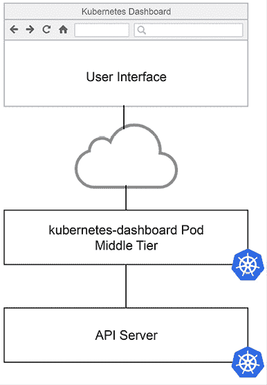
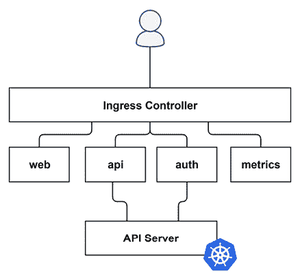
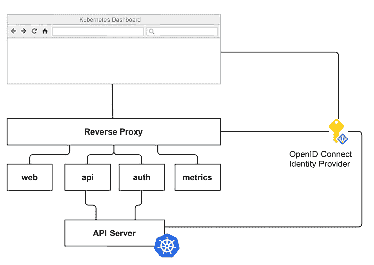
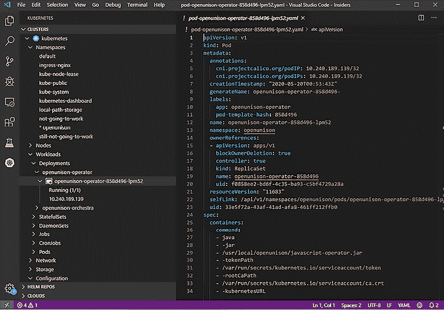
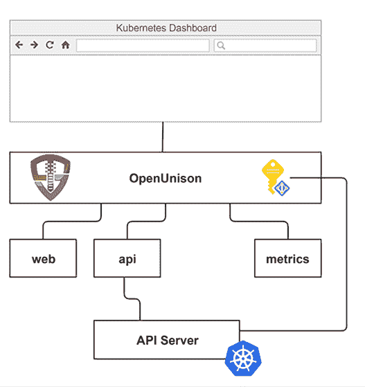

# 10

# 部署安全的 Kubernetes Dashboard

Kubernetes Dashboard 是一个非常有用的工具，可以帮助你了解集群的运行情况。它通常是学习 Kubernetes 时第一个安装的工具，因为它能直观地展示内容。即使在入门阶段之后，仪表盘也能以一种 `kubectl` 无法提供的方式，快速提供大量信息。在一个屏幕上，你可以迅速看到哪些工作负载正在运行、在哪里运行、使用了多少资源，如果需要更新它们，也能很快完成。仪表盘常常被称为“不安全”或“难以访问”。在本章中，我们将向你展示，仪表盘实际上是相当安全的，并且如何让它变得易于访问。

除了 Kubernetes Dashboard，Kubernetes 集群还包括 API 服务器和 `kubelet` 以外的其他组件。集群通常由需要进行安全保护的附加应用程序组成，例如容器注册表、源代码控制系统、流水线服务、GitOps 应用程序和监控系统。集群的用户往往需要直接与这些应用程序进行交互。

虽然许多集群专注于验证用户访问应用程序和服务的权限，但集群解决方案并未获得同等的优先待遇。用户通常被要求使用 kubectl 的端口转发或代理功能来访问这些系统。从安全性和用户体验的角度来看，这种访问方式是一种反模式。用户和管理员首次接触到这种反模式的地方就是 Kubernetes Dashboard。本章将详细解释为什么这种访问方式是反模式，以及如何正确地访问仪表盘。我们将向你展示如何避免部署不安全的 Web 应用程序，并指出相关问题和风险，以便你能知道在获取关于如何访问管理应用程序的建议时应注意什么。

我们将以 Kubernetes Dashboard 为例，学习 Web 应用程序的安全性以及如何在自己的集群中应用这些模式。这些课程不仅适用于仪表盘，还适用于其他集群相关的应用程序，例如用于 Istio 的 **Kiali Dashboard**、Grafana、Prometheus、ArgoCD 和其他集群管理应用程序。

最后，我们将花一些时间讨论本地仪表盘以及如何评估它们的安全性。这是一个流行的趋势，但并非普遍适用。了解这两种方法的安全性非常重要，本章将探讨这些内容。

本章将涵盖以下主题：

+   仪表盘是如何识别你的身份的？

+   理解仪表盘安全风险

+   使用反向代理部署仪表盘

+   与 OpenUnison 集成仪表盘

+   Kubernetes Dashboard 7.0 有什么变化

在概述了本章的工作内容之后，接下来让我们一起研究本章的技术要求。

# 技术要求

要进行本章中的练习，你需要一个新的 KinD 集群，参考 *第二章*，*使用 KinD 部署 Kubernetes*。

你可以在以下 GitHub 仓库中访问本章的代码：[`github.com/PacktPublishing/Kubernetes-An-Enterprise-Guide-Third-Edition/tree/main/chapter10`](https://github.com/PacktPublishing/Kubernetes-An-Enterprise-Guide-Third-Edition/tree/main/chapter10)。

## 获取帮助

我们尽力测试一切，但在我们的集成实验室中，有时会涉及多达六个或更多的系统。鉴于技术的流动性，有时在我们的环境中有效的东西在你的环境中却不一定有效。别担心，我们会帮助你！在我们的 GitHub 仓库上创建一个问题，网址是 [`github.com/PacktPublishing/Kubernetes-An-Enterprise-Guide-Third-Edition/issues`](https://github.com/PacktPublishing/Kubernetes-An-Enterprise-Guide-Third-Edition/issues)，我们会很高兴为你提供帮助！

# 仪表盘是如何识别你的身份的？

Kubernetes 仪表盘是一个强大的 Web 应用程序，可以通过浏览器快速访问你的集群。它让你浏览命名空间、查看节点状态，甚至提供一个可以直接访问 Pod 的 Shell。使用仪表盘和 `kubectl` 有一个根本的区别。作为一个 Web 应用程序，仪表盘需要管理你的会话，而 `kubectl` 则不需要。这意味着，在部署过程中，仪表盘有一套不同的安全问题，通常未被考虑到，可能会导致严重后果。在本节中，我们将探讨仪表盘如何识别用户并与 API 服务器进行交互。

## 仪表盘架构

在深入了解仪表盘如何认证用户之前，了解仪表盘的基本工作原理非常重要。仪表盘从高层次来看，分为三个逻辑层：

+   **用户界面**：这是显示在你浏览器中的 Angular + HTML 前端，你与之进行交互

+   **中间层**：前端与一组托管在仪表盘容器中的 API 交互，将前端的请求转换为 Kubernetes API 请求

+   **API 服务器**：中间层的 API 直接与 Kubernetes API 服务器进行交互

Kubernetes 仪表盘的三层架构可以在以下图示中看到：



图 10.1：Kubernetes 仪表盘逻辑架构

当用户与仪表盘交互时，用户界面会调用中间层，而中间层会进一步调用 API 服务器。仪表盘本身并不知晓如何收集凭证；也没有地方可以提供用户名或密码以登录仪表盘。它有一个基于 Cookie 的非常简单的会话机制，但大多数时候，仪表盘并不真正关心当前登录用户是谁。仪表盘唯一关心的是在与 API 服务器通信时使用什么令牌。

尽管这是逻辑架构，但物理架构将这些组件分布在不同的容器中：



图 10.2：Kubernetes 仪表板容器架构

从版本 7.0 开始，仪表板被拆分为五个独立的容器组件：

+   **Web**：仪表板的用户界面，负责提供 HTML 和 JavaScript，由你的浏览器渲染。此组件没有身份验证，因此不需要身份验证。

+   **API**：该容器托管着仪表板的核心功能。它是与 API 服务器交互的组件，代表用户进行操作。此容器需要知道用户身份。

+   **Auth**：auth 容器用于告诉前端用户令牌是否有效。如果令牌无效，UI 会通过将令牌提供给 API 服务器进行验证，来将用户重定向到登录页面。

+   **Metrics**：该容器为 Kubernetes 仪表板提供**Prometheus**的度量端点。

+   **Ingress 控制器**：由于这些容器都提供来自同一主机的各自路径，因此需要某个组件将它们合并为一个统一的 URL。默认部署包括 Kong 的`Ingress`控制器。

如果你查看了*第六章*中运行的 Pods，你会发现`Kong`和`auth`容器都没有在运行。我们稍后会讲解这个。现在我们已经理解了仪表板的架构，那么仪表板是如何知道你是谁的呢？让我们来逐步了解一下这些选项。

## 身份验证方法

仪表板可以通过两种方式来确定用户身份：

+   **来自登录/上传的 kubectl 配置的令牌**：仪表板可以提示用户提供`kubectl`配置文件或用于身份验证的承载令牌。一旦提供了令牌，UI 会将其作为头信息发送给 API 容器。没有会话管理。当令牌不再有效时，用户会被重定向回登录界面以上传新的令牌。

+   **来自反向代理的令牌**：如果从用户界面到中间层的请求中包含一个带有承载令牌的授权头，中间层将使用该令牌向 API 服务器发起请求。这是最安全的选项，也是本章将详细讲解的实现方法。

如果你阅读了我们之前的版本，或者使用过之前的仪表板版本，可能会好奇为什么不再使用仪表板自己的身份验证并跳过登录步骤。版本 7.x 的架构变化意味着取消了这一选项。不管怎样，每个请求中*必须*包含一个带令牌的`Authorization`头。这是一个非常积极的变化，因为它使得部署一个容易被匿名请求接管的仪表板变得极为困难。实际上，我们删除了本章中谈论如何破解不当部署的仪表板的部分，因为那个攻击路径已经不再有效。

在本章接下来的内容中，将探讨作为访问仪表盘的反模式的第一个选项，并解释为什么反向代理模式从安全性和用户体验的角度来看是访问集群仪表盘实现的最佳选项。

现在，让我们尝试理解仪表盘的安全风险。

# 理解仪表盘的安全风险

当设置新集群时，仪表盘的安全性问题经常被提及。确保仪表盘安全归结为仪表盘的部署方式，而不是仪表盘本身是否安全。回到仪表盘应用程序的架构，根本没有“安全”被内建进去。中间层只是简单地将令牌传递给 API 服务器。

在谈论任何类型的 IT 安全时，重要的是从*深度防御*的角度来看待它。这一理念认为，任何系统都应该具有多层安全保护。如果一层失败，其他层可以弥补漏洞，直到可以解决失败的层。单一失败不会直接为攻击者提供访问权限。

与仪表盘安全性相关的最常见事件是 2018 年特斯拉被加密矿工攻击。攻击者能够访问特斯拉集群中运行的 Pod，因为仪表盘没有进行安全保护。

集群的 Pod 访问了提供攻击者访问特斯拉云提供商的令牌，攻击者在这些云服务上运行他们的加密挖矿系统。值得注意的是，这次攻击在 7.x 版本及以上无法奏效，因为 `api` 容器不会接受没有 `Authorization` 头的请求。

一般来说，仪表盘往往是攻击的切入点，因为它们使攻击者容易找到他们寻找的内容，并且容易部署得不安全。以此为例，在 2019 年的 KubeCon NA 上，展示了一个**夺旗赛**（**CTF**）挑战，其中一个场景是开发者“意外”暴露了集群的仪表盘。

CTF 挑战可以作为家庭实验室通过[`securekubernetes.com/`](https://securekubernetes.com/)进行访问。这是一个非常推荐的资源，适合任何学习 Kubernetes 安全性的人。除了具有教育意义（同时也令人恐惧），它也非常有趣！

由于我们不能再在没有某种身份验证的情况下部署仪表盘，我们将重点关注使用 `ServiceAccount` 令牌和默认设置的安全问题。此外，Kong 和下游服务之间没有加密。

## 探索仪表盘安全问题

版本 7.x 的仪表盘取消了不需要登录即可部署仪表盘的功能，但默认部署仍然存在一些安全问题，需要解决。

首先，将仪表盘部署到你的集群中：

```
helm repo add kubernetes-dashboard https://kubernetes.github.io/dashboard/
helm upgrade --install kubernetes-dashboard kubernetes-dashboard/kubernetes-dashboard --create-namespace --namespace kubernetes-dashboard 
```

当你检查 pod 时，你会注意到现在有我们之前描述的五个容器。还有一个 `NodePort` 服务用于 `Kong` 入口网关。虽然你可以选择部署不同的 `Ingress`，但我们将专注于默认设置。你还会看到，Kong 到 pod 之间也没有加密。

## 使用令牌登录

用户可以在登录屏幕上将令牌上传到仪表板。如前所述，仪表板会接受用户的承载令牌并将其与所有请求一起发送到 API 服务器。虽然这看起来是一个安全的解决方案，但它也带来了自己的问题。仪表板不是 `kubectl`，不知道如何在令牌过期时刷新令牌。这意味着令牌需要具有较长的生命周期才能有效。它要么需要创建可以使用的服务帐户，要么需要使 OpenID Connect 的 `id_tokens` 生命周期更长。这两种选择都会消除利用 OpenID Connect 进行身份验证所带来的大部分安全性。

正如本书中反复提到的，`ServiceAccount` 令牌从未打算在集群外使用。你需要分发该令牌，当然由于它是一个承载令牌，容易丢失，可能会被提交到 git 仓库，或者可能被某些有问题的代码泄露。且仪表板和 Kubernetes 使用的令牌没有区别，因此一个泄露的令牌可以直接用来访问 Kubernetes API。虽然这个解决方案存在是为了让使用仪表板变得相对容易，但不应在生产环境中使用。

在查看了令牌登录仪表板的问题后，我们接下来将看看默认安装和缺乏加密的问题。

## 未加密的连接

默认的仪表板 Helm 图表不会加密从 Ingress 控制器（默认是 Kong）到各个容器的连接。无论你如何认证到仪表板，这都可能是一个严重的安全反模式。正如我们所讨论的，承载令牌可以被任何具有网络访问权限的人使用，这意味着来自未加密网络连接的丢失令牌可能导致严重的安全漏洞。即使使用短期令牌，这也是一个令人担忧的设计选择。每当你构建安全性时，使用深度防御的方法非常重要，永远不要有单点故障。在这种情况下，缺乏加密意味着你可能会有单点故障，无法做出任何备份。

部署仪表板时，应该启用反向代理与 API 容器之间的加密。我们将在下一节中介绍如何操作。Web 和 metrics 容器的重要性较低。auth 容器不支持加密，这虽然是一个问题，但通过正确的配置可以绕过。

另一种方法是依赖像 Istio 这样的服务网格。如果你启用网格，可以依赖它来进行加密，但这会增加一个额外的组件。

由于创建内部证书颁发机构（CA）非常简单，实际上没有理由不加密这些连接。

虽然我们聚焦于默认 Kubernetes 仪表盘安装的安全性问题，接下来我们将讨论如何正确部署仪表盘。

# 使用反向代理部署仪表盘

代理是 Kubernetes 中一种常见的模式；在 Kubernetes 集群的每一层都有代理。大多数 Kubernetes 服务网格实现也使用代理模式，创建 sidecar 来拦截请求。此处描述的反向代理与这些代理的区别在于它们的目的。微服务代理通常不携带会话，而 web 应用程序需要会话来管理状态。

以下图示展示了带反向代理的 Kubernetes 仪表盘架构：



图 10.3：带反向代理的 Kubernetes 仪表盘

*图 10.3* 中展示的反向代理执行四个角色：

+   **路由**：仪表盘使用的每个容器都有自己独立的路径，基于主机 URL。反向代理负责将请求路由到正确的容器。

+   **认证**：反向代理拦截未认证的请求（或过期的会话），并触发与 OpenID Connect 身份提供者的认证过程来验证用户。

+   **会话管理**：Kubernetes 仪表盘是面向用户的应用程序。它应该具有典型的控制措施，以支持会话超时和撤销。要警惕将所有会话数据存储在 cookie 中的反向代理方法，因为这些方法很难撤销。

+   **身份注入**：一旦代理认证了用户，它需要能够在每个请求中注入一个 HTTP 授权头，该头是一个 JWT，标识已登录的用户，由相同的 OpenID Connect 身份提供者签名，并且与 API 服务器具有相同的发行者和接收者。例外情况是使用假冒身份（impersonation），正如在 *第六章*《将认证集成到你的集群》中所讨论的那样，注入特定的头信息到请求中。

重要的是，在配置反向代理时，它应该：

1.  加密 api 和 auth 容器的流量：这两个容器是需要用户令牌的容器，因此加密非常重要。由于 auth 容器不支持加密，你可能会选择完全绕过这个容器。我们将在下一节中解释更多内容，讨论 OpenUnison 如何与仪表盘集成。

1.  管理和更新令牌：使用反向代理时没有必要使用长生命周期的令牌。它应该能够根据令牌的有效期自动续期。

合并这些意味着消除 Kong Ingress 控制器。由于你的认证反向代理已经在执行工作，因此不再需要它。

反向代理不需要运行在集群中。根据你的设置，可能会更有利，特别是在使用集群模拟时。使用模拟时，反向代理会使用服务账户的令牌，因此最好让该令牌永远不要离开集群。

本章的重点是 Kubernetes 项目的仪表板。仪表板功能有多种选择。接下来，我们将探讨这些仪表板如何与 API 服务器交互以及如何评估它们的安全性。

## 本地仪表板

第三方仪表板的一个共同特点是，它们通常在你的工作站上本地运行，并使用 Kubernetes SDK 以与 API 服务器进行类似 `kubectl` 的交互。这些工具的优势在于，不需要部署额外的基础设施来确保它们的安全性。

Visual Studio Code 的 Kubernetes 插件是一个本地应用程序，利用直接的 API 服务器连接。启动插件时，Visual Studio Code 会访问你当前的 `kubectl` 配置，并使用该配置与 API 服务器进行交互。它甚至会在 OpenID Connect 令牌过期时刷新令牌：



图 10.4：带 Kubernetes 插件的 Visual Studio Code

Visual Studio Code 的 Kubernetes 插件能够刷新其 OpenID Connect 令牌，因为它是使用 client-go SDK 构建的，这与 `kubectl` 使用的客户端库相同。在评估客户端仪表板时，确保它与你的认证方式兼容，即使它不是 OpenID Connect。许多 Kubernetes 的 SDK 并不支持 OpenID Connect 令牌的刷新。直到最近（本书发布之时），Java 和 Python SDK 才开始像 client-go SDK 一样支持 OpenID Connect 令牌的刷新。在评估本地仪表板时，确保它能够利用你的短期令牌，并在需要时刷新它们，就像 `kubectl` 一样。

在 Kubernetes 生态系统中，有各种各样的仪表板，每个仪表板都有自己独特的管理方式。我不想仅仅列出这些仪表板，而是希望为你提供它们的优缺点和安全影响的深入评估。相反，我们来专注于在评估你想使用哪个仪表板时，应该关注的关键因素：

+   如果仪表板是基于 Web 的：

    +   它是否直接支持 OpenID Connect？

    +   它是否能够在反向代理后运行，并接受令牌和模拟头信息？

    +   它是否需要为其自己的服务账户授予权限？这些权限是否遵循最小权限原则？

+   如果仪表板是本地的：

    +   客户端 SDK 是否支持 OpenID Connect，能够像 `kubectl` 一样自动刷新令牌，使用 client-go SDK？

这些是重要的评估问题，不仅仅是针对 Kubernetes 仪表盘，也适用于你可能用于其他集群管理应用程序的仪表盘。例如，**TektonCD 仪表盘**，这是一个用于管理管道的 Web 应用程序，需要删除几个 RBAC 绑定，以确保仪表盘必须使用用户身份，无法被篡改为使用其 `ServiceAccount` 身份。

## 其他集群级应用程序

本章的介绍讨论了一个集群除了 Kubernetes 之外，由多个应用程序组成。其他应用程序可能会遵循与仪表盘相同的安全模型，并且反向代理方法比 `kubectl` 端口转发更适合暴露这些应用程序，即使该应用程序没有内置安全性。以常见的 Prometheus 堆栈为例，Grafana 支持用户身份验证，但 Prometheus 和 Alert Manager 不支持。

你将如何跟踪谁访问了这些系统，或者他们何时通过端口转发访问的？

使用反向代理，每个 URL 的日志以及经过身份验证访问该 URL 的用户可以转发到中央日志管理系统，并由 **安全信息和事件管理器** (**SIEM**) 分析，提供集群使用的额外可视化层。

与仪表盘一样，使用反向代理与这些应用程序结合使用提供了一种分层安全方法。它将会话管理从相关应用中卸载，并提供增强身份验证措施的能力，例如多因素认证和会话撤销。这些优势将导致集群更加安全且易于使用。

现在让我们讨论如何将仪表盘与 OpenUnison 集成。

# 将仪表盘与 OpenUnison 集成

有关 OpenUnison 如何通过冒充注入身份标头的话题已在 *第六章*，*将身份验证集成到集群中* 中讨论过，但没有涉及 OpenUnison 如何在集成 OpenID Connect 的集群中将用户身份注入到仪表盘中。它是可行的，但没有解释。 本节将以 OpenUnison 实现为例，说明如何为仪表盘构建反向代理。通过本节中的信息，你可以更好地理解 API 安全性，或者为仪表盘认证构建自己的解决方案。

OpenUnison 部署包含两个集成的应用程序：

+   **OpenID Connect 身份提供者与登录门户**：此应用程序托管登录过程和 API 服务器用于获取验证 `id_token` 所需密钥的发现 URL。它还托管获取 `kubectl` 令牌的界面。

+   **仪表盘**：一个反向代理应用程序，它向集成的 OpenID Connect 身份提供者进行身份验证，并将用户的 `id_token` 注入到每个请求中。

这个图表展示了仪表板的用户界面如何与其服务器端组件进行交互，同时通过反向代理注入用户的`id_token`：



图 10.5: OpenUnison 与仪表板的集成

仪表板使用与 API 服务器相同的 OpenID Connect 身份提供者，但并不使用它提供的`id_token`。相反，OpenUnison 有一个插件，可以独立于身份提供者生成一个新的`id_token`，其中包含用户的身份数据。OpenUnison 之所以能够做到这一点，是因为生成用于 OpenID Connect 身份提供者的`id_token`的密钥（该密钥由`kubectl`和 API 服务器使用）存储在 OpenUnison 中。这与将仪表板与 KeyCloak 或 Dex 集成的方式不同，因为那样你需要额外的组件来认证用户并维护注入请求中的`id_token`。这通常通过 OAuth2 代理来完成，该代理需要与身份提供者（即 Dex 或 KeyCloak）、仪表板和入口控制器进行集成。OpenUnison 为你完成了所有这些步骤。

一个新的、短期有效的令牌是与`kubectl`使用的 OpenID Connect 会话分开生成的。这样，令牌可以独立于`kubectl`会话进行刷新。这个过程提供了 1 到 2 分钟的令牌有效期，同时还保持了直接登录过程的便利性。

你还会注意到没有认证容器。认证容器的唯一作用是返回一些 JSON 数据，告诉用户界面用户仍然处于认证状态。由于这个容器不支持任何加密，我们就不调用它，而是直接在 OpenUnison 中生成 JSON 数据。这消除了对认证容器的需求，并避免了因没有 TLS 网络连接和承载令牌而可能出现的问题。

如果你对安全性有敏锐的眼光，你可能会指出，这种方法在安全模型中有一个明显的单点故障：用户的凭证！攻击者通常只需要请求凭证就能获得它们。这通常通过电子邮件进行，在一种叫做网络钓鱼的攻击中，攻击者会向受害者发送一个看似登录页面的链接，但实际上这个页面只是用来收集凭证的。这就是为什么多因素认证对于基础设施系统如此重要。

在 2019 年的一项研究中，谷歌展示了多因素认证阻止了 99%的自动化和钓鱼攻击（[`security.googleblog.com/2019/05/new-research-how-effective-is-basic.xhtml`](https://security.googleblog.com/2019/05/new-research-how-effective-is-basic.xhtml)）。将多因素认证添加到身份提供者 OpenUnison 认证中，或直接将其集成到 OpenUnison 中，是确保仪表板和集群安全的最有效方法之一。

接下来，我们将看看仪表板新版本发布后的变化。

# Kubernetes 仪表板 7.0 版本的变化

我们在本章中讨论了 7.0 版本的仪表板，但正如企业中常见的情况一样，旧版 2.7 仪表板仍在使用，并且可能还会使用一段时间。2.7 版本和即将发布的 7.0 版本之间的主要区别是，在 7.0 版本中，API 层和前端层被拆分为多个容器。维护者这样做是为了更好地支持更复杂的使用案例，因此请关注这个项目！

# 总结

在本章中，我们详细探讨了 Kubernetes 仪表板的安全性。首先，我们介绍了架构以及仪表板如何将您的身份信息传递给 API 服务器。然后，我们探讨了仪表板如何受到攻击，最后，详细说明了如何正确地安全部署仪表板。

拥有这些知识后，您现在可以为用户提供一个安全的工具。许多用户更喜欢通过 Web 浏览器访问仪表板的简便性。添加多因素认证会增加额外的安全层和安心感。当您的安全团队质疑仪表板的安全性时，您将能够提供所需的答案以解决他们的担忧。

前三章重点讨论了 Kubernetes API 的安全性。接下来，在*第十一章*，*使用 Open Policy Agent 扩展安全性*中，我们将探讨如何确保每个 Kubernetes 部署的软肋——节点的安全！

# 问题

1.  仪表板是不安全的。

    1.  正确

    1.  错误

1.  仪表板如何识别用户？

    1.  通过反向代理注入或由登录表单提供的令牌

    1.  用户名和密码

    1.  服务帐户

    1.  多因素认证

1.  仪表板如何跟踪会话状态？

    1.  会话存储在 etcd 中

    1.  会话存储在名为`DashboardSession`的自定义资源对象中

    1.  没有会话

    1.  如果上传了令牌，它会被加密并作为 cookie 存储在浏览器中

1.  使用令牌时，仪表板多久可以刷新一次令牌？

    1.  每分钟一次

    1.  每三十秒

    1.  当令牌过期时

    1.  以上都不是

1.  部署仪表板的最佳方法是什么？

    1.  使用`kubectl`端口转发

    1.  使用`kubectl`代理

    1.  使用带有秘密 Ingress 主机

    1.  在反向代理后面

1.  仪表板不支持冒充。

    1.  正确

    1.  错误

1.  OpenUnison 是唯一支持仪表板的反向代理。

    1.  正确

    1.  错误

# 答案

1.  b

1.  a – 必须有一个令牌

1.  c – 当令牌过期时，系统会要求您提供一个新的令牌

1.  d – 仪表板无法刷新令牌

1.  d – 更好的安全性和可用性

1.  b

1.  b
