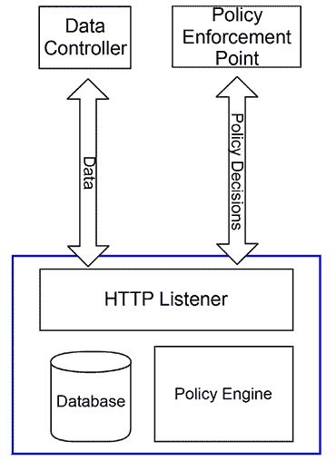
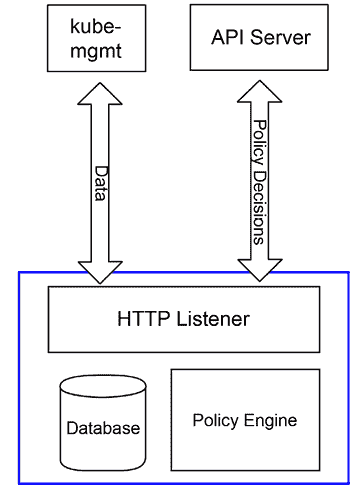
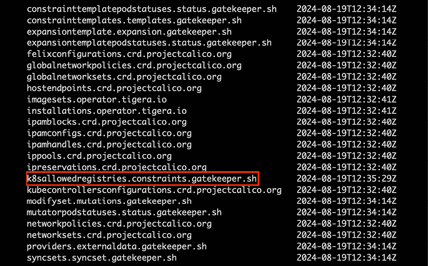

# 11

# 使用开放策略代理扩展安全性

到目前为止，我们已经涵盖了 Kubernetes 的内置认证和授权功能，这有助于保护集群。虽然这将涵盖大多数用例，但并不涵盖所有用例。一些 Kubernetes 无法处理的安全最佳实践包括预授权容器注册表和确保 Ingress 对象不重叠（尽管大多数 Ingress 控制器都会检查，例如 NGINX）。

这些任务由外部系统完成，并称为动态准入控制器。**开放策略代理**（**OPA**）及其 Kubernetes 本地子项目**Gatekeeper**是处理这些用例最流行的方式之一。本章将详细介绍 OPA 和 Gatekeeper 的部署方法，OPA 的架构以及如何编写策略。

在本章中，我们将涵盖以下主题：

+   动态准入控制器简介

+   OPA 是什么以及它是如何工作的？

+   使用 Rego 编写策略

+   强制执行 Ingress 策略

+   改变对象和默认值

+   创建不使用 Rego 的策略

完成本章后，您将开始为集群和工作负载开发和实施重要的策略。

# 技术要求

要完成本章的实践练习，您需要一台 Ubuntu 22.04 服务器。

您可以在以下 GitHub 存储库中访问本章的代码：[`github.com/PacktPublishing/Kubernetes-An-Enterprise-Guide-Third-Edition/tree/main/chapter11`](https://github.com/PacktPublishing/Kubernetes-An-Enterprise-Guide-Third-Edition/tree/main/chapter11)。

# 动态准入控制器简介

准入控制器是 Kubernetes 中的一种专用 Webhook，当对象被创建、更新或删除时运行。当发生这三个事件之一时，API 服务器将对象和操作的信息发送到 Webhook。准入控制器可用于确定是否应执行操作，或者给集群操作员修改对象定义的机会，然后再由 API 服务器处理。我们将研究如何使用此机制来强制执行安全性并扩展 Kubernetes 的功能。

扩展 Kubernetes 的两种方法：

+   构建自定义资源定义，以便定义您自己的对象和 API。

+   实现一个 Webhook，监听 API 服务器的请求并回复必要的信息。您可能还记得，在*第六章*，*将认证集成到您的集群中*中，我们解释了可以使用自定义 Webhook 来验证令牌。

从 Kubernetes 1.9 开始，Webhook 可以被定义为动态准入控制器，在 1.16 中，动态准入控制器 API 变为**普遍可用**（**GA**）。

有两种类型的动态准入控制器，验证型和变更型。验证型准入控制器验证新的对象、更新或删除是否可以继续进行。变更型准入控制器允许 Webhook 修改对象的创建、删除或更新的负载。本节将重点介绍准入控制器的细节。我们将在下一章中更详细地讨论变更控制器，*第十二章*，*使用 GateKeeper 的节点安全性*。

协议非常简单。每当创建或编辑某种类型的对象时，只要为该类型的对象注册了动态准入控制器，Webhook 就会通过 HTTP POST 被调用。然后，Webhook 预计返回 JSON，表示是否允许该操作。

从 1.16 版本开始，`admission.k8s.io/v1` 已进入 GA 阶段。所有示例将使用 GA 版本的 API。

提交到 Webhook 的请求由多个部分组成。由于 `Admission` 对象可能非常大，我们在此不提供示例，但我们将使用 [`github.com/PacktPublishing/Kubernetes-An-Enterprise-Guide-Third-Edition/blob/main/chapter11/example_admission_request.json`](https://github.com/PacktPublishing/Kubernetes-An-Enterprise-Guide-Third-Edition/blob/main/chapter11/example_admission_request.json) 作为示例：

+   **对象标识符**: `resource` 和 `subResource` 属性标识对象、API 和组。如果对象的版本正在升级，则会指定 `requestKind`、`requestResource` 和 `requestSubResource`。此外，`namespace` 和 `operation` 用于提供对象的位置以及它是 `CREATE`、`UPDATE`、`DELETE` 还是 `CONNECT` 操作。在我们的示例中，正在创建一个 `Deployment` 资源，并且其 `subResource` 是 `Scale`，用于在 `my-namespace` 命名空间中扩展我们的 `Deployment`。

+   **提交者标识符**: `userInfo` 对象标识提交者的用户和组。提交者和创建原始请求的用户不总是相同的。例如，如果用户创建了一个 `Deployment`，则 `userInfo` 对象不会是创建原始 `Deployment` 的用户；它将是 `ReplicaSet` 控制器的服务账户，因为 `Deployment` 创建了一个 `ReplicaSet`，该 `ReplicaSet` 创建了 pod。在我们的示例中，`uid` 为 admin 的用户提交了扩展请求。

+   **对象**: `object` 代表提交的对象的 JSON，而 `oldObject` 代表在更新操作中被替换的内容。最后，`options` 指定请求的其他选项。在我们的示例中，新的 pod 在扩展操作后将提交，包含新的副本数。

Webhook 的响应将简单地包含两个属性，即请求中的原始 `uid` 和 `allowed`，其值可以是 `true` 或 `false`。例如，为了允许我们的扩展操作完成：

```
{
  "uid": "705ab4f5-6393-11e8-b7cc-42010a800002"
  "allowed": true
} 
```

`userInfo` 对象可能会迅速引发复杂问题。由于 Kubernetes 通常使用多个层次的控制器来创建对象，因此根据与 API 服务器交互的用户来跟踪使用创建可能会变得很困难。

基于 Kubernetes 中的对象进行授权会更加高效，例如命名空间标签或其他对象。

一个常见的用例是允许开发者拥有一个他们是管理员的 **沙箱**，但是该沙箱的容量非常有限。与其验证某个特定用户是否请求了过多的内存，不如在个人命名空间上添加一个限制注解，这样准入控制器就有了一个具体的参考依据，不管用户是提交了 Pod 还是 Deployment。这样，策略就会检查 `namespace` 上的注解，而不是检查单独的用户。为了确保只有命名空间的所有者能够在其中创建资源，可以使用 RBAC 来限制访问。

关于通用验证 Webhook 的最后一点：没有办法指定密钥或密码。这是一个匿名请求。虽然理论上，验证 Webhook 可以用于实现对集群的更新，但并不推荐这样做。例如，你可以使用验证 Webhook 在创建 `Namespace` 时创建 `ClusterRoleBinding`，但这意味着你的策略检查就无法重复进行。最好将策略检查和工作流分开。

现在我们已经讨论了 Kubernetes 如何实现动态访问控制器，接下来我们将查看 OPA 中最受欢迎的一个选项。

# 什么是 OPA，它是如何工作的？

OPA 是一个轻量级的授权引擎，非常适合在 Kubernetes 中使用。它并非一开始就诞生于 Kubernetes，但无疑在这里找到了合适的定位。OPA 并不要求构建动态准入控制器，但它在这方面非常出色，并且有大量资源和现成的策略可以用来开始构建你的策略库。

本节提供了 OPA 及其组件的高级概述，接下来的章节将详细介绍 OPA 在 Kubernetes 中的实现。

## OPA 架构

OPA 由三个组件组成——HTTP 监听器、策略引擎和数据库：



图 11.1：OPA 架构

OPA 使用的数据库是内存中的，并且是短暂的。它不会持久化用于做出策略决策的信息。一方面，这使得 OPA 非常具备可扩展性，因为它本质上是一个授权微服务。另一方面，这意味着每个 OPA 实例都必须独立维护，并且必须与权威数据保持同步：



图 11.2：Kubernetes 中的 OPA

当 OPA 用于 Kubernetes 时，它通过一个名为 `kube-mgmt` 的 sidecar 填充其数据库，该 sidecar 会对你想导入到 OPA 中的对象设置监视。当对象被创建、删除或更改时，`kube-mgmt` 会更新其 OPA 实例中的数据。这意味着 OPA 与 API 服务器是“最终一致”的，但它不一定是 API 服务器中对象的实时表示。由于整个 etcd 数据库基本上被一遍又一遍地复制，因此必须特别小心，避免将敏感数据（如 `Secrets`）复制到 OPA 数据库中。

现在，让我们介绍一下 OPA 策略语言——Rego。

## Rego，OPA 策略语言

我们将在下一节详细介绍 Rego。这里要提到的关键点是，**Rego** 是一种**策略评估语言**，而不是通用编程语言。对于习惯使用 Golang、Java 或 JavaScript 这类支持复杂逻辑（如迭代器和循环）的开发者来说，Rego 可能会显得有些困难。Rego 的设计目的是评估策略，因此它被精简成了一个专注于此的语言。例如，如果你想用 Java 编写代码来检查一个 pod 中所有容器镜像是否以指定的注册表之一为开头，代码可能会是这样的：

```
public boolean validRegistries(List<Container> containers,List<String> allowedRegistries) {
  for (Container c : containers) {
          boolean imagesFromApprovedRegistries = false;
    for (String allowedRegistry : allowedRegistries) {
                 imagesFromApprovedRegistries =
                 imagesFromApprovedRegistries  || c.getImage().startsWith(allowedRegistry);
    }
    if (! imagesFromApprovedRegistries) {
    return false;
    }
   }
   return true;
} 
```

这段代码遍历每一个容器和每一个允许的注册表，确保所有的镜像都符合正确的策略。Rego 中相同的代码要简洁得多：

```
invalidRegistry {
  ok_images = [image | startswith(input_images[j],input.parameters.registries[_]) ; image = input_images[j] ]
  count(ok_images) != count(input_images)
} 
```

如果容器中的任何镜像来自未授权的注册表，上述规则将评估为 `true`。我们将在本章稍后的部分详细讲解这段代码是如何工作的。理解这段代码为何如此简洁的关键在于，Rego 推断了大部分循环和测试的样板代码。第一行生成了一个符合要求的镜像列表，第二行确保符合要求的镜像数量与镜像总数相匹配。如果它们不匹配，那么其中一个或多个镜像必定来自无效的注册表。能够编写简洁的策略代码是 Rego 非常适合用作准入控制器的原因。

到目前为止，我们主要集中讨论了通用的 OPA 和 Rego。在早期，你需要使用 `ConfigMaps` 将 Kubernetes 直接集成到 OPA 中以存储策略；然而，这证明是非常不方便的。微软开发了一个名为 GateKeeper 的工具，它是 Kubernetes 原生的，使得在 Kubernetes 中更容易充分利用 OPA。现在，让我们介绍一下 Gatekeeper。

## Gatekeeper

到目前为止，讨论的内容都是关于 OPA 的通用性。章节开头提到，OPA 并不是最早在 Kubernetes 中出现的。早期的实现有一个 sidecar，它将 OPA 数据库与 API 服务器保持同步，但你需要手动创建作为`ConfigMap`对象的策略，并手动为 webhook 生成响应。2018 年，微软推出了 Gatekeeper（[`github.com/open-policy-agent/gatekeeper`](https://github.com/open-policy-agent/gatekeeper)），提供了一个原生的 Kubernetes 体验。

除了从`ConfigMap`对象迁移到适当的自定义资源之外，Gatekeeper 还增加了审计功能，让你可以针对现有对象测试策略。如果某个对象违反了策略，就会创建一个违规条目来跟踪它。通过这种方式，你可以获得集群中现有策略违规的快照，或者知道在 Gatekeeper 因升级而停机时是否遗漏了某些内容。

Gatekeeper 与通用 OPA 的一个主要区别在于，在 Gatekeeper 中，OPA 的功能不是通过任何人都能调用的 API 暴露的。OPA 是嵌入式的，Gatekeeper 直接调用 OPA 来执行策略并保持数据库的最新状态。决策只能基于 Kubernetes 中的数据，或者在评估时提取数据。

### 部署 Gatekeeper

将使用的示例假设使用的是 Gatekeeper，而不是通用的 OPA 部署。

首先，创建一个新的集群来部署 GateKeeper：

```
$ cd chapter2
$ ./create-cluster.sh 
```

新集群启动后，按照 Gatekeeper 项目的指示，使用以下命令：

```
$ kubectl apply -f https://raw.githubusercontent.com/open-policy-agent/gatekeeper/master/deploy/gatekeeper.yaml 
```

这将启动 Gatekeeper 命名空间的 pod 并创建验证 webhook。部署完成后，继续下一节。我们将在本章剩余部分详细讲解如何使用 Gatekeeper。

## 自动化测试框架

OPA 为你的策略提供了一个内置的自动化测试框架。这是 OPA 最有价值的方面之一。在部署前能够持续测试策略，可以节省大量的调试时间。在编写策略时，创建一个与策略文件同名但在名称中带有`_test`的文件。例如，如果你的策略文件是`mypolicies.rego`，则测试用例应保存在同一目录下的`mypolicies_test.rego`文件中。运行`opa test`命令将执行你的测试用例。我们将在下一节展示如何使用它来调试代码。

在介绍了 OPA 的基础知识以及其构建方式后，下一步是学习如何使用 Rego 编写策略。

# 使用 Rego 编写策略

Rego 是一种专门为编写策略而设计的语言。它不同于你可能编写过的大多数编程语言。典型的授权代码可能看起来像这样：

```
//assume failure
boolean allowed = false;
//on certain conditions allow access
if (someCondition) {
  allowed = true;
}
//are we authorized?
if (allowed) {
  doSomething();
} 
```

授权码通常默认为未授权状态，必须满足特定条件才能允许最终操作被授权。而 Rego 采取了不同的方法。Rego 通常会授权所有操作，除非发生特定的一组条件。

Rego 与一般编程语言之间的另一个主要区别是，没有明确的`if`/`then`/`else`控制语句。当一行 Rego 代码需要做出决定时，该行代码的含义是“如果这行代码为假，则停止执行。”例如，以下 Rego 代码表示：“如果镜像以`myregistry.lan/`开头，则停止执行策略并通过此检查；否则，生成错误信息”：

```
not startsWith(image,"myregistry.lan/")
msg := sprintf("image '%v' comes from untrusted registry", [image]) 
```

相同的代码在 Java 中可能如下所示：

```
if (! image.startsWith("myregistry.lan/")) {
   throw new Exception("image " + image + " comes from untrusted registry");
} 
```

隐式控制语句和显式控制语句之间的这种差异通常是学习 Rego 时最陡峭的部分。虽然这可能比其他语言有更陡峭的学习曲线，但 Rego 通过使测试和构建策略变得简单、自动化和可管理，弥补了这一点。Rego 的另一个优点是它可以用于应用级的授权。我们将在本书后面讲解 Istio 时详细讨论这一点。

OPA 可以用于自动化策略的测试。这在编写依赖于集群安全性的代码时非常重要。自动化测试有助于加快开发进程，并通过捕捉由新工作代码引入的 bug，从而提高安全性。接下来，让我们一起走过编写 OPA 策略、测试它并将其部署到集群的生命周期。

## 开发 OPA 策略

使用 OPA 的一个常见示例是限制 Pod 可以来自哪些注册表。这是在集群中常见的安全措施，用于限制可以在集群中运行的 Pod。例如，我们曾提到比特币矿工。如果集群只接受来自你自己内部注册表的 Pod，那么这就是阻止恶意行为者滥用集群的一步。首先，让我们编写我们的策略，取自 OPA 文档网站 ([`www.openpolicyagent.org/docs/latest/kubernetes-introduction/`](https://www.openpolicyagent.org/docs/latest/kubernetes-introduction/))：

```
package k8sallowedregistries
invalidRegistry {
  input_images[image]
  not startswith(image, "quay.io/")
}
input_images[image] {
  image := input.review.object.spec.containers[_].image
}
input_images[image] {
  image := input.review.object.spec.template.spec.containers[_].image
} 
```

这段代码的第一行声明了我们策略所在的`package`。OPA 中的所有内容，包括数据和策略，都存储在一个包中。

OPA 中的包类似于文件系统中的目录。当你将策略放入一个包中时，所有内容都是相对于该包的。在本例中，我们的策略位于`k8sallowedregistries`包中。

下一节定义了一个规则。如果我们的 pod 使用来自`quay.io`的镜像，这个规则最终将是`undefined`。如果 pod 没有来自`quay.io`的镜像，则规则返回`true`，表示注册表无效。当在动态准入审核期间评估 pod 时，Gatekeeper 会将其视为失败，并向 API 服务器返回`false`。

接下来的两个规则非常相似。第一个`input_images`规则表示“对对象的`spec.container`中的每个`container`进行调用规则的评估”，直接匹配提交给 API 服务器的 pod 对象，并提取每个`container`的所有`image`值。第二个`input_images`规则表示“对对象的`spec.template.spec.containers`中的每个`container`进行调用规则的评估”，以短路`Deployment`对象和`StatefulSets`。

最后，我们添加 Gatekeeper 需要的规则，以便在评估失败时通知 API 服务器：

```
violation[{"msg": msg, "details": {}}] {
  invalidRegistry
  msg := "Invalid registry"
} 
```

如果注册表有效，这个规则将返回一个空的`msg`。将代码拆分为做出策略决策的代码和响应反馈的代码是一个好主意。这使得测试更容易，接下来我们就来做这件事。

## 测试 OPA 策略

一旦我们编写完策略，我们希望设置一个自动化测试。与测试任何其他代码一样，重要的是你的测试用例能够覆盖预期和意外的输入。同样，测试正面和负面的结果也很重要。仅仅验证我们的策略允许正确的注册表是不够的；我们还需要确保它能阻止无效的注册表。以下是我们代码的八个测试用例：

```
package k8sallowedregistries
test_deployment_registry_allowed {
    not invalidRegistry with input as {"apiVersion"...
}
test_deployment_registry_not_allowed {
    invalidRegistry with input as {"apiVersion"...
}
test_pod_registry_allowed {
    not invalidRegistry with input as {"apiVersion"...
}
test_pod_registry_not_allowed {
    invalidRegistry with input as {"apiVersion"...
}
test_cronjob_registry_allowed {
    not invalidRegistry with input as {"apiVersion"...
}
test_cronjob_registry_not_allowed {
    invalidRegistry with input as {"apiVersion"...
}
test_error_message_not_allowed {
    control := {"msg":"Invalid registry","details":{}}
    result = violation with input as {"apiVersion":"admissi…
    result[_] == control
}
test_error_message_allowed {
    result = violation with input as {"apiVersion":"admissi…
    result == set()
} 
```

总共有八个测试：两个测试确保在出现问题时返回正确的错误消息，六个测试涵盖三种输入类型的两种使用情况。我们正在测试简单的 pod 定义、`Deployment` 和 `CronJob`。为了验证预期的成功或失败，我们为每种输入类型包括了具有`image`属性的定义，其中包含`docker.io`和`quay.io`。代码为了打印而做了简化，但可以从[`github.com/PacktPublishing/Kubernetes-An-Enterprise-Guide-Third-Edition/tree/main/chapter11/simple-opa-policy/rego/`](https://github.com/PacktPublishing/Kubernetes-An-Enterprise-Guide-Third-Edition/tree/main/chapter11/simple-opa-policy/rego/)下载。

要运行测试，首先按照 OPA 网站上的说明安装 OPA 命令行可执行文件：[`www.openpolicyagent.org/docs/latest/#running-opa`](https://www.openpolicyagent.org/docs/latest/#running-opa)。下载后，进入`simple-opa-policy/rego`目录并运行测试：

```
$ opa test .
data.kubernetes.admission.test_cronjob_registry_not_allowed: FAIL (248ns)
--------------------------------------------------------------
PASS: 7/8
FAIL: 1/8 
```

七个测试通过，但 `test_cronjob_registry_not_allowed` 测试失败了。提交为 `input` 的 `CronJob` 不应被允许，因为其 `image` 使用了 `docker.io`。它之所以被漏掉，是因为 `CronJob` 对象遵循与 `Pods` 和 `Deployments` 不同的模式，因此我们的两个 `input_image` 规则无法加载任何来自 `CronJob` 的容器对象。好消息是，当 `CronJob` 最终提交 pod 时，Gatekeeper 不会验证它，从而防止它运行。坏消息是，直到 pod 应该被运行时，才会发现这个问题。确保我们在检查容器对象时，除了其他容器对象外，还能检查 `CronJob` 对象，这样会使调试变得更加容易，因为 `CronJob` 不会被接受。

为了让所有测试通过，在 GitHub 仓库中的 `limitregistries.rego` 文件中添加一个新的 `input_container` 规则，以匹配 `CronJob` 使用的容器：

```
input_images[image] {
  image := input.review.object.spec.jobTemplate.spec.template.spec.containers[_].image
} 
```

现在，运行测试将显示一切通过：

```
$ opa test .
PASS: 8/8 
```

在策略经过测试后，下一步是将策略集成到 Gatekeeper 中。

## 将策略部署到 Gatekeeper

我们创建的策略需要部署到 Gatekeeper，Gatekeeper 提供 Kubernetes 自定义资源，策略需要加载到这些资源中。第一个自定义资源是 `ConstraintTemplate`，它存储了我们策略的 Rego 代码。这个对象让我们能够指定与策略执行相关的参数，接下来我们将介绍这个。为了简单起见，创建一个没有参数的模板：

```
apiVersion: templates.gatekeeper.sh/v1beta1
kind: ConstraintTemplate
metadata:
  name: k8sallowedregistries
spec:
  crd:
    spec:
      names:
        kind: K8sAllowedRegistries
      validation: {}
  targets:
    - target: admission.k8s.gatekeeper.sh
      rego: |
        package k8sallowedregistries
        .
        .
        . 
```

这个模板的完整源代码可以在 [`github.com/PacktPublishing/Kubernetes-An-Enterprise-Guide-Third-Edition/blob/main/chapter11/simple-opa-policy/yaml/gatekeeper-policy-template.yaml`](https://github.com/PacktPublishing/Kubernetes-An-Enterprise-Guide-Third-Edition/blob/main/chapter11/simple-opa-policy/yaml/gatekeeper-policy-template.yaml) 查看。

一旦创建，下一步是通过基于模板创建约束来应用策略。约束是 Kubernetes 中的对象，基于 `ConstraintTemplate` 的配置。请注意，我们的模板定义了一个自定义资源定义。它会被添加到 `constraints.gatekeeper.sh` API 组中。如果查看集群中的 CRD 列表，你会看到 `k8sallowedregistries` 被列出：



图 11.3：由 ConstraintTemplate 创建的 CRD

创建约束意味着创建一个由模板定义的对象实例。

为了避免在我们的集群中造成过多的混乱，我们将把此策略限制在 `testpolicy` 命名空间中：

```
apiVersion: constraints.gatekeeper.sh/v1beta1
kind: K8sAllowedRegistries
metadata:
  name: restrict-openunison-registries
spec:
  match:
    kinds:
      - apiGroups: [""]
        kinds: ["Pod"]
      - apiGroups: ["apps"]
        kinds:
        - StatefulSet
        - Deployment
      - apiGroups: ["batch"]
        kinds:
        - CronJob
    namespaces: ["testpolicy"] 
```

这个约束限制了我们编写的策略，只允许在`testpolicy`命名空间中创建`Deployment`、`CronJob`和`Pod`对象。一旦我们的策略创建完成，如果我们尝试在`testpolicy`命名空间中创建一个来自`docker.io`的 Pod，它会失败，因为镜像来自`docker.io`而不是`quay.io`。首先，让我们创建`testpolicy`命名空间并创建一个会违反此策略的示例`Deployment`：

```
$ chapter11/simple-opa-policy/yaml
**$ kubectl create ns testpolicy**
**$ kubectl create deployment nginx-prepolicy --image=docker.io/nginx/nginx-ingress -n testpolicy**
**$ kubectl create -f ./gatekeeper-policy.yaml**
**$ kubectl create deployment nginx-withpolicy --image=docker.io/nginx/nginx-ingress -n testpolicy**
error: failed to create deployment: admission webhook "validation.gatekeeper.sh" denied the request: [restrict-openunison-registries] Invalid registry 
```

最后一行尝试创建一个引用`docker.io`而不是`quay.io`的新`Deployment`，但由于我们的策略阻止了它，所以创建失败了。但我们也在部署策略之前创建了一个违反此规则的`Deployment`，这意味着我们的准入控制器从未收到过创建命令。这是 Gatekeeper 相比于通用 OPA 的一个非常强大的特性：Gatekeeper 会根据新策略审计现有基础设施。通过这种方式，你可以迅速找到违规的部署。

接下来，查看策略对象。你会看到在对象的`status`部分有几个违规项：

```
$ kubectl get k8sallowedregistries.constraints.gatekeeper.sh restrict-openunison-registries -o json | jq -r '.status.violations'
[
  {
    "enforcementAction": "deny",
    "group": "",
    "kind": "Pod",
    "message": "Invalid registry",
    "name": "nginx-prepolicy-8bd5cbfc9-szzs4",
    "namespace": "testpolicy",
    "version": "v1"
  },
  {
    "enforcementAction": "deny",
    "group": "apps",
    "kind": "Deployment",
    "message": "Invalid registry",
    "name": "nginx-prepolicy",
    "namespace": "testpolicy",
    "version": "v1"
  }
] 
```

部署了你的第一个 Gatekeeper 策略后，你可能很快会注意到它有一些问题。第一个问题是注册表是硬编码的。这意味着我们需要为每个注册表的变化复制代码。它对于命名空间来说也不够灵活。例如，Tremolo Security 的镜像分布在多个`github.io`注册表中，所以我们可能不希望限制特定的注册表服务器，而是希望对每个命名空间提供灵活性并允许多个注册表。接下来，我们将更新我们的策略来提供这种灵活性。

## 构建动态策略

我们当前的注册表策略是有限制的。它是静态的，只支持一个注册表。Rego 和 Gatekeeper 都提供了构建动态策略的功能，这些策略可以在我们的集群中重复使用，并根据各个命名空间的要求进行配置。这使得我们只需要一个代码库来开发和调试，而不必维护重复的代码。我们将使用的代码在[`github.com/PacktPublishing/Kubernetes-An-Enterprise-Guide-Third-Edition/tree/main/chapter11/parameter-opa-policy`](https://github.com/PacktPublishing/Kubernetes-An-Enterprise-Guide-Third-Edition/tree/main/chapter11/parameter-opa-policy)。

当检查`rego/limitregistries.rego`时，`parameter-opa-policy`和`simple-opa-policy`之间的主要区别在于`invalidRegistry`规则：

```
invalidRegistry {
  ok_images = [image | startswith(input_images[i],input.parameters.registries[_]) ; image = input_images[i] ]
  count(ok_images) != count(input_images)
} 
```

规则第一行的目标是使用推理来确定哪些镜像来自经过批准的注册表。推理提供了一种基于某些逻辑构建集合、数组和对象的方式。在这种情况下，我们只想将来自`input.parameters.registries`中任何允许的注册表的镜像添加到`ok_images`数组中。

要理解一条 comprehension，从括号的类型开始。我们的从方括号开始，所以结果将是一个数组。对象和集合也可以被生成。开括号和管道符号（`|`）之间的单词叫做头部，这是如果满足条件，该变量将被添加到我们的数组中的变量。管道符号（`|`）右侧的内容是一组规则，用于确定 `image` 应该是什么，并且是否应该有一个值。如果规则中的任何语句解析为 `undefined` 或 `false`，则该迭代将退出。

我们理解的第一个规则是大部分工作的所在。`startswith` 函数用于确定每个镜像是否以正确的注册表名称开头。我们没有将两个字符串传递给该函数，而是传递了数组。第一个数组包含一个我们尚未声明的变量 `i`，另一个则使用下划线（`_`）代替通常会出现索引的位置。`i` 被 Rego 解释为“*对数组中的每个值执行此操作，递增 1，并让它在整个理解过程中被引用*。” 下划线是 Rego 中的简写，表示“*对所有值执行此操作*。” 由于我们指定了两个数组，两个数组的每种组合都会作为输入传递给 `startswith` 函数。

这意味着如果有两个容器和三个潜在的预批准注册表，那么 `startswith` 将被调用六次。当任何组合从 `startswith` 返回 `true` 时，下一条规则将被执行。这样就将 `image` 变量设置为具有索引 `i` 的 `input_image`，这意味着该镜像会被添加到 `ok_images`。在 Java 中，类似的代码大致如下：

```
ArrayList<String> okImages = new ArrayList<String>();
for (int i=0;i<inputImages.length;i++) {
  for (int j=0;j<registries.length;j++) {
    if (inputImages[i].startsWith(registries[j])) {
      okImages.add(inputImages[i]);
    }
  }
} 
```

一行 Rego 代码消除了七行主要是模板代码的 Java 代码。

规则的第二行将 `ok_images` 数组中的条目数量与已知容器镜像的数量进行比较。如果它们相等，我们就知道每个容器都包含一个有效的镜像。

随着我们更新了支持多个注册表的 Rego 规则，下一步是部署一个新的策略模板（如果你还没有这么做，请删除旧的 `k8sallowedregistries` `ConstraintTemplate` 和 `restrict-openunison-registries` `K8sAllowedRegistries`）：

```
$ kubectl delete -f ./gatekeeper-policy.yaml k8sallowedregistries.constraints.gatekeeper.sh "restrict-openunison-registries" deleted
$ kubectl delete -f ./gatekeeper-policy-template.yaml constrainttemplate.templates.gatekeeper.sh "k8sallowedregistries" deleted 
```

这是我们更新后的 `ConstraintTemplate`：

```
apiVersion: templates.gatekeeper.sh/v1beta1
kind: ConstraintTemplate
metadata:
  name: k8sallowedregistries
spec:
  crd:
    spec:
      names:
        kind: K8sAllowedRegistries
      validation:
        openAPIV3Schema:
          properties:
            registries:
              type: array
              items: string
  targets:
    - target: admission.k8s.gatekeeper.sh
      rego: |
        package k8sallowedregistries
        .
        .
        . 
```

除了包含我们的新规则外，突出显示的部分显示我们在模板中添加了一个 schema。这样可以使模板在具有特定参数的情况下重复使用。这个 schema 将进入将要创建的 `CustomResourceDefinition` 中，并用于验证我们将创建的 `K8sAllowedRegistries` 对象的输入，以便执行我们的预授权注册表列表。创建这个新的策略定义：

```
$ cd chapter11/parameter-opa-policy/yaml/
$ kubectl create -f gatekeeper-policy-template.yaml 
```

最后，让我们为 `testpolicy` 命名空间创建我们的策略。由于这个命名空间中运行的唯一容器应该来自 NGINX 的 `docker.io` 注册表，我们将使用以下策略将所有 pod 限制为 `docker.io/nginx/`：

```
apiVersion: constraints.gatekeeper.sh/v1beta1
kind: K8sAllowedRegistries
metadata:
  name: restrict-openunison-registries
spec:
  match:
    kinds:
      - apiGroups: [""]
        kinds: ["Pod"]
      - apiGroups: ["apps"]
        kinds:
        - StatefulSet
        - Deployment
      - apiGroups: ["batch"]
        kinds:
        - CronJob
    namespaces: ["testpolicy"]
  parameters:
    registries: ["docker.io/nginx/"] 
```

与我们之前的版本不同，这个策略指定了哪些注册表是有效的，而不是直接将策略数据嵌入到我们的 Rego 中。在我们的策略到位后，接下来让我们尝试在 `testpolicy` 命名空间中运行 `BusyBox` 容器以获取一个 shell：

```
$ kubectl create -f ./gatekeeper-policy.yaml
$ kubectl run  tmp-shell --rm -i --tty --image docker.io/busybox -n testpolicy -- /bin/bash
Error from server (Forbidden): admission webhook "validation.gatekeeper.sh" denied the request: [restrict-openunison-registries] Invalid registry
$ kubectl create deployment nginx-withpolicy --image=docker.io/nginx/nginx-ingress -n testpolicy
deployment.apps/nginx-withpolicy created 
```

在上面的示例中，我们成功地阻止了 BusyBox 容器的部署，但 NGINX `Deployment` 仍然被创建，因为我们能够限制在 `docker.io` 上的特定容器注册表。

使用这个通用的策略模板，我们可以限制命名空间能够拉取的注册表。例如，在多租户环境中，你可能希望限制所有的 pod 只从所有者自己的注册表中拉取。如果一个命名空间被用于商业产品，你可以规定只有该供应商的容器可以在其中运行。在进入其他使用场景之前，理解如何调试代码并处理 Rego 的特性非常重要。

## 调试 Rego

调试 Rego 可能具有挑战性。与 Java 或 Go 等通用编程语言不同，Rego 没有办法通过调试器逐步调试代码。以我们刚刚编写的检查注册表的通用策略为例，所有的工作都在一行代码中完成。逐步调试并不会有什么帮助。

为了让 Rego 更易于调试，OPA 项目提供了在命令行设置详细输出时，所有失败测试的追踪记录。这是使用 OPA 内建测试工具的另一个好理由。

为了更好地利用这个追踪功能，Rego 提供了一个名为 `trace` 的函数，该函数接受一个字符串。将这个函数与 `sprintf` 结合使用，可以更轻松地跟踪代码中未按预期工作的地方。在 `chapter11/parameter-opa-policy-fail/rego` 目录中，有一个会失败的测试。还添加了一个包含多个追踪选项的 `invalidRegistry` 规则：

```
invalidRegistry {
  trace(sprintf("input_images : %v",[input_images]))
  ok_images = [image |  
    trace(sprintf("image %v",[input_images[j]]))
    startswith(input_images[j],input.parameters.registries[_]) ;
    image = input_images[j]
  ]
  trace(sprintf("ok_images %v",[ok_images]))
  trace(sprintf("ok_images size %v / input_images size %v",[count(ok_images),count(input_images)]))
  count(ok_images) != count(input_images)
} 
```

当测试运行时，OPA 会输出每个比较和代码路径的详细追踪记录。每当它遇到 `trace` 函数时，就会在追踪记录中添加一个“注释”。这相当于在代码中添加 `print` 语句以进行调试。OPA 的追踪输出非常详细，包含的文本太多，无法在打印中全部列出。运行 `opa test . -v` 命令将在此目录中提供完整的追踪记录，你可以使用这些记录来调试代码。

## 使用现有策略

在深入了解 OPA 和 Gatekeeper 的高级使用场景之前，理解 OPA 的构建和使用方式非常重要。如果你检查我们在上一节中处理的代码，你可能会注意到我们没有检查 `initContainer`。我们只关注主容器。`initContainer` 是在 pod 中列出的容器预期结束之前运行的特殊容器。它们通常用于准备挂载的文件系统或执行其他应该在 pod 中的容器运行之前完成的“初始化”任务。如果有恶意用户试图启动一个带有拉取比特币挖矿工具（或更糟）的 `initContainer` 的 pod，我们的策略将无法阻止它。

在设计和实施策略时，重要的是要非常详细。确保在构建策略时没有遗漏某些东西的一种方法是使用那些已经存在并经过测试的策略。Gatekeeper 项目在其 GitHub 仓库中维护了几种已测试的策略及其使用方法，地址为[`github.com/open-policy-agent/gatekeeper-library`](https://github.com/open-policy-agent/gatekeeper-library)。在尝试自己构建策略之前，先看看那里是否已经有现成的策略。

本节概述了 Rego 及其在策略评估中的工作原理。虽然没有涵盖所有内容，但应该能为你使用 Rego 的文档提供一个很好的参考点。接下来，我们将学习如何构建依赖于请求之外数据的策略，例如集群中的其他对象。

# 强制执行 Ingress 策略

到目前为止，我们已经构建了自包含的策略。当检查镜像是否来自预授权的注册表时，我们所需的唯一数据来自策略和容器。但这通常不足以做出策略决策。在本节中，我们将构建一个依赖于集群中其他对象的策略，以便做出策略决策。

在开始实现之前，让我们先讨论一下使用案例。限制哪些命名空间可以拥有`Ingress`对象是很常见的做法。如果一个命名空间托管的工作负载不需要任何入站访问，为什么还要允许存在`Ingress`对象呢？你可能认为可以通过限制租户能够使用`Role`和`RoleBinding`来强制执行这一点，但这种方式有一些局限性：

+   `admin`和编辑`ClusterRoles`是默认的聚合型`ClusterRoles`，因此你需要创建一个新的`ClusterRole`，列举出除了`Ingress`之外你希望命名空间管理员能够创建的所有对象。

+   如果你的新`ClusterRole`包含了`RoleBindings`，命名空间的拥有者可以轻松授予自己创建`Ingress`的权限。

使用带有注释或标签的准入控制器是一种强制执行命名空间是否可以拥有`Ingress`的好方法。`Namespace`对象是集群范围的，因此`admin`无法提升其在命名空间中的权限并添加标签。

在接下来的示例中，我们将编写一个只允许在具有正确标签的命名空间中使用`Ingress`对象的策略。伪代码大致如下：

```
if (! hasIngressAllowedLabel(input.review.object.metdata.namespace)) {
  generate error;
} 
```

这里的难点是理解命名空间是否有标签。Kubernetes 有一个 API，你可以查询它，但这意味着要么将一个密钥嵌入策略中，以便它可以与 API 服务器通信，要么允许匿名访问。这两种选项都不是好主意。查询 API 服务器的另一个问题是，自动化测试变得困难，因为你现在依赖于 API 服务器在运行测试时的可用性。

我们之前讨论过，OPA 可以将 API 服务器中的数据复制到它自己的数据库中。Gatekeeper 使用这个功能创建一个可以进行测试的**缓存**对象。一旦这个缓存被填充，我们可以将其复制到本地，为我们的策略测试提供数据。

## 启用 Gatekeeper 缓存

Gatekeeper 缓存通过在 `gatekeeper-system` 命名空间中创建 `Config` 对象来启用。将此配置添加到你的集群中：

```
apiVersion: config.gatekeeper.sh/v1alpha1
kind: Config
metadata:
  name: config
  namespace: "gatekeeper-system"
spec:
  sync:
    syncOnly:
      - group: ""
        version: "v1"
        kind: "Namespace" 
```

```
$ cd chapter11/enforce-ingress/yaml/
$ kubectl create -f ./config.yaml 
```

这将开始在 Gatekeeper 的内部 OPA 数据库中复制 `Namespace` 对象。让我们创建一个带有允许 `Ingress` 对象的标签和没有允许 `Ingress` 对象的标签的 `Namespace`：

```
apiVersion: v1
kind: Namespace
metadata:
  name: ns-with-ingress
  labels:
    allowingress: "true"
spec: {}
---
apiVersion: v1
kind: Namespace
metadata:
  name: ns-without-ingress
spec: {} 
```

稍等片刻，数据应该会被存储到 OPA 数据库中，并准备好查询。

Gatekeeper 服务帐户在默认安装下对集群中的所有内容都有读取权限。这包括秘密对象。请小心你在 Gatekeeper 缓存中复制的数据，因为 Rego 策略内部没有安全控制。如果不小心，策略可能会轻易地记录下秘密对象数据。同时，确保控制谁有权限访问 `gatekeeper-system` 命名空间。任何获取服务帐户令牌的人都可以用它来读取集群中的任何数据。

现在我们已经设置好 Gatekeeper 并准备开始执行策略，那么我们如何测试这些策略呢？我们可以直接在集群中测试它们，但那会减慢我们的开发周期。接下来，我们将看到如何模拟测试数据，以便我们可以在 Kubernetes 集群外自动化测试。

## 模拟测试数据

为了自动化测试我们的策略，我们需要创建测试数据。在之前的示例中，我们使用了注入到 `input` 变量中的数据。缓存数据存储在 `data` 变量中。具体来说，为了访问我们的命名空间标签，我们需要访问 `data.inventory.cluster["v1"].Namespace["ns-with-ingress"].metadata.labels`。这是你从 Gatekeeper 中使用 Rego 查询集群数据的标准方法。如果你想查询命名空间内部的对象，它看起来应该像 `data.inventory.namespace["myns"]["v1"]["ConfigMaps"]["myconfigmap"]`。就像我们处理输入一样，我们可以通过创建数据对象来注入一个模拟版本的数据。下面是我们 JSON 数据的样子：

```
{
 "cluster": {
    "v1": {
        "Namespace": {
                "ns-with-ingress": {
                    "metadata": {
                        "labels": {
                             "allowingress": "true"
                        }
                    }
                },
                "ns-without-ingress": {
                    "metadata": {
                    }}}}}} 
```

当你查看 `chapter11/enforce-ingress/rego/enforceingress_test.rego` 文件时，你会看到测试中使用了 `with input as {…} with data as {…}`，前面的文档作为我们的控制数据。这让我们能够使用 GateKeeper 中存在的数据来测试策略，而无需在集群中部署我们的代码。

## 构建并部署我们的策略

就像之前一样，我们在编写策略之前已经编写了测试用例。接下来，我们将检查我们的策略：

```
package k8senforceingress
violation[{"msg":msg,"details":{}}] {
    missingIngressLabel
    msg := "Missing label allowingress: \"true\""
}
missingIngressLabel {
data.inventory.cluster["v1"].Namespace[input.review.object.metadata.namespace].metadata.labels["allowingress"] != "true"
}
missingIngressLabel {
    not data.inventory.cluster["v1"].Namespace[input.review.object.metadata.namespace].metadata.labels["allowingress"]
} 
```

这段代码应该看起来很熟悉。它遵循了与我们之前策略类似的模式。第一个规则`violation`是 Gatekeeper 的标准报告规则。第二个和第三个规则具有相同的名称，但逻辑不同。这是因为 Rego 会将规则中的所有语句视为 AND 操作，因此为了规则成立，所有语句必须为真。如果我们只有第一个`missingIngressLabel`规则，用来检查`allowingress`标签是否为真，那么没有此标签的`Ingress`对象将违反规则，从而绕过我们的要求。我们可以有一个要求标签必须设置的规则，但那会导致糟糕的用户体验。更好的做法是设置我们的策略，使其在标签不为真或标签根本未设置时失败。

为了设置“如果标签值不为真或标签不存在”的逻辑，我们需要有两个具有相同名称的规则。一个规则检查标签的值，另一个则验证标签是否存在。Rego 将执行两个`missingIngressLabel`规则，只要其中一个通过，执行就会继续。在我们的例子中，如果`Ingress`对象所在的命名空间没有正确的`allowingress`值，或者根本没有`allowingress`标签，那么违规规则将完成，并返回错误给用户。

这是 Rego 与其他语言之间的一个关键区别。Rego 不像 Java、Go 或 JavaScript 那样按顺序执行。它是一种评估的策略语言，因此执行路径不同。在编写 Rego 时，重要的是要记住，你并不是在使用典型的编程语言。

要部署，请将`chapter11/enforce-ingress/yaml/gatekeeper-policy-template.yaml`和`chapter11/enforce-ingress/yaml/gatekeeper-policy.yaml`添加到你的集群中。

为了测试，我们将在`ns-without-ingress`命名空间中尝试创建一个`Ingress`对象：

```
$ kubectl create ingress test --rule="foo.com/bar=svc1:8080,tls=my-cert" -n ns-without-ingress
error: failed to create ingress: admission webhook "validation.gatekeeper.sh" denied the request: [require-ingress-label] Missing label allowingress: "true" 
```

你可以看到我们的策略阻止了`Ingress`对象的创建。接下来，我们将在具有正确标签的`ns-with-ingress`命名空间中尝试创建相同的`Ingress`对象：

```
$ kubectl create ingress test --rule="foo.com/bar=svc1:8080,tls=my-cert" -n ns-with-ingress
ingress.networking.k8s.io/test created 
```

这一次，我们的策略允许创建`Ingress`对象！

本章大部分内容都花在了编写策略上。接下来，我们将介绍如何通过变更 Webhook 为你的对象提供合理的默认值。

# 变更对象和默认值

直到目前为止，我们讨论的所有内容都是如何使用 Gatekeeper 来强制执行策略。Kubernetes 还有一个叫做变更准入 Webhook 的功能，允许在 API 服务器处理对象并运行验证准入控制器之前，通过 Webhook 来修改或变更对象。

变更 webhook 的常见用法之一是显式设置没有设置安全上下文信息的 pod。例如，如果你创建一个没有`spec.securityContext.runAsUser`的 pod，那么该 pod 将以 Docker 容器构建时使用的`USER`指令（或者默认的 root）作为用户身份运行。这是不安全的，因为这意味着你可能是以 root 用户身份运行，特别是当容器来自 Docker Hub 时。虽然你可以有一个策略来阻止以 root 身份运行，你也可以有一个变更 webhook，如果没有指定用户，则会设置一个默认的用户 ID。这为开发者提供了更好的体验，因为现在，作为开发者，我不必担心我的容器是以哪个用户身份构建的，只要它设计成可以与任何用户一起工作。

这引出了一个常见的问题：默认值与显式配置。存在两种不同的思路。第一种认为，在可能的情况下，应该提供合理的默认值，以减少开发者为使典型工作负载运行所需要知道的内容。这可以创造一致性，并使得识别异常更容易。另一种思路要求显式配置安全上下文，以便一眼就能看出工作负载的期望。这可以简化审计，特别是如果配合 GitOps 来管理清单，但会产生相当多的重复 YAML。

我个人是理性默认值的支持者。绝大多数工作负载不需要任何特权，应该将其视为如此。这并不意味着你不需要执行策略，而是提供更好的开发者体验。它还使得进行全局更改变得更加容易。想要更改默认的用户 ID 或安全上下文？你只需要在变更 webhook 中进行更改，而不是在成千上万的清单中进行修改。Kubernetes 的大多数部分就是这么构建的。你不直接创建 pod 对象；你创建`Deployments`和`StatefulSets`，然后通过控制器创建 pod。回到我们关于 RBAC 的讨论，聚合角色也是这样工作的。Kubernetes 并不是为命名空间管理员创建一个巨大的`ClusterRole`，而是通过控制器动态生成`ClusterRole`，基于标签选择器，这样更容易维护。根据我的经验，这个示例也应该应用于安全默认设置。

Gatekeeper 的变更功能不像它的验证策略那样基于 Rego 构建。虽然你可以用 Rego 编写变更 webhook，我可以从经验中告诉你，它并不适合这种用途。Rego 作为一个优秀的策略定义语言，使得它在构建变更时非常困难。

现在我们知道了哪些变更是有用的，并且可以使用 Gatekeeper，让我们构建一个变更，它将在没有指定用户时将所有容器配置为以默认用户身份运行。

首先，让我们部署一些可以测试变更的内容：

```
$ kubectl create ns test-mutations
$ kubectl create deployment test-nginx --image=ghcr.io/openunison/openunison-k8s-html:latest -n test-mutations 
```

现在，我们可以在`chapter11/defaultUser/addDefaultUser.yaml`中部署该策略：

```
apiVersion: mutations.gatekeeper.sh/v1
kind: Assign
metadata:
  name: default-user
spec:
  applyTo:
  - groups: [""]
    kinds: ["Pod"]
    versions: ["v1"]
  match:
    scope: Namespaced
    excludedNamespaces:
    - kube-system
  location: "spec.securityContext.runAsUser"
  parameters:
    assign:
      value:  70391
    pathTests:
      - subPath: "spec.securityContext.runAsUser"
        condition: MustNotExist 
```

让我们一步步地走过这个变更过程。`spec`的第一部分，`applyTo`，告诉 Gatekeeper 你希望变更应用到哪些对象。对于我们来说，我们希望它作用于所有 pod。

接下来的部分，`match`，让你有机会指定我们希望变更应用到哪些 pod。在我们的例子中，我们应用于所有 pod，除了 `kube-system` 命名空间。一般来说，我倾向于避免更改 `kube-system` 命名空间中的任何内容，因为这是管理集群的人负责的领域。

在那里做更改可能会对集群产生永久性影响。除了指定你不希望应用变更的命名空间外，你还可以指定额外的条件：

+   `kind` – 要匹配的对象类型

+   `labelSelectors` – 对象上的标签，必须匹配

+   `namespaces` – 要应用变更策略的命名空间列表

+   `namespaceSelector` – 容器命名空间上的标签

我们将在*第十二章*，*使用 GateKeeper 进行节点安全*中详细讨论标签匹配。

在定义如何匹配要变更的对象后，我们指定要执行的变更。对于我们来说，如果没有指定用户 ID，我们希望将 `spec.securityContext.runAsUser` 设置为随机选择的用户 ID。最后一部分，`pathTests`，允许我们在 `spec.securityContext.runAsUser` 尚未设置时设置该值。

一旦应用了变更策略，验证测试 pod 是否没有以特定用户身份运行：

```
$ kubectl get pods -l app=test-nginx -o jsonpath='{.items[0].spec.securityContext}' -n test-mutations
{} 
```

现在，删除 pod 并重新检查：

```
$ kubectl delete pods -l app=test-nginx -n test-mutations
pod " test-nginx-f6c8578fc-qkd5h" deleted
$ kubectl get pods -l app=test-nginx -o jsonpath='{.items[0].spec.securityContext}' -n test-mutations
{"runAsUser":70391} 
```

我们的 pod 现在以用户 `70391` 运行！现在，让我们编辑 `deployment` 以便设置用户身份：

```
$ kubectl patch deployment test-nginx --patch '{"spec":{"template":{"spec":{"securityContext":{"runAsUser":19307}}}}}' -n test-mutations
deployment.apps/test-nginx patched
$ kubectl get pods -l app=test-nginx -o jsonpath='{.items[0].spec.securityContext}' -n test-mutations
{"runAsUser":19307} 
```

我们的变更没有生效，因为我们在 `Deployment` 对象中已经指定了一个用户。

关于设置值的最后一点：你会发现你经常需要为列表中的对象设置一个值。例如，你可能想要创建一个策略，使任何容器默认为非特权（unprivileged），除非明确设置为特权（privileged）。在 `chapter11/defaultUser/yaml/setUnprivileged.yaml` 中，我们的 `location`（以及 `subPath`）已发生变化：

```
location: "spec.containers[image:*].securityContext.privileged" 
```

这段话的意思是：“匹配 `spec.containers` 列表中所有具有 `image` 属性的对象。”由于每个容器都必须有镜像，这将匹配所有容器。应用这个对象后，再次在测试 pod 上测试：

```
$ kubectl get pods -l app=test-nginx -o jsonpath='{.items[0].spec.containers[0].securityContext}' -n test-mutations
$ kubectl delete pods -l app=test-nginx -n test-mutations
pod " test-nginx-ccf9bfcd-wt97v" deleted
$ kubectl get pods -l app=test-nginx -o jsonpath='{.items[0].spec.containers[0].securityContext}' -n test-mutations
{"privileged":false} 
```

现在我们的 pod 被标记为非特权（unprivileged）！

在本节中，我们讨论了如何使用 Gatekeeper 的内置变更支持设置默认值。我们讨论了变更 webhook 设置默认值的好处，启用了 Gatekeeper 对变更的支持，并创建了设置默认用户身份和禁用特权容器的策略。通过本节所学，您可以使用 GateKeeper 不仅执行策略，还可以设置合理的默认值，帮助开发人员更容易地遵循合规要求。使用 GateKeeper 进行策略管理很不错，但它确实需要额外的技能和管理额外的系统。接下来，我们将学习如何创建不依赖 Rego 或使用 Kubernetes 新内置策略引擎的替代方案。

# 创建没有 Rego 的策略

Rego 是一种非常强大的方式，用于构建复杂的策略，随后由 GateKeeper 项目实现。虽然它强大，但也伴随着陡峭的学习曲线和复杂性。它可能不适合您或您的集群。它并不是实现准入控制器的唯一方式。我们不会深入讨论太多细节，因为这些其他项目各自都有值得探索的能力，我无法在一个部分中详细介绍它们。

GateKeeper 的两个最常见替代方案是：

+   **Kyverno**：Kyverno 是 Kubernetes 的一个专用策略引擎。它不像 OPA 那样设计为通用授权引擎，因此可以做出一些假设，从而提供更简化的 Kubernetes 策略构建体验（[`kyverno.io/`](https://kyverno.io/)）。

+   **jsPolicy**：jsPolicy 项目允许您使用 JavaScript 或 TypeScript 构建策略，而不是像 Rego 那样使用**领域特定语言**（**DSL**）。其理念是，许多由于 Rego 作为策略语言而非编程语言所带来的怪癖，通过使用像 JavaScript 这样的通用语言得以消除（[`github.com/loft-sh/jspolicy`](https://github.com/loft-sh/jspolicy)）。

这两个项目各有其优势，我鼓励您根据自己的使用场景评估它们。如果您的策略比较简单，不需要这些引擎的强大功能，您还可以考虑 Kubernetes 的新内置功能，这也是我们接下来要介绍的内容。

## 使用 Kubernetes 的验证入站策略

在 Kubernetes 1.28 中，验证入站策略进入了 Beta 阶段，这使得您可以在不需要外部准入控制器的情况下创建更简单的策略。对于简单的策略，这消除了一个需要部署的组件。我们不会深入探讨如何构建入站策略，但我们希望为您提供一个概览，让您知道这是一个选项。

从策略开发的角度来看，使用 Gatekeeper 和验证准入策略之间的最大区别在于，Gatekeeper 使用 Rego，而验证准入策略使用**通用表达式语言**（**CEL**）。CEL 不是图灵完备的语言，这意味着它不像 JavaScript 那样具有表现力和能力，但它更容易安全。CEL 正被集成到 Kubernetes 的多个层次中。它用于为自定义资源定义提供更具表现力的验证，也正在集成到正在开发的新身份验证配置选项中。你可以在[`github.com/google/cel-spec`](https://github.com/google/cel-spec)上了解更多关于 CEL 的信息。

从功能角度来看，你可以使用 CEL 来验证要创建的对象中的任何数据。构建验证准入策略有两个组件：

+   `ValidatingAdmissionPolicy`：这是描述策略和在该策略中执行的表达式的对象。这类似于 Gatekeeper 中的`ConstraintTemplate`。

+   `ValidatingAdmissionPolicyBinding`：这是 Kubernetes 了解何时应用我们的`ValidatingAdmissionPolicy`的方式。

为了实现我们上面的示例，我们希望将 Ingress 对象限制在具有特定标签的命名空间中，首先，我们将创建`ValidatingAdmissionPolicy`（`chapter11/enforce-ingress-vap/vap-ingress.yaml`）：

```
apiVersion: admissionregistration.k8s.io/v1beta1
kind: ValidatingAdmissionPolicy
metadata:
  name: "vap-ingress"
spec:
  failurePolicy: Fail
  matchConstraints:
    resourceRules:
    - apiGroups:   ["networking.k8s.io"]
      apiVersions: ["v1"]
      operations:  ["CREATE", "UPDATE"]
      resources:   ["ingresses"]
  validations:
    - expression: |-
        namespaceObject.metadata.labels.allowingress == "true" 
```

如果将`Ingress`添加到的命名空间没有`allowingress`标签，且其值为`true`，上述策略将会失败。接下来，我们需要告诉 Kubernetes 绑定我们的策略。我们希望这适用于所有命名空间，但类似于 Gatekeeper 的策略实现，我们也可以指定特定的命名空间或命名空间标签。我们通过使用`ValidatingAdmissionPolicy`（`chapter11/enforce-ingress-vap/vap-binding-ingress.yaml`）来实现：

```
apiVersion: admissionregistration.k8s.io/v1beta1
kind: ValidatingAdmissionPolicyBinding
metadata:
  name: "vap-binding-ingress"
spec:
  policyName: "vap-ingress"
  validationActions: [Deny] 
```

这个绑定将把我们的策略绑定到所有命名空间，并且在失败时拒绝请求。我们也可以警告用户或仅仅审核事件。在我们的案例中，我们希望请求失败。创建了这两个对象后，我们可以再次尝试创建`Ingress`对象：

```
$ kubectl create ingress test --rule="foo.com/bar=svc1:8080,tls=my-cert" -n ns-without-ingress
error: failed to create ingress: ingresses.networking.k8s.io "test" is forbidden: ValidatingAdmissionPolicy 'vap-ingress' with binding 'vap-binding-ingress' denied request: expression 'namespaceObject.metadata.labels.allowingress == "true"' resulted in error: no such key: allowingress
$ kubectl create ingress test --rule="foo.com/bar=svc1:8080,tls=my-cert" -n ns-with-ingress
ingress.networking.k8s.io/test created 
```

就像我们的 Gatekeeper 示例一样，我们可以看到如果命名空间没有适当的标签，我们能够拒绝创建`Ingress`规则。

将验证访问策略添加到 Kubernetes 为其增加了一个强大的工具，但它也有一定的限制。很容易说我们会将验证访问策略用于简单的用例，将 Gatekeeper 用于更复杂的用例，但除了实现复杂性之外，还有其他需要考虑的因素。首先，你如何监控失败？如果你同时使用这两种解决方案，即使你可能有一些更简单的规则实现，你仍然需要审核这两种解决方案，这将增加工作量。

尽管我们引入了验证访问策略，以便让你了解它们的能力，但我们将继续在后续章节中聚焦于 OPA 和 Gatekeeper。在下一章中，我们将应用所学的 OPA 和 Gatekeeper 知识来帮助确保 Kubernetes 节点的安全。

# 总结

本章我们探讨了如何使用 Gatekeeper 作为动态准入控制器，为 Kubernetes 内建的 RBAC 功能提供额外的授权策略。我们了解了 Gatekeeper 和 OPA 的架构。然后，我们学习了如何在 Rego 中构建、部署和测试策略。最后，你将看到如何使用 Gatekeeper 内置的变异支持在 pod 中创建默认的配置选项。

扩展 Kubernetes 的策略可以增强集群的安全性，并提供对正在运行的工作负载完整性的更大信心。

使用 Gatekeeper 还可以通过其持续审计的应用，捕获之前遗漏的策略违规行为。利用这些功能将为你的集群提供更强大的基础。

本章关注的是是否根据我们的特定策略启动 pod。在下一章中，我们将学习如何保护节点免受运行在这些 pod 中的进程的影响。

# 问题

1.  OPA 和 Gatekeeper 是同一回事吗？

    1.  是的

    1.  否

1.  Rego 代码如何存储在 Gatekeeper 中？

    1.  它作为被监视的 `ConfigMap` 对象存储。

    1.  Rego 必须挂载到 pod 上。

    1.  Rego 需要作为密钥对象存储。

    1.  Rego 被保存为一个 `ConstraintTemplate`。

1.  如何测试 Rego 策略？

    1.  在生产环境中

    1.  使用直接内嵌于 OPA 的自动化框架

    1.  通过首先编译为 WebAssembly

1.  在 Rego 中，如何编写 `for` 循环？

    1.  你不需要这样做；Rego 会识别迭代步骤。

    1.  通过使用 `for all` 语法。

    1.  通过在循环中初始化计数器。

    1.  Rego 中没有循环。

1.  调试 Rego 策略的最佳方法是什么？

    1.  使用 IDE 连接到集群中的 Gatekeeper 容器。

    1.  在生产环境中。

    1.  向代码中添加 trace 函数，并使用 `-v` 参数运行 `opa test` 命令来查看执行追踪。

    1.  包含 `System.out` 语句。

1.  所有约束都需要硬编码。

    1.  正确

    1.  错误

1.  Gatekeeper 可以替代 pod 安全策略。

    1.  正确

    1.  错误

# 答案

1.  b – 不，Gatekeeper 是一个基于 OPA 构建的 Kubernetes 原生策略引擎。

1.  d – Rego 被保存为一个 `ConstraintTemplate`

1.  b – 请不要在生产环境中进行测试！

1.  a – 一切都建立在策略上，而非迭代控制循环。

1.  c – 向代码中添加 trace 函数，并使用 `-v` 参数运行 `opa test` 命令来查看执行追踪

1.  b – 错误。你可以有变量约束。

1.  a – 正确，我们将在下一章中详细讲解！

# 加入我们书籍的 Discord 交流群

加入本书的 Discord 交流群，参加每月的 *问我任何问题* 环节，与作者互动：

[`packt.link/K8EntGuide`](https://packt.link/K8EntGuide)


