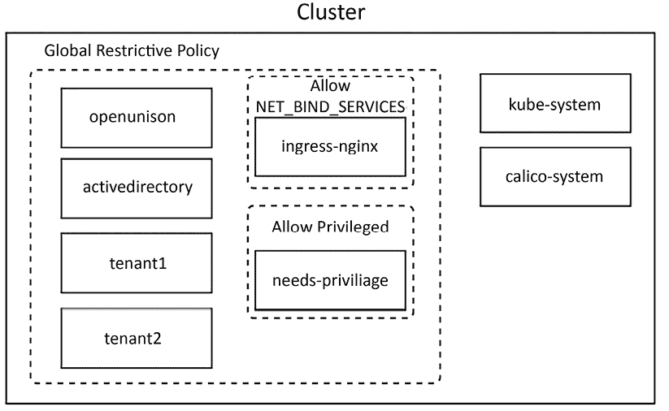
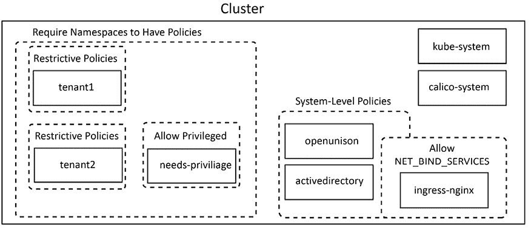

# 12

# 使用 Gatekeeper 进行节点安全

到目前为止，讨论的绝大多数安全问题都集中在保护 Kubernetes API 上。**认证**意味着对 API 调用进行认证。**授权**意味着授权访问某些 API。即使关于仪表板的讨论，也主要集中在如何通过仪表板安全地认证到 API 服务器。

本章将有所不同，因为我们将重点转向保护我们的节点。我们将学习如何使用 **Gatekeeper** 项目来保护 Kubernetes 集群的节点。我们的重点将是容器如何在集群的节点上运行，以及如何防止这些容器获得超过应有的权限。在本章中，我们将详细探讨节点未被保护时，如何利用漏洞来获得对集群的访问权限。我们还将探索即便是在不需要节点访问权限的代码中，如何也可能被利用进行攻击。

本章将涵盖以下主题：

+   技术要求

+   什么是节点安全？

+   使用 Gatekeeper 强化节点安全

+   使用 Pod 安全标准来强化节点安全

到本章结束时，你将更好地理解 Kubernetes 如何与运行你工作负载的节点交互，以及如何更好地保护这些节点。

# 技术要求

要完成本章的实操练习，你将需要一台 Ubuntu 22.04 服务器。

你可以在以下 GitHub 仓库中访问本章的代码：[`github.com/PacktPublishing/Kubernetes-An-Enterprise-Guide-Third-Edition/tree/main/chapter12`](https://github.com/PacktPublishing/Kubernetes-An-Enterprise-Guide-Third-Edition/tree/main/chapter12)。

# 什么是节点安全？

每个在集群中启动的 Pod 都运行在一个节点上。这个节点可以是一个虚拟机，一个“裸金属”服务器，甚至是另一种计算服务，本身可能也是一个容器。每个由 Pod 启动的进程都在该节点上运行，并且根据其启动方式，可能在该节点上拥有一系列意外的能力，例如访问文件系统、突破容器以获得该节点的 shell，甚至访问节点用于与 API 服务器通信的密钥。确保只有在授权的情况下才允许请求特权的进程，且即使如此，也只能出于特定的目的进行操作，这一点非常重要。

许多人有物理和虚拟服务器的使用经验，而且大多数人知道如何保护在其上运行的工作负载。当谈到每个工作负载的安全时，容器需要被以不同的方式考虑。要理解为什么 Kubernetes 安全工具，如 **Open Policy Agent** (**OPA**) 存在，你需要理解容器与 **虚拟机** (**VM**) 之间的区别。

## 理解容器和虚拟机（VM）之间的区别

“*容器是轻量级虚拟机*”通常是用来描述容器和 Kubernetes 新手的一种方式。虽然这提供了一个简单的类比，但从安全的角度来看，这个比较是危险的。容器在运行时是一个在节点上运行的进程。在 Linux 系统中，这些进程通过一系列 Linux 技术进行隔离，从而限制它们对底层系统的可见性。

去 Kubernetes 集群中的任何一个节点，运行 `top` 命令，所有来自容器的进程都会列出。例如，尽管 Kubernetes 在 KinD 中运行，但运行 `ps -A -elf | grep java` 会显示 OpenUnison 和 operator 容器进程：

```
4 S k8s      1193507 1193486  1  80   0 - 3446501 -    Oct07 ?        06:50:33 java -classpath /usr/local/openunison/work/webapp/
WEB-INF/lib/*:/usr/local/openunison/work/webapp/WEB-INF/classes:/tmp/quartz -Djava.awt.headless=true -Djava.security.egd=file:/dev/./urandom -DunisonEnvironmentFile=/etc/openunison/ou.env -Djavax.net.ssl.trustStore=/etc/openunison/cacerts.jks com.tremolosecurity.openunison.undertow.OpenUnisonOnUndertow /etc/openunison/openunison.yaml
0 S k8s      2734580 2730582  0  80   0 -  1608 pipe_w 13:13 pts/0    00:00:00 grep --color=auto java 
```

相比之下，虚拟机正如其名称所示，是一个完整的虚拟系统。它模拟自己的硬件，拥有独立的内核等等。虚拟机管理程序（Hypervisor）为虚拟机提供隔离，甚至到硅层，而容器之间在节点上的隔离非常少。

有一些容器技术会在自己的虚拟机上运行容器。容器仍然只是一个进程。

当容器不在运行时，它们仅仅是一个“tarball 的 tarballs”，其中每个文件系统层都存储在一个文件中。镜像仍然存储在主机系统、多个主机系统，或是容器之前运行或拉取过的地方。

如果你对“tarball”这个术语不熟悉，它是由 `tar` Unix 命令创建的一个文件，该命令用于将多个文件归档并压缩成一个文件。术语“tarball”是由创建该文件的命令 tar（即 **磁带归档** 的缩写）和 ball（指的是文件的捆绑包）组合而成的。

相反，虚拟机有自己的虚拟磁盘，用于存储整个操作系统。尽管有一些非常轻量级的虚拟机技术，但虚拟机和容器之间的大小通常存在数量级的差异。

虽然有些人把容器称为轻量级虚拟机，但这完全不正确。它们的隔离方式不同，而且需要更加关注它们在节点上运行的细节。

从这一部分，你可能会觉得我们在暗示容器不安全。实际上，真相完全相反。保护 Kubernetes 集群及其上运行的容器需要对细节的关注，以及对容器与虚拟机不同之处的理解。由于许多人了解虚拟机，容易把它们与容器进行比较，但这样做会让你处于不利地位，因为它们是截然不同的技术。

一旦你理解了默认配置的限制以及由此带来的潜在危险，就可以解决这些“问题”。

## 容器突破

容器越界指的是容器内的进程访问了底层节点。一旦进入节点，攻击者就可以访问所有其他 Pod 以及节点在环境中的所有能力。容器越界还可能是挂载本地文件系统的问题。来自 [`securekubernetes.com`](https://securekubernetes.com) 的一个示例，最初由 Isovalent 的 Field CTO Duffie Cooley 提出，使用容器挂载本地文件系统。在 KinD 集群上运行此操作会打开对节点文件系统的读写权限：

```
kubectl run r00t --restart=Never -ti --rm --image lol --overrides '{"spec":{"hostPID": true, "containers":[{"name":"1","image":"alpine","command":["nsenter","--mount=/proc/1/ns/mnt","--","/bin/bash"],"stdin": true,"tty":true,"imagePullPolicy":"IfNotPresent","securityContext":{"privileged":true}}]}}'
If you don't see a command prompt, try pressing Enter. 
```

上述代码中的`run`命令启动了一个容器，该容器添加了一个对本示例至关重要的选项，`hostPID: true`，它允许容器共享主机的进程命名空间。你可以看到其他几个选项，如`--mount`和设置`privileged`为`true`的安全上下文设置。所有这些选项加起来将允许我们写入主机的文件系统。

现在你已经进入容器，执行 `ls` 命令查看文件系统。注意，提示符是 `root@r00t:/#`，这表明你已经在容器中，而不是在主机上：

```
root@r00t:/# ls
bin  boot  build  dev  etc  home  kind  lib  lib32  lib64  libx32  media  mnt  opt  proc  root  run  sbin  srv  sys  tmp  usr  var 
```

为了证明我们已经将主机的文件系统映射到容器中，请创建一个名为 `this_is_from_a_container` 的文件，并退出容器：

```
root@r00t:/# touch this_is_from_a_container
root@r00t:/# exit 
```

最后，让我们查看主机的文件系统，以确认容器是否创建了该文件。由于我们使用 KinD 部署了一个单一工作节点，因此我们需要使用 Docker 命令 `exec` 进入工作节点。如果你使用的是本书中的 KinD 集群，工作节点的名称为 `cluster01-worker`：

```
docker exec -ti cluster01-worker ls /
bin  boot  build  dev  etc  home  kind  lib  lib32  lib64  libx32  media  mnt  opt  proc  root  run  sbin  srv  sys  this_is_from_a_container  tmp  usr  var 
```

就是这样！在这个例子中，启动了一个容器并挂载了本地文件系统。从 Pod 内部创建了 `this_is_from_a_container` 文件。退出 Pod 后进入节点容器时，文件仍然存在。一旦攻击者获取了节点文件系统的访问权限，他们也就能够访问 kubelet 的凭证，从而可能暴露整个集群。

想象一下，确实不难想象一系列事件可能导致一个比特币矿工（甚至更糟）在集群上运行。一场钓鱼攻击获得了开发者用于集群的凭证。即使这些凭证只访问一个命名空间，也会创建一个容器来获取 kubelet 的凭证，然后从那里启动容器，悄悄地在环境中部署矿工。确实有多种缓解措施可以防止这种攻击，其中包括以下几种：

+   多因素认证，可以防止钓鱼凭证被滥用

+   只授权特定容器

+   Gatekeeper 策略，通过停止容器以 `privileged` 身份运行，防止了此攻击

+   正确保护的镜像

需要注意的是，Kubernetes 默认并不会提供这些缓解措施，这也是你正在阅读这本书的主要原因之一！

我们在之前的章节中已经讨论了身份验证及其多因素认证的重要性。我们甚至通过仪表板设置了一个矿工！这再次说明了身份验证在 Kubernetes 中是如此重要的主题。

接下来的两种方法可以使用 Gatekeeper 实现。我们在*第十一章*《使用 Open Policy Agent 扩展安全性》中讨论了如何预先授权容器和镜像仓库。本章将重点介绍如何使用 Gatekeeper 执行以节点为中心的策略，例如，是否应以特权模式运行 Pod。

最后，安全的核心是正确设计的镜像。在物理机器和虚拟机的情况下，这通过保护基础操作系统来实现。当你安装操作系统时，并不会选择所有可能的选项进行安装。在服务器上运行任何非必需的程序被认为是一种不良做法，尤其是对于其角色或功能不需要的服务。这个做法也应延续到运行在集群中的镜像上，镜像中应仅包含应用所需的必要二进制文件。

鉴于在集群中正确保护镜像的重要性，接下来的部分将从安全的角度探讨容器设计。虽然这与 Gatekeeper 的策略执行没有直接关系，但它是节点安全的一个重要起点。理解如何安全地构建容器同样重要，以便更好地调试和管理节点安全策略。构建一个锁定的容器可以使节点安全管理变得更加容易。

## 正确设计容器

在探索如何使用 Gatekeeper 保护节点之前，重要的是先了解容器的设计。使用策略来减轻对节点的攻击时，最困难的部分通常是许多容器被构建为以 root 身份运行。一旦应用了受限策略，即使容器在策略应用后运行正常，重新加载时也不会启动。这在多个层面上都是一个问题。多年来，系统管理员已经学会了在网络计算中不要以 root 身份运行进程，尤其是像 Web 服务器这样的服务，这些服务通过不受信任的网络进行匿名访问。

所有网络都应被视为“不受信任的”。假设所有网络都是敌对的，这会导致更安全的实施方式。它还意味着需要安全的服务必须经过身份验证。这种概念被称为零信任（zero trust）。它已被身份专家使用并倡导多年，但由 Google 的 BeyondCorp 白皮书（[`cloud.google.com/beyondcorp`](https://cloud.google.com/beyondcorp)）在 DevOps 和云原生世界中普及。零信任的概念也应适用于你的集群内部！

代码中的漏洞可能导致对底层计算资源的访问，从而可能导致容器的突破。如果在不需要时以 root 用户身份在特权容器中运行，则如果通过代码漏洞被利用，可能会导致突破。

2017 年，Equifax 的数据泄露事件利用了 Apache Struts Web 应用框架中的一个漏洞，在服务器上执行代码，然后被用来渗透并提取数据。如果这个易受攻击的 Web 应用程序运行在 Kubernetes 上并且使用特权容器，那么这个漏洞可能会导致攻击者获得对集群的访问权限。

构建容器时，至少应遵循以下几点：

+   **以非 root 用户身份运行**：绝大多数应用程序，尤其是微服务，不需要 root 权限。不要以 root 身份运行。

+   **仅写入卷**：如果你不向容器写入内容，就不需要写入权限。卷可以由 Kubernetes 控制。如果需要写入临时数据，使用`emptyVolume`对象，而不是写入容器的文件系统。这样可以更容易检测到那些试图在运行时对容器进行更改的恶意行为，比如替换二进制文件或文件。

+   **最小化容器中的二进制文件**：这可能会比较棘手。有些人主张使用“无发行版”容器，这些容器只包含应用程序的二进制文件，静态编译——没有 shell，没有工具。这在调试应用程序为什么无法按预期运行时可能会带来问题。这是一个微妙的平衡。在 Kubernetes 1.25 中，引入了短暂容器来简化这一过程。我们将在后续部分详细介绍。

+   **扫描容器中的已知常见漏洞和暴露（CVE），并经常重建**：容器的一大优势是可以轻松扫描已知的 CVE。有几种工具和注册表可以为你完成这项工作，例如 Anchor 的**Grype**（[`github.com/anchore/grype`](https://github.com/anchore/grype)）或 Aqua Security 的**Trivy**（[`github.com/aquasecurity/trivy`](https://github.com/aquasecurity/trivy)）。一旦 CVE 被修复，就应重新构建容器。一个几个月甚至几年没有重建的容器，就像一个没有打补丁的服务器一样危险。

让我们深入探讨调试“无发行版”镜像和扫描容器。

## 使用和调试无发行版镜像

“无发行版”镜像的概念并不新鲜。谷歌是最早推动其广泛使用的公司之一（[`github.com/GoogleContainerTools/distroless`](https://github.com/GoogleContainerTools/distroless)），最近，Chainguard 也开始发布并维护基于其*Wolfi*（[`github.com/wolfi-dev`](https://github.com/wolfi-dev)）Linux 发行版构建的无发行版镜像。其理念是，基础镜像不是 Ubuntu、Red Hat 或其他常见的 Linux 发行版，而是一个运行系统所需的最小二进制文件集。例如，Java 17 镜像仅包含 OpenJDK，没有工具，也没有其他实用程序，只有 JDK。从安全角度来看，这非常好，因为可被用来破坏环境的“东西”更少了。当攻击者不需要一个 shell 来运行命令时，为什么要让他们的工作更轻松呢？

这种方法有两个主要缺点：

+   **调试运行中的容器**：没有`dig`或`nslookup`，你怎么知道问题出在 DNS 上？我们可能知道问题总是出在 DNS 上，但你仍然需要证明它。你可能还需要调试网络服务、连接等。如果没有调试这些服务所需的常用工具，你怎么确定问题呢？

+   **支持和兼容性**：使用常见发行版作为基础镜像的好处之一是，你的企业可能已经与发行版供应商签订了支持合同。Google 的 Distroless 基于 Debian Linux，而 Debian 没有官方的供应商支持。Wolfi 基于 Alpine，而 Alpine 也没有自己的支持（尽管 Chainguard 为其镜像提供商业支持）。如果你的容器出现问题，且你怀疑问题出在基础镜像中，你不会从其他发行版的供应商那里获得太多帮助。

支持和兼容性的问题其实并不是技术问题，而是需要你的团队处理的风险管理问题。如果你使用的是商业产品，通常这是由你的支持合同涵盖的。如果你谈论的是自家开发的容器，理解风险和潜在的缓解措施非常重要。

调试无发行版容器现在比以前容易多了。在 1.25 版本中，Kubernetes 引入了临时容器的概念，允许你将一个容器附加到正在运行的 Pod 上。这个临时容器可以包含那些你在无发行版镜像中没有的调试工具。`kubectl debug`命令也被添加了，方便使用。

首先，在新集群中启动 Kubernetes 仪表盘，然后尝试附加一个 shell：

```
$ kubectl apply -f https://raw.githubusercontent.com/kubernetes/dashboard/v2.7.0/aio/deploy/recommended.yaml
.
.
.
$ export K8S_DB_POD=$(kubectl get pods -l k8s-app=kubernetes-dashboard -n kubernetes-dashboard -o json | jq -r '.items[0].metadata.name')
$ kubectl exec -ti $K8S_DB_POD -n kubernetes-dashboard -- sh
error: Internal error occurred: error executing command in container: failed to exec in container: failed to start exec "24b9dba21332299828b4d8f46c360c8afe0cadfd693e6651694a63917d28b910": OCI runtime exec failed: exec failed: unable to start container process: exec: "sh": executable file not found in $PATH: unknown 
```

最后一行告诉我们，`kubernetes-dashboard` Pod 中没有 shell。当我们尝试`exec`进入 Pod 时，它失败了，因为找不到可执行文件。现在，我们可以附加一个调试 Pod，允许我们使用调试工具：

```
$ kubectl debug -it --attach=true -c debugger --image=busybox $K8S_DB_POD -n kubernetes-dashboard
If you don't see a command prompt, try pressing enter.
/ # ps -A
PID   USER     TIME  COMMAND
    1 root      0:00 sh
   14 root      0:00 ps -A
/ # ping
BusyBox v1.36.1 (2023-07-17 18:29:09 UTC) multi-call binary.
Usage: ping [OPTIONS] HOST
.
.
.
/ # nslookup
BusyBox v1.36.1 (2023-07-17 18:29:09 UTC) multi-call binary.
Usage: nslookup [-type=QUERY_TYPE] [-debug] HOST [DNS_SERVER]
Query DNS about HOST
QUERY_TYPE: soa,ns,a,aaaa,cname,mx,txt,ptr,srv,any 
```

我们能够将 busybox 镜像附加到仪表盘 Pod，并使用我们的工具！

这肯定有助于调试，但如果我们需要进入仪表盘进程怎么办？请注意，当我运行`ps`命令时，没有看到仪表盘进程。那是因为一个 Pod 中的容器都运行各自的进程空间，并且共享点（如`volumeMounts`）有限。所以，虽然这可能有助于测试网络资源，但它离我们的工作负载还不够接近。我们可以在部署中添加`shareProcessNamespace: true`选项，但现在我们的容器都共享同一个进程空间，失去了一层隔离性。你可以在需要时修补一个正在运行的部署，但现在你正在重新启动 Pod，这可能会自动清除问题。

Distroless 镜像是最小化镜像，可以通过增加攻击者利用您的 Pod 作为攻击向量的难度来降低您的安全风险。减少镜像确实存在权衡，重要的是要记住这些权衡。虽然您将获得一个更小且更难被妥协的镜像，但这可能会增加调试操作的难度，并可能对供应商支持协议产生影响。

接下来，我们将看看如何将扫描已知漏洞的镜像应用到您的构建流程中。

## 扫描已知漏洞的镜像

如何知道您的镜像是否存在漏洞？有一个常见的软件漏洞报告位置，称为**通用漏洞和暴露**（**CVE**）数据库，由 MITRE 提供。理论上，这是研究人员和用户可以向供应商报告漏洞的常见地方。理论上，用户可以从中了解他们运行的软件中是否存在已知漏洞的地方。

这只是寻找漏洞问题的极度简化。在过去几年中，对 CVE 数据质量持极端批评的观点主要是因为 CVE 数据库的管理和维护方式。不幸的是，这确实是唯一的常见数据库。话虽如此，扫描容器并比对容器中的软件版本与 CVE 数据库中的内容是常见做法。如果找到漏洞，这将促使团队采取纠正措施。

一方面，快速修补已知漏洞是减少安全风险的最佳方法之一。另一方面，快速修补可能不需要修补的漏洞可能会导致系统故障。这是一个需要不仅理解扫描器工作原理，还需要自动化和测试来增强更新基础设施信心的难以平衡的行为。

扫描 CVE 是报告安全问题的标准方式。应用程序和操作系统供应商将通过补丁更新 CVE 中的代码以修复问题。然后，安全扫描工具将使用此信息在容器存在已知已修复问题时采取行动。

有几个开源扫描选项。我喜欢使用 Anchore 的 Grype，但 AquaSecurity 的 Trivy 也是一个很好的选择。这里重要的是，这两个扫描工具都会拉取你的容器，将已安装的包和库与 CVE 数据库进行比对，并告诉你有哪些 CVE 以及它们是否已修复。例如，如果你扫描两个 OpenUnison 镜像，结果会稍有不同。当扫描 [ghcr.io/openunison/openunison-k8s:1.0.37-a207c4](https://ghcr.io/openunison/openunison-k8s:1.0.37-a207c4) 时，发现有 43 个已知漏洞。这个镜像大约有六天历史，所以有大约 15 个中等风险的 CVE 已经被修复。今晚，当我们的流程运行时（稍后我会解释），将会生成一个新的容器来修复这些 CVE。如果我们对一个两周前构建的容器运行 Grype，则会发现 45 个已知的 CVE，其中 2 个是在最新构建中修复的。

这项工作的重点是，扫描工具在容器卫生方面非常有用。在 Tremolo Security，我们每晚都会扫描已发布的镜像，如果有新的操作系统级 CVE 被修复，我们就会重建镜像。这确保了我们的镜像始终保持最新。

容器扫描并不是唯一的扫描方式。我们还使用 `snyk.io` 扫描我们的构建和依赖项，以查找已知漏洞，并将它们升级到可用的修复版本。我们之所以有信心这么做，是因为我们的自动化测试包括数百个自动化测试，能够捕捉到这些升级中的问题。我们的目标是在发布时没有可修复的 CVE。除非有绝对关键的漏洞，比如 2021 年的 **Log4J 事件**，否则我们通常每年发布四到五个版本。

作为一个开源项目的维护者，我不得不提到社区中常见的一个痛点。容器扫描工具会告诉你某个库是否存在，但它们不会告诉你这个库是否存在漏洞。对于什么构成漏洞，这里面有很多细微的差别。一旦你在扫描工具中发现了一个“命中”某个项目的结果，请不要立即在 GitHub 上打开一个问题。这会给项目维护者带来大量几乎没有价值的工作。

最后，你可能会过于依赖扫描工具。一些非常有才华的安全专家（Brad Geesaman、Ian Coldwater、Rory McCune 和 Duffie Cooley）在 KubeCon EU 2023 上讨论了如何欺骗扫描工具，主题是*恶意合规：反思信任容器扫描工具*：[`kccnceu2023.sched.com/event/1Hybu/malicious-compliance-reflections-on-trusting-container-scanners-ian-coldwater-independent-duffie-cooley-isovalent-brad-geesaman-ghost-security-rory-mccune-datadog`](https://kccnceu2023.sched.com/event/1Hybu/malicious-compliance-reflections-on-trusting-container-scanners-ian-coldwater-independent-duffie-cooley-isovalent-brad-geesaman-ghost-security-rory-mccune-datadog)。我强烈推荐花时间观看这个视频，以及它提出的关于扫描工具依赖性的问题。

一旦你扫描过容器并限制了容器的运行方式，如何知道它们是否能正常工作呢？在一个限制性的环境中进行测试是非常重要的。截止写作时，市场上任何 Kubernetes 发行版中最严格的默认配置属于 Red Hat 的 OpenShift。除了合理的默认策略，OpenShift 还会以随机用户 ID 运行 Pod，除非 Pod 定义中指定了特定的 ID。

即使 OpenShift 不是你生产环境使用的发行版，测试你的容器在 OpenShift 上运行也是个好主意。如果一个容器能够在 OpenShift 上运行，那它很可能能在任何集群上运行，不论集群使用什么样的安全策略。最简单的方法是使用 Red Hat 的 CodeReady Containers ([`developers.redhat.com/products/codeready-containers`](https://developers.redhat.com/products/codeready-containers))。这个工具可以在你的本地笔记本上运行，并启动一个最小化的 OpenShift 环境，用于测试容器。

虽然 OpenShift 自带了非常严格的安全控制，但它并不使用**Pod 安全策略**（**PSP**）、Pod 安全标准或 Gatekeeper。它有自己的策略系统，早于 PSP 出现，叫做**安全上下文约束**（**SCC**）。SCC 与 PSP 类似，但不使用 RBAC 来与 Pod 关联。

现在我们已经探讨了如何创建安全的容器镜像，下一步是确保我们的集群被正确构建，防止那些不符合这些标准的镜像运行。

# 使用 Gatekeeper 强制执行节点安全

到目前为止，我们已经看到当容器在没有任何安全策略的情况下允许在节点上运行时可能发生的情况。我们还审视了构建安全容器的内容，这将使得执行节点安全更加容易。下一步是研究如何使用 Gatekeeper 设计并构建策略，以锁定你的容器。

## 那么，Pod 安全策略怎么样呢？

Kubernetes 难道没有内建的机制来强制执行节点安全吗？有的！在 2018 年，Kubernetes 项目决定 **Pod 安全策略**（**PSP**）API 永远不会离开 beta 阶段。这个配置过于复杂，是 Linux 聚焦配置选项与 RBAC 分配的混合体。最终确定修复这个问题可能会导致当前发布与最终版本不兼容。因此，项目做出了一个艰难的决定，废弃并移除了这个 API。

当时，曾声明 PSP API 只有在替代方案准备好发布时才会被移除。2020 年，Kubernetes 项目采纳了一项新政策，规定任何 API 都不能在 beta 阶段停留超过三个版本。这迫使该项目重新评估如何继续替代 PSP。在 2021 年 4 月，Tabitha Sable 撰写了一篇关于 PSP 未来的博客文章（[`kubernetes.io/blog/2021/04/06/podsecuritypolicy-deprecation-past-present-and-future/`](https://kubernetes.io/blog/2021/04/06/podsecuritypolicy-deprecation-past-present-and-future/)）。简而言之，PSP 在 1.21 版本正式弃用，并在 1.25 版本中移除。它的替代方案 **Pod Security Standards**（PSS）在 1.26 版本成为 GA（通用可用）。我们将在介绍如何使用 Gatekeeper 保护节点免受 pod 威胁后，详细讨论这些内容。

## PSP、PSA 和 Gatekeeper 之间有哪些区别？

在深入了解如何使用 Gatekeeper 实现节点安全之前，让我们先看看遗留的 PSP、全新的 **Pod Security Admission**（**PSA**）和 Gatekeeper 有何不同。如果你熟悉 PSP，这将是迁移的有用指南。如果你从未使用过 PSP，这可以帮助你了解在遇到问题时应查看哪些内容。

这三种技术的共同点是它们都作为准入控制器实现。正如我们在 *第十一章*《使用 Open Policy Agent 扩展安全性》中所学，准入控制器用于提供 API 服务器原生功能之外的额外检查。在 Gatekeeper、PSP 和 PSA 的情况下，准入控制器确保 pod 的定义具有正确的配置，以便在最小权限下运行。这通常意味着以非 root 用户身份运行，限制对主机的访问等。如果未满足所需的安全级别，准入控制器会失败，阻止 pod 运行。

虽然这三种技术都作为准入控制器运行，但它们以非常不同的方式实现各自的功能。PSP 通过首先定义一个 `PodSecurityPolicy` 对象，然后定义 RBAC `Role` 和 `RoleBinding` 对象来允许 `ServiceAccount` 以某个策略运行。PSP 准入控制器会根据创建 Pod 的“用户”或 Pod 运行所在的 `ServiceAccount` 是否经过授权（根据 RBAC 绑定）来做出决定。这导致了在设计和调试策略应用时的困难。如果用户可以提交一个 Pod 也很难授权，因为用户通常不再创建 Pod 对象。用户会创建 `Deployments`、`StatefulSets` 或 `Jobs`。然后，有一些控制器会使用它们自己的 `ServiceAccounts` 运行，这些控制器再创建 Pod。PSP 准入控制器永远不知道是谁提交了原始对象。在上一章中，我们介绍了 Gatekeeper 如何通过命名空间和标签匹配绑定策略；节点安全策略不会改变这一点。稍后，我们将深入探讨如何分配策略。

PSA 是在命名空间级别实现的，而不是在单个 Pod 级别实现的。假设命名空间是集群的安全边界，那么在一个命名空间中运行的任何 Pod 都应该共享相同的安全上下文。这通常是可行的，但也存在一些限制。例如，如果你需要一个 `init` 容器来更改挂载点上的文件权限，那么你可能会遇到 PSA 带来的问题。

除了以不同方式分配策略外，Gatekeeper、PSP 和 PSA 在处理重叠策略时也有所不同。PSP 会尝试根据请求的帐户和权限选择*最佳*策略。这使得你可以定义一个高级的普遍性策略，拒绝所有权限，然后为具体的使用案例创建特定的策略，例如允许 NGINX `Ingress Controller` 在端口 `443` 上运行。相反，Gatekeeper 要求所有策略都必须通过。没有所谓的*最佳*策略；所有策略必须都通过。这意味着你不能应用一个普遍的策略然后做出例外。你必须为每个使用案例明确地定义你的策略。PSA 是跨命名空间通用的，因此在 API 层面没有例外，也没有变化。你可以为用户、运行时类或命名空间设置特定的豁免，但这些是全局且静态的。

这三种方法的另一个区别在于策略的定义方式。PSP 规范是一个 Kubernetes 对象，主要基于 Linux 内建的安全模型。该对象本身根据需要加入了新属性，但方式不一致。这导致了一个混乱的对象，无法很好地支持 Windows 容器的添加。相反，Gatekeeper 有一系列预构建的策略，可以从其 GitHub 仓库获取：[`github.com/open-policy-agent/gatekeeper-library/tree/master/library/pod-security-policy`](https://github.com/open-policy-agent/gatekeeper-library/tree/master/library/pod-security-policy)。与其只有一个策略，每个策略需要单独应用。PSA 定义了基于常见安全模式的配置文件，实际上没有太多需要定义的内容。

最后，PSP 访问控制器有一些内建的变异。例如，如果你的策略不允许 root 用户，并且你的 pod 没有定义要运行的用户，PSP 访问控制器会将用户 ID 设置为 `1`。Gatekeeper 具有变异能力（我们在 *第十一章*，*使用 Open Policy Agent 扩展安全性* 中讲解过），但该能力需要显式配置来设置默认值。PSA 没有变异能力。

在了解了 PSP、PSA 和 Gatekeeper 之间的区别后，接下来让我们深入探讨如何在集群中授权节点安全策略。

## 授权节点安全策略

在前一节中，我们讨论了 Gatekeeper、PSP 和 PSA 之间授权策略的区别。现在，我们将看看如何为策略定义你的授权模型。在我们进一步讨论之前，应该先解释一下我们所说的“授权策略”是什么意思。

当你创建一个 pod，通常通过 `Deployment` 或 `StatefulSet`，你可以选择你需要的节点级别功能，这些设置位于 pod 内的 `securityContext` 部分。你可以请求特定的能力或主机挂载。Gatekeeper 会检查你的 pod 定义，并决定或授权你的 pod 定义是否满足策略要求，通过其约束的 `match` 部分匹配一个适用的 `ConstraintTemplate`。Gatekeeper 的 `match` 部分让你可以根据命名空间、对象类型和对象上的标签进行匹配。至少，你需要包括命名空间和对象类型。标签可能会更加复杂。

决定标签是否是授权策略的适当方式的一个重要因素是：谁可以设置标签以及为什么。在单租户集群中，标签是创建受限部署的好方法。你可以定义可以通过标签直接应用的特定约束。例如，你可能在一个命名空间中有一个操作员不希望访问主机挂载，而某个 pod 需要访问。创建具有特定标签的策略将允许你对操作员应用比 pod 更严格的策略。

这种方法的风险在于多租户集群，在这种集群中，作为集群所有者，你无法限制可以应用于 Pod 的标签。Kubernetes 的 RBAC 实现并未提供授权特定标签的机制。你可以通过 Gatekeeper 实现一些功能，但那将是 100% 的定制。由于你无法阻止命名空间管理员给 Pod 打标签，受损的命名空间管理员账户可以被用来启动一个特权 Pod，而 Gatekeeper 无法对此进行检查。

当然，你可以使用 Gatekeeper 限制标签。问题在于，类似于 PSP 的问题，Gatekeeper 并不知道哪个创建者在 Pod 级别创建了标签，因为 Pod 通常是由控制器创建的。你可以在 Deployment 或 `StatefulSet` 级别进行强制执行，但这将意味着其他控制器类型不受支持。这就是为什么 PSA 使用命名空间作为标签的边界点。命名空间是集群的安全边界。如果需要，你还可以为 `init` 容器预留特定的例外情况。

在*第十一章*，*使用 Open Policy Agent 扩展安全性* 中，我们学习了如何在 Rego 中构建策略并使用 Gatekeeper 部署它们。在本章中，我们讨论了如何安全地构建镜像、PSP 和 Gatekeeper 在节点安全中的差异，以及如何在集群中授权策略。接下来，我们将加固我们的测试集群。

## 部署和调试节点安全策略

在深入学习了 Gatekeeper 中构建节点安全策略的理论后，让我们开始加固我们的测试集群。第一步是从一个干净的集群开始并部署 Gatekeeper：

```
$ kubectl apply -f https://raw.githubusercontent.com/open-policy-agent/gatekeeper/master/deploy/gatekeeper.yaml 
```

接下来，我们需要部署节点的 `ConstraintTemplate` 对象。Gatekeeper 项目构建并维护了一套模板库，复制现有的 `PodSecurityPolicy` 对象，位于 [`github.com/open-policy-agent/gatekeeper-library/tree/master/library/pod-security-policy`](https://github.com/open-policy-agent/gatekeeper-library/tree/master/library/pod-security-policy)。对于我们的集群，我们将部署所有策略，除了只读文件系统 `seccomp`、`selinux`、`apparmor`、`flexvolume` 和主机卷策略。我选择不部署只读文件系统，因为写入容器的文件系统仍然非常常见，尽管数据是临时的，强制执行这一点可能会造成更多的麻烦而非好处。`seccomp`、`apparmor` 和 `selinux` 策略未包括在内，因为我们运行的是 KinD 集群。最后，我们忽略了卷，因为这不是我们计划关注的特性。然而，查看所有这些策略，看看它们是否应应用于您的集群，是个好主意。`chapter12` 文件夹中有一个脚本可以为我们部署所有的模板。运行 `chapter12/deploy_gatekeeper_psp_policies.sh`。完成后，我们的 `ConstraintTemplate` 对象已经部署，但它们并未被强制执行，因为我们还没有设置任何策略实现对象。在我们进行此操作之前，我们应该先设置一些理智的默认值。

### 生成安全上下文默认值

在 *第十一章*，*使用 Open Policy Agent 扩展安全性* 中，我们讨论了使用变更 webhook 生成理智默认值与显式配置之间的权衡。

我喜欢理智的默认设置，因为它们能带来更好的开发者体验，并且使保持安全变得更加容易。Gatekeeper 项目提供了一些示例变更集，用于此目的，位于 [`github.com/open-policy-agent/gatekeeper-library/tree/master/mutation/pod-security-policy`](https://github.com/open-policy-agent/gatekeeper-library/tree/master/mutation/pod-security-policy)。在这一章中，我对它们进行了些微调整。让我们部署它们，然后重新创建所有的 pods，以便它们能够应用我们设定的“理智默认”，然后再推出我们的约束实现：

```
$ kubectl create -f chapter12/default_mutations.yaml
assign.mutations.gatekeeper.sh/k8spspdefaultallowprivilegeescalation created
assign.mutations.gatekeeper.sh/k8spspfsgroup created
assign.mutations.gatekeeper.sh/k8spsprunasnonroot created
assign.mutations.gatekeeper.sh/k8spsprunasgroup created
assign.mutations.gatekeeper.sh/k8spsprunasuser created
assign.mutations.gatekeeper.sh/k8spspsupplementalgroups created
assign.mutations.gatekeeper.sh/k8spspcapabilities created
$ sh chapter12/delete_all_pods_except_gatekeeper.sh
calico-system
pod "calico-kube-controllers-7f58dbcbbd-ckshb" deleted
pod "calico-node-g5cwp" deleted 
```

现在，我们可以部署一个 NGINX `pod` 并查看它现在是否具有默认的安全上下文：

```
$ kubectl create ns test-mutations
$ kubectl create deployment test-nginx --image=ghcr.io/openunison/openunison-k8s-html:latest -n test-mutations
$ kubectl get pods -l app=test-nginx -o jsonpath='{.items[0].spec.securityContext}' -n test-mutations
{"fsGroup":3000,"supplementalGroups":[3000]} 
```

我们的 NGINX pod 现在有一个 `securityContext`，它决定容器应以哪个用户身份运行，是否具有特权，并且是否需要任何特殊能力。如果将来由于某些原因，我们希望容器以不同的进程运行，而不是更改每个清单，我们现在可以更改我们的变更配置。现在我们的默认设置已经到位并应用，下一步是实现我们的 `ConstraintTemplates` 实例来强制执行我们的策略。

### 强制执行集群策略

部署好我们的变更后，现在可以部署约束实现了。与`ConstraintTemplate`对象一样，Gatekeeper 项目为每个模板提供了示例模板实现。我为本章编写了一个简化版，位于`chapter12/minimal_gatekeeper_constraints.yaml`，设计上是为了在集群中拥有最小的权限集，忽略`kube-system`和`calico-system`。部署这个 YAML 文件并等待几分钟：

```
$ kubectl apply -f chapter12/minimal_gatekeeper_constraints.yaml
k8spspallowprivilegeescalationcontainer.constraints.gatekeeper.sh/privilege-escalation-deny-all created
k8spspcapabilities.constraints.gatekeeper.sh/capabilities-drop-all created
k8spspforbiddensysctls.constraints.gatekeeper.sh/psp-forbid-all-sysctls created
k8spsphostfilesystem.constraints.gatekeeper.sh/psp-deny-host-filesystem created
k8spsphostnamespace.constraints.gatekeeper.sh/psp-bloack-all-host-namespace created
k8spsphostnetworkingports.constraints.gatekeeper.sh/psp-deny-all-host-network-ports created
k8spspprivilegedcontainer.constraints.gatekeeper.sh/psp-deny-all-privileged-container created
k8spspprocmount.constraints.gatekeeper.sh/psp-proc-mount-default created
k8spspallowedusers.constraints.gatekeeper.sh/psp-pods-allowed-user-ranges created 
```

记得在*第十一章*，*使用 Open Policy Agent 扩展安全性*中提到，Gatekeeper 相比于通用的 OPA，一个关键特性就是它不仅能作为验证 webhook，还能根据策略审计现有对象。我们正在等待，让 Gatekeeper 有机会对我们的集群执行审计。审计违规会列在每个`ConstraintTemplate`的每个实现的状态中。

为了更容易查看我们的集群符合规范的程度，我写了一个小脚本，列出了每个`ConstraintTemplate`的违规数量：

```
$ sh chapter12/show_constraint_violations.sh
k8spspallowedusers.constraints.gatekeeper.sh 16
k8spspallowprivilegeescalationcontainer.constraints.gatekeeper.sh 2
k8spspcapabilities.constraints.gatekeeper.sh 2
k8spspforbiddensysctls.constraints.gatekeeper.sh 0
k8spsphostfilesystem.constraints.gatekeeper.sh 1
k8spsphostnamespace.constraints.gatekeeper.sh 0
k8spsphostnetworkingports.constraints.gatekeeper.sh 1
k8spspprivilegedcontainer.constraints.gatekeeper.sh 0
k8spspprocmount.constraints.gatekeeper.sh 0
k8spspreadonlyrootfilesystem.constraints.gatekeeper.sh null 
```

我们有几个违规。如果你没有确切的数字也没关系，下一步是调试并纠正它们。

### 调试约束违规

在我们实施约束后，有几个违规需要修正。让我们看看权限提升策略违规：

```
$ kubectl get k8spspallowprivilegeescalationcontainer.constraints.gatekeeper.sh -o jsonpath='{$.items[0].status.violations}' | jq -r
[
  {
    "enforcementAction": "deny",
    "kind": "Pod",
    "message": "Privilege escalation container is not allowed: controller",
    "name": "ingress-nginx-controller-744f97c4f-msmkz",
    "namespace": "ingress-nginx"
  }
] 
```

Gatekeeper 告诉我们，位于`ingress-nginx`命名空间中的`ingress-nginx-controller-744f97c4f-msmkz` Pod 正在尝试提升其权限。查看其`SecurityContext`，我们看到以下内容：

```
$ kubectl get pod ingress-nginx-controller-744f97c4f-msmkz -n ingress-nginx -o jsonpath='{$.spec.containers[0].securityContext}' | jq -r
{
  "allowPrivilegeEscalation": true,
  "capabilities": {
    "add": [
      "NET_BIND_SERVICE"
    ],
    "drop": [
      "all"
    ]
  },
  "runAsGroup": 2000,
  "runAsNonRoot": true,
  "runAsUser": 101
} 
```

Nginx 请求能够提升它的权限，添加`NET_BIND_SERVICE`权限，使其能够在不以 root 用户身份运行的情况下，在端口`443`上运行。回到我们的约束违规列表中，除了有一个权限提升违规外，还有一个能力违规。让我们查看这个违规：

```
$ kubectl get k8spspcapabilities.constraints.gatekeeper.sh -o jsonpath='{$.items[0].status.violations}' | jq -r
[
  {
    "enforcementAction": "deny",
    "kind": "Pod",
    "message": "container <controller> has a disallowed capability. Allowed
capabilities are []",
    "name": "ingress-nginx-controller-744f97c4f-msmkz",
    "namespace": "ingress-nginx"
  }
] 
```

是同一个容器违反了这两个约束。在确定了哪些 Pod 不符合规范之后，我们接下来将修复它们的配置。

在本章早些时候，我们讨论了 PSP 和 Gatekeeper 的区别，其中一个关键区别是，尽管 PSP 尝试应用“最佳”策略，但 Gatekeeper 会根据所有适用的约束进行评估。这意味着，在 PSP 中，你可以创建一个“通用”策略（通常称为“默认限制”策略），然后为特定的 Pod 创建更宽松的策略，而 Gatekeeper 不会让你这样做。为了防止这些违规阻止 Nginx 运行约束实现，它们必须更新以忽略我们的 Nginx Pods。最简单的做法是将`ingress-nginx`添加到我们的`excludednamespaces`列表中。

我在`chapter12/make_cluster_work_policies.yaml`中的所有约束实现都做了这个操作。使用`apply`命令部署：

```
kubectl apply -f chapter12/make_cluster_work_policies.yaml
k8spsphostnetworkingports.constraints.gatekeeper.sh/psp-deny-all-host-network-ports configured
k8spsphostfilesystem.constraints.gatekeeper.sh/psp-deny-host-filesystem configured
k8spspcapabilities.constraints.gatekeeper.sh/capabilities-drop-all configured
k8spspallowprivilegeescalationcontainer.constraints.gatekeeper.sh/privilege-escalation-deny-all configured 
```

几分钟后，让我们运行违规检查：

```
sh ./chapter12/show_constraint_violations.sh
k8spspallowedusers.constraints.gatekeeper.sh 12
k8spspallowprivilegeescalationcontainer.constraints.gatekeeper.sh 0
k8spspcapabilities.constraints.gatekeeper.sh 0
k8spspforbiddensysctls.constraints.gatekeeper.sh 0
k8spsphostfilesystem.constraints.gatekeeper.sh 0
k8spsphostnamespace.constraints.gatekeeper.sh 0
k8spsphostnetworkingports.constraints.gatekeeper.sh 0
k8spspprivilegedcontainer.constraints.gatekeeper.sh 0
k8spspprocmount.constraints.gatekeeper.sh 0
k8spspreadonlyrootfilesystem.constraints.gatekeeper.sh null 
```

剩下的唯一违规项是针对我们允许用户的约束。这些违规都来自`gatekeeper-system`，因为 Gatekeeper 的 Pod 在其`SecurityContext`中没有指定用户。这些 Pod 没有接收到我们合理的默认配置，因为在 Gatekeeper 的`Deployment`中，`gatekeeper-system`命名空间被忽略。尽管被忽略，它仍然被列为违规项，尽管它不会被强制执行。

现在我们已经消除了违规项，任务就完成了吗？并不完全是。尽管 Nginx 没有产生任何错误，但我们并没有确保它是以最小权限运行的。如果有人在`ingress-nginx`命名空间中启动 Pod，它可能会请求权限和额外的功能，而不会被 Gatekeeper 阻止。我们需要确保在`ingress-nginx`命名空间中启动的任何 Pod 都无法提升其权限，超过所需权限。除了将`ingress-nginx`命名空间从集群范围的策略中移除外，我们还需要创建一个新的约束实现，限制`ingress-nginx`命名空间中的 Pod 能够请求哪些能力。

我们知道 Nginx 需要提升权限的能力，并请求`NET_BIND_SERVICE`，因此我们可以创建一个约束实现：

```
---
apiVersion: constraints.gatekeeper.sh/v1beta1
kind: K8sPSPCapabilities
metadata:
  name: capabilities-ingress-nginx
spec:
  match:
    kinds:
      - apiGroups: [""]
        kinds: ["Pod"]
    namespaces: ["ingress-nginx"]
  parameters:
    requiredDropCapabilities: ["all"]
    allowedCapabilities: ["NET_BIND_SERVICE"] 
```

我们创建了一个与`Deployment`所需的`securityContext`部分相匹配的约束实现。我们没有为权限升级创建单独的约束实现，因为该`ConstraintTemplate`没有参数。它要么被强制执行，要么不被强制执行。对于`ingress-nginx`命名空间中的这个约束，一旦该命名空间被移出集群范围策略，就不需要做额外的工作。

我为其他违规项重复了这个调试过程，并将它们添加到`chapter12/enforce_node_policies.yaml`中。你可以部署它们以完成该过程。

你可能会想，为什么我们是在命名空间级别进行强制执行，而不是使用特定标签来隔离单个 Pod？我们在本章前面讨论过授权策略，继续延续这里的主题，我认为基于标签的额外强制执行并没有太大价值。任何能够在该命名空间中创建 Pod 的人都可以设置标签。进一步限制范围对安全性贡献不大。

部署和调试策略的过程非常注重细节。在单租户集群中，这可能是一次性操作或是罕见操作，但在多租户集群中，过程无法扩展。接下来，我们将讨论在多租户集群中应用节点安全性的策略。

### 在多租户集群中扩展策略部署

在前面的示例中，我们采用了“批量小批量”方式处理节点安全性。我们创建了一个单一的集群范围策略，并根据需要添加了例外。由于一些原因，这种方法在多租户环境中无法扩展：

+   限制条件中 `match` 部分的 `excludedNamespaces` 属性是一个列表，且很难通过自动化方式进行修补。列表需要被修补，包括原始列表，因此它不仅仅是一个简单的“应用此 JSON”操作。

+   你不希望在多租户系统中更改全局对象。添加新对象并将其链接到真实数据源更为简单。使用标签追踪为何创建新的约束实现比追踪为何更改全局对象要容易。

+   你需要尽量减少全局对象更改可能影响其他租户的可能性。专门为每个租户添加新对象可以最小化这种风险。

在理想情况下，我们会创建一个全局策略，然后为需要提升权限的单个命名空间创建更具体的对象。



图 12.1：多租户集群的理想策略设计

上图展示了我所说的“通用策略”的含义。大而虚线框且圆角的框表示全局限制性策略，最小化 Pod 的能力。然后，较小的虚线圆角框表示特定例外的特例。例如，`ingress-nginx` 命名空间将以限制性权限创建，并且会添加一个新的策略，专门作用于 `ingress-nginx` 命名空间，这将允许 Nginx 以 `NET_BIND_SERVICES` 权限运行。通过为集群范围内的限制性策略添加特定需求的例外，你可以减少新的命名空间如果没有添加新策略而暴露整个集群漏洞的可能性。系统设计为“闭环失败”。

上述场景并非 Gatekeeper 的工作方式。每个匹配的策略必须成功；无法有全局策略。为了有效管理多租户环境，我们需要：

1.  为集群管理员可以拥有的系统级命名空间创建策略

1.  为每个命名空间创建可以根据需要调整的策略

1.  在创建 Pod 之前，确保命名空间已有策略



图 12.2：多租户集群的 Gatekeeper 策略设计

我在*图 12.2*中对这些目标进行了可视化。我们已经创建的策略需要调整为“系统级”策略。我们不再说它们需要全球应用然后再做例外，而是将其具体应用到我们的系统级命名空间。授予 NGINX 绑定端口 `443` 的策略是系统级策略的一部分，因为 ingress 是一种系统级能力。

对于单个租户，目标#2 要求每个租户都有自己的一组约束实现。这些单独的约束模板实现对象由围绕每个租户的圆角虚线框表示。看起来似乎有些重复，因为它确实如此。你可能会有非常重复的对象，为每个命名空间授予相同的能力。你可以采取多种策略来简化管理：

1.  定义一个基础的限制性约束模板实现集，并将每个新命名空间添加到`match`部分的`namespaces`列表中。这样可以减少杂乱，但也因为需要处理列表中的补丁而使自动化变得更加困难。由于无法像处理对象那样为单个属性添加任何元数据，跟踪也变得更加困难。

1.  在命名空间创建时自动化约束模板实现的创建。这是我们在*第十九章*《平台配置》中采用的方法。在这一章中，我们将从自服务门户自动化命名空间的创建。工作流程将配置命名空间、RBAC 绑定、管道、密钥等。它还将提供所需的约束模板，以确保限制访问。

1.  创建一个控制器，根据标签复制约束模板。这与 Fairwinds RBAC Manager（[`github.com/FairwindsOps/rbac-manager`](https://github.com/FairwindsOps/rbac-manager)）生成 RBAC 绑定的方式类似，使用自定义资源定义。我还没有看到直接用于 Gatekeeper 约束实现的工具，但相同的原则在这里也可以适用。

在管理这个自动化时，以上三种选择并不是互相排斥的。在 KubeCon EU 2021 上，我做了一场名为“我能做 RBAC，你也能！”的演讲（[`www.youtube.com/watch?v=k6J9_P-gnro`](https://www.youtube.com/watch?v=k6J9_P-gnro)），在演讲中我展示了如何将选项#2 和#3 结合起来，创建多个命名空间的“团队”，从而减少每个命名空间需要创建的 RBAC 绑定数量。

最后，我们需要确保每个非系统级命名空间都有创建约束实现。即使我们自动化命名空间的创建，我们也不希望出现没有节点安全约束的恶意命名空间。所有租户周围的大圆角虚线框就是这个表示。现在我们已经探索了为多租户集群构建节点安全策略的理论，接下来我们来构建我们的策略。

第一步是清除我们旧的策略：

```
$ kubectl delete -f chapter12/enforce_node_policies.yaml
$ kubectl delete -f chapter12/make_cluster_work_policies.yaml
$ kubectl delete -f chapter12/minimal_gatekeeper_constraints.yaml 
```

这将使我们回到一个没有策略的状态。下一步是创建我们的系统级策略：

```
$ kubectl create -f chapter12/multi-tenant/yaml/minimal_gatekeeper_constraints.yaml
k8spspallowprivilegeescalationcontainer.constraints.gatekeeper.sh/system-privilege-escalation-deny-all created
k8spspcapabilities.constraints.gatekeeper.sh/system-capabilities-drop-all created
k8spspforbiddensysctls.constraints.gatekeeper.sh/system-psp-forbid-all-sysctls created
k8spsphostfilesystem.constraints.gatekeeper.sh/system-psp-deny-host-filesystem created
k8spsphostnamespace.constraints.gatekeeper.sh/system-psp-bloack-all-host-namespace created
k8spsphostnetworkingports.constraints.gatekeeper.sh/system-psp-deny-all-host-network-ports created
k8spspprivilegedcontainer.constraints.gatekeeper.sh/system-psp-deny-all-privileged-container created
k8spspprocmount.constraints.gatekeeper.sh/system-psp-proc-mount-default created
k8spspallowedusers.constraints.gatekeeper.sh/system-psp-pods-allowed-user-ranges created
k8spsphostfilesystem.constraints.gatekeeper.sh/psp-tigera-operator-allow-host-filesystem created
k8spspcapabilities.constraints.gatekeeper.sh/capabilities-ingress-nginx created 
```

查看`chapter12/multi-tenant/yaml/minimal_gatekeeper_constraints.yaml`中的策略，你会看到我们不是在`match`部分排除命名空间，而是明确地列出了它们：

```
---
apiVersion: constraints.gatekeeper.sh/v1beta1
kind: K8sPSPAllowPrivilegeEscalationContainer
metadata:
  name: system-privilege-escalation-deny-all
spec:
  **match:**
    kinds:
      - apiGroups: [""]
        kinds: ["Pod"]
**namespaces:**
**-****default**
**-****kube-node-lease**
**-****kube-public**
**-****kubernetes-dashboard**
**-****local-path-storage**
**-****tigera-operator**
**-****openunison**
**-****activedirectory** 
```

在我们实施了系统约束后，接下来我们要确保在创建任何 Pod 之前，所有租户命名空间都已经设置了节点安全策略。目前没有现成的`ConstraintTemplates`来实现这一策略，因此我们需要自己构建一个。我们的`ConstraintTemplate`的 Rego 需要确保在某个命名空间中创建 Pod 之前，所有必需的`ConstraintTemplate`实现（换句话说，特权提升、能力等）至少有一个实例。Rego 的完整代码和测试用例位于`chapter12/multi-tenant/opa`。下面是一个代码片段：

```
# capabilities
violation[{"msg": msg, "details": {}}] {
  checkForCapabilitiesPolicy
  msg := "No applicable K8sPSPCapabilities for this namespace"
}
checkForCapabilitiesPolicy {
    policies_for_namespace = [policy_for_namespace |
                              data.inventory.cluster["constraints.gatekeeper.sh/v1beta1"].K8sPSPCapabilities[j].spec.match.namespaces[_] == input.review.object.metadata.namespace ;
                              policy_for_namespace = data.inventory.cluster["constraints.gatekeeper.sh/v1beta1"].K8sPSPCapabilities[j] ]
    count(policies_for_namespace)  == 0
}
# sysctls
violation[{"msg": msg, "details": {}}] {
  checkForSysCtlsPolicy
  msg := "No applicable K8sPSPForbiddenSysctls for this namespace"
}
checkForSysCtlsPolicy {
    policies_for_namespace = [policy_for_namespace |
                       data.inventory.cluster["constraints.gatekeeper.sh/v1beta1"].K8sPSPForbiddenSysctls[j].spec.match.namespaces[_] == input.review.object.metadata.namespace ;
                              policy_for_namespace = data.inventory.cluster["constraints.gatekeeper.sh/v1beta1"].K8sPSPForbiddenSysctls[j]
]
    count(policies_for_namespace)  == 0
} 
```

首先需要注意的是，每个约束模板检查都在自己的规则中，并且有自己的违规项。将所有这些规则放入一个`ConstraintTemplate`中，意味着它们必须全部通过，才能使整个`ConstraintTemplate`通过。

接下来，让我们看看`checkForCapabilitiesPolicy`。这个规则会创建一个包含所有`K8sPSPCapabilities`的列表，该列表列出了我们 Pod 中 `match.namespaces` 属性中的命名空间。如果这个列表为空，规则将继续执行违规项，Pod 将无法创建。为了创建这个模板，我们首先需要将我们的约束模板同步到 Gatekeeper 中。然后，我们创建我们的约束模板和实现：

```
$ kubectl apply -f chapter12/multi-tenant/yaml/gatekeeper-config.yaml
$ kubectl create -f chapter12/multi-tenant/yaml/require-psp-for-namespace-constrainttemplate.yaml
$ kubectl create -f chapter12/multi-tenant/yaml/require-psp-for-namespace-constraint.yaml 
```

在新策略生效后，让我们尝试创建一个命名空间并启动一个 Pod：

```
$ kubectl create ns check-new-pods
namespace/check-new-pods created
$ kubectl run echo-test -ti -n check-new-pods --image busybox --restart=Never --command -- echo "hello world"
Error from server ([k8srequirepspfornamespace] No applicable K8sPSPAllowPrivilegeEscalationContainer for this namespace
[k8srequirepspfornamespace] No applicable K8sPSPCapabilities for this namespace
[k8srequirepspfornamespace] No applicable K8sPSPForbiddenSysctls for this namespace
.
. 
```

我们要求命名空间设置节点安全策略的要求阻止了 Pod 的创建！让我们通过应用来自`chapter12/multi-tenant/yaml/check-new-pods-psp.yaml`的限制性节点安全策略来解决这个问题：

```
$ kubectl create -f chapter12/multi-tenant/yaml/check-new-pods-psp.yaml
$ kubectl run echo-test -ti -n check-new-pods --image busybox --restart=Never --command -- echo "hello world"
hello world 
```

现在，每当在我们的集群上创建一个新的命名空间时，必须先设置好节点安全策略，才能启动任何 Pod。

在本节中，我们探讨了使用 Gatekeeper 设计节点安全策略背后的理论，并将这一理论应用于单租户和多租户集群的实践中。我们还利用 Gatekeeper 内建的变异功能，为我们的`securityContexts`构建了合理的默认值。有了这些信息，您就可以开始使用 Gatekeeper 将节点安全策略部署到集群中了。

# 使用 Pod 安全标准来执行节点安全

Pod 安全标准是 Pod 安全策略（PSP）的“替代品”。我将“替代品”一词加上引号，因为 PSA 不是一个与 PSP 可比的功能替代品，但它与 Pod 安全标准指南中定义的新策略保持一致（[`kubernetes.io/docs/concepts/security/pod-security-standards/`](https://kubernetes.io/docs/concepts/security/pod-security-standards/)）。PSA 的基本原则是，既然命名空间是 Kubernetes 中的安全边界，那么应该在命名空间中决定 Pods 是否应该以特权或受限模式运行。

乍一看，这似乎很有道理。当我们谈论多租户和 RBAC 时，一切都是在命名空间级别定义的。PSP 的许多难点来自于如何授权策略，所以这解决了那个问题。

但问题在于，有些场景下你需要一个特权容器，但又不希望它是主要容器。例如，如果你需要一个卷在 `init` 容器中更改权限，但又希望你的主要容器受到限制，你就不能使用 PSA。

如果这些限制对你来说不是问题，那么 PSA 默认为开启，你只需要启用它。例如，要确保根容器不能在命名空间中运行：

```
$ kubectl create namespace nopriv
$ kubectl label namespace nopriv pod-security.kubernetes.io/enforce=restricted
$ kubectl run echo-test -ti -n nopriv --image busybox --restart=Never --command -- id
Error from server (Forbidden): pods "echo-test" is forbidden: violates PodSecurity "restricted:latest": allowPrivilegeEscalation != false (container "echo-test" must set securityContext.allowPrivilegeEscalation=false), unrestricted capabilities (container "echo-test" must set securityContext.capabilities.drop=["ALL"]), runAsNonRoot != true (pod or container "echo-test" must set securityContext.runAsNonRoot=true), seccompProfile (pod or container "echo-test" must set securityContext.seccompProfile.type to "RuntimeDefault" or "Localhost") 
```

由于我们没有设置任何限制容器以特权方式运行的措施，我们的小模块启动失败了。PSA 简单但有效。如果你不需要像 Gatekeeper 或 Kvyrno 这样的复杂入场控制器的灵活性，PSA 是一个很好的选择！

# 总结

在这一章中，我们首先探讨了保护节点的重要性，从安全角度分析了容器和虚拟机的区别，并了解了当节点没有保护时，攻击者是多么容易就能利用集群。我们还讨论了安全容器设计，使用 Gatekeeper 实现并调试节点安全策略，最后，使用新的 Pod Security Admission 功能来限制 pod 能力。

限制集群节点可以减少攻击者的攻击面。将策略封装起来，可以更容易地向开发人员解释如何设计容器，同时也能更容易地构建安全的解决方案。

到目前为止，我们的所有安全措施都是为了防止工作负载受到恶意攻击。那么，当这些措施失败时会发生什么呢？你如何知道你的小模块内部发生了什么？在下一章中，我们将找到答案！

# 问题

1.  判断对错 – 容器是“轻量级虚拟机”吗？

    1.  正确

    1.  错误

1.  容器可以访问主机资源吗？

    1.  不，它是隔离的。

    1.  如果标记为特权容器，则可以。

    1.  只有在策略明确授权的情况下。

    1.  有时是的。

1.  攻击者如何通过容器访问集群？

    1.  容器应用中的漏洞可能导致远程代码执行，这可以被用来突破脆弱的容器，然后用来获取 kubelet 的凭证。

    1.  受损的凭证具有在一个命名空间中创建容器的能力，可以被用来创建一个容器，将节点的文件系统挂载以获取 kubelet 的凭证。

    1.  上述两者。

1.  什么机制强制执行 `ConstraintTemplates`？

    1.  一个在创建和更新时检查所有 pod 的入场控制器

    1.  `PodSecurityPolicy` API

    1.  OPA

    1.  Gatekeeper

1.  判断对错 – 容器应该一般以 root 用户运行吗？

    1.  正确

    1.  错误

# 答案

1.  b – 错误；容器是进程。

1.  b – 一个特权容器可以获得对主机资源的访问权限，如进程 ID、文件系统和网络。

1.  c - 上述两者。

1.  d - Gatekeeper

1.  b - 错误
