# 13

# KubeArmor 保护你的运行时

随着 Kubernetes 的普及，保护工作负载的强大安全措施的需求也在增加。我们学习了如何使用 RBAC 来保护集群安全，RBAC 允许我们控制用户对资源的访问权限。通过 RBAC，我们可以控制用户在集群上能执行什么操作，控制某人是否能够创建或删除 Pod、查看日志、查看 Secrets 等。我们还研究了使用 Gatekeeper 策略来保护集群，这可以通过拒绝创建违反安全策略的对象（例如尝试允许特权升级）来保护节点。

虽然这些措施大大增强了集群的安全性，但许多组织经常忽视某些操作。最重要的例子之一就是保护容器运行时。

Kubernetes 在审计或保护容器内执行的操作方面的能力有限。尽管 Kubernetes 可以处理某些安全要求，例如阻止容器内的特权提升尝试，但它并没有为操作员提供限制容器中执行的大部分操作的方式。它不能允许或拒绝用户在执行进入运行中的容器时能够执行的任何操作，比如查看文件、删除文件、添加文件等。更糟糕的是，大多数在容器内执行的操作不会被 Kubernetes API 服务器审计，这也是这些操作常常被忽视的原因。

在*第八章*，*管理机密*中，我们学习了如何使用 Vault 来存储和检索机密。许多人认为，如果使用像 Vault 这样的系统，他们就能确保机密数据不被任何人查看。的确，机密数据不会存储在基本的 K8s 秘密资源中，在那里，只要有适当的命名空间权限，任何人都可以查看并解码机密。然而，由于 Vault 机密将存储在你的 Pod 中作为环境变量或文件，无法阻止拥有 exec 权限的人查看容器的环境变量或存储 Vault 机密的文件。

我们还需要一种方式来阻止某些进程在容器中运行。你的组织可能有一个策略，即容器永远不应运行 SSH 守护进程。如果没有附加工具，你在运行中的容器中保护二进制文件到这种级别的选项非常有限。

当然，你可以在镜像创建时创建管道和安全检查，并拒绝不符合文档安全标准的镜像，但一旦镜像通过并部署了，如何阻止某人执行 exec 进入容器并添加像 SSH 守护进程这样的二进制文件，甚至更糟的恶意软件或加密矿工工具？

幸运的是，一家公司名为 AccuKnox 向 CNCF 捐赠了一个名为**KubeArmor**的项目，它为您提供了保护容器运行时的能力。KubeArmor 不仅限于运行时，它还具有一些与保护工作负载相关的其他有用功能，包括限制进程执行、文件访问等。

在本章中，我们将解释如何部署 KubeArmor，以及如何使用其众多功能来增强集群的安全性。以下是我们将在本章中介绍的几个主题：

+   什么是运行时安全？

+   介绍 KubeArmor

+   部署 KubeArmor

+   启用 KubeArmor 日志记录

+   KubeArmor 和 LSM 策略

+   创建 KubeArmorSecurityPolicy

+   使用 karmor 与 KubeArmor 互动

# 技术要求

本章具有以下技术要求：

+   一台运行 Docker 的 Ubuntu 22.04+ 服务器，内存至少为 8 GB

+   一个 KinD 集群，最好是一个新的集群，并且集成了 Vault

+   可以通过访问本书的 GitHub 仓库：[`github.com/PacktPublishing/Kubernetes-An-Enterprise-Guide-Third-Edition`](https://github.com/PacktPublishing/Kubernetes-An-Enterprise-Guide-Third-Edition) 来获取 `chapter13` 文件夹中的脚本。

# 什么是运行时安全？

运行时安全是系统、应用程序和数据在活跃执行期间最容易受到攻击时的关键安全部分，尤其是在它们运行在您的网络上时。运行时通常未被监控，有时缺乏任何形式的日志记录或审计，这带来了重大的安全挑战。当然，运行时安全不仅限于容器，它对于应用程序、容器、物理服务器、虚拟机等都是必要的。基础设施中的每个组件都需要持续监控所有潜在的安全风险，以便快速检测到潜在攻击者带来的威胁和漏洞。

面对日益复杂和动态的安全威胁，单纯依赖静态的安全措施已经不再足够。这就是运行时安全的作用所在，它提供动态的、实时的保护，正是在最关键的时候：在系统运行时。通过不断监控运行时环境，这些系统能够发现异常、可疑活动和未经授权的进程，并根据一组策略允许或阻止操作。

为了保护工作负载，您需要遵循一些关键实践，例如只允许授权的进程在容器中运行、实施措施防止并警告任何未经授权的资源访问，或检查网络流量以检测任何恶意活动。例如，您可以限制哪些进程可以访问容器中的文件或目录，拒绝任何非 MySQL 进程访问数据库文件。

运行时安全需要考虑多个方面：使用 KubeArmor 只是帮助保护您的工作负载和集群的工具之一。*图 13.1*展示了来自 CNCF 安全 V2 白皮书的运行时环境组件的图片。您可以在 CNCF 网站上找到完整的白皮书，网址是[`www.cncf.io/wp-content/uploads/2022/06/CNCF_cloud-native-security-whitepaper-May2022-v2.pdf`](https://www.cncf.io/wp-content/uploads/2022/06/CNCF_cloud-native-security-whitepaper-May2022-v2.pdf)。

我们在前几章中已经介绍了许多用于保护运行时的工具，包括网络策略、身份和访问管理、秘密管理以及使用**Gatekeeper**的策略安全。将这些选项与 KubeArmor 提供的附加安全性结合起来，您可以保护集群免受恶意活动的侵害。

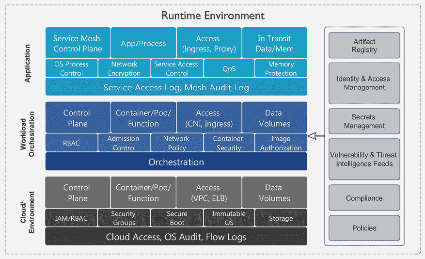

图 13.1：CNCF 运行时安全景观

总的来说，KubeArmor 是一个运行时安全工具，为您的系统提供动态、实时的保护，防止日益扩展的威胁和漏洞。它的目的是保护您基础设施的安全性和稳定性，在面对无数网络安全威胁时维护您操作的完整性。

# 介绍 KubeArmor

在我们深入了解 KubeArmor 之前，我们需要定义一些基础概念，您需要了解这些内容。如果您是 Linux 新手，可能对这些概念不太熟悉，即使您是 Linux 老手，这些概念也可能对您来说是新的。

## Linux 安全简介

在本章中，您将主要看到两个需要理解的术语，以了解 KubeArmor 如何保护集群。第一个术语是**eBPF**，它代表**扩展贝尔克利数据包过滤器**，第二个术语是**LSM**，代表**Linux 安全模块**。在*图 13.2*中，您可以看到一个 pod 的访问如何在到达主机内核之前经过 KubeArmor。这就是 KubeArmor 能够保护您运行时的方式：它位于 pod 运行时和内核之间，在请求执行之前采取行动。

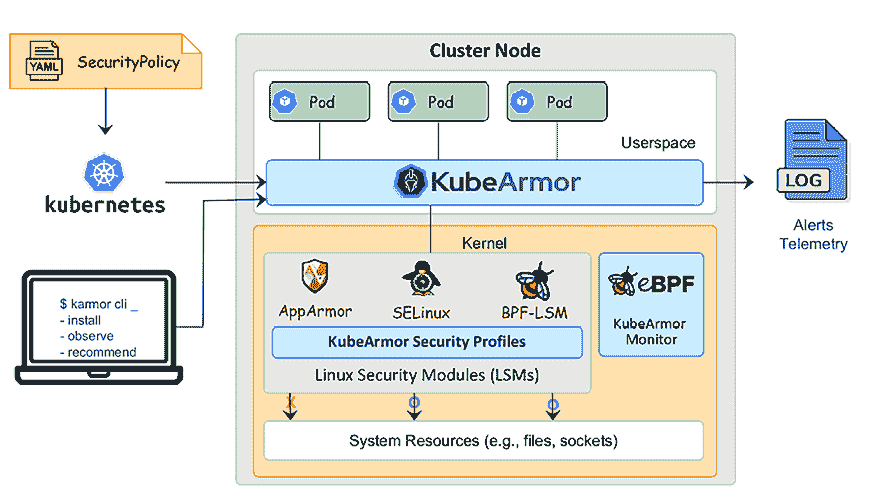

图 13.2：KubeArmor 的高级设计

现在，我们需要从一个高层次的角度解释什么是 eBPF 和 LSM，以及它们如何帮助保护集群。

您是否曾想过 Linux 是如何处理进出系统的持续数据流的？它如何监控性能，以及如何保护自己免受安全风险？那么，eBPF 就发挥了作用：它处理所有这些任务，甚至更多！

想象 eBPF 像一个数字交通警察。您的计算机就像一个繁忙的交叉口，数据在不断流动。eBPF 充当交通指挥员，能够控制数据流，检查数据是否存在问题，并跟踪正在进行的活动。

eBPF 的一个优势是它使用“虚拟机”，而不是直接编辑内核来添加监控网络流量等功能。eBPF 主要使用以 C 语言的受限子集编写的程序，这些程序在内核内执行。虽然 C 语言是创建 eBPF 程序时最常用的语言，但你也可以使用其他语言来创建它们，包括：

+   Go

+   Lua

+   Python

+   Rust

使用除 C 语言以外的语言涉及到转译成 C 语言或添加所需的库来抽象 C 语言编程。选择语言的最终决定取决于你的使用案例、标准和专业技能。

总之，eBPF 提供了许多强大的功能，而无需直接修改内核。它具有高度的安全性和隔离性，通过使用虚拟机提供了一个安全边界，类似于运行完整操作系统的标准虚拟机。

我们提到的另一个术语是**LSM**，即**Linux 安全模块**。当前最常见的两个 LSM 是 SELinux，主要用于 Red Hat 系统，以及**AppArmor**，它被多个系统使用，包括 Ubuntu、SUSE 和 Debian。

与之前的 eBPF 部分类似，我们将提供一个关于 LSM 的高层概述，重点介绍 AppArmor，因为我们使用 Ubuntu 作为我们的服务器操作系统。

LSM 用于将内核与安全策略和模块连接起来，提供对 Linux 系统中**强制访问控制**（**MACs**）和额外安全策略的执行。它们提供了一个安全框架，通过内核中的钩子提供对外部模块的支持，使得外部模块能够拦截和保护系统调用、文件操作和其他各种内核活动。LSM 设计为非常灵活和可扩展，允许你选择和创建符合特定需求的模块，而不是供应商认为你应该实施的一套政策。

鉴于 eBPF 和 LSM 都提供安全功能，你可能会想知道它们是否有区别，或者它们是如何不同的。

尽管它们在高层次上看似相似，但它们有显著的不同。eBPF 利用内核嵌入的虚拟机进行执行，使得能够创建能够执行低级任务的程序，如数据包过滤、追踪和性能监控。eBPF 通常用于与网络相关的任务、性能优化或开发自定义内核级功能。

LSM 是由内核执行的组件，外部运行于内核本身之外。LSM 的核心目的是通过执行策略（包括 MACs）以及其他旨在保护系统资源的措施来增强系统安全性。这些模块能够通过限制对各种元素的访问（从文件和进程到网络流量的流动）来提高集群安全性。

如果你足够了解特定的 LSM（如 AppArmor），你可以在没有像 KubeArmor 这样的工具的情况下创建策略。试想一下，如果你使用多个 Linux 发行版，你需要了解每个发行版所兼容的 LSM。这使得创建策略变得具有挑战性，而这正是 AppArmorKubeArmor 可以提供帮助的地方。

KubeArmor 简化了创建 LSM 策略的任务，免去了你需要了解不同 LSM 之间语法的麻烦。当你使用 KubeArmor 创建策略时，它会自动在主机系统上生成相应的 LSM 策略。这保证了无论底层 LSM 是什么，你都可以创建一组统一的策略，确保跨多个 Linux 发行版和 LSM 提供一致的安全标准。

正如你所想象的，KubeArmor 同时使用 eBPF 和 LSM 来帮助你保护环境。现在我们已经了解了 eBPF 和 LSM 提供的功能，接下来我们可以介绍 KubeArmor。

## 欢迎使用 KubeArmor

保护任何环境都可能是一项艰巨的任务。保护集群时，这不是你可以事后简单处理的问题；它应该是最初设计和讨论的一部分。许多组织倾向于推迟环境的安全性问题，因为他们认为实施安全解决方案需要技能、精力和时间。然而，在集群投入生产之前建立安全基础是至关重要的。这对许多组织来说是一个挑战，这正是 KubeArmor 可以提供帮助的地方。

通过部署 KubeArmor，你可以提高容器化应用程序的安全性和合规性。KubeArmor 作为一个运行时安全解决方案，旨在通过强制执行安全协议并及时识别和允许或拒绝任何活动来保护容器化工作负载。

KubeArmor 的功能在不断发展：等你读完这本书时，KubeArmor 可能会增加我们在本章中没有涉及的额外功能。

那么，KubeArmor 提供了哪些增强我们安全性的功能呢？

### 容器安全

容器是现代应用程序的基石，使得容器安全成为首要目标。这并不是说我们认为非容器化应用程序不需要安全性：当然需要，但非容器化应用程序有很多操作系统和第三方供应商提供的安全选项。我们今天所知道的容器是相对较新的，许多工具集仍在追赶。

KubeArmor 通过实时监控容器行为来提供安全性，缓解诸如容器逃逸、二进制执行和权限升级等风险。

### 内联缓解与事后攻击缓解

市场上有许多非常擅长检测异常的产品，但它们没有在实际执行之前阻止或允许请求的能力。这是一个攻击后缓解过程，意味着该动作会被允许或拒绝，异常也会被记录下来。

这就像是有一扇没有锁的门，当有人进入建筑物时，您得到的只是来自监控摄像头的警报。由于门没有锁，这个人仍然可以进入建筑物。

许多仅检测事件的产品可以与其他系统集成，以防止动作的执行。例如，一个系统检测到可能有人将加密货币挖矿程序注入正在运行的容器中。该事件将被异常引擎检测到，基于该事件，您可以触发一个自定义编写的程序来创建一个网络策略，拒绝所有进出流量。这将阻止应用程序进行网络活动，停止 Pod 挖矿，并且我们没有销毁 Pod，只是停止了所有进出 Pod 的网络流量。

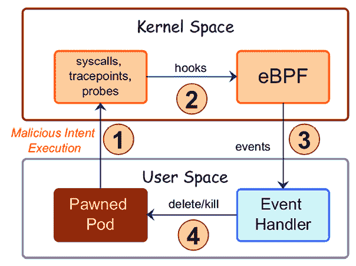

图 13.3：攻击后缓解

在*图 13.3*中，您可以看到攻击后缓解的流程。缓解的流程如下：

1.  攻击后缓解通过对可疑活动采取行动，响应表示恶意意图的警报。

1.  攻击者被允许执行二进制文件或其他操作。由于他们有访问权限，他们可能能够禁用安全控制、日志记录等，以避免被检测到。

1.  假设该动作已经被检测到，我们将其发送到事件处理程序，后者可以根据事件执行相应的动作。然而，重要的是要指出，在恶意进程被执行时，敏感内容可能已经被删除、加密或传输。

1.  根据事件，处理程序将执行一个动作，如删除 Pod，或者执行其他动作，如创建网络策略以阻止通信，而不删除 Pod。

KubeArmor 的一个关键区别是它不仅能检测运行时事件，还能对事件采取行动，根据各种参数来阻止或允许该事件。与攻击后缓解类似，您仍然会看到尝试的动作被记录下来，这些记录可能是记录恶意活动所需的证据。然而，不像之前那个没有锁的门的例子，这扇门将配有摄像头和锁。当有人尝试打开门时，摄像机会记录下这一尝试：但这一次，由于门被锁住，开门的动作将被拒绝。

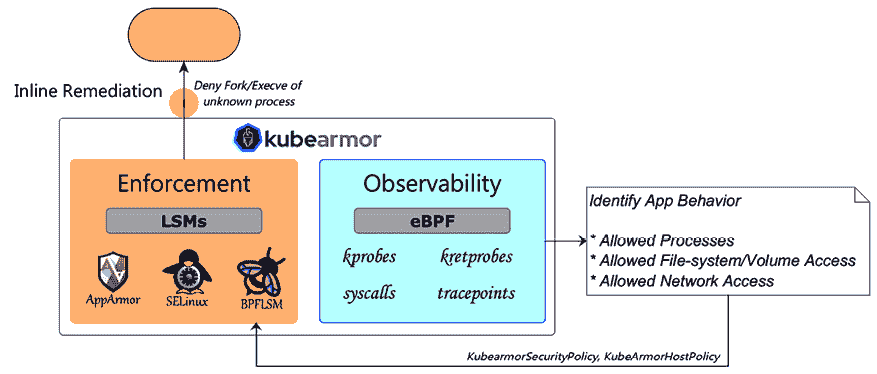

图 13.4：内联缓解

在 *图 13.4* 中，你可以看到该过程是如何简化的：我们无需外部事件处理程序或任何自定义组件来处理事件。由于 KubeArmor 在实时内联处理事件，我们可以在攻击者执行任何恶意操作之前立即停止该行为，所有这些都在一个单一产品中完成。

如你所见，内联缓解是缓解运行时事件的更好方法。威胁在今天的环境中发展迅速，我们需要同样迅速地进行缓解。如果我们只是在事件发生后再进行反应，损害已经发生，你也只能在日志中看到有人做了恶意操作。

### 零日漏洞

零日漏洞需要时间来修复，不仅是厂商方面的问题，组织方面也一样。如果你能够在等待官方补丁的同时修复任何漏洞，你应该这么做：每一秒钟都至关重要。KubeArmor 会监控容器活动中的任何可疑行为，能够在没有事先了解具体漏洞或攻击模式的情况下停止这些活动。

### CI/CD 管道集成

KubeArmor 可以轻松集成到**持续集成和持续部署**（**CI/CD**）管道中。将 KubeArmor 集成到你的管道中可以通过整个开发和部署生命周期自动化安全检查，从而提供一个安全可靠的镜像。

### 强大的审计和日志记录

日志记录非常重要，KubeArmor 包含容器活动的全面日志和审计跟踪。这些日志可用于报告合规性、提供故障排除帮助，并协助进行取证检查。

### 增强的容器可视化

对容器行为的可视化简化了识别和应对安全事件或异常的过程。KubeArmor 可以找到容器中正在运行的进程及其访问和连接的内容。

### 最小权限原则遵循

KubeArmor 基于最小权限原则，这是一个基本的安全原则。它确保容器仅拥有其指定功能所需的必要权限和访问级别，从而减少攻击面并限制因容器被攻破而可能带来的损害。

### 策略执行

策略是 KubeArmor 的核心。它们使管理员能够为容器创建详细的安全策略，精细调整每个不同、独特工作负载的要求。想要阻止任何容器执行 SSH 守护进程？只需使用 KubeArmor 创建一个简单的策略，任何容器都无法执行 SSH 守护进程。

### 保持合规性

为了帮助你保持符合 **CIS**、**NIST-800-53** 和 **MITRE** 等标准，KubeArmor 提供了一些策略，基于定义的最佳标准自动保护你的集群，开箱即用。

### 策略影响测试

在强制执行任何设置之前，可以先测试任何策略。这将帮助您创建一个不会因可能影响运行中的应用程序的设置而导致工作负载停机的策略。

### 多租户支持

企业通常会运行多租户集群。在多个团队或应用程序共享同一个 Kubernetes 集群的情况下，您需要为所有用户提供一个安全的环境，防止一个命名空间中的工作负载对另一个命名空间造成攻击或影响。KubeArmor 通过在容器级别实施独特的策略，为租户之间提供隔离和安全性。它是确保容器化应用程序安全的关键工具，能帮助满足合规要求，并防御各种安全威胁。

现在，让我们讨论一下如何在集群中部署 KubeArmor，以及如何使用它来保护我们的工作负载。

## 练习的集群要求

正如您在 *第二章* 中学到的，KinD 是一个在容器中运行组件的 Kubernetes 集群。这种嵌套意味着某些附加组件如 KubeArmor 需要额外的步骤才能正常工作。

本章建议使用新的集群。如果您已经有一个安装了 Vault 的旧集群，您应该删除该集群并从新集群开始。如果确实需要删除现有集群，您可以执行 `kind delete cluster --name cluster01` 来删除它，然后使用脚本部署一个包含 Vault 集成的新集群。

为了简化部署，我们在 `chapter13/cluster` 目录中包含了所有必需的脚本。要部署一个新集群，请在 `cluster` 目录中执行 `create-cluster.sh`。

我们还需要 Vault 来运行其中一个示例。如果您希望运行该示例，您需要将 Vault 添加到您的集群中。我们在 `chapter13/vault` 目录中提供了一个自动化的 Vault 部署脚本，名为 `deploy-vault.sh`。

一旦两个操作都执行完成，您将拥有一个全新集成了 Vault 的集群。Vault 完全部署需要一些时间，请等待所有 Pod 创建完成后再继续在集群中部署 KubeArmor。

# 部署 KubeArmor

在我们可以在 KinD 集群中使用 KubeArmor 之前，我们需要对 Calico 和 kubearmor-relay 部署进行补丁，以便它们能与 KinD 一起工作。AppArmor 需要对某些工作负载进行一些修改，才能在 KinD 集群中正确部署和运行。在标准集群中，这些补丁是不需要的：一旦部署完成，KubeArmor 就能像在标准 Kubernetes 集群中一样工作。

KubeArmor 可以通过一个名为 karmor 的单一二进制文件或通过 Helm charts 轻松部署。对于本书中的练习，我们将使用 karmor 工具来安装 KubeArmor。两种部署方法提供相同的保护和配置选项，一旦部署完成，您与 KubeArmor 的交互方式是相同的，无论采用哪种部署方式。

我们在`chapter13`文件夹中包含了一个名为`kubearmor-patch.sh`的脚本，它将下载 karmor，修补 Calico 和 kubearmor-relay 部署，并部署 KubeArmor。

KubeArmor 能够在大多数 Kubernetes 集群中顺利安装。由于我们使用的是基于 KinD 构建的集群，因此我们需要做一些调整，以确保 AppArmor 能够按预期工作。这些调整由脚本自动完成。大部分修复工作是为一些部署（如 Calico Typha 控制器）添加注解，以便它们进入未受限模式。我们将在本节中讨论这些修补部署以及未受限模式的功能。

脚本下载 karmor 并将其移动到主机的`/usr/local/bin`目录。这个工具将用于安装 KubeArmor 并在它部署到集群后与其交互。

由于 KubeArmor 依赖 LSM（Linux 安全模块），所有节点都需要安装 LSM，如 AppArmor，以使 KubeArmor 正常运行。在大多数 Ubuntu 部署中，AppArmor 已经部署，但由于我们的 Kubernetes 集群是容器化运行的，镜像中并未包含 AppArmor。为了解决这个问题，我们需要将 AppArmor 添加到我们的节点中：脚本通过在每个容器中执行`docker exec`来更新 apt 源、安装 AppArmor 并重启 containerd，完成这一过程。

脚本的下一步将使用一个未受限的`AppArmor`策略来修补`calico-typha`部署。以未受限模式运行策略意味着这些策略没有分配 AppArmor 配置文件，或者分配了一个不会施加任何重大限制的配置文件。这允许进程在标准 Linux 自由访问控制下运行，而不会受到 AppArmor 的附加限制。

正如我们之前提到的，标准的 Kubernetes 集群中不需要这些修补部署，但由于我们使用的是 KinD，我们需要修补`calico-typha`以便它能与在 KinD 集群中运行的 KubeArmor 正常配合使用。

在部署所有要求和变更后，脚本将继续使用 karmor install 安装 KubeArmor。这个过程需要几分钟来部署所有组件，并且在部署过程中，您将看到 karmor 正在执行的每一步操作：

```
namespace/kubearmor created
       Installed helm release : kubearmor-operator
      KubeArmorConfig created
      This may take a couple of minutes
      KubeArmor Snitch Deployed!
      KubeArmor Daemonset Deployed!
      Done Checking , ALL Services are running!
      Execution Time : 2m1.206181193s
      Verifying KubeArmor functionality (this may take upto a minute) —.
               Your Cluster is Armored Up! 
```

您将看到安装程序创建了许多 Kubernetes 资源，包括 CRD、ServiceAccount、RBAC、服务和部署。所有资源创建完成后，它将通过告诉您“`Your Cluster is Armored Up!`”来验证部署是否成功。

成功部署后，您将在`kubearmor`命名空间中运行额外的 Pods，包括控制器、转发器以及每个节点一个`kubearmor` Pod：

```
kubearmor-controller-7cb5467b99-wmlz5    2/2     Running   0          6m  
kubearmor-gvs5f                               1/1     Running   0          6m6s
kubearmor-lpkj6                             1/1     Running   0          6m6s
kubearmor-relay-5ccb6b6ffb-c4dlm               1/1     Running   0          6m6s 
```

您也可以使用 Helm charts 部署 KubeArmor。如果您想了解更多关于如何使用 Helm 部署 KubeArmor 的内容，可以在 KubeArmor 的 Git 仓库中阅读[`github.com/kubearmor/KubeArmor/blob/main/getting-started/deployment_guide.md`](https://github.com/kubearmor/KubeArmor/blob/main/getting-started/deployment_guide.md)。

每个 Pod 都有一个特定的功能，具体说明如下：

+   **kubearmor**：一个 DaemonSet，在集群的每个节点上部署 `kubearmor` Pod。它是一个非特权的 DaemonSet，具有能够监控 Pod、容器以及主机的能力。

+   **kubearmor-relay**：KubeArmor 的中继服务器收集 KubeArmor 在每个节点生成的所有消息、警报和系统日志，然后它允许其他日志系统通过中继服务器的服务轻松收集这些数据。中继服务器在确保 Kubernetes 环境中高效且集中化的安全监控与数据收集中发挥着关键作用，使得组织能够在其容器化基础设施中保持强大的安全态势。

+   **kubearmor-controller**：KubeArmor 策略管理的准入控制器，包括策略管理、分发、同步和日志记录。

本章我们选择了 karmor 二进制安装，因为它易于使用，成为快速部署 KubeArmor 的便捷选择。此外，接下来的练习中，我们也需要使用相同的 karmor 二进制文件。这个方法不仅简化了学习过程，还突出了 karmor 工具在管理 KubeArmor 部署和操作中的多功能性和实用性。

既然我们已经部署了 KubeArmor，接下来我们将在开始创建安全集群策略之前讨论如何配置日志记录。

# 启用 KubeArmor 日志记录

默认情况下，KubeArmor 不启用将事件或警报记录到 `STDOUT`。在本章的后续部分，我们将介绍如何在控制台中交互式地查看日志事件，这对于实时故障排除策略问题非常有用，但它并不是一种高效的历史事件日志记录方式。

大多数为 Kubernetes 设计的日志解决方案会从 `STDOUT` 和 `STDERROR` 中获取日志事件。通过启用 KubeArmor 的日志选项，你将能够在标准日志解决方案中拥有事件历史记录。使用这些事件，你可以创建警报并在进行安全审计时生成变更和事件的历史记录。

KubeArmor 提供三种可以记录的事件：

+   **警报**：当策略被违反时，将记录一条事件，包含的内容有操作、策略名称、Pod 名称、命名空间等信息。

+   **日志**：当 Pod 执行系统调用、文件访问、进程创建、网络套接字事件等时，会生成一条日志事件。

+   **消息**：由 KubeArmor 守护进程生成的日志条目。

启用日志记录的过程在 KubeArmor 的不同部署中有所不同。我们使用了 karmor 可执行文件进行部署，因此我们需要编辑部署，添加两个环境变量：一个用于标准日志记录，`ENABLE_STDOUT_LOGS`，另一个用于警报，`ENABLE_STDOUT_ALERTS`。这两个变量都需要设置为 true 才能启用。为了启用日志记录，我们需要编辑或修补 relay server 的部署。这已通过我们包含的部署 KubeArmor 的脚本完成。该脚本将使用标准的 YAML 文件来修补部署。下面显示了修补文件：

```
spec:
  template:
    spec:
      containers:
      - name: kubearmor-relay-server
        env:
        - name: ENABLE_STDOUT_LOGS
          value: "true"
        - name: ENABLE_STDOUT_ALERTS
          value: "true" 
```

接下来，使用补丁文件，`script` 执行 `kubectl patch` 命令：

```
kubectl patch deploy kubearmor-relay -n kubearmor --patch-file patch-relay.yaml 
```

一旦修补完毕，所有启用的日志将显示在 relay-server pod 的日志中。下面显示了一个事件的示例：

```
{"Timestamp":1701200947,"UpdatedTime":"2023-11-28T19:49:07.625696Z","ClusterName":"default","HostName":"cluster01-worker","NamespaceName":"my-ext-secret","Owner":{"Ref":"Pod","Name":"nginx-secrets","Namespace":"my-ext-secret"},"PodName":"nginx-secrets","Labels":"app=nginx-web","ContainerID":"88f324db1f6ffa01f42b2811288b6f8b0e66001f41c5101ce578f69c bd932e5e","ContainerName":"nginx-web","ContainerImage":"docker.io/library/nginx :latest@sha256:10d1f5b58f74683ad34eb29287e07dab1e90f10af243f151bb50aa5 dbb4d62ee","HostPPID":1441261,"HostPID":1441503,"PPID":43,"PID":50,"ProcessName":"/usr/bin/cat","PolicyName":"nginx-secret","Severity":"1","Type":"MatchedPolicy","Source":"/usr/bin/cat /etc/secrets/","Operation":"File","Resource":"/etc/secrets/","Data":"syscall=SYS_OPENAT fd=-100 flags=O_RDONLY","Enforcer":"AppArmor","Action":"Block","Result":"Permission denied"} 
```

从示例日志条目中，你可以看到事件的信息包含了你需要了解的所有活动内容。它包括对活动的回顾，包括：

+   源命名空间

+   Kubernetes 主机

+   Pod 名称

+   进程名称

+   被违反的策略名称

+   操作

+   被操作的资源

+   操作的结果，是允许还是拒绝

单独来看，这可能没有包含你需要了解的完整活动信息。比如，它没有包括初始活动的用户。像 Kubernetes 中的许多事件一样，你需要关联来自多个日志文件的事件，以创建活动的完整过程。在此示例中，你需要将审核初始 `kubectl exec` 命令的事件与 KubeArmor 记录的运行时违反事件的 Pod 和时间进行关联。

此时，我们已配置 KubeArmor，并且可以开始创建和测试策略。

# KubeArmor 和 LSM 策略

正如我们所提到的，KubeArmor 是一个帮助你为 Linux LSM 创建策略的工具。由于它创建标准的 LSM，任何你创建并部署的策略都会存储在节点上，存储位置与操作系统存储 LSM 策略的地方一致。由于我们使用的是 KinD，节点运行的是 Ubuntu 操作系统，而 Ubuntu 使用 AppArmor 作为 LSM。AppArmor 策略存储在主机的 `/etc/apparmor.d` 目录下。

以下输出显示了一个节点的示例目录，该节点已创建了一些 KubeArmor 策略：

```
kubearmor-local-path-storage-local-path-provisioner-local-path-provisioner
kubearmor-my-ext-secret-nginx-secrets-nginx-web
kubearmor-calico-apiserver-calico-apiserver-calico-apiserver             kubearmor-tigera-operator-tigera-operator-tigera-operator
kubearmor-calico-system-calico-kube-controllers-calico-kube-controllers  kubearmor-vault-vault-agent-injector-sidecar-injector
kubearmor-calico-system-calico-node-calico-node                          kubearmor-vault-vault-vault
kubearmor-calico-system-csi-node-driver-calico-csi
kubearmor-calico-system-csi-node-driver-csi-node-driver-registrar        lsb_release
kubearmor-cert-manager-cert-manager-cainjector-cert-manager-cainjector   nvidia_modprobe
kubearmor-cert-manager-cert-manager-cert-manager-controller              tunables 
```

如果你查看过任何策略，你会看到一个标准的 AppArmor 格式的策略。我们不会详细介绍如何创建 AppArmor 策略，但下面的输出展示了 KubeArmor 创建的一个策略示例：

```
## == Managed by KubeArmor == ##
#include <tunables/global>profile kubearmor-vault-vault-vault flags=(attach_disconnected,mediate_deleted) {
  ## == PRE START == ##
  #include <abstractions/base>
  umount,
  file,
  network,
  capability,
  ## == PRE END == ##
  ## == POLICY START == ##
  ## == POLICY END == ##
  ## == POST START == ##
  /lib/x86_64-linux-gnu/{*,**} rm,
  deny @{PROC}/{*,**^[0-9*],sys/kernel/shm*} wkx,
  deny @{PROC}/sysrq-trigger rwklx,
  deny @{PROC}/mem rwklx,
  deny @{PROC}/kmem rwklx,
  deny @{PROC}/kcore rwklx,
  deny mount,
  deny /sys/[^f]*/** wklx,
  deny /sys/f[^s]*/** wklx,
  deny /sys/fs/[^c]*/** wklx,
  deny /sys/fs/c[^g]*/** wklx,
  deny /sys/fs/cg[^r]*/** wklx,
  deny /sys/firmware/efi/efivars/** rwklx,
  deny /sys/kernel/security/** rwklx,
  ## == POST END == ##
} 
```

你的节点可能有些策略并非通过 KubeArmor 创建。为了知道哪些策略是由 KubeArmor 创建和管理的，哪些不是，你需要查看策略的第一行。如果策略是由 KubeArmor 创建的，它将以 `## == Managed by KubeArmor == ##` 开头，而没有以此行开头的策略不是由 KubeArmor 创建的。

现在让我们进入下一部分，创建 `KubeArmorSecurityPolicy`。

# 创建一个 KubeArmorSecurityPolicy

现在是时候创建一些策略了！当 KubeArmor 部署时，它会创建三个自定义资源定义，其中之一是 `kubearmorpolicies.security.kubearmor.com`，用于创建新的策略资源。

让我们直接进入一个示例策略。您无需将其部署到集群中；它仅用于展示一个示例策略。

如果我们想要阻止任何尝试在 `demo` 命名空间的容器中的 `/bin` 目录下创建文件的操作，下面是该策略的格式：

```
apiVersion: security.kubearmor.com/v1
kind: KubeArmorPolicy
metadata:
  name: block-write-bin
  namespace: demo
spec:
  action: Block
  file:
    matchDirectories:
    - dir: /bin/
      readOnly: true
      recursive: true
  message: Alert! An attempt to write to the /bin directory denied. 
```

分析这个策略，我们可以看到它使用了 `security.kubearmor.com/v1` API，并且是一个 KubeArmorPolicy 类型。元数据部分包含常见选项，将对象命名为 `block-write-bin`，并位于 `demo` 命名空间中。

`spec` 部分是我们实际开始创建新策略的地方。您可以使用许多选项来创建策略。有关所有选项的详细信息，您可以访问 KubeArmor 网站：[`docs.kubearmor.io/kubearmor/documentation/security_policy_specification`](https://docs.kubearmor.io/kubearmor/documentation/security_policy_specification)。

`spec` 部分允许您定义策略所执行的操作。选项包括 `Block`、`Allow` 和 `Audit`，每个选项的描述见下表。

| **可用操作** | **描述** |
| --- | --- |
| `Block` | 告诉 KubeArmor 阻止策略中包含的操作（如果未提供操作，默认为此） |
| `Allow` | 告诉 KubeArmor 允许策略中包含的操作 |
| `Audit` | 告诉 KubeArmor 只审计策略的操作。策略中的操作将被允许，但在我们的示例中，当有人在 `/bin` 目录下创建文件时，我们会收到一个已记录的事件。这对于测试策略如何影响集群中的工作负载非常有用。 |

表格 13.1：可用的策略操作

KubeArmor 的操作原则是实施最小权限访问。当您在策略中指定允许操作时，它会生成一个允许列表，只允许访问策略中指定的对象。例如，如果您为名为 `demo/allowed-file` 的文件建立一个 `allow` 策略，容器内的任何进程都将获得访问该文件的权限。容器内访问的所有其他文件都会触发审计事件，因为它们不属于允许列表。

您可能会对示例中的情况提出疑问：如果您设置了一个允许策略，而某人尝试读取另一个文件，它不会拒绝请求，而是会记录访问日志以供审计。允许策略中的默认安全态度与它如何管理未列在允许条目中的访问尝试有关。默认情况下，KubeArmor 的安全态度设置为审计模式。

需要特别注意的是，当你建立一个允许策略时，任何通常会被拒绝的访问请求将不会被拒绝；相反，它们只会触发审计警报。因此，如果你配置了一个允许规则来限制对特定文件的访问，所有其他文件仍然可以访问。

默认的姿态行为可以在全局级别或每个命名空间级别进行更改。要使全局默认姿态为阻止（block），而非审计（audit），你需要编辑 KubeArmor 配置，该配置存储在 `kubearmor` 命名空间中的名为 `kubearmor-config` 的 ConfigMap 中。在该配置中，你可以为每个选项、文件、网络和能力设置默认的安全姿态：

```
defaultFilePosture: block        #Can be block or audit
defaultNetworkPosture: block         #Can be block or audit
defaultCapabilitiesPosture: block     #Can be block or audit 
```

根据你的集群配置和集群的逻辑设计，你可能希望在特定命名空间中更改默认姿态。要在命名空间上设置策略，你需要添加一个注释 `kubearmor-file-posture=<value>`。如果我们想为现有的 demo 命名空间添加策略，我们只需要运行 `kubectl annotate`，如下所示：

```
kubectl annotate ns default kubearmor-file-posture=block --overwrite 
```

如果你是通过清单创建新的命名空间，只需在应用文件创建命名空间之前，将注释添加到清单中即可。

在定义完策略行为后，我们需要添加希望阻止、允许或审计的对象。

我们可以为四个对象创建策略。它们是：

+   进程

+   文件

+   网络

+   能力

    KubeArmor 网站提供了有关策略和选项的文档，位于 [`docs.kubearmor.io/kubearmor/documentation/security_policy_specification`](https://docs.kubearmor.io/kubearmor/documentation/security_policy_specification)。

在我们的示例中，我们的目标是阻止对 `/bin` 目录的任何写入访问。为此，我们将使用 `file` 对象。在声明对象后，你需要指定一个 `match` 条件，该条件会触发策略行为。在此实例中，我们已将 `matchDirectories` 行为专门配置为 `/bin` 目录，这表示只有当操作发生在该目录下时，KubeArmor 才会评估该策略。

接下来，还有可选的 `readOnly` 和 `recursive` 设置。在我们的场景中，我们已启用这两个选项。当 `readOnly` 设置为 true 时，它允许读取位于 `/bin` 下的任何文件，但其他任何操作都会被拒绝。启用 `recursive` 选项会指示 KubeArmor 评估 `/bin` 目录及其所有子目录。

最后，你可以定义消息选项，这将在策略触发时在 KubeArmor 日志中添加自定义消息。在我们的示例中，我们添加了消息选项，当尝试进行除读取 `/bin` 目录下的文件外的任何操作时，会显示“**警告！尝试写入 /bin 目录被拒绝。**”的消息。

你可能会对允许操作感到好奇，我们之前说它会创建一个允许列表，只允许访问政策中的对象，拒绝访问容器中的其他文件。单个文件的示例在实际应用中并不是一个很好的例子，但它确实解释了你授予了什么访问权限，以及哪些权限被允许政策拒绝。当允许政策正确使用时，它会紧密地锁定容器。而如果使用不当，你的应用可能会崩溃，因为被拒绝访问不在允许列表中的文件。你可以想象，为一个应用创建一个允许列表可能需要大量对象，而很多对象你可能很难自己找到。

让我们用一个实际的示例政策来结束这一节。

Foowidgets 希望保护他们的机密信息。他们已经制定了一项政策，要求所有机密信息必须存储在外部机密管理器中，如 Vault。正如我们在机密章节中讨论的那样，你可以从 Vault 中读取机密信息，而不需要在命名空间中存储 base64 编码的机密。很多人认为这可以保护机密信息，但他们忽略了一个问题，那就是任何人都可以进入容器并读取大多数文件，包括存储机密信息的文件。

我们如何增强机密信息的安全性，即使使用像 Vault 这样的外部机密管理器？答案就是 KubeArmor！

我们可以通过制定一项政策来解决 Foowidgets 的需求，允许只有必要的运行进程访问包含机密信息的文件，而其他进程则被拒绝访问。

在 `chapter13/nginx-secrets` 目录中，有一个名为 `create-nginx-vault.sh` 的脚本，它将创建一个 NGNIX web 服务器，当你打开网页路径 `/secrets/myenv` 时，会显示一个机密文件及其内容。页面上显示的机密信息是从 Vault 拉取的，并通过 `/etc/secrets/myenv` 这个卷挂载到 pod 中。

当你执行脚本时，最后一行会显示 **nip.io** 的 URL 用于 web 服务器。你可以在任意浏览器中打开该 URL，或者使用 curl 请求 `http://secret.<nip.io>/secrets/myenv` 来验证机密信息是否出现在输出中。你应该会看到类似于以下的输出：

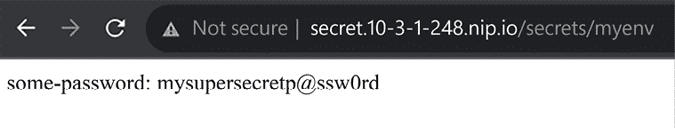

图 13.5：NGINX 显示机密文件内容

为了验证容器是否按预期工作，我们可以使用 `exec` 进入容器并尝试使用 `cat` 阅读机密文件：

```
kubectl exec -it nginx-secrets -n my-ext-secret -- bash 
```

机密信息已在 `/etc/secrets` 目录下的 `myenv` 文件中挂载到 pod 中：

```
cat /etc/secrets/myenv 
```

这将输出文件的内容：

```
some-password: mysupersecretp@ssw0rd 
```

等等！我以为使用外部机密管理器就能确保 Kubernetes 的机密信息安全。尽管它可能不会将数据存储在命名空间中容易发现的 `Secret` 中，但拥有容器执行访问权限的人仍然可以获取机密信息。

这个问题是像 Vault 这样的系统的一个缺点；仅仅使用 Vault 并不一定能确保机密信息的安全。

为了通过实际场景说明这一点，我们来考虑一下我们公司 Foowidgets 的需求。他们希望将秘密访问限制为仅限那些需要访问秘密的进程。这可以通过创建一个新的 KubeArmor 策略来实现，只允许应用程序访问包含秘密的文件。在我们的示例容器中，我们打算授予 NGINX 进程读取秘密文件的权限，同时阻止其他进程访问该文件。

为了实现这一目标，我们创建了一个名为`nginx-secrets-block.yaml`的示例策略文件。该文件将部署到`my-ext-secret`命名空间：

```
apiVersion: security.kubearmor.com/v1
kind: KubeArmorPolicy
metadata:
  name: nginx-secret
  namespace: my-ext-secret
spec:
  selector:
    matchLabels:
      app: nginx-web
  file:
    matchDirectories:
    - dir: /
      recursive: true
    - dir: /etc/nginx/
      recursive: true
      fromSource:
        - path: /usr/sbin/nginx
    - dir: /etc/secrets/
      recursive: true
      fromSource:
        - path: /usr/sbin/nginx
    - dir: /etc/nginx/
      recursive: true
      action: Block
    - dir: /etc/secrets/
      recursive: true
      action: Block
  process:
    matchPaths:
    - path: /usr/sbin/nginx
  action:
    Allow 
```

为了展示策略的实际效果，我们在`chapter13/nginx-secrets`目录中包含了一个名为`redeploy-nginx-vault.sh`的脚本，该脚本将删除先前的 NGINX 部署，然后创建一个带有 KubeArmor 策略的新部署，以保护 NGINX 使用的 Vault 秘密。

执行该脚本并等待新的部署和策略创建完成。我们需要确认最终结果符合我们对新策略的预期。为了验证策略，我们将通过执行`kubectl exec -it nginx-secrets -n my-ext-secret -- bash`进入 pod，尝试访问秘密。

进入 pod 后，我们可以尝试使用`cat`查看秘密：

```
cat /etc/secrets/myenv 
```

您会注意到，访问该文件已经被阻止。KubeArmor 会拦截请求，并根据策略拒绝访问`/etc/secrets/myenv`文件：

```
root@nginx-secrets:/etc/secrets# cat /etc/secrets/myenv
cat: /etc/secrets/myenv: Permission denied 
```

请注意，尽管您在容器内拥有 root 权限，但无法访问`/etc/secrets`目录中的`myenv`文件。该策略阻止了任何未明确允许的对该目录或文件的访问。

到目前为止，一切似乎都进展顺利。然而，我们现在必须验证网站，确保秘密信息仍然存在。如果网站显示与实施我们策略之前相同的内容，说明 NGINX 二进制文件允许读取该秘密。为了验证这一点，导航到您之前用来测试该网站的相同 URL，无论是通过浏览器还是使用`curl`命令。如果您仍然保持同一个浏览器窗口打开，只需刷新它即可。

下面的截图验证了网站正常运行，并继续显示`/etc/secrets`目录下`myenv`文件中存储的值。这确认了 NGINX 二进制文件具有访问秘密文件所需的权限：

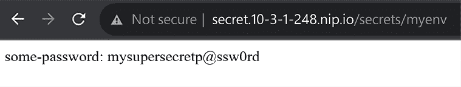

图 13.6：NGINX 仍然可以读取秘密

KubeArmor 简化了开发人员和运维人员创建 LSM 策略的过程。其潜在应用几乎是无限的，使您能够增强工作负载的安全性，精确到单个文件或进程的粒度。现在我们已经介绍了策略创建的过程，接下来让我们深入探讨您将用来与 KubeArmor 交互的主要工具。

# 使用 karmor 与 KubeArmor 交互

我们使用 karmor 实用程序安装了 KubeArmor。除了在集群中安装和卸载 KubeArmor 外，它还用于执行许多其他操作。下表是您应该了解的主要选项概述。每个选项将在其各自的章节中详细解释。

| **选项** | **描述** |
| --- | --- |
| `安装` | 在集群中安装 KubeArmorKubeArmor |
| `日志` | 提供交互查看日志的方法，或将日志发送到文件 |
| `探针` | 列出集群支持的功能特性 |
| `配置文件` | 运行一个交互式实用程序，显示 KubeArmor 观察到的进程、文件、网络和系统调用 |
| `推荐` | 创建一个包含推荐策略的目录，可以在集群中部署。这将下载额外的容器来创建推荐内容。根据正在运行的容器数量和大小，可能需要一些时间。 |
| `自更新` | 更新 `karmor` 命令行工具 |
| `摘要` | 显示来自发现引擎的观察结果 |
| `系统转储` | 用于收集系统转储以帮助故障排除 |
| `卸载` | 从集群中卸载 KubeArmor |
| `版本` | 显示 karmor 二进制文件的版本 KubeArmor |
| `Vm` | 用于对运行 `Kubevirt` 和 `kvmservices` 的虚拟机执行命令 |

表 13.2：karmor 命令选项

这个列表可能会让 KubeArmor 看起来选择不多，但大多数选项非常强大，并且在较大的集群中运行某些选项可能需要时间。在接下来的章节中，我们将解释 karmor 的选项及其提供的安全功能。

## karmor 安装和卸载

如您所料，`karmor install` 命令将使用当前的 `kubeconfig` 文件将 KubeArmor 部署到集群中，而 `karmor uninstall` 命令将从集群中移除 KubeArmor。

需要注意的是，默认情况下 `karmor uninstall` 会从集群中移除 KubeArmor，但会使在主机上创建的所有 LSM 策略处于非活动状态。要完全从集群中移除 KubeArmor，包括所有创建的策略，您需要在 `uninstall` 命令中加入 `--force` 标志。

## karmor 探针

探针选项将列出当前集群中的 KubeArmor 功能。

当您检查支持的探针时，karmor 将输出信息，包括每个节点及其活动的 LSM 和每个命名空间和 Pod 的默认姿态。

## karmor 配置文件

KubeArmor 的配置文件为您提供了一个交互式控制台，用于查看正在使用的进程、文件、网络连接和系统调用。下面的屏幕显示了从选择了 **文件** 选项的探针中的简略输出。

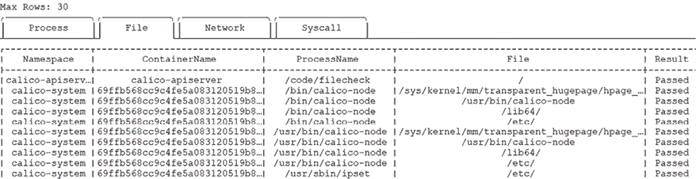

图 13.7：karmor 配置文件输出

默认情况下，探针将输出所有命名空间的信息。如果您有具有大量命名空间和 Pod 的集群，可以将输出限制为单个命名空间或特定的 Pod。

要将输出限制为单个命名空间，可以添加选项 `-n` 或 `--namespace <namespace to prove>`，如果只想限制输出到某个 pod，可以使用 `-p` 或 `--pod <pod name to probe>`。

如果你想看到实际效果，假设你想监视一个名为 `demo` 的新命名空间的活动。你可以执行 recommend 命令并添加 `-n demo`。

在主机上，执行下面显示的探针命令：

```
karmor profile -n demo 
```

你可能会在某些标签页下看不到任何活动。profile 命令需要有活动才能显示，如果没有任何被监视事件的活动，它们将不会显示任何数据。在 KubeArmor 看到活动并创建新条目之前，你会看到一个空白列表，如 *图 13.8* 所示。

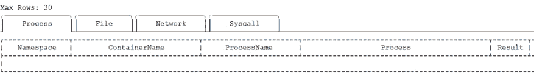

图 13.8：KubeArmor 的 profile 控制台

打开另一个连接到主机，以便创建一个新的 NGINX 部署。在 `chapter13/nginx` 目录下有一个名为 `ngnix-ingress.sh` 的脚本，它将创建一个名为 demo 的命名空间，并部署一个 NGINX 和一个 ingress 规则。执行脚本后，最后它将显示你需要使用的 ingress URL。

现在我们已经创建了一个部署，你的另一个终端应该会在 **Process** 标签中显示活动，如 *图 13.9* 所示。

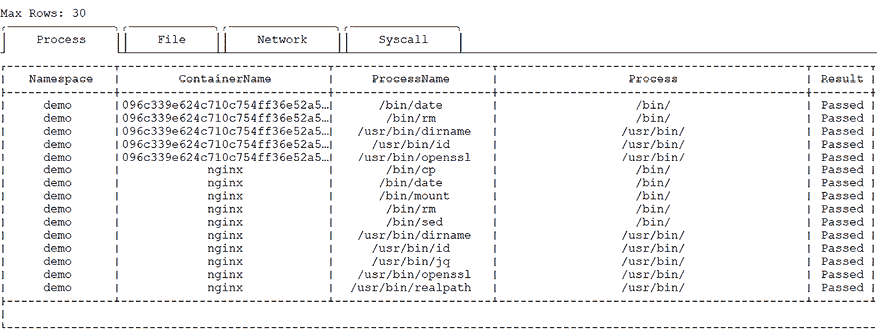

图 13.9：KubeArmor 的 profile 控制台

随着 NGINX pod 启动并且进程开始运行，这将会在 **Process** 标签中填充事件。在你的另一个窗口中，你将实时看到 profile 更新，并显示在 demo 命名空间中启动的进程。

KubeArmor 的探针是一个强大的工具，它提供了通常很难收集的信息。

## karmor recommend

`recommend` 命令用于根据已建立的行业合规标准和攻击框架（如 CIS、MITRE、NIST、STIG 等）提供安全策略推荐。所有在 recommend 命令中指定的工作负载将会针对 KubeArmor 包含的任何策略模板进行测试。

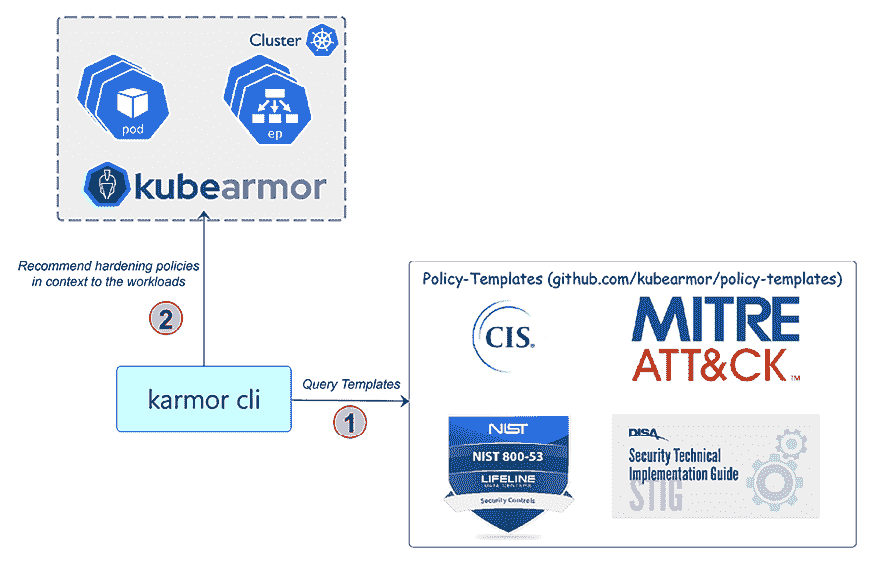

图 13.10：KubeArmor recommend 策略

由于每个 pod 和容器都会被评估，你可以选择通过命名空间、容器镜像或 pod 来过滤执行，不仅仅是针对集群。以下是运行 `karmor recommend` 命令的示例输出，如 *图 13.11* 所示：

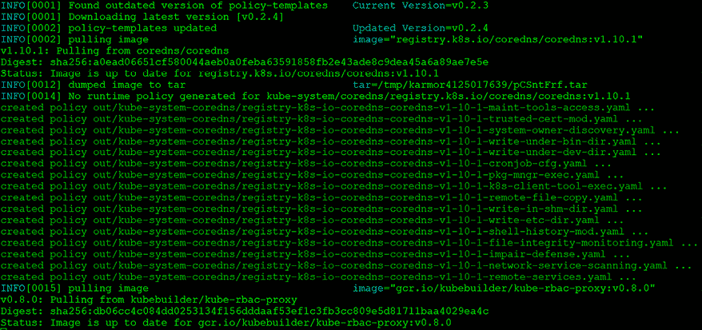

图 13.11：karmor recommend 输出

从输出中，你可以看到 karmor 将为每个容器拉取镜像，以便测试策略。所有由 karmor 创建的策略默认保存在当前工作目录下的一个目录中。你可以通过向 recommend 命令添加 `-o` 或 `--output` 选项来更改策略的创建位置。由于推荐内容按每个操作分解，你可能会生成大量的文件。举个例子，我们对 KinD 集群的 `kube-system` 命名空间运行 recommend 命令，它生成了如下所示的目录结构：

```
./out
├── kube-system-coredns
├── kube-system-kubearmor-controller
└── kube-system-kubearmor-relay 
```

除了每个部署的目录，你还会看到一个`report.txt`文件，里面包含了各种标准下所有推荐的策略，包括 NIST、MITRE、PCI-DSS、CIS 等。我们将在后面的章节讨论报告及其选项。目前，我们希望关注创建的策略。

让我们更仔细地看一下列表中的第一个目录，它包含了`kube-system`命名空间中`core-dns`部署的策略。正如你从输出中看到的，`recommend`命令创建了 16 个策略：

```
kube-system-coredns/
├── registry-k8s-io-coredns-coredns-v1-10-1-cronjob-cfg.yaml
├── registry-k8s-io-coredns-coredns-v1-10-1-file-integrity-monitoring.yaml
├── registry-k8s-io-coredns-coredns-v1-10-1-impair-defense.yaml
├── registry-k8s-io-coredns-coredns-v1-10-1-k8s-client-tool-exec.yaml
├── registry-k8s-io-coredns-coredns-v1-10-1-maint-tools-access.yaml
├── registry-k8s-io-coredns-coredns-v1-10-1-network-service-scanning.yaml
├── registry-k8s-io-coredns-coredns-v1-10-1-pkg-mngr-exec.yaml
├── registry-k8s-io-coredns-coredns-v1-10-1-remote-file-copy.yaml
├── registry-k8s-io-coredns-coredns-v1-10-1-remote-services.yaml
├── registry-k8s-io-coredns-coredns-v1-10-1-shell-history-mod.yaml
├── registry-k8s-io-coredns-coredns-v1-10-1-system-owner-discovery.yaml
├── registry-k8s-io-coredns-coredns-v1-10-1-trusted-cert-mod.yaml
├── registry-k8s-io-coredns-coredns-v1-10-1-write-etc-dir.yaml
├── registry-k8s-io-coredns-coredns-v1-10-1-write-in-shm-dir.yaml
├── registry-k8s-io-coredns-coredns-v1-10-1-write-under-bin-dir.yaml
└── registry-k8s-io-coredns-coredns-v1-10-1-write-under-dev-dir.yaml 
```

如果你查看文件名，你可以判断每个策略使用的是什么类型的操作和过程。例如，让我们看一下`registry-k8s-io-coredns-coredns-v1-10-1-write-etc-dir.yaml` `策略`。从文件名中，我们可以看出这个策略是为了在`/etc`目录中添加写操作而创建的。深入查看文件，我们会看到这个策略包含了对`/etc`目录的阻止操作，并且它还将`/etc`锁定为只读状态，适用于任何与标签`k8s-app=kube-dns`匹配的内容。

```
apiVersion: security.kubearmor.com/v1
kind: KubeArmorPolicy
metadata:
  name: coredns-registry-k8s-io-coredns-coredns-v1-10-1-write-etc-dir
  namespace: kube-system
spec:
  action: Block
  file:
    matchDirectories:
    - dir: /etc/
      readOnly: true
      recursive: true
  message: Alert! File creation under /etc/ directory detected.
  selector:
    matchLabels:
      k8s-app: kube-dns
  severity: 5
  tags:
  - NIST_800-53_SI-7
  - NIST
  - NIST_800-53_SI-4
  - NIST_800-53
  - MITRE_T1562.001_disable_or_modify_tools
  - MITRE_T1036.005_match_legitimate_name_or_location
  - MITRE_TA0003_persistence
  - MITRE
  - MITRE_T1036_masquerading
  - MITRE_TA0005_defense_evasion 
```

在这个策略中有几个我们之前没有讨论过的字段，分别是严重性和标签。与其他可能将严重性添加到触发事件的工具不同，KubeArmor 允许你为策略设置自己的严重性。当你创建策略时，可以为其分配一个从 1 到 10 的严重性评分，允许你根据组织需求创建自己的评分标准。

标签部分是由推荐命令生成的。默认情况下，当你运行推荐时，它会根据所有包含的加固策略（包括 MITRE TTP、STIG、NIST 和 CIS）对所有对象进行测试。创建的策略是基于在推荐收集过程中提供的标准。如果你没有指定任何要检查的策略，Karmor 将为所有标准创建策略，包括你可能需要或不需要的策略。

根据你的组织和安全要求，你可以将加固策略限制为仅包含你希望包括的策略。这可以通过在推荐命令中添加`-t`或`--tag`标志来完成，后面跟上标准或标准集。例如，如果我们希望对`kube-system`命名空间执行推荐，并且只包括 CIS 和 PCI-DSS 标准，我们可以执行：

```
karmor recommend -n kube-system -t PCI-DSS,CIS 
```

像所有其他推荐命令一样，这个命令会在工作目录中创建一个`out`目录，里面包含策略和一个`report.txt`文件。如果你查看报告，你会看到针对每个 Pod 在 PCI-DSS 和 CIS 标准下的推荐操作列表。下面的图是我们对`kube-system`运行推荐命令时生成的`report.txt`的简化示例。

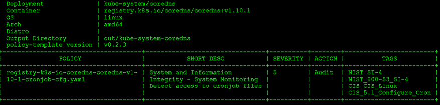

图 13.12：NIST 和 CIS 的推荐示例

由于我们在命令中添加了标签，karmor 只会创建满足 NIST 和 CIS 标准所需的策略。这将比没有标签的运行生成更少的策略，因为它将仅基于指定的标签生成策略，而不是所有标准（如果您未提供标签）。

我们将讨论的最后一个示例是使用推荐命令为在集群中未运行的镜像创建策略和报告。到目前为止，我们已对集群中的对象运行了推荐命令，但 KubeArmor 提供了基于任何容器镜像创建策略的功能。要对一个镜像运行推荐命令，您需要在命令中添加 `-i` 或 `--image` 参数。例如，我们想对 `bitnami/nginx` 镜像运行 karmor：

```
karmor recommend -i bitnami/nginx 
```

这将拉取镜像并根据所有已包含的 KubeArmor 策略进行运行。策略将与之前的示例一样，创建在 `out` 目录中：

```
out
└── bitnami-nginx-latest
Notice that the directory name does not contain a namespace; it only has the image name and tag that we tested against, bitnami/nginx:latest. This example run created a number of policies since we ran it against all included policies:
├── access-ctrl-permission-mod.yaml
├── cis-commandline-warning-banner.yaml
├── cronjob-cfg.yaml
├── file-integrity-monitoring.yaml
├── file-system-mounts.yaml
├── impair-defense.yaml
├── k8s-client-tool-exec.yaml
├── maint-tools-access.yaml
├── network-service-scanning.yaml
├── pkg-mngr-exec.yaml
├── remote-file-copy.yaml
├── remote-services.yaml
├── shell-history-mod.yaml
├── system-network-env-mod.yaml
├── system-owner-discovery.yaml
├── trusted-cert-mod.yaml
├── write-etc-dir.yaml
├── write-in-shm-dir.yaml
├── write-under-bin-dir.yaml
└── write-under-dev-dir.yaml 
```

如果我们运行相同的测试并仅包括 CIS 策略的标签，我们将生成更少的策略：

```
├── access-ctrl-permission-mod.yaml
├── cis-commandline-warning-banner.yaml
├── cronjob-cfg.yaml
├── file-system-mounts.yaml
└── system-network-env-mod.yaml 
```

如示范所示，recommend 命令使您能够根据组织、政府法规或其他相关标准提高工作负载的安全性。

## karmor logs

日志选项提供了 KubeArmor 活动的实时日志，这对于希望查看事件而不看到成百上千其他已记录活动的用户非常有用。当您执行 karmor log 时，日志记录器将启动并监视 KubeArmor 活动。由于这是实时日志，它将在您的 shell 中以交互方式运行，等待活动发生：

```
local port to be used for port forwarding kubearmor-relay-7676f9684f-652ll: 32879
Created a gRPC client (localhost:32879)
Checked the liveness of the gRPC server
Started to watch alerts 
```

当 KubeArmor 观察到事件时，它们将显示在输出中。例如，我们创建了一个策略，阻止在演示命名空间中所有容器对 `/bin` 目录的任何写入尝试。我们进入容器并尝试在该目录下创建一个名为 `test` 的文件。如下面的输出所示，尝试被拒绝：

```
I have no name!@nginx-web-57794669f5-gd4r4:/app$ cd /bin
I have no name!@nginx-web-57794669f5-gd4r4:/bin$ touch test
touch: cannot touch 'test': Permission denied 
```

由于这是一个 KubeArmor 已经有策略的操作，它也会在运行 karmor 日志的会话中记录活动。日志包含了大量信息。以下是一个记录事件的示例：

```
== Alert / 2023-10-09 14:14:32.192243 ==
ClusterName: default
HostName: cluster01-worker
NamespaceName: demo
PodName: nginx-web-57794669f5-gd4r4
Labels: app=nginx-web
ContainerName: nginx
ContainerID: 8048c5fb3fd2425e401505cb4c12d147fddd71e6587ba3f3c488e609b28819a8
ContainerImage: docker.io/bitnami/nginx:latest@sha256:4ce786ce4a547b796cf23efe62b54a910de6fd41245012f10e5f75e85ed3563c
Type: MatchedPolicy
PolicyName: DefaultPosture
Source: /usr/bin/touch test
Resource: test
Operation: File
Action: Block
Data: syscall=SYS_OPENAT fd=-100 flags=O_WRONLY|O_CREAT|O_NOCTTY|O_NONBLOCK
Enforcer: AppArmor
Result: Permission denied
HostPID: 2.731789e+06
HostPPID: 2.731618e+06
Owner: map[Name:nginx-web Namespace:demo Ref:Deployment]
PID: 59
PPID: 53
ParentProcessName: /bin/bash
ProcessName: /bin/touch
UID: 1001 
```

默认情况下，日志输出设置为文本格式，这在日志事件较多时可能难以筛选。如果您希望日志以 JSON 格式显示，可以在 `logs` 命令中添加 `--json` 标志。最适合您需求的格式通常取决于您用于存储日志事件的系统。在大多数情况下，JSON 是大多数日志系统首选的格式。

为了展示差异，我们执行与前一条日志相同的测试，尝试在 `/bin` 下创建一个文件。这将把输出从文本格式转换为 JSON，如下所示：

```
{"Timestamp":1696861352,"UpdatedTime":"2023-10-09T14:22:32.445655Z","ClusterName":"default","HostName":"cluster01-worker","NamespaceName":"demo","Owner":{"Ref":"Deployment","Name":"nginx-web","Namespace":"demo"},"PodName":"nginx-web-57794669f5-gd4r4","Labels":"app=nginx-web","ContainerID":"8048c5fb3fd2425e401505cb4c12d147fddd71e6587ba3f3c488e6 09b28819a8","ContainerName":"nginx","ContainerImage":"docker.io/bitnami /nginx:latest@sha256:4ce786ce4a547b796cf23efe62b54a910de6fd41245012f 10e5f75e85ed3563c","HostPPID":2731618,"HostPID":2739719,"PPID":53,"PID":60,"UID":1001,"ProcessName":"/bin/touch","PolicyName":"DefaultPosture","Type":"MatchedPolicy","Source":"/usr/bin/touch test","Operation":"File","Resource":"test","Data":"syscall=SYS_OPENAT fd=-100 flags=O_WRONLY|O_CREAT|O_NOCTTY|O_NONBLOCK","Enforcer":"AppArmor","Action":"Block","Result":"Permission denied"} 
```

使用文本或 JSON 的决定通常取决于您计划用来解析数据的工具。JSON 是一种流行的日志格式，因为它比文本格式更容易解析数据。

你可能正在查看使用 karmor 日志功能，想知道仅将输出定向到控制台有多大用处。

默认情况下，日志被定向到`stdout`。虽然实时日志查看对监控事件的发生非常有价值，但持续观察事件并不总是可行的。通常的做法是将日志发送到文件中，然后查看该文件或将其发送到外部系统进行处理。KubeArmor 提供了通过使用`--logPath`标志来修改日志输出偏好的灵活性。这个标志允许你指定日志文件的目标位置，从而将日志数据重定向到指定的文件路径。

当你指定日志文件的路径时，必须包含你希望使用的完整路径和文件名。`logPath`选项可以与其他选项一起使用，比如将日志格式设置为 JSON。下面的示例命令将把日志发送到当前用户的主目录，并使用文件名`karmor.logs`以 JSON 格式保存：

```
karmor logs --json --logPath ~/karmor.logs 
```

如果你在`logPath`中指定了一个新的目录，它必须在发送任何日志之前创建；KubeArmor 不会为你创建该目录。如果你在记录日志之前没有创建目录，你将收到日志输出屏幕上的错误，并且不会记录任何事件。

当 KubeArmor 捕获到第一个事件时，它会创建文件并继续收集数据，直到你停止记录：

```
-rw-rw-r--  1 surovich surovich  2602 Oct  9 14:49 karmor.logs 
```

和其他 karmor 选项一样，日志默认会监视整个集群，这可能会生成大量事件，使你难以找到真正需要查看的事件。你可以通过向`logs`选项添加标志来过滤日志，而不是记录整个集群。可用的标志包括：

| **标志** | **描述** |
| --- | --- |
| `--labels` | 按标签过滤日志 |
| `--namespace` | 按命名空间过滤日志 |
| `--pod` | 按 pod 过滤日志 |

表 13.3：限制日志到特定对象

限制被记录对象的范围有一个明显的优势，那就是可以根据需要详细信息的特定对象定制日志数据。通过实施这种方法，你可以显著提高日志数据的精确性和相关性，确保它与你的特定监控、分析和故障排除需求直接对齐。限制被记录对象可以使你简化监控工作，使其更加高效，并有效提供对目标对象的洞察，同时减少因不必要的日志条目导致的噪音和冗余。

## karmor vm

你知道通过 Kubernetes 可以运行虚拟机吗？这些虚拟机的部署和管理方式与使用 VMware 和 Microsoft 的虚拟化技术时有所不同。与其直接在虚拟化程序上运行操作系统，KubeVirt 的虚拟机实际上是在容器内运行的。它们看起来像是运行其他 Docker 镜像的标准 Pod，但它们不是微服务，而是一个完整的操作系统，支持 Windows 和 Linux。

KubeVirt 是一个复杂的话题，我们无法仅在本节中涵盖。你可以在他们的官网了解更多关于 KubeVirt 的信息，[`kubevirt.io/`](https://kubevirt.io/)。

KubeArmor 团队意识到需要将运行时安全性扩展到支持使用 KubeVirt 运行的虚拟机。这是一个强大的功能，适用于在 Kubernetes 中运行虚拟机的组织，将 KubeArmor 为容器提供的安全性扩展到虚拟机。

# 总结

在本章中，我们探讨了如何加强我们运行时环境的安全性，提升整体安全态势。很多人误以为组织的集群已经安全，但许多集群往往忽视了容器中运行的内容，或忽视了用户通过`kubectl exec`连接到运行中的 Pod 的潜在风险。

本章还详细描述了容器安全性最有效的方法之一，涉及严格控制容器的进程，专门允许仅执行必要的进程，同时拒绝访问其他所有文件。通过利用像 KubeArmor 这样的工具，你可以为受限的二进制文件集合提供文件访问权限，阻止对其他所有进程的访问并进行保护。

# 问题

1.  以下哪些是 LSM？

    1.  Accuknox

    1.  AppArmor

    1.  SELinux

    1.  LSMLinux

1.  LSM 和 eBPF 提供相同的功能。

    1.  正确

    1.  错误

1.  哪个 karmor 选项提供易于查看的实时信息？

    1.  监控

    1.  跟踪

    1.  配置文件

    1.  探测

1.  以下哪项不是 KubeArmor 为增强 Kubernetes 集群安全性而提供的功能？

    1.  限制进程执行

    1.  文件访问控制

    1.  网络流量加密

    1.  创建安全策略

# 答案

1.  b - AppArmor

1.  b - 错误

1.  c - 配置文件

1.  c - 网络流量加密

# 加入我们书籍的 Discord 空间

加入本书的 Discord 工作区，参加每月的*问我任何问题*（Ask Me Anything）环节，与作者互动：

[`packt.link/K8EntGuide`](https://packt.link/K8EntGuide)


