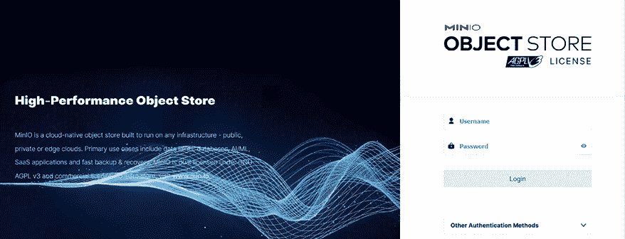
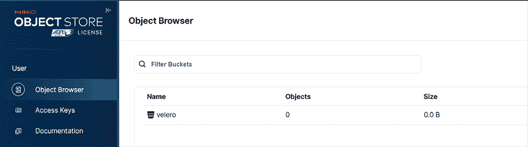
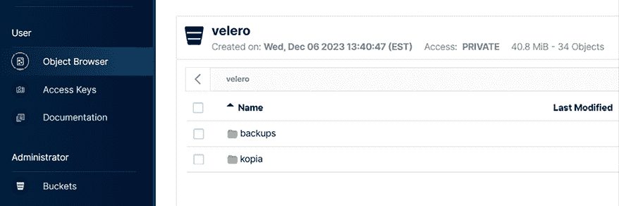

# 第十四章：备份工作负载

Kubernetes 的备份产品是我们不断进化的容器编排和云原生计算世界中的重要组成部分。在本章中，我们将探讨如何使用 Velero 的功能，以及它如何帮助你确保工作负载的韧性和可靠性。Velero 在意大利语中的意思是“安全”或“保护”，这个名字非常贴切，因为它为你的应用程序提供了安全网，使你能够在动态且不断变化的环境中自信地运行它们。

随着你深入了解 Kubernetes 和微服务，你会迅速意识到备份、恢复和迁移应用程序的优势。虽然 Kubernetes 是一个出色的容器化应用程序部署和管理系统，但它本身并没有提供数据保护和灾难恢复的工具。这一空白由**Velero**填补，它为保护你的 Kubernetes 工作负载及其相关数据提供了完整的解决方案。

Velero 最初名为 Heptio Ark。Heptio 是由 Kubernetes 的两位原始创建者 Joe Beda 和 Craig McLuckie 共同创办的公司。从那时起，它成为了 VMware Tanzu 产品组合的一部分，展示了它在 Kubernetes 生态系统中的重要性。

在本章中，我们将探索 Kubernetes 和 Velero 的关键功能和使用场景，从基本的备份和恢复操作到更高级的场景，如跨集群迁移。无论你是刚开始接触 Kubernetes，还是一位经验丰富的 Kubernetes 运维人员，Velero 都是一个值得学习的工具。

本章将涵盖以下主题：

+   理解 Kubernetes 备份

+   执行 `etcd` 备份

+   介绍和设置 VMware 的 Velero

+   使用 Velero 备份工作负载和 PVC

+   使用 CLI 管理 Velero

+   从备份恢复

# 技术要求

为了进行本章的实践实验，你需要以下内容：

+   运行 Docker 的 Ubuntu 22.04+ 服务器，至少 8 GB 内存。

+   根据*第二章*中的规格构建的 KinD 集群。

+   从仓库中的 `chapter14` 文件夹获取脚本，你可以通过访问本书的 GitHub 仓库来找到：[`github.com/PacktPublishing/Kubernetes-An-Enterprise-Guide-Third-Edition`](https://github.com/PacktPublishing/Kubernetes-An-Enterprise-Guide-Third-Edition)

# 理解 Kubernetes 备份

备份 Kubernetes 集群不仅仅是备份集群上运行的工作负载。你需要考虑任何持久化数据以及集群本身。记住，集群状态是保存在 `etcd` 数据库中的，因此它是一个非常重要的组件，必须进行备份，以便在灾难发生时进行恢复。

创建集群和运行工作负载的备份使你能够执行以下操作：

+   迁移集群。

+   从生产集群创建开发集群。

+   从灾难中恢复集群。

+   从持久卷中恢复数据。

+   命名空间和部署恢复。

在本章中，我们将提供详细信息和工具来备份您的 `etcd` 数据库、命名空间、其中的对象以及您附加到工作负载的任何持久数据。

在企业中从完全灾难中恢复集群通常涉及备份各种组件的自定义 SSL 证书，如 Ingress 控制器、负载均衡器和 API 服务器。由于在许多环境中备份所有自定义组件的过程不同，我们将专注于大多数 Kubernetes 发行版中通用的流程。

如您所知，集群状态由 `etcd` 维护，如果您丢失所有 `etcd` 实例，您将丢失您的集群。在多节点控制平面中，您应至少拥有三个 `etcd` 实例，为集群提供冗余。如果丢失一个节点，集群将继续运行，并且您可以用新节点替换失败的节点。一旦添加新实例，它将接收 `etcd` 数据库的副本，您的集群将恢复到完全冗余状态。

如果您丢失所有 `etcd` 服务器并且没有数据库备份，您将丢失集群，包括集群状态和所有工作负载。由于 `etcd` 非常重要，`etcdctl` 实用程序包含内置备份功能。在接下来的部分，我们将展示如何使用 `etcdctl` 实用程序进行 `etcd` 备份。

# 执行 etcd 备份

由于我们在 Kubernetes 集群中使用 KinD，我们可以创建 `etcd` 数据库的备份，但无法恢复它。

我们的 `etcd` 服务器在名为 `etcd-cluster01-control-plane` 的 Pod 中运行，位于 `kube-system` 命名空间。在创建 KinD 集群时，我们为控制平面节点添加了额外的端口映射，暴露了端口 `2379`，用于访问 `etcd`。在您自己的生产环境中，可能不会将 `etcd` 端口暴露给外部请求，但备份数据库的过程仍将与本节中解释的步骤类似。

## 备份所需的证书

大多数 Kubernetes 安装将证书存储在 `/etc/kubernetes/pki` 中。在这方面，KinD 也不例外，因此我们可以使用 `docker cp` 命令备份我们的证书。

我们已经说了几次：`etcd` 非常重要！因此，直接访问数据库可能会有一些安全措施。确实如此，要访问它，您需要在执行针对数据库的命令时提供正确的证书。在企业中，您应将这些密钥存储在安全位置。在我们的示例中，我们将从 KinD 节点提取证书。

我们在 `chapter14/etcd` 目录中包含了一个名为 `install-etcd-tools.sh` 的脚本，该脚本将执行下载和执行 `etcd` 数据库备份的步骤。要执行该脚本，请切换到 `chapter14/etcd` 目录并执行安装脚本。

运行脚本将下载`etcd`工具，解压后将其移动到`usr/bin`目录，以便我们能够轻松地执行它们。然后它会为证书创建一个目录，并将证书复制到新创建的目录`/etcd/certs`中。我们用于备份`etcd`的证书如下：

+   `ca.crt`

+   `healthcheck-client.crt`

+   `healthcheck-client.key`

当您使用`etcdctl`工具执行命令时，您需要提供密钥，否则您的操作将被拒绝。

现在我们已经拥有了访问`etcd`所需的证书，下一步是创建数据库的备份。

## 备份`etcd`数据库

`etcd`的创建者开发了一个用于备份和恢复`etcd`数据库的工具，叫做`etcdctl`。对于我们的用途，我们只会使用备份操作；然而，由于`etcd`不仅限于 Kubernetes，因此该工具有许多选项，作为 Kubernetes 操作员或开发人员，您不会使用这些选项。如果您想了解更多关于此工具的信息，可以访问`etcd-io`的 Git 仓库：[`github.com/etcd-io/etcd`](https://github.com/etcd-io/etcd)。

要备份数据库，您需要`etcdctl`工具以及访问数据库所需的证书，这些证书我们已经从控制平面服务器复制过来了。

我们在上一节中执行的脚本下载了`etcdctl`，并将其移入了`usr/bin`目录。要创建数据库的备份，请确保您位于`chapter14/etcd`目录，并且`certs`目录已存在，并且证书已下载到该目录中。

为了备份`etcd`，我们执行`etcd snapshot save`命令：

```
etcdctl snapshot save etcd-snapshot.db --endpoints=https://127.0.0.1:2379 --cacert=./certs/ca.crt --cert=./certs/healthcheck-client.crt --key=./certs/healthcheck-client.key 
```

旧版本的`etcdctl`需要使用`ETCDCTL_API=3`来设置 API 版本为 3，因为它们默认使用的是版本 2 的 API。`etcd 3.4`更改了默认 API 为 3，因此我们在使用`etcdctl`命令之前无需设置该变量。

数据库复制过来不应该花费太长时间。如果超过几秒钟仍未完成，您应该尝试在命令中添加`--debug=true`标志。添加调试标志会在执行快照时提供更多输出。快照失败的最常见原因是证书错误。下面是一个证书不正确导致快照命令输出的详细信息示例：

```
2023/11/17 21:39:19 INFO: [core] Creating new client transport to "{Addr: \"127.0.0.1:2379\", ServerName: \"127.0.0.1:2379\", }": connection error: desc = "transport: authentication handshake failed: tls: failed to verify certificate: x509: certificate signed by unknown authority (possibly because of \"crypto/rsa: verification error\" while trying to verify candidate authority certificate \"etcd-ca\")" 
```

请注意`x509`错误。这很可能是由于`etcdctl`命令中的证书不正确所导致的。请检查您是否使用了正确的证书，然后重新运行命令。

如果命令成功，您将收到类似以下的输出：

```
{"level":"info","ts":"2023-11-17T21:44:38.316265Z","caller":"snapshot/v3_snapshot.go:65","msg":"created temporary db file","path":"etcd-snapshot.db.part"}
{"level":"info","ts":"2023-11-17T21:44:38.329699Z","logger":"client","caller":"v3@v3.5.10/maintenance.go:212","msg":"opened snapshot stream; downloading"}
{"level":"info","ts":"2023-11-17T21:44:38.329756Z","caller":"snapshot/v3_snapshot.go:73","msg":"fetching snapshot","endpoint":"https://127.0.0.1:2379"}
{"level":"info","ts":"2023-11-17T21:44:38.45673Z","logger":"client","caller":"v3@v3.5.10/maintenance.go:220","msg":"completed snapshot read; closing"}
{"level":"info","ts":"2023-11-17T21:44:38.461743Z","caller":"snapshot/v3_snapshot.go:88","msg":"fetched snapshot","endpoint":"https://127.0.0.1:2379","size":"6.6 MB","took":"now"}
{"level":"info","ts":"2023-11-17T21:44:38.46276Z","caller":"snapshot/v3_snapshot.go:97","msg":"saved","path":"etcd-snapshot.db"}
Snapshot saved at etcd-snapshot.db 
```

接下来，我们可以通过尝试一个简单的`etcdctl`命令来验证数据库是否成功复制，这个命令会提供备份的概述：

```
etcdctl --write-out=table snapshot status etcd-snapshot.db 
```

这将输出备份概述：

```
+----------+----------+------------+------------+
|   HASH   | REVISION | TOTAL KEYS | TOTAL SIZE |
+----------+----------+------------+------------+
| 224e9348 |     6222 |       1560 |     6.6 MB |
+----------+----------+------------+------------+ 
```

在这个示例中，我们只备份了一次`etcd`数据库。在实际场景中，您应该创建一个定时任务，定期执行`etcd`的快照，并将备份文件存储在安全的位置。

由于 KinD 运行控制平面的方式，我们无法使用本节中的恢复程序。本节仅提供备份步骤，以便您了解如何在企业环境中备份 `etcd` 数据库。

到目前为止，您已经了解了在 Kubernetes 中备份工作负载和持久化数据（包括 `etcd` 数据库）的关键重要性。拥有一个良好的备份策略可以帮助您便捷地迁移集群，从生产集群创建新的开发集群，并从灾难中恢复。通过了解这些策略，您可以确保更好的灾难恢复准备、更高的操作效率以及数据安全。掌握这些技巧将帮助您更有效地管理和恢复 Kubernetes 集群，确保环境的弹性和可靠性。

现在，让我们继续介绍我们将用于演示 Kubernetes 备份的工具：Velero。

# 介绍并设置 VMware 的 Velero

**Velero** 是一个开源的 Kubernetes 备份解决方案，最初由一家名为 Heptio 的公司开发。随着 VMware 增强对 Kubernetes 的支持，它收购了多家公司，其中 Heptio 是其收购之一，将 Velero 纳入 VMware 旗下。

VMware 已将其大多数 Kubernetes 相关产品纳入 Tanzu 体系下。对于一些人来说，这可能有些令人困惑，因为 Tanzu 的最初版本是将多个组件部署到 vSphere 集群上以增加对 Kubernetes 的支持。自从 Tanzu 初期版本以来，它已经包含了如 Velero、Harbor 和 **Tanzu 应用平台**（**TAP**）等组件，这些组件都不需要 vSphere 才能运行；它们可以在任何标准的 Kubernetes 集群中本地运行。

即便经历了所有的所有权和品牌变更，Velero 的基本功能依然保留。它提供了许多仅在商业产品中才有的功能，包括调度、备份钩子和细粒度的备份控制——而且这些功能都是免费的。

虽然 Velero 是免费的，但它有一定的学习曲线，因为它不像大多数商业产品那样包括一个易于使用的图形用户界面。Velero 中的所有操作都通过命令行工具执行，这个工具是一个名为 `velero` 的可执行文件。这个单一的可执行文件允许您安装 Velero 服务器、创建备份、检查备份状态、恢复备份等。由于管理的每个操作都可以通过一个文件完成，因此恢复集群的工作负载是一个非常简单的过程。在本章中，我们将创建一个第二个 KinD 集群，并使用现有集群的备份来填充它。

但是在此之前，我们需要处理一些要求。

## Velero 的要求

Velero 由几个组件组成，您可以用这些组件创建备份系统。

+   **Velero CLI**：提供 Velero 组件的安装。用于所有备份和恢复功能。

+   **Velero 服务器**：负责执行备份和恢复操作。

+   **存储提供商插件**：用于将备份和恢复到特定的存储系统。

除了基础的 Velero 组件，你还需要提供一个对象存储位置，用于存储你的备份。如果你没有对象存储解决方案，可以部署 MinIO，这是一个开源项目，提供兼容 S3 的对象存储。我们将在 KinD 集群中部署 MinIO，演示 Velero 提供的备份和恢复功能。

## 安装 Velero CLI

部署 Velero 的第一步是下载最新的 Velero CLI 二进制文件。我们在 `chapter14` 目录中提供了一个名为 `install-velero-binary.sh` 的脚本，它将下载 Velero 二进制文件，移动到 `/usr/bin` 目录，并输出 Velero 的版本以验证二进制文件是否正确安装。在本章编写时，Velero 的最新版本是 1.12.1。

你可以安全地忽略最后一行，它显示的是找不到 Velero 服务器的错误。目前，我们仅安装了 Velero 可执行文件，因此它无法找到服务器。接下来的部分，我们将安装服务器以完成安装。

## 安装 Velero

Velero 的系统要求非常少，大部分都很容易满足：

+   一个运行版本 1.16 或更高的 Kubernetes 集群

+   Velero 可执行文件

+   系统组件的图像

+   一个兼容的存储位置

+   一个卷快照插件（可选）

根据你的基础设施，可能没有适合的备份位置或快照卷。幸运的是，如果没有兼容的存储系统，你可以添加开源选项到集群中以满足要求。

在下一部分，我们将解释本地支持的存储选项，由于我们的示例将使用 KinD 集群，我们将安装开源选项以添加兼容存储作为备份位置。

### 备份存储位置

Velero 需要一个兼容 S3 的存储桶来存储备份。有许多官方支持的系统，包括 AWS、Azure 和 Google 的所有对象存储服务。

在下表中，**支持** 列表示该插件提供一个兼容的存储位置用于存储 Velero 备份。**卷快照支持** 列表示该插件支持使用快照备份持久卷。如果使用的 CSI 不提供快照支持，数据将通过 Restic 或 Kopia 使用标准文件系统备份进行备份。快照有几个优势，其中最重要的是它们能够保持应用的一致性。Velero 确保快照以一种能够保持应用状态的方式进行捕捉，从而最小化数据损坏的可能性。

除了官方支持的提供商外，还有许多来自社区和供应商的提供商，来自如 DigitalOcean、惠普（Hewlett-Packard）和 Portworx 等公司。下表列出了所有当前的提供商：

| **供应商** | **对象存储** | **卷快照支持** | **支持** |
| --- | --- | --- | --- |
| Amazon | AWS S3 | AWS EBS | 官方 |
| Google | Google Cloud Storage | GCE 磁盘 | 官方 |
| Microsoft | Azure Blob 存储 | Azure 管理磁盘 | 官方 |
| VMware | 不支持 | vSphere 卷 | 官方 |
| Kubernetes CSI | 不支持 | CSI 卷 | 官方 |
| Alibaba Cloud | Alibaba Cloud OSS | Alibaba Cloud | 社区 |
| DigitalOcean | DigitalOcean 对象存储 | DigitalOcean 卷块存储 | 社区 |
| HP | 不支持 | HPE 存储 | 社区 |
| OpenEBS | 不支持 | OpenEBS cStor 卷 | 社区 |
| Portworx | 不支持 | Portworx 卷 | 社区 |
| Storj | Storj 对象存储 | 不支持 | 社区 |

表 14.1: Velero 存储选项

如果你没有对象存储解决方案，可以部署开源的 S3 提供商 MinIO，这就是我们在本章中用于 S3 目标的解决方案。

现在，Velero 可执行文件已安装，并且我们的 KinD 集群有了持久存储，得益于 Rancher 的自动供应器，我们可以继续进行第一个要求——为 Velero 添加一个 S3 兼容的备份位置。

### 部署 MinIO

**MinIO** 是一个开源的对象存储解决方案，兼容 Amazon 的 S3 云服务 API。你可以在其 GitHub 仓库中阅读更多关于 MinIO 的信息：[`github.com/minio/minio`](https://github.com/minio/minio)。

如果你使用来自互联网的清单安装 MinIO，请务必在尝试将其用作备份位置之前，验证部署中声明的卷。互联网上许多示例使用了 `emptyDir: {}`，这不是持久存储。

我们在 `chapter14` 文件夹中包含了来自 Velero GitHub 仓库的修改版 MinIO 部署。由于我们的集群具有持久存储，我们编辑了部署中的卷，使用了 **持久卷声明** (**PVCs**)，这些 PVC 将使用自动供应器来为 Velero 的数据和配置提供支持。

要部署 MinIO 服务器，切换到 `chapter14` 目录并执行 `kubectl create`。该部署将在你的 KinD 集群上创建 Velero 命名空间、PVC 和 MinIO。部署可能需要一些时间完成。根据主机系统，部署的时间可能从一分钟到几分钟不等：

```
kubectl create -f minio-deployment.yaml 
```

这将部署 MinIO 服务器，并将其公开为 `minio`，监听端口 `9000/TCP`，控制台监听端口 `9001/TCP`，如下所示：

```
NAME      TYPE        CLUSTER-IP       EXTERNAL-IP    PORT(S)    AGE
console   ClusterIP   10.102.216.91    <none>         9001/TCP   42h
minio     ClusterIP   10.110.216.37    <none>         9000/TCP   42h 
```

MinIO 服务器可以通过集群中的任何 Pod，使用正确的访问密钥，通过 `minio.velero.svc` 和端口 `9000` 进行访问。

部署 MinIO 后，我们需要通过 Ingress 规则公开控制台，这样我们就可以登录查看桶并验证备份是否按预期工作。

### 暴露 MinIO 和控制台

默认情况下，你的 MinIO 存储只能在部署它的集群内使用。由于我们将在本章最后演示如何恢复到不同的集群，因此我们需要通过 Ingress 规则暴露 MinIO。MinIO 还包括一个仪表盘，允许你浏览服务器上 S3 桶的内容。为了访问仪表盘，你可以部署一个暴露 MinIO 控制台的 Ingress 规则。

我们在 `chapter14` 文件夹中包含了一个名为 `create-minio-ingress.sh` 的脚本，它将使用 `nip.io` 语法（`minio-console.w.x.y.z.nip.ip` 和 `minio.w.x.y.z.nip.ip`）并将你的主机 IP 创建一个 Ingress 规则。

当你在集群中安装 Velero 时，你将需要 `console` Ingress 规则。

部署完成后，你可以在任何机器上使用浏览器，打开你为 Ingress 规则设置的 URL。在我们的集群中，主机 IP 是 `10.2.1.161`，所以我们的 URL 是 `minio-console.10.2.1.161.nip.io`：



图 14.1：MinIO 仪表盘

要访问仪表盘，请提供 MinIO 部署中的访问密钥和秘密密钥。如果你使用了 GitHub 仓库中的 MinIO 安装程序，用户名和密码已经在清单中定义，它们是 `packt/packt123`。

登录后，你将看到一个桶列表以及存储在其中的任何项目。你应该看到一个名为 **velero** 的桶，这是我们用来备份集群的桶。这个桶是在初始 MinIO 部署期间创建的——我们在部署中添加了一行，创建了 **velero** 桶并为 packt 用户设置了必要的权限。



图 14.2：MinIO 浏览器

如果你是对象存储的新手，重要的是要注意，虽然这会在你的集群中部署一个存储解决方案，但它**不会**创建 `StorageClass`，也不会与 Kubernetes 进行任何集成。所有对 S3 桶的访问将使用我们将在下一部分提供的 URL。

既然你已经运行了一个与 S3 兼容的对象存储，你需要创建一个配置文件，Velero 将使用这个文件来定位你的 MinIO 服务器。

### 安装 Velero

要在你的集群中部署 Velero，你可以使用 Velero 二进制文件或 Helm 图表。我们选择使用二进制文件安装 Velero。

在我们开始安装之前，我们需要创建一个凭证文件，包含 MinIO 上 S3 目标的 `access_key` 和 `secret_access_key`。

在 `chapter14` 文件夹中创建一个新的凭证文件，命名为 `credentials-velero`，并包含以下内容：

```
[default]aws_access_key_id = packt
aws_secret_access_key = packt123 
```

接下来，我们可以使用 Velero 可执行文件和 `install` 选项来部署 Velero，并选择备份持久化卷的选项。

使用以下命令在`chapter14`文件夹内执行 Velero 安装，以部署 Velero。请注意，您需要为 MinIO 提供`nip.io`的入口名称。当我们之前创建 Ingress 规则时，我们暴露了 MinIO 和控制台。请务必使用包含`minio.w.x.y.z.nip.io`的入口名称；不要使用`minio-console`入口，否则 Velero 将无法找到 S3 存储桶。 |

```
velero install --provider aws --plugins velero/velero-plugin-for-aws:v1.2.0 --bucket velero  --secret-file ./credentials-velero --use-volume-snapshots=false --backup-location-config region=minio,s3ForcePathStyle="true",s3Url=http://minio.velero.svc:9000 --use-node-agent --default-volumes-to-fs-backup 
```

让我们解释一下安装选项及其含义：

| **选项** | **描述** |
| --- | --- |
| `--provider` | 配置 Velero 使用存储提供商。由于我们使用的是兼容 S3 的 MinIO，我们将`aws`作为我们的提供商。 |
| `--plugins` | 告诉 Velero 使用哪个备份插件。对于我们的集群，由于我们使用 MinIO 作为对象存储，我们选择了 AWS 插件。 |
| `--bucket` | 您希望目标的 S3 存储桶名称。 |
| `--secret-file` | 指向包含用于与 S3 存储桶进行身份验证的凭据文件。 |
| `--use-volume-snapshots` | 启用或禁用支持快照的提供商的卷快照。目前，Velero 只支持带有快照的对象存储；如果不支持快照，则应将此项设置为`false`。由于我们在示例中不使用快照，因此将此项设置为`false`。 |
| `--backup-location-config` | Velero 将备份存储到的 S3 目标位置。由于 MinIO 与 Velero 运行在同一个集群中，我们可以使用名称`minio.velero.svc:9000`来定位 S3。在生产环境中，您可能会将 MinIO 与 Velero 放在同一个集群中，并使用外部的 S3 目标来存储备份。使用 Kubernetes 服务名称将导致 Velero 的`describe`命令出现一些错误，因为它尝试使用提供的名称查询集群，而您无法从集群外部访问`minio.velero.svc`。 |
| `--use-node-agent` | 如果您希望使用 Velero 的节点代理备份持久卷，请添加此标志。 |
| `--default-volumes-to-fs-backup` | 配置 Velero 支持选择不备份持久卷。如果在部署过程中未添加此选项，您仍然可以在 Velero 备份时选择备份卷。本节的*备份 PVCs*部分将详细说明。 |

表 14.2：Velero 安装选项

在执行安装时，您将看到一系列对象被创建，包括多个**CustomResourceDefinitions**（**CRDs**）和 Velero 用于处理备份与恢复操作的其他对象。 |

如果在启动 Velero 服务器时遇到问题，您可以查看一些 CRD 和 Secrets，它们可能包含错误信息。以下表格解释了您在使用 Velero 时可能需要交互的一些常见对象：

| **CustomResourceDefinition** | **名称** | **描述** |
| --- | --- | --- |
| `backups.velero.io` | `Backup` | 每个创建的备份将生成一个名为 `backup` 的对象，其中包括每个备份任务的设置。 |
| `backupstoragelocations.velero.io` | `BackupStorageLocation` | 每个备份存储位置会创建一个 `BackupStorageLocation` 对象，其中包含连接存储提供商的配置。 |
| `schedules.velero.io` | `Schedule` | 每个定期备份都会创建一个 `Schedule` 对象，其中包含备份的计划。 |
| `volumesnapshotlocations.velero.io` | `VolumeSnapshotLocation` | 如果启用，`VolumeSnapshotLocation` 对象包含用于卷快照的存储信息。 |
| **密钥名称** | **描述** |
| `cloud-credentials` | 包含以 Base64 格式连接存储提供商所需的凭据。如果你的 Velero pod 无法启动，可能是 `data.cloud` 配置中的值不正确。 |
| `velero-repo-credentials` | 如果你使用 Restic 插件，它将包含你的存储库密码，类似于 `cloud-credentials`。如果遇到连接卷快照提供者的问题，请验证存储库密码是否正确。 |

表 14.3：Velero 的 CRD 和密钥 |

尽管你与这些对象的交互大多通过 Velero 可执行文件进行，但理解这些工具如何与 API 服务器交互总是一个好习惯。如果你没有访问 Velero 可执行文件的权限，但需要查看或可能更改某个对象的值以快速解决问题，理解对象及其功能将非常有帮助。 |

现在我们已经安装了 Velero，并对 Velero 对象有了高层次的理解，接下来可以开始为集群创建不同的备份任务了。 |

# 使用 Velero 备份工作负载和 PVCs |

Velero 支持通过单个命令执行一次性备份或按照计划定期执行备份。无论你选择执行单次备份还是定期备份，你都可以使用 `include` 和 `exclude` 标志来备份所有对象或仅备份某些对象。 |

## 备份 PVCs |

由于数据在 Kubernetes 集群中变得越来越常见，我们将备份所有集群工作负载，包括集群中的任何 PVCs。当我们安装 Velero 时，我们添加了 `--use-node-agent` 选项，这创建了一个 **DaemonSet**，它在每个集群节点上创建一个节点代理。DaemonSet 部署了一个包含能够执行文件系统备份的模块的 pod，包括每个节点上的数据迁移工具，这些工具可能是 **Restic** 或 **Kopia**（*默认*），并且在 `velero` 命名空间中创建了一个新的密钥，名为 `velero-repo-credentials`。这个密钥包含一个 `repository-password`，用于你的备份。这是一个生成的密码，你可以将其更改为任何你想要的密码——但是，如果你打算更改密码，请在创建任何备份之前进行更改。如果在创建备份后更改此密码，Velero 将无法读取旧的备份。 |

默认的 `ServiceAccount` 令牌、`Secrets` 和 `ConfigMaps` 可以映射到卷上。这些不是包含数据的卷，不会通过节点代理进行备份。像其他基础 Kubernetes 对象一样，它们将在 Velero 备份其他命名空间对象时一起被备份。

数据迁移器负责从卷中复制数据。早期的 Velero 版本使用 Restic 作为数据迁移器，但现已增强，包括在节点 DaemonSet 中同时使用 Restic 和 Kopia。默认情况下，Kopia 将作为数据迁移器使用，但如果你希望使用 Restic，可以通过在 Velero 备份创建命令中添加 `--data-mover restic` 选项来更改默认设置。关于使用哪个数据迁移器存在一些争论，Kopia 已成为领先者，因此它已经成为默认选项。

Velero 可以通过两种不同的方法进行 PVC 备份：

+   **选择退出**：Velero 会备份所有 PVC，除非某个工作负载带有要忽略的卷名注释。

+   **选择加入**：只有带有卷名注释的工作负载才会被备份。这是 Velero 的默认配置。

让我们更详细地了解这两种方法。

### 使用选择退出的方法

这是我们将在练习中使用的方法。使用此方法时，除非你在 Pod 中指定注释，添加 `backup.velero.io/backup-volumes-excludes`，否则所有 PVC 都会被备份。例如，如果你在某个命名空间中有 3 个 PVC，分别名为 `volume1`、`volume2` 和 `volume3`，并且你希望排除 `volume2` 和 `volume3` 不被备份，你需要在部署中的 Pod 规格中添加以下注释：

```
backup.velero.io/backup-volumes-excludes=volume2,volume3 
```

由于我们只将 `volume2` 和 `volume3` 添加到了排除列表中，Velero 将忽略这些卷的备份，但会备份名为 `volume1` 的 PVC，因为它未包含在排除列表中。

在安装 Velero 时，我们设置了 `--default-volumes-to-fs-backup`，这告诉 Velero 备份所有持久数据，除非某个卷有注释排除它不被备份。如果你在 Velero 部署时没有设置该选项，可以通过在 `backup` 命令中添加相同的选项 `--default-volumes-to-fs-backup` 来告诉 Velero 对单次备份使用选择退出方法。

```
velero backup create BACKUP_NAME --default-volumes-to-fs-backup OTHER_OPTIONS 
```

当使用此选项创建备份时，Velero 会备份所有附加到 Pods 的持久卷，除非它在 `excludes` 注释中被排除。

### 使用选择加入的方法

如果你在部署 Velero 时没有使用 `--default-volumes-to-fs-backup` 选项，持久卷将不会被备份，除非你添加注释告诉 Velero 备份所需的卷。

类似于你在之前的示例中选择退出的方式，你可以在部署中添加注释，指示 Velero 备份你的卷。你需要添加的注释是 `backup.velero.io/backup-volumes`，以下示例告诉 Velero 备份两个卷，一个叫做 `volume1`，另一个叫做 `volume2`：

```
kubectl -n demo annotate deploy/demo backup.velero.io/backup-volumes=volume1,volume2 
```

当你运行下一个备份时，Velero 会看到注解，并将这两个持久化卷添加到备份任务中。

### 备份数据的限制

Velero 无法备份使用 `hostPath` 作为持久化数据的卷。`local-path-provisioner` 默认将持久化磁盘映射到 `hostPath`，这意味着 Velero 将无法备份或恢复数据。幸运的是，有一个选项可以将类型从 `hostPath` 更改为 `local`，这样就能与 Velero 一起使用。当你创建新的 PVC 时，可以添加注解 `volumeType: local`。下面的示例显示了一个将作为本地类型而非 `hostPath` 创建的 PVC 清单：

```
kind: PersistentVolumeClaim
apiVersion: v1
metadata:
  name: test-claim
  namespace: demo
  annotations:
    volumeType: local
spec:
  accessModes:
    - ReadWriteOnce
  resources:
    requests:
      storage: 1Gi 
```

在许多情况下，这个变化并不必要，但由于在使用 `local-path-provisioner` 时需要这样做，我们将需要向任何我们希望与 Velero 测试的 PVC 添加注解。

使用 Velero 并部署了能够备份我们持久化数据的功能后，接下来我们开始创建一个一次性的集群备份。

## 执行一次性集群备份

要创建初始备份，你可以运行一个单独的 Velero 命令，它将备份集群中的所有命名空间，如果有任何 PVC 没有被注解为忽略，它们也将被备份。

执行没有任何标志的备份命令，将会备份每个命名空间以及命名空间中的所有对象。

我们将在本节所学的基础上执行恢复操作，以展示 Velero 的实际应用。在我们的备份中，我们将备份整个集群，包括 PVC。

在我们开始备份之前，我们将添加一个带有 PVC 的部署，其中我们将添加一些空文件，以验证数据恢复是否按预期工作。

在 `chapter14/pvc-example` 目录中，有一个名为 `busybox-pvc.yaml` 的清单文件。要部署示例，你应该从 `chapter14/pvc-example` 目录中执行命令：

```
kubectl create -f busybox-pvc.yaml 
```

该脚本将创建一个名为 `demo` 的新命名空间，并部署一个使用名为 `test-claim` 的 PVC 的 `busybox-pvc` Pod，该 PVC 挂载在容器的 `/mnt` 目录中。

目前，PVC 中有一个文件，`original-data`。我们需要再添加几个文件，稍后测试恢复操作。首先，让我们使用 `kubectl exec` 来验证 PVC 的当前内容，列出目录内容。如果你在自己的集群中进行操作，需要将 `busybox-pvc` Pod 名称更改为你集群中正在使用的名称。你可以通过 `kubectl get pods -n demo` 获取 Pod 名称：

```
kubectl get pods -n demo 
```

这将列出 `busybox` Pod 的信息。你将需要 Pod 的名称来执行 exec 命令，在 PVC 中创建文件：

```
NAME                           	READY   	STATUS    RESTARTS   AGE
busybox-pvc-6cb895b675-grnxq   	1/1     	Running   0          4m29s
kubectl exec -it busybox-pvc-f7bfbcc44-vfsnf -n demo -- ls /mnt -la
total 8
drwxrwxrwx    2 root     root          4096 Dec  7 15:41 .
drwxr-xr-x    1 root     root          4096 Dec  7 15:41 ..
-rw-r--r--    1 root     root             0 Dec  7 15:41 original-data 
```

现在，让我们向 Pod 中添加两个名为 `newdata1` 和 `newdata2` 的额外文件。为此，我们将使用另一个 `kubectl exec` 命令，在 `/mnt` 目录中创建这些文件。

```
kubectl exec -it busybox-pvc-f7bfbcc44-vfsnf -n demo -- touch /mnt/newfile1
kubectl exec -it busybox-pvc-f7bfbcc44-vfsnf -n demo -- touch /mnt/newfile2 
```

同样，为了验证数据是否已成功写入，我们可以使用 `kubectl exec` 列出目录内容：

```
kubectl exec -it busybox-pvc-f7bfbcc44-vfsnf -n demo -- ls /mnt -la                  total 8
drwxrwxrwx    2 root     root          4096 Dec  7 15:48 .
drwxr-xr-x    1 root     root          4096 Dec  7 15:46 ..
-rw-r--r--    1 root     root             0 Dec  7 15:48 newfile1
-rw-r--r--    1 root     root             0 Dec  7 15:48 newfile2
-rw-r--r--    1 root     root             0 Dec  7 15:41 original-data 
```

很好！我们可以看到两个新文件已经创建。现在，我们在 Pod 中有了新数据，可以继续进行集群备份。

要创建一次性备份，请使用`velero`命令并添加`backup create <备份名称>`选项。在我们的示例中，我们将备份命名为`initial-backup`：

```
velero backup create initial-backup 
```

您从中获得的唯一确认信息是备份请求已被提交：

```
Backup request "initial-backup" submitted successfully.
Run `velero backup describe initial-backup` or `velero backup logs initial-backup` for more details. 
```

幸运的是，Velero 还会告诉您检查备份状态和日志的命令。输出的最后一行告诉我们，可以使用`velero`命令与`backup`选项并结合`describe`或`logs`来检查备份操作的状态。

`describe`选项将显示任务的所有详细信息。以下是一个示例：

```
velero backup describe initial-backup
Name:         initial-backup
Namespace:    velero
Labels:       velero.io/storage-location=default
Annotations:  velero.io/resource-timeout=10m0s
              velero.io/source-cluster-k8s-gitversion=v1.28.0
              velero.io/source-cluster-k8s-major-version=1
              velero.io/source-cluster-k8s-minor-version=28
Phase:  Completed
Namespaces:
  Included:  *
  Excluded:  <none>
Resources:
  Included:        *
  Excluded:        <none>
  Cluster-scoped:  auto
Label selector:  <none>
Or label selector:  <none>
Storage Location:  default

Velero-Native Snapshot PVs:  auto
Snapshot Move Data:          false
Data Mover:                  velero
TTL:  720h0m0s
CSISnapshotTimeout:    10m0s
ItemOperationTimeout:  4h0m0s
Hooks:  <none>
Backup Format Version:  1.1.0
Started:    2023-12-06 18:46:57 +0000 UTC
Completed:  2023-12-06 18:48:15 +0000 UTC
Expiration:  2024-01-05 18:46:57 +0000 UTC
Total items to be backed up:  641
Items backed up:              641
Velero-Native Snapshots: <none included>
kopia Backups (specify --details for more information):
  Completed:  4 
```

请注意最后一部分。该部分告诉我们 Velero 使用 Kopia 数据移动器备份了 4 个 PVC。在我们执行备份时，会进一步展示这一点。

为了进一步强调前面提到的 Velero 使用的某些 CRD，我们还想解释 Velero 工具从哪里获取这些信息。

每个创建的备份都会在 Velero 命名空间中创建一个备份对象。对于我们的初始备份，创建了一个名为`initial-backup`的新备份对象。使用`kubectl`，我们可以描述该对象，以查看 Velero 可执行文件提供的类似信息。

如前面的输出所示，`describe`选项会显示备份任务的所有设置。由于我们没有为备份请求传递任何选项，因此该任务包含所有命名空间和对象。一些需要验证的重要细节包括阶段、备份的总项数以及已备份的项目。

如果阶段的状态不是`success`，您可能没有备份所有需要的项目。检查已备份项目也是一个好主意；如果备份的项目数少于要备份的项目数，则说明备份没有包含所有项目。

您可能需要检查备份的状态，但可能没有安装 Velero 可执行文件。由于这些信息在 CR 中，我们可以描述 CR 以获取备份的详细信息。运行`kubectl describe`命令查看备份对象将显示备份的状态：

```
kubectl describe backups initial-backup -n velero 
```

如果我们跳到`describe`命令输出的底部，您将看到以下内容：

```
Name:         initial-backup
Namespace:    velero
Labels:       velero.io/storage-location=default
Annotations:  velero.io/resource-timeout: 10m0s
              velero.io/source-cluster-k8s-gitversion: v1.28.0
              velero.io/source-cluster-k8s-major-version: 1
              velero.io/source-cluster-k8s-minor-version: 28
API Version:  velero.io/v1
Kind:         Backup
Metadata:
  Creation Timestamp:  2023-12-06T18:46:57Z
  Generation:          15
  Resource Version:    35606
  UID:                 005da7ae-f270-470e-8907-c122815af365
Spec:
  Csi Snapshot Timeout:          10m0s
  Default Volumes To Fs Backup:  true
  Hooks:
  Included Namespaces:
    *
  Item Operation Timeout:  4h0m0s
  Metadata:
  Snapshot Move Data:  false
  Storage Location:    default
  Ttl:                 720h0m0s
  Volume Snapshot Locations:
    default
Status:
  Completion Timestamp:  2023-12-06T18:48:15Z
  Expiration:            2024-01-05T18:46:57Z
  Format Version:        1.1.0
  Phase:                 Completed
  Progress:
    Items Backed Up:  641
    Total Items:      641
  Start Timestamp:    2023-12-06T18:46:57Z
  Version:            1
  Warnings:           3
Events:               <none> 
```

在输出中，您可以看到阶段已完成、开始和完成时间，以及已备份并包含在备份中的对象数量。

使用一个集群附加组件来基于日志文件中的信息或对象状态生成警报是一种良好的做法，例如**AlertManager**。

您始终希望备份成功，如果备份失败，应该立即查看失败原因。

为了验证备份是否正确存储在我们的 S3 目标中，返回到 MinIO 控制台，如果你尚未进入**Bucket**视图，点击左侧的**Buckets**。如果你已经在**Bucket**界面，按 *F5* 刷新浏览器以更新视图。视图刷新后，你应该能看到**velero**存储桶中有对象。如果点击存储桶，你将看到另一个界面，其中会显示两个文件夹，一个是备份文件夹，一个是 Kopia 文件夹。Velero 会通过将数据存储在**kopia**（或者如果使用 restic 作为数据迁移工具，则为 restic）文件夹中，来将 Kubernetes 对象的数据分开。所有 Kubernetes 对象将存储在**backups**文件夹中。



图 14.3：存储桶详情

由于**velero**存储桶的概览显示了存储使用情况和对象数量，并且我们看到了**backups**和**kopia**文件夹，因此我们可以安全地假设初始备份是成功的。我们将使用此备份来恢复本章中*从备份恢复*部分删除的命名空间。

一次性备份并不是你会经常运行的操作。你应该定期、按计划备份你的集群。在接下来的部分，我们将解释如何创建定期备份。

## 调度集群备份

创建一次性备份非常有用，如果你有一个计划中的集群操作或命名空间中的重大软件升级。由于这些事件是罕见的，你会希望定期安排备份集群，而不是随机的一次性备份。

要创建一个定期备份，你可以使用 `schedule` 选项并创建一个带有 Velero 可执行文件的标签。除了 `schedule` 和创建标签外，你还需要为任务提供一个名称和 `schedule` 标志，该标志接受基于 `cron` 的表达式。以下调度告诉 Velero 每天凌晨 1 点进行备份：


图 14.4：Cron 调度表达式

使用*图 14.4*中的信息，我们可以创建一个将在凌晨 1 点执行的备份，使用以下`velero schedule create`命令：

```
velero schedule create cluster-daily-1 --schedule="0 1 * * *" 
```

Velero 将回复说调度已成功创建：

```
Schedule "cluster-daily-1" created successfully. 
```

如果你不熟悉 `cron` 及其可用选项，应该阅读 `cron` 包文档，网址是 [`godoc.org/github.com/robfig/cron`](https://godoc.org/github.com/robfig/cron)。

`cron` 还接受一些简写表达式，使用这些简写可能比使用标准的 `cron` 表达式更为简便。以下表格包含了预定义调度的简写：

| **简写值** | **描述** |
| --- | --- |
| `@yearly` | 每年执行一次，在 1 月 1 日午夜时分 |
| `@monthly` | 每月执行一次，在每个月的第一天午夜时分 |
| `@weekly` | 每周执行一次，在周日午夜时分 |
| `@daily` | 每天午夜时分执行 |
| `@hourly` | 每小时的开始时执行 |

表 14.4：Cron 简写调度

使用简写表中的值来调度一个每天午夜执行的备份任务，我们使用以下 Velero 命令：

```
velero schedule create cluster-daily-2 --schedule="@daily" 
```

这将创建一个备份任务，每晚午夜时分备份集群。你可以通过查看 `schedules` 对象，使用 `kubectl get schedules -n velero` 来验证任务是否已创建以及上次运行的时间：

```
NAMESPACE   NAME            STATUS    SCHEDULE   LASTBACKUP   AGE   PAUSED
velero      cluster-daily   Enabled   @daily                  63s 
```

定期任务将在任务执行时创建一个备份对象。备份名称将包含调度的名称，中间用破折号和备份的日期时间。备份名称遵循标准命名格式 YYYYMMDDhhmmss。使用前面示例中的名称，我们的初始备份名称为 `cluster-daily-20231206200028`。这里的 `20231206200028` 是备份运行的日期，而 `200028` 是备份运行的时间（UTC 时间）。这相当于 `2021-09-30 20:00:28 +0000 UTC`。

到目前为止，我们的所有示例都配置为备份集群中的所有命名空间和对象。你可能需要根据你的具体集群创建不同的调度，或者排除/包含某些对象。

在下一节中，我们将解释如何创建自定义备份，允许你使用特定的标签来包含和排除命名空间和对象。

## 创建自定义备份

当你创建任何备份任务时，你可以提供标志来定制哪些对象将被包含或排除在备份任务中。这里详细介绍了一些最常用的标志：

| **标志** | **描述** |
| --- | --- |
| `--exclude-namespaces` | 要排除在备份任务之外的命名空间的逗号分隔列表。*示例*：`--exclude-namespaces web-dev1,web-dev2`。 |
| `--exclude-resources` | 要排除的资源的逗号分隔列表，格式为 `resource.group`。*示例*：`--exclude-resources storageclasses.storage.k8s.io`。 |
| `--include-namespaces` | 要包含在备份任务中的命名空间的逗号分隔列表。*示例*：`--include-namespaces web-dev1,web-dev2`。 |
| `--selector` | 配置备份仅包含匹配标签选择器的对象。只接受单一值。*示例*：`--selector app.kubernetes.io/name=ingress-nginx`。 |
| `--ttl` | 配置备份保留的时间，单位为小时、分钟和秒。默认值设置为 30 天或 `720h0m0s`。*示例*：`--ttl 24h0m0s`。这将在 24 小时后删除备份。 |

表 14.5：Velero 备份标志

要创建一个每天运行并仅包含 Kubernetes 系统命名空间的定期备份，我们将使用 `--include-namespaces` 标志创建定期任务：

```
velero schedule create cluster-ns-daily --schedule="@daily" --include-namespaces ingress-nginx,kube-node-lease,kube-public,kube-system,local-path-storage,velero 
```

由于 Velero 命令使用 CLI 进行所有操作，我们应当从解释你将用来管理备份和恢复操作的常见命令开始。

# 使用 CLI 管理 Velero

所有 Velero 操作都必须使用 Velero 可执行文件进行。Velero 不提供用于管理备份和恢复的 UI。没有 GUI 来管理备份系统最初可能会有些挑战，但一旦你熟悉了 Velero 管理命令，执行操作就变得非常容易。

Velero 可执行文件接受两个选项：

+   命令

+   标志

**命令** 是像 `backup`、`restore`、`install` 和 `get` 这样的操作。大多数初始命令需要第二个命令来完成一个完整的操作。例如，`backup` 命令需要另一个命令，如 `create` 或 `delete`，来形成一个完整的操作。

有两种类型的标志——命令标志和全局标志。**全局标志** 是可以为任何命令设置的标志，而 **命令标志** 是特定于执行的命令的标志。

像许多 CLI 工具一样，Velero 为每个命令都提供内置帮助。如果你忘记了一些语法或者想知道某个命令可以使用哪些标志，可以使用 `-h` 标志来获取帮助：

```
velero backup create -h 
```

以下是 `backup create` 命令的简略帮助输出：

```
Create a backup
Usage:
  velero backup create NAME [flags]
Examples:
  # Create a backup containing all resources.
  velero backup create backup1
  # Create a backup including only the nginx namespace.
  velero backup create nginx-backup --include-namespaces nginx
  # Create a backup excluding the velero and default namespaces.
  velero backup create backup2 --exclude-namespaces velero,default
  # Create a backup based on a schedule named daily-backup.
  velero backup create --from-schedule daily-backup
  # View the YAML for a backup that doesn't snapshot volumes, without sending it to the server.
  velero backup create backup3 --snapshot-volumes=false -o yaml
  # Wait for a backup to complete before returning from the command.
  velero backup create backup4 --wait 
```

我们发现 Velero 的帮助系统非常有用；一旦你熟悉了 Velero 的基础知识，你会发现内置帮助提供的信息足以应付大多数命令。

## 使用常见的 Velero 命令

由于许多读者可能是 Velero 新手，我们希望提供一个快速概述，介绍最常用的命令，让你能更轻松地使用 Velero。

### 列出 Velero 对象

正如我们提到的，Velero 管理是通过使用 CLI 来驱动的。你可以想象，随着你创建更多的备份任务，记住已经创建了哪些内容可能变得困难。这时，`get` 命令就非常有用。

CLI 可以检索或获取以下 Velero 对象的列表：

+   备份位置

+   备份

+   插件

+   恢复

+   调度

+   快照位置

正如你所料，执行 `velero get <object>` 会返回 Velero 管理的对象列表：

```
velero get backups 
```

这是输出结果：

```
NAME                              STATUS       ERRORS    WARNINGS
initial-backup                    Completed    0         0 
```

每个 `get` 命令都会生成类似的输出，包含每个对象的名称以及对象的任何唯一值。这个命令对于快速查看现有的对象非常有用，但通常在执行下一个命令 `describe` 之前使用。

### 获取 Velero 对象的详细信息

获取你想查看详细信息的对象名称后，你可以使用 `describe` 命令来获取该对象的详细信息。使用上一节中的 `get` 命令的输出，我们想要查看 `initial-backup` 任务的详细信息：

```
velero describe backup initial-backup 
```

命令的输出提供了请求对象的所有详细信息。你会发现自己使用 `describe` 命令来排查问题，例如备份失败。

### 创建和删除对象

由于我们已经使用了几次 `create` 命令，我们将在本节中重点介绍 `delete` 命令。

总结一下，`create` 命令允许你创建将由 Velero 管理的对象，包括备份、调度、恢复以及备份和快照的位置。我们已经创建了一个备份和一个调度，接下来的部分我们将创建一个恢复。

一旦创建了一个对象，你可能会发现需要删除它。要删除 Velero 中的对象，你可以使用 `delete` 命令，并指定你要删除的对象和名称。

由于我们在 KinD 集群中没有名为 `sales` 的备份，因此示例命令将无法找到名为 `sales` 的备份。

在我们的 `get backups` 输出示例中，我们有一个名为 `sales` 的备份。要删除该备份，我们将执行以下 `delete` 命令：

```
velero delete backup sales 
```

由于删除是单向操作，你需要确认是否要删除该对象。确认删除后，Velero 可能需要几分钟才能将对象从系统中移除，因为它会等待所有相关数据被删除：

```
Are you sure you want to continue (Y/N)? y
Request to delete backup "sales" submitted successfully.
The backup will be fully deleted after all associated data (disk snapshots, backup files, restores) are removed. 
```

正如你在输出中看到的，当我们删除一个备份时，Velero 会删除该备份的所有对象，包括快照的备份文件和恢复文件。

还有其他可以使用的命令，但本节中涵盖的命令是你真正需要熟悉 Velero 的命令。供参考，以下是常见的 Velero 命令及其简要描述：

**安装和卸载 Velero**：

+   `velero install`：将 Velero 服务器组件安装到 Kubernetes 集群中。

**管理备份**：

+   `velero backup create <NAME>`：使用指定的名称创建备份。

+   `velero backup describe <NAME>`：描述特定备份的详细信息。

+   `velero backup delete <NAME>`：删除指定的备份。

+   `velero backup logs <NAME>`：显示特定备份的日志。

+   `velero backup download <NAME>`：下载备份日志以供故障排除使用。

+   `velero backup get`：列出所有备份。

**管理恢复**：

+   `velero restore create --from-backup <BACKUP_NAME>`：从指定的备份创建恢复。

+   `velero restore describe <NAME>`：描述特定恢复的详细信息。

+   `velero restore delete <NAME>`：删除指定的恢复。

+   `velero restore logs <NAME>`：显示特定恢复的日志。

+   `velero restore get`：列出所有恢复。

**调度备份**：

+   `velero schedule create <NAME> --schedule <CRON_SCHEDULE>`：使用 `cron` 语法创建一个定时备份。

+   `velero schedule describe <NAME>`：描述特定调度的详细信息。

+   `velero schedule delete <NAME>`：删除指定的调度。

+   `velero schedule get`：列出所有调度。

**管理插件**：

+   `velero plugin add <PLUGIN_IMAGE>`：将插件添加到 Velero 服务器。

+   `velero plugin get`：列出所有插件。

**快照位置**：

+   `velero snapshot-location create <NAME>`：使用指定的名称创建一个新的快照位置。

+   `velero snapshot-location get`：列出所有快照位置。

+   `velero snapshot-location describe <NAME>`: 描述指定快照位置的详细信息。

+   `velero snapshot-location delete <NAME>`: 删除指定的快照位置。

**备份位置**：

+   `velero backup-location create <NAME>`: 创建一个指定名称的新备份位置。

+   `velero backup-location get`: 列出所有备份位置。

+   `velero backup-location describe <NAME>`: 描述指定备份位置的详细信息。

+   `velero backup-location delete <NAME>`: 删除指定的备份位置。

**管理 restic 仓库**：

+   `velero restic repo get`: 列出所有 `restic` 仓库。

+   `velero restic repo describe <NAME>`: 描述指定 restic 仓库的详细信息。

+   `velero restic repo forget <NAME>`: 手动删除 restic 备份快照。

+   `velero restic repo prune <NAME>`: 从 restic 仓库中移除未使用的数据，以释放空间。

+   `velero restic repo garbage-collect <NAME>`: 对指定的仓库执行垃圾回收操作。

**工具命令**：

+   `velero version`: 显示当前 Velero 版本。

+   `velero client config set`: 配置 Velero 客户端的默认设置。

+   `velero client config get`: 显示当前的客户端配置。

+   `velero completion <SHELL>`: 为指定的 shell 生成 shell 自动完成脚本，增强 CLI 的可用性。

现在你可以创建和安排备份，并且知道如何在 Velero 中使用帮助系统，我们可以继续使用备份来恢复对象。

# 从备份中恢复

在本节中，我们将解释如何使用 Velero 从备份中恢复数据。拥有备份就像拥有汽车保险或房主保险一样——它很重要，尽管你希望永远不需要用到它。当意外发生时，你会感激它的存在。在数据备份领域，发现自己没有备份却需要恢复数据，常常是我们所说的“简历加分事件”。要从备份中恢复数据，你需要使用带有 `--from-backup <备份名称>` 标签的 `create restore` 命令。

在本章早些时候，我们创建了一个名为 `initial-backup` 的单次备份，其中包含集群中的所有命名空间和对象。如果我们决定需要恢复该备份，我们将使用 Velero CLI 执行恢复操作：

```
velero restore create --from-backup initial-backup 
```

`restore` 命令的输出可能看起来有些奇怪：

```
Restore request "initial-backup-20231207163306" submitted successfully.
Run `velero restore describe initial-backup-20231207163306` or `velero restore logs initial-backup-20231207163306` for more details. 
```

起初，可能看起来像是提交了一个备份请求，因为 Velero 回复 `"initial-backup-20231207163306" 提交成功`，但你可能会疑惑为什么恢复任务不是叫做 `initial-backup`。Velero 使用备份名称来创建恢复请求，既然我们将备份命名为 `initial-backup`，恢复任务的名称会使用该名称并附加恢复请求的日期和时间。

你可以使用 `describe` 命令查看恢复状态：

```
velero restore describe initial-backup-20211001002927 
```

根据还原的大小，恢复整个备份可能需要一些时间。在还原阶段，备份的状态将是`InProgress`。一旦还原完成，状态将更改为`Completed`。

## 还原示范

了解了所有理论后，让我们通过两个示例来看 Velero 还原的实际操作。对于这些示例，我们将从一个简单的部署开始，该部署具有一个持久卷，我们将在同一集群中删除并还原它。第二个示例会更复杂一些；我们将在主 KinD 集群中备份几个命名空间，并将它们还原到新的 KinD 集群中。

### 从备份中还原部署

在本章的备份部分，我们在创建了一个附加了 PVC 的**busybox**部署后进行了集群备份。在备份之前，我们向 PVC 添加了数据，现在我们想确保备份完整，并且还原命名空间成功。

为了测试还原，我们将通过删除`demo`命名空间来模拟故障，然后使用我们的备份还原整个命名空间，包括 PVC 数据。

### 模拟故障

为了模拟需要备份命名空间的事件，我们将使用`kubectl`删除整个命名空间：

```
kubectl delete ns demo 
```

删除命名空间中的对象可能需要一分钟时间。一旦返回到提示符，删除应该已经完成。

在继续之前，请确认命名空间已被删除。运行`kubectl get ns`并确认`demo`命名空间不再列出。

确认`demo`命名空间已被删除后，我们将演示如何从备份中恢复整个命名空间及其对象。

## 还原命名空间

想象一下这是一个现实场景。你接到一个电话，开发人员不小心删除了他们命名空间中的所有对象，而且他们没有源文件。

当然，你已经为这种事件做好了准备。你的集群中正在运行多个备份作业，你告诉开发人员，你可以从备份中将其恢复到昨晚的状态。

我们只想还原`demo`命名空间，而不是整个集群。我们知道备份的名称是`initial-backup`，因此在执行还原时需要使用它作为备份文件。为了将还原限制在一个命名空间，我们将在命令中添加`--include-namespaces demo`标志。

```
velero restore create --from-backup initial-backup --include-namespaces demo
Restore request "initial-backup-20231207164723" submitted successfully.
Run `velero restore describe initial-backup-20231207164723` or `velero restore logs initial-backup-20231207164723` for more details. 
```

这将从`initial-backup`开始还原。因为它是单个命名空间，且 PVC 只有几个空文件需要还原，所以还原应该不会花太多时间。

首先，检查命名空间是否已被重新创建。如果你执行`kubectl get ns demo`，你应该能在列表中看到`demo`命名空间：

```
kubectl get ns demo
NAME   STATUS   AGE
demo   Active   2m47s 
```

很好！这是第一步。现在，让我们确保 Pods 已经被还原。我们需要名称来查看 PVC 的内容：

```
kubectl get pods -n demo
NAME                          READY   STATUS    RESTARTS   AGE
busybox-pvc-f7bfbcc44-vfsnf   1/1     Running   0          4m 
```

到目前为止看起来不错。最后，让我们使用`kubectl exec`查看 Pod 中的`/mnt`目录。我们希望看到在备份之前创建的新文件：

```
kubectl exec -it busybox-pvc-f7bfbcc44-vfsnf -n demo -- ls /mnt -la
Defaulted container "busybox-pvc" out of: busybox-pvc, restore-wait (init)
total 12
drwxrwxrwx    3 root     root          4096 Dec  7 16:47 .
drwxr-xr-x    1 root     root          4096 Dec  7 16:47 ..
drwxr-xr-x    2 root     root          4096 Dec  7 16:47 .velero
-rw-r--r--    1 root     root             0 Dec  7 15:48 newfile1
-rw-r--r--    1 root     root             0 Dec  7 15:48 newfile2
-rw-r--r--    1 root     root             0 Dec  7 16:47 original-data 
```

从`ls`命令的输出中，我们可以看到我们在执行备份之前添加的两个文件，`newfile1`和`newfile2`，已经存在于 pod 中，证明备份可以恢复命名空间，包括任何持久化数据。

恭喜你！你刚刚为开发人员节省了大量工作，因为你有一个命名空间的备份！

像之前的示例一样恢复对象是一个常见的操作，备份和恢复同一集群中的数据是某些操作员可能认为备份唯一用途的事情。虽然这可能是备份的最常见使用场景，但备份也可以用于许多其他活动，比如将一个集群的备份用到另一个不同的集群中。

在下一部分，我们将使用来自一个集群的备份，并将数据恢复到另一个集群中。这对于一些场景是有益的，包括将应用程序从一个集群迁移到另一个集群，或将应用程序和数据恢复到开发集群中进行升级测试。

## 使用备份在新集群中创建工作负载

恢复集群中的对象只是 Velero 的一个使用案例。虽然这是大多数用户的主要使用场景，但你也可以使用备份文件在另一个集群上恢复工作负载或所有工作负载。如果你需要创建一个新的开发或灾难恢复集群，这是一个有用的选项。

请记住，Velero 备份作业仅包括命名空间及命名空间中的对象。要将备份恢复到新集群中，你必须先有一个正在运行 Velero 的集群，才能恢复任何工作负载。

### 备份集群

到本章这一部分时，我们假设你已经多次看到过这个过程，并且知道如何使用 Velero CLI。如果你需要复习，可以返回本章的前几页进行参考，或者使用 CLI 的帮助功能。

在这个示例中，我们将不处理任何数据。相反，我们只是想演示如何将一个集群的备份恢复到另一个集群。

首先，我们应该创建一些命名空间，并为每个命名空间添加一些部署，以使其更加有趣。我们在`chapter14`文件夹中包含了一个名为`create-backup-objects.yaml`的脚本，它将为你创建命名空间和对象。运行该脚本以创建命名空间和部署。

一旦命名空间和部署创建完成，我们来创建一个新的备份，命名为`namespace-demo`，它将仅备份我们通过脚本创建的四个新命名空间：

```
velero backup create namespace-demo --include-namespaces=demo1,demo2,demo3,demo4 
```

在继续之前，请确认备份已成功完成。你可以通过执行`describe`命令来验证`namespace-demo`备份：

```
velero backup describe namespace-demo 
```

在输出中，你会看到备份包含了四个命名空间，并且备份中有 40 个对象。下面展示了一个简化的输出。

```
Phase:  Completed
Namespaces:
  Included:  demo1, demo2, demo3, demo4
  Excluded:  <none>
Resources:
  Included:        *
  Excluded:        <none>
  Cluster-scoped:  auto
Label selector:  <none>
Or label selector:  <none>
Storage Location:  default
Started:    2023-12-07 16:58:02 +0000 UTC
Completed:  2023-12-07 16:58:11 +0000 UTC
Expiration:  2024-01-06 16:58:02 +0000 UTC
Total items to be backed up:  36
Items backed up:              36
Velero-Native Snapshots: <none included>
  Included:  demo1, demo2, demo3, demo4
  Excluded:  <none>
Started:     2021-10-01 00:44:30 +0000 UTC
Completed:   2021-10-01 00:44:42 +0000 UTC
Expiration:  2021-10-31 00:44:30 +0000 UTC
Total items to be backed up:   40
Items backed up:               40 
```

你现在有了一个新的备份，包含四个新命名空间及其对象。现在，利用这个备份，我们将把四个命名空间恢复到一个新集群中。

首先，我们需要部署一个新的 KinD 集群，它将用于恢复我们的`demo1`、`demo2`、`demo3`和`demo4`命名空间。

### 创建一个新集群

由于我们只是演示如何使用 Velero 从备份创建新集群中的工作负载，因此我们将创建一个简单的单节点 KinD 集群作为恢复点。

这一部分有点复杂，因为你的`kubeconfig`文件中将包含两个集群。对于切换配置上下文的新手，请小心遵循步骤。

一旦完成这个操作，我们将删除第二个集群，因为我们不需要两个集群。这个操作将是互动式的，你需要执行每个步骤：

1.  创建一个新的 KinD 集群，命名为`velero-restore`：

    ```
    kind create cluster --name velero-restore 
    ```

这将创建一个新的单节点集群，该集群包含控制平面和工作节点，并将你的集群上下文设置为新集群。

1.  一旦集群部署完成，验证你的上下文是否已切换到`velero-restore`集群：

    ```
    kubectl config get-contexts 
    ```

输出如下：

```
CURRENT  NAME                 CLUSTER              AUTHINFO
         kind-cluster01       kind-cluster01       kind-cluster01
*        kind-velero-restore  kind-velero-restore  kind-velero-restore 
```

1.  验证当前上下文是否设置为`kind-velero-restore`集群。你将在当前使用的集群字段中看到一个`*`标记。

1.  最后，使用`kubectl`验证集群中的命名空间。你应该只看到新集群中包含的默认命名空间：

    ```
    NAME                 STATUS   AGE
    default              Active   4m51s
    kube-node-lease      Active   4m54s
    kube-public          Active   4m54s
    kube-system          Active   4m54s
    local-path-storage   Active   4m43s 
    ```

现在我们已经创建了一个新集群，可以开始恢复工作负载的过程。第一步是安装 Velero 到新集群，并指向现有的 S3 桶作为备份位置。

## 将备份恢复到新集群

在我们的新 KinD 集群启动并运行后，我们需要安装 Velero 以恢复我们的备份。我们可以使用大多数与原始集群相同的清单和设置，但由于我们处于不同的集群中，因此需要将 S3 目标更改为我们用于暴露 MinIO 的外部 URL。

### 在新集群中安装 Velero

我们已经在`chapter14`文件夹中有了`credentials-velero`文件，因此我们可以直接使用`velero install`命令来安装 Velero。按照这些步骤，你应该在`chapter14`目录中：

1.  确保将`s3Url`更改为你之前在本章中创建的原始 KinD 集群的 MinIO Ingress 规则。如果你忘记了 ingress 名称，请将上下文切换到`kind-cluster01`，并使用`kubectl`查看`velero`命名空间中的规则，命令是`kubectl get ingress -n velero`。这将显示 MinIO 的完整`nip.io`地址（记得不要使用`minio-console`规则）：

    ```
    velero install --provider aws --plugins velero/velero-plugin-for-aws:v1.2.0 --bucket velero  --secret-file ./credentials-velero --use-volume-snapshots=false --backup-location-config region=minio,s3ForcePathStyle="true",s3Url=http://minio.10.2.1.161.nip.io --use-node-agent --default-volumes-to-fs-backup 
    ```

1.  安装过程会花费几分钟时间，但一旦 pod 启动并运行，查看日志文件以验证 Velero 服务器是否已启动并运行，并且已连接到 S3 目标：

    ```
    kubectl logs deployment/velero -n velero 
    ```

1.  如果所有设置正确，Velero 的日志将有一条记录，显示它已经在备份位置找到需要与新 Velero 服务器同步的备份（你 KinD 集群中的备份数量可能不同）：

    ```
    time="2021-10-01T23:53:30Z" level=info msg="Found 2 backups in the backup location that do not exist in the cluster and need to be synced" backupLocation=default controller=backup-sync logSource="pkg/controller/backup_sync_controller.go:204" 
    ```

1.  确认安装后，使用`velero get backups`命令验证 Velero 是否可以看到现有的备份文件：

    ```
    NAME             STATUS      ERRORS   WARNINGS
    initial-backup   Completed   0        0
    namespace-demo   Completed   0        0 
    ```

你的备份列表可能与我们的不同，但你应该能够看到与原始集群中相同的列表。

此时，我们可以使用任何备份文件在新集群中创建恢复作业。

### 在新集群中恢复备份

在本节中，我们将使用上一节中创建的备份，将工作负载恢复到一个全新的 KinD 集群，以模拟工作负载迁移。

我们在添加命名空间和部署后创建的原始集群备份被称为`namespace-demo`：

1.  使用该备份名称，我们可以通过运行`velero create restore`命令来恢复命名空间和对象：

    ```
    velero create restore --from-backup=namespace-demo 
    ```

1.  在继续进行下一步之前，请等待恢复完成。要验证恢复是否成功，请使用`velero describe restore`命令，并指定在执行`create restore`命令时创建的恢复作业名称。在我们的集群中，恢复作业被命名为`namespace-demo-20211001235926`：

    ```
    velero restore describe namespace-demo-20211001235926 
    ```

1.  一旦阶段从`InProgress`变更为`Completed`，使用`kubectl get ns`验证新集群中是否包含额外的演示命名空间：

    ```
    NAME                 STATUS   AGE
    calico-apiserver     Active   23m
    calico-system        Active   24m
    default              Active   24m
    demo1                Active   15s
    demo2                Active   15s
    demo3                Active   15s
    demo4                Active   15s
    ingress-nginx        Active   24m
    kube-node-lease      Active   24m
    kube-public          Active   24m
    kube-system          Active   24m
    local-path-storage   Active   24m
    tigera-operator      Active   24m
    velero               Active   5m18s 
    ```

1.  你将看到新的命名空间已创建，如果你查看每个命名空间中的 Pods，你会看到每个命名空间中都有一个名为`nginx`的 Pod。你可以通过`kubectl get pods`验证 Pods 是否已创建。例如，要验证`demo1`命名空间中的 Pods，输入以下命令：`kubectl get pods -n demo1`。

输出如下：

```
NAME     READY   STATUS    RESTARTS   AGE
nginx    1/1     Running   0          3m30s 
```

恭喜！你已经成功地将对象从一个集群恢复到新集群。

### 删除新集群

由于我们不需要两个集群，接下来我们将删除我们恢复了备份的新 KinD 集群：

1.  要删除集群，执行`kind delete cluster`命令：

    ```
    kind delete cluster --name velero-restore 
    ```

1.  将当前上下文设置为原始 KinD 集群`kind-cluster01`：

    ```
    kubectl config use-context kind-cluster01 
    ```

现在我们已经清理了临时的第二个集群，章节已完成。

# 总结

备份集群和工作负载是任何企业集群的要求。拥有备份解决方案可以帮助你从灾难或人为错误中恢复。典型的备份解决方案允许你恢复任何 Kubernetes 对象，包括命名空间、持久卷、RBAC、服务和服务账户。你还可以将一个集群中的所有工作负载恢复到完全不同的集群中，以进行测试或故障排除。

在本章中，我们回顾了如何使用`etcdctl`和快照功能备份`etcd`集群数据库。我们还详细介绍了如何在集群中安装 Velero 来备份和恢复工作负载。我们通过在新集群中恢复现有备份来完成工作负载的迁移。

下一章，我们将介绍如何监控你的集群和工作负载。

# 问题

1.  对错问题 – Velero 只能使用 S3 目标来存储备份任务。

    1.  对

    1.  错

1.  如果你没有对象存储解决方案，如何使用像 NFS 这样的后端存储解决方案提供 S3 目标？

    1.  你不能这么做——没有方法将任何东西放在 NFS 前面以呈现 S3。

    1.  Kubernetes 可以通过原生的 CSI 特性来实现这一点。

    1.  安装 MinIO 并在部署中使用 NFS 卷作为持久磁盘。

    1.  你不需要使用对象存储；你可以直接使用 NFS 与 Velero。

1.  对错问题 – Velero 备份只能在创建备份的同一个集群中恢复。

    1.  对

    1.  错

1.  你可以使用什么工具来创建`etcd`备份？

    1.  Velero。

    1.  MinIO。

    1.  没有理由备份`etcd`数据库。

    1.  `etcdctl`。

1.  哪个命令将创建一个每天凌晨 3 点运行的定期备份？

    1.  `velero create backup daily-backup`

    1.  `velero create @daily backup daily-backup`

    1.  `velero create backup daily-backup –schedule="@daily3am"`

    1.  `velero create schedule daily-backup --schedule="0 3 * * *"`

# 答案

1.  a

1.  a

1.  b

1.  d

1.  d
