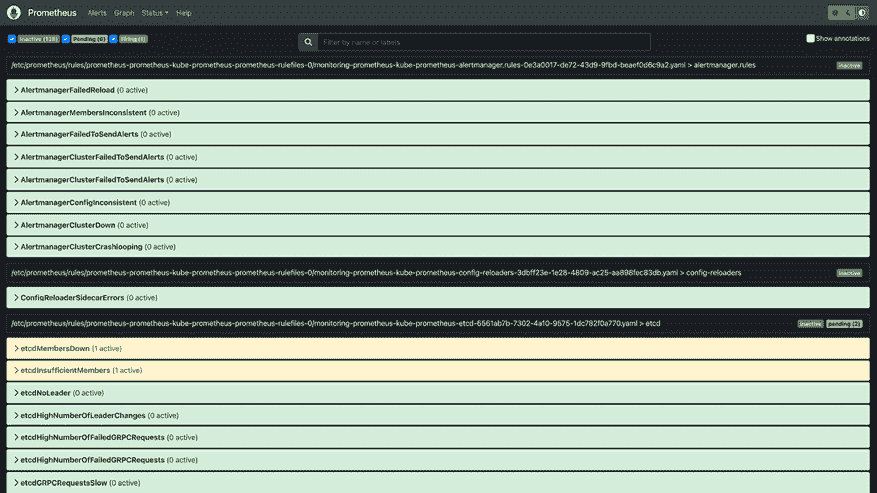

# 第十五章：集群与工作负载的监控

到目前为止，在本书中，我们花了相当多的时间来搭建企业 Kubernetes 基础设施的不同方面。搭建完成后，如何知道它是否健康？如何知道它是否在运行？你是否在用户之前就能发现问题，还是直到某人无法访问关键系统时才知道？监控是任何良好运作的基础设施中的一个关键环节，在 Kubernetes 和云原生环境中具有其独特的挑战。本章中，我们将重点关注监控的两个具体方面。首先，我们将使用 Prometheus 项目及其与 Kubernetes 的集成，了解如何检查我们的集群以及需要关注的内容。接下来，我们将使用流行的 ELK 堆栈集中管理日志。在此过程中，我们还将涉及有关安全性和合规性的典型企业讨论，以确保我们符合企业的要求。

本章将涵盖以下主要内容：

+   Kubernetes 中的指标管理

+   Kubernetes 中的日志管理

接下来，让我们回顾一下技术要求。

# 技术要求

本章的工作量将比前几章更大，因此需要一个更强大的集群。本章有以下技术要求：

+   一台运行 Docker 的 Ubuntu 22.04+ 服务器，至少 8 GB 内存，推荐 16 GB 内存

+   从 GitHub 仓库的 `chapter15` 文件夹中的脚本，你可以通过访问本书的 GitHub 仓库来获取：[`github.com/PacktPublishing/Kubernetes-An-Enterprise-Guide-Third-Edition`](https://github.com/PacktPublishing/Kubernetes-An-Enterprise-Guide-Third-Edition)

## 获取帮助

我们尽力测试所有内容，但有时我们的集成实验室中可能有六个以上的系统。由于技术的快速发展，有时在我们的环境中正常运行的东西，在你们的环境中可能无法运行。别担心，我们会提供帮助！在我们的 GitHub 仓库上提交一个问题，[`github.com/PacktPublishing/Kubernetes-An-Enterprise-Guide-Third-Edition/issues`](https://github.com/PacktPublishing/Kubernetes-An-Enterprise-Guide-Third-Edition/issues)，我们会很乐意帮助你！

# Kubernetes 中的指标管理

曾几何时，监控和指标是行业中一个复杂且非常专有的领域。虽然有一些开源项目进行监控，但大多数“企业”系统都庞大、笨重且专有。虽然存在一些标准，如 SNMP，但大多数情况下，每个供应商都有自己的代理、配置，甚至是…一切。如果你想编写一个生成指标或警报的应用程序，那么你需要使用他们的 SDK。这导致了监控成为集中式服务之一，像数据库一样，但需要对被监控内容有更深入的理解。变更困难，最终许多系统采取了**你只活一次**（**YOLO**）监控或非常基础的高层次监控，只是“勾选合规框”，但并没有提供太多价值。

随后出现了 Prometheus 项目，它对监控过程进行了两项关键改进，真正改变了我们对监控的处理方式。第一个变化是通过简单的 HTTP 请求来实现所有操作。如果你想监控某个东西，它需要暴露一个提供指标数据的 URL。无论是网站还是数据库都无关紧要。第二个重大影响是，这些指标端点提供了文本格式的数据，使得无论监控系统是什么，都可以轻松动态生成响应。我们稍后会深入探讨这些细节，但这种格式非常强大且灵活，除了 Prometheus 外，还被 SaaS 监控系统所采用。Datadog、AWS CloudWatch 等都支持 Prometheus 的端点和格式，这使得从 Prometheus 开始并转向其他提供的解决方案变得更加容易，而无需更改你的应用程序。

除了开启了监控不同系统的能力，Prometheus 还通过提供 API，使得操作员能够更轻松地与数据交互。现在，常见的可视化工具，如 Grafana，可以在没有供应商专有 UI 的情况下访问这些数据。这些工具基于 Prometheus 的基础功能，扩展了你的监控和警报能力。

现在我们已经解释了为什么 Prometheus 对监控世界产生了如此大的影响，接下来我们将逐步介绍 Kubernetes 集群如何提供指标数据以及如何利用它。

# 如何 Kubernetes 提供指标

Kubernetes 在 API 服务器上提供了一个 `/metrics` URI。此 API 需要授权令牌才能访问。要访问这个端点，我们需要创建一个 `ServiceAccount`、`ClusterRole` 和 `ClusterRoleBinding`：

```
$ kubectl create sa getmetrics
$ kubectl create clusterrole get-metrics --non-resource-url=/metrics --verb=get
$ kubectl create clusterrolebinding get-metrics --clusterrole=get-metrics --serviceaccount=default:getmetrics
$ export TOKEN=$(kubectl create token getmetrics -n default)
$ curl -v --insecure -H "Authorization: Bearer $TOKEN" https://0.0.0.0:6443/metrics
# HELP aggregator_discovery_aggregation_count_total [ALPHA] Counter of number of times discovery was aggregated
.
.
. 
```

这需要一些时间，因为收集的度量指标太多，无法在这里一一列举。我们将在稍后的部分讨论一些具体的度量指标，先了解一下 Prometheus 如何创建和消费这些度量指标。现在要理解的主要观点是，来自集群的所有度量指标都来自一个 URL，并且这些度量指标需要认证。你可以通过让 `/metrics` 端点对系统开放（未经认证的用户，即所有未认证的请求都被分配给该用户）来禁用此要求，但这会使集群暴露在潜在的提升攻击面前。最好将该资源保持保护。

如果你稍微查看一下这些数据，你会看到数据量是惊人的。我们将首先介绍如何部署 Prometheus，以便你可以更方便地与这些数据进行交互。幸运的是，在 Kubernetes 上部署完整的监控堆栈是相当简单的！

# 部署 Prometheus 堆栈

到目前为止，我们已经找到了如何访问 Kubernetes 度量指标端点；接下来，我们将使用 Prometheus 社区的 `kube-prometheus-stack` 项目 ([`github.com/prometheus-community/helm-charts/tree/main/charts/kube-prometheus-stack`](https://github.com/prometheus-community/helm-charts/tree/main/charts/kube-prometheus-stack)) 来部署 Prometheus。这个图表将 Prometheus 项目与 Grafana 和 Alertmanager 结合，创建了一个几乎完整的监控解决方案。我们将在本章稍后部分讨论一些缺口。首先，让我们部署 Prometheus：

```
$ cd chapter15/simple
$ ./deploy-prometheus-charts.sh 
```

这个脚本创建了监控命名空间，部署了 Helm 图表，并创建了一个 Ingress 对象，主机为 `prometheus.apps.X-X-X-X.nip.io`，其中 `X-X-X-X` 是你的 API 服务器的 IP 地址，但使用破折号代替了点。对于我来说，我的 API 服务器运行在 `192.168.2.82`，所以，要在浏览器中访问 Prometheus 的 UI，我访问 `https://prometheus.apps.192-168-2-82.nip.io/`。

现在 Prometheus 已经在运行并且我们可以访问它，接下来的步骤是介绍一些 Prometheus 的功能。

## Prometheus 介绍

访问 Prometheus 时你首先会注意到的是没有登录界面。Prometheus 没有安全性的概念。在当前设置下，任何能够访问你的 URL 的人都可以访问你的 Prometheus。我们将在本章稍后处理这个问题，看看如何将 Prometheus 正常化运营。

看到 Prometheus 没有安全性后，接下来要注意的是，主屏幕，称为 **Graph** 视图，给你提供了一个 **Expression** 框。在这里，你可以使用 Prometheus 的查询语言 PromQL 查找任何可用的表达式。例如，使用 `sum by (namespace) (kube_pod_info)` 查询可以列出每个命名空间中的所有 pod：


图 15.1：Prometheus 查询

这个屏幕有一个菜单栏，包括 **Alerts**（警报）和 **Status**（状态）菜单选项。如果你点击 **Alerts**，你会看到几个警报处于红色并触发。这是因为我们正在 KinD 环境中运行，它有一些独特的网络特性。根据 Kubernetes 发行版的不同，你会发现一些警报会定期触发，并且可以忽略。

虽然 Prometheus 已配置为生成警报，但它没有任何通知机制。相反，它依赖于外部系统。通常使用的开源工具是 Alertmanager，但我们将在本章后面讨论它。现在，重要的是要知道，警报在 Prometheus 中定义，你可以从 **Alerts**（警报）视图查看它们的状态。



图 15.2：警报视图

最后是 **Status**（状态）菜单，它提供了几个视图。我最常用的是 **Targets**（目标）视图，它可以告诉你是否有目标不可用。


图 15.3：目标视图

在深入了解度量的收集或查询细节之前，首先让 Prometheus 启动并运行是非常重要的。正如我们第一次查看 Kubernetes 的度量时所见，数据量非常庞大，且其格式不易通过命令行工具进行分析。通过图形界面，我们可以开始查看 Prometheus 如何收集和存储度量数据。

### Prometheus 如何收集度量？

到目前为止，我们已经轮询了 Kubernetes 的度量端点，并使 Prometheus 堆栈启动并运行，以查询和分析这些数据。之前，我们创建了一个简单的查询来查找按 `Namespace` 分类的 pod 数量：`sum by (namespace) (kube_pod_info)`。查看我们 API 服务器的度量数据输出时，我们可以 grep 搜索 `kube_pod_info`，但什么也找不到！这是因为这个特定的度量并不是直接来自 API 服务器，而是来自 `kube-state-metrics` 项目（[`github.com/kubernetes/kube-state-metrics`](https://github.com/kubernetes/kube-state-metrics)），该项目与 Prometheus 堆栈图表一起部署。这个工具生成有关 API 服务器的数据，以便集成到 Prometheus 中。如果我们查看它的 `/metrics` 输出，我们会发现：

```
# HELP kube_pod_deletion_timestamp Unix deletion timestamp
# TYPE kube_pod_deletion_timestamp gauge
# HELP kube_pod_info [STABLE] Information about pod.
# TYPE kube_pod_info gauge
kube_pod_info{namespace="calico-system",pod="calico-typha-699dc7b758-bgr5f",uid="33ec61b1-bb56-4a4c-853c-6a0ee56023c2",host_ip="172.18.0.2",pod_ip="172.18.0.2",node="cluster01-worker",created_by_kind="ReplicaSet",created_by_name="calico-typha-699dc7b758",priority_class="system-cluster-critical",host_network="true"} 1 
```

带有井号或井号标记 `#` 的行提供了即将出现的度量的元数据。每个度量的形式为：

```
metric_name{annotation1="value1",annotation2="value2"} value 
```

每个度量的注释使得 Prometheus 能够索引大量信息并便于查询。查看 `kube_pod_info` 度量时，我们看到一个 `namespace` 注释。这意味着我们可以请求 Prometheus 提供所有 `kube_pod_info` 度量的实例，并按 `namespace` 注释进行划分。我们也可以请求查看特定 `host_ip`、`node` 或任何其他注释下的 pod。

`kube_pod_info` 指标的类型是 Gauge。Prometheus 中有四种类型的指标：

+   **计数器**：计数器只能随着时间的推移增加，或者归零。计数器的一个例子是应用程序在其生命周期内响应的请求数量。请求数量只会增加，直到 Pod 终止，此时计数器会归零。

+   **仪表**：这些指标可以随时间波动。例如，一个 Pod 的开放会话数量就是一个仪表，因为它会随时间变化。

+   **直方图**：这种类型更复杂。它设计用来跟踪请求类型的范围或桶。例如，如果你想跟踪请求的响应时间，可以为可能的时间创建不同的桶，并增加每个桶的计数。这比为每个请求生成新的指标实例要高效得多。如果我们为每个请求都生成一个指标实例，那么每秒可能会有成千上万的数据点需要被索引和存储，而这些数据对我们来说并不有用。与其使用直方图，我们可以将范围进行分类并跟踪，这样可以节省处理和数据存储的开销。

+   **摘要**：摘要指标类似于直方图，但由客户端管理。一般来说，你会想使用直方图。

当 Prometheus 收集这些指标时，它们会存储在一个内部数据库中。你会看到，Prometheus 和 Alertmanager 的 Pod 都属于 `StatefulSets`，而不是 `Deployments`。这是因为它们会本地存储数据。对于 Prometheus，数据会存储起来，这样你不仅可以看到该指标的最新版本，还能查看过去的指标实例。在 Prometheus 的主 **图表** 页面，你可以点击任何结果旁边的 **图表**，查看该结果的时间变化。我们的集群很小，运行的负载也不多，但如果我们突然增加大量新的 `pods` 呢？这可能会触发警报。另一个保持指标历史记录重要的领域是告警。当我们定义告警规则时，会看到我们可以指定只在某个时间段内触发或清除告警。事情总是会发生的；你不希望因每一个丢包就收到警报。追踪这些信息对于数据的价值和准确的告警至关重要。

在这一节中，我们介绍了 Prometheus 如何收集和存储指标。接下来，我们将深入探讨一些你需要关注的 Kubernetes 常见指标。

### 常见的 Kubernetes 指标

到目前为止，我们讨论了如何使用 Kubernetes 部署 Prometheus 以及 Prometheus 如何拉取指标，但哪些指标才是重要的呢？说 Kubernetes 中有大量的指标可供选择，这绝对是轻描淡写。API 服务器就有 212 个独立的指标，kube-state-metrics 项目有 194 个指标，还有来自 kubelet 和 etcd 的指标。与其专注于具体的指标（这会根据你的项目而有所不同），我更建议你关注我们部署的图表中自带的 Grafana。

要访问 Grafana，请前往`https://grafana.apps.X-X-X-X.nip.io/`，其中`X-X-X-X`是你服务器的 IP 地址，只不过用短横线代替了点。例如，如果我的集群位于`192.168.2.82`，那么我访问的是`https://grafana.apps.192-168-2-82.nip.io/`。用户名是`admin`，密码是`prom-operator`。你可以浏览任何可用的仪表板，并点击编辑它们，查看它们是如何获取数据的。例如，在*图 15.4*中，我进入了集群中的计算资源，显示按命名空间划分的 CPU 使用情况。

这些仪表板都是我们部署的 Helm 图表的一部分。我们将在本章后面讨论如何创建你自己的仪表板。

在这里，我可以点击菜单并选择**编辑**选项：


图 15.4：Grafana 计算资源展示集群

打开图形编辑器后，你现在可以查看用于生成数据的 PromQL 表达式：


图 15.5：Grafana 中的编辑屏幕

如果你将这个表达式复制到 Prometheus 的**图形**界面中，就能看到用于生成图表的原始数据：


图 15.6：带有 Grafana 查询的 Prometheus

如果你仔细查看查询，会发现 Prometheus 版本没有引用集群。这是因为 Grafana 仪表板是基于管理多个集群的思路构建的，而 Prometheus 只配置为检查单个集群。数据没有被标注`cluster`属性，因此 Prometheus 无法基于此进行查询。我们将在后面的 Grafana 部分深入讨论这个问题。

现在我们知道了在哪里可以找到集群的重要指标示例以及如何测试它们，我们应该花一些时间来学习 Grafana 的查询语言——PromQL。

### 使用 PromQL 查询 Prometheus

到目前为止，本章的大部分内容集中在部署 Prometheus 和收集数据上。我们已经开始探讨如何查询数据，但尚未深入讨论 Prometheus 查询语言（PromQL）的细节。如果你熟悉其他查询语言，这应该不会看起来太陌生。

从高层次来看，查询语言与数据很相似。你从一个度量指标开始，选择你想应用的注解。例如，查看按命名空间的计算查询，首先，让我们看看当我们从`node_namespace_pod_container:container_cpu_usage_seconds_total:sum_irate`开始时会发生什么：


图 15.7：CPU 度量

由于我们在查询中没有包含任何注解，所以我们得到了集群中每个 Pod 的 CPU 使用情况。如果我们想查看特定命名空间的 CPU 使用情况，我们可以像在度量数据中指定的那样，添加`{annotation="value"}`到我们的度量中。要查看`monitoring`命名空间中所有容器的 CPU 使用情况，只需在查询中添加`{namespace="monitoring"}`：


图 15.8：监控命名空间中的 CPU 使用情况

一旦你限定了想要的数据，你可能希望对数据进行聚合。目前的细节显示的是`monitoring`命名空间中所有运行中的容器，但这并不能让你清楚地了解总共使用了多少 CPU。你可以添加一些聚合函数，比如`sum`函数：


图 15.9：监控命名空间中所有 CPU 使用情况的总和

最后，你可能希望根据特定的注解来进行`sum`，比如 Pod，因为大多数 Pod 中有多个容器。你可以使用`by`关键字进行分组：


图 15.10：监控命名空间中 Pod 的 CPU 使用情况

除了函数之外，你还可以执行数学运算。假设你想知道集群中总共使用了多少 CPU 百分比。你需要知道在任何时刻的 CPU 利用率，以及可用的总 CPU 数量。我们已经知道如何获取集群中所有容器使用的总 CPU。接下来，我们需要知道整个集群中可用的总 CPU。然后，我们需要做一些数学运算来得到百分比。在使用 PromQL 进行数学运算时，你会使用大多数其他编程和查询语言中的典型中缀表示法。例如，查询`(sum(node_namespace_pod_container:container_cpu_usage_seconds_total:sum_irate) / max(count without(cpu,mode,pod) (node_cpu_seconds_total{mode="idle"}))) * 100`将多个度量和计算结合起来，以获取整个集群的 CPU 利用率：


图 15.11：整个集群的 CPU 使用百分比

现在，我们已经知道了集群中使用的 CPU 的数量。我们可以通过创建一个警报，将此信息纳入我们的容量规划中，当集群达到某个容量水平时，这个警报就会告诉我们。这引出了我们下一节的内容，专注于这个问题。

## 使用 Alertmanager 进行警报

到目前为止，我们已经部署了 Prometheus，并将其与我们的 Kubernetes 集群集成，学会了如何查询数据库以获取关于集群的有用信息。我们已经看到 Prometheus 在 UI 的 **警报** 屏幕上跟踪警报，但集群操作员如何知道有问题呢？

Alertmanager 项目（[`prometheus.io/docs/alerting/latest/alertmanager/`](https://prometheus.io/docs/alerting/latest/alertmanager/)）是一个通用工具，它知道如何查询警报并将其发送给正确的人。它不仅仅是一个通知通道；它还帮助去重和分组。最后，它提供了一个界面，用于对不需要继续触发的警报进行静音处理。

我们之前部署的 Helm 图表中包括了一个 Alertmanager 实例以及一个用于它的 `Ingress`。与其他项目一样，你可以通过 `https://alertmanager.apps.X-X-X-X.nip.io/` 访问它，其中的 `X-X-X-X` 需要替换为你集群的 IP 地址。由于我的集群在 `192.168.2.82` 上，所以我的 URL 是 `https://alertmanager.apps.192-168-2-82.nip.io/`。


图 15.12：Alertmanager 用户界面

与 Prometheus 类似，你会注意到这里没有身份验证，因为就像 Prometheus 一样，这里没有安全模型。关于这一点，章节后面会有更多信息。你会看到的是，已经有警报！这是因为在 KinD 上运行 Kubernetes 会导致一些意料之外的网络问题。如果你在云托管的 Kubernetes 上运行 Prometheus 堆栈，你会发现类似的结果。

你会注意到有多个警报组。Alertmanager 提供了警报标签功能，以便你更好地组织它们。例如，你可能只想发送关键问题的警报，或者根据警报来源来路由警报。

你也可以从这个用户界面静音一个警报。这在你处理问题时，或者你知道问题存在且是另一个团队需要处理的问题时非常有用，这样你就不需要在他们解决问题时持续接收警报。由于缺乏安全性，许多团队无法直接访问此用户界面，但我们将在本章后面讲解如何解决这个问题。

虽然用户界面让你能够查看警报并将其静音，但它不能让你配置警报或配置警报的发送目标。那部分是在自定义资源对象中完成的，我们将在下一节中讲解。

### 你怎么知道某些东西坏了？

到目前为止，我们已经了解了如何访问 Alertmanager UI，并且看到警报是在 Prometheus 中配置的，但我们还没有配置警报。配置警报的过程有两个步骤：

1.  创建一个`PrometheusRule`实例，用来定义在什么条件下应该生成警报。这涉及到创建一个 PromQL 表达式来定义数据，定义希望条件满足的时间长度，最后，如何标记警报。

1.  创建一个`AlertmanagerConfig`对象，用于将警报分组并路由到接收器。

我们已经拥有了大量的`PrometheusRule`对象，这得益于我们部署的图表中包含的丰富预配置规则。接下来的问题是如何构建`AlertmanagerConfig`。这一部分的难点在于，我们需要某个东西来接收警报。我们有很多选择，包括电子邮件、Slack 以及各种通知 SaaS 服务。为了简化操作，让我们部署一个 NGINX 服务器，作为一个 webhook，它可以让我们查看 JSON 负载。我们的提醒设备不会响起，但至少它能让我们大致了解我们看到的内容。在源代码库内部：

```
$ kubectl apply -f chapter15/alertmanager-webhook/alertmanager-webhook.yaml 
```

这将启动一个 NGINX Pod，在`alert-manager-webhook`命名空间中运行。现在，让我们配置一个`AlertmanagerConfig`，将所有关键警报发送到我们的 webhook：

```
apiVersion: monitoring.coreos.com/v1alpha1
kind: AlertmanagerConfig
metadata:
  name: critical-alerts
  namespace: kube-system
  labels:
    alertmanagerConfig: critical
spec:
  receivers:
    - name: nginx-webhook
      webhookConfigs:
        - sendResolved: true
          url: http://nginx-alerts.alert-manager-webhook.svc/webhook
  route:
    repeatInterval: 30s
    receiver: 'nginx-webhook'
    matchers:
    - name: severity
      matchType: "="
      value: critical
    groupBy: ['namespace']
    groupWait: 30s
    groupInterval: 5m 
```

`receivers`部分告诉 Alertmanager 将所有事件发送到我们的 Web 服务器。`route.matchers`部分则告诉 Alertmanager 要发送哪些警报。在我们的示例中，我们将发送任何来自`kube-system`命名空间、`severity`为`critical`的警报。当处理`AlertmanagerConfig`对象时，对象创建所在的命名空间会自动添加到你的 matchers 中。你可以从`chapter15/alertmanager-webhook/critical-alerts.yaml`创建这个对象。创建后，稍等几分钟。最终会有一个来自 Prometheus 的警报被触发，并会产生如下日志条目：

```
0.240.189.139 - - [12/Jan/2024:22:15:22 +0000] "POST /webhook HTTP/1.1" body:"{\x22receiver\x22:\x22kube-system/critical-alerts/nginx-we… " 200 2 "-" "Alertmanager/0.26.0" "-" 
```

日志消息中的 JSON 内容过大，无法在此提供，但它包含了 Alertmanager 可以访问的所有信息。在大多数情况下，你不需要自己编写接收器。已经有很多现成的接收器，几乎不需要自己去构建。

现在我们知道了如何配置 Alertmanager 发送警报，接下来我们将介绍如何设计基于指标的警报。

### 根据指标向你的团队发送警报

在前面的章节中，我们介绍了如何使用 Alertmanager 将警报发送到接收器。接下来，我们将讲解如何生成一个警报。警报并不是在 Alertmanager 中配置的，而是在 Prometheus 中配置的。Alertmanager 的唯一任务是将生成的警报转发到接收器。是否触发警报的判断由 Prometheus 来决定。

`PrometheusRule` 对象用于配置 Prometheus 触发警报。此对象定义了规则的元数据、规则触发的条件，以及触发规则的频率，以便将警报发送到 Alertmanager。我们部署的 `kube-prometheus` 项目包含约四十个预构建的规则。这些规则会根据经验不断更新，你不应该自行更新它们。不过，你可以为自己的基础设施构建自定义规则。

为了演示这个过程，让我们将 OpenUnison 部署到我们的集群中：

```
$ cd chapter15/user-auth
$ ./deploy_openunison_imp_impersonation.sh 
```

我们将在稍后的 *监控应用* 部分详细介绍这个脚本的作用。现在，你只需要知道这个脚本部署了 OpenUnison，并将其与我们的 kube-prometheus 图表集成，既为我们的应用程序添加了登录功能，又提供了监控内容。

既然我们使用 OpenUnison 为我们的集群提供身份验证服务，如果它出现故障，你肯定希望在用户打电话之前就知道。我们之前作为部署脚本的一部分，部署了以下的 `PrometheusRule`：

```
---
apiVersion: monitoring.coreos.com/v1
kind: PrometheusRule
metadata:
  creationTimestamp: null
  labels:
    release: prometheus
  name: openunison-has-activesessions
spec:
  groups:
  - name: openunison.rules
    rules:
    - alert: no-sessions
      annotations:
        description: Fires when there are no OpenUnison sessions
      expr: absent(active_sessions)
      for: 1m
      labels:
        severity: openunison-critical
        source: openunison 
```

在我们的 `PrometheusRule` 中，我们创建了一个包含单个 `rule` 的 `group`。该规则创建了一个名为 `no-sessions` 的 `alert`，检查是否缺少 `active_sessions` 指标。这个指标由 OpenUnison 提供，用于跟踪当前打开的会话数。如果我们仅仅使用像 `active_sessions < 1` 这样的条件，那么该规则不会触发，因为没有 `active_sessions` 指标。指定 `expr` 的语言与我们在 Prometheus 中查询数据时使用的 PromQL 语言相同。这意味着你可以在创建 `PrometheusRule` 对象之前，在 Prometheus Web 应用中测试你的表达式。

让我们通过删除 OpenUnison 中的 `metrics` `Application` 对象来触发这个规则：

```
$ kubectl delete application metrics -n openunison 
```

大约三十秒后，如果我们登录到 Prometheus 并点击 **Alerts** 链接，我们会看到：


图 15.13：Prometheus 中的待处理警报

截图显示有一个待处理的警报。这是因为在我们的规则中，我们指定了规则条件必须满足至少一分钟。这是一个重要的调整选项，有助于防止误报。根据你监控的内容，你可能会发现有些警报会在短时间内自动被清除。大约过了三十秒后，你会看到警报从待处理状态变为触发状态：


图 15.14：Prometheus 警报触发

现在我们的规则正在触发，我们可以在 Alertmanager 应用中查看到一个警报正在触发：


图 15.15：Alertmanager 中的警报触发

我们目前没有任何方式来收集警报，但如果有的话，我们现在应该会收到 OpenUnison 出现故障的警报！让我们通过重新添加监控应用来解决这个问题：

```
$ helm upgrade orchestra-login-portal tremolo/orchestra-login-portal -n openunison -f /tmp/openunison-values.yaml 
```

一旦该命令完成，相同的过程将反向进行。第一次当 OpenUnison 响应`active_sessions`指标时，警报将进入待处理状态。如果一分钟后没有问题，警报将被清除。

你可能会问，为什么我们直接删除了度量应用程序，而不是停止 OpenUnison。部署脚本为我们的基础设施增加了安全性，这使得没有 OpenUnison 的情况下更难访问 Prometheus 和 Alertmanager 应用程序。虽然你可以使用端口转发来访问 Prometheus 和 Alertmanager，但根据集群的部署方式，这可能会比较复杂，所以我们选择了一个更简单的方法。

现在我们知道如何生成警报，如果我们想忽略它会发生什么呢？我们将在下一节中讲解。

### 静默警报

现在我们知道如何生成警报，如何静默它呢？你可能有很多理由想要静默警报：

+   **已知故障**：你已经被告知正在进行的工作将导致故障，因此没有必要对警报作出反应。

+   **超出你控制范围的故障**：你的故障是由你无法控制的系统引起的。例如，如果你的 Active Directory 出现问题，而你无法控制，且由于此问题 OpenUnison 无法进行身份验证，你就不应该收到警报。

+   **持续故障**：你知道存在问题；警报无需继续触发。

你可以根据警报提供的标签启用静默。当你看到想要静默的警报时，可以点击 Alertmanager 应用程序中的**静默**按钮：


图 15.16：在 Alertmanager 中从警报创建静默

现在你可以自定义警报，指定谁创建了它，以及它应持续多长时间。这个静默不会作为对象保存在 API 服务器中，所以你无法通过 Kubernetes API 扫描它（虽然这将是一个很棒的功能）。

安全意识强的读者可能会想，攻击者能否创建一个静默来掩盖他们的痕迹？当然可以！比如，你可以在运行比特币挖矿程序时静默 CPU 警告。关于 Prometheus 的安全性，我们将在本章最后讨论将 SSO 添加到监控堆栈时详细介绍。

我们已经完成了监控堆栈的大部分操作部分。下一步是可视化所有收集的数据。接下来，我们将通过 Grafana 来讲解这一部分。

## 使用 Grafana 可视化数据

到目前为止，我们已经以操作的方式处理了 Prometheus 收集的数据。我们专注于如何根据数据的变化采取行动，这些变化会影响到我们的集群和用户。虽然能够对这些数据做出反应是很好的，但数据量太大，单靠自己无法处理。此时，Grafana 就派上用场了；它为我们提供了基于 Prometheus（以及其他来源）数据构建仪表盘的方法。我们在本章前面已经看过一些开箱即用的图表。接下来，我们将创建自己的图表，并将这些图表集成到我们部署的 kube-prometheus 堆栈中。

### 创建你自己的图表

图表是数据集和一组可视化规则的组合。图表本身由 JSON 定义。这意味着它可以作为 Kubernetes 对象持久化，并作为我们堆栈的一部分加载，而不是存储在持久化数据库中。该方法的缺点是，你需要先生成那个 JSON。幸运的是，Grafana 的 Web UI 使这一过程变得容易：

1.  登录到 Grafana。

1.  创建一个新仪表盘：我们为 OpenUnison 的 `active_sessions` 度量指标创建了一个简单的仪表盘。

1.  创建仪表盘后，将其导出为 JSON 格式。

1.  创建一个 `ConfigMap`，并使用 `label` `grafana_dashboard="1"`。

1.  以下是 `chapter15/user-auth/grafana-custom-dashboard.yaml` 的重要部分：

    ```
    apiVersion: v1
    kind: ConfigMap
    metadata:
      labels:
        grafana_dashboard: "1"
      name: openunison-activesessions-dashboard-configmap
      namespace: monitoring
    data:
      openunison-activesessions-dashboard.json: |-
        {
          "annotations": {
    . 
    ```

一旦 `ConfigMap` 创建完成，Grafana 会几乎立即识别到它！

创建了仪表盘后，你可能注意到 Grafana 还有其他功能，比如告警。Grafana 可以用于这一过程，但这超出了 kube-prometheus 项目和本书的范围。

现在你已经熟悉了 kube-prometheus 堆栈的各个组件，下一步是看看你如何使用它来监控运行在集群中的应用程序和系统。

## 监控应用程序

在本章的前几节中，我们专注于使用 kube-prometheus 堆栈进行监控和告警的操作方面。我们将 OpenUnison 集成到集群中，创建了监控和告警，但并没有详细讲解它是如何工作的。我们将以 OpenUnison 为模型，讲解如何将其他系统集成到你的监控堆栈中。

### 为什么你应该在应用程序中添加度量指标

在继续讲解如何将度量指标和监控添加到 OpenUnison 之前，我们需要先回答一个问题：为什么要这样做？你的集群不仅仅由 Kubernetes 实现组成。如今大多数集群都有自动化框架、身份验证系统、外部集成、GitOps 框架等。如果这些组件中的任何一个发生故障，对于你的用户来说，你的集群就不可用。从客户管理的角度来看，你希望在他们开始打开告警之前就知道问题所在。

除了你的系统，你还可能依赖外部系统。当这些系统发生故障，并且它们影响到你和你的客户时，你的客户会首先找到你。

这在身份验证领域是非常真实的，如果登录过程没有“完成”，通常会认为是身份验证过程出了问题。我有很多例子可以证明这一现实，但我将重点介绍几个例子，其中下游监控帮助我识别了根本原因，并提前处理了客户的工单。首先，我的许多客户使用 OpenUnison 通过 LDAP 集成 Active Directory。尽管 Active Directory 是一个非常稳定的系统，但网络访问易受问题影响。一个错误的防火墙规则就可能切断访问，添加对 OpenUnison 下游 Active Directory 的监控提供了快速证据，证明登录过程的中断并非 OpenUnison 的问题。

Prometheus 的度量标准格式已经成为云原生世界的事实标准。即使是没有基于 Prometheus 构建的系统，也内建了对它的支持，比如像 Datadog 和 Amazon CloudWatch 这样的商业系统。这意味着大多数你部署的监控系统都支持 Prometheus 度量端点，即使你内部没有使用 Prometheus。对于那些不是基于 Web 的系统，通常也有通过 Prometheus 进行监控的“附加”解决方案，比如数据库。

在讨论了为什么你应该监控你的集群系统，而不仅仅是 Kubernetes 后，让我们一步一步看看我们如何监控 OpenUnison。

### 向 OpenUnison 添加度量标准

在本章之前，我们重新部署了包含 OpenUnison 实例的监控栈。现在，是时候走一遍这种集成的过程了。如果你还没有这样做，重新部署你的监控栈和 OpenUnison：

```
$ cd chapter15/user-auth
$ ./deploy_openunison_imp_impersonation.sh 
```

Prometheus 的操作员会查找各种对象来进行监控；我们将重点关注 `ServiceMonitor`。如果你查看 `monitoring` 命名空间，你会注意到大约有十几个预定义的 `ServiceMonitor` 对象。`ServiceMonitor` 的目的是告诉 Prometheus 根据 `Service` 对象查找要监控的 Pod。这作为云原生模式是很有意义的，你不希望将你的度量端点硬编码进去。Pod 会重新调度、扩展等等。依赖于 `Service` 对象可以帮助 Prometheus 以云原生的方式进行扩展。对于 OpenUnison，以下是我们的 `ServiceMonitor` 对象：

```
---
apiVersion: monitoring.coreos.com/v1
kind: ServiceMonitor
metadata:
  labels:
    release: prometheus
  name: orchestra
  namespace: monitoring
spec:
  endpoints:
  - bearerTokenFile: /var/run/secrets/kubernetes.io/serviceaccount/token
    interval: 30s
    port: openunison-secure-orchestra
    scheme: https
    targetPort: 8443
    tlsConfig:
      insecureSkipVerify: true
  namespaceSelector:
    matchNames:
    - openunison
  selector:
    matchLabels:
      app: openunison-orchestra 
```

首先需要指出的是，那里有一个名为 `release="prometheus"` 的 `label`。这个 `label` 是 kube-prometheus 用来识别我们的监控的必要条件。Prometheus 不是一个多租户系统，所以可以合理地期望会有多个实例用于不同的用例。要求这个标签确保 `ServiceMonitor` 对象被正确的 Prometheus 操作员部署所识别。

接下来，我们将指出该端点与 `openunison-orchestra` 服务在 `openunison` 命名空间中的匹配情况。我们没有直接命名它，但通过标签将其识别出来。确保不要因标签过于宽泛而导致集成多个 `Service` 对象是非常重要的。最后，我们包括了 `bearerTokenFile` 选项，以告诉 Prometheus 在访问 OpenUnison 的指标端点时使用它自己的身份。我们将在下一节中更详细地介绍这一点。

如果我们仅部署了这个对象，Prometheus 操作员会抱怨它无法加载正确的`Service`对象，因为它没有 RBAC 权限。接下来的步骤是为操作员创建一个 RBAC `Role` 和 `RoleBinding`，使其能够查找`Services`：

```
apiVersion: rbac.authorization.k8s.io/v1
kind: Role
metadata:
  name: monitoring-list-services
  namespace: openunison
rules:
- apiGroups:
  - ""
  resources:
  - endpoints
  - pods
  - services
  verbs:
  - get
  - list
  - watch
---
apiVersion: rbac.authorization.k8s.io/v1
kind: RoleBinding
metadata:
  name: monitoring-list-services
  namespace: openunison
roleRef:
  apiGroup: rbac.authorization.k8s.io
  kind: Role
  name: monitoring-list-services
subjects:
- kind: ServiceAccount
  name: prometheus-kube-prometheus-prometheus
  namespace: openunison 
```

如果你已经阅读了我们关于 Kubernetes RBAC 的章节，那么这应该显得很直接。我们包括了服务、端点和 pod，因为一旦你检索到一个 `Service`，你就可以使用 `Endpoint` 对象找到具有正确 IP 的 pod。每个 `/metrics` 端点接着是基于 `Pod` 的 IP 地址而不是 `Service` 主机进行访问的。这意味着如果你的系统使用主机名进行路由，你需要接受所有主机名上的 `/metrics`。

一旦你配置了 Prometheus，几分钟后你就会开始看到你的指标。如果它们没有显示出来，有三个地方需要检查：

+   **Prometheus 操作员**：操作员将显示加载`Service`/`Endpoint`/`Pod`时是否有任何问题。

+   **Prometheus Pod，配置重载容器**：Prometheus pod 包含一个侧车容器，用于重新加载配置。接下来请检查此处，看看加载配置时是否出现问题。

+   **Prometheus Pod，Prometheus 容器**：最后，检查 Prometheus pod 中的 Prometheus 容器，看看是否有 Prometheus 加载指标时出现问题。

在了解如何在 Prometheus 中设置监控后，接下来的问题是为什么以及如何保护你的指标端点。

### 保护指标端点的访问

在本章中，我们只稍微提到了安全性。这是因为大多数情况下，Prometheus 遵循 **SNMP** 方法：**安全性不是我的问题**。这样做有一些合理的原因。如果你正在使用 Prometheus 栈来调试停机问题，你不希望安全性中断这个过程。同时，将所有可以从指标中提取的、可能被攻击者获取的数据公开是危险的。在 2019 年 KubeCon 北美大会的主题演讲中，Ian Coldwater 说过：“攻击者思维是基于图表的”（Ian 引用了 John Lambert：[`github.com/JohnLaTwC/Shared/blob/master/Defenders%20think%20in%20lists.%20Attackers%20think%20in%20graphs.%20As%20long%20as%20this%20is%20true%2C%20attackers%20win.md`](https://github.com/JohnLaTwC/Shared/blob/master/Defenders%20think%20in%20lists.%20Attackers%20think%20in%20graphs.%20As%20long%20as%20this%20is%20true%2C%20attackers%20win.md))，这让我想到了，因为你可以根据指标端点绘制出一个环境的图谱！想一想关于工作负载和分布的所有数据，节点何时何地工作最辛苦，等等。以我们在本章早些时候讨论的 `active_sessions` 指标为例。只需将该数字随时间映射出来，就可以告诉你什么时候使用量的激增可能不会触发警报，因为它仍在正常范围内。

好消息是，因为 Prometheus 在集群中运行，它拥有自己的身份。这就是为什么我们的 `ServiceMonitor` 向 `Pod` 内建的 Kubernetes 身份添加了 `bearerTokenFile` 选项。OpenUnison 使用 `SubjectAccessReview` 将此身份与 API 服务器进行验证。这就是为什么，当你查看 OpenUnison 的日志时，你会看到类似下面的内容：

```
[2024-01-16 03:18:22,254][XNIO-1 task-4] INFO  AccessLog - [AuSuccess] - metrics - https://10.240.189.139:8443/metrics - username=system:serviceaccount:monitoring:prometheus-kube-prometheus-prometheus,ou=oauth2,o=Tremolo - 20 / oauth2k8s [10.240.189.165] - [f763bbd1a1c474929d91bfe89a2fd8e5f5b49a1d5]
[2024-01-16 03:18:22,254][XNIO-1 task-4] INFO  AccessLog - [AzSuccess] - metrics - https://10.240.189.139:8443/metrics - username=system:serviceaccount:monitoring:prometheus-kube-prometheus-prometheus,ou=oauth2,o=Tremolo - NONE [10.240.189.165] - [f763bbd1a1c474929d91bfe89a2fd8e5f5b49a1d5] 
```

每当 Prometheus 尝试从 OpenUnison 抓取指标时，我们知道它是使用一个绑定到运行中的 Pod 且仍然有效的令牌。当评估提供指标的系统时，请检查它们是否支持某种令牌验证。使用 `NetworkPolicies` 限制访问也不是一个坏主意，但正如我们之前多次讨论的那样，你会根据 `Pod` 的身份获得最佳保护。

在回顾如何保护应用程序指标之后，关于 Prometheus 的最后一节将专注于为 kube-prometheus 堆栈添加安全性。

## 保护你的监控栈访问

kube-prometheus 堆栈是一个由 Prometheus、Alertmanager 和 Grafana 组成的组合，结合了运维工具来自动化堆栈的部署和管理。当我们逐一讨论堆栈中的每个应用程序时，我们指出 Prometheus 和 Alertmanager 都无法识别用户的身份。Grafana 拥有自己的用户模型，但 kube-prometheus 带有硬编码凭证。假定你会通过 `kubectl port-forward` 指令访问这些工具。这与我们在本书早些时候保护的 Kubernetes 仪表盘情景相似。虽然这些应用程序都没有使用用户的身份与 API 服务器通信，但它们可能被滥用以提供有关环境的广泛知识，因此应该跟踪使用情况。

对于 Prometheus 和 Alertmanager，最简单的方法是在它们前面放置一个身份验证的反向代理，例如一个**OAuth2**代理。对于本章，我们使用了 OpenUnison，因为它是内建功能，部署时所需的东西较少。

Grafana 更复杂，因为它确实有多个身份验证选项。它还拥有基于团队和角色的用户授权模型。与 kube-prometheus 图表一起发布的 Grafana 是社区版，只支持两种角色：**管理员**和**查看者**。虽然 Grafana 开箱即用支持 OpenID Connect，但这会涉及更复杂的 helm 配置。由于我们已经在使用 OpenUnison 的反向代理来对 Prometheus 和 Alertmanager 进行身份验证，因此我们也使用相同的方法来处理 Grafana。用户的身份通过 OpenUnison 向 Grafana 发出的请求中的 HTTP 头注入，所有用户都被视为管理员。然后，在 helm 图表中使用代理身份验证方法配置 Grafana。所以，原本指向我们应用程序的 `Ingress` 对象，现在只有一个指向 OpenUnison 的 Ingress，它负责对这些应用程序进行身份验证和授权访问：


图 15.17：为 kube-prometheus 添加 SSO

将 kube-prometheus 堆栈集成到 OpenUnison 中的一个好处是，你不需要记住 URLs，因为它们已经作为徽章与仪表盘和令牌一起包含在内：


图 15.18：带有 kube-prometheus “徽章”的 OpenUnison

如果 OpenUnison 出现故障会发生什么？始终拥有一个“紧急情况时打破玻璃”的计划非常重要！你仍然可以通过端口转发访问所有三个应用程序。

本节内容到此结束，介绍了如何使用 Prometheus 监控 Kubernetes。接下来，我们将探讨 Kubernetes 中日志的工作原理及其管理方法。

# Kubernetes 中的日志管理

在本书中，进行完一个练习后，我们通常会要求你通过运行类似下面的命令来查看容器的日志：

```
kubectl logs mypod -n myns 
```

这让我们能够查看日志，但获取日志的过程是怎样的呢？日志存储在哪里，如何管理？如何管理日志的归档？事实证明，这是一个复杂的话题，在刚开始使用 Kubernetes 时，往往会被忽视。本章的其余部分将致力于回答这些问题。首先，让我们讨论 Kubernetes 如何存储日志，然后我们将介绍如何将这些日志拉入集中式系统。

## 理解容器日志

在运行容器之前，日志记录相对简单。你的应用程序通常有一个库，负责将数据发送到日志中。该库会轮换日志，并且通常会清理旧的日志。多个日志文件用于不同的目的也并不罕见。例如，大多数 web 服务器至少有两个日志文件，一个是访问日志，用于记录谁向 web 服务器发出了请求；另一个是错误日志，用于跟踪任何错误或调试信息。在 2000 年代初期，像 Splunk 这样的公司推出了系统，将你的日志导入时间序列数据库，以便你可以在多个系统中实时查询它们，使得日志管理变得更加轻松。

然后是 Docker 容器的出现，打破了这种模式。容器是自包含的，不用于生成数据。容器鼓励将所有日志数据管道化到标准输出，而不是将日志数据写入某个存储卷，这样可以通过 Docker API 来观看日志，而不需要直接访问存储日志的卷。这个标准在 Kubernetes 中得到了延续，所以作为操作员，我不需要访问日志存储的文件，只需要访问 Kubernetes API。虽然这种方式大大简化了直接访问日志的过程，但也使得日志的管理变得更加复杂。首先，应用程序不再按功能划分日志，因此作为操作员，我需要筛选出我需要的日志部分。此外，日志不再按照应用程序拥有者可以配置的标准进行轮换。最后，如何以满足合规要求的方式归档日志？答案是将日志管道化到一个中央日志管理系统。接下来，我们将介绍 OpenSearch 项目，这是我们选择的日志管理系统，用来说明容器日志管理是如何工作的。

## 介绍 OpenSearch

有多个日志管理系统。Splunk 通常是最为人知的，但围绕日志管理构建了一个完整的行业。也有多个开源的日志管理系统。最著名的可能是 “ELK” 堆栈，它是由以下组件组成：

+   **Elasticsearch**：一个用于存储和排序日志的时间序列数据库和索引系统

+   **Logstash**：一个将日志导入 Elasticsearch 的项目

+   **Kibana**：一个 Elasticsearch 的仪表盘和 UI

ELK 堆栈并不是唯一的开源日志管理系统。另一个名为 Graylog 的项目也非常受欢迎。不幸的是，这两个项目都将它们对 OpenID Connect 的 SSO 支持隐藏在商业版本中。2021 年，亚马逊将 Elasticsearch 7.0 的 ELK 堆栈分叉到 OpenSearch 项目中。此后，两个项目已经分道扬镳。我们决定在本章中聚焦于 OpenSearch，因为它是完全开源的，我们可以展示它如何通过 OpenID Connect 集成到集群的企业需求中。


图 15.19：OpenSearch 架构

在上述图中，我们可以看到 OpenSearch 部署的主要组件：

+   **Masters**：这是 OpenSearch 的引擎，负责索引日志数据。

+   **Node**：节点是与 OpenSearch 交互的服务的集成点。它托管用于查询索引和将日志推送到集群的 API。

+   **Kibana**：OpenSearch 附带了一个 Kibana 仪表板，用于通过 Web 应用程序与 OpenSearch API 交互。

+   **Logstash/Fluent Bit/Fluentd**：一个`DaemonSet`，用于尾随集群中的日志并将其发送到 OpenSearch。

我们不会深入探讨 OpenSearch 是如何工作的，因为它是一个复杂的系统，值得专门撰写一本书（实际上已经有几本）。我们将深入到足够的程度，了解它如何与我们的企业 Kubernetes 需求相关，如何通过我们的集中式 Active Directory 聚合日志，并通过目录组来管理访问。现在我们已经对 OpenSearch 集群的不同组件有了概述，接下来我们将进行部署。

## 部署 OpenSearch

我们已经通过脚本自动化了 OpenSearch 的部署。OpenSearch 依赖 Prometheus 操作符的 CRDs，因此我们也需要部署它。我们将从一个全新的集群开始：

```
$ cd chapter2
$ kind delete cluster -n cluster01
$ ./create-cluster.sh
.
.
.
$ cd ../chapter15/simple
$ ./deploy-prometheus-charts.sh
.
.
.
$ cd ../user-auth/
$ ./deploy_openunison_imp_impersonation.sh 
```

这些脚本：

1.  部署一个新的 KinD 集群，并使用 NGINX Ingress 控制器。

1.  部署 kube-prometheus 项目，用于 Prometheus、Alertmanager 和 Grafana。

1.  部署“Active Directory”和 OpenUnison，并将 SSO 集成到 Prometheus 堆栈应用中。

这是你如果按照本章内容操作时应该到达的地方。接下来，我们将部署 OpenSearch：

```
$ cd ../opensearch/
$ ./deploy_opensearch.sh 
```

这个脚本执行了几个操作：

1.  增加文件限制，以支持 OpenSearch 和 FluentBit 同时打开每个日志并进行尾随处理

1.  通过 Helm 部署 OpenSearch 操作符

1.  创建 OpenUnison 配置对象，以集成 OpenSearch

1.  部署一个 OpenSearch 集群，配置为通过 OpenUnison 使用 OpenID Connect 进行 SSO 认证

1.  通过 Helm 部署 Fluent Bit

我们不会花太多时间深入探讨个别配置。鉴于事物变化如此之快，最好直接从 OpenSearch 项目获取个别指令。我们将重点介绍这些组件如何相互关联，如何与集群以及企业安全需求相匹配。既然一切都已经部署好了，我们将演示日志如何从容器进入 OpenSearch，以及如何访问它。

## 从容器到控制台的追踪日志

在集成到集群中的 OpenSearch 已就绪后，让我们跟踪日志从`ingress-nginx`容器到控制台的过程。首先要查看的是`fluentbit`命名空间，您将在其中找到一个名为`fluent-bit`的`DaemonSet`。回想一下，`DaemonSet`是一个会部署到集群中每个节点的 pod。由于我们在 KinD 集群中只有一个节点，因此`fluent-bit DaemonSet`只有一个 pod。这个 pod 负责扫描节点上的所有日志，并对其进行尾随，类似于您在本地文件系统上查看日志的方式。Fluent Bit 的重要之处在于，除了将日志数据发送到 OpenSearch，它还会添加元数据，这使我们能够轻松地在 OpenSearch 中搜索日志数据。

您可能会问，为什么我们不使用 Logstash，毕竟它是 ELK 栈中的一个重要组件。Logstash 并不是唯一的日志聚合工具，FluentD 和 FluentBit 也是非常流行的从集群中提取日志的工具。Fluentd 比 FluentBit 更重，且具有更多在发送日志到 OpenSearch 之前对日志数据进行转换和解析的能力。FluentBit 则更简洁，体积也小。考虑到我们已经在集群中使用了其他工具，我们选择了 FluentBit，因为它的简便和轻便。

让我们查看`Pod`的日志，寻找`ingress-nginx`。

```
$ k logs fluent-bit-grhvw -n fluentbit | grep nginx
[2024/01/26 01:26:23] [ info] [input:tail:tail.0] inotify_fs_add(): inode=1606570 watch_fd=19 name=/var/log/containers/ingress-nginx-admission-create-k8fxz_ingress-nginx_create-6….log
[2024/01/26 01:26:23] [ info] [input:tail:tail.0] inotify_fs_add(): inode=1606592 watch_fd=20 name=/var/log/containers/ingress-nginx-admission-patch-fhwpx_ingress-nginx_patch-0….log
**[2024/01/26 01:26:23] [ info] [input:tail:tail.0] inotify_fs_add(): inode=1610601 watch_fd=21 name=/var/log/containers/ingress-nginx-controller-977d987f8-4xxvr_ingress-nginx_controller-8….log** 
```

如您所见，FluentBit 找到了节点上的日志。您可能会问 FluentBit pod 是否需要特殊权限才能访问节点上的日志，答案是肯定的！如果我们查看`fluent-bit DaemonSet`，我们会发现`securityContext`为空，意味着该 pod 没有任何约束，而`volumes`则包含`hostMount`指令，指向在标准 kubeadm 部署中存储日志的位置。这些`Pods`是特权的，应该通过限制对`fluentbit`命名空间的访问以及通过使用 GateKeeper 等策略，限制哪些容器可以在`fluentbit`命名空间中运行，从而受到保护。

一旦将监视器放置在`ingress-nginx`日志上，这些日志和附加的元数据将被发送到 OpenSearch 节点。正如我们之前所讨论的，OpenSearch 节点托管着 API，并作为主节点的通道，主节点负责管理索引。fluent-bit 的`DaemonSet`使用 Logstash 协议与 OpenSearch 通信，并通过基本身份验证进行简单的认证。

对于我们的 FluentBit 部署，使用其 `ServiceAccount` 令牌与 OpenSearch 安全地通信，就像我们配置 Pods 与 Vault 通信一样，将会非常理想，但不幸的是，这个功能在节点或 FluentBit 中都不存在。相反，你应该确保为 Logstash 账户设置一个非常长的密码，并确保按照企业政策定期更换密码。你甚至可以利用一个秘密管理器……

当 OpenSearch 节点拉取数据时，它会将数据发送给主节点进行索引。这是 OpenSearch 魔力的所在，因为所有数据会存储在索引中，并提供给你和你的集群管理员。

既然数据已经存储在 OpenSearch 中，接下来你打算如何访问它？OpenSearch 包含一个 Kibana 仪表盘，用于访问和可视化日志数据。默认实现使用一个管理员用户名和密码，但这对我们来说行不通！日志数据极为敏感，我们希望在访问它时遵循企业安全要求！也就是说，我们需要将 OpenSearch 与 OpenUnison 集成，就像我们集成其余集群管理应用程序一样。幸运的是，OpenSearch 支持 OpenID Connect，这使得与 OpenUnison 的集成变得非常直接！

除了 OpenID Connect，OpenSearch 还支持多种身份验证系统，包括 LDAP。我们可以使用这个 LDAP 功能与我们与 OpenUnison 部署的“Active Directory”进行集成。然而，这种集成有一些重大限制。如果我们的企业决定将身份管理平台从 Active Directory 切换到身份即服务平台，比如 Entra（前身为 Azure AD）或 Okta，那么这个解决方案将不再有效。另外，如果添加了多因素身份验证方案，这种方法也将失效。使用 OpenID Connect 结合像 OpenUnison、Dex 或 KeyCloak 这样的集成工具，将使你的部署更加可管理。

OpenSearch OpenID Connect 实现的有趣之处在于，它与 Kubernetes 仪表盘的工作方式非常相似。捆绑在 OpenSearch 中的 Kibana 可以使用 OpenID Connect 将用户重定向到 OpenUnison 进行身份验证，并且知道如何刷新用户的 `id_token` 以保持会话开放。身份验证通过后，Kibana 使用用户的令牌与 OpenSearch 节点交互，保持其身份。这意味着，除了配置 Kibana，我们还需要配置 OpenSearch 节点以信任 OpenUnison 的令牌。

要完成此操作，有两个配置点。在 `chapter15/opensearch/opensearch-sso.yaml` 文件中，你将找到一个 OpenSearch 集群对象，其中包含一个 `spec.dashboard.additionalConfig`，该配置包含了仪表盘（Kibana）的配置。如果我们仅仅部署了这个，我们可以进行 Kibana 身份验证，但我们无法与 OpenSearch 进行交互，因为 API 调用会失败。

接下来，有一个名为`Secret`的秘密，叫做`opensearch-security-config`，它包含一个名为`config.yml`的键，用于存储 OpenSearch 节点的主要安全配置。在这里，我们告诉 OpenSearch 从哪里获取 OpenUnison 的 OpenID Connect 发现文档，以便 Kibana 发送的`id_token`可以得到验证。与 Kubernetes 仪表板类似，使用 OpenID Connect 时，API 无法刷新或管理用户的会话。节点仅验证用户的`id_token`。

我们已经追踪了来自容器日志的数据，并将其存储到 OpenSearch 中，接下来我们将展示如何访问这些数据。接下来，让我们登录 Kibana 查看我们的日志数据！

## 在 Kibana 中查看日志数据

我们已经花费了相当多的时间描述 OpenSearch 是如何部署的，以及如何从 Kubernetes 将日志数据摄取到 OpenSearch 集群中。接下来，我们将登录到 Kibana，并查看来自`ingress-nginx`部署的日志。

首先，打开一个 Web 浏览器，输入你的 OpenUnison 部署的 URL。就像之前章节所示，它将是`https://k8sou.apps.X-X-X-X.nip.io/`，其中`X-X-X-X`是你的集群 IP 地址，使用破折号代替点。由于我的集群运行在`192.168.2.93`，因此我将导航到`https://k8sou.apps.192-168-2-93.nip.io/`。使用用户名**mmosley**和密码**start123**登录。现在你应该会看到一个 OpenSearch 徽章：

图 15.20：OpenUnison 与 OpenSearch 的“徽章”

点击 OpenSearch 徽章。你可能会被要求添加数据，但跳过此步骤，我们直接进入查看数据。接下来，点击左上角的三条水平线以打开菜单，滚动到**管理**，然后点击**仪表板管理**：


图 15.21：OpenSearch 仪表板管理菜单

接下来，点击左侧的**索引模式**，然后点击右侧的**创建索引模式**：


图 15.22：索引模式

在下一个屏幕上，使用`logstash-*`作为**索引模式名称**，以加载来自 FluentBit 的所有索引，然后点击**下一步**。


图 15.23：创建索引模式

在下一个屏幕上，选择**@timestamp**作为**时间字段**，然后点击**创建索引模式**：


图 15.24：索引时间字段

下一屏幕将显示可以搜索的所有字段列表。这些字段由 FluentBit 创建，并提供更便捷的日志搜索。它们包含来自 Kubernetes 的各种元数据，包括命名空间、标签、注解、Pod 名称等。有了我们创建的索引模式，接下来我们将查询日志数据，找出哪些日志来自`ingress-nginx`。接下来，再次点击左上角的三个横线，显示菜单，在**可观察性**下点击**日志**：


图 15.25：日志菜单项

我们还没有创建任何可视化，因此暂时没有内容可见！点击**事件浏览器**：


图 15.26：日志屏幕

在下一个屏幕上，将**索引模式**设置为`logstash-*`，并将**时间范围**设置为过去 15 小时。最后，点击**刷新**。


图 15.27：日志浏览器

这将加载大量数据，其中大部分对我们来说没有意义。我们只想要来自`ingress-nginx`命名空间的数据。所以，我们需要将结果限制为`ingress-nginx`命名空间。接下来，在**PPL**旁边粘贴以下内容并点击**刷新**：

```
source = logstash-*
| where kubernetes.namespace_name="ingress-nginx"
| fields log 
```

现在，你将看到来自 NGINX 的访问日志：


图 15.28：搜索 NGINX 日志

虽然我们现在能够从一个集中位置搜索日志，但这仅仅是 OpenSearch 能力的冰山一角。正如我们在本章之前所说，仅此主题就有书籍专门介绍，因此我们无法在本章中深入掌握 OpenSearch，但我们已经涵盖了足够的内容，展示了日志如何从容器移动到集中式系统。无论你是部署本地集群（如我们的 KinD 集群），还是基于云的集群，相同的概念都会存在。

# 总结

日志记录和监控对于能够跟踪集群健康、规划持续维护和容量，并确保维持合规性至关重要。在本章中，我们从监控开始，讲解了 Prometheus 栈，并探索了每个组件及其交互方式。在查看栈之后，我们通过将 OpenUnison 集成到 Prometheus 中，研究了如何监控在我们集群上运行的系统。我们探讨的最后一个 Prometheus 话题是如何将栈集成到我们的企业认证系统中，使用 OpenUnison。

在研究完 Prometheus 后，我们通过部署 OpenSearch 集群来集中处理日志聚合，从而探索了 Kubernetes 中的日志记录。部署后，我们跟踪生成日志的容器，将日志存储到 OpenSearch 的索引中，然后学习如何通过 OpenSearch 的 Kibana 仪表板安全地访问这些日志。

在下一章中，我们将学习服务网格的工作原理，并部署 Istio。

# 问题

1.  Prometheus 的度量标准使用 JSON 进行传输。

    1.  正确

    1.  错误

1.  Alertmanager 可以将警报发送到哪里？

    1.  Webhook

    1.  Slack

    1.  邮件

    1.  以上所有

1.  存储 Grafana 仪表板的 ConfigMap 需要什么标签？

    1.  `grafana_dashboard: 1`

    1.  `dashboard_type: grafana`

    1.  无需任何配置

1.  OpenSearch 与 Elasticsearch 兼容。

    1.  正确

    1.  错误

1.  Logstash 是日志管理所必需的。

    1.  正确

    1.  错误

# 答案

1.  b: 错误：Prometheus 有其自己的度量标准格式。

1.  d: Alertmanager 可以将通知发送到所有这些系统以及更多系统。

1.  a: Grafana 会查找集群中所有带有 `grafana_dashboard`: 1 的 ConfigMap，以加载仪表板。

1.  b: 错误：OpenSearch 是从 Elasticsearch 7.0 分支出来的；这两个系统此后已经发生了分歧。

1.  b: 错误：Logstash 不是必需的；像 FluentD 和 FluentBit 这样的系统也与 OpenSearch 和 Elasticsearch 兼容。

# 加入我们书籍的 Discord 空间

加入书籍的 Discord 工作区，参加每月的 *Ask Me Anything* 会话，与作者互动：

[`packt.link/K8EntGuide`](https://packt.link/K8EntGuide)


