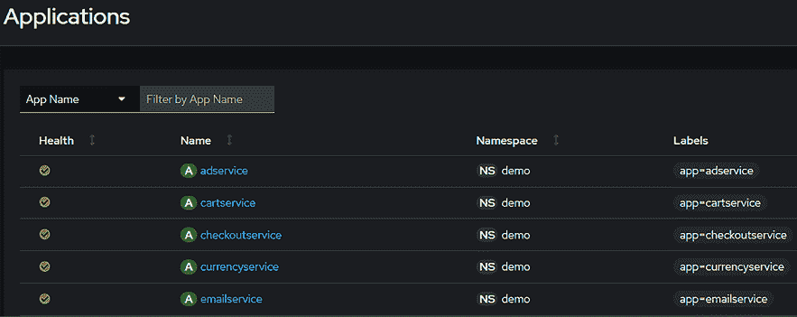
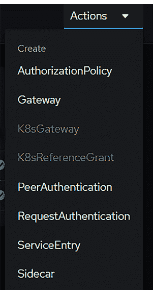

# 16

# Istio 简介

> “如果前端用户使用起来很容易，那可能意味着后端很复杂。”

本章将介绍 Istio，它是 Kubernetes 的一个服务网格插件。服务网格是一个工具，用于提升 Kubernetes 集群中微服务的管理、安全性和可视化。它通过处理服务间通信、负载均衡和流量路由，简化了复杂的网络任务，而无需在应用代码中实现这些功能。Istio 还通过加密、认证和授权等功能增强了安全性。它提供了详细的指标和监控，帮助开发者了解他们的服务性能。

Istio 是一个庞大而复杂的系统，它通过提供增强的安全性、发现、可观察性、流量管理等功能，给你的工作负载带来好处——而无需应用开发者为每个任务编写模块或应用。

虽然 Istio 有陡峭的学习曲线，但掌握它能够为开发者提供高级功能，使得复杂的服务网格部署和广泛的功能成为可能，包括以下能力：

+   根据不同需求路由流量

+   安全的服务间通信

+   流量整形

+   电路断路

+   服务可观察性

+   未来：环境网格

开发者可以在最少或无需修改代码的情况下使用这些工具。当某些功能对用户来说很容易使用时，往往意味着背后有很多复杂的工作，Istio 就是一个很好的例子。本章将展示如何设置 Istio 和 Kiali，一个用于监控的工具。我们还将讨论 Istio 的关键功能，这些功能有助于流量管理、增强安全性和揭示工作负载。

要全面解释 Istio，我们需要一本专门介绍其自定义资源及使用方法的书籍。本章及下一章的目标是让你掌握使用 Istio 的基本知识，以便你可以自信地开始使用它。我们不能涵盖每个组件的所有细节，因此建议你访问 Istio 官网 [`istio.io`](https://istio.io)，以获得更多信息，进一步扩展你在本章所学的内容。

本章将涵盖以下主题：

+   理解控制平面和数据平面

+   为什么你应该关心服务网格？

+   Istio 概念介绍

+   理解 Istio 组件

+   安装 Istio

+   介绍 Istio 资源

+   部署附加组件以提供可观察性

+   将应用部署到服务网格中

+   未来：环境网格

在我们深入本章内容之前，先为你即将学习的内容定个基调。本章旨在介绍如何部署 Istio 以及它提供的主要功能。它提供了了解 Istio 功能和各部分的关键细节。在本章以及下一章中（你将把应用程序添加到服务网格中），你应该能够很好地掌握如何设置和使用基本的 Istio 服务网格。

我们将在本章结束时，展望服务网格的未来，即所谓的环境网格（ambient mesh）。截至本书发布时，环境网格仍处于测试阶段，由于从测试版到正式版的过程中可能会有许多变化，我们将仅概述环境网格发布时将带来的新特性。

作为本章介绍的结尾，这里有一个关于 Kubernetes 的趣味事实：像 Kubernetes 中的许多东西一样，Istio 的名字来源于与海洋相关的事物。在希腊语中，“Istio”意味着“帆”。

# 技术要求

本章有以下技术要求：

+   按照*第一章*《Docker 和容器基础》中的步骤安装的 Docker 主机，至少需要 8 GB 的 RAM，推荐 16 GB。

+   按照*第二章*《使用 KinD 部署 Kubernetes》中的初始脚本配置的 KinD 集群

+   本书 GitHub 仓库中的安装脚本

你可以通过访问本书的 GitHub 仓库来获取本章的代码：[`github.com/PacktPublishing/Kubernetes-An-Enterprise-Guide-Third-Edition/tree/main/chapter16`](https://github.com/PacktPublishing/Kubernetes-An-Enterprise-Guide-Third-Edition/tree/main/chapter16)。

为了使用 Istio 来暴露工作负载，我们将从 KinD 集群中移除 NGINX，这样可以让 Istio 使用主机上的端口 `80` 和 `443`。

# 理解控制平面和数据平面

服务网格框架增强了微服务之间的通信，使这些交互更加安全、快速和可靠。它分为两个主要组件：控制平面和数据平面，每个组件在提供 Kubernetes 中的服务间通信中扮演着特定角色。这两个层次构成了服务网格的整体，了解每个层次的基本概念对于理解 Istio 非常关键。

## 控制平面

让我们从 Istio 控制平面开始。

Istio 中的控制平面是中央权威，控制并指挥服务网格中各服务之间的通信方式。一个常见的类比是将它比作城市的交通管理，管理道路和交通信号灯，确保交通流畅和有序。它在服务间通信、服务安全以及整个网格的可观察性方面起着重要作用。我们将在*理解 Istio 组件*部分讨论控制平面中的主要守护进程 `istiod` 时，详细介绍控制平面所管理的不同功能。

## 数据平面

第二个组件是数据平面，它是包含一组代理（称为 Envoy 代理）的工作层，这些代理与您的服务一起部署。它们拦截并管理微服务之间的网络流量，而无需您或您的开发人员做任何额外的工作或重新编码。

为了建立我们之前提到的控制平面的类比，可以将数据平面比作城市中的道路。网格中的每个服务都有一条专用的道路，流量通过交通控制器指向该服务——在我们的例子中，交通控制器就是 Istio 控制平面（istiod）。

到目前为止，您可能一直在使用 Kubernetes，而没有服务网格。那么，您可能会想，为什么要关心 Istio 为您的集群带来的功能？在接下来的部分中，我们将介绍 Istio 的特点，以便您能够向开发人员和企业解释为什么服务网格是集群的重要附加组件。

# 为什么要关心服务网格？

服务网格（如 Istio）提供了多个功能，通常开发人员需要自己开发这些功能，这会迫使他们修改现有的代码。如果没有 Istio，当开发人员需要特定功能时，比如在多种编程语言（如 Java、Python 或 Node.js）编写的服务之间实现安全通信，他们需要为每种语言单独实现必要的代码或库。这会增加代码的复杂性，通常还会导致效率低下，进而引发应用性能问题。

添加安全性，比如加密，仅仅是开发人员在创建应用时可能需要的一个例子。那么其他功能呢，比如控制数据流、测试应用如何应对故障，或者网络延迟如何导致应用行为异常？这些以及许多其他功能，Istio 都包含其中——它允许开发人员专注于他们自己的业务代码，而不是编写额外的代码来控制流量或模拟错误或延迟。

让我们来看一下 Istio 提供的一些优势。

## 工作负载可观察性

应用的停机时间或变慢可能会影响您组织的声誉，并可能导致收入损失。

您是否曾经在一个有许多活跃服务的应用中，难以找到根本问题？想象一下，通过实时监控服务之间的交互和状态，或者回放过去的事件，快速识别和解决问题，发现几小时或几天前出了什么问题。

管理复杂的应用程序和多个服务可能会让人感到不知所措。Istio 提供的功能使这项任务变得不那么令人生畏。如果开发者能有一种更简单的方法该多好！幸好有了 Istio 及其生态系统，这不仅仅是空想。凭借 Prometheus 用于存储度量数据、Kiali 用于深入洞察以及 Jaeger 用于详细追踪等强大功能，你可以拥有一套强大的故障排除工具。

在本章中，我们将设置所有三个插件，重点使用 Kiali，它让你以前所未有的方式观察服务之间的通信。

## 流量管理

Istio 为你的工作负载提供了强大的流量管理能力，提供了灵活性，可以采用任何你需要的部署模型，而无需修改网络基础设施。这种控制完全掌握在你和开发者手中。Istio 还包括一些工具，使你能够模拟应用程序可能遇到的各种不可预见的情况，如 HTTP 错误、延迟、超时和重试。

我们认识到，一些读者可能对部署模型的概念还不熟悉。掌握可用的不同类型对于理解和欣赏 Istio 带来的好处至关重要。通过 Istio，开发者可以有效地利用蓝绿部署和金丝雀部署等部署策略。

### 蓝绿部署

在这种模型中，你将两个版本部署到生产环境，按比例将流量分配到每个版本的应用程序，通常会将少量流量引导到“新”的（绿色）版本。当你验证新部署按预期工作时，可以将所有流量切换到绿色部署，或者将蓝绿部署与金丝雀部署结合使用，直到最终将 100% 的流量切换到新部署。

### 金丝雀部署

这个术语源自矿业时代，当时矿工会将金丝雀放入矿井中，以验证工作环境是否安全。在部署的情况下，它允许你在将发布版本升级为新版本之前，先部署一个早期的测试版本。实质上，这类似于蓝绿部署，但在金丝雀部署中，你会将非常小比例的流量引导到金丝雀版本的应用程序上。使用少量的流量将最大限度地减少金丝雀部署可能引入的影响。当你越来越确信“金丝雀”版本的应用程序是稳定的时，你会逐步增加流量，直到所有流量都切换到新版本。

## 在问题发生之前发现问题

我们可以进一步深化部署模型；Istio 还为你提供了开发弹性和测试工具，在部署工作负载之前，帮助你发现问题，而不是等客户或终端用户反馈。

你曾经担心过应用程序如何应对某些未知事件吗？

开发者需要担心他们几乎无法控制的事件，包括：

+   应用程序超时

+   通信延迟

+   HTTP 错误代码

+   重试

Istio 提供了对象来帮助处理这些问题，允许你在迁移到生产环境之前与工作负载创建问题。这使得开发者能够在将应用发布到生产环境之前捕捉并解决应用中的问题，从而提供更好的用户体验。

## 安全性

在今天的世界中，安全性是我们每个人都应该关注的问题。许多保护工作负载的方法都很复杂，并可能需要很多开发者没有的技能。这正是 Istio 大显身手的地方，它提供了工具，使得安全部署变得简单，并且尽可能减少对开发的影响。

Istio 中第一个也是最受欢迎的安全功能是能够在工作负载之间提供**相互传输层安全性**（**mTLS**）。通过使用 mTLS，Istio 不仅为通信提供加密，还提供工作负载身份。当你访问一个证书过期或自签名证书的网站时，浏览器会警告你该站点无法被信任。这是因为浏览器在建立 TLS 连接时会进行服务器认证，通过验证服务器提供的证书是否被浏览器信任。mTLS 不仅验证客户端到服务器的信任，还验证服务器到客户端的信任。这就是“相互”的部分。服务器验证客户端提供的证书是否被信任，客户端也验证服务器的证书。当你首次启动集群并使用为你创建的初始证书时，你就在使用 mTLS。Istio 让这一过程变得更加简单，因为它会使用内置的 sidecar 为你创建所有证书和身份。

你可以将 mTLS 配置为整个网格或单个命名空间的要求（STRICT），或选项（PERMISSIVE）。如果你将选项设置为 STRICT，任何与服务的通信都需要 mTLS，如果请求未能提供身份，则连接将被拒绝。然而，如果你设置 PERMISSIVE 选项，具有身份并请求 mTLS 的流量将会被加密，而任何未提供身份或加密请求的请求仍然会被允许进行通信。

另一个提供的功能将使你能够控制允许哪些通信访问工作负载，类似于防火墙，但实现方式更简单。通过 Istio，你可以决定只允许 HTTP GET 请求，或只允许 HTTP POST 请求，或者两者都允许——且仅限于特定来源。

最后，你可以使用**JSON Web 令牌**（**JWTs**）进行初始用户认证，以限制哪些人有权限与工作负载通信。这使得你能够通过只接受来自批准的令牌提供者的 JWT 来保护初始通信尝试。

现在我们已经讨论了一些你可能想要部署 Istio 的原因，让我们来介绍一些 Istio 的概念。

# Istio 概念介绍

Istio 的原则可以分为四个主要领域：流量管理、安全性、可观察性和可扩展性。对于这些领域，我们将介绍开发人员可以利用的组件和自定义资源，以便充分利用 Istio 带来的好处。

## 了解 Istio 组件

类似于标准 Kubernetes 集群，Istio 指代两个独立的平面：控制平面和数据平面。历史上，数据平面包括四个不同的服务，Pilot、Galley、Citadel 和 Mixer——所有这些服务都采用真正的微服务设计。这种设计有多种原因，包括将职责分配给多个团队的灵活性、使用不同编程语言的能力，以及独立扩展每个服务的能力。

自 Istio 首次发布以来，Istio 发展迅速。团队决定，拆分核心服务几乎没有好处，反而让 Istio 变得更复杂。这促使团队重新设计 Istio，并且从 Istio 1.5 开始，Istio 包含了我们将在本节中讨论的组件。

### 使用 istiod 简化控制平面

就像 Kubernetes 将多个控制器打包成一个可执行文件 kube-controller-manager 一样，Istio 团队决定将控制平面组件打包成一个名为 istiod 的单一守护进程。这个单一守护进程将所有控制平面组件组合成一个单一的 Pod，可以根据需要轻松扩展性能。

单一守护进程的主要优势列在 Istio 的博客中，地址为[`istio.io/latest/blog/2020/istiod/`](https://istio.io/latest/blog/2020/istiod/)。总结团队的理由，单一进程提供了：

+   更简便快捷的控制平面安装

+   更简单的配置

+   更容易将虚拟机集成到服务网格中，只需要一个代理和 Istio 的证书

+   更容易进行扩展

+   减少控制平面的启动时间

+   减少所需的整体资源量

控制平面负责控制你的服务网格。它具有创建和管理 Istio 组件所需的多个重要特性，下一节我们将解释 istiod 所提供的特性。

#### 拆解 istiod Pod

移动到单一二进制文件并没有减少 Istio 的功能或特性；它仍然提供了各个独立组件所提供的所有功能，只不过现在它们都集中在一个单一的二进制文件中。每个部分都为服务网格提供了一个关键特性，接下来我们将解释这些特性：

+   **服务发现**：确保与服务一起部署在同一 Pod 中的 Envoy 代理，能够获取最新的网络位置信息，包括服务网格中服务的 IP 地址和端口。服务发现提供了跨服务网格的高效服务间通信。

服务可能频繁地进行扩展或缩减，pod 可能作为滚动更新或自动扩展活动的一部分被终止或启动。每次变化可能会改变端点。服务发现通过监控服务及其相关 pod 的更新来自动跟踪这些变化。当发生变化时，服务发现组件会更新内部服务端点注册表，并将这些更新推送到 Envoy sidecar。

服务发现对于保持服务网格的响应性和效率至关重要，能够实时动态适应容器化应用环境不断变化的格局。

+   **配置分发**：处理数据平面 sidecar 代理的流量路由、安全协议和策略执行的配置。配置分发集中管理以前由名为 Galley 的组件执行的功能，包括在服务网格中授权配置变更。

+   **证书生命周期管理**：管理数字证书的颁发、续期和撤销，这些证书用于通过相互传输层安全（mTLS）保证的安全服务间通信，之前由一个名为 Citadel 的组件处理，该组件提供身份验证和证书管理，确保网格内的所有服务都能信任连接，无需任何额外的组件或配置。mTLS 通过加密服务之间的数据传输，减少了安全威胁，提供了服务网格内通信的机密性和完整性。

+   **自动化 Envoy 代理部署**：通过在 Kubernetes pod 内自动部署 Envoy sidecar 代理，简化了部署过程。这种无缝集成优化了通过 pod 管理`Egress`和`Ingress`流量的方式，充当了一个无形的中介，监督网络流量。

这个自动化过程确保服务网格中的每个 pod 都接收到自己的 Envoy 代理，提供先进的流量能力，包括路由、负载分配和安全措施。Envoy 代理部署的自动化消除了建立和维护服务网格时的复杂性，使开发者和运维人员能够将精力集中在主要职责上。

+   **流量路由与控制**：负责创建并共享管理流量到 Envoy 代理的规则，在执行高级网络操作中扮演关键角色，并提供精确控制通常复杂的网络流量流向的方式。

流量路由和控制提供的功能包括：

+   确定流量的路径

+   战略性重试机制

+   故障转移机制以确保持续性

+   为了创建现实的测试环境，引入故障

流量路由和控制提供了多项优势，包括简化网络流量管理、测试网络在特定条件下的稳定性和响应，以及通过模拟中断和应用程序反应来提高工作负载的弹性，以便在生产环境中发生之前解决潜在问题。

+   **安全策略执行**：使用安全规则确保只有授权用户或服务能够安全地访问并在网络中进行交互。

+   **可观察性数据收集**：在服务网格中，跟踪系统运行情况并快速识别和解决问题至关重要。这就是可观察性数据收集的作用，通过收集和分析遥测信息（包括指标、日志和来自数据平面的跟踪），增强网格的监控和运营洞察能力。

现在我们已经讨论了 istiod 提供的功能，接下来我们将讨论如何使用 `istio-ingressgateway` 组件在服务网格中管理传入流量。

### 了解 istio-ingressgateway

从基础的 istiod pod 转到 Istio 的一个重要组成部分——`istio-ingressgateway`。这个网关使外部客户端和服务能够访问服务网格，充当进入 Kubernetes 集群的入口点。每个启用 Istio 的集群通常至少配备一个 `istio-ingressgateway` 实例。然而，Istio 的设计并不限于此；根据具体需求，可以部署多个 ingress 网关来服务不同的目的或处理不同的流量模式。

`istio-ingressgateway` 提供了两种方式来访问应用程序：

1.  标准 Kubernetes Ingress 对象支持

1.  Istio 网关和虚拟服务对象

由于我们已经讨论并部署了 NGINX 作为 Ingress 控制器，因此不会再讨论使用 Envoy 作为标准 Ingress 控制器；相反，我们将重点介绍使用网关和虚拟服务来处理传入请求的第二种方法。

使用网关暴露我们的服务比标准的 Ingress 对象提供了更多的灵活性、定制性和安全性。

### 了解 istio-egressgateway

`istio-egressgateway` 旨在将流量从 sidecar 定向到单个 pod 或一组 pod，从而集中管理服务网格中的外发（egress）流量。通常，Istio sidecar 同时管理网格内服务的传入和传出流量。虽然 `istio-ingressgateway` 用于管理传入流量，但实现 `istio-egressgateway` 也可以对传出流量进行管理。`ingressgateway` 和 `egressgateway` 的功能和细节将在 *介绍 Istio 资源* 部分中进行详细探讨。

现在，让我们深入了解如何在集群中安装 Istio。

# 安装 Istio

部署 Istio 有多种方法。目前最常见的方法是使用 `istioctl` 或 Helm，但根据你的组织需求，还可以选择其他选项。你可以选择通过 `istioctl` 或 Helm 创建清单来使用替代的安装方法。

每种方法的优缺点简要列在*表 16.1*中：

| **部署方法** | **优点** | **缺点** |
| --- | --- | --- |
| `istioctl` | 配置验证与健康检查不需要特权 Pod，增强了集群安全性多个配置选项 | 每个 Istio 版本都需要新的二进制文件 |
| Istio 操作员 | 配置验证和健康检查不需要为每个 Istio 版本准备多个二进制文件多个配置选项 | 需要在集群中运行特权 Pod |
| Manifests（通过 `istioctl`） | 生成可定制的清单，在使用 `kubectl` 部署前可以进行调整多个配置选项 | 并未执行所有检查，这可能导致部署错误与使用 `istioctl` 或 Istio 操作员相比，错误检查和报告功能受限 |
| Helm | Helm 和 Helm Charts 对大多数 Kubernetes 用户都很熟悉利用 Helm 标准，简化了部署管理 | 提供的验证检查是所有部署选项中最少的，执行大多数任务时需要额外工作和复杂度 |

表 16.1：Istio 部署方法

在本章中，我们将重点介绍使用 `istioctl` 二进制文件进行安装，在接下来的章节中，我们将使用 `istioctl` 部署 Istio。

## 下载 Istio

我们提供了一个脚本来部署 Istio，输出安装验证，移除 NGINX Ingress，并将 `istio-ingressgateway` 暴露为我们 KinD 集群的 Ingress。如果你更喜欢手动使用 `istioctl` 安装，也提供了手动过程。脚本 `install-istio.sh` 已经包括在内，供读者在自动化测试时使用，位于 `chapter16` 目录中。

我们首先需要做的是定义我们想要部署的 Istio 版本。我们可以通过设置环境变量来完成，在我们的示例中，我们希望部署 Istio 1.20.3。首先，确保你在克隆仓库后的 `chapter16` 目录中，然后执行以下命令：

```
curl -L https://istio.io/downloadIstio | ISTIO_VERSION=1.20.3 TARGET_ARCH=x86_64 sh - 
```

这将下载安装脚本，并使用我们之前定义的 `ISTIO_VERSION` 执行该脚本。执行后，你的当前工作目录中会有一个 `istio-1.20.3` 目录。

最后，由于我们将使用 `istio-1.12.3` 目录中的可执行文件，因此应将其添加到 `path` 环境变量中。为了简化操作，建议在设置 `path` 变量之前，先进入书本仓库中的 `chapter16` 目录：

```
export PATH="$PATH:$PWD/istio-1.20.3/bin" 
```

## 使用配置文件安装 Istio

为了简化 Istio 的部署，团队包含了多个预定义的配置文件。每个配置文件定义了哪些组件被部署以及默认配置。共包含七个配置文件，但大多数部署只使用五个配置文件。

| **配置文件** | **已安装组件** |
| --- | --- |
| 默认 | `istio-ingressgateway` 和 `istiod` |
| 演示 | `istio-egressgateway`、`istio-ingressgateway` 和 `istiod` |
| 精简 | `istiod` |
| 预览 | `istio-ingressgateway` 和 `istiod` |
| 环境 | `istiod`、CNI 和 Ztunnel 注：在 Istio 1.20.3 版本中，环境网格是一个 Alpha 特性 |

表 16.2：Istio 配置文件

如果没有任何包含的配置文件适合你的部署需求，你可以创建一个定制的部署。由于我们将使用包含的演示配置文件，因此这超出了本章的范围——但是，你可以在 Istio 的网站上阅读更多有关定制配置的信息：[`istio.io/latest/docs/setup/additional-setup/customize-installation/`](https://istio.io/latest/docs/setup/additional-setup/customize-installation/)。

要使用 `istioctl` 部署使用演示配置文件的 Istio，我们只需执行一条命令：

```
istioctl manifest install --set profile=demo 
```

安装程序将询问你是否确认使用默认配置文件部署 Istio，该配置文件将部署所有 Istio 组件：

```
This will install the Istio 1.20.3 "demo" profile (with components: Istio core, Istiod, Ingress gateways, and Egress gateways) into the cluster. Proceed? (y/N) 
```

按 *y* 键表示同意继续部署。如果你想跳过确认，可以在 `istioctl` 命令行中添加一个选项 `--skip-confirmation`，该选项告诉 `istioctl` 跳过确认。

如果一切顺利，你应该会看到每个组件已安装的确认信息，并显示感谢你安装 Istio 的完成信息。

```
 Istio core installed
 Istiod installed
 Egress gateways installed
 Ingress gateways installed
 Installation complete                                                                                                                                       Made this installation the default for injection and validation. 
```

`istioctl` 可执行文件可用于验证安装。要验证安装，你需要一个清单。由于我们使用 `istioctl` 直接部署 Istio，因此没有清单，因此需要创建一个来检查我们的安装。

```
istioctl manifest generate --set profile=demo > istio-kind.yaml 
```

然后运行 `istioctl verify-install` 命令。

```
istioctl verify-install -f istio-kind.yaml 
```

这将验证每个组件，并在验证完成后，提供类似于下面输出的摘要：

```
Checked 15 custom resource definitions
Checked 3 Istio Deployments
✔ Istio is installed and verified successfully 
```

现在我们已经验证了安装，让我们看看 `istioctl` 创建了什么：

+   一个名为 `istio-system` 的新命名空间。

+   创建了三个部署，并为每个部署创建了相应的服务：

    +   `istio-ingressgateway`

    +   `istio-egressgateway`

    +   `istiod`

+   15 个 **自定义资源定义** (**CRDs**) 用于提供 Istio 资源，包括：

    +   `destinationrules.networking.istio.io`

    +   `envoyfilters.networking.istio.io`

    +   `gateways.networking.istio.io`

    +   `istiooperators.install.istio.io`

    +   `peerauthentications.security.istio.io`

    +   `proxyconfigs.networking.istio.io`

    +   `requestauthentications.security.istio.io`

    +   `serviceentries.networking.istio.io`

    +   `sidecars.networking.istio.io`

    +   `telemetries.telemetry.istio.io`

    +   `virtualservices.networking.istio.io`

    +   `wasmplugins.extensions.istio.io`

    +   `workloadentries.networking.istio.io`

    +   `workloadgroups.networking.istio.io`

在这一阶段，您无需关心自定义资源（CR）的细节。随着我们在本章中的进展，我们将深入探讨最常用资源的具体细节。接下来，在下一章中，我们将讲解如何将应用程序部署到网格中，这将涉及几个已部署的 CR。

对于本章或下一章中未涉及的任何 CR，您可以参考 istio.io 网站上的文档，地址如下：[istio.io/latest/docs](http://istio.io/latest/docs)

## 在 KinD 集群中暴露 Istio

在部署 Istio 后，我们的下一步是将其暴露给我们的网络，以便我们可以访问我们将构建的应用程序。由于我们是在 KinD 上运行，这可能有些棘手。Docker 会将所有来自端口`80`（HTTP）和`443`（HTTPS）的流量转发到我们的 KinD 服务器上的工作节点。工作节点则在端口`443`和`80`上运行 NGINX Ingress 控制器来接收这些流量。在实际场景中，我们会使用外部负载均衡器，例如 MetalLB，通过 LoadBalancer 来暴露各个服务。然而，针对我们的实验环境，我们将重点关注简化操作。

当您执行先前的脚本来安装 Istio 时，最后一步运行了一个名为`expose_istio.sh`的独立脚本，做了两件事。首先，它会删除`ingress-nginx`命名空间，移除 NGINX 并释放 Docker 主机上的端口`80`和`443`。其次，它会修补`istio-system`命名空间中的`istio-ingressgateway`部署，使其在工作节点上的端口`80`和`443`上运行。

由于该脚本作为安装的一部分执行，因此您无需再次执行它。

现在我们已经在集群中完全部署了 Istio，并了解了 Istio 包含的自定义资源，接下来我们将进入下一部分，解释每个资源及其用例。

# 介绍 Istio 资源

Istio 的自定义资源为您的集群提供了强大的功能，每个资源都可能成为一个章节的内容。

在本节中，我们将提供足够的细节，以帮助您充分了解每个对象。概述过后，我们将部署一个基础应用程序，该应用程序将在真实的应用示例中演示许多对象。

## 授权策略

授权策略是可选的；然而，如果您没有创建任何策略，所有请求都将允许访问您的集群工作负载。这可能是一些组织期望的默认行为，但大多数企业应该根据最小所需权限来部署工作负载。这意味着您应仅允许访问应用程序所需的权限——没有更多，也没有更少。最小权限访问常常被组织忽视，因为它增加了访问的复杂性，如果配置不当，可能会拒绝有效请求的访问。虽然这种情况确实存在，但这并不是让系统对所有访问请求敞开大门的合理理由。

Istio 的授权策略提供了针对网格内服务的详细访问管理，允许你根据调用者的身份和权限定义访问权限。它们为开发人员提供了根据拒绝、允许和自定义操作控制工作负载访问的能力。

在深入解释策略之前，我们需要先了解一个名为**隐式启用**的概念。这意味着当**任何**授权策略与请求匹配时，Istio 会将默认的“允许所有”策略转换为对任何不匹配该策略的请求的拒绝。

让我们通过一个例子来详细解释这个问题。我们在一个启用了 Istio 的命名空间中运行着一个 NGINX 服务器，并且我们有一个标准，要求拒绝访问端口`80`。

乍一看，这似乎是一个简单的策略，我们只需创建一个拒绝策略，包含端口`80`。于是，我们创建了策略并将其部署到集群中——为了验证该策略，我们尝试访问端口`80`上的网站。我们打开浏览器，正如预期的那样，无法访问该站点。太好了！现在让我们验证是否能访问端口`443`上的网站。我们更改 URL 以使用端口`443`访问该站点，结果令我们惊讶的是，它也被*拒绝*了。

等等，什么!?!? 拒绝策略仅仅拒绝端口`80`——为什么端口`443`也被拒绝了？

这就是**隐式启用**的体现，对于任何刚接触 Istio 的人来说，可能会感到困惑。正如本节开头所讨论的，当创建一个策略并且请求匹配该策略时，Istio 会从*允许所有*的安全策略转换为*拒绝所有*的安全策略。即使我们只打算拒绝访问端口`80`，如果没有为端口`443`创建允许策略，访问也会被拒绝。

为了满足要求并允许访问端口`443`上的 NGINX 站点，我们需要创建一个允许策略，允许所有传入端口`443`的流量。稍后我们将详细解释这一点。

理解策略如何评估操作非常重要，因为配置错误的策略可能无法提供预期的结果。策略评估的高级流程如*图 16.1*所示。


图 16.1：Istio 策略评估流程

1.  如果**CUSTOM**操作的评估定义了对请求的**DENY**，则访问将被拒绝，评估过程将停止。

1.  接下来，如果**DENY**策略匹配请求，则该请求被拒绝访问该资源，评估过程停止。

1.  如果没有与请求匹配的**ALLOW**策略，则该请求将被拒绝访问。

1.  如果**ALLOW**策略匹配请求，则授予访问该资源的权限。

除了理解策略的流程，你还需要了解冲突的策略如何执行。如果一个策略有任何冲突的规则，比如既拒绝又允许同一个请求，则会优先评估拒绝策略，请求将被拒绝，因为拒绝策略的优先级高于允许策略。还需要特别注意的是，如果你允许某个特定操作，比如 HTTP GET，那么 GET 请求会被允许，但任何其他操作都会被拒绝，因为它没有被策略允许。

授权策略可能会变得非常复杂。Istio 团队在 Istio 网站上创建了一个页面，提供了多个示例，地址是[`istio.io/latest/docs/reference/config/security/authorization-policy/`](https://istio.io/latest/docs/reference/config/security/authorization-policy/)。

策略可以被拆解为范围、操作和规则：

+   **范围**：范围定义了哪些对象会受到策略的强制执行。你可以将策略作用范围限定到整个网格、一个命名空间，或任何 Kubernetes 对象标签，如 Pod。

+   **操作**：可以定义三种操作之一：CUSTOM、ALLOW 或 DENY——每种操作基于定义的规则拒绝或允许请求。ALLOW 和 DENY 是最常用的操作，但 CUSTOM 操作在需要复杂逻辑的场景中非常有用，当 ALLOW 或 DENY 无法处理时，可以使用外部系统进行附加决策。

+   **规则**：定义哪些操作会被请求允许或拒绝。规则可以变得非常复杂，允许你根据源和目标、不同的操作、密钥等定义动作。

为了帮助理解流程，让我们看几个示例授权策略，以及当策略被评估时将应用哪些访问控制。

稍后我们将在本章中部署一个更大的应用。如果你想查看本节中的示例策略如何工作，可以使用`chapter16/testapp`目录中的`deploy-testapp.sh`脚本来部署一个 NGINX Web 服务器。此脚本将创建所有必要的 Kubernetes 和 Istio 对象，以便在真实集群中测试这些策略。

执行脚本并创建了对象后，通过 curl 测试 NGINX 是否正常工作，访问刚刚创建的`nip.io`虚拟服务。在我们的服务器上，它创建了`testapp.10.3.1.248.nip.io`。

```
curl -v testapp.10.3.1.248.nip.io 
```

这应该会显示 NGINX 欢迎页面。现在，我们可以创建一些示例策略，展示授权策略是如何工作的。每个示例都位于`chapter16/testapp`目录下，文件名为`exampleX-policy.yaml`，其中`X`可以是`1`、`2`或`3`——每个示例都可以使用命令`kubectl apply <policyname> -n testapp`进行部署。

### 示例 1：拒绝和允许所有访问

在我们的第一个示例中，我们将创建一个策略，拒绝对命名空间`testapp`中的资源的所有请求：

```
apiVersion: security.istio.io/v1beta1
kind: AuthorizationPolicy
metadata:
 name: testapp-policy-deny
 namespace: testapp
spec:
  {} 
```

部署策略后，再次尝试`curl`访问`nip.io`地址。你会发现这次会被拒绝访问，并且 Istio 会返回一个 RBAC 错误：

```
RBAC: access denied 
```

Istio 启用新策略可能需要几秒钟。如果你没有收到 `RBAC: access denied` 错误，请等待几秒钟再试。

这是一个非常简单的策略，它没有包含 `selector`，并且在 `spec` 部分没有定义任何内容。通过省略 `selector` 部分，Istio 会将策略应用于命名空间中的所有工作负载，而由于 `spec` 部分没有任何内容，Istio 将拒绝所有流量。如果我们回顾 *图 16.1* 中的策略流图，它将沿底部流动，并在圆圈 #3 处进行评估——存在一个 `selector` 匹配，即命名空间中的 *所有* 工作负载，并且没有定义 ALLOW 策略。这将导致请求被拒绝。

我们不会部署下一个示例；我们展示它是为了加强上面提供的示例。通过向策略添加一个条目，我们可以将其从拒绝所有请求更改为允许所有请求。

```
apiVersion: security.istio.io/v1beta1
kind: AuthorizationPolicy
metadata:
 name: testapp-policy-deny
 namespace: testapp
spec:
  rules:
  - {} 
```

当我们向策略定义中添加 `rules` 部分（使用 `{}`）时，我们创建了一个规则，意味着所有流量。与前面的示例类似，我们没有添加 `selector`，这意味着策略将应用于命名空间中的所有部署。由于此规则适用于所有工作负载，并且该规则包含所有流量，因此访问将被允许。

你可能已经开始理解为什么我们提到不了解策略在流程中如何评估可能会导致意外的访问结果。这是一个典型的例子，展示了如何通过添加一个条目 `rules`，将策略从拒绝所有请求更改为允许所有请求。

在继续之前，通过执行以下命令删除策略：

```
kubectl delete -f example1-policy.yaml -n testapp 
```

### 示例 2：只允许 GET 方法访问工作负载

策略可以非常细化，只允许某些操作，例如允许 HTTP 请求中的 GET 方法。这个例子将允许 GET 请求，同时拒绝所有其他请求类型，应用于在 `marketing` 命名空间中标记为 `app=nginx-web` 的 pod。在这个示例中，我们将使用第一个示例中的相同 NGINX 部署。使用位于 `chapter16/testapp` 目录下的 `exampe2-policy.yaml` 清单，通过 `kubectl` 创建策略：

```
kubectl create -f example2-policy.yaml -n testapp 
```

```
apiVersion: security.istio.io/v1beta1
kind: AuthorizationPolicy
metadata:
  name: nginx-get-allow
  namespace: marketing
spec:
  selector:
    matchLabels:
      app: nginx-web
  action: ALLOW
  rules:
  - to:
    - operation:
         methods: ["GET"] 
```

如果你尝试 `curl` 访问与示例 1 中相同的 `nip.io` 地址，你将看到 NGINX 欢迎页面。这是使用 HTTP GET 命令进行的。为了证明 HTTP PUT 命令会被阻止，我们可以使用 `curl` 命令向 NGINX 发送请求：

```
curl -X PUT -d argument=value -d value1=dummy-data  http://testapp.10.3.1.248.nip.io/ 
```

这将导致 Istio 拒绝请求，并出现 RBAC 错误：

```
RBAC: access denied 
```

在这个示例中，策略接受来自任何来源的 GET 请求，因为我们只定义了一个操作而没有指定具体的 `from` 对象。由于我们没有在策略中添加 PUT 操作，任何尝试发送 HTTP PUT 请求的行为将被策略拒绝。

策略甚至可以更细化，根据请求的来源来接受（或拒绝）请求。在下一个示例中，我们将展示另一个策略示例，但我们将把来源限制为单一的 IP 地址。

在继续之前，使用`kubectl`删除示例策略：

```
kubectl delete -f example2-policy.yaml -n testapp 
```

### 示例 3：允许来自特定来源的请求

在我们最后的策略示例中，我们将限制哪些来源可以使用 GET 或 POST 方法访问工作负载。

通过拒绝任何来自不在策略源列表中的来源的请求，这将增强安全性。我们不会创建这个策略，因为许多读者可能在测试时受限于可用的机器数量。

```
metadata:
 name: nginx-get-allow-source
 namespace: marketing
spec:
  selector:
    matchLabels:
      app: nginx
  action: ALLOW
  rules:
  - from:
    - source:
        ipBlocks:
        - 192.168.10.100 
```

与之前的示例不同，这个策略包含一个`source:`部分，允许你根据不同的来源（如 IP 地址）限制访问。这个策略将允许源 IP `192.168.10.100`访问 NGINX 服务器上的所有操作，其他所有来源的访问将被拒绝。

从授权策略转向，我们将介绍下一个自定义资源——目标网关。

### 网关

之前，我们提到过流量将进入一个中央点`istio-ingressgateway`。我们没有解释流量如何从`ingressgateway`流向命名空间和工作负载——这就是网关的作用。

网关可以在命名空间级别进行配置，因此你可以将创建和配置的任务委托给一个团队。它是一个负载均衡器，接收传入和传出的流量，可以通过诸如接受的加密套件、TLS 版本、证书处理等选项进行自定义。

网关与虚拟服务一起工作，我们将在下一节中讨论虚拟服务，但在此之前，以下图示展示了`Gateway`和`VirtualService`对象之间的交互。


图 16.2：网关到虚拟服务的通信流

以下列表更详细地解释了*图 16.2*中所示的通信：

1.  一个传入请求被发送到 Istio 的`ingress-gateway`控制器，该控制器位于`istio-system`命名空间中。

1.  `sales`命名空间有一个配置了`ingressgateway`的网关，主机名为`entry.foowidgets.com`。这告诉`ingressgateway`将请求发送到`sales`命名空间中的网关对象。

1.  最终，流量通过一个已使用网关在`sales`命名空间中创建的虚拟服务对象路由到服务。

为了展示一个`Gateway`配置示例，我们有一个启用了 Istio 的名为`sales`的命名空间，运行着一个可以通过 URL`entry.foowidgets.com`访问的应用程序，我们需要将其暴露以供外部访问。为此，我们将创建一个网关，使用以下示例清单。（下面的示例仅供讨论；你不需要在你的 KinD 集群上部署它。）

```
apiVersion: networking.istio.io/v1alpha3
kind: Gateway
metadata:
  name: sales-gateway
  namespace: sales
spec:
  selector:
    istio: ingressgateway
  servers:
  - port:
      number: 443
      name: http
      protocol: HTTP
    hosts:
    - sales.foowidgets.com
    tls:
      mode: SIMPLE
      serverCertificate: /etc/certs/servercert.pem
      privateKey: /etc/certs/privatekey.pem 
```

这个网关配置将告诉入口网关在端口`443`上监听来自`sales.foowidgets.com`的传入请求。它还定义了将用于保护传入 Web 请求的通信的证书。

你可能会想：“它怎么知道使用我们在集群中运行的入口网关？”如果你查看`spec`部分，然后查看选择器，我们已经配置了`selector`，使用带有`istio=ingressgateway`标签的入口网关。这个`selector`和标签告诉网关对象哪个入口网关将为我们的新网关创建传入连接。当我们之前部署 Istio 时，入口网关被标记为默认标签`istio=ingressgateway`，如下所示，来自`kubectl get pods --show-labels -n istio-system`的输出。

```
app=istio-ingressgateway,chart=gateways,heritage=Tiller,install.operator.istio.io/owning-resource=unknown,istio.io/rev=default,istio=ingressgateway,operator.istio.io/component=IngressGateways,pod-template-hash=78c9969f6b,release=istio,service.istio.io/canonical-name=istio-ingressgateway,service.istio.io/canonical-revision=latest,sidecar.istio.io/inject=false 
```

你可能会想，既然网关中没有配置选项告诉它将流量引导到哪里，那么网关将如何被用来指引流量到特定的工作负载呢？这是因为网关只是配置了入口网关来接受指向目标 URL 的流量以及所需的端口——它并不控制流量如何流向服务；这是下一个对象，`虚拟服务`对象的工作。

### 虚拟服务

网关和虚拟服务结合在一起，为服务或服务提供正确的流量路由。一旦您部署了网关，您需要创建一个虚拟服务对象来告诉网关如何将流量路由到您的服务。

基于网关示例，我们需要告诉网关如何将流量路由到运行在端口`443`上的 Web 服务器。该服务器已使用 NGINX 在`marketing`命名空间中部署，并具有`app-nginx`标签和一个名为`frontend`的服务。为了将流量路由到 NGINX 服务，我们将部署以下清单。（下面的示例仅供讨论；您无需在 KinD 集群上部署它。）

```
apiVersion: networking.istio.io/v1beta1
kind: VirtualService
metadata:
  name: sales-entry-web-vs
  namespace: sales
spec:
  hosts:
  - entry.foowidgets.com
  gateways:
  - sales-gateway
  http:
  - route:
    - destination:
        port:
          number: 443
        host: entry 
```

分解清单时，我们指定了这个`VirtualService`对象将路由的主机；在我们的示例中，我们只有一个主机，`entry.foowidgets.com`。下一个字段定义了将用于流量的网关；在上一节中，我们定义了一个名为`marketing-gateway`的网关，并配置它监听端口`443`。

最后，最后一部分定义了流量将路由到哪个服务。路由、目标和端口都很容易理解，但`host`部分可能会让人误解。该字段实际上定义了您将路由流量到的服务。在这个示例中，我们将流量路由到一个名为`entry`的服务，因此我们的字段被定义为`host: entry`。

通过了解如何使用网关和虚拟服务在服务网格中路由流量，我们可以继续讨论下一个主题：目标规则。

## 目标规则

虚拟服务提供了一种基本的方法来将流量导向服务，但 Istio 提供了一个额外的对象，通过使用 `Destination` 规则来创建复杂的流量导向。`Destination` 规则在虚拟服务之后应用。流量最初使用虚拟服务路由，如果定义了 `Destination` 规则，可以使用该规则将请求路由到最终目的地。

这可能一开始有点混淆，但当你看到一个示例时会变得容易理解，所以让我们通过一个示例来深入了解，它可以将流量路由到不同版本的部署。

如我们所学，传入的请求最初会使用虚拟服务，然后，如果定义了目标规则，它将路由请求到目标。在这个示例中，我们已经创建了一个虚拟服务，但实际上我们有两个版本的应用程序，分别标记为 `v1` 和 `v2`，我们想要使用轮询方式在这两个版本之间进行流量导向。为了实现这一点，我们将使用下面的清单创建一个 `DestinationRule`。（下面的示例仅用于讨论；你不需要在你的 KinD 集群上部署它。）

```
apiVersion: networking.istio.io/v1alpha3
kind: DestinationRule
metadata:
  name: nginx
spec:
  host: nginx
  trafficPolicy:
    loadBalancer:
      simple: ROUND_ROBIN
  subsets:
  - name: v1
    labels:
      version: nginx-v1
  - name: v2
    labels:
      version: nginx-v2 
```

使用这个示例，传入 NGINX 服务器的请求将平分到应用程序的两个版本中，因为我们将 `loadBalancer` 策略定义为 `ROUND_ROBIN`。但如果我们想要将流量路由到连接数最少的版本呢？目标规则对于 `loadBalancer` 还有其他选项，如果要将连接路由到连接数最少的版本，我们将设置 `LEAST_CONN` 的 `loadBalancer` 策略。

接下来，我们将讨论 Istio 提供的一些安全功能，首先是一个名为 Peer Authentication 的对象。

### 对等认证

Istio 的对等认证对象控制了服务网格如何控制工作负载的互相 TLS 设置，这些设置可以应用于整个服务网格或仅仅是某个命名空间。每个策略都可以配置一个值，这个值要么允许 pod 之间进行加密和非加密通信，要么要求 pod 之间进行加密通信。

| **mTLS 模式** | **Pod 通信** | **描述** |
| --- | --- | --- |
| `STRICT` | mTLS 必须 | 任何发送到 Pod 的非加密流量将被拒绝 |
| `PERMISSIVE` | mTLS 可选 | Pod 会接受加密和非加密流量 |

表 16.3：PeerAuthentication 选项

如果你想为整个服务网格设置 `PeerAuthentication`，你需要在 `istio-system` 命名空间中创建一个 `PeerAuthentication`。例如，要要求所有 pod 之间使用 mTLS，你需要创建如下所示的策略：

```
apiVersion: security.istio.io/v1beta1
kind: PeerAuthentication
metadata:
  name: mtls-policy
  namespace: istio-system
spec:
  mtls:
    mode: STRICT 
```

要允许加密和非加密流量，策略模式只需设置为 `PERMISSIVE`，通过将模式更改为 `mode: PERMISSIVE` 即可。

与其为整个服务网格设置模式，许多企业只为需要额外安全性的命名空间将模式设置为 `STRICT`。在下面的示例中，我们为 `sales` 命名空间将模式设置为 `STRICT`。

```
apiVersion: security.istio.io/v1beta1
kind: PeerAuthentication
metadata:
  name: mtls-policy
  namespace: sales
spec:
  mtls:
    mode: STRICT 
```

由于此策略是为 `sales` 命名空间配置的，而不是为 `istio-system` 命名空间配置的，Istio 将仅对该命名空间强制执行严格的 mTLS 策略，而不是对整个服务网格执行。

这是网格提供的一个很好的安全功能，但加密并不会阻止请求访问我们的工作负载；它只是对请求进行加密。接下来我们将讨论的对象将通过要求认证才能允许访问，进一步增强工作负载的安全性。

### 请求认证和授权策略

安全性需要两部分。首先是认证部分，告诉我们“你是谁”。第二部分是授权，即提供认证后，允许的操作或“你可以做什么”。

`RequestAuthentication` 对象只是确保工作负载安全的一个部分。要完全保障工作负载的安全，你需要创建 `RequestAuthentication` 对象和 `AuthorizationPolicy`。`RequestAuthentication` 策略将决定哪些身份被允许访问工作负载，而 `AuthorizationPolicy` 策略将决定哪些权限被允许。

如果没有 `AuthorizationPolicy`，`RequestAuthorization` 策略可能会无意中允许访问资源。如果你只创建了一个 `RequestAuthorization` 策略，*表 16.4* 显示了哪些人会被允许访问。

| **令牌操作** | **提供的访问权限** |
| --- | --- |
| 提供无效令牌 | 访问将被拒绝 |
| 未提供令牌 | 将允许访问 |
| 提供有效令牌 | 将允许访问 |

表 16.4：RequestAuthentication 访问

正如你所看到的，一旦我们创建了策略，任何无效的 JWT 都会被拒绝访问工作负载，而任何有效的令牌将被允许访问工作负载。然而，当没有提供令牌时，许多人认为访问会被拒绝，但实际上，访问将被允许。`RequestAuthentication` 策略仅验证令牌，如果没有令牌，`RequestAuthentication` 规则将不会拒绝请求。

以下是一个示例清单。我们将在本章的示例部分使用这个清单，但在本节中先展示它以解释各个字段。

```
apiVersion: security.istio.io/v1beta1
kind: RequestAuthentication
metadata:
  name: demo-requestauth
  namespace: demo
spec:
  selector:
    matchLabels:
      app: frontend
  jwtRules:
  - issuer: testing@secure.istio.io
    jwksUri: https://raw.githubusercontent.com/istio/istio/release-1.11/security/tools/jwt/samples/jwks.json 
```

这个清单将创建一个策略，该策略配置位于 `demo` 命名空间中、标签为 `matching app=frontend` 的工作负载，接受来自 `testing@secure.istio.io` 的 JWT，并且使用 [`raw.githubusercontent.com/istio/istio/release-1.11/security/tools/jwt/samples/jwks.json`](https://raw.githubusercontent.com/istio/istio/release-1.11/security/tools/jwt/samples/jwks.json) 这个 URL 来确认令牌。

此 URL 包含用于验证令牌的密钥：

```
{ "keys":[ {"e":"AQAB","kid":"DHFbpoIUqrY8t2zpA2qXfCmr5VO5ZEr4RzHU_-envvQ","kty":"RSA","n":"xAE7eB6qugXyCAG3yhh7pkDkT65pHymX-P7KfIupjf59vsdo91bSP9C8H07pSAGQO1MV_xFj9VswgsCg4R6otmg5PV2He95lZdHtOcU5DXIg_pbhLdKXbi66GlVeK6ABZOUW3WYtnNHD-91gVuoeJT_DwtGGcp4ignkgXfkiEm4sw-4sfb4qdt5oLbyVpmW6x9cfa7vs2WTfURiCrBoUqgBo_-4WTiULmmHSGZHOjzwa8WtrtOQGsAFjIbno85jp6MnGGGZPYZbDAa_b3y5u-YpW7ypZrvD8BgtKVjgtQgZhLAGezMt0ua3DRrWnKqTZ0BJ_EyxOGuHJrLsn00fnMQ"}]} 
```

当令牌被提供时，将验证它是否来自 `RequestAuthentication` 对象中 `jwtRules` 部分定义的颁发者。

我们将在下一章详细介绍令牌身份验证是如何工作的。

### 服务条目

一旦工作负载成为服务网格的一部分，它的边车代理将处理所有与网格内服务的出站通信。如果工作负载试图与网格外的外部服务进行通信，而未正确配置，则这种通信可能会失败。幸运的是，Istio 提供了定义和管理外部服务的机制，使工作负载能够与网格外的服务进行通信。其中一种机制是`ServiceEntry`对象，它允许你定义外部网格的服务，并配置这些服务的访问方式。

如果你有一个要求，要求你的工作负载在服务网格内与服务网格外的服务通信，那么你需要为外部资源在网格中创建一个条目。这可以通过两种方式来完成，第一种方法引出了我们下一个自定义资源——`ServiceEntry`对象，它允许你将外部条目添加到服务网格中。当你为外部服务创建`ServiceEntry`时，它将表现得像是实际服务网格的一部分。这允许流量从服务网格内路由到手动指定的服务。如果没有`ServiceEntry`，任何尝试与外部资源通信的行为都会失败，因为 Istio 会试图在服务网格条目中查找该服务，但无法找到该资源（因为它不是网格的一部分）。

要创建一个`ServiceEntry`，你需要创建一个新对象，其中包含外部服务的主机和端口。下面的示例将创建一个新条目，将主机`api.foowidgets.com`（端口`80`）通过 HTTP 协议添加到服务网格中。

```
apiVersion: networking.istio.io/v1alpha3
kind: ServiceEntry
metadata:
  name: api-server
  namespace: sales
spec:
  hosts:
  - api.foowidgets.com
  ports:
  - number: 80
    name: http
    protocol: HTTP 
```

`ServiceEntry`是将外部资源显式添加到服务网格中的绝佳资源。我们提到过有两种方法可以将外部资源添加到服务网格中，其中一种是服务条目，另一种是`Sidecars`对象。选择使用哪种对象非常具体，取决于你自己的使用案例和组织标准。服务条目是非常具体的，你必须为每个需要通信的外部资源创建一个条目。边车则不同，它不是定义什么是服务网格外的资源，而是定义什么在服务网格内。

### 边车

首先，我们知道这可能会让人感到困惑——这个对象不是边车本身；它是一个允许你定义边车认为“在网格中”的项目的对象。根据集群的大小，你的网格中可能有成千上万的服务，如果你没有创建边车对象，Envoy 边车将假定你的服务需要与所有其他服务通信。

通常，你可能只需要你的命名空间与同一命名空间内的服务或少数其他命名空间的服务进行通信。由于追踪网格中的每个服务需要资源，因此最好创建一个边车对象，以减少每个 Envoy 边车所需的内存。

要创建一个限制 Envoy 代理中服务的边车对象，你需要部署下面显示的清单：

```
apiVersion: networking.istio.io/v1beta1
kind: Sidecar
metadata:
  name: sales-sidecar
  namespace: sales
spec:
  egress:
  - hosts:
    - "./*"
    - "istio-system/*" 
```

这个清单中的 `spec` 包含了网格中主机的列表，`./*` 引用的是创建该对象的命名空间，所有的边车应该包含部署 Istio 的命名空间，默认情况下为 `istio-system`。

如果我们有三个命名空间需要在网格中进行通信，我们只需将额外的命名空间添加到主机的条目中：

```
apiVersion: networking.istio.io/v1beta1
kind: Sidecar
metadata:
  name: sales-sidecar
  namespace: sales
spec:
  egress:
  - hosts:
    - ./*
    - istio-system/*
    - sales2
    - sales3 
```

未能限制网格对象可能导致你的 Envoy 边车发生崩溃循环，这可能是由于资源不足引起的。你可能会遇到 **内存不足**（**OOM**）事件，或者只是出现不显示任何根本原因的崩溃循环。如果你遇到这些情况，部署一个边车对象可能会解决问题。

### Envoy 过滤器

Envoy 过滤器使你能够创建由 Istio 生成的自定义配置。记住，Pilot（Istiod 的一部分）负责边车的管理。当任何配置发送到 Istio 时，Pilot 会将配置转换为 Envoy 可用的格式。由于你受限于 Istio 自定义资源中的选项，你可能无法拥有某些工作负载所需的所有潜在配置选项，这时候 Envoy 过滤器就派上用场了。

过滤器是非常强大且潜在危险的配置对象。它们允许你自定义标准 Istio 对象无法自定义的值，允许你添加过滤器、监听器、字段等。这让我想起了已故斯坦·李在《蜘蛛侠》中的一句话：“能力越大，责任越大。” Envoy 过滤器为你提供了扩展的配置选项，但如果过滤器被滥用，可能会导致整个服务网格崩溃。

Envoy 过滤器很复杂，对于本书的目的来说，并不是理解 Istio 所需深入了解的主题。你可以在 Istio 网站上阅读更多关于 Envoy 过滤器的内容，网址是 [`istio.io/latest/docs/reference/config/networking/envoy-filter/`](https://istio.io/latest/docs/reference/config/networking/envoy-filter/)。

### WASM 插件

与 Envoy 过滤器类似，`WasmPlugins` 对象用于扩展 Envoy 边车的功能。虽然它们在提供的功能上类似，但它们提供的自定义程度各不相同。

通常，`WasmPlugins` 被认为更易于开发和实现，使它们比 Envoy 过滤器更简单，也更不危险。然而，这种简化带来了功能的减少，相对于 Envoy 过滤器提供的功能，`WasmPlugins` 功能较少。

Envoy 过滤器提供了对代理设置的详细、精细控制，使得能够创建比 `WasmPlugins` 更复杂的操作。这种控制程度增加了它们的复杂性，如果配置或使用不当，可能会带来风险，从而导致服务网格中的中断。

选择 `EnvoyFilters` 还是 `WasmPlugins` 最终取决于你的具体需求和偏好。决定采用哪种方案时，重要的是考虑各种因素，权衡易用性、功能性以及对服务网格的潜在影响。

# 部署插件组件以提供可观察性

到现在为止，你已经知道如何部署 Istio，并理解了一些最常用的对象，但你还没有看到其中一个最有用的功能——可观察性。在本章开始时，我们提到过可观察性是 Istio 提供的我们最喜欢的功能之一，本章将解释如何部署一个叫做 Kiali 的流行 Istio 插件。

## 安装 Istio 插件

当你部署 Istio 时，你为开发人员提供了一个服务网格及其所有功能。虽然这本身很强大，但你需要添加一些额外的组件才能真正提供一个完整的解决方案。你应该为你的服务网格添加四个插件——虽然有些解决方案有替代方案，但我们使用的是最常用的插件，具体如下：

+   Prometheus

+   Grafana

+   Jaeger

+   Kiali（我们将在下一节中介绍）

我们在前几章中讨论了 Prometheus 和 Grafana，但 Jaeger 是一个我们之前没有提到的新组件。

Jaeger 是一个开源工具，提供 Istio 中服务之间的追踪。追踪对一些读者来说可能是一个新词。从高层次看，追踪是对服务执行路径的表示。它们让我们能够查看服务之间实际的通信路径，提供一个易于理解的视图，并提供关于性能和延迟的度量，帮助你快速解决问题。

为了部署所有插件，我们在 `chapter16/add-ons` 目录下包含了一个脚本，名为 `deploy-add-ons.sh`，用来在集群中部署插件。执行该脚本即可部署插件。

许多插件示例部署不维持状态，因此我们在部署中添加了持久性，利用 KinD 内置的配置器，通过为每个部署添加持久磁盘来实现。

脚本执行以下步骤：

1.  使用标准 Kubernetes 清单在 `istio-system` 命名空间中部署每个插件。

    1.  每个部署都会创建一个 PVC，并将其挂载为数据位置，以保持重启后的持久性。

1.  查找主机的 IP 地址，为每个插件创建新的 Gateway 和 VirtualService 条目。

1.  创建一个共享的 Istio Gateway，供每个插件使用。

1.  创建包含 `nip.io` URL 的 VirtualServices。将创建的三个 URL 是：

    1.  `prom.<Host IP>.nip.io`

    1.  `grafana.<Host IP>.nip.io`

    1.  `kiali.<Host IP>.nip.io`

脚本的最终输出将包含为你创建的 URL。

插件部署完成后，我们可以继续进入下一节，这一节将介绍主要的可观察性工具，Kiali。

## 安装 Kiali

Kiali 提供了一个强大的管理控制台，用于管理我们的服务网格。它提供了服务、Pod、流量安全等的图形化视图。由于它是开发人员和运维人员都非常有用的工具，本章剩余的内容将集中于部署和使用 Kiali。

有几种方式可以部署 Kiali，但我们将使用最常见的安装方法，即使用 Helm chart。为了部署该 chart 并创建访问 Kiali UI 所需的对象，我们在 `chapter16/kiali` 目录中提供了一个名为 `deploy-kiali.sh` 的脚本。执行该脚本来部署 Kiali。

该脚本将把 Kiali 部署到你的集群中的 `istio-system` 命名空间，并预配置与我们在上一部分部署的附加组件进行集成。它还将使用 `nip.io` URL 暴露 Kiali 的 UI，URL 会在脚本执行结束时提供。

这会部署一个匿名访问的仪表盘；然而，Kiali 可以接受其他身份验证机制来保护仪表盘。在下一章，我们将修改 Kiali 部署以接受 JWT，并使用 OpenUnison 作为提供者。

# 将应用程序部署到服务网格中

我们可以整天定义 Istio 的组件和对象，但如果你像我们一样，你会发现通过示例和用例来理解像 Istio 提供的功能等高级概念更为有益。在这一部分，我们将详细解释许多自定义资源，并提供你可以在 KinD 集群中部署的示例。

## 将你的第一个应用程序部署到网格中

最终！我们已经安装了 Istio 和附加组件，现在可以继续在服务网格中安装一个真实的应用程序，以验证一切是否正常工作。

在本节中，我们将部署一个来自 Google 的示例应用程序——Boutique 应用。在下一章，我们将部署另一个应用程序，并解释所有的细节和服务之间的通信，但在我们深入到那个层次的信息之前，Boutique 应用是一个很好的测试网格的应用程序。

在 `chaper16/example-app` 目录中，有一个名为 `deploy-example.sh` 的安装脚本，它将应用程序部署到集群中。该脚本会安装基础应用程序和所需的 Istio 对象，以便将应用程序暴露给外部世界。脚本执行的详细信息如下：

1.  将创建一个名为 `demo` 的新命名空间，并为其添加 `istio-injection=enabled` 标签。

1.  使用 `kubernetes-objects.yaml` 清单，将部署基础应用程序。

1.  Istio 对象将使用模板创建，以便在 `nip.io` 域中创建名称，从而方便访问应用程序。创建的 Istio 对象包括 `Gateway` 和 `VirtualService` 对象。

1.  创建的 `nip.io` 域名将在屏幕上输出。在我们的服务器上，它是 `kiali.10.3.1.248.nip.io`。

执行后，您将在`demo`命名空间中拥有一个正在运行的示例应用程序。我们将使用这个应用程序来演示 Istio 和 Kiali 的可观察性功能。

通过使用浏览器打开`nip.io` URL，快速验证应用程序和 Istio 对象是否已通过脚本正确部署。您应该能够看到 Kiali 首页，我们将在下一节中讨论它。

## 使用 Kiali 观察网格工作负载

Kiali 提供了服务网格中的可观察性。它为您和您的开发人员提供了许多优势，包括对象之间流量流动的可视化地图、验证服务之间的 mTLS、日志和详细的度量数据。

### Kiali 概览屏幕

如果您使用执行`create-ingress`脚本时提供的 URL 导航到 Kiali 首页，这将打开 Kiali 概览页面，在这里您将看到集群中所有命名空间的列表。


图 16.3：Kiali 主页

Kiali 会显示集群中的所有命名空间，即使它们没有启用 Istio。在我们当前的部署中，它会显示所有命名空间，不受任何已实施的 RBAC 限制，因为它是在没有身份验证的情况下运行的。如*安装 Kiali*章节中所述，我们将在下一章使用 JWTs 来保护 Kiali。

### 使用图表视图

我们将访问的仪表板的第一部分是**图表**视图，它提供了应用程序的图形视图。最初，它看起来可能像是工作负载构成对象的一个简单静态图形表示，但这只是打开**图表**视图时的默认视图；它不仅限于一个简单的静态视图，正如您在本节中将看到的那样。

由于我们将示例应用程序部署到`demo`命名空间，稍微向下滚动并查找包含`demo`命名空间的块，点击瓷砖上的三个点，然后选择**图表**：


图 16.4：使用 Kiali 显示命名空间的图表

这将带您到一个新的仪表板视图，显示示例应用程序对象：


图 16.5：Kiali 图表示例

图表上有很多对象，如果您是 Kiali 新手，可能会想知道每个图标代表什么。Kiali 提供了一个图例，帮助您识别每个图标的角色。

如果点击**图表**面板左下角的图标，您将看到图例图标。点击它即可查看每个图标的解释——下面显示了一个简略的图例列表：


图 16.6：Kiali 图例示例

默认情况下，这个视图只显示应用程序对象之间的静态路径视图。然而，您不仅限于静态视图——这正是 Kiali 的亮点所在。我们实际上可以启用实时流量视图，使我们能够观察所有请求的流量流动。

要启用此选项，点击图表视图上方的**显示**选项，在选项列表中勾选流量动画框，如*图 16.7*所示。


图 16.7：启用流量动画

这在静态图像中很难展示，但一旦启用了**流量动画**选项，你将实时看到所有请求的流量。

你不仅限于流量动画；你可以使用**显示**选项在**图表**视图中启用许多其他选项，包括响应时间、吞吐量、流量速率和安全性等项目。

在*图 16.8*中，我们启用了吞吐量、流量分布、流量速率和安全性：


图 16.8：Kiali 图表显示选项

如你所见，图像中对象之间的线条现在包含了额外的信息，包括：

+   一个锁，表示通信通过 sidecar 和 mTLS 加密

+   RPS，即每秒请求数

如你所见，Kiali 的**图表**视图是一个强大的工具，可以观察工作负载的端到端通信。这只是使用服务网格的额外好处之一。服务网格提供的可观察性是一个极其宝贵的工具，用于发现过去很难揭示的问题。

我们不仅限于**图表**视图；我们还有三个额外的视图，提供更多关于应用程序的见解。在 Kiali 仪表板的左侧，你会看到另外三个视图，**应用**、**工作负载**和**服务**。你还会注意到有一个其他选项，**Istio 配置**，允许你查看控制命名空间中 Istio 功能的对象。

### 使用应用视图

应用视图显示了具有相同标签的工作负载的详细信息，让你可以将视图细分为更小的部分。

使用我们在 Kiali 中打开的精品应用视图，点击左侧选项中的**应用**链接。这将带你进入按标签划分的应用概览页面。



图 16.9：Kiali 应用视图

每个应用程序都可以通过点击服务名称提供更多信息。如果我们点击**adservice**应用程序，Kiali 将打开一个页面，提供有关**adservice**应用程序交互对象的概览。对于每个应用程序，你还可以查看概览、流量、进出流量指标和跟踪。

概览页面为你提供了一个专门展示与**adservice**通信的对象的视图。我们在**图表**视图中看到了类似的通信视图，但我们也看到了其他所有对象——包括与**adservice**无关的对象。

应用视图将简化我们所看到的内容，使我们能够更轻松地浏览应用程序。


图 16.10：使用应用程序视图的简化通信视图

如您所见，应用程序视图包含来自图形视图的组件。涉及**adservice**的通信路径从前端 pod 开始，目标是**adservice**服务，最终将流量路由到**adservice** pod。

我们可以通过点击**应用程序**视图顶部的一个标签来查看应用程序的更多细节。概览旁边的第一个标签是**流量**标签，它为您提供应用程序的流量视图。


图 16.11：查看应用程序流量

**流量**标签将显示应用程序的入站和出站流量。在精品店的**adservice**示例中，我们可以看到**adservice**接收到了来自前端的入站请求。在入站流量下方，我们可以看到出站流量，在我们的示例中，Kiali 告诉我们没有出站流量。如在*图 16.10*的概览中所示，**adservice** pod 没有连接到任何对象，因此我们无法查看任何流量。要获取流量的更多细节，您可以点击**操作**下的**查看指标**链接——此操作与点击**入站指标**标签相同。

**入站指标**标签将为您提供有关传入流量的更多细节。*图 16.12*显示了**adservice**流量的简化示例。


图 16.12：查看入站指标

入站指标将显示许多不同的指标，包括请求量、请求持续时间、请求和响应大小、请求和响应吞吐量、gRPC 接收和发送、TCP 连接的打开和关闭、以及 TCP 的接收和发送。此页面将实时更新，使您能够查看实时捕获的指标。

最后，最后一个标签将允许您查看**adservice**应用程序的追踪。这就是我们在安装 Istio 时在集群中部署 Jaeger 的原因。追踪是一个相对复杂的话题，超出了本章的范围。如需了解更多有关使用 Jaeger 进行追踪的信息，请访问 Jaeger 官网 [`www.jaegertracing.io/`](https://www.jaegertracing.io/)。

### 使用工作负载视图

接下来我们将讨论**工作负载**视图，该视图将展示按工作负载类型（如部署）分类的视图。如果您点击 Kiali 中的**工作负载**链接，您将进入精品店工作负载的详细信息。


图 16.13：工作负载视图

您可能会注意到，在**Details**栏下有一个警告，告知我们缺少部署的版本。这是该视图的一个特点。它会提供诸如工作负载未分配版本的信息，这对网格中的标准功能没有影响，但会限制某些功能的使用，例如路由和一些遥测。最佳实践是始终为您的应用程序指定版本，但在本示例中，Google 的 Boutique 应用程序没有在部署中包含版本。

**Workloads**视图提供了一些与**Applications**视图相同的详细信息，包括流量、入站指标、出站指标和追踪——然而，除了这些细节，我们现在还可以查看日志和关于 Envoy 的详细信息。

如果点击**Logs**标签，您将看到**adservice**容器的日志。


图 16.14：查看容器日志

这是**adservice**容器生成的日志的实时视图。在此视图中，您可以创建一个过滤器来显示或隐藏特定的关键字，回滚到先前的事件，将默认缓冲区大小从 100 行更改，复制日志到剪贴板，或者进入全屏日志视图。许多用户发现这个标签非常有用，因为它不需要他们使用`kubectl`查看日志；他们只需在浏览器中打开 Kiali，便可快速在 GUI 中查看日志。

我们将讨论的最后一个标签是**Envoy**标签，它提供有关 Envoy sidecar 的附加详细信息。此标签中的详细信息非常广泛——它包含了您在命名空间中包含的所有网格对象（请记住，我们创建了一个 sidecar 对象，将对象限制为仅命名空间和`istio-system`命名空间），所有监听器、路由、引导配置、配置和指标。

到本章这一部分，您大概可以看到，Istio 确实需要一本独立的书来涵盖所有基本组件。**Envoy**标签中的所有标签都提供了丰富的信息，但非常详细，我们无法在本章中涵盖所有内容，因此在本章中，我们将只讨论**Metrics**标签。

点击**Metrics**标签，您将看到与 Envoy 的正常运行时间、分配的内存、堆大小、活动的上游连接、上游总请求、下游活动连接和下游 HTTP 请求相关的指标。


图 16.15：Envoy 指标

与大多数指标一样，如果您遇到 Envoy 代理容器的问题，这些指标将非常有帮助。正常运行时间将告诉您 Pod 已经运行了多长时间，分配的内存告诉您分配给 Pod 的内存量，这可能有助于确定为什么发生 OOM 情况，而活动连接则会告知如果连接数低于预期或为零时，服务是否存在问题。

### 使用服务视图

最后，我们将讨论应用程序的最后一个视图——服务视图。顾名思义，这将提供工作负载中包含的服务视图。你可以通过点击 Kiali 中的**Services**选项来打开服务视图。


图 16.16：服务视图

与其他视图类似，这将提供服务的名称和每个服务的健康状况。如果你点击任何单个服务，你将进入该服务的详细信息。如果你点击**adservice**，你将进入该服务的概览页面。


图 16.17：服务概览

**Overview**页面应该包含一些你熟悉的对象。与其他视图一样，它仅显示与**adservice**通信的对象，并且有流量、入站指标和跟踪的标签页——然而，除了这些，它还显示了服务的网络信息。在我们的示例中，服务已配置为使用`ClusterIP`类型，分配的服务 IP 是`10.110.47.79`，它有一个端点`10.240.189.149`，并且在端口`9555`上暴露了 gRPC TCP 端口。

这些信息你可以通过`kubectl`获取，但对于很多人来说，从 Kiali 仪表盘获取这些细节更为快捷。

### Istio 配置视图

我们讨论的最后一个视图与工作负载并没有直接关系。相反，它是一个用于命名空间的 Istio 配置视图。这个视图将包含你所创建的 Istio 对象。在我们的示例中，我们有两个对象：网关和虚拟服务。


图 16.18：Istio 配置视图

你可以通过点击每个对象的名称来查看该对象的 YAML。这允许你直接在 Kiali 仪表盘中编辑对象。任何保存的更改将会编辑集群中的对象，因此如果你使用这种方法修改对象时，请小心。

这个视图提供了其他视图没有的一个附加功能——使用向导创建新的 Istio 对象。要创建新对象，点击 Istio 配置视图右上角的**Actions**下拉菜单。这样会弹出一个你可以创建的对象列表，如*图 16.19*所示。



图 16.19：Istio 对象创建向导

如图所示，Kiali 提供了一个向导，用于创建 6 个 Istio 对象，包括**AuthorizationPolicies**、**Gateways**、**PeerAuthentication**、**RequestAuthentication**、**ServiceEntries**和**Sidecars**。

每个选项都有一个向导，引导你完成该对象的具体要求。例如，我们可以使用向导创建一个 sidecar，如*图 16.20*所示。


图 16.20：使用 Istio 对象向导

一旦所有字段都正确输入，你可以点击**Preview**，这将带你到下一个屏幕，你将在那里看到对象的 YAML 源代码，如*图 16.21*所示。


图 16.21：向导源 YAML

如果看起来不错，点击**创建**来创建新对象。

向导是新接触 Istio 的用户一个很好的工具，但要小心不要过度依赖它们。你应该始终理解如何为你的所有对象创建清单。像这样的向导创建对象可能会导致问题，因为你不懂对象是如何工作的或如何创建的。

在接下来的部分，我们将介绍 Istio 未来的发展方向。尽管 sidecar 非常强大，但它也有其局限性，并且每个网格中的 pod 都需要额外的资源。在 2023 年，Istio 推出了一个名为环境网格（ambient mesh）的新概念，作为一个早期访问功能，移除了对 Istio sidecar 的需求。

# 未来：环境网格

今天，像 Istio 这样的服务网格依赖于连接到每个服务实例的 sidecar 代理来处理流量、安全措施和度量数据收集。虽然这种方法效果良好，但它会导致额外的资源使用和复杂性，特别是在较大集群中的部署。

在本章中，我们提到过很多次 sidecar——它们是网格的核心，提供了一个层次，去除了使用网格功能的所有复杂性，而不需要对我们的应用程序进行代码更改。

环境网格标志着服务网格设计的一个重要变化，试图在不需要每个服务都附带 sidecar 代理的情况下，使将服务网格功能添加到已有复杂系统中变得更加容易。其目标是减少额外的工作和复杂性，同时保持服务网格的主要优势，包括监控、安全性和流量管理。

从 Istio 1.20 开始，环境网格处于**Alpha**阶段。我们尚未为环境网格单独添加章节的主要原因是因为从当前的 Alpha 阶段到它正式进入**正式发布**（**GA**）阶段期间，可能会发生一些变化。然而，由于它是一次巨大的飞跃和设计上的重大改变，我们希望引起你的注意。你可以在 Istio 官网上阅读更多关于如何开始使用环境网格的内容：[`istio.io/latest/docs/ops/ambient/getting-started/`](https://istio.io/latest/docs/ops/ambient/getting-started/)。

阅读 Istio 官网的文档将提供一些很好的示例，展示环境网格是如何部署和工作的。由于许多读者对 Istio 是新手，因此直接跳入文档进行概览可能会有些困难，所以我们想要提供我们对环境网格对我们意义的关键点的看法。

正如我们所提到的，环境网格通过去除通常由 sidecar 代理管理的任务，解决了许多问题。与将代理附加到每个服务实例不同，环境网格会将这些功能直接集成到网络中，或者集成到一个公共的代理层中。这一设计旨在简化流程，并减少与传统 sidecar 方法相比所需的资源。这带来了许多优势，包括：

+   **保留基本特性**：尽管其架构独特，环境网格仍将继续提供当前服务网格中所包含的基本功能，包括服务之间的安全通信、流量控制和监控组件的能力。

+   **简化、高效的部署**：环境网格消除了对单独 sidecar 代理的需求，从而简化了服务网格的设置和管理。这将促进更易于采纳和维护，特别是对于具有复杂微服务结构的组织。

+   **改进的资源利用率**：通过减少服务间交互对 CPU 和内存的需求，环境网格能够高效地利用资源。

+   **性能增强**：环境网格通过优化服务通信所用的路由，减少延迟并提高效率，从而提升系统性能。

想象一下在一个大型集群中，可能有成千上万，甚至几十万个服务正在运行时，资源和复杂性的节省。目前，这将需要相应数量的代理实例来运行，每个代理都增加了通信中的额外层，并使用自己的资源——使用额外的 CPU 和 RAM，这些资源对于基础应用程序来说并非“必需”。环境网格将通过减少所需资源来为您节省成本，并通过简化架构，当应用程序行为异常时，问题的排查将变得更加容易。

我们希望本章提供了关于 Istio 以及 Istio 未来发展方向的有用介绍。在下一章中，我们将深入探讨如何在企业环境中使用 Istio 运行应用程序。

# 总结

本章介绍了使用流行的开源项目 Istio 进入服务网格的世界。在本章的第一部分，我们解释了使用服务网格的一些优势，其中包括为网格服务提供的安全性和可观测性。

本章的第二部分详细介绍了 Istio 的安装以及可用的不同安装配置文件。我们将 Istio 部署到 KinD 集群中，并移除了 NGNIX，以腾出端口`80`和`443`，供 Istio 的入口网关使用。本节还介绍了部署 Istio 后，集群中添加的对象。我们通过使用示例清单，覆盖了最常见的对象，帮助加深理解如何在自己的部署中使用每个对象。

在本章的最后，我们详细介绍了如何安装 Kiali、Prometheus 和 Jaeger，以便在我们的服务网格中提供强大的可观测性。我们还解释了如何使用 Kiali 查看网格中应用程序的度量和日志。

在下一章，我们将部署一个新应用，并将其绑定到服务网格，基于本章介绍的许多概念进行构建。

# 问题

1.  哪个 Istio 对象用于在多个版本的应用程序之间路由流量？

    1.  Ingress 规则

    1.  VirtualService

    1.  DestinationRule

    1.  你不能在多个版本之间路由流量，只能在单个实例之间路由。

1.  提供服务网格可观察性需要哪些工具？

    1.  Prometheus

    1.  Jaeger

    1.  Kiali

    1.  Kubernetes Dashboard

1.  对错：Istio 的特性要求开发人员修改代码以利用诸如互相 TLS 和授权等功能。

    1.  对

    1.  错

1.  Istio 通过将多个组件合并成一个可执行文件，简化了控制平面的部署和配置，称为：

    1.  Istio

    1.  IstioC

    1.  istiod

    1.  Pilot

# 答案

1.  b - VirtualService 和 c - DestinationRule

1.  a Prometheus 和 c - Kiali

1.  b - 错

1.  c - Pilot
