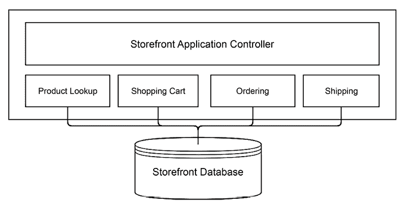
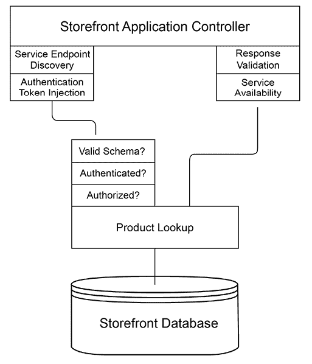
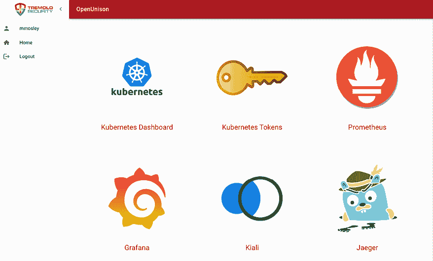

# 17

# 在 Istio 上构建和部署应用程序

在上一章中，我们将 Istio 和 Kiali 部署到了我们的集群中。我们还部署了一个示例应用程序，以查看各个部分如何组合。在本章中，我们将探讨构建能够在 Istio 上运行的应用程序所需要的内容。我们将从比较微服务和单体应用程序的区别开始。然后，我们将在 Istio 上部署一个单体应用程序，接着构建在 Istio 上运行的微服务。本章将涵盖以下主要内容：

+   微服务与单体架构的比较

+   部署单体应用

+   构建微服务

+   我是否需要 API 网关？

完成本章后，你将实际理解单体应用与微服务之间的区别，并掌握决定选择哪种架构的相关信息，你还将成功地在 Istio 中部署一个安全的微服务。

# 技术要求

要运行本章中的示例，你需要：

+   一个已部署 Istio 的运行集群，如*第十六章*《Istio 简介》中所述。

+   来自本书 GitHub 仓库的脚本。

你可以通过访问本书的 GitHub 仓库来获取本章的代码：[`github.com/PacktPublishing/Kubernetes-An-Enterprise-Guide-Third-Edition/tree/main/chapter17`](https://github.com/PacktPublishing/Kubernetes-An-Enterprise-Guide-Third-Edition/tree/main/chapter17)。

# 微服务与单体架构的比较

在深入代码之前，我们应花一些时间讨论微服务和单体架构的区别。微服务与单体架构的争论几乎与计算机本身的历史一样久远（而且这一理论可能更久远）。理解这两种方法如何相互关联以及与问题集的关系，将帮助你决定使用哪种方法。

## 我与微服务与单体架构的历史

在我们深入讨论微服务与单体架构之前，我想分享一下我自己的历史。我怀疑这并不独特，但它确实为我对这一讨论的看法提供了框架，并为本章中的建议提供了一些背景。

我第一次接触这个讨论是当我还是一名计算机科学专业的大学生，并开始使用 Linux 和开源软件时。我最喜欢的书之一，《开放源代码：开源革命的声音》，书中附录讨论了 Andrew Tanenbaum 与 Linus Torvalds 关于微内核与单体内核的争论。Tanenbaum 是 Minix 的发明者，他支持简约内核，大多数功能在用户空间中完成。而 Linux 则使用单体内核设计，更多的功能是在内核中完成的。如果你曾经运行过`modprobe`来加载驱动程序，那么你就是在与内核交互！完整的讨论可以在[`www.oreilly.com/openbook/opensources/book/appa.xhtml`](https://www.oreilly.com/openbook/opensources/book/appa.xhtml)查看。

Linus 的核心论点是，管理良好的单体架构比微内核更容易维护。

Tanenbaum 则指出，微内核更容易移植，而且大多数“现代”内核都是微内核。Windows（当时是 Windows NT）今天可能是最普遍的微内核。作为软件开发者，我一直在努力找到我可以构建的最小单元。微内核架构真的很吸引我这一方面的才能。

与此同时，我开始了我的 IT 职业生涯，主要作为数据管理和分析领域的 Windows 开发人员。我大部分时间都在使用**ASP**（**Active Server Pages**，微软版的 PHP）、Visual Basic 和 SQL Server。我试图说服我的老板，我们应该从单体应用设计转向使用**MTS**（**Microsoft Transaction Server**）。MTS 是我第一次接触到今天我们所称的分布式应用。我的老板和导师们都指出，如果我们为了更干净的代码库而注入额外的基础设施，那我们的成本，进而客户的成本，将会飙升。没有什么我们在做的事情是不能用我们紧密结合的 ASP、Visual Basic 和 SQL Server 三者组合以更低成本完成的。

后来，我从数据管理转到了身份管理。我也从微软技术转向了 Java。我的第一个项目之一是部署一个基于分布式架构构建的身份管理厂商的产品。当时，我认为这很好，直到我开始尝试调试问题并在数十个日志文件中追踪问题。我很快开始使用另一家厂商的产品，它是一个单体架构。尽管部署速度较慢，因为需要完全重新编译，但除此之外，管理要容易得多，而且它的扩展性也同样很好。我们发现，分布式架构并没有带来帮助，因为身份管理是由一个高度集中的团队完成的，采用单体架构并不会影响生产力或管理。将实现分布的好处并不足以抵消额外的复杂性。

快进到 Tremolo Security 的成立。那是在 2010 年，也就是 Kubernetes 和 Istio 出现之前。那时，虚拟设备正风靡一时！我们决定 OpenUnison 采用单体架构，因为我们希望简化部署和升级。在*第六章*，*将身份认证集成到集群中*，我们使用一些 Helm 图表部署了 OpenUnison，以便在不同配置上叠加。假如有一个身份认证服务需要安装，一个目录服务，一个即时配置服务等等，难度会增加多少呢？有一个系统来部署，简化了部署过程。

说到这里，并不是说我反对微服务——我并不反对！当正确使用时，它是一种非常强大的架构，许多世界上最大的公司都在使用它。多年来我学到的是，如果它不是你的系统的合适架构，它会显著影响你的交付能力。现在我已经跟你分享了我在架构方面的历程，让我们更深入地了解微服务和单体架构之间的区别。

## 比较应用中的架构

首先，让我们谈谈这两种架构方法在一个常见示例应用——店面中的作用。

### 单体应用设计

假设你有一个在线商店。你的商店可能需要一个产品查找服务、一个购物车、一个支付系统和一个运输系统。这是一个对店面应用的极度简化，但讨论的重点是如何拆分开发，而不是如何构建一个店面。你可以通过两种方式来构建这个应用。第一种是构建一个单体应用，其中每个服务的所有代码都存储并管理在同一个树结构中。你的应用架构可能看起来像这样：



图 17.1：单体应用架构

在我们的应用中，我们有一个单一的系统，包含多个模块。根据你选择的编程语言，这些模块可能是类、结构体或其他形式的代码模块。一个中央应用程序管理用户与这些代码的交互。这通常是一个网页前端，模块则是服务器端代码，编写为 Web 服务或请求/响应风格的应用。

是的，Web 服务可以在单体架构中使用！这些模块通常需要存储数据，通常是某种形式的数据库。无论是关系型数据库、文档型数据库，还是一系列数据库，其实并不重要。

这种单体架构最大的优势是它相对容易管理，且系统之间可以互相交互。如果用户想进行产品搜索，店面可能只需执行以下类似的代码：

```
list_of_products = products.search(search_criteria);
display(list_of_products); 
```

应用代码只需要知道它将要调用的服务的接口。无需“验证”从应用控制器到产品目录模块的调用。也无需担心创建速率限制系统或试图弄清楚使用哪个版本的服务。一切都紧密绑定。如果你对任何系统进行了更新，你很快就会知道是否破坏了接口，因为你可能使用了一个开发工具，当模块接口出现问题时，它会告诉你。最后，部署通常也非常简单。你只需要将代码上传到部署服务（或者创建容器……毕竟这是一本 Kubernetes 书！）。

如果你需要一个开发者更新订单系统，而另一个开发者更新支付系统怎么办？他们各自有自己的代码副本，必须合并。在合并之后，两个分支的更改需要在部署之前进行对账。这对于一个小系统可能没问题，但随着你的商店前端不断扩展，这可能会变得繁琐，甚至无法管理。

另一个潜在的问题是，如果有比整个应用程序更合适的语言或系统来构建其中的某个服务怎么办？多年来，我参与了多个项目，在一些组件上 Java 是一个不错的选择，而在其他组件上 C# 提供了更好的 API。也许一个服务团队是基于 Python 构建的，另一个则是基于 Ruby 的。标准化本是好事，但为了标准化，你不会用螺丝刀的尾端来钉钉子吧？

这个论点与前端和后端无关。一个具有 JavaScript 前端和 Golang 后端的应用程序仍然可以是一个单体应用程序。Kubernetes Dashboard 和 Kiali 都是构建在跨语言服务 API 上的单体应用程序示例。它们都有 HTML 和 JavaScript 前端，而后端 API 则是用 Golang 编写的。

### 微服务设计

如果我们将这些模块拆分成服务会怎样？我们不再有一个单一的源代码树，而是将应用程序拆分成如下所示的独立服务：


图 17.2：简单的微服务架构

这看起来并不复杂。与其说是一个大框框，不如说是一堆线条。让我们放大看一下前端到产品查询服务的调用：



图 17.3：服务调用架构

这不再是一个简单的函数或方法调用了。现在，我们的商店控制器需要确定将服务调用发送到哪里，这可能会在每个环境中有所不同。它还需要注入某种认证令牌，因为你不希望任何人都能调用你的服务。由于远程服务不再有本地代码表示，你要么需要手动构建调用，要么使用架构语言来描述你的产品列表服务，并将其与客户端绑定结合起来。一旦调用发出，服务需要验证调用的架构，并应用认证和授权的安全规则。响应被打包并发送回商店控制器后，控制器需要验证响应的架构。如果失败，它需要决定是否重试。

将所有这些额外的复杂性与版本管理结合起来。我们的前端应该使用哪个版本的产品查找服务？其他服务是否紧密耦合在一起？正如我们之前讨论的，微服务方法在版本和部署管理方面有几个好处。这些优势伴随着额外复杂性的代价。

### 选择单体架构还是微服务

这两种方法哪种适合你？这实际上取决于你的团队是什么样的？你的管理需求是什么？你是否需要微服务带来的灵活性，还是单体架构更简单的设计能够让系统更容易管理？

微服务架构的一个主要优点是，你可以让多个团队在自己的代码上工作，而无需共享同一个源代码仓库。在假设将服务拆分到各自的源代码仓库对你的团队有益之前，这些服务的耦合程度如何？如果服务之间有大量的相互依赖，那么你的微服务其实就是一个分布式的单体架构，你可能无法享受到不同仓库带来的好处。管理分支并将它们合并可能会更容易。

此外，你的服务是否需要被其他系统调用？回顾我们在上一章构建的集群，Kiali 有自己的服务，但这些服务不太可能被其他应用程序使用。然而，Jaeger 和 Prometheus 确实有被 Kiali 使用的服务，即使这些系统也有自己的前端。除了这些服务，Kiali 还使用了 Kubernetes API。所有这些组件都是单独部署和管理的，需要独立升级、监控等。这可能会带来管理上的头痛，因为每个系统都是独立管理和维护的。话虽如此，Kiali 团队重新实现 Prometheus 和 Jaeger 并没有任何意义。将这些项目的整个源代码导入并强迫保持更新也没有意义。

### 使用 Istio 来帮助管理微服务

我们已经花了相当多的时间讨论微服务和单体架构，但却没有提到 Istio。在本章前面，*图 17.3* 指出了在我们调用代码之前，微服务所需要做出的决策。

这些应该很熟悉，因为我们在上一章已经讨论了 Istio 中的对象，它们可以满足大部分需求！Istio 可以消除我们编写代码来进行客户端身份验证和授权、发现服务运行位置以及管理流量路由的需求。在本章的其余部分，我们将通过构建一个小型应用程序来演示如何利用微服务，并使用 Istio 来利用这些常见服务，而无需将它们构建到我们的代码中。

到目前为止，我们已经了解了单体应用和微服务之间的区别，以及这些区别如何在概念上与 Istio 进行交互。接下来，我们将看到如何将单体应用部署到 Istio 中。

# 部署单体应用

本章内容是关于微服务的，那么为什么我们从在 Istio 中部署单体应用开始呢？第一个答案是，因为我们可以！在集群中使用单体应用时，完全没有理由不享受 Istio 内置功能的好处。即使它不是“微服务”，但能够追踪应用请求、管理部署等依然很有用。第二个答案是，因为我们需要这么做。我们的微服务需要知道在我们的企业中是哪个用户在调用它。为了做到这一点，Istio 需要一个 JWT 来验证。我们将首先使用 OpenUnison 生成 JWT，以便我们可以手动调用服务，然后我们可以从前端进行用户身份验证，并确保安全地调用我们的服务。

从*第十六章*开始，我们现在要部署 OpenUnison。进入`chapter17/openunison-istio`目录，并运行`deploy_openunison_istio.sh`：

```
cd chapter17/openunison-istio
./deploy_openunison_istio.sh 
```

这将需要一段时间来运行。这个脚本做了几件事：

1.  使用我们的企业 CA 部署`cert-manager`。

1.  部署所有 OpenUnison 组件（包括我们的测试 Active Directory）用于模拟，因此我们不需要担心更新 API 服务器以使 SSO 工作。

1.  给`openunison`命名空间打上`istio-injection: enabled`标签。这告诉 Istio 为所有 Pod 启用 sidecar 注入。你可以通过运行`kubectl label ns openunison istio-injection=enabled`手动完成此操作。

1.  为我们创建所有的 Istio 对象（接下来我们将详细介绍这些对象）。

1.  在`istio-system`命名空间中创建一个`ou-tls-certificate`证书。再次说明，为什么要这么做我们将在下一节详细探讨。

一旦脚本运行完毕，我们现在可以登录到我们的单体应用了！就像在*第六章*中提到的，*将身份验证集成到集群中*，访问`https://k8sou.apps.XX-XX-XX-XX.nip.io/`进行登录，其中`XX-XX-XX-XX`是你主机的 IP 地址。

比如说，我的主机的 IP 地址是`192.168.2.114`，因此我的 URL 是`https://k8sou.apps.192-168-2-114.nip.io/`。同样，正如在*第六章*中提到的，用户名是`mmosley`，密码是`start123`。

现在我们的单体应用已经部署好了，让我们一步一步地了解与部署相关的 Istio 特定配置。

## 将我们的单体应用暴露到集群外部

我们的 OpenUnison 已经在运行，让我们来看看将它暴露到网络中的对象。完成这项工作的有两个主要对象：`Gateway`和`VirtualService`。这些对象是在我们安装 OpenUnison 时创建的。如何配置这些对象已经在*第十六章*，*Istio 简介*中描述过。接下来，我们将查看正在运行的实例，展示它们如何授予访问权限。首先，让我们来看一下网关的关键部分。有两个网关，第一个是`openunison-gateway-orchestra`，它负责访问 OpenUnison 门户和 Kubernetes 仪表板：

```
apiVersion: networking.istio.io/v1beta1
kind: Gateway
metadata:
spec:
  selector:
    istio: ingressgateway
  servers:
  - hosts:
    - k8sou.apps.192-168-2-114.nip.io
    - k8sdb.apps.192-168-2-114.nip.io
    port:
      name: http
      number: 80
      protocol: HTTP
    tls:
      httpsRedirect: true
  - hosts:
    - k8sou.apps.192-168-2-114.nip.io
    - k8sdb.apps.192-168-2-114.nip.io
    port:
      name: https-443
      number: 443
      protocol: HTTPS
    tls:
      credentialName: ou-tls-certificate
      mode: SIMPLE 
```

`selector`告诉 Istio 要与哪个`ingress-ingressgateway` pod 进行交互。部署到`istio-system`的默认网关具有标签`istio: ingressgateway`，它将与这个网关匹配。你可以运行多个网关，使用这个部分来确定你希望将服务暴露给哪一个。如果你有多个网络并且流量不同，或者你想要在集群中分隔应用之间的流量，这将非常有用。

`servers`列表中的第一个条目告诉 Istio，如果请求通过 HTTP 进入端口`80`，并且目标是我们的任一主机，那么我们希望 Istio 将请求重定向到 HTTPS 端口。这是一种良好的安全实践，因此大家不要试图绕过 HTTPS。`servers`中的第二个条目告诉 Istio 接受端口`443`上的 HTTPS 连接，并使用名为`ou-tls-certificate`的`Secret`中的证书。这个`Secret`必须是 TLS 类型的`Secret`，并且必须与运行入口网关的 pod 位于同一命名空间。对于我们的集群，这意味着`ou-tls-certificate`*必须*位于`istio-system`命名空间中。这就是为什么我们的部署脚本在`istio-system`命名空间中创建了通配符证书。这与使用 NGINX 的`Ingress`对象不同，后者将 TLS `Secret`保留在与`Ingress`对象相同的命名空间中。

如果你没有将你的`Secret`放在正确的命名空间中，可能会很难调试。你首先会注意到，当你尝试连接到主机时，浏览器会报告连接已被重置。这是因为 Istio 没有证书可以提供。Kiali 不会告诉你有配置问题，但通过查看`istio-system`中`istiod` pod 的日志，你会发现`failed to fetch key and certificate for kubernetes://secret-name`，其中`secret-name`是你的`Secret`的名称。一旦你将`Secret`复制到正确的命名空间中，应用程序就会开始在 HTTPS 上工作。

第二个网关是`openunison-api-gateway-orchestra`，用于通过 HTTPS 直接暴露 OpenUnison 的 API 服务器主机。这绕过了 Istio 的内建功能，因此除非有必要，否则我们不希望这样做。这个网关与我们的另一个网关的主要区别在于我们如何配置 TLS：

```
 - hosts:
    - k8sapi.192-168-2-114.nip.io
    port:
      name: https-443
      number: 443
      protocol: HTTPS
    tls:
**mode:****PASSTHROUGH** 
```

我们使用`PASSTHROUGH`作为`mode`，而不是`SIMPLE`。这告诉 Istio 不要费力去解密 HTTPS 请求，而是直接将其下游传送。我们必须为 Kubernetes API 调用这样做，因为 Envoy 不支持 kubectl 用于`exec`、`cp`和`port-forward`的 SPDY 协议，因此我们需要绕过它。当然，这也意味着我们失去了 Istio 的许多功能，所以如果能避免，最好不要这样做。

`Gateway`对象告诉 Istio 如何监听连接，而`VirtualService`对象则告诉 Istio 将流量发送到哪里。就像`Gateway`对象一样，这里有两个`VirtualService`对象。第一个对象处理 OpenUnison 门户和 Kubernetes 仪表盘的流量。以下是其中的重要部分：

```
spec:
  gateways:
  - openunison-gateway-orchestra
  hosts:
  - k8sou.apps.192-168-2-114.nip.io
  - k8sdb.apps.192-168-2-114.nip.io
  http:
  - match:
    - uri:
        prefix: /
    route:
    - destination:
        host: openunison-orchestra
        port:
          number: 80 
```

`gateways`部分告诉 Istio 要将这个配置链接到哪些`Gateway`对象。理论上，你可以有多个 Gateway 作为流量的来源。`hosts`部分告诉 Istio 将此配置应用于哪些主机名，而`match`部分则告诉 Istio 要根据什么条件匹配请求。对于微服务路由，这部分可以提供很大的灵活性，但对于单体应用，通常`/`就足够了。

最后，`route`部分告诉 Istio 将流量发送到哪里。`destination.host`是你想要发送流量的`Service`名称。我们将所有流量发送到端口`80`（大致如此）。

这个配置的 NGINX `Ingress`版本将所有流量发送到 OpenUnison 的 HTTPS 端口（`8443`）。这意味着所有数据都会在用户浏览器和 OpenUnison Pod 之间的网络传输中被加密。我们在这里并没有这样做，因为我们将依赖 Istio 的 sidecar 来进行 mTLS。

即使我们通过 HTTP 将流量发送到端口`80`，从流量离开`ingressgateway` Pod 直到到达 OpenUnison Pod 上的 sidecar 并拦截所有 OpenUnison 的入站网络连接之前，这些流量都会被加密。无需显式配置 TLS！

现在我们已经将流量从我们的网络路由到 OpenUnison，接下来我们来处理单体应用程序中的一个常见需求：粘性会话。

## 配置粘性会话

大多数单体应用程序都需要粘性会话。启用粘性会话意味着每个会话中的每个请求都会发送到同一个 pod。在微服务中通常不需要这种设置，因为每个 API 调用都是独立的。用户交互的 Web 应用程序通常需要管理状态，通常是通过 cookies。但这些 cookies 通常不会存储整个会话的状态，因为它们会变得太大，并且可能包含敏感信息。相反，大多数 Web 应用程序使用指向服务器上保存的会话（通常在内存中）的 cookie。虽然有一些方法可以确保该会话对应用程序的任何实例都可用，且具有高可用性，但这样做并不常见。这些系统维护成本较高，通常不值得投入过多精力。

OpenUnison 和大多数其他 Web 应用程序一样，需要确保会话与其来源的 pod 保持粘性。为了告诉 Istio 如何管理会话，我们使用 `DestinationRule`。`DestinationRule` 对象告诉 Istio 在通过 `VirtualService` 路由到主机的流量中应该做什么。以下是我们规则中的重要部分：

```
spec:
  host: openunison-orchestra
  trafficPolicy:
    loadBalancer:
      consistentHash:
        httpCookie:
          name: openunison-orchestra
          path: /
          ttl: 0s
    tls:
      mode: ISTIO_MUTUAL 
```

规则中的 `host` 指的是流量的目标（`Service`），而不是原始 URL 中的主机名。`spec.trafficPolicy.loadBalancer.consistentHash` 告诉 Istio 我们希望如何管理粘性。大多数单体应用程序会希望使用 cookies。`ttl` 设置为 `0s`，因此该 cookie 被视为“会话 cookie”。这意味着当浏览器关闭时，cookie 会从浏览器的 cookie 存储中消失。

应避免使用具有特定生存时间的 cookies。这些 cookies 会被浏览器持久化，并且可能被贵企业视为安全风险。

OpenUnison 启动并运行，且了解了 Istio 的集成方式后，让我们来看一下 Kiali 会如何向我们展示关于我们的单体应用的信息。

## 集成 Kiali 和 OpenUnison

首先，让我们整合 OpenUnison 和 Kiali。Kiali 和其他集群管理系统一样，应当配置为需要访问权限。Kiali 和 Kubernetes Dashboard 一样，可以与 impersonation 集成，这样 Kiali 将使用用户自己的权限与 API 服务器进行交互。完成这个操作相当简单。我们在 `chapter17/kiali` 文件夹中创建了一个名为 `integrate-kiali-openunison.sh` 的脚本，功能如下：

1.  删除 Kiali、Prometheus、Jaeger 和 Grafana 的旧网关和虚拟服务。

1.  更新 Grafana，以便接受来自 OpenUnison 的 SSO 头部信息。

1.  更新 Kiali 的 Helm chart，使用 `header` 作为 `auth.strategy`，并重启 Kiali 以应用更改。

1.  重新部署 OpenUnison，并集成 Kiali、Prometheus、Jaeger 和 Grafana 以实现单点登录（SSO）。

该集成的工作方式与仪表盘相同，但如果你对细节感兴趣，可以在 [`openunison.github.io/applications/kiali/`](https://openunison.github.io/applications/kiali/) 阅读相关内容。

集成完成后，让我们看看 Kiali 能告诉我们关于我们单体应用的哪些信息。首先，登录到 OpenUnison。你会在门户屏幕上看到新的徽章：



图 17.4：带有 Kiali、Prometheus、Grafana 和 Jaeger 徽章的 OpenUnison 门户

接下来，点击**Kiali**徽章打开 Kiali，然后点击**Graphs**，选择**openunison**命名空间。你将看到类似于以下的图表：


图 17.5：Kiali 中的 OpenUnison 图表

现在，你可以像查看微服务一样查看 OpenUnison、`apacheds`和其他容器之间的连接！说到这里，既然我们已经学习了如何将单体应用集成到 Istio 中，接下来让我们构建一个微服务，并学习它如何与 Istio 集成。

# 构建一个微服务

我们花了不少时间讨论单体应用。首先，我们讨论了哪种方法最适合你，然后我们花了一些时间展示如何将单体应用部署到 Istio 中，以从中获得许多微服务的好处。现在，让我们深入探讨构建和部署一个微服务。我们的微服务将会很简单。目标是展示微服务是如何构建并集成到一个应用中的，而不是如何基于微服务构建一个完整的应用程序。我们的书聚焦于企业应用，因此我们将专注于一个服务：

+   需要特定用户的身份验证

+   需要基于组成员资格或属性的特定用户授权

+   做了一些非常*重要*的事情

+   生成一些关于发生了什么的日志数据

这是企业应用程序及其构建服务中的常见情况。大多数企业需要能够将某些操作或决策与组织中的特定人员关联起来。如果下了订单，是谁下的？如果案件被关闭，是谁关闭的？如果支票被开出，是谁开的？当然，也有很多情况下，用户并不对某个操作负责。有时是另一个自动化的服务。一个拉取数据来创建仓库的批处理服务并不与特定人员关联。这是一个**交互式**服务，意味着预期终端用户与其进行交互，因此我们假设用户是企业中的一个人。

一旦你知道了谁将使用这个服务，接下来你需要确认用户是否有权使用该服务。在前一段中，我们已经确定了你需要知道“谁开了支票”。另一个重要的问题是，“他们有权开这张支票吗？”你肯定不希望组织中的任何人都能随便开支票，对吧？确定谁有权执行某个操作可能是多本书的内容，因此为了简单起见，我们将基于组成员身份做出授权决策，至少在高级别上是这样。

在确定了用户并授权之后，下一步就是做一些*重要*的事情。这是一个充满需要完成的重要事务的企业！因为写支票是我们都能理解的，并且代表了企业服务面临的许多挑战，我们将继续以此为例。我们将编写一个支票服务，允许我们发出支票。

最后，做完一些*重要*的事情后，我们需要进行记录。我们需要跟踪是谁调用了我们的服务，一旦服务完成了重要部分，我们还需要确保将这些信息记录在某个地方。这些记录可以存储在数据库或其他服务中，甚至可以发送到标准输出，以便日志聚合工具（如我们在*第十五章*中部署的 OpenSearch）收集。

在确定了我们的服务将做什么之后，下一步是确定我们的基础设施中哪一部分将负责每个决策和行动。对于我们的服务：

| **操作** | **组件** | **描述** |
| --- | --- | --- |
| 用户认证 | OpenUnison | 我们的 OpenUnison 实例将会验证用户的“Active Directory”身份 |
| 服务路由 | Istio | 我们将如何向外界暴露我们的服务 |
| 服务认证 | Istio | `RequestAuthentication` 对象将描述如何验证我们服务的用户 |
| 服务粗粒度授权 | Istio | `AuthorizationPolicy` 将确保用户是某个特定组的成员，从而能够调用我们的服务 |
| 细粒度授权或权利 | 服务 | 我们的服务将决定你能为哪些收款人开支票 |
| 写支票 | 服务 | 编写这个服务的目的！ |
| 记录是谁写了支票以及支票发给了谁 | 服务 | 将这些数据写入标准输出 |
| 日志聚合 | Kubernetes | 在生产环境中——使用像 OpenSearch 这样的工具 |

表 17.1：服务职责

我们将在接下来的部分中逐层构建这些组件。在深入讨论服务本身之前，我们需要先向世界打个招呼。

## 部署 Hello World

我们的第一个服务将是一个简单的 Hello World 服务，作为我们检查写入服务的起点。我们的服务是基于 Python 和 Flask 构建的。我们使用它是因为它相对简单，易于使用和部署。请进入 `chapter17/hello-world` 目录并运行 `deploy_helloworld.sh` 脚本。这将创建我们的 `Namespace`、`Deployment`、`Service` 和 `Istio` 对象。查看 `service-source ConfigMap` 中的代码。这是我们代码的主体，也是我们构建检查服务的框架。代码本身并不做太多的事情：

```
@app.route('/')
def hello():
    retVal = {
        "msg":"hello world!",
        "host":"%s" % socket.gethostname()
    }
    return json.dumps(retVal) 
```

这段代码接受所有对 `/` 的请求并运行我们的 `hello()` 函数，返回一个简单的响应。为了简化操作，我们将代码作为 `ConfigMap` 嵌入其中。

如果你已经阅读了所有前面的章节，你会注意到从安全角度来看，我们的这个容器违反了一些基本规则。它是一个以 root 身份运行的 Docker Hub 容器。现在这样是可以的，我们并不想在这一章中深入探讨构建过程。在*第十九章：构建开发者门户*中，我们将通过使用 GitLab 工作流来构建该服务的更安全版本的容器。

一旦我们的服务部署完成，我们可以通过使用 `curl` 来测试它：

```
$ curl http://service.192-168-2-114.nip.io/
{"msg": "hello world!", "host": "run-service-785775bf98-fln49"}% 
```

这段代码并不令人兴奋，但接下来我们将为我们的服务增加一些安全性。

## 将身份验证集成到我们的服务中

在 *第十六章：Istio 简介* 中，我们介绍了 `RequestAuthentication` 对象。现在，我们将使用该对象来强制执行身份验证。我们希望确保访问我们的服务时，你必须拥有一个有效的 JWT。在前面的示例中，我们直接调用了我们的服务。现在，我们希望只有在请求中嵌入有效的 JWT 时，才能收到响应。我们需要确保将我们的 `RequestAuthentication` 与一个 `AuthorizationPolicy` 配对，这样 Istio 才会强制要求 JWT；否则，Istio 将只会拒绝不符合我们 `RequestAuthentication` 的 JWT，而允许没有 JWT 的请求。

即使在我们配置对象之前，我们也需要从某个地方获取 JWT。我们将使用 OpenUnison。为了与我们的 API 一起使用，让我们部署我们在 *第六章：将身份验证集成到集群中* 中部署的管道令牌生成图表。进入 `chapter6/pipelines` 目录并运行 Helm 图表：

```
$ helm install orchestra-token-api token-login -n openunison -f /tmp/openunison-values.yaml
NAME: orchestra-token-api
LAST DEPLOYED: Tue Aug 31 19:41:30 2021
NAMESPACE: openunison
STATUS: deployed
REVISION: 1
TEST SUITE: None 
```

这将为我们提供一个轻松从内部 Active Directory 生成 JWT 的方法。接下来，我们将部署实际的策略对象。进入 `chapter17/authentication` 目录并运行 `deploy-auth.sh`。它将如下所示：

```
$ ./deploy-auth.sh
secret/cacerts configured
pod "istiod-75d8d56b68-tm6b7" deleted
requestauthentication.security.istio.io/hello-world-auth created
authorizationpolicy.security.istio.io/simple-hellow-world created 
```

首先，我们创建了一个名为 `cacerts` 的 `Secret`，用于存储我们的企业 CA 证书，并重新启动 `istiod`。这将允许 `istiod` 与 OpenUnison 通信，以拉取 `jwks` 签名验证密钥。接下来，创建了两个对象。第一个是 `RequestAuthentication` 对象，第二个是简单的 `AuthorizationPolicy`。首先，我们将介绍 `RequestAuthentication`：

```
apiVersion: security.istio.io/v1
kind: RequestAuthentication
metadata:
  name: hello-world-auth
  namespace: istio-hello-world
spec:
  jwtRules:
  - audiences:
    - kubernetes
    issuer: https://k8sou.192-168-2-119.nip.io/auth/idp/k8sIdp
    jwksUri: https://k8sou.192-168-2-119.nip.io/auth/idp/k8sIdp/certs
    outputPayloadToHeader: User-Info
  selector:
    matchLabels:
      app: run-service 
```

这个对象首先指定了 JWT 需要如何格式化才能被接受。我们这里有点作弊，直接利用我们的 Kubernetes JWT。让我们将这个对象与我们的 JWT 进行比较：

```
{
  "iss": "https://k8sou.192-168-2-119.nip.io/auth/idp/k8sIdp",
  "aud": "kubernetes",
  "exp": 1630421193,
  "jti": "JGnXlj0I5obI3Vcmb1MCXA",
  "iat": 1630421133,
  "nbf": 1630421013,
  "sub": "mmosley",
  "name": " Mosley",
  "groups": [
    "cn=group2,ou=Groups,DC=domain,DC=com",
    "cn=k8s-cluster-admins,ou=Groups,DC=domain,DC=com"
  ],
  "preferred_username": "mmosley",
  "email": "mmosley@tremolo.dev"
} 
```

我们 JWT 中的`aud`声明与`RequestAuthentication`中的受众对齐。`iss`声明与`RequestAuthentication`中的`issuer`对齐。如果这两个声明中的任何一个不匹配，Istio 将返回`401` HTTP 错误代码，告诉你请求未经授权。

我们还指定了`outputPayloadToHeader: User-Info`，告诉 Istio 将用户信息作为 base64 编码的 JSON 头传递给下游服务，头部名称为`User-Info`。我们的服务可以使用这个头部来识别谁调用了它。当我们进入权限授权时，我们将详细介绍这一点。

此外，`jwksUri`部分指定了包含用于验证 JWT 的 RSA 公钥的 URL。这个 URL 可以通过首先访问发行者的 OIDC 发现 URL 并从`jwks`声明中获取。

请注意，`RequestAuthentication`对象会告诉 Istio JWT 需要采取什么形式，但不会指定需要包含哪些用户数据。我们将在接下来的授权部分进行介绍。

说到授权，我们希望确保强制要求 JWT，因此我们将创建一个非常简单的`AuthorizationPolicy`：

```
apiVersion: security.istio.io/v1
kind: AuthorizationPolicy
metadata:
  name: simple-hellow-world
  namespace: istio-hello-world
spec:
  action: ALLOW
  rules:
  - from:
    - source:
        requestPrincipals:
        - '*'
  selector:
    matchLabels:
      app: run-service 
```

`from`部分表示必须有一个`requestPrincipal`。这告诉 Istio 必须有一个用户（在这种情况下，匿名用户不是用户）。`requestPrincipal`来自 JWT，表示用户。还有一个`principal`配置，但它表示调用我们 URL 的服务，在这种情况下会是`ingressgateway`。这告诉 Istio，用户必须通过 JWT 进行身份验证。

在我们有了策略之后，接下来可以进行测试。首先，测试没有用户的情况：

```
curl -v http://service.192-168-2-119.nip.io/
*   Trying 192.168.2.119:80...
* TCP_NODELAY set
* Connected to service.192-168-2-119.nip.io (192.168.2.119) port 80 (#0)
> GET / HTTP/1.1
> Host: service.192-168-2-119.nip.io
> User-Agent: curl/7.68.0
> Accept: */*
>
* Mark bundle as not supporting multiuse
< HTTP/1.1 403 Forbidden
< content-length: 19
< content-type: text/plain
< date: Tue, 31 Aug 2021 20:23:14 GMT
< server: istio-envoy
< x-envoy-upstream-service-time: 2
<
* Connection #0 to host service.192-168-2-119.nip.io left intact 
```

我们可以看到请求被拒绝，并返回了`403` HTTP 代码。收到`403`是因为 Istio 期望一个 JWT，但请求中没有 JWT。接下来，让我们按照*第六章*中的方式生成一个有效的令牌，《将身份验证集成到集群中》：

```
curl -H "Authorization: Bearer $(curl --insecure -u 'mmosley:start123' https://k8sou.apps.192-168-2-119.nip.io/k8s-api-token/token/user 2>/dev/null| jq -r '.token.id_token')" http://service.192-168-2-119.nip.io/ 
{"msg": "hello world!", "host": "run-service-785775bf98-6bbwt"} 
```

现在，我们成功了！我们的 Hello World 服务现在要求进行正确的身份验证。接下来，我们将更新授权，要求来自 Active Directory 的特定组。

## 授权访问我们的服务

到目前为止，我们已经构建了一个服务，并确保用户在访问之前从身份提供者获得有效的 JWT。

现在，我们希望应用通常称为“粗粒度”授权的方式。这是应用层或服务级别的访问控制。它的意思是：“你通常可以使用此服务”，但并未说明你是否可以执行你希望进行的操作。对于我们的支票写作服务，你可能被授权写支票，但可能有更多的控制措施限制你可以为谁写支票。如果你负责企业中的**企业资源规划**（**ERP**）系统，你可能不应该能够为设施供应商写支票。我们将在下一部分讨论如何让服务管理这些业务级别的决策，但现在，我们将重点讨论服务级别的授权。

结果证明我们已经具备了所有需要的信息。之前，我们查看了`mmosley`用户的 JWT，其中包含多个声明。其中一个声明是`groups`声明。我们在*第六章*、*将身份验证集成到集群中*和*第七章*、*RBAC 策略与审计*中使用了该声明来管理对集群的访问。以类似的方式，我们将根据是否属于特定组来管理谁可以访问我们的服务。首先，我们将删除现有策略：

```
kubectl delete authorizationpolicy simple-hellow-world -n istio-hello-world
authorizationpolicy.security.istio.io "simple-hellow-world" deleted 
```

禁用该策略后，你现在可以在没有 JWT 的情况下访问服务。接下来，我们将创建一个策略，要求你是 Active Directory 中`cn=group2,ou=Groups,DC=domain,DC=com`组的成员。

部署以下策略（在`chapter17/coursed-grained-authorization/coursed-grained-az.yaml`中）：

```
---
apiVersion: security.istio.io/v1
kind: AuthorizationPolicy
metadata:
  name: service-level-az
  namespace: istio-hello-world
spec:
  action: ALLOW
  selector:
    matchLabels:
      app: run-service
  rules:
  - when:
    - key: request.auth.claims[groups]
      values: ["cn=group2,ou=Groups,DC=domain,DC=com"] 
```

该策略告诉 Istio，只有具有名为`groups`且值为`cn=group2,ou=Groups,DC=domain,DC=com`的声明的用户才能访问此服务。部署此策略后，你会发现你仍然可以以`mmosley`身份访问服务，匿名访问服务仍然失败。接下来，尝试以`jjackson`身份访问服务，使用相同的密码：

```
curl -H "Authorization: Bearer $(curl --insecure -u 'jjackson:start123' https://k8sou.192-168-2-119.nip.io/k8s-api-token/token/user 2>/dev/null| jq -r '.token.id_token')" http://service.192-168-2-119.nip.io/
RBAC: access denied 
```

我们无法以`jjackson`身份访问该服务。如果我们查看`jjackson`的`id_token`，就能明白原因：

```
{
  "iss": "https://k8sou.192-168-2-119.nip.io/auth/idp/k8sIdp",
  "aud": "kubernetes",
  "exp": 1630455027,
  "jti": "Ae4Nv22HHYCnUNJx780l0A",
  "iat": 1630454967,
  "nbf": 1630454847,
  "sub": "jjackson",
  "name": " Jackson",
**"groups":****"cn=k8s-create-ns,ou=Groups,DC=domain,DC=com"****,**
  "preferred_username": "jjackson",
  "email": "jjackson@tremolo.dev"
} 
```

查看声明后，`jjackson`并不是`cn=group2,ou=Groups,DC=domain,DC=com`组的成员。

现在我们能够告诉 Istio 如何限制服务的访问权限，仅允许有效用户访问，下一步是告诉我们的服务用户是谁。然后，我们将使用这些信息查找授权数据、记录操作，并代表用户进行操作。

## 告诉你的服务谁在使用它

在编写涉及用户的服务时，首先需要确定的是：“谁在尝试使用我的服务？”到目前为止，我们已经告诉 Istio 如何确定用户身份，但我们如何将该信息传递给我们的服务呢？我们的`RequestAuthentication`包含了配置选项`outputPayloadToHeader: User-Info`，该选项将用户身份验证令牌中的声明作为 base64 编码的 JSON 注入到 HTTP 请求的头部。这些信息可以从该头部提取，并由你的服务用来查找额外的授权数据。

我们可以通过我们构建的一个名为`/headers`的服务查看此头信息。该服务将返回传递给我们服务的所有头信息。让我们来看看：

```
curl  -H "Authorization: Bearer $(curl --insecure -u 'mmosley:start123' https://k8sou.192-168-2-119.nip.io/k8s-api-token/token/user 2>/dev/null| jq -r '.token.id_token')" http://service.192-168-2-119.nip.io/headers 2>/dev/null | jq -r '.headers'
Host: service.192-168-2-119.nip.io
User-Agent: curl/7.75.0
Accept: */*
X-Forwarded-For: 192.168.2.112
X-Forwarded-Proto: http
X-Request-Id: 6397d068-537e-94b7-bf6b-a7c649db5b3d
X-Envoy-Attempt-Count: 1
X-Envoy-Internal: true
X-Forwarded-Client-Cert: By=spiffe://cluster.local/ns/istio-hello-world/sa/default;Hash=1a58a7d0abf62d32811c084a84f0a0f42b28616ffde7b6b840c595149d99b2eb;Subject="";URI=spiffe://cluster.local/ns/istio-system/sa/istio-ingressgateway-service-account
User-Info: eyJpc3MiOiJodHRwczovL2s4c291LjE5Mi0xNjgtMi0xMTkubmlwLmlvL2F1dGgvaWRwL2
s4c0lkcCIsImF1ZCI6Imt1YmVybmV0ZXMiLCJleHAiOjE2MzA1MTY4MjQsImp0aSI6InY0e
kpCNzdfRktpOXJoQU5jWDVwS1EiLCJpYXQiOjE2MzA1MTY3NjQsIm5iZiI6MTYzMDUxNj
Y0NCwic3ViIjoibW1vc2xleSIsIm5hbWUiOiIgTW9zbGV5IiwiZ3JvdXBzIjpbImNuPWdy
b3VwMixvdT1Hcm91cHMsREM9ZG9tYWluLERDPWNvbSIsImNuPWs4cy1jbHVzdGVyLWFkbW
lucyxvdT1Hcm91cHMsREM9ZG9tYWluLERDPWNvbSJdLCJwcmVmZXJyZWRfdXNlcm5hbWUi
OiJtbW9zbGV5IiwiZW1haWwiOiJtbW9zbGV5QHRyZW1vbG8uZGV2In0=
X-B3-Traceid: 28fb185aa113ad089cfac2d6884ce9ac
X-B3-Spanid: d40f1784a6685886
X-B3-Parentspanid: 9cfac2d6884ce9ac
X-B3-Sampled: 1 
```

这里有几个头信息。我们关心的是`User-Info`。这是我们在`RequestAuthentication`对象中指定的头信息名称。如果我们从 base64 解码，我们会得到一些 JSON：

```
{
  "iss": "https://k8sou.192-168-2-119.nip.io/auth/idp/k8sIdp",
  "aud": "kubernetes",
  "exp": 1630508679,
  "jti": "5VoEAAgv1rkpf1vOJ9uo-g",
  "iat": 1630508619,
  "nbf": 1630508499,
  "sub": "mmosley",
  "name": " Mosley",
  "groups": [
    "cn=group2,ou=Groups,DC=domain,DC=com",
    "cn=k8s-cluster-admins,ou=Groups,DC=domain,DC=com"
  ],
  "preferred_username": "mmosley",
  "email": "mmosley@tremolo.dev"
} 
```

我们拥有的所有声明就像我们自己解码令牌时得到的一样。我们没有的是 JWT。这从安全角度来看非常重要。我们的服务不能泄露它没有的令牌。

现在我们知道如何确定用户身份了，让我们将其集成到一个简单的`who-am-i`服务中，该服务只会告诉我们用户是谁。首先，让我们看看我们的代码：

```
@app.route('/who-am-i')
    def who_am_i():
      user_info = request.headers["User-Info"]
      user_info_json = base64.b64decode(user_info).decode("utf8")
      user_info_obj = json.loads(user_info_json)
      ret_val = {
        "name": user_info_obj["sub"],
        "groups": user_info_obj["groups"]
      }
      return json.dumps(ret_val) 
```

这非常基础。我们从请求中获取头信息。接下来，我们将其从 base64 解码，最后，我们得到 JSON 并将其添加到返回中。如果这是一个更复杂的服务，这时我们可能会查询数据库来确定用户拥有的权限。

除了不要求我们的代码知道如何验证 JWT 外，这还使得我们更容易在与 Istio 隔离的情况下开发代码。打开`run-service` pod 中的 shell，尝试使用任何用户直接访问这个服务：

```
kubectl exec -ti run-service-785775bf98-g86gl -n istio-hello-world – bash
# export USERINFO=$(echo -n '{"sub":"marc","groups":["group1","group2"]}' | base64 -w 0)
# curl -H "User-Info: $USERINFO" http://localhost:8080/who-am-i
{"name": "marc", "groups": ["group1", "group2"]} 
```

我们能够在不需要了解任何关于 Istio、JWT 或加密学的知识的情况下调用我们的服务！所有的工作都交给 Istio 处理，这样我们就可以专注于我们的服务。虽然这确实简化了开发，但如果存在一种方法可以将我们想要的任何信息注入到我们的服务中，这对安全性有什么影响呢？

让我们从一个没有 Istio sidecar 的命名空间直接尝试一下：

```
$ kubectl run -i --tty curl --image=alpine --rm=true – sh
/ # apk update add curl
/ # curl -H "User-Info $(echo -n '{"sub":"marc","groups":["group1","group2"]}' | base64 -w 0)" http://run-service.istio-hello-world.svc/who-am-i
RBAC: access denied 
```

我们的`RequestAuthentication`和`AuthorizationPolicy`阻止了请求。尽管我们没有运行 sidecar，但我们的服务正在运行，它将所有流量重定向到 Istio，在那里我们的策略将被执行。那么如果我们尝试从一个有效请求中注入自己的`User-Info`头信息呢？

```
export USERINFO=$(echo -n '{"sub":"marc","groups":["group1","group2"]}' | base64 -w 0)
curl  -H "Authorization: Bearer $(curl --insecure -u 'mmosley:start123' https://k8sou.192-168-2-119.nip.io/k8s-api-token/token/user 2>/dev/null| jq -r '.token.id_token')" -H "User-Info: $USERINFO" http://service.192-168-2-119.nip.io/who-am-i
{"name": "mmosley", "groups": ["cn=group2,ou=Groups,DC=domain,DC=com", "cn=k8s-cluster-admins,ou=Groups,DC=domain,DC=com"]} 
```

再一次，我们试图覆盖用户身份的行为（在有效的 JWT 之外）被 Istio 阻止了。我们已经展示了 Istio 如何将用户身份注入到我们的服务中；现在，我们需要了解如何授权用户的权限。

## 授权用户权限

到目前为止，我们已经在不编写任何代码的情况下为我们的服务添加了很多功能。我们增加了基于令牌的身份验证和粗粒度的授权。我们知道用户是谁，并且已经确定在服务层面，他们被授权调用我们的服务。接下来，我们需要决定用户是否被允许执行他们尝试做的特定操作。这通常被称为细粒度授权或权限。在这一部分，我们将讨论多种方法，并讨论你应该如何选择一种方法。

### 服务中的授权

与粗粒度的授权和身份验证不同，权限通常不在服务网格层面进行管理。但这并不意味着不可能做到。我们会讨论在服务网格中如何做，但一般来说，这不是最好的做法。授权通常与业务数据相关，这些数据通常存储在数据库中。有时，数据库是一个通用的关系型数据库，比如 MySQL 或 SQL Server，但它也可以是任何类型的数据库。由于用于做出授权决策的数据通常由服务拥有者而非集群拥有者管理，因此在代码中直接做出权限决策通常更简单、更安全。

之前，我们讨论过在我们的开支票服务中，我们不希望负责 ERP 的人向设施供应商开支票。那决定数据在哪里呢？很可能就在你企业的 ERP 系统中。根据你的企业规模，可能是自研的应用程序，也可能是 SAP 或 Oracle。假设你希望 Istio 为我们的开支票服务做出授权决策。它如何获取这些数据？你认为负责 ERP 的人希望你，作为集群拥有者，直接访问他们的数据库吗？作为集群拥有者，你愿意承担这个责任吗？如果 ERP 出现问题，且有人指责你造成了问题怎么办？你有足够的资源证明你和你的团队并不负责吗？

事实证明，企业中那些受益于微服务设计管理方面的独立模块也会对集中式授权产生不利影响。在我们确定谁可以为特定供应商开支票的例子中，最简单的做法可能就是在我们的服务内部做出这个决定。这样，如果出现问题，Kubernetes 团队就不需要负责确定问题所在，而负责的人可以掌控自己的命运。

这并不是说更集中式的授权方式就没有优势。让各个团队实现自己的授权代码会导致使用不同的标准和方法。如果没有严格的控制，可能会导致合规性问题。让我们看看 Istio 如何提供一个更强大的授权框架。

### 在 Istio 中使用 OPA

使用在*第十六章*《Istio 简介》中讨论的 Envoy 过滤器功能，你可以将**开放策略代理**（**OPA**）集成到你的服务网格中来做出授权决策。我们在*第十一章*《使用开放策略代理扩展安全性》中讨论了 OPA。我们需要回顾一下关于 OPA 的几个关键点：

+   OPA 通常不会向外部数据存储请求授权决策。OPA 的许多优势要求它使用自己的内部数据库。

+   OPA 的数据库是非持久化的。当 OPA 实例终止时，必须重新填充数据。

+   OPA 的数据库没有集群功能。如果您有多个 OPA 实例，每个数据库必须独立更新。

要使用 OPA 验证我们的用户是否可以为特定供应商开具支票，OPA 要么需要能够直接从 JWT 中拉取数据，要么需要将 ERP 数据复制到其自己的数据库中。前者由于多种原因不太可能实现。首先，当您的身份提供者尝试与 ERP 通信时，您的集群与 ERP 之间的问题仍然存在。其次，运行身份提供者的团队需要知道包括正确的数据，这是一个困难的任务，而且他们不太可能有兴趣去做。最后，可能会有许多人员（从安全到 ERP 团队）不愿意将这些数据存储在一个被传递的令牌中。后者，即将数据同步到 OPA，更有可能成功。

有两种方法可以将您的授权数据从 ERP 同步到 OPA 数据库。第一种是通过推送数据。一个“机器人”可以将更新推送到每个 OPA 实例。这种方式下，ERP 所有者负责推送数据，您的集群仅作为消费者。然而，这种方式没有简单的实现方法，安全性也会成为一个问题，必须确保没有人推送虚假数据。另一种选择是编写一个拉取“机器人”，作为 OPA pod 的副车运行。这就是 GateKeeper 的工作方式。这里的优势是，您可以负责保持数据同步，而无需构建一个推送数据的安全框架。

在这两种情况下，您都需要了解存储的数据是否存在任何合规性问题。现在您已经拥有数据，数据在泄露中丢失会带来什么影响？这是您想承担的责任吗？

集中化授权服务在 Kubernetes 或甚至 RESTful API 出现之前就已经被讨论过了。它们甚至比 SOAP 和 XML 还要早！对于企业应用而言，这种方式从未真正成功，因为数据管理、所有权以及打破孤岛所带来的额外成本。如果您拥有所有数据，这种方式非常合适。而当微服务的主要目标之一是让各个孤岛能够更好地管理自己的开发时，强迫使用集中化的授权引擎很可能无法成功。

尽管如此，已经出现了集中化授权服务的趋势。这个趋势催生了许多商业公司和项目，这些项目位于 OPA 之外：

+   **Cedar**：亚马逊网络服务（Amazon Web Services）推出的一个开源项目，旨在创建一种新的策略语言。亚马逊还基于这种语言创建了一个服务：[`github.com/cedar-policy`](https://github.com/cedar-policy)。

+   **Topaz**：基于 OPA 和 Zanzibar 构建，Topaz 为 OPA 授权引擎提供了来自 Zanzibar 的基于关系的授权。此外，还有一个商业产品：[`github.com/aserto-dev/topaz`](https://github.com/aserto-dev/topaz)。

+   **OpenFGA**：另一个基于 Zanzibar 关系授权系统构建的引擎，由 Auth0/Okta 构建：[`github.com/openfga`](https://github.com/openfga)。

我们不会深入探讨这些解决方案的细节；关键在于，已经有了一个明确的趋势，即构建授权解决方案，类似于外部身份验证已经成为一个产品和项目类别，历时数十年。

现在我们已经了解了创建集中式授权的一些问题，让我们为 Istio 使用 OPA 构建一个授权规则。

### 创建 OPA 授权规则

在本节前面，我们讨论了编写检查的规则。编写检查的常见规则是，编写支票的人也允许签署支票。这个规则称为“职责分离”。它旨在为潜在的有害和高成本的过程构建检查点。例如，如果允许一个员工既编写支票又签署支票，就没有机会有人询问支票是否用于有效的理由。

我们已经实现了一个验证用户组成员资格的 AuthorizationPolicy，但为了职责分离，我们需要实现一个规则来验证用户属于某个组，同时**不**属于另一个组。这样的复杂决策是通用 AuthorizationPolicy 无法实现的，因此我们需要构建我们自己的策略。我们可以使用 OPA 作为我们的授权引擎，同时指示 Istio 使用我们的策略。

在我们部署策略之前，让我们复查一下它。完整的策略位于 `chapter17/opa/rego` 中，并包含测试用例：

```
package istio.authz
import input.attributes.request.http as http_request
import input.parsed_path
default allow = false
contains_element(arr, elem) = true {
    arr[_] = elem
} else = false { true }
verify_headers() = payload {
    startswith(http_request.headers["authorization"], "Bearer ")
    [header, payload, signature] := io.jwt.decode(trim_prefix(http_request.headers["authorization"], "Bearer "))
} else = false {true}
allow {
    payload := verify_headers()   
    payload.groups
    contains_element(payload.groups,"cn=k8s-cluster-admins,ou=Groups,DC=domain,DC=com")
    not contains_element(payload.groups,"cn=group2,ou=Groups,DC=domain,DC=com")
}
allow {
    payload := verify_headers()   
    payload.groups
    payload.groups == "cn=k8s-cluster-admins,ou=Groups,DC=domain,DC=com"
} 
```

我们移除了注释，以使代码更加简洁。该策略的基本内容是：

1.  验证是否存在 `authorization` 头部。

1.  验证 `authorization` 头部是否为 `Bearer` 令牌。

1.  验证承载令牌是否为 JWT。

1.  解析 JWT 并验证是否包含 `groups` 声明。

1.  如果 `groups` 声明是一个列表，确保它包含 `k8s-cluster-admins` 组，但**不**包含 `group2` 组。

1.  如果 `groups` 声明不是列表，仅验证它是否为 `k8s-cluster-admins` 组。

我们正在验证授权头是否存在且格式正确，因为 Istio 不要求必须提供令牌才能通过身份验证。这是通过我们之前的 `AuthorizationPolicy` 实现的，无论是通过显式要求存在某个主体，还是通过隐式要求某个特定声明具有特定值。

一旦我们验证了授权头的格式正确，我们就会解析其负载。我们不会基于公钥、有效性或颁发者来验证 JWT，因为我们的 `RequestAuthentication` 对象会为我们完成这部分验证。我们只需要确保令牌存在。

最后，我们有两个潜在的 `allow` 策略。第一个是当 `groups` 声明是一个列表时，我们需要应用数组逻辑来检查是否存在正确的组，并且不存在被禁止的组。第二个 `allow` 策略会在 `groups` 声明不是列表，而只是一个单一值时触发。在这种情况下，我们只关心该组的值是否是我们的管理员组。

要部署此策略，请进入 `chapter17/opa` 目录并运行 `deploy_opa_istio.sh`。该脚本将启用授权并部署我们的策略：

1.  **配置 istiod**：更新存储网格配置的 `istio` `ConfigMap`，以启用 `envoyExtAuthzGrpc` 扩展提供程序。

1.  **部署 OPA 变异准入控制器**：部署一个变异准入控制器，自动在 pod 上创建 OPA 实例，与服务一起运行。

1.  **部署我们的策略**：我们之前创建的策略被作为 `ConfigMap` 创建。

1.  **重新部署我们的服务**：删除 pod，使其根据我们的授权策略重新创建。

1.  一旦所有内容都部署完成，我们现在可以使用 `curl` 命令验证我们的策略是否生效。如果我们现在尝试使用 `mmosley` 用户调用我们的头信息服务，它将失败，因为 `mmosley` 是 `k8s-cluster-admin` 组和 `group2` 组的成员：

```
$ curl -v -H "Authorization: Bearer $(curl --insecure -u 'mmosley:start123' https://k8sou.apps.192-168-2-96.nip.io/k8s-api-token/token/user 2>/dev/null| jq -r '.token.id_token')" http://service.192-168-2-96.nip.io/headers
*   Trying 192.168.2.96:80...
* Connected to service.192-168-2-96.nip.io (192.168.2.96) port 80
> GET /headers HTTP/1.1
> Host: service.192-168-2-96.nip.io
> User-Agent: curl/8.4.0
> Accept: */*
> Authorization: Bearer …
> 
< HTTP/1.1 403 Forbidden
< date: Tue, 27 Feb 2024 19:49:49 GMT
< server: istio-envoy
< content-length: 0
< x-envoy-upstream-service-time: 8
< 
* Connection #0 to host service.192-168-2-96.nip.io left intact 
```

然而，如果我们使用 `pipeline_svc_account` 用户，它会成功，因为该用户仅是 `k8s-cluster-admin` 组的成员：

```
$ curl -H "Authorization: Bearer $(curl --insecure -u 'pipeline_svc_account:start123' https://k8sou.apps.192-168-2-96.nip.io/k8s-api-token/token/user 2>/dev/null| jq -r '.token.id_token')" http://service.192-168-2-96.nip.io/headers 
{"headers": "Host: service.192-168-2-96.nip.io\r\nUser-Agent: curl/8.4.0\r\nAccept: */*\r\nX-Forwarded-For: 192.168.3.6\r\nX-Forwar… 
```

现在，我们可以构建比 Istio 的 `AuthorizationPolicy` 内置授权功能更复杂的策略。

确定了如何将授权集成到我们的服务中之后，我们需要回答的下一个问题是，如何安全地调用其他服务？

## 调用其他服务

我们编写了执行简单任务的服务，但当你的服务需要与另一个服务通信时怎么办？就像集群部署中的几乎所有其他选择一样，你有多种方式来验证对其他服务的身份。你选择哪种方式取决于你的需求。我们将首先介绍 OAuth2 标准的获取新令牌的方式及其如何与 Istio 配合使用。然后，我们将介绍一些应被视为反模式的替代方法，但你可能仍然选择使用它们。

### 使用 OAuth2 令牌交换

你的服务知道你的用户是谁，但需要调用另一个服务。你如何向第二个服务证明你的身份？OAuth2 规范（OpenID Connect 就是基于它）有 RFC 8693 – OAuth2 令牌交换用于此目的。基本思路是，你的服务将根据现有的用户，从身份提供商处获取新的令牌来进行服务调用。通过为你的远程服务调用获取新的令牌，你可以更容易地控制令牌的使用范围和使用者，从而更轻松地跟踪调用的身份验证和授权流程。以下图表提供了一个高层次的概述。


图 17.6：OAuth2 令牌交换序列

根据你的使用场景，有一些细节我们需要逐一说明：

1.  用户向身份提供者请求 `id_token`。在这一部分的序列中，用户如何获得令牌并不重要。我们将在实验中使用 OpenUnison 中的工具。

1.  假设你已通过身份验证并获得授权，身份提供者将为你提供一个带有 `aud` 声明的 `id_token`，该声明将被 Service-X 接受。

1.  用户将 `id_token` 作为持有令牌（bearer token）来调用 Service-X。不言而喻，Istio 将验证此令牌。

1.  Service-X 代表用户向身份提供者请求 Service-Y 的令牌。执行此操作有两种可能的方法，一种是模拟身份，另一种是委托身份。我们将在本节稍后详细讨论这两种方法。你将向身份提供者发送原始的 `id_token`，以及一些用于识别服务的内容。

1.  假设 Service-X 已获得授权，身份提供者将把一个新的 `id_token` 发送给 Service-X，该 `id_token` 包含原始用户的属性，并且 `aud` 作用域限定为 Service-Y。

1.  Service-X 在调用 Service-Y 时，将新的 `id_token` 作为 `Authorization` 头部传递。再次强调，Istio 会验证 `id_token`。

前面图示中的第 7 步和第 8 步在此并不重要。

如果你认为进行服务调用需要很多工作，那你是对的。这里有多个授权步骤在进行：

1.  身份提供者授权用户生成一个作用域限定为 Service-X 的令牌。

1.  Istio 验证该令牌，并确认其作用域正确，限定为 Service-X。

1.  身份提供者授权 Service-X 为 Service-Y 获取令牌，并为我们的用户执行此操作。

1.  Istio 验证 Service-X 为 Service-Y 使用的令牌是否具有正确的作用域。

这些授权点提供了拦截不正当令牌的机会，允许你创建短生命周期的令牌，这些令牌更难滥用且作用域更窄。例如，如果用于调用 Service-X 的令牌被泄露，它就无法单独用于调用 Service-Y。你仍然需要 Service-X 自己的令牌，才能获得用于 Service-Y 的令牌。这是攻击者需要额外采取的一步，才能控制 Service-Y。这也意味着需要突破多个服务，从而提供多层安全防护。这与我们在*第十一章* *使用 Open Policy Agent 扩展安全性* 中讨论的深度防御相一致。了解了 OAuth2 令牌交换的高层次工作原理后，接下来的问题是，你的服务将如何向身份提供者进行身份验证？

#### 验证你的服务

为了使令牌交换起作用，您的身份提供者需要知道原始用户是谁以及哪个服务想要代表用户交换令牌。在我们讨论的撰写支票服务示例中，您不希望提供今天午餐菜单的服务能够生成用于发放支票的令牌！通过确保您的身份提供者知道您的支票撰写服务与午餐菜单服务之间的区别，通过逐个验证每个服务来实现这一点。

Kubernetes 中运行的服务可以用三种方式进行身份验证：

1.  使用 Pod 的 `ServiceAccount` 令牌

1.  使用 Istio 的 mTLS 能力

1.  使用预共享的“客户端密钥”

在本节的其余部分，我们将专注于选项 #1，即使用 Pod 的内置 `ServiceAccount` 令牌。该令牌默认为每个运行中的 Pod 提供。您可以通过将其提交给 API 服务器的 `TokenReview` 服务或将其视为 JWT 并根据 API 服务器发布的公钥进行验证来验证该令牌。

在我们的示例中，我们将使用 `TokenReview` API 来测试传入的 `ServiceAccount` 令牌是否与 API 服务器匹配。这是最具向后兼容性的方法，并支持集成到您的集群中的任何类型的令牌。例如，如果您部署在具有自己 IAM 系统的托管云中，该系统挂载令牌，您也可以使用它。每次需要验证令牌时，都会将其发送到 API 服务器，这可能会对您的 API 服务器产生相当大的负载。

在 *第六章*，*将认证集成到您的集群中*中讨论的 `TokenRequest` API 可以用来减少这种额外的负载。而不是使用 `TokenReview` API，我们可以调用 API 服务器的发行者端点来获取适当的令牌验证公钥，并使用该密钥验证令牌的 JWT。虽然这很方便且扩展性更好，但它确实有一些缺点：

1.  从 1.21 开始，`ServiceAccount` 令牌使用 `TokenRequest` API 进行挂载，但生存期长达一年或更长时间。您可以手动将其更改为短至 10 分钟。

1.  直接使用公钥对 JWT 进行验证不会告诉您 Pod 是否仍在运行。如果与已删除 Pod 关联了 `ServiceAccount` 令牌，则 `TokenReview` API 将失败，从而增加了额外的安全层。

1.  启用此功能需要在您的集群中启用匿名身份验证，这可以用来通过错误配置的 RBAC 或潜在的错误提升权限。

我们不会使用 Istio 的 mTLS 功能，因为它不像令牌那样灵活。mTLS 主要用于集群内部通信，因此如果我们的身份提供者位于集群外部，使用起来会更为困难。此外，由于 mTLS 需要点对点连接，任何 TLS 终止点都会破坏其使用。由于企业系统托管自己的证书是很罕见的，即使在 Kubernetes 外部，也很难实现集群服务与身份提供者之间的 mTLS。

最后，我们不会在服务和身份提供者之间使用共享密钥，因为我们不需要这样做。共享密钥只在没有其他方式为工作负载赋予身份时才需要。由于 Kubernetes 为每个 Pod 提供自己的身份，因此我们不需要使用客户端密钥来识别我们的服务。

现在我们知道我们的服务将如何向身份提供者进行身份验证，接下来让我们通过一个使用 OAuth2 令牌交换的示例，来安全地从一个服务调用另一个服务。

#### 部署和运行支票写入服务

在讲解了使用令牌交换安全调用服务的理论之后，让我们部署一个示例的支票写入服务。当我们调用这个服务时，它将调用另外两个服务。第一个服务 `check-funds` 将使用 OAuth2 令牌交换的假冒配置，而第二个服务 `pull-funds` 将使用委托。我们将分别讲解每一个。首先，使用 Helm 部署一个身份提供者。进入 `chapter17` 目录并运行：

```
helm install openunison-service-auth openunison-service-auth -n openunison
NAME: openunison-service-auth
LAST DEPLOYED: Mon Sep 13 01:08:09 2021
NAMESPACE: openunison
STATUS: deployed
REVISION: 1
TEST SUITE: None 
```

我们不会深入讨论 OpenUnison 的配置。可以简单地说，这将为我们的服务设置一个身份提供者，并提供获取初始令牌的方式。接下来，部署 `write-checks` 服务：

```
cd write-checks/
./deploy_write_checks.sh
getting oidc config
getting jwks
namespace/write-checks created
configmap/service-source created
deployment.apps/write-checks created
service/write-checks created
gateway.networking.istio.io/service-gateway created
virtualservice.networking.istio.io/service-vs created
requestauthentication.security.istio.io/write-checks-auth created
authorizationpolicy.security.istio.io/service-level-az created 
```

在本章的第一个示例之后，这应该看起来非常熟悉。我们将我们的服务部署为 Python 并放入 `ConfigMap`，以及在之前的服务中创建的相同 Istio 对象。唯一的主要区别是在我们的 `RequestAuthentication` 对象中：

```
apiVersion: security.istio.io/v1beta1
kind: RequestAuthentication
metadata:
  name: write-checks-auth
  namespace: write-checks
spec:
  jwtRules:
  - audiences:
    - users
    - checkfunds
    - pullfunds
    forwardOriginalToken: true
    issuer: https://k8sou.apps.192-168-2-119.nip.io/auth/idp/service-idp
    jwksUri: https://k8sou.apps.192-168-2-119.nip.io/auth/idp/service-idp/certs
    outputPayloadToHeader: User-Info
  selector:
    matchLabels:
      app: write-checks 
```

还有一个额外的设置，`forwardOriginalToken`，它告诉 Istio 将用于认证调用的原始 JWT 发送给服务。我们需要这个令牌来证明我们应该尝试执行令牌交换。如果无法提供原始令牌，你就无法请求新令牌。这可以防止拥有服务 Pod 访问权限的人仅凭服务的 `ServiceAccount` 请求令牌。

在本章前面，我们提到过如果我们没有令牌，就不应该泄露它，因此我们不应该访问原始令牌。如果我们不需要它来为另一个服务获取令牌，那这是正确的。遵循最小权限原则，如果不需要，我们不应该转发令牌。在这种情况下，我们需要它进行令牌交换，因此为了实现更安全的服务间调用，增加的风险是值得的。

在我们部署了示例的支票写入服务后，接下来让我们运行它并倒推。和之前的示例一样，我们将使用`curl`来获取令牌并调用我们的服务。在`chapter17/write-checks`中，运行`call_service.sh`：

```
./call_service.sh
{
  "msg": "hello world!",
  "host": "write-checks-84cdbfff74-tgmzh",
  "user_jwt": "...",
  "pod_jwt": "...",
  "impersonated_jwt": "...",
  "call_funds_status_code": 200,
  "call_funds_text": "{\"funds_available\": true, \"user\": \"mmosley\"}",
  "actor_token": "...",
  "delegation_token": "...",
  "pull_funds_text": "{\"funds_pulled\": true, \"user\": \"mmosley\", \"actor\": \"system:serviceaccount:write-checks:default\"}"
} 
```

你看到的输出是调用`/write-check`后的结果，接着调用了`/check-funds`和`/pull-funds`。让我们逐步讲解每个调用、生成的令牌以及生成它们的代码。

#### 使用模拟认证

我们这里说的模拟认证不同于*第六章*中你在*将身份认证集成到集群中*时使用的模拟认证。虽然概念类似，但这次是针对令牌交换的。当`/write-check`需要获取令牌来调用`/check-funds`时，它会代表我们的用户`mmosley`向 OpenUnison 请求一个令牌。模拟认证的关键在于，生成的令牌中没有包含请求客户端的任何引用。`/check-funds`服务并不知道它接收到的令牌并不是用户自己获取的。从倒推的角度看，`impersonated_jwt`是我们服务调用响应中返回的内容，它是`/write-check`用来调用`/check-funds`的令牌。以下是将结果粘贴到`jwt.io`后的载荷：

```
{
  "iss": "https://k8sou.192-168-2-119.nip.io/auth/idp/service-idp",
  "aud": "checkfunds",
  "exp": 1631497059,
  "jti": "C8Qh8iY9FJdFzEO3pLRQzw",
  "iat": 1631496999,
  "nbf": 1631496879,
  "nonce": "bec42c16-5570-4bd8-9038-be30fd216016",
  "sub": "mmosley",
  "name": " Mosley",
  "groups": [
    "cn=group2,ou=Groups,DC=domain,DC=com",
    "cn=k8s-cluster-admins,ou=Groups,DC=domain,DC=com"
  ],
  "preferred_username": "mmosley",
  "email": "mmosley@tremolo.dev",
  "amr": [
    "pwd"
  ]
} 
```

这里有两个重要的字段是`sub`和`aud`。`sub`字段告诉`/check-funds`用户是谁，而`aud`字段则告诉 Istio 哪些服务可以使用此令牌。将其与`user_jwt`响应中的原始令牌载荷进行对比：

```
{
  "iss": "https://k8sou.192-168-2-119.nip.io/auth/idp/service-idp",
**"aud"****:****"users"****,**
  "exp": 1631497059,
  "jti": "C8Qh8iY9FJdFzEO3pLRQzw",
  "iat": 1631496999,
  "nbf": 1631496879,
**"sub"****:****"mmosley"****,**
  "name": " Mosley",
  "groups": [
    "cn=group2,ou=Groups,DC=domain,DC=com",
    "cn=k8s-cluster-admins,ou=Groups,DC=domain,DC=com"
  ],
  "preferred_username": "mmosley",
  "email": "mmosley@tremolo.dev",
  "amr": [
    "pwd"
  ]
} 
```

原始的`sub`是相同的，但`aud`不同。原始的`aud`是针对用户的，而模拟的`aud`是针对`checkfunds`的。这就是模拟的令牌与原始令牌之间的区别。尽管我们的 Istio 部署配置为接受同一服务的两种 audience，但在大多数生产集群中，这并不是一个保证。当我们调用`/check-funds`时，你会看到在输出中，我们回显了令牌的用户`mmosley`。

现在我们已经看到了最终产品，接下来我们来看一下如何获得它。首先，我们获取用于调用`/write-check`的原始 JWT：

```
# let's first get the original JWT. We'll
# use this as an input for impersonation
az_header = request.headers["Authorization"]
user_jwt = az_header[7:] 
```

一旦我们拥有了原始的 JWT，我们还需要 Pod 的`ServiceAccount`令牌：

```
# next, get the pod's ServiceAccount token
# so we can identify the pod to the IdP for
# an impersonation token
pod_jwt = Path('/var/run/secrets/kubernetes.io/serviceaccount/token').read_text() 
```

现在我们拥有了获取模拟令牌所需的一切。我们将创建一个 POST 主体和一个`Authorization`头部，以便向 OpenUnison 认证我们并获取令牌：

```
# with the subject (user) jwt and the pod
# jwt we can now request an impersonated
# token for our user from openunison
impersonation_request = {
  "grant_type":"urn:ietf:params:oauth:grant-type:token-exchange",
  "audience":"checkfunds",
  "subject_token":user_jwt,
  "subject_token_type":"urn:ietf:params:oauth:token-type:id_token",
  "client_id":"sts-impersonation"
}
impersonation_headers = {
  "Authorization": "Bearer %s" % pod_jwt
} 
```

我们创建的第一个数据结构是一个 HTTP POST 的主体，它将告诉 OpenUnison 为`clientfunds aud`生成一个模拟令牌，使用我们现有的用户（`user_jwt`）。OpenUnison 将通过验证在`Authorization`头部作为`Bearer`令牌发送的 JWT 来认证我们的服务，使用的是`TokenReview` API。

OpenUnison 将应用其内部策略，验证我们的服务是否能够为`mmosley`生成`clientfunds`受众的令牌，然后生成`access_token`、`id_token`和`refresh_token`。我们将使用`id_token`来调用`/check-funds`：

```
resp = requests.post("https://k8sou.apps.IPADDR.nip.io/auth/idp/service-idp/token",verify=False,data=impersonation_request,headers=impersonation_headers)
response_payload = json.loads(resp.text)
impersonated_id_token = response_payload["id_token"]
# with the impersonated user's id_token, call another
# service as that user
call_funds_headers = {
  "Authorization": "Bearer %s" % impersonated_id_token
}
resp = requests.get("http://write-checks.IPADDR.nip.io/check-funds",verify=False,headers=call_funds_headers) 
```

由于最终的 JWT 并未提及模拟身份，我们如何将请求追溯到我们的服务呢？希望你已经将日志发送到一个集中式日志系统。如果我们查看模拟令牌的 `jti` 声明，就可以在 OpenUnison 的日志中找到模拟调用：

```
INFO  AccessLog - [AzSuccess] - service-idp - https://k8sou.apps.192-168-2-119.nip.io/auth/idp/service-idp/token - username=system:serviceaccount:write-checks:default,ou=oauth2,o=Tremolo - client 'sts-impersonation' impersonating 'mmosley', jti : 'C8Qh8iY9FJdFzEO3pLRQzw' 
```

因此，我们至少有一种方式将它们联系起来。我们可以看到，我们的 Pod 服务账户被授权为 `mmosley` 创建了模拟令牌。

在通过模拟身份的示例后，让我们接下来讲解令牌委托。

#### 使用委托

在上一个示例中，我们使用模拟身份为用户生成了一个新令牌，但我们的下游服务并未意识到模拟身份的发生。委托不同之处在于，令牌携带了关于原始用户和请求它的服务或演员的信息。

这意味着被调用的服务既知道调用者的来源，也知道发起调用的服务。我们可以在 `call_service.sh` 执行结果的响应中的 `pull_funds_text` 值中看到这一点。它包含了我们原始的用户 `mmosley` 和发起调用的服务的 `ServiceAccount`，`system:serviceaccount:write-checks:default`。就像模拟身份一样，让我们看看生成的令牌：

```
{
  "iss": "https://k8sou.apps.192-168-2-119.nip.io/auth/idp/service-idp",
  "aud": "pullfunds",
  "exp": 1631497059,
  "jti": "xkaQhMgKgRvGBqAsOWDlXA",
  "iat": 1631496999,
  "nbf": 1631496879,
  "nonce": "272f1900-f9d9-4161-a31c-6c6dde80fcb9",
  "sub": "mmosley",
  "amr": [
    "pwd"
  ],
  "name": " Mosley",
  "groups": [
    "cn=group2,ou=Groups,DC=domain,DC=com",
    "cn=k8s-cluster-admins,ou=Groups,DC=domain,DC=com"
  ],
  "preferred_username": "mmosley",
  "email": "mmosley@tremolo.dev",
**"act"****:** **{**
**"sub"****:****"system:serviceaccount:write-checks:default"****,**
**"amr"****:** **[**
**"k8s-sa"**
 **]****,**
 **.**
 **.**
 **.**
 **}**
} 
```

除了标识用户为 `mmosley` 的声明外，还有一个 `act` 声明，用来标识 `/write-checks` 使用的 `ServiceAccount`。我们的服务可以根据这个声明做出额外的授权决策，或者仅仅记录下来，表明它接收到的令牌是委托给了另一个服务。为了生成这个令牌，我们首先获取原始主体的 JWT 和 Pod 的 `ServiceAccount` 令牌。

客户端在调用 OpenUnison 获取委托令牌之前，首先需要通过使用 `client_credentials` 授权方式获取一个演员令牌。这将为我们获取一个最终会进入 `act` 声明的令牌：

```
client_credentials_grant_request = {
  "grant_type": "client_credentials",
  "client_id" : "sts-delegation"
}
delegation_headers = {
  "Authorization": "Bearer %s" % pod_jwt
}
resp = requests.post("https://k8sou.IPADDR.nip.io/auth/idp/service-idp/token",verify=False,data=client_credentials_grant_request,headers=delegation_headers)
response_payload = json.loads(resp.text)
actor_token = response_payload["id_token"] 
```

我们使用 Pod 的原生身份对 OpenUnison 进行身份验证。OpenUnison 返回一个 `access_token` 和一个 `id_token`，但我们只需要 `id_token`。拿到我们的演员令牌后，现在可以获取我们的委托令牌：

```
delegation_request = {
  "grant_type":"urn:ietf:params:oauth:grant-type:token-exchange",
  "audience":"pullfunds",
  "subject_token":user_jwt,
  "subject_token_type":"urn:ietf:params:oauth:token-type:id_token",
  "client_id":"sts-delegation",
  "actor_token": actor_token,
  "actor_token_type": "urn:ietf:params:oauth:token-type:id_token"
}
resp = requests.post("https://k8sou.IPADDR.nip.io/auth/idp/service-idp/token",verify=False,data=delegation_request)
response_payload = json.loads(resp.text)
delegation_token = response_payload["id_token"] 
```

类似于模拟身份，在这个调用中，我们不仅发送了原始用户的令牌（`user_jwt`），还发送了我们刚从 OpenUnison 获得的 `actor_token`。我们同样不会发送 Authorization 头，因为 `actor_token` 已经完成了我们的身份验证。最终，我们能够使用返回的令牌来调用 `/pull-funds`。

现在我们已经看过了使用模拟身份和委托的最正确调用服务的方式，让我们来看一些反模式，以及为什么你不应该使用它们。

### 在服务之间传递令牌

在上一节中，我们使用了身份提供者生成冒充或委托令牌，而这种方法跳过了这些步骤，直接从服务传递原始令牌到另一个服务。这是一种简单的实现方法，也带来了更大的暴露范围。如果令牌泄露了（而且由于现在它被传递到多个服务，泄露的可能性大大增加），那么不仅仅是一个服务暴露了，你还暴露了所有信任该令牌的服务。

虽然使用 OAuth2 令牌交换需要更多的工作，但如果令牌泄露，它将限制你的影响范围。接下来，我们将看看如何简单地告诉下游服务是谁在调用它。

### 使用简单的冒充

之前的服务到服务调用示例依赖第三方为用户生成令牌，而直接冒充则是你的服务代码使用服务账户（广义上的服务账户，而非 Kubernetes 版本）来调用第二个服务，并且只是告诉该服务用户是谁，作为调用的输入。例如，`/write-check` 可以直接使用 Pod 的 `ServiceAccount` 令牌来调用 `/check-funds`，并带上包含用户 ID 的参数。像下面这样就能工作：

```
call_headers = {
  "Authorization": "Bearer %s" % pod_jwt
}
resp = requests.post("https://write-checks.IPADDR.nip.io/check-funds?user=mmosley",verify=False,data=impersonation_request,headers=call_headers) 
```

这再次是一个非常简单的问题。你可以告诉 Istio 认证一个 Kubernetes `ServiceAccount`。只需两行代码，就能完成之前需要 15 到 20 行代码才能实现的功能。就像服务之间传递令牌一样，这种方法在多个方面仍然存在暴露的风险。首先，如果有人获取了我们服务使用的 `ServiceAccount`，他们可以不受检查地冒充任何人。使用令牌服务可以确保即便服务账户被泄露，也不会被用来冒充其他人。

你可能会发现这种方法与我们在*第六章*《将身份认证集成到集群》中使用的冒充非常相似。你没错。虽然这使用了相同的机制，即 `ServiceAccount` 和一些参数来指定用户是谁，但 Kubernetes 用于 API 服务器的冒充方式通常被称为**协议转换**。当你从一种协议（如 OpenID Connect）转换到另一种协议（如 Kubernetes 服务账户）时，会使用这种方式。正如我们在*第五章*中讨论的，Kubernetes 冒充可以通过多种控制机制来实现，包括使用 `NetworkPolicies`、`RBAC` 和 `TokenRequest` API。这也是一个比通用服务更加孤立的用例。

我们已经走过了多种服务间相互调用和认证的方式。虽然这可能不是最简单的方式来确保服务间的访问安全，但它会限制令牌泄露的影响。现在我们知道了服务间的通信方式，最后一个我们需要讨论的话题是 Istio 和 API 网关之间的关系。

# 我需要 API 网关吗？

如果你正在使用 Istio，是否还需要 API 网关？过去，Istio 主要关注为服务路由流量。它将流量引入集群并决定将其路由到哪里。API 网关则通常更多关注应用级功能，如身份验证、授权、输入验证和日志记录。

例如，在本章前面，我们将模式输入验证确定为一个需要在每次调用时重复执行的过程，而且不应该需要手动执行。这一点非常重要，因为它可以防止利用意外输入进行攻击，同时也能为开发者提供更好的体验，在集成过程中更早地向开发者提供反馈。这是 API 网关中的常见功能，但在 Istio 中并不可用。

另一个 Istio 没有内建，但在 API 网关中常见的功能是记录身份验证和授权的决策和信息。在本章中，我们利用 Istio 内建的身份验证和授权来验证服务访问，但 Istio 并未记录这些决策，仅仅记录了是否做出了决策。它不会记录谁访问了特定的 URL，只会记录从哪里访问。记录谁从身份角度访问了服务，则交由每个独立的服务来处理。这是 API 网关的常见功能。

最后，API 网关能够处理更复杂的转换。网关通常会提供映射输入和输出的功能，甚至可以与遗留系统进行集成。

这些功能都可以通过 Istio 进行集成，无论是直接集成还是通过 Envoy 过滤器。我们在查看使用 OPA 来做出比`AuthorizationPolicy`对象提供的更复杂的授权决策时就看到过一个例子。然而，在过去的几个版本中，Istio 进一步进入了传统 API 网关的领域，而 API 网关也开始承担更多服务网格的功能。我猜想，未来这些系统之间会有相当大的重叠，但在写这篇文章时，Istio 尚未具备实现所有 API 网关功能的能力。

我们在构建 Istio 服务网格的服务过程中经历了一段不小的旅程。现在，你应该已经掌握了开始在你自己的集群中构建服务所需的工具。

# 总结

在本章中，我们学习了单体应用和微服务在 Istio 中的运行方式。我们探讨了何时以及为何使用这两种方法。我们部署了一个单体应用，并确保单体应用的会话管理正常工作。然后我们开始部署微服务，进行请求身份验证、授权请求，最后讨论了服务如何安全地进行通信。最后，我们讨论了在使用 Istio 时，API 网关是否仍然必要。

Istio 可能比较复杂，但如果使用得当，它可以提供相当强大的功能。本章未涉及的是如何构建容器并管理服务的部署。我们将在下一章，*第十八章*，*提供多租户平台*中讨论这个问题。

# 问题

1.  对错：Istio 是一个 API 网关。

    1.  对

    1.  错

答案：b – 错。Istio 是一个服务网格，虽然它具有网关的许多功能，但并不包含所有功能（例如，模式检查）。

1.  我是否应该始终将应用程序构建为微服务？

    1.  显然——这是正确的方式。

    1.  只有当微服务架构与你组织的结构和需求相匹配时，才应考虑使用微服务。

    1.  不是。微服务带来的麻烦远大于它们的价值。

    1.  什么是微服务？

答案：b – 微服务在你的团队能够充分利用其粒度时非常有用。

1.  什么是单体应用？

    1.  一个看起来像由一个未知制造者用一块材料做成的大物件

    1.  一个自包含的应用程序

    1.  一个无法在 Kubernetes 上运行的系统

    1.  一家新创公司的产品

答案：b – 单体应用是一个自包含的应用程序，可以在 Kubernetes 上运行得很好。

1.  如何在 Istio 中授权访问你的服务？

    1.  你可以在 Istio 中编写规则，通过令牌中的声明限制访问。

    1.  你可以将 OPA 与 Istio 集成，以做出更复杂的授权决策。

    1.  你可以在代码中嵌入复杂的授权决策。

    1.  上述所有。

答案：d – 从技术角度来看，这些都是有效的策略。每种情况不同，因此需要查看每个选项，判断哪个最适合你！

1.  对错：代表用户调用服务而不进行令牌交换是一种安全的方法。

    1.  对

    1.  错

答案：b. 错 – 如果不使用令牌交换来获取新令牌以便用户使用下一个服务时，你会让自己面临各种攻击，因为你无法限制或追踪调用。

1.  对错：Istio 支持粘性会话。

    1.  对

    1.  错

答案：a. 对 – 它们不是默认的，但支持它们。

# 加入我们本书的 Discord 空间

加入本书的 Discord 工作空间，参与每月一次的 *提问与解答* 会话，与作者互动：

[`packt.link/K8EntGuide`](https://packt.link/K8EntGuide)


