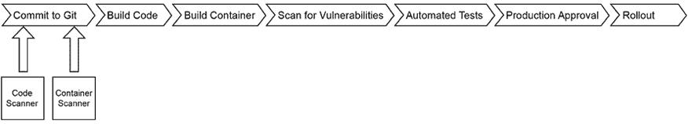
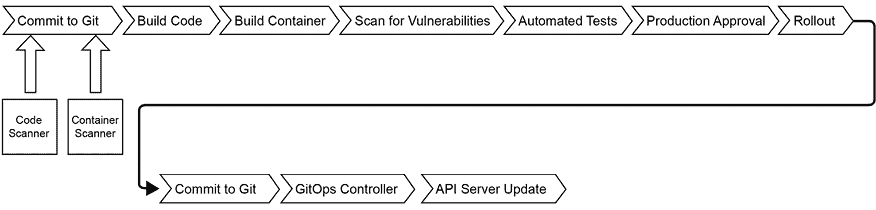
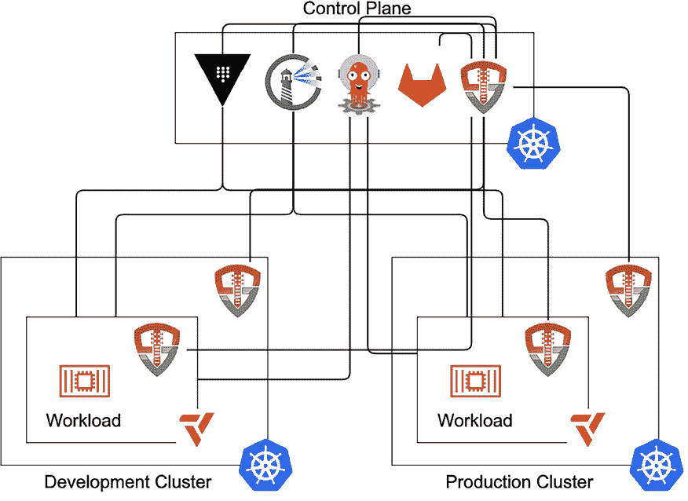
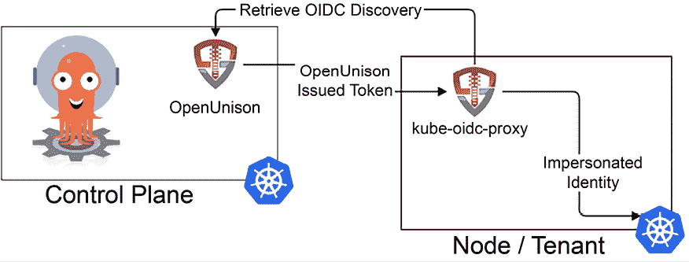
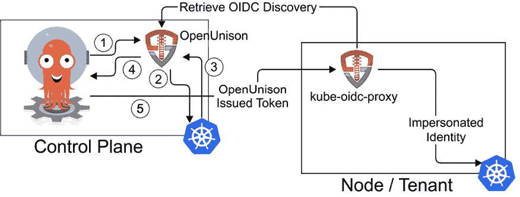
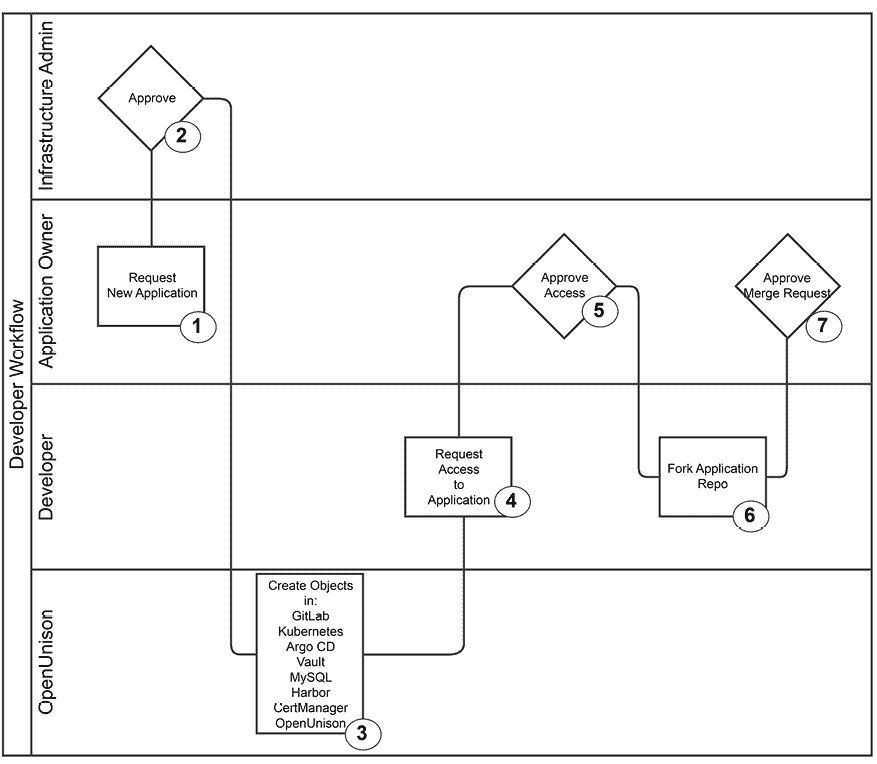
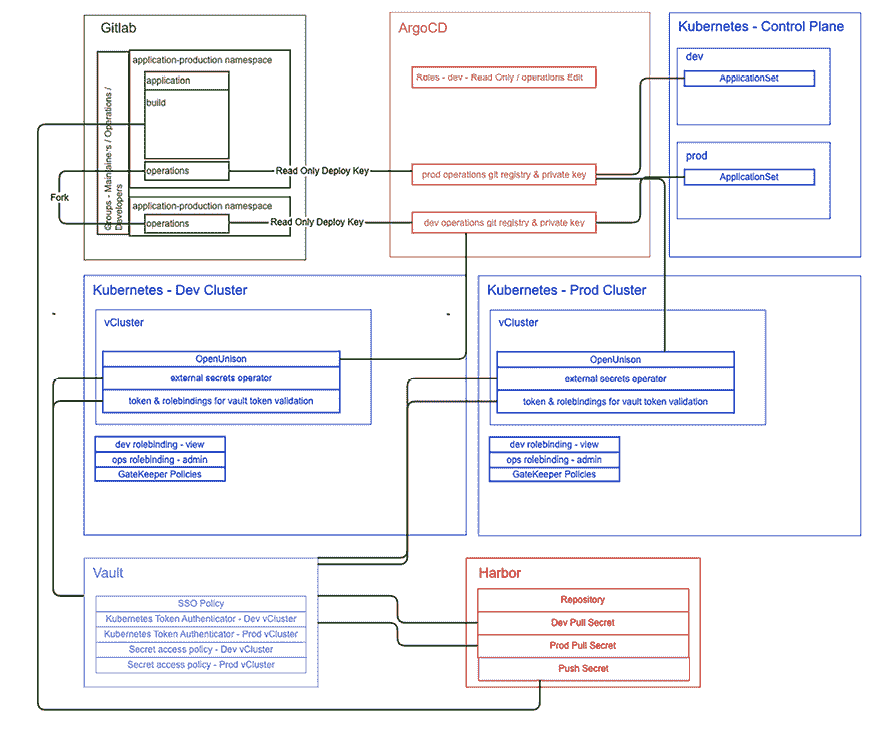
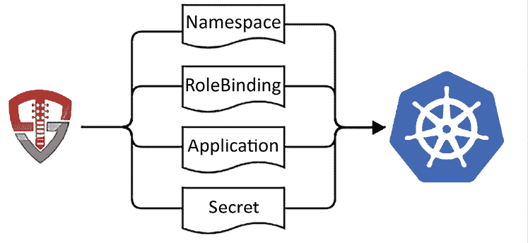
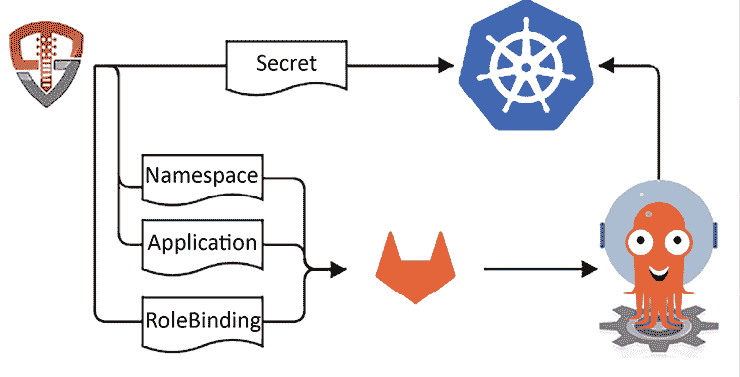
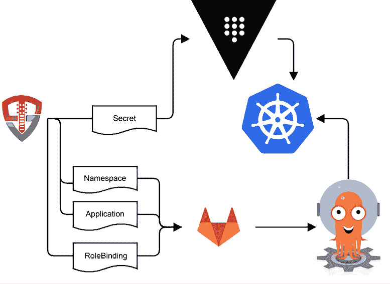

# 第十八章：提供多租户平台

本书中的每一章，直到这一章，都集中在你的集群基础设施上。我们探讨了如何部署 Kubernetes，如何保护它，以及如何监控它。而我们没有讨论的是如何部署应用程序。

在这些最终章节中，我们将基于我们在 Kubernetes 上学到的内容，构建一个应用程序部署平台。我们将根据一些常见的企业需求来构建我们的平台。如果我们无法直接实现某个需求，因为在 Kubernetes 上构建一个平台可能会成为一本完整的书，我们会指出这一点并提供一些见解。

在本章中，我们将涵盖以下主题：

+   设计一个管道

+   设计我们的平台架构

+   使用基础设施即代码进行部署

+   自动化租户入驻

+   构建内部开发者平台的考虑因素

到本章结束时，你将拥有一个良好的概念性起点，帮助你在 Kubernetes 上构建自己的 GitOps 平台。我们将在本章中介绍的概念将推动我们在最后一章中构建内部开发者门户的方式。

# 技术要求

本章将全部是理论和概念。我们将在最后一章中讨论实现部分。

# 设计一个管道

**管道**这个术语在 Kubernetes 和 DevOps 领域被广泛使用。简单来说，管道是一个通常是自动化的过程，它将代码处理并使其运行。这个过程通常包括以下内容：


图 18.1：一个简单的管道

让我们快速了解这个过程中的步骤：

1.  将源代码存储在一个中央代码库中，通常是 Git

1.  当代码提交时，构建它并生成工件，通常是一个容器

1.  告诉平台——在这个例子中是 Kubernetes——推出新的容器并关闭旧的容器

这就是管道的基本形式，在大多数部署中并没有太大用途。除了构建和部署代码外，我们还需要确保扫描容器中的已知漏洞。我们可能还需要在进入生产环境之前对容器进行一些自动化测试。在企业部署中，通常还会有合规要求，需要有人对迁移到生产环境负责。考虑到这些因素，管道开始变得更加复杂。


图 18.2：具有常见企业需求的管道

管道增加了一些额外的步骤，但它仍然是线性的，从一个起点开始，一个提交。这也是非常简化且不现实的。你应用所依赖的基础容器和库在不断更新，因为新的**常见漏洞和暴露**（**CVE**），即识别和归类安全漏洞的常见方法，被发现并修补。除了有开发人员为新的需求更新应用代码之外，你还需要一个系统来扫描代码和基础容器的可用更新。这些扫描器监视你的基础容器，并在新的基础容器准备好时触发构建。虽然扫描器可以调用 API 来触发管道，但你的管道已经在等待 Git 仓库做某些事情，因此更好的做法是直接向 Git 仓库添加一个提交或拉取请求来触发管道。



图 18.3：集成了扫描器的管道

这意味着你的应用代码和操作更新都被 Git 跟踪。Git 现在不仅是应用代码的真实来源，也是操作更新的来源。当需要进行审计时，你已经有了现成的变更日志！如果你的政策要求你将变更输入变更管理系统，只需从 Git 导出这些变更即可。

到目前为止，我们一直专注于应用代码，并仅将**Rollout**放在管道的最后步骤。最终的发布步骤通常意味着用我们新构建的容器来修补部署或 StatefulSet，让 Kubernetes 执行启动新 Pod 和缩减旧 Pod 的任务。这可以通过一个简单的 API 调用来完成，但我们如何跟踪和审计这个变化呢？真实的来源是什么？

我们在 Kubernetes 中的应用定义为存储在 `etcd` 中的一系列对象，这些对象通常通过 YAML 文件表示为代码。为什么不把这些文件也存储在 Git 仓库中呢？这让我们可以享受与存储应用代码在 Git 中相同的好处。我们有了应用源代码和应用操作的统一真实来源！现在，我们的管道涉及更多的步骤。



图 18.4：GitOps 管道

在这个图示中，我们的发布会更新 Git 仓库中的应用 Kubernetes YAML。集群中的一个控制器会监视 Git 的更新，一旦看到更新，就会将集群与 Git 中的内容保持同步。它还可以检测到集群中的漂移，并将其恢复到与真实来源一致的状态。

这种专注于 Git 的方式称为**GitOps**。其理念是应用的所有工作都通过代码完成，而不是直接通过 API。你对这一理念的严格程度将决定你的平台如何构建。接下来，我们将探讨意见如何塑造你的平台。

## 强制性平台

Google 的开发者倡导者及 Kubernetes 领域的领导者 Kelsey Hightower 曾说：“Kubernetes 是构建平台的平台。它是一个更好的起点，而非最终目标。”当你看到基于 Kubernetes 的供应商和项目的生态时，它们都有自己对如何构建系统的看法。例如，Red Hat 的 **OpenShift 容器平台**（**OCP**）希望成为一个多租户企业部署的一站式平台。它构建了我们讨论过的流水线的很大一部分。你定义一个由提交触发的流水线，构建一个容器并将其推送到内部注册表中，随后触发新容器的发布。命名空间是租户的边界。Canonical 是一个极简主义的发行版，不包含任何流水线组件。像 Amazon、Azure 和 Google 这样的托管供应商提供集群的构建块和流水线的托管构建工具，但还是将平台的构建工作留给你。

关于使用哪个平台没有正确的答案。每个平台都有其独特的观点，适合你的部署的平台将取决于你的具体需求。根据企业的规模，看到多个平台部署也不足为奇！

在了解了观点明确的平台后，让我们探讨一下构建流水线的安全影响。

## 保护你的流水线

根据你的起始点，这个过程可能会迅速变得复杂。你的流水线中有多少是一个集成系统，或者它是否能用一个形象的美国俚语来形容，涉及到胶带？即使在所有组件都存在的平台中，将它们连接起来通常也意味着要构建一个复杂的系统。流水线中的大多数系统都将包含可视化组件，通常这个可视化组件是一个仪表盘。用户和开发者可能需要访问该仪表盘。你不希望为所有这些系统维护单独的账户，对吧？你会希望为流水线的所有组件提供一个统一的登录入口和门户。

在确定如何验证使用这些系统的用户后，接下来的问题是如何自动化发布流程。流水线的每个组件都需要配置。它可以简单到通过 API 调用创建的一个对象，也可以复杂到将 Git 仓库和构建过程通过 SSH 密钥连接起来以自动化安全性。在这样复杂的环境中，手动创建流水线基础设施将导致安全漏洞，还会导致无法管理的系统。自动化该过程并提供一致性将帮助你既保护基础设施，又保持其可维护性。

最后，从安全角度理解 GitOps 对我们集群的影响非常重要。我们在*第六章*《将身份验证集成到集群》中讨论了如何验证管理员和开发者使用 Kubernetes API 并授权访问不同 API，在*第七章*《RBAC 策略与审计》中进一步讨论了这一点。如果有人能够提交一个 `RoleBinding`，将他们赋予某个命名空间的 `admin` `ClusterRole`，并且 GitOps 控制器会自动将其推送到集群中，这会产生什么影响？在设计你的平台时，考虑开发者和管理员如何与平台互动是很重要的。虽然说“让每个人都与其应用程序的 Git 注册库互动”很有诱惑力，但这意味着将大量请求的负担放在你作为集群所有者身上。正如我们在*第七章*《RBAC 策略与审计》中讨论的，这可能会使你的团队成为企业中的瓶颈。了解你的客户，在这种情况下，了解他们如何希望与操作系统互动，即使这不是你最初的设计意图，也是至关重要的。

在我们讨论了 GitOps 和流水线的一些安全方面之后，让我们来探索一个典型平台的需求，以及我们如何构建它。

## 构建我们平台的需求

Kubernetes 部署，特别是在企业环境中，通常会有以下基本需求：

+   **开发和测试环境**：至少需要两个集群来测试更改在集群层面上对应用程序的影响

+   **开发者沙箱**：开发者可以在其中构建容器并进行测试，而不必担心对共享命名空间的影响

+   **源代码控制与问题跟踪**：存储代码并跟踪开放任务的地方

除了这些基本需求，企业通常还会有额外的需求，比如定期的访问审查、基于策略的访问限制，以及分配责任的工作流，这些责任可能会影响共享环境。最后，你还需要确保政策到位，以保护节点安全。

对于我们的平台，我们希望尽可能涵盖这些需求。为了更好地自动化部署到我们的平台，我们将定义每个应用程序具有以下特点：

+   **开发命名空间**：开发者是管理员

+   **生产命名空间**：开发者是查看者

+   **源代码控制项目**：开发者可以进行分叉

+   **构建过程**：由 Git 更新触发

+   **部署过程**：由 Git 更新触发

此外，我们希望开发者拥有自己的沙箱，以便每个用户可以为开发分配自己的命名空间。

为了提供对每个应用程序的访问，我们将定义三个角色：

+   **所有者**：作为应用程序所有者的用户可以批准其他角色在其应用程序内的访问权限。此角色分配给应用程序请求者，并且可以由应用程序所有者分配。所有者还负责推动开发和生产中的更改。

+   **开发人员**：这些是能够访问应用程序源代码控制并可以管理应用程序开发命名空间的用户。他们可以查看生产命名空间中的对象，但无法编辑任何内容。任何用户都可以申请此角色，应用程序所有者会批准。

+   **运维**：这些用户具备与开发人员相同的能力，但还可以根据需要对生产命名空间进行更改。任何用户都可以申请此角色，应用程序所有者会批准。

我们还将创建一些跨环境的角色：

+   **系统审批者**：拥有此角色的用户可以批准访问任何系统范围的角色。

+   **集群管理员**：此角色专门用于管理我们的集群和构成我们平台的应用程序。任何人都可以申请此角色，但必须经过系统审批者角色成员的批准。

+   **开发人员**：任何登录的用户都会在开发集群上获得自己的开发命名空间。这些命名空间不能由其他用户申请访问。这些命名空间与任何 CI/CD 基础设施或 Git 仓库没有直接连接。

即使在我们非常简单的平台上，我们也有六个角色需要映射到构成我们流水线的应用程序。每个应用程序都有自己的身份验证和授权过程，这些角色需要与之映射。这仅仅是为什么自动化对集群安全如此重要的一个例子。基于电子邮件请求手动配置这些访问权限可能很快变得难以管理。

开发人员在使用应用程序时所需遵循的工作流程将与我们之前设计的 GitOps 流程一致：

+   应用程序所有者将申请创建一个应用程序。一旦批准，将为应用程序代码和 Kubernetes 清单创建一个 Git 仓库。将在适当的集群中创建开发和生产命名空间，并创建相应的`RoleBinding`对象。将创建反映每个应用程序角色的组，并将访问这些组的批准权限委托给应用程序所有者。

+   开发人员和运维人员通过申请或由应用程序所有者直接提供访问权限来获得对应用程序的访问。一旦获得访问权限，更新预计会出现在开发人员的沙箱和开发命名空间中。更新是在用户的 Git 仓库分支中进行的，通过拉取请求将代码合并到驱动自动化的主仓库中。

    +   所有构建通过应用程序源代码控制中的脚本进行控制。

    +   所有工件都发布到一个集中式的容器注册表。

    +   所有生产更新必须经过应用程序所有者的批准。

这个基础工作流并不包括工作流的典型组件，例如代码和容器扫描、定期的访问认证更新或特权访问的要求。本章的主题完全可以单独成为一本书。我们的目标不是构建一个完整的企业平台，而是为你提供构建和设计自己系统的起点。

## 选择我们的技术栈

在本节的前面部分，我们以通用的方式讨论了流水线和平台。现在，让我们深入探讨构建流水线所需的技术。我们之前提到，每个应用都有应用源代码和 Kubernetes 清单定义，它还需要构建容器。必须有一种方式来监控 Git 的变化并更新我们的集群。最后，我们需要一个自动化平台，确保所有这些组件能够协同工作。

根据我们平台的需求，我们希望选择具有以下特性的技术：

1.  **开源**：我们不希望你为这本书购买任何东西！

1.  **API 驱动**：我们需要能够以自动化的方式提供组件和访问权限。

1.  **支持外部认证的可视化组件**：本书聚焦于企业，而企业中的每个人都喜欢图形用户界面（GUI），只是希望不同的应用不需要不同的凭证。

1.  **支持 Kubernetes**：这是一本关于 Kubernetes 的书。

为了满足这些需求，我们将向集群部署以下组件：

+   **Git 注册表 – GitLab**：GitLab 是一个强大的系统，提供出色的 Git 操作体验，并支持外部认证（即 **单点登录** (**SSO**))。它有集成的 issue 管理系统和强大的 API。它还提供了一个 Helm chart，我们已经根据本书的需要进行了定制，以便进行最小化安装。

+   **自动化构建 – GitLab**：GitLab 旨在成为一个开发巨擘。鉴于它拥有一个与 Kubernetes 原生兼容的集成流水线系统，我们将使用它，而不是像 **Jenkins** 或 **TektonCD** 这样的外部系统。

+   **容器注册表 – Harbor**：在之前的版本中，我们使用了一个简单的 Docker 注册表，但由于我们将构建一个多集群环境，因此使用一个专为生产环境设计的容器注册表非常重要。Harbor 使我们能够存储容器，并通过支持 OpenID Connect 认证的 Web 用户界面进行管理，同时提供 API 进行管理。

+   **GitOps – ArgoCD**：ArgoCD 是 Intuit 推出的一个功能丰富的 GitOps 平台。它原生支持 Kubernetes，拥有自己的 API，并将对象存储为 Kubernetes 自定义资源，从而简化了自动化。它的 UI 和 CLI 工具都通过 OpenID Connect 集成了 SSO。

+   **访问、认证和自动化 – OpenUnison**：我们将继续使用 OpenUnison 进行集群认证。我们还将整合我们的技术栈中的 UI 组件，提供一个统一的门户用于平台管理。最后，我们将使用 OpenUnison 的工作流来管理基于角色结构的每个系统的访问权限，并为所有系统提供所需的对象，以确保它们能够协同工作。访问将通过 OpenUnison 的自服务门户提供。

+   **节点策略执行 –** **GateKeeper**：*第十二章*中的 GateKeeper 部署，*使用 Gatekeeper 进行节点安全*，将强制执行每个命名空间必须有一组最小的策略。

+   **租户隔离 – vCluster**：我们在*第九章*中使用 vCluster 为每个租户提供了自己的虚拟集群。我们将在此基础上继续提供各个租户自己的虚拟集群，以便他们更好地控制自己的环境。

+   **机密管理 –** **HashiCorp Vault**：我们已经知道如何使用 Vault 部署 vCluster，因此我们将继续使用它来外部化我们的机密。

阅读这个技术栈时，你可能会问：“为什么不选择*XYZ*？”Kubernetes 生态系统非常多样化，集群中有许多优秀的项目和产品。这绝不是一个权威的技术栈，也不是一个“推荐”的栈。这是一个满足我们需求的应用程序集合，让我们能够专注于正在实施的过程，而不是学习特定的技术。

你也可能会发现，这个栈中的工具之间存在相当多的重叠。例如，GitLab 不仅可以用于 Git 和管道，我们想展示的是不同组件如何相互集成。尤其是在企业中，组件由不同的组织管理，通常只会用某个系统来做该组专长的事情，这是很常见的。比如，一个专注于 GitLab 的团队可能不希望你把它作为身份提供者使用，因为他们并不从事身份提供者业务，尽管 GitLab 有这个功能。他们不希望为此提供支持。

最后，你会注意到没有提到**Backstage**。**Backstage**是一个流行的开源内部开发者平台，通常与任何与“平台工程”相关的项目联系在一起。我们决定不使用 Backstage 来构建我们的平台，因为没有办法在一个章节中涵盖它！关于 Backstage 已经写了多本书，它是一个需要大量独立分析才能妥善处理的话题。接下来的两章的目标是帮助你看到我们通过本书构建的许多技术是如何结合在一起的。这是一个起点，而不是一个完整的解决方案。如果你想集成 Backstage 或任何其他内部开发者平台系统，你会发现你的方法不会与我们有太大不同。

有了我们的技术栈，下一步是看看我们将如何整合这些组件。

# 设计我们的平台架构

在前面的章节中，我们的所有工作都围绕着一个单一的集群展开。这使得实验更加简单，但现实中的 IT 世界并非如此运作。至少你应该将开发集群和生产集群分开，这不仅是为了隔离工作负载，还能让你在生产环境之外测试操作流程。你可能还需要根据其他风险和政策的要求来隔离集群。例如，如果你的企业跨越多个国家，你可能需要遵守每个国家的数据主权法律，并在该国的基础设施上运行工作负载。如果你所在的行业受监管，需要对不同种类的数据实施不同的安全级别，你也可能需要将集群分开。基于这些原因，本章和下一章将不再局限于单一集群，而是采用多集群设计。

为了保持简洁，我们假设可以有一个集群用于开发，一个集群用于生产。然而，这种设计有一个问题：我们该将管理栈中的所有技术部署到哪里？它们是“生产”系统，所以你可能会想将它们部署到生产集群中，但由于这些通常是特权系统，这可能会引发安全和政策问题。由于许多系统与开发相关，你可能会认为它们应该部署到开发集群中。但这也可能是一个问题，因为你不希望开发系统控制生产系统。

为了解决这些问题，我们将添加第三个集群作为我们的“控制平面”集群。这个集群将托管 OpenUnison、GitLab、Harbor、ArgoCD 和 Vault。这样，开发和生产集群中的租户就能继续运行。每个租户将在其命名空间中运行一个 vCluster，而该 vCluster 将运行自己的 OpenUnison，正如我们在 vCluster 章节中所做的那样。这样，我们的架构就变成了：



图 18.5：开发平台架构

从我们的图示中可以看到，我们创建了一个相当复杂的基础设施。不过，由于我们利用了多租户技术，这比它可能出现的样子要简单得多。如果每个租户都有自己的集群和相关基础设施，你就需要管理和更新所有这些系统。在本书中，我们一直把身份作为一个重要的安全边界。我们已经讨论了 OpenUnison 和 Kubernetes 如何与 Vault 交互，但我们的技术栈中的其他组件呢？

## 安全地管理远程 Kubernetes 集群

在*第六章*，*将身份验证集成到集群中*中，我们讨论了外部管道如何与 Kubernetes 集群进行安全通信。我们使用了一个例子，展示如何基于 Kubernetes 为每个 Pod 发放的身份，或者通过 Active Directory 发放的凭证，为远程集群生成身份。我们没有使用`ServiceAccount`令牌来为远程集群进行身份验证，因为我们认为这种做法在 Kubernetes 中是不推荐的。`ServiceAccount`令牌本不应该作为外部集群访问集群的凭证，而自 Kubernetes 1.24 以来，默认行为是生成具有有限有效期的令牌，但它仍然需要令牌轮换，并违反了使用`ServiceAccount`的初衷。

我们将通过依赖 OpenUnison 内置的身份提供者功能来避免这种反模式。当我们将一个节点或租户集群集成到我们的控制平面 OpenUnison 中时，OpenUnison 会部署一个信任 OpenUnison 的 kube-oidc-proxy 实例。然后，当 OpenUnison 需要向其中一个节点或租户集群发出 API 调用时，它可以使用一个短期令牌来完成此操作。



图 18.6：控制平面 API 与租户和节点的集成

在*图 18.6*中，我们的租户集群运行一个 kube-oidc-proxy 实例，该实例配置为信任控制平面集群的 OpenUnison 中配置的身份提供者。在这种情况下，我们将代理称为“管理”代理，因为它仅用于 OpenUnison 和 ArgoCD 与节点或租户的 API 服务器进行交互。当 OpenUnison 想要调用远程 API 时，它首先为该调用生成一个有效期为一分钟的令牌。这与我们使用短期令牌与远程集群进行通信的目标一致。这样，如果令牌被泄露，一旦令牌被攻击者获得，它可能会失效。

我们使用 kube-oidc-proxy 是因为 Kubernetes 在 1.29 之前仅支持一个 OpenID Connect 发行者。从 1.29 开始，Kubernetes 引入了一个 Alpha 功能，允许定义多个令牌发行者，消除了在这种用例中使用冒充代理的需求。我们决定不使用这个功能，原因如下：

1.  目前它仍然是一个 Alpha 功能，可能会发生变化。

1.  即使该功能正式发布，它也不会作为 API 实现，而是作为一个静态配置，必须部署到每个控制平面。这类似于如何通过 API Server 命令行标志配置集群，并将给托管集群带来类似的挑战。

因此，我们决定不在设计中包含此功能，而是依赖 kube-oidc-proxy。

现在我们知道了 OpenUnison 如何与远程集群交互，我们还需要考虑 ArgoCD 如何与远程集群交互。与 OpenUnison 类似，它也需要能够调用我们租户和节点集群的 API。正如 OpenUnison 一样，我们不希望使用静态的 `ServiceAccount` 令牌。幸运的是，我们已经具备了所有需要的组件来实现这一点。

由于 OpenUnison 已经能够生成受远程集群信任的短期令牌，现在我们需要做的是确保在 ArgoCD 需要令牌时能够安全地将其传递给 ArgoCD，并告诉 ArgoCD 使用它。由于 ArgoCD 使用 Kubernetes 的 client-go SDK，因此它能够使用凭证插件调用远程 API 来检索凭证。在这种情况下，我们将使用类似于 *第六章* 《将身份验证集成到集群中》中的模式来生成令牌。不同的是，我们将使用 ArgoCD 控制器 pod 的身份来生成所需的令牌：



图 18.7：ArgoCD 与租户和节点的集成，使用短期凭证

我们能够利用 go-sdk 的凭证插件。在第 1 步中，我们生成一个 HTTP 请求，发送到我们在 OpenUnison 部署的服务，并使用 `Pod` 的凭证来获取令牌：

```
#!/bin/bash
OPENUNISON_CP_HOST=$1
CLUSTER_NAME=$2
PATH_TO_POD_TOKEN=$3
REMOTE_TOKEN=$(curl -H "Authorization: Bearer $(<$PATH_TO_TOKEN)" https://$OPENUNISON_CP_HOST/api/get-target-token?targetName=$CLUSTER_NAME 2>/dev/null) 
Pod's token. The script then makes a curl call with that token to OpenUnison to get the token, using the Pod's identity as a bearer token. 
```

当请求到达 OpenUnison 时，它会执行第 2 步，OpenUnison 会向 API 服务器发出 `TokenRequest`，以确保 API 调用中提供的令牌是有效的。为了成功执行，令牌必须未过期，并且与令牌绑定的 pod 必须仍在运行。如果有人从一个过期的 pod 获取令牌，但令牌尚未过期，这个调用仍然会失败。此时，请求已经通过身份验证，第 3 步中，API 服务器会将其判断结果返回给 OpenUnison。我们不希望任何身份都能为我们的远程集群获取令牌。

接下来，OpenUnison 需要授权该请求。在我们的 API `Application` 配置中，我们将 `azRule` 定义为 `(sub=system:serviceaccount:argocd:argocd-application-controller)`，确保只有控制器 pod 能够为我们的远程集群获取令牌。这确保了，如果 ArgoCD 的 Web 界面发生泄露，攻击者不能仅凭该 pod 的身份生成令牌。他们还需要进入应用控制器 pod。

在请求经过身份验证和授权后，第 4 步中，OpenUnison 会查找目标并返回生成的令牌。最后，在第 5 步中，我们在凭证插件中生成一些 JSON，告诉 client-go SDK 使用哪个令牌：

```
echo -n "{\"apiVersion\": \"client.authentication.k8s.io/v1\",\"kind\": \"ExecCredential\",\"status\": {\"token\": \"$REMOTE_TOKEN\"}}" 
```

一旦 ArgoCD 获取到令牌，它将在与远程集群交互时使用该令牌。我们设计了一种方法，让我们的平台能够使用集中式的 ArgoCD，同时不依赖于长期凭证！

但我们还没有完成。ArgoCD 配置为使用我们的令牌进行两步操作：

1.  定义一个包含集群连接配置的`Secret`，并定义一个标签来标识它

1.  创建一个指定目标集群的`ApplicationSet`

例如，下面是一个`Secret`示例：

```
---
apiVersion: v1
kind: Secret
metadata:
  name: k8s-kubernetes-satelite
  namespace: argocd
  labels:
    argocd.argoproj.io/secret-type: cluster
    tremolo.io/clustername: k8s-kubernetes-satelite
type: Opaque
stringData:
  name: k8s-kubernetes-satelite
  server: https://oumgmt-proxy.idp-dev.tremolo.dev
  config: |
    {
      "execProviderConfig": {
        "command": "/custom-tools/remote-token.sh",
        "args": ["k8sou.idp-cp.tremolo.dev","k8s-kubernetes-satelite","/var/run/secrets/ubernetes.io/serviceaccount/token"],
        "apiVersion": "client.authentication.k8s.io/v1"
      },
      "tlsClientConfig": {
        "insecure": false,
        "caData": "LS0tL…
      }
    } 
```

你可以看到我们的配置中不包含任何秘密信息！标签`acrocd.argoproj.io/secret-type: cluster`告诉 ArgoCD，这个`Secret`用于配置远程集群。附加标签`tremolo.io/clustername`帮助我们知道应该支持哪个集群。接下来，我们定义一个`ApplicationSet`，ArgoCD 的操作员将使用该`ApplicationSet`来生成 ArgoCD 的`Application`对象和集群配置：

```
---
apiVersion: argoproj.io/v1alpha1
kind: ApplicationSet
metadata:
  name: test-remote-cluster
  namespace: argocd
spec:
  goTemplate: true
  goTemplateOptions: ["missingkey=error"]
  generators:
  - clusters:
      selector:
        matchLabels:
          tremolo.io/clustername: k8s-kubernetes-satelite
  template:
    metadata:
      name: '{{.name}}-guestbook' # 'name' field of the Secret
    spec:
      project: "default"
      source:
        repoURL: https://github.com/mlbiam/test-argocd-repo.git
        targetRevision: HEAD
        path: yaml
        directory:
          recurse: true
      destination:
        server: '{{.server}}' # 'server' field of the secret
        namespace: myns 
```

`spec.generators[0]`标识一个集群生成器，该生成器匹配标签`tremolo.io/clustername: k8s-kubernetes-satelite`。由于我们正在构建一个多租户平台，我们需要确保定义一个 GateKeeper 策略，以防止用户在创建`ApplicationSet`对象时指定他们不拥有的集群标签。

现在我们已经搞清楚了 OpenUnison 和 ArgoCD 如何与平台中的远程集群安全地通信，接下来我们需要解决我们的集群如何从镜像仓库中安全地拉取镜像。

## 安全地推送和拉取镜像

除了需要安全地调用远程集群的 API 之外，我们还需要能够安全地从镜像仓库中推送和拉取镜像。虽然我们希望采用与其他 API 相同的技术来与我们的镜像仓库互动，但遗憾的是，我们无法做到这一点。Kubernetes 并没有提供一种动态生成镜像拉取凭证的方法，这意味着我们需要生成一个静态令牌。该令牌也需要作为`Secret`存储在我们的 API 服务器中。由于我们将使用 Vault，我们计划在每个集群中使用 External Secrets Operator，以便从 Vault 同步拉取凭证。

我们已经梳理了我们的技术栈以及各个组件如何进行通信。接下来，我们将探讨如何部署这些技术。

# 使用基础设施即代码进行部署

在本书中，我们使用 bash 脚本来部署所有实验室。我们之所以能够这样做，是因为大多数实验室都很简单，集成度低，并且不需要重复性。这在企业环境中通常并非如此。你可能需要为开发和测试创建多个环境。你可能需要部署到多个或不同的云环境中。你可能需要在跨国边界重建环境，以遵守数据主权法规。最后，你的部署可能需要比 bash 能够轻松提供的更复杂的逻辑。

这是**基础设施即代码**（**IaC**）工具开始提供价值的地方。IaC 工具之所以流行，是因为它们在代码和部署基础设施所需的 API 之间提供了一层抽象。例如，IaC 工具可以为创建 Kubernetes 资源和云服务提供商中的资源创建提供一个通用的 API。它们不会完全相同，但如果你知道如何使用其中一个，那么这种模式通常适用于其他提供商。

IaC 工具有两种常见的使用方式：

+   **命令式脚本**：IaC 工具可以是简化在多个系统上重新运行命令的工具，且是可重复使用的。它提供最小的抽象，并且在每次运行之间不保持任何内部“状态”。Ansible 就是这种工具的一个很好的例子。它使得在多个主机上运行命令变得容易，但它不会处理与已知配置的“漂移”。

+   **状态协调**：许多 IaC 工具存储环境的预期状态，并与该状态进行协调。这与 GitOps 的理念非常相似，GitOps 将状态存储在 Git 仓库中。这种方法的主要好处是，你可以使你的基础设施与预期的状态保持一致，因此，如果你的基础设施发生“漂移”，IaC 工具知道如何将其恢复到正确的状态。这个方法的一个挑战是，你现在需要管理和维护状态。

这里没有“正确”的方法；它真正取决于你想要实现的目标。有许多开源的 IaC 工具。对于我们的平台，我们将使用 Pulumi（[`www.pulumi.com/`](https://www.pulumi.com/)）。我喜欢 Pulumi 的原因之一是它没有自己独特的领域特定语言或标记语言——它提供了 Python、Java、Go、JavaScript 等语言的 API。因此，尽管你仍然需要额外的二进制文件来运行它，但它的学习曲线更为平缓，我认为也更容易进行长期的维护。

在管理状态方面，Pulumi 提供了免费的云服务，或者你可以使用像 Amazon S3 这样的对象存储系统，或者使用本地文件系统。由于我们不希望你需要注册任何服务，我们将在所有示例中使用本地文件系统。

在使用 Pulumi 程序时，理解的一个关键点是，你并不是在操作基础设施本身，而是在处理你希望创建的状态，然后 Pulumi 会将你程序创建的状态与现有基础设施的实际情况进行协调。为了实现这一点，Pulumi 会对你的程序进行两次运行。第一次是生成预期的状态，第二次是应用该状态中的未知部分。举个例子，假设你要使用 Pulumi 部署 OpenUnison 和 Kubernetes Dashboard。OpenUnison 的 Helm chart 部分要求知道暴露仪表盘部署的 `Service` 的名称。默认情况下，Pulumi 控制资源的名称，所以在编写代码时你不会知道 `Service` 的名称，但它会通过一个变量提供给你。这个变量在第一次运行时不可用，但在代码的第二次运行时会可用。以下是通过 Pulumi 部署仪表盘的 Python 代码：

```
 k8s_db_release = k8s.helm.v3.Release(
            'kubernetes-dashboard',
            k8s.helm.v3.ReleaseArgs(
                chart=chart_name,
                version=chart_version,
                namespace='kubernetes-dashboard',
                skip_await=False,
                repository_opts= k8s.helm.v3.RepositoryOptsArgs(
                    repo=chart_url
                ),
            ),
            opts=pulumi.ResourceOptions(
                provider = k8s_provider,
                depends_on=[dashboard_namespace],
                custom_timeouts=pulumi.CustomTimeouts(
                    create="8m",
                    update="10m",
                    delete="10m"
                )
            )
        ) 
```

这段代码的重要部分是，一旦 Helm chart 部署完成，它也会被提供给代码中的其他部分。接下来，当我们创建 OpenUnison 的 Helm chart 值时，我们需要获取 `Service` 名称：

```
openunison_helm_values["dashboard"]["service_name"] = k8s_db_release.name.apply(lambda name: name) 
```

在这里，我们并不是直接从发布中获取名称作为变量，因为根据你所在的部署阶段，程序无法得知该信息。所以，你可以在 Python 中使用 lambda 注入一个函数，该函数会返回该值，以便 Pulumi 在正确的时机生成它。刚开始使用 Pulumi 时，这对我来说是一个很大的思维障碍，所以我想在这里特别指出这一点。

我们不会在这里深入讨论更多的 Pulumi 实现细节。有很多关于 Pulumi 的书籍，此外，他们的网站也提供了非常好的文档，涵盖了他们支持的所有语言。我们希望专注于简要介绍和一些关键概念，为后续的内容做铺垫。在下一章中，我们将讲解如何存储和检索配置信息，并逐步部署我们的平台。

我们已经介绍了平台的基础设施、基础设施之间的相互连接方式，以及我们计划如何部署它。接下来，我们将把注意力转向租户如何被部署。

# 自动化租户入驻

在之前的 vCluster 章节中，我们部署了 OpenUnison NaaS 门户，为用户提供了一种自助方式来请求租户并将其部署。该门户允许用户请求创建新的命名空间，并允许开发者通过自助界面请求访问这些命名空间。我们在此基础上扩展了功能，除了相应的 `RoleBinding` 对象外，还包括在我们的命名空间中创建 vCluster。尽管该实现是一个良好的起点，但它将所有操作都运行在一个单一的集群上，并且仅与运行 vCluster 所需的组件进行了集成。

我们要做的是构建一个集成平台的工作流程，创建所有我们需要的对象，以满足我们所有项目的需求。目标是，我们能够将一个新应用程序部署到我们的环境中，而不必运行`kubectl`命令（或者至少尽量减少它的使用）。

这将需要精心的规划。以下是我们的开发人员工作流程：



图 18.8：平台开发人员工作流程

让我们快速浏览一下前面图示中展示的工作流程：

1.  应用程序拥有者将请求创建应用程序。

1.  基础设施管理员批准创建。

1.  此时，OpenUnison 将部署我们手动创建的对象。稍后我们会详细说明这些对象。

1.  一旦创建，开发人员可以请求访问该应用程序。

1.  应用程序拥有者批准访问该应用程序。

1.  一旦获得批准，开发人员将分支应用程序源代码库并开始工作。他们可以在自己的开发工作区启动应用程序。也可以分支构建项目来创建管道，和开发环境运维项目来为应用程序创建清单。

1.  一旦工作完成并在本地测试通过，开发人员将推送代码到自己的分支，并发起合并请求。

1.  应用程序拥有者将批准请求并合并来自 GitLab 的代码。

一旦代码被合并，ArgoCD 将同步运维项目。GitLab 将启动一个管道，构建我们的容器，并用最新的容器标签更新开发运维项目。ArgoCD 将同步更新后的清单到应用程序的开发命名空间。一旦测试完成，应用程序拥有者将从开发运维工作区向生产运维工作区提交合并请求，触发 ArgoCD 启动到生产环境。

在这个流程中并没有一个步骤叫做“运维人员使用`kubectl`创建命名空间”。这是一个简单的流程，虽然并不会完全阻止运维人员使用`kubectl`，但它应该是一个很好的起点。所有这些自动化都需要创建一套广泛的对象：



图 18.9：应用程序入驻对象图

上面的图示展示了我们环境中需要创建的对象以及它们之间的关系。由于涉及的部分很多，自动化这个过程显得尤为重要。手动创建这些对象既耗时又容易出错。我们将在下一章中处理这些自动化的工作。

在 GitLab 中，我们为我们的应用代码和运维创建了一个项目。我们还将运维项目分叉为开发运维项目。对于每个项目，我们生成部署密钥并注册 webhook。我们还创建了与本章前面定义的角色相匹配的组。由于我们使用 GitLab 来构建镜像，我们需要注册一个密钥，以便它可以将镜像推送到 Harbor。

对于 Kubernetes，我们为开发和生产环境创建命名空间。我们在租户命名空间中定义 vClusters，并由每个集群的 MySQL 数据库提供支持。接下来，我们将 OpenUnison 部署到每个 vCluster，并使用我们的控制平面 OpenUnison 作为身份提供者。这将使我们的控制平面 OpenUnison 为每个 vCluster 生成身份，并允许 Argo CD 管理它们，而不需要使用静态密钥。

一旦 OpenUnison 部署完成，我们需要将 vClusters 添加到 Vault 以进行密钥管理。我们还将在控制平面集群中创建命名空间和 ApplicationSets，以配置 Argo CD 为我们的租户集群生成 `Application` 对象。由于 Argo CD 没有任何控制措施来确保 ApplicationSet 仅使用特定集群，我们需要添加 GateKeeper 策略，以确保用户不会尝试为其他租户创建 ApplicationSets。

我们还需要在 Harbor 中配置资源和凭证，以便我们的租户可以管理他们的容器。接下来，我们将每个 vCluster 加入 Vault，并为每个 vCluster 添加外部密钥操作员部署。然后，我们将通过 Vault 将拉取密钥配置到每个集群中。

最后，我们向 ArgoCD 添加 RBAC 规则，以便我们的开发人员可以查看他们的应用程序同步状态，但所有者和运维人员可以进行更新和更改。

如果这听起来像是相当多的工作，你说得对！想象一下，如果我们必须手动做所有的工作。幸运的是，我们不需要。 在进入最后一章并开始部署之前，让我们先谈谈 GitOps 是什么，以及我们将如何使用它。

## 设计 GitOps 策略

我们已经概述了开发工作流的步骤以及我们将如何构建这些对象。在讨论实现之前，让我们一起了解 Argo CD、OpenUnison 和 Kubernetes 如何相互作用。

到目前为止，我们已经通过在集群中运行`kubectl`命令，手动部署了本书 Git 仓库中清单文件中的所有内容。这其实不是最理想的方式。如果你需要重建集群呢？与其手动重新创建所有内容，不如让 Argo CD 从 Git 中自动部署一切？你能把更多内容保存在 Git 中，就越好。

话虽如此，OpenUnison 在为我们执行所有这些自动化操作时，如何与 API 服务器进行通信呢？最“简单”的方式就是 OpenUnison 直接调用 API 服务器。



图 18.10：直接写入对象到 API 服务器

这样是可行的。我们最终将实现通过 GitOps 的开发者工作流，但我们的集群管理工作流该如何处理呢？我们希望作为集群操作员，能够像开发人员一样从 GitOps 中获得尽可能多的好处！为此，一个更好的策略是将对象写入 Git 仓库。这样，当 OpenUnison 创建这些对象时，它们会被 Git 追踪，如果需要在 OpenUnison 之外进行更改，这些更改也会被追踪。



图 18.11：将对象写入 Git

当 OpenUnison 需要在 Kubernetes 中创建对象时，它将不会直接将这些对象写入 API 服务器，而是将它们写入 GitLab 中的一个管理项目。Argo CD 将同步这些清单到 API 服务器。

在这里，我们将写入任何不希望用户访问的对象。这包括集群级别的对象，如`Namespaces`，也包括我们不希望用户具有写访问权限的命名空间对象，如`RoleBindings`。通过这种方式，我们可以将操作对象管理与应用程序对象管理分开。

这是一个重要的安全问题需要回答：如果 Argo CD 为我们写入这些对象，那么是什么阻止开发人员将`RoleBinding`或`ResourceQuota`提交到他们的仓库并让 Argo CD 将其同步到 API 服务器呢？在发布时，唯一的限制方法是告诉 Argo CD 哪些对象可以在`AppProject`对象中同步。这种方法不如依赖 RBAC 那样有用。我们可以通过使用 vCluster 来解决这个限制，以实现租户隔离。是的，Argo CD 将作为集群管理员访问租户的远程集群，但用户将无法提交与其他集群交互的`ApplicationSets`。

最后，看看*图 18.11*，你会注意到我们仍然在将`Secret`对象写入 API 服务器。我们不希望将敏感信息写入 Git。无论数据是否加密，都不重要；反正这样做都会带来麻烦。Git 的设计初衷是让代码能够以去中心化的方式更容易地共享，而你的敏感数据应该通过集中式仓库进行小心追踪。这是两个对立的需求。

作为敏感数据丢失的一个例子，假设你的工作站上有一个包含密钥的仓库。执行简单的`git archive HEAD`命令将删除所有 Git 元数据，并提供无法再追踪的干净文件。误将仓库推送到公共仓库是多么容易的事？失去对代码库的控制实在是太容易了。

另一个为什么 Git 不适合存储机密信息的例子是，Git 没有任何内建的身份验证。当你使用 SSH 或 HTTPS 访问 Git 仓库时，GitHub 或 GitLab 会对你进行身份验证，但 Git 本身没有任何身份验证机制。如果你按照本章的练习进行操作，去看看你的 Git 提交。它们是显示“root”还是显示你的名字？Git 只是从你的 Git 配置中获取数据。没有任何东西将这些数据与你绑定起来。这对于你的组织的机密数据来说，能作为有效的审计追踪吗？可能不能。

一些项目尝试通过加密代码库中的敏感数据来解决这个问题。这样，即使代码库被泄露，你仍然需要密钥来解密数据。那么，加密用的`Secret`存储在哪里呢？开发者在使用吗？需要特别的工具吗？有几个地方可能出问题。最好根本不要在 Git 中存储敏感数据，比如机密信息。

在生产环境中，你希望像管理其他清单一样，将机密外部化。我们将把我们的机密数据写入 HashiCorp 的 Vault，并让集群决定如何提取这些信息，可以使用外部机密操作器或 Vault sidecar。



图 18.12：将机密写入 Vault

设计好我们的开发者工作流并准备好示例项目后，接下来，我们将更新 OpenUnison、GitLab 和 ArgoCD，以让所有这些自动化工作起来！

# 构建内部开发者平台的注意事项

在开发**内部开发者平台**（**IDP**）时，重要的是要牢记一些事项，以避免常见的反模式。当基础设施团队构建应用支持平台时，通常希望尽可能多地内建功能，以最小化应用团队在运行应用程序时需要做的工作量。

比如，你可以将其推向极端，简单地为你的代码提供一个存放的地方，然后自动化其余部分。我们在本章中提到的许多事情都可以通过模板来完成，对吧？为什么要麻烦开发者去暴露这些东西呢？只要让他们提交代码，其余的我们来做！这通常被称为“无服务器”或“功能即服务”。在适当的时候，这非常好，因为你的开发者无需了解太多基础设施的内容。

上段中的关键短语是“在适当的时候”。在本书中，我们强调了技术对 Kubernetes 的影响，也谈到了企业中构建的孤岛。虽然在 DevOps 中，我们经常提到“打破孤岛”，但在企业中，这些孤岛是管理结构的结果。正如我们在本书中不同情境下所讨论的，隐藏在多层抽象之下的部署可能会与这些孤岛发生冲突，并让你的团队处于成为瓶颈的位置。

当基础设施团队成为瓶颈时，通常是因为他们尝试承担过多的应用发布责任，这往往会引发反弹，导致开发人员被给予一个空的“云”来部署自己的基础设施。这也没有帮助，因为这会导致各团队之间大量重复的工作和专业知识。

除了将团队从基础设施中隔离外，过度抽象化还可能失去让应用团队实现所需逻辑的能力。没有任何情况是应用基础设施团队能够预见到应用团队所需的每个边缘案例的，这会导致你的应用团队寻找其他实现方式。这通常是“影子 IT”概念的来源。应用开发人员有需求，而基础设施团队无法满足这些需求，所以他们转向了基于云的选项。

Brian Gracely，Red Hat 的高级总监兼《Cloud Cast》播客的联合主持人，经常说（转述）：“护栏，而不是轨道。” 这意味着基础设施团队需要提供护栏，以便最佳地维护共享基础设施，而不是过于严格，以至于应用团队无法完成他们需要做的工作。

在设计你的内部开发平台时，避免走向极端。如果你想提供像无服务器/功能即服务这样的低基础设施选项，那是很棒的。但要确保它只是一个选项，而不是唯一的解决方案。

本章我们已经讲了不少理论。在下一章中，我们将把这些理论付诸实践，构建我们的平台！

# 总结

本书的前几章重点是构建清单和基础设施。虽然我们开始使用 Istio 查看应用程序，但我们并没有涉及如何管理它们的发布。在本章中，我们将重点从构建基础设施转移到使用管道、GitOps 和自动化发布应用程序。我们了解了管道中包含的组件，如何将应用程序从代码推送到部署。我们深入探讨了什么是 GitOps，它是如何工作的。最后，我们设计了一个自助式多租户平台，我们将在最后一章实施它！

使用本章中的信息应该能为你如何构建自己的平台提供一些方向。通过使用本章中的实际示例，你可以将你组织的需求映射到自动化基础设施所需的技术。我们在本章构建的平台远未完成，但它应该为你规划一个符合你需求的自有平台提供地图。

# 问题

1.  正确或错误：必须实现一个流水线才能让 Kubernetes 工作。

    1.  正确

    1.  错误

1.  一个流水线的最少步骤是什么？

    1.  构建、扫描、测试和部署

    1.  构建和部署

    1.  扫描、测试、部署和构建

    1.  以上都不是

1.  什么是 GitOps？

    1.  在 Kubernetes 上运行 GitLab

    1.  使用 Git 作为操作配置的权威来源

    1.  一个愚蠢的营销术语

    1.  来自新兴初创公司的产品

1.  编写流水线的标准是什么？

    1.  所有流水线都应该用 YAML 编写。

    1.  没有标准；每个项目和供应商都有自己的实现方式。

    1.  JSON 和 Go 结合使用。

    1.  Rust。

1.  如何在 GitOps 模型中部署一个新的容器实例？

    1.  使用 `kubectl` 更新命名空间中的 `Deployment` 或 `StatefulSet`。

    1.  更新 Git 中的 `Deployment` 或 `StatefulSet` 清单，允许 GitOps 控制器更新 Kubernetes 中的对象。

    1.  提交一个工单，要求运维人员采取行动。

    1.  以上都不是。

1.  正确或错误：GitOps 中的所有对象都需要存储在你的 Git 仓库中。

    1.  正确

    1.  错误

1.  正确或错误：你可以用任何你想要的方式自动化流程。

    1.  正确

    1.  错误

# 答案

1.  a – 正确。虽然这不是强制要求，但它确实能让生活更轻松！

1.  d – 没有最少步骤数。如何实现流水线将取决于你的需求。

1.  b – 你不与 Kubernetes API 交互，而是将对象存储在 Git 仓库中，允许控制器保持它们的同步。

1.  b – 每个流水线工具都有自己的一套方法。

1.  b – Git 中的清单才是你真实的依据！

1.  b – 在操作符模型中，操作符将根据你提交的清单创建对象。它们应该根据注释或标签被 GitOps 工具忽略。

1.  a – Kubernetes 是一个构建平台的框架。根据你的需求来构建它！
