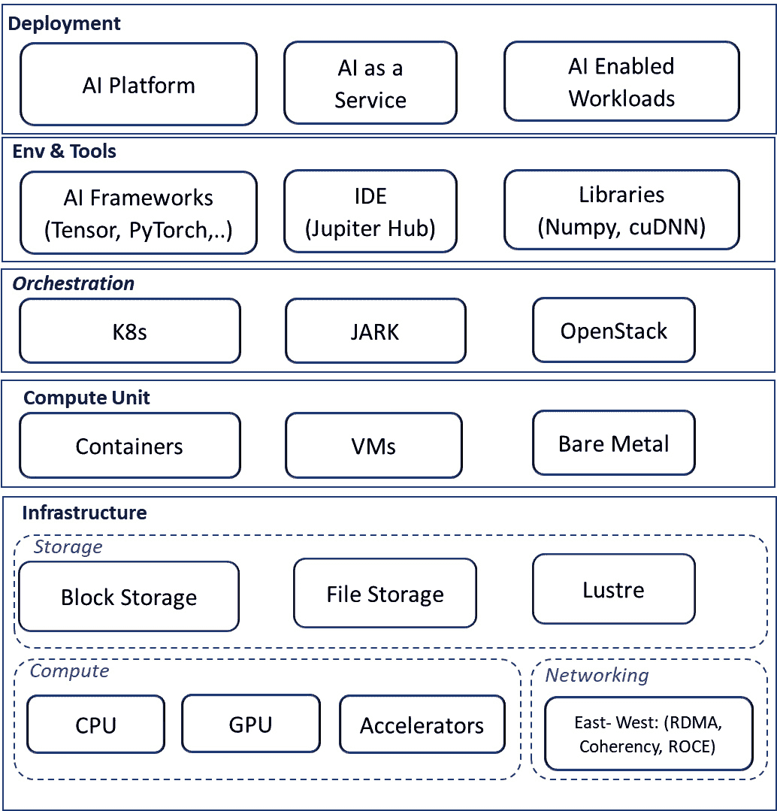

# 第一章：生成式人工智能基础

**生成式人工智能** (**GenAI**) 自从 2022 年 11 月 OpenAI 推出 ChatGPT 后，已经彻底改变了我们的世界，并吸引了每个人的关注（[`openai.com/index/chatgpt/`](https://openai.com/index/chatgpt/)）。然而，这项技术的基础概念已经存在了相当长一段时间。在本章中，我们将介绍 GenAI 的关键概念及其如何随着时间的推移而发展。然后，我们将讨论如何思考一个 GenAI 项目，并将其与业务目标对齐，涵盖整个开发和部署 GenAI 工作负载的过程，以及在不同行业中的潜在应用场景。

在本章中，我们将涵盖以下主要主题：

+   人工智能与 GenAI 的区别

+   机器学习的演进

+   Transformer 架构

+   GenAI 项目生命周期

+   GenAI 部署堆栈

+   GenAI 项目应用场景

# 人工智能与 GenAI 的区别

在深入了解 GenAI 概念之前，让我们讨论一下 **人工智能** (**AI**)、**机器学习** (**ML**)、**深度学习** (**DL**)、和 GenAI 之间的区别，因为这些术语经常被交替使用。

*图 1.1* 显示了这些概念之间的关系。


图 1.1 – AI、ML、DL 与 GenAI 之间的关系

让我们更多地了解这些关系：

+   **AI**：AI 是指能够执行通常需要人类智能的任务的系统或算法。这些任务包括推理、学习、问题解决、感知和语言理解。AI 是一个广泛的类别，可能包括基于规则的系统、专家系统、神经网络和 GenAI 算法。AI 算法的发展使机器具备了类人感官和能力，如通过视觉分析周围世界，通过听觉和语言理解与人类交流，并利用传感器数据理解外部环境并作出响应。

+   **ML**：ML 是 AI 的一个子集，涉及使机器能够从数据中学习并进行预测的算法和模型，而不需要显式编程。在传统编程中，开发人员为计算机编写明确的指令来执行任务，而在 ML 中，算法从数据中的模式和关系中学习并进行预测。ML 还可以进一步细分为以下子类别：

    +   **监督学习**：这是使用带标签的数据集来训练模型。它可以进一步细分为分类问题和回归问题：

        +   **分类问题** 使用带标签的数据，例如带标签的狗猫图片，用来训练模型。模型训练完成后，可以使用其训练过的类别来分类用户提供的图片。

        +   **回归问题**，另一方面，使用数值数据来理解依赖变量和自变量之间的关系，例如根据不同属性预测房价。一旦模型建立了这种关系，它就可以预测不同属性集的价格，即使该模型没有在这些特定属性上进行过训练。一些流行的回归算法包括线性回归、逻辑回归和多项式回归。

    +   **无监督学习**：这类算法利用机器学习分析和聚类未标注的数据集，以发现数据中的潜在模式。无监督学习可以进一步细分为以下两类：

        +   **聚类算法**根据相似性或差异性对数据进行分组。一种流行的聚类算法是**k 均值聚类算法**，该算法使用数据点之间的欧几里得距离来衡量数据点之间的相似性，并将它们分配到*k*个不同且不重叠的聚类中。它通过迭代来精细化聚类，最小化每个聚类内部的方差。一个典型的应用场景是根据购买行为、人口统计特征或偏好对客户进行细分，从而有效地制定营销策略。

        +   **降维**是另一种无监督学习方法，用于减少给定数据集中的特征/维度数量。它旨在简化模型，降低计算成本，并提高整体模型性能。**主成分分析**（**PCA**）([`towardsdatascience.com/a-one-stop-shop-for-principal-component-analysis-5582fb7e0a9c`](https://towardsdatascience.com/a-one-stop-shop-for-principal-component-analysis-5582fb7e0a9c)) 是一种常用的降维算法。它通过寻找一组新的特征，称为主成分，这些主成分是原始特征的组合，并且相互之间不相关，从而实现降维。

    +   **半监督学习**：这是一种结合监督学习和无监督学习的机器学习方法，通过利用标注数据和未标注数据进行训练。当获取标注数据既费时又昂贵时，这种方法尤为有用，因为你可以使用少量标注数据进行训练，然后反复将其应用于大量未标注数据。这可以应用于分类和回归问题，如垃圾邮件/图像/物体检测、语音识别和预测等。

    +   **强化学习**：在强化学习中，有一个代理和奖励系统，算法通过反复试验来学习最大化代理的奖励。**代理**是一个自主系统，比如计算机程序或机器人，能够做出决策并根据其环境采取行动，而无需直接的人工指令。**奖励**是当代理的行为带来积极结果时，环境给予的反馈。例如，如果我们想训练一个机器人走路而不摔倒，当机器人做出有助于保持直立的动作时，会给予正向奖励，而做出导致摔倒的动作时，会给予负向奖励。机器人首先随机尝试不同的动作，比如向前倾、移动腿或改变体重。随着它执行这些动作，它观察到其状态的变化。机器人利用反馈（奖励）来更新其对哪些动作有益的理解，从而随着时间推移学会走路。

    我们在*图 1.2*中总结了机器学习的不同类别：


图 1.2 – 机器学习的不同类别

+   **深度学习（DL）**：深度学习是机器学习（ML）的一个子集，涉及具有多层的深度神经网络。从概念上讲，它的灵感来源于人类大脑，大脑拥有数十亿个深度连接的神经元，赋予人类非常先进的认知能力。一些流行的深度神经网络例子包括**卷积神经网络**（**CNNs**），用于图像处理，以及**递归神经网络**（**RNNs**），用于分析时间序列数据或自然语言处理。

+   **生成式人工智能（GenAI）**：生成式人工智能是深度学习（DL）的一个进一步子集，专注于创建新数据，如文本、图像、音乐和其他形式的内容。许多生成应用基于**基础模型**（**FMs**），即在大量多样化数据上训练的大规模 AI 模型，作为广泛下游任务的基础。它们在广泛的数据集上预训练，并可以针对特定应用进行微调。**大规模语言模型**（**LLMs**）是 FMs 的一个子集，专门设计用于理解和生成自然语言。生成式人工智能是本书的主要重点；我们将在本书后续部分深入探讨其细节。

现在我们已经理解了 AI、ML、DL 和生成式人工智能之间的关键区别，让我们来探讨一下机器学习的演变，以及变压器架构如何彻底改变了机器学习的格局，特别是在**自然语言处理**（**NLP**）领域。

# 机器学习的演变

由于本书是关于生成式人工智能的，那开始时请 ChatGPT 总结过去十年 AI 和机器学习（ML）发展的演变岂不更好？

`"为什么鸡要过马路？"` 描述过去十年间，AI/ML 是如何演化出该问题的答案的。

**ChatGPT 回应（ChatGPT-4o，2024 年 6 月 16 日）**：

```
The evolution of AI/ML responses to the question "Why did the chicken cross the road?" over the past decade reflects significant advancements in language processing and understanding. Here's a detailed description of how these responses have evolved:
Early 2010s: Rule-Based Systems
Response Type: Traditional, rule-based
Example Answer: "To get to the other side."
Description: In the early 2010s, AI systems were primarily rule-based. These systems relied on pre-defined patterns and rules coded by developers. When asked "Why did the chicken cross the road?" the AI would output the standard punchline "To get to the other side" because it was programmed to recognize this classic joke and respond accordingly. The response lacked creativity and was limited to what was explicitly coded into the system.
Mid 2010s: Statistical and Early Machine Learning Models
Response Type: Basic machine learning-generated variations
Example Answer: "To find some food on the other side."
Description: As machine learning techniques began to develop, early models could generate responses based on statistical patterns in the data they were trained on. These models, such as simple neural networks or early natural language processing (NLP) algorithms, could create variations of the joke. However, the answers were still relatively straightforward and sometimes nonsensical, as these models had limited understanding of context and nuance.
Late 2010s: Advanced Neural Networks and NLP
Response Type: Context-aware and more sophisticated
Example Answer: "Because it wanted to explore the other side of the road."
Description: The late 2010s saw the rise of advanced neural networks and NLP (natural language processing) techniques, such as LSTM (Long Short-Term Memory) networks and early transformer models. These models had a better grasp of context and could generate more sophisticated responses. They could recognize the structure of the joke but also provide contextually appropriate variations that made sense and were more engaging.
Early 2020s: Transformer-Based Models
Response Type: Highly fluent and creative
Example Answer: "To escape from the boredom of farm life and seek adventure!"
Description: With the advent of transformer-based models like GPT-3 and BERT, AI's ability to generate human-like text improved dramatically. These models, trained on vast amounts of internet text, could produce responses that were not only fluent but also creative and contextually rich. They could understand humor better and generate answers that went beyond the traditional punchline, incorporating more complex wordplay or humor styles.
Present Day: LLMs and Personalization
Response Type: Personalized and contextually relevant
Example Answer: "Because its AI model predicted a 95% chance of finding a better grain on the other side."
Description: Today's LLMs, such as GPT-4, are capable of highly personalized and contextually aware responses. They can take into account previous conversational history, the user's preferences, and cultural context. The AI might generate responses that are tailored to the individual user, offering a wide range of humorous and inventive answers that reflect a deep understanding of language and context. This level of personalization and creativity was unimaginable a decade ago.
```

如前面的例子所示，transformers 通过实现并行处理和提高可扩展性与效率，彻底改变了自然语言处理（NLP）；然而，在 transformers 之前，深度神经网络（如 CNN 和 RNN）自 1980 年代被引入以来，主导了深度学习（DL）领域。以下是这些神经网络的简要描述：

+   **CNN** 的功能类似于我们视觉皮层的工作原理。我们的脑部通过使用处理特定类型信息或特征的专门神经元来处理来自视网膜的图像。同样，CNN 中的不同滤波器能够检测图像或数据集中各种特征。欲了解更多信息，请参考 Yann LeCun 等人于 1989 年发布的论文 *《反向传播应用于手写邮政编码识别》*（[`ieeexplore.ieee.org/document/6795724`](https://ieeexplore.ieee.org/document/6795724)）。CNN 目前仍广泛用于图像分析。

+   **RNN** 常用于数据序列或时间序列数据，以分析模式并可能预测未来事件，如分析历史股市数据以预测未来交易选项。RNN 也常用于 NLP，因为自然语言是一个单词序列，其中单词顺序很重要，并且可能对意义产生重大影响。

    RNN 的概念最早出现在 *David Rumelhart, Geoffrey Hinton 等人于 1986 年发表的论文《通过反向传播误差学习表示》*（* [`www.nature.com/articles/323533a0`](https://www.nature.com/articles/323533a0) *）中。这篇具有开创性的论文提出了反向传播算法的概念，该算法基于梯度下降原理，是训练神经网络的核心技术，已经彻底改变了整个 AI 领域。在 *附录 1A* 中，我们包括了 RNN 及其流行变体（如**长短期记忆**（**LSTM**）网络和**门控循环单元**（**GRU**））的简要数学介绍。

2007 年，时任斯坦福大学计算机科学教授的李飞飞启动了 ImageNet 竞赛（[`www.image-net.org/`](https://www.image-net.org/)），该竞赛包括一个庞大的图像数据集，这些图像可以在互联网上获得，并且已标注用于训练和测试。每年，不同的 AI/ML 团队都会尝试使用这个训练数据集自动化预测，并提高其模型的准确性。

直到 2011 年，ImageNet 竞赛中的最先进技术仍然基于经典的机器学习方法，如 **支持向量机** (**SVM**)，该方法试图在两个不同类别之间创建一个最大间隔的隔离平面。2012 年，AlexNet 的推出突破了这一局限，Alex Krizhevsky、Ilya Sutskever 和 Geoffrey Hinton 开发了这一模型。这篇论文 ([`papers.nips.cc/paper_files/paper/2012/hash/c399862d3b9d6b76c8436e924a68c45b-Abstract.html`](https://papers.nips.cc/paper_files/paper/2012/hash/c399862d3b9d6b76c8436e924a68c45b-Abstract.html)) 使用深度卷积神经网络赢得了 ImageNet 竞赛，并使 GPU 编程成为人工智能与机器学习发展的重要前沿。

+   **Transformer**：2017 年，Vaswani 等人在他们的开创性论文 *Attention Is All You Need* ([`arxiv.org/abs/1706.03762`](https://arxiv.org/abs/1706.03762)) 中介绍了 Transformer 架构。它通过实现并行处理并提升了 NLP 的可扩展性和效率，彻底改变了自然语言处理（NLP）。Google 开发的 **双向编码器表示的 Transformer** (**BERT**) 大大改善了语言模型中上下文理解的能力。从那时起，不同公司陆续推出了大量的 LLM，例如 OpenAI 的 GPT 系列和 Anthropic 的 Claude。

在过去二十年中，机器学习从依赖手动挑选特征并基于规则的基本算法模型发展到了使用深度学习框架（如神经网络和 Transformer）的高级上下文感知模型。现在让我们更详细地了解 Transformer 架构。

# Transformer 架构

**Transformer 模型**采用 **编码器-解码器** 架构，其中编码器通过自注意力机制将输入序列/标记映射。解码器使用这些映射数据生成输出序列。输入标记的映射不仅保留了它们的内在值，还保留了它们在原始序列中的上下文和权重。接下来，我们将通过下图介绍编码器架构的一些关键方面：


图 1.3 – 来自《Attention Is All You Need》论文的 Transformer 架构

以下是 *图 1.3* 中突出显示的概念：

+   **输入嵌入**：如图中标记为 **1**，这是 transformer 模型的关键部分，它将输入序列/标记转换为高维向量嵌入。在实际应用中，训练模型的输出嵌入可能会存储在高维向量数据库中，如 Elasticsearch、Milvus 或 PineCone。向量数据库帮助通过欧几里得距离或余弦相似度在高维空间中找到相似的搜索，类似的对象会被分配到该高维向量空间中更接近的位置，如下图所示。


图 1.4 – 高维空间中相似对象的分配

+   **位置编码**：位置编码，在*图 1.2*中标记为**2**，提供了输入序列中标记顺序的信息。与 RNN（循环神经网络）不同，RNN 具有时间步长 *t* 或序列的概念，而 Transformer 模型依赖自注意力机制，并且缺乏对内在标记顺序的感知。位置编码将顺序信息注入标记嵌入中。

例如，如果输入序列是 `The Brown hat`，以下是机制的工作原理：

+   `The` -> [0.1, 0.2]

+   `Brown` -> [0.3, 0.4]

+   `hat` -> [0.5, 0.6]

+   **位置编码向量**：我们为句子中的每个位置生成位置编码。Transformer 模型通常使用正弦函数进行位置编码，但为了说明，我们采用以下示例：

    +   **位置 0**: [0.01, 0.02]

    +   **位置 1**: [0.03, 0.04]

    +   **位置 2**: [0.05, 0.06]*   `The` + 位置 0: [0.1, 0.2] + [0.01, 0.02] = [0.11, 0.22]*   `Brown` + 位置 1: [0.3, 0.4] + [0.03, 0.04] = [0.33, 0.44]*   `hat` + 位置 2: [0.5, 0.6] + [0.05, 0.06] = [0.55, 0.66]

现在，每个单词都有一个独特的向量，其中包括该单词的意义和它在句子中的位置。

+   **多头注意力机制**：在多头注意力机制中，在*图 1.2*中标记为**3**，模型为每个输入序列和每个注意力头计算查询、键和值向量。一个可能的类比是将多头注意力机制比作一组侦探解决一个非常复杂的案件，其中每个侦探就是一个注意力头。每个注意力头都有自己的查询向量，专注于案件的某一方面，比如犯罪动机、使用的武器等。最后，键是与该动机相关的线索或证据。所以，如果查询是使用的武器，侦探会调查犯罪现场，寻找任何可以作为武器的物品，而值则是从每一条证据中获得的见解（例如，武器上的指纹）。通过拥有多个注意力头，模型可以同时关注输入的不同部分，捕捉数据中的各种模式或依赖关系，如单词的意义、单词的相对位置和句子结构，类似于我们的类比，不同的侦探关注案件的不同方面。此外，多头注意力机制还允许并行处理输入，使其高效，能够加速训练和推理过程，将任务分配到不同的设备上。

    在*附录 1B*中，我们涵盖了键值对的数学模型和复杂性，以及前馈网络和 Transformer 模型中的温度概念。

既然我们已经理解了变换器架构如何通过使用依赖自注意力机制的编码器-解码器框架，使深度学习实现了革命性的突破，进而支持输入数据的并行处理，接下来我们将探索一个典型的生成式人工智能（GenAI）项目生命周期。

# GenAI 项目生命周期

自 2023 年以来，企业在 GenAI 项目上的支出呈指数级增长，C-suite 高管计划在 GenAI 项目上投入更多资金（[`www.gartner.com/en/newsroom/press-releases/2023-10-11-gartner-says-more-than-80-percent-of-enterprises-will-have-used-generative-ai-apis-or-deployed-generative-ai-enabled-applications-by-2026`](https://www.gartner.com/en/newsroom/press-releases/2023-10-11-gartner-says-more-than-80-percent-of-enterprises-will-have-used-generative-ai-apis-or-deployed-generative-ai-enabled-applications-by-2026)）。然而，如何量化这些努力的**投资回报率**（**ROI**）正成为日益关注的问题，比如收入影响、效率和准确性的提升。未来，ROI 将成为讨论的关键部分，因为企业在寻找新的 GenAI 项目时将重点考虑。因此，在启动新 GenAI 项目之前，建议全面思考项目的整个生命周期。本节将详细介绍项目生命周期。

让我们首先看一下以下图表，该图展示了端到端的 GenAI 项目生命周期，从定义业务目标或 KPI 开始。接下来是选择或训练 FM，并通过微调和提示调优等技术进行优化。然后，模型被评估、部署并持续监控，以确保业务目标得以实现。


图 1.5 – GenAI 项目生命周期

让我们仔细看看 GenAI 项目生命周期的每个阶段：

+   **业务目标和 FM 选择**：GenAI 项目生命周期从我们试图通过 GenAI 解决的业务目标/问题陈述开始。业务目标可能包括提高客户转化率或留存率、创建个性化的营销活动，或者利用企业内部数据创建客户聊天机器人：

    +   **关键 KPI**：在确定使用案例后，下一个需要考虑的是业务关键绩效指标（KPI），例如每次推理的成本。例如，如果我们在创建个性化营销活动，我们应确保每次定制的成本低于客户**生命周期价值**（**LTV**）与客户转化概率的乘积。如果推理成本高于项目预计带来的业务价值，项目可能无法保持长期的可持续性。其他需要考虑的 KPI 可能包括延迟，因为某些使用案例可能需要亚秒级的响应时间，或者吞吐量，如果期望每秒处理一定数量的令牌。

    +   **选择和训练 FM**：下一步是选择现有的 FM 或训练一个新的 FM。训练一个新的 FM 可能非常消耗资源，成本高达数十亿美元且需要大量时间，因此在大多数应用中，选择现有的 FM 并进行特定领域的优化更为可取。选择现有模型时，可以选择开源模型或通过网页接口或 API 访问的专有模型，如 Claude 或 ChatGPT。检查这些模型的许可条款，以确保它们符合应用需求，并能随着企业需求的增长进行扩展，始终是一个好主意。

+   **模型优化**：一旦选择了 FM，下一步是使用微调、提示调优、人类反馈强化学习（RLHF）和 DPO 等技术来优化模型，以适应业务用例。

    +   **微调**：在微调中，使用一个包含提示和完成数据的特定领域标注数据集来训练模型，以适应特定领域或一组领域。由于在微调过程中所有模型权重都可以更新，因此微调的计算需求与完整训练类似。然而，训练时间较短，因为我们是在一个较小的数据集上训练模型。为了减少训练资源，可以选择例如**性能高效微调**（**PEFT**）的方法，它只更新少量的权重，从而降低计算需求。**低秩适配**（**LoRA**）是 PEFT 中一种非常流行的方法，其中原始模型矩阵通过低秩表示重新参数化，从而显著减少需要更新的模型参数数量。例如，在 Vaswani 的论文中，每个注意力头的维度是[512, 64]，也就是每个头需要训练 32,768 个参数。通过 LoRA，我们训练更小的权重矩阵，从而实现 80%或更高的权重减少。我们将在*第四章*中详细讨论这一主题。LoRA 的另一版本是**QLoRA**（**量化低秩适配**）。在 QLoRA 中，我们使用量化技术将模型权重从 32 位精度压缩到 8 位或 4 位精度，这大大减少了模型大小，并使其在内存较小的 GPU 上运行更加高效。

    +   **提示调优**是一种低成本的技术，其中向输入查询中添加软提示令牌，以优化模型在特定领域任务中的表现。随着模型在标注的领域特定数据上重新训练，这些令牌会被优化。与传统的微调不同，后者会在多个训练迭代中调整模型的参数，提示调优则专注于精炼提示，以更有效地引导模型。

    +   在**RLHF** ([`huggingface.co/blog/rlhf`](https://huggingface.co/blog/rlhf)) 中，使用人类反馈训练 LLM，使其与人类偏好对齐，并使用强化学习（RL）技术。在这种方法中，LLM 生成对各种提示的多个响应，人类根据准确性、相关性和道德标准等标准对其进行评估和排名。使用排名后的响应，训练一个奖励模型来预测任何给定 LLM 响应的人类偏好得分，并通过 RL 算法对 LLM 进行微调，奖励模型为其指导。

    +   **直接偏好优化** (**DPO**) ([`huggingface.co/papers/2305.18290`](https://huggingface.co/papers/2305.18290)) 中，使用简单的分类目标训练一个策略，以最佳方式与人类偏好对齐，而无需使用强化学习（RL）。与 RLHF 类似，LLM 会为一组输入提示生成多个输出。人类评估者将这些输出成对比较，并指出他们偏好的输出。这将生成一组偏好对数据集，例如（Ap, Anp），其中 Ap 表示偏好的答案，Anp 表示不偏好的答案。然后设计一个损失函数，最大化偏好输出在 LLM 输出中高于不偏好输出的概率。模型参数经过优化，以最小化所有收集的偏好对上的损失函数。这直接调优模型，以生成更符合人类偏好的输出。

    +   **评估**：在模型训练后，需要使用如*ROUGE* ([`huggingface.co/spaces/evaluate-metric/rouge`](https://huggingface.co/spaces/evaluate-metric/rouge)) 或 *BLEU* ([`huggingface.co/spaces/evaluate-metric/bleu`](https://huggingface.co/spaces/evaluate-metric/bleu)) 等指标根据使用场景评估模型的准确性：

        +   **双语评估替代** (**BLEU**) 衡量机器生成文本与一组参考文本的匹配程度。此指标最初是为机器翻译设计的，也常用于评估文本生成任务，例如生成文本中与参考文本的**n-grams**（连续的*n*个单词）对比。

        +   **召回导向的摘要评估** (**ROUGE**) 是一套用于评估模型生成的摘要和翻译质量的指标。它比较生成文本与一组参考文本之间的重叠程度。ROUGE 指标在评估摘要系统的性能时尤其受欢迎。

除了这些指标外，开发人员还应根据**诚实性、无害性和有用性** (**3H**) 指标评估生成的响应，并确保训练数据没有偏见和有害内容。

+   **部署优化**：一旦模型训练/微调完成，下一步是探索减少模型大小并优化其延迟和成本的选项。一些可能的选项包括量化、蒸馏和剪枝：

    +   **量化**：在量化过程中，我们可以探索模型精度的权衡，例如将模型权重从 FP32（浮动点，32 位）转换为 FP16 或 Bfloat16（每个参数需要 2 字节内存），甚至是 Int 8（每个参数只需要 1 字节内存）。因此，从 FP32 转换到 Int8，我们可以将内存需求减少 4 倍；然而，这可能会影响模型的准确性。因此，我们需要评估模型的性能/准确性，以判断这些权衡是否可以接受。

    +   **蒸馏**：在蒸馏过程中，我们通过最小化蒸馏损失来训练一个比原始模型更小的学生模型。蒸馏的目标是创建一个在计算资源（如内存和推理时间）上更高效的学生模型，同时尽可能接近教师模型的性能。

    +   **剪枝**：在剪枝过程中，我们通过去除不太重要的参数（如接近零的权重）来减少模型的大小和复杂性，同时保持或提高模型的性能。剪枝的主要目标是创建一个更加高效的模型，在推理和训练时需要更少的计算资源，同时不显著影响准确性。

+   **部署选项**：一旦模型准备好，接下来的选择是选择部署选项，如云部署、本地部署或混合部署。选择取决于硬件可用性、成本、资本支出与运营支出的对比以及数据驻留要求等标准。通常，云部署因其托管服务和可扩展性而提供最简便的选项；然而，可能存在数据驻留要求，迫使我们选择本地或混合部署。

+   `summarize this text`。在少样本学习中，用户在输入提示中包含几个示例，帮助模型学习期望的输出格式和风格。

一旦模型部署完成，我们需要持续监控它，以确保模型的结果不会随着时间的推移发生漂移或过时。我们将在*第十一章*中详细探讨模型监控、性能和漂移。

在这一节中，我们回顾了 GenAI 项目生命周期的各个阶段。它从定义业务目标和关键绩效指标（KPI）开始，然后是模型选择和各种微调技术。我们使用 BLEU 和 ROGUE 等指标评估模型的准确性，最后部署并持续优化模型。接下来，让我们来看一下用于部署模型的 GenAI 部署堆栈的各个层次。

# GenAI 部署堆栈

在我们讨论基于 Kubernetes 的 GenAI 应用开发和部署时，了解整个部署堆栈是个好主意，这可以帮助我们思考合适的基础设施、编排平台和库。下图展示了 GenAI 部署堆栈的各个层次，从包括计算、存储和网络的基础设施层，到编排、工具和部署层。



图 1.6 – GenAI 应用的部署堆栈

让我们更仔细地看看这些层次：

+   **基础设施层**：我们将从堆栈的基础层开始，向上移动。这个堆栈的基础是基础设施层，涵盖了计算、网络和存储选项：

    +   **计算**：对于计算，我们可以选择 CPU、GPU、定制加速器，或这些的组合。如前所述，LLM 非常计算密集型。GPU 提供大规模的并行矩阵乘法能力，通常在训练工作负载中受到青睐。对于推理，CPU 和 GPU 都可以使用，但对于具有数十亿参数的 LLM，推理时通常也需要 GPU。除了 CPU 和 GPU，还有定制加速器，如 AWS Inferentia 和 Trainium，它们是专为 ML 设计的定制硅芯片，并且对数学运算进行了高度优化。

    +   **网络**：网络是下一个关键的基础设施组件。对于非常大的语言模型，训练和推理可能会成为分布式系统问题。为了说明这一点，我们来看一下近期 LLM 模型的趋势：

| **年份** | **模型** | **模型大小（以** **十亿参数为单位）** |
| --- | --- | --- |
| 2018 | BERT-L | 0.34 |
| 2019 | T5-L | 0.77 |
| 2019 | GPT2 | 1.5 |
| 2020 | GPT3 | 175 |
| 2023 | GPT4 | 万亿 |

表 1.1 – GenAI 模型规模的演变

显然，GenAI 模型正在呈指数级增长，更多的参数通常意味着更复杂的模型，能够捕捉数据中更复杂的模式，因此在训练和推理过程中需要更多的计算资源。

为了澄清，如果我们说一个模型有 10 亿个参数，通常是指训练完成后模型的权重。然而，训练这些模型时，我们需要模型权重、梯度、Adam 优化器、激活项和一些在训练时期使用的临时变量（[`huggingface.co/docs/transformers/v4.33.3/perf_train_gpu_one#batch-size-choice`](https://huggingface.co/docs/transformers/v4.33.3/perf_train_gpu_one#batch-size-choice)）。

因此，在训练过程中，我们可能需要为每个训练权重存储最多*六个参数*，这可能需要 24 字节（FP32 精度）、12 字节（FP16 或 Bfloat16 精度）或 6 字节（FP8 或 Int8）。实际的精度取决于准确性要求与训练成本之间的权衡。

假设我们正在训练或微调一个 70B 参数的模型，比如 Llama3。为了存储所有的模型权重和临时变量，使用 Bfloat16 或 FP16 进行精度存储，可能需要 840GB 的内存（70B*12 字节）。如果我们使用的是 2024 年推出的最新 NVIDIA H200 GPU，最大支持 141GB 内存，那么我们仍然需要大约六个 GPU 来存储这些模型参数，在训练或完全微调期间，假设模型是完全分片的。

实际上，如果我们希望在合理的时间内训练这些模型，实际的 GPU 数量可能会更高。这就解释了东西向流量，也就是在数据中心节点或 GPU 之间流动的流量，可能会成为大规模模型训练或微调的性能瓶颈。因此，像**内存一致性**和**远程直接内存访问**（**RDMA**）这样的非阻塞网络技术，可以帮助在节点间扩展性能。RDMA 是一项技术，允许分布式系统中的节点在不涉及核心处理器或操作系统的情况下，访问其他节点的内存。同样，内存一致性技术确保系统中所有的缓存都拥有最新的内存信息，并且一个节点对内存的写操作能够被所有连接一致的节点/缓存看到。这两项技术能够降低延迟并提高分布式训练和微调任务的吞吐量。

+   **存储**：在网络之后，下一步的基础设施选择是存储，选项包括块存储、文件存储或 Lustre。在**块存储系统**中，如亚马逊 S3，数据存储在数据块中。这些数据块的大小范围从 512 字节到 64KB，多个块可以并行访问，从而提供更高的 I/O 带宽。在**文件存储**系统中，数据存储在文件和目录中，这使得数据的管理和结构化变得更加容易。然而，文件存储系统增加了管理文件层次结构和元数据的额外开销。**Lustre**是一种流行的存储系统，近年来在生成式 AI（GenAI）应用中获得了越来越多的关注，并且在高性能计算中已使用了相当长的时间。Lustre 提供了一个大规模并行的文件存储系统，可以通过增加更多资源进行水平扩展。

    如果你计划将数据存储在数据库中，可能会选择 SQL 用于固定模式的数据，或者选择 NoSQL 数据库来存储非结构化数据，如图片和视频。

+   **计算单元**：在选择基础设施之后，下一步是选择计算单元。可能的选项包括**裸金属机器**、**虚拟机**（**VMs**）或**容器**。容器将所有软件依赖项，如语言运行时和库，打包成镜像，多个容器可以共享同一个节点/内核。与虚拟机相比，这允许更紧密的资源利用或资源打包。对于虚拟机，每个虚拟机在部署应用程序之前都需要单独的操作系统和运行时。裸金属机器是专门为单一租户或客户提供的物理服务器，不像虚拟机那样通过虚拟机监控程序在共享物理服务器上运行。

+   **编排平台**：在选择计算单元后，我们选择编排平台来管理底层基础设施的生命周期。这个编排平台需要能够根据工作负载需求进行扩展或缩减，并且应该能够承受网络中断或硬件故障。**Kubernetes**（**K8s**）已成为容器编排的领先平台，本书将重点讨论它，因为许多领先公司，如 OpenAI ([`openai.com/research/scaling-kubernetes-to-7500-nodes`](https://openai.com/research/scaling-kubernetes-to-7500-nodes)) 和 Anthropic，都在使用它来进行 GenAI 工作负载的编排。OpenStack 是一个开源虚拟机编排平台。

+   **框架**：在选择编排平台之后，接下来是选择 AI 框架，例如 TensorFlow 或 PyTorch。PyTorch 的**完全分片数据并行**（**FSDP**）和 TensorFlow 分布式库允许将模型参数和训练数据分布到多个 GPU 上，并帮助系统扩展以适应大型模型。

+   **集成开发环境**（**IDE**）：在完成基础设施选择后，接下来的选择是使用什么**集成开发环境**（**IDE**），例如 JupyterHub，以及选择哪些库，如 cuDNN、NumPy 或 pandas，这些都取决于之前做出的基础设施选择。

+   **终端节点**：最后，用户可以选择最终的部署终端节点，例如将模型提供为 API、平台或工作负载。考虑到可扩展性、成本、延迟和灾难恢复等因素，可以帮助用户在应用开始扩展时避免昂贵的重构。根据我们的经验，数据科学团队通常会为概念验证选择简单的架构，但这些实现有时无法很好地扩展，而且在部署过程中非常昂贵。

本节讨论了 GenAI 部署堆栈的各个层次，从基础设施层到高级抽象层。我们还考察了随着模型规模增长，这些模型所带来的挑战及其不同的解决方案。接下来，让我们看看各行业中的 GenAI 使用案例。

# GenAI 使用案例

GenAI 正在改变所有行业。根据麦肯锡的研究（[`www.mckinsey.com/capabilities/mckinsey-digital/our-insights/the-economic-potential-of-generative-ai-the-next-productivity-frontier#key-insights`](https://www.mckinsey.com/capabilities/mckinsey-digital/our-insights/the-economic-potential-of-generative-ai-the-next-productivity-frontier#key-insights)），预计到 2030 年，GenAI 将为经济增加数万亿美元。以下是一些受影响的行业领域及其应用案例。这不是一个全面的列表，因为应用场景的数量正在迅速增长。

然而，了解其中一些将帮助你了解 GenAI 的潜力：

+   `最好的跑步鞋，价格低于 100 美元，带红色条纹`。GenAI 能理解用户的需求并相应地提供推荐。

+   **评论总结**：GenAI 可以帮助总结用户评论和整体情感，使用户无需浏览所有不同的评论。

+   **金融**：

    +   **财务报告/分析**：GenAI 可以根据数据和趋势分析，帮助创建财务报告和总结。

    +   **客户服务**：GenAI 可以帮助进行个性化营销，并使用聊天机器人根据用户数据回答问题。*   **医疗保健**：

    +   **药物发现**：GenAI 模型可以通过分析现有的相互作用数据，预测不同药物如何与各种生物靶点（蛋白质、酶等）相互作用。这有助于更高效地识别有前景的药物候选物。它们还可以提出可能有效的药物的新分子结构。这些模型还可以进一步优化，例如在结合亲和力、生物利用度和毒性等属性方面。

    +   **个性化医疗**：大型语言模型（LLM）可以整合和分析多种患者数据，如病历、实验室结果、影像数据和遗传信息，以创建全面的患者档案，并识别预测患者对特定治疗反应的遗传标记物。*   **教育**：

    +   **个性化学习**：GenAI 可以根据用户的旅程和反馈，帮助开发个性化的学习路径。

    +   **新语言学习**：GenAI 可以帮助创建个性化的内容和对话示例。*   **法律**：

    +   **文档审阅和总结**：GenAI 可以帮助自动化审阅和总结法律文件以及类似案件的前例。

    +   **合同生成**：GenAI 可以根据提供的参数帮助生成法律合同。

    +   **客户互动**：GenAI 可以帮助开发聊天机器人，处理客户查询和支持。*   **娱乐**：

    +   **内容创作**：GenAI 可以帮助创作剧本、音乐、艺术作品和角色。

    +   **虚拟现实**：GenAI 可以帮助创建沉浸式的 VR 环境和体验。

    +   **个性化内容**：GenAI 可以根据个人偏好帮助定制娱乐内容和推荐。

在这一部分，我们考察了各个行业中 GenAI 的不同应用案例，从零售行业提升客户体验到医疗保健中的药物发现和个性化医疗。这只是一个非详尽的列表，随着技术和模型的进化，应用场景还在不断增长。

# 总结

本章中，我们讨论了 AI 和 GenAI 之间的区别。AI 是一个非常广泛的术语，指的是使机器能够模拟人类智能的技术，涵盖了广泛的应用领域，包括 GenAI，而 GenAI 特别专注于创建新内容，如文本、图像和视频。

接着，我们探讨了机器学习（ML）的演变，理解了从卷积神经网络（CNN）/循环神经网络（RNN）到 2017 年推出的 Transformer 架构的进展。Transformer 以其高效处理数据序列的能力，革新了 AI，成为许多 GenAI 应用的基础，尤其是在自然语言处理（NLP）领域。

本章还概述了一个 GenAI 项目的生命周期，包括商业目标和关键绩效指标（KPI）、基础模型选择、模型训练、评估和部署。每个阶段都至关重要，并且会根据性能反馈进行持续迭代。

最后，本章讨论了 GenAI 在不同行业中的各种应用案例，包括零售/电子商务、金融、医疗保健和法律行业，这些行业可以利用 GenAI 进行摘要、推荐和个性化。本次探索强调了 GenAI 在增强人类创造力和转变我们日常生活中的多样性和变革潜力。在下一章中，我们将介绍容器、K8s 的概念，并讨论 K8s 如何管理容器化工作负载的部署、扩展和运维。我们还将探讨在 GenAI 项目中使用 K8s 的具体优势，以及它为何对 GenAI 应用具有吸引力。

# 附录 1A – 循环神经网络（RNN）

在这一部分，我们将提供 RNN 工作原理的基本概述，包括其功能的数学解释。RNN 通过保持一个隐藏状态（或记忆单元）来处理序列数据，能够捕捉来自前一个时间步的信息。以下是 RNN 的一个非常简单的数学表示。


图 1.7 – RNN 的简单表示

在此图中，**ht** 表示给定时间步 **t** 的隐藏状态，可以表示为：

**ht = f(wh * ht-1 + wx ***** Xt )**

其中，**wh** 是隐藏阶段的权重，**ht-1** 是在时间步 **t-1** 上此隐藏阶段的输出。**Xt** 是输入，**wx** 是输入阶段的权重，**f** 是激活函数。

**输出 Yt = wy * ht +** **by**

在 RNN 中，时间 **t** 的输出依赖于隐藏状态，其中包括先前步骤的加权输出，如 **ht-1**、**ht-2** 等等。该架构可以处理任意长度的输入，并且随着输入的增加，模型大小不会增加。然而，这种实现是顺序的，且通过并行处理无法进一步加速。

有四种不同类型的 RNN 拓扑结构：

+   **序列到序列 RNN**：对于这种 RNN 拓扑结构，输入和输出都是序列，例如股票市场分析。

+   **序列到向量 RNN**：这包括通过分析语句或文本进行情感分析等示例。

+   **向量到序列分析**：这包括实际场景，例如从图像生成说明文字。

+   **编码器到解码器**：这可以用于将一种语言翻译成另一种语言。

RNN 的显著进展源于 LSTM 网络的引入。LSTM 网络解决了标准 RNN 中梯度消失和爆炸的问题，使得学习序列中的长距离依赖关系变得更加有效。LSTM 单元保持独立的短期和长期状态。GRU 是对 LSTM 的另一种优化，并且在训练性能上表现更好。

# 附录 1B – Transformer 自注意力机制的数学模型

在本节中，我们将提供 Transformer 模型如何工作的基本概述，包括其功能的数学解释。我们在本章早些时候讨论了队列、键和值的概念，作为 Transformer 分析的一部分。对于给定的注意力头 **i**，以下是查询、键和值向量：

**Q=** **X* Wi**Q

**K=** **X* Wi**K

**V=** **X* Wi**V

其中，WiQ、WiK 和 WiV 是注意力头 **i** 对查询、键和值的权重向量。这些权重是我们在训练模型时优化的参数。

为了理解这些计算的计算复杂度，我们来看看这些向量的维度：

+   X= [n, dmodel]，其中 *n* 是输入序列中标记的数量，dmodel 是多维空间的维度。

+   **权重向量**：WiQ Wik Wiv = [dmodel ,dk]，其中 dk = dmodel / 注意力头的数量

在 *Attention Is All You Need* 论文中，dmodel 是 512，注意力头的数量是 8，因此 dk = 512/8 = 64。

在前向传播过程中，每个 Q、K 和 V 向量的计算大约需要 262,144 次乘法运算（8*64*512）和 261,632 次加法运算（8*64*511）。在训练过程中，模型会对每个头部在多组训练数据上进行多次前向和反向传播。这解释了这些 Transformer 模型的复杂性和计算资源需求。

对于每个注意力头，注意力得分是通过以下公式计算的：


计算每个头部的注意力输出后，它们会被连接起来形成多头注意力，其中 Wo 是输出的权重矩阵：


最终输出会在后续的 Transformer 模型层中被使用，用于执行各种任务，如翻译、文本生成或分类。

## 理解 GenAI 用例中的温度参数

在作为注意力得分一部分的*softmax*函数中，**温度**指的是一个控制 softmax 函数生成的概率分布平滑度或尖锐度的参数。调整温度可以影响模型对输出预测的自信度：


较低的温度设置使得 softmax 分布更加尖锐（预测更有信心），而较高的温度则使分布更平滑（预测信心较低），并可能导致更具创意的响应。

以下是 ChatGPT 在两种温度设置下的示例响应，输入提示为 `生命的目的是什么？`

**温度 =** **2.0**：

```
The purpose of life is like an ever-changing kaleidoscope, bursting with colors and patterns that shift with every moment. For some, it's about weaving tales of adventure and discovery, chasing after the mysteries that lie just beyond the horizon. For others, it's the serene pursuit of inner peace, finding harmony in the gentle ebb and flow of existence.
```

**温度 =** **0.75**：

```
The purpose of life is a question that has intrigued humanity for centuries, and it can be seen from various perspectives. For many, the purpose of life is to seek happiness and fulfillment, to find and pursue passions that bring joy and meaning. This can involve forming deep connections with family and friends, contributing to the well-being of others, and making a positive impact on the world.
```
