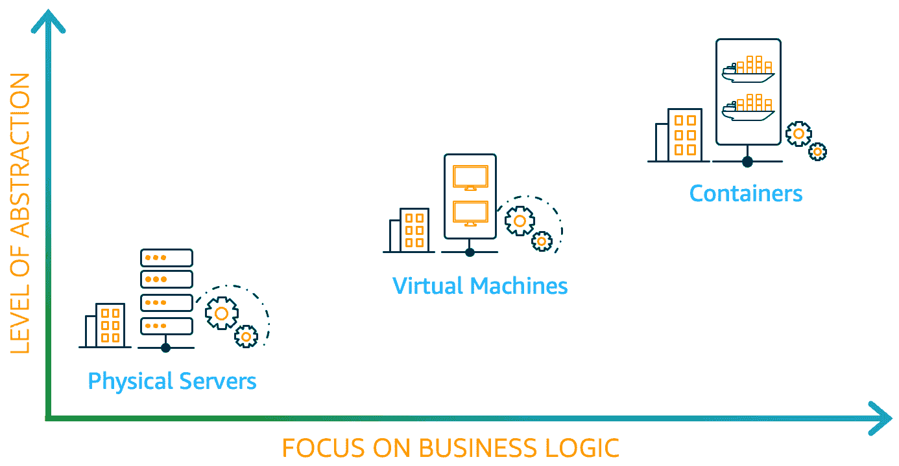
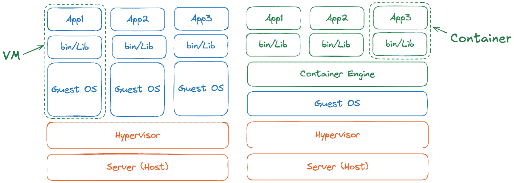
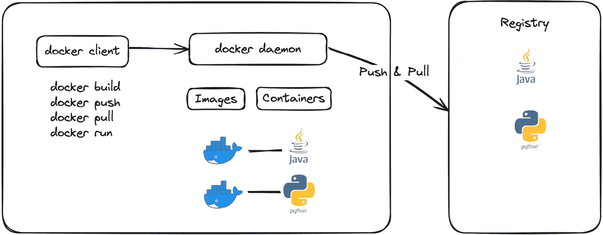
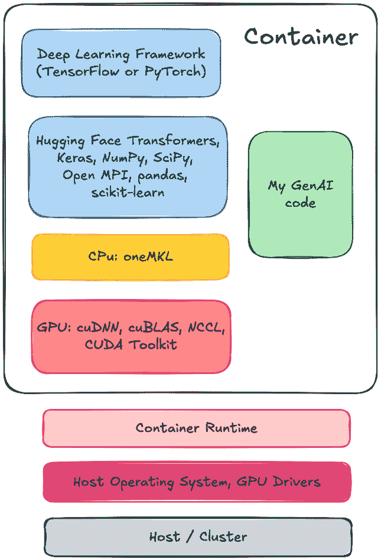
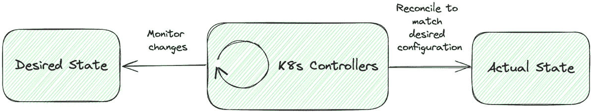
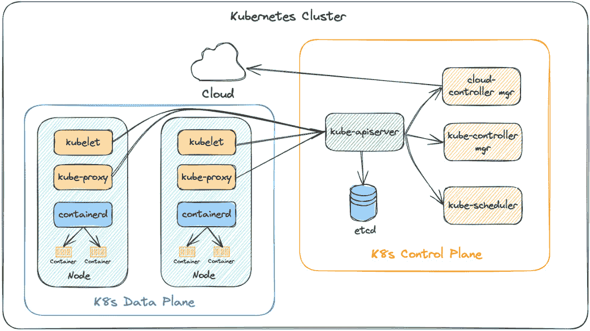

# 2

# Kubernetes – 简介及与 GenAI 的集成

在大规模部署和管理 GenAI 工作负载时，会面临诸多挑战，包括构建模型、打包模型进行分发，以及确保有效的部署和扩展。在本章中，我们将讨论容器和**Kubernetes**（**K8s**）的概念，以及它们为什么成为应对这些复杂性强大解决方案的趋势。它们正成为 OpenAI（[`openai.com/index/scaling-kubernetes-to-7500-nodes/`](https://openai.com/index/scaling-kubernetes-to-7500-nodes/)）和 Anthropic（[`youtu.be/c9NJ6GSeNDM?si=xjei4T9VfZvejD5o&t=2412`](https://youtu.be/c9NJ6GSeNDM?si=xjei4T9VfZvejD5o&t=2412)）等公司的事实标准，用于部署 GenAI 工作负载。我们将涵盖以下主要内容：

+   理解容器

+   为什么选择容器来运行 GenAI 模型

+   什么是 Kubernetes（K8s）？

# 理解容器

容器通过标准化打包格式，彻底改变了我们管理应用程序的方式。借助容器的可移植性，应用程序被打包成一个标准的软件单元，包含所有代码和依赖项，以便在各种环境中（如本地、公共云和私有云）一致且可靠地部署。容器还被认为是**虚拟机**（**VM**）技术的演进，其中多个容器在同一个操作系统上运行，共享底层内核以提高整体服务器利用率。这是容器的巨大优势，因为没有多个**操作系统**（**OSes**）和其他操作系统级组件的开销。因此，容器可以更快地启动和停止，同时提供隔离性。

以下图示展示了计算环境的演变，突出了向更高层次抽象的转变，以及对业务逻辑的关注日益增强。



图 2.1 – 容器技术的演变

物理服务器提供最少的抽象，需大量手动配置，并且存在资源低效问题。虚拟机通过使用虚拟化技术来抽象底层硬件资源，提供一种折中的方案。这使得你可以在同一台物理服务器上运行多个虚拟机，从而提高资源利用率和安全性。然而，它们体积庞大，启动速度较慢。容器通过将应用程序和依赖项封装在便于移植的单元中，提供了最高级别的抽象，让我们可以更多地专注于开发和优化业务逻辑，而不是管理基础设施。*图 2.2* 展示了虚拟机和容器之间的高层次差异。



图 2.2 – 虚拟机与容器的对比

容器技术的实现得益于 Linux 内核中的命名空间（namespaces）和控制组（cgroups）。它们构成了提供隔离和资源限制的基础构件。**Linux 命名空间** ([`man7.org/linux/man-pages/man7/namespaces.7.html`](https://man7.org/linux/man-pages/man7/namespaces.7.html)) 是操作系统资源的一种抽象。它将操作系统级别的资源进行划分，使得不同的进程集合即使在同一操作系统内核上运行，也能看到不同的资源集（如网络、文件系统等）。**控制组** ([`man7.org/linux/man-pages/man7/cgroups.7.html`](https://man7.org/linux/man-pages/man7/cgroups.7.html)) 用于管理一组进程的系统资源的隔离和使用，如 CPU、内存、网络等，并可以选择性地强制执行限制和约束。这些能力使容器能够为现代应用程序抽象操作系统组件。

## 容器术语

以下是一些与容器相关的术语，它们在阅读本书时至关重要：

+   **容器运行时**：这是一个主机级别的进程，负责创建、停止和启动容器。它与低级容器运行时（如 runc）交互，为容器设置命名空间和控制组。常见的容器运行时包括 containerd、CRI-O 等。

+   **容器镜像**：这是一个轻量级、独立的可执行包，包含了运行软件所需的一切，包括代码、运行时、库、环境变量和配置文件。它是通过 Dockerfile 创建的，Dockerfile 是一个包含一组指令的纯文本定义文件，用来安装依赖、应用程序等。容器镜像的典型特征包括以下几点：

    +   **自包含**：它封装了运行软件应用所需的一切。

    +   **不可变**：它是只读的；任何更改都需要创建新的镜像。

    +   **分层**：镜像是分层构建的，每一层都代表一个文件系统。这使得镜像具有高度的效率，因为相同的层可以在多个镜像之间共享。

    +   **可移植**：由于镜像打包了应用程序及其所有依赖项，因此可以在任何支持容器运行时的系统上运行，使其具有高度的可移植性。

+   **容器注册表**：这是一个用于管理和分发容器镜像的工具。常见的注册表包括 Docker Hub ([`hub.docker.com/`](https://hub.docker.com/))、亚马逊弹性容器注册表 ([`aws.amazon.com/ecr/`](https://aws.amazon.com/ecr/))、谷歌 Artifact Registry ([`cloud.google.com/artifact-registry`](https://cloud.google.com/artifact-registry)) 等。工具如 Artifactory 和 Harbor 可以用来自托管注册表。

+   **容器**：这是一个通过容器运行时从容器镜像创建的正在运行的实例或进程。

现在，让我们通过 Docker 来了解高级容器工作流，Docker 是一个旨在帮助开发人员构建、分享和运行容器应用程序的软件平台。Docker 遵循传统的客户端-服务器架构。当你在主机上安装 Docker 时，它会运行一个名为 Docker 守护进程的服务器组件和一个客户端组件——Docker CLI。**守护进程**负责创建和管理镜像，使用这些镜像运行容器，并设置网络、存储等。如*图 2.3*所示，Docker CLI 用于与 Docker 守护进程交互，以构建和运行容器。一旦镜像构建完成，Docker 守护进程可以将这些镜像推送到容器注册表，或从容器注册表拉取镜像。将镜像存储在容器注册表中可以使它们具有可移植性，并且可以在任何有容器运行时的地方运行。



图 2.3 – Docker 架构概述

## 创建容器镜像

让我们创建第一个 hello world 容器镜像并在本地运行它。请使用 [`docs.docker.com/engine/install/`](https://docs.docker.com/engine/install/) 上的 Docker 文档页面，在你的机器上安装 Docker 引擎。以下是不同操作系统安装 Docker Desktop 的链接：

+   Docker Desktop for Linux: [`docs.docker.com/desktop/install/linux-install/`](https://docs.docker.com/desktop/install/linux-install/)

+   Docker Desktop for Mac (macOS): [`docs.docker.com/desktop/install/mac-install/`](https://docs.docker.com/desktop/install/mac-install/)

+   Docker Desktop for Windows: [`docs.docker.com/desktop/install/windows-install/`](https://docs.docker.com/desktop/install/windows-install/)

在以下 Dockerfile 中，我们使用 `nginx` 服务器创建一个简单的 hello world 应用程序。我们将使用 `nginx` 作为父镜像，并将 `index.html` 自定义为我们的 *Hello World!* 消息。让我们按照以下步骤开始：

1.  创建一个具有以下内容的 Dockerfile：

    ```
    FROM nginx
    RUN echo "Hello World!" > /usr/share/nginx/html/index.html
    ```

1.  使用 `v1` 标签构建容器镜像：

    ```
    $ docker build -t hello-world:v1 .
    ```

    你可以使用以下命令列出本地的容器镜像：

    ```
    $ docker images
    REPOSITORY     TAG       IMAGE ID       CREATED       SIZE
    hello-world    v1        7a5469eb898f   2 mins ago    273MB
    ```

1.  使用 `hello-world` 镜像运行容器，并将 nginx 的端口 `80` 映射到主机的 `8080` 端口：

    ```
    $ docker run -p 8080:80 hello-world:v1
    ```

1.  现在我们已经启动了镜像，我们可以通过访问本地的 `8080` 来测试容器：

    ```
    $ curl http://localhost:8080/
    Hello World!
    ```

作为可选步骤，你也可以将容器镜像推送到 `xyz` 容器注册表，以便你可以在任何地方运行它。将 `xyz` 替换为你的容器仓库名称。例如，按照 [`www.docker.com/blog/how-to-use-your-own-registry-2/`](https://www.docker.com/blog/how-to-use-your-own-registry-2/) 上的说明创建 Docker Hub 中的注册表：

```
$ docker tag hello-world:v1 xyz/hello-world:v1
$ docker push xyz/hello-world:v1
```

在本节中，我们学习了计算环境的演变，使用容器相比传统物理服务器和虚拟机的优势。我们了解了整体的 Docker 架构以及各种关键的容器术语，并构建和运行了我们的第一个 hello-world 容器应用。接下来，让我们探讨为什么容器是 GenAI 模型的理想选择。

## 为什么为 GenAI 模型选择容器？

开发 ML 或 GenAI 应用的一个典型挑战是使用复杂且不断发展的开源 ML 框架，如 PyTorch 和 TensorFlow，ML 工具包如 Hugging Face Transformers，以及来自 NVIDIA 的不断变化的 GPU 硬件生态系统和来自亚马逊、谷歌等的定制加速器。

以下图示展示了创建和运行 ML 或 GenAI 容器所涉及的各种组件。



图 2.4 – 典型的 GenAI 容器镜像

在容器的最上层，封装了各种软件库、深度学习框架和用户提供的代码。下一组层包含硬件层特定的库，用于与主机上的 GPU 或定制加速器交互。可以使用容器运行时从容器镜像启动容器。让我们深入探讨使用容器处理 GenAI 工作负载的显著优势：

+   **依赖管理**：由于框架和版本间的相互依赖，依赖管理可能变得至关重要。通过容器，我们可以将 GenAI 应用程序代码及其依赖项封装在容器镜像中，并在开发者机器或测试/生产环境中始终如一地使用。

+   **资源访问**：GenAI/ML 应用计算密集型，需访问单个或多个 GPU 或定制加速器，并根据工作负载需求动态调整资源分配。容器允许对资源分配进行细粒度控制，能够高效利用可用资源，并避免邻居噪声问题。容器还可以水平或垂直扩展，以应对应用程序需求的增加。

+   **模型版本控制和更新**：管理模型的不同版本并保持相关依赖项更新而不干扰应用程序可能是一个挑战。使用容器，可以创建和版本化不同的镜像，便于跟踪更改、管理不同的模型版本，并在需要时无缝地执行回滚。我们还将探讨如何使用容器编排引擎来自动化这些更新，稍后将在 *第十一章*中进行详细介绍。

+   **安全性**：在开发 GenAI 应用时，保护训练和推理阶段的数据至关重要。通过使用容器，我们可以为数据访问实施严格的访问控制和策略，减少攻击面，只在容器镜像中包含必要的组件，还可以在容器与底层主机之间提供一层隔离。

通过提供隔离、一致和可重现的环境，容器可以简化依赖管理、优化资源效率、简化模型部署并提高整体系统安全性。容器技术全面解决了 GenAI 应用开发中的所有挑战，因此成为事实上的首选。

## 构建 GenAI 容器镜像

让我们亲身体验构建第一个 GenAI 容器镜像并将其部署到本地。首先，我们将从**Hugging Face**([`huggingface.co/`](https://huggingface.co/))下载模型文件，这是一个帮助用户构建、部署和测试机器学习模型的 AI/ML 平台。Hugging Face 运营着**模型中心**，开发者和研究人员可以在这里共享成千上万的预训练模型。它还支持多种框架，包括 TensorFlow、PyTorch 和 ONNX。

在本教程中，我们将使用**Meta**的一个流行开源模型**Llama 2**([`llama.meta.com/llama2/`](https://llama.meta.com/llama2/))。不过，您需要阅读并遵守模型的条款和条件。请访问 Hugging Face 的 Llama 模型页面([`huggingface.co/meta-llama/Llama-2-7b`](https://huggingface.co/meta-llama/Llama-2-7b))以请求访问该模型。Llama 2 模型有多个版本：7B、13B 和 70B，其中 B 代表十亿参数。模型的大小越大，所需的资源就越多。考虑到并非所有个人笔记本电脑都配备了专门的硬件（如 GPU），我们将使用 Llama 2 模型的 CPU 版本。这得益于**llama.cpp**([`github.com/ggerganov/llama.cpp`](https://github.com/ggerganov/llama.cpp))，这是一个开源项目，旨在提供 Llama 模型的高效且可移植的实现。它使我们能够在各种平台上（包括个人电脑）部署这些模型，而无需 GPU。llama.cpp 采用定制量化方法，将模型压缩为 GGUF 格式，从而减少模型的大小和资源需求。

通过`5000`创建推理端点，并接受包含输入提示、系统消息等的 JSON 请求。输入参数将传递给 Llama 模型，并以 JSON 格式返回模型输出。让我们开始这个过程：

1.  安装先决条件：

    +   从[`huggingface.co/docs/huggingface_hub/en/installation`](https://huggingface.co/docs/huggingface_hub/en/installation)安装`huggingface-cli`

    +   来自[`jqlang.github.io/jq/download/`](https://jqlang.github.io/jq/download/)的`jq`

    +   来自[`docs.docker.com/engine/install/`](https://docs.docker.com/engine/install/)的**Docker Engine**

1.  按照[`huggingface.co/docs/huggingface_hub/en/guides/cli`](https://huggingface.co/docs/huggingface_hub/en/guides/cli)上的说明进行 Hugging Face 平台的身份验证。

1.  使用`huggingface-cli`下载 Llama 2 模型：

    ```
    $ huggingface-cli download TheBloke/Llama-2-7B-Chat-GGUF llama-2-7b-chat.Q2_K.gguf --local-dir . --local-dir-use-symlinks False
    ```

1.  模型下载完成后，将显示以下消息：

    ```
    $ Download complete. Moving file to llama-2-7b-chat.Q2_K.gguf
    llama-2-7b-chat.Q2_K.gguf
    ```

1.  创建一个包含 Flask 代码的`app.py`。此代码块设置了一个 Python Flask 应用程序，具有一个单一路由`/predict`，它接受 HTTP POST 请求。它使用`llama_cpp`库加载 Llama 2 模型，基于输入提示和请求中的系统消息生成响应，并将模型的响应作为 JSON 对象返回。你可以从 GitHub 下载`app.py`代码：[`github.com/PacktPublishing/Kubernetes-for-Generative-AI-Solutions/blob/main/ch2/app.py`](https://github.com/PacktPublishing/Kubernetes-for-Generative-AI-Solutions/blob/main/ch2/app.py)：

    ```
    from flask import Flask, request, jsonify
    import llama_cpp
    app = Flask(__name__)
    model = llama_cpp.Llama("llama-2-7b-chat.Q2_K.gguf")
    @app.route('/predict', methods=['POST'])
    def predict():
        data = request.json
        prompt = f"""<s>[INST] <<SYS>>{data.get('sys_msg', '')}<</SYS>>{data.get('prompt', '')} [/INST]"""
        response = model(prompt, max_tokens=1000)
        return jsonify({'response': response})
    if __name__ == '__main__':
        app.run(host='0.0.0.0', port=5000)
    ```

1.  创建一个 Dockerfile，将 Python 源代码、Llama 2 模型和其他依赖项打包在一起。你可以从 GitHub 下载 Dockerfile 代码：[`github.com/PacktPublishing/Kubernetes-for-Generative-AI-Solutions/blob/main/ch2/Dockerfile`](https://github.com/PacktPublishing/Kubernetes-for-Generative-AI-Solutions/blob/main/ch2/Dockerfile)：

    ```
    # Use an official Python runtime as a parent image
    FROM python
    # Set the working directory
    WORKDIR /app
    # Expose the application on port 5000
    EXPOSE 5000
    # Define environment variable
    ENV FLASK_APP=app.py
    # Install any needed packages specified in requirements.txt
    RUN pip install --no-cache-dir flask llama-cpp-python
    # Copy the current dir contents into the container at /app
    COPY . /app
    # Run app.py when the container launches
    CMD ["python", "app.py"]
    ```

1.  构建容器镜像：

    ```
    8000:

    ```

    curl:

    ```
    $ curl -X POST http://localhost:8000/predict -H "Content-Type: application/json" -d '{"prompt":"Create a poem about humanity?","sys_msg":"You are a helpful, respectful, and honest assistant. Always provide safe, unbiased, and positive responses. Avoid harmful, unethical, or illegal content. If a question is unclear or incorrect, explain why. If unsure, do not provide false information."}' | jq .
    ```

    ```

    ```

这将对我们的本地`my-llama`容器进行推理，并返回以下 LLM 响应：

```
……
Of course, I'm here to assist you with a safe and positive response! Here's a poem about humanity:
Humanity, oh humanity, so diverse and wide,
A mix of cultures, beliefs, and ideals inside.
We may come from different places, with different views,
But beneath our differences, we share a common brew.
……
So here's to humanity, in all its grace and might,
A masterpiece of diversity, a work of art in sight.
Let us cherish each other, with kindness and respect,
And create a world where love is the only text.
```

输入请求包含两个关键属性：

+   **提示**：输入给 LLM 的内容

+   **系统消息**：在请求过程中设置上下文并引导 LLM 的行为

可选地，我们可以传递额外的属性，如`max_tokens`，以限制生成输出的长度。

如果你注意到我们构建的镜像大小，它大约是 7+ GB。这主要归因于模型文件和其他依赖项。我们将在后续的*第九章*中探索减少镜像大小和优化容器启动时间的技术。

在我们本地计算机上创建并运行一个单一容器实例是很容易的。试想一下，在数百或数千个虚拟机上运行这些容器，并确保这些容器高度可用、可扩展、负载均衡，管理资源分配，并实现自动化部署和回滚。这就是**容器编排器**派上用场的地方。

容器编排器在现代软件开发和部署中发挥着至关重要的作用，解决了所有前述问题，并大规模管理容器化应用程序。它们的一些关键优势如下：

+   **高可用性和容错性**：它们会定期监控容器的健康状态，自动重启/替换失败的容器，从而确保所需数量的容器始终处于运行状态。

+   **扩展性**：它们可以根据用户负载/需求自动扩展应用程序。容器实例会根据应用程序负载自动创建和删除。当应用程序进行扩展时，底层计算资源也会进行扩展，以容纳新的容器。

+   **自动化部署**：它们自动化容器化应用程序在多个主机上的部署，并在发生故障时进行回滚。我们还可以实现高级流量路由模式，如金丝雀发布和蓝绿部署，以安全地推出新的更改。

+   **负载均衡**：它们提供内置的负载均衡，将传入的流量分配到多个容器实例，提升性能和可靠性。它们还可以与外部负载均衡解决方案集成，以进行流量的负载均衡。

+   **服务发现**：由于容器本质上是短暂的，编排工具提供服务发现功能，以动态发现容器端点，促进服务间通信。它们还管理容器网络，包括 IP 地址管理、DNS 解析和网络分段。

+   **可观察性**：它们可以与监控和日志工具集成，提供对容器化应用程序健康状况和性能的可视化。

+   **资源管理和高级调度**：它们还可以管理容器的资源分配，包括 CPU、内存、GPU 等。它们强制执行资源限制和预留，防止“吵闹邻居”问题。可以使用高级调度策略，将具有特殊硬件需求（如 GPU）的应用程序调度到特定主机上。

现在我们已经理解了容器编排器的必要性，下一个问题是我们应该选择哪个编排器？市场上有许多不同的开源和专有编排器。一些值得注意的编排器如下：

+   **Amazon Elastic Container** **Service** ([`aws.amazon.com/ecs/`](https://aws.amazon.com/ecs/))

+   **Azure Container** **Apps** ([`azure.microsoft.com/en-us/products/container-apps`](https://azure.microsoft.com/en-us/products/container-apps))

+   **Docker** **Swarm** ([`docs.docker.com/engine/swarm/`](https://docs.docker.com/engine/swarm/))

+   **Apache** **Mesos** ([`mesos.apache.org/`](https://mesos.apache.org/))

+   Kubernetes ([`kubernetes.io/`](https://kubernetes.io/))，以及像**Amazon Elastic Kubernetes** **Service** ([`aws.amazon.com/eks/`](https://aws.amazon.com/eks/))这样的托管 Kubernetes 服务

+   **Google Kubernetes Engine (GKE)** ([`cloud.google.com/kubernetes-engine`](https://cloud.google.com/kubernetes-engine))

+   **Azure Kubernetes Service (****AKS)** ([`azure.microsoft.com/en-us/products/kubernetes-service`](https://azure.microsoft.com/en-us/products/kubernetes-service))

+   **Red Hat** **OpenShift** ([`www.redhat.com/en/technologies/cloud-computing/openshift`](https://www.redhat.com/en/technologies/cloud-computing/openshift))

在本节中，我们了解了构建 GenAI 模型的典型挑战，以及如何利用容器技术将 GenAI 代码/模型、AI/ML 框架、硬件特定库和其他依赖项打包成镜像，以确保一致性、可重用性和可移植性。我们还使用开源 Llama 2 模型构建了我们的第一个 GenAI 容器镜像，并通过在本地部署运行推理。最后，我们讨论了大规模管理容器化应用程序的挑战，以及 K8s 等容器编排工具如何解决这些问题。在下一节中，让我们深入了解 K8s 及其架构，看看它为什么非常适合运行 GenAI 模型。

# 什么是 Kubernetes（K8s）？

Kubernetes，通常称为 K8s，是一个开源的容器编排平台，能够自动化容器化应用程序的部署、扩展和管理。它是最广泛使用的容器编排平台 ([`www.cncf.io/reports/kubernetes-project-journey-report/`](https://www.cncf.io/reports/kubernetes-project-journey-report/))，并且已成为许多企业运行各种工作负载的事实标准。

Kubernetes 最初由 Google 工程师 Joe Beda、Brendan Burns 和 Craig McLuckie 于 2014 年开发，现在由**云原生计算基金会**（**CNCF**）维护，其名称来源于古希腊语，意为“领航员”或“舵手”（负责掌舵的人）。它已经成为全球第二大开源项目，仅次于 Linux，并且是 71%财富 100 强公司使用的主要编排工具 ([`www.cncf.io/reports/kubernetes-project-journey-report/`](https://www.cncf.io/reports/kubernetes-project-journey-report/))。根据 Gartner 的*《CTO 的容器与 Kubernetes 指南》* ([`www.gartner.com/en/documents/5128231`](https://www.gartner.com/en/documents/5128231))，到 2027 年，全球 90%以上的组织将在生产环境中运行容器化应用程序。

Kubernetes（K8s）变得如此受欢迎的几个显著因素如下：

+   **丰富的社区和生态系统**：K8s 拥有来自 44 个不同国家的 77K+贡献者，并由 8K+公司贡献，是最具活力和活跃的社区 ([`www.cncf.io/reports/kubernetes-project-journey-report/`](https://www.cncf.io/reports/kubernetes-project-journey-report/))。CNCF 的调查表明，与 Kubernetes 相关的项目（如 Helm、Prometheus 和 Istio）也得到了广泛采用，进一步加强了其生态系统。

+   **全面的功能**：K8s 提供了一系列丰富的功能，包括自动化部署与回滚、自愈、横向扩展、服务发现和负载均衡等。这些功能使其成为管理容器化应用程序的多功能和强大工具。

+   **可移植性**：K8s 抽象化了底层基础设施，使得应用程序可以在本地、公共云、私有云、混合云或边缘位置一致地进行部署。

+   **托管 K8s 服务**：主要云服务提供商如 Amazon EKS、GKE 和 AKS 提供的托管 K8s 服务大大降低了入门门槛。这些服务去除了运行和操作 K8s 集群的操作复杂性，使企业能够专注于核心业务目标。

+   **强大的治理**：自 2016 年以来，K8s 由 CNCF 进行治理，这促进了协作开发和社区参与，使来自不同开发者、组织和最终用户的贡献得以实现。它遵循开源模式，具有明确的治理结构，包括关注特定开发和操作领域的**特别兴趣小组**（**SIGs**）。

+   **声明式配置**：K8s 采用声明式的方法进行配置管理，允许用户使用 YAML 或 JSON 文件定义应用程序和基础设施的期望状态。如*图 2.5*所示，K8s 控制器持续监控资源的当前状态，并自动进行调整，以匹配期望状态，从而简化操作并确保一致性。



图 2.5 – K8s 控制器的工作原理

+   **可扩展性**：这可能是 K8 如此受欢迎的最重要原因。K8s 设计采用模块化架构，支持通过明确定义的 API 进行自定义插件和扩展。这使得开发者和公司能够扩展或定制 K8s 功能，而无需修改上游代码，促进了创新和适应性。

接下来，让我们来看一下 Kubernetes 的架构。

## Kubernetes 架构

K8s 架构基于运行集群，使您的应用程序/容器能够跨多个主机运行。每个集群由两种类型的节点组成：

+   **控制平面**：K8s 控制平面是集群操作的“大脑”。它由关键组件组成，如 kube-apiserver、etcd、调度管理器、控制器管理器和云控制器管理器。

+   **数据平面/工作节点**：K8s 数据平面运行在工作节点上，由多个关键组件组成，如 kube-proxy、kubelet 和**容器网络接口**（**CNI**）插件。

*Figure 2**.6* 描述了高级别的 K8s 集群架构。您会注意到 kube-apiserver 是 K8s 控制平面的前端，并与其他控制平面组件（如控制器管理器、etcd 等）交互，以满足请求。K8s 工作节点托管多个关键组件，负责从 kube-apiserver 接收指令，在工作节点上执行它们，并报告状态。



图 2.6 – Kubernetes 集群架构

### 控制平面组件

控制平面的主要组件如下所示:

+   **kube-apiserver**：这充当 K8s 集群的入口点或前端，并且是暴露 K8s API 的中央管理组件。K8s 用户、管理员和其他组件使用此 API 与集群通信。它还与 etcd 组件通信以保存 K8s 对象的状态。它还处理认证和授权、验证和请求处理，并与其他控制平面和数据平面组件通信，以管理集群状态。

+   **etcd**：这是分布式键值存储，用作所有集群状态的 K8s 后端存储。它存储所有 K8s 对象的配置数据和对它们进行的任何更新，并确保集群状态始终可靠和可访问。定期备份 etcd 数据库至关重要，以便在任何中断情况下恢复集群。

+   **kube-controller-manager**：负责管理集群中的各种控制器。这包括默认的上游控制器和任何定制构建的控制器。一些示例包括以下内容：

+   **Deployment controller**：监视 K8s 部署对象，并管理对 K8s Pod 的更新。

+   **kube-scheduler**：负责在工作节点上调度 K8s Pod。它监视 API 服务器以获取新创建的 Pod，并根据资源可用性、Pod 配置中定义的调度要求（如 nodeSelectors、Pod/node 亲和性、拓扑传播等）分配工作节点。当由于资源耗尽等原因无法调度 Pod 时，它将标记 Pod 为*Pending*，以便其他操作附加组件（如集群自动缩放器）可以介入并向集群添加/删除计算容量（工作节点）。

+   **cloud-controller-manager**：管理云特定控制器，处理云提供商 API 调用以进行资源管理。它是从 K8s 核心到云提供商 API 的网关，负责根据 K8s 对象的更改（如节点、服务等）创建和管理云提供商特定的资源（如节点、负载均衡器等）。一些示例包括以下内容：

    +   **Node controller**：负责监控工作节点的健康状况，并处理集群中节点的添加或删除。

    +   **服务控制器**：它监视服务和节点对象的变化，并相应地创建、更新和删除云提供商负载均衡器。

### 数据平面组件

数据平面的主要组件如下：

+   **kubelet**：这是一个代理程序，运行在集群中的每个工作节点上。它负责从 kube-apiserver 接收指令，在相应的工作节点上执行这些指令，并将节点组件的更新报告回集群控制平面。它与其他节点组件互动，如容器运行时以启动容器进程，CNI 插件以设置容器网络，以及 CSI 插件以管理持久化存储卷等。

+   **kube-proxy**：这是一个网络代理，运行在集群中的每个工作节点上，实现了 K8s 服务概念。它维护工作节点上的网络路由规则，允许集群内外的网络通信到达或离开你的 Pods。它使用操作系统的包过滤层，如 IP tables、IPVS 等，将流量路由到集群中的其他端点。

+   **容器运行时**：containerd 是事实上的容器运行时，负责在工作节点上启动容器。它负责管理 K8s 环境中容器的生命周期。K8s 还支持其他容器运行时，如 CRI-O。

除了这些组件外，在 K8s 集群中部署额外的附加软件对于生产操作是至关重要的。这些附加组件提供监控、安全和网络等功能。

### 附加软件组件

下面是一些附加软件的示例：

+   **CNI 插件**：这是一个实现容器网络规范的软件附加组件。它们遵循 K8s 网络原则，并负责为 K8s Pods 分配 IP 地址（[`kubernetes.io/docs/concepts/workloads/pods/`](https://kubernetes.io/docs/concepts/workloads/pods/)），并使它们能够在集群内相互通信。这个领域的流行附加组件有 Cilium（[`github.com/cilium/cilium`](https://github.com/cilium/cilium)）、Calico（[`github.com/projectcalico/calico`](https://github.com/projectcalico/calico)）和 Amazon VPC CNI（[`github.com/aws/amazon-vpc-cni-k8s`](https://github.com/aws/amazon-vpc-cni-k8s)）。

+   **CSI 插件**：这是一个实现容器存储接口（CSI）规范的软件附加组件。它们负责为 K8s Pods 提供持久存储卷，并管理这些卷的生命周期。一些著名的附加组件包括 Amazon EBS CSI 驱动程序（[`github.com/kubernetes-sigs/aws-ebs-csi-driver`](https://github.com/kubernetes-sigs/aws-ebs-csi-driver)）和 Portworx CSI 驱动程序（[`docs.portworx.com/portworx-enterprise/operations/operate-kubernetes/storage-operations/csi`](https://docs.portworx.com/portworx-enterprise/operations/operate-kubernetes/storage-operations/csi)）。

+   **CoreDNS**：这是一个必不可少的软件附加组件，用于提供集群内的 DNS 解析。在 K8s 工作节点中启动的容器会自动将此 DNS 服务器包含在其 DNS 查询中。

+   **监控插件**：这是一个软件附加组件，提供对集群基础设施和工作负载的可观察性。它们提取关键的可观察性细节，如日志、指标和跟踪，并将其写入监控平台，如 Prometheus、Amazon CloudWatch、Splunk、Datadog 和 New Relic。

+   **设备插件**：现代 AI/ML 应用程序使用诸如 NVIDIA、Intel 和 AMD 的 GPU，以及 Amazon、Google 和 Meta 的定制加速器等专用硬件设备。K8s 提供了一个设备插件框架，您可以使用它向 kubelet 和控制平面广播系统硬件资源，以便根据这些资源的可用性做出调度决策。

这并不是 K8s 所有组件和附加组件的详尽列表。我们将在本书的后续部分深入探讨与 AI/ML 相关的附加组件。

在本节中，我们深入探讨了 K8s 架构，了解了各种控制平面和数据平面组件，探索了 K8s 平台的优势以及为什么它成为社区中的事实标准。接下来，我们将了解为什么 K8s 非常适合运行 GenAI 模型。

## 为什么 K8s 非常适合运行 GenAI 模型

既然我们已经理解了 K8s 架构、其组件以及平台的优势，那么接下来让我们讨论如何应用这些优势来解决运行 GenAI 模型时常见的挑战。

### 运行 GenAI 模型的挑战

运行 GenAI 模型时的一些常见挑战如下：

+   **计算要求**：GenAI 模型越来越大且复杂，因此需要大量的计算资源，包括 GPU、TPU 和用于训练和推理的定制加速器。有效管理这些资源对于确保性能和成本效率至关重要。

+   **可扩展性**：随着 AI/ML 服务需求的增加，扩展 GenAI 模型以应对需求至关重要。这要求能够无缝扩展计算资源，同时不牺牲模型的性能和成本。

+   **可观察性**：随着 GenAI 模型的普及，了解它们的性能变得至关重要，这需要通过日志和指标监控业务级别的关键绩效指标（KPI）以及整个系统的健康状况。

+   **数据管理**：GenAI 模型依赖于大量的数据进行训练和推理。数据的准备、安全性和管理对提高模型的准确性和性能至关重要。

+   **部署复杂性**：正如我们在本章前面所学，所有 GenAI 模型都需要自定义框架、插件库和其他依赖项来进行部署。这种复杂性可能导致部署问题、延迟和错误增多。

### K8s 优势

K8s 提供了若干优势，能够帮助应对运行 GenAI 模型的挑战，具体如下：

+   **高效的资源管理**：K8s 具有强大的资源管理系统，内置于 kube-scheduler 中。它自动将 K8s Pod 分配到工作节点，同时满足不同的调度要求/约束条件。调度器可以配置为以最低成本、随机或按 bin-pack 模式进行操作，以提供灵活性。凭借 K8s 的扩展性，您可以开发自定义调度器并用于工作负载的调度。一个常见的应用场景是将训练或推理工作负载调度到具有自定义设备的设备上，例如 AWS Trainium 和 Inferentia。通过使用 K8s，我们可以根据模型要求实现动态资源分配，从而优化成本并提高性能。

+   **无缝的可扩展性**：训练或微调 GenAI 模型需要大量的计算资源。这些模型的推理端点也需要根据工作负载需求进行水平扩展。这将通过使用 K8s 自动扩展机制无缝实现，如 **水平 Pod 自动扩展** (**HPA**) ([`kubernetes.io/docs/tasks/run-application/horizontal-pod-autoscale/`](https://kubernetes.io/docs/tasks/run-application/horizontal-pod-autoscale/))，**垂直 Pod 自动扩展** (**VPA**) ([`github.com/kubernetes/autoscaler/tree/master/vertical-pod-autoscaler`](https://github.com/kubernetes/autoscaler/tree/master/vertical-pod-autoscaler))，和 **集群自动扩展** ([`kubernetes.io/docs/concepts/cluster-administration/cluster-autoscaling/`](https://kubernetes.io/docs/concepts/cluster-administration/cluster-autoscaling/))。HPA 会自动扩展工作负载资源（如 Deployment 或 StatefulSet），以匹配工作负载需求。它通过创建和部署新的 K8s Pods 来响应需求。VPA 会自动调整 Pod 的资源限制（如 CPU、内存等），以匹配其实际使用情况。它有助于优化资源分配，确保工作负载的高效运行。集群自动扩展负责确保集群始终附加了正确数量的资源。我们将在*第六章*中深入探讨这些机制。

+   **可扩展性**：可扩展性在 K8s 上运行 GenAI 工作负载中起着至关重要的作用。它允许你在不修改上游代码的情况下，以可扩展的方式扩展 K8s 的功能。我们可以使用自定义构建的附加组件，如 **Kubeflow**（[`www.kubeflow.org/`](https://www.kubeflow.org/)），一个提供管理 ML 管道、模型训练和部署的自定义资源的 AI/ML 平台。硬件公司也可以通过开发设备插件来利用这一点，以管理 K8s 中的 GPU 资源，从而确保 GenAI 的训练和推理工作负载能够按需调度。GenAI 工作负载通常需要特定的框架，如 **PyTorch**、**TensorFlow** 和 **Jupyter Notebook**。我们可以使用自定义构建的操作符，将这些框架和工具集成在一起，以实现无缝开发和部署。

+   **安全性**：K8s 有许多内置的安全机制来保护 GenAI 工作负载的安全。可以使用 **基于角色的访问控制**（**RBAC**）（[`kubernetes.io/docs/reference/access-authn-authz/rbac/`](https://kubernetes.io/docs/reference/access-authn-authz/rbac/)）来限制对资源的访问，确保只有授权的用户或应用程序可以访问敏感数据。K8s Secrets 或外部秘密管理解决方案可以用于保护敏感信息。K8s 网络策略可以用于实施网络分段，以便只有授权的 Pod 能够访问数据存储。除此之外，我们还可以启用安全控制，如加密、审计日志、安全扫描以及 **Pod 安全标准**（**PSS**）（[`kubernetes.io/docs/concepts/security/pod-security-standards/`](https://kubernetes.io/docs/concepts/security/pod-security-standards/)），以确保强大的安全态势。我们将在*第九章*中详细探讨这些功能。

+   **高可用性（HA）和容错性**：这些在高效、可靠地运行 GenAI 工作负载中起着至关重要的作用。基础模型训练通常需要数周或数月。如果节点或 Pod 发生故障，K8s 内置的自愈机制可以自动将任务调度到另一个节点，从而最小化中断。AI 框架可以与此一起使用，实施检查点策略，定期保存训练状态。对于模型推理，K8s 可以根据需求自动扩展推理 Pod，并通过启动替代 Pod 来恢复失败的 Pod。K8s 还可以执行滚动蓝绿更新，以部署新版本的模型，并在出现故障时无缝回滚。我们将在*第十三章*中深入探讨这个话题。

+   **丰富的生态系统和附加组件**：《云原生人工智能白皮书》([`www.cncf.io/wp-content/uploads/2024/03/cloud_native_ai24_031424a-2.pdf`](https://www.cncf.io/wp-content/uploads/2024/03/cloud_native_ai24_031424a-2.pdf)) 强调了采用基于 Kubernetes 的工具和框架来简化 AI 模型开发、训练和部署的增长趋势。值得注意的例子包括 Kubeflow 和 MLflow 用于在 K8s 上操作端到端的 ML 平台；KServe、Seldon 和 RayServe 用于模型服务和扩展；以及 OpenLLMetry、TruLens 和 Deepchecks 用于模型可观察性。随着行业围绕 GenAI 用例的成熟，这个列表将继续增长。

在本节中，我们了解了操作 GenAI 模型的典型挑战，并查看了使用 K8s 解决这些挑战的优势。K8s 的可扩展性、高效的资源管理、安全性、高可用性和容错能力使其非常适合大规模运行 GenAI 模型。

# 摘要

在本章中，我们从计算技术的演变和容器作为标准封装和交付应用程序以及为开发人员抽象基础设施复杂性的方式开始。我们讨论了在 GenAI 模型中使用容器的好处，并构建并运行了我们的第一个 hello-world，GenAI 容器映像。然后，我们看了运行和管理大规模容器的挑战，以及像 K8s 这样的容器编排引擎如何帮助简化这一过程。

我们深入探讨了 K8s 的高级架构和构成控制平面和数据平面的各个组件。我们还了解到 K8s 的可扩展性、可移植性、声明性质和强大的社区使其在市场上受欢迎，并成为事实上的容器编排器。

最后，我们讨论了在大规模运行 GenAI 工作负载的典型挑战，以及 K8s 如何通过其高效的资源管理、无缝扩展、可扩展性和安全能力来很好地解决这些挑战。在下一章中，我们将探讨如何在云环境中构建一个 K8s 集群，利用流行的开源工具来管理 GenAI 工作负载，并在其中部署我们的*my-llama*容器。

## 附录

以下是深入学习 Kubernetes 的一些优秀资源：

+   Kubernetes 培训网站：[`kubernetes.io/training/`](https://kubernetes.io/training/)

+   Linux 基金会的 Kubernetes 课程：[`training.linuxfoundation.org/full-catalog/?_sft_product_type=training&_sft_technology=kubernetes`](https://training.linuxfoundation.org/full-catalog/?_sft_product_type=training&_sft_technology=kubernetes)

+   KodeKloud 的 Kubernetes 学习路径：[`kodekloud.com/learning-path/kubernetes/`](https://kodekloud.com/learning-path/kubernetes/)
