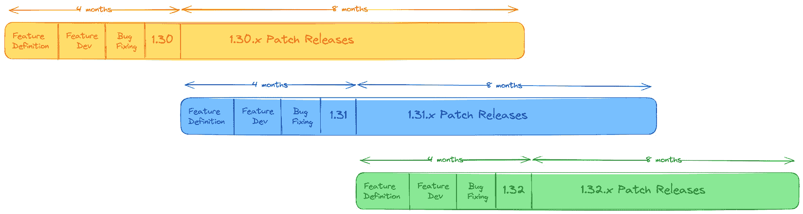
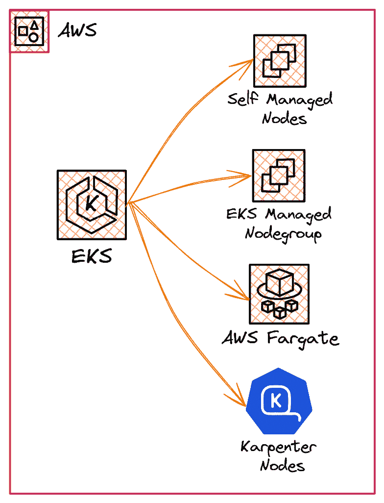
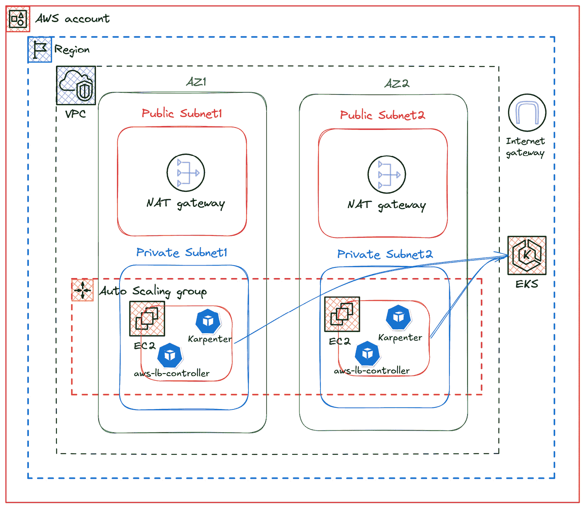

# 第三章：在云中使用 Kubernetes 入门

云计算彻底改变了组织访问可扩展 IT 资源的方式，使得计算、存储和网络服务的快速部署成为可能。对于采用容器化应用程序的团队，**Kubernetes**（**K8s**）已经成为事实上的平台。云服务提供商提供托管的 K8s 服务，如**Amazon** **Elastic Kubernetes Service**（**EKS**）、**Google Kubernetes Engine**（**GKE**）和**Azure Kubernetes Service**（**AKS**），使得在云中运行和部署 GenAI 模型变得更加容易。

在本章中，我们将讨论云计算如何通过减轻一些复杂性，简化生产级 K8s 集群的管理。然后，我们将指导你通过基础设施自动化创建你的第一个集群。

让我们探索以下关键主题：

+   在云中运行 K8s 的优势

+   在云中设置 K8s 集群

+   在 K8s 集群中部署我们的第一个 GenAI 模型

# 在云中运行 K8s 的优势

一份 2023 年发布的报告，《Kubernetes in the wild report 2023》([`www.dynatrace.com/news/blog/kubernetes-in-the-wild-2023/`](https://www.dynatrace.com/news/blog/kubernetes-in-the-wild-2023/))指出，云中 K8s 集群的数量增长速度大约是同时期本地托管集群的五倍。这主要归因于以下几个因素：

+   **托管服务**：运营一个生产级的 K8s 集群通常需要确保控制平面高可用，集群管理活动（如创建、升级和修补所有 K8s 控制平面和数据平面组件）、资源管理、安全性、监控等。许多这些活动增加了显著的运营开销，而这些开销是没有差异化的，且会占用核心业务运营的时间和资源。因此，许多 K8s 用户选择通过选择现有的托管服务之一来将管理 K8s 集群的繁重任务外包。一些著名的托管 K8s 服务如下：

    +   **Amazon EKS**：这是一项托管服务，用于在 AWS 云和本地数据中心运行 K8s。使用 Amazon EKS，你可以利用 AWS 基础设施的所有性能、规模、可靠性和安全性，并且能够与其他 AWS 托管服务进行更深入的集成。欲了解更多信息，请访问[`aws.amazon.com/eks/`](https://aws.amazon.com/eks/)。

    +   **GKE**：这是一个来自**谷歌云平台**（**GCP**）的托管 K8s 服务，你可以利用它在谷歌的基础设施上部署和操作容器化应用程序。它提供标准版和企业版，其中标准版提供完全自动化的集群生命周期管理，企业版则提供强大的功能来治理、管理和操作大规模企业容器化工作负载。如需了解更多信息，请访问 [`cloud.google.com/kubernetes-engine`](https://cloud.google.com/kubernetes-engine)。

    +   **AKS**：这是 Azure 提供的一个托管服务，用于简化 K8s 集群的部署、管理和扩展。AKS 自动化了关键任务，如监控、升级和扩展，同时与其他 Azure 服务（如 Active Directory、负载均衡器和虚拟网络）集成。如需了解更多信息，请访问 [`azure.microsoft.com/en-us/products/kubernetes-service`](https://azure.microsoft.com/en-us/products/kubernetes-service)。

除此之外，还有许多其他由公司提供的托管 K8s 服务，如 Red Hat、Oracle Cloud Infrastructure (OCI)、阿里云等。这些服务的目标是简化 K8s 集群操作，并提供与相应云服务提供商基础设施的更深层次集成。

+   **可扩展性与效率**：云服务提供商通过提供按需基础设施和按量计费的定价模式，提供无缝的 K8s 集群可扩展性。随着集群规模的增长，它们会自动扩展 K8s 控制平面组件，以适应其使用需求。

+   **可用性与全球扩展**：所有托管的 K8s 服务都提供严格的正常运行时间**服务级别协议**（**SLA**）—例如，Amazon EKS 提供 99.95% 的正常运行时间。为了实现这一目标，它们通常会部署多个 API 服务器实例，且其 etcd 数据库组件分布在多个**可用区**（**AZ**）之间，自动监控这些组件的健康状况，并恢复或替换任何不健康的组件。云服务提供商还在多个地理区域运营，这些区域被称为**区域**；注意，不同的云服务提供商对区域的定义可能有所不同。例如，AWS 的一个区域由多个物理上分离且相互隔离的 AZ 组成，这些 AZ 通过低延迟、高吞吐量、高冗余的网络连接。我们可以利用这些区域为全球用户部署工作负载或实施灾难恢复机制。

+   **安全性和合规性**：云服务提供商和消费者之间始终存在共享责任。提供商负责云的安全性和合规性，而作为消费者，你负责云中的安全性和合规性。这意味着云服务提供商确保 K8s 产品的托管组件（如**控制平面**）是安全的，并符合各种合规标准，如**PCI DSS**、**HIPPA**、**GDPR**、**SOC**等。作为消费者，你需要负责保障集群中应用程序和自管 K8s 插件的安全。此外，云服务提供商还负责自动修补控制平面组件，以确保其安全。

+   **原生集成**：要操作一个生产就绪的 K8s 集群，我们需要与许多外部组件进行集成，如存储系统、数据库、负载均衡器以及监控和安全工具。云服务提供商通常为这些组件提供托管服务，并与他们的托管 K8s 产品创建无缝集成。这使得构建端到端解决方案变得更容易，并消除了对各种组件进行兼容性测试的痛苦。它还提供与各种**第三方**（**3P**）工具的无缝集成，如**Splunk**（[`www.splunk.com/`](https://www.splunk.com/)）、**Datadog**（[`www.datadoghq.com/`](https://www.datadoghq.com/)）、**New Relic**（[`newrelic.com/`](https://newrelic.com/)）、**Aqua Security**（[`www.aquasec.com/`](https://www.aquasec.com/)）、**Sysdig**（[`sysdig.com/`](https://sysdig.com/)）、**Kubecost**（[`www.kubecost.com/`](https://www.kubecost.com/)）等，用于监控和安全目的，并为 K8s 工作负载分配和优化成本。

+   **扩展支持**：截至目前，K8s 社区大约每年发布三个新的 K8s 版本。如*图 3.1*所示，每个版本的支持期限为 12 个月。在此期间，社区会提供补丁发布，包括错误修复、安全补丁等。执行多个 K8s 版本的升级通常会为平台工程团队带来较大负担，因为每次版本升级都涉及验证并修复任何已弃用的 API 的使用，以及升级控制平面、数据平面和操作插件，同时确保应用程序的可用性。云服务提供商提供最长 26 个月的扩展支持，帮助客户规划和执行集群升级。始终建议使用最新的 K8s 版本，以便能够利用社区的最新创新，因此，自动化集群生命周期操作使用**基础设施即代码**（**IaC**）是至关重要的。



图 3.1 – K8s 发布周期

在本节中，我们了解了使用各大云服务提供商的托管 K8s 服务的优势。这些服务使我们能够利用云的无缝扩展性、简便的管理和全球扩展，以便满足不同地域客户的需求，同时在运营中高效控制成本并达到甚至超越安全性和合规性要求。接下来，我们将使用基础设施即代码（IaC）在 AWS 云中设置我们的第一个 K8s 集群，并将 `my-llama` 模型部署到其中。

# 在云中设置 K8s 集群

托管 K8s 服务通常是上游的并符合 K8s 标准，这意味着我们可以在不修改应用代码的情况下，无缝地将工作负载从一个服务迁移到另一个服务。你可能仍然需要使用云服务商特定的附加组件，以便与相应的云服务进行集成。由于这一点，在本书的其余部分，我们将使用 AWS 云和 Amazon EKS。你也可以使用其他云服务商的产品进行类似的设置。

Amazon EKS 是一项区域性的 AWS 服务，消除了在 AWS 上安装、操作和维护 K8s 控制平面的需要。一个 Amazon EKS 集群提供一个单租户、高可用的 K8s 控制平面，分布在三个可用区（AZ）中，以应对可用区范围内的故障。对于数据平面，你可以从 *图 3.2* 中展示的选项中进行选择：



图 3.2 – 亚马逊 EKS 数据平面选项

让我们详细了解这些选项：

+   **自管理节点**：这是由用户手动管理的一组 **Amazon EC2** ([`aws.amazon.com/ec2/`](https://aws.amazon.com/ec2/)) 实例。Amazon EC2 是一项托管服务，提供可扩展的计算能力，用于 AWS 云中。客户负责启动工作节点，使其能够加入集群，并管理其生命周期操作（如配置、更新和销毁）。此选项提供了对节点配置、设置和管理的精细控制，但也增加了操作开销。

+   **EKS 托管节点组**：这是 EKS 用户中最受欢迎的选择。它提供了自动化的 API，用于配置和管理工作节点的生命周期。每个托管节点组都作为 Amazon EC2 **自动扩展组** (**ASG**) ([`docs.aws.amazon.com/autoscaling/ec2/userguide/auto-scaling-groups.html`](https://docs.aws.amazon.com/autoscaling/ec2/userguide/auto-scaling-groups.html)) 的一部分进行配置，并由 Amazon EKS 管理。ASG 会自动管理 EC2 实例的扩展，确保运行适当数量的实例来处理负载。欲了解更多信息，请访问 [`docs.aws.amazon.com/eks/latest/userguide/managed-node-groups.html`](https://docs.aws.amazon.com/eks/latest/userguide/managed-node-groups.html)。

+   **AWS Fargate**：这是一种无服务器计算引擎，用于运行容器化工作负载。使用 AWS Fargate，您无需管理运行 K8s Pods 的底层计算基础设施。AWS 负责管理工作节点的配置、补丁和扩展。它会自动配置与您的 Pod 资源要求匹配的计算容量，并通过为每个 Pod 提供专用内核来提供更高级别的安全隔离。访问[`docs.aws.amazon.com/eks/latest/userguide/fargate.html`](https://docs.aws.amazon.com/eks/latest/userguide/fargate.html)了解更多信息。

+   **Karpenter 管理节点**：Karpenter 是一个高性能的集群自动扩展解决方案，它会自动启动合适数量的计算资源来处理集群的工作负载。它会观察未调度 Pod 的聚合资源需求，并做出启动和终止工作节点的决策。我们将在*第六章*中详细探讨这个问题。访问[`karpenter.sh/`](https://karpenter.sh/)了解更多信息。

关于这些数据平面选项的详细比较，您可以参考 EKS 文档：[`docs.aws.amazon.com/eks/latest/userguide/eks-compute.html`](https://docs.aws.amazon.com/eks/latest/userguide/eks-compute.html)。

我们将使用一个 IaC 工具来自动化配置所需 AWS 基础设施的过程。**Terraform**([`www.hashicorp.com/products/terraform`](https://www.hashicorp.com/products/terraform))是最流行的云无关的 IaC 工具，由 HashiCorp 公司开发([`www.hashicorp.com/`](https://www.hashicorp.com/))。它被用来自动配置和管理任何云或数据中心中的资源。Terraform 使用一种称为**HashiCorp 配置语言**(**HCL**)([`github.com/hashicorp/hcl`](https://github.com/hashicorp/hcl))的领域特定语言来定义基础设施，并支持输入和输出变量，从而使得配置可以定制化。要了解更多关于 Terraform 的信息，请参阅 HashiCorp 网站上的 AWS 入门教程：[`developer.hashicorp.com/terraform/tutorials/aws-get-started`](https://developer.hashicorp.com/terraform/tutorials/aws-get-started)。

为了促进模块化，多个配置文件可以组织成一个 Terraform 模块，以封装一组相关的资源。Terraform 有一个庞大的社区，维护着一个开源模块的注册表，您可以在[`registry.terraform.io/`](https://registry.terraform.io/)中找到供公众使用的模块。在本教程中，我们将使用以下社区模块来配置所需的基础设施：

+   **AWS VPC Terraform**模块([`registry.terraform.io/modules/terraform-aws-modules/vpc/aws/latest`](https://registry.terraform.io/modules/terraform-aws-modules/vpc/aws/latest))将用于创建 Amazon VPC 资源。

+   **AWS EKS Terraform** 模块（[`registry.terraform.io/modules/terraform-aws-modules/eks/aws/latest`](https://registry.terraform.io/modules/terraform-aws-modules/eks/aws/latest)）将用于创建 Amazon EKS 集群、节点组、AWS Fargate 配置文件等。

+   **Amazon EKS 蓝图插件**模块（[`registry.terraform.io/modules/aws-ia/eks-blueprints-addons/aws/latest`](https://registry.terraform.io/modules/aws-ia/eks-blueprints-addons/aws/latest)）将用于在 Amazon EKS 集群上部署 K8s 插件。

让我们从设置环境开始，以便使用 Terraform 配置 EKS 集群。

重要提示

在本教程中，我们将创建一些不属于 AWS 免费套餐的 AWS 资源，因此你会产生费用。请参考 AWS 定价计算器 [`calculator.aws/#/`](https://calculator.aws/#/) 获取费用估算。

## 前提条件

以下是在云中设置 K8s 集群的前提条件：

+   如果你还没有 AWS 账户，可以在 [`aws.amazon.com/free/`](https://aws.amazon.com/free/) 创建一个免费的 **AWS 账户**。AWS 提供了许多服务的慷慨免费套餐。Amazon EKS *不*属于免费套餐，因此本教程中配置的任何资源都会产生费用。

+   按照 [`docs.aws.amazon.com/streams/latest/dev/setting-up.html#setting-up-iam`](https://docs.aws.amazon.com/streams/latest/dev/setting-up.html#setting-up-iam) 中的说明创建一个具有管理员权限的 **IAM 用户**，并生成编程访问凭证。

+   通过访问 [`docs.aws.amazon.com/cli/latest/userguide/getting-started-install.html`](https://docs.aws.amazon.com/cli/latest/userguide/getting-started-install.html) 安装 **AWS CLI**，并使用管理员用户的 AWS 访问凭证进行配置。

+   通过访问 [`developer.hashicorp.com/terraform/tutorials/aws-get-started/install-cli`](https://developer.hashicorp.com/terraform/tutorials/aws-get-started/install-cli) 安装 **Terraform CLI**。

+   通过访问 [`docs.aws.amazon.com/eks/latest/userguide/install-kubectl.html`](https://docs.aws.amazon.com/eks/latest/userguide/install-kubectl.html) 安装 **kubectl**，这是与 K8s 集群交互的官方 CLI 工具。

## 配置 Amazon EKS 集群

重要提示

Terraform 提供者和模块经常更新，带来新的功能和修复。在编写时，我们使用了可用的最新兼容版本。你可以通过访问 Terraform 注册表 [`registry.terraform.io/`](https://registry.terraform.io/) 来更新到最新版本。

让我们从设置 Terraform 项目开始：

1.  创建一个名为 `genai-eks-demo` 的新项目目录：

    ```

    $ mkdir -p genai-eks-demo
    versions.tf file that defines a list of Terraform providers and their respective versions. A versions.tf file from our GitHub repository at https://github.com/PacktPublishing/Kubernetes-for-Generative-AI-Solutions/blob/main/ch3/versions.tf:

    ```

    terraform {

    required_version = ">= 1.11"

    required_providers {

    aws = {

    source = "hashicorp/aws"

    version = ">= 5.96"

    }

    helm = {

    source = "hashicorp/helm"

    version = ">= 2.17"

    }

    kubernetes = {

    source = "hashicorp/kubernetes"

    version = ">= 2.36"

    }

    }

    `locals.tf` 文件用于存储本地变量，如名称、AWS 区域和 VPC 可用区（azs），用于获取给定 AWS 区域（us-west-2）中的 AWS 可用区（AZs），并按 opt-in 状态进行过滤。你可以从我们的 GitHub 仓库下载 `locals.tf` 文件，链接地址为 [`github.com/PacktPublishing/Kubernetes-for-Generative-AI-Solutions/blob/main/ch3/locals.tf`](https://github.com/PacktPublishing/Kubernetes-for-Generative-AI-Solutions/blob/main/ch3/locals.tf)：

    ```

    data "aws_availability_zones" "azs" {
      filter {
        name   = "opt-in-status"
        values = ["opt-in-not-required"]
      }
    }
    locals {
      name     = "eks-demo"
      region   = "us-west-2"
      vpc_cidr = "10.0.0.0/16"
      azs      = slice (data.aws_availability_zones.azs.names, 0, 3)
    }
    ```

    ```

    ```

1.  创建一个 `providers.tf` 文件，用于配置 Terraform 提供程序。在这里，我们使用 EKS 集群凭证初始化 K8s 和 Helm 提供程序，以便与集群进行交互。你可以从我们的 GitHub 仓库下载 `providers.tf` 文件，链接地址为 [`github.com/PacktPublishing/Kubernetes-for-Generative-AI-Solutions/blob/main/ch3/providers.tf`](https://github.com/PacktPublishing/Kubernetes-for-Generative-AI-Solutions/blob/main/ch3/providers.tf)：

    ```

    provider "aws" {
      region = local.region
    }
    provider "kubernetes" {
      host                   = module.eks.cluster_endpoint
      cluster_ca_certificate = base64decode(module.eks.cluster_certificate_authority_data)
      exec {
        api_version = "client.authentication.k8s.io/v1beta1"
        command     = "aws"
        args = ["eks", "get-token", "--cluster-name", module.eks.cluster_name]
      }
    }
    provider "helm" {
      kubernetes {
        host                   = module.eks.cluster_endpoint
        cluster_ca_certificate = base64decode(module.eks.cluster_certificate_authority_data)
        exec {
          api_version = "client.authentication.k8s.io/v1beta1"
          command     = "aws"
          args = ["eks", "get-token", "--cluster-name", module.eks.cluster_name]
        }
      }
    }
    ```

1.  创建一个 `vpc.tf` 文件，用于定义 Amazon VPC、公共和私有子网、互联网网关、NAT 网关以及 EKS 集群所需的其他网络资源。你可以参考 AWS 文档 [`docs.aws.amazon.com/vpc/latest/userguide/how-it-works.html`](https://docs.aws.amazon.com/vpc/latest/userguide/how-it-works.html) 来了解更多关于这些概念的信息。你可以从我们的 GitHub 仓库下载 `vpc.tf` 文件，链接地址为 [`github.com/PacktPublishing/Kubernetes-for-Generative-AI-Solutions/blob/main/ch3/vpc.tf`](https://github.com/PacktPublishing/Kubernetes-for-Generative-AI-Solutions/blob/main/ch3/vpc.tf)：

    ```

    module "vpc" {
      source = "terraform-aws-modules/vpc/aws"
      version = "~> 5.21"
      name = local.name
      cidr = local.vpc_cidr
      azs = local.azs
      private_subnets = [for k, v in local.azs: cidrsubnet(local.vpc_cidr, 4, k)]
      public_subnets = [for k, v in local.azs: cidrsubnet(local.vpc_cidr, 8, k + 48)]
      enable_nat_gateway = true
      single_nat_gateway = true
      public_subnet_tags = {
        "kubernetes.io/role/elb" = 1
      }
      private_subnet_tags = {
        "kubernetes.io/role/internal-elb" = 1
        "karpenter.sh/discovery" = local.name
      }
    }
    output vpc_id {
        description = "VPC ID"
        value = "${module.vpc.vpc_id}"
    }
    ```

1.  要使用 Terraform 部署 Amazon VPC 资源，首先运行 `terraform init` （[`developer.hashicorp.com/terraform/cli/commands/init`](https://developer.hashicorp.com/terraform/cli/commands/init)）。此命令将初始化你的工作目录，下载所需的 Terraform 提供程序插件，并配置后端来存储 Terraform 的状态。它确保你的环境已正确设置，才能进行任何更改。接下来，运行 `terraform plan` （[`developer.hashicorp.com/terraform/cli/commands/plan`](https://developer.hashicorp.com/terraform/cli/commands/plan)）生成执行计划，让你预览 Terraform 将采取的操作，比如哪些资源将被创建、修改或销毁，而不会实际进行更改。审查计划有助于及早发现潜在的配置错误。最后，运行 `terraform apply` （[`developer.hashicorp.com/terraform/cli/commands/apply`](https://developer.hashicorp.com/terraform/cli/commands/apply)）将更改应用到你的基础设施上。

    此命令将配置定义的 VPC 资源，并在进行任何更改之前提示确认：

    ```

    $ terraform init
    $ terraform plan
    $ terraform apply -auto-approve
    ```

1.  完成后，你将在输出中看到 VPC ID：

    ```

    Apply complete! Resources: 23 added, 0 changed, 0  destroyed.
    Outputs:
    vpc_id = "vpc-1234567890"
    ```

1.  在`eks.tf`文件中，我们必须使用`terraform-aws-modules/eks`（[`registry.terraform.io/modules/terraform-aws-modules/eks/aws/latest`](https://registry.terraform.io/modules/terraform-aws-modules/eks/aws/latest)）模块来定义 EKS 集群。这个模块通过抽象化底层的 AWS API 调用，简化了 EKS 的配置。在这里，我们需要指定所需的集群版本、VPC 子网和托管节点组。我们定义了一个托管节点组，至少包含两台来自`通用目的（m）`实例系列的 EC2 工作节点。如果遇到`InsufficientInstanceCapacity`（[`docs.aws.amazon.com/AWSEC2/latest/UserGuide/troubleshooting-launch.html#troubleshooting-launch-capacity`](https://docs.aws.amazon.com/AWSEC2/latest/UserGuide/troubleshooting-launch.html#troubleshooting-launch-capacity)）错误，可以随时修改`instance_types`属性的值。你可以从此页面选择`通用目的`实例类型：[`aws.amazon.com/ec2/instance-types/`](https://aws.amazon.com/ec2/instance-types/)。

1.  在这个示例中，我们为 EKS 集群定义了一个托管节点组（`eks-mng`）。这个节点组是一组 EC2 实例，将作为集群中的工作节点。在`m5.large`、`m6i.large`、`m6a.large`等实例类型中，EKS 将根据可用性尝试使用这些实例之一。这使得实例类型更加灵活，有助于提高弹性，并可能通过利用 Spot 实例池或区域可用性来降低成本。你可以从我们的 GitHub 仓库下载`eks.tf`文件：[`github.com/PacktPublishing/Kubernetes-for-Generative-AI-Solutions/blob/main/ch3/eks.tf`](https://github.com/PacktPublishing/Kubernetes-for-Generative-AI-Solutions/blob/main/ch3/eks.tf)。

    ```

    module "eks" {
      source = "terraform-aws-modules/eks/aws"
      version = "~> 20.36"
      cluster_name = local.name
      cluster_version = "1.32"
      enable_cluster_creator_admin_permissions = true
      cluster_endpoint_public_access = true
      vpc_id = module.vpc.vpc_id
      subnet_ids = module.vpc.private_subnets
      eks_managed_node_groups = {
        eks-mng = {
          instance_types = ["m5.large","m6i.large","m6a.large","m7i.large","m7a.large"]
          max_size = 3
          desired_size = 2
        }
      }
      node_security_group_tags = {
        "karpenter.sh/discovery" = local.name
      }
    }
    output "configure_kubectl" {
      description = "Configure kubectl"
      value = "aws eks --region ${local.region} update-kubeconfig --name ${module.eks.cluster_name}"
    }
    ```

1.  应用 Terraform 代码以部署 EKS 集群和托管节点组资源。EKS 还会在集群中部署默认的网络附加组件，如`vpc-cni`、`kube-proxy`和 CoreDNS。

    ```

    $ terraform init
    $ terraform plan
    $ terraform apply -auto-approve
    ```

    部署成功后，你将看到以下输出。你可以使用它来配置`kubectl` CLI，以便它与 EKS 集群进行交互。

    ```
    Apply complete! Resources: 33 added, 0 changed, 0 destroyed.
    Outputs:
    configure_kubectl = "aws eks --region us-west-2 update-kubeconfig --name eks-demo"
    vpc_id = "vpc-1234567890"
    ```

    复制并在终端中运行以下命令，将`kubectl` CLI 指向`eks-demo`集群：

    ```
    $ aws eks --region us-west-2 update-kubeconfig --name eks-demo
    ```

1.  接下来，我们将安装所需的操作附加软件，使我们的 EKS 集群准备好投入生产使用。这包括来自我们 GitHub 仓库的`addons.tf`等附加组件：[`github.com/PacktPublishing/Kubernetes-for-Generative-AI-Solutions/blob/main/ch3/addons.tf`](https://github.com/PacktPublishing/Kubernetes-for-Generative-AI-Solutions/blob/main/ch3/addons.tf)。我们正在使用**eks-blueprints-addons**（[`github.com/aws-ia/terraform-aws-eks-blueprints-addons`](https://github.com/aws-ia/terraform-aws-eks-blueprints-addons)）Terraform 模块，将这些附加组件部署到 EKS 集群中。

    ```

    module "eks_blueprints_addons" {
      source = "aws-ia/eks-blueprints-addons/aws"
      version = "~> 1.21"
      cluster_name = module.eks.cluster_name
      cluster_endpoint = module.eks.cluster_endpoint
      cluster_version = module.eks.cluster_version
      oidc_provider_arn = module.eks.oidc_provider_arn
      enable_aws_load_balancer_controller = true
    ...
    }
    module "karpenter" {
      source = "terraform-aws-modules/eks/aws//modules/karpenter"
    ...
    }
    ```

1.  应用 Terraform 代码以在集群上部署附加软件：

    ```

    $ terraform init
    $ terraform plan
    $ terraform apply -auto-approve
    ```

1.  通过运行以下`kubectl`命令验证安装。你会注意到集群中有两个工作节点和 10 个 K8s Pod 在运行：

    ```

    $ kubectl get nodes -o wide
    $ kubectl get pods -A -o wide
    ```

1.  这就完成了 EKS 集群的初始设置。该过程如*图 3.3*所示：



图 3.3 – 我们 EKS 集群的高级架构

我们从设置所需的工具开始，这些工具包括 Terraform、AWS CLI、kubectl 等，并创建了一个 Terraform 项目来配置各种 AWS 网络组件，如 Amazon VPC、子网和互联网网关，然后在此基础上部署了 Amazon EKS 集群，并添加了 AWS 负载均衡器和 Karpenter 插件。我们将在本书中继续构建这个设置，并创建一个生产就绪的系统，用于部署和运营生成型 AI 工作负载。

# 在 K8s 集群中部署我们的第一个生成型 AI 模型

在本节中，我们将在 EKS 集群上部署我们在*第二章*中构建的 Llama 模型，并使用最新的`nginx`容器镜像，通过 AWS 的`nginx-pod`暴露给终端用户，该容器运行在`80`端口。你可以从我们的 GitHub 仓库下载此清单文件：[`github.com/PacktPublishing/Kubernetes-for-Generative-AI-Solutions/blob/main/ch3/nginx-pod.yaml`](https://github.com/PacktPublishing/Kubernetes-for-Generative-AI-Solutions/blob/main/ch3/nginx-pod.yaml)：

```

apiVersion: v1
kind: Pod
metadata:
  name: nginx-pod
spec:
  containers:
  - name: nginx
    image: nginx:latest
    ports:
    - containerPort: 80
```

K8s 还提供了高级抽象构件，使我们可以声明性地管理我们的工作负载：

+   **部署** ([`kubernetes.io/docs/concepts/workloads/controllers/deployment/`](https://kubernetes.io/docs/concepts/workloads/controllers/deployment/))

+   **副本集** ([`kubernetes.io/docs/concepts/workloads/controllers/replicaset/`](https://kubernetes.io/docs/concepts/workloads/controllers/replicaset/))

+   **有状态副本集** ([`kubernetes.io/docs/concepts/workloads/controllers/statefulset/`](https://kubernetes.io/docs/concepts/workloads/controllers/statefulset/))

+   **作业** ([`kubernetes.io/docs/concepts/workloads/controllers/job/`](https://kubernetes.io/docs/concepts/workloads/controllers/job/))

+   **守护进程集** ([`kubernetes.io/docs/concepts/workloads/controllers/daemonset/`](https://kubernetes.io/docs/concepts/workloads/controllers/daemonset/))

每个工作负载或工作负载的组件都作为容器在 Pod 内运行，而管理这些 Pod 通常需要大量的工作。例如，如果一个 Pod 失败，则需要创建一个新的替代 Pod，或者必须推出工作负载的新版本。这些高级构件有助于抽象这些复杂性。

部署是最常见的 K8s 集群工作负载部署方式。它自动化了滚动更新过程，确保可以在不中断的情况下发布工作负载的新版本。我们还可以应用扩展策略，轻松地根据需求增加或减少 Pod 的数量。此外，部署使用**副本集（ReplicaSets）**确保高可用性，自动重启失败的 Pod 并保持应用程序的期望状态，这对于生产环境的弹性至关重要。

在 K8s 中，**服务（Service）**是一种抽象，允许您通过网络暴露一个或多个 Pod。它定义了一组逻辑上的端点，通常由 Pod 组成，并包含一个管理其可访问性的策略。K8s 服务对象有多种类型：

+   **ClusterIP** ([`kubernetes.io/docs/concepts/services-networking/service/#type-clusterip`](https://kubernetes.io/docs/concepts/services-networking/service/#type-clusterip))

+   **负载均衡器（LoadBalancer）** ([`kubernetes.io/docs/concepts/services-networking/service/#loadbalancer`](https://kubernetes.io/docs/concepts/services-networking/service/#loadbalancer))

+   **NodePort** ([`kubernetes.io/docs/concepts/services-networking/service/#type-nodeport`](https://kubernetes.io/docs/concepts/services-networking/service/#type-nodeport))

+   **ExternalName** ([`kubernetes.io/docs/concepts/services-networking/service/#externalname`](https://kubernetes.io/docs/concepts/services-networking/service/#externalname))。

在本次操作指南中，我们将使用**负载均衡器（LoadBalancer）**服务类型来暴露我们的应用程序，进而在 AWS 云中配置我们的 NLB。

让我们为在*第二章*中创建的`my-llama`容器创建一个部署规范。为此，我们需要将本地容器镜像上传到容器注册表，以便 EKS 可以下载。`ecr.tf`文件包含以下 Terraform 代码，用于创建一个 Amazon ECR 仓库并启用镜像标签不可变性，以防止镜像标签被覆盖。您可以从我们的 GitHub 仓库下载`ecr.tf`文件：[`github.com/PacktPublishing/Kubernetes-for-Generative-AI-Solutions/blob/main/ch3/ecr.tf`](https://github.com/PacktPublishing/Kubernetes-for-Generative-AI-Solutions/blob/main/ch3/ecr.tf)。

```

resource "aws_ecr_repository" "my-llama" {
  name = "my-llama"
  image_tag_mutability = "MUTABLE"
}
output "ecr_push_cmds" {
  description = "Command to authenticate with ECR and push the container image."
  value = <<EOT
  aws ecr get-login-password --region ${local.region} | docker login --username AWS --password-stdin ${aws_ecr_repository.my-llama.repository_url}
  docker tag my-llama ${aws_ecr_repository.my-llama.repository_url}
  docker push ${aws_ecr_repository.my-llama.repository_url}
  EOT
}
```

运行以下命令来创建 ECR 仓库：

```

$ terraform plan
$ terraform apply -auto-approve
```

运行`terraform output`命令以列出 ECR 上传命令。复制并粘贴这些输出命令到终端中，将`my-llama`容器镜像推送到 ECR 仓库：

```

$ terraform output -raw ecr_push_cmds
  aws ecr get-login-password --region us-west-2 | docker login --username AWS --password-stdin 123456789012.dkr.ecr.us-west-2.amazonaws.com/my-llama
  docker tag my-llama 123456789012.dkr.ecr.us-west-2.amazonaws.com/my-llama
  docker push 123456789012.dkr.ecr.us-west-2.amazonaws.com/my-llama
```

使用`my-llama` ECR 镜像创建 K8s 部署资源：

```

$ kubectl create deploy my-llama --image 123456789012.dkr.ecr.us-west-2.amazonaws.com/my-llama
deployment.apps/my-llama created
```

K8s 部署可能需要几分钟才能进入`Ready`状态。您可以通过运行以下命令并查看`Ready`状态来验证：

```

$ kubectl get deploy my-llama
NAME       READY   UP-TO-DATE   AVAILABLE   AGE
my-llama   1/1     1            1           6m
```

现在 `my-llama` 模型正在部署到 EKS 集群中，下一步是通过 AWS NLB 将其暴露到集群外部。我们将使用包含以下内容的 `my-llama-svc.yaml`。这将在端口 `80` 上创建一个 `LoadBalancer` 类型的 K8s 服务，并将流量转发到 `my-llama` 容器的端口 `5000`。在这里，我们还添加了注释，使其成为面向互联网的 NLB。

您可以从我们的 GitHub 仓库下载 `my-llama-svc.yaml` 文件：[`github.com/PacktPublishing/Kubernetes-for-Generative-AI-Solutions/blob/main/ch3/my-llama-svc.yaml`](https://github.com/PacktPublishing/Kubernetes-for-Generative-AI-Solutions/blob/main/ch3/my-llama-svc.yaml)

重要提示

我们正在为测试目的创建一个面向公众的 NLB。请随时通过更新 NLB 安全组的入站规则来限制访问您的 IP 地址。有关详细信息，请参阅 AWS NLB 文档：[`docs.aws.amazon.com/elasticloadbalancing/latest/network/load-balancer-security-groups.html`](https://docs.aws.amazon.com/elasticloadbalancing/latest/network/load-balancer-security-groups.html)。

```

apiVersion: v1
kind: Service
metadata:
  labels:
    app: my-llama-svc
  name: my-llama-svc
  annotations:
    service.beta.kubernetes.io/aws-load-balancer-type: "external"
    service.beta.kubernetes.io/aws-load-balancer-scheme: "internet-facing"
spec:
  ports:
  - port: 80
    protocol: TCP
    targetPort: 5000
  type: LoadBalancer
  selector:
    app: my-llama
```

通过运行以下命令部署 K8s 服务并获取 NLB 主机名：

```

$ kubectl apply -f my-llama-svc.yaml
service/my-llama-svc created
$ export NLB_URL=$(kubectl get svc my-llama-svc -o jsonpath='{.status.loadBalancer.ingress[0].hostname}')
$ echo $NLB_URL
```

K8s Pod 端点注册到 AWS NLB 并变为健康状态可能需要最多 5 分钟。您可以运行以下命令查看 K8s Pod 日志、事件和服务状态：

```

$ kubectl describe pod -l app=my-llama
$ kubectl logs -f -l app=my-llama
$ kubectl describe svc my-llama-svc
```

现在，我们可以通过该 NLB 端点调用 Llama 模型。运行以下 `curl` 命令将测试提示发送到 `my-llama` 服务。它将把提示转发给 Llama 模型以生成响应：

```

$ curl -X POST http://$NLB_URL/predict -H "Content-Type: application/json" -d '{"prompt":"Create a poem about humanity?","sys_msg":"You are a helpful, respectful, and honest assistant. Always provide safe, unbiased, and positive responses. Avoid harmful, unethical, or illegal content. If a question is unclear or incorrect, explain why. If unsure, do not provide false information."}' | jq .
```

在本节中，我们将 `my-llama` 容器映像作为 K8s 部署部署在 EKS 集群中，并通过创建 K8s LoadBalancer 服务将其暴露到互联网。最后，我们使用 `curl` 实用程序针对 AWS NLB 端点的 URL 对我们的 LLM 进行推理。类似地，您可以将其他公开可用模型如 **Mistral** ([`huggingface.co/mistralai`](https://huggingface.co/mistralai)), **Falcon** ([`huggingface.co/tiiuae`](https://huggingface.co/tiiuae)), 和 **DeepSeek** ([`huggingface.co/deepseek-ai`](https://huggingface.co/deepseek-ai)) 容器化，并部署到您的 EKS 集群中。

# 摘要

在本章中，我们讨论了云计算如何从根本上改变我们访问和利用计算资源的方式，通过按需付费模型提供了可扩展性、可访问性和成本效益。主要云服务提供商提供的托管 K8s 服务简化了 K8s 集群的部署和管理，这对于运行 GenAI 模型尤其有利。我们以 Amazon EKS 为例，介绍了如何自动化设置 EKS 集群的过程。接着，我们使用 Terraform 进行集群配置，设置了一个包含所需提供程序的 Terraform 项目，并利用社区模块创建了 AWS 资源，如 VPC、EKS 集群、EKS 管理的节点组和集群附加组件。之后，我们将`my-llama`模型作为 K8s 部署应用在 EKS 集群上，并通过 K8s LoadBalancer 服务将其暴露到互联网上。

在下一章中，我们将讨论如何优化通用基础模型，以便用于特定领域的用例，如聊天机器人。我们将介绍一些特定的技术，如检索增强生成（RAG）和微调方法，并深入探讨如何实现这些技术。

# 加入拥有 44000+订阅者的 CloudPro 时事通讯

想了解云计算、DevOps、IT 管理、网络等领域的最新动态吗？扫描二维码订阅**CloudPro**，我们每周发布的时事通讯，已有 44,000+名技术专业人士订阅，帮助他们保持信息领先。


[`packt.link/cloudpro`](https://packt.link/cloudpro)

# 第二部分：使用 K8s 将 GenAI 工作负载投入生产

本部分提供了一个全面的指南，帮助您在生产 K8s 环境中部署、扩展和优化 GenAI 应用。通过实际案例（例如电商聊天机器人），本部分涵盖了模型优化、成本和资源管理、网络与安全最佳实践以及 GPU 资源优化等关键技术，帮助实现从实验阶段到生产就绪解决方案的平稳过渡。

本部分包括以下章节：

+   *第四章*，*针对特定领域用例优化 GenAI 模型*

+   *第五章*，*在 K8s 上使用 GenAI：聊天机器人示例*

+   *第六章*，*在 Kubernetes 上扩展 GenAI 应用*

+   *第七章*，*在 Kubernetes 中优化 GenAI 应用的成本*

+   *第八章*，*在 Kubernetes 中部署 GenAI 的网络最佳实践*

+   *第九章*，*在 Kubernetes 中部署 GenAI 的安全最佳实践*

+   *第十章*，*在 Kubernetes 中优化 GPU 资源以支持 GenAI 应用*
