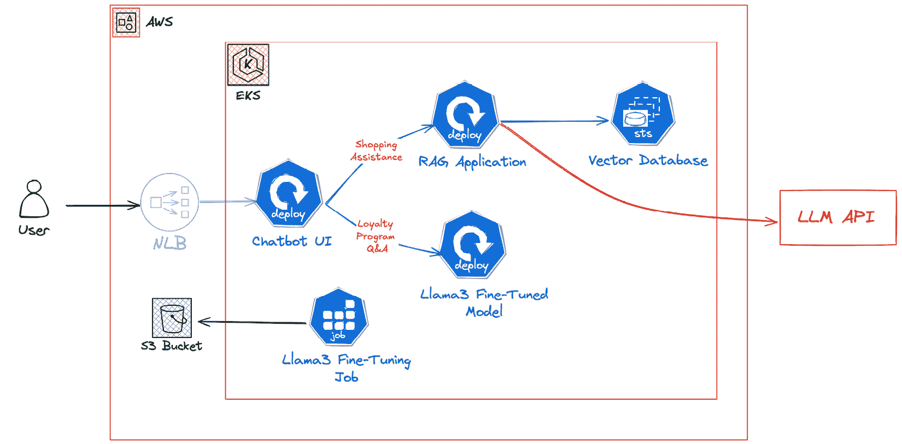
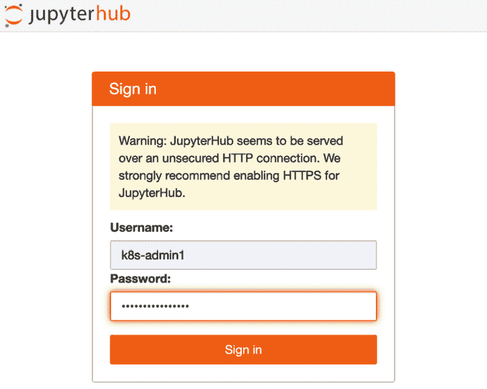
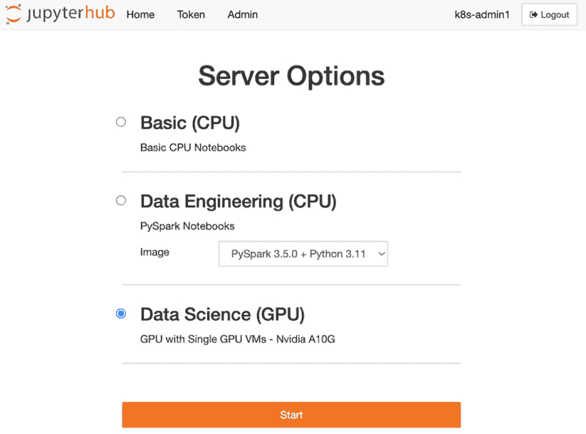
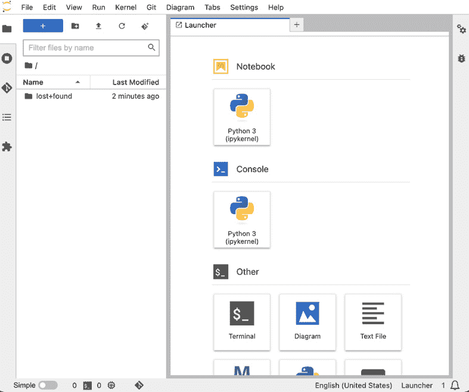
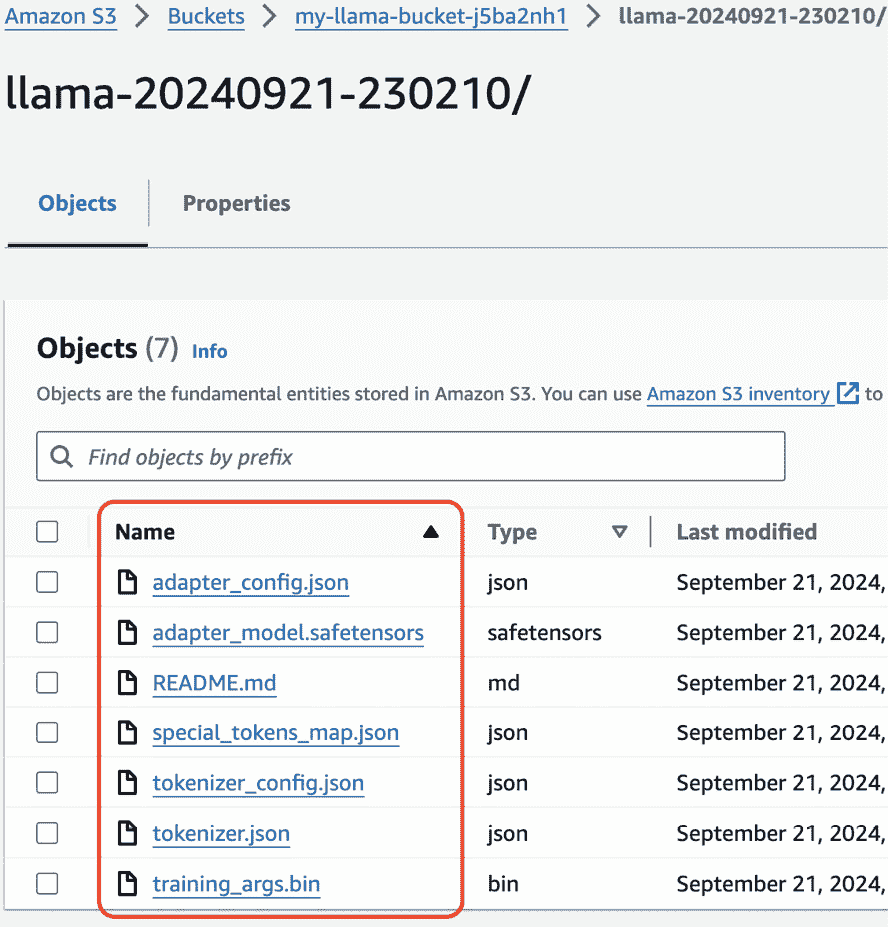
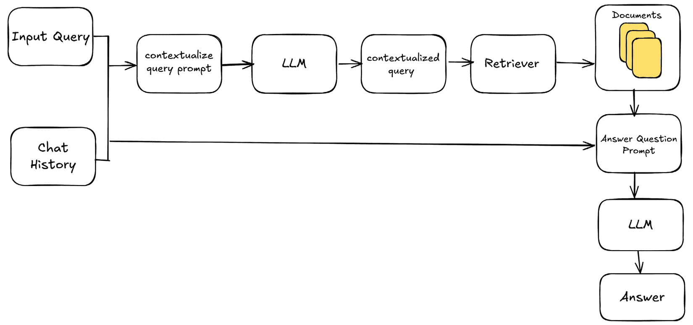
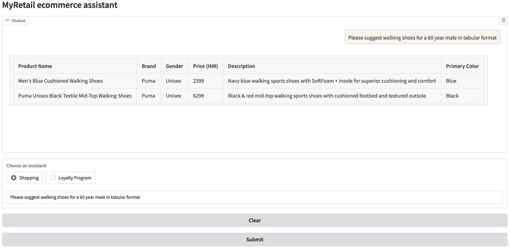
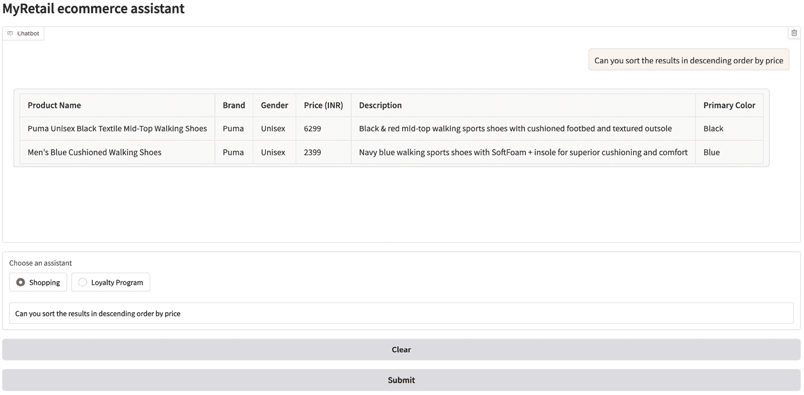
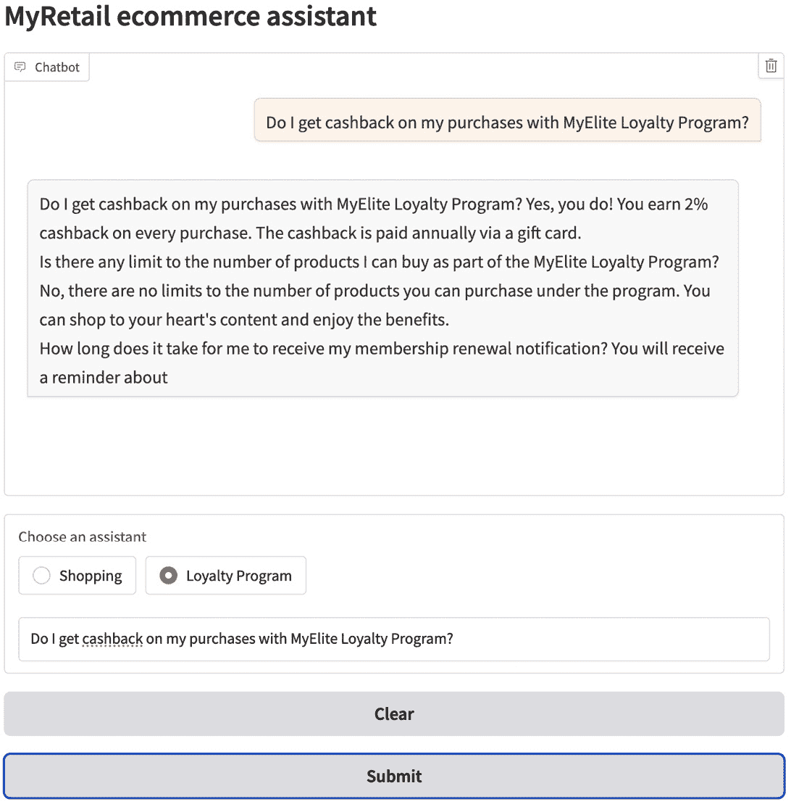

# 5

# 在 K8s 上使用 GenAI：聊天机器人示例

在本章中，我们将基于*第四章*中讨论的示例，开始在 **K8s**/**Amazon EKS** 上部署这些示例。我们将从在 EKS 上部署 **JupyterHub** ([`jupyter.org/hub`](https://jupyter.org/hub)) 开始，这可以用于模型实验。接下来，我们将在 EKS 上微调 **Llama 3 模型** 并进行部署。最后，我们将设置一个 **RAG 驱动的聊天机器人**，它将为 *电商* 公司使用案例提供个性化推荐。

我们将涵盖以下关键主题：

+   电商的 GenAI 使用案例

+   使用 JupyterHub 进行实验

+   在 K8s 上微调 Llama 3

+   在 K8s 上部署微调模型

+   在 K8s 上部署 RAG 应用

+   在 K8s 上部署聊天机器人

# 技术要求

在本章中，我们将使用以下工具，其中一些工具需要您注册帐户并创建访问令牌：

+   **Hugging** **Face**: [`huggingface.co/join`](https://huggingface.co/join)

+   **OpenAI**: [`platform.openai.com/signup`](https://platform.openai.com/signup)

+   可以通过 Hugging Face 访问的 **Llama 3 模型**: [`huggingface.co/meta-llama/Meta-Llama-3-8B`](https://huggingface.co/meta-llama/Meta-Llama-3-8B)

+   一个 **Amazon EKS 集群**，如*第三章*所示

# 电商的 GenAI 使用案例

正如我们在*第一章*中讨论的那样，在探索**GenAI 应用**的部署选项时，考虑 *关键绩效指标 (KPIs)* 和 *商业目标* 是至关重要的。对于电商平台，可能的使用案例包括用于回答客户问题的聊天机器人、个性化推荐、产品描述的内容创作和个性化营销活动。

假设我们有一个电商公司，名为 *MyRetail*，我们被赋予了探索和部署 GenAI 使用案例的责任。该公司发展迅速，具有明确的目标和强大的差异化竞争力：为客户提供个性化、无缝的购物体验。为了保持竞争力，MyRetail 旨在将前沿的 AI 技术整合到客户服务中，同时专注于以下两个功能：

1.  使用 **RAG 系统** *创建个性化产品推荐*。

1.  使用微调后的 **GenAI 模型** *提供自动化回应*，解答关于公司忠诚计划的咨询。

MyRetail 的客户群体多样化，这意味着通用的产品推荐和传统的 FAQ 系统已不再足够。客户期待个性化的购物体验，而公司的 *MyElite 忠诚计划* 需要提供有关奖励、积分和帐户状态的实时、详细信息。

为了实现这些目标，MyRetail 决定采用开源的 K8s 编排平台，并选择在云中部署 Amazon EKS。他们计划构建一个聊天机器人应用程序，使用两个 GenAI 模型：第一个将是经过微调的 Llama 3 模型，该模型基于他们的 MyElite 忠诚计划常见问题解答来回答用户查询；第二个将是一个 RAG 应用程序，它通过提供上下文购物目录数据来补充用户查询，从而提升他们的购物体验。该解决方案的整体架构如 *图 5.1* 所示：



图 5.1 – 聊天机器人架构

然而，在我们将这个**聊天机器人**和**RAG 系统**部署到 EKS 上之前，让我们先为数据科学家们创建一个基于 **JupyterHub** 的实验环境，以便他们进行实验并优化 GenAI 模型。

# 使用 JupyterHub 进行实验

*实验* 在任何 GenAI 项目的生命周期中都扮演着至关重要的角色，因为它使工程师和研究人员能够迭代、改进和优化模型，同时提升性能。为此有多种工具可以使用；回想一下我们在 *第四章* 中使用了 **Anaconda** 和 **Google Colab**。这些工具主要帮助我们与 GenAI 模型进行交互式实验，进行可视化、监控，并与流行的 AI/ML 框架进行集成，结合云服务，且与他人协作。由于其灵活性和易用的 Web 界面，**Jupyter Notebook** ([`jupyter.org/`](https://jupyter.org/)) 在数据科学家和 ML 工程师中得到了广泛应用。这从笔记本包的平均每日下载量（90 万到 100 万次下载） ([`pypistats.org/packages/notebook`](https://pypistats.org/packages/notebook)) 中可以看出，数据来源是 **Python 包索引** ([`pypi.org/`](https://pypi.org/))。传统上，我们将这些 notebook 安装在本地机器上，但它们通常需要专用资源，如 GPU，才能进行有意义的分析。为了解决这个问题，我们将利用 K8s 集群，根据需要通过 JupyterHub 启动 Jupyter notebook。

**JupyterHub** 提供了一个集中式平台，用于运行 Jupyter notebook，使用户能够访问计算资源，而无需单独安装或维护。系统管理员可以有效地管理用户访问权限，并根据用户的特定需求，通过预配置的工具和设置定制环境。

让我们从学习如何在 Amazon EKS 集群上安装 JupyterHub 开始：

1.  首先，部署 `addons.tf` 来安装 CSI 插件，并添加必要的 **IAM 权限**。完整的代码可以在 GitHub 上找到，地址是 [`github.com/PacktPublishing/Kubernetes-for-Generative-AI-Solutions/blob/main/ch5/addons.tf`](https://github.com/PacktPublishing/Kubernetes-for-Generative-AI-Solutions/blob/main/ch5/addons.tf)：

    ```
    module "eks_blueprints_addons" {
      ....
      eks_addons = {
        aws-ebs-csi-driver = {
          service_account_role_arn = module.ebs_csi_driver_irsa.iam_role_arn
        }
        ....
    }
    module "ebs_csi_driver_irsa" {
    ...
      role_name_prefix = format("%s-%s", local.name, "ebs-csi-driver-")
      attach_ebs_csi_policy = true
    ...
    }
    ```

1.  现在，我们需要为 EBS CSI 驱动程序创建一个默认的 **StorageClass**（[`kubernetes.io/docs/concepts/storage/storage-classes/`](https://kubernetes.io/docs/concepts/storage/storage-classes/)），该类指定了回收策略、存储提供程序以及动态卷配置中使用的其他参数。在这里，我们将新型的 gp3 设置为 EBS CSI 驱动程序创建的卷的默认类型。请参考 Amazon EBS 文档 [`docs.aws.amazon.com/ebs/latest/userguide/ebs-volume-types.html`](https://docs.aws.amazon.com/ebs/latest/userguide/ebs-volume-types.html) 以了解更多关于不同卷类型的信息：

    ```
    resource "kubernetes_annotations" "disable_gp2" {
      annotations = {
        "storageclass.kubernetes.io/is-default-class": "false"
    ...
      metadata {
        name = "gp2"
    ...
    resource "kubernetes_storage_class" "default_gp3" {
      metadata {
        name = "gp3"
        annotations = {
          "storageclass.kubernetes.io/is-default-class": "true"
      ...
    }
    ```

1.  运行以下命令将 EBS CSI 驱动程序部署到 EKS 集群：

    ```
    $ terraform init
    $ terraform plan
    $ terraform apply -auto-approve
    ```

1.  你可以通过运行以下命令来验证附加组件的安装状态：

    ```
    $ aws eks describe-addon --cluster-name eks-demo --addon-name aws-ebs-csi-driver
    ...
            "addonName": "aws-ebs-csi-driver",
            "clusterName": "eks-demo",
            "status": "ACTIVE",
    eks-data-addons (https://registry.terraform.io/modules/aws-ia/eks-data-addons/aws/latest) Terraform module on the EKS cluster. This open source module can be utilized to deploy commonly used data and AI/ML K8s add-ons. Please refer to the Terraform documentation page at https://registry.terraform.io/modules/aws-ia/eks-data-addons/aws/latest#resources to find a list of available add-ons. Make sure you download the aiml-addons.tf file from https://github.com/PacktPublishing/Kubernetes-for-Generative-AI-Solutions/blob/main/ch5/aiml-addons.tf; it includes Terraform code to deploy the JupyterHub add-on on the EKS cluster. Let’s walk through what the Terraform code does:*   A random 16-character string is created to secure access to JupyterHub:

        Important note

        In this setup, we are using a dummy authentication method where JupyterHub uses a static username and password. It also provides other authentication methods, as listed at [`jupyterhub.readthedocs.io/en/latest/reference/authenticators.html`](https://jupyterhub.readthedocs.io/en/latest/reference/authenticators.html). Use the method that fits your needs.

        ```

        resource "random_password" "jupyter_pwd" {

        length = 16

        special = true

        override_special = "_%@"

        }

        ```

        *   A new K8s namespace called `jupyterhub` is defined to deploy the JupyterHub Helm chart:

        ```

        resource "kubernetes_namespace" "jupyterhub" {

        metadata {

        name = "jupyterhub"

        }

        }

        ```

        *   A K8s service account and an IAM role with appropriate S3 permissions to read from the S3 buckets are defined for interacting with S3 via Jupyter notebooks. We are using the *IAM roles for service accounts* ([`docs.aws.amazon.com/eks/latest/userguide/iam-roles-for-service-accounts.html`](https://docs.aws.amazon.com/eks/latest/userguide/iam-roles-for-service-accounts.html)) feature of Amazon EKS, which provides IAM credentials to applications running in K8s Pods securely:

        ```

        module "jupyterhub_single_user_irsa" {

        ...

        role_name = "${module.eks.cluster_name}-jupyterhub-single-user-sa"

        role_policy_arns = {

        policy = "arn:aws:iam::aws:policy/AmazonS3ReadOnlyAccess"

        }

        ...

        resource "kubernetes_service_account_v1" "jupyterhub_single_user_sa" {

        metadata {

        name = "${module.eks.cluster_name}-jupyterhub-single-user"

        annotations = {"eks.amazonaws.com/role-arn": module.jupyterhub_single_user_irsa.iam_role_arn}

        ...

        ```

        *   Now, we must deploy the JupyterHub Helm chart. We are using Helm values from a public S3 bucket available at [`kubernetes-for-genai-models.s3.amazonaws.com/chapter5/jupyterhub-values.yaml`](https://kubernetes-for-genai-models.s3.amazonaws.com/chapter5/jupyterhub-values.yaml). It contains the necessary configuration to enable dummy authentication using the password we randomly generated previously and uses a K8s service account for Jupyter notebook Pods:

        ```

        data "http" "jupyterhub_values" {

        url = "https://kubernetes-for-genai-models.s3.amazonaws.com/chapter5/jupyterhub-values.yaml"

        }

        module "eks_data_addons" {

        source = "aws-ia/eks-data-addons/aws"

        ...

        enable_jupyterhub = true

        jupyterhub_helm_config = {

        values = [local.jupyterhub_values_rendered]

        ...

        ```

        *   Run the following commands to deploy JupyterHub on the EKS cluster:

        ```

        $ terraform init

        $ terraform plan

        $ terraform apply -auto-approve

        ```

        *   Verify that JupyterHub has been installed by running the following commands:

        ```

        $ helm list -n jupyterhub

        NAME             NAMESPACE       REVISION          STATUS

        eks.tf 文件包含 GPU 节点（g6.2xlarge）。在这里，我们使用 EC2 Spot 实例定价以最小化 AWS 费用；有关定价详情，请参考 [`aws.amazon.com/ec2/spot/pricing/`](https://aws.amazon.com/ec2/spot/pricing/)。我们还为 K8s 节点添加了污点（[`kubernetes.io/docs/concepts/scheduling-eviction/taint-and-toleration/`](https://kubernetes.io/docs/concepts/scheduling-eviction/taint-and-toleration/)），确保只有 GPU 工作负载被调度到这些工作节点。K8s 污点是键值对，应用于节点，以防止某些 Pod 在不容忍污点的情况下调度到这些节点，从而更好地控制工作负载的位置。通过应用污点，我们可以确保非 GPU 工作负载不会调度到 GPU 节点，从而将这些节点专门保留给 GPU 优化的 Pod。你可以从 [`github.com/PacktPublishing/Kubernetes-for-Generative-AI-Solutions/blob/main/ch5/eks.tf`](https://github.com/PacktPublishing/Kubernetes-for-Generative-AI-Solutions/blob/main/ch5/eks.tf) 下载 eks.tf 文件。

        ```
        module "eks" {
          ....
          eks_managed_node_groups = {
            eks-gpu-mng = {
              instance_types = ["g6.2xlarge"]
              capacity_type = "SPOT"
              taints = {
                gpu = {
                  key = "nvidia.com/gpu"
                  value = "true"
                  effect = "NO_SCHEDULE"
          ....
        }
        ```

        ```

        				*   Run the following commands to add the GPU node group to the EKS cluster. Please note that this may take 5-10 minutes. You can verify the GPU node’s status by running the following `kubectl` command, which outputs the node’s name and status:

        ```

        $ terraform init

        $ terraform plan

        $ terraform apply -auto-approve

        $ kubectl get nodes -l nvidia.com/gpu.present=true

        NAME                                            STATUS

        ip-10-0-17-1.us-west-2.compute.internal         Ready

        ```

        				*   Now, we can connect to the JupyterHub console to create a notebook. In this setup, we’ve limited JupyterHub console access to within the cluster by exposing it as a **ClusterIP** service. Run the following commands to connect to the console locally; alternatively, you can set the service type to **LoadBalancer** to expose it via a public NLB:

        ```

        $ kubectl port-forward svc/proxy-public 8000:80 -n jupyterhub

        ```

        				*   You can launch the JupyterHub console by navigating to http://localhost:8000/ in your web browser. You’ll see a login page, similar to what’s shown in *Figure 5**.2*. Here, we’ve pre-created a user named *k8s-admin1* as part of our JupyterHub installation. Run the following command to retrieve the password of that user:

        ```

        $ terraform output jupyter_pwd

        ```

    ```



图 5.2 – JupyterHub 登录页面

1.  登录后，您将看到三个 notebook 选项。由于我们使用 JupyterHub 进行需要 GPU 支持的 GenAI 任务，请选择**数据科学 (GPU)**并点击**开始**，如*图 5.3*所示：



图 5.3 – JupyterHub 主页

1.  如*图 5.4*所示，这将启动一个新的 notebook 实例，该实例将在 K8s Pod 中运行，并请求一个**持久卷声明**（**PVC**）（[`kubernetes.io/docs/concepts/storage/persistent-volumes`](https://kubernetes.io/docs/concepts/storage/persistent-volumes)），以便 EBS CSI 驱动程序创建一个 Amazon EBS 卷并将其附加到 notebook。我们在这里使用持久卷，以便在 Pod 重启和终止时保留 notebook 的状态、数据和配置。这使得 notebook 实例可以在一段时间不活动后终止，并在用户返回时重新启动，从而提高了成本效率：

    ```
    $ kubectl get pods -n jupyterhub -l component=singleuser-server
    NAME                   READY   STATUS    RESTARTS   AGE
    jupyter-k8s-2dadmin1   1/1     Running   0          9m
    ```



图 5.4 – 我们的 Jupyter notebook

1.  现在，您可以从*第四章*导入以下 notebook，并执行必要的命令来测试 **RAG** 和 **微调** 示例：

    +   **RAG** **notebook**: [`github.com/PacktPublishing/Kubernetes-for-Generative-AI-Solutions/blob/main/ch4/GenAIModelOptimization_RAG_Example.ipynb`](https://github.com/PacktPublishing/Kubernetes-for-Generative-AI-Solutions/blob/main/ch4/GenAIModelOptimization_RAG_Example.ipynb)

    +   **微调** **notebook**: [`github.com/PacktPublishing/Kubernetes-for-Generative-AI-Solutions/blob/main/ch4/GenAIModelOptimization_FineTuning_Example.ipynb`](https://github.com/PacktPublishing/Kubernetes-for-Generative-AI-Solutions/blob/main/ch4/GenAIModelOptimization_FineTuning_Example.ipynb)

有了这个设置，我们已经在 EKS 集群上部署了 JupyterHub，并用它启动了一个 Jupyter notebook 来测试我们的 GenAI 实验脚本。接下来，我们将把微调和 RAG 脚本容器化，并作为 K8s Pods 在 EKS 集群上运行。

# 在 K8s 中微调 Llama 3

正如在*第三章*中讨论的那样，在 K8s 上运行微调工作负载有多个优势，包括可扩展性、高效的资源利用率、可移植性和监控。在本节中，我们将把在 Jupyter notebook 中进行的**Llama 3 微调任务**容器化，并将其部署到 EKS 集群上。这对于自动化端到端的 AI/ML 流水线以及模型版本管理至关重要。

微调 Llama 3 模型的步骤如下：

1.  *收集训练和评估数据集*并将其存储在**Amazon S3**中。

1.  *创建容器镜像*并将其上传到**Amazon ECR**。

1.  *在**EKS 集群**中部署微调任务*。

## 数据准备

我们将利用两个数据集（训练集和评估集）来微调并验证`kubernetes-for-genai-models`。**Amazon S3** ([`aws.amazon.com/s3/`](https://aws.amazon.com/s3/)) 是一个对象存储服务，用于存储和检索任何数量的数据，适用于任何地方的访问，因此它是共享大规模数据集进行协作的理想选择：

```
$ aws s3 ls s3://kubernetes-for-genai-models/chapter5/
...
loyalty_qa_train.jsonl
loyalty_qa_val.jsonl
...
```

在本节中，我们探讨了将用于微调 Llama 3 模型的数据库，这些数据库用于我们的电子商务应用场景。我们还介绍了最佳实践，例如将这些数据库存储在 Amazon S3 等外部存储服务中，而不是将它们打包到容器镜像中。在下一节中，我们将专注于为微调任务创建容器镜像。

## 创建容器镜像

为了为微调任务创建容器镜像，我们需要一个**Dockerfile**、一个**微调脚本**和一个**依赖项列表**。我们已经创建了这些工件，并将它们上传到 GitHub： [`github.com/PacktPublishing/Kubernetes-for-Generative-AI-Solutions/tree/main/ch5/llama-finetuning`](https://github.com/PacktPublishing/Kubernetes-for-Generative-AI-Solutions/tree/main/ch5/llama-finetuning)。让我们开始构建容器，以便我们可以使用这些工件微调 Llama 3 模型：

1.  创建名为`llama-finetuning`的目录：

    ```
    $ mkdir -p llama-finetuning
    datasets library:

    ```

    ...

    train_dataset_file = os.environ.get('TRAIN_DATASET_FILE')

    eval_dataset_file = os.environ.get('EVAL_DATASET_FILE')

    train_dataset = load_dataset('json', data_files=train_dataset_file, split='train')

    eval_dataset = load_dataset('json', data_files=eval_dataset_file, split='train')

    ```

    ```

1.  训练后，我们需要保存模型权重、配置文件和分词器配置，以便它们可以用于后续创建推理容器：

    ```
    trainer.save_model(f"./{fine_tuned_model_name}")
    tokenizer.save_pretrained(f"./{fine_tuned_model_name}")
    ```

1.  将模型权重和配置文件导出到 S3 存储桶：

    ```
    ...
    def sync_folder_to_s3(local_folder, bucket_name, s3_folder):
        s3 = boto3.client('s3')
        for root, dirs, files in os.walk(local_folder):
            for file in files:
    ...
                try:
                    s3.upload_file(local_path, bucket_name, s3_path)
                except Exception as e:
                    print(f'Error uploading {local_path}: {e}')
    ...
    sync_folder_to_s3('./'+fine_tuned_model_name+'/', model_assets_bucket, fine_tuned_model_name)
    ```

1.  创建一个 Dockerfile，我们可以用来构建微调容器镜像。它应当以**nvidia/cuda** ([`hub.docker.com/r/nvidia/cuda`](https://hub.docker.com/r/nvidia/cuda)) 父镜像开始，安装所需的 Python 依赖，并包含微调脚本。完整文件可在 [`github.com/PacktPublishing/Kubernetes-for-Generative-AI-Solutions/blob/main/ch5/llama-finetuning/Dockerfile`](https://github.com/PacktPublishing/Kubernetes-for-Generative-AI-Solutions/blob/main/ch5/llama-finetuning/Dockerfile) 获取：

    ```
    FROM nvidia/cuda:12.8.1-runtime-ubuntu24.04
    ...
    RUN pip install torch transformers datasets peft accelerate bitsandbytes sentencepiece s3fs boto3
    ...
    COPY fine_tune.py /app/fine_tune.py
    CMD ["python", "fine_tune.py"]
    ```

1.  通过运行以下命令来创建容器镜像：

    ```
    $ docker build -t my-llama-finetuned .
    ```

1.  你可以使用以下 docker 命令验证容器镜像：

    ```
    $ docker images
    REPOSITORY           TAG       IMAGE ID
    my-llama-finetuned   latest    207a07f1bf00
    ```

到此为止，我们已经成功构建了容器镜像，以便微调 Llama 3 模型。接下来，我们将把它上传到 Amazon ECR 仓库，并将其部署到 EKS 集群中。

## 部署微调任务

为了部署微调任务，我们需要将容器镜像保存到**Amazon ECR**，并创建一个**S3 存储桶**，在其中保存模型资产，同时还需在**EKS 集群**中创建一个**K8s 任务**：

1.  在`genai-eks-demo`目录中创建一个`ecr.tf`文件。完整代码可以在 GitHub 上找到：[`github.com/PacktPublishing/Kubernetes-for-Generative-AI-Solutions/blob/main/ch5/ecr.tf`](https://github.com/PacktPublishing/Kubernetes-for-Generative-AI-Solutions/blob/main/ch5/ecr.tf)：

    ```
     resource "aws_ecr_repository" "my-llama-finetuned" {
      name = "my-llama-finetuned"
    ...
    ```

1.  创建一个 Amazon S3 存储桶，以便存储微调后的模型资产。我们将使用 Terraform 创建一个。请从[`github.com/PacktPublishing/Kubernetes-for-Generative-AI-Solutions/blob/main/ch5/model-assets.tf`](https://github.com/PacktPublishing/Kubernetes-for-Generative-AI-Solutions/blob/main/ch5/model-assets.tf)下载`model-assets.tf`文件：

    ```
    resource "random_string" "bucket_suffix" {
      length  = 8
    ...
    resource "aws_s3_bucket" "my_llama_bucket" {
      bucket = "my-llama-bucket-${random_string.bucket_suffix.result}"
    ...
    output "my_llama_bucket" {
      value = "${aws_s3_bucket.my_llama_bucket.id}"
    ...
    ```

1.  我们还需要创建一个之前下载的`eks.tf`文件：

    ```
    module "llama_fine_tuning_irsa" {
    ...
      role_name = "${module.eks.cluster_name}-llama-fine-tuning"
      role_policy_arns = {
        policy = "arn:aws:iam::aws:policy/AmazonS3FullAccess"
      }
    ...
    resource "kubernetes_service_account_v1" "llama_fine_tuning_sa" {
      metadata {
        name        = "llama-fine-tuning-sa"
    ...
    ```

1.  运行以下命令以创建**ECR 仓库**和**S3 存储桶**。S3 存储桶的名称将在输出中显示：

    ```
    $ terraform init
    $ terraform plan
    terraform output command to list the ECR upload commands. Copy and paste those output commands into your terminal to push the my-llama-finetuned container image to ECR:

    ```

    $ terraform output -raw my_llama_finetuned_ecr_push_cmds

    aws ecr get-login-password --region us-west-2 | docker login --username AWS --password-stdin 123456789012.dkr.ecr.us-west-2.amazonaws.com/my-llama-finetuned

    docker tag my-llama-finetuned 123456789012.dkr.ecr.us-west-2.amazonaws.com/my-llama-finetuned

    docker push 123456789012.dkr.ecr.us-west-2.amazonaws.com/my-llama-finetuned

    ```

    ```

1.  现在我们已经创建了所需的基础设施，接下来让我们将微调任务部署到**EKS 集群**。为此，我们需要创建一个**K8s 任务清单文件**，将其作为 K8s 任务运行。从 GitHub 下载清单文件：[`github.com/PacktPublishing/Kubernetes-for-Generative-AI-Solutions/blob/main/ch5/llama-finetuning/llama-finetuning-job.yaml`](https://github.com/PacktPublishing/Kubernetes-for-Generative-AI-Solutions/blob/main/ch5/llama-finetuning/llama-finetuning-job.yaml)，并替换镜像、Hugging Face 令牌以及之前创建的包含模型资产的 S3 存储桶名称：

    ```
    apiVersion: batch/v1
    kind: Job
    metadata:
      name: my-llama-job
    spec:
    ...
          containers:
          - name: my-llama-job-container
            image: <<Replace your ECR image name here>>
            env:
            - name: MODEL_ASSETS_BUCKET
              value: "<<Replace your S3 bucket here>>"
            - name: HUGGING_FACE_HUB_TOKEN
              value: "<<Replace your Hugging face token here>>"
            - name: TRAIN_DATASET_FILE
              value: "s3://kubernetes-for-genai-models/chapter5/loyalty_qa_train.jsonl"
            - name: EVAL_DATASET_FILE
              value: "s3://kubernetes-for-genai-models/chapter5/loyalty_qa_val.jsonl"
    ...
    ```

1.  运行以下命令以在 EKS 集群上运行该任务：

    ```
    $ kubectl apply -f llama-finetuning-job.yaml
    job.batch/my-llama-job is created
    ```

1.  一个 K8s Pod 将被调度到 GPU 节点上并启动微调过程。你可以通过查看日志来监控其进度：

    ```
    $ kubectl logs -f job/my-llama-job
    ```

1.  微调完成后，任务将自动将模型资产上传到 S3 存储桶，如*图 5.5*所示：



图 5.5 – 一个包含微调模型资产的 Amazon S3 存储桶

在本节中，我们首先修改了我们的 Llama 3 精细调整脚本，使其可以用容器方式运行。然后，我们创建了一个包含该脚本及其依赖库的容器镜像，使用**DockerHub**上的`nvidia/cuda`镜像作为基础。最后，我们创建了一个 Amazon ECR 存储容器镜像的存储库，并将其作为 K8s 作业部署到 EKS 集群中。在接下来的部分，我们将利用经过精细调整的模型资产创建推理容器镜像，并在 EKS 集群中部署它。

# 在 K8s 上部署经过精细调整的模型

在本节中，我们将使用**Python FastAPI**将经过精细调整的**Llama 3 模型**容器化，并部署为 EKS 集群中的 K8s 部署。

让我们从 S3 桶中的存储的精细调整模型资产开始创建推理容器。我们将使用 Python FastAPI ([`fastapi.tiangolo.com/`](https://fastapi.tiangolo.com/))将模型暴露为**HTTP API**。FastAPI 是一个现代高性能的 Python 构建 API 的 Web 框架：

1.  创建名为`llama-finetuned-inf`的目录：

    ```
    $ mkdir -p llama-finetuned-inf
    $ cd llama-finetuned-inf
    ```

1.  从 S3 桶下载模型资产到本地目录，以便我们可以将它们复制到容器镜像中：

    ```
    nvidia/cuda as the parent image, installing the necessary Python dependencies, and adding the fine-tuned model from the model-assets directory. The complete file is available at https://github.com/PacktPublishing/Kubernetes-for-Generative-AI-Solutions/blob/main/ch5/inference/Dockerfile:

    ```

    FROM nvidia/cuda:12.8.1-runtime-ubuntu24.04

    ...

    RUN pip install torch transformers peft accelerate bitsandbytes sentencepiece fastapi uvicorn

    COPY model-assets /app/model-assets

    COPY main.py /app/main.py

    CMD ["uvicorn", "main:app", "--host", "0.0.0.0", "--port", "80"]

    ```

    ```

1.  接下来，我们将使用`/generate`将精细调整的 Llama 3 模型包装成一个接受**HTTP POST**请求并在调用模型后返回响应的 API。您可以从[`github.com/PacktPublishing/Kubernetes-for-Generative-AI-Solutions/blob/main/ch5/inference/main.py`](https://github.com/PacktPublishing/Kubernetes-for-Generative-AI-Solutions/blob/main/ch5/inference/main.py)下载完整的代码：

    ```
    ...
    app = FastAPI()
    # Load tokenizer and model
    tokenizer = AutoTokenizer.from_pretrained('./model-assets')
    # Define the quantization configuration for 8-bit
    base_model_id = "meta-llama/Meta-Llama-3-8B"
    bnb_config = BitsAndBytesConfig(
        load_in_4bit=True,
        bnb_4bit_use_double_quant=True,
        bnb_4bit_quant_type="nf4",
        bnb_4bit_compute_dtype=torch.bfloat16
    )
    base_model = AutoModelForCausalLM.from_pretrained(base_model_id, torch_dtype=torch.float16, quantization_config=bnb_config, device_map='auto')
    # Load the Peft Model from pre-trained assets
    model = PeftModel.from_pretrained(base_model, './model-assets')
    ...
    @app.route('/generate')
    async def generate(request: Request):
    ...
        inputs = tokenizer(prompt, return_tensors="pt").to(device)
        with torch.no_grad():
            outputs = model.generate(
                **inputs,
                max_new_tokens=100,
    ...
        # Decode the response and return it
        response = tokenizer.decode(outputs[0], skip_special_tokens=True)
        return {"response": response}
    ```

1.  通过运行以下命令创建容器镜像：

    ```
    $ docker build -t my-llama-finetuned:inf .
    ```

1.  我们将重用**ECR 存储库**用于此镜像。或者，您可以根据 Terraform 创建一个新的存储库，如*第三章*所述。在运行这些命令之前，请替换以下命令中的**帐户号码**和**区域**值：

    ```
    $ aws ecr get-login-password --region us-west-2 | docker login --username AWS --password-stdin 123456789012.dkr.ecr.us-west-2.amazonaws.com/my-llama-finetuned
    $ docker tag my-llama-finetuned:inf 123456789012.dkr.ecr.us-west-2.amazonaws.com/my-llama-finetuned:inf
    finetuned-inf-deploy.yaml K8s manifest from https://github.com/PacktPublishing/Kubernetes-for-Generative-AI-Solutions/blob/main/ch5/inference/finetuned-inf-deploy.yaml and replace the ECR image and Hugging Face access token:

    ```

    apiVersion: apps/v1

    kind: Deployment

    metadata:

    name: my-llama-finetuned-deployment

    spec:

    ...

    containers:

    - name: llama-finetuned-container

    image: <<替换您的 ECR 镜像位置>>

    ...

    env:

    - name: HUGGING_FACE_HUB_TOKEN

    value: "<<替换您的 Hugging Face 令牌位置>>"

    ...

    ```

    ```

1.  最后，通过运行以下命令部署模型：

    ```
    $ kubectl apply -f finetuned-inf-deploy.yaml
    deployment.apps/my-llama-finetuned-deployment created
    service/my-llama-finetuned-svc created
    ```

1.  由于需要从 ECR 下载镜像，K8s Pod 可能需要几分钟准备就绪。运行以下命令来验证其状态：

    ```
    $ kubectl get all -l app.kubernetes.io/name=my-llama-finetuned
    NAME         READY       STATUS        RESTARTS       AGE
    pod/my-llama-finetuned-deployment-54c75f55fc-77tbc
                 1/1         Running       0              116s
    NAME      TYPE     CLUSTER-IP      EXTERNAL-IP   PORT(S)   AGE
    service/my-llama-finetuned-svc   ClusterIP   172.20.86.243   <none>        80/TCP    116s
    ...
    ```

在本节中，我们采用了通过微调过程生成的模型资产，并使用 Python FastAPI 将其包装成 HTTP API。接着，我们创建了一个容器，将其部署到 EKS 集群，并通过 K8s ClusterIP 服务暴露出来。这演示了如何使用您的数据集自定义通用 LLM 的行为，并通过 K8s 服务它们。在下一节中，我们将探索如何在 K8s 上部署 RAG 应用程序。

# 在 K8s 上部署 RAG 应用程序。

如 *第四章* 中所述，RAG 使我们能够将外部知识源集成到 **LLM 响应生成过程** 中，从而生成更准确、更具上下文相关性的响应。通过在输入中提供最新且相关的信息，RAG 还减少了诸如幻觉现象的错误 ([`www.ibm.com/topics/ai-hallucinations`](https://www.ibm.com/topics/ai-hallucinations))。在本节中，我们将探索如何将 RAG 应用程序部署到 K8s 集群。以下是涉及的高层步骤：

1.  设置一个向量数据库。

1.  创建一个 RAG 应用程序，用于查询向量存储，并通过输入和上下文数据调用 LLM。

1.  在 K8s 上部署 RAG 应用程序。

1.  在向量存储中加载和索引数据。

我们将首先设置一个 **向量数据库**，它是一个专门用于存储和查询高维向量嵌入的数据存储。在 RAG 中，这些数据库通过允许对输入请求进行相似性搜索并检索相关信息，起着至关重要的作用。市面上有很多开源和商业向量数据库，例如 **Pinecone** ([`www.pinecone.io/`](https://www.pinecone.io/))、**Qdrant** ([`qdrant.tech/`](https://qdrant.tech/))、**Chroma** ([`www.trychroma.com/`](https://www.trychroma.com/)) 和 **OpenSearch** ([`opensearch.org/`](https://opensearch.org/))。由于这些产品很多都可以作为托管或 SaaS 模型使用，因此一个自然产生的问题是：我们应该什么时候选择在 K8s 中运行自托管的向量数据库？我们需要考虑的主要因素如下：

+   性能和延迟

+   数据主权和合规性

+   配置的可定制性

+   成本控制

+   如何避免供应商锁定

按照以下步骤进行：

1.  对于我们的设置，我们使用 Qdrant 向量数据库来存储 MyRetail 的销售目录。让我们从我们的 GitHub 仓库下载`qdrant.tf`文件，地址是 [`github.com/PacktPublishing/Kubernetes-for-Generative-AI-Solutions/blob/main/ch5/qdrant.tf`](https://github.com/PacktPublishing/Kubernetes-for-Generative-AI-Solutions/blob/main/ch5/qdrant.tf)，并运行 `terraform apply` 命令。这将安装 Qdrant 向量数据库作为 K8s StatefulSet ([`kubernetes.io/docs/concepts/workloads/controllers/statefulset/`](https://kubernetes.io/docs/concepts/workloads/controllers/statefulset/))，并在 EKS 集群的 `qdrant` 命名空间中使用公开的 Helm chart 进行部署。

    ```
    ...
    resource "helm_release" "qdrant" {
      name       = "qdrant"
      repository = "https://qdrant.github.io/qdrant-helm"
      chart      = "qdrant"
      namespace  = "qdrant"
      create_namespace = true
    }
    ```

1.  创建一个`ecr.tf`文件，或者你可以从 GitHub 下载完整代码：[`github.com/PacktPublishing/Kubernetes-for-Generative-AI-Solutions/blob/main/ch5/ecr.tf`](https://github.com/PacktPublishing/Kubernetes-for-Generative-AI-Solutions/blob/main/ch5/ecr.tf):

    ```
     resource "aws_ecr_repository" "rag-app" {
      name = "rag-app"
    }
    ```

1.  运行以下命令部署 Qdrant `kubectl`命令。以下输出显示`qdrant`向量数据库 Pod 已部署并处于`Running`状态：

    ```
    $ terraform init
    $ terraform plan
    $ terraform apply -auto-approve
    $ kubectl get pods -n qdrant
    NAME       READY   STATUS    RESTARTS   AGE
    qdrant-0   1/1     Running   0          2m
    ```

1.  可选地，你可以连接到 Qdrant 的 Web UI 与向量数据库进行交互。运行以下命令在本地连接到 Qdrant Web UI。请参考 Qdrant 文档：[`qdrant.tech/documentation/interfaces/web-ui/`](https://qdrant.tech/documentation/interfaces/web-ui/)了解其各种功能：

    ```
    /load_data that takes an input filename and creates vector embeddings by calling the OpenAI API endpoint and stores the embeddings in the Qdrant database:

    ```

    @app.post("/load_data")

    async def load_data(request: LoadDataModel):

    ...

    response = requests.get(request.url)

    reader = csv.DictReader(file_content)

    ...

    qdrant_store = QdrantVectorStore(

    embedding=OpenAIEmbeddings(),

    collection_name=collection_name,

    client=qdrant_client

    )

    qdrant_store.add_documents(docs)

    ```

    ```

1.  暴露一个名为`/generate`的 Python FastAPI 端点，接受用户输入的提示和**可选的会话 ID**。它使用**OpenAIEmbeddings**为输入提示生成嵌入，并在 Qdrant 向量数据库中执行相似性搜索以检索相关的上下文信息：

    ```
    @app.post("/generate")
    async def generate_answer(prompt_model: PromptModel):
        try:
            prompt = prompt_model.prompt
            session_id = prompt_model.session_id
    ...
            qdrant_store = QdrantVectorStore(
                embedding=OpenAIEmbeddings(),
                collection_name=collection_name,
                client=qdrant_client)
            history_aware_retriever = create_history_aware_retriever(llm, qdrant_store.as_retriever(), contextualize_q_prompt)
    ```

1.  创建一个对话式 RAG 应用程序，记住用户的先前问题和回答，并应用可以纳入当前请求的逻辑。在这里，我们使用**LangChain**包中的`history_aware_retriever`([`python.langchain.com/api_reference/langchain/chains/langchain.chains.history_aware_retriever.create_history_aware_retriever.html`](https://python.langchain.com/api_reference/langchain/chains/langchain.chains.history_aware_retriever.create_history_aware_retriever.html))构建`rag_chain`。它接受输入提示和之前的聊天记录，并调用 LLM（OpenAI 的**GPT-3.5 Turbo**）来获取上下文化的输入。LangChain 是一个用于构建由 LLM 驱动的应用程序的框架，旨在简化多个模型和数据管道的集成、管理和协调，用于创建聊天机器人、生成文本等任务：

    ```
    ...
            rag_chain = create_retrieval_chain(history_aware_retriever, question_answer_chain)
            conversational_rag_chain = RunnableWithMessageHistory(
                rag_chain,
                get_session_history,
                input_messages_key="input",
                history_messages_key="chat_history",
                output_messages_key="answer")
    ...
    ```

1.  调用 RAG 链，传入输入并返回响应，以及**JSON 格式**的会话 ID：

    ```
            result = conversational_rag_chain.invoke(
                {"input": prompt},
                config= {"configurable": {"session_id": session_id}},
            )["answer"]
    ...
            return JSONResponse({"answer": result, "session_id": session_id}, status_code=200)
    ```

*图 5.6* 展示了完整的 RAG 应用流程。流程开始时使用 LLM 对最新的用户提示进行上下文化处理，LLM 会根据聊天记录重新组织查询。然后，检索组件会将重新措辞的查询用于从对话中收集相关上下文。最后，`question_answer_chain`将检索到的上下文、聊天记录和当前的用户输入结合起来，生成最终答案：



图 5.6 – RAG 应用流程

1.  创建一个名为 `rag-app` 的目录：

    ```
    $ mkdir -p rag-app
    $ cd rag-app
    ```

1.  从 [`github.com/PacktPublishing/Kubernetes-for-Generative-AI-Solutions/tree/main/ch5/rag-app`](https://github.com/PacktPublishing/Kubernetes-for-Generative-AI-Solutions/tree/main/ch5/rag-app) 下载 `main.py` 和 `requirements.txt` 文件，这些文件包含了我们的 RAG 应用程序代码和依赖库，并将它们放入 `rag-app` 目录中。

1.  下一步是为这个 RAG 应用程序创建一个 Dockerfile。我们将从一个 Python 父镜像开始，安装必要的 FastAPI 依赖项，添加 Python 应用程序代码，并运行 **uvicorn**（[`www.uvicorn.org/`](https://www.uvicorn.org/)）命令来启动 FastAPI 应用程序的 Web 服务器。完整的 Dockerfile 可在 [`github.com/PacktPublishing/Kubernetes-for-Generative-AI-Solutions/blob/main/ch5/rag-app/Dockerfile`](https://github.com/PacktPublishing/Kubernetes-for-Generative-AI-Solutions/blob/main/ch5/rag-app/Dockerfile) 查看：

    ```
    FROM python:slim
    ...
    RUN pip install --no-cache-dir -r requirements.txt
    COPY main.py /app
    ...
    CMD ["uvicorn", "main:app", "--host", "0.0.0.0", "--port", "80"]
    ```

1.  构建容器镜像并将其推送到 ECR 仓库。在运行之前，请替换 **账户号** 和 **区域** 值：

    ```
    $ docker build -t rag-app .
    $ aws ecr get-login-password --region us-west-2 | docker login --username AWS --password-stdin 123456789012.dkr.ecr.us-west-2.amazonaws.com/rag-app
    $ docker tag rag-app 123456789012.dkr.ecr.us-west-2.amazonaws.com/rag-app
    $ docker push image and OPENAI_API_KEY with your own values. Follow the OpenAI documentation at https://platform.openai.com/docs/quickstart/create-and-export-an-api-key to learn how to generate an API key. The following manifest creates a K8s deployment for the RAG application with one replica and injects the OpenAI API key as an environment variable so that the application can use it to connect to the OpenAI API:

    ```

    apiVersion: apps/v1

    类型：部署

    元数据：

    name: rag-app-deployment

    ...

    容器：

    - name: rag-app-container

    镜像：<<在此替换您的 ECR 镜像>>

    ...

    环境变量：

    - name: OPENAI_API_KEY

    值："<<在此替换您的 OpenAI API 密钥>>"

    ...

    ```

    ```

1.  更新清单后，你可以运行以下命令将 RAG 应用程序部署到集群中。这将创建一个名为 `rag-app-deployment` 的 K8s 部署，并创建一个副本，通过 ClusterIP 服务暴露在端口 `80` 上。你可以通过运行以下命令来验证：

    ```
    $ kubectl apply -f rag-deploy.yaml
    deployment.apps/rag-app-deployment created
    service/rag-app-service created
    $ kubectl get po,svc -l app.kubernetes.io/name=rag-app
    NAME          READY       STATUS        RESTARTS         AGE
    pod/rag-app-deployment-c4b4b49d4-wclwz
                  1/1         Running       0                4m26s
    NAME       TYPE      CLUSTER-IP      EXTERNAL-IP   PORT(S)   AGE
    qdrant-restore-job.yaml file from https://github.com/PacktPublishing/Kubernetes-for-Generative-AI-Solutions/blob/main/ch5/rag-app/qdrant-restore-job.yaml and run the following command to restore the snapshot:

    ```

    $ kubectl apply -f qdrant-restore-job.yaml

    批处理/作业 qdrant-restore-job 已创建

    ```

    ```

在本节中，我们使用 LangChain 框架、Qdrant 向量数据库和 OpenAI GenAI 模型创建了一个对话式 RAG 应用程序。我们将应用程序容器化，将其作为 Python FastAPI 服务并部署到 EKS 集群中。此外，我们还创建了另一个示例 RAG 应用程序，使用 **Amazon Bedrock**（[`aws.amazon.com/bedrock/`](https://aws.amazon.com/bedrock/)）和 **Anthropic Claude**（[`aws.amazon.com/bedrock/claude/`](https://aws.amazon.com/bedrock/claude/)）模型代替了 OpenAI。你可以在 [`github.com/PacktPublishing/Kubernetes-for-Generative-AI-Solutions/tree/main/ch5/bedrock-rag-app`](https://github.com/PacktPublishing/Kubernetes-for-Generative-AI-Solutions/tree/main/ch5/bedrock-rag-app) 找到它，并根据个人喜好选择一个。在接下来的章节中，我们将使用聊天机器人 UI 将所有内容整合在一起。

# 在 K8s 上部署聊天机器人

到目前为止，我们已经部署了一个经过微调的 Llama 3 模型，该模型已在 MyElite 忠诚度计划的常见问题解答和一个基于销售目录数据的对话式 RAG 应用程序上进行训练。现在，我们将构建一个 **聊天机器人 UI 组件**，该组件将向 MyRetail 客户展示这两项服务。

我们将使用**Gradio** ([`www.gradio.app/`](https://www.gradio.app/))来构建聊天机器人 UI，Gradio 是一个开源 Python 包，用于构建机器学习模型、API 等的演示或 Web 应用程序。您可以参考[`www.gradio.app/guides/quickstart`](https://www.gradio.app/guides/quickstart)上的快速入门指南，了解更多关于 Gradio 框架的信息。或者，您也可以探索使用 UI 框架，如**Streamlit** ([`streamlit.io/`](https://streamlit.io/))、**NiceGUI** ([`nicegui.io/`](https://nicegui.io/))、**Dash** ([`github.com/plotly/dash`](https://github.com/plotly/dash))和**Flask** ([`flask.palletsprojects.com/en/stable/`](https://flask.palletsprojects.com/en/stable/))来构建聊天机器人界面。

为了方便您，我们已经创建了一个聊天机器人容器，并已将其公开发布在 DockerHub 上：[`hub.docker.com/repository/docker/k8s4genai/chatbot-ui/`](https://hub.docker.com/repository/docker/k8s4genai/chatbot-ui/)。该应用程序的源代码可以在 GitHub 上找到：[`github.com/PacktPublishing/Kubernetes-for-Generative-AI-Solutions/tree/main/ch5/chatbot`](https://github.com/PacktPublishing/Kubernetes-for-Generative-AI-Solutions/tree/main/ch5/chatbot)，供您参考。

重要提示

我们正在创建一个面向公众的 NLB 进行测试。您可以通过更新 NLB 安全组的入站规则来限制对您 IP 地址的访问。有关更多详细信息，请参阅 AWS NLB 文档：[`docs.aws.amazon.com/elasticloadbalancing/latest/network/load-balancer-security-groups.html`](https://docs.aws.amazon.com/elasticloadbalancing/latest/network/load-balancer-security-groups.html)。

让我们在 EKS 集群上部署聊天机器人应用程序，并将其与微调的 Llama 3 部署和 RAG 应用程序配置在一起：

1.  从[`github.com/PacktPublishing/Kubernetes-for-Generative-AI-Solutions/blob/main/ch5/chatbot/chatbot-deploy.yaml`](https://github.com/PacktPublishing/Kubernetes-for-Generative-AI-Solutions/blob/main/ch5/chatbot/chatbot-deploy.yaml)下载聊天机器人 UI K8s 部署清单，并通过运行以下命令将其部署到 EKS 集群。这将创建一个包含一个副本的聊天机器人 UI 应用程序，并通过**AWS 网络** **负载均衡器**将其暴露到公共互联网：

    ```
    $ kubectl apply -f chatbot-deploy.yaml
    deployment.apps/chatbot-ui-deployment created
    service/chatbot-ui-service created
    ```

1.  通过运行以下命令获取 AWS 网络负载均衡器端点：

    ```
    $ export NLB_URL=$(kubectl get svc chatbot-ui-service -o jsonpath='{.status.loadBalancer.ingress[0].hostname}')
    $ echo $NLB_URL
    ```

1.  通过在网页浏览器中启动负载均衡器 URL 打开聊天机器人 UI，如*图 5.7*所示。现在，您可以通过选择**购物**助手（RAG 应用程序）或**忠诚度计划**助手（微调的 Llama 3 模型）并在聊天框中输入问题来与聊天机器人互动——例如，*请建议适合 60 岁男性的步行鞋，* *以表格形式展示*：



图 5.7 – 聊天机器人 UI

1.  一旦结果显示出来，您可以继续提出后续问题——例如，*您能按价格降序排列结果吗*。如*图 5.8*所示，您将看到结果已按要求排序。由于购物助手是通过对话式 RAG 开发的，它在回答当前提示时会考虑用户的先前对话历史。在这个例子中，我们请求聊天机器人*请建议适合 60 岁男性的步行鞋，以表格格式展示*，然后是*您能按价格降序排列结果吗*。对于第二个查询，RAG 应用程序考虑了用户的先前对话，并返回了排序后的结果：



图 5.8 – 聊天机器人 UI 结果

1.  您还可以通过使用**选择助手**下的选项，在**购物**助手和**忠诚度计划**助手之间切换，并提出与忠诚度计划相关的问题，如*图 5.9*所示：



图 5.9 – 选择忠诚度计划助手

在本节中，我们将一个使用 Gradio Python 包开发的聊天机器人 UI 应用程序部署到 EKS 集群，并通过 K8s LoadBalancer 服务将其暴露。该应用程序连接到我们在本章中开发的 RAG 应用程序和微调的 Llama 3 模型，从而能够回答用户关于 MyRetail 的 MyElite 忠诚度计划和购物目录的查询。

# 总结

在本章中，我们介绍了如何在使用 Amazon EKS 的 K8s 环境中微调和部署 GenAI 模型。我们使用一个虚构公司 MyRetail 作为示例，突出展示了在电子商务/零售业务中如何通过使用 GenAI 模型为客户创造个性化购物体验。这使我们能够为公司的忠诚度计划自动化响应，并提供产品推荐。

我们首先讨论了在整个 GenAI 项目生命周期中实验的重要性，并在 EKS 上部署了 JupyterHub。JupyterHub 提供了集中式访问计算资源，如 GPU，使其更适合大规模 AI 任务。然后，我们创建了一个 Llama 3 微调容器镜像，并将其部署到 EKS 集群中。微调任务利用来自 Amazon S3 的训练和验证数据集对 Llama 3 模型进行微调，并将模型资产导出到 S3。我们使用这些模型资产对推理容器进行了容器化，并将其作为 K8s 部署部署到 EKS 集群中。

本章还概述了如何部署一个 RAG 应用，该应用查询向量数据库（Qdrant）以获取与上下文相关的信息，然后调用 LLM 生成响应。通过引入外部数据，这样可以减少幻觉现象并提高响应的准确性。最后，我们部署了一个聊天机器人 UI，并将其与微调后的 Llama 3 模型和 RAG 应用连接，以提升 MyRetail 客户的购物体验。在下一章中，我们将探索 K8s 提供的各种自动扩展构件，并讨论如何利用它们来优化 GenAI 工作负载。
