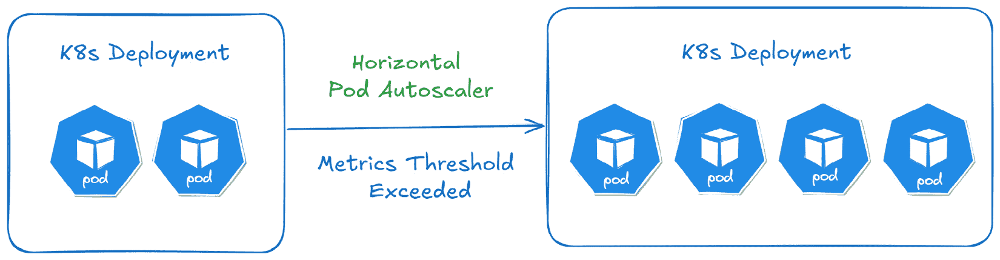
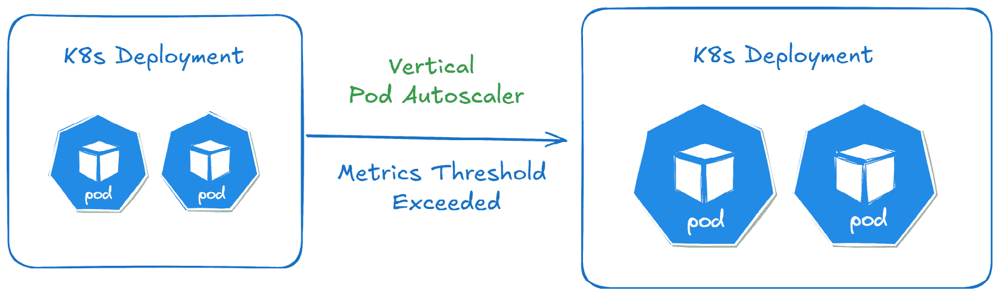
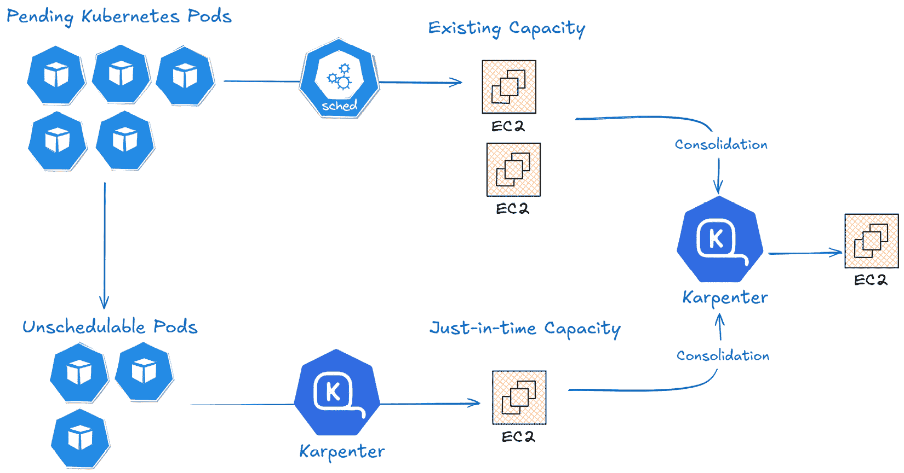

# 6

# 在 Kubernetes 上扩展 GenAI 应用

在本章中，我们将介绍 Kubernetes 的**应用扩展**策略和最佳实践。应用扩展是一个过程，K8s 可以动态扩展资源以匹配应用需求，从而确保高效且具成本效益的资源利用，并优化应用性能。Kubernetes 提供了不同的扩展机制，基于如 CPU 使用率、内存或自定义指标等度量来扩展应用。

在本章中，我们将覆盖以下主要内容：

+   **扩展指标**

+   **水平 Pod 自动扩展器** (**HPA**)

+   **垂直 Pod 自动扩展器** (**VPA**)

+   **Kubernetes 事件驱动** **自动扩展器** (**KEDA**)

+   **集群** **自动扩展器** (**CA**)

+   **Karpenter**

# 扩展指标

为了正确扩展应用，选择合适的指标至关重要，以确保高效的资源利用和无缝的终端用户体验。这些指标可以分为常规指标和自定义指标。

## 常规指标

这些是在 Kubernetes 中用于水平或垂直扩展的常见指标：

+   **CPU 使用率**：这衡量 CPU 利用率的百分比。高 CPU 利用率可能表示应用负载过重，需要更多实例（Pod）来处理需求，而持续较低的 CPU 使用率则可能表示资源的过度配置，此时 Pod 数量可以缩减。

+   **内存使用率**：这衡量 Pod 消耗的内存量。与 CPU 相似，高内存使用率可能表明应用正在处理大量数据，意味着需要更多资源以防止内存不足。当容器中的进程超出内存限制时，容器将被容器运行时（CRI）终止，这与 CPU 限制不同。如果设置了 CPU 限制，且容器超出该限制，容器不会被终止，而是会被限制或降低速度。通常，将内存使用率作为扩展指标并不是最佳实践，因为应用程序通常在内存管理方面表现不佳。

## 自定义指标

自定义指标允许 K8s 根据更多应用或特定用例的指标进行扩展，从而更精细地控制应用性能。一些自定义指标的示例如下：

+   **HTTP 请求率**：这衡量应用每秒接收到的 HTTP/HTTPS 请求或 API 调用的数量。我们可以使用监控工具，如 **Prometheus**，来追踪请求率，并在请求激增并超过某个阈值时扩展应用。

+   **队列长度**：这衡量了队列中未处理的任务或消息数量，如**Amazon SQS**或**RabbitMQ**。*队列积压*表明应用程序无法跟上负载，需要更多资源以及时处理任务。这是一个关键指标，特别是在**事件驱动架构**（**EDA**）中。K8s 的扩展机制，如 KEDA，支持基于队列指标进行扩展。

+   **延迟/响应时间**：这衡量了应用程序响应请求所需的时间。高延迟通常表示应用程序在当前负载下难以应对，扩展更多实例可以帮助保持较低的响应时间。

+   **错误率**：这衡量了请求失败的数量。错误率的增加可能表示当前资源数量不足以处理负载，导致失败；可能需要扩展资源。

+   **并发/活跃会话**：这衡量了与应用程序交互的活跃连接、用户或会话的数量。对于在线游戏或视频流平台等应用程序，活跃用户数量可能是应用程序负载的关键指标。

+   **GPU 利用率**：这衡量了应用程序消耗的 GPU 容量的百分比。在 K8s 上扩展 GenAI 应用程序时，使用 GPU 利用率作为扩展指标是有效的，因为它反映了应用程序的负载和资源的重度依赖。对于**NVIDIA GPUs**，可以使用**DCGM-Exporter**插件（[`github.com/NVIDIA/dcgm-exporter`](https://github.com/NVIDIA/dcgm-exporter)）导出指标，该插件可以通过 Helm 安装，使得观察性代理（如**Prometheus**）能够抓取这些指标。我们将在我们的 EKS 集群中配置此项，作为*第十二章*的一部分。

这些是 K8s 中常用的一些指标，用于扩展资源。有些应用程序可能需要混合使用多个指标。例如，一个 web 应用程序可能会同时使用网络 I/O 和请求速率，以确保资源利用率和性能的最优化。K8s 的自动扩展默认不提供自定义指标；需要安装*自定义指标适配器*，以使它们从相应的指标源中可用。该适配器充当指标系统与 K8s 之间的桥梁，通过 K8s 自定义指标 API 暴露这些指标。一些例子包括**prometheus-adapter**（[`github.com/kubernetes-sigs/prometheus-adapter`](https://github.com/kubernetes-sigs/prometheus-adapter)）和**Datadog Cluster** **Agent**（[`docs.datadoghq.com/containers/guide/cluster_agent_autoscaling_metrics`](https://docs.datadoghq.com/containers/guide/cluster_agent_autoscaling_metrics)）。

在本节中，我们讨论了不同类型的扩展度量，如常规度量和自定义度量，并查看了一些示例。我们还讨论了自定义 GPU 利用率度量，并发现它是扩展 GenAI 工作负载的有效指标。接下来，让我们探索水平 Pod 自动扩展，并了解如何使用这些度量来自动扩展 K8s Pods。

# 水平 Pod 自动扩展器（HPA）

HPA（[`kubernetes.io/docs/tasks/run-application/horizontal-pod-autoscale/`](https://kubernetes.io/docs/tasks/run-application/horizontal-pod-autoscale/)）是 K8s 的一项功能，基于用户定义的度量（如 CPU 或内存利用率）调整部署中 Pod 的数量。HPA 的主要目标是通过动态地扩展或收缩 Pod 的数量，确保应用能够处理不同的负载。HPA 不适用于不能扩展的对象，如*DaemonSets*。

HPA 使用度量服务器或监控系统（如 Prometheus）收集定义度量的实时数据。HPA 有一个**控制器**组件，在 Kubernetes 控制平面中运行。它定期检查目标应用（如部署）的当前度量，并将其与 HPA 资源配置中指定的期望阈值进行比较。

基于这些度量，控制器调整所需的 Pod 数量。如果资源使用率（如 CPU 利用率）超过阈值，HPA 会增加 Pod 的数量，而如果使用率低于阈值，HPA 会减少 Pod 的数量，如*图 6.1*所示。



图 6.1 – HPA 概述

以下 YAML 文件显示了如何在 K8s 中为我们的电子商务聊天机器人 UI 部署实现 HPA：

```

apiVersion: autoscaling/v2
kind: HorizontalPodAutoscaler
metadata:
  name: chatbot-ui-hpa
spec:
  scaleTargetRef:
    apiVersion: apps/v1
    kind: Deployment
    name: chatbot-ui-deployment
  minReplicas: 1
  maxReplicas: 5
  metrics:
  - type: Resource
    resource:
      name: cpu
      target:
        type: Utilization
        averageUtilization: 70
```

在这个例子中，我们将`kind`设置为`HorizontalPodAutoscaler`，这表示这个清单是针对 HPA 的，并将`name`设置为`chabot-ui-hpa`。在`spec`部分，我们将此 HPA 的扩展目标设置为`chatbot-ui-deployment`，这是一个部署，而`apps/v1`是目标资源的 API 版本。

接下来，我们将副本的最小数量设置为`1`（`minReplicas: 1`），最大副本数量设置为`5`（`maxReplicas: 5`）。最后，我们设置 HPA 可以监控并用来做扩展决策的度量。在这个例子中，我们使用所有*chatbot-ui-deployment*部署 Pod 的平均 CPU 利用率作为度量。

在 `target` 规范中，`averageUtilization: 70` 将目标 CPU 利用率设置为 `70`。如果平均 CPU 利用率超过 70%，HPA 将开始扩展副本数以满足此目标；然而，由于我们定义了最大副本数限制，它不会超过五个副本。当 CPU 利用率降到 70% 以下时，它将开始缩减副本数，但会确保始终有一个副本在运行（`minReplicas`）。你还可以使用 K8s 强制命令来创建和管理 HPA 资源。有关命令的示例，请参考官方 K8s 文档 [`kubernetes.io/docs/tasks/manage-kubernetes-objects/imperative-command/`](https://kubernetes.io/docs/tasks/manage-kubernetes-objects/imperative-command/)。

你可以从 GitHub 仓库下载 HPA 清单，链接地址为 [`github.com/PacktPublishing/Kubernetes-for-Generative-AI-Solutions/blob/main/ch6/chatbot-ui-hpa.yaml`](https://github.com/PacktPublishing/Kubernetes-for-Generative-AI-Solutions/blob/main/ch6/chatbot-ui-hpa.yaml)，并执行以下命令在我们的 EKS 集群中应用 HPA 策略。

```

$ kubectl apply -f chatbot-ui-hpa.yaml
horizontalpodautoscaler.autoscaling/chatbot-ui-hpa created
```

为了防止频繁的扩缩，以下 HPA 行为配置可供使用：

```

behavior:
  scaleDown:
    stabilizationWindowSeconds: 180
    policies:
    - type: Percent
      value: 50
      periodSeconds: 15
  scaleUp:
    stabilizationWindowSeconds: 0
    policies:
    - type: Pods
      value: 2
      periodSeconds: 15
    selectPolicy: Max
```

`scaleDown` 部分控制 HPA 缩减或移除副本的速度。在此示例中，最大允许的缩减比例已设置为 50%，这意味着 HPA 在每次缩减事件中可以移除最多 50% 的当前副本。`periodSeconds` 定义了在此时间窗口内评估扩缩规则的秒数。`stabilizationWindowSeconds` 指定了 HPA 在检测到较低资源利用率后，缩减副本之前要等待的时间（秒）。这有助于防止由于暂时的使用下降而导致频繁且过于激进的缩减。

在此情况下，稳定窗口设置为 180 秒，这意味着 HPA 在负载下降后，会等待 3 分钟才会减少副本数量。

`scaleUp` 部分的行为分类控制 HPA 扩展或添加新 Pod 的速度。在此情况下，我们定义了一个固定数量的 Pod 来作为扩展策略，而不是基于百分比的方法。基于百分比的策略会根据当前副本数的百分比来增加 Pod 数量。例如，如果我们有 5 个 Pod，并且策略允许 60% 的增加，HPA 就会扩展 3 个 Pod。

在此示例中，扩展是按每次增加两个 Pod 的固定增量进行的，如果需要更多副本，HPA 每 15 秒内最多可以增加两个 Pod。我们将 `stabilizationWindowSeconds` 设置为 `0`，这意味着扩展之前没有延迟。

在本教程中，我们基于 Pod 级别的指标创建了一个 HPA 策略，该指标汇总了 Pod 内所有容器的资源使用情况。然而，在多容器 Pod 中，这个指标可能无法准确反映单个容器的性能。为了解决这个问题，K8s 引入了容器资源指标，允许 HPA 在扩展目标资源时，跟踪跨 Pod 的特定容器资源使用情况。这种方法使您能够为最关键的容器设置扩展阈值。例如，如果您的 Pod 包含一个 Web 应用程序和一个提供日志记录的 sidecar 容器，您可以将 HPA 配置为仅根据 Web 应用程序的 CPU 利用率进行扩展，而忽略 sidecar 的资源使用。以下代码片段演示了如何使用`web-app`容器的 CPU 利用率来扩展整体部署：

```

type: ContainerResource
containerResource:
  name: cpu
  container: web-app
  target:
    type: Utilization
    averageUtilization: 60
```

在本节中，我们探讨了 HPA，这是一个 K8s 功能，旨在根据用户定义的指标（如 CPU、内存或 GPU 利用率）自动调整 K8s 部署、StatefulSet 或 ReplicaSet 中的 Pod 数量。其主要目标是保持足够数量的 K8s Pods，以有效处理动态工作负载。我们还介绍了如何配置 HPA 策略并自定义扩展行为。接下来，让我们深入了解 VPA。

# VerticalPodAutoscaler（VPA）

VPA 可以根据实际使用情况和配置调整 Pod 的 CPU 和内存资源请求和限制。这与 HPA 不同，HPA 根据定义的指标调整 Pod 的数量。VPA 有四种操作模式：

+   **关闭**：在此模式下，VPA 仅提供资源建议，但不应用任何更改。

+   **自动**：VPA 会对资源请求进行修改并重启 Pod（如果需要的话）。

+   **重建**：VPA 在 Pod 创建时应用更改，并通过驱逐现有 Pod 来更新它们。

+   **初始**：VPA 仅在创建新 Pod 或重启现有 Pod 时应用资源建议，而不会干扰正在运行的 Pod。

VPA 通过 K8s Metrics API 收集资源使用数据，并建议适当的 CPU 和内存值，用于资源请求和限制。在*自动*模式下，它可以自动驱逐 Pod，从而使它们重新调度并应用更新的资源请求，如*图 6.2*所示。



图 6.2 – VPA 概述

与 HPA 不同，VPA 并不默认包含在 K8s 中；它是一个独立的项目，可以在 GitHub 上找到，网址为[`github.com/kubernetes/autoscaler/tree/master/vertical-pod-autoscaler`](https://github.com/kubernetes/autoscaler/tree/master/vertical-pod-autoscaler)。按照[`github.com/kubernetes/autoscaler/blob/master/vertical-pod-autoscaler/docs/installation.md`](https://github.com/kubernetes/autoscaler/blob/master/vertical-pod-autoscaler/docs/installation.md)上的说明安装 VPA 插件。

下面的 YAML 文件在我们部署在 K8s 中的电子商务聊天机器人 UI 应用程序中实现了 VPA：

```

apiVersion: autoscaling.k8s.io/v1
kind: VerticalPodAutoscaler
metadata:
  name: chatbot-ui-vpa
spec:
  targetRef:
    apiVersion: apps/v1
    kind: Deployment
    name: chatbot-ui-deployment
  updatePolicy:
    updateMode: "Auto"
  resourcePolicy:
    containerPolicies:
    - containerName: "*"
      minAllowed:
        cpu: "1000m"
        memory: "2Gi"
      maxAllowed:
        cpu: "2000m"
        memory: "4Gi"
      controlledValues: "RequestsAndLimits"
```

您可以从 GitHub 存储库下载 VPA 清单，网址为[`github.com/PacktPublishing/Kubernetes-for-Generative-AI-Solutions/blob/main/ch6/chatbot-ui-vpa.yaml`](https://github.com/PacktPublishing/Kubernetes-for-Generative-AI-Solutions/blob/main/ch6/chatbot-ui-vpa.yaml)，并执行以下命令将 VPA 策略应用于我们的 EKS 集群：

```

$ kubectl apply -f chatbot-ui-vpa.yaml
verticalpodautoscaler.autoscaling.k8s.io/chatbot-ui-vpa created
```

在此示例中，我们将`kind`设置为`VerticalPodAutoscaler`，将`updateMode`设置为`Auto`，这意味着 VPA 将自动调整资源请求和限制。`containerName *`通配符表示该策略应适用于 Pod 中的所有容器。

`maxAllowed`限制确保 VPA 不会将资源值设置超出指定范围。在此配置中，`minAllowed`限制定义为`1000m`（相当于一个 vCPU）和 2GB 内存，而最大允许的 CPU 为`2000m`（或两个 vCPUs）和 4GB 内存。将`controlledValues`定义为`RequestsAndLimits`表示 VPA 应同时管理资源请求和限制。资源请求是 Pod 在启动时向 Kubernetes 调度程序请求的 CPU 或内存量。如果我们只希望 VPA 调整资源请求而不是限制，可以将其设置为`RequestsOnly`。

## 结合 HPA 和 VPA

建议不要在同一集群中结合使用 HPA 和 VPA（除非将 VPA 设置为“off”），因为这可能导致潜在的冲突。例如，VPA 调整 Pod 的 CPU/内存资源请求和限制，而 HPA 根据当前利用率扩展 Pod 的数量。如果同时使用 HPA 和 VPA，VPA 的更改可能会使 HPA 感到困惑，因为单个 Pod 的资源使用频繁波动，影响 HPA 用于扩展的指标。

在本节中，我们探讨了 VPA 及其操作模式，以及一个示例清单。VPA 监视工作负载的资源使用情况，并自动调整资源请求以优化 K8s 集群中的资源分配。我们还讨论了同时在自动操作模式下结合使用 HPA 和 VPA 可能引发的潜在冲突。

# KEDA

随着云采用的普及，微服务和 EDA 采用趋势日益增长。在这种实施中，不同的构建模块被划分为基于微服务的实现，这些实现是自包含的，仅通过 API 调用彼此通信。这种实现允许更容易进行更新，并具备添加新功能的灵活性。

**KEDA** ([`keda.sh/`](https://keda.sh/)) 是一个开源项目，将事件驱动的自动缩放引入 Kubernetes。它通过允许应用程序根据外部事件源（如消息队列深度、事件流大小或任何自定义指标）进行缩放，扩展了 Kubernetes 内置的 HPA 功能。

KEDA 的**ScaledObject**是一个自定义资源，定义了如何根据事件驱动或外部指标自动扩展目标（例如部署）。当我们在 KEDA 中定义一个 ScaledObject 时，它会在后台自动创建一个 HPA 资源。然后，HPA 资源根据 KEDA 提供的指标扩展部署。ScaledObject 定义了扩展逻辑（例如，使用哪个外部指标、扩展阈值以及最小/最大副本数），而 KEDA 则根据此配置管理 HPA。

KEDA 特别适用于事件驱动架构，在这种架构中，工作负载可能是偶发的，只有在发生事件时才需要扩展，例如新用户登录或新物品加入购物车。

KEDA 支持各种**扩展器**，这些扩展器与外部服务集成，如 Amazon SQS、Apache Kafka 和 Prometheus。这些扩展器监控指标或事件的变化，例如队列中的消息数量或 HTTP 请求的速率。

注意

请参考 KEDA 文档：[`keda.sh/docs/latest/scalers/`](https://keda.sh/docs/latest/scalers/)，以获取可用扩展器的列表。

KEDA 的一个独特特点是，当没有事件需要处理时，它可以缩放到零，这在无服务器和事件驱动的应用程序中非常有用。

为了说明这种行为，让我们看一个示例**ScaledObject**配置，该配置使 KEDA 能够根据 Amazon SQS 队列中的消息数量扩展部署。

```

apiVersion: keda.sh/v1alpha1
kind: ScaledObject
metadata:
  name: amazonsqs-scaler
spec:
  scaleTargetRef:
    apiVersion: apps/v1
    kind: Deployment
    name: demo-deployment
  minReplicaCount: 0
  maxReplicaCount: 10
  pollingInterval: 15
  cooldownPeriod: 180
  triggers:
  - type: aws-sqs-queue
    metadata:
      queueURL: "http://<aws-sqs-url"
      awsRegion: "us-east-1"
      queueLength: "10"
  authenticationRef:
    name: keda-service-account
```

我们定义了一个用于基于 Amazon SQS 进行扩展的 ScaledObject，`amazonsqs-scaler`。

将`minReplicaCount`设置为`0`定义了部署的最小副本数。在此示例中，当 Amazon SQS 队列中没有消息时，KEDA 可以将部署缩减为零。这有助于在没有工作负载处理时节省资源。将`maxReplicaCount`设置为`10`指定了 KEDA 可以将部署扩展到的最大副本数。这确保了即使队列大小增加，部署也不会扩展超过 10 个 Pod。

将`pollingInterval`设置为`15`使得 KEDA 每 15 秒检查一次队列长度。在这种情况下，KEDA 将每 15 秒查询一次 Amazon SQS API，以检查队列的大小。将`cooldownPeriod`设置为 180 秒表示，在扩展后，KEDA 会等待 3 分钟再缩放部署，即使工作负载减少。这可以防止在暂时流量激增后快速缩放，并实现更稳定的扩展。

我们使用`aws-sqs-queue`作为扩展器类型，它与 Amazon SQS 服务兼容。`queueURL`定义了 Amazon SQS 服务的管理端点，KEDA 可以在此查询队列深度。`queueLength`设置为`10`定义了扩展的阈值。当队列中的消息数量超过 10 时，KEDA 将触发扩展。最后，`keda-service-account`指的是 KEDA 将用于与 Amazon SQS 服务进行身份验证的服务账户。

以下是一个示例 ScaledObject，它会自动扩展 K8s 中的 GenAI 模型部署。它基于两个触发器进行扩展：第一个触发器是基于传入请求的平均数量，第二个触发器是基于推理 Pods 的 GPU 利用率。这两个指标来自本地 Prometheus 设置，Prometheus 从 NVIDIA DCGM 导出程序和应用程序指标端点收集这些指标：

```

apiVersion: keda.sh/v1alpha1
kind: ScaledObject
metadata:
  name: my-llama-deployment-scaler
spec:
  scaleTargetRef:
    apiVersion: apps/v1
    kind: Deployment
    name: my-llama-deployment
...
  triggers:
    - type: prometheus
      metadata:
        serverAddress: http://prometheus-server.default.svc:9090
        metricName: http_requests_total
        threshold: "10"
        query: sum(rate(http_requests_total[1m]))
    - type: prometheus
      metadata:
        serverAddress: http://prometheus-server.default.svc:9090
        metricName: DCGM_FI_DEV_GPU_UTIL
        threshold: "70"
        query: avg(DCGM_FI_DEV_GPU_UTIL{pod=~"my-llama-.*"}[30s])
```

在这一部分，我们探讨了 KEDA 项目，它为 K8s 带来了基于事件的自动扩展。KEDA 通过使应用能够基于来自多个来源的自定义指标进行扩展，扩展了内置的 HPA，包括基于事件的指标，如消息队列深度。通过将 KEDA 集成到 K8s 中，我们可以根据外部事件动态扩展 K8s 工作负载，使资源分配更加响应和高效。

# 集群自动扩展器 (CA)

Kubernetes CA 是一个根据集群中运行的工作负载需求调整 Kubernetes 集群中节点数量的工具。它通过增加或删除节点来扩大或缩小集群，以满足待调度或低利用率 Pods 的资源需求。

当 HPA 检测到资源使用超过配置的阈值时，它会增加 Pod 副本的数量。然而，如果集群中现有的节点没有足够的容量来调度新的 Pods，这些 Pods 将保持未调度状态。

这就是 CA 发挥作用的地方。CA 检测到存在无法调度的 Pods，并配置更多的节点来容纳这些新创建的、未调度的 Pods。一旦节点准备好，待处理的 Pods 会被调度并开始在新节点上运行。

CA 支持 *扩展*，即当 Pods 因资源不足无法调度时；也支持 *缩减*，即当节点未被充分利用时，CA 可以移除它们以优化资源利用率并降低成本。

CA 持续监控 Kubernetes 集群，并与云提供商的 API 交互，依据当前的资源使用情况添加或删除节点。它主要关注因资源不足而无法调度的待处理 Pods 和具有剩余容量的低利用率节点。

CA 确定一个节点组，例如 AWS 自动扩展组，该组能够提供具有必要资源的额外节点。一旦新节点可用，待调度的 Pods 会被安排在该节点上运行：

+   **缩减**：当节点未被充分利用，即它们运行时资源使用率低或没有显著的工作负载时，CA 会检查是否可以将这些未充分利用节点上的 Pods 安全地重新调度到集群中的其他节点上。

+   **扩展**：当应用程序遇到高资源需求，而现有节点无法容纳新的或待处理的工作负载时，CA 会触发扩展。它会配置额外的节点以确保工作负载调度。一旦新节点加入集群，待调度的 Pods 会被调度到这些节点上，以保持所需的性能。

虽然 CA 一直是扩展 Kubernetes 集群的传统选择，但它存在一些局限性，例如依赖于预定义的节点组和基于轮询的扩展决策机制。这就是**Karpenter**可以提供帮助的地方。Karpenter 旨在解决传统自动扩展方法的低效问题，下一节将详细介绍其功能。

# Karpenter

**Karpenter** 是由 AWS 开发的开源、灵活且高性能的 Kubernetes 集群自动扩展器。它首次亮相于 2021 年的 AWS re:Invent ([`aws.amazon.com/blogs/aws/introducing-karpenter-an-open-source-high-performance-kubernetes-cluster-autoscaler/`](https://aws.amazon.com/blogs/aws/introducing-karpenter-an-open-source-high-performance-kubernetes-cluster-autoscaler/)) 大会，主要目的是改善和简化 K8s 的自动扩展体验。

与原生 Kubernetes CA 主要侧重于响应待处理 Pods 来扩展节点不同，Karpenter 会根据工作负载的具体需求动态地提供合适的计算资源。Karpenter 在以下几个方面优化了效率和性能：

+   **更快速和更高效的扩展**：Karpenter 可以直接与 Kubernetes API 服务器通信，以了解待处理 Pod 的需求，并能够更快地启动新节点，从而减少调度延迟。Karpenter 通过分析待处理 Pod 的具体需求，几乎实时地做出扩展决策。这意味着节点是根据即时需求进行配置的，从而减少了延迟并提高了对工作负载变化的响应能力。

+   **更好的节点利用率**：与 CA 通常从预配置的实例组或节点池中配置节点不同，Karpenter 可以动态选择最佳的实例类型。它可以选择与待处理 Pods 的资源需求匹配的实例大小和类型，从而减少浪费的容量并优化资源分配。

+   **整合能力**：Karpenter 会持续监控集群，并在可能的情况下通过重新打包工作负载到更少的节点上来整合它们，从而终止那些使用不足的节点。这种整合有助于通过更有效地利用现有的节点资源来降低成本，而 CA 通常根据预设的阈值进行缩减节点，而不积极整合工作负载。

+   **支持多种实例类型**：Karpenter 可以从多种实例类型中选择，包括不同的代际和大小。它根据当前的可用性和定价进行选择，确保 Pods 被调度到最具成本效益且资源合适的节点上。

+   **漂移**：Karpenter 会自动检测已漂移的节点，并以滚动方式替换它们。此功能可用于执行修补程序升级或 Karpenter 管理节点的 K8s 版本升级。

Karpenter 会在集群中查找被 kube-scheduler 标记为*不可调度*的待处理 Pods，并汇总这些 Pods 的资源和调度需求，从而做出决策启动新的工作节点。它执行*箱形打包*以确保正确的节点大小和数量被配置。它还会主动寻找机会，通过终止空闲、使用不足或可以被更便宜节点替换的工作节点来减少集群的整体成本，如*图 6.3*所示。



图 6.3 – Karpenter 概述

Karpenter 提供了两个自定义资源，**NodePools** ([`karpenter.sh/v1.4/concepts/nodepools/`](https://karpenter.sh/v1.4/concepts/nodepools/)) 和 **NodeClasses** ([`karpenter.sh/v1.4/concepts/nodeclasses/`](https://karpenter.sh/v1.4/concepts/nodeclasses/))，用于配置。NodePools 定义了 Karpenter 创建的节点的配置约束集，例如实例类型、可用区、CPU 架构、容量类型、污点和标签。NodeClasses 配置了云提供商特定的设置，例如 VPC 子网、IAM 角色、AMI ID 和 EC2 安全组。可以创建多个 NodePools，以满足不同的工作负载需求，例如用于生成 AI 训练和推理应用程序的 GPU 专用 NodePool，以及用于容纳 Web 服务器和微服务的通用 NodePools。始终确保 NodePools 具有互不重叠的配置；如果匹配多个 NodePools，Karpenter 会随机选择一个来启动工作节点。

Karpenter 可以作为 Helm 图表安装到 EKS 集群中，具体安装步骤请参考 [`karpenter.sh/docs/getting-started/getting-started-with-karpenter/`](https://karpenter.sh/docs/getting-started/getting-started-with-karpenter/) 中的入门指南。在我们的设置中，我们使用 Terraform Helm 提供程序在第三章中作为 EKS 集群设置的一部分安装了 Karpenter。

您可以使用以下命令验证安装情况，该命令将显示部署的状态、版本和其他详细信息：

```

$ helm list -n kube-system
NAME                NAMESPACE             STATUS
karpenter           kube-system           deployed
```

现在，让我们利用 Karpenter 的功能为我们的 GenAI 工作负载自动启动 GPU 实例。在 *第五章* 中，我们创建了一个专用的 EKS 管理节点组，使用 G6 EC2 实例来部署 Llama 3 微调任务和推理应用程序。这种方法的一个缺点是，无论 GenAI 应用程序是否运行，GPU 工作节点始终附加在集群上，这对最昂贵的资源来说是一种低效的利用方式。现在，让我们删除该节点组，并配置 Karpenter 来管理 GPU 实例的配置。

在 `eks.tf` 文件中注释以下代码，并运行 Terraform 命令来删除 `eks-gpu-mng` 节点组。完整文件可见于 [`github.com/PacktPublishing/Kubernetes-for-Generative-AI-Solutions/blob/main/ch6/eks.tf`](https://github.com/PacktPublishing/Kubernetes-for-Generative-AI-Solutions/blob/main/ch6/eks.tf)：

```

module "eks" {
  source = "terraform-aws-modules/eks/aws"
  ...
  eks_managed_node_groups = {
    ...
    # eks-gpu-mng = {
      # instance_types = ["g6.2xlarge"]
      # ami_type = "AL2_x86_64_GPU"
      # max_size = 2
      # desired_size = 1
      # capacity_type = "SPOT"
      # disk_size = 100
      # labels = {
      #   "hub.jupyter.org/node-purpose" = "user"
      # }
      # taints = {
      #   gpu = {
      #     key    = "nvidia.com/gpu"
      #     value = "true"
      #     effect = "NO_SCHEDULE"
      #   }
      # }
    # }
 ...
$ terraform plan
$ terraform apply -auto-approve
```

你可以通过检查 EKS 控制台中的**计算**标签页，或者使用以下命令来确认节点组已被删除：

```

$ kubectl get nodes -l nvidia.com/gpu.present
```

现在我们已经删除了集群中的 GPU 工作节点，接下来让我们通过创建 NodePool 和 EC2NodeClass 资源来配置 Karpenter，以启动 GPU 实例。创建一个名为 `eks-gpu-np` 的 GPU NodePool，并设置以下要求，选择 G6 实例系列，来自按需或竞价容量。完整文件可见于 [`github.com/PacktPublishing/Kubernetes-for-Generative-AI-Solutions/blob/main/ch6/eks-gpu-np.yaml`](https://github.com/PacktPublishing/Kubernetes-for-Generative-AI-Solutions/blob/main/ch6/eks-gpu-np.yaml)：

```

apiVersion: karpenter.sh/v1
kind: NodePool
metadata:
  name: eks-gpu-np
spec:
...
      nodeClassRef:
        group: karpenter.k8s.aws/v1
        kind: EC2NodeClass
        name: default
      requirements:
        - key: "karpenter.k8s.aws/instance-generation"
          operator: In
          values: ["g6"]
        - key: "karpenter.sh/capacity-type"
          operator: In
          values: ["spot", "on-demand"]
  disruption:
    consolidationPolicy: WhenEmptyOrUnderutilized
...
$ kubectl apply -f eks-gpu-np.yaml
nodepool.karpenter.sh/eks-gpu-np created
```

接下来，创建 `default-gpu` EC2NodeClass 来配置 AMI、IAM 角色、VPC 子网、EC2 安全组等。完整文件可见于 [`github.com/PacktPublishing/Kubernetes-for-Generative-AI-Solutions/blob/main/ch6/eks-gpu-nc.yaml`](https://github.com/PacktPublishing/Kubernetes-for-Generative-AI-Solutions/blob/main/ch6/eks-gpu-nc.yaml)：

```

apiVersion: karpenter.k8s.aws/v1
kind: EC2NodeClass
metadata:
  name: default-gpu
spec:
  amiFamily: AL2023
...
  role: "eks-demo"
...
$ kubectl apply -f eks-gpu-nc.yaml
ec2nodeclass.karpenter.k8s.aws/default-gpu created
```

现在我们已经配置了 Karpenter，接下来让我们重新运行微调任务，看看计算自动扩展的实时效果。执行以下命令来启动微调任务。你可以下载 K8s 清单文件，文件位于 [`github.com/PacktPublishing/Kubernetes-for-Generative-AI-Solutions/blob/main/ch5/llama-finetuning/llama-finetuning-job.yaml`](https://github.com/PacktPublishing/Kubernetes-for-Generative-AI-Solutions/blob/main/ch5/llama-finetuning/llama-finetuning-job.yaml)。在运行命令之前，请替换容器镜像、Hugging Face 令牌和模型资源 S3 桶名称值：

```

$ kubectl delete job my-llama-job
job.batch "my-llama-job" deleted
$ kubectl apply -f llama-finetuning-job.yaml
job.batch/my-llama-job is created
```

鉴于集群中没有 GPU 工作节点，kube-scheduler 会将微调 Pod 标记为不可调度。我们可以通过使用以下命令来验证这一点。第一个命令会输出*待处理*状态，第二个命令显示该状态的原因。

```

$ kubectl get pods -l app=my-llama-job
NAME                    READY     STATUS        RESTARTS         AGE
my-llama-job-plgb5      0/1       Pending       0                22s
$ kubectl describe pod -l app=my-llama-job | grep Scheduling
Warning  FailedScheduling  101s  default-scheduler  0/2 nodes are available: 2 Insufficient nvidia.com/gpu. preemption: 0/2 nodes are available: 2 No preemption victims found for incoming pod
```

Karpenter 正在积极寻找待处理的无法调度的 Pods，并启动 G6 系列的 EC2 实例来响应我们的微调任务。让我们通过查看 Karpenter 日志来验证这一点：

```

$ kubectl logs --selector app.kubernetes.io/instance=karpenter -n kube-system
{"level":"INFO","time":"2025-01-31T14:34:03.899Z","logger":"controller","message":"found provisionable pod(s)","commit":"b897114","controller":"provisioner","namespace":"","name":"","reconcileID":"bbdfdd41-e86f-4cfe-8fb5-e161f3ce4a72","Pods":"default/my-llama-job-plgb5","duration":"33.662142ms"}
...
{"level":"INFO","time":"2025-01-31T14:36:01.277Z","logger":"controller","message":"initialized nodeclaim","commit":"b897114","controller":"nodeclaim.lifecycle","controllerGroup":"karpenter.sh","controllerKind":"NodeClaim","NodeClaim":{"name":"eks-gpu-np-gkx7t"},"namespace":"","name":"eks-gpu-np-gkx7t","reconcileID":"f2b28556-4808-4577-a559-f946a451b46c","provider-id":"aws:///us-west-2c/i-02e475780d3aed0a1","Node":{"name":"ip-10-0-32-176.us-west-2.compute.internal"},"allocatable":{"cpu":"15890m","ephemeral-storage":"95551679124","hugepages-1Gi":"0","hugepages-2Mi":"0","memory":"60398040Ki","nvidia.com/gpu":"1","pods":"234"}}
```

一旦节点启动并加入集群，微调任务将会在该节点上调度。你可以通过使用以下命令来验证：

```

$ kubectl get pods -l app=my-llama-job
NAME                 READY   STATUS    RESTARTS   AGE
my-llama-job-plgb5   1/1     Running   0          9m20s
$ kubectl get nodes -l nvidia.com/gpu.present
NAME                                        STATUS   ROLES
ip-10-0-32-176.us-west-2.compute.internal   Ready    <none>
```

任务完成几分钟后，Karpenter 会自动检测到空闲节点，应用一个污点以防止新的工作负载被调度，逐出现有的 Pods，然后终止该节点。你可以通过查看 Karpenter 日志来验证这一点：

```

$ kubectl logs --selector app.kubernetes.io/instance=karpenter -n kube-system
"level":"INFO","time":"2025-01-31T14:50:18.104Z","logger":"controller","message":"tainted node","commit":"b897114","controller":"node.termination","controllerGroup":"","controllerKind":"Node","Node":{"name":"ip-10-0-32-176.us-west-2.compute.internal"},"namespace":"","name":"ip-10-0-32-176.us-west-2.compute.internal","reconcileID":"874424bd-d2f7-45ab-a399-41e5314fb3d3","taint.Key":"karpenter.sh/disrupted","taint.Value":"","taint.Effect":"NoSchedule"}
{"level":"INFO","time":"2025-01-31T14:54:03.281Z","logger":"controller","message":"deleted node","commit":"b897114","controller":"node.termination","controllerGroup":"","controllerKind":"Node","Node":{"name":"ip-10-0-32-176.us-west-2.compute.internal"},"namespace":"","name":"ip-10-0-32-176.us-west-2.compute.internal","reconcileID":"eb99f292-2ea2-4aba-ac88-528746cc7e89"}
```

在本节中，我们探讨了使用 Karpenter 的优势，并通过 Terraform 和 Helm 在 EKS 集群中安装了它。然后，我们配置了 Karpenter 启动 G6 实例，以支持我们的 Llama 3 微调任务和推理工作负载。Karpenter 在微调任务期间启动了一台 G6 实例，并在任务完成后自动终止该实例。

# 总结

本章讨论了 K8s 应用程序的扩缩容策略和最佳实践，旨在确保资源的高效利用和最佳性能。本章涵盖了扩缩容的关键主题，包括指标、HPA、KEDA、VPA、CA 和 Karpenter。

在 Kubernetes 中进行扩缩容涉及选择合适的扩缩容指标。常规指标帮助确定是否需要添加或删除 Pod，而自定义指标则用于在扩缩容决策中实现更精细的控制。

HPA 可以根据 CPU 或内存使用率等指标自动调整部署中 Pod 的数量，而 VPA 可以调整单个 Pod 的资源请求和限制。VPA 确保资源的最佳分配，但如果同时使用 HPA 和 VPA，可能会产生冲突。

KEDA 将事件驱动的自动扩缩容引入 K8s，支持基于外部事件（如消息队列深度）进行扩缩容。它创建了一个 HPA 资源，用于在事件触发（如 API 调用激增）时管理扩缩容。KEDA 可以将应用程序扩缩容到零，因此非常适合无服务器和事件驱动的使用场景。CA 可以根据 Pod 的需求调整集群中节点的数量。CA 与云提供商的 API 紧密合作，动态管理节点。

最后，我们介绍了 Karpenter，作为 CA 的替代方案。Karpenter 可以动态提供适当大小的计算资源，以处理待处理的 Pod。它通过选择合适的实例类型并终止未充分利用的节点来优化性能和成本效率，以降低成本。为了演示其功能，我们重新运行了 Llama 3 微调任务，在此过程中，Karpenter 根据资源需求启动了一台带 GPU 能力的节点，并在任务完成后自动终止该节点。在下一章中，我们将讨论优化在 K8s 上运行 GenAI 应用程序的整体成本的不同策略。
