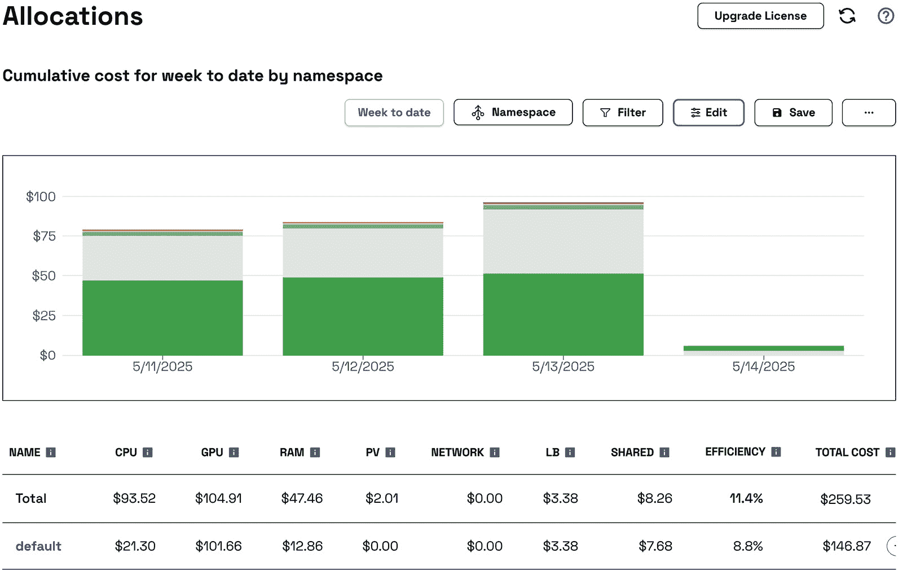
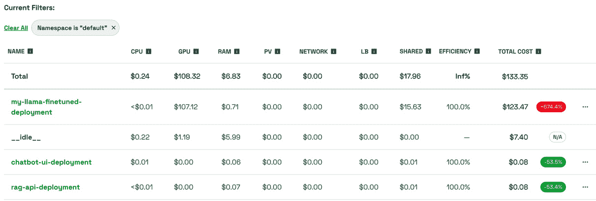
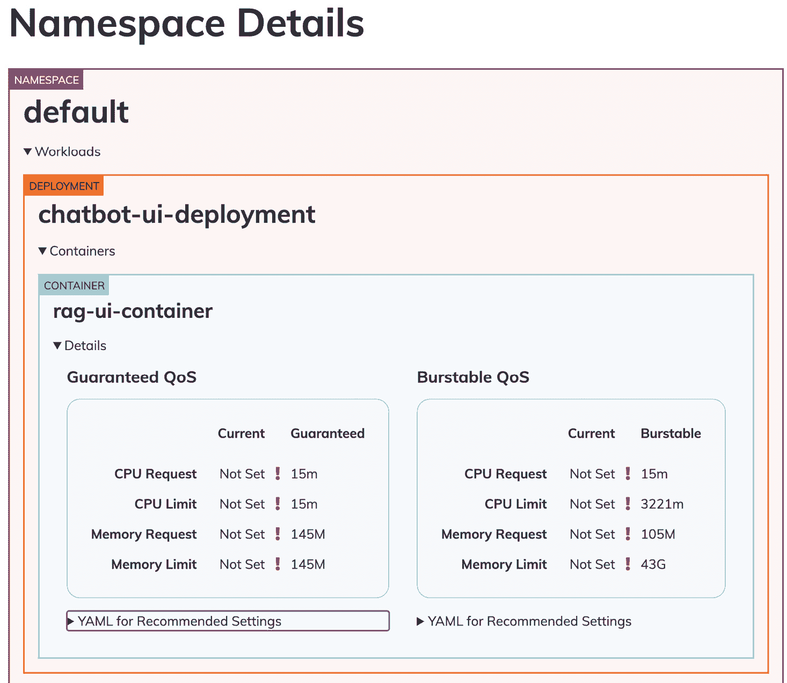
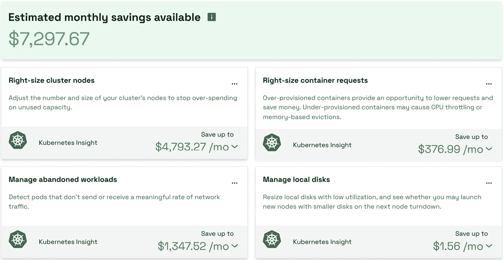
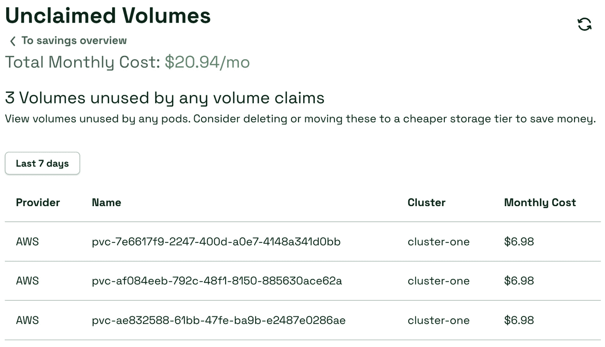
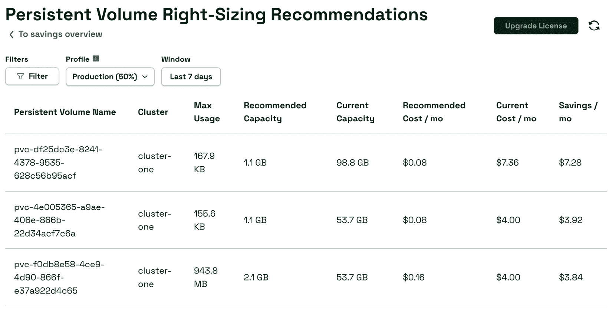

# 第六章：在 Kubernetes 上优化 GenAI 应用程序的成本

本章将涵盖在云端部署 GenAI 应用程序的关键成本组成部分，包括计算、存储和网络成本。接着，我们将讨论优化这些成本的选项，例如通过*调整资源规模*来防止过度配置，思考如何进行*高效存储管理*，以及*网络最佳实践*。本章还将介绍监控和优化工具，如 Kubecost，以识别资源使用模式和节省成本的机会。

本章将涵盖以下主要主题：

+   理解关键成本组成部分

+   成本优化技术

# 理解关键成本组成部分

在云端部署应用程序时，主要的成本组成部分通常包括计算、存储和网络成本：

+   **计算成本**：计算可能是 GenAI 应用程序的一个重要成本因素，因为其资源密集型的特性。计算成本基于实例大小，包括 CPU、GPU 和内存大小。在 AWS 上，这些计算实例按秒计费，最小为 60 秒。所以，在第一个分钟后，这些费用将按秒增量计费。欲了解更深层次的内容，请参考 AWS 定价文档：[`aws.amazon.com/ec2/pricing/`](https://aws.amazon.com/ec2/pricing/)。

+   **存储成本**：GenAI 模型通常需要大量的数据用于训练和推理，因此存储是另一个关键的成本组成部分。主要的存储成本包括对象存储和块存储。对象存储，如 Amazon S3，通常用于存储数据集，例如图像、文本或视频文件。对象存储的费用通常基于存储的数据量（GB/月）和任何相关的取回费用。块存储，如**Amazon Elastic Block Storage**（**EBS**），提供可以附加到 Amazon EC2 实例的块级存储卷。EBS 通常用于 GenAI 应用程序中需要一致、低延迟访问的工作负载，如模型检查点、日志和其他中间文件。块存储的费用基于存储量和类型，例如**固态硬盘**（**SSDs**）与**硬盘驱动器**（**HDDs**）的区别。

+   **网络成本**：在云部署中，网络成本可能会增加，特别是对于涉及跨区域或可用区的大规模数据传输的 GenAI 应用程序。网络成本组成部分包括流入/流出费用、跨区域传输费用、NAT 网关费用以及**内容分发网络**（**CDN**）费用。

    +   **外流成本**包括从云中传输出的数据的费用。如果需要将大型 AI 模型提供给最终用户，或者在区域之间或与本地环境之间移动数据，这些费用可能会累积。云中入站数据的 **入流成本** 通常较低或免费。如果一个应用程序涉及多个云区域、可用区或不同云提供商之间的通信，例如在混合云或多云设置中，区域间或外部的 *数据传输成本* 也可能非常高。

    +   **NAT 网关费用**包括固定的每小时费用以及基于数据传输量的处理费用。数据传输成本根据数据流向的不同而有所不同。来自互联网的入站数据传输通常是免费的；然而，从云中到互联网的外部数据传输可能会根据数据量（GB）收取费用。

我们已经介绍了运行 GenAI 应用程序中涉及的各种成本组件。现在，让我们探索如何在 **Kubernetes**（**K8s**）集群中获得对基础设施成本的细粒度可视化。K8s 和云环境中有多个可用的成本分配工具。一些示例包括 **OpenCost** ([`www.opencost.io/`](https://www.opencost.io/))、**Kubecost** ([`www.kubecost.com/`](https://www.kubecost.com/))、Spot.io ([`spot.io/`](https://spot.io/))、**Cast.ai** ([`cast.ai/`](https://cast.ai/))、**PerfectScale** ([`www.perfectscale.io/`](https://www.perfectscale.io/))、**IBM Cloudability** ([`www.apptio.com/products/cloudability/`](https://www.apptio.com/products/cloudability/))、**Harness** ([`www.harness.io/`](https://www.harness.io/))、云服务提供商特定的解决方案等。在本章中，我们将探讨 Kubecost 用于 K8s 集群成本分析。

## Kubecost

Kubecost 是一款专为 K8s 环境设计的成本监控与优化工具。它通过提供有关在 K8s 集群中运行工作负载的各类成本组件的详细洞察，帮助跟踪、分配和优化成本。

Kubecost 可以通过提供以下功能帮助可视化 K8s 部署的成本组件：

+   **按命名空间、Pod 和服务的成本细分**：Kubecost 允许我们查看分配给不同 K8s 对象的详细成本，如 *命名空间*，以跟踪不同团队或应用程序的成本。它还可以突出显示在单个 Pod 层级、服务层级或部署层级的成本归属。Kubecost 可以汇总特定服务或部署的成本，清晰展示我们在微服务或特定部署上花费了多少。这种细粒度的细分对于多租户 K8s 集群尤为重要，因为多个团队或服务可能共享同一个集群。

+   **计算成本**：Kubecost 可以跟踪 EC2 实例成本，帮助您判断是否使用了最具成本效益的节点类型。Kubecost 还可以突出显示任何节点或计算资源是否未被充分利用。

+   **存储成本**：Kubecost 可以跟踪附加到 K8s 工作负载的存储卷成本。Kubecost 可以区分不同类型的 EBS 卷，如 gp2、gp3 和 io1，并分析它们的成本，帮助您根据性能需求和成本优化。它还可以检测未使用或低效利用的存储卷。

+   **网络成本**：Kubecost 可以跟踪与网络相关的成本，如不同节点、区域之间，甚至 AWS 服务之间的数据传输费用。这有助于优化网络配置，减少不必要的跨区域或跨 AZ 数据传输。

+   **流量进出**：可以跟踪和可视化进出您的 K8s 集群的流量成本，尤其在为外部应用程序或用户提供服务时，这一点尤为相关。

+   **负载均衡器**：Kubecost 可以识别并分解与 K8s 服务或入口资源相关的负载均衡器（如 AWS NLB 或 ALB）成本。

+   **与 AWS 成本和使用报告 (CUR) 的集成**：Kubecost 可以与 AWS CUR ([`docs.aws.amazon.com/cur/latest/userguide/what-is-cur.html`](https://docs.aws.amazon.com/cur/latest/userguide/what-is-cur.html)) 集成，提供全面的成本视图，包括您的 EKS 工作负载所依赖的非 K8s AWS 服务，如 Amazon S3 或 RDS。如果您有多个 EKS 集群，Kubecost 还可以汇总所有集群的成本，并提供全球层面的洞察，或深入特定集群进行更详细的成本分析。

Kubecost 支持 *按标签分配成本*，这对于多租户环境尤其有用，在这种环境中，需要将成本归属到不同的团队、项目或环境（例如开发、QA、预发布或生产）。Kubecost 提供历史成本追踪，并允许您可视化成本趋势。

Kubecost 不仅可以帮助您可视化成本，还能提供可操作的优化建议，例如通过分析资源使用情况（CPU、内存、存储）并建议调整工作负载大小，从而避免资源的过度配置或低效利用，*推荐合适的资源规模*。Kubecost 还可以建议您在哪些地方切换到 **EC2 Spot 实例**，以节省计算成本，这对于非关键或可中断的工作负载尤其重要。

### 设置 Kubecost

Kubecost 可以作为 Helm chart 安装在我们的 EKS 集群中。有关不同安装选项，请参阅 Kubecost 文档中的 Amazon EKS 集成部分：[`www.ibm.com/docs/en/kubecost/self-hosted/2.x?topic=installations-amazon-eks-integration`](https://www.ibm.com/docs/en/kubecost/self-hosted/2.x?topic=installations-amazon-eks-integration)。

在我们的设置中，我们将使用 Terraform Helm 提供程序安装 Kubecost。从[`github.com/PacktPublishing/Kubernetes-for-Generative-AI-Solutions/blob/main/ch7/addons.tf`](https://github.com/PacktPublishing/Kubernetes-for-Generative-AI-Solutions/blob/main/ch7/addons.tf)下载`addons.tf`文件到 Terraform 项目文件夹，并运行以下命令：

```

$ terraform init
$ terraform plan
$ terraform apply -auto-approve
```

你可以使用以下命令验证安装情况，该命令显示部署的状态、版本及其他详细信息：

```

$ helm list -n kubecost
NAME          NAMESPACE        STATUS        CHART
kubecost      kubecost         deployed      cost-analyzer-2.7.2
```

要访问 Kubecost UI 控制台，请运行以下命令以启用端口转发：

```

$ kubectl port-forward -n kubecost deployment/kubecost-cost-analyzer 9090:9090
```

现在，你可以通过在浏览器中访问 http://localhost:9090 来访问 Kubecost UI。在 Kubecost UI 控制台中，展开左侧面板中的**Monitor**部分。你将看到各种仪表盘，如**分配**、**资产**、**云费用**、**网络**、**集群**、**外部费用**等，这些都提供了 K8s 工作负载的成本可视化、节省建议和治理工具。例如，选择**分配**以导航到分配仪表盘，如*图 7**.1*所示，它允许你查看所有原生 K8s 构造（如命名空间、服务、部署和 K8s 标签）上的分配开支。



图 7.1 – Kubecost 分配仪表盘

要查看部署在*第五章*中的 GenAI 应用程序的费用，请将`Aggregate By`查询从*命名空间*更改为*部署*，并应用*默认*命名空间筛选器。你将看到经过微调的 Llama 3 部署、RAG API 和聊天机器人 UI 应用程序的费用，如*图 7**.2*所示。

重要说明

Kubecost 仅监控自安装在集群上的时间开始的费用，因此 Llama 3 微调作业的费用不可用。你可以重新运行该作业以查看相关费用。



图 7.2 – GenAI 应用程序的成本分析

请参考[Kubecost 文档](https://www.ibm.com/docs/en/kubecost/self-hosted/2.x?topic=navigating-kubecost-ui)以了解有关这些仪表盘的更多信息。

在本节中，我们探讨了运行 GenAI 应用程序所涉及的各种成本组件，如计算、存储、网络等。我们还了解了多种工具，以深入了解 K8s 工作负载的成本，部署了 Kubecost 在我们的 EKS 集群上，并使用分配仪表盘按命名空间和部署汇总费用。

在下一节中，我们将深入探讨各种成本优化技术。

# 成本优化技术

为了有效降低在 K8s 上运行 GenAI 工作负载的成本，重要的是优化每个关键成本组件：计算、存储和网络。在这一部分，我们将讨论每个组件的各种策略，以降低成本同时保持最佳性能。

## 计算最佳实践

计算通常是 GenAI 成本中最重要的部分，因为这些应用程序通常需要访问像 GPU 这样昂贵且稀缺的专业硬件。让我们看看各种技术，如何高效利用计算资源并降低成本。

### 资源调整

资源调整是优化 GenAI 工作负载成本效率的最重要步骤。这涉及通过分析应用程序的运行情况并根据 K8s 工作负载的实际利用情况配置适当的资源请求（CPU、内存、GPU），从而理解应用程序的特性。

在 K8s 中调整资源大小可以最大限度地减少浪费并提高效率。例如，资源配置不足可能导致性能下降和用户体验差，而资源配置过多则会导致不必要的云开支。通过准确设置资源请求和限制，用户可以在性能和成本之间找到平衡。选择合适的实例大小可以提高集群密度，使更多工作负载能够在更少的节点上运行，从而进一步优化成本。

在 K8s 社区中，有许多工具可以帮助我们估算资源请求和限制。一些值得注意的工具有 **Goldilocks** ([`goldilocks.docs.fairwinds.com/`](https://goldilocks.docs.fairwinds.com/))、**StormForge** ([`stormforge.io/optimize-live/`](https://stormforge.io/optimize-live/))、**KRR** ([`github.com/robusta-dev/krr`](https://github.com/robusta-dev/krr))、**Kubecost** 等等。我们将在这里深入探讨 Goldilocks 的一些细节。

**Goldilocks** 是一款旨在帮助 K8s 用户优化资源请求和限制的工具，它提高了 K8s 集群的效率和成本效益。Goldilocks 使用垂直 Pod 自动扩展器（VPA）在 *推荐器* 模式下，建议 K8s Pods 的最佳资源请求和限制。VPA 会监控运行中 Pods 的实际 CPU 和内存使用情况，并持续收集来自 K8s 度量的使用数据。Goldilocks 获取 VPA 的历史 CPU 和内存利用数据，并根据应用程序的实际需求提供推荐的资源请求和限制。这些建议有助于确保你不会过度配置或配置不足资源。Goldilocks 提供了一个仪表盘或 CLI 工具，用于可视化其结果。它展示了当前的资源请求/限制以及基于观察到的使用情况推荐的值。

请参阅 Goldilocks 安装指南[`goldilocks.docs.fairwinds.com/installation/`](https://goldilocks.docs.fairwinds.com/installation/)以获取有关在 EKS 集群中设置 Goldilocks 的详细说明。安装完成后，你可以通过使用`goldilocks.fairwinds.com/enabled=true`标记目标命名空间来启用监控。例如，你可以执行以下命令在默认命名空间上启用监控：

```

$ kubectl label namespace default goldilocks.fairwinds.com/enabled=true
namespace/default labeled
```

一旦目标命名空间被标记，你可以在 Goldilocks UI 控制面板中查看推荐项，如*图 7.3*所示，该面板显示了我们 Chatbot UI 应用程序的资源使用推荐。



图 7.3 – Goldilocks 控制面板

Kubecost 还提供了 K8s 工作负载的右-sizing 建议。在 Kubecost UI 控制台的左侧菜单中选择**Savings**查看节省成本的建议。**节省见解**提供了各种建议，如右-sizing 集群节点、容器、修复废弃工作负载等，以降低 K8s 和云成本，如*图 7.4*所示。



图 7.4 – Kubecost 节省见解

在[`www.ibm.com/docs/en/kubecost/self-hosted/2.x?topic=ui-savings`](https://www.ibm.com/docs/en/kubecost/self-hosted/2.x?topic=ui-savings)的 Kubecost 文档中了解更多这些见解。

### 计算容量选项

在云上部署工作负载时，你有多种选择来管理计算容量。这些选项在成本、性能和可用性方面有所不同。以下是适用于 Amazon EKS 的不同容量类型的细分，包括**预留实例**（**RIs**）、Spot 实例以及 x86 与 ARM 架构的选择：

+   **EC2 按需实例** ([`aws.amazon.com/ec2/pricing/on-demand/`](https://aws.amazon.com/ec2/pricing/on-demand/)) 是在 EKS 上部署时的默认容量类型。它们提供灵活的计算选项，无需长期承诺，你按使用的实例按分钟或秒计费。按需实例是最贵的，但提供了最高的灵活性和可用性。这种灵活性在 GenAI 工作负载的开发和实验阶段特别有用，因为这些工作负载的模式和资源需求可能有显著差异。

+   **EC2 预留实例** ([`aws.amazon.com/ec2/pricing/reserved-instances/`](https://aws.amazon.com/ec2/pricing/reserved-instances/)) 提供了与按需定价相比显著的折扣（最高可达 72%），以换取一到三年的承诺。预留实例非常适合可预测的工作负载，在这些工作负载中，你期望随着时间的推移保持一致的使用量。预留实例有两种不同的类型：

    +   **标准 RIs**：这些提供最大的折扣，但需要为特定的实例类型做出更长时间的承诺。通常，承诺期越长，折扣越大。

    +   **可转换 RIs**：这些提供了在承诺期内更改实例系列、操作系统或租用方式的灵活性。与标准 RIs 相比，这种灵活性提供的折扣略小。

+   **EC2 Spot 实例** ([`aws.amazon.com/ec2/spot/`](https://aws.amazon.com/ec2/spot/)) 允许你以显著更低的成本（最多可节省 90%）使用闲置的 EC2 容量。然而，当 AWS 需要恢复容量时，Spot 实例可能会被中断，因此它们适用于容错工作负载。在 AWS 回收你的 Spot 实例之前，你会收到两分钟的通知。设计你的工作负载时，必须考虑如何优雅地处理中断，使用如检查点、分布式作业管理或按需实例备份等技术。Spot 实例可用于批处理、无状态 Web 服务器、CI/CD 管道或任何能够容忍偶尔中断或延迟的工作负载。像 **Ray**、**Kubeflow** 和 **Horovod** ([`github.com/horovod/horovod`](https://github.com/horovod/horovod)) 这样的工具可以配置为利用 Spot 实例运行 GenAI 工作负载的分布式训练/微调，提供如 *检查点*、*中断处理* 等功能。当与像 **Karpenter** 这样的计算自动扩展解决方案结合使用时，这些工具可以在没有 Spot 容量时自动回退到按需容量，确保既具成本效益又可靠。

+   **Savings Plans** ([`docs.aws.amazon.com/savingsplans/latest/userguide/what-is-savings-plans.html`](https://docs.aws.amazon.com/savingsplans/latest/userguide/what-is-savings-plans.html)) 通过提供实例类型和大小的灵活性，为 RIs 提供了一种替代方案，同时承诺在一年或三年的时间里维持一定的使用量，从而获得显著的折扣。你可以将 Savings Plan 的折扣应用于不同的 EC2 实例系列、AWS 区域，甚至计算服务，如 EC2、AWS Fargate 和 AWS Lambda。

+   **AWS Graviton instances (基于 ARM 架构)** ([`aws.amazon.com/ec2/graviton/`](https://aws.amazon.com/ec2/graviton/)) AWS 提供了两种主要的处理器架构用于 EC2 实例：**x86 架构**（通常是 Intel 或 AMD 处理器）和**基于 ARM 架构**（AWS Graviton 处理器）。在这两者之间的选择可能影响性能和成本。基于 Graviton 的实例可以为各种应用提供高达 40%的性价比优势。请参阅 AWS 文档，了解更多有关各种 Graviton 实例类型及其用途的信息，网址是[`aws.amazon.com/ec2/instance-explorer/`](https://aws.amazon.com/ec2/instance-explorer/)。这些实例为 GenAI 工作负载的 CPU 密集部分提供了一种经济高效的计算选择，例如数据准备、轻量级模型推断（当不需要 GPU 加速时）、聊天机器人 UI 和其他基于微服务的工作负载。

+   **AWS Fargate** ([`aws.amazon.com/fargate/`](https://aws.amazon.com/fargate/)) 是一种面向容器的无服务器计算引擎，可与 Amazon ECS 和 Amazon EKS 配合使用。它允许在不管理底层 EC2 基础设施的情况下运行 K8s Pods。这提供了一种*无服务器*体验，您只需支付 Pods 使用的计算资源费用。使用 Fargate 容量类型，无需管理 EC2 实例进行操作系统更新、打补丁或节点扩展。与 Graviton 一样，我们可以利用 AWS Fargate 进行数据准备、聊天机器人界面和其他基于微服务的工作负载。

+   **EC2 Capacity Blocks for ML** ([`aws.amazon.com/ec2/capacityblocks/`](https://aws.amazon.com/ec2/capacityblocks/)) 为将来启动日期提供预留的加速计算能力，用于在 AWS 上运行 AI/ML 工作负载。EC2 Capacity Blocks 支持 EC2 P5e ([`aws.amazon.com/ec2/instance-types/p5/`](https://aws.amazon.com/ec2/instance-types/p5/))、P5 ([`aws.amazon.com/ec2/instance-types/p5/`](https://aws.amazon.com/ec2/instance-types/p5/))、P4d ([`aws.amazon.com/ec2/instance-types/p4/`](https://aws.amazon.com/ec2/instance-types/p4/))，以及由 NVIDIA GPU 提供动力支持的其他 EC2 实例，Trn1 和 Trn2 实例由 AWS Trainium 处理器提供支持。这些有助于确保模型实验、调度大规模培训和微调作业的保证容量。容量块位于**Amazon EC2 UltraClusters** ([`aws.amazon.com/ec2/ultraclusters/`](https://aws.amazon.com/ec2/ultraclusters/)) 中，专为高性能 ML 工作负载设计，并为分布式训练提供*低延迟、高吞吐量的网络连接*。

本节我们探讨了优化运行 GenAI 工作负载在 K8s 集群中所涉及的计算成本的最佳实践。计算资源，包括 CPU、GPU 和自定义加速器节点，通常是运营费用的最大来源，尤其是对于 GenAI 模型。我们讨论了如合理配置资源、使用 Kubecost 和 Goldilocks 等工具来获得资源配置建议、使用不同的容量类型（如 Spot 实例、RIs 和容量块），以及使用不同工作负载的 Savings Plans 等技术。通过遵循这些实践，您可以在保持 GenAI 工作负载性能和可扩展性的同时，最大限度地减少计算成本。

## 网络最佳实践

为了在 Amazon EKS 中实现高可用性，建议将工作负载分布在多个可用区（AZ）之间。这样的架构提高了系统的可靠性，尤其是在某个 AZ 出现故障或基础设施故障时。然而，K8s Pod、节点和 AZ 之间的数据传输和延迟可能会迅速增加，尤其是在处理资源密集型工作负载（如模型训练和数据准备任务）时。为了控制因 AZ 或区域之间通信产生的数据传输成本，必须进行有效的网络管理。接下来，我们将探讨一些技术，以在保持性能的同时最小化网络成本。

### Pod 到 Pod 的通信

跨 AZ 的 Pod 间流量可能会产生显著的成本。通过将通信限制在同一 AZ 内来减少跨区流量，有助于降低这些费用。**拓扑感知路由** ([`kubernetes.io/docs/concepts/services-networking/topology-aware-routing/`](https://kubernetes.io/docs/concepts/services-networking/topology-aware-routing/)) 确保服务之间的流量被路由到同一 AZ 内最近的 Pod。K8s 使用 **EndpointSlices** ([`kubernetes.io/docs/concepts/services-networking/endpoint-slices/`](https://kubernetes.io/docs/concepts/services-networking/endpoint-slices/)) 和区特定的提示，确保 **kube-proxy** 根据源区来指引流量，从而最小化跨 AZ 的流量。然而，为了使其在 K8s 集群中有效运作，需要考虑许多因素。请参考 AWS 博客 [`aws.amazon.com/blogs/containers/exploring-the-effect-of-topology-aware-hints-on-network-traffic-in-amazon-elastic-kubernetes-service/`](https://aws.amazon.com/blogs/containers/exploring-the-effect-of-topology-aware-hints-on-network-traffic-in-amazon-elastic-kubernetes-service/) 以深入了解。

也可以使用 `topology.kubernetes.io/zone` 限制工作负载到特定的 AZ，如下所示：

```

apiVersion: karpenter.sh/v1
kind: NodePool
metadata:
  name: single-az-example
spec:
...
  requirements:
    - key: "topology.kubernetes.io/zone"
      operator: In
      values: ["us-west-2a"]
...
```

### 负载均衡器配置

**AWS 负载均衡器控制器**（[`kubernetes-sigs.github.io/aws-load-balancer-controller/latest/`](https://kubernetes-sigs.github.io/aws-load-balancer-controller/latest/)）管理 ELB 资源，包括应用程序负载均衡器和网络负载均衡器。在**IP 模式**（[`docs.aws.amazon.com/elasticloadbalancing/latest/application/target-group-register-targets.html#register-ip-addresses`](https://docs.aws.amazon.com/elasticloadbalancing/latest/application/target-group-register-targets.html#register-ip-addresses)）下，K8s Pod 被直接注册为 ELB 目标，流量直接路由到目标 Pod。这减少了额外的网络跳数，降低了网络延迟，并消除了跨可用区（AZ）之间的数据传输成本。在**实例模式**（[`docs.aws.amazon.com/elasticloadbalancing/latest/application/target-group-register-targets.html#register-instances`](https://docs.aws.amazon.com/elasticloadbalancing/latest/application/target-group-register-targets.html#register-instances)）下，流量首先路由到 EC2 工作节点，然后转发到适当的 K8s Pod。这一额外的路由步骤可能导致额外的网络跳数，并可能产生跨 AZ 的数据传输成本，尤其是当 K8s Pod 位于不同的 AZ 时。请参阅 AWS 博客 [`aws.amazon.com/blogs/networking-and-content-delivery/exploring-data-transfer-costs-for-classic-and-application-load-balancers/`](https://aws.amazon.com/blogs/networking-and-content-delivery/exploring-data-transfer-costs-for-classic-and-application-load-balancers/) 以了解使用应用负载均衡器时的数据传输成本。

### 数据传输和 VPC 连接

为了降低服务之间的数据传输成本，VPC 端点（[`docs.aws.amazon.com/whitepapers/latest/aws-privatelink/what-are-vpc-endpoints.html`](https://docs.aws.amazon.com/whitepapers/latest/aws-privatelink/what-are-vpc-endpoints.html)）允许直接访问 AWS 服务，无需通过公共互联网路由。这消除了部署**互联网网关**（[`docs.aws.amazon.com/vpc/latest/userguide/VPC_Internet_Gateway.html`](https://docs.aws.amazon.com/vpc/latest/userguide/VPC_Internet_Gateway.html)）和**网络地址转换（NAT）网关**（[`docs.aws.amazon.com/vpc/latest/userguide/vpc-nat-gateway.html`](https://docs.aws.amazon.com/vpc/latest/userguide/vpc-nat-gateway.html)）与 AWS 服务通信的需求。对于跨不同 VPC 部署的工作负载，建议使用**VPC 对等连接**（[`docs.aws.amazon.com/vpc/latest/userguide/vpc-peering.html`](https://docs.aws.amazon.com/vpc/latest/userguide/vpc-peering.html)）或**AWS 传输网关**（[`docs.aws.amazon.com/vpc/latest/userguide/extend-tgw.html`](https://docs.aws.amazon.com/vpc/latest/userguide/extend-tgw.html)）来实现低成本的 VPC 间通信。

### 优化从 Amazon ECR 拉取镜像

这一策略有助于降低网络成本并提高 K8s Pod 启动速度。来自 Amazon ECR 的区域内镜像拉取是免费的，但你将被收取 NAT 网关的数据处理费用。因此，你可以使用 Amazon ECR 和 Amazon S3 的 VPC 端点来私密访问 ECR 镜像。对于大型 GenAI 工作负载，将容器镜像预先缓存到自定义 AMI 中，可以进一步优化在工作节点/Pod 启动期间的镜像拉取时间。这种方法能够在扩展事件中减少数据传输，并加速实例就绪，特别适用于动态自动扩展的环境。欲了解更多详细信息，请参考 AWS 博客 [`aws.amazon.com/blogs/containers/start-pods-faster-by-prefetching-images/`](https://aws.amazon.com/blogs/containers/start-pods-faster-by-prefetching-images/)。

在本节中，我们探讨了优化 K8s 集群中 GenAI 工作负载网络成本的最佳实践。有效的网络策略有助于减少与数据传输、NAT 网关和负载均衡相关的高额成本。使用拓扑感知路由和 ALB 中的 IP 目标等技术可以帮助减少延迟和数据传输成本。我们还讨论了优化来自 ECR 的镜像拉取的好处，以加速启动时间并降低网络成本。

在接下来的部分中，我们将探讨 K8s 集群中与存储相关的最佳实践。

## 存储最佳实践

在 K8s 环境中有多种存储选项可供选择，选择合适的存储方式对于优化应用程序的性能和成本至关重要。根据工作负载的不同，用户可以选择临时存储或持久存储来满足应用程序的需求。

### 临时存储

临时卷是临时存储卷，它们的生命周期与 Pod 相同，Pod 终止后会消失，因此适合用作临时存储或缓存。这些卷通常由主机系统的根磁盘或内存支持，意味着一旦 Pod 终止，它们就不会持久化。为了提高成本效益，正确配置临时存储至关重要，以避免过度配置，并且在可能的情况下，可以利用节点本地存储来处理临时任务，从而减少对外部存储系统的依赖，降低成本。

### 对象存储

虽然临时卷和 EBS 卷为许多工作负载提供了低延迟、高性能的存储，但像 Amazon S3 这样的对象存储解决方案提供了一种灵活、可扩展且具有成本效益的替代方案，用于存储大型数据集、模型产物和日志。**Amazon S3 CSI 驱动程序的挂载点** ([`github.com/awslabs/mountpoint-s3-csi-driver`](https://github.com/awslabs/mountpoint-s3-csi-driver)) 使你能够将 S3 存储桶作为文件系统挂载到 K8s Pods 中，允许应用程序使用熟悉的文件系统语义与对象存储进行交互。与传统的 S3 访问方法相比，它提供了显著的性能提升，特别适合数据密集型工作负载和 AI/ML 训练。

Mountpoint for S3 CSI 驱动程序支持 Amazon S3 Standard 和 S3 Express One Zone 存储类。S3 Express One Zone 是一个高性能存储类，专为单一可用区（AZ）部署设计。它提供一致的单数毫秒级数据访问，非常适合频繁访问的数据和对延迟敏感的应用程序。通过将存储和计算资源共置于同一 AZ 内，您可以优化性能，并可能降低网络成本。

除了性能考量，优化对象存储成本在处理大规模训练数据集时至关重要。最佳实践包括根据访问模式选择适当的 S3 存储类。例如，对于频繁访问的数据，使用 *S3 Standard* 或 *S3 Intelligent-Tiering*，并将不常访问的数据转移到 S3 Infrequent Access 或归档存储类（如 Glacier）。实施生命周期策略来自动执行数据的过渡和过期，从而降低不必要的存储成本。有关各种 S3 存储类的详细信息，请参阅 AWS 文档：[`aws.amazon.com/s3/storage-classes/`](https://aws.amazon.com/s3/storage-classes/)。

使用 Mountpoint for S3 CSI 驱动程序时，您可以通过创建 *PersistentVolume* 将现有的 S3 存储桶附加到 K8s Pods，如下所示：

```

apiVersion: v1
kind: PersistentVolume
metadata:
  name: s3-demo-pv
spec:
  capacity:
    storage: 1200Gi # Ignored, required
  accessModes:
    - ReadWriteMany
  mountOptions:
    - allow-delete
    - region us-west-2
  csi:
    driver: s3.csi.aws.com
    volumeHandle: s3-csi-driver-volume
    volumeAttributes:
      bucketName: <Your-S3-Bucket-Name>
```

通过利用 Mountpoint-S3 并遵循成本效益存储的最佳实践，您可以将 Amazon S3 对象存储无缝集成到您的 K8s 工作负载中。这种方法使得您的 GenAI 工作负载能够访问大规模、成本效益高的存储，并具有熟悉的文件系统语义，同时优化性能和成本。

### EBS 卷

Amazon EBS 卷提供块级持久存储。EBS 卷通过 Amazon EBS CSI 驱动程序进行管理，支持通过 K8s 动态供应。**容器存储接口 (CSI)** 是一个标准化的 K8s API，确保 K8s 和外部存储系统之间的互操作性。K8s 应用程序通过创建 **Persistent Volume Claims (PVCs)** 来请求存储，指定大小和访问模式。EBS CSI 驱动程序根据关联的 StorageClass 配置 EBS 卷。例如，以下 YAML 代码将创建一个 gp3 存储类：

```

apiVersion: storage.k8s.io/v1
kind: StorageClass
metadata:
  name: gp3-sc
provisioner: ebs.csi.aws.com
parameters:
  type: gp3
  encrypted: "true"
  fsType: ext4
allowVolumeExpansion: true
reclaimPolicy: Delete
```

StorageClass 的回收策略可以是 *delete* 或 *retain*。*delete* 策略确保当关联的 Pod 被删除时，PersistentVolume 会被自动删除。*retain* 策略即使 PVC 被删除，PV 也会被保留。该卷保持完整，包含所有数据，但会变为未绑定状态，可供手动干预。

以下 YAML 文件正在创建一个 PVC，它链接到先前的存储类，并为 10 GB 的存储分配空间：

```

apiVersion: v1
kind: PersistentVolumeClaim
metadata:
  name: demo-pvc
spec:
  accessModes:
    - ReadWriteOnce
  resources:
    requests:
      storage: 10Gi
  storageClassName: gp3-sc
```

为了进行成本优化，确保根据应用的需求分配正确数量的存储是一个好主意。过度配置未充分利用的大容量存储会导致不必要的费用。同样，未使用的*PVs*和*EBS 快照*会随着时间的推移积累，因此应持续监控存储成本，或使用*删除*作为回收策略。你可以使用 Kubecost 查看未分配的卷、孤立资源、持久卷调整建议等内容。打开 Kubecost UI 控制台，在左侧菜单中选择 Savings -> Insights，进入**Savings**页面，在此页面可以查看成本节省建议，如*图 7.5*和*图 7.6*所示。



图 7.5 – Kubecost UI 控制台中未分配卷的概览

这些洞察帮助你通过突出显示已分配但未被积极使用的持久卷，识别节省成本的机会。通过分析这些模式，Kubecost 使你能够采取有根据的措施，如回收未使用的资源或调整现有卷的大小，更好地适应工作负载需求，如图 7.6 所示。



图 7.6 – Kubecost UI 控制台中持久卷调整建议的概览

为了优化成本，推荐使用 gp3 卷，因为与 gp2 相比，gp3 卷提供最高 20%的成本节省，并允许独立扩展 IOPS 和吞吐量，而无需增加卷的大小。对于高性能需求，**io2 Block Express**卷支持高达 256,000 IOPS，但它们更昂贵，并且需要特定的 EC2 实例类型。

对于访问数据频率较低的工作负载，如日志和备份，可以使用**Cold HDD (sc1)**或**Throughput Optimized HDD (st1)**。这些选项比 SSD 支持的卷便宜。有关详细定价，请参考 Amazon EBS 定价页面：[`aws.amazon.com/ebs/pricing/`](https://aws.amazon.com/ebs/pricing/)。

在优化 K8s 应用的存储成本时，还需要考虑以下几个因素：

+   **优化容器镜像存储**：容器镜像可能会消耗大量存储，特别是在使用大型多层镜像的 Amazon EKS 集群中。优化容器镜像对于减少存储成本和启动时拉取镜像的时间至关重要。为此，最好尽可能使用较小、轻量的父镜像。此外，通过使用多阶段构建（[`docs.docker.com/build/building/multi-stage/`](https://docs.docker.com/build/building/multi-stage/)），只有必要的组件被包含在最终的容器镜像中，从而进一步减少镜像大小。这些优化不仅节省了存储空间，还加快了部署时间，并降低了存储和拉取容器镜像的成本。

+   **使用数据保留策略**：实施数据保留策略，自动删除随着时间积累的旧的、不必要的数据集，如日志、指标和备份等。像**Elasticsearch**和**AWS CloudWatch Logs**这样的工具提供控制选项，可以设置适当的保留策略，以删除旧日志并降低存储成本。对于备份，同样应设置适当的保留策略，确保仅保留必要的备份，同时删除旧的、冗余的备份。

在本节中，我们讨论了各种可用的存储选项，以及如何使用 CSI 驱动程序在 K8s 集群中动态地配置存储卷。我们还探讨了减少容器镜像大小的重要性，这不仅可以降低存储成本，还能提高 K8s Pod 的启动时间。

# 摘要

在本章中，我们探讨了通过专注于计算、存储和网络三大关键组件，优化在云中部署 GenAI 应用程序成本的最佳实践。我们还介绍了像 Kubecost 和 Goldilocks 这样的工具，用于监控资源使用情况，确保资源的高效分配。

对于计算成本，选择合适的实例类型至关重要。监控资源使用情况，以确保工作负载运行在优化大小的实例上也非常重要。对于存储，选择合适的存储类型是优化用于模型训练和推理的大型数据集存储成本的关键。

Kubecost 是一个有效的工具，用于监控和优化 K8s 集群的成本。它提供按命名空间、Pod 和服务的详细成本分解，帮助将费用归因于各个团队或应用程序。Kubecost 还可以识别使用率低的节点，推荐更具成本效益的实例类型，并检测存储和网络效率问题，如不必要的跨可用区数据传输。Goldilocks 利用 VPA 分析历史的 CPU 和内存使用情况，提供资源请求和限制的适当大小建议。

在网络方面，我们讨论了确保 Pod 通信在同一可用区（AZ）内对齐的重要性，以减少跨 AZ 流量成本。使用拓扑感知路由可以确保流量在同一 AZ 内路由，从而减少跨 AZ 的传输费用。

本章还强调了持续监控、资源的合理配置，以及在计算、存储和网络之间做出战略性权衡的重要性，以有效优化成本。

在下一章中，我们将深入探讨并介绍在 K8s 中部署 GenAI 应用的网络最佳实践。

# 加入 CloudPro 新闻通讯，拥有超过 44,000 名订阅者

想了解云计算、DevOps、IT 管理、网络等领域的最新动态吗？扫描二维码订阅**CloudPro**，我们的每周通讯，面向 44,000 多位希望保持信息领先的技术专业人士。


[`packt.link/cloudpro`](https://packt.link/cloudpro)
