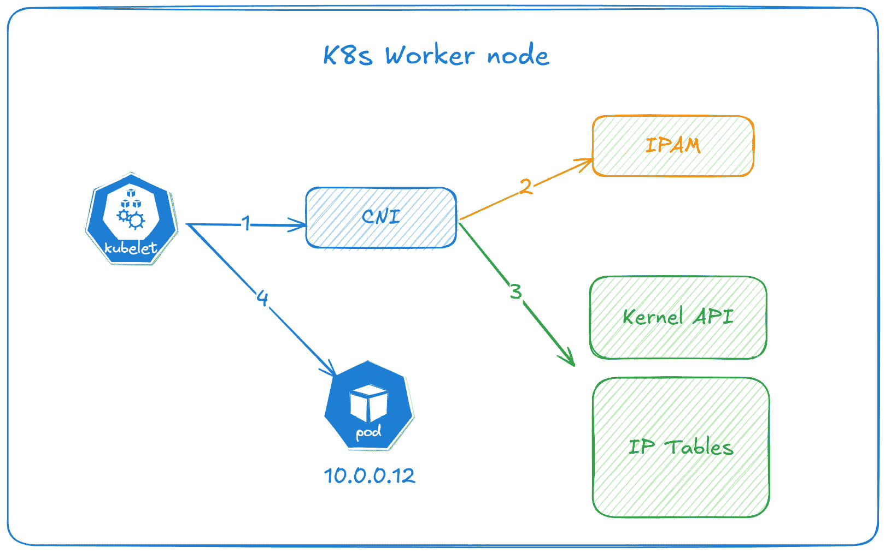
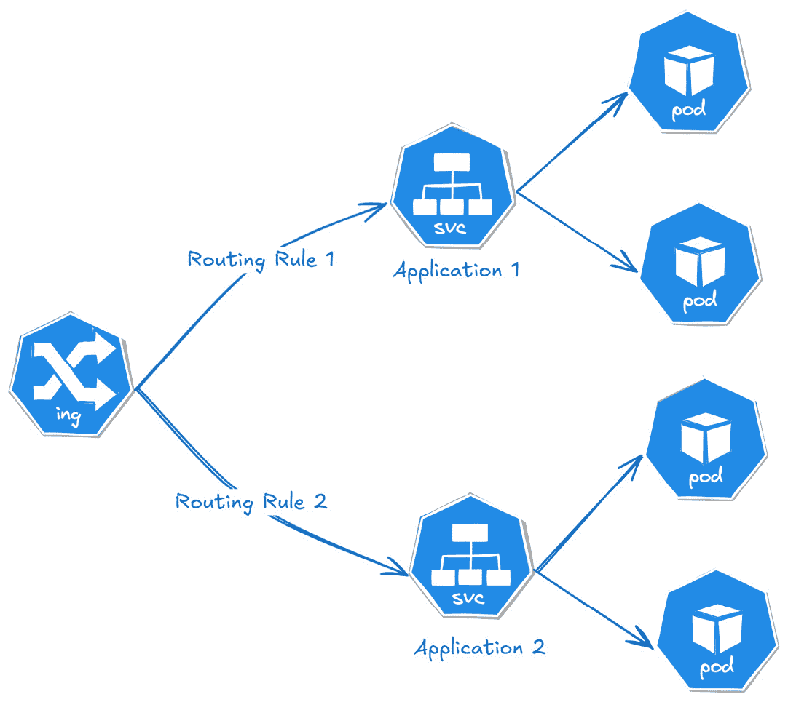
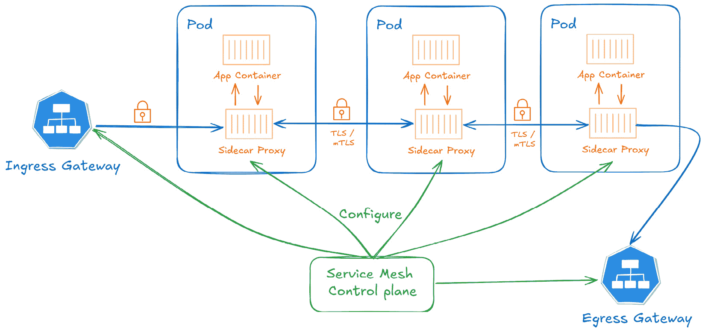
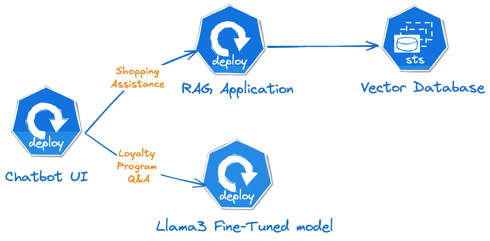

# 8

# 在 K8s 上部署 GenAI 的网络最佳实践

在本章中，我们将探讨在**Kubernetes**（**K8s**）上部署 GenAI 应用时云网络的最佳实践。有效的网络连接对于确保 Pod 之间的无缝通信、优化性能和增强安全性至关重要。本章将首先介绍 K8s 网络的基础知识，例如**容器网络接口**（**CNI**）（[`kubernetes.io/docs/concepts/extend-kubernetes/compute-storage-net/network-plugins/`](https://kubernetes.io/docs/concepts/extend-kubernetes/compute-storage-net/network-plugins/)）以设置 Pod 网络和网络策略，从而在 K8s 集群内实施安全和访问控制，此外，我们还将深入探讨使用优化的云网络接口，如**弹性网络适配器**（**EFA**）（[`aws.amazon.com/hpc/efa/`](https://aws.amazon.com/hpc/efa/)），以提升网络性能。通过为 Pod 和服务之间的通信定义细粒度的规则，组织可以减少潜在的安全威胁，从而保护其知识产权和 GenAI 模型。

在本章中，我们将讨论以下主要主题：

+   理解 Kubernetes 网络模型

+   使用服务网格进行高级流量管理

+   使用 Kubernetes 网络策略保护 GenAI 工作负载

+   优化 GenAI 的网络性能

# 理解 Kubernetes 网络模型

K8s 网络已从**Docker 的网络模型**（[`docs.docker.com/engine/network/`](https://docs.docker.com/engine/network/)）演变而来，以更好地解决在分布式环境中管理大型容器集群的复杂性。Docker 最初的网络使用的是*单主机、基于桥接的网络*模型，其中同一主机上的容器可以通过本地桥接网络进行通信。然而，不同主机上的容器需要额外的配置，显式地创建容器之间的链接，或将容器端口映射到主机端口，以使其他主机上的容器能够访问。K8s 通过确保*无缝的跨主机 Pod 通信*、*自动服务发现*和*负载均衡*简化了这一网络模型。

K8s 的网络模型（[`kubernetes.io/docs/concepts/services-networking/#the-kubernetes-network-model`](https://kubernetes.io/docs/concepts/services-networking/#the-kubernetes-network-model)）具有以下关键原则：

+   K8s 集群中的每个 Pod 都有其独特的 IP 地址，Pod 内的所有容器共享一个私有网络命名空间。位于同一 Pod 内的容器可以通过 localhost 相互通信。

+   Pods 可以直接跨集群相互通信，无需代理或地址转换，例如**网络地址转换**（**NAT**）。

+   Service API 提供了一个 IP 地址或主机名来表示服务，即使构成这些服务的 Pods 发生变化。K8s 管理 **EndpointSlice** ([`kubernetes.io/docs/concepts/services-networking/endpoint-slices/`](https://kubernetes.io/docs/concepts/services-networking/endpoint-slices/)) 对象来跟踪这些 Pods。

+   **NetworkPolicy** ([`kubernetes.io/docs/concepts/services-networking/network-policies/`](https://kubernetes.io/docs/concepts/services-networking/network-policies/)) 是一个内建的 K8s API，允许控制 Pod 与外部源之间的流量。

我们将在本章后面详细介绍 Service API 和网络策略。K8s 网络模型的一些关键组件包括 **Kubelet** ([`kubernetes.io/docs/reference/command-line-tools-reference/kubelet/`](https://kubernetes.io/docs/reference/command-line-tools-reference/kubelet/))、**容器运行时接口** (**CRI**) ([`kubernetes.io/docs/concepts/architecture/cri/`](https://kubernetes.io/docs/concepts/architecture/cri/)) 和 **容器网络接口** (**CNI**) ([`kubernetes.io/docs/concepts/extend-kubernetes/compute-storage-net/network-plugins/`](https://kubernetes.io/docs/concepts/extend-kubernetes/compute-storage-net/network-plugins/))，它们负责集群中容器的生命周期管理和网络连接。

+   **Kubelet**：Kubelet 是在 K8s 集群中每个工作节点上运行的一个代理，它确保 K8s API 描述的容器在节点上正确运行。Kubelet 与 CRI 交互，根据 Pod 规格中设置的配置启动、停止和监控容器。

+   **CRI**：CRI 是一个 API，允许 Kubelet 通过抽象底层容器运行时（如 Containerd 或 CRI-O），以标准化的方式与不同的容器运行时进行通信。

+   **CNI**：CNI 是一个开源的 API 规范，设计时考虑了简洁性和模块化。它允许 K8s 通过使用任何兼容 CNI 的插件，以统一的即插即用方式处理容器网络。

当一个 Pod 被调度到工作节点时，Kubelet 会指示 CRI 为该 Pod 创建容器。一旦容器准备好，Kubelet 调用 CNI 插件来设置 Pod 网络——附加网络接口、分配 IP 地址、配置路由并确保网络策略得到执行。这使得 Pod 之间以及与外部网络的通信无缝进行，遵循 K8s 网络模型。

K8s 有多个可用的 CNI 插件，每个插件都有独特的功能和优势。一些流行的 CNI 插件包括**Calico**（[`www.tigera.io/project-calico/`](https://www.tigera.io/project-calico/)）、**Cilium**（[`github.com/cilium/cilium`](https://github.com/cilium/cilium)）、**Weave Net**（[`github.com/weaveworks/weave`](https://github.com/weaveworks/weave)）、**Antrea**（[`antrea.io/`](https://antrea.io/)）和**Amazon VPC CNI**（[`github.com/aws/amazon-vpc-cni-k8s`](https://github.com/aws/amazon-vpc-cni-k8s)）。有关详细列表，请参阅 K8s 文档：[`kubernetes.io/docs/concepts/cluster-administration/addons/#networking-and-network-policy`](https://kubernetes.io/docs/concepts/cluster-administration/addons/#networking-and-network-policy)。

其他重要的 K8s 网络组件包括**IP 地址管理**（**IPAM**），CNI 插件使用它为 K8s 集群中的 Pod 分配和管理 IP 地址，以及**IPTables**（[`man7.org/linux/man-pages/man8/iptables.8.html`](https://man7.org/linux/man-pages/man8/iptables.8.html)），它负责数据包过滤，并是 Linux 内核的一部分。在 K8s 中，像 kube-proxy 和某些 CNI 网络插件这样的组件使用**IPTables**来管理网络规则并在工作节点内部进行流量引导。这些 IPTables 规则使 Pod 能够在集群内相互通信、管理外部流量，并根据网络插件的不同帮助实现网络策略。

*图 8.1* 显示了 kubelet、CNI、IPAM 和 IPTables 如何在 K8s 工作节点内协同工作，以设置和管理 Pod 的网络：

1.  在第 1 步中，Kubelet 与 CNI 插件进行通信，请求创建和配置 Pod 的网络。

1.  在第 2 步中，CNI 插件创建一个网络命名空间，并调用 IPAM 模块为 Pod 保留一个 IP 地址。

1.  在第 3 步中，CNI 插件配置 IPTables 以管理 Pod 的网络流量规则。此步骤确保 Pod 能够根据集群的网络策略与其他 Pod 和外部网络进行通信。

1.  在最后一步，分配的 IP 地址（例如，10.0.0.12）被分配给 Pod。这使得 Pod 可以通过分配的 IP 地址在集群内进行访问。



图 8.1 – 工作节点中的 IP 分配流程

## 选择 GenAI 应用程序的 CNI 网络模式

在选择 CNI 插件时，了解**覆盖网络**和**本地网络**之间的区别是非常重要的。

使用覆盖网络的 CNI 插件在现有网络上创建了一个额外的抽象层，通过隧道封装流量，以隔离 Pod 网络并简化节点之间的路由。虽然这提供了灵活性和网络分段，但通常会因为封装开销而导致更高的延迟和较低的吞吐量。

原生网络插件，如 Amazon VPC CNI 和 Cilium，直接与底层基础设施的路由进行集成，允许 Pod 使用真实的网络接口和 IP 地址进行通信，而无需封装。这种集成可以带来更高的吞吐量和更低的延迟，使得原生网络成为需要高性能的应用的最佳选择。对于 GenAI 工作负载，快速的数据传输和最小的网络延迟对于有效的模型训练和推理至关重要，因此通常建议使用原生网络 CNI 插件。

## K8s 中的服务实现

**服务**是 K8s 资源，提供网络端点和负载均衡功能，能够跨一组 Pod 实现负载均衡，简化将应用暴露给其他服务或外部客户端的过程。以下是 K8s 服务实现的主要特点：

+   K8s 服务为一组 Pod 提供一致的 IP 地址和 DNS 名称，因此即使 Pod 被创建或销毁，服务性能也不会受到影响。

+   服务会根据 Pod 的标签自动分配传入流量到可用的 Pod，从而实现负载均衡并确保可用性。

+   K8s 支持以下四种不同类型的服务：

    +   `aws-load-balancer-controller` ([`kubernetes-sigs.github.io/aws-load-balancer-controller/latest/`](https://kubernetes-sigs.github.io/aws-load-balancer-controller/latest/)) 插件，用于通过 AWS **网络负载均衡器**（**NLB**）在 *第三章*中公开我们的 GenAI 模型。

    +   **ExternalName** 将服务映射到外部 DNS 名称，允许 K8s 服务连接到集群外部的外部服务。

GenAI 应用通常需要可扩展、低延迟和高效的网络，以有效地为客户提供服务。K8s 的 **LoadBalancer** 服务可以用于将模型暴露到集群外部。它通过底层云提供商（如 AWS、Azure 或 GCP）配置外部负载均衡器。这种设置可以实现将传入流量无缝分配到多个 Pod，确保高可用性和可扩展性。另一方面，**ClusterIP** 服务可以在仅限集群内的其他 K8s Pod 访问 GenAI 模型时使用。它为每个服务分配一个友好的服务查找名称和 IP 地址，从而促进 Pod 之间的可靠服务发现和通信，而无需将它们暴露给外部。

默认情况下，使用 K8s 的 `aws-load-balancer-controller` 时，会创建一个 **NodePort** 服务，将来自 AWS NLB 的流量转发到 K8s 工作节点。从那里，kube-proxy 将流量路由到各个 Pod，引入了额外的网络跳跃，这可能会增加延迟和吞吐量。为了减少这种开销，可以配置 LoadBalancer 服务，将流量直接路由到 K8s Pod，通过将 Pod 注册为 NLB 目标。

这可以通过向 K8s 服务添加 `service.beta.kubernetes.io/aws-load-balancer-nlb-target-type: ip` 注解来实现，如下所示：

```

apiVersion: v1
kind: Service
metadata: 
  name: my-llama-svc
  annotations:
     service.beta.kubernetes.io/aws-load-balancer-type: "external"
     service.beta.kubernetes.io/aws-load-balancer-nlb-target-type: ip
spec:
  type: LoadBalancer
  ...
```

## 服务健康检查

确保最佳性能和可靠性的另一个重要考虑因素是配置 **healthcheck** 设置在 LoadBalancer 服务类型上。GenAI 模型通常资源密集型，并且根据输入复杂性和服务器负载可能具有不同的启动和响应时间。如果没有适当的健康检查，NLB 可能会将目标标记为不健康，这将导致替换 K8s Pods、性能下降或可能的停机。

LoadBalancer 健康检查确保流量仅路由到能够处理请求的健康 Pod。例如，在一个 GenAI 模型通过 K8s 类型为 LoadBalancer 的服务提供推理服务的场景中，健康检查可以监控每个后端 Pod 上的 `/healthz` 端点。如果模型已完全加载、所需的资源（例如 GPU 内存）可用且推理服务正常运行，该端点可能会返回 *HTTP 200 OK* 状态。如果由于资源耗尽或进程崩溃等问题导致某个 Pod 未通过健康检查，LoadBalancer 会自动将其从可用端点池中排除，将流量引导到健康的 Pod 上。这种机制可以防止请求失败，确保终端用户的无缝体验，同时保持 GenAI 工作负载的整体稳定性和可扩展性。

请参阅 `aws-load-balancer-controller` 文档，网址为 [`kubernetes-sigs.github.io/aws-load-balancer-controller/latest/guide/service/annotations/#health-check`](https://kubernetes-sigs.github.io/aws-load-balancer-controller/latest/guide/service/annotations/#health-check)，了解各种健康检查设置。

虽然 K8s LoadBalancer 服务提供了一种简单直接的方式来将 K8s 工作负载暴露到外部，但在更复杂的路由场景中，它们可能会受到限制。Ingress 和 Gateway API 提供了更大的灵活性和流量控制，支持路径或基于主机的路由、TLS 终止等功能。在下一节中，我们将介绍 Ingress 和 Gateway API，它们负责处理 K8s 工作负载的输入流量。

### Ingress 控制器

在 K8s 中，**Ingress** API（[`kubernetes.io/docs/concepts/services-networking/ingress/`](https://kubernetes.io/docs/concepts/services-networking/ingress/)）用于通过 HTTP/S 协议将应用程序暴露到集群外部。它作为一个路由层，依据 HTTP URL 路径、主机名、头信息等，将传入请求定向到 K8s 应用程序。Ingress 控制器负责配置所需的基础设施资源，如应用负载均衡器（在 AWS 中），配置路由规则，并终止 SSL 连接，以满足 Ingress 资源的需求。一些流行的**Ingress 控制器**（[`kubernetes.io/docs/concepts/services-networking/ingress-controllers/`](https://kubernetes.io/docs/concepts/services-networking/ingress-controllers/)）包括**ingress-nginx**、**aws-lb-controller**、**HAProxy Ingress**和**Istio Ingress**。有关详细的控制器列表，请参阅 K8s 文档：[`kubernetes.io/docs/concepts/services-networking/ingress-controllers/#additional-controllers`](https://kubernetes.io/docs/concepts/services-networking/ingress-controllers/#additional-controllers)。在 K8s 集群中部署 GenAI 工作负载时，您应该考虑使用 Ingress 来将多个应用程序/模型暴露在一个入口点（域名）下，如*图 8.2*所示，这通常需要集中式流量路由。此外，Ingress 支持高级路由功能，如基于路径和基于主机的路由，使您能够根据 URL 和 HTTP 头将特定请求定向到不同的模型版本或应用程序，这对于**A/B 测试**（[`aws.amazon.com/developer/application-security-performance/articles/a-b-testing/`](https://aws.amazon.com/developer/application-security-performance/articles/a-b-testing/)）或**金丝雀发布**非常有用，后者是将新的应用程序变更逐步推出给少数用户，允许团队在全面部署之前监控性能并解决问题。除了路由外，Ingress 控制器还与监控工具如**Prometheus**集成，以提供详细的指标，如延迟、请求率和错误率。



图 8.2 – Ingress 概述

**网关 API**（[`gateway-api.sigs.k8s.io/`](https://gateway-api.sigs.k8s.io/)）旨在解决 Ingress 的局限性，提供一种更灵活、可扩展和标准化的方式来管理 K8s 集群中的流量，特别是对于复杂的网络需求。它是 K8s 的官方项目，专注于 L4 和 L7 路由，代表了 Ingress、负载均衡和服务网格 API 的下一代。像 Ingress 一样，您需要安装**网关控制器**来提供必要的基础设施资源，并支持高级路由功能。此 API 有许多实现，完整的实现列表请参考 K8s 文档：[`gateway-api.sigs.k8s.io/implementations/`](https://gateway-api.sigs.k8s.io/implementations/)。

在本节中，我们学习了 K8s 网络的基础概念、核心原则，以及它与其他编排工具的不同之处。我们讨论了 CNI 插件在配置 Pod 网络中的作用，IPAM 用于管理 IP 地址分配，以及选择 CNI 网络模式时需要考虑的因素。我们还探讨了各种 K8s 服务、Ingress 和网关 API，以便将 GenAI 模型暴露到集群外部。在下一节中，我们将讨论高级应用程序网络构造，如服务网格。

# 高级流量管理与服务网格

随着 GenAI 应用程序复杂度的增长，涉及的服务数量也在增加，例如模型推理、数据摄取、数据处理、微调和训练，这也增加了管理服务间通信的复杂性。通常包括流量管理（负载均衡、重试、速率限制）、安全性（身份验证、授权、加密）和可观察性（日志、度量、跟踪）。

**服务网格**是一个基础设施层，它使微服务之间的通信变得可靠、安全和可观察。它抽象了服务间通信的复杂性，包括流量管理、负载均衡、安全性和可观察性，无需修改应用程序代码。

服务网格通常通过部署边车代理，如**Envoy**（[`www.envoyproxy.io/`](https://www.envoyproxy.io/)），与应用程序一起使用，拦截所有进出应用程序的网络流量。

服务网格有两个关键组件：

+   **控制平面**，负责管理边车代理，分发配置和策略到各个边车代理，并收集遥测数据以便集中控制和监控。服务网格中可以实现不同类型的策略，如下所示：

    +   **流量管理策略**，定义了流量应如何路由、断路规则、负载均衡和重试选项

    +   **安全策略**，可以建立加密（如 mTLS）、身份验证（例如 JWT 令牌）和授权（RBAC）等规则

    +   **弹性和容错策略**，可以定义重试机制、超时和故障切换选项。

+   **数据平面**，它结合了边车代理，负责服务之间的实际网络流量。每个边车可以独立应用策略，确保每个服务实例遵守在控制平面设置的网络规则和策略。**边车容器**是与主应用容器一起在同一 Pod 内运行的辅助容器。它们通过提供额外的功能，如日志记录、监控、安全性或数据同步，来补充主容器的功能，无需更改应用程序代码。

一些在 K8s 中流行的服务网格实现包括**Istio**、**Linkerd**和**Ambient Mesh**。传统的网格如 Istio 和 Linkerd 依赖于边车，而 Istio 最近推出的 Ambient Mesh 则提供了一种无边车的架构，可以利用 eBPF 进行高效的流量管理和安全性。*图 8.3*展示了服务网格实现如何在网格内外路由流量、拦截请求，并使用边车代理实现端到端的 TLS 加密或 mTLS。



图 8.3 – 服务网格实现

该图展示了一个服务网格架构，流量通过入口网关进入，经过边车代理在 Pods 之间流动，然后通过出口网关离开。服务网格控制平面集中配置和管理边车代理，以执行流量策略和安全性。这个设置使得集群内微服务的通信更加高效和安全。参考[`aws.amazon.com/blogs/opensource/getting-started-with-istio-on-amazon-eks/`](https://aws.amazon.com/blogs/opensource/getting-started-with-istio-on-amazon-eks/)中的*在 Amazon EKS 上使用 Istio 入门*文章，按步骤说明如何在 Amazon EKS 上部署 Istio 服务网格。

本节我们探讨了服务网格的高级流量管理特性，如负载均衡、安全性、可观察性以及高层次的架构概览。在下一节中，我们将深入探讨如何使用 K8s 原生网络策略保护 GenAI 工作负载。

# 使用 Kubernetes 网络策略保护 GenAI 工作负载

**网络策略**是 K8s 的原生功能，用于控制集群内 Pods 之间的流入（入站）和流出（出站）流量。它们通过 K8s 的**NetworkPolicy API**实现，允许管理员定义规则来决定哪些 Pods 或 IP 地址可以相互通信。

与提供高级流量管理和安全功能的服务网格不同，网络策略侧重于流量隔离和网络分段，目的是出于安全考虑，例如命名空间隔离。

默认情况下，K8s 集群中的所有 Pod 都可以互相通信；然而，网络策略可以限制这一点，并允许对网络流量进行细粒度控制。这在多租户集群中尤其有用，其中不同的团队或应用需要出于安全或合规性的原因进行隔离。网络策略的一些关键特性如下：

+   **入口和出口规则**：*入口规则*定义了哪些源可以与特定 Pod 或一组 Pod 进行通信。类似地，*出口规则*定义了 Pod 或一组 Pod 可以连接到哪些目的地。

+   `app: backend`可以配置为仅允许来自具有标签`app: frontend`的 Pod 的入口流量。

+   **默认拒绝模型**：默认情况下，如果没有应用网络策略，则允许所有流量。然而，一旦网络策略应用于 Pod，只有符合指定策略规则的流量才被允许。

这是一个网络策略示例，它仅允许来自同一命名空间中具有标签`app: frontend`的其他 Pod 的流量进入带有标签`app: backend`的 Pod。所有其他入口流量默认被拒绝：

```

apiVersion: networking.k8s.io/v1
kind: NetworkPolicy
metadata:
  name: ingress-example
spec:
  podSelector:
    matchLabels:
      app: backend
  policyTypes:
  - Ingress
  ingress:
  - from:
    - podSelector:
        matchLabels:
          app: frontend
```

接下来，让我们探讨如何实现 K8s 网络策略，以确保电子商务聊天机器人应用不同组件之间的流量安全。

## 在聊天机器人应用中实现网络策略

在*第五章*中，我们在 EKS 集群中部署了一个包含四个组件（chatbot-ui、向量数据库、RAG 应用和微调的 Llama3 模型）的聊天机器人应用，如*图 8.4*所示。默认情况下，所有组件都可以在任何端口/协议上相互通信，这不是一个安全的最佳实践。我们的目标是实现网络分段，以便只有受信任的组件才能在批准的端口和协议上相互通信。



图 8.4 – 电子商务聊天机器人应用架构

在此设置中，聊天机器人 UI 应用通过 HTTP 协议在端口 80 上与 RAG 应用和微调的 Llama 3 模型进行通信。因此，我们在 RAG 和 Llama 3 应用上创建一个入口网络策略，仅允许来自聊天机器人 UI 应用的 HTTP/80 入口流量，以确保网络流量的安全。我们可以使用分别应用于 K8s 部署的标签来创建网络策略。

以下网络策略选择了带有`app.kubernetes.io/name: rag-app`标签的 RAG 应用 Pod，并应用入口规则，仅允许来自由`app.kubernetes.io/name=chatbot-ui`标签标识的 Pod 的 HTTP/80 流量：

```

apiVersion: networking.k8s.io/v1
kind: NetworkPolicy
metadata:
  name: rag-app-ingress-policy
spec:
  podSelector:
    matchLabels:
      app.kubernetes.io/name: rag-app
  policyTypes:
  - Ingress
  ingress:
  - from:
    - podSelector:
        matchLabels:
          app.kubernetes.io/name: chatbot-ui
    ports:
    - protocol: TCP
      port: 80
```

我们还可以为微调的 Llama 3 应用创建另一个网络策略，仅允许来自聊天机器人 UI 应用的 HTTP/80 流量，通过使用`app.kubernetes.io/name: my-llama-finetuned`、`app.kubernetes.io/name: chatbot-ui`标签。

类似地，RAG 应用程序通过 HTTP 在端口 6333 上与向量数据库通信。为了限制入站流量，我们可以创建一个网络策略，适用于标记为 `app.kubernetes.io/name: qdrant` 的 Pod，仅允许来自标记为 `app.kubernetes.io/name: rag-app` 的 Pod 的 HTTP/6333 流量。

您可以在 GitHub 代码库中找到所有网络策略，网址为 [`github.com/PacktPublishing/Kubernetes-for-Generative-AI-Solutions/tree/main/ch8`](https://github.com/PacktPublishing/Kubernetes-for-Generative-AI-Solutions/tree/main/ch8)。您可以使用 `kubectl apply` 命令在 EKS 集群中下载并应用这些策略。在本操作指南中，我们重点配置入站流量的 Ingress 规则。为了进一步加强安全性，您可以扩展这些策略以包括对出站流量的 egress 规则。然而，如果您的应用程序在 K8s 服务上执行 DNS 查询，请务必允许 DNS 流量进入 `kube-system` 命名空间。

默认情况下，上游的 K8s 网络策略仅支持有限的规则来定义流量流向（主要包括 IP 地址、端口、协议、podSelector 和 namespaceSelector），不支持基于域的规则或集群或全局策略。当使用外部 API（如 OpenAI 或 Claude）时，这可能不足够支持 GenAI 应用程序。为了弥补这些差距，**Cilium** ([`docs.cilium.io/en/stable/security/`](https://docs.cilium.io/en/stable/security/))、**Calico** ([`docs.tigera.io/calico/latest/network-policy/`](https://docs.tigera.io/calico/latest/network-policy/)) 等提供了高级功能，如基于 DNS 的策略，允许指定动态策略强制执行的完全限定域名，以及全局（集群范围）策略，确保所有命名空间间的统一安全姿态。这些特性简化了策略管理，增强了集群范围的数据治理，并保持了一致的流量控制。

总结一下，K8s 网络策略有助于定义 OSI 模型的网络和传输层上的流量规则和分段，但在应用层流量管理和可观察性方面缺乏高级功能。在接下来的部分中，我们将比较网络策略与服务网格技术，突出这些解决方案在关键特性上的不同。

## 服务网格与 K8s 网络策略

虽然服务网格和 K8s 网络策略都有助于保护和管理 K8s 网络，但它们的用途不同，通常互补：

| **特性** | **服务网格** | **K8s 网络策略** |
| --- | --- | --- |
| **主要焦点** | 可观察性、流量管理（如负载均衡）、重试和安全性（支持 mTLS） | 使用命名空间进行安全性和流量隔离 |
| **流量路由** | 高级路由和负载均衡 | 基本 |
| **OSI 层** | 主要在第 7 层（应用层） | 主要在第 3 和第 4 层（网络和传输层） |
| **双向 TLS** | 支持 | 不支持 |
| **复杂性** | 需要 sidecar 代理 | 更简单，原生支持 Kubernetes |

在许多生产环境中，通常会同时部署服务网格和 K8s 网络策略，以增强安全性和流量管理。例如，您可以使用 K8s 网络策略来强制执行基于命名空间的访问限制，然后使用服务网格处理路由、重试、负载均衡和 mTLS。

# 优化 GenAI 的网络性能

本节将介绍在 K8s 上部署 GenAI 工作负载时的一些重要网络优化，包括 Kube-Proxy、IP 地址耗尽问题，以及一些高级网络功能，如**单根输入/输出虚拟化**（**SR-IOV**）和**扩展贝尔克利数据包过滤器**（**eBPF**）。

## Kube-Proxy – IPTables 与 IPVS

**Kube-Proxy** ([`kubernetes.io/docs/reference/command-line-tools-reference/kube-proxy/`](https://kubernetes.io/docs/reference/command-line-tools-reference/kube-proxy/)) 是 K8s 的核心组件，负责管理集群内的网络。它通过在每个节点上设置网络规则和配置，确保服务和 Pod 之间的无缝通信。Kube-Proxy 维护网络规则，将流量导向为每个服务提供服务的后端 Pods，使得集群内部流量能够到达正确的目的地。默认情况下，Kube-Proxy 使用 **IPTables** 模式，它通过基于 IP 规则高效地拦截并重定向网络请求，适用于中小型集群。

然而，对于大规模的 K8s 集群，特别是那些运行数据密集型工作负载（如 GenAI）的集群，IPTables 模式可能成为性能瓶颈。随着集群规模的扩大，服务和端点达到数百或数千个时，维护和更新这些 IPTables 规则可能导致延迟增加和网络性能下降，进而影响 AI 模型的整体效率。

为了解决这些限制，K8s 提供了在 **IP 虚拟服务器**（**IPVS**）模式下运行 Kube-Proxy 的选项。IPVS 通过利用 Linux 内核的 IPVS 模块提供了先进的负载均衡功能，它比 IPTables 更具可扩展性和高效性，能够处理高流量。IPVS 维护一个内存中的哈希表用于服务到 Pod 的路由，使得数据包处理速度更快且 CPU 开销最小。

IPVS 模式提供了诸多优势，如更精细的负载均衡算法（例如轮询、最少连接数、源地址哈希）、更好的动态和大规模服务环境处理能力，以及减少数据包转发的延迟。

可以通过更新 `kube-proxy-config` `ConfigMap` 在 `kube-system` 命名空间中启用 IPVS：

```

apiVersion: kubeproxy.config.k8s.io/v1alpha1
kind: KubeProxyConfiguration
mode: "ipvs"
...
```

要在 Amazon EKS 集群设置中启用 IPVS，请参阅 EKS 文档：[`docs.aws.amazon.com/eks/latest/best-practices/ipvs.html`](https://docs.aws.amazon.com/eks/latest/best-practices/ipvs.html)，查看逐步操作说明。

尽管像 IPVS 这样的高级网络配置有助于提高 K8s 中流量管理和可扩展性，但大规模集群的另一个关键挑战在于有效管理 IP 地址分配，我们将在下一节中讨论这一问题。

### IP 地址耗尽问题和自定义网络

当使用像 Amazon VPC CNI 这样的 CNI 插件时，在原生网络模式下，每个 K8s Pod 直接从 VPC CIDR 块中获取 IP 地址。这种方法使每个 Pod 在 VPC 内都能完全寻址，可以使用 **VPC 流日志** 和其他监控工具查看 Pod 的 IP 地址。然而，在运行密集型工作负载如 GenAI 的大规模集群中，这种模式可能导致 IP 地址耗尽，因为每个 Pod 都会从有限的 VPC CIDR 池中消耗一个 IP 地址。

为了缓解这一问题，一个有效的解决方案是使用 **IPv6 地址**。IPv6 提供了比 IPv4 更大的地址空间，减少了 IP 耗尽的风险，并允许集群在不担心地址用尽的情况下扩展。但并不是所有组织都准备好采用 IPV6。

解决 IP 耗尽的另一种方法是通过 VPC CNI 自定义网络。这涉及通过将额外的、不可路由的次级 CIDR 块与 VPC 关联，并从这些 CIDR 创建新的子网来增强 VPC 设计。这些子网专门用于 Pod IP 分配，而主要的可路由 CIDR 用于节点 IP 和其他资源。然后，我们配置 VPC CNI 从这些不可路由的子网中分配 Pod IP，从而释放主要的 CIDR 用于其他网络需求，并减少 IP 耗尽的风险。以下链接解释了如何在 Amazon EKS 中实现自定义网络：[`docs.aws.amazon.com/eks/latest/userguide/cni-custom-network-tutorial.html`](https://docs.aws.amazon.com/eks/latest/userguide/cni-custom-network-tutorial.html)。

为了解决 K8s 中的网络挑战，包括 IP 地址耗尽和性能优化，值得探索一些高级网络解决方案，如 VPC CNI 自定义网络或 IPV6。新兴技术如 eBPF 和 SR-IOV 提供了创新的方法来提高网络效率和可扩展性，我们将在下一节讨论这些技术。

## eBPF 和 SR-IOV

**扩展伯克利数据包过滤器**（**eBPF**）([`ebpf.io/what-is-ebpf/`](https://ebpf.io/what-is-ebpf/)) 允许在不修改内核代码的情况下进行 Linux 内核的高级可编程性。它可以用来在内核级别直接创建强大、轻量级的网络、安全和可观察性解决方案。例如，利用 eBPF 的 Cilium CNI 插件提供了细粒度的网络安全、负载均衡和可观察性功能。对于 GenAI 工作负载，其中性能和数据传输速度至关重要，eBPF 的最小开销和内核级处理使其成为低延迟和高吞吐量数据传输的理想选择。

**单根输入/输出虚拟化** (**SR-IOV**)使单个物理**网络接口卡** (**NIC**)能够划分为多个**虚拟功能**，为虚拟机或容器提供直接的硬件访问。每个虚拟功能充当独立的接口，提供高吞吐量和低延迟的网络吞吐量，尤其适用于涉及大量数据传输的 GenAI 工作负载。SR-IOV 通过将数据包处理卸载到 NIC，从而减少了 CPU 开销，确保计算密集型任务的资源利用率更高。它还提供专用的网络路径，确保网络隔离和可预测的性能，这对于一致的 AI 模型推理至关重要。该技术通过优化资源分配提升了可扩展性，并支持具有隔离的高性能网络的多租户集群。

eBPF 和 SR-IOV 等技术优化了 K8s 集群中的网络性能和资源效率，支持高速且可靠的数据处理。这些进展的补充是 CoreDNS 自动扩展，它确保无缝的服务发现和高效的 DNS 解析，这对于服务间通信至关重要。

## CoreDNS

**CoreDNS** ([`github.com/coredns/coredns`](https://github.com/coredns/coredns))是 K8s 中的一个关键组件，提供 DNS 服务，促进 K8s 集群内部的服务发现和网络通信。它充当集群的 DNS 服务器，使 Pods 能够使用简单的服务名称找到并相互通信。为了实现最佳的性能和管理，建议在 EKS 中使用**CoreDNS 托管插件** ([`docs.aws.amazon.com/eks/latest/userguide/coredns-add-on-create.html`](https://docs.aws.amazon.com/eks/latest/userguide/coredns-add-on-create.html))。监控 CoreDNS 对于维持高效的网络性能也至关重要，因为 DNS 解析问题可能会导致服务中断或延迟，特别是在需要大量服务间通信的工作负载中，如 GenAI。

为了满足大规模 K8s 集群日益增长的需求，建议实现 CoreDNS 自动扩展，以使 CoreDNS Pods 的数量与集群的大小成比例。你可以利用`cluster-proportional-autoscaler` ([`github.com/kubernetes-sigs/cluster-proportional-autoscaler`](https://github.com/kubernetes-sigs/cluster-proportional-autoscaler))插件，它监控集群中可调度节点和 CPU 核心的数量，并根据需要调整核心资源（如 CoreDNS）的副本数。在 EKS 中使用 CoreDNS 托管插件时，该功能是原生提供的，可以通过[`docs.aws.amazon.com/eks/latest/userguide/coredns-autoscaling.html`](https://docs.aws.amazon.com/eks/latest/userguide/coredns-autoscaling.html)中描述的插件配置启用。

另一个用于提高 K8s 集群中 DNS 性能的工具是 `cluster.local` 后缀)，本地缓存代理会将查询转发给 CoreDNS 服务。

CoreDNS 是 K8s 中的一个重要组件，通过充当集群的 DNS 服务器来实现内部服务发现和网络连接。为了优化大规模集群的性能，可以使用 CoreDNS 自动扩展与 `cluster-proportional-autoscaler`，并利用 NodeLocal DNSCache 来减少延迟。在接下来的章节中，我们将介绍一些其他优化网络延迟和吞吐量的选项。

## 网络延迟和吞吐量增强

GenAI 工作负载，例如大规模机器学习模型的训练和推理，需要在多个计算节点之间进行大量通信。在分布式训练场景中，模型参数需要在节点之间进行同步，获取高带宽和低延迟对提高性能、降低训练/推理成本至关重要。

在本节中，我们将讨论两种云特定的技术来实现这一目标。

### Amazon EC2 放置组

**Amazon EC2 放置组** ([`docs.aws.amazon.com/AWSEC2/latest/UserGuide/placement-groups.html`](https://docs.aws.amazon.com/AWSEC2/latest/UserGuide/placement-groups.html)) 提供了一种组织节点的方式，旨在实现特定的网络或弹性目标。在 AWS 中，支持以下三种放置组：

+   **Cluster**，将实例放置在同一个可用区内，提供低延迟网络性能，适用于高性能计算应用。

+   **Partition**，将实例分布在不同的逻辑分区中，使每个分区中的实例组与其他分区中的实例不共享底层硬件。这种策略通常用于大规模分布式和复制工作负载，例如 Hadoop、Cassandra 和 Kafka。

+   **Spread**，将小组实例分布在不同的底层硬件上，以最小化相关故障的风险，并提高弹性。

集群放置组将实例物理上靠近地放置在单一数据中心或可用区内，提供节点间低延迟和高吞吐量的网络连接。它可能会提升分布式 GenAI 应用程序的性能。

以下命令在 AWS 中创建一个名为 `custom-placement-group` 的放置组，并设置集群或邻近放置目标：

```

aws ec2 create-placement-group --group-name custom-placement-group --strategy cluster
```

现在，可以通过创建一个自动扩展组，并使用以下启动模板，在此放置组中启动 EKS 工作节点：

```

{
  "LaunchTemplateData": {
    "Placement": {
      "GroupName": "custom-placement-group"
    },
   #      Other Launch Details, such as instance types, key pair
  }
}
```

简而言之，EC2 放置组提供了组织 EC2 实例的策略，以优化网络连接和吞吐量。在接下来的章节中，我们将介绍 **Elastic Fabric Adapter** (**EFA**)，这是一种专用网络接口，提供超低延迟和高吞吐量的节点间通信。

### EFA

EFA ([`aws.amazon.com/hpc/efa/`](https://aws.amazon.com/hpc/efa/)) 是 AWS 设计的一种网络接口，旨在为节点间通信提供超低延迟和高吞吐量的网络接口。这对于 GenAI 工作负载至关重要，因为它确保了节点之间的数据传输快速且高效。EFA 支持 **远程直接内存访问** (**RDMA**)，可以减少节点间数据传输的开销，提供低延迟、高吞吐量的传输路径。通过 RDMA，数据可以在两个计算节点的内存之间直接传输，而无需操作系统或 CPU 的参与。EFA 还支持 **NVIDIA 集体通信库** (**NCCL**) ([`developer.nvidia.com/nccl`](https://developer.nvidia.com/nccl))，为 AI 和 ML 应用提供高性能、可扩展的分布式训练，通过加速多个节点间 GPU 之间的通信。这一集成减少了延迟并提高了 GPU 之间的带宽，使得需要同步集体操作（如数据并行和模型并行）的 GenAI 应用能够更快地进行模型训练。

要在 EKS 集群中将 EFA 集成到 K8s Pods 中，可以创建支持 EFA 的实例类型的工作节点，并部署 `aws-efa-k8s-device-plugin` ([`github.com/aws/eks-charts/tree/master/stable/aws-efa-k8s-device-plugin`](https://github.com/aws/eks-charts/tree/master/stable/aws-efa-k8s-device-plugin))，该插件可以检测并将 EFA 接口作为可分配资源向集群广播：

```

module "eks" {
  source = "terraform-aws-modules/eks/aws"
  cluster_name    = local.name
...
  # Allow EFA traffic
  enable_efa_support = true
...
  eks_managed_node_groups = {
    nvidia-efa = {
      # Expose all available EFA interfaces on the launch template
      enable_efa_support = true
      labels = {
        "vpc.amazonaws.com/efa.present" = "true"
        "nvidia.com/gpu.present"        = "true"
      }
...
```

请参考 EKS 文档 [`docs.aws.amazon.com/eks/latest/userguide/node-efa.html`](https://docs.aws.amazon.com/eks/latest/userguide/node-efa.html)，获取逐步操作指南和示例演练。

在本节中，我们讨论了各种网络优化技术，如选择 Kube-proxy 选项、扩展 CoreDNS Pods、解决 IP 耗尽问题的策略、K8s 网络领域的新兴趋势以及其他云提供商特定的优化措施，包括 EFA 和 EC2 部署组，用于在 K8s 集群中管理大规模 GenAI 工作负载。

# 总结

在本章中，我们重点讨论了优化云网络以便在 K8s 上部署 GenAI 应用，强调了高效、安全和高性能网络的最佳实践。我们从 K8s 网络基础知识开始，介绍了 **容器网络接口** (**CNI**)、kubelet 和 **容器运行时接口** (**CRI**) 等关键组件，这些组件负责管理 Pod 网络并确保集群间的连接性。

K8s 网络模型由 CNI 插件支持，例如 Calico、Cilium 和 Amazon VPC CNI，每种插件都有其特定的优势。CNI 插件有两种工作模式：覆盖网络和本地网络。覆盖网络，如 Flannel，增加了网络抽象的灵活性，但可能会增加延迟。另一方面，本地网络（例如 Amazon VPC CNI）与底层云基础设施集成，提供更低的延迟，推荐用于 GenAI 工作负载。

K8s 中的服务管理提供稳定的 IP 和 DNS 名称，确保即使 Pods 被添加或删除，服务也能保持可靠性。服务网格工具，如 Istio 或 Linkerd，通过拦截所有流量并通过边车代理实施负载均衡、重试机制和 TLS 加密策略，在提升流量管理、安全性和可观察性方面可能非常有效。

NetworkPolicy 是一个本地功能，通过控制 K8s 集群内的流入和流出流量，进一步加强安全性，允许在多租户环境中实现团队或应用之间的隔离。为了满足 GenAI 的特定需求，K8s 支持高级网络选项，如带有 IPVS 模式的 Kube-Proxy，提供可扩展的负载均衡，适用于高需求集群。此外，随着 K8s 集群的扩展，当使用 CNI 的本地网络模式时，IP 地址耗尽可能成为一个挑战；可以采用 IPv6 地址分配和自定义网络配置等解决方案，以缓解大规模部署中的 IP 限制问题。

其他现代技术支持高性能网络，例如**扩展伯克利数据包过滤器**（**eBPF**）和**单根输入/输出虚拟化**（**SR-IOV**），它们提供最小开销的内核级网络，非常适合低延迟、高吞吐量的数据处理。最后，K8s 网络受益于云环境中特定的增强功能，如 AWS 的放置组和弹性网络适配器（EFA）。在下一章中，我们将基于这些概念，讨论如何保护在 K8s 中运行的 GenAI 应用。
