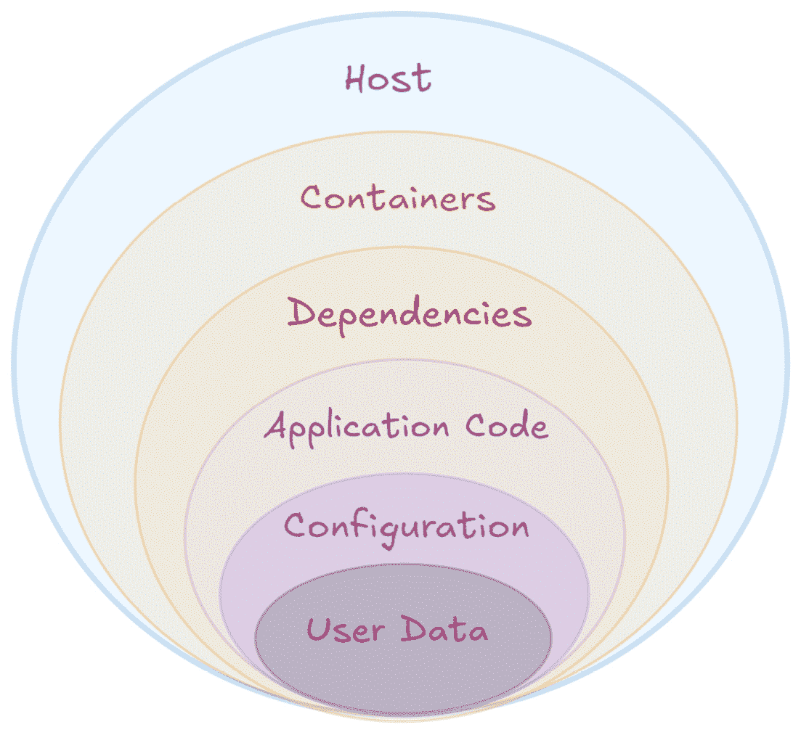
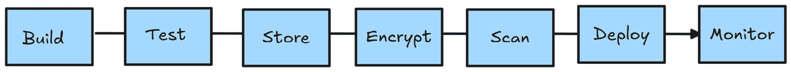
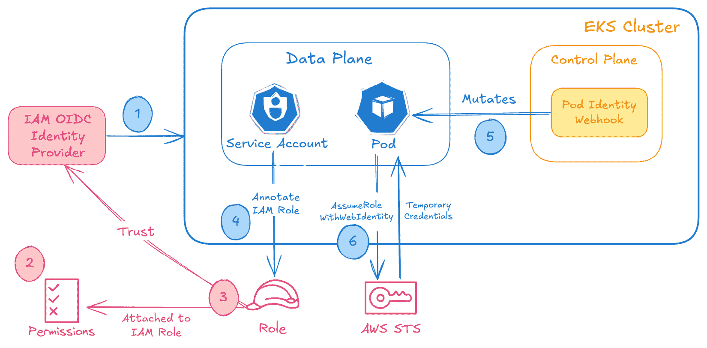

# 9

# 在 Kubernetes 上部署 GenAI 的安全最佳实践

在本章中，我们将探讨在**Kubernetes**（**K8s**）上部署 GenAI 应用的安全最佳实践。我们将从介绍“深度防御”概念开始，然后涵盖保护 GenAI 工作负载的关键支柱——供应链、安全主机、安全网络和运行时安全。此外，我们还将介绍管理机密信息的最佳实践以及最小权限原则，以防止未经授权访问关键数据和应用凭证。

在本章中，我们将覆盖以下主要内容：

+   深度防御

+   K8s 安全考虑事项

+   GenAI 应用的额外考虑事项

+   在聊天机器人应用中实施安全最佳实践

# 技术要求

在本章中，我们将使用以下内容，首先需要你设置一个账户并创建访问令牌：

+   **Hugging** **Face**：[`huggingface.co/join`](https://huggingface.co/join)

+   如*第三章*所示，亚马逊 EKS 集群的设置

# 深度防御

保护云中应用的最佳方式是使用**深度防御**概念（[`csrc.nist.gov/glossary/term/defense_in_depth`](https://csrc.nist.gov/glossary/term/defense_in_depth)）。这是一种实施多层安全的策略，旨在保护免受不同攻击向量的威胁。*图 9.1*展示了深度防御的概念图，每个同心圆表示我们希望保护的某一层或攻击向量。

让我们先回顾一下安全最佳实践的概念，然后再针对容器和 K8s 的每一层深入探讨。



图 9.1 – 分层安全模型

以下是前述图中所示各层的详细信息：

+   **用户数据**：这是系统中最内层的核心，包含敏感的用户数据，如用户密码、**个人身份信息**（**PII**）等。为了保护这一层，应该使用数据静态和传输中的加密。

+   **配置**：应用的敏感配置数据包括环境变量、应用设置、机密信息以及应用运行所需的 API 密钥。配置设置上的疏忽可能导致数据泄漏、权限提升或应用行为被破坏。

+   **应用代码**：应用代码中的漏洞可能导致攻击，如 SQL 注入或远程代码执行。为防止此类问题，用户应定期进行静态和动态代码分析，及时修复漏洞，并更新依赖项到最新的安全版本。

+   **依赖项**：代码依赖项包括应用程序依赖的库、框架和外部包。脆弱或过时的依赖项是攻击者最常见的入口点之一。为了防止这种情况，用户应定期扫描依赖项以发现漏洞。

+   **容器**：容器运行时和镜像也可能创建另一个威胁向量，因为配置错误或不受信任的容器可能会提升权限、攻击主机或暴露敏感信息。为了防止这种情况，用户可以使用镜像签名来验证镜像的真实性，并使用如**Falco**之类的工具实施运行时安全，监控恶意行为。

+   **主机**：这是部署容器的底层服务器或节点。主机内核在所有容器之间共享，这使得它成为一个关键的安全层。如果主机被攻破，所有容器都可能受到影响。为了防止这种情况，建议通过禁用未使用的服务、应用补丁以及使用优化过的容器操作系统（如**Bottlerocket**）来加固主机操作系统。

在本节中，我们了解了深度防御的概念，这是一种通过实施多层安全策略来防范不同攻击向量威胁的策略。我们还从概念上看了各种攻击向量和每一层的最佳实践。在下一节中，我们将讨论在 K8s 中部署工作负载时的关键安全考虑事项。

# K8s 安全考虑

现在我们已经从高层次了解了深度防御的概念，让我们讨论一下容器和 K8s 的安全最佳实践。在云环境中思考**容器安全**至关重要，因为容器在一个动态和共享的环境中运行。

容器将*软件*和*依赖项*封装在一起，使其高度便携；然而，这种便携性也带来了一些风险。全面的安全策略应当解决容器生命周期中的漏洞——从*构建流水线*到*运行时环境*。

关注的关键领域包括保护供应链、保护主机系统和监控运行时活动。每一层安全都增加了对潜在威胁的韧性，通过遵循最佳实践，可以确保容器的安全部署和运行。

以下是我们将深入探讨的容器安全的一些关键领域：

+   供应链安全

+   主机安全

+   运行时安全

+   网络安全

+   秘密管理

## 供应链安全

容器供应链包括从构建镜像到在生产环境中部署和监控镜像的所有阶段，如*图 9.2*所示。



图 9.2 – 容器供应链

现在，让我们讨论前五个阶段及其相应的安全最佳实践。

### **构建阶段**

在构建阶段，恶意/易受攻击的代码可能通过未经验证的依赖项或不安全的配置进入容器镜像。为了保障构建阶段的安全，应该只使用来自验证源的可信基础镜像。为了最小化攻击面并提高安全性，考虑使用轻量级的父镜像。**Alpine Linux** ([`hub.docker.com/_/alpine`](https://hub.docker.com/_/alpine))、**distroless** ([`www.docker.com/blog/is-your-container-image-really-distroless/`](https://www.docker.com/blog/is-your-container-image-really-distroless/)) 或 **scratch** ([`hub.docker.com/_/scratch`](https://hub.docker.com/_/scratch)) 镜像内置的包较少，限制了潜在的漏洞，因此通常被推荐使用。

**DockerSlim** ([`github.com/slimtoolkit/slim`](https://github.com/slimtoolkit/slim)) 是一个开源工具，帮助通过减少容器镜像的大小来优化镜像，从而通过识别运行时所需的部分来提高安全性。这显著减少了攻击面，并在不改变容器化应用功能的情况下提升了性能。

还建议通过使用声明式的 Dockerfile 和可重复构建来强制执行容器镜像的不可变性。`latest` 标签是可变的，这意味着随着新镜像的推送，它可能会指向不同的镜像，而像 `v1.0` 这样的标签是不可变的，因为它确保始终引用相同的镜像，无论未来如何推送。不可变性对于 GenAI 应用特别有利，可以确保训练/微调任务和推理镜像是在一致的环境下构建的，维护模型完整性，并简化故障排除工作。

**多阶段构建** ([`docs.docker.com/build/building/multi-stage/`](https://docs.docker.com/build/building/multi-stage/)) 是一种在构建阶段使用的技术，它允许将构建过程分解为多个独立的阶段。每个阶段可以使用适当的父镜像专注于特定任务，比如编译代码或安装依赖项，然后选择性地将仅需要的工件复制到最终的最小镜像中。

对于 GenAI 应用，多阶段构建有助于确保大型训练框架、数据预处理脚本或模型优化步骤可以有选择地从最终的生产镜像中排除。这将生成更小、更安全且高效的镜像，能够快速部署进行推理。

### **测试阶段**

镜像中的未检测到的漏洞和配置错误可能导致下游问题。为减轻这种风险，建议将自动化安全测试集成到 CI/CD 管道中，使用像**Snyk**（[`snyk.io/`](https://snyk.io/)）这样的工具。你应对代码进行静态分析，并对构建后的镜像进行动态测试，以发现漏洞。确保你的测试过程还涵盖与内部安全政策和相关行业标准的合规性。结合测试用例评估资源使用情况，验证最小权限原则的遵守情况，并监控运行时行为。通过这样做，你可以帮助在整个软件生命周期中保持安全、合规和可预测的操作。

### **存储阶段**

在容器注册表的镜像存储阶段，镜像可能会被篡改或包含过时的依赖项。为了安全地保护镜像，建议使用像**Amazon** **ECR**（[`aws.amazon.com/ecr/`](https://aws.amazon.com/ecr/)）这样的安全容器注册表。

你还应该使用像 Docker Content Trust 或 Cosign 这样的工具启用镜像签名和验证。**AWS Signer**（[`docs.aws.amazon.com/signer/latest/developerguide/Welcome.html`](https://docs.aws.amazon.com/signer/latest/developerguide/Welcome.html)）是一个完全托管的服务，允许你对代码、应用程序和容器进行数字签名，以确保软件的完整性和真实性。

为确保在生产环境中仅部署签名的容器镜像，建议使用**政策即代码解决方案**，例如**Open Policy Agent**（**OPA**）或其 K8s 原生实现**OPA Gatekeeper**（[`github.com/open-policy-agent/gatekeeper`](https://github.com/open-policy-agent/gatekeeper)）。OPA Gatekeeper 是一个开源项目，它利用 OPA 在 K8s 集群中执行策略。它使管理员能够通过根据预定义约束验证和修改 K8s 资源来实施精细的治理。Gatekeeper 使用**自定义资源定义**（**CRDs**）来定义这些策略和约束，从而使用户能够根据特定需求定制治理。它作为一个准入控制器，确保在创建或更新时，任何不符合定义规则的资源都将被拒绝。此外，它支持审计功能，使用户能够识别和修复现有资源中的政策违规行为。还建议使用**基于角色的访问控制**（**RBAC**）来限制对镜像的访问，用户应定期清理未使用或弃用的镜像，以减少潜在的攻击面。

### **加密阶段**

镜像中的敏感数据应始终被拦截。应该避免将秘密（如 API 密钥或密码）直接嵌入镜像中，以防止在容器镜像可能被攻破时泄露。

你可以使用像 **HashiCorp Vault** ([`www.hashicorp.com/products/vault`](https://www.hashicorp.com/products/vault))、**Kubernetes Secrets** ([`kubernetes.io/docs/concepts/configuration/secret/`](https://kubernetes.io/docs/concepts/configuration/secret/)) 或 **AWS Secrets Manager** ([`docs.aws.amazon.com/secretsmanager/latest/userguide/intro.html`](https://docs.aws.amazon.com/secretsmanager/latest/userguide/intro.html)) 这样的机密管理工具来存储机密。例如，AWS Secrets Manager 是一个安全的机密管理服务，用于管理数据库凭证、API 密钥和其他敏感配置数据。通过 **AWS Key Management Service** (**AWS KMS**) 加密机密，并通过 **AWS Identity and Access Management** (**AWS IAM**) 启用细粒度的访问控制，Secrets Manager 确保敏感数据受到保护，仅授权用户和应用程序可以访问。它还支持版本控制和机密的自动轮换，减少了凭证泄露的风险，并最小化了手动操作的开销。

要将外部机密管理解决方案与 K8s 集成，可以使用像 **secrets-store-csi-driver** ([`github.com/kubernetes-sigs/secrets-store-csi-driver`](https://github.com/kubernetes-sigs/secrets-store-csi-driver)) 这样的项目，该项目允许 K8s 将存储在外部机密存储中的多个机密、密钥和证书挂载到 K8s Pods 中作为卷。一旦卷被挂载，数据就会被载入容器的文件系统。请参阅 AWS 文档 [`docs.aws.amazon.com/secretsmanager/latest/userguide/integrating_csi_driver.html`](https://docs.aws.amazon.com/secretsmanager/latest/userguide/integrating_csi_driver.html)，了解如何在 Amazon EKS 集群中使用 AWS Secrets Manager 的示例教程。在 GenAI 应用程序的情况下，**Hugging Face** 和 **OpenAI** 的外部 API 密钥可以安全地存储在这些解决方案中，应用程序可以在运行时安全地访问它们。

### **扫描阶段**

镜像或依赖项中的漏洞可能会被恶意行为者利用。为了防止这种情况，应在构建和存储阶段持续扫描镜像。大多数容器注册表解决方案提供开箱即用的此功能，或者可以使用像 **Trivy** ([`github.com/aquasecurity/trivy`](https://github.com/aquasecurity/trivy)) 这样的开源工具来扫描容器镜像中的漏洞。这些工具通过分析镜像层与已知漏洞数据库（例如 CVE 数据库）进行对比，从而识别潜在的风险，提供早期问题检测。

在云环境中，还提供了更先进的镜像扫描选项。例如，Amazon ECR 支持通过**Amazon Inspector**([`aws.amazon.com/inspector/`](https://aws.amazon.com/inspector/))，这是一项旨在自动化安全评估的托管服务，进行高级漏洞扫描。此集成提供了增强的、持续的容器镜像扫描，确保它们在整个生命周期中保持安全。Amazon Inspector 可以自动扫描 ECR 中的容器镜像，无需手动触发，每当新镜像被推送或更新时，都会进行扫描。有关这些选项以及如何在容器库中启用它们的详细信息，请参考 Amazon ECR 文档：[`docs.aws.amazon.com/AmazonECR/latest/userguide/image-scanning.html`](https://docs.aws.amazon.com/AmazonECR/latest/userguide/image-scanning.html)。

## 主机安全

为容器的主机环境提供安全保障至关重要，因为多个容器可能共享主机操作系统和内核。以下是确保容器主机安全的一些最佳实践和策略：

+   **部署在私有子网中**：将主机/工作节点部署在私有子网中，可以通过限制来自互联网的直接访问，最小化暴露于外部威胁的风险。为了将应用程序暴露给公共互联网，可以使用 K8s 负载均衡器或 Ingress 资源类型，将负载均衡器资源部署在公共子网中。

+   **禁用 SSH 访问**：SSH 访问应限制到最小化攻击面。相反，应该使用**会话管理工具**，例如**AWS Systems Manager**（**SSM**）([`aws.amazon.com/systems-manager/`](https://aws.amazon.com/systems-manager/))，以便在不暴露 SSH 的情况下实现对主机的安全、可审计访问。如果必须使用 SSH，强制实施基于密钥的身份验证，并使用安全组限制访问。

+   `1`并强制使用 IMDSv2，如以下 Terraform 代码所示：

    ```

    resource "aws_launch_template" "example" {
      name = "example"
      ...
        metadata_options {
        http_endpoint               = "enabled"
        http_tokens                 = "required"
        http_put_response_hop_limit = 1
        instance_metadata_tags      = "enabled"
      }
      ...
    ```

+   **加密所有存储**：加密存储可以保护主机上的敏感数据，以防止物理或逻辑攻击。使用 AWS KMS 加密附加到主机的**Amazon Elastic Block Store**（**Amazon EBS**）卷。如果使用带有**NVMe**实例存储的 EC2 实例，则所有数据都将使用 XTS-AES-256 块加密算法进行加密。

+   **加固节点 Amazon 机器映像 (AMI)**：加固的 AMI 通过仅包含必要的软件、配置和安全设置来减少漏洞。使用容器优化的操作系统，如 Bottlerocket ([`aws.amazon.com/bottlerocket/`](https://aws.amazon.com/bottlerocket/))，它是从零开始构建，专为容器设计。它们通常包含只读根文件系统、原子更新和最小化的工具集，这些工具集旨在高效且安全地运行容器。你应该禁用并卸载未使用的软件，以减少攻击面，并根据 CIS 基准配置操作系统，适用于 Docker、Kubernetes 和 Linux。使用 **AppArmor** ([`apparmor.net/`](https://apparmor.net/))、**SELinux** ([`www.redhat.com/en/topics/linux/what-is-selinux`](https://www.redhat.com/en/topics/linux/what-is-selinux)) 或 **seccomp** ([`kubernetes.io/docs/tutorials/security/seccomp/`](https://kubernetes.io/docs/tutorials/security/seccomp/)) 来限制容器权限。

## 容器运行时安全

在运行时保护容器对防止权限升级和未经授权的访问至关重要。这包括限制资源、限制权限、执行安全标准以及集成监控和策略工具。以下是核心的运行时安全实践：

+   **仅提供正常运行所需的资源**：无限制的资源分配可能导致 **拒绝服务**（**DoS**）攻击和集群不稳定，某些容器可能会消耗整个节点的资源。为了防止这种情况，你应该在 K8s 清单中定义 CPU 和内存限制，反映容器可能需要的最佳资源。

+   `securityContext`，如下所示：

    ```

    securityContext:
      runAsUser: 1000
      runAsGroup: 1000
      securityContext, as shown here:

    ```

    securityContext:

    capabilities:

    drop:

    - ALL

    ...

    ```

    ```

+   **遵循 Pod 安全标准**：遵守 Pod 安全标准确保容器符合最佳的安全配置实践。使用 K8s 内置的 Pod 安全准入来强制执行如限制性配置文件等标准。同时，使用不同安全级别（例如，限制性或基准）的命名空间隔离工作负载。Pod 安全标准定义了三种不同的策略级别（特权、基准和限制），广泛覆盖安全范围。你可以在命名空间上应用标签和注释，以指定所需的安全配置级别，如下所示：

    ```

    $ kubectl label namespace test-ns \
    /etc/passwd or /etc/shadow, and network connections to untrusted IP addresses. It can also detect when a Pod tries to access a K8s Service account token improperly, which may indicate a compromise or misconfiguration.When such behavior violates its defined security rules, Falco triggers alerts instantly. For example, alerts may look like this: **Terminal shell detected in nginx container** or **Suspicious file access by unknown process**. To make these alerts actionable, teams should implement clear response strategies, such as isolating the Pod, initiating incident response procedures, or alerting security teams. Combining these technical capabilities with practical workflows allows teams to confidently enforce runtime security and respond to threats in production-grade K8s environments.Some other third-party tools also offer advanced runtime protection, integration, and reporting capabilities. Use agents provided by solutions such as **Prisma Cloud’s Container Security** ([`www.paloaltonetworks.com/prisma/cloud/container-security`](https://www.paloaltonetworks.com/prisma/cloud/container-security)), **Aqua Security** ([`www.aquasec.com/products/kubernetes-security/`](https://www.aquasec.com/products/kubernetes-security/)), or **Wiz container security** ([`www.wiz.io/solutions/container-and-kubernetes-security`](https://www.wiz.io/solutions/container-and-kubernetes-security)) to monitor and protect containers.
    ```

## 网络安全

K8s 中的网络安全对于保护容器化环境中的数据和应用程序至关重要。K8s 的分布式特性为安全网络流量带来了独特的挑战。以下是一些确保 K8s 网络安全的关键考虑因素和最佳实践：

+   **网络分段与隔离**：K8s **命名空间** 提供了一种在集群内隔离资源和工作负载的方法，充当独立的安全边界。可以使用 **NetworkPolicy** 资源来强制执行网络分段，如在 *第八章* 中讨论的那样，它定义了控制 Pod 层级的入口（传入）和出口（传出）流量的规则。

+   **保护 Pod 到 Pod 的通信**：默认情况下，K8s 允许 Pods 之间的通信，这可能会使 K8s 集群暴露于安全风险之下。实施零信任原则确保 Pods 仅与明确授权的对等体进行通信。像 **Istio** 或 **Linkerd** 这样的服务网格技术提供 mTLS 进行加密和身份验证，确保 Pod 到 Pod 之间的通信安全且已验证。

+   **入口和出口安全**：入口安全侧重于控制和保护进入集群的流量，通常使用带有 TLS 证书的 HTTPS 进行加密。额外的保护措施，如 **Web 应用防火墙**（**WAFs**），有助于检测和阻止恶意流量。出口安全涉及限制 Pods 的外向流量，以防止未经授权访问外部资源，可以通过出口策略来强制执行。

+   **API 服务器保护**：K8s API 服务器是一个关键的管理点，需要采取强有力的安全措施。RBAC 根据角色限制用户权限，而像 **OpenID Connect**（**OIDC**）或 AWS IAM 等身份验证机制确保只有授权用户才能访问该服务器。网络策略或防火墙应进一步限制只有来自受信源的访问才能进入 API 服务器。

+   **DNS 安全**：CoreDNS 是 K8s 中的默认 DNS 服务器，应该防范欺骗和相关攻击。虽然启用加密 DNS 协议如 **DNS-over-TLS** 或 **DNS-over-HTTPS** ([`www.cloudflare.com/learning/dns/dns-over-tls/`](https://www.cloudflare.com/learning/dns/dns-over-tls/)) 在技术上是可行的，但 K8s 默认并不常实现这一功能。相反，使用网络策略来限制哪些 Pods 可以查询 CoreDNS 服务器，从而减少未经授权请求的风险。此外，确保 CoreDNS 指向可信的上游解析器，并采用 **DNSSEC** ([`www.internetsociety.org/deploy360/dnssec/basics/`](https://www.internetsociety.org/deploy360/dnssec/basics/)) 来确保数据完整性。

+   **网络监控**：监控网络流量对于检测和缓解威胁至关重要。像 Cilium、Calico、Sysdig、服务网格或 Datadog 这样的工具可以提供集群流量的可见性，使集群管理员能够识别可疑行为。

+   **保护外部连接**：与外部服务（如云服务提供商服务或数据库）的连接应当加密并进行身份验证。K8s Secrets 提供了一种安全的方式来管理外部连接的凭据，确保敏感信息（如 API 密钥和密码）不被未经授权的访问。

## Secrets 管理

K8s 中的 Secrets 管理是保护和管理敏感信息（如 API 密钥、密码、证书和令牌）的关键组成部分。K8s 提供了内置机制来管理 Secrets，但要确保其安全，需要仔细配置并遵循以下最佳实践，以降低未经授权访问或意外泄露的风险：

+   **K8s Secrets 资源**：K8s 提供了一种名为 **Secrets** 的原生资源，用于以 Base64 编码格式存储敏感数据。Secrets 会作为环境变量或文件挂载到 Pods 中，使得应用程序能够访问它们，而无需直接在容器镜像或配置文件中嵌入敏感数据。尽管方便，但 Base64 编码并非加密，因此需要采取额外的安全措施。

+   **加密静态 Secrets**：默认情况下，K8s 将 Secrets 存储在 **etcd** 中，这是集群的键值存储。为了保护这些敏感信息，必须启用 etcd 的静态加密。当使用如 Amazon EKS 这样的托管 K8s 服务时，etcd 卷默认会使用 AWS 托管的加密密钥进行加密。作为额外的安全措施，您还可以使用如封装加密的技术，在写入 etcd 数据库之前加密 Secret 值。在 Amazon EKS 中，您可以利用 AWS KMS 启用封装加密；请参考 AWS 文档 [`docs.aws.amazon.com/eks/latest/userguide/envelope-encryption.html`](https://docs.aws.amazon.com/eks/latest/userguide/envelope-encryption.html) 了解更多信息。

+   **RBAC 访问控制**：RBAC 是保护 K8s Secrets 的基础部分。RBAC 策略应当执行最小权限原则，仅授予用户、Pods 和 Services 访问其所需的 Secrets。正确配置的角色和角色绑定有助于防止未经授权的用户或应用程序访问敏感信息。

+   `secrets-store-csi-driver` 插件或其他操作符，支持无缝访问外部管理的机密数据。

+   **自动化 Secret 轮换**：定期轮换 Secrets 可降低长期泄露的风险。K8s 的 Secrets 本身不原生支持自动轮换，但外部的秘密管理工具通常包含此功能。将这些工具集成到 K8s 工作流中，可以在不干扰应用程序的情况下定期更新 secrets，确保遵循安全最佳实践。

+   **保护传输中的机密**：敏感数据，包括机密信息，在客户端、节点和 etcd 存储之间传输时必须得到保护。在与内部和外部系统交换敏感凭据时，请启用 TLS 加密。

+   **审计和监控机密访问**：审计日志对于监控机密访问和检测潜在的滥用行为至关重要。K8s 可以生成 API 操作的审计日志，包括涉及机密的操作。将这些日志与集中监控工具或**安全信息和事件管理**（**SIEM**）解决方案集成，帮助管理员检测可疑活动并及时响应。机密管理工具也提供审计日志，这些日志可以集成到 SIEM 解决方案中。

在本节中，我们探讨了在 K8s 中运行容器化工作负载时的各种安全考虑因素，包括供应链安全、主机安全、网络安全，以及使用 K8s 机密保护敏感信息的重要性。在下一节中，让我们探讨一些针对 GenAI 应用程序的额外安全考虑因素。

# GenAI 应用程序的额外考虑事项

在 K8s 上部署 GenAI 应用程序通常涉及专有模型工件、大量敏感的训练数据，以及可能来自不受信任源的复杂推理请求。除了 K8s 安全的标准做法外，还必须考虑与模型完整性、数据隐私、软件供应链漏洞以及高价值硬件资源（如 GPU）隔离相关的新攻击向量。让我们现在来探索一些这些考虑因素：

## **数据隐私和合规性**

GenAI 模型通常依赖存储在数据湖、数据中心和数据仓库中的专有和敏感数据集进行训练和微调。在我们的演示中（*第五章*），我们使用**Amazon S3**存储桶存储了微调过程中使用的数据集。根据数据分类和法规要求，必须实施适当的安全控制措施，例如静态数据加密、严格的访问控制政策和审计。当从在 K8s 上运行的 GenAI 应用程序访问这些数据存储库时，确保所有通信都通过 TLS 加密，并通过利用 K8s 和相关机制遵循最小权限原则。在 Amazon EKS 上运行 GenAI 应用程序时，您可以利用**服务账户的 IAM 角色**（**IRSA**）([`docs.aws.amazon.com/eks/latest/userguide/iam-roles-for-service-accounts.html`](https://docs.aws.amazon.com/eks/latest/userguide/iam-roles-for-service-accounts.html)) 或**EKS Pod 身份**([`docs.aws.amazon.com/eks/latest/userguide/pod-identities.html`](https://docs.aws.amazon.com/eks/latest/userguide/pod-identities.html))特性来获取临时的 IAM 凭证并访问来自其他服务的数据，如 Amazon S3。

### 服务账户的 IAM 角色

IRSA 于 2019 年推出，用于将细粒度的 IAM 角色与 K8s 服务账户关联。运行在 K8s Pod 中的应用程序可以使用它们的**服务账户身份**假设该角色，并根据角色权限访问其他 AWS 服务。

以下是该过程中的高层次步骤；有关详细指导，请参考 Amazon EKS 文档：[`docs.aws.amazon.com/eks/latest/userguide/iam-roles-for-service-accounts.html`](https://docs.aws.amazon.com/eks/latest/userguide/iam-roles-for-service-accounts.html)：

1.  在 AWS IAM 中为 Amazon EKS 集群设置 OIDC 提供程序。

1.  创建细粒度的 IAM 策略，为 AWS 服务授予必要的权限。有关创建 IAM 策略的指导，请参考[`docs.aws.amazon.com/IAM/latest/UserGuide/best-practices.html#grant-least-privilege`](https://docs.aws.amazon.com/IAM/latest/UserGuide/best-practices.html#grant-least-privilege)中的安全最佳实践文档。

1.  创建一个带有*步骤 2*权限策略的 IAM 角色，并为 K8s 服务账户创建信任策略以**假设**角色：

    ```

    ...
          "Effect": "Allow",
          "Principal": {
            "Federated": "arn:aws:iam::<account_id>:oidc-provider/<oidc_provider>"
          },
          "Action": "sts:AssumeRoleWithWebIdentity",
          "Condition": {
            "StringEquals": {
              "<oidc_provider>:aud": "sts.amazonaws.com",
              "<oidc_provider>:sub": "system:serviceaccount:<namespace>:<service_account>"
    ...
    ```

1.  创建一个 K8s 服务账户，并使用*步骤 3*中的 IAM 角色进行注释：

    ```

    apiVersion: v1
    kind: ServiceAccount
    metadata:
      name: example-sa
      namespace: example-ns
      annotations:
        eks.amazonaws.com/role-arn: arn:aws:iam::<account_id>:role/<iam_role_name>
    ```

1.  使用注释的服务账户部署 K8s 应用程序：

    ```

    apiVersion: apps/v1
    kind: Deployment
    metadata:
      name: example-app
      ...
        spec:
          serviceAccount: example-sa
          containers:
            - name: example-container
    ...
    ```

1.  当应用程序使用 AWS SDK 访问其他 AWS 资源时，SDK 将调用`AssumeRoleWithWebIdentity`，这是一个 AWS **安全令牌服务**（**STS**）API 操作，允许应用程序使用受信的 Web 身份令牌，而不是长期访问密钥或 IAM 用户，来获取临时的 IAM 凭证。

    *图 9.3*总结了这些步骤：



图 9.3 – IRSA 概览

这展示了如何通过 IRSA 和`AssumeRoleWithWebIdentity`（[`docs.aws.amazon.com/STS/latest/APIReference/API_AssumeRoleWithWebIdentity.html`](https://docs.aws.amazon.com/STS/latest/APIReference/API_AssumeRoleWithWebIdentity.html)）机制，安全地由 Amazon EKS 集群中的 Pod 假设 IAM 角色。当与注释服务账户关联的 Pod 被创建时，运行在 EKS 控制平面中的 Pod 身份 webhook 会修改 Pod 规格，以挂载投影的服务账户令牌。然后，运行在 Pod 中的 AWS SDK 使用该令牌调用 AWS STS，使用`AssumeRoleWithWebIdentity` API。STS 通过 OIDC 提供程序验证令牌，检查 IAM 角色的信任策略，并返回临时 AWS 凭证，Pod 使用这些凭证安全地访问其他 AWS 资源。

接下来，我们将介绍最近推出的**EKS Pod 身份**功能，它进一步简化了 IAM 权限过程。

### Amazon EKS Pod 身份

在 2023 年，AWS 引入了 EKS Pod Identity 功能，作为 IRSA 的演变，旨在简化为 K8s 应用设置 IAM 权限的体验。它去除了许多 IRSA 的底层复杂性，如在 IAM 中设置 OIDC 提供者、复杂的信任策略、标注服务账户等。EKS Pod Identity 引入了新的 API 来创建 K8s 服务账户与 IAM 角色之间的 Pod Identity 关联，从而无需 OIDC 提供者、服务账户注释等。涉及的高层步骤如下：

1.  在 EKS 集群上安装 `eks-pod-identity-agent deamonset`。

1.  创建细粒度的 IAM 策略，为 AWS 服务授予必要的权限。

1.  创建一个 IAM 角色，授予来自*步骤 2*的权限策略，并为 EKS Pod Identity 主体创建一个信任策略，以便它可以假设该角色：

    ```

    ...
                "Effect": "Allow",
                "Principal": {
                    "Service": "pods.eks.amazonaws.com"
                },
                "Action": [
                    "sts:AssumeRole",
                    "sts:TagSession"
    ...
    ```

1.  在 IAM 角色和 K8s 服务账户之间创建 Pod Identity 关联：

    ```

    aws eks create-pod-identity-association --cluster-name my-cluster --role-arn arn:aws:iam::<account_id>:role/my-role --namespace <namespace> --service-account <service_account>
    ```

1.  使用服务账户部署 K8s 应用：

    ```

    apiVersion: apps/v1
    kind: Deployment
    metadata:
      name: example-app
      ...
        spec:
          serviceAccount: example-sa
          containers:
            - name: example-container
    ...
    ```

EKS Pod Identity 还支持为分配给每个 Pod 的临时凭证引入会话标签，包括集群名称、命名空间、Pod UID、服务账户名称等属性。这些标签使得管理员能够配置一个可跨多个服务账户使用的 IAM 角色，根据匹配的标签授予或限制对 AWS 资源的访问。通过引入角色会话标签，组织可以在集群和工作负载之间创建更精细的安全边界，同时继续使用相同的 IAM 角色和策略。

## 保护模型端点

在我们讨论如何保护 GenAI 模型端点之前，我们应该先保护好微调后的模型工件、模型权重等。微调过程完成后，您可以通过适当的访问控制将这些模型工件安全地存储在对象存储服务（如 Amazon S3）中，或者将它们与容器镜像一起打包并推送到容器注册表。您可以使用之前讨论的方式（IRSA 或 EKS Pod Identity）安全地获取凭证，以访问相应的 AWS 服务。

构建好模型后，`443` 并在 K8s 负载均衡服务上部署 ACM 的 TLS 证书：

```

apiVersion: v1
kind: Service
metadata:
  name: example-service
  annotations:
    service.beta.kubernetes.io/aws-load-balancer-type: "external"
    # Reference the ACM certificate ARN for TLS termination at the load balancer
    service.beta.kubernetes.io/aws-load-balancer-ssl-cert: "arn:aws:acm:us-east-1:<account_id>:certificate/<certificate_id>"
    # The port(s) that should use SSL/TLS
    service.beta.kubernetes.io/aws-load-balancer-ssl-ports: "443"
spec:
  type: LoadBalancer
...
```

同样，您可以将注释应用于由 AWS ALB 支持的 K8s Ingress 资源，创建一个受 ACM TLS 证书保护的 HTTPS 监听器，如下所示的代码片段所示：

```

apiVersion: networking.k8s.io/v1
kind: Ingress
metadata:
  name: example-ingress
  annotations:
    # Define which ports the ALB should listen on; here we set HTTPS on port 443
    alb.ingress.kubernetes.io/listen-ports: '[{"HTTPS":443}]'
    # The ARN of the ACM certificate for TLS termination
    alb.ingress.kubernetes.io/certificate-arn: "arn:aws:acm:us-east-1:<account_id>:certificate/<certificate_id>"
...
```

此外，您可以将 **AWS WAF**（[`aws.amazon.com/waf/`](https://aws.amazon.com/waf/)）附加到 AWS ALB（K8s Ingress 资源）上，以保护模型端点免受常见攻击向量的侵害，包括注入攻击、恶意内容输入等。您可以使用以下注释将 AWS WAF 与 AWS ALB 关联。

```

alb.ingress.kubernetes.io/wafv2-acl-arn: arn:aws:wafv2:us-west-2:xxxxx:regional/webacl/xxxxxxx/yyyyyyyyy
```

在本节中，我们探讨了在 K8s 中部署 GenAI 工作负载的最佳实践。我们研究了 IRSA 和 EKS Pod 身份功能，以安全地为 K8s 应用程序提供临时 IAM 凭证。对于 GenAI 应用程序来说，这一点尤为重要，因为它确保了对存储在 Amazon S3 中的敏感训练数据或模型工件的安全、最小权限访问。我们还探讨了保护模型端点的技术，包括强制 TLS 加密通信并集成 WAF 以防范常见攻击向量。在下一节中，我们将在我们的聊天机器人应用程序中实现这些安全最佳实践。

# 在聊天机器人应用中实施安全最佳实践

在本节中，我们将会在我们的电子商务聊天机器人应用程序中实现前面讨论的安全最佳实践。我们已经在前几章实现了其中一些，例如 *第五章* 中的 IRSA 和 *第八章* 中的 K8s 网络策略。让我们开始吧：

+   **容器镜像加密**：Amazon ECR 将容器镜像存储在 Amazon S3 桶中，由 ECR 管理，默认情况下，使用 S3 的服务器端加密功能对数据进行静态加密。它使用 **高级加密标准**（**AES**）加密算法，使用由 S3 服务管理的加密密钥。

    我们可以使用以下 AWS 命令在我们创建的 ECR 仓库中验证此操作：

    ```

    $ aws ecr describe-repositories --repository-names my-llama-finetuned --query 'repositories[0].encryptionConfiguration.encryptionType' --output text
    ecr-kms-key and configures the sample-app-repoECR repository to use it for encryption:

    ```

    resource "aws_kms_key" "ecr_kms_key" {

    deletion_window_in_days = 7

    enable_key_rotation = true

    }

    resource "aws_kms_alias" "ecr_kms_alias" {

    name = "alias/ecr-kms-key"

    target_key_id = aws_kms_key.ecr_kms_key.key_id

    }

    resource "aws_ecr_repository" "sample-app-repo" {

    name = "sample-app-repo"

    encryption_configuration {

    encryption_type = "KMS"

    kms_key  = aws_kms_key.ecr_kms_key.arn

    }

    在 ecr.tf 文件中将 image_tag_mutability 属性设置为 IMMUTABLE，如下所示代码片段：

    ```

    resource "aws_ecr_repository" "my-llama-finetuned" {
      name = "my-llama-finetuned"
      image_tag_mutability = "IMMUTABLE"
    }
    ```

    ```

    ```

+   `ecr.tf` 文件，它在我们 AWS 账户中的 `my-llama-finetuned` ECR 仓库上启用了增强扫描功能。或者，您也可以从 GitHub 仓库下载源代码：[`github.com/PacktPublishing/Kubernetes-for-Generative-AI-Solutions/blob/main/ch9/ecr.tf`](https://github.com/PacktPublishing/Kubernetes-for-Generative-AI-Solutions/blob/main/ch9/ecr.tf)

    此配置确保镜像在推送时以及随后持续扫描，以检测任何新漏洞：

    ```

    resource "aws_ecr_registry_scanning_configuration" "ecr_scanning_configuration" {
      scan_type = "ENHANCED"
      rule {
        scan_frequency = "CONTINUOUS_SCAN"
        repository_filter {
          filter      = "my-llama-finetuned"
          filter_type = "WILDCARD"
        }
      }
      rule {
        scan_frequency = "SCAN_ON_PUSH"
        repository_filter {
          filter      = "my-llama-finetuned"
          filter_type = "WILDCARD"
        }
      }
    }
    ```

    运行以下 Terraform 命令以在您的 AWS 账户中应用此配置：

    ```
    $ terraform plan
    my-llama-finetuned repository and display the vulnerabilities in the AWS console.
    ```

+   **主机安全**：通过使用专门设计的操作系统（如 Bottlerocket）来增强工作节点的安全性。这只包括运行容器所需的必要软件，并确保底层软件始终保持安全。根据客户案例研究，它还将节点启动时间从约 1.5 分钟缩短到 20 秒（链接：[`aws.amazon.com/bottlerocket/`](https://aws.amazon.com/bottlerocket/)）。此外，配置工作节点以使用最新版本的 IMDSv2（链接：[`docs.aws.amazon.com/AWSEC2/latest/UserGuide/ec2-instance-metadata.html`](https://docs.aws.amazon.com/AWSEC2/latest/UserGuide/ec2-instance-metadata.html)），限制对敏感元数据的访问。以下代码片段展示了如何使用 Bottlerocket EKS AMI 和 IMDSv2；完整的源代码可以在 GitHub 仓库中找到，链接：[`github.com/PacktPublishing/Kubernetes-for-Generative-AI-Solutions/blob/main/ch9/eks.tf`](https://github.com/PacktPublishing/Kubernetes-for-Generative-AI-Solutions/blob/main/ch9/eks.tf)：

    ```

    module "eks" {
      source = "terraform-aws-modules/eks/aws"
      ...
      eks_managed_node_groups = {
        eks-mng = {
          ami_type = "BOTTLEROCKET_x86_64"
          metadata_options {
            http_endpoint = "enabled"
            http_tokens = "required"
            http_put_response_hop_limit = 1
          }
        ...
        eks-gpu-mng = {
          ami_type = "BOTTLEROCKET_x86_64_NVIDIA"
    ...
    ```

+   **K8s Pod 安全标准**：实施 K8s Pod 安全标准对确保你的工作负载以最小权限运行至关重要，从而降低特权提升和容器逃逸的风险。由于我们的聊天机器人应用部署在默认命名空间中，我们可以使用以下命令来强制执行基础安全策略，同时针对更严格的设置接收警告：

    ```

    $ kubectl label namespace default pod-security.kubernetes.io/enforce=baseline pod-security.kubernetes.io/warn=restricted pod-security.kubernetes.io/audit=restricted
    ```

    使用以下命令通过尝试运行具有特权设置的 pod 来测试强制执行的策略：

    ```
    $ kubectl run pss-demo --image=nginx --privileged
    my-llama-finetuned inference endpoint. In this walkthrough, we’ll enhance security by storing the Hugging Face token in AWS Secrets Manager. We’ll then use secrets-store-csi-driver to dynamically retrieve and inject the secret into the K8s Pod during creation. Let’s get started:1.  Store the Hugging Face access token in AWS Secrets Manager and run the following command to create a secret in your AWS account. Replace the value with your access token created in the Hugging Face portal:

        ```

        $ export HUGGING_FACE_TOKEN=<<你的令牌放这里>>

        在 EKS 集群中使用 secrets-store-csi-driver 和 secrets-store-csi-provider-aws 插件，通过 secrets-store-csi-provider-aws 集成 AWS Secrets Manager 和 AWS Systems Manager Parameter Store 与 Kubernetes 集成，从而将外部秘密存储与 K8s 集成。要在 EKS 集群中设置这些插件，请从 GitHub 仓库下载 addons.tf 文件，链接：[`github.com/PacktPublishing/Kubernetes-for-Generative-AI-Solutions/blob/main/ch9/addons.tf`](https://github.com/PacktPublishing/Kubernetes-for-Generative-AI-Solutions/blob/main/ch9/addons.tf)，然后运行以下命令：

        ```
        $ terraform init
        $ terraform plan
        kube-system namespace using the following command; you will notice secrets-store-csi-driver and secrets-store-csi-driver-provider-aws in the output:

        ```

        $ kubectl get ds -n kube-system

        NAME

        secrets-store-csi-driver

        my-llama-finetuned K8s Pod 可以使用 EKS Pod 身份特性接收临时 IAM 凭证。要设置这些资源，请从 GitHub 仓库下载 iam.tf 文件，链接：[`github.com/PacktPublishing/Kubernetes-for-Generative-AI-Solutions/blob/main/ch9/iam.tf`](https://github.com/PacktPublishing/Kubernetes-for-Generative-AI-Solutions/blob/main/ch9/iam.tf)，然后运行以下命令：

        ```
        $ terraform init
        $ terraform plan
        secrets-store-csi-driver, we need to configure SecretProviderClass, a custom Kubernetes resource that defines how secrets-store-csi-driver should connect to and retrieve secrets from external providers such as AWS Secrets Manager. Let’s create one for our setup to retrieve hugging-face-secret from AWS Secrets Manager. To create this, download the secret-provider-class.yaml file from the GitHub repository at https://github.com/PacktPublishing/Kubernetes-for-Generative-AI-Solutions/blob/main/ch9/inference/secret-provider-class.yaml and run the following command:

        ```

        my-llama-finetuned 应用程序使用 my-llama-sa 服务账户。这种方法可以安全地将 AWS Secrets Manager 的秘密注入到应用程序容器中，而不会在 Kubernetes 清单中暴露。要重新部署该应用程序，请从 GitHub 仓库下载 finetuned-inf-deploy.yaml 文件，链接为 https://github.com/PacktPublishing/Kubernetes-for-Generative-AI-Solutions/blob/main/ch9/inference/finetuned-inf-deploy.yaml。然后，使用您自己的 ECR 镜像名称更新该文件，并执行以下命令：

        ```
        env command inside the Pod using the following commands:
        ```

        ```
        $ kubectl get pods -l app.kubernetes.io/name=my-llama-finetuned
        $ kubectl exec -it $(kubectl get pods -l app.kubernetes.io/name=my-llama-finetuned -o jsonpath="{.items[0].metadata.name}") -- env | grep HUGGING_FACE
        ```

        ```

        ```

        ```

        ```

        ```

    ```

在本节中，我们在运行于 EKS 的聊天机器人应用程序中实施了多项安全最佳实践。我们确保了 ECR 镜像不可变性，以防止镜像标签被覆盖，使用 Bottlerocket AMI 强化主机安全，启用了 IMDSv2，并应用了 Pod 安全标准来强制执行最小权限执行。此外，我们还实施了静态数据加密，将漏洞扫描集成到 Amazon ECR 中的容器镜像，并通过加密的秘密和 AWS Secrets Manager 等外部解决方案增强了 Kubernetes 的秘密管理，后者通过 `secrets-store-csi-driver` 实现。

# 总结

本章中，我们讨论了在 K8s 上部署应用程序的安全最佳实践，重点介绍了深度防御和容器生态系统的关键安全方面，包括供应链、安全主机、网络、运行时和密钥管理。

深度防御是一种安全理念，涉及多层次的安全措施，以防范不同的攻击向量。

容器由于其可移植性，带来了独特的风险，需要在每个生命周期阶段采取主动措施，从构建到运行时。供应链安全强调在构建、测试和存储阶段保护容器镜像。主机安全专注于保护托管容器的底层服务器。运行时安全通过限制权限、强制执行资源限制，并使用如 Falco 这样的工具进行异常检测，确保容器的安全操作。网络安全利用命名空间、网络策略以及像 Istio 这样的服务网格进行隔离和加密。密钥管理对于安全处理敏感信息至关重要。IRSA 和 EKS Pod 身份功能可以安全地为 K8s 应用程序提供临时 IAM 凭证。GenAI 工作负载可以利用这些功能安全地访问敏感的训练数据或将模型工件导出到 Amazon S3。GenAI 模型端点可以通过 WAF 解决方案和强制执行 TLS 来防止常见攻击向量，并确保加密通信。通过集成这些最佳实践，K8s 部署可以在应对不断发展的威胁时实现强大的安全性。

本章集中讨论了 K8s 安全最佳实践；在下一章中，我们将开始深入探讨 K8s 的 GPU 资源优化，这是 GenAI 应用程序中最昂贵的资源之一。
