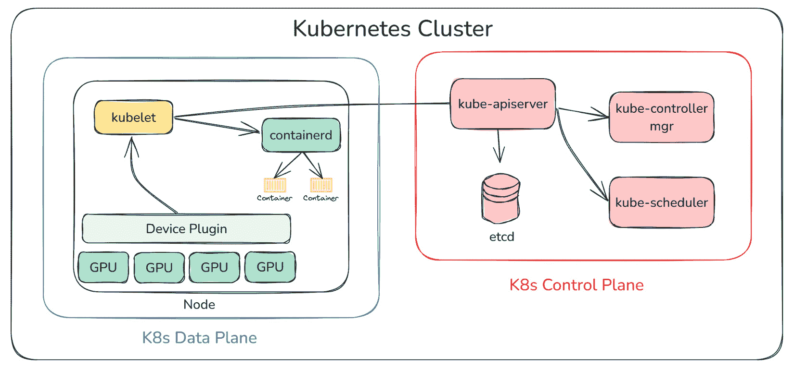
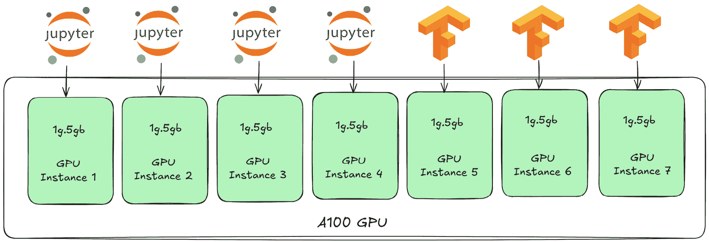
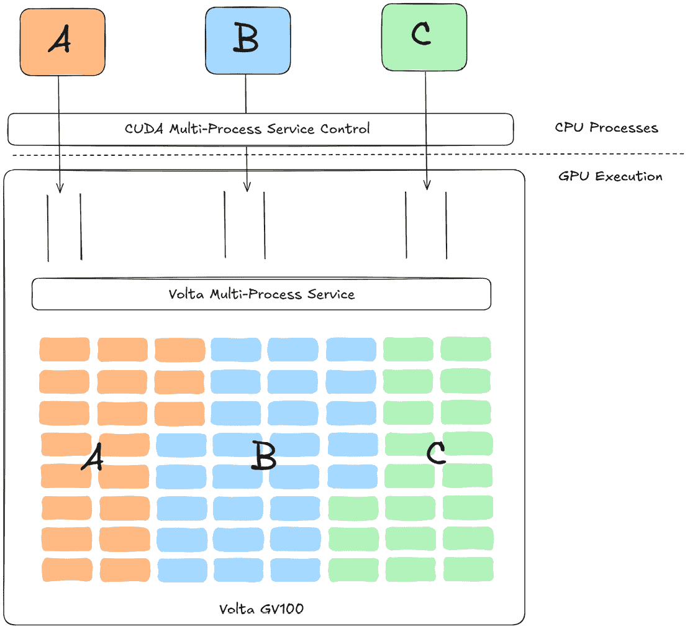
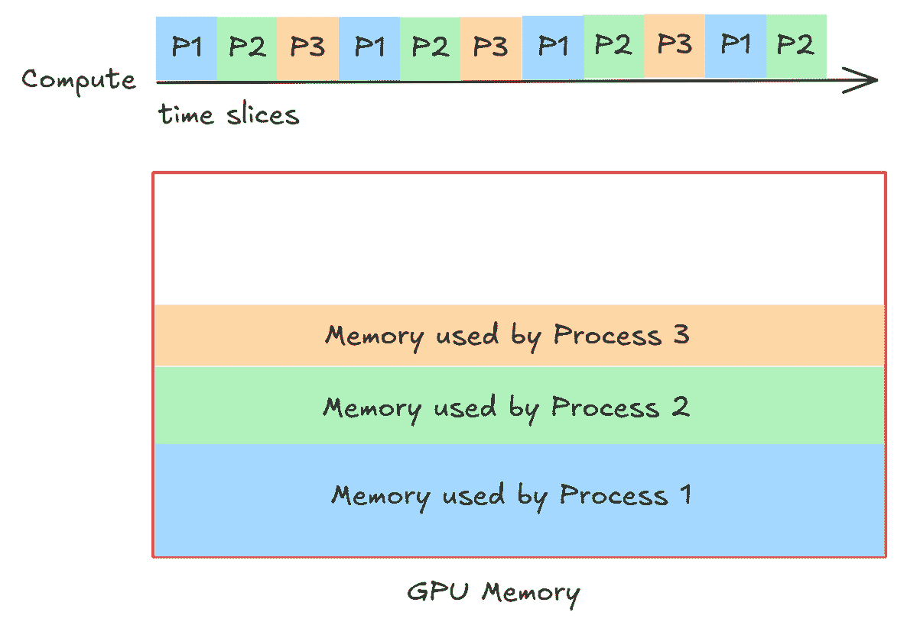

# 10

# 在 Kubernetes 中优化 GPU 资源以适应 GenAI 应用

本章将讨论在 K8s 中部署 GenAI 应用时最大化**图形处理单元**（**GPU**）（[`aws.amazon.com/what-is/gpu/`](https://aws.amazon.com/what-is/gpu/)）效率的策略，因为 GPU 实例非常昂贵，且经常被低效使用。我们还将讨论 GPU 资源管理、调度最佳实践，以及分区选项，如**多实例 GPU**（**MIG**）（[`www.nvidia.com/en-us/technologies/multi-instance-gpu/`](https://www.nvidia.com/en-us/technologies/multi-instance-gpu/)）、**多进程服务**（**MPS**）（[`docs.nvidia.com/deploy/mps/index.html`](https://docs.nvidia.com/deploy/mps/index.html)）和**GPU 时间切片**（[`docs.nvidia.com/datacenter/cloud-native/gpu-operator/latest/gpu-sharing.html`](https://docs.nvidia.com/datacenter/cloud-native/gpu-operator/latest/gpu-sharing.html)）。最后，我们将讨论如何监控 GPU 性能、跨节点平衡工作负载以及自动扩展 GPU 资源以有效应对动态 GenAI 工作负载。

本章将覆盖以下主要内容：

+   GPU 和自定义加速器

+   在 K8s 中分配 GPU 资源

+   理解 GPU 利用率

+   分割和共享 GPU 的技术

+   扩展性和优化考虑

# 技术要求

在本章中，我们将使用以下工具，其中一些工具需要你设置账户并创建访问令牌：

+   **Hugging** **Face**: [`huggingface.co/join`](https://huggingface.co/join)。

+   **Llama-3.2-1B**模型，可以通过 Hugging Face 访问：[`huggingface.co/meta-llama/Llama-3.2-1B`](https://huggingface.co/meta-llama/Llama-3.2-1B)。

+   如 *第三章* 所示的**Amazon EKS 集群**。

+   **AWS 服务配额**用于运行家庭 EC2 实例。你可以在**AWS** **控制台**中申请配额增加（[`docs.aws.amazon.com/servicequotas/latest/userguide/request-quota-increase.html`](https://docs.aws.amazon.com/servicequotas/latest/userguide/request-quota-increase.html)）。

# GPU 和自定义加速器

在 K8s 中部署 GenAI 工作负载需要根据工作负载的计算需求（如训练、推理或微服务实现）选择合适的硬件。计算选项包括 CPU、GPU，或者自定义加速器，如**Inferentia**（[`aws.amazon.com/ai/machine-learning/inferentia/`](https://aws.amazon.com/ai/machine-learning/inferentia/)）和**Trainium**（[`aws.amazon.com/ai/machine-learning/trainium/`](https://aws.amazon.com/ai/machine-learning/trainium/)），以及来自 AWS 的加速器或**张量处理单元**（**TPU**）（[`cloud.google.com/tpu`](https://cloud.google.com/tpu)）来自 Google Cloud。

CPU 通常是 K8s 中的*默认计算资源*，适合轻量级的 GenAI 任务，包括小规模推理、数据预处理、暴露 API 和实现经典的机器学习算法，如**XGBoost**（[`xgboost.readthedocs.io/en/stable/`](https://xgboost.readthedocs.io/en/stable/)）决策树。然而，它们在需要高并行度和大量矩阵乘法的任务（例如训练基础模型）上效率较低。K8s 允许您定义 CPU 请求和限制，确保所有工作负载之间的资源分配公平且高效。

GPU 擅长于**大规模并行处理**（**MPP**），因为它们拥有成千上万的核心和非常高的内存带宽，这使得它们比 CPU 更有效地处理深度学习中核心的矩阵乘法和线性代数计算。然而，GPU 并未在 K8s 中被原生识别。得益于其可扩展的架构，设备厂商可以开发**设备插件**（[`kubernetes.io/docs/concepts/extend-kubernetes/compute-storage-net/device-plugins/`](https://kubernetes.io/docs/concepts/extend-kubernetes/compute-storage-net/device-plugins/)），将 GPU 资源暴露给 K8s 控制平面。这些插件通常作为**守护进程集**（**DaemonSets**）（[`kubernetes.io/docs/concepts/workloads/controllers/daemonset/`](https://kubernetes.io/docs/concepts/workloads/controllers/daemonset/)）在集群中部署，使得 K8s 调度器能够正确地识别、分配和管理容器化工作负载的 GPU。最受欢迎的设备插件之一是**NVIDIA Kubernetes 设备插件**（[`github.com/NVIDIA/k8s-device-plugin`](https://github.com/NVIDIA/k8s-device-plugin)），它将每个 K8s 工作节点上附加的 NVIDIA GPU 暴露出来，并持续监控其健康状态。

作为 GPU 的替代方案，许多公司正在投资创建*专用加速器*，专为 AI/ML 工作负载量身定制。例子包括**AWS Inferentia** 和 **Trainium**，**Google TPUs**，**现场可编程门阵列**（**FPGAs**）（[`www.arm.com/glossary/fpga`](https://www.arm.com/glossary/fpga)），以及各种**特定应用集成电路**（**ASICs**）（[`www.arm.com/glossary/asic`](https://www.arm.com/glossary/asic)），它们都设计用于擅长核心操作，如矩阵乘法、利用基于 Transformer 的模型，提供更高的性能，并确保更低的能耗。与 GPU 类似，这些加速器通过硬件厂商提供的*自定义设备插件*与 K8s 集成。这些插件可以发现、分配并监控附加到 K8s 工作节点上的专用硬件资源，从而与其他计算资源一起实现无缝调度和管理。

自定义加速器特别适用于大规模训练或低延迟推理。例如，**AWS Trainium**([`aws.amazon.com/ai/machine-learning/trainium/`](https://aws.amazon.com/ai/machine-learning/trainium/))是一系列由 AWS 开发的 AI 芯片，通过提供高性能并降低成本来增强 GenAI 训练。第一代 Trainium 芯片驱动了**Amazon EC2 Trn1 实例**([`aws.amazon.com/ec2/instance-types/trn1/`](https://aws.amazon.com/ec2/instance-types/trn1/))，与类似的 EC2 实例相比，提供了最多 50% 的训练成本节省。Trainium2 芯片，出现在**Amazon EC2 Trn2 实例**和**Trn2 UltraServers**([`aws.amazon.com/ec2/instance-types/trn2/`](https://aws.amazon.com/ec2/instance-types/trn2/))中，是训练和推理 GenAI 模型（拥有数百亿到万亿参数）时最强大的 EC2 实例。它们提供了比前代产品高达四倍的性能，并且比 EC2 P5e 和 P5en 系列实例提供了 30% 至 40% 更好的价格性能比。

自定义加速器通常依赖于与通用 CPU 或 GPU 不同的专用硬件架构和指令集。因此，像**TensorFlow**和**PyTorch**这样的 AI/ML 框架无法将高级操作直接转换为加速器可以理解的低级指令。[**Neuron SDK**](https://aws.amazon.com/ai/machine-learning/neuron/)是 AWS 设计的软件开发工具包，用于在 AWS 的定制 AI 加速器上高效运行和优化 AI/ML 工作负载，如 AWS Trainium 和 Inferentia。它包括编译器、运行时、训练和推理库以及性能分析工具。Neuron 在整个 ML 开发生命周期中为客户提供支持，包括构建和部署深度学习和 AI 模型。Neuron SDK 与流行的 ML 框架无缝集成，如**PyTorch**([`pytorch.org/`](https://pytorch.org/))、**TensorFlow**([`www.tensorflow.org/`](https://www.tensorflow.org/))和**JAX**([`jax.readthedocs.io/`](https://jax.readthedocs.io/))，同时支持超过 100,000 个模型，包括来自 Hugging Face 的模型。客户，如*Databricks*，报告称使用 Trainium 驱动的实例时，性能显著提升，成本节省高达 30%([`aws.amazon.com/ai/machine-learning/trainium/customers/`](https://aws.amazon.com/ai/machine-learning/trainium/customers/))。

在选择 CPU、GPU 和加速器时，需要平衡性能需求、工作负载强度和预算限制，以优化 GenAI 工作负载的资源利用率。通过对自定义加速器的概述，让我们更深入地探讨如何在 K8s 中为 GenAI 应用分配 GPU 资源。

# 在 K8s 中分配 GPU 资源

要在 K8s 中使用 GPU 和自定义加速器资源，必须使用相应的设备插件。例如，**NVIDIA Kubernetes 设备插件**使得 K8s 集群能够识别和调度 NVIDIA GPU，而 **Neuron 设备插件**则使 AWS Trainium 和 Inferentia 加速器也能被 K8s 集群识别和调度。此机制确保任何自定义加速器都能在 K8s 集群中正确地被发现、分配和管理。

除了安装设备插件，还应确保底层操作系统上已安装相应的 GPU/加速器驱动程序。AWS 提供了用于 NVIDIA 以及 Trainium 和 Inferentia 加速器的加速 AMI，您可以使用这些 AMI 启动 K8s 工作节点。这些 AMI 包含 NVIDIA 和 Neuron 驱动程序，**nvidia-container-toolkit** ([`github.com/NVIDIA/nvidia-container-toolkit`](https://github.com/NVIDIA/nvidia-container-toolkit)) 等，都是基于标准的 EKS 优化 AMI。有关更多信息，请参考 AWS 文档 [`docs.aws.amazon.com/eks/latest/userguide/eks-optimized-ami.html#gpu-ami`](https://docs.aws.amazon.com/eks/latest/userguide/eks-optimized-ami.html#gpu-ami)。

K8s 设备插件框架的高级架构如*图 10.1*所示。让我们看看这个过程涉及的步骤：

1.  K8s 设备插件作为 **DaemonSets** 部署，确保所有（或部分）节点都运行插件 Pod 的副本。通常，这些插件会被调度到具有特定标签（GPU、自定义加速器）的工作节点上，以优化资源利用。

1.  在初始化时，设备插件会执行各种特定厂商的初始化任务，并确保设备处于就绪状态。

1.  插件将自己注册到 kubelet，并声明它管理的自定义资源——例如，`nvidia.com/gpu` 用于 NVIDIA GPU，`aws.amazon.com/neuroncore` 用于 AWS Trainium/Inferentia 设备。

1.  注册成功后，插件会向 kubelet 提供托管设备的列表。然后，kubelet 会执行节点状态更新，将这些资源通告给 K8s API 服务器。可以通过运行以下命令来验证：

    ```
    $ kubectl get node <replace-node-name> -o jsonpath='{.status.allocatable}' | jq .
    {
      "nvidia.com/gpu": "1",
    ...
    ```

1.  当 Pod 被调度到工作节点时，kubelet 会通知设备插件容器的需求（GPU 数量），以便它执行必要的准备任务来分配请求的资源。

1.  设备插件会持续监控它所管理设备的健康状态，并相应地更新 kubelet，以确保资源的最佳可用性。



图 10.1 – K8s 设备插件架构

1.  在我们在*第五章*的演示中，我们使用 `eks-data-addons` Terraform 模块安装了 NVIDIA 设备插件，如下所示：

    ```
    module "eks_data_addons" {
      source = "aws-ia/eks-data-addons/aws"
      ...
      enable_nvidia_device_plugin = true
    ```

1.  它使用 Terraform Helm 提供程序在 EKS 集群中部署了**NVIDIA 设备插件 Helm 图表**([`github.com/NVIDIA/k8s-device-plugin?tab=readme-ov-file#deployment-via-helm`](https://github.com/NVIDIA/k8s-device-plugin?tab=readme-ov-file#deployment-via-helm))。您可以通过运行以下命令验证正在使用的 Helm 版本和 DaemonSet：

    ```
    $ helm list -n nvidia-device-plugin
    NAME   NAMESPACE     CHART
    nvidia-device-plugin
    nvidia-device-plugin
    nvidia-device-plugin
    $ kubectl get ds -n nvidia-device-plugin --no-headers
    nvidia-device-plugin
    nvidia-device-plugin-gpu-feature-discovery
    nvidia-device-plugin-node-feature-discovery-worker
    ```

1.  下一步是启动 GPU 工作节点并将其注册到集群中。这在*第五章*的操作指南中有介绍，我们创建了一个名为`eks-gpu-mng`的新 EKS 管理节点组，使用的是 G6 系列的 EC2 实例。此外，还对这些节点应用了 K8s 污点，以确保只有需要 GPU 资源的 Pods 会被调度到这些节点上：

    ```
    module "eks" {
      source = "terraform-aws-modules/eks/aws"
      ...
      eks_managed_node_groups = {
        eks-gpu-mng = {
          instance_types = ["g6.2xlarge"]
          taints = {
            gpu = {
              key = "nvidia.com/gpu"
              value = "true"
              effect = "NO_SCHEDULE"
    ...
    ```

1.  GPU 工作节点还可以进行标记，从而实现高级调度。例如，我们可以使用 `hardware-type=gpu` 来标识启用了 GPU 的节点。这使得在调度需要 GPU 的工作负载时可以针对特定节点。我们可以通过使用 `kubectl` 命令或运行必要的 Terraform 代码来实现：

    ```
    $ kubectl label node <node-name> hardware-type=gpu
    ```

    我们还可以使用 Terraform 对 K8s 工作节点进行标记，如以下代码片段所示：

    ```
    ...
    eks-gpu-mng = {
          labels = {
            "hardware-type" = "gpu"
          }
    ...
    ```

1.  下一步是为容器化工作负载分配 GPU 资源，例如 GenAI 训练和推理工作负载。要请求 GPU 资源，需要在 K8s 部署和 Pod 规格中指定资源请求和限制。以下代码片段演示了如何执行以下操作：

    +   为 K8s Pod 分配与节点污点匹配的容忍度

    +   将 K8s Pods 专门调度到标有 `hardware-type: gpu` 的节点上

    +   使用 `nvidia.com/gpu` 属性请求一个 GPU 资源：

        ```
        apiVersion: v1
        kind: Pod
        metadata:
          name: gpu-demo-pod
        spec:
          tolerations:
          - key: "nvidia.com/gpu"
            operator: "Exists"
            effect: "NoSchedule"
          nodeSelector:
            hardware-type: gpu
          containers:
          - name: gpu-container
            image: nvidia/cuda
            resources:
              limits:
                nvidia.com/gpu: 1
        ```

在 K8s 中请求 GPU 资源时，必须始终在规格的*limits*部分定义它们，可以单独定义，也可以与匹配的请求值一起定义；仅指定*requests*而不指定*limits*是不允许的。同样，在使用 AWS Trainium/Inferentia 加速器时，可以使用 `aws.amazon.com/neuroncore` 属性来请求资源。

本节开始时，我们研究了 K8s 设备插件架构以及在 EKS 集群中创建工作节点的步骤。我们还了解了 K8s 调度技术，如污点、容忍度和节点选择器，这些都可以用于将 GPU Pods 调度到各自的节点上。

# 理解 GPU 利用率

GPU 构成了运行 GenAI 工作负载的主要成本，因此有效利用它们对于实现最佳性能和成本效益至关重要。如果没有适当的监控，GPU 未充分利用可能导致计算效率低下和运营成本增加，而 GPU 过度利用则可能导致请求限制和潜在的应用程序故障。本节将探讨监控 GPU 利用率的解决方案，重点介绍如何导出指标并利用它们实现高效的自动扩展策略。

## NVIDIA 数据中心 GPU 管理器（DCGM）

**DCGM** ([`developer.nvidia.com/dcgm`](https://developer.nvidia.com/dcgm)) 是一个轻量级的库和代理，旨在简化 NVIDIA GPU 的管理，使用户、开发人员和系统管理员能够监控和管理跨集群或数据中心的 GPU。

DCGM 提供了 GPU 健康诊断、行为监控、配置管理、遥测收集和策略自动化等功能。它既可以作为通过 NVIDIA 主机引擎的*独立服务*运行，也可以作为嵌入式组件在第三方管理工具中运行。其主要特性包括 GPU 健康诊断、作业级遥测、多 GPU 或主机的组中心资源管理，以及自动化管理策略，以增强可靠性并简化管理任务。DCGM 可以与 K8s 工具如 NVIDIA GPU Operator 无缝集成，实现容器化环境中的遥测收集和健康检查。通过支持将度量数据导出到诸如 Prometheus 等系统，DCGM 还能够促进 GPU 数据在 Grafana 等工具中的实时可视化和分析。

DCGM 可以通过以下方式在 K8s 集群中实施：

+   `gpu-operator` ([`github.com/NVIDIA/gpu-operator`](https://github.com/NVIDIA/gpu-operator)) 利用 K8s 中的**operator 模式** ([`kubernetes.io/docs/concepts/extend-kubernetes/operator/`](https://kubernetes.io/docs/concepts/extend-kubernetes/operator/)) 自动化管理为 GPU 提供所需的所有 NVIDIA 软件组件。这些组件包括 NVIDIA 驱动程序（以启用 CUDA）、K8s 设备插件（用于 GPU）、NVIDIA 容器运行时、自动节点标记、基于 DCGM 的监控等。此方法非常适合那些希望为 NVIDIA GPU 资源提供全面自动化解决方案的环境，包括安装、更新和配置。

+   **DCGM-Exporter** ([`github.com/NVIDIA/dcgm-exporter`](https://github.com/NVIDIA/dcgm-exporter))：建立在 NVIDIA DCGM 框架之上，DCGM-Exporter 收集并以 Prometheus 兼容格式暴露广泛的 GPU 性能和健康度量数据，如利用率、内存使用、温度和功耗等。这有助于与 Prometheus 和 Grafana 等流行的监控和可视化工具无缝集成。DCGM-Exporter 非常适用于那些 GPU 组件已安装，且您需要启用 GPU 监控而不增加额外负担的场景。

请参考 NVIDIA 文档中的[`docs.nvidia.com/datacenter/cloud-native/gpu-operator/latest/amazon-eks.html`](https://docs.nvidia.com/datacenter/cloud-native/gpu-operator/latest/amazon-eks.html)以获取关于根据您的操作需求选择正确方法的详细指导。

到目前为止，在我们的操作过程中，我们已经安装了必要的组件，如 NVIDIA 设备插件和相关驱动程序。因此，我们将使用第二种方法（DCGM-Exporter）来监控 GPU 的健康状况和使用情况指标。对于第一种方法，您可以参考 NVIDIA 文档，网址为[`docs.nvidia.com/datacenter/cloud-native/gpu-operator/latest/getting-started.html#operator-install-guide`](https://docs.nvidia.com/datacenter/cloud-native/gpu-operator/latest/getting-started.html#operator-install-guide)，以获取详细的设置说明。接下来，我们将使用 Terraform 中的 Helm 提供者来安装 DCGM-Exporter。首先，从[`github.com/PacktPublishing/Kubernetes-for-Generative-AI-Solutions/blob/main/ch10/aiml-addons.tf`](https://github.com/PacktPublishing/Kubernetes-for-Generative-AI-Solutions/blob/main/ch10/aiml-addons.tf)下载`aiml-addons.tf`文件。

`dcgm-exporter` Helm 图表将从[`nvidia.github.io/dcgm-exporter/`](https://nvidia.github.io/dcgm-exporter/) Helm 仓库中部署到`dcgm-exporter`命名空间，如下所示的代码片段：

```
resource "helm_release" "dcgm_exporter" {
  name       = "dcgm-exporter"
  repository = "https://nvidia.github.io/dcgm-exporter/"
  chart      = "dcgm-exporter"
  namespace = "dcgm-exporter"
...
```

执行以下命令将`dcgm-exporter` Helm 图表部署到 EKS 集群，并使用以下`kubectl`命令验证其安装。输出应确认`dcgm-exporter`已作为*DaemonSet*部署，并且其 Pod 正在*运行*：

```
$ terraform init
$ terraform plan
$ terraform apply -auto-approve
$ kubectl get ds,pods -n dcgm-exporter
NAME                           DESIRED   CURRENT   READY
daemonset.apps/dcgm-exporter   2         2         2
NAME                      READY   STATUS    RESTARTS   AGE
pod/dcgm-exporter-729qb   1/1     Running   0          84s
pod/dcgm-exporter-rtmtw   1/1     Running   0          84s
```

现在，DCGM-Exporter 已经正常运行，您可以通过连接到 DCGM-Exporter 服务来访问 GPU 的健康状况和利用率指标。执行以下命令以本地连接到该服务，并使用`curl`命令查询`/metrics`端点以查看 GPU 指标：

```
$ kubectl port-forward svc/dcgm-exporter -n dcgm-exporter 9400:9400
Forwarding from 127.0.0.1:9400 -> 9400
Forwarding from [::1]:9400 -> 9400
$ curl http://localhost:9400/metrics
# HELP DCGM_FI_DEV_GPU_UTIL GPU utilization (in %).
# TYPE DCGM_FI_DEV_GPU_UTIL gauge
DCGM_FI_DEV_GPU_UTIL{gpu="0",UUID="GPU-173ced1d-4c1d-072d-6819-86522b018187",pci_bus_id="00000000:31:00.0",device="nvidia0",modelName="NVIDIA L4",Hostname="ip-10-0-34-196.us-west-2.compute.internal"} 0
# HELP DCGM_FI_DEV_MEM_COPY_UTIL Memory utilization (in %).
# TYPE DCGM_FI_DEV_MEM_COPY_UTIL gauge
DCGM_FI_DEV_MEM_COPY_UTIL{gpu="0",UUID="GPU-173ced1d-4c1d-072d-6819-86522b018187",pci_bus_id="00000000:31:00.0",device="nvidia0",modelName="NVIDIA L4",Hostname="ip-10-0-34-196.us-west-2.compute.internal"} 0
...
```

在*第十二章*中，我们将部署并配置一个 Prometheus 代理，来抓取这些 GPU 指标并通过 Grafana 仪表板进行可视化。一旦指标在 Prometheus 中可用，我们可以安装**Prometheus 适配器**([`github.com/kubernetes-sigs/prometheus-adapter`](https://github.com/kubernetes-sigs/prometheus-adapter))，以创建*自动扩展策略*，使 GPU 工作负载能够动态扩展，从而实现最佳资源利用。

## GPU 利用率挑战

在 K8s 中，将 GPU 分配给 Pod 会将该 GPU 独占分配给该 Pod 的整个生命周期，即使该 Pod 没有在积极使用它。默认情况下，K8s 不支持在多个 Pod 之间共享 GPU 或为每个 Pod 分配部分 GPU（< 1）。这种设计确保了隔离，避免了冲突，因为大多数 GPU 本身并未设计为处理没有专用软件的并发工作负载。

然而，独占 GPU 分配可能会导致资源利用不足，如果 Pod 没有充分利用其分配的 GPU。这个挑战在生成 AI 场景中尤为突出，因为以下因素常常发挥作用：

+   **不同模型大小（大模型与小 LLM）**：尽管**最先进的**（**SOTA**）LLM 可能需要整个 GPU 甚至多个 GPU，但对这些模型的更小或蒸馏版本的需求也在增加。根据它们的大小，这些较小的 LLM 可能只需要 GPU 的一小部分内存和计算能力。在 K8s 的默认“整块 GPU”分配模式下，即使是只需要部分 GPU 的小模型，也会被分配整个设备，导致资源过度配置。

+   **动态工作负载模式**：GenAI 工作负载，如微调或训练 LLM，或运行复杂的基于扩散的模型推理，可能会产生突发性的 GPU 使用模式。在训练/微调/推理过程中，GPU 使用率可能会飙升至 100%，用于计算密集型操作（矩阵乘法、反向传播等），但在周期或数据加载/处理步骤之间会显著下降。由于 K8s 默认不支持按比例分配 GPU 资源，这些*波动峰谷*会导致 GPU 利用率低效。

+   **调度复杂性和碎片化**：K8s 的默认调度器缺乏先进 GPU 共享策略的智能。即使有节点亲和性、污点和容忍度等技术，也没有现成的方法可以动态地将未充分利用的 GPU 重新分配给另一个 Pod。因此，较小的 LLM 可能会独占整个 GPU，即使它们只需要其中一小部分的计算能力。随着更多 Pod 的部署，多个 GPU 会变成部分利用，但被完全预留，从而导致集群中的 GPU 资源碎片化。

我们可以采取一些方法来应对这些利用率挑战，比如 NVIDIA 的**MIG**、**MPS**和**GPU 时间切片**选项。在一项使用 GPU 共享技术提供视频内容的案例研究中，价格性能改善最高可达 95%。有关此方面的更详细基准数据，请参考以下 AWS 博客：[`aws.amazon.com/blogs/containers/delivering-video-content-with-fractional-gpus-in-containers-on-amazon-eks/`](https://aws.amazon.com/blogs/containers/delivering-video-content-with-fractional-gpus-in-containers-on-amazon-eks/)。

在这一节中，我们探讨了为什么监控 GPU 健康状况和指标至关重要，并在我们的 K8s 集群中部署了 NVIDIA DCGM-Exporter 插件，以实时跟踪 GPU 性能和健康指标。我们还探讨了 GPU 利用率的挑战，以及在 GenAI 领域中造成低效的因素。接下来，我们将深入研究可用于解决这些问题的 GPU 划分技术。

# GPU 划分和共享技术

GPU 划分和共享技术通常是厂商特定的，这意味着它们可能并不适用于所有加速器。在这一节中，我们将探讨 NVIDIA 为其 GPU 提供的一些常见方法，如 MIG、MPS 和时间切片，并讨论它们如何帮助提高 GenAI 工作负载的 GPU 利用率。

## NVIDIA MIG

**MIG**（[`docs.nvidia.com/datacenter/tesla/mig-user-guide/index.html`](https://docs.nvidia.com/datacenter/tesla/mig-user-guide/index.html)）是 NVIDIA 在 **Ampere** 及后续架构（A100、H100 等）中引入的一项功能，允许将单个物理 GPU 划分为多个独立的 GPU 实例。每个 MIG 实例拥有自己的专用内存、计算核心和其他 GPU 资源，从而在工作负载之间提供严格的隔离。MIG 最小化了实例之间的干扰，并确保可预测的性能，最终实现了更高效、灵活的 GPU 容量利用。

实现 MIG 的过程包括定义 GPU 实例，这些实例捆绑了 GPU 的一部分内存和计算能力。例如，在具有 40 GB 内存的 NVIDIA A100 GPU 上，您可以配置最多七个实例，每个实例拥有 5 GB 的专用内存和相应的计算资源份额；这可以在*图 10.2*中看到。在这个示例中，我们可以在不同的 GPU 分区上运行多个工作负载，例如 Jupyter 笔记本、机器学习任务等，从而实现 GPU 实例的高效利用：



图 10.2 – A100 NVIDIA GPU 中的多实例 GPU

这些实例由**MIG 配置文件**指定（[`docs.nvidia.com/datacenter/tesla/mig-user-guide/index.html#supported-mig-profiles`](https://docs.nvidia.com/datacenter/tesla/mig-user-guide/index.html#supported-mig-profiles)），该配置文件概述了每个实例的大小和形状——例如，*1g.5gb* 配置文件分配 5 GB 内存和相应份额的 GPU 核心。这些实例作为独立的 GPU 实例运行，每个实例具有保证的性能并且相互之间的干扰最小。下表显示了 NVIDIA MIG 用户指南中最新 NVIDIA H200 GPU 的 MIG 配置文件（[`docs.nvidia.com/datacenter/tesla/pdf/NVIDIA_MIG_User_Guide.pdf`](https://docs.nvidia.com/datacenter/tesla/pdf/NVIDIA_MIG_User_Guide.pdf)）：

| **MIG 配置文件** | **GPU 切片** | **GPU 内存（GB）** | **实例数量** |
| --- | --- | --- | --- |
| 1g.18gb | 1 | 18 | 7 |
| 1g.18gb+me | 1 | 18 | 1 |
| 1g.35gb | 1 | 35 | 4 |
| 2g.35gb | 2 | 35 | 3 |
| 3g.70gb | 3 | 70 | 2 |
| 4g.70gb | 4 | 70 | 1 |
| 7g.141gb | 7 | 141 | 1 |

表 10.1 – NVIDIA H200 GPU 的 GPU 实例配置文件

在此表中，*GPU 切片*表示分配给 MIG 配置文件的 GPU 部分，*GPU 内存（GB）*表示分配给该 MIG 实例的内存量（以 GB 为单位），*实例数量*表示可以为给定配置文件创建的实例数。

在 K8s 中，你可以使用**NVIDIA GPU Operator**来简化 MIG 设置，该设置会部署 MIG Manager 以管理 GPU 节点上的 MIG 配置及其他关键配置。有关如何在 K8s 集群中设置 MIG 的详细步骤，请参考 NVIDIA 文档：[`docs.nvidia.com/datacenter/cloud-native/gpu-operator/latest/gpu-operator-mig.html`](https://docs.nvidia.com/datacenter/cloud-native/gpu-operator/latest/gpu-operator-mig.html)。

K8s 使用独特的**GPU 实例 ID**和**计算实例 ID**来识别各个 MIG 实例。这些实例作为扩展资源（例如，*nvidia.com/mig-1g.18gb*）暴露给 K8s。设备插件会为节点标注可用的 MIG 配置及其数量，从而使 K8s 调度器能够将 Pod 资源请求匹配到相应的 MIG 实例。例如，下面的代码片段显示了一个 K8s Pod 请求将 *nvidia.com/mig-1g.18gb* 调度到具有该特定配置可用实例的节点：

```
resources:
  limits:
    nvidia.com/mig-1g.18gb: 1
```

现在我们已经了解了在 K8s 中如何识别和分配各个 MIG 实例，接下来让我们探索这些分区可以如何配置。主要有两种策略：*单一*和*混合*。

使用**单一 MIG 策略**([`docs.nvidia.com/datacenter/cloud-native/gpu-operator/latest/gpu-operator-mig.html#example-single-mig-strategy`](https://docs.nvidia.com/datacenter/cloud-native/gpu-operator/latest/gpu-operator-mig.html#example-single-mig-strategy))时，节点上的所有 GPU 切片大小相同。例如，在一个配有八个 80 GB 内存的 H100 GPU 的 p5.48xlarge EC2 实例上，你可以创建 56 个 1g.10gb 切片，24 个 2g.20gb 切片，16 个 3g.40gb 切片，甚至是 8 个 4g.40gb 或 7g.80gb 切片。这种统一的策略特别适用于多个团队有相似 GPU 需求的情况。在这种情况下，你可以为每个团队分配相同大小的切片，确保公平访问，并最大化 p5.48xlarge 实例的利用率，适用于诸如微调和推理等任务，这些任务对 GPU 容量的需求在各个任务中是一致的。

相比之下，**混合 MIG 策略**([`docs.nvidia.com/datacenter/cloud-native/gpu-operator/latest/gpu-operator-mig.html#example-mixed-mig-strategy`](https://docs.nvidia.com/datacenter/cloud-native/gpu-operator/latest/gpu-operator-mig.html#example-mixed-mig-strategy))通过允许在节点上的每个 GPU 中创建不同大小的 GPU 切片，提供了更大的灵活性。例如，在一个配备有八个 NVIDIA H100 GPU 的 p5.24xlarge EC2 实例上，你可以结合不同的 MIG 切片配置，例如 16 个 1g.10gb 切片 + 8 个 2g.20gb 切片 + 8 个 3g.40gb 切片。这种异构分配对于处理具有不同 GPU 需求的工作负载的集群尤为有益。

假设有一个 AI 初创公司，拥有三种专门化工作负载：一个图像识别应用、一个自然语言处理应用和一个视频分析应用。通过混合策略，该初创公司可以根据每个应用的需求定制 GPU 分配。例如，图像识别应用可能会分配两个 1g.10gb 的切片，自然语言处理应用可能会使用一个 2g.20gb 的切片，视频分析应用可能会从一个 3g.40gb 的切片中受益，所有应用都在同一 H100 GPU 上并行运行。这种方法确保每个应用获得适当的 GPU 资源，而不会过度配置，从而最大化 GPU 资源的整体利用率和效率。

## NVIDIA MPS

**MPS** ([`docs.nvidia.com/deploy/mps/index.html`](https://docs.nvidia.com/deploy/mps/index.html)) 是一种软件功能，旨在优化多个进程间的 GPU 资源共享。它使多个进程能够并发提交任务，从而减少 GPU 空闲时间并提高资源利用率。如 *图 10.3* 所示，每个进程保留自己的独立 GPU 内存空间，同时计算资源动态共享，这使得低延迟调度成为可能，并且对于那些可能无法单独完全利用 GPU 资源的工作负载来说，能够提供更好的性能：



图 10.3 – NVIDIA MPS

在 MPS 中，不同的并发运行的进程共享 GPU 全局内存，这带来了需要仔细考虑的挑战。当进程或线程必须小心管理，以避免在同时访问共享内存时发生竞争条件或不一致的状态时，*同步开销*可能会出现。此外，当多个进程或线程争夺同一内存空间时，可能会发生资源争用，进而导致性能瓶颈。共享全局内存与私有分配的平衡增加了编程的复杂性，需要仔细规划并深入理解 CUDA ([`developer.nvidia.com/about-cuda`](https://developer.nvidia.com/about-cuda)) 内存管理，以确保效率和正确性。

使用 MPS 的内存隔离问题已部分解决，最初由**Volta 架构**([`docs.nvidia.com/deploy/mps/index.html#volta-mps`](https://docs.nvidia.com/deploy/mps/index.html#volta-mps))解决。Volta GPU 为每个客户端引入了独立的 GPU 地址空间，确保一个进程的内存分配不会被其他进程直接访问，这是内存隔离的一大进步。此外，客户端可以直接向 GPU 提交工作，而无需使用共享上下文，减少了竞争并实现了更精细的资源分配。执行资源的配置也确保了对 GPU 计算资源的更好控制，防止单个客户端垄断资源。然而，仍然存在一些限制，所有进程共享全局内存带宽，如果某个进程过度使用，可能导致性能下降。此外，MPS 缺乏故障隔离，意味着一个进程中的关键错误仍然可能干扰其他进程。尽管这些改进使得 Volta 及更新版 GPU 中的 MPS 更适合处理多进程工作负载，并且在隔离要求不那么严格时表现更佳，但当需要完全的故障隔离时，NVIDIA 的 MIG 仍然是推荐的解决方案。

目前，NVIDIA 的 K8s 设备插件不支持 MPS 分区，并且这一问题正在 GitHub 上的问题追踪中进行跟踪，编号为#443([`github.com/NVIDIA/k8s-device-plugin/issues/443`](https://github.com/NVIDIA/k8s-device-plugin/issues/443))。不过，存在一个分支版本的插件，地址为[`github.com/nebuly-ai/k8s-device-plugin`](https://github.com/nebuly-ai/k8s-device-plugin)，它支持在 K8s 集群中启用 MPS。请参考*Medium*上的以下文章，获取逐步操作指南：[`medium.com/data-science/how-to-increase-gpu-utilization-in-kubernetes-with-nvidia-mps-e680d20c3181`](https://medium.com/data-science/how-to-increase-gpu-utilization-in-kubernetes-with-nvidia-mps-e680d20c3181)。一旦通过此分支的 NVIDIA 设备插件启用 MPS，多个 K8s Pod 可以共享单个 GPU。MPS 动态管理计算资源的分配，同时保持 Pod 之间的内存隔离。此功能使 Pod 资源定义中支持按比例请求 GPU，从而使 K8s 能够高效地将多个 Pod 调度到同一 GPU 上。

## GPU 时间切片

对于 NVIDIA GPU，**时间切片**([`docs.nvidia.com/datacenter/cloud-native/gpu-operator/latest/gpu-sharing.html`](https://docs.nvidia.com/datacenter/cloud-native/gpu-operator/latest/gpu-sharing.html))是另一种技术，通过将执行时间分割为多个时间片，允许多个进程或应用动态共享 GPU 资源，从而实现对 GPU 的顺序访问。*图 10.4*展示了 GPU 如何随着时间的推移在不同进程之间交替，使它们能够共享资源，同时每个进程通常保持各自的内存分配：



图 10.4 – GPU 时间切片

时间分片支持那些通常需要独占 GPU 访问的工作负载，提供共享访问，但没有 NVIDIA MIG 特性的内存或故障隔离能力。时间分片功能特别适用于不支持 MIG 特性的老旧 GPU。它还可以补充 MIG，使多个进程共享单一 MIG 分区的资源。然而，时间分片可能会引入延迟，因为进程需要等待轮到它们执行。这会带来上下文切换开销，涉及在切换到下一个进程之前保存和恢复每个进程的状态。

时间分片非常适合通用、多进程 GPU 使用，并且在虚拟化、多租户系统和混合工作负载中表现有效。然而，对于需要严格资源隔离或高响应性的场景，MIG 可能是更合适的解决方案。

下面是前面提到的 GPU 共享技术（即 MIG、MPS 和时间分片）的高级对比：

| **特性** | **MIG** | **MPS** | **时间分片** |
| --- | --- | --- | --- |
| **资源** **隔离** | 强（硬件级别） | 对于 Volta+ GPU 没有或有限 | 无 |
| **性能** | 可预测 | 提高了 GPU 利用率，但增加了延迟 | 依赖于工作负载特性 |
| **可扩展性** | 受支持分区数限制 | 高 | 高 |
| **开销** | 最小 | 低 | 随着上下文切换增加开销 |
| **使用场景** | 多租户，推理 | 高性能计算，多个进程工作负载 | 非关键任务 |
| **兼容性** | Ampere+ GPUs | 所有支持 CUDA 的 GPU | 所有支持 CUDA 的 GPU |

表格 10.2 – NVIDIA GPU 共享技术对比

K8s 中的 NVIDIA 时间分片特性支持 GPU 超额分配，允许多个工作负载通过交错执行动态共享单个 GPU。这是通过 NVIDIA GPU Operator 和在 K8s 中增强的 NVIDIA 设备插件配置选项实现的。为了在 EKS 集群设置中启用时间分片特性，我们需要创建一个`time-slicing-config`。在以下示例中，我们创建了 10 个副本（虚拟的“时间分片”GPU），这样每个请求一个`nvidia.com/gpu`资源的 K8s Pod 将被分配到这些虚拟 GPU 中的一个，并在底层物理 GPU 上进行时间分片：

```
apiVersion: v1
kind: ConfigMap
metadata:
  name: time-slicing-config
  namespace: nvidia-device-plugin
data:
  any: |-
    version: v1
    flags:
      migStrategy: none
    sharing:
      timeSlicing:
        resources:
        - name: nvidia.com/gpu
          time-slicing-config ConfigMap:

```

$ kubectl apply -f nvidia-ts.yaml

configmap/time-slicing-config 创建完成

```

			Now, update the NVIDIA K8s device plugin configuration so that it can use this ConfigMap in the Terraform code. Download the `aiml-addons.tf` file from [`github.com/PacktPublishing/Kubernetes-for-Generative-AI-Solutions/blob/main/ch10/aiml-addons.tf`](https://github.com/PacktPublishing/Kubernetes-for-Generative-AI-Solutions/blob/main/ch10/aiml-addons.tf). This leverages the `time-slicing-config` ConfigMap to initialize the NVIDIA device plugin, as shown in the following code snippet:

```

module "eks_data_addons" {

source = "aws-ia/eks-data-addons/aws"

...

enable_nvidia_device_plugin = true

nvidia_device_plugin_helm_config = {

name    = "nvidia-device-plugin"

values = [

...

config:

name: time-slicing-config

...

```

			Execute the following command to apply the Terraform configuration:

```

$ terraform apply -auto-approve

```

			The NVIDIA device plugin automatically reconciles the time-slicing configuration and updates the K8s node details accordingly. We can verify this by running the following command, which displays the GPU count as 10 on a g6.2xlarge EC2 instance. This indicates that one physical NVIDIA L4 GPU on the node has been virtualized into 10 replicas, making them available for the scheduler to allocate:

```

$ kubectl get nodes -o custom-columns=NAME:.metadata.name,INSTANCE:.metadata.labels."node\.kubernetes\.io/instance-type",GPUs:.status.allocatable."nvidia\.com/gpu"

NAME                                        INSTANCE     GPUs

ip-10-0-40-57.us-west-2.compute.internal    g6.2xlarge   10

```

			To demonstrate the use of NVIDIA time-slicing, let’s say we are deploying a small LLM such as **Meta’s Llama-3.2-1B** ([`huggingface.co/meta-llama/Llama-3.2-1B`](https://huggingface.co/meta-llama/Llama-3.2-1B)) parameter model in our application. This model requires 1.8 GB of GPU memory to load and perform inference. In a traditional setup, we would assign a single L4 GPU with 24 GB of memory to one K8s Pod, resulting in 92% of the GPU memory being underutilized. However, by creating 10 time-sliced replicas, we can deploy multiple instances of the Llama-3.2-1B parameter model on a single GPU.
			We’ve already containerized the Llama-3.2-1B model into a Python FastAPI application and published it on Docker Hub. Using this image, we can deploy multiple copies of the model’s endpoint on the K8s node. Download the K8s deployment manifest from [`github.com/PacktPublishing/Kubernetes-for-Generative-AI-Solutions/blob/main/ch10/llama32-inf/llama32-deploy.yaml`](https://github.com/PacktPublishing/Kubernetes-for-Generative-AI-Solutions/blob/main/ch10/llama32-inf/llama32-deploy.yaml). Then, update the manifest with your Hugging Face token and execute the following commands to create a K8s deployment with five replicas of this model. You can verify that all replicas will run on the same node while sharing one physical GPU efficiently:

```

$ kubectl apply -f llama32-deploy.yaml

deployment/my-llama32-deployment 创建完成

$ kubectl get pods -o wide

<显示在同一节点上运行的 5 个 Pod>

```

			In this walkthrough, we applied the same time-slicing configuration across all nodes in the K8s cluster, irrespective of the GPU type. If you are using multiple GPU types (e.g., A100, L4, L40S, H100, etc.) in the same cluster, you can consider using a **multiple node-specific configuration** setup. In this approach, you define different time-slicing configurations for each GPU type in the ConfigMap and use node labels to specify which configuration should be applied to each GPU node. Please refer to the NVIDIA documentation at [`docs.nvidia.com/datacenter/cloud-native/gpu-operator/latest/gpu-sharing.html#applying-multiple-node-specific-configurations`](https://docs.nvidia.com/datacenter/cloud-native/gpu-operator/latest/gpu-sharing.html#applying-multiple-node-specific-configurations) for a detailed walkthrough.
			In this section, we learned about various NVIDIA GPU partitioning techniques (MIG, MPS, and time-slicing) and the differences among them. MIG provides strong isolation with minimal overhead and predictable performance, making it ideal for multi-tenant environments and inference workloads. On the other hand, MPS optimizes resource utilization by enabling multiple processes to share a single GPU concurrently. Finally, time-slicing allows multiple workloads to interleave on a single GPU by allocating compute resources in a round-robin fashion. It is compatible with all CUDA-capable GPUs, including older architectures, making it a versatile option. However, time-slicing introduces higher context-switching overhead and lacks both isolation and the efficiency improvements of MPS. In the next section, we will explore additional scaling and optimization considerations when using GPUs in K8s clusters.
			Scaling and optimization considerations
			When scaling K8s using GPU metrics, you can integrate NVIDIA DCGM to dynamically adjust workloads based on GPU health, utilization, and performance metrics. DCGM collects telemetry data, such as GPU utilization, memory usage, power consumption, and error rates, that is exposed through DCGM-Exporter for integration with Prometheus. Prometheus metrics are then consumed by autoscaling components such as **Horizontal Pod Autoscaler** (**HPA**) or **Vertical Pod Autoscaler** (**VPA**) to scale the K8s workloads.
			For instance, in an ML training job that’s running on multiple nodes, DCGM-Exporter can track metrics such as `nvidia_gpu_utilization`, feeding them to Prometheus for analysis. In this instance, we can create an HPA policy that tracks GPU utilization and automatically increases the number of replicas (up to 10) when utilization exceeds 80%, thereby distributing processing across more GPUs:

```

apiVersion: autoscaling/v2

kind: HorizontalPodAutoscaler

metadata:

name: genai-training-hpa

spec:

scaleTargetRef:

apiVersion: apps/v1

kind: Deployment

name: genai-training

minReplicas: 1

maxReplicas: 10

metrics:

- type: Object

object:

metricName: DCGM_FI_DEV_GPU_UTIL

targetAverageValue: 80

```

			Similarly, in an image recognition service, if the GPU utilization stays below 20% for 10 minutes, the autoscaler can reduce the number of Pods to save resources. DCGM also supports defining policies for *error handling* and *health monitoring*, ensuring K8s can reschedule Pods or drain nodes with unhealthy GPUs. For example, if DCGM detects memory errors or overheating, K8s can remove that node and migrate workloads to healthier nodes. These use cases demonstrate how GPU metrics enable fine-grained control over scaling to optimize resource usage.
			However, GPU-based scaling also presents challenges. Metrics such as utilization or memory usage may not directly correlate with application performance, thereby requiring careful threshold tuning. Additionally, in environments using GPU time-slicing or MIG, workloads share resources, and DCGM metrics must account for such configurations to avoid over-scaling.
			Continuously monitoring GPU metrics in large clusters can also add overhead, necessitating efficient integration with Prometheus and optimized alert rules. Scaling must also incorporate GPU health data, such as error rates or temperature, to avoid scheduling workloads on faulty hardware.
			Best practices for GPU scaling include leveraging DCGM’s built-in policies for error detection and recovery, using custom Prometheus metrics that combine GPU and application-specific data, integrating the NVIDIA GPU Operator for seamless management, and regularly testing and fine-tuning scaling thresholds. By combining NVIDIA DCGM with K8s’s autoscaling capabilities, you can optimize GPU utilization, reduce costs, and enhance the performance of GPU-accelerated applications, ensuring scalability and reliability in resource-intensive environments.Bottom of Form
			NVIDIA NIM
			**NVIDIA Inference Microservices** (**NIM**) ([`developer.nvidia.com/nim`](https://developer.nvidia.com/nim)) is a component of NVIDIA AI Enterprise that provides developers with GPU-accelerated inference microservices for deploying pretrained and customized AI models either on the cloud or in on-premises environments. These microservices are built on optimized inference engines from NVIDIA and the community, providing latency and throughput optimization for the specific combination of the foundation model and GPU system that’s detected at runtime. Additionally, NIM containers offer standard observability data feeds and built-in support for autoscaling on K8s with GPUs. Refer to the following AWS blog for a detailed walkthrough of deploying GenAI applications with NVIDIA NIM on Amazon EKS: [`aws.amazon.com/blogs/hpc/deploying-generative-ai-applications-with-nvidia-nims-on-amazon-eks/`](https://aws.amazon.com/blogs/hpc/deploying-generative-ai-applications-with-nvidia-nims-on-amazon-eks/).
			Each NIM container encapsulates a model, its runtime dependencies, and the inference engine. These containers are pre-configured for easy deployment and include APIs for interaction with applications. NIM microservices are deployed in a K8s cluster, enabling orchestration, scaling, and fault-tolerant management. Developers can use NIM to create custom AI workflows tailored to specific applications, such as RAG for chat-based question-answering or simulation pipelines for scientific research.
			NIM’s architecture is designed to streamline the deployment of AI applications by offering prebuilt microservices that can be customized and scaled according to specific use cases. For instance, developers can deploy **RAG pipelines** for chat-based question-answering using NIM-hosted models available in the NVIDIA API catalog. These microservices are regularly updated so that they incorporate the latest advancements in AI models across various domains, including speech AI, data retrieval, digital biology, digital humans, simulation, and LLMs.
			Developers interested in utilizing NIM can access it through the NVIDIA developer program, which offers free access for research, development, and testing purposes on up to 16 GPUs across any infrastructure – be it the cloud, a data center, or a personal workstation. For production deployments, NVIDIA AI Enterprise provides a comprehensive suite of tools, including NIM, that come with enterprise-grade security, support, and API stability ([`www.nvidia.com/en-us/data-center/products/ai-enterprise/`](https://www.nvidia.com/en-us/data-center/products/ai-enterprise/)).
			GPU availability in the cloud
			Like CPU instances, GPU instances can be requested in the cloud as on-demand instances, reserved instances, or spot instances. However, the growing demand for GPUs has led to challenges in availability. In response, cloud providers are introducing innovative strategies to improve GPU accessibility and meet the needs of users more effectively.
			For example, AWS has introduced **Amazon EC2 Capacity Blocks for ML** ([`aws.amazon.com/ec2/capacityblocks/`](https://aws.amazon.com/ec2/capacityblocks/)), which allows you to reserve GPU instances in **Amazon EC2 UltraClusters** ([`aws.amazon.com/ec2/ultraclusters/`](https://aws.amazon.com/ec2/ultraclusters/)) for future dates. At the time of writing, you can reserve capacity for durations ranging from 1 to 14 days, with the option to extend up to 6 months, and schedule start times up to 8 weeks in advance using **Capacity Blocks**. These blocks can be used for a wide range of ML workloads, from small-scale experiments to large-scale distributed training sessions, and are available for various instance types, including P5, P5e, P5en, P4d, Trn1, and Trn2, all powered by NVIDIA GPUs and AWS Trainium chips.
			Summary
			In this chapter, we covered options for optimizing GPU resources in K8s for GenAI applications. First, we described custom AI/ML accelerators, such as AWS Inferentia, Trainium, and Google TPUs. These specialized devices offer high performance and cost-efficiency for GenAI workloads, such as training LLMs or low-latency inference use cases. K8s supports these accelerators through device plugins, allowing them to be integrated into existing clusters seamlessly.
			We also covered options to optimize GPU utilization in K8s. This is a critical step due to the high costs of GPU instances and their underutilization. This chapter highlighted various techniques you can implement to address the inefficient use of resources, such as MIG, MPS, and time-slicing.
			MIG allows a single GPU to be partitioned into multiple isolated instances, providing a more granular and efficient allocation of resources. MPS, on the other hand, allows multiple processes to share GPU compute resources concurrently. Time-slicing further enables sequential access to the GPU by dividing execution time across different processes, a technique that’s beneficial for older GPUs that lack MIG support.
			Finally, we covered GPU scaling practices within K8s and emphasized the role of NVIDIA DCGM, which can collect GPU telemetry data such as GPU utilization, memory usage, and power consumption. By integrating DCGM with Prometheus and K8s auto-scalers, you can dynamically scale workloads based on real-time GPU performance metrics.
			NIM simplifies the deployment of AI models by providing pre-configured inference microservices optimized for specific GPU architectures. Cloud GPU availability remains a challenge, with demand often exceeding supply. In the next chapter, we will dive deeper into observability best practices for K8s.

```

# 第三部分：在 K8s 上运行 GenAI 工作负载

本节讨论了 GenAI 应用在生产 K8s 环境中的日常操作，涵盖了从自动化流水线到弹性策略的关键方面。本节探讨了 GenAIOps 实践、使用行业标准工具的全面可观察性实现，以及高可用性和灾难恢复策略。还强调了 GenAI 编程助手在自动化和管理 K8s 集群方面的变革性影响，并以进一步阅读建议作为结尾。

本部分包括以下章节：

+   *第十一章*，*GenAIOps：数据管理与 GenAI 自动化流水线*

+   *第十二章*，*可观察性 – 获取 GenAI 在 K8s 上的可见性*

+   *第十三章*，*GenAI 应用的高可用性和灾难恢复*

+   *第十四章*，*总结*：GenAI 编程助手与进一步阅读
