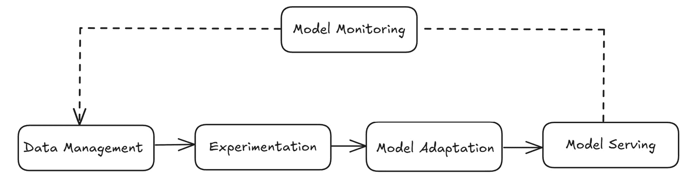
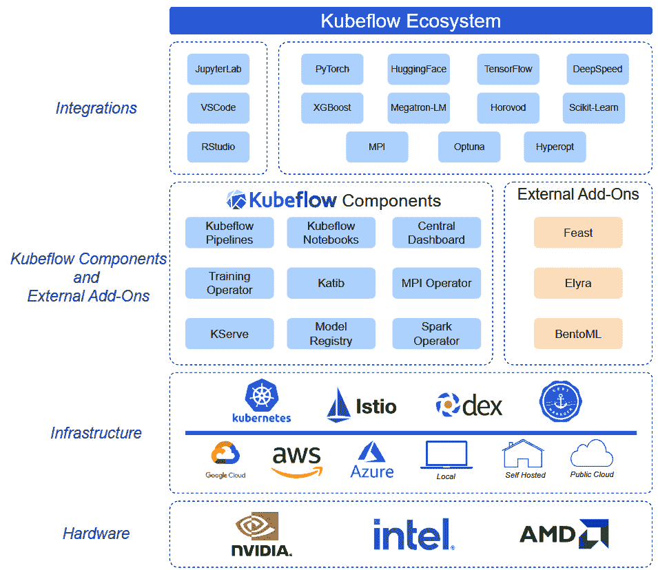
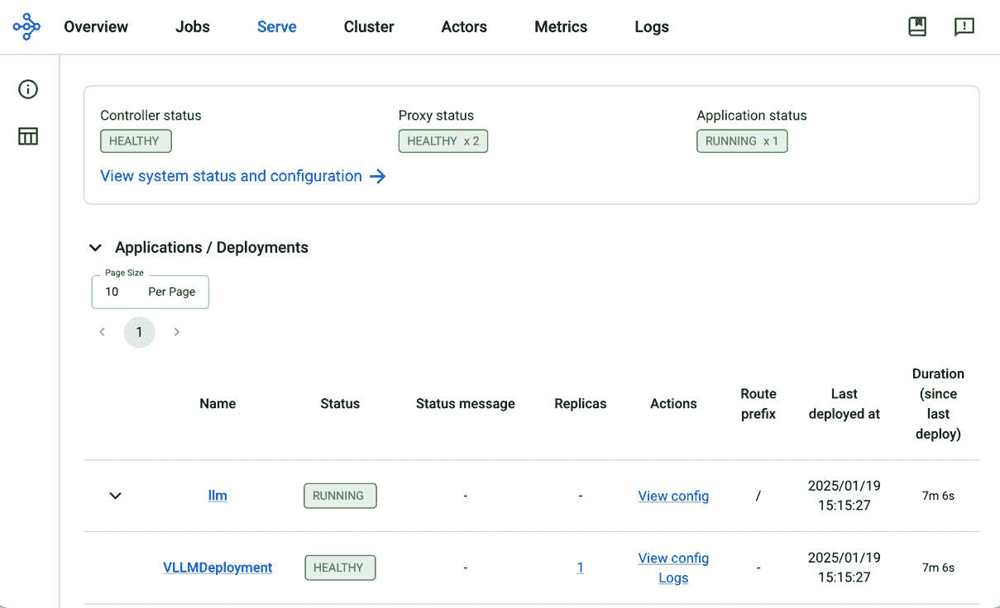
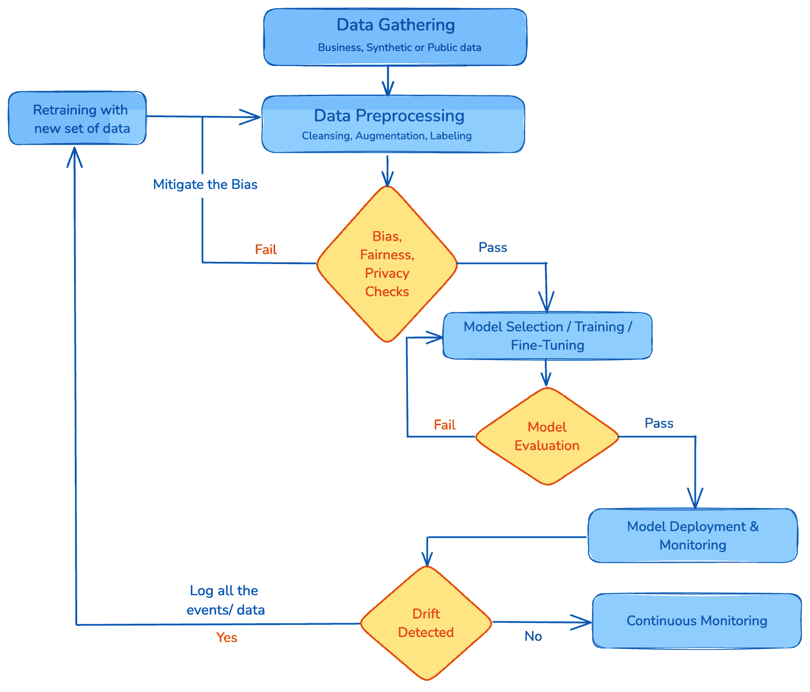

# 11

# GenAIOps：数据管理与 GenAI 自动化流水线

**生成性 AI 操作** (**GenAIOps**) 指的是一套旨在通过生命周期部署、监控和优化生成性 AI 模型的工具、实践和工作流。与传统的 **机器学习** (**ML**) 模型的 MLOps 类似，GenAIOps 专注于生成性 AI 系统所面临的独特挑战，如基础模型（FMs）、大型语言模型（LLMs）和扩散模型。在本章中，我们将涵盖 GenAIOps 的关键概念，例如创建自动化数据流水线、数据收集、清理、模型训练、验证和部署策略，以及持续监控和维护。我们还将讨论数据隐私和模型偏差等主题，并提供最佳实践。

在本章中，我们将涵盖以下主要主题：

+   GenAI 流水线概述

+   K8s 上的 GenAIOps

+   数据隐私、模型偏差和漂移监控

# 技术要求

在本章中，我们将使用以下工具，其中一些工具需要您设置帐户并创建访问令牌：

+   **Hugging** **Face**: [`huggingface.co/join`](https://huggingface.co/join)

+   **Llama-3-8B-Instruct** 模型可以通过 Hugging Face 访问，链接地址：[`huggingface.co/meta-llama/Meta-Llama-3-8B-Instruct`](https://huggingface.co/meta-llama/Meta-Llama-3-8B-Instruct)

+   如 *第三章* 所示，设置 Amazon EKS 集群

# GenAI 流水线概述

在本节中，我们将探讨构建、部署和维护 GenAI 应用程序的端到端过程，如 *图 11.1* 所示。从数据管理开始，组织收集、清理和组织数据集，为高质量的实验奠定基础。然后，实验阶段允许选择适合给定业务用例的 FM/LLM，并做出架构决策，决定如何调整模型。一旦确定了模型，模型适应（包括微调、蒸馏或提示工程）有助于将模型输出与实际应用案例对齐。最后的关键步骤涉及模型服务，启用高效且可靠的推理以及模型监控，通过识别性能回退、数据漂移以及持续改进的机会，闭环反馈。



图 11.1 – GenAI 流水线概述

流水线包括以下阶段：

+   **数据管理**：在这个阶段，原始数据通过多种来源进行获取，例如内部数据库、第三方 API、流平台、数据湖和公共数据集。原始数据会被转换，以提取有意义的特征用于模型训练和推理。这个过程通常被称为特征工程，涉及清洗、规范化和结构化数据，以生成高质量的机器学习特征，这些特征可以存储在离线特征存储库中以供后续使用。K8s 可以通过使用**Apache Spark**（[`spark.apache.org/`](https://spark.apache.org/)）、**Ray**（[`ray.io/`](https://ray.io/)）和**Flink**（[`flink.apache.org/`](https://flink.apache.org/)）等工具，部署容器化的工作负载，从而协调数据准备工作流。例如，Spark on K8s 可以通过启动工作节点 Pods，平行处理数据集的各个部分，从而显著加速预处理任务。**Amazon EKS 上的数据**（**DoEKS**）（[`awslabs.github.io/data-on-eks/docs/introduction/intro`](https://awslabs.github.io/data-on-eks/docs/introduction/intro)）项目提供了在 EKS 上运行数据分析/Spark 工作负载的最佳实践和蓝图。

+   **实验**：这是原型设计和假设测试的关键阶段。在这个阶段，数据科学家可以尝试不同的模型集合，并决定哪种模型能为特定的业务目标提供最优的结果。**Jupyter Notebook**提供了一个协作环境，支持交互式数据分析、可视化和模型开发，并且可以部署在 K8s 中。数据科学家可以进行探索性数据分析、特征工程和基准模型的创建。

    在这个阶段，存储实验数据和笔记本，并对其进行版本控制，以便后续更容易重现实验结果是至关重要的。这确保了不同的迭代、配置和结果可以随时间进行回溯或对比。通过对笔记本和数据进行版本控制，团队可以跟踪模型的演变，并在必要时恢复到先前的状态。实验数据和笔记本通常存储在可扩展和便捷的存储解决方案中，如**Amazon S3**。Amazon S3 原生支持桶的版本控制，允许您维护对象的多个版本。S3 对象标签提供了另一种跟踪不同训练数据集的方式。S3 对象标签是键值对，您可以将其分配给 Amazon S3 中的对象，以便管理和组织它们。每个标签由一个键值对组成，例如{“**Key**”: “**Project_Name**”, “**Value**”: “**P1**”}或{“**Key**”: “**Version**”, “**Value**”: “**v1**”}。这些标签作为对象元数据存储，并有助于组织训练数据集。

+   **模型适配**：在这一阶段，预训练模型演变为与您的使用案例独特需求精确对接的解决方案。此阶段通常涉及对基础模型的特定层或参数进行微调，以捕捉领域特定的细微差别，同时不放弃模型对语言或图像的更广泛理解。在某些情况下，适配可能使用迁移学习技术，其中您冻结预训练模型的大部分内容，以保留通用模式，同时仅更新某些层以专注于特定任务。这种定制的强度可以从对大规模数据集的端到端训练到对计算资源有限的场景进行轻量级**提示工程**或**低秩适配**（**LoRA**）。所有这些技术都需要大量的计算资源和各种任务的精确协调。K8s 及**Kubeflow**、**Ray**、**Argo Workflows**等工具可以通过提供一致的容器化环境，支持分布式训练、自动超参数调优和可扩展的微调工作流，极大地简化适配阶段。

+   **模型服务**：这是 GenAI 管道的最后阶段，经过训练的模型工件被部署以提供实时推理或批处理推理。在实时场景中，通常采用基于微服务的架构，通过 REST 或 gRPC 端点暴露模型。这种设置支持负载均衡、自动扩展，并与持续部署策略（如金丝雀发布和 A/B 测试）集成。为了高效地处理大量推理请求，像**KServe**、**Ray Serve**和**Seldon Core**等工具可以帮助管理 K8s 上的模型部署。对于批处理推理，可以协调工作流定期加载数据集，进行大规模推理，并将结果写入像 Amazon S3 这样的对象存储服务。在这两种方法中，启用监控和日志记录对于跟踪延迟、吞吐量和潜在错误至关重要。通过结合这些实践，我们可以确保 GenAI 模型在生产环境中保持高效、稳定，并能够处理动态的生产工作负载。

+   **模型监控**：在生产环境中持续监控模型的性能对于确保其满足不断变化的业务和技术需求至关重要。应实时跟踪**关键绩效指标**（**KPIs**），并配合警报或仪表盘进行更快速的问题识别。当检测到模型性能下降或分布变化（例如数据漂移或概念漂移）时，反馈回路将启动，触发重新训练或微调。这种迭代方法使模型能够适应新的模式，保持相关性和可靠性。

    除了原始指标，模型监控还包括偏差检测和遵守安全边界，确保输出结果保持公平、合规，并符合领域特定的约束。将模型监控与更广泛的 MLOps 基础设施集成，可以在新模型版本表现不佳时实现自动回滚或金丝雀部署。通过定期的真实数据审查和不断更新数据集，我们可以在模型生命周期中持续提高模型的准确性和可靠性。

现在我们已经介绍了 GenAIOps 流水线的关键步骤，让我们更深入地探讨一些在 K8s 环境中常用的工具和工作流引擎。

# GenAIOps 在 K8s 上的应用

K8s 提供了执行复杂任务所需的可扩展性和灵活性，如工作流编排、模型训练和实验跟踪，使组织能够更快速地部署和迭代。在 K8s 生态系统中，**Kubeflow**、**MLflow**、**JupyterHub**、**Argo Workflows**和**Ray**等工具提供了独特的能力，支持从实验和自动化管道执行到分布式计算的方方面面。在本节中，我们将深入探讨这些平台如何与 K8s 集成，重点介绍它们的关键特性，并比较它们应对 GenAIOps 多样化需求的方法。我们已经在*第五章*中详细讨论了 JupyterHub，因此这里将介绍其余的工具。

## KubeFlow

**Kubeflow** ([`www.kubeflow.org/`](https://www.kubeflow.org/)) 是一个重要的工具，用于在 K8s 环境中管理和执行 GenAI 模型。GenAI 应用需要大量的计算资源和分布式工作流，Kubeflow 在这些领域提供了巨大的价值。

Kubeflow 通过与 TensorFlow 和 PyTorch 等框架的集成，为大型模型提供分布式训练，支持在多个 GPU 或定制加速器上进行并行处理。这减少了对海量数据集的训练时间，并实现了高效的资源利用。通过利用 K8s 的编排能力，Kubeflow 可以根据工作负载需求动态地扩大或缩小资源，确保高效的 GPU 利用率，减少空闲资源。对于在训练和推理过程中计算需求波动的 GenAI 工作负载，这种弹性至关重要。*图 11.2*展示了 Kubeflow 生态系统的概览，以及它如何与更广泛的 K8s 和 AI/ML 领域相关联。请参考 Kubeflow 的*入门*指南，网址为[`www.kubeflow.org/docs/started/installing-kubeflow/`](https://www.kubeflow.org/docs/started/installing-kubeflow/)，以获取各种部署选项和逐步的操作说明。



图 11.2 – Kubeflow 生态系统（来源：https://www.kubeflow.org/docs/started/architecture/）

以下是 Kubeflow 的关键组件：

+   **Kubeflow Notebooks** ([`www.kubeflow.org/docs/components/notebooks/overview/`](https://www.kubeflow.org/docs/components/notebooks/overview/)): 该组件提供了一个强大、可扩展的基于 Web 的开发环境，特别适用于 GenAI 项目的实验阶段。数据科学家和机器学习工程师可以利用 Kubeflow Notebooks 在 K8s 管理的基础设施中启动 Jupyter notebooks，简化资源配置，特别是针对 GenAI 常见的 GPU 密集型工作负载。平台管理员可以通过预安装必要的包并使用 Kubeflow 的 **基于角色的访问控制** (**RBAC**) 管理访问权限，从而为组织标准化笔记本镜像。这种方法简化了协作，确保跨组织共享笔记本既安全又高效。

+   **Katib** ([`www.kubeflow.org/docs/components/katib/overview/`](https://www.kubeflow.org/docs/components/katib/overview/)): 超参数调优是 GenAI 模型开发中的重要环节，Kubeflow 提供了 Katib，一个自动化调优工具，用于优化模型配置和架构。Katib 可以同时运行多个调优任务，加速寻找表现最佳模型的过程。

+   **Kubeflow Pipelines** ([`www.kubeflow.org/docs/components/pipelines/overview/`](https://www.kubeflow.org/docs/components/pipelines/overview/)): 该组件通过编排数据预处理、模型训练、微调和部署，自动化复杂的工作流，简化了整个机器学习生命周期。Pipeline 被结构化为 **有向无环图** (**DAGs**) ([`www.kubeflow.org/docs/components/pipelines/concepts/graph/`](https://www.kubeflow.org/docs/components/pipelines/concepts/graph/))，确保可复现性，并减少训练过程中的人工干预。

+   **KServe** ([`www.kubeflow.org/docs/external-add-ons/kserve/introduction/`](https://www.kubeflow.org/docs/external-add-ons/kserve/introduction/)): 一旦模型训练完成，Kubeflow 的 KServe 组件提供了可扩展的高效模型部署，支持 K8s 集群中的批处理和实时推理。KServe 提供动态扩展、A/B 测试和金丝雀发布，确保 GenAI 模型能够无缝过渡到生产环境。

Kubeflow 还通过将数据增强和特征提取等预处理步骤直接集成到其流水线中，解决了 GenAI 的 *数据密集型* 特性。这减少了错误，并确保每次运行都遵循一致的数据准备过程。所有工件，包括数据集、模型和评估指标，都可以存储在 Kubeflow 的工件库中，从而确保可复现性。元数据追踪确保所有流水线运行、工件和实验都是可追溯的，从而简化了调试和必要时重新训练模型的过程。

Kubeflow 提供了用于编排大语言模型（LLM）工作流的模板，使得在 K8s 环境中能够高效地部署和微调。通过支持多租户环境和命名空间隔离，Kubeflow 确保了跨组织的安全合规工作流，防止了团队之间的资源冲突。Kubeflow 对于需要大量实验、模型再训练和部署流水线的 GenAI 项目尤其有价值。它能够自动化整个机器学习生命周期，从数据摄取和分布式训练，到超参数调优、部署和监控，减少了数据科学家和 DevOps 团队的负担。

## MLflow

**MLflow** ([`mlflow.org/`](https://mlflow.org/)) 是一个开源平台，旨在简化 AI/ML 生命周期，提供实验、模型版本控制和可重现性等工具。MLflow 与 K8s 搭配使用，提供了可扩展性和编排能力，用于管理分布式环境中的复杂工作流。

以下是 MLflow 的一些核心组件：

+   **Mlflow 跟踪** ([`mlflow.org/docs/latest/tracking.html`](https://mlflow.org/docs/latest/tracking.html)) 提供了一个 API 和用户界面，用于记录整个机器学习过程中参数、代码版本、指标和工件。集中记录诸如参数、指标、工件、数据和环境配置等细节，使团队能够深入了解其模型随时间的演变。当在 K8s 上部署时，它通常以 Pod 的形式运行，并配有持久存储（例如 Amazon S3）来安全存储工件和元数据。

+   **MLflow 模型注册中心** ([`mlflow.org/docs/latest/model-registry.html`](https://mlflow.org/docs/latest/model-registry.html)) 提供了一种系统化的模型管理方法，帮助处理属于机器学习生命周期不同阶段（如预发布、生产和归档）的不同版本的模型及其追踪。它还提供了一个集中存储、API 和用户界面，用于协作管理模型的血统、版本、别名、标签和注释。当与跟踪服务器一起部署在 K8s 上时，它能够享受高可用性和水平 Pod 自动扩缩的好处，支持大规模操作。

+   **MLflow 项目** ([`mlflow.org/docs/latest/projects.html`](https://mlflow.org/docs/latest/projects.html)) 提供了一种标准化的格式，用于打包机器学习代码和容器化机器学习实验，使其能够在不同环境间移植。当在 K8s 上部署时，这些项目可以使用 Argo Workflows 或 Kubeflow Pipelines 等工具作为分布式任务进行编排，实现超参数调优和模型优化等任务的并行执行。

+   **MLflow 模型** ([`mlflow.org/docs/latest/models.html`](https://mlflow.org/docs/latest/models.html)) 提供了一种标准格式，用于打包机器学习模型，这些模型可以在各种下游工具中使用，例如通过 REST API 进行实时服务或在 Apache Spark 上进行批量推断。在 K8s 环境中，这些模型可以通过 KServe、Seldon Core 或 Ray Serve 等框架提供服务，利用 K8s 的特性实现无缝扩展、负载均衡以及与其他 K8s 服务的集成。

例如，在一个真实的使用案例中，MLflow 可以用于跟踪实验，数据科学家在优化超参数时，确保记录每次运行的指标、参数和工件，以便重现和分析。然后，表现最好的模型可以注册到 MLflow 模型注册表中，便于将其部署到 KServe Pods 进行实时服务。通过 K8s 的自动扩展，已部署的模型可以根据需求动态扩展，处理高峰期间的用户流量，确保强大和高效的性能。

## Argo Workflows

**Argo Workflows** ([`argo-workflows.readthedocs.io/en/latest/`](https://argo-workflows.readthedocs.io/en/latest/)) 是一个开源的、原生 K8s 工作流引擎，旨在协调 K8s 环境中的复杂管道。它允许用户将工作流定义为 DAGs（有向无环图）([`argo-workflows.readthedocs.io/en/latest/walk-through/dag/`](https://argo-workflows.readthedocs.io/en/latest/walk-through/dag/)) 或逐步指令。DAG 的每个步骤作为 K8s 集群中的单独 Pod 运行。这种架构利用了 K8s 的可扩展性和容错能力，使其成为机器学习管道的理想解决方案。

Argo Workflows 是通过 K8s 的**自定义资源定义**（**CRD**）规范实现的。每个工作流可以在步骤之间动态传递数据，进行并行任务执行，并有条件地执行分支，使其具有很高的适应性。

Argo Workflows 的一个主要优势是其能够水平扩展，并且能够同时协调成千上万的工作流而不会产生显著的开销。诸如自动重试、错误处理、工件管理和资源监控等功能简化了 Argo Workflow 的执行并提高了其弹性。许多 K8s 生态系统工具使用 Argo Workflows 作为底层工作流引擎。一些例子包括 Kubeflow Pipelines、Seldon、Katib 等。有关详细的逐步安装说明，请参阅[Argo Workflows *入门指南*](https://argo-workflows.readthedocs.io/en/latest/quick-start/)。

Argo Workflows 是一个通用的工作流引擎，可以应用于许多使用场景，包括机器学习管道、数据和批处理、基础设施自动化、**持续集成/持续交付**（**CI/CD**）等。有关这些使用场景的详细介绍，请参考 Argo Workflows 文档：[`argo-workflows.readthedocs.io/en/latest/#use-cases`](https://argo-workflows.readthedocs.io/en/latest/#use-cases)。

## Ray

**Ray**（[`www.ray.io/`](https://www.ray.io/)）是一个开源框架，旨在支持可扩展和分布式计算，使得基于 Python 的应用程序可以跨多个节点执行。Ray 提供了一个统一的接口用于构建分布式应用程序，并且提供了丰富的库生态系统，包括 **Ray Serve**（[`docs.ray.io/en/latest/serve/index.html`](https://docs.ray.io/en/latest/serve/index.html)）用于可扩展的模型服务、**Ray Tune**（[`docs.ray.io/en/latest/tune/index.html`](https://docs.ray.io/en/latest/tune/index.html)）用于超参数调优、**Ray Train**（[`docs.ray.io/en/latest/train/train.html`](https://docs.ray.io/en/latest/train/train.html)）用于分布式训练、**Ray RLlib**（[`docs.ray.io/en/latest/rllib/index.html`](https://docs.ray.io/en/latest/rllib/index.html)）用于可扩展的强化学习，以及 **Ray Data**（[`docs.ray.io/en/latest/data/data.html`](https://docs.ray.io/en/latest/data/data.html)）用于分布式数据预处理和加载。当部署在 K8s 上时，Ray 利用 K8s 的编排能力来高效地管理和扩展分布式工作负载。

Ray 可以通过 **KubeRay** 操作符（[`github.com/ray-project/kuberay`](https://github.com/ray-project/kuberay)）部署在 K8s 上，如 *图 11.3* 所示，KubeRay 提供了一种 K8s 原生的方法来管理 Ray 集群。一个典型的 Ray 集群由一个头节点 Pod 和多个工作节点 Pod 组成。KubeRay 操作符简化了这些集群的创建、扩展和管理，确保与 K8s 环境的无缝集成。

）](img/B31108_11_03.jpg)

图 11.3 – KubeRay 架构（来源：[`docs.ray.io/en/latest/cluster/kubernetes/index.html`](https://docs.ray.io/en/latest/cluster/kubernetes/index.html)）

KubeRay 提供了多个 CRD 来简化 Ray 集群管理：

+   **RayCluster**（[`docs.ray.io/en/latest/cluster/kubernetes/getting-started/raycluster-quick-start.html`](https://docs.ray.io/en/latest/cluster/kubernetes/getting-started/raycluster-quick-start.html)）：定义了 Ray 集群的期望状态，包括头节点和工作节点的规格。此 CRD 允许用户自定义资源分配、环境变量以及与 Ray 集群相关的其他配置。

+   **RayJob**（[`docs.ray.io/en/latest/cluster/kubernetes/getting-started/rayjob-quick-start.html`](https://docs.ray.io/en/latest/cluster/kubernetes/getting-started/rayjob-quick-start.html)）：使得可以将 Ray 作业提交到 Ray 集群。通过指定作业的入口点和运行时环境，用户可以在不进行手动干预的情况下执行分布式应用程序。

+   **RayService**（[`docs.ray.io/en/latest/cluster/kubernetes/getting-started/rayservice-quick-start.html`](https://docs.ray.io/en/latest/cluster/kubernetes/getting-started/rayservice-quick-start.html)）：促进 Ray Serve 应用程序的部署，用于可扩展的模型服务。这个 CRD 管理 Ray Serve 部署的生命周期，确保高可用性和无缝更新。

KubeRay 提供了自动扩展能力，允许 Ray 集群根据工作负载需求调整大小。该功能通过根据需要增加或删除 Ray Pods 来确保高效的资源利用，适应不同的计算需求。KubeRay 支持异构计算环境，包括配备 GPU 的节点。这种灵活性使得能够执行各种工作负载，从通用计算到需要硬件加速的专门任务。

## 在 K8s 集群上部署 KubeRay

在本节中，我们将在 EKS 集群环境中部署 KubeRay 操作员。KubeRay 操作员可以作为 Helm chart 部署，Helm chart 可在 `kuberay-helm`（[`github.com/ray-project/kuberay-helm`](https://github.com/ray-project/kuberay-helm)）仓库中找到。接下来，我们将更新 Terraform 代码，使用 Terraform Helm Provider 安装 KubeRay 操作员。将以下代码添加到 `aiml-addons.tf` 中（或者，你可以从 GitHub 仓库下载完整文件：[`github.com/PacktPublishing/Kubernetes-for-Generative-AI-Solutions/blob/main/ch11/aiml-addons.tf`](https://github.com/PacktPublishing/Kubernetes-for-Generative-AI-Solutions/blob/main/ch11/aiml-addons.tf)）：

```

resource "helm_release" "kuberay-operator" {
  name       = "kuberay-operator"
  repository = "https://ray-project.github.io/kuberay-helm/"
  chart      = "kuberay-operator"
  namespace = "kuberay-operator"
  create_namespace = true
  depends_on = [
    module.eks
  ]
}
```

执行以下命令，在 EKS 集群中部署 `kuberay-operator` Helm chart，并使用 `kubectl` 命令验证安装。输出结果应该确认 `kuberay-operator` 已以 `Running` 状态部署：

```

$ terraform init
$ terraform plan
$ terraform apply -auto-approve
$ kubectl get deploy,pods -n kuberay-operator
NAME                                   DESIRED   CURRENT   READY
deployment.apps/kuberay-operator       1         1         1
NAM                                 READY  STATUS    RESTARTS   AGE
pod/kuberay-operator-5dd6779f94-4tzsr 1/1    Running   0          84s
```

现在我们已经成功在 EKS 集群中安装了`kuberay-operator`，接下来我们可以使用 Ray 的一些功能，比如 Ray Serve，来服务 GenAI 模型。如前所述，Ray Serve 提供了一种可扩展的方式，通过 Ray 框架来服务 AI/ML 模型。将 Ray Serve 与 **vLLM**（[`github.com/vllm-project/vllm`](https://github.com/vllm-project/vllm)）后端结合使用，进行 LLM 推理，带来了多个显著的优势，特别是在可扩展性、效率和部署简易性方面。

vLLM 是一个开源库，旨在通过更高效的内存管理和并行化策略优化 LLM 推理。它采用了一种新颖的**PagedAttention**（[`huggingface.co/docs/text-generation-inference/en/conceptual/paged_attention`](https://huggingface.co/docs/text-generation-inference/en/conceptual/paged_attention)）机制，这是一种受操作系统虚拟内存分页启发的创新注意力算法。它显著减少了 GPU 内存碎片，使多个推理请求能够并行运行，并且开销更小。此外，vLLM 通过连续批处理传入请求，将它们组合在一起，以优化计算资源并提高推理速度。另一个主要优势是 vLLM 在并行采样期间高效的内存共享，生成来自单个提示的多个输出序列，从而将内存使用减少最多 55%，并提高吞吐量最多 2.2 倍（[`blog.vllm.ai/2023/06/20/vllm.html`](https://blog.vllm.ai/2023/06/20/vllm.html)）。综合来看，这些功能使得在大规模部署 LLM 时，能够实现更高的吞吐量、更低的延迟以及更低的硬件成本。此外，vLLM 与流行库如**Hugging Face Transformers**无缝集成，使其易于采用，而无需进行大量代码修改。

在本节中，我们将使用 Ray Serve 和 vLLM 后端在 Amazon EKS 集群上部署 Llama-3-8B 模型。首先，我们需要创建一个包含 Hugging Face API 密钥的 K8s Secret 资源，Ray Serve 部署将使用该密钥下载并托管 Llama 模型。执行以下命令创建名为`hf-secret`的 K8s Secret：

```

$ export HF_TOKEN=<Your Hugging Face access token>
$ kubectl create secret generic hf-secret --from-literal=hf_api_token=${HF_TOKEN}
secret/hf-secret created
```

从 GitHub 仓库下载`ray-service-vllm.yaml`文件（[`github.com/PacktPublishing/Kubernetes-for-Generative-AI-Solutions/blob/main/ch11/ray-service-vllm.yaml`](https://github.com/PacktPublishing/Kubernetes-for-Generative-AI-Solutions/blob/main/ch11/ray-service-vllm.yaml)），并执行以下命令以创建 Ray 服务：

```

$ kubectl apply -f ray-service-vllm.yaml
rayservice.ray.io/llama-31-8b created
```

这个 Ray 服务示例执行以下操作：

+   创建一个具有指定容器镜像和资源的 Ray 集群，包括头节点和工作节点

+   下载并安装 vLLM 推理所需的代码/依赖项

+   使用 YAML 中定义的**serveConfigSpecs**启动 Ray Serve

+   根据并发性和资源使用情况自动扩展 Ray 集群和 Ray Serve 副本

KubeRay 将作为 K8s Pod 启动头节点和工作节点。我们可以使用`kubectl`来验证这一点：

```

$ kubectl get pods -l app.kubernetes.io/name=kuberay
NAME                                READY   STATUS    RESTARTS   AGE
llama-3-8b-raycluster-vw67l-gpu-group-worker-r2n96   0/1     Pending   0          49s
llama-3-8b-raycluster-vw67l-head-94452               0/1     Pending   0          49s
```

如果 EKS 集群缺少足够的计算或 GPU 资源，这些 K8s Pod 可能会首先进入`Pending`状态。集群中的 Karpenter 将自动检测到这一点，并根据资源请求启动 Amazon EC2 实例。因此，Pod 进入`Running`状态可能需要 10 到 15 分钟：

```

$ kubectl wait --for=condition=Ready pods -l app.kubernetes.io/name=kuberay --timeout=900s
pod/llama-3-8b-raycluster-vw67l-gpu-group-worker-r2n96 condition met
pod/llama-3-8b-raycluster-vw67l-head-94452 condition met
```

最后，让我们通过端口转发到 `8000` 端口上的 Ray 服务，验证 Llama 3 模型的推理。使用以下命令设置 Ray Serve 应用程序的端口转发，然后向推理端点发送测试提示：

```

$ kubectl port-forward svc/$(kubectl get svc -l app.kubernetes.io/name=kuberay,ray.io/node-type=head -o jsonpath='{.items[0].metadata.name}') 8000:8000
Forwarding from 127.0.0.1:8000 -> 8000
Forwarding from [::1]:8000 -> 8000
$ curl http://localhost:8000/v1/chat/completions -H "Content-Type: application/json" -d '{
"model": "meta-llama/Meta-Llama-3-8B-Instruct",
      "messages": [
        {"role": "system", "content": "You are a helpful assistant."},
        {"role": "user", "content": "Provide a brief sentence describing the Ray open-source project."}
      ],
      "temperature": 0.7
    }'
```

此外，我们可以连接到`8265`以查看度量、日志和整体集群状态。Ray 仪表板提供有关资源利用率、活动演员和集群中运行任务的*实时度量*。我们还可以使用它检查日志、监控自动扩展事件并管理 Ray Serve 部署，从而使调试和优化应用程序变得更容易。

```

$ kubectl port-forward svc/$(kubectl get svc -l app.kubernetes.io/name=kuberay,ray.io/node-type=head -o jsonpath='{.items[0].metadata.name}') 8265:8265
Forwarding from 127.0.0.1:8265 -> 8265
Forwarding from [::1]:8265 -> 8265
```

在浏览器中访问 [`localhost:8265`](http://localhost:8265) 以进入 Ray 仪表板。



图 11.4 – Ray 仪表板

在本节中，我们介绍了如何在 K8s 环境中部署 KubeRay。在接下来的章节中，我们将比较 Kubeflow、MLFlow 和 Ray，这三种框架通常用于 MLOps 部署。

## 比较 KubeFlow、MLFlow 和 Ray

Kubeflow、MLflow 和 Ray 是开源框架，旨在构建 AI/ML 流水线并促进 MLOps。以下是一个比较表，突出了它们的独特功能，帮助您选择适合您具体用例的框架：

| **功能** | **Kubeflow** | **MLflow** | **Ray** |
| --- | --- | --- | --- |
| **关键应用** | 编排和管理端到端 ML 工作流 | 实验跟踪、模型版本管理和生命周期管理 | 分布式计算、可扩展训练和 ML 应用程序服务解决方案 |
| **核心优势** | 工作流编排和多用户环境 | 实验跟踪和模型注册 | 分布式执行、超参数调优和服务 |
| **与 K8s 的集成** | K8s 原生，支持无缝资源扩展 | 可以在 K8s 中运行以支持可扩展性 | 与 K8s 的分布式工作负载良好集成 |
| **模型注册** | 通过元数据和输出进行基本跟踪 | 集中式模型注册和生命周期管理 | 无原生模型注册；与外部工具如 MLflow 集成进行生命周期管理 |
| **部署** | 支持通过 KServe 或自定义工作流进行模型部署 | 支持部署到云端、边缘和本地环境 | 通过 Ray Serve 进行分布式模型服务 |
| **超参数** **调优** | 通过 Katib 集成进行 AutoML | 有限；需要外部库支持 | 通过 Ray Tune 提供原生支持 |
| **框架** **兼容性** | 支持 TensorFlow、PyTorch、XGBoost 等 | 框架无关 | 支持 TensorFlow、PyTorch、XGBoost 和自定义 Python |
| **监控** | 通过 K8s 工具（例如 Prometheus）进行监控 | 部署需要自定义监控 | 通过 Ray 仪表板提供原生可观察性，并与第三方工具进行自定义集成 |
| **适合** | 需要 K8s 原生 MLOps 解决方案的团队 | 专注于追踪、管理和部署模型的团队 | 构建可扩展、分布式 AI/ML 应用的团队 |

表格 11.1 – 框架比较：Kubeflow vs MLflow vs Ray 用于 MLOps

在本节中，我们探讨了 K8s 生态系统中各种帮助实现 GenAI 自动化管道的工具。像 Kubeflow 简化了 ML 管道，笔记本便于实验，MLflow 提供了强大的实验追踪和模型管理，Argo Workflows 使得自动化管道执行更加高效，Ray 则提供了强大的分布式计算能力。每个平台都能与 K8s 生态系统无缝集成，带来独特的功能，以满足 GenAIOps 不断发展的需求。我们还在 EKS 集群中部署了 KubeRay 操作符，并使用 Ray Serve 框架托管了 Llama 3 模型。

在下一节中，让我们探讨数据隐私和模型监控，以确保我们的 GenAI 工作负载不仅高效，而且安全和可靠。

# 数据隐私、模型偏见和漂移监控

在快速发展的 GenAI 领域，确保数据隐私、解决模型偏见和监控模型漂移是构建值得信赖和可靠的 AI 系统的关键。本节将探讨在 K8s 生态系统中可用的策略和工具，以保护敏感数据，检测和缓解 AI 模型中的偏见，并持续监控模型表现以识别漂移迹象。通过应对这些挑战，我们可以保持合规性，增强透明度，并确保 GenAI 解决方案在生产环境中提供一致和公平的结果。

## 测试偏见和方差的方法

在 K8s 环境中测试模型偏见和方差可以通过利用 ML 管道、专用监控工具和可扩展的分布式框架实现自动化和简化。像 Kubeflow、MLflow 和 Argo Workflows 这样的工具可以与偏见检测库和统计分析框架集成，以自动化这一过程。

### 公平性和可解释性库

像**IBM AI Fairness 360**（**AIF360**）、**Fairlearn**和**SHapley Additive exPlanations**（**SHAP**）这样的库可以直接集成到 K8s 中的 AI/ML 管道中。如果这些工具已容器化，它们可以与模型部署一起扩展。这些库通过比较在种族和性别等受保护属性上的表现差异来评估偏见。

现在，让我们探讨如何将 AIF360 集成到基于 K8s 的机器学习流水线中，以评估并减少偏差。假设有一家金融机构正在开发一个机器学习模型，用于预测基于信用评分、收入和年龄等特征的贷款批准情况。为了确保该模型不会对某些人口群体（例如种族或性别）产生偏见，AIF360 可以集成到流水线中以评估公平性。AIF360 可以容器化并作为 K8s Pod 部署。该 Pod 从持久化存储中检索存储的预测结果，该存储在模型和公平性检查 Pod 之间共享，并包含任何必要的测试数据。使用这些输入，AIF360 计算公平性指标，如不公平影响和机会平等差异，以评估敏感属性的偏见。如果检测到偏见，流水线可以触发重新训练任务，采用 AIF360 提供的缓解技术，如重新加权、优化预处理、对抗性去偏等。此外，AIF360 还可以在数据预处理阶段用于检测和解决训练数据集中的偏见，避免模型开发前出现问题。有关交互式演示，请参考 AIF360 文档：[`github.com/Trusted-AI/AIF360`](https://github.com/Trusted-AI/AIF360)。

### 模型漂移监控与反馈循环。

在机器学习项目生命周期中，数据漂移可能以各种形式出现，每种形式对模型的影响不同，可能会降低模型的效果。以下是一些示例：

+   **协变量漂移**（**Covariate drift**）发生在输入特征的分布发生变化时，而特征与目标变量之间的关系保持不变。请参见以下示例：

    +   在电子商务中，季节性变化可能导致节假日期间对衣物和礼品的搜索量激增，从而改变输入数据的分布。

    +   在医疗保健领域，人口老龄化可能导致用于预测疾病风险的数据集中平均年龄的提高。

+   **标签漂移**（**Label drift**）发生在目标变量的分布发生变化时，即使输入特征的分布保持不变。以下是一个示例：

    +   在零售行业，经济繁荣可能导致高端商品的购买率增加，从而改变目标变量的分布。

+   **概念漂移**（**Concept drift**）发生在输入特征与目标变量之间的关系发生变化时。以下是一个示例：

    +   在广告投放平台中，当新竞争者进入市场时，用户的偏好可能发生变化，导致用于预测广告点击的模型效果降低。

+   **时间漂移**（**Temporal drift**）反映了数据分布随时间逐渐变化的情况。以下是一个示例：

    +   在社交媒体分析中，语言使用趋势或话题标签可能会变化，影响情感分析模型的表现。

+   **采样漂移**（**Sampling drift**）发生在数据收集过程发生变化时，导致样本分布发生偏移。以下是一个示例：

    +   在客户调查中，调查方法的改变可能会开始针对不同的群体，从而改变数据集的组成。

+   **特征交互漂移**涉及特征之间交互方式的变化，即使各个特征的分布保持稳定。以下是一个示例：

    +   在零售行业，一种产品的促销可能会以意想不到的方式影响互补产品的销售。

理解这些不同类型的漂移——协变量漂移、标签漂移、概念漂移、时间漂移、采样漂移和特征交互漂移——对于确保模型在时间推移中保持可靠和有效至关重要。

以下是一些常用的统计方法，用于衡量不同类型的漂移：

+   **目标漂移检测**（**TDD**）有助于识别目标变量分布的变化。例如，在欺诈检测系统中，TDD 可以检测到欺诈交易与非欺诈交易的比例变化。它使用统计方法，如 KL 散度、卡方检验等，来比较当前的目标分布与历史分布，从而警告用户可能会影响模型性能的漂移。

+   **Kolmogorov-Smirnov 检验**（**KS 检验**）是一种统计方法，用于比较两个分布并确定它们是否存在显著差异。它对于检测协变量漂移非常有用，协变量漂移发生在输入特征分布发生变化时。KS 检验衡量两个数据集的**累积分布函数**（**CDFs**）之间的最大差异，提供一个检验统计量和 p 值，以量化漂移的程度和显著性。例如，KS 检验可以揭示电子商务平台上用户行为的变化，其中特征分布如购买频率和产品偏好可能会随着时间推移发生变化。

+   **概念漂移检测**（**CDD**）关注输入特征与目标变量之间关系的变化。它识别那些相同输入导致不同结果的情况，表明模型关于数据的假设不再有效。概念漂移在推荐系统等应用中尤为重要，因为用户偏好随时间演变；在信用评分系统中，监管变化也可能改变什么构成一个值得信贷的个体。

### 漂移检测与修复

当模型监控组件检测到数据漂移并超过设定的阈值时，可以通过事件驱动的工作流（使用如 Argo Workflows 或 Kubeflow 等工具）启动新的重训练任务。该重训练任务可以拉取存储在数据湖（如 Amazon S3）中的最新生产数据，并使用预定义的容器镜像或自定义训练任务 CRD 启动模型训练或微调任务。使用如 AIF360、SHAP 和 Fairlearn 等工具的偏差和可解释性检查可以嵌入流水线的中间步骤，以确保更新后的模型不仅满足性能要求，还符合公平性政策。

在重训练后，模型会与已建立的基准进行验证，并将准确率、F1 分数等指标与先前版本进行比较。如果新模型符合验收标准，它将被打包为容器并推送到容器注册表。然后，通过蓝绿部署或金丝雀发布策略进行部署。

所有事件和模型工件都被记录并存储在版本化的存储桶或数据库中，以便进行根本原因分析和调试，如 *图 11.5* 所示。



图 11.5 – GenAI 流水线中的自动化数据漂移响应流程

这种实现方式促进了 GenAI 模型部署的稳健性、公平性和弹性，而无需持续的人工监督。

# 总结

本章探讨了 GenAIOps 的基础概念，重点介绍了部署、监控和优化 GenAI 模型所需的工具和工作流。它解决了 GenAI 工作负载的独特挑战，如自动化数据流水线、确保数据隐私、管理模型偏差和维护生命周期优化。

该过程从数据准备开始。模型实验涉及原型设计和测试不同的模型，以确定特定业务目标的最佳方法。Jupyter Notebook 和 Kubeflow Notebooks 等协作工具促进了探索性分析。在模型优化过程中，可以使用 Katib 和 Ray Tune 等工具进行超参数调优和神经网络架构搜索。模型训练和微调在分布式系统中使用 TensorFlow 或 PyTorch 等框架执行。训练完成后，模型可以部署到实时或批量推理环境中。持续监控确保模型性能随着数据模式的变化而保持稳定。

原生 K8s 工具，如 Argo Workflows、Kubeflow 和 MLflow，可以简化流水线编排，实现分布式训练、超参数调优和模型服务。这些工具无缝集成公平性和可解释性库，用于评估和缓解模型偏差，并启用强大的工作流来检测和解决数据漂移，确保模型随时间保持可靠性。

这种全面的 GenAIOps 方法在性能优化与伦理考量之间取得平衡，为 GenAIOps 创建了一个可扩展、可重复且值得信赖的框架。在下一章中，我们将基于这些概念，深入研究 K8s 的可观察性栈，以增强监控和故障排除能力。

# 加入拥有 44,000+订阅者的 CloudPro 通讯

想了解云计算、DevOps、IT 管理、网络等领域的最新动态吗？扫描二维码订阅**CloudPro**，这是每周发送给 44,000+技术专业人士的通讯，帮助他们保持信息领先，走在行业前沿。


[`packt.link/cloudpro`](https://packt.link/cloudpro)
