# 12

# 可观察性 – 获取 GenAI 在 K8s 上的可见性

本章将涵盖监控 GenAI 应用程序在 **Kubernetes**（**K8s**）中的关键可观察性概念。我们将深入探讨为什么监控对优化 GenAI 工作负载至关重要，分析系统级指标和特定应用信号。通过集成 **Prometheus** 进行指标收集，使用 **Grafana** 进行可视化，并利用 **LangChain** 的调试功能，你将学习如何构建一个全面的监控框架，提供实时和可操作的洞察。

在本章中，我们将涵盖以下主要内容：

+   可观察性关键概念

+   K8s 中的监控工具

+   可视化和调试

# 可观察性关键概念

**可观察性** 是用于识别、调查和修复系统问题的基础框架，如 *图 12.1* 所示。它提供了系统行为和性能的整体视图。可观察性建立在三个核心支柱上：**日志**、**指标** 和 **追踪**。日志捕捉详细的事件信息，指标量化系统性能，追踪提供请求流程的端到端视图。这些组件共同作用，实现了对复杂分布式系统的高效监控和故障排除。这一整合确保了对维护系统可靠性和性能的可操作性洞察。

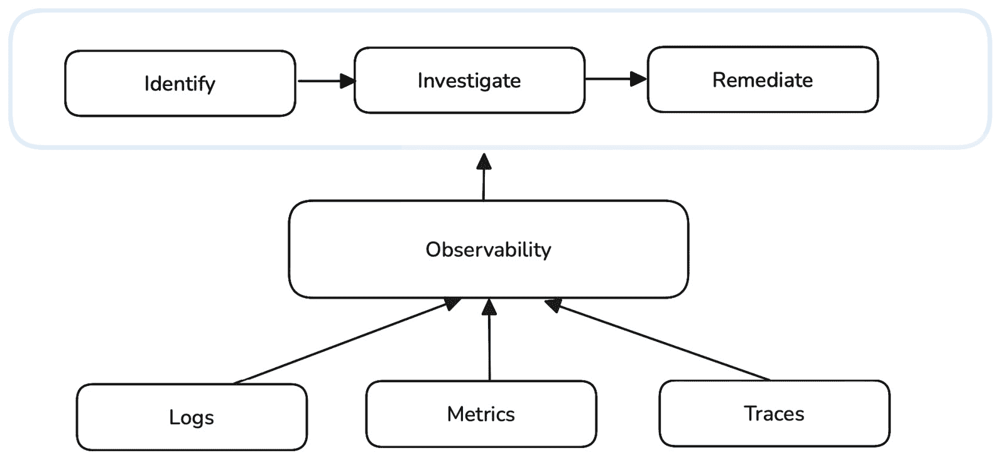

图 12.1 – 可观察性框架

## 日志

**系统日志** 包括诸如事务、系统错误和用户操作等事件。K8s 在不同层级生成日志，如容器日志、节点日志和集群级别日志。你可以使用以下命令查看 Pod 的日志：

```

$ kubectl logs <pod-name>
```

如果 Pod 中有多个容器，可以使用以下命令观察特定容器的日志：

```

$ kubectl logs <pod-name> -c <container-name>
```

默认情况下，K8s 中的日志是临时的，Pod 重启时会丢失。为了持久化日志，可以使用 sidecar 容器或将日志转发到集中存储后端（如 **Amazon CloudWatch Logs**、**Elasticsearch** 或 **Loki**）的日志代理。

K8s 默认不提供集群级别的日志记录。为了实现集群级日志记录，可以使用 Loki 等解决方案，或者使用 **Datadog**、**Splunk**、**Amazon CloudWatch** 和 **New Relic** 等托管服务。

标准日志能提供关于 Pod 级事件和错误的宝贵信息；然而，它们无法涵盖 API 响应的完整跟踪。这时，K8s 审计日志就派上用场了，它提供了更详细的 API 交互视图，主要用于安全性和合规性目的。我们将在下一节中讨论 K8s 审计日志。

### K8s 审计日志

K8s 提供 *审计日志功能*，跟踪所有对 K8s API 服务器的 API 请求。这提供了一个详细的记录，记录了用户、服务账户和控制器执行的操作，帮助进行安全性、合规性和故障排除。

要启用审计日志，请通过添加以下内容修改 K8s API 服务器配置：

```

--audit-log-path=/var/log/kubernetes/kube-apiserver-audit.log
--audit-policy-file=/etc/kubernetes/audit-policy.yaml
```

以下 YAML 示例展示了一个审计策略，它将在不记录请求正文的情况下记录请求元数据：

```

apiVersion: audit.k8s.io/v1
kind: Policy
rules:
  - level: Metadata
```

在托管的 K8s 服务中，如 Amazon EKS，控制平面审计日志可以配置为流式传输到 Amazon CloudWatch 日志。有关如何设置审计日志的说明，请参考[EKS 文档](https://docs.aws.amazon.com/eks/latest/userguide/control-plane-logs.html)。

虽然日志提供了有关离散事件（如错误、系统活动和用户操作）的详细视图，但指标通过捕捉随时间变化的持续性能数据，提供了互补的视角。在下一节中，我们将焦点从基于事件的洞察转向使用指标进行性能监控。

## 指标

指标涉及*时间序列数据*，用于跟踪系统性能指标，如内存使用情况和延迟。在 K8s 中，指标提供有关集群、节点、Pod 和容器的实时性能数据。这些指标有助于监控、扩展和故障排除在 K8s 集群中运行的工作负载。

K8s 中的指标在不同层级进行收集：

+   **节点指标**，例如节点级别的 CPU、内存、磁盘和网络使用情况

+   **Pod 和容器指标**，例如每个 Pod 和容器的资源消耗

+   **集群级指标**，例如集群的整体健康状况和性能

+   **应用层指标**，例如请求延迟和错误率等自定义应用程序指标

在*第六章*中，我们讨论了对于应用程序扩展和最终用户体验至关重要的关键指标。我们涵盖了传统指标，如 CPU 和内存使用情况，也涉及了自定义指标，如队列长度和 HTTP 请求率。Prometheus 是 K8s 环境中常用的收集指标的方式，我们将在后面的部分讨论这一点。

## 跟踪

跟踪提供了一个视觉化表示，展示了单个请求如何在分布式系统中流动，跟踪其与各种服务、API、数据库和组件的交互。在 K8s 中，跟踪有助于跟踪请求如何在不同的服务、容器和节点之间传播。跟踪提供了对请求生命周期的端到端可视化，使开发人员和运维人员能够理解微服务架构中的延迟问题、故障和依赖关系。

在 K8s 中，跟踪至关重要，因为应用程序通常由多个微服务组成，这些微服务通过网络进行通信。与日志和指标不同，日志和指标提供的是系统行为的快照，而跟踪则提供了关于请求流的上下文洞察。

**OpenTelemetry**（**OTel**）([`opentelemetry.io/`](https://opentelemetry.io/))是一个常用的框架，用于收集追踪。一旦收集，OTel 可以将追踪数据导出到**Zipkin**([`zipkin.io/`](https://zipkin.io/))、**Jaeger**([`www.jaegertracing.io/`](https://www.jaegertracing.io/))和**AWS X-Ray**([`aws.amazon.com/xray/`](https://aws.amazon.com/xray/))。我们将在后续章节中详细介绍 OTel。

在本节中，我们探讨了 K8s 中可观测性的基础知识以及三个核心支柱——日志、指标和追踪。在下一节中，我们将探讨 K8s 环境中用于监控 GenAI 工作负载的各种工具。

# K8s 中的监控工具

在 K8s 中实现真正的可观测性需要一种整体的方法，集成日志、指标和追踪。每个支柱都有其独特的优势，适用于特定的使用场景。通过采用最佳实践来结合日志、指标和追踪，可以优化监控策略，提高系统的可靠性和弹性，最终增强用户体验。

以下是可观测性的示例堆栈，如*图 12.2*所示：

+   **Fluentd 和 Fluent Bit**收集来自 Kubernetes 节点、Pods 和应用程序的日志，并将其转发到 Amazon CloudWatch/Loki/OpenSearch 进行存储。

+   **OTel**收集追踪和特定应用程序的指标，并将其导出到 Prometheus（用于指标）和 Jaeger/AWS X-Ray/Zipkin（用于追踪）。

+   **Grafana**提供了一个单一的界面，用于可视化日志（来自 Loki）、指标（来自 Prometheus）和追踪（来自 AWS X-Ray）。开发人员和运维人员使用 Grafana 仪表板来分析性能、调试问题，并根据日志、指标和追踪设置告警。

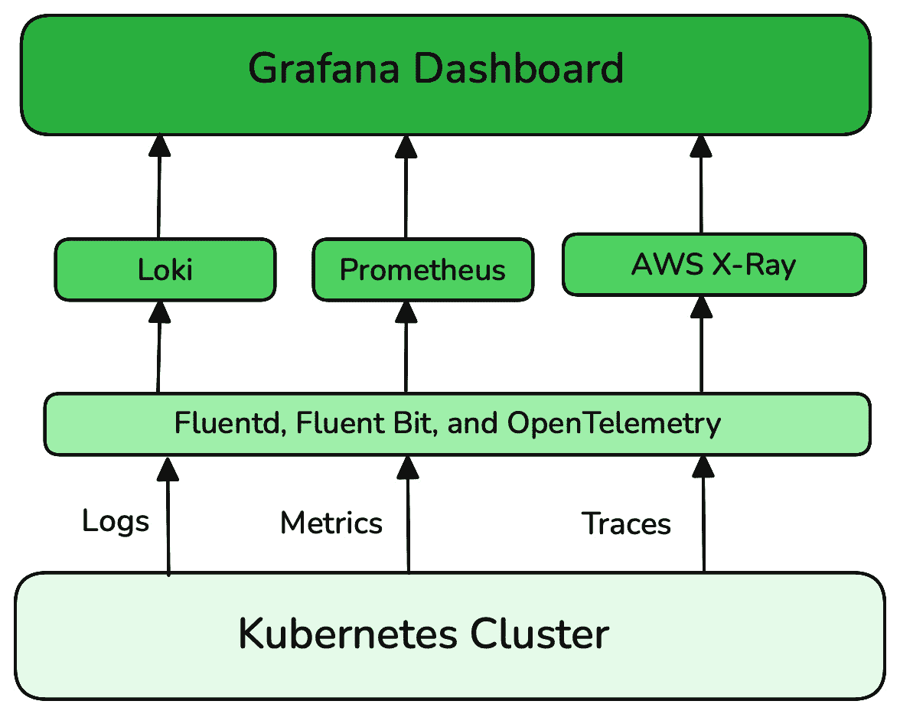

图 12.2 – K8s 中的可观测性堆栈

我们将在接下来的章节中讨论这些工具。

## Fluentd 和 Fluent Bit

`/var/log/containers`、K8s API 服务器事件和系统日志。然后，它会解析、过滤并将这些日志路由到 Elasticsearch、Loki、Splunk、Amazon S3 和云端日志解决方案（如 Amazon CloudWatch）等目的地。

Fluentd 通过基于插件的架构高度可配置。提供 100 多个插件，支持不同的日志格式和后端（[`www.fluentd.org/plugins`](https://www.fluentd.org/plugins)）。它采用结构化日志方式，使日志以 JSON 格式处理，从而提高可搜索性和索引效率。Fluentd 支持通过附加 K8s 元数据（如命名空间或 Pod/容器名称）来丰富日志，然后再将日志发送到存储系统。它还支持日志过滤、缓冲和压缩，有助于在大规模 K8s 环境中优化资源使用。在 K8s 日志管道中，Fluentd 通常与 Loki（用于高效的日志存储）或 Elasticsearch（用于全文日志搜索）一起使用。

**Fluent Bit** ([`fluentbit.io/`](https://fluentbit.io/)) 是 Fluentd 的轻量级版本，针对低资源环境和边缘计算进行了优化，具有更小的内存占用要求。以下表格提供了 Fluentd 和 Fluent Bit 的高层次对比，突出它们的关键差异和典型使用场景：

| **功能** | **Fluentd** | **Fluent Bit** |
| --- | --- | --- |
| **资源使用** | 显著的 CPU 和内存使用 | 轻量级；最小的 CPU 和内存使用 |
| **架构** | 使用 Ruby 和 C 编写 | 使用 C 编写 |
| **插件生态系统** | 拥有超过 1,000 个外部插件的大型插件库 | 超过 100 个内置插件 |
| **部署模型** | 作为 K8s DaemonSet 或 Sidecar 部署，支持多个插件 | 作为 K8s DaemonSet 或 Sidecar 部署，支持多个插件 |
| **可扩展性** | 在大规模下需要更多资源 | 在资源受限的环境中非常可扩展 |
| **使用案例** | 容器/服务器 | 嵌入式 Linux/容器/服务器 |

## Loki

**Loki** ([`github.com/grafana/loki`](https://github.com/grafana/loki)) 是一个轻量级、可扩展的日志聚合系统，专为 K8s 环境设计。与传统的日志管理系统（如 Elasticsearch）不同，Loki 只索引元数据（标签），而不是完整的日志内容，使其在大规模部署中更高效、成本更低。Loki 与 Prometheus 和 Grafana 集成，允许用户将日志与指标关联，从而更好地进行故障排查和可观测性分析。

Loki 使用 Fluentd 或 Fluent Bit 等代理从 K8s Pods 收集日志，这些代理作为 DaemonSets 运行，将日志转发到 Loki 进行存储和查询，如 *图 12.3* 所示。这使得开发人员和运维人员能够高效地使用 **日志查询语言**（**LogQL**）([`grafana.com/docs/loki/latest/query/`](https://grafana.com/docs/loki/latest/query/)) 搜索日志，按命名空间、Pod 或容器过滤日志，并在 Grafana 中可视化日志数据。

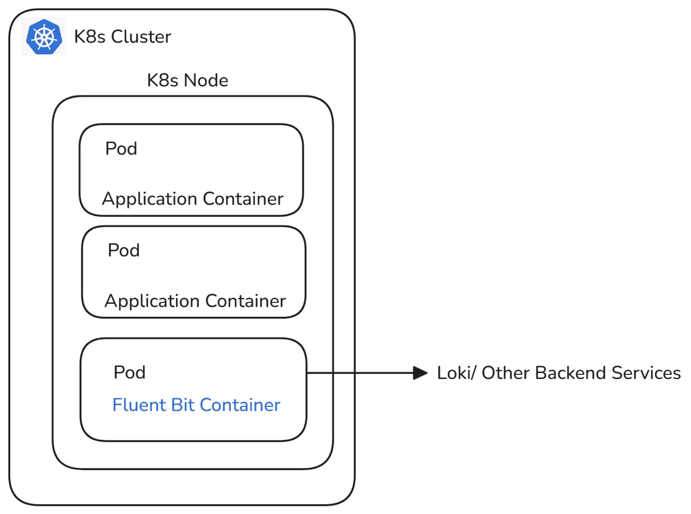

图 12.3 – Fluent Bit/Loki 在 K8s 中的部署

## OpenTelemetry

**OTel** 是一组 API、SDK 和工具，您可以使用它们来检测、生成、收集和导出遥测数据（指标、日志和追踪）。它通常用于收集并导出遥测数据到各种后端服务，如 Prometheus、Jaeger、Datadog 和 AWS X-Ray。

在 K8s 中，OTel 通过收集指标、追踪和日志，实现统一的可观测性，这些数据可以从 Pods、容器或节点中收集。它支持多种后端进行数据存储，并与 Go、Java、Python 和 Node.js 等编程语言的自动化仪表化兼容。有关自动化仪表化的详细步骤，请参考 OTel 文档：[`opentelemetry.io/docs/platforms/kubernetes/operator/automatic/`](https://opentelemetry.io/docs/platforms/kubernetes/operator/automatic/)。

**OTel 收集器** ([`opentelemetry.io/docs/collector/`](https://opentelemetry.io/docs/collector/)) 充当中央代理，接收、处理并导出遥测数据。这些收集器支持三种遥测信号（指标、追踪和日志），使其成为一个强大的统一可观测性解决方案。**OTel 导出器** ([`opentelemetry.io/docs/languages/go/exporters/`](https://opentelemetry.io/docs/languages/go/exporters/)) 用于将收集的数据发送到后端系统，如 Prometheus、Jaeger 和 Datadog。

要在 K8s 中部署 OTel，可以通过使用 Helm 图表安装 OTel 收集器，并配置收集器以定义遥测数据的接收器、处理器和导出器。请访问 [`opentelemetry.io/docs/demo/kubernetes-deployment/`](https://opentelemetry.io/docs/demo/kubernetes-deployment/) 了解 K8s 中的 OTel 部署文档。或者，您也可以使用 AWS 发行版的 OTel 项目——**AWS Distro for OpenTelemetry**（**ADOT**）([`aws-otel.github.io/`](https://aws-otel.github.io/))——以获得一个安全、生产就绪的开源发行版，具备可预测的性能。要在 Amazon EKS 上部署 ADOT，请安装 ADOT 管理的附加组件，并配置收集器将可观测性数据转发到您的首选目标。请参考 [`aws-otel.github.io/docs/getting-started/adot-eks-add-on`](https://aws-otel.github.io/docs/getting-started/adot-eks-add-on) 获取详细的安装说明。

## **Prometheus**

**Prometheus** ([`prometheus.io/`](https://prometheus.io/)) 是一个开源监控和报警工具，旨在收集和查询时间序列指标。它最初由**SoundCloud** ([`soundcloud.com/`](https://soundcloud.com/)) 于 2012 年开发，解决动态和分布式系统的挑战，并于 2016 年作为 K8s 之后的第二个托管项目加入了**Cloud Native Computing Foundation**（**CNCF**）。Prometheus 收集并存储指标作为时间序列数据，其中每个数据点都记录了时间戳和被称为标签的键值对。它在 K8s 环境中被广泛使用，为系统性能和资源利用提供实时洞察。在*第十章*中，我们简要讨论了 Prometheus 代理和适配器；现在我们来深入了解一下。

下图展示了 Prometheus 的高层架构及其生态系统中的一些关键组件：

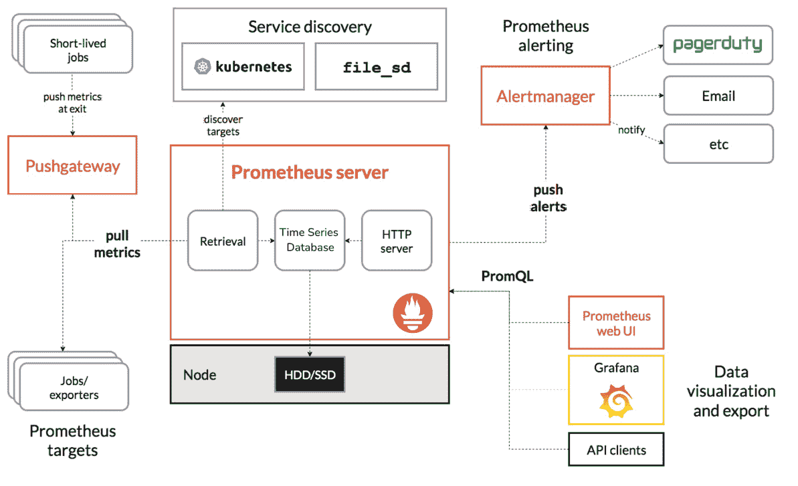

图 12.4 – Prometheus 架构

以下是 Prometheus 架构的关键组件：

+   **Prometheus 服务器** ([`github.com/prometheus/prometheus`](https://github.com/prometheus/prometheus)): Prometheus 服务器是一个核心组件，它从配置的端点（如节点、Pod 或服务）抓取指标，并将这些指标存储在时间序列数据库中，可以通过 **Prometheus 查询语言**（**PromQL**）进行查询。Prometheus 在 K8s 中执行自动目标发现，以简化在动态的容器化环境中的监控。Prometheus 不需要手动指定监控的端点，而是通过 K8s API 动态发现目标，如 Pod、端点和服务。这确保了当工作负载在集群内扩展或迁移时，Prometheus 能自动调整并继续监控，而无需更改配置。

+   **Prometheus 导出器** ([`prometheus.io/docs/instrumenting/exporters/`](https://prometheus.io/docs/instrumenting/exporters/)): Prometheus 导出器是以 Prometheus 格式暴露指标的库。导出器对于将 Prometheus 与本身不原生暴露指标的系统或应用程序集成至关重要。它们充当中介，收集目标系统的数据并通过 HTTP 端点将其暴露出来供 Prometheus 抓取。在 K8s 中，导出器被广泛用于监控集群的各个组件，包括节点、应用程序和外部系统。对于 GenAI 工作负载，导出器尤为关键，用于监控 GPU、推理延迟和资源利用率。**NVIDIA DCGM 导出器**暴露了 GPU 的指标，如利用率、内存使用、温度和功耗，这对监控 GPU 工作负载至关重要。我们在 *第十章* 中的 EKS 集群设置中部署了此附加组件。

+   **Prometheus 警报管理器** ([`prometheus.io/docs/alerting/latest/overview/`](https://prometheus.io/docs/alerting/latest/overview/)): Prometheus 警报管理器处理由 Prometheus 生成的警报，将通知发送到不同的渠道，如 **Slack** ([`slack.com/`](https://slack.com/))、电子邮件或 **PagerDuty** ([`www.pagerduty.com/`](https://www.pagerduty.com/))。它可以配置用于 GenAI 用例，如资源饱和警报或更高的推理延迟。Prometheus 警报管理器支持去重功能，能够整合由多个 Prometheus 实例生成的重复警报，防止通知泛滥，还支持警报归组，将相似的警报归为一个通知，以提高可读性。

+   **Prometheus Pushgateway** ([`prometheus.io/docs/instrumenting/pushing/`](https://prometheus.io/docs/instrumenting/pushing/))：这是 Prometheus 生态系统的一个组件，允许短暂的作业将它们的指标推送到 Prometheus。这对于短暂的工作负载（如无法直接被 Prometheus 抓取的短 GenAI 任务）特别有用。在 K8s 环境中，Pushgateway 充当中间件，允许批处理作业、cron 作业和其他短暂工作负载将指标发布到持久端点。然后，Prometheus 定期从这个端点抓取数据。

+   **PromQL** ([`prometheus.io/docs/prometheus/latest/querying/basics/`](https://prometheus.io/docs/prometheus/latest/querying/basics/))：PromQL 是一种强大而灵活的查询语言，用于提取和分析存储在 Prometheus 生态系统中的时间序列数据，例如 Prometheus 服务器本身或依赖 Prometheus 作为后端的工具（如 Grafana）。它允许用户对指标执行计算、基于标签过滤和聚合，并通过查询推断出洞察。

现在我们已经介绍了 Prometheus stack 的关键组件，让我们讨论如何在 K8s 环境中部署它。

### 部署 Prometheus stack

在 K8s 中，推荐将 Prometheus 服务器部署为 **StatefulSet**。StatefulSet 是一个 K8s 控制器，用于管理需要稳定标识和持久存储的有状态应用程序。与 Deployments 不同，StatefulSets 为每个 Pod 分配一个唯一的、稳定的主机名，并确保存储卷在 Pod 重新启动时保持持久。这确保了依赖于在重新启动或重新调度时保持状态的工作负载的一致性和可靠性。将 Prometheus 服务器部署为 StatefulSet 可以确保其具有用于指标的持久存储访问，使用 **PersistentVolumeClaim** (**PVC**)。

为了简化 K8s 设置，Prometheus 社区开发了 Helm charts 来部署所有必要的组件，可以在 [`github.com/prometheus-community/helm-charts`](https://github.com/prometheus-community/helm-charts) 找到。在我们的设置中，我们将使用 **Terraform Helm provider** 部署 `kube-prometheus-stack`。这个 Helm chart 在我们的 EKS 集群中部署了 Prometheus 和 Grafana 实例，如 *Figure 12**.5* 所示。部署完成后，我们将配置 Prometheus 从集群内各个组件（如 NVIDIA DCGM exporter、Qdrant 向量数据库、Ray Serve 部署等）中抓取指标。Prometheus 会自动发现相关的目标端点，并定期收集指标。通过 Grafana web 控制台，我们可以可视化和查询这些指标，构建和导入交互式仪表板，并定义警报规则。

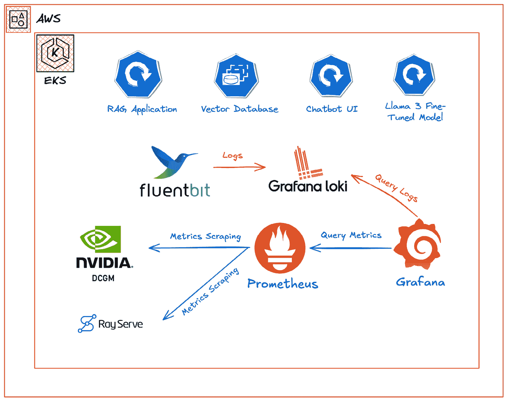

Figure 12.5 – 在 EKS 集群中设置 Prometheus 和 Grafana

要开始使用，下载 GitHub 仓库中的`addons.tf`和`kube-prometheus.yaml`文件，地址为[`github.com/PacktPublishing/Kubernetes-for-Gen-AI-Models/tree/main/ch12/`](https://github.com/PacktPublishing/Kubernetes-for-Gen-AI-Models/tree/main/ch12/)。`kube-prometheus-stack` Helm 图表以及`prometheus-adapter`将被部署到*monitoring*命名空间中，如下代码片段所示：

```

module "eks_blueprints_addons" {
  source = "aws-ia/eks-blueprints-addons/aws"
  ...
  enable_kube_prometheus_stack = true
  kube_prometheus_stack = {
    namespace = "monitoring"
    values = [
      templatefile("${path.module}/kube-prometheus.yaml", {
        storage_class_type = kubernetes_storage_class.default_gp3.id
      })]
  ...
  helm_releases = {
    "prometheus-adapter" = {
      repository = "https://prometheus-community.github.io/helm-charts"
      chart      = "prometheus-adapter"
      namespace = module.eks_blueprints_addons.kube_prometheus_stack.namespace
...
```

Prometheus 设置通过`kube-prometheus.yaml` Helm 值文件进行定制。它执行以下操作：

+   `gp3`存储类

+   将`alertmanager.enabled`值设置为`true`* **Grafana 配置**：

    +   部署 Grafana 并启用默认监控仪表盘

执行以下`terraform`命令，在 EKS 集群中部署`kube-prometheus-stack`和`prometheus-adapter` Helm 图表：

```

$ terraform init
$ terraform plan
$ terraform apply -auto-approve
```

使用以下`kubectl`命令验证安装情况。输出应确认 Prometheus StatefulSet、节点导出 DaemonSet、Grafana、`kube-state-metrics`、`prometheus-adapter`和`prometheus-operator`部署处于**READY**状态：

```

$ kubectl get ds -n monitoring
NAME                                             READY
kube-prometheus-stack-prometheus-node-exporter   6
$ kubectl get deploy -n monitoring
NAME                                       READY
kube-prometheus-stack-grafana              1/1
kube-prometheus-stack-kube-state-metrics   1/1
kube-prometheus-stack-operator             1/1
prometheus-adapter                         1/1
$ kubectl get sts -n monitoring
NAME                                          READY
prometheus-kube-prometheus-stack-prometheus   1/1
```

在更大的环境中，建议为不同的指标分配足够的 CPU 和内存资源，并使用适当的抓取间隔来优化资源使用。例如，对于关键指标如 CPU 或内存利用率，建议使用 10 到 15 秒的间隔，而对于不太关键的指标，间隔可以设置为分钟级别。

在本节中，我们介绍了如何在 EKS 集群中部署 Prometheus 堆栈。然而，要深入了解 GPU 性能（对于 AI/ML 工作负载至关重要），我们需要启用 GPU 的指标抓取。在下一节中，我们将介绍如何通过配置服务监控器将 NVIDIA 的 DCGM 导出器与 Prometheus 集成。

### 启用 GPU 监控

在*第十章*中，我们部署了**NVIDIA DCGM Exporter 插件**，以便获取 GPU 利用率指标。在设置过程中，我们禁用了服务监控器，这些监控器使 Prometheus 能够定期抓取指标。**Prometheus 服务监控器**([`prometheus-operator.dev/docs/developer/getting-started/#using-servicemonitors`](https://prometheus-operator.dev/docs/developer/getting-started/#using-servicemonitors))和**Pod 监控器**([`prometheus-operator.dev/docs/developer/getting-started/#using-podmonitors`](https://prometheus-operator.dev/docs/developer/getting-started/#using-podmonitors))是**自定义资源定义**（**CRDs**），允许 Prometheus Operator 在 K8s 集群中自动发现并配置监控目标。通过在 K8s 服务和 Pod 上使用标签选择器，这些监控器简化了收集指标的过程。

让我们更新 Terraform 代码，以通过服务监视器启用 `dcgm-exporter` 指标的抓取。首先从 GitHub 仓库下载 `aiml-addons.tf` 文件，链接为 [`github.com/PacktPublishing/Kubernetes-for-Generative-AI-Solutions/blob/main/ch12/aiml-addons.tf`](https://github.com/PacktPublishing/Kubernetes-for-Generative-AI-Solutions/blob/main/ch12/aiml-addons.tf)：

```

resource "helm_release" "dcgm_exporter" {
  name       = "dcgm-exporter"
...
  values = [
      <<-EOT
        serviceMonitor:
          terraform commands to update the NVIDIA DCGM exporter Helm chart in the EKS cluster:

```

$ terraform init

$ terraform plan

$ terraform apply -auto-approve

```

			We can verify the scraping status by launching the Prometheus dashboard and checking the scraping target’s health. By default, the Prometheus service is internal and not exposed outside of the cluster, so let’s use the `kubectl port-forward` mechanism to connect to it from the local machine. Run the following command to initiate a port-forward connection from local port `9090` to Prometheus service port `9090` in the `monitoring` namespace:

```

$ kubectl port-forward svc/kube-prometheus-stack-prometheus -n monitoring 9090:9090

正在从 127.0.0.1:9090 转发到 9090

正在从 [::1]:9090 转发到 9090

```

			Now, launch the [`localhost:9090/targets?search=dcgm-exporter`](http://localhost:9090/targets?search=dcgm-exporter) URL in your browser to check the health of the DCGM exporter targets. *Figure 12**.6* shows that all three `dcgm-exporter` endpoints are in the **UP** state, with each corresponding to a GPU worker node in the cluster:

					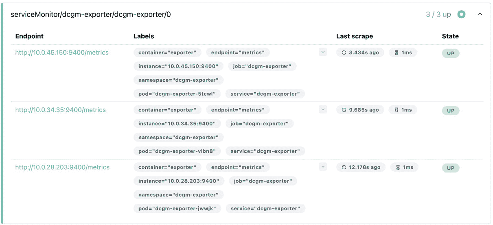

			Figure 12.6 – Prometheus target health status
			Next, we can query the `dcgm-exporter` metrics using PromQL. For example, *Figure 12**.7* shows the average GPU utilization across multiple GPUs over the past minute grouped by the K8s Pod, where `DCGM_FI_DEV_GPU_UTIL` is the metric exposed by `dcgm-exporter`.

					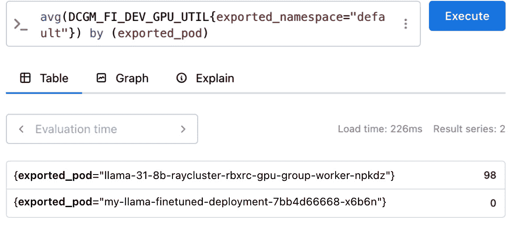

			Figure 12.7 – Querying GPU metrics using PromQL
			Similarly, we will create additional Service Monitors to collect metrics from both the Ray Serve cluster deployed in *Chapter 11* and various e-commerce chatbot application components. You can download the corresponding K8s manifest files from the GitHub repository at [`github.com/PacktPublishing/Kubernetes-for-Generative-AI-Solutions/tree/main/ch12/monitoring`](https://github.com/PacktPublishing/Kubernetes-for-Generative-AI-Solutions/tree/main/ch12/monitoring) and apply each file using the `kubectl apply -f` command to deploy them to the EKS cluster:

```

$ kubectl apply -f <替换为服务监视器文件名>

```

			After applying the files, navigate to the Prometheus dashboard and verify the status of the newly discovered scraping targets. You will notice both `ray-workers` and `ray-head` Pod targets in the dashboard, as shown in *Figure 12**.8*.

					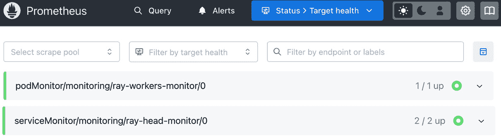

			Figure 12.8 – Prometheus target health status
			In this section, we explored various tools to monitor GenAI applications in K8s, such as Fluentd, Fluent Bit, Loki, OTel, and Prometheus. We also deployed `kube-prometheus-stack` in the EKS cluster and set up the Service/Pod monitors to collect metrics from `dcgm-exporter` and other application components in our EKS cluster. In the next section, we will dive into visualization tools such as Grafana to view these metrics.
			Visualization and debugging
			In this section, we will explore key practices for enhancing the observability of GenAI applications deployed on K8s. We will begin by demonstrating how Grafana can be used to visualize essential metrics such as GPU utilization, system performance, and the status of GenAI applications, to provide real-time operational insights. Additionally, we will dive into debugging strategies for Gen AI workloads by examining tools such as **Langfuse** ([`github.com/langfuse/langfuse`](https://github.com/langfuse/langfuse)), an open source LLM engineering platform designed to aid in debugging and the analysis of LLM applications.
			Grafana
			**Grafana** ([`grafana.com/`](https://grafana.com/)) is an open source visualization and analytics platform widely used for monitoring K8s environments. It provides a centralized interface for querying, visualizing, and alerting on metrics collected from various data sources, such as Prometheus, Amazon CloudWatch, and Azure Monitor.
			Grafana provides prebuilt and customizable dashboards to monitor K8s components such as API servers, etcd databases, nodes, Pods, and namespaces. These dashboards help visualize metrics such as CPU and memory utilization, network activity, and application-specific metrics. Grafana allows users to configure alerts with notifications sent to channels such as Slack, email, PagerDuty, or **Microsoft Teams**. Alerts are typically based on threshold conditions, though you can also implement anomaly detection through custom queries or external integrations.
			Grafana provides the ability to define roles and permissions using **role-based access control** (**RBAC**), allowing fine-grained control over who can view or edit dashboards and alerts. Grafana supports a wide range of community-contributed plugins ([`grafana.com/grafana/plugins/`](https://grafana.com/grafana/plugins/)), custom visualization panels ([`grafana.com/grafana/plugins/panel-plugins/`](https://grafana.com/grafana/plugins/panel-plugins/)), and dashboards ([`grafana.com/grafana/dashboards/`](https://grafana.com/grafana/dashboards/)), enabling users to extend its functionality and adapt it to specific use cases.
			Grafana best practices
			The following lists some Grafana best practices:

				*   Ensure Grafana dashboards and settings persist across Pod restarts by using a **Persistent Volume** (**PV**) and a PVC. This helps maintain the state even when Grafana Pods are rescheduled.
				*   Automate dashboard provisioning using ConfigMaps or **infrastructure as code** (**IaC**) tools, such as Terraform, to maintain consistent observability setups across environments.
				*   Enable robust authentication mechanisms ([`grafana.com/docs/grafana/latest/setup-grafana/configure-security/configure-authentication/`](https://grafana.com/docs/grafana/latest/setup-grafana/configure-security/configure-authentication/)) such as OAuth, SAML, and LDAP, to control user access. Use RBAC to manage user permissions effectively.
				*   When exposing the Grafana dashboard outside the cluster, use an Ingress controller with TLS termination to secure network communications.
				*   Leverage Grafana’s rich plugin ecosystem to integrate with external data sources and specialized visualizations.
				*   Enhance observability by combining metrics, logs, and traces. Integrate Grafana with Loki for centralized K8s logging alongside metrics visualization.
				*   Monitor Grafana’s resource usage and performance within the K8s cluster. This includes setting up alerts for abnormal behavior, which helps maintain optimal performance and availability.
				*   Use managed Grafana offerings such as **Amazon Managed Grafana** ([`aws.amazon.com/grafana/`](https://aws.amazon.com/grafana/)), **Grafana Cloud** ([`grafana.com/products/cloud/`](https://grafana.com/products/cloud/)), and **Azure Managed Grafana** ([`azure.microsoft.com/en-us/products/managed-grafana`](https://azure.microsoft.com/en-us/products/managed-grafana)) to offload operational tasks such as scaling, patching, and security management. This enables us to focus on creating dashboards and analyzing data. These services also provide seamless cloud-native integrations, auto-scaling capabilities, and cost efficiencies.

			Setting up Grafana dashboards
			In our setup, we deployed Grafana as part of the `kube-prometheus-stack` installation earlier in this chapter. Alternatively, Grafana Helm charts can be leveraged to deploy as a standalone option in K8s; refer to [`grafana.com/docs/grafana/latest/setup-grafana/installation/helm/`](https://grafana.com/docs/grafana/latest/setup-grafana/installation/helm/) for step-by-step instructions. By default, the Grafana service is accessible within the cluster unless it is exposed outside via the K8s `LoadBalancer` service type or an Ingress resource. So, let’s use the `kubectl port-forward` mechanism to connect to the Grafana console:

```

$ kubectl port-forward svc/kube-prometheus-stack-grafana -n monitoring 8080:80

正在从 127.0.0.1:8080 转发到 80

正在从 [::1]:8080 转发到 80

```

			Now, open [`localhost:8080/`](http://localhost:8080/) in your browser to access the Grafana console. When prompted for credentials, note that a default admin user is automatically created during the Helm chart installation. You can retrieve the credentials from the K8s secret named `kube-prometheus-stack-grafana` in the `monitoring` namespace by running the following command:

```

$ kubectl get secret kube-prometheus-stack-grafana -n monitoring -o go-template='{{printf "用户名: %s\n 密码: %s\n" (index .data "admin-user" | base64decode) (index .data "admin-password" | base64decode)}}'

```

			Once logged in to the Grafana console, navigate to **Connections** | **Data sources** in the left side menu bar to view and manage the connected data sources. You will notice the local Prometheus server is already added to the data sources, as shown in *Figure 12**.9*.

					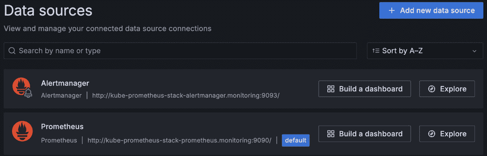

			Figure 12.9 – Grafana connected data sources
			As Grafana has access to Prometheus metrics, let’s start exploring the Grafana dashboards. Navigate to `kube-prometheus-stack` installation, as shown in *Figure 12**.10*.

					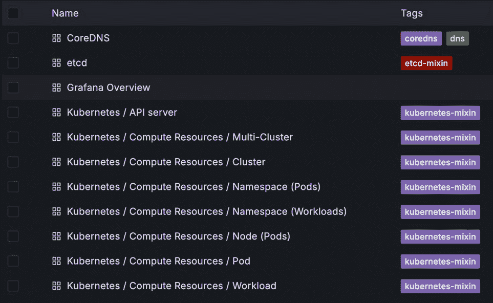

			Figure 12.10 – Grafana dashboards list
			These Grafana dashboards provide preconfigured monitoring views tailored for various K8s components, such as **CoreDNS**, **API server**, **Namespace**, **Pod**, **Workload**, **Node**, **Scheduler**, **Controller Manager**, and **kubelet**. You can select and explore these dashboards to gain insights into the performance, resource usage, and health of the K8s environments. For example, select the **Kubernetes** | **Compute Resources** | **Cluster** dashboard to view an overview of resource utilization, including CPU, memory, and storage metrics across the entire K8s cluster, helping you monitor and optimize cluster performance, as shown in *Figure 12**.11*.

					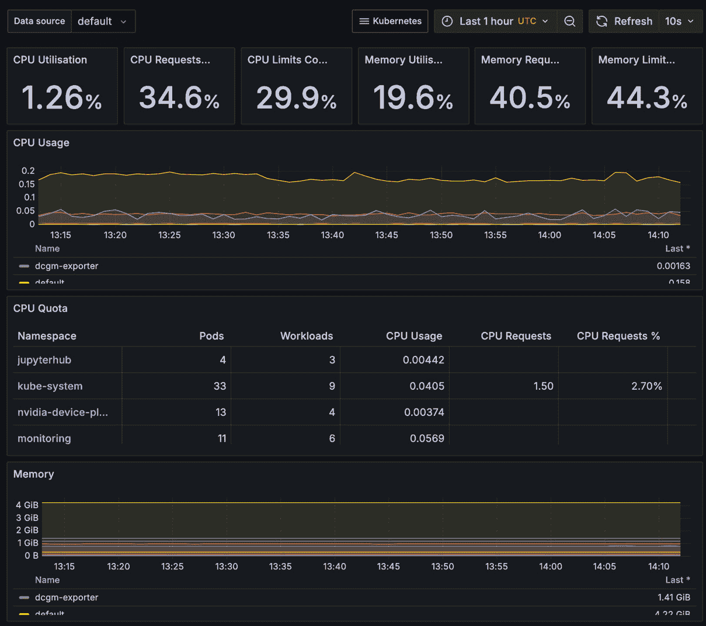

			Figure 12.11 – Kubernetes Compute Resources dashboard
			In this dashboard, we can see the CPU, memory quota, and usage metrics aggregated by each K8s namespace at the cluster level.
			While the default dashboards offer comprehensive insights into core K8s components, you may also need visibility into specialized resources, depending on your workload. Now, let’s take a look at how to visualize GPU metrics using the NVIDIA DCGM exporter dashboard.
			NVIDIA DCGM dashboard
			Earlier in this chapter, we enabled metrics collection from the NVIDIA DCGM exporter add-on using Prometheus Service Monitor resources. Now, we will visualize these metrics using Grafana dashboards. NVIDIA published a Grafana dashboard at [`grafana.com/grafana/dashboards/12239-nvidia-dcgm-exporter-dashboard/`](https://grafana.com/grafana/dashboards/12239-nvidia-dcgm-exporter-dashboard/) to monitor GPU utilization metrics.
			You can import this dashboard to your Grafana instance using the instructions at [`grafana.com/docs/grafana/latest/dashboards/build-dashboards/import-dashboards/`](https://grafana.com/docs/grafana/latest/dashboards/build-dashboards/import-dashboards/). Once the import is successful, you will be able to visualize the GPU metrics, as shown in *Figure 12**.12*.

					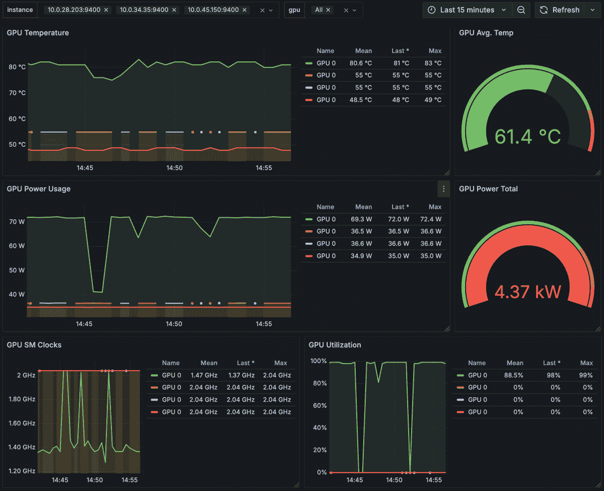

			Figure 12.12 – DCGM exporter Grafana dashboard
			This dashboard provides real-time visibility into key GPU performance metrics such as temperature, power usage, clock speeds, and utilization. With this information, you can quickly identify performance bottlenecks, detect potential issues, and optimize resource usage.
			In addition to dashboards, we can also define Prometheus alerting rules to monitor GPU health and performance. For example, we can create a `gpu-rules.yaml` from our GitHub repository at [`github.com/PacktPublishing/Kubernetes-for-Generative-AI-Solutions/blob/main/ch12/monitoring/gpu-rules.yaml`](https://github.com/PacktPublishing/Kubernetes-for-Generative-AI-Solutions/blob/main/ch12/monitoring/gpu-rules.yaml) and run the following command to configure them in our setup:

```

$ kubectl apply -f gpu-rules.yaml

```

			Once deployed, we can visualize the rules in the Prometheus or Grafana console. In the Grafana console, navigate to **Alerting** | **Alert rules** in the left side menu bar to view the status of the alert rules, as shown in *Figure 12**.13*.

					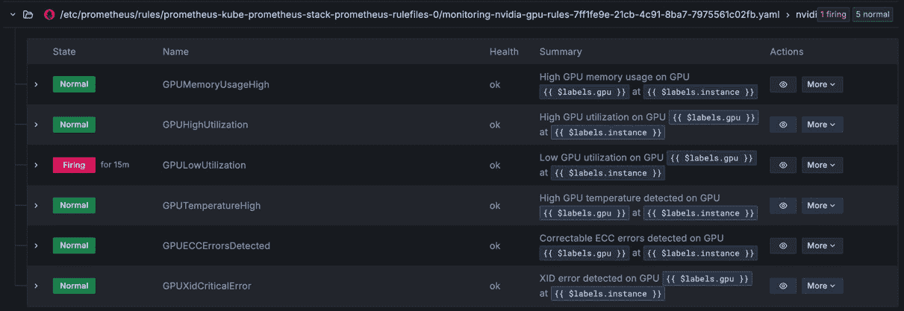

			Figure 12.13 – NVIDIA GPU alert rules in the Grafana console
			As shown in *Figure 12**.13*, one of the GPU alerting rules is in a **Firing** state due to low GPU utilization on one of our worker nodes. To investigate further, we can expand the alert rule to view detailed information such as the worker node, GPU identifier, and the associated K8s Pod, as illustrated in *Figure 12**.14*.

					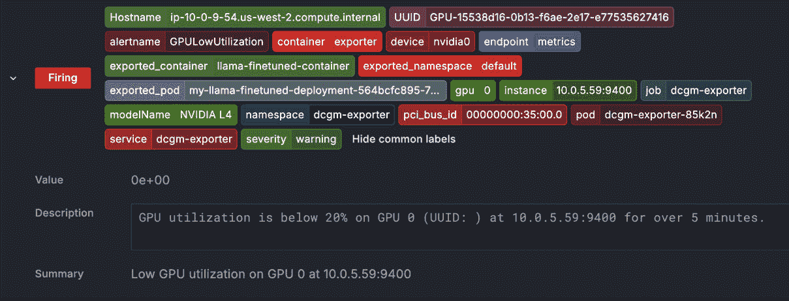

			Figure 12.14 – GPU alert rule details in the Grafana console
			While the DCGM dashboard provides deep visibility into GPU performance, it’s also important to monitor the higher-level services that rely on these resources, especially in GenAI workloads. One such example is Ray Serve, which plays a key role in serving models such as Llama 3 in our deployment. Let’s now set up a dedicated Grafana dashboard to monitor the performance and resource usage of Ray Serve components.
			Ray Serve dashboard
			In *Chapter 11*, we deployed a Ray cluster in our EKS cluster and used the Ray Serve framework to expose the Llama 3 model. Earlier in this chapter, we also created Prometheus Service and Pod Monitor resources to gather metrics from both the Ray cluster and Ray Serve deployments. Now, we will create a `ray-serve-dashboard.json`) from our GitHub repository at [`github.com/PacktPublishing/Kubernetes-for-Generative-AI-Solutions/tree/main/ch12/dashboards`](https://github.com/PacktPublishing/Kubernetes-for-Generative-AI-Solutions/tree/main/ch12/dashboards).
			Open the Grafana console, navigate to the `ray-serve-dashboard.json` file from your local filesystem and click the **Import** button. Once imported, select **Ray Serve Dashboard** from the dashboards list to view real-time information about your Ray Serve deployments, helping you identify bottlenecks and optimize performance, as shown in *Figure 12**.15*.

					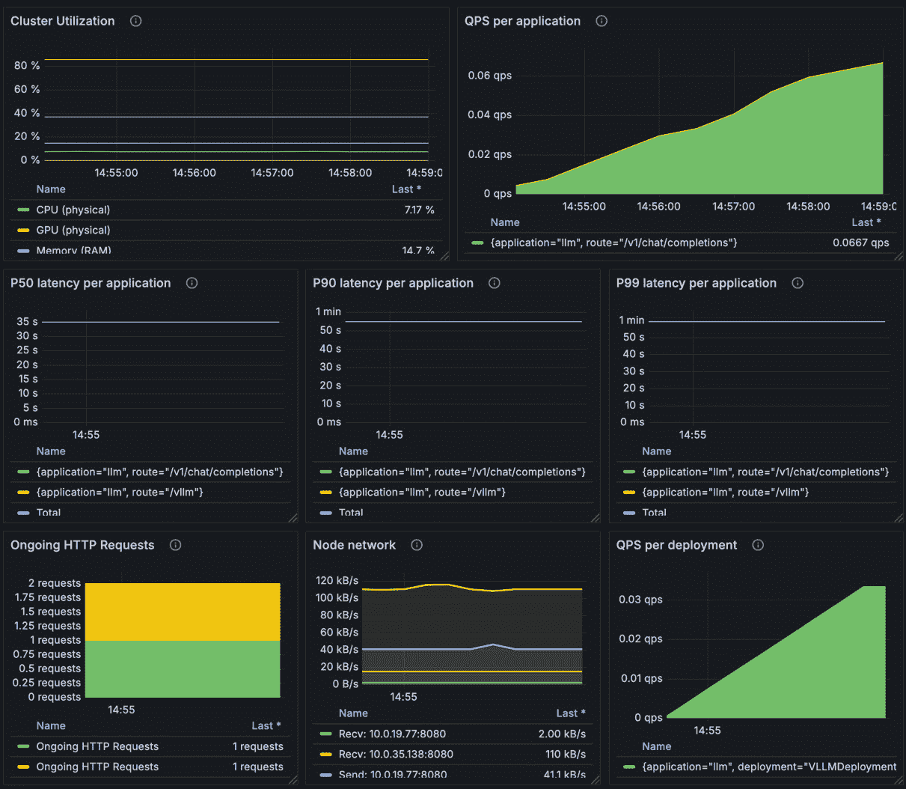

			Figure 12.15 – Ray Serve Grafana dashboard
			Just like GPU alerting rules in the previous section, we can also define Prometheus alerting rules to monitor the health and performance of Ray Serve deployments. For example, we can configure a Prometheus rule to trigger alerts based on conditions such as high error rates, increased latency, Ray worker node failures, response latency spikes, or low throughput. To create these rules, download the `ray-serve-rules.yaml` file from our GitHub repository at [`github.com/PacktPublishing/Kubernetes-for-Generative-AI-Solutions/blob/main/ch12/monitoring/ray-serve-rules.yaml`](https://github.com/PacktPublishing/Kubernetes-for-Generative-AI-Solutions/blob/main/ch12/monitoring/ray-serve-rules.yaml) and run the following command to configure them in our setup:

```

$ kubectl apply -f ray-serve-rules.yaml

```

			Once deployed, we can visualize the rules in the Prometheus or Grafana console. In the Grafana console, navigate to **Alerting** | **Alert rules** in the left side menu bar to view the status of the alert rules, as shown in *Figure 12**.16*.

					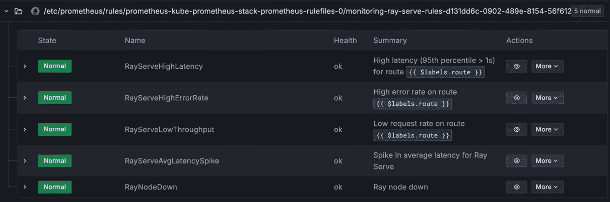

			Figure 12.16 – Ray Serve alert rules in Grafana
			As we have covered the different observability tools for monitoring GenAI workloads in K8s, let’s now explore how to extend these concepts for GenAI frameworks, such as LangChain.
			LangChain observability
			**LangChain** ([`github.com/langchain-ai/langchain`](https://github.com/langchain-ai/langchain)) is a framework for building applications with LLMs, which we covered in *Chapter 4*. It integrates with various tools to enable observability and debugging.
			LangChain provides built-in capabilities to log and trace the execution of chains, agents, and tools. These features allow developers and operators to understand how prompts, responses, and workflows behave during execution. The `verbose=True` in chains, agents, or tools.
			LangChain can integrate with **LangChainTracer** to collect execution data, including steps, timing information, errors, and retries. The tracer can be used via **LangSmith** ([`www.langchain.com/langsmith`](https://www.langchain.com/langsmith)) or deployed as a self-hosted server in K8s.
			The following code snippet defines a custom debugging and observability callback handler for LangChain, which helps track the execution flow of a chain. It logs when a chain starts, when it completes, and the time taken for execution, and handles errors gracefully:

```

import time

from langchain.callbacks.base import BaseCallbackHandler

from langchain.chains import LLMChain

from langchain_openai import OpenAI

from langchain.prompts import PromptTemplate

class DebugCallbackHandler(BaseCallbackHandler):

def __init__(self):

self.start_time = None

def on_chain_start(self, inputs, **kwargs):

"""在链条开始执行时触发。"""

self.start_time = time.time()

print("\n[调试] 链接开始...")

print(f" 输入: {inputs}")

def on_chain_end(self, outputs, **kwargs):

"""在链条成功完成执行时触发。"""

elapsed_time = time.time() - self.start_time

print(f"\n[调试] 链接在 {elapsed_time:.2f} 秒内完成")

print(f"输出: {outputs}")

def on_chain_error(self, error, **kwargs):

print("\n [错误] 链接遇到错误！")

print(f" 错误信息: {error}")

debug_handler = DebugCallbackHandler()

```

			The `DebugCallbackHandler` class extends `BaseCallbackHandler`, making it compatible with LangChain’s callback system. The constructor initializes a `self.start_time` variable, which is used to track the execution duration.
			The `on_chain_error` method is called when an error occurs during chain execution. It prints an error message along with details about the encountered exception.
			This callback handler is useful for debugging and performance monitoring in LangChain applications by providing real-time logs for execution tracking, timing analysis, and error handling.
			While LangChain’s built-in logging and tracing capabilities provide a solid foundation for understanding the internal workings of LLM chains and agents, there are scenarios where more advanced observability tools are needed, especially for production-grade applications. This is where platforms such as LangFuse come into play, offering richer insights, distributed tracing, and powerful dashboards tailored for LLM workflows. Let’s take a closer look at how LangFuse enhances observability for GenAI applications in the next section.
			LangFuse
			**LangFuse** ([`langfuse.com/`](https://langfuse.com/)) is an open source observability and monitoring platform tailored for LLM applications. It provides deep insights into the execution of AI workflows by tracking user interactions, prompts, responses, and application performance. LangFuse supports key observability features such as logging, tracing, metrics collection, and visualization, making it invaluable for debugging and optimizing LLM-based applications.
			LangFuse benefits from K8s-native capabilities such as scalability, auto-healing, and seamless integration with managed services. LangFuse collects and visualizes critical metrics and traces related to prompts, model latency, response accuracy, and system health. It supports distributed tracing, allowing developers to trace user interactions across multiple components, such as API gateways, vector databases, and LLM endpoints, to diagnose performance bottlenecks or errors.
			Key features of LangFuse include the following:

				*   It logs detailed information about requests, including the input prompt, LLM-generated responses, and associated metadata such as token usage and model-specific parameters
				*   It captures the end-to-end lifecycle of interactions, enabling you to monitor every step in workflows, from user input to database queries and LLM outputs
				*   It provides interactive dashboards to visualize system performance, latency trends, error rates, and other **key performance** **indicators** (**KPIs**)
				*   It links errors or delays in AI pipelines to specific users, prompts, or workflows for faster debugging and resolution
				*   It easily integrates with Prometheus, Grafana, OTel, and other K8s monitoring tools to enhance existing observability stacks

			For K8s deployments, LangFuse offers flexibility in deployment configurations, enabling you to run the observability stack alongside your AI workloads. It is compatible with Helm charts, ensuring smooth deployment and configuration in cloud-native environments. Detailed deployment instructions and configurations for K8s and EKS are available in the LangFuse documentation at [`langfuse.com/self-hosting/kubernetes-helm`](https://langfuse.com/self-hosting/kubernetes-helm).
			In this section, we explored various visualization and debugging tools for monitoring GenAI applications in K8s, including Grafana, LangChain, and LangFuse. We deployed Grafana in our EKS cluster and imported prebuilt dashboards to view the key performance metrics of various components, such as the API server, Ray Serve deployments, and so on. Additionally, LangChain and LangFuse provide advanced debugging and observability features for GenAI workloads, enabling you to trace LLM calls, monitor model outputs, and optimize prompt configurations.
			Summary
			In this chapter, we covered key observability concepts for monitoring GenAI applications in K8s. We understood why monitoring is critical for optimizing GenAI workloads, examining both system-level metrics and application-specific signals. We explored a comprehensive monitoring framework using tools such as Prometheus for metrics collection, Grafana for visualization, and LangFuse and LangChain for debugging.
			In K8s, various tools cater to different facets of the observability framework. Prometheus excels at collecting and querying time-series metrics, offering built-in alerting capabilities and seamless integration with K8s. Fluentd and Fluent Bit serve as a unified logging layer, collecting data from diverse sources and routing it to multiple destinations. OpenTelemetry provides a vendor-neutral set of APIs and libraries for generating and processing telemetry data, spanning metrics, logs, and traces.
			Grafana provides an intuitive interface to view and analyze metrics, logs, and traces, making it easy to detect anomalies and investigate performance bottlenecks. LangFuse specializes in detailed logging and observability of LLM-based requests, capturing prompts, responses, and metadata to facilitate faster debugging. LangChain offers a framework for orchestrating and experimenting with LLM workflows, helping us better understand and refine prompt engineering, chaining logic, and model responses.
			In the next chapter, we will explore how to set up high availability and disaster recovery for GenAI applications on K8s.

```
