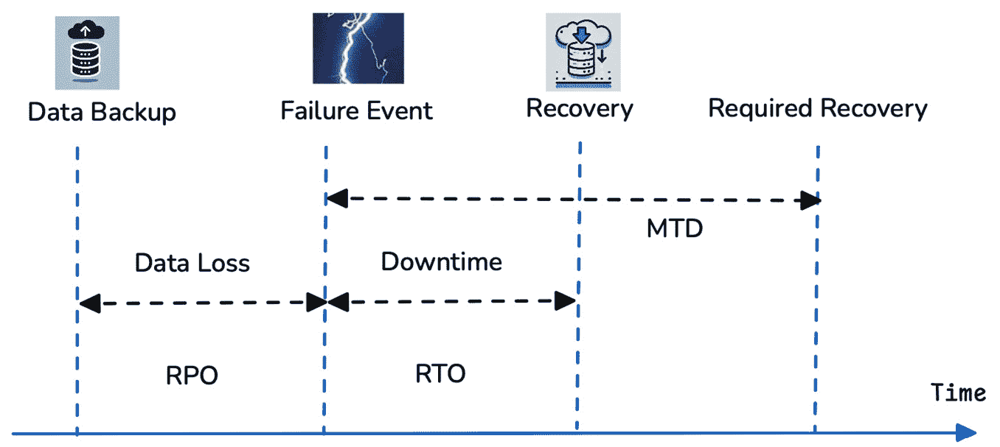
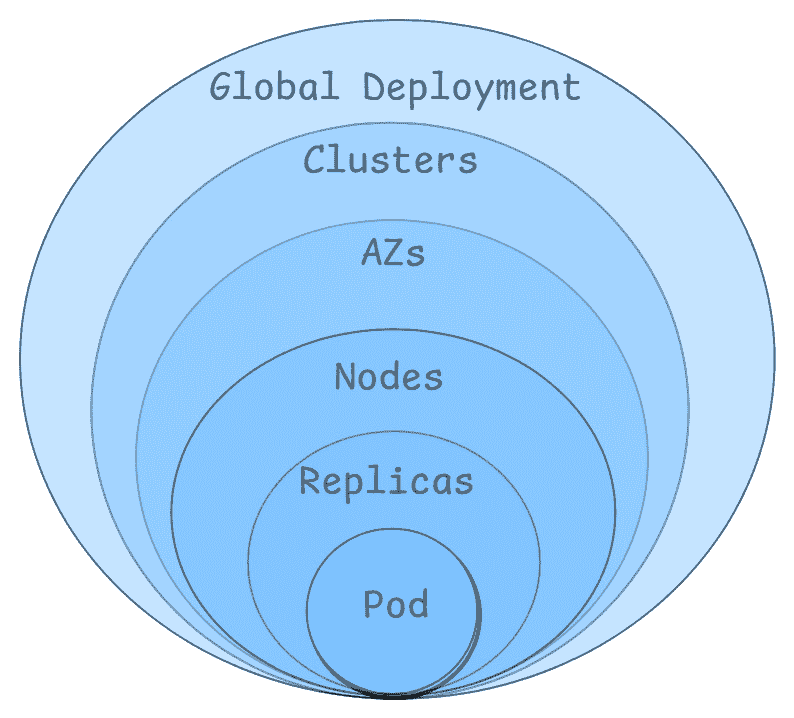
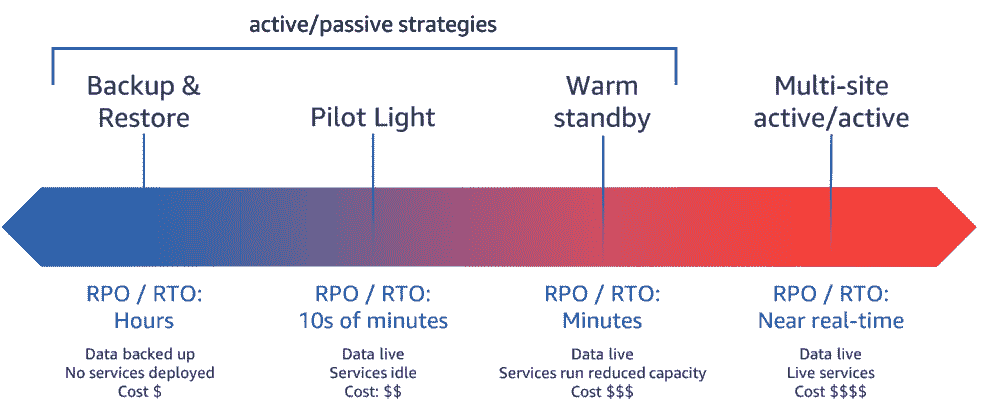

# 13

# GenAI 应用程序的高可用性和灾难恢复

本章将探讨针对部署在**Kubernetes**（**K8s**）集群上的 GenAI 应用程序量身定制的**高可用性**（**HA**）和**灾难恢复**（**DR**）的概念。考虑到 GenAI 应用程序的动态性和资源密集型特性，确保无缝的可扩展性和强大的弹性对高质量的生产部署至关重要。我们将讨论各种架构模式和配置，使 GenAI 工作负载能够根据使用需求自动扩展，同时确保在发生区域性故障等灾难时持续提供服务。

本章将涵盖以下主要内容：

+   HA 和 DR 的设计

+   K8s 中的弹性

+   K8s 中的 DR 策略

# HA 和 DR 的设计

HA ([`docs.aws.amazon.com/whitepapers/latest/disaster-recovery-workloads-on-aws/high-availability-is-not-disaster-recovery.html`](https://docs.aws.amazon.com/whitepapers/latest/disaster-recovery-workloads-on-aws/high-availability-is-not-disaster-recovery.html)) 确保系统在最小的停机时间内保持运行，通过消除单点故障来实现。它依赖于节点、区域或集群之间的*冗余*，并旨在保持持续的服务。HA 通过正常运行时间百分比、故障切换时间和系统冗余来衡量。例如，一个正常运行时间为 99.99%的系统每年只允许约 53 分钟的停机时间。在 GenAI 的背景下，基础模型通常推动着如客户支持、实时文本和图像分析等关键业务操作，停机可能非常昂贵。HA 确保以下几点：

+   推理端点保持一致的响应性，满足业务的可用性需求

+   训练作业可以在节点或服务故障时继续运行，而不会中途崩溃

DR ([`docs.aws.amazon.com/whitepapers/latest/disaster-recovery-workloads-on-aws/disaster-recovery-options-in-the-cloud.html`](https://docs.aws.amazon.com/whitepapers/latest/disaster-recovery-workloads-on-aws/disaster-recovery-options-in-the-cloud.html)) 旨在恢复因硬件故障、网络攻击或自然灾害等灾难性故障导致的服务。它确保数据得到备份，并能够快速恢复，以恢复运营。DR 策略涉及定期的数据备份、冗余以及自动化恢复工作流。与 HA 不同，HA 旨在防止停机，而 DR 则接受一定程度的停机和数据丢失，但确保系统可以高效恢复。

定义 HA 和 DR 的三个关键指标是**恢复点目标**（**RPO**）、**恢复时间目标**（**RTO**）和**最大容忍停机时间**（**MTD**）：

+   RPO（恢复点目标）表示在恢复之前可允许的数据丢失最大量。RPO 为 0 的系统需要实时数据复制以确保没有数据丢失，而 RPO 为数小时的系统可能使用定期备份。RPO 越低，备份机制需要越先进。

+   RTO（恢复时间目标）确定了服务恢复之前可接受的停机时间。低 RTO（以秒或分钟为单位）要求有活动-活动的故障转移，并且冗余系统始终处于待命状态，而较高的 RTO 则允许手动干预并从备份中恢复。

+   MTD（最大容忍停机时间）是指服务不可用的最长时间，超过这个时间会对组织造成不可接受的后果。它定义了停机的阈值，超过该阈值服务可能面临运营或财务挑战。MTD 是**业务连续性计划**（**BCP**）和灾难恢复（DR）策略的关键组成部分。

    *图 13.1* 展示了这些关键指标——RTO、RPO 和 MTD 在数据丢失和系统故障后的停机时间背景下的含义。



图 13.1 – 不同的恢复目标

高可用性应用程序应该能够承受故障，并在部分网络中断或硬件故障的情况下保持持续运行。这要求应用程序没有单点故障，并且工作负载分布在多个独立的故障域中，例如节点、**可用区**（**AZs**）和集群。

各级冗余有助于处理潜在的故障。实现高可用性的 K8s 的关键原则包括：

+   **冗余**：避免应用组件和基础设施中的单点故障。使用 K8s 的 Deployment 或 ReplicaSet 对象部署多个应用副本，可以确保在故障情况下的冗余。

+   **自动扩缩容**：K8s 的**水平 Pod 自动扩缩容**（**HPA**）可以根据需求调整 Pod 副本的数量，确保应用程序能够高效地处理不同的负载。此外，集群自动扩展器（Cluster Autoscaler）和 Karpenter 可以根据 Pod 的调度需求帮助管理工作节点的扩展。

+   **自愈**：使用 K8s Deployment 部署应用程序时，K8s 会自动替换故障的 Pod，保持应用程序的期望状态。

+   **更安全的升级和回滚**：通过采用蓝绿部署和金丝雀部署等应用程序部署策略，您可以确保新版本的应用程序安全地引入。这些策略使得在全面推出之前，可以先在部分用户中测试新版本，从而减少广泛出现问题的风险。

+   **混沌工程**：定期模拟应用程序中的故障，以验证高可用性（HA）设置。根据模拟事件审查并改进运行手册和操作指南。

+   **可观察性**：收集日志、指标和追踪信息，以实时查看基础设施和应用程序的健康状况及性能。配置警报以检测故障的早期迹象，如延迟、错误率等。

在本节中，我们讨论了高可用性（HA）和灾难恢复（DR）对于生成型人工智能（GenAI）应用的重要性，这些应用对停机和性能下降具有独特的敏感性。我们还重点介绍了定义 HA 和 DR 的关键指标，如 RTO、RPO 和 MTD，以及有助于实现 HA 的 K8s 关键原则。

在下一节中，我们将深入探讨这些概念，重点关注 K8s 中的弹性。

## K8s 中的弹性

GenAI 应用是资源密集型的，要求具备容错性和可扩展性，以处理模型训练、大规模推理和实时 AI 工作负载。GenAI 模型通常需要 GPU 来加速推理和训练，因此 GPU 的依赖性和可用性成为部署的关键因素。这些工作负载常常会出现不可预测的资源波动，导致可扩展性挑战，这就需要动态资源配置。此外，数据的可用性和一致性也至关重要，因为大型 AI 模型依赖分布式存储和缓存来确保在多个节点之间保持性能。长时间运行的过程进一步加大了弹性的难度，因为模型训练可能需要几个小时甚至几天。

K8s 为管理 GenAI 工作负载提供了坚实的基础，但要确保弹性，需要在 K8s 的每一层进行专门的配置和最佳实践，如*图 13.2*所示。



图 13.2 – 不同层次的 K8s 弹性

这些层次有助于确保应用保持高可用性，并能从故障中恢复。让我们从 Pod 级别的最内层开始，逐层介绍每个层次：

+   每 10 秒在端口`80`上检查`/healthz`端点；同样，准备性探针被配置为检查`/readyz`端点：

    ```

    apiVersion: apps/v1
    kind: Deployment
    metadata:
      name: my-llama32-deployment
    ...
      terminationGracePeriodSeconds: 60
      containers:
      - name: my-llama32-container
    ...
        resources:
          requests:
            nvidia.com/gpu: 1
          limits:
            nvidia.com/gpu: 1
        livenessProbe:
          httpGet:
            path: /healthz
            port: 80
          initialDelaySeconds: 60
          periodSeconds: 10
        readinessProbe:
          httpGet:
            path: /readyz
            port: 80
          initialDelaySeconds: 60
          periodSeconds: 10
    ```

+   **副本级别**：副本是由 K8s 控制器（如**ReplicaSet**或**Deployment**）管理的 Pod 的完全副本，前面章节已经介绍过。拥有多个副本可以确保即使一个 Pod 失败，其他实例仍然可用来处理请求。对于 AI 模型服务器（如**TensorFlow Serving**或**Triton Inference Server**）来说，确保推理请求在需求增加时仍能满足服务水平协议（SLA）尤为重要。部署应根据工作负载需求和流量需求定义合适数量的副本。HPA（水平自动扩展）可以根据 CPU、内存和 GPU 使用情况动态调整副本数量，在高负载场景下提供灵活性。

    对于推理工作负载，建议在更新或中断期间，使用**PodDisruptionBudget**（[`kubernetes.io/docs/tasks/run-application/configure-pdb/`](https://kubernetes.io/docs/tasks/run-application/configure-pdb/)）保持最小数量的 GenAI 推理/模型服务 Pod 可用，具体操作可以参考以下 K8s 清单：

    ```

    apiVersion: policy/v1
    kind: PodDisruptionBudget
    metadata:
      name: my-llama32-pdb
    spec:
      minAvailable: 2
      selector:
        matchLabels:
          app.kubernetes.io/name: my-llama32
    ```

+   `topologySpreadConstraints` 用于将 Pod 副本分布到多个节点上：

    ```

    ...
    topologySpreadConstraints:
      - labelSelector:
          matchLabels:
             app.kubernetes.io/name: my-llama32
        maxSkew: 1
        topologyKey: kubernetes.io/hostname
        whenUnsatisfiable: ScheduleAnyway
    ```

    在节点级别，K8s 通过健康检查和驱逐策略确保基本的弹性。然而，对于生产级别的 GenAI 工作负载，通常需要额外的保障措施和自动恢复。你可以利用 K8s 的`node-problem-detector`（[`github.com/kubernetes/node-problem-detector`](https://github.com/kubernetes/node-problem-detector)）附加组件，它使集群管理堆栈中的上游层能够看到各种节点问题。它作为**DaemonSet** Pod 在每个工作节点上运行，扫描故障并将其报告给*apiserver*。

    亚马逊 EKS 引入了**节点监控代理**（[`docs.aws.amazon.com/eks/latest/userguide/node-health.html`](https://docs.aws.amazon.com/eks/latest/userguide/node-health.html)）附加组件，自动读取节点日志以检测某些健康问题，并相应地添加*NodeCondition*。这可以与**节点自动修复**（[`docs.aws.amazon.com/eks/latest/userguide/node-health.html#node-auto-repair`](https://docs.aws.amazon.com/eks/latest/userguide/node-health.html#node-auto-repair)）结合使用，该功能监控节点健康，自动响应检测到的问题，并在可能的情况下替换节点。例如，当 GPU 节点上检测到**Xid 错误**（[`docs.nvidia.com/deploy/xid-errors/index.html#topic_5_1`](https://docs.nvidia.com/deploy/xid-errors/index.html#topic_5_1)）时，它会在 10 分钟后自动替换节点并驱逐 Pods，将其重新调度到健康的节点上。Xid 错误是由 NVIDIA GPU 驱动程序生成的错误代码，表示 GPU 遇到了问题，如死机、重置或内存故障。

+   **可用区级别（AZ level）**：可用区（AZ）是云服务商区域内的隔离数据中心。跨多个 AZ 运行工作负载提供了更高的容错性，能够防止数据中心级别的故障。以多 AZ 配置部署的 K8s 集群确保即使整个 AZ 出现故障，应用程序仍然可以在另一个 AZ 中继续运行。你可以利用 K8s 的*topologySpreadConstraints*调度约束，将由 ReplicaSet 或 StatefulSet 管理的 Pod 分布到不同的故障域，如 AZ，以确保对 AZ 问题的防护。结合节点使用，可以提供额外的弹性保护层：

    ```

    ...
    topologySpreadConstraints:
      - labelSelector:
          matchLabels:
             app.kubernetes.io/name: my-llama32
        maxSkew: 1
        topologyKey: topology.kubernetes.io/zone
        whenUnsatisfiable: ScheduleAnyway
      - labelSelector:
          matchLabels:
             app.kubernetes.io/name: my-llama32
        maxSkew: 1
        topologyKey: kubernetes.io/hostname
        whenUnsatisfiable: ScheduleAnyway
    ```

    此外，Amazon EKS 支持 Amazon **应用程序恢复控制器** (**ARC**) 区域迁移和区域自动迁移 ([`aws.amazon.com/application-recovery-controller/`](https://aws.amazon.com/application-recovery-controller/))。ARC 帮助您管理和协调跨可用区（AZ）和 AWS 区域的应用恢复。通过区域迁移，您可以通过触发迁移并将集群内的网络流量重定向到健康的 AZ，暂时缓解问题和事故。为了实现完全自动化体验，您可以授权 AWS 代为管理此迁移，使用区域自动迁移。通过区域自动迁移，您可以配置演练，测试您的集群环境在少一个 AZ 的情况下是否正常运行。请参考 AWS 文档 [`docs.aws.amazon.com/eks/latest/userguide/zone-shift.html`](https://docs.aws.amazon.com/eks/latest/userguide/zone-shift.html)，了解更多有关此功能的信息，并查看启用该功能的步骤。

+   **多集群部署**：多集群架构涉及在多个独立的 K8s 集群中运行工作负载。这种方法对于缓解集群级别的故障非常有用，确保如果一个集群由于控制平面问题或网络中断而失败，另一个集群可以接管工作负载。多集群部署通常用于主动-主动、灾难恢复（DR）和地理分布式应用。您可以利用像**Amazon Route 53** ([`aws.amazon.com/route53/`](https://aws.amazon.com/route53/)) 和 **AWS Global Accelerator** ([`aws.amazon.com/global-accelerator/`](https://aws.amazon.com/global-accelerator/)) 这样的服务来执行健康检查并在多集群环境中路由流量。

+   **全球部署**：在最高层级，通过跨多个地理区域部署工作负载，可以确保即使整个 AWS 区域发生故障，应用程序仍然可用。这种方法不仅增强了灾难恢复能力，还为不同位置的用户提供了低延迟的访问。然而，多区域架构需要仔细管理数据一致性、复制和故障转移流程，以确保在发生区域故障时能够实现无缝恢复。由于 Amazon EKS 是区域性服务，您必须在每个 AWS 区域中配置一个单独的 EKS 集群，以实现真正的全球部署。

这些层次的每一层都为 K8s 中的系统弹性做出了贡献。通过在不同层级实现冗余，组织可以构建高可用、容错的应用程序，这些应用程序能够承受各种类型的故障，从单个 Pod 崩溃到整个区域的停机。

K8s 的其他高可用性和弹性选项包括负载均衡和服务发现：

+   **负载均衡**：K8s 服务提供内置的负载均衡功能，将网络流量分发到多个 Pod 实例。通过定义服务，您可以将运行在一组 Pods 上的应用程序暴露为网络服务，并由 K8s 处理流量分配，确保没有单个 Pod 成为瓶颈。

+   **服务发现**：K8s 提供了服务发现机制，允许应用程序和服务高效地定位并相互通信，即使实例正在创建或终止。通过环境变量或 DNS 实现这一动态发现，使得集群内的服务可以无缝互动。

在本节中，我们讨论了如何在 K8s 环境中的各个层次实现弹性，从单个 Pods 到多可用区（AZ）、多集群和多区域架构。在下一节中，我们将探讨各种灾难恢复策略，以及它们如何应用于 K8s 工作负载。

# K8s 中的灾难恢复策略

灾难恢复（DR）关注的是在自然灾害、安全漏洞和重大系统故障等灾难事件后恢复服务和数据。对于 K8s 来说，一个有效的 DR 计划应当旨在最小化数据丢失（RPO）并减少停机时间（RTO）。

*图 13.3* 突出了 AWS 白皮书中提到的四种不同的云灾难恢复策略：[`docs.aws.amazon.com/whitepapers/latest/disaster-recovery-workloads-on-aws/disaster-recovery-options-in-the-cloud.html`](https://docs.aws.amazon.com/whitepapers/latest/disaster-recovery-workloads-on-aws/disaster-recovery-options-in-the-cloud.html)。

随着我们从备份和恢复转向多站点的主动/主动模式，RPO（恢复点目标）和 RTO（恢复时间目标）从小时缩短到分钟。然而，复杂性、编排和云支出却增加了。

根据业务应用的正常运行时间需求和用例选择灾难恢复策略。



图 13.3 – 灾难恢复策略

让我们从一个高层次的角度来探索在 K8s 环境中架构这些灾难恢复（DR）策略：

+   **备份和恢复**（**RPO/RTO 时间为小时**）：在 K8s 中，备份和恢复策略对于一些可以接受停机的低优先级工作负载至关重要。这种方法涉及定期备份存储在 **PersistentVolumes**（**PVs**）中的数据，以及其他集群资源，如 **ConfigMaps**、**Secrets** 和 **基于角色的访问控制**（**RBAC**）策略。在灾难发生时，所有 K8s 资源必须重新配置，并且备份的数据会被恢复。该方法具有成本效益，但恢复时间较长，因为恢复备份和重新配置集群可能需要几个小时。尽管这种方法对于非关键应用程序是可行的，但它无法满足生产工作负载对高可用性的需求。

    开源工具如**Velero** ([`velero.io/`](https://velero.io/))，以及商业解决方案如**Trilio for Kubernetes** ([`trilio.io/products/kubernetes-backup-and-recovery/`](https://trilio.io/products/kubernetes-backup-and-recovery/)) 和**Portworx Backup** ([`portworx.com/kubernetes-backup/`](https://portworx.com/kubernetes-backup/))，提供自动化的备份和恢复功能。

    Velero 是一个开源的备份和恢复解决方案，专为 K8s 工作负载设计。它支持云原生环境，包括 AWS、Azure 和 Google Cloud。Velero 允许按需和定期备份 K8s 集群，涵盖 Pods、部署和持久化存储卷。它支持命名空间级别和全集群备份，提供对数据保护的精细控制。Velero 的一大优势是其灾难恢复（DR）和集群迁移能力。其调度功能允许用户通过基于 cron 的调度定义定期备份，确保遵守恢复和数据保留策略。该工具旨在支持多云环境，简化了混合云策略的实施。此外，Velero 支持加密以确保备份存储的安全，并通过 RBAC 强制执行安全最佳实践。

    除了数据外，恢复集群配置、Secrets 和 RBAC 策略同样至关重要。这些配置可以通过相同的工具进行备份，或者通过**基础设施即代码**（**IaC**）或**GitOps** ([`about.gitlab.com/topics/gitops/`](https://about.gitlab.com/topics/gitops/)) 工具进行部署。这使得在发生故障时可以快速恢复 K8s 环境。

+   **Pilot light（RPO/RTO：几分钟）**：Pilot light 策略通过保持关键数据和最小的 K8s 基础设施持续运行，而将大部分服务保持空闲，直到发生灾难。这与备份和恢复相比，可以更快地恢复，因为一些资源已经在运行，无需从头开始部署。持久化存储保持活动状态，确保有状态应用程序保留其关键数据。然而，其他工作负载，如应用服务和网络配置，仅在检测到故障时才会变得活跃。这种方法通过只需持续提供一小部分资源，平衡了成本和恢复速度。像 Velero 这样的工具，支持命名空间级别和集群范围的备份，通过确保关键的 K8s 对象和数据随时可用，从而支持快速扩展需求。

+   **冷备份（RPO/RTO：几分钟）**：冷备份配置确保生产环境的较小规模版本始终运行，将恢复时间缩短到几分钟。这种方法最适合业务关键的应用程序，其中必须将停机时间保持最小化，但维护全面复制环境将成本过高。冷备份集群持续运行，使用工作负载的缩减副本，允许在发生灾难时进行即时故障转移和快速的水平扩展。此外，用于 Kubernetes 的实时数据复制解决方案（如 Portworx 和 Trilio）保持集群之间的持久存储同步，确保数据一致性。与完全主动环境相比，这种方法显著降低了停机时间，同时保持成本效益。

+   **多地点主/活动（RPO/RTO：几乎实时）**：多地点主/活动策略通过在不同区域或云提供商中实时运行多个 K8s 集群，提供了最高级别的弹性。这种设置确保零停机和几乎零数据丢失，非常适合需要连续可用性的关键服务。与其他方法不同，该策略需要完全的冗余，意味着所有工作负载和数据都同时在多个集群中复制和运行。跨区域集群部署和云负载均衡器动态分配流量，即使一个集群发生故障，也能确保无缝运行。诸如**Istio**之类的服务网格解决方案促进集群之间的安全通信，而数据库复制策略保持持久数据同步。尽管这种策略会产生显著的基础设施成本，但对于那些不能承受任何服务中断的组织来说，它提供了最可靠的灾难恢复解决方案。

假设你在 AWS US-EAST-1 地区运行一个 GenAI 应用程序，这是你的主要区域。为了确保高可用性，你在 US-WEST-2 地区维护了一个冷备份集群，具有最小的计算占用。

在 US-EAST-1 发生区域性故障时，以下步骤详细描述了故障转移过程的发生方式：

+   云监控，例如 Amazon Route 53 健康检查和 CloudWatch 警报，检测到 US-EAST-1 地区的服务不可用。应用程序级别的就绪性和存活性探测开始失败，表明服务出现了降级。

+   DNS 故障转移机制，例如**Amazon Route 53 故障转移路由**（[`docs.aws.amazon.com/Route53/latest/DeveloperGuide/routing-policy-failover.html`](https://docs.aws.amazon.com/Route53/latest/DeveloperGuide/routing-policy-failover.html)）策略，自动将流量重定向到 US-WEST-2 备用集群。

+   在备用集群中，HPA/集群自动缩放器触发了扩展事件。GenAI 应用程序的端点和底层工作节点扩展以处理生产负载。

+   备用集群从被动模式切换到活动模式，提供生产流量服务。

+   一旦 US-EAST-1 区域恢复，评估数据完整性并同步任何错过的事务或日志。重新同步后，将 US-WEST-2 区域恢复为待命模式，并在主区域恢复正常操作。

## 额外的 K8s 灾难恢复（DR）考虑事项

在本节中，我们探讨了利用混沌工程自动化灾难恢复、验证系统韧性的重要性，以及实施主动监控以早期检测故障的必要性：

+   **灾难恢复自动化与测试**：自动化灾难恢复流程显著减少了人为错误并加速了恢复时间。使用基础设施即代码（IaC）工具，如 Terraform，确保在发生故障时 K8s 集群能够快速且一致地重新部署。自动故障转移解决方案，如 Amazon Route 53 健康检查，可以检测故障并自动将流量重定向到健康实例。为了验证灾难恢复的准备情况，组织应定期进行灾难恢复测试和演练。

    混沌工程工具包括 **Chaos Mesh**（[`chaos-mesh.org/`](https://chaos-mesh.org/)），一个云原生的开源 K8s 混沌工程平台，允许用户在 K8s 集群内模拟各种故障场景。它支持在多个层级（如 Pod、网络和存储层）进行精细化的混沌实验。它可以注入 Pod 故障、网络中断和节点崩溃到 K8s 部署中。它还支持 **CustomResourceDefinition** (**CRD**) 来声明式地定义混沌实验。

+   **监控与可观测性**：主动的监控和可观测性有助于在问题升级为重大故障之前及时发现。K8s 提供了通过活性和就绪探针进行的内置健康检查，能够重新启动不健康的 Pod，防止故障影响整个系统。日志和度量收集工具，如 Prometheus、Grafana、Fluentd 和 Elasticsearch，使集群性能和系统健康状况的实时可见性成为可能。实现与 PagerDuty 或 Slack 集成的告警系统确保事故触发即时通知，帮助响应团队迅速采取行动，减轻潜在的中断。配置良好的可观测性堆栈对于诊断问题和优化灾难恢复策略至关重要。

# 总结

在本章中，我们介绍了部署在 K8s 上的 GenAI 应用程序的高可用性（HA）和灾难恢复（DR）关键概念。鉴于 GenAI 工作负载对资源的高度依赖，确保在硬件故障和区域性停机事件中具有可扩展性和韧性至关重要。

高可用性（HA）通过在节点、集群和区域之间的冗余消除单点故障，从而最大限度地减少停机时间。K8s 中的主要 HA 策略包括自动扩展、自愈、多集群部署和负载均衡。

DR 专注于在硬件故障、网络攻击和自然灾害等故障发生后恢复服务。关键的 DR 指标包括 RPO、RTO 和 MTD。各种 DR 策略包括备份与恢复（恢复速度慢但具有成本效益）、飞行器灯（保持最小基础设施活跃以便更快恢复）、温备（缩小规模的实时环境，能够快速扩展）和多站点活动/活动部署（完全冗余集群，确保接近零的停机时间）。

此外，混沌工程、自动化、监控和可观察性对于增强 HA 和 DR 至关重要。

在下一章中，我们将介绍与 K8s 相关的其他一些高级 GenAI 主题。
