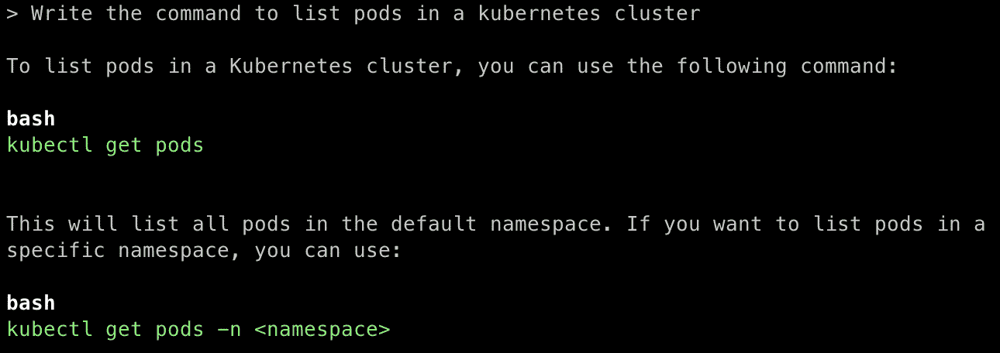
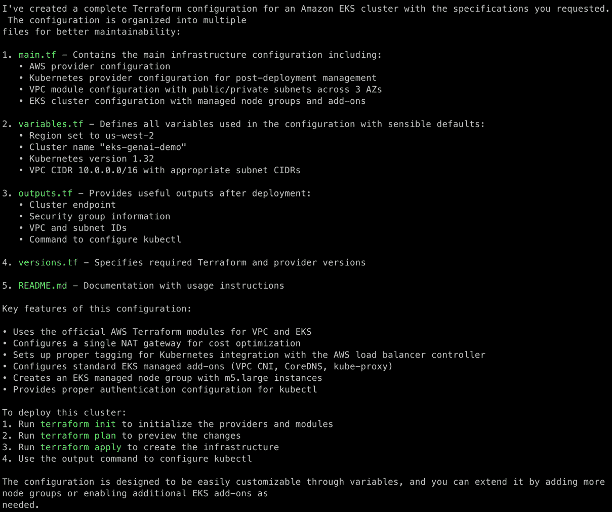
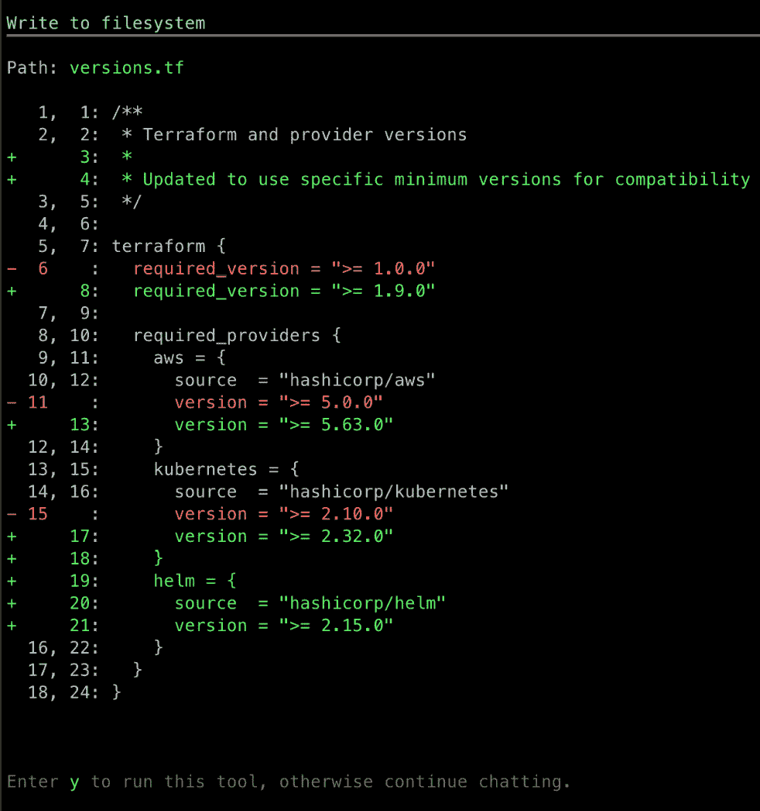
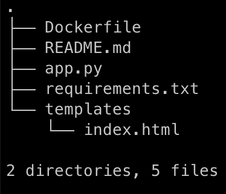
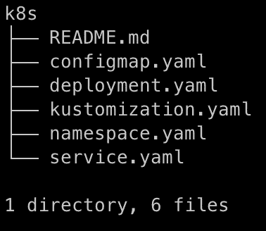

# 14

# 总结：GenAI 编码助手与进一步阅读

在过去的几年中，GenAI 已经取得了显著发展，现在有许多基于 GenAI 的编码助手可以帮助创建、启动和监控 K8s 集群。由于这一领域的快速发展，本章将介绍一些编码助手、发展趋势以及一些有价值的参考资料，供进一步阅读。

在本章中，我们将覆盖以下主要话题：

+   GenAI 驱动的编码助手

+   GenAI 驱动的可观察性和优化

+   亚马逊 Q 开发者通过 Amazon EKS 的操作演示

+   进一步阅读的参考资料

# 技术要求

在本章中，我们将使用以下服务，其中一些需要您设置帐户：

+   AWS ([`signin.aws.amazon.com/signup?request_type=register`](https://signin.aws.amazon.com/signup?request_type=register))

+   Docker Desktop ([`www.docker.com/products/docker-desktop/`](https://www.docker.com/products/docker-desktop/)) 或 `Finch` ([`runfinch.com/`](https://runfinch.com/))

# GenAI 驱动的编码助手

GenAI 驱动的助手正在通过自动化配置文件创建、工作负载扩展和监控来改变 K8s 集群的创建、部署和管理。一些能够帮助管理 K8s 集群的 GenAI 编码助手包括：

+   `Amazon Q Developer` ([`aws.amazon.com/q/developer/`](https://aws.amazon.com/q/developer/)): 这是亚马逊的 GenAI 助手，旨在帮助云端开发，包括在**Amazon Elastic Kubernetes Service** (**EKS**) 上的 K8s 管理。它简化了部署清单的编写，自动化了**基础设施即代码**（**IaC**）以及诊断 K8s 部署中的问题。它还可以通过提供资源分配、自动扩展设置和网络配置的建议来帮助优化集群配置。在本章中，我们将提供一个如何使用 AWS Q Developer 进行 EKS 集群部署的操作演示。我们选择了 Amazon Q Developer 进行演示，因为我们是在 AWS 环境中操作。

+   `GitHub Copilot` ([`github.com/features/copilot`](https://github.com/features/copilot)): 这是一个由 AI 驱动的编码助手，可以集成到 IDE 中，如 Visual Studio Code 和 JetBrains。它可以创建 K8s 部署代码，例如部署清单、Helm charts 和 CI/CD 流水线配置。通过提供内联建议和自动补全，Copilot 可以加速 K8s 自动化并确保遵循最佳实践。

+   `Google Gemini Code Assist` ([`codeassist.google/products/business`](https://codeassist.google/products/business))：这个编码助手可以跨越软件开发生命周期工作。它可以帮助优化 K8s 工作负载和基础设施管理，并提供有关扩展策略、集群健康状况和性能调优的见解。通过利用 AI，Gemini 建议优化成本效率和最小化停机时间的方式，特别是对于 GKE 集群。

+   `Microsoft Copilot in Azure` ([`azure.microsoft.com/en-us/products/copilot`](https://azure.microsoft.com/en-us/products/copilot))：这个工具可以帮助在**Azure Kubernetes Service**（**AKS**）中工作的开发人员。它提供集群扩展、节点池配置和安全策略的建议。Azure AI Copilot 还与 Terraform 和 Bicep 集成，使 DevOps 团队能够高效地自动化 K8s 基础设施的配置。

+   `IBM watsonx Code Assistant` ([`www.ibm.com/products/watsonx-code-assistant`](https://www.ibm.com/products/watsonx-code-assistant))：这个工具对于在混合云环境中使用 OpenShift 和 K8s 的团队特别有用。它自动化应用程序容器化，建议对容器镜像、网络策略和安全加固的优化。它还与 Red Hat OpenShift GitOps 集成，允许通过 AI 驱动的自动化来优化 CI/CD 管道和应用程序部署策略。

+   K8sGPT ([`k8sgpt.ai/`](https://k8sgpt.ai/))：这是一个开源工具，通过利用 GenAI 识别、分析和解释问题，将 AI 驱动的诊断引入 K8s 集群。它可以通过 CLI 在本地运行，或者部署在 K8s 集群中进行持续分析。它支持多种 AI 后端，包括 OpenAI，甚至通过 Ollama 或 LangChain 等工具支持本地 LLM，给团队根据数据隐私需求提供灵活性。它扫描各种 K8s 资源，如 Pods、Services、Deployments 和 Nodes，并检测诸如崩溃循环、配置错误或健康检查失败等问题。与 K8s 的错误信息不同，K8sGPT 可以提供清晰、易懂的解释以及建议的修复步骤，特别有助于开发人员和 SRE 排除复杂环境中的故障。

    例如，K8sGPT 可能会解释，Pod 崩溃是因为缺少所需的密钥或环境变量配置错误，而不是模糊的`CrashLoopBackOff`错误。

在本节中，我们探索了几种由 GenAI 驱动的编码助手，它们帮助软件部署、生成 IaC（基础设施即代码）并调试 K8s 集群。然而，在使用 AI 生成的配置时，例如 Amazon Q Developer 或任何其他 GenAI 助手，手动验证输出并在部署前在预演环境中进行测试是非常必要的。像 `terraform plan`、`docker scan` 和 `kubeval` 这样的工具可以帮助验证语法正确性并突出配置问题。考虑使用政策即代码框架，如 **开放政策代理** (**OPA**)，来自动执行安全标准。

在下一节中，我们将讨论 GenAI 如何改变 K8s 可观测性和优化领域。

# GenAI 驱动的可观测性和优化

除了生成 K8s 清单文件，GenAI 还通过自动化安全、监控和优化来改变 K8s 操作。这些 AI 驱动的解决方案正在使 K8s 环境变得更加高效、具有成本效益且具有自愈能力。以下是一些很好的例子：

+   **AI 驱动的 K8s 自动伸缩**：传统的 K8s 自动伸缩器依赖于 CPU 和内存阈值，但 AI 驱动的自动伸缩器预测工作负载需求并动态调整资源，以优化性能和成本。像 StormForge ([`stormforge.io/`](https://stormforge.io/)) 和 PredictKube ([`dysnix.com/predictkube`](https://dysnix.com/predictkube)) 等工具利用 **机器学习** (**ML**) 来增强自动伸缩策略，防止过度配置，同时确保在流量高峰时保持可用性。

+   **AI 辅助的 K8s 治理和策略执行**：AI 驱动的治理工具在 K8s 集群中执行合规性和安全政策。通过集成基于历史数据和策略违规情况训练的机器学习模型，可以超越静态规则定义。例如，可以分析历史上的策略违规情况并检测出模式，如哪些资源最常受影响以及在什么条件下发生。基于学习到的模式，AI 可以建议新规则，进一步加强访问控制，超越静态规则以执行政策的工具，如 OPA。

+   **GenAI 在 K8s 工作流和可观测性中的应用**：AI 驱动的可观测性工具分析日志、指标和追踪，以便在应用程序受到影响之前识别异常。像 New Relic AI ([`newrelic.com/platform/new-relic-ai`](https://newrelic.com/platform/new-relic-ai)) 和 Dynatrace Davis AI ([`www.dynatrace.com/platform/artificial-intelligence/`](https://www.dynatrace.com/platform/artificial-intelligence/)) 等解决方案可以自动化根本原因分析和警报优先级排序，帮助 DevOps 降低停机时间并提高故障排除效率。带有 AI 模型的 Prometheus 通过筛选掉非关键事件并专注于可操作的洞察来增强智能警报功能。

+   **Envoy AI 网关** ([`aigateway.envoyproxy.io/docs/`](https://aigateway.envoyproxy.io/docs/))：该项目旨在简化将现代应用连接到 GenAI 服务的日益复杂的任务。基于 Envoy Proxy 构建，该项目提供了一个统一的层来管理大规模的 LLM/AI 流量。该项目的主要目标包括为 GenAI 工作负载提供无缝路由和策略控制，支持自动故障转移以确保服务的可用性，通过上游授权确保 AI 流量的安全，并通过灵活的策略框架启用使用限制。Envoy AI 网关的核心目标是使 GenAI 基础设施更易于集成并更安全地运营。要使用 Envoy AI 网关的可观察性功能，用户可以配置 Prometheus 来抓取网关公开的指标，其中包括 AI 特定的见解，如令牌使用情况、首次令牌的时间和每个令牌的延迟。这些指标遵循 OpenTelemetry 的 GenAI 语义约定，旨在提供关于 GenAI 模型在生产环境中表现的可见性。

+   **用于 K8s IaC 的生成性 AI**：AI 驱动的助手通过自动生成 YAML、Terraform 和 Helm 配置，加速了 K8s 基础设施的部署。像 Amazon Q Developer 这样的工具使团队能够用简单的语言描述他们希望的基础设施，并获得优化的配置。

+   **AI 驱动的 K8s 成本优化（FinOps）**：在 K8s 环境中优化云成本具有挑战性，因为工作负载具有动态特性。AI 驱动的 FinOps 解决方案，如 Harness ([`www.harness.io/solutions/finops-excellence`](https://www.harness.io/solutions/finops-excellence)) 和 Cast AI ([`cast.ai/`](https://cast.ai/))，可以分析集群利用率，提出节省成本的措施，并调整资源分配以减少浪费。这些工具帮助组织在保持应用性能的同时优化 K8s 开支。

+   **GenAI 驱动的 K8s ChatOps**：AI 驱动的 ChatOps 工具通过在 Slack 和 Microsoft Teams 等平台中实现对话交互，增强了 K8s 管理。Botkube AI 助手 ([`botkube.io/`](https://botkube.io/)) 允许用户通过聊天查询 K8s 集群并执行命令，而 K8sGPT 则充当 AI 驱动的 K8s SRE，自动诊断和解决集群问题。AI 驱动的自愈机制可以检测故障，重新启动 Pods，并主动修复问题，无需人工干预。

在这一部分，我们探讨了多种 AI 驱动的工具，这些工具可以帮助转型 K8s 环境。这些工具可以用于自动化 K8s 的关键操作，如自动扩缩容、安全性、成本优化和可观察性。在下一部分，我们将演示如何使用 GenAI 助手简化 K8s 应用的开发。

# Amazon Q 开发者与 EKS 的演示

在本节中，我们将探讨如何通过 GenAI 驱动的助手，例如 Amazon Q Developer，简化 GenAI 应用程序的开发，简化 K8s 集群的创建和管理，并简化部署过程。Amazon Q Developer 在 **命令行界面** (**CLI**) 中引入了全新的 *代理体验*，提供动态互动的编码体验。代理体验指的是那些通过理解上下文、提供建议并帮助指导任务完成的系统，积极协助用户。Amazon Q Developer 会根据你的反馈不断优化变更，并利用来自你的 CLI 环境的信息来协助本地文件操作、查询 AWS 资源、编写代码并自动调试问题。

重要提示

在使用 GenAI 驱动的助手进行编码和执行本地任务（如运行命令）时，请始终仔细检查生成的代码和命令。确保它们是安全的，适合你的环境，并且不会无意中影响关键资源或数据。

让我们开始吧：

按照 [`docs.aws.amazon.com/amazonq/latest/qdeveloper-ug/command-line-installing.html`](https://docs.aws.amazon.com/amazonq/latest/qdeveloper-ug/command-line-installing.html) 上的说明安装 *Amazon Q Developer for command line*。

打开终端或命令行应用程序，使用以下命令与 Amazon Q Developer 开始对话：

```

$ q chat
```

你将被引导到 **AWS Builder ID** 登录页面 ([`docs.aws.amazon.com/signin/latest/userguide/sign-in-aws_builder_id.html`](https://docs.aws.amazon.com/signin/latest/userguide/sign-in-aws_builder_id.html))，以便授予 Amazon Q Developer 命令行的权限。

在 CLI 中输入以下查询。Amazon Q Developer 将处理你的输入，考虑提供的上下文，调用 **Amazon Bedrock API**，并以 *图 14.1* 所示的输出响应：



图 14.1 – 使用 Amazon Q Developer 生成 Kubectl 命令

现在，让我们请求 GenAI 助手为创建一个新的 Amazon EKS 集群以及 VPC、私有和公共子网等创建 IaC 模板。在 CLI 中使用以下提示：

```

$ Generate Terraform code for an Amazon EKS cluster with:
- Cluster name "eks-genai-demo" in us-west-2 region using EKS v1.32
- Dedicated VPC (CIDR 10.0.0.0/16) with public/private subnets across 3 AZs
- 1 NAT gateway for internet access from private subnets
- Standard EKS Managed add-ons (Amazon VPC CNI, CoreDNS, kube-proxy)
- Output cluster endpoint and access information
Provide modular, well-commented code with appropriate provider configurations and use open-source terraform modules where possible.
```

几秒钟内，Amazon Q Developer 将生成 Terraform 代码，以创建 Amazon VPC、EKS 集群等，并包含 Terraform 提供程序配置、输入变量和输出，如 *图 14.2* 所示：



图 14.2 – 使用 Amazon Q Developer 生成 Terraform 代码

我们运行了这个提示并将生成的文件上传到 GitHub 仓库，地址为 [`github.com/PacktPublishing/Kubernetes-for-Generative-AI-Solutions/tree/main/ch14/amazon-q-demo`](https://github.com/PacktPublishing/Kubernetes-for-Generative-AI-Solutions/tree/main/ch14/amazon-q-demo)。

基于 GenAI 的编码助手可能使用较旧版本的 Terraform 提供程序或模块，具体取决于其训练数据。在生成的代码中，使用了 `Terraform version >= 1.0.0`、`AWS provider >= 5.0.0` 等等。我们还可以给出后续提示，以使用这些提供程序的特定版本，如下所示：

```

$ Update the previous EKS cluster Terraform code to use the following provider versions:
- Terraform version >= 1.9
- AWS provider >= 5.63
- Helm provider >= 2.15
- Kubernetes provider >= 2.32
Ensure all provider configurations are explicitly defined with these version constraints in the required_providers block, and the code remains compatible with these newer versions.
```

Amazon Q Developer 将解析提示，开始从本地文件系统读取 Terraform 文件，并建议修改，如图 14.3 所示：



图 14.3 – Amazon Q Developer 的输出

你可以查看生成的 Terraform 代码，并通过自然语言提示要求代理进行规划并将其部署到 AWS 账户中。

同样，你可以使用 Amazon Q Developer 自动生成完整的项目代码，从零开始创建，例如一个提供基本功能以管理待办任务的待办事项应用。在空目录中运行以下提示以生成一个待办事项应用：

```

$ Please create a simple TODO application with the following specifications:
Functionality
- Create new tasks with title and description
- Mark tasks as complete/incomplete
- Delete tasks
- View all tasks
Technical Requirements
- Create a single application
- Use in-memory storage for tasks (no need for a database)
- Follow good coding practices with appropriate comments
Docker Requirements
- Create a Dockerfile to containerize the application
- The Dockerfile should follow best practices
- Make it simple to build and run.
```

不久后，Amazon Q Developer 将开始创建分层项目结构、源代码文件、用于容器化的 Dockerfile、文档等。我们执行了这个提示，并在 GitHub 仓库中提供了生成的文件，地址是 [`github.com/PacktPublishing/Kubernetes-for-Generative-AI-Solutions/tree/main/ch14/todo-app`](https://github.com/PacktPublishing/Kubernetes-for-Generative-AI-Solutions/tree/main/ch14/todo-app)。它创建了如图 14.4 所示的项目结构和文件：



图 14.4 – Amazon Q Developer 的输出

审查生成的文件。为了在本地测试应用，我们可以提示 Amazon Q Developer 构建容器镜像并使用 Docker 或 Finch 运行它。使用以下提示构建并运行容器镜像：

```

$ Build and run the container image locally using Docker.
```

在另一个终端中，你可以使用以下命令验证容器镜像和运行中的容器：

```

$ docker images
$ docker ps
```

最后，我们可以更进一步，要求 AI 助手创建必要的 K8s 清单文件并将应用部署到 K8s 集群中。使用以下提示来创建 K8s 部署和服务资源：

```

$ Create necessary manifest files to deploy this application to a kubernetes cluster. Run two replicas of this app and expose it via ClusterIP service.
```

几秒钟内，Amazon Q Developer 将生成 K8s 部署、服务和命名空间清单文件等，用于将待办事项应用部署到 K8s 集群中，如图 14.5 所示：



图 14.5 – Amazon Q Developer 创建的 K8s 清单文件

在本节中，我们探讨了像 Amazon Q Developer 这样的 AI 编码助手如何简化软件开发任务，包括生成 K8s 配置文件和创建 AWS 及 EKS 资源的 IaC 模板。我们使用自然语言提示与这些助手进行交互，指导它们执行各种任务，如构建容器镜像、在本地运行应用程序，并修改生成的代码以满足特定要求。在下一节中，我们将提供关于这个主题进一步阅读的参考资料。

# 进一步阅读的参考资料

+   [`kubernetes.io/docs/`](https://kubernetes.io/docs/): 官方 Kubernetes 文档，始终更新且内容全面

+   [`github.com/kubernetes/kubernetes`](https://github.com/kubernetes/kubernetes): 核心 Kubernetes GitHub 仓库，包含源代码

+   [`training.linuxfoundation.org/certification/`](https://training.linuxfoundation.org/certification/): Linux 基金会与 `Certified Kubernetes Administrator`（CKA）、`Certified Kubernetes Application Developer`（CKAD）和 `Certified Kubernetes Security Specialist`（CKS）合作的认证项目

+   [`kubernetes.io/blog/`](https://kubernetes.io/blog/): 官方博客，更新内容、最佳实践和使用案例

+   [`kubernetes.io/community/`](https://kubernetes.io/community/): 社区中心，用于贡献、SIGs、事件和参与

+   [`www.cncf.io/projects/kubernetes/`](https://www.cncf.io/projects/kubernetes/): CNCF 上关于 K8s 的页面 - 项目状态、治理和整体情况

+   [`github.com/aws-ia/terraform-aws-eks-blueprints`](https://github.com/aws-ia/terraform-aws-eks-blueprints): 使用 Terraform 的官方 EKS 蓝图 - 模块化且适用于生产环境

+   [`awslabs.github.io/data-on-eks/`](https://awslabs.github.io/data-on-eks/): Data on EKS 是一个在 EKS 上构建、部署和扩展数据与 ML 平台的工具

+   [`aws.github.io/aws-eks-best-practices/`](https://aws.github.io/aws-eks-best-practices/): 官方 *Amazon EKS 最佳实践指南*，涵盖安全、网络、扩展性、GitOps 等内容

+   [`wellarchitectedlabs.com/architecture-guides/containers/eks-best-practices/`](https://wellarchitectedlabs.com/architecture-guides/containers/eks-best-practices/): *AWS Well-Architected Labs* 为 EKS 提供的实验室指南和架构审查

# 总结

在本章中，我们讨论了基于 GenAI 的编码助手如何改变构建、部署和监控 K8s 集群的方式。这些工具自动化 IaC，优化工作负载，并增强可观察性。关键的助手包括 Amazon Q Developer、GitHub Copilot、Google Gemini Code Assist、Microsoft Azure Copilot、IBM watsonx Code Assistant 和 K8sGPT。它们支持从编写部署清单和 Terraform 配置到实时诊断和优化集群性能的所有内容。

GenAI 工具还通过 AI 驱动的自动扩缩、异常检测和策略执行来提升可观察性、安全性和成本效益。像 StormForge、PredictKube 和 Dynatrace Davis AI 这样的工具能够自动化根本原因分析和资源扩展，而其他工具，如 Harness 和 Cast AI，则帮助进行 K8s 财务运维（FinOps）。

Amazon Q Developer 提供基于 CLI 的支持，能够通过简单的自然语言提示生成和优化 Terraform 模板、构建 Docker 容器，并部署完整的应用程序。它支持为 EKS 集群创建模块化的基础设施即代码（IaC），并通过智能建议加速迭代过程。

最后，我们提供了一份精选的参考资料列表，供深度学习使用。包括官方的 K8s 文档、GitHub 仓库和提供最佳实践、模式和社区资源的博客。还重点介绍了 Linux 基金会和 CNCF 的认证课程。这些资源为掌握 K8s 和在生产环境中有效使用 GenAI 驱动的工具提供了宝贵的指导。我们希望你喜欢阅读这本书，并期待收到你关于我们如何在未来版本中改进的反馈。

# 在云计算和 DevOps 中保持敏锐——加入超过 44,000 名 CloudPro 订阅者

**CloudPro** 是一份面向云计算专业人员的每周通讯，旨在帮助你紧跟快速发展的云计算、DevOps 和基础设施工程领域的最新动态。

每期内容都聚焦于以下主题的高信号内容：

+   AWS、GCP 和多云架构

+   容器、Kubernetes 和编排

+   使用 Terraform、Pulumi 等进行基础设施即代码（IaC）

+   平台工程与自动化工作流

+   可观察性、性能调优和可靠性最佳实践

无论你是云工程师、SRE、DevOps 从业者，还是平台负责人，CloudPro 都能帮助你专注于重要的事务，避免噪音干扰。

扫描二维码免费加入，获得每周洞察直达你的邮箱：


[`packt.link/cloudpro`](https://packt.link/cloudpro)
