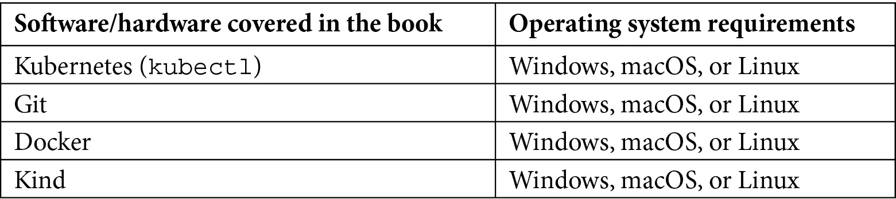

# 前言

Kubernetes 作为分布式计算标准平台的出现，彻底改变了企业应用程序开发的格局。组织和开发人员现在可以轻松地编写和部署具有云原生特点的应用程序，并扩展这些部署以满足他们和用户的需求。然而，随着规模的扩大，复杂性和维护负担也在增加。此外，分布式工作负载的性质使得应用程序暴露于更多的潜在故障点，这些故障可能代价高昂且修复耗时。虽然 Kubernetes 本身是一个强大的平台，但它也存在自身的挑战。

Operator 框架的开发旨在通过定义一个标准流程来自动化 Kubernetes 集群中的运维任务，从而解决这些痛点。Kubernetes 管理员和开发人员现在可以利用一整套 API、库、管理应用程序和命令行工具，快速创建能够自动创建和管理应用程序（甚至是核心集群组件）的控制器。这些控制器被称为 Operators，它们响应 Kubernetes 集群中自然波动的状态，确保任何偏离期望管理静态状态的情况都能得到调整。

本书是一本针对任何对 Operators 感兴趣但不熟悉其使用的 Kubernetes 用户的 Operator 框架入门书，旨在提供设计、构建和使用 Operators 的实际经验。为此，本书不仅仅是一个写 Operator 代码的技术教程（尽管它会逐步讲解如何用 Go 编写一个示例 Operator）。它还包括了无形的设计考虑因素和维护工作流，提供了一种全面的方法，指导你理解 Operator 的使用场景和开发，帮助你构建和维护自己的 Operators。

# 本书适用对象

本书的目标读者是任何考虑使用 Operator 框架进行自己开发的人，包括工程师、项目经理、架构师以及业余开发者。本书内容假设读者对基本的 Kubernetes 概念（如 Pods、ReplicaSets 和 Deployments）有所了解。不过，对于 Operators 或 Operator 框架的先前经验并不要求。

# 本书涵盖的内容

*第一章*，*介绍 Operator 框架*，简要介绍了描述 Operator 框架的基本概念和术语。

*第二章*，*理解 Operators 如何与 Kubernetes 交互*，提供了 Operators 在 Kubernetes 集群中功能的示例描述，包括不仅仅是技术上的交互，还有不同用户交互的描述。

*第三章*，*设计操作符 – CRD、API 和目标对账*，讨论了在设计新操作符时需要考虑的高层次因素。

*第四章*，*使用 Operator SDK 开发操作符*，提供了使用 Operator SDK 工具包创建一个示例操作符项目的技术性讲解。

*第五章*，*开发操作符 – 高级功能*，在上一章的示例操作符项目基础上，添加了更复杂的功能。

*第六章*，*构建和部署你的操作符*，演示了如何手动编译和安装一个操作符到 Kubernetes 集群中。

*第七章*，*使用操作符生命周期管理器安装和运行操作符*，介绍了操作符生命周期管理器，帮助自动化操作符在集群中的部署。

*第八章*，*为操作符的持续维护做准备*，提供了促进操作符项目积极维护的考虑因素，包括如何发布新版本和与上游 Kubernetes 发布标准对齐。

*第九章*，*深入探讨常见问题与未来趋势*，提供了前几章内容的精炼总结，分解为小的 FAQ 风格的部分。

*第十章*，*可选操作符案例研究 – Prometheus 操作符*，提供了操作符框架概念在实际操作符管理应用程序中的应用示范。

*第十一章*，*核心操作符案例研究 – Etcd 操作符*，提供了操作符框架概念在核心集群组件管理中的应用实例。

# 为了充分利用本书

假设你至少对基本的 Kubernetes 概念和术语有一定的基础理解，因为操作符框架在很大程度上基于这些概念来实现其目的。包括基本的应用程序部署以及使用命令行工具如`kubectl`与 Kubernetes 集群交互的熟悉度。虽然不一定需要直接的实践经验，但有这些背景会有所帮助。



此外，完成本书中的所有示例任务需要管理员权限来访问 Kubernetes 集群（例如，在*第六章*中，*构建和部署你的 Operator*）。需要 Kubernetes 集群的章节提供了一些创建临时集群和基本设置步骤的选项，但为了集中精力讲解主要内容，这些部分故意不涉及关于集群设置的详细说明。强烈建议为所有示例使用临时集群，以避免意外损害敏感工作负载。

**如果你正在使用本书的数字版本，我们建议你自己输入代码，或者从本书的 GitHub 仓库访问代码（链接在下一节提供）。这样可以帮助你避免由于复制和粘贴代码而导致的潜在错误。**

# 下载示例代码文件

你可以从 GitHub 上下载本书的示例代码文件，链接：[`github.com/PacktPublishing/The-Kubernetes-Operator-Framework-Book`](https://github.com/PacktPublishing/The-Kubernetes-Operator-Framework-Book)。如果代码有更新，将会在 GitHub 仓库中同步更新。

我们还提供其他代码包，来自我们丰富的书籍和视频目录，详情请访问[`github.com/PacktPublishing/`](https://github.com/PacktPublishing/)。快来看看吧！

# 《代码实战》

本书的《代码实战》视频可以在[`bit.ly/3m5dlYa`](https://bit.ly/3m5dlYa)观看。

# 下载彩色图片

我们还提供了一个 PDF 文件，里面包含了本书中使用的截图和图表的彩色图片。你可以在这里下载：[`static.packt-cdn.com/downloads/9781803232850_ColorImages.pdf`](https://static.packt-cdn.com/downloads/9781803232850_ColorImages.pdf)。

# 使用的约定

本书中使用了多种文本约定。

`代码文本`: 表示文本中的代码字、数据库表名、文件夹名称、文件名、文件扩展名、路径名、虚拟 URL、用户输入以及 Twitter 账号。例如：“这需要额外的资源，如 `ClusterRoles` 和 `RoleBindings`，以确保 Prometheus Pod 有权限从集群及其应用程序中抓取度量数据。”

代码块将按以下方式显示：

```
apiVersion: monitoring.coreos.com/v1
```

```
kind: Prometheus
```

```
metadata:
```

```
  name: sample
```

```
spec:
```

```
  replicas: 2
```

当我们希望特别强调代码块的某一部分时，相关的行或项目将以粗体显示：

```
apiVersion: monitoring.coreos.com/v1
```

```
kind: ServiceMonitor
```

```
metadata:
```

```
  name: web-service-monitor
```

```
  labels:
```

```
    app: web
```

```
spec:
```

```
  selector:
```

```
    matchLabels:
```

```
      serviceLabel: webapp
```

任何命令行输入或输出将按以下方式书写：

```
$ export BUNDLE_IMG=docker.io/sample/nginx-bundle:v0.0.2
$ make bundle-build bundle-push
$ operator-sdk run bundle docker.io/same/nginx-bundle:v0.0.2
```

**粗体**：表示一个新术语、重要的词语或你在屏幕上看到的词语。例如，菜单或对话框中的文字会以**粗体**显示。示例：“点击**Grafana Operator**图块会打开该特定 Operator 的信息页面。”

提示或重要说明

以这种方式显示。

# 联系我们

我们始终欢迎读者的反馈。

**一般反馈**：如果您对本书的任何方面有疑问，请通过电子邮件联系我们：customercare@packtpub.com，并在邮件主题中注明书名。

**勘误表**：尽管我们已尽一切努力确保内容的准确性，但错误难免发生。如果您在本书中发现了错误，我们将非常感激您向我们报告。请访问[www.packtpub.com/support/errata](http://www.packtpub.com/support/errata)并填写表格。

**盗版**：如果您在互联网上发现任何形式的我们作品的非法复制品，我们将非常感激您提供该位置地址或网站名称。请通过 copyright@packt.com 与我们联系，并附上相关资料的链接。

**如果您有兴趣成为作者**：如果您在某个主题领域具有专业知识，并且有兴趣撰写或参与编写书籍，请访问[authors.packtpub.com](http://authors.packtpub.com)。

# 分享您的想法

阅读完*《Kubernetes 操作框架书》*后，我们非常期待听到您的想法！请[点击这里直接前往亚马逊评论页面](https://packt.link/r/1803232854)并分享您的反馈。

您的评价对我们和技术社区都非常重要，能够帮助我们确保提供优质的内容。
