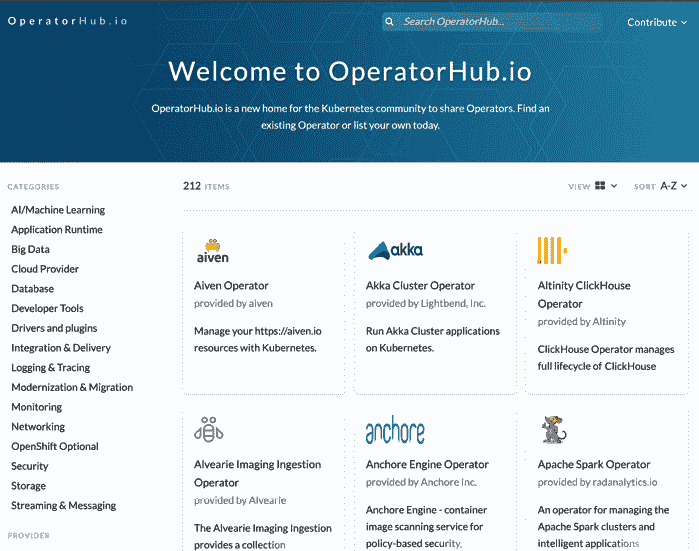

# *第一章*：介绍操作符框架

管理 Kubernetes 集群很难。这部分是因为任何微服务架构本质上都基于许多小组件的交互，每个组件都有可能成为故障点。当然，这种系统设计也有很多好处，比如由于责任分离，能够优雅地处理错误。然而，诊断和解决这些错误需要大量的工程资源，并且需要对应用程序的设计有深入的了解。这是项目团队迁移到 Kubernetes 平台时的一个主要痛点。

操作符框架被引入 Kubernetes 生态系统，以解决这些问题。本章将介绍一些基本的主题，提供操作符框架的概览。目的是简要介绍操作符框架、它所解决的问题、解决方法以及它为用户提供的工具和模式。通过这些内容，我们可以总结出使用操作符来帮助管理 Kubernetes 集群的目标和好处。以下是这些话题的概述：

+   没有操作符的集群管理

+   介绍操作符框架

+   使用操作符**软件开发工具包**（**SDK**）进行开发

+   使用**操作符生命周期管理器**（**OLM**）管理操作符

+   在`OperatorHub.io`上分发操作符

+   使用能力模型定义操作符功能

+   使用操作符来管理应用

# 技术要求

本章没有任何技术要求，因为我们只会讨论一些通用话题。在后续章节中，我们将深入探讨这些话题，并提供相关的技术前提，帮助你更好地跟随。

本章的《代码实战》视频可以通过以下链接观看：[`bit.ly/3GKJfmE`](https://bit.ly/3GKJfmE)

# 没有操作符的集群管理

Kubernetes 是一个强大的微服务容器编排平台，提供了许多不同的控制器、资源和设计模式，几乎可以覆盖任何用例，并且它在不断发展。因此，设计部署到 Kubernetes 上的应用程序可能非常复杂。

在设计一个使用微服务的应用时，有许多概念需要熟悉。在 Kubernetes 中，这些概念主要是核心平台中包含的本地**应用程序编程接口**（**API**）资源对象。在本书中，我们将假设读者对常见的 Kubernetes 资源及其功能有基本的了解。

这些对象包括 Pods、Replicas、Deployments、Services、Volumes 等。任何基于微服务的云应用在 Kubernetes 上的编排，都依赖于将这些不同的概念整合在一起，形成一个协调一致的整体。这种编排是造成复杂性的原因，许多应用开发者在管理时都会遇到困难。

## 在示例应用中进行演示

以一个简单的 web 应用程序为例，它接受、处理并存储用户输入（如留言板或聊天服务器）。这种应用程序的良好容器化设计应该是，设置一个 Pod 来向用户展示前端界面，另一个后台 Pod 接受用户输入并将其发送到数据库进行存储。

当然，你将需要一个运行数据库软件的 Pod，以及一个由数据库 Pod 挂载的持久卷。这三个 Pods 将通过服务相互通信，并且它们还需要共享一些公共环境变量（例如数据库访问凭证和用于调整不同应用设置的环境变量）。

这里是一个示例应用程序的图示。它包含三个 Pods（前端、后端和数据库），以及一个持久卷：


图 1.1 – 带有三个 Pod 和一个持久卷的简单应用程序图示

这只是一个小例子，但已经可以明显看出，即使是一个简单的应用程序，也很快会涉及多个活动组件之间的繁琐协调。从理论上讲，只要每个独立组件没有发生故障，这些离散的组件就会继续协同工作。但如果应用程序的分布式设计中某个地方发生故障时，该怎么办呢？假设应用程序的有效状态会始终保持不变是非常不明智的。

## 对集群状态变化的反应

集群状态变化的原因有很多。有些可能甚至不被技术上视为故障，但它们仍然是运行中的应用程序必须注意的变化。例如，如果你的数据库访问凭证发生更改，那么该更新需要传递到所有与其交互的 Pods。或者，如果应用程序中有一个新功能，需要巧妙地进行发布，并更新正在运行的工作负载的设置。这需要手动操作（更重要的是，需要时间），以及对应用程序架构的深入理解。

在发生意外故障时，时间和精力变得更加关键。这正是 Operator 框架自动处理的问题。如果构成此应用程序的其中一个 Pod 遇到异常，或者应用程序的性能开始下降，这些场景需要干预。这意味着人工工程师不仅必须了解部署的细节，还必须随时待命以确保系统正常运行。

还有其他组件可以帮助管理员监控应用程序的健康状况和性能，例如指标聚合服务器。然而，这些组件本质上是额外的应用程序，也必须定期监控以确保它们正常工作，因此将它们添加到集群中可能会重新引入手动管理应用程序的相同问题。

# 介绍 Operator Framework

Kubernetes Operators 的概念是在 2016 年由 CoreOS 在一篇博客文章中提出的。CoreOS 创建了他们自己的容器原生 Linux 操作系统，专为云架构的需求进行了优化。2018 年，Red Hat 收购了该公司，虽然 CoreOS 操作系统的官方支持在 2020 年结束，但他们的 Operator Framework 依然蓬勃发展。

Operator 的主要思想是自动化那些通常由人工完成的集群和应用程序管理任务。这个角色可以看作是对支持工程师或 **开发运维** (**DevOps**) 团队的自动化扩展。

即使大多数 Kubernetes 用户从未使用过 Operator Framework，他们也已经熟悉 Operators 的一些设计模式。这是因为 Operators 看起来是一个复杂的话题，但归根结底，它们在功能上与已经默认自动化大多数 Kubernetes 集群的许多核心组件没有太大区别。这些组件被称为控制器，本质上，任何 Operator 都只是一个控制器。

## 探索 Kubernetes 控制器

Kubernetes 本身由许多默认的控制器组成。这些控制器保持集群的期望状态，状态由用户和管理员设置。Deployments、ReplicaSets 和 Endpoints 只是一些由其各自控制器管理的集群资源的例子。每个这些资源都涉及管理员声明期望的集群状态，随后由控制器来维持这个状态。如果出现任何偏差，控制器必须采取行动来解决其控制的内容。

这些控制器通过监控集群的当前状态并将其与期望状态进行比较来工作。一个例子是 ReplicaSet，它指定需要维护一个 Pod 的三个副本。如果其中一个副本失败，ReplicaSet 会迅速识别出当前只有两个副本在运行。然后，它会创建一个新的 Pod 以使集群恢复到稳定状态。

此外，这些核心控制器由 **Kube Controller Manager** 集中管理，后者也是一种控制器。它监控控制器的状态，并在控制器发生故障时尝试从错误中恢复，或者如果无法自动恢复，则报告错误并进行人工干预。因此，也有可能存在管理其他控制器的控制器。

同样，Kubernetes Operators 将操作控制器的开发交给用户。这为管理员提供了灵活性，可以编写一个控制器来管理 Kubernetes 集群或自定义应用程序的任何方面。通过定义更具体的逻辑，开发人员可以将 Kubernetes 的主要优势扩展到自己应用程序的独特需求中。

按照 Operator Framework 的指南编写的 Operator 设计得非常类似于本地控制器。它们通过监控集群的当前状态并采取措施将其与期望状态调和来实现这一点。具体来说，Operator 是为特定的工作负载或组件量身定制的。然后，Operator 知道如何与该组件以不同的方式进行交互。

## 了解 Operator 的关键术语

由 Operator 管理的组件是其**操作数**。操作数是任何由 Operator 调和状态的应用程序或工作负载。Operator 可以管理多个操作数，但大多数 Operator 管理的操作数—通常最多只有一个。关键的区别是，Operator 存在的目的是管理操作数，其中 Operator 是系统架构设计中的元应用。

操作数几乎可以是任何类型的工作负载。虽然一些 Operator 管理应用程序部署，但许多 Operator 部署了额外的、可选的集群组件，提供如数据库备份和恢复等元功能。某些 Operator 甚至将核心的本地 Kubernetes 组件作为操作数，例如 `etcd`。因此，Operator 不一定管理你自己的工作负载，它们可以帮助集群的任何部分。

无论 Operator 管理的是什么，它都必须为集群管理员提供一种与之交互并配置其应用程序设置的方式。Operator 通过**自定义资源**暴露其配置选项。

自定义资源作为 API 对象创建，遵循匹配的**CustomResourceDefinition**（**CRD**）的约束。CRD 本身是一种本地 Kubernetes 对象，允许用户和管理员将自己的资源对象扩展到 Kubernetes 平台上，超出核心 API 定义的内容。换句话说，虽然 Pod 是 Kubernetes 中内置的本地 API 对象，但 CRD 允许集群管理员定义 *MyOperator* 作为另一个 API 对象，并以与本地对象相同的方式与之交互。

## 将所有内容整合在一起

Operator Framework 力求定义一个完整的 Operator 开发和分发生态系统。这个生态系统由三个支柱组成，涵盖了 Operator 的编码、部署和发布。它们分别是 Operator SDK、OLM 和 OperatorHub。

这三个支柱是使 Operator 框架如此成功的关键因素。它们将框架从仅仅是开发模式转变为一个涵盖整个 Operator 生命周期的循环过程。这有助于支持 Operator 开发者和用户之间的契约，为他们的软件提供一致的行业标准。

Operator 的生命周期始于开发阶段。为了帮助这一过程，Operator SDK 存在以指导开发者创建 Operator 的第一步。从技术上讲，Operator 并不一定要使用 Operator SDK 编写，但 Operator SDK 提供了开发模式，显著减少了启动和维护 Operator 源代码所需的工作量。

虽然编码和开发当然是创建 Operator 的重要部分，但任何项目的时间表并不会在代码编译后结束。Operator 框架社区认识到，项目的一致生态系统必须在初始开发阶段之外提供指导。项目需要一致的安装方法，并且随着软件的演变，需要发布和分发新版本。OLM 和 OperatorHub 帮助用户在他们的集群中安装和管理 Operator，并在社区中分享他们的 Operator。

最后，Operator 框架提供了称为能力模型的 Operator 功能规模。能力模型为开发者提供了一种通过回答可量化问题对其 Operator 的功能能力进行分类的方法。Operator 的分类，连同能力模型，向用户提供了关于他们可以从 Operator 中期待什么的信息。

这三个支柱共同奠定了 Operator 框架的基础，并形成了区分 Operator 概念的设计模式和社区标准。连同能力模型一起，这一标准化框架导致了 Kubernetes 中 Operator 的广泛采用。

到目前为止，我们已经讨论了 Operator 框架核心概念的简要介绍。与没有 Operator 管理的 Kubernetes 应用相比，Operator 框架的支柱解决了应用开发者遇到的问题。对 Operator 框架核心支柱的理解将为我们深入探讨每个支柱奠定基础。

# 使用 Operator SDK 进行开发

Operator 框架的第一个支柱是 Operator SDK。与任何其他软件开发工具包一样，Operator SDK 以代码形式提供打包功能和设计模式。这些包括预定义的 API、抽象化的常见函数、代码生成器和项目搭建工具，以便从头开始轻松启动 Operator 项目。

Operator SDK 主要是用 Go 编写的，但其工具链允许使用 Go 代码、Ansible 或 Helm 编写 Operators。这使得开发人员可以从头开始编写自己的 Operators，通过自己编写 CRD 和调和逻辑，或者根据需求利用 Ansible 和 Helm 提供的自动化部署工具生成他们的 API 和调和逻辑。

开发人员通过 `operator-sdk` 命令行二进制文件与 Operator SDK 进行交互。该二进制文件可以通过 Homebrew 在 Mac 上获取，也可以直接从 Operator Framework 的 GitHub 仓库（[`github.com/operator-framework/operator-sdk`](https://github.com/operator-framework/operator-sdk)）作为发布版本获取，您也可以从源代码编译它。

无论您是计划使用 `operator-sdk init` 和 `operator-sdk create api` 开发一个 Operator，第一条命令会用标准的 Go 代码、依赖项、hack 脚本，甚至为编译项目提供 `Dockerfile` 和 `Makefile`，初始化一个项目的源目录。

为您的 Operator 创建 API 是必需的，以便定义 CRD，供 Operator 部署到 Kubernetes 集群后与之交互。这是因为 CRD 是由 Go 代码编写的 API 类型定义所支持的。CRD 是从这些代码定义生成的，Operator 内置了逻辑来转换 CRD 和 Go 表示的对象之间的关系。实质上，CRD 是用户与 Operators 交互的方式，而 Go 代码是 Operator 理解设置的方式。CRD 还提供了结构化验证模式的好处，用于自动验证输入。

Operator SDK 二进制文件具有标志来指定 API 的名称和版本。然后，它根据最佳实践的标准定义生成 Go 代码和相应的 **YAML Ain't Markup Language**（**YAML**）文件。然而，您可以自由修改 API 的定义，以任何您选择的方式进行修改。

如果我们要为一个应用程序初始化一个基本的 Operator，就像本章开头首次展示的那样，步骤相对简单。它们将如下所示：

```
$ mkdir sample-app
$ cd sample-app/
$ operator-sdk init --domain mysite.com --repo github.com/sample/simple-app
$ operator-sdk create api --group myapp --version v1alpha1 --kind WebApp --resource –controller
$ ls
total 112K
drwxr-xr-x   15 mdame staff  480 Nov 15 17:00 .
drwxr-xr-x+ 270 mdame staff 8.5K Nov 15 16:48 ..
drwx------    3 mdame staff   96 Nov 15 17:00 api
drwxr-xr-x    3 mdame staff   96 Nov 15 17:00 bin
drwx------   10 mdame staff  320 Nov 15 17:00 config
drwx------    4 mdame staff  128 Nov 15 17:00 controllers
drwx------    3 mdame staff   96 Nov 15 16:50 hack
-rw-------    1 mdame staff  129 Nov 15 16:50 .dockerignore
-rw-------    1 mdame staff  367 Nov 15 16:50 .gitignore
-rw-------    1 mdame staff  776 Nov 15 16:50 Dockerfile
-rw-------    1 mdame staff 8.7K Nov 15 16:51 Makefile
-rw-------    1 mdame staff  422 Nov 15 17:00 PROJECT
-rw-------    1 mdame staff  218 Nov 15 17:00 go.mod
-rw-r--r--    1 mdame staff  76K Nov 15 16:51 go.sum
-rw-------    1 mdame staff 3.1K Nov 15 17:00 main.go
```

之后，您将根据选择的方法开发 Operator 的逻辑。如果选择直接编写 Go 代码，首先会修改项目树中的 `*.go` 文件。对于 Ansible 和 Helm 部署，您将开始着手编写项目的 Ansible 角色或 Helm 图表。

最后，Operator SDK 二进制文件提供了一套与 OLM 交互的命令。这些命令包括在运行的集群中安装 OLM 的能力，还可以在 OLM 内安装和管理特定的 Operators。

# 使用 OLM 管理 Operators

OLM 是 Operator Framework 的第二个支柱。它的目的是简化在 Kubernetes 集群中部署和管理 Operators。它是一个在 Kubernetes 集群中运行的组件，提供了几个命令和功能，用于与 Operators 进行交互。

OLM 主要用于操作员的安装和升级——这包括获取和安装操作员的任何依赖项。用户通过操作员 SDK 二进制文件提供的命令、Kubernetes 命令行工具（`kubectl`）和声明式 YAML 与 OLM 进行交互。

要开始使用，OLM 可以通过以下命令在集群中初始化：

```
$ operator-sdk olm install
```

除了安装操作员，OLM 还可以使当前安装的操作员对集群中的用户可见。这为集群用户提供了一个已安装操作员的目录。此外，通过管理集群中所有已知的操作员，OLM 可以监控可能导致集群不稳定的冲突的操作员 API 和设置。

一旦操作员的 Go 代码被编译成镜像，它就可以准备安装到运行 OLM 的集群中。技术上讲，OLM 并不是在任何集群中运行操作员的必需条件。例如，完全可以像部署任何其他基于容器的应用程序一样，在集群中手动部署一个操作员。然而，由于之前提到的优势和安全措施（包括它的安装操作员的能力以及对其他已安装操作员的感知），强烈建议使用 OLM 来管理集群中的操作员。

在开发操作员时，镜像会被编译成一个**包**，这个包通过 OLM 进行安装。这个包由几个 YAML 文件组成，这些文件描述了操作员、其 CRD 和依赖项。OLM 知道如何处理这种标准化格式的包，以便在集群中正确地管理操作员。

编译操作员的代码并进行部署可以通过以下命令来完成。下文代码片段中的第一个命令构建描述操作员的 YAML 清单包。然后，它将这些信息传递给 OLM，以便在你的集群中运行操作员：

```
$ make bundle ...
$ operator-sdk run bundle ...
```

后续章节将详细演示如何使用这些命令以及它们的作用，但总体思路是，这些命令首先将操作员的 Go 代码编译成镜像，并转换为 OLM 能够理解的可部署格式。但 OLM 并不是操作员框架中唯一使用操作员包的部分——很多相同的信息也被 OperatorHub 用来提供关于操作员的信息。

一旦操作员被编译成镜像，OperatorHub 就作为一个平台，用于将这些镜像分享和分发给其他用户。

# 在 OperatorHub.io 上分发操作员

操作员框架的最终核心组件是`OperatorHub.io`。作为一个重要的开源项目，操作员框架生态系统建立在项目的开放共享和分发上。因此，OperatorHub 推动了作为 Kubernetes 概念的操作员的发展。

OperatorHub 是一个由 Kubernetes 社区发布和管理的操作员开源目录。它作为一个自由可用的操作员的中央索引，每个操作员由开发者和组织贡献。你可以在下面的截图中查看 `OperatorHub.io` 首页的概览：



图 1.2 – OperatorHub.io 首页截图，展示了一些最受欢迎的操作员

提交操作员到 OperatorHub 进行索引的过程已经标准化，以确保操作员与 OLM 的一致性和兼容性。新的操作员会通过自动化工具审查，确保符合操作员的标准定义。这个过程主要通过提供 OperatorHub 后端的开源 GitHub 仓库进行处理。然而，OperatorHub 并不提供关于操作员持续维护的任何帮助，这也是为什么操作员开发者需要共享他们自己的开源仓库链接以及用户可以报告错误和贡献代码的联系方式。

准备操作员提交到 OperatorHub 涉及生成其包和相关清单。提交过程主要依赖于操作员的 **集群服务版本** (**CSV**) 文件。CSV 是一个 YAML 文件，提供关于操作员的大部分元数据给 OLM 和 OperatorHub。它包括一般信息，如操作员的名称、版本和关键词。然而，它也定义了安装要求（例如 **基于角色的访问控制** (**RBAC**) 权限）、CRD、API 和操作员拥有的附加集群资源对象。

操作员 CSV 的特定部分包括以下内容：

+   操作员的名称和版本号，以及操作员的描述和以 Base64 编码的图像格式显示的图标

+   操作员的注解

+   操作员维护者的联系信息以及其代码所在的开源仓库

+   操作员应该如何安装到集群中

+   操作员 CRD 的示例配置

+   操作员运行所需的 CRD 和其他资源及依赖项

由于涵盖了大量信息，操作员 CSV 通常非常长，需要一定时间来正确准备。然而，一个定义清晰的 CSV 有助于操作员接触到更广泛的受众。有关操作员 CSV 的详细信息将在后续章节中介绍。

# 使用能力模型定义操作员功能

运维框架定义了一个能力模型 ([`operatorframework.io/operator-capabilities/`](https://operatorframework.io/operator-capabilities/))，该模型根据运维人员的功能和设计对其进行分类。此模型有助于根据运维人员的成熟度将其拆分，同时描述了运维人员与 OLM 的互操作性程度以及用户在使用该运维人员时可以预期的功能。

能力模型分为五个层次，运维人员可以在这些层次中的任何一个级别发布，并随着其成长，随着功能的增加，可能会从一个级别逐渐发展到下一个级别。此外，各个级别是累进的，每个级别通常包括下面所有级别的功能。

运维人员的当前级别是 CSV 的一部分，该级别会在其 OperatorHub 列表中显示。该级别基于一定程度的主观判断标准，并且纯粹是一个信息性指标。

每个级别都有定义其功能的特定功能。这些功能被拆分为 *基础安装*、*无缝升级*、*完整生命周期*、*深度洞察* 和 *自动驾驶*。能力模型的具体级别在这里列出：

1.  **Level I—基础安装**：此级别代表运维人员能力中最基础的部分。在 *Level I* 中，运维人员仅能在集群中安装其 Operand，并向集群管理员报告工作负载的状态。这意味着它可以设置应用程序所需的基本资源，并报告这些资源何时可以供集群使用。

在 *Level I* 中，运维人员还允许对 Operand 进行简单配置。此配置通过运维人员的自定义资源指定。运维人员负责将配置规范与运行中的 Operand 工作负载进行协调。然而，如果 Operand 进入失败状态，无论是由于配置错误还是外部影响，它可能无法作出响应。

回到本章开头的示例 Web 应用程序，对于该应用程序，*Level I* 级别的运维人员只会处理工作负载的基本设置，其他无所涉及。这适用于需要在多个集群上快速设置的简单应用程序，或者是需要用户自行安装并共享的应用程序。

1.  **Level II—无缝升级**：*Level II* 级别的运维人员提供基本安装功能，并增加了关于升级的附加功能。这包括 Operand 的升级以及运维人员本身的升级。

升级是任何应用程序的重要部分。随着错误修复的实现和更多功能的添加，能够平滑地在版本之间过渡有助于确保应用程序的正常运行。处理自身升级的运维人员可以在升级自身时升级其 Operand，或者通过修改运维人员的自定义资源手动升级其 Operand。

为了实现无缝升级，操作员还必须能够升级其操作数的旧版本（这些旧版本可能是因为它们由操作员的早期版本管理）。这种向后兼容性对于升级到新版本和处理回滚至关重要（例如，如果新版本引入了一个显而易见的错误，无法等待修补程序发布）。

我们的示例 Web 应用操作员也可以提供相同的一组功能。这意味着，如果发布了应用程序的新版本，操作员可以处理升级已部署的应用程序实例到新版本。或者，如果对操作员本身进行了更改，则可以管理自己的升级（并且稍后升级应用程序，无论操作员与操作数之间的版本差异如何）。

1.  **III 级—完整生命周期**：*III 级*操作员提供至少一项操作数生命周期管理功能。能够在操作数生命周期内提供管理意味着操作员不仅仅是以*设定并遗忘*的方式被动地操作工作负载。在 III 级，操作员积极地参与操作数的持续功能。

与操作数生命周期管理相关的功能包括以下内容：

+   能够创建和/或恢复操作数的备份。

+   支持更复杂的配置选项和多步骤工作流。

+   **灾难恢复**（**DR**）的故障转移和故障回退机制。当操作员遇到错误（无论是在自身还是在操作数中）时，它需要能够将流程重新路由到备份过程（故障转移）或将系统回滚到最后已知的正常状态（故障回退）。

+   管理集群化操作数的能力，特别是支持向操作数添加或移除成员。操作员应能够考虑多个副本的操作数的法定人数。

+   同样，支持使用只读功能的工作实例扩展操作数。

实现这些功能之一或多个功能的操作员可以被认为至少是 III 级操作员。简单的 Web 应用操作员可以利用其中的一些功能，例如灾难恢复（DR）和扩展。随着用户基础的增长和资源需求的增加，管理员可以指示操作员通过增加副本 Pod 来扩展应用程序，以应对增加的负载。

如果在此过程中某些 Pod 失败，操作员应足够智能，知道将故障转移到另一个 Pod 或完全不同的集群区域。或者，如果发布了一个新的 Web 应用版本，并且该版本引入了意外的错误，操作员可以识别先前的成功版本，并在管理员发现错误时提供将操作数工作负载降级的方式。

1.  **Level IV—深度见解**：虽然之前的级别主要关注操作员与应用工作负载的功能性交互，但 Level IV 强调监控和度量。这意味着操作员能够提供可衡量的见解，展示自身及其 Operand 的状态。

从开发角度来看，见解可能相对于功能和 bug 修复显得不那么重要，但它们对于应用程序的成功至关重要。关于应用程序性能的量化报告可以推动持续开发，并突出需要改进的地方。拥有一个可衡量的系统来推动这些工作，可以科学地证明或反驳哪些变化有实际效果。

操作员最常以度量的形式提供他们的见解。这些度量通常与度量聚合服务器兼容，如 Prometheus。（有趣的是，Red Hat 发布了一个 Prometheus 操作员，它是一个 Level IV 操作员。这个操作员可以在 OperatorHub 上找到，网址是 [`operatorhub.io/operator/prometheus`](https://operatorhub.io/operator/prometheus)。）

然而，操作员也可以通过其他方式提供见解。这些方式包括警报和 Kubernetes 事件。事件是内建的集群资源对象，由 Kubernetes 核心对象和控制器使用。

Level IV 操作员报告的另一个关键见解是操作员和 Operand 的性能。这些见解有助于管理员了解集群的健康状况。

我们的简单 web 应用操作员可以提供关于 Operand 性能的见解。对应用程序的请求会提供有关当前和历史负载的信息。此外，由于操作员此时可以识别失败状态，它可以在应用程序不健康时触发警报。许多警报可能表明存在可靠性问题，从而引起管理员的关注。

1.  **Level V—自动驾驶**：Level V 是针对操作员的最复杂级别。它包括提供最高能力的操作员，除了之前四个级别中的所有功能外，这个级别还具备其他特性。这个级别被称为*自动驾驶*，因为定义它的特性侧重于能够几乎完全自主运行。这些能力包括自动扩展、自动修复、自动调优和异常检测。

自动扩展是操作员根据需求检测需要对应用程序进行扩展或缩减的能力。通过测量当前负载和性能，操作员可以确定是否需要更多或更少的资源来满足当前的使用需求。高级操作员甚至可以根据当前和过去的数据预测扩展的需求。

自动修复操作员可以对报告不健康状态的应用程序做出反应，并努力修正它们（或者至少防止其恶化）。当操作对象报告错误时，操作员应采取反应措施来修复故障。此外，操作员还可以利用当前指标主动防止操作对象进入故障状态。

自动调优意味着操作员可以动态地修改操作对象，以达到最佳性能。这涉及到自动调节操作对象的设置，甚至可能包括将工作负载转移到完全不同、更适合的节点上等复杂操作。

最后，异常检测是操作员识别操作对象中亚优化或异常行为的能力。通过衡量性能，操作员可以了解应用程序当前和历史的功能水平。这些数据可以与手动定义的最低预期进行比较，或者用来动态地通知操作员该预期。

所有这些功能都在很大程度上依赖于使用指标来自动通知操作员需要对其自身或操作对象采取行动。因此，级别 V 操作员是级别 IV 的自然进展，后者是操作员暴露高级指标的层级。

在级别 V，简单的 Web 应用程序操作员将管理应用程序的大多数方面。它可以了解当前的请求数量，因此能够按需扩展应用程序的副本。如果这种扩展开始导致错误（例如，过多的并发数据库调用），它可以识别失败的 Pod 数量，并防止进一步的扩展。它还会尝试修改 Web 应用程序的参数（例如请求超时），以帮助纠正问题并允许自动扩展继续。当负载高峰期过去后，操作员会自动将应用程序缩减到基线服务水平。

级别 I 和 II（*基本安装*和*无缝升级*）可以与操作员 SDK 的三个方面一起使用：Helm、Ansible 和 Go。然而，级别 III 及以上（*全生命周期*、*深度洞察*和*自动驾驶*）仅能通过 Ansible 和 Go 实现。这是因为这些更高层次的功能需要比单独使用 Helm 图表更复杂的逻辑。

现在我们已经解释了操作员框架的三个主要支柱：操作员 SDK、OLM 和 OperatorHub。我们了解了它们如何为操作员的开发和使用提供不同的有益功能。我们还学习了能力模型，它作为操作员可能拥有的不同功能层级的参考。在下一部分，我们将应用这些知识来处理一个示例应用程序。

# 使用操作员来管理应用程序

显然，操作员的工作不仅仅是调和集群状态。操作员框架是一个全面的平台，供 Kubernetes 开发者和用户解决独特问题，这也是 Kubernetes 如此灵活的原因。

集群管理员在操作员框架中的第一步通常是使用操作员 SDK，如果没有现成的操作员能够满足需求，就自己开发一个操作员，或者使用 OperatorHub（如果有合适的操作员）。

## 操作员框架总结

在从零开始开发操作员时，有三种开发方法可供选择：Go、Ansible 或 Helm。然而，单独使用 Ansible 或 Helm 最终会将操作员的功能限制到最基本的水平。

如果开发者希望分享他们的操作员，他们需要将其打包成标准的操作员清单包，以便提交到 OperatorHub。经过审核后，他们的操作员将公开提供，供其他用户下载并安装到自己的集群中。

OLM 使用户在集群中启动操作员变得更加简单。这些操作员可以来自 OperatorHub，也可以从零开始编写。不管哪种方式，OLM 都让操作员的安装、升级和管理变得更加轻松。它还提供了多操作员工作时的多个稳定性优势。你可以通过下面的图示看到三者之间的关系：


图 1.3 – 操作员 SDK、OperatorHub 和 OLM 之间的关系

这些支柱中的每一个都提供了不同的功能，帮助操作员的开发。它们共同构成了操作员框架的基础。利用这些支柱是操作员与普通 Kubernetes 控制器之间的关键区别。总结来说，虽然每个操作员本质上都是一个控制器，但并非每个控制器都是操作员。

## 应用操作员功能

回顾本章中的第一个示例，分析了一个简单应用，包含三个 Pod 和一个持久卷，没有操作员管理。这个应用依赖于乐观的正常运行时间和面向未来的设计，以便持续运行。在实际部署中，这些理念不幸是不可行的。设计会不断演化，变化，无法预见的故障也会导致应用宕机。但操作员如何帮助这个应用在不可预测的环境中持续运行呢？

通过定义单一声明性配置，这个运算符可以在一个位置控制应用程序部署的各种设置。这就是运算符建立在 CRD 上的原因。这些自定义对象使开发人员和用户可以像操作原生 Kubernetes 对象一样轻松地与他们的运算符进行交互。因此，编写一个运算符来管理我们简单的 Web 应用程序的第一步将是定义一个带有我们认为需要的所有设置的 CRD 的基本代码结构。一旦我们完成了这一点，我们应用程序的新图表将如下所示：


图 1.4 – 在新的应用布局中，集群管理员只与运算符进行交互；然后运算符管理工作负载。

这显示了 Operand 部署的细节已经从需要手动管理员控制中抽象出来，CRD 的优点在于随着我们应用程序的增长，可以在后续版本的运算符中添加更多设置。一些初始设置的示例包括：

+   数据库访问信息

+   应用程序行为设置

+   日志级别

编写我们的运算符代码时，我们还希望为诸如指标、错误处理和报告等事务编写逻辑。运算符还可以开始双向与操作数通信。这意味着它不仅可以安装和更新操作数，还可以接收操作数关于其状态的反馈，并进行相应的报告。

# 概要

在本章中，我们介绍了运算符框架的基本概念。这些包括运算符 SDK、OLM 和 OperatorHub。除了运算符框架的开发和分发支柱外，能力模型还提供了衡量运算符功能的额外工具。在本书的整个过程中，我们将深入探讨这些组件，以深入理解它们的实际工作方式。

我们从分析手动管理应用程序和集群时出现的一些问题开始。这是通过一个简单的基于几个 Pod 和持久卷的通用 Web 应用程序的视角来完成的。管理此类应用程序的主要困难包括调试应用程序所需的时间和资源。这在云应用程序中尤为重要，高可用性（HA）和持续的正常运行时间是首要任务。

接下来，我们将看看运算符框架的每个支柱如何解决应用管理的最大困难。这些支柱从运算符 SDK 开始，它简化了运算符的开发。这使得开发人员能够快速开始迭代自动对账逻辑，以快速编写他们的运算符。它还提供了与 OLM 交互的命令，这是框架的下一个支柱。

OLM 的存在是为了帮助管理员在集群中安装和管理操作员。它提供了依赖关系管理，并通知管理员 API 冲突，以促进集群的稳定性。它还充当已安装操作员的本地目录，对于集群中的用户非常有用。

接下来，我们考察了 OperatorHub 及其在更广泛的开源 Kubernetes 社区中的作用。作为一个自由可用操作员的公开索引，OperatorHub 旨在促进操作员的采纳和维护。它使用与 OLM 相同的清单，向用户提供每个操作员的标准化元数据集。

最后，能力模型根据操作员提供的功能总结了操作员的成熟度。这对用户很有帮助，同时也为开发人员规划操作员功能提供了便捷的路线图。

为了总结这些组件，我们回顾了第一部分中呈现的原始应用示例。我们展示了，通过使用操作员来管理应用程序，集群管理员无需过于关注应用程序的架构细节即可保持其运行。相反，这些信息和控制已通过操作员的界面进行了抽象。

考虑到这一切，我们将继续下一章，深入探讨每个主题。我们还将通过详细示例构建我们自己的示例操作员。在下一章中，我们将开始研究基于与 Kubernetes 集群交互设计操作员的关键概念。
