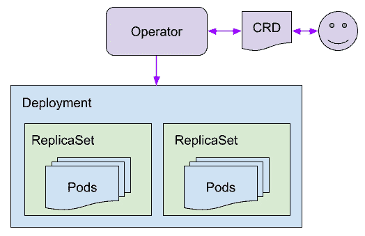
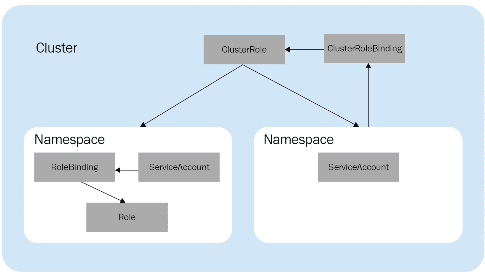
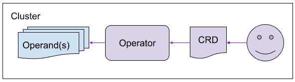
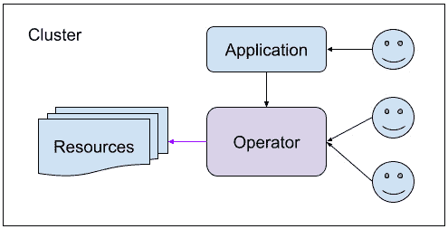
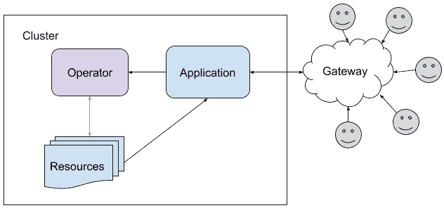

# 第二章：*第二章*：理解操作符如何与 Kubernetes 交互

现在我们已经了解了操作符做*什么*（以及*为什么*要做这些事情），我们可以开始探索*如何*执行这些任务。在确定了操作符的使用场景后，接下来的步骤就是制定它的技术设计。虽然这还是在实际编码之前的阶段，但它仍然是开发过程中的一个重要部分。这是几乎所有软件项目的标准做法，在本章中，我们将把它框架化并应用于 Kubernetes 的背景中。

在规划阶段，有几个因素需要考虑，并且需要回答一些问题，这些问题将有助于指导操作符的设计。这些因素既有技术性的，也有有机性的，因为你的操作符不仅需要与集群中的 Kubernetes 资源进行交互，还需要与工程师和管理员等人力资源进行互动。

本章将解释一些应该考虑纳入操作符设计的关键因素。首先，我们将介绍一些 Kubernetes 的原生组件和资源，这些资源是许多操作符交互的对象。通过查看操作符如何使用这些资源以及使用它们的用例，我们可以开始探索一些功能性操作符设计的模式。接下来，我们将研究如何在设计操作符时考虑其独特的用户群体，以及如何使设计对用户有利。最后，我们将讨论一些最佳实践，帮助操作符应对未来的持续发展。

在本章中，我们将涵盖以下主题：

+   与 Kubernetes 集群资源进行交互

+   确定你的用户和维护者

+   为你的操作符设计有益的功能

+   为操作符的演进变化进行规划

本章的目标是帮助你了解操作符的早期设计过程。若操作符的设计规划不当，可能会导致在操作符生命周期内需要进行大量的更改和更新。这会给工程资源带来压力，也可能会让用户感到困惑和沮丧。因此，本章的大部分内容将集中在非技术性细节上。然而，我们确实需要了解一些基本的技术交互，以便为我们的用户进行设计调整。在本章结束时，你可能会发现自己目前无法解决所有在此描述的预设计问题。这没关系——重要的是要理解在进入开发阶段时你必须意识到的某些概念。

# 与 Kubernetes 集群资源进行交互

在你决定如何从用户体验角度设计 Operator 之前，理解 Operator 的技术能力是非常重要的。了解 Operator 代码库的具体能力，有助于指导整个设计过程，明确哪些是实际可行的。否则，仅根据用户需求定义 Operator 的范围而忽视可行性，可能会导致承诺过多而功能和可用性不足。

任何 Operator 的可能性本质上受到 Kubernetes 平台底层特性的限制。该平台由不同的原生集群资源组成，其中一些资源你可能已经熟悉。本节将介绍 Operator 常用的资源，并解释如何以及为何使用它们。当你开发 Operator 时，这些资源通常会通过 Kubernetes 客户端库进行访问，这些库允许任何应用与集群资源进行交互。

## Pods、ReplicaSets 和 Deployments

或许 Kubernetes 集群架构中最基本的单元就是 **Pod**。这些对象代表一个或多个正在运行的容器。从底层来看，Pod 本质上是容器镜像的定义，**Kubelet** 可以利用这些定义来指导容器运行时在哪里以及如何运行特定容器。应用程序以 Pods 形式部署在 Kubernetes 上，Kubernetes 本身由许多系统 Pods 组成，Operators 也作为 Pods 部署。

虽然 Pods 对 Kubernetes 集群至关重要，但它们通常过于原子化，难以手动管理。而且通常需要运行多个副本的应用程序，这时 **ReplicaSets** 就派上用场了。ReplicaSets 的作用是为某个 Pod 模板定义多个副本。

然而，ReplicaSets 的能力也有限。它们仅维护集群中 Pod 的副本数量。**Deployments** 通过包含 ReplicaSets 并定义更多控制功能，如发布策略和回滚修订管理，进一步增强了这一功能。

从 Operator 开发者的角度来看，Deployments 通常是最重要的交互资源。Deployments 的高级机制为应用程序的运行时提供了灵活性。这些机制可以从用户角度进行抽象或限制，因为用户将通过 Operator 的 CRD 与之交互（而不是直接使用 Deployment）。然而，灵活性依然存在，可以稍后将其添加或自动编程到 Operator 的调和逻辑中。

下图展示了应用工作负载 Pod 在 ReplicaSets 和 Deployments 中的封装，如何仍然可以通过 Operator 进行管理。在此示例中，Operator 只关注 Deployment，但该 Deployment 的状态反映了其中实际工作负载的健康状况：



图 2.1 – 一个操作符管理着一个包含两个 ReplicaSets（每个包含若干 Pods）的部署

操作符通常由部署安装和管理。部署提供了一个良好的所有者引用，用于所有构成操作符的资源组件的垃圾回收。这对于升级和卸载操作符非常有用。

尽管操作符直接管理某些 Pods 或 ReplicaSets 并不罕见，但确实存在权衡问题。首先，这样的操作符设计会导致应用程序架构更简单，但以牺牲使用部署（Deployments）时的能力和便利性为代价。因此，当你决定是否让操作符直接管理 Pods 或部署时，考虑应用程序本身的意图和设计需求非常重要。

## 自定义资源定义

正如我们在*第一章*中提到的，*引入操作符框架*，大多数操作符依赖于**自定义资源定义**（**CRDs**）。CRD 是本地 Kubernetes 资源，允许用户在运行时扩展 Kubernetes 平台的资源定义。它们就像 Kubernetes API 的插件。当在集群中安装 CRD 后，它会向 API 服务器提供如何处理和验证该自定义类型对象的信息。

操作符使用 CRD 的最常见用例是提供其配置对象作为其中之一。一旦 Kubernetes API 知道如何处理这个 CRD，操作符或用户将从 YAML 创建操作符对象（就像创建 Pod 或部署一样）。

用户可以仅与操作符资源进行交互，而不必手动调整操作符的部署设置。这允许开发人员展示精心设计的前端用户体验，并抽象化应用程序的 Kubernetes 内部实现，所有这些都可以在一个界面中进行，就像其他任何本地的 Kubernetes 资源对象一样。

但是，操作符不仅仅可以在 CRD 中打包它们的配置。根据所管理的应用程序，操作符还可以安装和监控应用程序所需的自定义资源。由于 CRD 的多种使用场景，应用程序提供和依赖其自定义资源对象并不罕见。一个应用程序操作符应该了解这些资源，并能够安装和管理它们。

CRD 是操作员开发的核心部分，因为如果没有 CRD，剩下的只有核心 Kubernetes 资源（如 Pods、ReplicaSets 和 Deployments），这些资源本身虽然能完成很多工作，但没有内在的灵活性，可以根据特定需求进行定制。操作员的自定义资源对象提供了一个用户界面，可以与集群中的其他 Kubernetes 对象无缝集成。此外，Kubernetes API 客户端和 Operator SDK 提供了代码工具，便于你与这些自定义资源交互，就像与任何其他集群资源一样。

## ServiceAccount、角色和 RoleBinding（RBAC）

访问策略往往被忽视，但它们对于确保你和你用户集群的稳定性和安全性至关重要。就像应用程序管理其他集群组件一样，操作员也需要一定的 RBAC 策略来完成其在所需访问权限内的工作。

操作员需要 RBAC 策略来管理其操作对象。为 Kubernetes 中的任何应用定义 RBAC 策略时，首先需要定义一个**角色**。角色定义了应用或用户可以访问的 API 对象类型，以及允许与这些对象一起使用的操作动词。以下是一个角色的示例：

```
apiVersion: rbac.authorization.k8s.io/v1
```

```
kind: Role
```

```
metadata:
```

```
  namespace: my-operators-namespace
```

```
  name: my-operator-role
```

```
rules:
```

```
- apiGroups:
```

```
  - operator.sample.com
```

```
  resources:
```

```
  - "*"
```

```
  verbs:
```

```
  - "*"
```

```
- apiGroups:
```

```
  - ""
```

```
  resources:
```

```
  - pods
```

```
  verbs:
```

```
  - get
```

```
  - watch
```

```
  - list
```

这个示例创建了一个角色，允许操作员对指定命名空间中的 Pods 执行*获取*、*观察*和*列出*操作。它还允许操作员访问 `operator.sample.com` API 组下的所有资源。这个例子用来说明操作员如何访问其 CRD。由于操作员与 CRD 之间没有任何固有的绑定，它仍然需要 RBAC 权限来访问该对象，就像访问任何其他 API 对象一样。在此情况下，CRD 会在该 API 组下创建。

角色可以限定在单一命名空间内，或者可以通过**ClusterRoles**被限定为集群角色。无论哪种方式，角色都会绑定到一个**ServiceAccount**，并通过**RoleBinding**（或**ClusterRoleBinding**）进行绑定。ServiceAccount 会在 Pods 上进行指定，以便完整地识别 Pod 在集群内具有的基于 RBAC 的访问权限：



图 2.2 – 集群角色与命名空间角色的对比图

角色和 ClusterRole 之间的区别取决于操作员在集群中需要的访问范围。具体来说，这主要取决于操作员、其操作对象（Operand）及其依赖项安装所在的命名空间。

## 命名空间

所有 Kubernetes 应用程序都在**命名空间**内运行。命名空间是一个逻辑分区，用于存放应用程序资源，它将各个组件隔离开来，并允许一定程度的访问控制。操作员也被部署在命名空间内，但有时它们还需要访问其他命名空间。

Operator 的命名空间覆盖范围被称为其作用域。Operator 可以是**命名空间作用域**（namespace-scoped），也可以是**集群作用域**（cluster-scoped）。当 Operator 是集群作用域时，它可以观察并与多个命名空间中的资源进行交互。相反，命名空间作用域的 Operator 仅安装在一个命名空间中，并管理该命名空间内的资源。开发者为其 Operator 选择的作用域取决于该 Operator 将要管理的资源。

如果 Operator 必须能够管理在任何命名空间中创建的资源，则应该选择集群作用域。这可以是管理在与 Operator 本身分开的命名空间中的操作数（Operand）的 Operator，或者它可能仅仅需要管理存在于多个命名空间中的操作数（例如一个资源供应器，用户请求部署开发环境）。

另一方面，命名空间作用域的 Operator 有一些优势。具体而言，将 Operator 限制在单个命名空间内便于调试和故障隔离。它还允许灵活的安装（包括在多个命名空间中安装多个相同的 Operator）。

Operator 的作用域最终由其 CRD 和访问角色来定义。集群作用域的自定义资源在任何特定命名空间之外创建。这对于那些在集群中只会有一个实例的 Operator 很有用（例如，管理核心 Kubernetes 组件的 Operator，如 API 服务器）。Operator 所需的访问角色通常会遵循其 CRD 的作用域。

总结一下，我们在这里介绍的资源（Pods、ReplicaSets、Deployments、CRDs、RBAC 和命名空间）只是 Operator 可能依赖的资源中的一小部分。然而，它们是最常见的，也是你在设计 Operator 集群交互时应该首先考虑的资源。在下一节中，我们将讨论 Operator 交互的另一面：它如何与人类交互。

# 识别用户和维护者

Operator 与 Kubernetes 交互的另一种方式是通过其用户。尽管 Operator 的存在是为了自动化许多人类所需的集群交互，但 Kubernetes 集群中的有机元素依然存在。用户仍然必须以某种方式与 Operator 进行交互，而不同用户希望和需要如何进行这种交互，会影响 Operator 的设计。

因此，识别你的 Operator 目标用户类型非常重要；它有几种不同的类别。每个类别对 Operator 的需求和看法都有所不同。因此，通过识别 Operator 的目标用户，你可以确保 Operator 设计得足够吸引最广泛的用户群体，并满足最多的使用场景。

对于大多数操作器，用户与之交互的类型可以根据这些用户在集群中的访问级别以及他们在整个应用程序中的角色分为几组。这些用户组通常如下：

+   **集群管理员**：负责集群维护和稳定性的管理员用户。

+   **集群用户**：具有集群内部访问权限的个人用户，例如团队中的工程师。

+   **最终用户/客户**：公共或企业产品的集群外部用户。这些用户不会直接与集群互动，但他们使用运行在集群上的应用程序。

这些类型的用户具有相似的动机和使用场景，但也存在一些明显的差异。逐个考虑每个群体有助于突显这些比较。

## 集群管理员

集群管理员通常是操作器的使用者。他们是对集群架构拥有最多访问权限和知识的用户。因此，他们需要最大的权限和灵活性。

首先，集群管理员的工作是确保集群的稳定性。这就是为什么他们需要尽可能多的工具和控制权限来根据需要修改集群设置的原因。但正如俗话所说，*权力越大，责任越大*。在这种情况下，操作器可以为管理员提供极大的权限，以根据他们的需要运行集群。但如果操作器没有按预期工作，这种权力可能会适得其反，甚至损害集群。

因此，打算由集群管理员使用的操作器开发者可能会考虑将其功能限制在已知可以支持的定义集内。这可以帮助他们设计操作器，使其不会变得*过于强大*，从而暴露出可能会无意中损害集群的设置。

然而，如果管理员发现他们的集群突然*着火*或严重故障，他们将需要尽快修复这个问题。如果这是由于操作器正在管理的组件（或操作器本身）引起的，那么管理员将需要直接访问操作器、操作对象或两者。在这种情况下，受限的功能集可能会延迟恢复时间，从而影响集群的稳定性恢复。

为集群管理员开发操作器的一个好处是，他们对自己的集群非常了解，并且拥有很高的内部访问权限。这提供了一定的信任，使得可以创建更强大的功能。此外，拥有统一的用户群体可以限制操作器需要支持的不同工作流程。

以下图表展示了一个内部集群管理员与操作器互动来管理其集群中操作对象的简单布局：



图 2.3 – 单一集群管理员通过 CRD 直接管理 Operator

最终，由 Operator 的开发人员来决定为集群管理员提供什么功能（如果集群管理员是目标用户的话）。根据 Operator 管理的应用程序，限制管理员通过 Operator 直接访问 Operand 可能是合理且安全的。但是，如果 Operand 部署可能会出错并需要手动干预，那么应提供紧急访问权限。

## 集群用户

集群的用户与集群进行交互，但不具备管理员的访问和控制权限。例如，这些可能是正在共享集群上工作的开发人员，他们需要按需部署和销毁某些资源。为开发资源提供服务涉及到用户从 Operator 请求这些资源。

集群用户对底层集群组件的控制要求较少。他们也不太可能接触到集群的某些部分，从而可能破坏集群。这两个因素为开发一个有助于限制这些用户支持的功能范围的 Operator 提供了保证。此外，这些用户如果需要更多的功能，可以通过集群管理员获得个人访问权限。

集群用户也可能通过内部应用程序与 Operator 进行交互。对于组织来说，在内部网络中部署定制的应用程序并不罕见。使用这样的内部应用程序可以为集群用户提供更友好的前端界面，同时也可以将集群用户的访问权限限制在底层 Operator 的实际能力范围内。

下图展示了一个多位内部用户使用 Operator 在集群中配置资源的设置。其中一些用户直接与 Operator 交互，而其他用户必须通过内部应用程序与 Operator 交互（Operator 甚至可能在管理这个前端应用程序）。在这种模式下，可以为使用 Operator 提供的内部工具的跨组织特权层级定义规则：



图 2.4 – 内部集群用户请求资源，既可以直接通过 Operator，也可以通过中介的内部应用程序

将 Operator 向内部集群用户开放的选项是非常灵活的。这些用户对于集群稳定性的信任和投入程度足够高，因此能有效降低疏忽或恶意行为的风险。然而，将应用程序管理控制权限暴露给更广泛的受众仍然存在一定的风险。因此，在设计 Operator 的功能时，必须考虑这一点。

## 最终用户和客户

产品的终端用户也可以从操作员中受益。这些用户可能甚至不知道他们正在与操作员互动，因为产品的架构设计通常对普通用户来说是不明显的。但了解产品用户期望其功能的方式仍然很重要，尤其是在我们设计产品关键组件的情况下。

这些终端用户可能不会直接与操作员互动。这意味着您的用户和客户自己能够访问 Kubernetes 集群，这对于安全性或可用性来说并不理想。应用程序的客户受益于交互式前端，无论是网站还是移动应用。但这个前端仅仅是与后端进行交互的工具，而后端可能由许多不同的组件组成，包括操作员。

在这种情况下，您的用户可能就是您自己——也就是说，您（或您的组织）将开发操作员，同时也可能开发依赖于该操作员的前端应用程序。在这种情况下，跨项目的协作对于阐明每个团队的需求和期望至关重要。在这种场景下，操作员将从优雅的 API 设计中受益最多，这种设计能更轻松地与其他程序进行通信，而非与人工用户互动：



图 2.5 – 外部终端用户通过外部应用程序与操作员互动

一个应用程序的终端用户通常与操作员的互动是完全隔离的。然而，这并不意味着一个应用程序及其资源不能仍然由操作员进行管理。在这种情况下，操作员仍然是维护集群状态的重要且有用的工具，即使这些终端用户不需要知道他们正在与操作员互动。

终端用户是我们将讨论的与操作员进行功能性互动的最终用户类型。然而，在设计操作员时，我们还必须考虑其他人：那些维护操作员及其代码的人。

## 维护者

最后一类将与您的操作员互动的用户与前三类有所不同。这些是项目的维护者，他们处理代码以解决问题并实施新特性。在任何软件项目中，维护者的角色都很重要，但在像 Kubernetes 这样的开源生态系统中，还有其他额外的考虑因素。

如果您的操作员源代码将开放并接受任何人的贡献，那么任命受信任的负责人来审查代码更改将是至关重要的。这对于任何开源项目都是如此，但对于操作员而言，审查人员熟悉任何操作员所依赖的核心 Kubernetes 概念将极为有利。

从企业角度来看，投资建立一个可靠的工程师团队来构建和维护 Operator，为你的维护者提供了一个长期的动力，促使他们继续开发 Operator 的源代码。这也在 Operator 的维护者与其主要利益相关者之间建立了信任关系。由于 Kubernetes 平台的不断变化，Operator 代码库的持续维护是必要的。熟悉 Kubernetes 社区的维护者是使用 Operator 的团队中一个重要的补充。

这些只是你的 Operator 可能与之互动的一些用户类型。这个列表并不详尽无遗，但目的是激发你对用户群体的思考。确定 Operator 的用户类型有助于缩小 Operator 需要哪些功能的范围。它也为确定哪些功能是必要的提供了一个起点。在接下来的部分，我们将探讨一些有助于设计对用户最有利功能的思路。

# 设计对你的 Operator 有益的功能

一旦你确定了 Operator 的目标用户群，下一步就是定义 Operator 的功能。列出 Operator 必须解决的问题将帮助你更好地理解项目的目标。它还将突出这些目标是否为用户提供了切实、可衡量的收益。

确定什么样的功能真正有益是很难界定的。“有帮助”的确切定义因案例而异。一些有益的 Operator 以新颖且直观的方式解决了广泛的难题。另一些则解决了更小众的问题，这些问题可能只影响小范围的用户社区，但消除这些问题的影响却是显著的。然而，描述有益功能时，从什么是不有用的方面来阐述会稍微容易一些。

首先，有用的 Operator 不是冗余的。在具体的示例中，冗余可能意味着很多不同的事情。但从根本上讲，Operator 设计者应该努力追求的是不重复的本质。最基本的例子是，不应该在没有充分理由的情况下重新编写一个已经存在的 Operator。研究你提议的 Operator 所涉及的领域可以防止这种情况发生。研究其他人已经采取的方法也能揭示出在过程中需要避免的潜在陷阱。

Operator 在 Kubernetes 概念上也可能是冗余的。由于 Operator 本质上是与集群进行交互并将一些交互暴露给用户，因此它是 Kubernetes 的扩展。因此，在为 Operator 思考功能时，很容易不自觉地去“重新发明轮子”。这种功能性冗余可能与我们接下来要讨论的另一个问题相关，即开发人员试图解决不存在的问题。

接下来的问题涉及有益的任务，这些任务并非假设性的。软件开发的世界从许多充满激情的工程师中受益，他们急于解决遇到的问题。对贡献的热情甚至可以延伸到解决潜在问题，即便这些问题尚未在实践中出现。这种对贡献的热情当然是一个很好的心态，绝不应当被压制。当然，确实存在许多类型的问题和 bug 可以被发现并且应该被修复——希望是在生产环境中没有人遇到它们之前。但有时，针对纯粹理论性问题也会提出真实的解决方案。

这些假设性的使用场景可能在没有实际证据表明用户需要这样的解决方案时被提出。这可能是个棘手的问题，因为有时，使用场景看起来足够明显，似乎不需要任何明确的需求。但当每个新特性都需要投入资源来实现，并且将维护人员绑定于支持它时，密切关注“沉默”可以揭示出不必要的工作。

虽然可能会有许多突破性的特性创意，但验证特性提案是否有真实需求非常重要。这种类型的研究还可以揭示想法中的冗余，进而提出已经存在的、更有效的替代解决方案。

当然，有无限多的标准可以用来定义特性是否有用。然而，在 Kubernetes Operator 的上下文中，这些只是一些起步的初步想法。通过从它的益处角度考虑你的 Operator，并问自己“这有什么用？”你可以避免进行过度或不必要的更改，这些更改日后可能需要维护。

这种前瞻性思维将对你的 Operator 在发展和演进过程中非常有用。像大多数软件一样，Operators 随着时间的推移容易发生变化，尤其是它们依赖于上游的 Kubernetes 代码库。在接下来的部分中，我们将学习如何为这些变化做好准备，并在变化到来时进行应对。

# 为你的 Operator 的变更做好规划。

在任何软件项目的生命周期中，代码库都会发生变化。这些变化包括修复 bug、重构、添加新特性以及删除旧特性。这对 Kubernetes、其子项目以及建立在该平台上的项目（如 Operators）都适用。

尽管无法预测你的 Operator 将来会发展成什么样子，但在设计阶段有一些想法可以帮助你顺利过渡并应对之后的新发展。具体如下：

+   从小开始。

+   有效迭代。

+   优雅地弃用。

当你维护一个 Operator 时，这些决策在实践中会带来显著的好处。然而，这些并不是绝对的，也并非严格限定于 Kubernetes Operator。你可以将它们视为开发任何软件项目的一般建议。这里，我们将从编写 Operator 的角度来审视这些建议。

## 从小做起。

在规划 Operator 的原始设计时，考虑 Operator 随时间变化的可能性可以避免未来的挑战。以增长为导向的设计还可以帮助限制项目的初始范围，使其仅涵盖必要的目的。这使得能够为开发一个强大的首个产品分配足够的资源，并且该产品能够在时间上高效迭代。

虽然看起来开发 Operator 的最佳目标是从尽可能多的功能开始，但实际上，往往相反。毕竟，Operator 的一个目的就是在用户和底层集群功能之间创建一个抽象层。暴露过多的选项可能会让你失去自动化的好处，因为这会要求用户理解更多的本地 Kubernetes 集群功能。这也让你的用户在 Kubernetes 平台发生变化时更加脆弱，这些变化本不该直接影响他们。

在决定是否为 Operator 添加某个功能时，需批判性地思考该功能的重要性，以及实现它的风险和成本。这与避免冗余和解决假设性问题的主题相关，这些内容我们在上一节中已经探讨过。同时，这也与即将讨论的“弃用”主题相关。

最终，大多数时候，缺乏功能比发布一个复杂且令人困惑的 Operator 更好。每新增一个功能都会带来维护成本，并且可能在后期引入漏洞。这些都是从小做起并根据用户反馈进行开发的最大原因之一。

## 高效迭代

一旦你拥有了一组最小功能，最终就需要进行改进。幸运的是，添加新功能比移除旧功能要容易得多。

你应该积极寻求用户对所需功能的反馈。这可以通过多种方式实现，从在 Operator 及其相关项目周围保持活跃的在线存在，到在 Operator 的代码中实施详细的使用度量。此外，了解更广泛的 Kubernetes 项目社区也能帮助你关注潜在的底层平台变化，从而支持你的 Operator。

在你添加功能的同时，继续监控它们的使用情况，以衡量它们的效果。牢记最初设计 Operator 时的指导方针，例如其用户群体和功能提示，也能确保每个新功能的效果与最初设计的功能集一样有效。

## 优雅地弃用

一种对用户非常不便的变化是弃用。许多大型软件项目的部分功能不可避免地会被替换，或者官方维护者会停止对其的支持。通过最小化的 Operator 设计，你可以最大限度地减少用户体验被更改的可能性。

从小范围的设计开始，并在此基础上进行深思熟虑的有效迭代，将有助于减少删除功能的需求。不幸的是，某些时候这一点可能是不可避免的。在这种情况下，重要的是提前给予用户足够的通知，以便他们有足够的时间过渡到替代方案（如果适用的话）。

Kubernetes 社区已经定义了废弃政策，这将在*第八章*《为你的 Operator 准备持续维护》中详细介绍。尽管如此，这些指南作为废弃处理的良好模板仍然很有价值。Kubernetes 用户对废弃的时间线和流程已经非常熟悉，因此，如果你遵循这些流程，你的用户将受益于他们已经熟悉的方式。

就像所有美好的事物都必须走到尽头一样，一些优秀的功能最终也必须被淘汰。幸运的是，对于 Kubernetes 社区来说，这并不是一个陌生的概念，它提供了一个成熟的废弃处理模板。作为开源社区的责任成员，你和你的用户将从一种尊重且体贴的方式中受益，这种方式有助于移除和更改项目中的某些方面。

在设计 Operator 时，牢记这些实践将有助于限制项目的范围，从而让资源能够专注于构建一个稳定的工具，避免随时间剧烈变化。用户和维护者都能从这种稳定性中受益，用户能够在不改变工作流程的情况下，无缝使用不同版本的 Operator，而维护者则可以投入长期精力，发展项目并将相关知识传授给他人。

# 概述

本章重点讨论了 Operator 与 Kubernetes 集群互动的不同方式。除了 Operator 代码库与集群原生资源之间的字面技术交互外，我们还探讨了一些在设计 Operator 时值得考虑的其他交互。这些交互包括 Operator 的用户以及 Operator 随时间变化的生命周期。

Kubernetes 集群包含多种不同类型的原生资源。这些资源是所有部署在 Kubernetes 上的应用程序的基本构建块。从这一点来看，Operator 与任何其他应用程序没有不同，它们必须能够原生地使用这些资源。本章重点介绍了几种 Operator 资源的分解，包括 Pods、Deployments、CRDs 和 RBAC 策略，以便你了解如何定义 Operator 如何使用这些资源。

人类与 Operator 的互动是设计时最重要的概念之一。Operator 的设计目的是通过自动化各种任务为人类服务，但像任何自动化人工劳动的工具一样，它们仍然需要人为的输入来操作，并为人类生成输出。因此，我们讨论了为不同类型的用户构建 Operator 时需要考虑的各种用户类型及其独特的需求和期望。

最后，我们介绍了一些关于功能设计的好方法。为了帮助你成功搭建一个 Operator，我们讨论了制定初步设计的想法，以便为用户提供实际的好处。然后，我们提出了一些你在 Operator 演化过程中需要记住的概念。

在下一章，我们将把这些知识应用到实际的 Operator 设计中。我们将从构建一个示例 Operator 开始，首先设计它的 CRD、API 和协调循环。在这里，我们将开始构建一个实际的 Operator，并在本书的剩余部分进行编码和部署。
