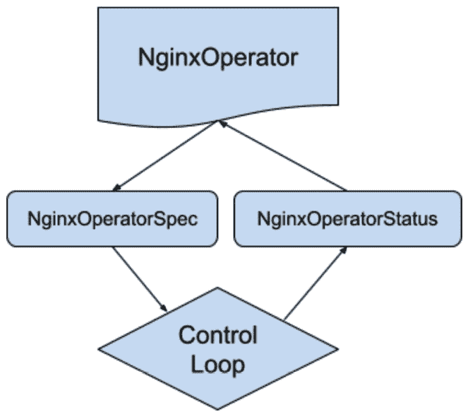

# *第四章*：使用 Operator SDK 开发 Operator

在完成了**Operator**的设计大纲之后，现在可以开始实际的开发工作了。这意味着编写并编译代码，将其部署到实际运行的**Kubernetes 集群**上。本章将使用**Operator SDK**来初始化一个模板化的 Operator 项目框架。从这里开始，将通过教程演示开发其余基本 Operator 的技术步骤。本指南将遵循在*第三章*中已规划的 Operator 设计，*设计一个 Operator – CRD、API 和目标调和*，该章聚焦于开发一个*二级* Operator 来部署和升级一个简单的**Nginx Pod**。

本章作为教程，将遵循从头开始使用**Go**构建 Operator 的过程。首先是初始化模板化项目代码，然后按步骤定义 Operator API，并生成相应的**CustomResourceDefinition**（**CRD**）。接下来，我们将看到如何实现构成 Operator 核心功能的简单调和逻辑。最后，还会介绍一些基本的故障排除和常见问题。使用 Operator SDK 开发 Operator 的步骤将分为以下几个部分：

+   设置你的项目

+   定义 API

+   添加资源清单

+   编写控制循环

+   故障排除

这些章节大致遵循官方 Operator SDK Go 文档中推荐的设计模式（[`sdk.operatorframework.io/docs/building-operators/golang/`](https://sdk.operatorframework.io/docs/building-operators/golang/)），因此我们选择遵循这种方法。在本章结束时，我们将拥有一个符合设计中描述的二级功能的 Operator，该设计已在*第三章*中概述，*设计一个 Operator – CRD、API 和目标调和*。该功能包括操作数（在此为 Nginx）的基本部署，以及 Operator 和操作数的无缝升级。在后续章节中，本指南将以此为基础，构建更多复杂的功能，使该示例 Operator 从较低级别逐步向更高级别发展，符合能力模型。

# 技术要求

本章中的引导步骤需要以下技术前提条件才能跟进：

+   `go` 版本 1.16+

+   本地安装 `operator-sdk` 二进制文件

可以通过直接从发布版本安装`operator-sdk`二进制文件，或者使用 Homebrew（适用于 macOS）进行安装，或从 GitHub 编译安装，网址为 [`github.com/operator-framework/operator-sdk`](https://github.com/operator-framework/operator-sdk)。如果选择从 GitHub 安装 Operator SDK，还需要`git`，不过建议还是使用`git`，以便利用版本控制管理项目。

本章的《代码实战》视频可以在以下链接观看：[`bit.ly/3N7yMDY`](https://bit.ly/3N7yMDY)

# 设置项目

启动一个新的 Operator 项目的第一步是初始化一个空的项目结构。首先，通过 `mkdir nginx-operator` 创建一个空的项目目录并进入该目录。现在，使用以下命令初始化一个模板项目结构：

```
operator-sdk init --domain example.com --repo github.com/example/nginx-operator
```

注意

该命令首次运行时可能需要几分钟才能完成。

该命令设置了许多不同的文件和文件夹，这些文件和文件夹将被填充上我们正在构建的 Operator 的自定义 API 和逻辑。曾经空无一物的项目目录现在应该包含以下文件：

```
~/nginx-operator$ ls
total 112K
drwxr-xr-x   12 mdame staff  384 Dec 22 21:07 . 
drwxr-xr-x+ 282 mdame staff 8.9K Dec 22 21:06 .. 
drwx------    8 mdame staff  256 Dec 22 21:07 config
drwx------    3 mdame staff   96 Dec 22 21:06 hack
-rw-------    1 mdame staff  129 Dec 22 21:06 .dockerignore
-rw-------    1 mdame staff  367 Dec 22 21:06 .gitignore
-rw-------    1 mdame staff  776 Dec 22 21:06 Dockerfile
-rw-------    1 mdame staff 8.7K Dec 22 21:07 Makefile
-rw-------    1 mdame staff  228 Dec 22 21:07 PROJECT
-rw-------    1 mdame staff  157 Dec 22 21:07 go.mod
-rw-r--r--    1 mdame staff  76K Dec 22 21:07 go.sum
-rw-------    1 mdame staff 2.8K Dec 22 21:06 main.go
```

这些文件的用途如下：

+   `config` – 一个存放 Operator 资源 YAML 定义的目录。

+   `hack` – 一个目录，许多项目都用它来存放各种 `hack` 脚本。这些脚本可以用于多种用途，但通常用于生成或验证更改（通常作为持续集成过程的一部分，确保在合并之前代码已正确生成）。

+   `.dockerignore` / `.gitignore` – 用于声明在 Docker 构建和 Git 操作中应忽略的文件列表。

+   `Dockerfile` – 容器镜像构建定义。

+   `Makefile` – Operator 构建定义。

+   `PROJECT` – Kubebuilder 使用的文件，用于存储项目配置文件信息 ([`book.kubebuilder.io/reference/project-config.html`](https://book.kubebuilder.io/reference/project-config.html))。

+   `go.mod` / `go.sum` – `go mod` 的依赖管理列表（已经填充了各种 Kubernetes 依赖项）。

+   `main.go` – Operator 主功能代码的入口文件。

在初始化了这个模板项目结构后，就可以开始构建 Operator 逻辑了。尽管这个空项目可以编译，但它除了启动一个包含 `Readyz` 和 `Healthz` 端点的空控制器外没有其他功能。为了让它做更多的事情，首先，Operator 必须有一个定义好的 API。

# 定义 API

Operator 的 API 将定义它在 Kubernetes 集群中的表现方式。API 会直接转换为生成的 CRD，描述用户与 Operator 交互时使用的自定义资源对象的蓝图。因此，在编写其他逻辑之前，创建此 API 是必要的第一步。没有它，Operator 的逻辑代码就无法从自定义资源中读取值。

构建 Operator API 需要通过编写 Go 结构体来表示对象。这个结构体的基本框架可以通过 Operator SDK 使用以下命令来生成：

```
operator-sdk create api --group operator --version v1alpha1 --kind NginxOperator --resource --controller
```

该命令执行以下操作：

1.  在名为 `api/` 的新目录中创建 API 类型

1.  将这些类型定义为属于 API 组 `operator.example.com`（因为我们是在 `example.com` 域下初始化的项目）。

1.  创建名为 `v1alpha1` 的 API 初始版本

1.  将这些类型命名为我们的 Operator，`NginxOperator`。

1.  在一个名为 `controllers/` 的新目录下实例化模板控制器代码（我们将在 *编写控制循环* 部分进一步操作此目录）。

1.  更新 `main.go`，添加启动新控制器的模板代码。

目前，我们只关心位于 `api/v1alpha1/nginxoperator_types.go` 下的 API 类型。该目录中还有另外两个文件（`groupversion_info.go` 和 `zz_generated.deepcopy.go`），通常不需要修改。实际上，`zz_generated.` 前缀是用作标准，表示这些是生成的文件，应该避免手动修改。`groupversion_info.go` 文件用于定义该 API 的包变量，指导客户端如何处理其中的对象。

查看 `nginxoperator_types.go`，里面已经有一些空的结构体，并且有填写额外字段的说明。该文件中最重要的三种类型是 `NginxOperator`、`NginxOperatorSpec` 和 `NginxOperatorStatus`：

```
// NginxOperatorSpec defines the desired state of NginxOperator
```

```
type NginxOperatorSpec struct {
```

```
  // INSERT ADDITIONAL SPEC FIELDS - desired state of cluster
```

```
  // Important: Run "make" to regenerate code after modifying this file
```

```
  // Foo is an example field of NginxOperator. Edit nginxoperator_types.go to remove/update
```

```
  Foo string `json:"foo,omitempty"`
```

```
}
```

```
// NginxOperatorStatus defines the observed state of NginxOperator
```

```
type NginxOperatorStatus struct {
```

```
  // INSERT ADDITIONAL STATUS FIELD - define observed state of cluster
```

```
  // Important: Run "make" to regenerate code after modifying this file
```

```
}
```

```
//+kubebuilder:object:root=true
```

```
//+kubebuilder:subresource:status
```

```
// NginxOperator is the Schema for the nginxoperators API
```

```
type NginxOperator struct {
```

```
  metav1.TypeMeta   `json:",inline"`
```

```
  metav1.ObjectMeta `json:"metadata,omitempty"`
```

```
  Spec   NginxOperatorSpec   `json:"spec,omitempty"`
```

```
  Status NginxOperatorStatus `json:"status,omitempty"`
```

```
}
```

如 *第三章* 所述，*设计 Operator – CRD、API 和目标对账*，所有 Kubernetes API 对象都应包含 `Spec` 和 `Status` 字段，Operator 也不例外。因此，`NginxOperatorSpec` 和 `NginxOperatorStatus` 就是这些字段，分别用于接受用户输入和报告 Operator 当前状态。`NginxOperator` 代表主要对象，它们之间的关系是层级性的。



图 4.1 – NginxOperator 字段与逻辑之间的关系。

回想一下 *第三章* 中定义的问题，*设计 Operator – CRD、API 和目标对账*，该 Operator 需要接受以下输入：

1.  `port`，定义了要在 Nginx Pod 上暴露的端口号。

1.  `replicas`，定义了 Pod 副本的数量，以便通过 Operator 实现该部署的扩展。

1.  `forceRedploy`，这是一个 `Nginx` 操作数。

为了实现这些字段，我们需要更新前面的代码，通过以下方式修改 `NginxOperatorSpec` 以包含这些新字段。我们为整数类型的字段使用指针，这样我们的 Operator 可以区分零值和未设置值，未设置值将回退为使用默认值：

```
// NginxOperatorSpec defines the desired state of NginxOperator
```

```
type NginxOperatorSpec struct {
```

```
   // Port is the port number to expose on the Nginx Pod
```

```
   Port *int32 `json:"port,omitempty"`
```

```
   // Replicas is the number of deployment replicas to scale
```

```
   Replicas *int32 `json:"replicas,omitempty"`
```

```
   // ForceRedploy is any string, modifying this field 
```

```
   // instructs  the Operator to redeploy the Operand
```

```
   ForceRedploy string `json:"forceRedploy,omitempty"`
```

```
}
```

（请注意，我们还移除了由 Operator SDK 生成的示例 `Foo` 字段。）

重新生成代码。

一旦修改了 Operator 类型，有时需要从项目根目录运行 `make generate`。这将更新生成的文件，例如前面提到的 `zz_generated.deepcopy.go`。即使它不总是产生任何变化，养成在每次修改 API 时定期运行此命令的习惯是一个好做法。更好的做法是，在 Operator 的代码库中添加预提交的持续集成检查，以确保任何传入的代码都包含这些生成的更改。这样的自动化检查可以通过运行 `make generate` 然后执行简单的 `git diff` 命令来评估是否有任何变化。如果有变化，检查应失败并指导开发人员重新生成代码。

对于所有这三个新字段，我们还添加了以`` `json:"...,omitempty"` ``形式表示的 JSON 标签。这些标签的第一部分定义了该字段在以 JSON 或 YAML 表示时的显示方式（例如，当通过 `kubectl` 与对象交互时）。`omitempty` 指定如果该字段为空，则不应在 JSON 输出中显示。这对于隐藏可选字段非常有用，以便在查看集群中的对象时提供简洁的输出（否则，空字段将显示为 nil 或空字符串）。

我们将最初将这三个字段都设置为可选，默认值在 Operator 中定义。然而，删除 `omitempty` 并添加更多 Kubebuilder 标签后，它们也可以被指定为必填字段，例如：

```
   // Port is the port number to expose on the Nginx Pod
```

```
   // +kubebuilder:default=8080
```

```
   // +kubebuilder:validation:Required
```

```
   Port int `json:"port"`
```

使用这些设置，任何尝试在不包含 `port` 字段的情况下修改 `NginxOperator` 对象的操作都将导致 API 服务器返回错误。在当前版本的 Kubebuilder 中，默认假设任何未被标记为 `omitempty` 的字段都是必填字段。然而，也有方法可以全局切换这个默认行为（通过在 API 顶层应用 `// +kubebuilder:validation:Optional` 标记）。因此，每次更改字段的要求时，最好明确更新该字段的具体要求值。

定义了 API 类型后，现在可以生成一个等效的 CRD 清单，之后将用于在 Kubernetes 集群中创建与这些类型匹配的对象。

# 添加资源清单

对于 Operator 相关资源，重要的是将它们打包成易于部署和维护的形式。这包括 Operator 的 CRD，但也包括其他资源，如 **ClusterRoles** 以及与这些角色匹配的 **ServiceAccount**。然而，第一步是根据前一部分定义的 Go 类型生成一个 CRD，使用以下内容：

```
$ make manifests
```

此命令生成一个基于我们刚才定义的 API 的 CRD。该 CRD 被放置在 `config/crd/bases/operator.example.com_nginxoperators.yaml` 下。该 CRD 如下所示：

```
apiVersion: apiextensions.k8s.io/v1
```

```
kind: CustomResourceDefinition
```

```
metadata:
```

```
  annotations:
```

```
    controller-gen.kubebuilder.io/version: v0.7.0
```

```
  creationTimestamp: null
```

```
  name: nginxoperators.operator.example.comspec:
```

```
  group: operator.example.com
```

```
  names:
```

```
    kind: NginxOperator
```

```
    listKind: NginxOperatorList
```

```
    plural: nginxoperators
```

```
    singular: nginxoperator
```

```
  scope: Namespaced
```

```
  versions:
```

```
  - name: v1alpha1
```

```
    schema:
```

```
      openAPIV3Schema:
```

```
        description: NginxOperator is the Schema for the 
```

```
                     nginxoperators API
```

```
        properties:
```

```
          apiVersion:
```

```
            description: 'APIVersion defines the versioned 
```

```
                          schema of this representation
```

```
                          of an object. Servers should convert 
```

```
                          recognized schemas to the latest
```

```
                          internal value, and may reject 
```

```
                          unrecognized values. More info: https://git.k8s.io/community/contributors/devel/sig-architecture/api-conventions.md#resources'
```

```
            type: string
```

```
          kind:
```

```
            description: 'Kind is a string value representing 
```

```
                          the REST resource this
```

```
                          object represents. Servers may infer 
```

```
                          this from the endpoint the client
```

```
                          submits requests to. Cannot be 
```

```
                          updated. In CamelCase. More info: https://git.k8s.io/community/contributors/devel/sig-architecture/api-conventions.md#types-kinds'
```

```
            type: string
```

```
          metadata:
```

```
            type: object
```

```
          spec:
```

```
            description: NginxOperatorSpec defines the desired 
```

```
                         state of NginxOperator
```

```
            properties:
```

```
              forceRedploy:
```

```
                description: ForceRedploy is any string, 
```

```
                             modifying this field instructs
```

```
                             the Operator to redeploy the 
```

```
                             Operand
```

```
                type: string
```

```
              port:
```

```
                description: Port is the port number to expose 
```

```
                             on the Nginx Pod
```

```
                type: integer
```

```
              replicas:
```

```
                description: Replicas is the number of 
```

```
                             deployment replicas to scale
```

```
                type: integer
```

```
            type: object
```

```
          status:
```

```
            description: NginxOperatorStatus defines the 
```

```
                         observed state of NginxOperator
```

```
            type: object
```

```
        type: object
```

```
    served: true
```

```
    storage: true
```

```
    subresources:
```

```
      status: {}
```

```
status:
```

```
  acceptedNames:
```

```
    kind: ""
```

```
    plural: ""
```

```
  conditions: []
```

```
  storedVersions: []
```

（在此输出中，我们添加了额外的格式，以更清晰地表示较长的字符串，如字段描述，并突出显示了添加到 API 中的三个字段。）

由于 Operator 的基本结构，CRD 相对简单，但这也证明了 OpenAPI 验证架构的固有复杂性。这种复杂性强调了 CRD 清单应该始终通过生成方式创建，而不是手动编辑。

定制生成的清单

默认的生成清单命令会创建一个复杂的验证架构，通常不应手动编辑。不过，`make manifests` 的底层命令实际上是调用一个额外的工具，手动使用 `controller-gen` 是以非默认方式生成文件和代码的可接受方法。例如，`controller-gen schemapatch` 命令将只重新生成 CRD 的 OpenAPI 验证架构。如果你希望手动修改 CRD 的其他部分（例如附加的注释或标签），这将非常有用，因为这些修改会被完全重生成的操作覆盖。可以通过从之前提到的仓库安装 `controller-gen` 并使用 `controller-gen -h` 运行它来查看完整的命令列表。

`make manifests` 命令还会创建一个相应的 **基于角色的访问控制** (**RBAC**) 角色，可以将该角色绑定到 Operator 的 ServiceAccount，以便为 Operator 提供访问其自定义对象的权限：

config/rbac/role.yaml：

```
apiVersion: rbac.authorization.k8s.io/v1
```

```
kind: ClusterRole
```

```
metadata:
```

```
  creationTimestamp: null
```

```
  name: manager-role
```

```
rules:
```

```
- apiGroups:
```

```
  - operator.example.com
```

```
  resources:
```

```
  - nginxoperators
```

```
  verbs:
```

```
  - create
```

```
  - delete
```

```
  - get
```

```
  - list
```

```
  - patch
```

```
  - update
```

```
  - watch
```

```
- apiGroups:
```

```
  - operator.example.com
```

```
  resources:
```

```
  - nginxoperators/finalizers
```

```
  verbs:
```

```
  - update
```

```
- apiGroups:
```

```
  - operator.example.com
```

```
  resources:
```

```
  - nginxoperators/status
```

```
  verbs:
```

```
  - get
```

```
  - patch
```

```
  - update
```

该角色授予对集群中所有 `nginxoperator` 对象的完整访问权限，包括创建、删除、获取、列出、修补、更新和监视。通常，不建议 Operator 管理其自定义资源对象的生命周期（例如，`config` 对象的创建最好由用户手动操作），因此一些动词，如 `create` 和 `delete`，在这里并非严格必要。不过，我们暂时保留它们。

## 其他清单和二进制数据

需要创建的其他资源清单包括 Operator 的 `ClusterRole` 和 Nginx 部署定义。`ClusterRole` 可以通过代码中的 Kubebuilder 标签方便地生成，这将在稍后的 *编写控制循环* 部分中完成。在此之前，应定义部署，以便控制循环能够访问它。

定义内存资源（例如部署）的一种方法是通过在代码中创建它们。许多项目采用这种方法，包括在 [`github.com/operator-framework/operator-sdk`](https://github.com/operator-framework/operator-sdk) 上提供的官方示例项目。对于这个 Nginx 部署，方法将涉及创建一个类似于以下的函数：

```
func nginxDeployment() *appsv1.Deployment {
```

```
      dep := &appsv1.Deployment{
```

```
            ObjectMeta: metav1.ObjectMeta{
```

```
                  Name:      "nginxDeployment",
```

```
                  Namespace: "nginxDeploymentNS",
```

```
            },
```

```
            Spec: appsv1.DeploymentSpec{
```

```
               Replicas: &pointer.Int32Ptr(1),
```

```
                Selector: &metav1.LabelSelector{
```

```
                      MatchLabels: map[string]string{"app":"nginx"},
```

```
                },
```

```
                Template: corev1.PodTemplateSpec{
```

```
                 ObjectMeta: metav1.ObjectMeta{
```

```
                       Labels: map[string]string{"app":"nginx"},,          },      
```

```
            Spec: corev1.PodSpec{ 
```

```
     Containers: []corev1.Container{{
```

```
                                 Image:   "nginx:latest",
```

```
                                 Name:    "nginx",
```

```
                                 Command: []string{"nginx"                              Ports: []corev1.ContainerPort{{
```

```
                                   ContainerPort: 8080,
```

```
                                   Name:          "nginx",                                    }},                              }},
```

```
                        },
```

```
                  },            },
```

```
      }
```

```
      return dep
```

```
}
```

前面的函数返回一个静态的 Deployment Go 结构体，预填充了默认值，如 Deployment 名称和暴露的端口。然后可以根据 Operator CRD 中设置的规范修改该对象，再通过 Kubernetes API 客户端更新集群中的 Deployment（例如，更新副本数）。

正如在 *第三章* 中讨论的，*设计一个操作符 – CRD、API 和目标协调*，这种方法易于编写代码，因为资源结构体可以直接作为 Go 类型使用。然而，从可维护性和可用性角度来看，仍然有更好的选择。这就是 **go-bindata** 和 **go:embed** 等工具的作用。

### 使用 go-bindata 和 go:embed 访问资源

go-bindata 项目可以在 GitHub 上找到，网址是 [`github.com/go-bindata/go-bindata`](https://github.com/go-bindata/go-bindata)。它通过将任意文件转换为 Go 代码，随后将其编译到主程序中并在内存中使用。使用 go-bindata 的好处在于，项目资源可以更简洁地管理，并以更易读的格式（如 YAML）维护，从而提供与原生 Kubernetes 资源创建的相似性。自 Go 1.16 起，语言已包含自己的编译器指令 `go:embed`，本质上执行相同的功能；然而，为了方便尚未更新到 Go 1.16 或希望避免在开发和生产环境中依赖编译器特定指令的用户，我们将提供两种方法的示例。

无论哪种方法，第一步是将资源清单创建在一个目录中，例如 `assets/nginx_deployment.yaml`：

```
apiVersion: apps/v1
```

```
kind: Deployment
```

```
metadata:
```

```
  name: "nginx-deployment"
```

```
  namespace: "nginx-operator-ns"
```

```
  labels:
```

```
    app: "nginx"
```

```
spec:
```

```
  replicas: 1
```

```
  selector:
```

```
    matchLabels:
```

```
      app: "nginx"
```

```
  template:
```

```
    metadata:
```

```
      labels:
```

```
        app: "nginx"
```

```
    spec:
```

```
      containers:
```

```
        - name: "nginx"
```

```
          image: "nginx:latest"
```

```
          command: ["nginx"]
```

这种结构比原生 Go 类型更容易使用，因为它让我们无需为每个嵌入的类型（如 `map[string]string` 用于标签和 Pod 命令）定义类型。它还可以被持续集成检查轻松解析，以确保它保持有效的结构。

接下来的两个小节将演示实现 `go-bindata` 或 `go:embed` 的基本概念。这些示例将展示如何为每种方法添加基础概念。然而，我们最终将在 *简化资源嵌入* 小节中重构大部分代码；因此，您可以选择在达到重构小节之前不编写任何这些代码。

### Go 1.15 及更早版本 – go-bindata

对于较旧版本的 Go，您必须从 GitHub 安装 `go-bindata` 包来生成您的文件：

```
$ go get -u github.com/go-bindata/go-bindata/...
```

然后可以使用以下命令创建包含清单的生成代码：

```
$ go-bindata -o assets/assets.go assets/...
```

该命令将在`assets/`目录下创建一个`assets.go`文件，其中包含生成的函数以及`assets/`目录中文件的内存表示。请注意，将资产文件与生成的代码放在不同目录下可能更方便，因为重新运行`go-bindata`命令时，除非排除，否则现在会包含`assets.go`文件本身的表示，方法如下：

```
$ go-bindata -o assets/assets.go -ignore=\assets\/assets\.go assets/… 
```

每次对底层资产进行修改时，都需要重新生成此文件。这样可以确保更改被应用到编译后的资产包中，该包包括对文件的访问功能。

生成资产后，可以通过导入新的`assets`包并使用`Asset()`函数在代码中访问它们，方法如下：

```
import "github.com/sample/nginx-operator/assets"
```

```
...
```

```
asset, err := assets.Asset("nginx_deployment.yaml")
```

```
if err != nil {
```

```
  // process object not found error
```

```
}
```

对于较新的 Go 版本（1.16 及以上），编译资源清单为资产变得更加简单。

### Go 1.16 及更新版本 — `go:embed`

`go:embed`标记作为编译指令在 Go 1.16 中被加入，用于提供原生资源嵌入，而无需像 go-bindata 这样的外部工具。要使用这种方法，首先在名为`assets/`的新目录下创建与 go-bindata 设置类似的资源清单文件。

接下来，需要修改 Operator 项目的`main.go`文件，导入`embed`包，并声明资产清单作为变量，如下所示（以下所有代码仅显示需要进行的更改）：

```
package main
```

```
import (
```

```
  ...
```

```
  "embed"
```

```
  ...
```

```
)
```

```
//go:embed assets/nginx_deployment.yaml
```

```
var deployment embed.FS
```

请注意`//go:embed`注释，它告诉编译器将`assets/nginx_deployment.yaml`的内容作为文件系统数据存储在`deployment`变量中。

然后可以通过利用 Kubernetes API 架构声明将数据读取并转换为 Deployment Go 结构体，如下所示：

```
import (
```

```
  appsv1 "k8s.io/api/apps/v1"
```

```
  "k8s.io/apimachinery/pkg/runtime"
```

```
  "k8s.io/apimachinery/pkg/runtime/serializer"
```

```
)
```

```
...
```

```
var (
```

```
      appsScheme = runtime.NewScheme()
```

```
      appsCodecs = serializer.NewCodecFactory(appsScheme)
```

```
)
```

```
...
```

```
func main() {
```

```
if err := appsv1.AddToScheme(appsScheme); err != nil {
```

```
  panic(err)
```

```
}
```

```
deploymentBytes, err := deployment.ReadFile("assets/nginx_deployment.yaml")
```

```
if err != nil {
```

```
  panic(err)
```

```
}
```

```
deploymentObject, err := runtime.Decode(appsCodecs.UniversalDecoder(appsv1.SchemeGroupVersion), deploymentBytes)
```

```
if err != nil {
```

```
  panic(err)
```

```
}
```

```
dep := deploymentObject.(*appsv1.Deployment)
```

```
...
```

```
}
```

这段代码做了几件事：

1.  它导入了相关的 Kubernetes API 包，这些包定义了 Deployment API 对象的架构：

    ```
    import (
      appsv1 "k8s.io/api/apps/v1"
      "k8s.io/apimachinery/pkg/runtime"
      "k8s.io/apimachinery/pkg/runtime/serializer"
    )
    ```

1.  它初始化一个`Scheme`和一组编解码器，供 API 的 UniversalDecoder 使用，以便知道如何将文件的`[]byte`数据表示转换为 Go 结构体：

    ```
    var (
         appsScheme = runtime.NewScheme()
          appsCodecs = serializer.NewCodecFactory(appsScheme)
    )
    ```

1.  它使用我们之前声明的`deployment`变量（作为设置`embed`指令的一部分）来读取`assets/nginx_deployment.yaml`文件（如高亮所示）：

    ```
    deploymentBytes, err := deployment.ReadFile("assets/nginx_deployment.yaml") 
    if err != nil {
      panic(err) 
    }
    ```

1.  它将`deployment.ReadFile()`返回的`[]byte`数据解码为一个可以转换为 Go 类型的 Deployment 对象：

    ```
    deploymentObject, err := runtime.Decode(appsCodecs.UniversalDecoder(appsv1.SchemeGroupVersion), deploymentBytes) 
    if err != nil {
      panic(err)
    }
    ```

1.  它将对象数据转换为`*appsv1.Deployment`的内存表示：

    ```
    dep := deploymentObject.(*appsv1.Deployment)
    ```

从这一点开始，我们需要找到一种方法将 Deployment 对象传递给我们的 Nginx Operator Controller。这可以通过修改`NginxOperatorReconciler`类型来实现，添加一个字段以保存`*appsv1.Deployment`类型。然而，对于 Operator 将要管理的各种资源类型来说，这并不方便。为了简化这一点，并更好地组织项目结构，我们可以将资源嵌入代码移到一个独立的包中。

### 简化资源嵌入

前面的示例展示了将 YAML 文件嵌入 Go 代码中的基本步骤。然而，对于我们的示例 Nginx Operator，这可以更好地组织成一个独立的包。为此，我们将保留现有的 `assets/` 目录（作为一个可导入的 Go 模块路径，用于加载和处理文件的辅助函数），并在其下创建一个新的 `manifests/` 目录（用来存放实际的清单文件）。新的文件结构如下所示：

```
./nginx-operator/
| - assets/
| - - assets.go
| - - manifests/
| - - - nginx_deployment.yaml
```

`assets.go` 文件将包括前面示例中的 API 架构初始化和封装对象转换功能，代码如下：

```
package assets
```

```
import (
```

```
  "embed"
```

```
  appsv1 "k8s.io/api/apps/v1"
```

```
  "k8s.io/apimachinery/pkg/runtime"
```

```
  "k8s.io/apimachinery/pkg/runtime/serializer"
```

```
)
```

```
var (
```

```
  //go:embed manifests/*
```

```
  manifests embed.FS
```

```
  appsScheme = runtime.NewScheme()
```

```
  appsCodecs = serializer.NewCodecFactory(appsScheme)
```

```
)
```

```
func init() {
```

```
  if err := appsv1.AddToScheme(appsScheme); err != nil {
```

```
    panic(err)
```

```
  }
```

```
}
```

```
func GetDeploymentFromFile(name string) *appsv1.Deployment {
```

```
  deploymentBytes, err := manifests.ReadFile(name)
```

```
  if err != nil {
```

```
    panic(err)
```

```
  }
```

```
  deploymentObject, err := runtime.Decode(
```

```
    appsCodecs.UniversalDecoder(appsv1.SchemeGroupVersion), 
```

```
    deploymentBytes,
```

```
  )
```

```
  if err != nil {
```

```
    panic(err)
```

```
  }
```

```
  return deploymentObject.(*appsv1.Deployment)
```

```
}
```

这个新文件相比之前共享的实现做了一些修改：

1.  现在，整个 `manifests/` 目录作为一个文件系统变量被嵌入。这将使得在该目录中读取其他资源变得更加容易，而不需要为每个资源在这个包中声明新的变量。

1.  主要逻辑已经被封装到一个新的函数 `GetDeploymentFromFile()` 中。我们的控制循环可以像下面这样调用并使用这个函数：

    ```
    import "github.com/sample/nginx-operator/assets"
    ...
    nginxDeployment := assets.GetDeploymentFromFile("manifests/nginx_deployment.yaml")
    ```

我们可以向这个目录添加其他清单文件，以便 Operator 管理它们（例如，额外的 Operand 依赖项）。但目前，我们已经有足够的内容开始编写控制循环了。

# 编写控制循环

在建立了内存中资源清单表示策略后，现在编写 Operator 的控制循环变得更容易了。正如前面章节所描述的，这个控制循环包含了一个核心的状态协调功能调用，该功能由某些相关的集群事件触发。这个功能不会持续运行，而是 Operator 的主线程会不断观察集群，等待事件触发，从而启动状态协调函数的调用。

空的 `Reconcile()` 函数已经由 Operator SDK 在 `controllers/nginxoperator_controller.go` 中预先生成：

```
func (r *NginxOperatorReconciler) Reconcile(ctx context.Context, req ctrl.Request) (ctrl.Result, error) {
```

```
  _ = log.FromContext(ctx)
```

```
  // your logic here
```

```
  return ctrl.Result{}, nil                                                                                                                                                                                   
```

```
}
```

现在，这个函数什么都不做，只是返回一个空的 `ctrl.Result` 和一个空的 `error`，这表示成功执行，并指示框架的其余部分无需重试这个协调运行。如果该函数返回非 `nil` 的 `error` 或非空的 `ctrl.Result` 结构，控制器则会重新排队该协调尝试，等待再次尝试。这些情况会出现在我们根据注释填写控制器逻辑时。

因为 Operator SDK 使用已经可以访问的 Kubernetes 客户端实例化此控制器，所以我们可以使用诸如`Get()`之类的函数来检索集群资源。首先要做的是尝试访问现有的 Nginx Operator 资源对象。如果没有找到，我们应该记录一条消息并终止调和尝试。如果在检索对象时遇到任何其他错误，我们将返回错误，这样该尝试将被重新排队并再次尝试。此方法可以处理其他故障，例如网络问题或与 API 服务器的连接暂时中断。通过这些更改，新的`Reconcile()`函数如下所示：

controllers/nginxoperator_controller.go:

```
func (r *NginxOperatorReconciler) Reconcile(ctx context.Context, req ctrl.Request) (ctrl.Result, error) {
```

```
  logger := log.FromContext(ctx)
```

```
  operatorCR := &operatorv1alpha1.NginxOperator{}
```

```
  err := r.Get(ctx, req.NamespacedName, operatorCR)
```

```
  if err != nil && errors.IsNotFound(err) {
```

```
    logger.Info("Operator resource object not found.")
```

```
    return ctrl.Result{}, nil
```

```
  } else if err != nil {
```

```
    logger.Error(err, "Error getting operator resource object")
```

```
    return ctrl.Result{}, err
```

```
  }
```

```
  return ctrl.Result{}, nil
```

```
}
```

这种错误处理模式在 Kubernetes 项目中很常见，包括官方 Operator SDK 文档中的示例。与其立即返回错误，这段代码实际上忽略了 Operator 对象简单地没有找到的情况。`errors.IsNotFound()` 检查来自`k8s.io/apimachinery/pkg/api/errors`包，该包提供了多个帮助函数，用于处理特定 Kubernetes 错误的标准方法。使用这种模式有助于减少用户的日志噪声，并忽略删除了 Operator 资源（这仍会触发调和尝试）的事件。如果未找到 Operator 对象，开发人员可以进一步采取措施，将其作为采取其他步骤的信号（例如删除依赖于 Operator 部署的其他资源）。

此外，请注意此代码使用`req.NamespacedName`来获取 Operator 配置对象的`Name`和`Namespace`。这符合 Operator 框架文档中列出的最佳实践之一（[`sdk.operatorframework.io/docs/best-practices/best-practices/`](https://sdk.operatorframework.io/docs/best-practices/best-practices/)）：

*Operator 不应对其部署的命名空间做任何假设，也不应使用硬编码的资源名称来预期资源已经存在。*

在这种情况下，`req`参数包括触发调和尝试的对象事件的名称。跨资源使用一致的名称使我们能够在每次调用`Reconcile()`时重用`req.NamespacedName`字段，而不管触发调和的对象是什么。换句话说，如果 Deployment 与 Operator 自定义资源对象具有相同的名称和命名空间，我们可以始终消除硬编码资源名称假设的使用。

成功找到 Operator 资源对象后，控制器可以获取 Operator `spec` 中每个设置的值，并根据需要进行更新。与我们刚刚为 Operator 资源所做的类似，然而，我们必须首先检查 Deployment 是否存在。为此，我们将遵循类似的模式，利用 `errors.IsNotFound()` 来检查是否存在 Nginx Deployment。不过，在这种情况下，如果没有找到 Deployment，函数不会直接返回，而是控制器将从嵌入的 Deployment YAML 文件中创建一个新的 Deployment：

controllers/nginxoperator_controller.go:

```
deployment := &appsv1.Deployment{}
```

```
err = r.Get(ctx, req.NamespacedName, deployment)
```

```
if err != nil && errors.IsNotFound(err) {
```

```
  deployment.Namespace = req.Namespace
```

```
  deployment.Name = req.Name
```

```
  deploymentManifest := assets.GetDeploymentFromFile("manifests/nginx_deployment.yaml")
```

```
  deploymentManifest.Spec.Replicas = operatorCR.Spec.Replicas
```

```
deploymentManifest.Spec.Template.Spec.Containers[0].Ports[0].ContainerPort = *operatorCR.Spec.Port
```

```
  err = r.Create(ctx, deploymentManifest)
```

```
  if err != nil {
```

```
    logger.Error(err, "Error creating Nginx deployment.")
```

```
    return ctrl.Result{}, err
```

```
  }
```

```
return ctrl.Result{}, nil
```

```
} else if err != nil {
```

```
  logger.Error(err, "Error getting existing Nginx deployment.")
```

```
  return ctrl.Result{}, err
```

```
}
```

在这段代码中，我们通过之前创建的 `assets.GetDeploymentFromFile()` 函数加载嵌入的默认清单文件。我们还修改了该清单声明，以包含来自当前 Operator 资源对象的值。

这种方法的替代方案是创建一个具有默认值的 Deployment，然后让函数立即返回 `ctrl.Result{Requeue: true}`。这将触发另一次协调尝试，在该尝试中，应该能够找到 Deployment 并根据 Operator 资源设置进行更新。这里的权衡是立即创建一个新对象，而无需另一个协调周期，换取的是操作不够原子和某些代码的重复（因为在找到现有的 Deployment 时，我们仍然需要以下代码来应用 Operator 资源设置）。为了消除这些重复代码，我们可以像下面这样修改前面的部分：

controllers/nginxoperator_controller.go:

```
deployment := &appsv1.Deployment{}
```

```
create := false
```

```
err = r.Get(ctx, req.NamespacedName, deployment)
```

```
  if err != nil && errors.IsNotFound(err) {
```

```
    create = true
```

```
    deployment = assets.GetDeploymentFromFile("manifests/nginx_deployment.yaml")
```

```
} else if err != nil {
```

```
  logger.Error(err, "Error getting existing Nginx deployment.")
```

```
  return ctrl.Result{}, err
```

```
}
```

```
if operatorCR.Spec.Replicas != nil {
```

```
  deployment.Spec.Replicas = operatorCR.Spec.Replicas
```

```
}
```

```
if operatorCR.Spec.Port != nil {
```

```
deployment.Spec.Template.Spec.Containers[0].Ports[0].ContainerPort = *operatorCR.Spec.Port
```

```
}
```

由于 Operator 自定义资源中的 `Replicas` 和 `Port` 字段是可选的（并且是指针），我们应该使用 `nil` 检查来查看是否设置了任何值。否则，Deployment 将默认使用其 `manifest` 文件中定义的值。

现在，我们始终确保无论是现有的 Deployment 还是新创建的，都正在修改 Deployment 对象，以包括 Operator 设置。然后，是否调用 `Create()` 还是 `Update()` 的决定将在稍后根据 `create` 布尔值来做出：

controllers/nginxoperator_controller.go:

```
if create {
```

```
  err = r.Create(ctx, deployment)
```

```
} else {
```

```
  err = r.Update(ctx, deployment)
```

```
}
```

```
return ctrl.Result{}, err
```

如果任何调用返回错误，控制器会通过脚手架框架代码返回并记录该错误。如果创建或更新 Deployment 的调用成功，则 `err` 将是 `nil`，并且协调调用将成功完成。我们的完整 `Reconcile()` 函数现在看起来像这样：

controllers/nginxoperator_controller.go:

```
func (r *NginxOperatorReconciler) Reconcile(ctx context.Context, req ctrl.Request) (ctrl.Result, error) {
```

```
   logger := log.FromContext(ctx)
```

```
   operatorCR := &operatorv1alpha1.NginxOperator{}
```

```
   err := r.Get(ctx, req.NamespacedName, operatorCR)
```

```
   if err != nil && errors.IsNotFound(err) {
```

```
      logger.Info("Operator resource object not found.")
```

```
      return ctrl.Result{}, nil
```

```
   } else if err != nil {
```

```
      logger.Error(err, "Error getting operator resource object")
```

```
      return ctrl.Result{}, err
```

```
   }
```

```
   deployment := &appsv1.Deployment{}
```

```
   create := false
```

```
   err = r.Get(ctx, req.NamespacedName, deployment)
```

```
   if err != nil && errors.IsNotFound(err) {
```

```
      create = true
```

```
      deployment = assets.GetDeploymentFromFile("assets/nginx_deployment.yaml")
```

```
   } else if err != nil {
```

```
      logger.Error(err, "Error getting existing Nginx deployment.")
```

```
      return ctrl.Result{}, err
```

```
   }
```

```
  deployment.Namespace = req.Namespace
```

```
  deployment.Name = req.Name
```

```
  if operatorCR.Spec.Replicas != nil {
```

```
    deployment.Spec.Replicas = operatorCR.Spec.Replicas
```

```
  }
```

```
  if operatorCR.Spec.Port != nil { deployment.Spec.Template.Spec.Containers[0].Ports[0].ContainerPort = *operatorCR.Spec.Port
```

```
  }
```

```
  ctrl.SetControllerReference(operatorCR, deployment, r.Scheme)
```

```
   if create {
```

```
      err = r.Create(ctx, deployment)
```

```
   } else {
```

```
      err = r.Update(ctx, deployment)
```

```
   }
```

```
   return ctrl.Result{}, err
```

```
}
```

此外，我们添加了对 `ctrl.SetControllerReference()` 的调用，以表明 Nginx Operator 资源对象应该列为 Nginx Deployment 的 `OwnerReference`（一个 API 字段，用来标识哪个对象“拥有”指定的对象），这有助于垃圾回收。

最后，我们需要确保操作符实际上具有获取、创建和更新 Deployment 的集群权限。为此，我们需要更新操作符的 RBAC 角色。这可以通过在`Reconcile()`函数上使用 Kubebuilder 标记自动完成，从而帮助保持权限的组织性，并明确标识所需的使用权限。已经生成了用于访问操作符自定义资源的 Kubebuilder 标记，但现在我们可以为 Deployment 添加额外的标记：

controllers/nginxoperator_controller.go：

```
//+kubebuilder:rbac:groups=operator.example.com,resources=nginxoperators,verbs=get;list;watch;create;update;patch;delete
```

```
//+kubebuilder:rbac:groups=operator.example.com,resources=nginxoperators/status,verbs=get;update;patch
```

```
//+kubebuilder:rbac:groups=operator.example.com,resources=nginxoperators/finalizers,verbs=update
```

```
//+kubebuilder:rbac:groups=apps,resources=deployments,verbs=get;list;watch;create;update;patch;delete
```

现在，运行`make manifests`应该会在操作符的`ClusterRole`（`config/rbac/role.yaml`）中生成这个新部分：

```
rules:
```

```
- apiGroups:
```

```
  - apps
```

```
  resources:
```

```
  - deployments
```

```
  verbs:
```

```
  - create
```

```
  - delete
```

```
  - get
```

```
  - list
```

```
  - patch
```

```
  - update
```

```
  - watch
```

此时，我们已经有了一个基本的控制循环，将指定的操作符设置与集群的当前状态进行协调。但是，什么事件会触发这个循环运行呢？这是在`SetupWithManager()`中设置的：

controllers/nginxoperator_controller.go：

```
// SetupWithManager sets up the controller with the Manager.
```

```
func (r *NginxOperatorReconciler) SetupWithManager(mgr ctrl.Manager) error {
```

```
   return ctrl.NewControllerManagedBy(mgr).
```

```
      For(&operatorv1alpha1.NginxOperator{}).
```

```
      Complete(r)
```

```
}
```

这段代码是为了观察集群中`NginxOperator`对象的变化，但我们还需要它来观察 Deployment 对象的变化（因为操作符正在管理一个 Deployment）。可以通过如下方式修改函数来实现：

```
// SetupWithManager sets up the controller with the Manager.
```

```
func (r *NginxOperatorReconciler) SetupWithManager(mgr ctrl.Manager) error {
```

```
   return ctrl.NewControllerManagedBy(mgr).
```

```
      For(&operatorv1alpha1.NginxOperator{}).
```

```
      Owns(&appsv1.Deployment{}).
```

```
      Complete(r)
```

```
}
```

通过添加对`Owns(&appsv1.Deployment{})`的调用，控制器管理器现在知道也要在集群中 Deployment 对象发生变化时触发`Reconcile()`调用。由于我们已将 Deployment 列为`NginxOperator`对象的拥有者，因此控制器现在会将对 Deployment 对象的任何更改视为`NginxOperator`对象的相关事件。通过后续调用`Owns()`，可以将多种类型的对象链入这个监视列表。

我们现在有一个执行某些操作的操作符。当构建并部署后，这个控制器将监视集群中任何`NginxOperator`自定义资源的变化，并做出响应。这意味着，当用户第一次创建操作符自定义资源对象时，操作符会看到现在存在一个配置对象，并根据现有的值创建一个 Deployment。它还会监视 Deployment 的变化。例如，如果 Nginx Deployment 被意外删除，操作符将通过根据自定义资源中的现有设置创建一个新的 Deployment 来响应。

# 故障排除

本章中概述的步骤涉及使用几种不同的工具和库，它们有不同的依赖要求。可以理解的是，这可能会导致错误，特别是在不同的开发环境中。尽管相关软件的作者在必要时采取措施生成有用的错误消息，但有时无法通过自动响应提供明确的解决方案。这就是快速发展的软件开发所带来的不幸局面。

然而，幸运的是，开源软件的优势提供了许多资源和志愿者，帮助支持和调试出现的问题。本节将重点介绍这些资源，作为解决技术问题的指南。所有这些工具都提供文档和使用指南，但其中许多也有社区资源，用户可以在这些资源中向维护者和其他用户寻求澄清和帮助。

## 一般的 Kubernetes 资源

Operator SDK 基于多个 Kubernetes 库构建，因此了解一些用于构建 Operators 的 Kubernetes 包非常有帮助。通过这样做，有时能更容易找到问题的根本原因。

Kubernetes 的参考文档位于 [`kubernetes.io/docs/home/`](https://kubernetes.io/docs/home/)。然而，这个首页部分主要面向使用文档。关于 Kubernetes API 的支持（包括 API 客户端、标准和对象引用），API 参考部分更为相关，涵盖了本章所讨论的主题。该部分位于 [`kubernetes.io/docs/reference/`](https://kubernetes.io/docs/reference/)。

整个 Kubernetes 源代码可以在 GitHub 上通过不同的组织访问，例如 [`github.com/kubernetes`](https://github.com/kubernetes)（大部分项目代码）和 [`github.com/kubernetes-sigs`](https://github.com/kubernetes-sigs)（子项目，例如 Kubebuilder）。例如，Go 客户端库，它在 Operator SDK 框架下被用来提供诸如 `r.Get()` 的资源功能，托管地址为 [`github.com/kubernetes/client-go/`](https://github.com/kubernetes/client-go/)。

熟悉托管 Operator Framework 所依赖的不同代码库的 GitHub 仓库，为与这些项目的维护者沟通提供了极好的资源。在 GitHub 上搜索 *Issues* 通常可以立即缓解问题（或至少提供当前问题状态的见解）。

为了更快的响应和更广泛的受众，Kubernetes 社区在 Slack 消息平台上非常活跃。官方的 Kubernetes Slack 服务器对任何人开放，网址为 [slack.k8s.io](http://slack.k8s.io)。针对开发者处理一般 Kubernetes 问题的有用频道包括以下几个：

+   **#kubernetes-novice** – 这个频道是为新的 Kubernetes 用户和开发者准备的。

+   **#kubernetes-contributors** – 这个频道更多关注 Kubernetes 本身的开发，但仍然会涵盖一些相关话题，例如 API 客户端。

+   `#kubernetes-novice` 主要集中在使用方面，而非开发方面，但针对更具体的问题。

+   `SIG-APIMachinery` 负责 Kubernetes Go 客户端的所有权，我们在本章中通过扩展使用了这个客户端。在这里，你会找到在 API 主题方面最有经验的贡献者。

对于本章中的主题，这些资源适用于与 Kubernetes API 相关的问题，包括使用 `make generate` 等命令生成的客户端工具。

## Operator SDK 资源

Operator SDK 还提供了丰富的文档，包括示例 Operator 开发教程。在本章中，使用 Go 开发 Operator 的步骤与在 [`sdk.operatorframework.io/docs/building-operators/golang/`](https://sdk.operatorframework.io/docs/building-operators/golang/) 上的 Operator SDK Go 文档中概述的步骤类似。

与其他 Kubernetes 项目类似，Operator SDK 也可以在 GitHub 上找到，地址是 [`github.com/operator-framework/operator-sdk/`](https://github.com/operator-framework/operator-sdk/)。这是一个很好的资源，包含示例、问题追踪，以及项目更新和持续工作的通知。

在 [slack.k8s.io](http://slack.k8s.io) 上有几个与 Operator 相关的频道，包括 **#operator-sdk-dev**（专门用于讨论与 Operator SDK 相关的内容）和 **#kubernetes-operators**，该频道用于关于 Operators 的一般讨论。

这些资源对于解决与 `operator-sdk` 二进制文件相关的问题，或与 SDK 的代码库和模式提供的模式相关的问题非常有帮助。

## Kubebuilder 资源

Kubebuilder 是 Operator SDK 用于生成清单和一些控制器代码的工具。它包括在本章中运行的命令，例如 `make manifests`，因此，对于大多数与 CRD 相关的问题，或从代码标记中生成它们的问题（例如 `//+kubebuilder…`），这是一个很好的起点。

Kubebuilder 的一个优秀参考资料是《Kubebuilder 书籍》，可以在 [`book.kubebuilder.io/`](https://book.kubebuilder.io/) 找到。这是 Kubebuilder 的核心文档，包含了生成代码的所有可用注释标记的详细信息。它的代码库也可以在 GitHub 上找到，地址是 [`github.com/kubernetes-sigs/kubebuilder`](https://github.com/kubernetes-sigs/kubebuilder)，其中的一些子工具（如 controller-gen）可以在 [`github.com/kubernetes-sigs/controller-tools`](https://github.com/kubernetes-sigs/controller-tools) 找到。

最后，Kubernetes Slack 服务器上有 **#kubebuilder** 频道，供大家进行互动讨论和寻求帮助。

# 总结

本章遵循我们在*第三章*中概述的设计，*设计一个 Operator – CRD、API 和目标协调*，生成实现 *Level I* Operator（基本安装）最低要求的功能代码。在 Operator 生命周期管理器的支持下（将在后续章节中展示）以及良好的后续 API 设计，本 Operator 还将支持自我升级及其 Operand 的升级，从而使其符合 *Level II* 的标准。

按照 Operator SDK 文档方法推荐的步骤，创建基于 Go 的 Operator 的过程是逐步进行的，以实现基本功能。在本章中，这一模式意味着首先设计 Operator 的 API 类型，然后使用诸如 Kubebuilder 等工具将其生成到 CRD 中。此时，可以开始考虑其他资源清单，例如 Operand 部署，以及它们如何在内存中表示。此指南采用了将这些附加资源直接嵌入 Go 二进制文件的方法，利用内建的 Go 编译器指令使语言本身支持这一操作。

最后，核心控制器代码被填充完成。这使得 Operator 成为一个控制器，并且这个控制循环用于根据用户通过 Operator 的 CRD 输入的内容，将集群的期望状态与实际状态进行协调。通过对事件触发器和添加 RBAC 权限的一些额外调整，这段代码开始观察 Deployments，这是管理 Operand 所必需的。

在下一章中，我们将在此基础功能上构建，添加更多高级代码。这将使我们的 Operator 超越 Level II，因为我们将加入指标和领导者选举等功能，从而创建一个更复杂的控制器，能够进行更深入的洞察和错误处理。
