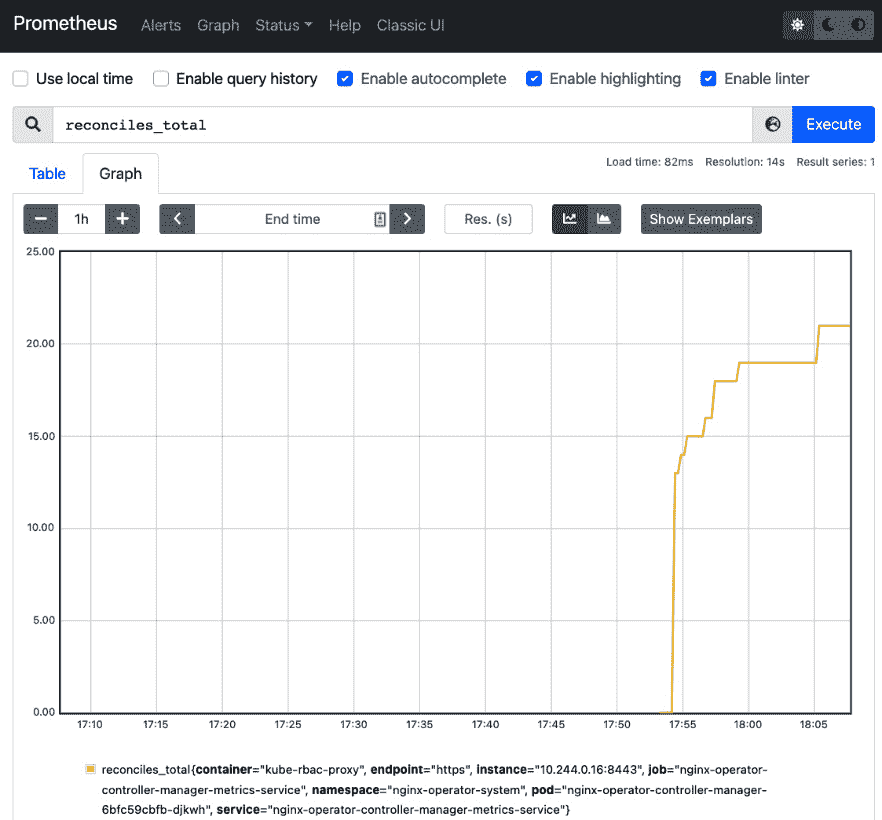

# 第五章：*第五章*：开发一个 Operator —— 高级功能

尽管具有基本安装和升级功能的 Operator 集群相比于非 Operator 基础的 Kubernetes 集群有了显著的改进，但仍有更多的工作可以提高集群管理和用户体验。高级功能可以帮助用户实现更复杂的自动化，指导故障恢复，并通过度量和状态更新等功能来支持数据驱动的部署决策。

这些是 **能力模型** 中更高级的 Operator 的一些基本功能（如 *第一章* *Operator 框架介绍* 所述）。因此，本章将首先解释实现高级功能的成本与收益（相对于所需的努力），然后在接下来的章节中演示如何添加这些功能：

+   理解高级功能的需求

+   报告状态条件

+   实现度量报告

+   实现领导者选举

+   添加健康检查

方便的是，实现这些功能所需的代码不需要对现有 Operator 代码进行重大重构。实际上，能力模型的层次结构和 Operator SDK 提供的开发模式鼓励这种迭代式构建。因此，本章的目标是基于 *第四章* *使用 Operator SDK 开发 Operator* 中的基本 Operator 代码，构建一个能够提供我们刚才列出功能的更复杂的 Operator。

# 技术要求

本章中展示的示例是在 *第四章* *使用 Operator SDK 开发 Operator* 中开始的项目代码基础上构建的。因此，建议从该章节（及其前提条件）开始，该章节涵盖了项目初始化和基本的 Operator 功能。但这不是必需的，本章中的各个部分通常可以应用于任何 Operator SDK 项目。也就是说，任何由 Operator SDK 初始化的项目都可以按照以下步骤进行操作，你不需要专门实现前面章节中的所有代码。

鉴于此，本章的要求如下：

+   任何现有的 Operator SDK 项目

+   Go 1.16+

本章的《代码实战》视频可以通过以下链接观看：[`bit.ly/3zbsvD0`](https://bit.ly/3zbsvD0)

# 理解高级功能的需求

在构建并准备好部署一个基本且功能完整的操作符后，您可能会问：我还需要做什么？事实上，现在您的操作数（operand）可以安装，并且其健康状况由操作符管理，可能不需要做更多事情了。这对于一个操作符来说是完全可以接受的功能水平。实际上，最好从一个简单的操作符开始，随着开发资源的增加逐步迭代（回想一下在*第三章*中讨论的内容，*设计操作符 – CRD、API 和目标协调*）。

关键是，在开发您的操作符时，停在这里并不丢人。能力模型（Capability Model）定义低级操作符是有原因的（换句话说，如果只能安装操作数的操作符不可接受，那么为什么要定义第一级操作符呢？）。

然而，能力模型（Capability Model）确实也定义了更高层次的操作符（Operator），其背后有原因。例如，很容易想象，在用户与您的操作符交互的过程中，他们可能希望查看更多有关其在生产环境中表现的详细信息。这是为操作符添加自定义指标的一个好例子。或者，也可能存在一个常见的故障状态，难以调试（在这种情况下，状态条件可以帮助以更高效的方式揭示更多关于故障的信息）。

以下几个部分只是一些最常见的附加功能，它们有助于将操作符提升到更高的功能水平。部分内容也在操作符 SDK 文档中的*高级主题*（[`sdk.operatorframework.io/docs/building-operators/golang/advanced-topics/`](https://sdk.operatorframework.io/docs/building-operators/golang/advanced-topics/)）中有更详细的介绍。当然，列出您可以为操作符添加的每个可能的功能是不现实的。但希望这些例子能为您的开发提供一个良好的起点。

# 报告状态条件

状态条件在*第三章*中讨论过，*设计操作符 – CRD、API 和目标协调*，作为一种高效地将操作符健康状况的可读信息传达给管理员的方式。通过直接在操作符的**自定义资源定义**（**CRD**）中呈现，它们提供的信息更容易突出显示，并在更集中的调试起始点中查看。这样，它们相较于错误日志具有优势，后者可能包含大量无关信息，且往往缺乏直接的上下文，难以追溯到根本原因。

在 Operator 中实现条件变得更容易，因为 `Condition` 类型是在 Kubernetes 1.19 版本左右通过 *KEP-1623*（[`github.com/kubernetes/enhancements/tree/master/keps/sig-api-machinery/1623-standardize-conditions`](https://github.com/kubernetes/enhancements/tree/master/keps/sig-api-machinery/1623-standardize-conditions)）实现的。该类型现在是 Kubernetes API 的一部分，位于 `k8s.io/apimachinery/pkg/api/meta` 模块中。这使得开发者能够以一致的方式理解在 Kubernetes 中如何报告条件，并且享有 Kubernetes API 支持的兼容性保证。

Operator 框架也基于 Kubernetes 类型实现了条件，既在 Operator SDK 中，也在 OLM 创建的 `OperatorCondition` 资源中。本节将涵盖这两种方法。

## Operator CRD 状态

根据在*第三章*中涵盖的 Kubernetes API 约定，*设计 Operator - CRD、API 和目标协调*，对象（包括自定义资源）应包含 `spec` 和 `status` 字段。在 Operator 的情况下，我们已经使用 `spec` 作为配置 Operator 参数的输入。然而，我们尚未修改 `status` 字段。现在，我们将通过在 `api/v1alpha1/nginxoperator_types.go` 中添加条件列表作为新字段来修改它：

```
// NginxOperatorStatus defines the observed state of NginxOperator
```

```
type NginxOperatorStatus struct {
```

```
   // Conditions is the list of status condition updates
```

```
   Conditions []metav1.Condition `json:"conditions"`
```

```
}
```

然后，我们将运行 `make generate`（以更新生成的客户端代码）和 `make manifests`（以使用新字段更新 Operator 的 CRD），或者直接运行 `make`（该命令会运行所有生成器，尽管我们现在不需要其中的一些）。新字段现在已在 CRD 中反映：

```
properties:
```

```
  conditions:
```

```
    description: Conditions is the list of the most recent status condition
```

```
      updates
```

```
    items:
```

```
      description: "Condition contains details for one aspect 
```

```
                   of the current state of this API Resource. 
```

```
                   --- This struct is intended for direct use 
```

```
                   as an array at the field path 
```

```
                   .status.conditions."
```

```
      properties:
```

```
        lastTransitionTime:
```

```
          description: lastTransitionTime is the last time the 
```

```
                       condition transitioned from one status 
```

```
                       to another. This should be when the 
```

```
                       underlying condition changed.  If that 
```

```
                       is not known, then using the time when 
```

```
                       the API field changed is acceptable.
```

```
          format: date-time
```

```
          type: string
```

```
        message:
```

```
          description: message is a human readable message 
```

```
                       indicating details about the 
```

```
                       transition. This may be an empty 
```

```
                       string.
```

```
          maxLength: 32768
```

```
          type: string
```

```
...
```

```
        status:
```

```
          description: status of the condition, one of True, 
```

```
                       False, Unknown.
```

```
          enum:
```

```
          - "True"
```

```
          - "False"
```

```
          - Unknown
```

```
          type: string
```

```
        type:
```

```
          description: type of condition in CamelCase or in 
```

```
                       foo.example.com/CamelCase. --- Many 
```

```
                       .condition.type values are consistent 
```

```
                       across resources like Available, but 
```

```
                       because arbitrary conditions can be 
```

```
                       useful (see .node.status.conditions), 
```

```
                       the ability to deconflict is important. 
```

```
                       The regex it matches is 
```

```
                     (dns1123SubdomainFmt/)?(qualifiedNameFmt)
```

```
          maxLength: 316
```

```
          pattern: ^(a-z0-9?(\.a-z0-9?)*/)?(([A-Za-z0-9][-A-Za-z0-9_.]*)?[A-Za-z0-9])$
```

```
          type: string
```

```
      required:
```

```
      - lastTransitionTime
```

```
      - message
```

```
      - reason
```

```
      - status
```

```
      - type
```

```
      type: object
```

```
    type: array
```

```
required:
```

```
- conditions
```

```
type: object
```

请注意，这也会导入来自 Kubernetes API 的 `Condition` 类型的所有嵌入式验证要求。

现在 Operator 的 CRD 已经有了一个用于报告最新状态条件的字段，代码可以更新以实现这些条件。为此，我们可以使用 `SetStatusCondition()` 辅助函数，该函数可在 `k8s.io/apimachinery/pkg/api/meta` 模块中使用。对于本示例，我们将从一个名为 `OperatorDegraded` 的单个条件开始，默认值为 `False`，表示 Operator 正在成功地协调集群中的更改。然而，如果 Operator 确实遇到错误，我们将更新此条件为 `True`，并附带一个指示错误的消息。这将涉及对 `controllers/nginxoperator_controller.go` 中的 `Reconcile()` 函数进行一些重构，以便与以下内容匹配：

```
func (r *NginxOperatorReconciler) Reconcile(ctx context.Context, req ctrl.Request) (ctrl.Result, error) {
```

```
   logger := log.FromContext(ctx)
```

```
   operatorCR := &operatorv1alpha1.NginxOperator{}
```

```
   err := r.Get(ctx, req.NamespacedName, operatorCR)
```

```
   if err != nil && errors.IsNotFound(err) {
```

```
      logger.Info("Operator resource object not found.")
```

```
      return ctrl.Result{}, nil
```

```
   } else if err != nil {
```

```
      logger.Error(err, "Error getting operator resource object")
```

```
      meta.SetStatusCondition(&operatorCR.Status.Conditions, metav1.Condition{
```

```
         Type:               "OperatorDegraded",
```

```
         Status:             metav1.ConditionTrue,
```

```
         Reason:             "OperatorResourceNotAvailable",
```

```
         LastTransitionTime: metav1.NewTime(time.Now()),
```

```
         Message:            fmt.Sprintf("unable to get operator custom resource: %s", err.Error()),
```

```
      })
```

```
      return ctrl.Result{}, utilerrors.NewAggregate([]error{err, r.Status().Update(ctx, operatorCR)})
```

```
   }
```

上述代码现在将在控制器最初无法访问 Operator 的 CRD 时尝试报告降级状态条件。代码继续如下：

```
   deployment := &appsv1.Deployment{}
```

```
   create := false
```

```
   err = r.Get(ctx, req.NamespacedName, deployment)
```

```
   if err != nil && errors.IsNotFound(err) {
```

```
      create = true
```

```
      deployment = assets.GetDeploymentFromFile("assets/nginx_deployment.yaml")
```

```
   } else if err != nil {
```

```
      logger.Error(err, "Error getting existing Nginx deployment.")
```

```
      meta.SetStatusCondition(&operatorCR.Status.Conditions, metav1.Condition{
```

```
         Type:               "OperatorDegraded",
```

```
         Status:             metav1.ConditionTrue,
```

```
         Reason:             "OperandDeploymentNotAvailable",
```

```
         LastTransitionTime: metav1.NewTime(time.Now()),
```

```
         Message:            fmt.Sprintf("unable to get operand deployment: %s", err.Error()),
```

```
      })
```

```
      return ctrl.Result{}, utilerrors.NewAggregate([]error{err, r.Status().Update(ctx, operatorCR)})
```

```
   }
```

这段代码的工作方式类似于之前的代码，但现在如果 nginx 操作数的 Deployment 清单不可用，它将报告降级状态：

```
   deployment.Namespace = req.Namespace
```

```
   deployment.Name = req.Name
```

```
   if operatorCR.Spec.Replicas != nil {
```

```
      deployment.Spec.Replicas = operatorCR.Spec.Replicas
```

```
   }
```

```
   if operatorCR.Spec.Port != nil {
```

```
      deployment.Spec.Template.Spec.Containers[0].Ports[0].ContainerPort = *operatorCR.Spec.Port
```

```
   }
```

```
   ctrl.SetControllerReference(operatorCR, deployment, r.Scheme)
```

```
   if create {
```

```
      err = r.Create(ctx, deployment)
```

```
   } else {
```

```
      err = r.Update(ctx, deployment)
```

```
   }
```

```
if err != nil {
```

```
   meta.SetStatusCondition(&operatorCR.Status.Conditions, metav1.Condition{
```

```
      Type:               "OperatorDegraded",
```

```
      Status:             metav1.ConditionTrue,
```

```
      Reason:             "OperandDeploymentFailed",
```

```
      LastTransitionTime: metav1.NewTime(time.Now()),
```

```
      Message:            fmt.Sprintf("unable to update operand deployment: %s", err.Error()),
```

```
   })
```

```
   return ctrl.Result{}, utilerrors.NewAggregate([]error{err, r.Status().Update(ctx, operatorCR)})
```

```
}
```

如果更新操作数部署的尝试失败，则此块将报告操作员处于降级状态。如果控制器能够成功通过此点，则无需报告降级。因此，下一块代码将通过更新操作员的 CRD 来结束函数，显示没有降级条件。

```
   meta.SetStatusCondition(&operatorCR.Status.Conditions, metav1.Condition{
```

```
      Type:               "OperatorDegraded",
```

```
      Status:             metav1.ConditionFalse,
```

```
      Reason:             "OperatorSucceeded",
```

```
      LastTransitionTime: metav1.NewTime(time.Now()),
```

```
      Message:            "operator successfully reconciling",
```

```
   })
```

```
   return ctrl.Result{}, utilerrors.NewAggregate([]error{err, r.Status().Update(ctx, operatorCR)})
```

```
}
```

在这段代码中，我们添加了四个`SetStatusCondition()`调用，其中类型为`"OperatorDegraded"`的条件会更新为当前时间和简短的原因：

1.  如果操作员无法访问其自定义资源（除非是简单的`IsNotFound`错误），则将条件设置为`True`，并注明原因`OperatorResourceNotAvailable`。

1.  如果无法从嵌入的 YAML 文件中获取 nginx 部署清单，则将条件更新为`True`，并注明原因`OperandDeploymentNotAvailable`。

1.  如果成功找到部署清单，但创建或更新操作失败，则将条件设置为`True`，并注明原因`OperandDeploymentFailed`。

1.  最后，如果`Reconcile()`函数执行完成且没有严重错误，则将`OperatorDegraded`条件设置为`False`。

    成功与失败的指标

    请注意，正如在*第三章*《设计操作员——CRD、API 和目标协调》中讨论的那样，`False`条件表示成功运行。我们也可以反转这个逻辑，将条件命名为`OperatorSucceeded`，在这种情况下，默认条件为`True`，任何失败都会将条件更改为`False`。这样做仍然符合 Kubernetes 的约定，因此，最终的决定由开发者根据他们希望传达的意图来做出。

在这个示例中，我们为每个`Reason`更新使用了字符串字面量。在实际应用中，通常会在操作员的 API 中定义各种`Reason`常量，以便保持一致性和可重用性。例如，我们可以在`api/v1alpha1/nginxoperator_types.go`中定义以下内容，并通过常量名称来使用它们：

```
const (
```

```
 ReasonCRNotAvailable  = "OperatorResourceNotAvailable"
```

```
 ReasonDeploymentNotAvailable = "OperandDeploymentNotAvailable"
```

```
   ReasonOperandDeploymentFailed = "OperandDeploymentFailed"
```

```
   ReasonSucceeded               = "OperatorSucceeded"
```

```
)
```

条件原因的命名方案由开发者决定，唯一的 Kubernetes 条件要求是必须使用驼峰命名法（CamelCase）。因此，不同的条件类型和原因可以根据具体操作员的需求进行命名。当前唯一存在的标准条件名称是`Upgradeable`，该条件由 OLM 使用。我们将在下一节中展示如何使用该条件。

实现这些条件后，我们将在与我们的操作员自定义资源交互时看到以下输出：

```
$ kubectl describe nginxoperators/cluster
```

```
Name:         cluster
```

```
Namespace:    nginx-operator-system
```

```
API Version:  operator.example.com/v1alpha1
```

```
Kind:         NginxOperator
```

```
Metadata:
```

```
  Creation Timestamp:  2022-01-20T21:47:32Z
```

```
  Generation:          1
```

```
...
```

```
Spec:
```

```
  Replicas:  1
```

```
Status:
```

```
  Conditions:
```

```
    Last Transition Time:  2022-01-20T21:47:32Z
```

```
    Message:               operator successfully reconciling
```

```
    Reason:                OperatorSucceeded
```

```
    Status:                False
```

```
    Type:                  OperatorDegraded
```

在下一节中，我们将展示如何将操作员条件直接报告给 OLM。

## 使用 OLM OperatorCondition

我们已经讨论了 OLM 如何管理当前已安装的 Operator 列表，包括升级和降级。在 *第七章*，《使用 Operator 生命周期管理器安装和运行 Operators》中，我们将展示 OLM 在一些功能中的实际应用。但是，目前我们可以在我们的 Operator 中实现条件报告，以便 OLM 能够了解可能会阻止 Operator 升级的某些状态。结合 Operator 特有的状态条件（如在其 CRD 中报告的状态），这可以帮助 OLM 获取有关 Operator 当前状态的关键信息。

要读取 Operator 条件，OLM 会创建一个名为 `OperatorCondition` 的自定义资源。OLM 会自动为它管理的每个 Operator 创建该对象的实例，来自一个 CRD。一个示例 `OperatorCondition` 对象如下所示：

```
apiVersion: operators.coreos.com/v1
```

```
kind: OperatorCondition
```

```
metadata:
```

```
  name: sample-operator
```

```
  namespace: operator-ns
```

```
status:
```

```
  conditions:
```

```
  - type: Upgradeable
```

```
    status: False
```

```
    reason: "OperatorBusy"
```

```
    message: "Operator is currently busy with a critical task"
```

```
    lastTransitionTime: "2022-01-19T12:00:00Z"
```

该对象使用的是与之前相同的 Kubernetes API 中的 `Condition` 类型（当实现 Operator CRD 中的状态条件时）。这意味着它也包括相同的字段，如 `type`、`status`、`reason` 和 `message`，这些字段可以像之前一样更新。不同之处在于，现在将 `type` 设置为 `Upgradeable` 会指示 OLM 阻止任何升级 Operator 的尝试。

另一个不同之处在于，Operator 需要将此状态更改报告给不同的 CRD（而不是其自身）。为此，可以使用 [`github.com/operator-framework/operator-lib`](https://github.com/operator-framework/operator-lib) 上提供的库，其中包括更新 `OperatorCondition` CRD 的辅助函数。有关使用此库的详细信息，请参考 Operator Framework 增强功能库，地址为 [`github.com/operator-framework/enhancements/blob/master/enhancements/operator-conditions-lib.md`](https://github.com/operator-framework/enhancements/blob/master/enhancements/operator-conditions-lib.md)。一种实现方法是通过修改 `controllers/nginxoperator_controller.go` 中的 `Reconcile()` 函数，如下所示：

```
import (
```

```
...
```

```
   apiv2 "github.com/operator-framework/api/pkg/operators/v2"
```

```
   "github.com/operator-framework/operator-lib/conditions"
```

```
)
```

```
func (r *NginxOperatorReconciler) Reconcile(ctx context.Context, req ctrl.Request) (ctrl.Result, error) {
```

```
...
```

```
  condition, err := conditions.InClusterFactory{r.Client}.
```

```
   NewCondition(apiv2.ConditionType(apiv2.Upgradeable))
```

```
  if err != nil {
```

```
   return ctrl.Result{}, err
```

```
  }
```

```
  err = condition.Set(ctx, metav1.ConditionTrue,
```

```
   conditions.WithReason("OperatorUpgradeable"),
```

```
   conditions.WithMessage("The operator is upgradeable"))
```

```
  if err != nil {
```

```
   return ctrl.Result{}, err
```

```
  }
```

```
...
```

```
}
```

这段代码导入了两个新模块：Operator Framework V2 API 和 `operator-lib/conditions` 库。它接着实例化了一个新的 `Factory` 对象，该对象使用了已经可用的 Kubernetes 客户端。然后，工厂可以使用 `NewCondition()` 创建新的 `Condition` 对象，该函数接受 `ConditionType`（实质上是一个字符串），并基于此类型创建一个条件。

在这个示例中，`Condition` 是使用 `apiv2.Upgradeable` 类型创建的，这是 Operator Framework 为 `Upgradeable` 状态定义的常量，该状态被 OLM 理解。

接下来，`condition.Set()` 函数更新 OLM 为我们的 Operator 创建的 `OperatorCondition` CRD 对象。具体来说，它将新创建的条件以及传递给它的状态（在此情况下为 `True`）添加到（或更新）条件列表中。此外，还有两个可以选择传递给 `Set()` 的函数（`WithReason()` 和 `WithMessage()`），它们分别用于设置条件的原因和消息。

使用这些辅助函数可以大大简化从 OLM 为我们的 Operator 创建的 `OperatorCondition` CRD 对象中检索和更新的工作。此外，OLM 还会采取措施确保 Operator 无法删除 CRD 或修改对象状态以外的任何内容。然而，`OperatorCondition` CRD `spec` 中仍有一些其他字段可以由管理员修改。具体来说，`overrides` 字段允许用户手动绕过自动报告的条件更新，这些更新本应阻止升级。该字段的示例用法如下：

```
apiVersion: operators.coreos.com/v1
```

```
kind: OperatorCondition
```

```
metadata:
```

```
  name: sample-operator
```

```
  namespace: operator-ns
```

```
spec:
```

```
  overrides:
```

```
  - type: Upgradeable
```

```
    status: True
```

```
    reason: "OperatorIsStable"
```

```
    message: "Forcing an upgrade to bypass bug state"
```

```
status:
```

```
  conditions:
```

```
  - type: Upgradeable
```

```
    status: False
```

```
    reason: "OperatorBusy"
```

```
    message: "Operator is currently busy with a critical task"
```

```
    lastTransitionTime: "2022-01-19T12:00:00Z"
```

像这样使用 `overrides` 可以在遇到已知问题或错误时非常有用，这些问题或错误不应阻止 Operator 升级。

# 实现指标报告

指标是任何 Kubernetes 集群中至关重要的一部分。指标工具可以提供集群中几乎所有可衡量数据的详细洞察。这也是为什么指标是将 Operator 提升到能力模型第四级的关键因素。事实上，大多数原生 Kubernetes 控制器已经报告了关于自身的指标，例如 `schedule_attempts_total`，它报告调度器尝试将 Pods 调度到节点上的次数。

Kubernetes 监控架构的原始设计（[`github.com/kubernetes/design-proposals-archive/blob/main/instrumentation/monitoring_architecture.md`](https://github.com/kubernetes/design-proposals-archive/blob/main/instrumentation/monitoring_architecture.md)）定义了像 `schedule_attempts_total` 这样的指标作为 **服务指标**。服务指标的替代品是 **核心指标**，即通常可以从所有组件中获取的指标。核心指标目前包括关于 CPU 和内存使用情况的信息，并由 Kubernetes **metrics-server** 应用程序抓取（[`github.com/kubernetes-sigs/metrics-server`](https://github.com/kubernetes-sigs/metrics-server)）。

另一方面，服务指标公开了在各个组件的代码中定义的特定应用程序数据。所有这些数据都可以通过 **Prometheus**（[`prometheus.io`](https://prometheus.io)）或 **OpenTelemetry**（[`opentelemetry.io`](https://opentelemetry.io)）等工具抓取和聚合，并通过前端可视化应用程序（如 **Grafana**（[`grafana.com`](https://grafana.com)））呈现。

在 Kubernetes 中，度量的整个概念远远超出了仅与 Operator 的实现相关的部分。虽然这意味着有很多信息超出了本章节的范围，但有大量社区和文档资源可以覆盖此主题的基础知识。因此，本节将专注于针对新的服务度量的相关 Operator 实现步骤，假设读者已经具备了关于度量的基本了解。

## 添加自定义服务度量

当项目初始化时，`operator-sdk`生成的样板代码已经包括了暴露 Operator Pod 中度量端点所需的代码和依赖项。默认情况下，这是位于端口`8080`上的`/metrics`路径。这消除了需要精心编写 HTTP 处理程序代码的麻烦，并允许我们将精力集中在实现度量本身上，如 Prometheus 文档中所述（[`prometheus.io/docs/guides/go-application/#adding-your-own-metrics`](https://prometheus.io/docs/guides/go-application/#adding-your-own-metrics)）。

Kubebuilder 度量

内置的度量处理程序代码是 Operator SDK 的另一个方面，实际上是由 Kubebuilder 提供的。此实现依赖于从`sigs.k8s.io/controller-runtime`导入的度量库。该库包括如全局度量注册表等功能，已经对核心 Operator 代码可用。该库易于接入，以便从 Operator 的代码库中的任何位置注册新度量并更新它们。关于度量及其使用的更多信息，可以在 Kubebuilder 文档中找到，地址是[`book.kubebuilder.io/reference/metrics.html`](https://book.kubebuilder.io/reference/metrics.html)。

构建此功能的`controller-runtime`库已经包含有关 Operator 控制器代码的若干指标，每个指标以`controller_runtime_`为前缀。这些指标包括：

+   `controller_runtime_reconcile_errors_total` – 一个计数器指标，显示`Reconcile()`函数返回非 nil 错误的累计次数

+   `controller_runtime_reconcile_time_seconds_bucket` – 一个显示单个同步尝试延迟的直方图

+   `controller_runtime_reconcile_total` – 一个计数器，每次尝试调用`Reconcile()`时都会增加

在这个示例中，我们将重新创建最后一个指标`controller_runtime_reconcile_total`，作为报告我们的 Operator 在集群中尝试同步其状态的次数的一种方式。

## RED 指标

在定义任何应用程序中的指标类型时，可能性几乎是无限的。这可能会让开发人员感到决策疲劳，因为看似没有好的起点。那么，Operator 应该暴露哪些最重要的指标呢？Operator SDK 文档建议遵循 **RED 方法**，该方法概述了每个服务在 Kubernetes 集群中应该暴露的三种关键类型的指标：

+   `hotloop` 条件或次优请求管道。

+   `controller_runtime_reconcile_errors_total`）。当与 Rate 指标相关联时，这可以帮助调试常见的故障，这些故障正在降低 Operator 的性能。

+   `controller_runtime_reconcile_time_seconds`）。此信息可以指示性能差或其他降低集群健康状况的情况。

这些基础指标可以为定义 **服务级目标** (**SLOs**) 提供基础，以确保你的 Operator 在应用程序的预期标准范围内运行。

为了开始将自定义指标添加到我们的 Operator，最好将指标定义组织到它们自己的包中，方法是创建一个新的文件 `controllers/metrics/metrics.go`。这个新模块将保存我们新指标的声明，并将其自动注册到来自 `sigs.k8s.io/controller-runtime/pkg/metrics` 的全局注册表中。在以下代码中，我们定义了这个文件并实例化了一个新的自定义指标：

controllers/metrics/metrics.go：

```
package metrics
```

```
import (
```

```
   "github.com/prometheus/client_golang/prometheus"
```

```
   "sigs.k8s.io/controller-runtime/pkg/metrics"
```

```
)
```

```
var (
```

```
   ReconcilesTotal = prometheus.NewCounter(
```

```
      prometheus.CounterOpts{
```

```
         Name: "reconciles_total",
```

```
         Help: "Number of total reconciliation attempts",
```

```
      },
```

```
   )
```

```
)
```

```
func init() {
```

```
   metrics.Registry.MustRegister(ReconcilesTotal)
```

```
}
```

这个文件依赖于 Prometheus 客户端库来定义一个新的计数器（一个简单的递增指标），我们将其存储在 `ReconcilesTotal` 公共变量中。该指标的实际名称是 `reconciles_total`，这是暴露给 Prometheus 的名称。

指标命名最佳实践

在实际环境中，最好在指标名称前添加特定于导出该指标的应用程序的前缀。这是推荐的最佳实践之一，建议将 `_total` 用于这个累计指标。熟悉这些实践非常有帮助，不仅有助于你开发自己的指标，还能帮助你了解在与其他指标交互时需要期待什么。

通过这个文件的 `init()` 函数自动将新指标注册到全局注册表中，我们现在可以在 Operator 的代码中的任何地方更新这个指标。由于这是衡量控制器进行的所有协调尝试的总数，所以在 `controllers/nginxoperator_controller.go` 中的 `Reconcile()` 函数声明开始时更新它是合理的。这可以通过以下两行新代码来实现：

controllers/nginxoperator_controller.go：

```
import (
```

```
...
```

```
  "github.com/sample/nginx-operator/controllers/metrics"
```

```
...
```

```
)
```

```
func (r *NginxOperatorReconciler) Reconcile(...) (...) {
```

```
  metrics.ReconcilesTotal.Inc()
```

```
  ...
```

```
}
```

所需要做的就是导入刚刚创建的新`metrics`包，并调用`metrics.ReconcilesTotal.Inc()`。该函数不返回任何内容，因此无需添加任何错误处理或状态更新。我们还希望将其放在函数的第一行，因为目标是对每次调用`Reconcile()`（无论调用是否成功）进行递增。

更新的指标值会通过由 kubebuilder 初始化的指标端点自动报告，因此可以通过正确配置的 Prometheus 实例查看，如下所示：



图 5.1 – Prometheus UI 中 reconciles_total 指标图表的截图

与内置的`controller_runtime_reconcile_total`指标相比，我们看到值是相同的：


图 5.2 – 比较自定义 reconciles_total 指标与内置 controller_runtime_reconcile_total 指标的截图

我们将在*第六章*中详细介绍如何安装和配置 Prometheus 来捕获这个自定义指标，*构建和部署您的 Operator*。

# 实现领导者选举

领导者选举是任何分布式计算系统中的一个重要概念，不仅仅是 Kubernetes（也不仅仅是针对 Operators）。高可用性应用程序通常会部署多个副本的工作负载 Pods，以支持用户期望的正常运行时间保证。在只能有一个工作负载 Pod 在集群中执行工作的情况下，该副本被称为**领导者**。其余的副本将等待，虽然在运行但没有做任何重要的工作，直到当前的领导者不可用或放弃其领导者身份。然后这些 Pods 会自行决定谁应该成为新的领导者。

启用正确的领导者选举可以大大提升应用程序的正常运行时间。这可以包括在一个副本失败时进行优雅的故障切换处理，或者帮助在滚动升级期间保持应用程序的可访问性。

Operator SDK 使得为 Operators 实现领导者选举变得简单。通过`operator-sdk`生成的样板代码会在我们的 Operator 中创建一个标志`--leader-elect`，默认值为`false`，表示禁用领导者选举。该标志会传递给控制器初始化函数`ctrl.NewManager()`中的`LeaderElection`选项值：

main.go：

```
func main() {
```

```
...
```

```
   var enableLeaderElection bool
```

```
   flag.BoolVar(&enableLeaderElection, "leader-elect", false,
```

```
      "Enable leader election for controller manager. "+
```

```
         "Enabling this will ensure there is only one active controller manager.")
```

```
...
```

```
   mgr, err := ctrl.NewManager(ctrl.GetConfigOrDie(), ctrl.Options{
```

```
...
```

```
      HealthProbeBindAddress: probeAddr,
```

```
      LeaderElection:         enableLeaderElection,
```

```
      LeaderElectionID:       "df4c7b26.example.com",
```

```
   })
```

```
   if err != nil {
```

```
      setupLog.Error(err, "unable to start manager")
```

```
      os.Exit(1)
```

```
   }
```

`LeaderElectionID`字段表示 Operator 用于持有领导者锁的资源名称。

该设置（使用`ctrl.NewManager()`中的`LeaderElection`选项）将操作员设置为使用两种可能的领导选举策略中的第一个，即**带租约的领导**。另一种可能的领导选举策略是**终身领导**。每种策略都有一些优点和权衡，如 Operator SDK 文档中所描述的([`sdk.operatorframework.io/docs/building-operators/golang/advanced-topics/#leader-election`](https://sdk.operatorframework.io/docs/building-operators/golang/advanced-topics/#leader-election))。

+   **带租约的领导** – 默认的领导选举策略，其中当前领导者定期尝试续期其领导者身份（称为其*租约*）。如果无法续期，领导者会将其职位交给新的领导者。此策略通过在必要时快速切换领导者来提高可用性。然而，该策略可能导致所谓的**脑裂**场景，其中多个副本认为自己是领导者。

+   在调用`ctrl.NewManager()`时，`RenewDeadline`和`LeaseDuration`字段用于为集群中最快和最慢节点之间的时钟偏差比率添加大致的容忍度。这是因为`LeaseDuration`是当前非领导者在尝试获取领导权之前将等待的时间，而`RenewDeadline`是控制平面等待刷新当前领导权的时间。因此，举个例子，将`LeaseDuration`设置为`RenewDeadline`的某个倍数，将在集群内为该时钟偏差比率添加容忍度。

    例如，假设当前领导者运行在节点 A 上，该节点的时间保持准确。如果备份副本运行在节点 B 上，该节点的速度较慢并且时间比节点 A 慢一半，那么节点 A 和节点 B 之间存在 2:1 的时钟偏差比率。

    在这种情况下，如果领导者的`LeaseDuration`为 1 小时并因某种原因失败，则可能需要 2 小时才能让节点 B 注意到租约已过期并尝试获取新租约。

    然而，如果`RenewDeadline`为 30 分钟，原始领导者将在该时间范围内无法续约其租约。这允许运行在较慢节点上的副本仅按其认为的 30 分钟进行操作，但实际时间已超过`LeaseDuration`的 1 小时。这是领导选举库中的一个隐蔽细节，但对于可能受此时钟偏差影响的集群操作员而言，值得注意。有关此主题的更多讨论，可以参考原始 GitHub 拉取请求，内容为将领导选举添加到 Kubernetes 客户端，链接为[`github.com/kubernetes/kubernetes/pull/16830`](https://github.com/kubernetes/kubernetes/pull/16830)。

为了使我们的操作员可配置，以便用户可以在带租约的领导选举策略和终身领导选举策略之间进行选择，我们可以利用现有的`--leader-elect`标志来启用或禁用对`leader.Become()`函数的调用：

```
import (
```

```
   "github.com/operator-framework/operator-lib/leader"
```

```
   ...
```

```
   )
```

```
var (
```

```
   ...
```

```
   setupLog = ctrl.Log.WithName("setup")
```

```
   )
```

```
func main() {
```

```
   ...
```

```
   var enableLeaderElection bool
```

```
   flag.BoolVar(&enableLeaderElection, "leader-elect", false,
```

```
      "Enable leader election for controller manager. "+
```

```
         "Enabling this will ensure there is only one active controller manager.")
```

```
   ...
```

```
   if !enableLeaderElection {
```

```
      err := leader.Become(context.TODO(), "nginx-lock")
```

```
      if err != nil {
```

```
         setupLog.Error(err, "unable to acquire leader lock")
```

```
         os.Exit(1)
```

```
      }
```

```
   }
```

```
   mgr, err := ctrl.NewManager(ctrl.GetConfigOrDie(), ctrl.Options{
```

```
      ...
```

```
      LeaderElection:         enableLeaderElection,
```

```
      LeaderElectionID:       "df4c7b26.example.com",
```

```
   })
```

现在，我们的 Operator 将始终使用某种方式的领导者选举。`leader.Become()`函数是一个阻塞调用，如果无法获取领导者锁，它将阻止 Operator 的运行。它将每秒尝试一次。如果成功，它将创建一个 ConfigMap 作为锁（在我们的例子中，这个 ConfigMap 将命名为 nginx-lock）。

# 添加健康检查

健康检查（也称为存活性和就绪性探针）是任何 Pod 使其当前功能状态可以被集群中其他组件发现的一种方式。通常是通过在容器中暴露一个端点来完成的（传统上`/healthz`用于存活性检查，`/readyz`用于就绪性检查）。其他组件（如 kubelet）可以访问该端点，以确定 Pod 是否健康并准备好服务请求。该主题在 Kubernetes 文档中有详细的说明，详见[`kubernetes.io/docs/tasks/configure-pod-container/configure-liveness-readiness-startup-probes/`](https://kubernetes.io/docs/tasks/configure-pod-container/configure-liveness-readiness-startup-probes/)。

`main.go`中由 Operator SDK 初始化的代码默认包含了`healthz`和`readyz`检查的设置：

main.go

```
import (
```

```
  ...
```

```
  "sigs.k8s.io/controller-runtime/pkg/healthz"
```

```
)
```

```
func main() {
```

```
...
```

```
   mgr, err := ctrl.NewManager(ctrl.GetConfigOrDie(),   ctrl.Options{
```

```
   Scheme:                 scheme,
```

```
   MetricsBindAddress:     metricsAddr,
```

```
   Port:                   9443,
```

```
   HealthProbeBindAddress: probeAddr,
```

```
   LeaderElection:         enableLeaderElection,
```

```
   LeaderElectionID:       "df4c7b26.example.com",
```

```
   })
```

```
...
```

```
    if err := mgr.AddHealthzCheck("healthz", healthz.Ping); err != nil {
```

```
      setupLog.Error(err, "unable to set up health check")
```

```
      os.Exit(1)
```

```
   }
```

```
   if err := mgr.AddReadyzCheck("readyz", healthz.Ping); err != nil {
```

```
      setupLog.Error(err, "unable to set up ready check")
```

```
      os.Exit(1)
```

```
   }
```

```
   setupLog.Info("starting manager")
```

```
   if err := mgr.Start(ctrl.SetupSignalHandler()); err != nil {
```

```
      setupLog.Error(err, "problem running manager")
```

```
      os.Exit(1)
```

```
   }
```

```
}
```

这段代码设置了两个端点，在主控制器启动之前立即开始提供服务。这是有意义的，因为此时，所有其他启动代码已经运行完毕。在尝试创建客户端连接之前，开始宣传你的 Operator 为健康和准备好服务请求是没有意义的。

这两个函数，`mgr.AddHealthzCheck`和`mgr.AddReadyzCheck`，每个都接受两个参数：一个字符串（用于检查的名称）和一个返回检查状态的函数。该函数必须具有以下签名：

```
func(*http.Request) error
```

该签名显示该函数接受一个 HTTP 请求（因为该检查正在提供一个端点，该端点将被 kubelet 等组件查询），并返回一个错误（如果检查失败）。在这段代码中，Operator 已经填充的`healthz.Ping`函数是一个简单的`nil`错误（表示成功）。这虽然没有太多洞察力，但它在代码中的位置提供了至少报告 Operator 已成功通过大部分初始化过程的最小信息。

然而，在前面的函数签名之后，可以实现自定义健康检查。只需再次调用`mgr.AddHealthzCheck`或`mgr.AddReadyzCheck`（取决于检查类型），并将新函数传递给每个调用，即可添加这些附加检查。当查询`/healthz`或`/readyz`端点时，这些检查会按顺序运行（没有保证的顺序），如果有任何检查失败，则返回`HTTP 500`状态。通过这种方式，可以开发具有更复杂逻辑的存活性和就绪性检查，这些逻辑是针对你的 Operator 独特的（例如，在报告就绪性之前，依赖组件需要可访问）。

# 总结

本章突出了一些功能选项，超出了在*第四章*，*使用 Operator SDK 开发操作符* 中建立的最低限度。这个列表显然不会详尽列举每种高级功能的可能性，但旨在展示一些添加到操作符中最常见的附加功能。此时，一些特性开发模式应该开始变得清晰起来（例如，启动和初始化代码通常放在 `main.go` 中，而与核心逻辑相关的功能可以很好地与 `nginxoperator_controller.go` 中的控制器代码或其自己的包中适配）。

本章的工作展示了从低级功能逐步提升到能力模型中更高级别的操作符所需的一些步骤。例如，度量指标是四级（*深入洞察*）操作符的关键方面，因此，这是期望用户使用的最高功能操作符之一。此外，领导选举可以帮助建立故障转移过程（在达到三级 – *全生命周期* 时非常有帮助）。添加这样的功能有助于构建一个有用且功能丰富的操作符，提高应用程序性能，进而提升用户体验。

在下一章中，我们将开始编译在*第四章*，*使用 Operator SDK 开发操作符*，以及*第五章*，*开发操作符 – 高级功能* 中构建的代码。然后，我们将演示如何在本地 Kubernetes 集群中部署此代码并运行我们的 nginx 操作符（不使用 OLM）。这将是一个有用的开发过程，因为在测试环境中绕过 OLM 可以简化和加快我们迭代和测试新变更的能力。
