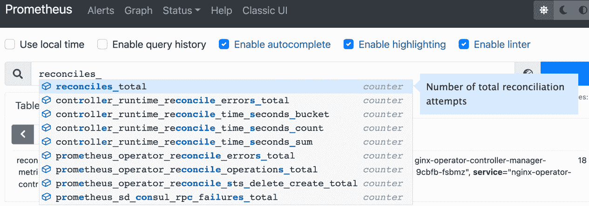

# *第六章*：构建和部署您的 Operator

到目前为止，我们已经编写了大量代码，以便开发由基础模板 Operator SDK 项目提供的 `make` 命令，用于构建容器镜像并手动将该镜像部署到正在运行的 Kubernetes 集群中。此外，本章将继续跟进这些步骤，提供迭代开发的指导步骤，其中 Operator 中的更改将被编译并推送到集群中。最后，我们将提供故障排除资源和在此过程中可能遇到的问题的解决建议。这些部分将分为以下内容：

+   构建容器镜像

+   在测试集群中进行部署

+   推送和测试变更

+   故障排除

请注意，在本章过程中，将使用本地构建命令手动运行 Operator。对于本地开发和非生产环境中的测试，这是非常有用的，因为它快速且不依赖于额外的组件，最大限度地减少了部署概念验证测试用例所需的时间和资源。在实际环境中，最好使用**Operator 生命周期管理器**来安装和管理 Operator。这个过程将在*第七章*中更详细地介绍，标题为 *使用 Operator 生命周期管理器安装和运行 Operator*。现在，我们将继续在测试集群中进行本地部署。

# 技术要求

本章将依赖前几章的代码来构建容器镜像，并将该镜像部署到 Kubernetes 集群中。因此，本章的技术要求需要访问一个集群和像 Docker 这样的容器管理工具。然而，使用前几章的代码并非强制要求，因为所解释的命令和过程适用于任何 `operator-sdk` 项目。因此，本章的最低推荐要求如下：

+   互联网连接（用于拉取 Docker 基础镜像并将构建好的容器镜像推送到公共注册表）。

+   访问一个运行中的 Kubernetes 集群。这可以是任何集群，尽管推荐使用像 **Kubernetes in Docker** (**kind**) ([`kind.sigs.k8s.io/`](https://kind.sigs.k8s.io/)) 或 **minikube** ([`minikube.sigs.k8s.io/docs/`](https://minikube.sigs.k8s.io/docs/)) 这样的工具，以便在需要时可以轻松销毁并重新创建集群。

+   计算机上安装了最新版本的 `kubectl`（[`kubernetes.io/docs/tasks/tools/#kubectl`](https://kubernetes.io/docs/tasks/tools/#kubectl)），用于与 Kubernetes 集群进行交互。

+   本地安装了 Docker，并且在 `Makefile` 文件中生成的 Operator SDK 项目中假设 `docker` 二进制文件会在本地可用。因此，需要额外的本地设置（例如，将 `docker` 命令别名为 `buildah`），本章不涉及这部分内容，但这是必须的。

本章介绍了前面几个项目，其中一些需要额外的设置。此外，部分项目（例如 kind）在本教程中仅用于创建一个标准的测试环境以供跟随。在这些情况下，如果您对其他工具更为熟悉，可以按需选择。对于本章中介绍的每项技术，若有需要帮助的地方，本章末尾的 *故障排除* 部分提供了更多资源。然而，本章中所选的技术使用案例相对简单，旨在指导您最大限度地减少技术问题的风险。

注意

使用没有任何访问凭证的公共注册表会使您的 Operator 镜像对互联网上的任何人开放。虽然对于像这样的教程来说可能没问题，但对于生产镜像，您可能希望进一步了解如何保护您的镜像注册表（这超出了本书的范围）。

本章的《Code in Action》视频可以在以下网址观看：[`bit.ly/3NdVZ7s`](https://bit.ly/3NdVZ7s)

# 构建容器镜像

Kubernetes 是一个容器编排平台，意味着它被设计用来运行已经构建成容器的应用程序。即使是 Kubernetes 的核心系统组件，如 API 服务器和调度器，也以容器的形式运行。因此，Kubernetes 开发的 Operators 也必须作为容器来构建和部署，这一点应该不足为奇。

对于这个过程，了解容器操作的基础知识是有帮助的。然而，幸运的是，Operator SDK 抽象化了许多配置和命令行操作，通过简单的 `Makefile` 目标进行处理。这些是构建宏，帮助自动化编译二进制文件和容器镜像的过程（以及将这些镜像推送到注册表并在集群中部署它们）。

要查看 Operator SDK 提供的所有可用目标列表，请在项目中运行 `make help` 命令：

```
$ make help
Usage:
  make <target>
General
  help             Display this help.
Development
  manifests        Generate WebhookConfiguration, ClusterRole and CustomResourceDefinition objects.
  generate         Generate code containing DeepCopy, DeepCopyInto, and DeepCopyObject method implementations.
  fmt              Run go fmt against code.
  vet              Run go vet against code.
  test             Run tests.
Build
  build            Build manager binary.
  run              Run a controller from your host.
  docker-build     Build docker image with the manager.
  docker-push      Push docker image with the manager.
Deployment
  install          Install CRDs into the K8s cluster specified in ~/.kube/config.
  uninstall        Uninstall CRDs from the K8s cluster specified in ~/.kube/config.
  deploy           Deploy controller to the K8s cluster specified in ~/.kube/config.
  undeploy         Undeploy controller from the K8s cluster specified in ~/.kube/config.
  controller-gen   Download controller-gen locally if necessary.
  kustomize        Download kustomize locally if necessary.
  envtest          Download envtest-setup locally if necessary.
  bundle           Generate bundle manifests and metadata, then validate generated files.
  bundle-build     Build the bundle image.
  bundle-push      Push the bundle image.
  opm              Download opm locally if necessary.
  catalog-build    Build a catalog image.
  catalog-push     Push a catalog image.
```

其中一些命令，如 `make manifests` 和 `make generate`，在前面的章节中已经使用过，用于初始化项目并生成 Operator 的 API 和 `Build` 头文件。具体来说，`make build` 和 `make docker-build`，前者负责编译 Operator 的本地二进制文件，后者则构建容器镜像。

## 本地构建 Operator

首先，让我们来看看 `make build`。从 `Makefile` 中，定义非常简单：

```
build: generate fmt vet ## Build manager binary.
```

```
  go build -o bin/manager main.go
```

这个目标主要涉及运行 `go build`，这是标准命令，用于编译任何 `make generate`、`make fmt` 和 `make vet` 目标，这些目标确保 Operator 生成的 API 代码是最新的，并且项目源代码中的 Go 代码符合语言的风格标准。这是一个附加的便利，因此像这样的 `Makefile` 目标在开发中非常有用。

运行 `make build` 会生成编译 Go 程序时预期的标准输出：

```
$ make build
/home/nginx-operator/bin/controller-gen object:headerFile="hack/boilerplate.go.txt" paths="./..."
go fmt ./...
go vet ./...
go build -o bin/manager main.go
```

当编译成功时，输出不会超过前面的代码。完成后，`bin/manager` 下将会有一个新的可执行文件，这是编译后的 Operator 代码。可以手动运行该文件（或使用 `make run`），并连接到任何可访问的 Kubernetes 集群，但在构建成容器镜像之前，它不会真正部署到集群中。这正是 `make docker-build` 的作用。

## 使用 Docker 构建 Operator 镜像

`make docker-build` 的定义比本地的 `build` 目标稍微有趣一些：

```
docker-build: test ## Build docker image with the manager.
```

```
  docker build -t ${IMG} .
```

这基本上就是调用 `docker build`（并添加了一个依赖项，用于测试运行项目中定义的任何单元测试，同时确保所有生成的 CRD 清单和 API 代码都是最新的）。

`docker build` 命令将指示本地 Docker 守护进程根据 Operator 项目目录根目录中的 Dockerfile 构建一个容器镜像。此文件最初由项目首次创建时的 `operator-sdk init` 命令生成。我们做了一些微小的修改（将在此处解释），因此该文件现在看起来如下：

Dockerfile：

```
# Build the manager binary
```

```
FROM golang:1.17 as builder
```

```
WORKDIR /workspace
```

```
# Copy the Go Modules manifests
```

```
COPY go.mod go.mod
```

```
COPY go.sum go.sum
```

```
# cache deps before building and copying source so that we don't need to re-download as much
```

```
# and so that source changes don't invalidate our downloaded layer
```

```
RUN go mod download
```

```
# Copy the go source
```

```
COPY main.go main.go
```

```
COPY api/ api/
```

```
COPY controllers/ controllers/
```

```
COPY assets/ assets
```

```
# Build
```

```
RUN CGO_ENABLED=0 GOOS=linux GOARCH=amd64 go build -a -o manager main.go
```

```
# Use distroless as minimal base image to package the manager binary
```

```
# Refer to https://github.com/GoogleContainerTools/distroless for more details
```

```
FROM gcr.io/distroless/static:nonroot
```

```
WORKDIR /
```

```
COPY --from=builder /workspace/manager . 
```

```
USER 65532:65532
```

```
ENTRYPOINT ["/manager"]
```

请注意，关于 Dockerfile 如何工作的详细细节是容器构建中更高级的话题。并不需要深入理解这些细节（这也是使用 Operator SDK 生成该文件的一个好处！），但我们会在此处做一个总结。大致的步骤如下：

1.  设置 Operator 构建的基础镜像为 Go 1.17。

1.  将 Go 模块依赖文件复制到新镜像中。

1.  下载模块依赖。

1.  将主 Operator 代码，包括 `main.go`、`api/`、`controllers/` 和 `assets/`，复制到新镜像中。

    注意

    在此项目中，我们修改了默认的 Dockerfile 来复制 `assets/` 目录。当它由 `operator-sdk` 生成时，默认只会复制 `main.go` 以及 `api/` 和 `controllers/` 目录。由于我们为 nginx Operator 编写的教程包括在 `assets/` 下添加一个新的顶级包，因此我们需要确保该目录也被包含在 Operator 镜像中。这作为一个示例，展示了修改项目的默认 Dockerfile 是完全可以的（不过建议使用版本控制或其他方式进行备份）。

    或者，`assets` 包本可以在 `controllers/` 文件夹下创建，这样就不需要对 Dockerfile 做任何更新（因为它会被包括在现有的 `COPY controllers/ controllers/` 行中）。有关更多信息，请参见本章的 *故障排除* 部分。

1.  在镜像内编译 Operator 二进制文件。这与在本地构建 Operator（如前所示）相同，只不过它将被打包进容器中。

1.  将运算符的二进制文件定义为构建容器的主要命令。

使用上述 Dockerfile（包括包含 `COPY assets/ assets/` 的更改），运行 `make docker-build` 将会成功完成。但在此之前，请首先注意，这个命令包含了一个我们尚未讨论的变量：`${IMG}`。

`Makefile` 命令使用这个 `IMG` 变量来定义编译后镜像的标签。该变量在 `Makefile` 中较早定义，默认值为 `controller:latest`：

```
# Image URL to use all building/pushing image targets
```

```
IMG ?= controller:latest
```

了解这一点很有帮助，因为如果不更新此变量，我们为运算符构建的镜像将简单地命名为 `controller`。为了构建一个带有引用我们实际容器仓库的标签的镜像（例如，`docker.io/myregistry`），可以像这样调用 `build` 命令：

```
$ IMG=docker.io/sample/nginx-operator:v0.1 make docker-build
... 
docker build -t docker.io/sample/nginx-operator:v0.1 .
[+] Building 99.1s (18/18) FINISHED
 => [internal] load build definition from Dockerfile 0.0s
 => [builder  1/10] FROM docker.io/library/golang:1.17 21.0s
 => [builder  2/10] WORKDIR /workspace             2.3s
 => [builder  3/10] COPY go.mod go.mod             0.0s
 => [builder  4/10] COPY go.sum go.sum             0.0s
 => [builder  5/10] RUN go mod download            31.3s
 => [builder  6/10] COPY main.go main.go           0.0s
 => [builder  7/10] COPY api/ api/                 0.0s
 => [builder  8/10] COPY controllers/ controllers/ 0.0s
 => [builder  9/10] COPY assets/ assets            0.0s
 => [builder 10/10] RUN CGO_ENABLED=0 GOOS=linux GOARCH=amd64 go build -a -o manager main.go                     42.5s
 => [stage-1 2/3] COPY --from=builder /workspace/manager .
 => exporting to image                             0.2s
 => => exporting layers                            0.2s
 => => writing image sha256:dd6546d...b5ba118bdba4 0.0s
 => => naming to docker.io/sample/nginx-operator:v0.1
```

部分输出已被省略，但需要注意的重要部分是 `builder` 步骤，这些步骤已被包含。它们遵循项目 Dockerfile 中定义的步骤。

成功构建容器镜像后，新的镜像现在应该已经存在于您的本地机器上。您可以通过运行 `docker images` 来确认这一点：

```
$ docker images
REPOSITORY              TAG       IMAGE ID       CREATED        SIZE
sample/nginx-operator   v0.1      dd6546d2afb0   45 hours ago   48.9MB
```

在下一节中，我们将把这个镜像推送到公共镜像仓库，并在运行中的 Kubernetes 集群中部署运算符。

# 在测试集群中部署

现在，运算符已经构建成容器镜像，可以作为容器部署到集群中。要做到这一点，首先需要确保你有访问运行中集群的权限，并且有一个公共镜像仓库。要将镜像托管在仓库中，您可以在 **Docker Hub** 上获取一个免费的个人账户 ([`hub.docker.com`](https://hub.docker.com))。

在本教程中，我们将使用通过 kind 创建的本地 Kubernetes 集群，该集群在 Docker 容器中运行 Kubernetes 集群，而不是直接在本地机器上运行，您可以在 [`kind.sigs.k8s.io/`](https://kind.sigs.k8s.io/) 上访问该项目。然而，这里描述的步骤与任何运行最新版本平台的 Kubernetes 集群无关。例如，如果您更喜欢使用像 minikube 这样的开发环境（或已经有其他集群可用），那么可以跳过本节中展示的 kind 设置。该节中的其余步骤将适用于任何 Kubernetes 集群。

要使用 kind 启动本地集群，请确保在机器上已安装 Docker 和 kind，然后运行 `kind create cluster`：

```
$ kind create cluster
Creating cluster "kind" ...
 Ensuring node image (kindest/node:v1.21.1)  
 Preparing nodes   
 Writing configuration  
 Starting control-plane  
 Installing CNI  
 Installing StorageClass  
 Set kubectl context to "kind-kind"
You can now use your cluster with
kubectl cluster-info --context kind-kind
Have a nice day! 
```

请注意，`kind create cluster` 可能需要一些时间才能完成。这会在 Docker 中引导一个功能正常的 Kubernetes 集群。您可以通过运行任何 `kubectl` 命令来确认集群是否可访问，例如，运行 `kubectl cluster-info`：

```
$ kubectl cluster-info
Kubernetes master is running at https://127.0.0.1:56384
CoreDNS is running at https://127.0.0.1:56384/api/v1/namespaces/kube-system/services/kube-dns:dns/proxy
```

集群运行后，接下来是通过将镜像推送到公共镜像仓库来使运算符的镜像可访问。首先，确保您能够访问您的镜像仓库。对于 Docker Hub，这意味着运行 `docker login` 并输入您的用户名和密码。

登录后，你可以使用提供的`Makefile`中的`make docker-push`目标来推送镜像（这相当于手动运行`docker push`）：

```
$ IMG=docker.io/sample/nginx-operator:v0.1 make docker-push docker push docker.io/sample/nginx-operator:v0.1
The push refers to repository [docker.io/sample/nginx-operator]
18452d09c8a6: Pushed 5b1fa8e3e100: Layer already exists 
v0.1: digest: sha256:5315a7092bd7d5af1dbb454c05c15c54131 bd3ab78809ad1f3816f05dd467930 size: 739
```

（此命令可能需要一些时间来运行，你的输出可能与示例略有不同。）

注意，我们仍然将`IMG`变量传递给了此命令。为了避免这样做，你可以修改`Makefile`来更改变量的默认定义（该定义在*构建容器镜像*部分已展示），或将镜像名称作为环境变量导出，如下所示：

```
$ export IMG=docker.io/sample/nginx-operator:v0.1 
$ make docker-push
docker push docker.io/sample/nginx-operator:v0.1
The push refers to repository [docker.io/sample/nginx-operator]
18452d09c8a6: Pushed 5b1fa8e3e100: Layer already exists 
v0.1: digest: sha256:5315a7092bd7d5af1dbb454c05c15c54131bd 3ab78809ad1f3816f05dd467930 size: 739
```

现在，镜像已公开可用。你可以通过运行`docker pull <image>`手动确认镜像是否可以访问，但这不是必须的。

避免使用 Docker Hub

从技术上讲，你不必使用像 Docker Hub 这样的公共注册表来使镜像对集群可访问。还有其他方式将镜像导入到集群中，例如，kind 提供了`kind load docker-image`命令，可以将镜像手动加载到集群的内部注册表中（有关更多信息，请参阅[`kind.sigs.k8s.io/docs/user/quick-start/#loading-an-image-into-your-cluster`](https://kind.sigs.k8s.io/docs/user/quick-start/#loading-an-image-into-your-cluster)）。不过，在本教程中，我们选择了公共注册表方式，因为这是一个常见的方法（特别是对于公开发布供他人使用的开源 Operator）且与运行的具体集群无关。

在 Operator 镜像可访问（且公共镜像名称已在环境变量中定义或如前所述在`Makefile`中修改）之后，现在只需运行`make deploy`命令即可在集群中运行 Operator：

```
$ make deploy
/Users/sample/nginx-operator/bin/controller-gen rbac:roleName=manager-role crd webhook paths="./..." output:crd:artifacts:config=config/crd/bases
cd config/manager && /Users/sample/nginx-operator/bin/kustomize edit set image controller=docker.io/sample/nginx-operator:v0.1
/Users/sample/nginx-operator/bin/kustomize build config/default | kubectl apply -f -
namespace/nginx-operator-system created
customresourcedefinition.apiextensions.k8s.io/nginxoperators.operator.example.com created
serviceaccount/nginx-operator-controller-manager created
role.rbac.authorization.k8s.io/nginx-operator-leader-election-role created
clusterrole.rbac.authorization.k8s.io/nginx-operator-manager-role created
clusterrole.rbac.authorization.k8s.io/nginx-operator-metrics-reader created
clusterrole.rbac.authorization.k8s.io/nginx-operator-proxy-role created
rolebinding.rbac.authorization.k8s.io/nginx-operator-leader-election-rolebinding created
clusterrolebinding.rbac.authorization.k8s.io/nginx-operator-manager-rolebinding created
clusterrolebinding.rbac.authorization.k8s.io/nginx-operator-proxy-rolebinding created
configmap/nginx-operator-manager-config created
service/nginx-operator-controller-manager-metrics-service created
deployment.apps/nginx-operator-controller-manager created
```

现在，你将在集群中看到一个与 Operator 名称匹配的新命名空间：

```
$ kubectl get namespaces
NAME                    STATUS   AGE
default                 Active   31m
kube-node-lease         Active   31m
kube-public             Active   31m
kube-system             Active   31m
local-path-storage      Active   31m
nginx-operator-system   Active   54s
```

使用`kubectl get all`深入探索此命名空间将显示其中包含了 Operator 的**Deployment**、**ReplicaSet**、**Service**和**Pod**（部分输出已省略以简洁呈现）：

```
$ kubectl get all -n nginx-operator-system
NAME                                                     READY   STATUS    pod/nginx-operator-controller-manager-6f5f66795d-945pb   2/2     Running   
NAME                                                        TYPE        service/nginx-operator-controller-manager-metrics-service   ClusterIP   
NAME                                                READY   UP-TO-DATE  deployment.apps/nginx-operator-controller-manager   1/1     1            
NAME                                                           DESIRED   replicaset.apps/nginx-operator-controller-manager-6f5f66795d   1
```

但是操作数 nginx Pod 在哪里呢？回想一下，我们设计 Operator 时，如果找不到其 CRD 实例，它将什么也不做。为了解决这个问题，你可以像下面这样创建第一个 CRD 对象（符合*第四章*中定义的 API，*使用 Operator SDK 开发 Operator*）：

sample-cr.yaml：

```
apiVersion: operator.example.com/v1alpha1
```

```
kind: NginxOperator
```

```
metadata:
```

```
  name: cluster
```

```
  namespace: nginx-operator-system
```

```
spec:
```

```
  replicas: 1
```

创建此文件并将其保存为任何名称（在此例中，`sample-cr.yaml`即可）。然后，运行`kubectl create -f sample-cr.yaml`来在 nginx Operator 的命名空间中创建自定义资源对象。现在，运行`kubectl get pods`将显示新创建的 nginx Pod（命名为`cluster-xxx`）：

```
$ kubectl get pods -n nginx-operator-system
NAME                                                 READY   STATUS    cluster-7855777498-rcwdj                             1/1     Running  
nginx-operator-controller-manager-6f5f66795d-hzb8n   2/2     Running 
```

您可以使用 `kubectl edit nginxoperators/cluster -n nginx-operator-system` 修改刚刚创建的自定义资源对象。此命令（`kubectl edit`）将打开本地文本编辑器，您可以直接修改对象的 `spec` 字段。例如，要更改操作数副本的数量，可以运行前面的命令并设置 `spec.replicas: 2`，如下所示：

$ kubectl edit nginxoperators/cluster -n nginx-operator-system

```
apiVersion: operator.example.com/v1alpha1
```

```
kind: NginxOperator
```

```
metadata:
```

```
  creationTimestamp: "2022-02-05T18:28:47Z"
```

```
  generation: 1
```

```
  name: cluster
```

```
  namespace: nginx-operator-system
```

```
  resourceVersion: "7116"
```

```
  uid: 66994aa7-e81b-4b18-8404-2976be3db1a7
```

```
spec:
```

```
  replicas: 2
```

```
status:
```

```
  conditions:
```

```
  - lastTransitionTime: "2022-02-05T18:28:47Z"
```

```
    message: operator successfully reconciling
```

```
    reason: OperatorSucceeded
```

```
    status: "False"
```

```
    type: OperatorDegraded
```

请注意，使用`kubectl edit`时，Operator 中的其他字段（如`status`）也可见。虽然无法直接修改这些字段，但这是一个很好的地方，可以指出我们的 Operator 条件已成功报告在 CRD 的 `status` 部分。通过 `OperatorDegraded: False` 条件类型和状态可以看出这一点。

但是，请注意，这个条件最初可能会让用户感到困惑，因为它似乎表明 `OperatorSucceeded` 是 `False`。但经过进一步检查后，可以看出 `OperatorSucceeded` 实际上是 `OperatorDegraded` 为 `False` 的原因。换句话说，*Operator* 并未 *降级*，因为 Operator *成功* 了。这个例子被特意选择出来，强调在实现具有信息量且易于理解的状态条件时必须小心。

保存对 CRD 对象的更改后，再次运行 `kubectl get` pods 现在会显示一个新的 nginx Pod：

```
$ kubectl get pods -n nginx-operator-system
NAME                                                 READY   STATUS    cluster-7855777498-rcwdj                             1/1     Running  
cluster-7855777498-kzs25                             1/1     Running
nginx-operator-controller-manager-6f5f66795d-hzb8n   2/2     Running 
```

类似地，将 `spec.replicas` 字段更改为 `0` 将删除所有 nginx Pods：

```
$ kubectl get pods -n nginx-operator-system
NAME                                                 READY   STATUS    cluster-7855777498-rcwdj                             1/1     Terminating  
cluster-7855777498-kzs25                             1/1     Terminating
nginx-operator-controller-manager-6f5f66795d-hzb8n   2/2     Running 
```

这就完成了 Operator 的基本部署步骤。以下步骤总结了我们迄今为止所做的工作：

1.  为 Operator 构建了容器镜像

1.  将镜像推送到公共注册表

1.  使用`make deploy`在本地集群中启动 Operator（在此过程中，将镜像从公共注册表拉取到集群中）

1.  手动创建了 Operator 的 CRD 对象实例

1.  使用 `kubectl edit` 修改了集群中的 CRD 对象

然而，仍然需要一些工作来启用指标（这也是在*第五章*《开发 Operator – 高级功能》中的一个重要部分，并且是实现 **能力模型** 中更高级功能的关键）。在下一部分中，我们将展示如何修改我们的 Operator 部署并重新部署到集群中。

# 推送并测试更改

在开发过程中（无论是任何项目，不仅仅是 Kubernetes Operator），可能需要对代码或其他项目文件（如资源清单）进行更改并测试这些更改。在此示例中，我们不会更改任何代码。相反，我们将重新部署 Operator，并创建正确的指标资源以使指标可见，这一点我们在 *第五章*《开发 Operator – 高级功能》中实现了。

## 安装和配置 kube-prometheus

没有工具来抓取和展示指标，指标是没有多大用处的。这正是 Prometheus 的作用，它理解我们所实现的自定义指标语言。还有许多其他工具可以解析 Prometheus 指标。在本教程中，我们将使用 **kube-prometheus** ([`github.com/prometheus-operator/kube-prometheus`](https://github.com/prometheus-operator/kube-prometheus)) 来安装一个完整的端到端监控栈到我们的集群中。kube-prometheus 提供了许多额外的功能，虽然我们在本书中不会专门探讨它们，但它是安装监控的一个非常方便和强大的库。在您的环境中，您可以选择其他选项，比如直接安装 Prometheus，或者使用来自 [`github.com/prometheus-operator/prometheus-operator`](https://github.com/prometheus-operator/prometheus-operator) 的 Prometheus Operator（由 kube-prometheus 提供）。

要开始，按照 [`github.com/prometheus-operator/kube-prometheus`](https://github.com/prometheus-operator/kube-prometheus) 中的步骤进行操作，安装 kube-prometheus 到我们的 Operator 项目中。请注意链接中的 *安装* 和 *编译* 部分的前提条件。具体来说，以下工具是必需的：

+   `jb`

+   `gojsontoyaml`

+   `jsonnet`

当 kube-prometheus 成功安装到项目中后，我们将拥有一个新的子目录（`my-kube-prometheus`，如 kube-prometheus 文档中所述），该目录包含以下文件：

```
$ ls
total 20K
drwxr-xr-x  8 ... .
drwxr-xr-x 21 ... ..
drwxr-xr-x 74 ... manifests
drwxr-xr-x 19 ... vendor
-rwxr-xr-x  1 ... build.sh
-rw-r--r--  1 ... 05 example.jsonnet
-rw-r--r--  1 ... jsonnetfile.json
-rw-r--r--  1 ... 04 jsonnetfile.lock.json
```

现在，我们将修改 `example.jsonnet` 来包含我们的 Operator 命名空间。这意味着要修改文件中的 `values+::` 块，添加一个包含命名空间列表（在我们的例子中，只有 `nginx-operator-system` 命名空间）的 `prometheus+` 对象：

my-kube-prometheus/example.jsonnet:

```
local kp =
```

```
  (import 'kube-prometheus/main.libsonnet') +
```

```
  ...
```

```
  {
```

```
    values+:: {
```

```
      common+: {
```

```
        namespace: 'monitoring',
```

```
      },
```

```
      prometheus+: {
```

```
        namespaces+: ['nginx-operator-system'],
```

```
      },
```

```
    },
```

```
  };
```

```
...
```

接下来，使用 `build.sh` 通过运行以下命令来编译新的清单：

```
$ ./build.sh example.jsonnet
```

现在，我们可以通过以下命令（在 `my-kube-prometheus` 目录内）将 `kube-prometheus` 清单应用到集群中：

```
$ kubectl apply --server-side -f manifests/setup
$ kubectl apply -f manifests/
```

完成后，您可以通过运行以下命令打开本地代理到您的集群和 Prometheus 服务，从而访问 Prometheus 仪表板：

```
$ kubectl --namespace monitoring port-forward svc/prometheus-k8s 9090
Forwarding from 127.0.0.1:9090 -> 9090
Forwarding from [::1]:9090 -> 9090
```

（请注意，这个命令将保持运行状态，直到您手动结束它，例如按 *Ctrl* + *C*。）您可以通过在 Web 浏览器中导航到 `http://localhost:9090` 来查看仪表板。然而，如果您尝试搜索我们的 Operator 的指标（记得它被命名为 `reconciles_total`），您会发现它不可用。这是因为我们需要使用一个额外的清单重新部署 Operator，而这个清单在默认情况下不会被创建。

## 使用指标重新部署 Operator

Prometheus 通过之前创建的配置知道从我们的 Operator 命名空间抓取指标。然而，它仍然需要知道命名空间内具体要查询的端点。这是名为`ServiceMonitor`的对象的作用（[`pkg.go.dev/github.com/coreos/prometheus-operator/pkg/apis/monitoring/v1#ServiceMonitor`](https://pkg.go.dev/github.com/coreos/prometheus-operator/pkg/apis/monitoring/v1#ServiceMonitor)）。这个对象在运行`make deploy`时并不会由 Operator SDK 默认创建，因此我们需要修改`config/default/kustomization.yaml`。（该文件位置相对于项目根目录，而不是我们之前在安装 kube-prometheus 时创建的`my-kube-prometheus`目录）。

在此文件中，只需找到标记为`[PROMETHEUS]`的行，并通过删除前面的井号或哈希符号（`#`）来取消注释。当前只有一行，如下所示：

config/default/kustomization.yaml：

```
...
```

```
bases:
```

```
- ../crd
```

```
- ../rbac
```

```
- ../manager
```

```
# ...
```

```
# ... 
```

```
# [PROMETHEUS] To enable prometheus monitor, uncomment all sections with 'PROMETHEUS'.                                    - ../prometheus
```

这是**Kustomize**的默认配置文件（[`kustomize.io/`](https://kustomize.io/)），Kustomize 是一个 Kubernetes 模板项目，Operator SDK 使用它来生成和部署项目清单。

此时，你可以运行`make undeploy`来移除当前的 Operator 安装，然后再次运行`make deploy`重新创建它。几秒钟后，`reconciles_total`指标应该会出现在 Prometheus 仪表盘中。以下截图展示了此指标在 Prometheus 仪表盘搜索栏中的样子：



图 6.1 – Prometheus 仪表盘截图

## 主要收获

虽然本节似乎专注于设置指标，但实际上它涵盖了一些与开发驱动的 Operator 项目重新部署相关的重要步骤。具体来说，我们涵盖了以下内容：

+   将`kube-prometheus`作为库安装到我们的项目中，并配置它以抓取我们 Operator 的命名空间

+   修改 Kustomize 配置文件，以便在我们的 Operator 部署中包含新的依赖项

+   使用`make undeploy`来移除现有的 Operator 部署

从技术上讲，我们本可以直接运行`make deploy`，而无需先卸载项目。Kubernetes 资源清单的幂等性意味着只有新资源会被创建。然而，在需要完全移除现有项目的情况下，了解`make undeploy`非常有用。

# 故障排除

本章介绍了几个新工具和概念，这些内容在前面的章节中尚未涉及。它们包括 Docker、kind、kubectl、Make 和 kube-prometheus。你可能在使用这些工具时遇到了一些问题，因此本节旨在提供一些参考链接，帮助解决常见问题。本章中使用的许多底层工具并非 Operator 框架所独有，幸运的是，这意味着有大量的资源可供解决你可能遇到的问题。

## Makefile 问题

**Make** ([`www.gnu.org/software/make/`](https://www.gnu.org/software/make/)) 是一个非常流行的工具，用于自动化生成和编译无数的软件项目。它已经在*第四章*《使用 Operator SDK 开发 Operator》和*第五章*《开发 Operator - 高级功能》中使用，用于生成我们的项目所使用的 API 和清单。在本章中，它被更广泛地应用于自动化构建和部署的许多命令。

然而，本书中使用的`make ...`命令是运行底层工具的简写。因此，当遇到任何`make`命令的错误时，第一步的调试步骤是检查`Makefile`，看看该命令实际上在运行什么。如果发生这种情况，你很可能会发现，实际上你遇到的是 Docker、Go 或 Kubernetes 的问题。

这些命令在`operator-sdk`初始化项目时已经预先提供，但你可以根据需要修改提供的`Makefile`，以定制你的项目。

## kind

在本章中，我们使用 kind 来部署一个测试的 Kubernetes 集群。使用 kind 提供了一种非常快速的方式来创建（和销毁）本地 Kubernetes 集群。它还提供了一个可配置的设置，可以相对容易地更改默认集群（例如，启动一个包含额外节点的集群）。

kind 的官方网站是[`kind.sigs.k8s.io/`](https://kind.sigs.k8s.io/)。该网站提供了大量文档和不同集群设置的示例配置。此外，kind 的代码库可以在 GitHub 上找到，网址是[`github.com/kubernetes-sigs/kind`](https://github.com/kubernetes-sigs/kind)。kind 的维护者和用户也活跃在官方 Kubernetes Slack 服务器（[slack.k8s.io](http://slack.k8s.io)）的**#kind**频道。这两个链接都是提问或搜索答案的绝佳资源。

## Docker

如果你正在使用 Kubernetes，可能已经熟悉 Docker（[`www.docker.com/`](https://www.docker.com/)）。它只是构建和管理容器镜像的多个选项之一，这些镜像对于在 Kubernetes 上部署应用程序至关重要。将操作符代码转换为可部署镜像的关键步骤是 `docker build` 命令（在运行 `make docker-build` 时调用）。该命令遵循 Dockerfile 中定义的 `build` 步骤。有关 Dockerfile 语法的更多信息，请参见 Docker 文档：[`docs.docker.com/engine/reference/builder/`](https://docs.docker.com/engine/reference/builder/)。

在按照本章步骤构建容器镜像时，你可能会遇到一些特定于本教程的独特问题，接下来将解释这些问题。

### docker build 在构建资产包时因缺少必要模块而失败

在运行 `make docker-build` 时，你可能会遇到以下错误（或类似的错误）：

```
$ make docker-build
...
=> ERROR [builder 9/9] RUN CGO_ENABLED=0 GOOS=linux GOARCH=amd64 go build -a -o manager main.go                        2.1s
------
 > [builder 9/9] RUN CGO_ENABLED=0 GOOS=linux GOARCH=amd64 go build -a -o manager main.go:
#15 2.081 controllers/nginxoperator_controller.go:37:2: no required module provides package github.com/sample/nginx-operator/assets; to add it:
#15 2.081  go get github.com/sample/nginx-operator/assets
------
executor failed running [/bin/sh -c CGO_ENABLED=0 GOOS=linux GOARCH=amd64 go build -a -o manager main.go]: exit code: 1
make: *** [docker-build] Error 1
```

这个错误实际上源自 Dockerfile 最后一步的 `go build` 命令。在本教程的上下文中，Go 构建失败是因为它无法找到 `assets` 包（该包是在 *第四章* *使用 Operator SDK 开发操作符* 中创建的，用于组织和访问操作对象的部署清单）。

要解决此问题，确保已修改 Dockerfile，包含 `COPY assets/ assets/` 指令（请参见本章 *构建容器镜像* 部分中的示例）。另外，你也可以重构操作符代码，将 `assets/` 目录嵌入现有的 `controllers/` 目录中，而无需修改 Dockerfile。原因是 `controllers/` 和 `api/` 目录已经被复制到 `builder` 镜像中（但将嵌入式清单存储在 API 目录中在语义上并不合理，因为它们不是 API）。

### docker push 因访问被拒绝而失败

`make docker-push` 命令可能会因以下错误而失败：

```
$ make docker-push
docker push controller:latest
The push refers to repository [docker.io/library/controller] 
18452d09c8a6: Preparing 
5b1fa8e3e100: Preparing 
denied: requested access to the resource is denied
make: *** [docker-push] Error 1
```

这个具体的错误（包括 `docker push controller:latest` 行）意味着该命令的 `IMG` 变量配置错误。回想一下，在本章 *构建容器镜像* 部分，曾讨论过该变量作为为构建镜像打标签的方式。有几种设置该值的方式，可以作为环境变量或通过修改 `Makefile`。

无论你选择如何更新此变量，都必须检查该值是否已传播到 `Makefile` 中的 `docker-push` 目标。否则，Docker 会尝试将其推送到用于库镜像的通用注册表。你无法访问该注册表，因此，Docker 会返回此处显示的 `access denied` 错误。

如果错误信息包含了正确的公共注册表和你的 `IMG` 变量值（例如，第二行是 `docker push docker.io/yourregistry/yourimagename`），那么很可能是简单的身份验证错误。运行 `docker login` 确保你已登录到 Docker Hub 账户。

### Operator 部署成功，但因 ImagePull 错误无法启动

如果你运行 `make deploy`，命令通常会成功完成（除非你对生成的清单文件进行了重大修改）。然而，在集群中查看 Operator（例如，使用 `kubectl get all -n nginx-operator-system`）时，可能会看到 Operator 的 Pod 启动失败，并显示以下信息：

```
$ kubectl get all -n nginx-operator-system
NAME                READY   STATUS             RESTARTS   AGE
pod/nginx-operator… 1/2     ImagePullBackOff   0          34s
```

这可能与之前描述的错误类似。在 Kubernetes 中，`ImagePullBackOff` 错误表示由于某些原因，Pod 无法拉取它需要运行的容器镜像。通常，这可能是身份验证错误（例如，注册表可能是私有的）或镜像未找到。确保你已经使用正确的 `IMG` 环境变量构建并推送了 Operator 镜像，如其他*故障排除*章节所述。如果仍然看到错误，检查一下是否已通过 Docker Hub Web UI 登录，确保你的镜像注册表没有设置为私有。

### Operator 部署成功，但遇到另一个错误导致无法启动

在 Kubernetes 中，Pod 启动失败的原因有很多。可能是 Operator 代码中存在逻辑错误，或者集群中的系统配置出现问题。不幸的是，解决这个问题没有一个适合所有情况的*通用解决方案*。不过，还是有一些工具可以帮助收集更多的信息。使用 `kubectl` 来检查 Pod 是诊断错误的最常见方法。例如，`kubectl describe pod/<podname>` 将打印出事件和状态更新，帮助解释失败的原因。或者，`kubectl logs pod/<podname>` 会打印出 Pod 的日志输出（这对于诊断运行时错误非常有帮助，通常这些错误需要通过修改代码来解决）。所有 `kubectl` 命令都可以通过运行 `kubectl -h` 获取文档。

## 指标

作为开发具有丰富功能和调试能力的 Operator 的一部分，本章和前几章专门介绍了 Prometheus 指标的实现。Prometheus ([`prometheus.io/`](https://prometheus.io/)) 是一个开源监控平台，在 Kubernetes 生态系统中被广泛使用。因此，网上有许多资源可以解决各种问题（许多问题并非专门针对 Operator 框架）。这些社区资源的文档可以在 [`prometheus.io/community/`](https://prometheus.io/community/) 找到。

### Operator 指标在 Prometheus 中未显示

在集群中部署 Prometheus，并按照本教程中的`kube-prometheus`步骤进行操作后，我们在操作符代码中定义的自定义度量应该会在几秒钟后出现在 Prometheus 仪表板中。如果一段时间后，仍然无法看到自定义度量，请确保您已按照*安装和配置 kube-prometheus*部分的说明，正确配置 Prometheus，以便它从操作符的命名空间中抓取新的度量。

此外，请确保在部署操作符之前，已经取消注释`config/default/kustomization.yaml`中的`- ../prometheus`行，如*带度量重新部署操作符*部分所述。此步骤确保`ServiceMonitor`对象（它告知 Prometheus 抓取哪个端点的度量）在命名空间中创建。

### 操作符部署失败，提示没有匹配的`ServiceMonitor`类型

在运行`make deploy`时，可能会出现以下错误，并显示其他一些行，说明创建了哪些资源：

```
$ make deploy
... 
serviceaccount/nginx-operator-controller-manager created
role.rbac.authorization.k8s.io/nginx-operator-leader-election-role created
clusterrole.rbac.authorization.k8s.io/nginx-operator-manager-role created
clusterrole.rbac.authorization.k8s.io/nginx-operator-metrics-reader created
clusterrole.rbac.authorization.k8s.io/nginx-operator-proxy-role created
...
error: unable to recognize "STDIN": no matches for kind "ServiceMonitor" in version "monitoring.coreos.com/v1"
make: *** [deploy] Error 1
```

在这种情况下，操作符实际上并没有失败部署。然而，由于无法在 Kubernetes API 中找到对象的定义，它确实未能创建`ServiceMonitor`对象。这很可能是因为在尝试部署带有度量的操作符之前，没有在集群中安装 Prometheus。具体来说，`ServiceMonitor`是由 Prometheus 提供的 CRD。因此，在本教程中，在安装`kube-prometheus`之前部署带有度量的操作符将导致报告度量时出现失败。为了解决这个问题，请确保在部署带有度量的操作符之前，已经按照安装 Prometheus 的步骤进行操作。

## 其他错误

上述问题只是跟随本教程时可能出现的一些技术问题。不幸的是，本章无法涵盖所有场景。然而，操作符框架社区及其资源提供了解决许多不同类型问题的方案。通过这些资源，以及*第四章*中*故障排除*部分的资料，您很可能能解决遇到的任何难题。

# 总结

本章的主要目标是将我们在整本书中构建的操作符代码进行编译，并将其部署到集群中。为此，我们按照适用于本地开发环境的步骤进行操作。这些步骤包括将操作符构建为本地二进制文件，并构建容器镜像以便在临时测试集群中部署（该集群是使用 kind 创建的）。这个轻量级的过程有助于开发和快速测试，但缺乏发布操作符时在生产环境中部署所需的完整工作流优势。

在下一章，我们将探讨操作符框架的最终支柱：**OperatorHub** 和 **Operator Lifecycle Manager**。学习如何准备和提交一个操作符到 OperatorHub，将是将任何操作符提供给公众使用的关键部分。与此同时，Operator Lifecycle Manager 是一个更为优雅的解决方案，用于部署操作符（无论是公开在 OperatorHub 上，还是私下部署）。与手动使用 Make 部署相比，这些过程更适合将你的操作符与全世界分享。
