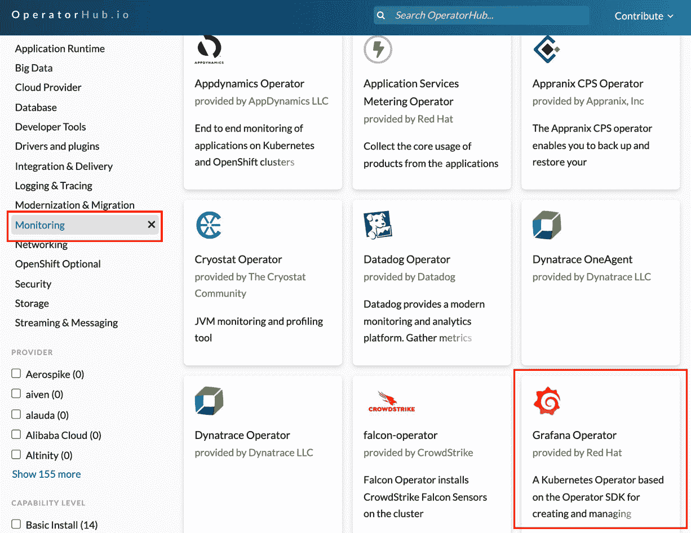
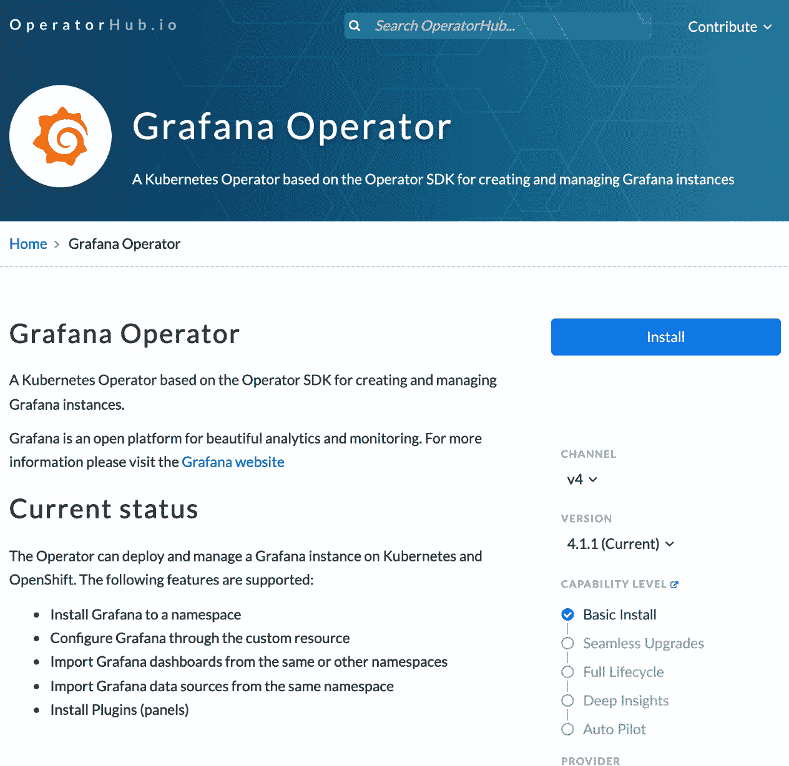
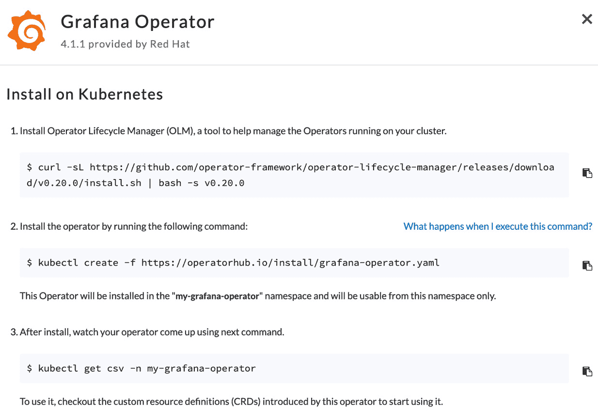
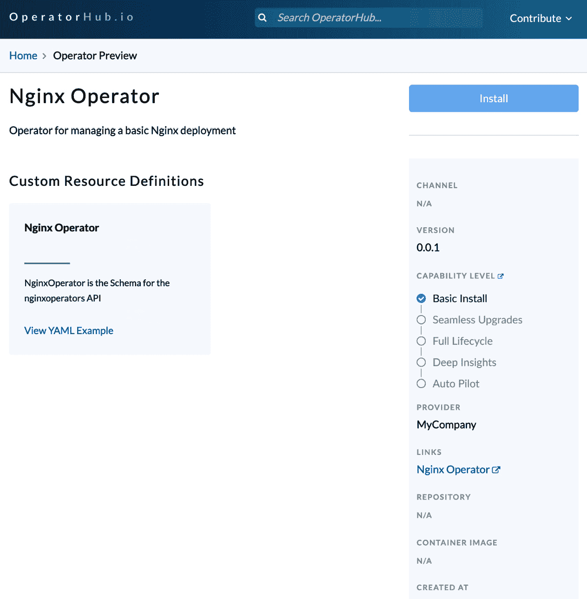

# 第七章：*第七章*：使用操作符生命周期管理器安装和运行操作符

到目前为止，前几章中涉及的操作符开发工作大多是自包含的。也就是说，迄今为止，开发和部署过程主要集中在本地环境中，且期望与我们编写的操作符交互的外部服务相对较少。虽然这些过程对操作符的早期设计有用（在某些方面甚至是必需的），但大多数操作符（实际上，大多数软件项目）最终都会暴露给外部世界。本章将专注于操作符生命周期中的这一阶段，其中操作符将被呈现并由外部用户使用。

在*第一章*，《操作符框架简介》中，介绍了操作符框架的三大支柱。书中的几章已经讨论了第一大支柱（操作符 SDK），但其余的支柱尚未详细探讨。这些支柱是**操作符生命周期管理器**（**OLM**）和**OperatorHub**。这两个操作符框架的组成部分是操作符从实验性本地原型到发布可安装产品开发过程中的关键过渡元素。在本章中，我们将通过以下几个部分，讲解如何从开发中的操作符过渡到用户可访问的操作符：

+   理解 OLM

+   运行你的操作符

+   与 OperatorHub 合作

+   故障排除

通过将操作符打包，使其能够通过 OLM 安装和管理，并将该操作符发布到 OperatorHub，我们将利用操作符框架中用户期望的标准部署工作流。虽然这些步骤并非必要，因为我们已经展示过，可以在没有 OLM 或 OperatorHub 的情况下手动构建和部署操作符，但本章的目标是介绍操作符框架的这两大支柱，演示如何将操作符转变为一个丰富的社区项目。

# 技术要求

本章将继续使用在*第四章*，《使用操作符 SDK 开发操作符》和*第五章*，《开发操作符 - 高级功能》中编写的 nginx 操作符。假设已经可以访问公共 Docker 仓库（在*第六章*，《构建与部署操作符》中使用过），以及一个正在运行的**Kubernetes**集群。因此，本章的技术要求是在前几章的大部分要求基础上建立的，包含以下内容：

+   访问 Kubernetes 集群。建议使用如**kind**或**minikube**等工具创建一个可丢弃的集群（参见*第六章*，*构建和部署你的 Operator*）。

+   在本地系统上有可用的`kubectl`二进制文件，用于与 Kubernetes 集群进行交互。

+   在本地系统上有可用的`operator-sdk`二进制文件，用于部署 OLM 并构建 Operator 清单。

+   已安装并运行 Docker 以构建 Operator 捆绑映像。

+   拥有 GitHub 账户，并熟悉 GitHub 的 fork 和 pull 请求流程，以便向 OperatorHub 提交新的 Operator（仅限演示）。

本章的《代码实战》视频可以通过以下链接查看：[`bit.ly/3PPItsB`](https://bit.ly/3PPItsB)

# 了解 OLM

OLM 在*第一章*，*Operator 框架简介*中被介绍，作为一个用于在集群中安装和管理 Operator 的工具。它的功能包括提供对已安装 Operator 的升级控制，并使这些 Operator 对集群用户可见。它还通过强制执行 Operator 依赖关系，防止来自不同 Operator 的 API 冲突，从而帮助维护集群稳定性。这只是一个简要概述，但这些功能使得 OLM 成为一个强大的工具，适用于生产环境中部署 Operator。你可以在 Operator 框架文档中找到更多关于 OLM 功能的细节：[`olm.operatorframework.io/docs/#features-provided-by-olm`](https://olm.operatorframework.io/docs/#features-provided-by-olm)。

尽管这可能让 OLM 看起来像是一个复杂的组件，但它实际上不过是一组可以像安装其他组件或应用程序（包括 Operator 本身）一样在集群中安装的资源清单。这些资源包括各种**Pods**（由 Deployments 管理）、**CustomResourceDefinitions**（**CRDs**）、**namespaces**、**ServiceAccounts**和**RoleBindings**。

此外，Operator SDK 命令行工具提供了简单的命令，方便在 Kubernetes 集群中安装和与 OLM 进行交互。

因此，在使用 OLM 安装 Operator 之前，我们必须首先安装 OLM 本身。本节将展示安装 OLM 所需的步骤，还将演示一些通过命令行与 OLM 交互的附加命令，这将在稍后安装和管理我们自己的 Operator 时非常有用。

## 在 Kubernetes 集群中安装 OLM。

要安装 OLM，首先确保你拥有正在运行的 Kubernetes 集群的管理员权限。尽管使用 OLM 来管理 Operators 是生产集群中的一种可接受的做法，但强烈建议在跟随本章时使用一个一次性集群（可以使用如 kind 这样的工具创建）。这样，如果需要，你可以轻松且低成本地销毁并重新构建集群。如果你已经有一个来自上一章的集群运行，可能还需要关闭该集群，重新开始（使用 kind 时，执行`kind delete cluster`命令即可）。

接下来，调用`operator-sdk`二进制文件，通过以下命令在你的集群中安装 OLM：

```
$ operator-sdk olm install
INFO[0000] Fetching CRDs for version "latest"           
INFO[0000] Fetching resources for resolved version "latest" 
...
INFO[0027]   Deployment "olm/packageserver" successfully rolled out INFO[0028] Successfully installed OLM version "latest"  
```

该命令可能需要一些时间才能完成，但在此过程中，你将看到`operator-sdk`获取 OLM 的各种资源清单并将其安装到 Kubernetes 集群中。安装完成后，它还会打印出最终安装的资源列表。许多资源是集群范围的（例如 OLM 特定的 CRD），或者安装在新创建的`olm`命名空间中。你可以通过以下命令使用`kubectl`检查该命名空间，以查看这些资源：

```
$ kubectl get all -n olm
NAME                                    READY   STATUS    RESTARTS   AGE
pod/catalog-operator-5c4997c789-xr986   1/1     Running   0          4m35s
pod/olm-operator-6d46969488-nsrcl       1/1     Running   0          4m35s
pod/operatorhubio-catalog-h97sx         1/1     Running   0          4m27s
pod/packageserver-69649dc65b-qppvg      1/1     Running   0          4m26s
pod/packageserver-69649dc65b-xc2fr      1/1     Running   0          4m26s
NAME                            TYPE        CLUSTER-IP      EXTERNAL-IP   
service/operatorhubio-catalog   ClusterIP   10.96.253.116   <none>        service/packageserver-service   ClusterIP   10.96.208.29    <none>        
NAME                               READY   UP-TO-DATE   AVAILABLE   AGE
deployment.apps/catalog-operator   1/1     1            1           4m35s
deployment.apps/olm-operator       1/1     1            1           4m35s
deployment.apps/packageserver      2/2     2            2           4m26s
NAME                                          DESIRED   CURRENT   READY   replicaset.apps/catalog-operator-5c4997c789   1         1         1       replicaset.apps/olm-operator-6d46969488       1         1         1       replicaset.apps/packageserver-69649dc65b      2         2         2       
```

值得注意的是，在这个命名空间中有五个 Pod，执行 OLM 的核心功能。这些 Pod 共同工作，提供 OLM 的统一功能，包括追踪 Operator 订阅和监视指示 Operator 安装的自定义资源。

## 与 OLM 交互

除了`operator-sdk olm install`（顾名思义，它在集群中安装 OLM），`operator-sdk`二进制文件还提供了两个 OLM 特定的命令：`olm uninstall`和`olm status`。前者会将 OLM 及其所有依赖的清单从集群中移除，而后者提供当前集群中 OLM 资源的状态信息。对于健康的 OLM 安装，输出应如下所示：

```
$ operator-sdk olm status
INFO[0000] Fetching CRDs for version "v0.20.0"          
INFO[0000] Fetching resources for resolved version "v0.20.0" 
INFO[0002] Successfully got OLM status for version "v0.20.0" 
NAME                                            NAMESPACE    KIND                        STATUS
operatorgroups.operators.coreos.com                          CustomResourceDefinition    Installed
operatorconditions.operators.coreos.com                      CustomResourceDefinition    Installed
olmconfigs.operators.coreos.com                              CustomResourceDefinition    Installed
installplans.operators.coreos.com                            CustomResourceDefinition     Installed
clusterserviceversions.operators.coreos.com                  CustomResourceDefinition    Installed
olm-operator-binding-olm                                     ClusterRoleBinding          Installed
operatorhubio-catalog                           olm          CatalogSource               Installed
olm-operators                                   olm          OperatorGroup               Installed
aggregate-olm-view                                           ClusterRole                 Installed
catalog-operator                                olm          Deployment                  Installed
cluster                                                      OLMConfig                   Installed
operators.operators.coreos.com                               CustomResourceDefinition    Installed
olm-operator                                    olm          Deployment                  Installed
subscriptions.operators.coreos.com                           CustomResourceDefinition    Installed
aggregate-olm-edit                                           ClusterRole                 Installed
olm                                                          Namespace                   Installed
global-operators                                operators    OperatorGroup               Installed
operators                                                    Namespace                   Installed
packageserver                                   olm          ClusterServiceVersion       Installed
olm-operator-serviceaccount                     olm          ServiceAccount              Installed
catalogsources.operators.coreos.com                          CustomResourceDefinition    Installed
system:controller:operator-lifecycle-manager                 ClusterRole                 Installed
```

然而，如果 OLM 表现异常或集群中的 Operator 出现问题，可以使用此命令进行故障排除。例如，你可以运行`kubectl delete crd/operatorgroups.operators.coreos.com`（删除 OLM 安装的`OperatorGroups` CRD）。之后，运行`operator-sdk olm status`将显示错误`no matches for kind "OperatorGroup" in version "operators.coreos.com/v1`，并且在`global-operators`和`olm-operators`条目旁边，会指示该 CRD 在集群中缺失。

这个错误可以通过使用`operator-sdk olm uninstall`卸载 OLM 并重新安装来修复。请注意，卸载 OLM 不会卸载它在集群中管理的任何 Operators。这是有意为之，目的是防止数据丢失，但也意味着任何想要从集群中移除 Operators 的操作，不能仅通过卸载 OLM 来完成。

除了安装和检查 OLM 本身的健康状况外，另一种与 OLM 交互的方式是安装和管理操作符。但首先，操作符必须以 OLM 能够理解的方式进行准备。这就叫做**操作符的包**，我们将在下一节展示如何生成它。

# 运行您的操作符

在*第六章*中，*构建和部署您的操作符*，我们展示了通过本地编译或构建 Docker 镜像以便在 Kubernetes 集群中运行来手动构建和运行操作符的方法。但是，这些方法都与 OLM 不完全兼容，因此为了提供一个 OLM 可以安装的操作符，操作符必须准备一个包含 OLM 理解的格式的操作符元数据的包。然后，您可以将此包传递给 OLM，OLM 将处理其余的安装和生命周期管理。

## 生成操作符的包

一个操作符的包由多个清单文件组成，这些文件描述了操作符并提供附加的元数据，例如其依赖关系和 API。一旦创建，这些清单可以编译成一个**包镜像**，这是一个可部署的容器镜像，OLM 会用它在集群中安装操作符。

生成包清单的最简单方法是运行`make bundle`。此命令会要求您提供一些有关操作符的元数据，并将这些输入编译成输出资源清单。

注意

`make bundle` 会基于在*第六章*中使用的相同`IMG`环境变量，生成某些字段中的容器镜像名称，*构建和部署您的操作符*。确保在生成包时此环境变量仍然被设置，或者在调用`make bundle`命令时，它已被传递给该命令。

以下代码块显示了`make bundle`的输出。在此例中，我们将为我们的 nginx 操作符填写提示信息，使用公司名称`MyCompany`，以及一些附加的关键字和操作符维护者的联系信息：

```
$ make bundle
/Users/mdame/nginx-operator/bin/controller-gen rbac:roleName=manager-role crd webhook paths="./..." output:crd:artifacts:config=config/crd/bases
operator-sdk generate kustomize manifests -q
Display name for the operator (required): 
> Nginx Operator
Description for the operator (required): 
> Operator for managing a basic Nginx deployment
Provider's name for the operator (required): 
> MyCompany
Any relevant URL for the provider name (optional): 
> http://mycompany.example
Comma-separated list of keywords for your operator (required): 
> nginx,tutorial
Comma-separated list of maintainers and their emails (e.g. 'name1:email1, name2:email2') (required): 
> Mike Dame:mike@mycompany.example
cd config/manager && /Users/mdame/nginx-operator/bin/kustomize edit set image controller=controller:latest
/Users/mdame/nginx-operator/bin/kustomize build config/manifests | operator-sdk generate bundle -q --overwrite --version 0.0.1  
INFO[0000] Creating bundle.Dockerfile                   
INFO[0000] Creating bundle/metadata/annotations.yaml    
INFO[0000] Bundle metadata generated suceessfully       
operator-sdk bundle validate ./bundle
INFO[0000] All validation tests have completed successfully 
```

在此步骤中，生成器将依次请求以下输入：

+   `操作符的显示名称`: 这是在诸如 OperatorHub 之类的资源上显示操作符时使用的名称。因此，它应该易读且清晰，并且大小写正确。例如，我们选择了`Nginx Operator`。

+   `操作符描述`: 该字段提供操作符的描述及其功能。与显示名称类似，此项是供用户查看的。因此，它应该清晰且详尽地描述操作符的功能。

+   `操作符的提供者名称`: 这是操作符的提供者或开发者的名称。对于单个开发者，它可以简单地是您的名字。或者，对于更大的组织，它可以是公司或部门名称。

+   `提供者名称的相关 URL`：这是开发者提供外部 URL 的机会，用于获取有关开发者的更多信息。这可以是个人博客、GitHub 账户或公司网站。

+   `为您的操作员提供的以逗号分隔的关键词列表`：这是一个关键词列表，可以帮助用户对您的操作员进行分类并进行搜索。对于此示例，我们选择了 `nginx,tutorial`，但您也可以提供不同的列表，例如 `deployment,nginx,high availability,metrics`。这将进一步展现我们为该操作员开发的关键功能。请注意，列表是以逗号分隔的，因此 `high availability` 是一个关键词。

+   `以逗号分隔的维护者及其电子邮件列表`：最后，您可以在此部分提供操作员维护者的联系信息，这样用户就可以找到支持或报告错误的联系人。然而，出于开发者的隐私考虑，提供公司地址而非个人联系信息可能会更为合适。

这些字段对应于操作员的 **集群服务版本** (**CSV**) 文件中的匹配字段（CSV 在*第一章*，《操作员框架简介》中简要描述，稍后在本章中会在《与 OperatorHub 协作》部分详细解释）。有关这些字段如何在操作员框架中使用的更多信息，您可以参考 [`sdk.operatorframework.io/docs/olm-integration/generation/#csv-fields`](https://sdk.operatorframework.io/docs/olm-integration/generation/#csv-fields) 中的操作员框架文档。

CSV 是在运行 `make bundle` 后，在项目中创建的多个新文件之一。这些新文件大多数位于名为 `bundle/` 的新目录下。在项目根目录下，还有一个名为 `bundle.Dockerfile` 的新文件，用于将清单编译成 bundle 镜像。

## 浏览 bundle 文件

由 `make bundle` 生成的文件包含有关操作员的元数据，可供 OLM 用于安装和管理操作员，且 OperatorHub 会提供有关操作员及其依赖关系和功能的信息。在 `bundle/` 目录下，有三个子目录，包含以下文件：

+   `tests/`：这些是用于运行 scorecard 测试的配置文件，scorecard 测试是一系列用于验证操作员包的测试（请参见 [`sdk.operatorframework.io/docs/testing-operators/scorecard`](https://sdk.operatorframework.io/docs/testing-operators/scorecard)）。

+   `metadata/`：该目录包含一个 `annotations.yaml` 文件，向 OLM 提供关于操作员版本和依赖关系的信息。此文件中的注解必须与 `bundle.Dockerfile` 中指定的标签相同（稍后将详细介绍该文件），并且通常不应修改。

+   `manifests/`：此目录包含您的操作员所需的各种清单文件，包括操作员的 CRD 和与度量相关的资源（如果适用）。然而，最值得注意的是 CSV，它包含操作员的大部分元数据。

操作员的 CSV 是这些文件中最有趣的部分，因为它包含了 OLM 用于处理操作员创建的许多信息，以及 OperatorHub，用于向用户展示有关操作员的重要信息。为我们的 nginx 操作员创建的 CSV 文件名为`nginx-operator.clusterserviceversion.yaml`，并包含以下部分：

1.  元数据，包括一个样本自定义资源对象（由用户创建以配置操作员）及其能力级别：

    ```
    apiVersion: operators.coreos.com/v1alpha1
    kind: ClusterServiceVersion
    metadata:
      annotations:
        alm-examples: |-
          [
            {                                                                                                                                                                                                 
              "apiVersion": "operator.example.com/v1alpha1",
              "kind": "NginxOperator",
              "metadata": {
                "name": "nginxoperator-sample"
              },                                                                                                                                                                                              
              "spec": null
            }                                                                                                                                                                                                 
          ]                                                                                                                                                                                                   
        capabilities: Basic Install
        operators.operatorframework.io/builder: operator-sdk-v1.17.0
        operators.operatorframework.io/project_layout: go.kubebuilder.io/v3
      name: nginx-operator.v0.0.1
      namespace: placeholder
    ```

1.  一个规格字段，包含操作员的描述、显示名称、显示图标（如果提供）和相关的 CRD：

    ```
    spec:
      apiservicedefinitions: {}                                                                                                                                                                               
      customresourcedefinitions:
        owned:
        - description: NginxOperator is the Schema for the nginxoperators API
          displayName: Nginx Operator
          kind: NginxOperator
          name: nginxoperators.operator.example.com
          version: v1alpha1
      description: Operator for managing a basic Nginx deployment
      displayName: Nginx Operator
      icon:
      - base64data: ""
        mediatype: ""
    ```

1.  安装说明，包括操作员 Pod 的集群权限和部署规范（这里为了简洁省略）。

1.  操作员的安装模式，显示它支持哪些命名空间安装策略：

    ```
      installModes:
      - supported: false
        type: OwnNamespace
      - supported: false
        type: SingleNamespace
      - supported: false
        type: MultiNamespace
      - supported: true
        type: AllNamespaces
    ```

1.  关键词、维护者信息、提供者 URL 以及版本（在运行`make bundle`时提供）：

    ```
      keywords:
      - nginx
      - tutorial
      links:
      - name: Nginx Operator
        url: https://nginx-operator.domain
      maintainers:
      - email: mike@mycompany.example
        name: Mike Dame
      maturity: alpha
      provider:
        name: MyCompany
        url: http://mycompany.example
      version: 0.0.1
    ```

综合这些信息，可以将它们打包在一起，为 OLM 提供足够的数据，以便在集群中部署和管理操作员。该包被称为捆绑镜像。

## 构建捆绑镜像

一旦捆绑清单文件生成完毕，可以通过调用`make bundle-build`来构建捆绑镜像。此命令基于之前通过`make bundle`生成的`bundle.Dockerfile`文件构建一个 Docker 容器。该`Dockerfile`文件包含以下指令：

```
$ cat bundle.Dockerfile 
```

```
FROM scratch
```

```
# Core bundle labels.
```

```
LABEL operators.operatorframework.io.bundle.mediatype.v1=registry+v1
```

```
LABEL operators.operatorframework.io.bundle.manifests.v1=manifests/
```

```
LABEL operators.operatorframework.io.bundle.metadata.v1=metadata/
```

```
LABEL operators.operatorframework.io.bundle.package.v1=nginx-operator
```

```
LABEL operators.operatorframework.io.bundle.channels.v1=alpha
```

```
LABEL operators.operatorframework.io.metrics.builder=operator-sdk-v1.17.0
```

```
LABEL operators.operatorframework.io.metrics.mediatype.v1=metrics+v1
```

```
LABEL operators.operatorframework.io.metrics.project_layout=go.kubebuilder.io/v3
```

```
# Labels for testing.
```

```
LABEL operators.operatorframework.io.test.mediatype.v1=scorecard+v1
```

```
LABEL operators.operatorframework.io.test.config.v1=tests/scorecard/
```

```
# Copy files to locations specified by labels.
```

```
COPY bundle/manifests /manifests/
```

```
COPY bundle/metadata /metadata/
```

```
COPY bundle/tests/scorecard /tests/scorecard/
```

类似于在*第六章*中用于编译操作员镜像的主`Dockerfile`文件，*构建和部署您的操作员*，此 Dockerfile 构建过程中的关键步骤之一是将`bundle/`目录中的必要捆绑文件复制到其自己的镜像中（如前面的代码块所示）。它还会为生成的镜像打上关于操作员、其版本和构建工具的各种元数据标签。

运行`make bundle-build`将生成以下构建日志：

```
$ make bundle-build
docker build -f bundle.Dockerfile -t example.com/nginx-operator-bundle:v0.0.1 .
[+] Building 0.4s (7/7) FINISHED                                                                                                                                                 
 => [internal] load build definition from bundle.Dockerfile                                                                                                                
 => => transferring dockerfile: 966B                                                                                                                                       
 => [internal] load .dockerignore                                                                                                                                          
 => => transferring context: 35B                                                                                                                                           
 => [internal] load build context                                                                                                                                          
 => => transferring context: 16.73kB                                                                                                                                       
 => [1/3] COPY bundle/manifests /manifests/                                                                                                                                
 => [2/3] COPY bundle/metadata /metadata/                                                                                                                                  
 => [3/3] COPY bundle/tests/scorecard /tests/scorecard/                                                                                                                    
 => exporting to image                                                                                                                                                     
 => => exporting layers                                                                                                                                                    
 => => writing image
sha256:6b4bf32edd5d15461d112aa746a9fd4154fefdb1f9cfc49b 56be52548ac66921                                                                               
 => => naming to example.com/nginx-operator-bundle:v0.0.1                                                                                                                  
```

但是，请注意，新容器镜像的名称为`example.com/nginx-operator-bundle`，您可以通过运行`docker images`来确认：

```
$ docker images
REPOSITORY                           TAG       IMAGE ID       CREATED          example.com/nginx-operator-bundle    v0.0.1    6b4bf32edd     29 seconds ago   
```

使用这个通用名称是因为`make bundle-build`依赖于与之前手动构建操作员镜像时使用的`IMG`变量不同的环境变量（并生成捆绑清单文件）。要设置自定义的捆绑镜像名称，可以给生成的镜像打标签，或重新运行`make bundle-build`并设置`BUNDLE_IMG`变量。示例如下：

```
$ BUNDLE_IMG=docker.io/myregistry/nginx-bundle:v0.0.1 make bundle-build
```

这将生成名为`docker.io/myregistry/nginx-bundle:v0.0.1`的捆绑镜像。

## 推送捆绑镜像

回想一下，在*第六章*中，*构建和部署您的操作员*，不仅需要构建操作员的容器镜像，还需要将其推送到一个公开可访问的注册表。这使得镜像可以在我们的 Kubernetes 集群中使用。同样，包镜像也必须可以被集群（以及 OLM）访问。因此，我们必须将包镜像推送到一个注册表，以便 OLM 能够将其拉取到集群中。

操作员 SDK 通过`make bundle-push`命令使这一步变得容易：

```
$ make bundle-push
/Library/Developer/CommandLineTools/usr/bin/make docker-push IMG=docker.io/mdame/nginx-bundle:v0.0.1
docker push docker.io/mdame/nginx-bundle:v0.0.1
The push refers to repository [docker.io/mdame/nginx-bundle]
79c3f933fff3: Pushed 
93e60c892495: Pushed 
dd3276fbf1b2: Pushed 
v0.0.1: digest: sha256:f6938300b1b8b5a2ce127273e2e48443 ad3ef2e558cbcf260d9b03dd00d2f230 size: 939
```

该命令只是调用`docker push`，但它继承了之前命令中设置和使用的环境变量（例如，`BUNDLE_IMG`）。这种便捷性有助于减少出错的机会，避免将错误的镜像名称推送到错误的注册表。

## 使用 OLM 部署操作员包

通过构建并推送到一个可访问的注册表的包镜像，可以简单地使用`operator-sdk run bundle`命令从其包中部署操作员。例如，我们现在可以通过运行以下命令部署上一节中的 nginx 操作员包：

```
$ operator-sdk run bundle docker.io/mdame/nginx-bundle:v0.0.1
INFO[0013] Successfully created registry pod: docker-io-mdame-nginx-bundle-v0-0-1 
INFO[0013] Created CatalogSource: nginx-operator-catalog 
INFO[0013] OperatorGroup "operator-sdk-og" created      
INFO[0013] Created Subscription: nginx-operator-v0-0-1-sub 
INFO[0016] Approved InstallPlan install-44bh9 for the Subscription: nginx-operator-v0-0-1-sub 
INFO[0016] Waiting for ClusterServiceVersion "default/nginx-operator.v0.0.1" to reach 'Succeeded' phase 
INFO[0016]   Waiting for ClusterServiceVersion "default/nginx-operator.v0.0.1" to appear 
INFO[0023]   Found ClusterServiceVersion "default/nginx-operator.v0.0.1" phase: Pending 
INFO[0026]   Found ClusterServiceVersion "default/nginx-operator.v0.0.1" phase: Installing 
INFO[0046]   Found ClusterServiceVersion "default/nginx-operator.v0.0.1" phase: Succeeded 
INFO[0046] OLM has successfully installed "nginx-operator.v0.0.1"
```

注意

这个命令可能需要几分钟才能成功。然而，如果操作员的`ClusterServiceVersion`对象安装失败，请仔细检查是否按照*第六章*中详细说明的步骤在集群中安装了**kube-prometheus**。如果操作员包已经构建并包含了对 Prometheus 资源的引用，但这些资源在集群中不存在，就可能导致操作员的安装失败。

该命令创建了 OLM 安装 nginx 操作员所需的资源，这些资源仅包括操作员包中的信息，如`CatalogSource`、`OperatorGroup`、`Subscription`和`InstallPlan`。

然后，操作员可以通过`operator-sdk cleanup <packageName>`命令卸载，其中`<packageName>`在操作员的`PROJECT`文件中定义为`projectName`：

```
$ operator-sdk cleanup nginx-operator
INFO[0000] subscription "nginx-operator-v0-0-1-sub" deleted 
INFO[0000] customresourcedefinition "nginxoperators.operator.example.com" deleted 
INFO[0000] clusterserviceversion "nginx-operator.v0.0.1" deleted 
INFO[0000] catalogsource "nginx-operator-catalog" deleted 
INFO[0000] operatorgroup "operator-sdk-og" deleted      
INFO[0000] Operator "nginx-operator" uninstalled  
```

这标志着手动使用 OLM 构建和部署操作员的正常开发工作流程的结束。然而，仍然有另一个来源可以用来在集群中安装操作员。这个来源就是**OperatorHub**，它是下一节的重点。

# 使用 OperatorHub

任何成功的开源项目都需要一个专门的用户和开发者社区来帮助项目的生态系统繁荣。操作员框架也不例外，在这个社区的核心是[`operatorhub.io/`](https://operatorhub.io/)的操作员目录。事实上，这种集中化正是 OperatorHub 的目标，正如在[`operatorhub.io/about`](https://operatorhub.io/about)中所述：

尽管有多种方法可以实现与 Kubernetes 相同级别的集成，但一直缺少一个中央位置，供用户查找由社区构建的各种优秀操作员。OperatorHub.io 旨在成为这个中央位置。

OperatorHub 由**Red Hat**、**AWS**、**Google Cloud**和**Microsoft**于 2019 年共同推出，一直在推动 Kubernetes 操作员的增长和采纳。截至写作时，OperatorHub 索引包含了超过 200 个操作员（这一数字仍在增长）。该平台仅由一个公开的 GitHub 仓库和许多志愿者维护者支持，OperatorHub 开放式的目录管理和操作员接受机制也支持了 Kubernetes 的核心理念，允许任何组织的任何人将自己的操作员贡献到目录中，并让所有人都能访问。

简而言之，OperatorHub 使得推广自己的操作员变得简单，同时也可以方便地找到并安装由其他提供者开发的操作员。在本节中，我们将演示如何通过操作 OperatorHub 网站和后端来实现这两个目标。

## 从 OperatorHub 安装操作员

在自己的 Kubernetes 集群中从 OperatorHub 安装操作员非常简单，可以使用[`operatorhub.io/`](https://operatorhub.io/)上的目录。你可以通过浏览所有可用操作员的列表来开始，或者通过 OperatorHub 主页上的搜索框进行搜索。你还可以通过类别来缩小搜索范围（可用类别包括**AI/机器学习**、**大数据**、**云提供商**和**监控**）。

作为一个任意的示例，**Grafana** Operator 可以在**Monitoring**（监控）类别下找到。Grafana 是一个分析和监控可视化平台，提供丰富的、有洞察力的工具来查看应用程序的健康状况。以下是**Grafana Operator**及其他在 OperatorHub 的**Monitoring**类别中可用的操作员截图：



图 7.1 – OperatorHub 监控类别截图

点击**Grafana Operator**图标将打开该操作员的详细信息页面。该页面包括操作员当前在功能模型中的功能级别、发布过的操作员版本、以及操作员提供者和维护者的信息。以下是**Grafana Operator**在 OperatorHub 上的信息页面截图：



图 7.2 – Grafana Operator 信息页面

本页面还提供了此操作员的安装说明，可以通过点击该操作员的`install`命令来查看。以下是 Grafana Operator 安装说明的截图：



图 7.3 – Grafana Operator 安装说明

在终端中运行此命令会产生以下输出：

```
$ kubectl create -f https://operatorhub.io/install/grafana-operator.yaml
namespace/my-grafana-operator created
operatorgroup.operators.coreos.com/operatorgroup created
subscription.operators.coreos.com/my-grafana-operator created
```

接下来，新的命名空间 `my-grafana-operator` 已经创建，并具备了该 Operator 所需的资源：

```
$ kubectl get all -n my-grafana-operator
NAME                                                      READY   STATUS   pod/grafana-operator-controller-manager-b95954bdd-sqwzr   2/2     Running   
NAME                                                          TYPE        service/grafana-operator-controller-manager-metrics-service   ClusterIP  
NAME                                                  READY   UP-TO-DATE   deployment.apps/grafana-operator-controller-manager   1/1     1            1           
NAME                                                            DESIRED   replicaset.apps/grafana-operator-controller-manager-b95954bdd   1         1         
```

此外，此命令还为该 Operator 创建了 `OperatorGroup` 对象和 `Subscription` 对象。这些资源类型是由 OLM 安装在集群中的 CRD，由各个 Operator 实现，用来表示它们的安装。这些对象的作用详细信息可以在 OperatorHub 文档中找到，链接为 [`operatorhub.io/how-to-install-an-operator`](https://operatorhub.io/how-to-install-an-operator)，但总的来说，它们定义了用户（即你）安装该 Operator 的意图，并告知 OLM Operator 的元数据在 OperatorHub 上的位置。OLM 使用这些信息来创建新 Operator 所需的 Deployment、Service 及其他资源。

一旦 Operator 被安装，通常由用户创建该 Operator 的配置 CRD 对象。由于有这么多不同的 CRD，这可能会让人感到困惑。然而，许多 CRD（如 `OperatorGroup` 和 `Subscription`）是由 OLM 等工具自动安装和管理的，不需要手动干预。通常，用户只需要关心特定 Operator 配置的 CRD 对象（例如我们为 nginx Operator 创建的那个）。大多数 Operator 的 `README` 文件和 OperatorHub 描述中会包含示例 CRD 和开始使用每个 Operator 的步骤（这也是一个很好的做法，适用于你自己的 Operator）。

说到你自己的 Operator，贡献到 OperatorHub 目录几乎和从中安装 Operators 一样简单。在接下来的章节中，我们将看看这些 Operators 如何进入 OperatorHub，以及你的 Operator 如何也能做到这一点。

## 将自己的 Operator 提交到 OperatorHub

虽然公开发布任何 Operator 不是必需的，但许多提供商选择这样做，既是为了社区的利益，也是为了自身用户的利益。如果你开发的 Operator 被用来管理你提供给用户的应用程序，那么该 Operator 的公开可用性可以提高该应用程序的知名度，并增强你在开源社区中的声誉。提供一个免费的 Operator 向你的用户表明，你致力于提供一个稳定的产品，并且用户无需投入过多工程时间。

Operator SDK 项目需要什么？

Operator SDK，像许多 Kubernetes 项目一样，是在**Apache 2.0 许可证**下发布的。这为项目的商业使用、分发和私人使用（以及其他使用场景）提供了宽松的许可。有关 Operator SDK 许可证的更多信息，请访问[`github.com/operator-framework/operator-sdk/blob/master/LICENSE`](https://github.com/operator-framework/operator-sdk/blob/master/LICENSE)。

因为我们在本书中开发的 nginx Operator 仅作为教程使用（并不适用于公开使用），所以我们无法演示提交到 OperatorHub 的过程。然而，提交 Operator 到 OperatorHub 的一般过程已在[`operatorhub.io/contribute`](https://operatorhub.io/contribute)中列出。大致而言，这涉及以下步骤：

1.  开发一个已准备好发布的 Operator。

1.  生成 Operator 的包，包括其 CSV 和相关的 CRD。

1.  创建一个针对 GitHub 上 OperatorHub 仓库的**拉取请求**（**PR**），并附上你的 Operator 元数据，[`github.com/k8s-operatorhub/community-operators`](https://github.com/k8s-operatorhub/community-operators)。

如果你一直在按照本书的步骤进行操作，那么你已经熟悉了前两个步骤。然而，第三步是提交到 OperatorHub 最关键的一部分，因为 GitHub 仓库代表了在 OperatorHub 上列出的所有 Operator 的目录。因此，若没有必要的 PR 修改将你的 Operator 信息合并到这个仓库中，它将不会出现在 OperatorHub 上。

哪个是 OperatorHub 仓库？

一些仍然可用的过时文档提到了两个不同的 OperatorHub 仓库位置，`community-operators` 和 `upstream-community-operators`，这些位置最初是现已归档的 OperatorHub 仓库的子目录，地址为 [`github.com/operator-framework/community-operators`](https://github.com/operator-framework/community-operators)。前者是 Red Hat 最初用于发布 OperatorHub 时的遗留物（具体来说，它指的是一个位置，预留给在 Red Hat 的 OpenShift Kubernetes 发行版中集成版本的 OperatorHub 上列出的 Operators）。这个 OpenShift 特定的 Operator 索引现已与之前提到的社区仓库脱钩。对于有兴趣贡献 OpenShift 目录的开发者，已有相关文档，但本章将专注于社区版 OperatorHub，它是平台无关的。

通过 GitHub 提交 Operator 的步骤如下（这些步骤假定你已经熟悉 GitHub 以及相关的分叉/PR 流程）：

1.  将 OperatorHub 仓库 ([`github.com/k8s-operatorhub/community-operators`](https://github.com/k8s-operatorhub/community-operators)) fork 到你自己的 GitHub 账户中。这允许你将仓库的本地副本克隆到你的机器上，并对其进行更改，稍后这些更改将通过 PR 拉取到上游目录中。

1.  在 `operators/` 目录下为你的 Operator 创建一个新文件夹。它必须具有一个独特的名称，与其他所有 Operators 不重复（例如，我们可以创建 `operators/nginx-operator`）。

1.  在该目录中创建一个名为 `ci.yaml` 的新文件。此文件定义了版本控制语义以及允许更改你 Operator 的审阅者（更多信息请见 [`k8s-operatorhub.github.io/community-operators/operator-ci-yaml/`](https://k8s-operatorhub.github.io/community-operators/operator-ci-yaml/)）。一个简单的 `ci.yaml` 文件如下所示：

    ```
    reviewers:
      - myGithubUsername
      - yourTeammateUsername
    ```

1.  在你的 Operator 文件夹中为每个你希望发布的版本创建一个目录（例如，`operators/nginx-operator/0.0.1`）。

1.  将你 Operator 项目中 `bundle` 目录的内容复制到新版本文件夹中。

同时，将在你 Operator 项目根目录生成的 `bundle.Dockerfile` 复制到版本文件夹中。

1.  将更改提交并推送到你在 GitHub 上的 forked OperatorHub 仓库的新分支。

1.  返回上游 OperatorHub 仓库的 PR 页面（[`github.com/k8s-operatorhub/community-operators/pulls`](https://github.com/k8s-operatorhub/community-operators/pulls)），然后点击 **New pull request**。选择你的 fork 和分支以合并到上游仓库。

1.  阅读 PR 模板描述，确保你已遵循所有列出的步骤。这些前置步骤有助于加速你 Operator PR 的审查和批准过程，包括以下内容：

    1.  审查社区贡献指南

    1.  在本地集群中测试你的 Operator

    1.  验证你的 Operator 元数据是否符合 OperatorHub 的标准

    1.  确保你的 Operator 描述和版本控制方案足以满足用户需求

一旦你审查了 PR 模板中的预提交检查，提交你的请求。此时，自动化检查将验证你的 Operator 元数据，以确保它通过提交质量阈值（并在 GitHub 评论中报告任何问题）。如果你需要对提交进行更改以使其通过这些检查，你可以简单地将更改推送到你 fork 的 OperatorHub 仓库分支。

一旦你的 PR 通过预提交检查，它应自动将你的更改合并到上游仓库。此后不久，你的 Operator 将在 [`operatorhub.io/`](https://operatorhub.io/) 上可见，供全球用户安装！

# 故障排除

尽管本章介绍了一些新概念，包括 OLM 和 OperatorHub，但本书之前*故障排除*章节中列出的大多数资源仍然适用。

## OLM 支持

OLM 及其相关资源通常与 Operator SDK 开发相关。因此，关于这一主题的合理帮助可以在 `#operator-sdk-dev` Slack 渠道找到，网址为 [slack.k8s.io](http://slack.k8s.io)。OLM 的相关代码也可以在 GitHub 上报告问题，地址是 [`github.com/operator-framework/operator-lifecycle-manager`](https://github.com/operator-framework/operator-lifecycle-manager)。集成 Operator 与 OLM 的文档可以作为主要资源访问，网址为 [`sdk.operatorframework.io/docs/olm-integration/`](https://sdk.operatorframework.io/docs/olm-integration/)。

## OperatorHub 支持

OperatorHub 也可以在 GitHub 上访问，地址是本章所示的目录仓库 ([`github.com/k8s-operatorhub/community-operators`](https://github.com/k8s-operatorhub/community-operators))。对于前端 [`operatorhub.io/`](https://operatorhub.io/) 网站的具体问题，相关代码位于 [`github.com/k8s-operatorhub/operatorhub.io`](https://github.com/k8s-operatorhub/operatorhub.io)。该仓库提供了关于提交到 OperatorHub 所需的所有元数据和打包文件的详细文档（以及提交流程本身），可访问 [`k8s-operatorhub.github.io/community-operators/`](https://k8s-operatorhub.github.io/community-operators/)。

OperatorHub 还提供了验证工具和工具，用于在向仓库创建 PR 之前预览你 Operator 的提交。预览工具可通过 [`operatorhub.io/preview`](https://operatorhub.io/preview) 访问。在该工具中提交生成的 CSV 文件将显示你提交到 OperatorHub 后，Operator 的预览效果：



图 7.4 – OperatorHub 上 Nginx Operator 预览的截图

预览一个 Operator 的展示可以是一个非常有用的手动步骤，帮助测试为该 Operator 准备的所有元数据是否能够按照你期望的方式展示给新用户。由于 CRD 和 CSV 定义可能比较混乱，很容易失去追踪，因此预览能够提供早期的视觉确认，确保一切设置正确。同时，它还验证了元数据的语法有效性。

# 总结

本章总结了 Operator 的主要开发和发布过程。如果你从一开始就跟随本书开发自己的 Operator，那么恭喜你！你的 Operator 现在已经发布，并通过 OperatorHub 的影响力可供新用户访问。从本书的早期章节开始，我们展示了设计 Operator 的步骤，使用 Go 开发其基本和高级功能，构建并部署到本地进行测试，最终打包并发布以供公开分发。然而，很少有 Operator 项目的生命周期会在此时结束。

大多数操作符最终可能需要演变、改变其提供的功能，并发布新版本。以一致和可预测的方式进行这些操作，有利于你的用户和维护人员，通过建立预期的发布标准。这些标准包括弃用政策和新版本发布的时间表。在下一章中，我们将解释一些 Kubernetes 项目中已有的最佳实践，并引发关于如何为新操作符的持续维护和开发做好准备的前瞻性思考。
