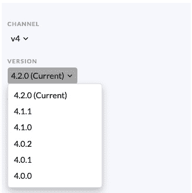
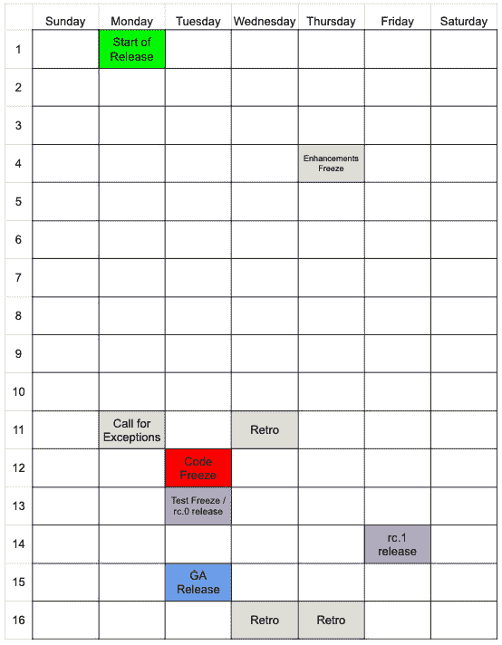

# 第八章：*第八章*：为你的 Operator 做持续维护的准备

在本书中，我们展示了创建新的 **Kubernetes** Operator 的步骤。我们涵盖了从构思、设计、编码、部署到最终发布的全过程。但是，极少有软件项目在初始发布后结束生命周期，Operator 也不例外。事实上，对于许多 Operator，大部分工作最终会在发布后很长时间内完成。因此，通过了解用户和 Operator 社区的期望，为将来维护你的 Operator 做准备是很有价值的。

作为一个基于 Kubernetes 的项目，依赖 Kubernetes 及其子项目中已建立的约定对你自己持续的开发工作非常有帮助。虽然你可以自由制定未来发布的指导方针，但由于是为 Kubernetes 构建的，你的 Operator 很可能至少会依赖于某些库或 Kubernetes 核心平台的某些方面。因此，了解 Kubernetes 的现行政策可以帮助你在准备应对上游平台的变化时对齐自己的开发实践，因为这些变化几乎是必然的，你将不得不做出反应。这就是为什么本章将在接下来的部分中重点介绍这些约定。

+   发布你 Operator 的新版本

+   为弃用和向后兼容性做规划

+   遵守 Kubernetes 对变更的标准

+   与 Kubernetes 发布时间表对齐

+   与 Kubernetes 社区合作

Kubernetes 社区制定的程序为你自己的开发实践提供了一个优秀的模板，并为用户提供了一套熟悉的政策。当然，没有任何要求要求 Operator 严格遵循这些指南，但本章的目标是以一种方式解释它们，提供与你的项目相关的先例。

# 技术要求

对于本章，唯一的技术工作将集中在 *发布你 Operator 的新版本* 部分，我们将在这一部分基于前面章节中的 nginx Operator 代码进行扩展，新增代码并在 Kubernetes 集群中运行这些代码。因此，本章的要求包括以下内容：

+   `operator-sdk` 二进制文件

+   `Go` 1.16+

+   Docker

+   访问正在运行的 Kubernetes 集群

本章的 Code in Action 视频可以在以下链接观看：[`bit.ly/3aiaokl`](https://bit.ly/3aiaokl)

# 发布你 Operator 的新版本

现在你的 Operator 已经发布，真正有趣的部分才刚刚开始。是时候开始考虑下一次发布了！和任何软件项目一样，你的 Operator 会随着时间推移而不断发展，推出新特性并适应上游 Kubernetes 的变化。关于发布软件的文献极其丰富，提供了何时以及如何发布软件更新的建议。大部分信息超出了本书的范围。相反，我们将解释使用 **Operator SDK**、**Operator 生命周期管理器**（**OLM**）和 **OperatorHub** 发布新版本 Operator 所需的技术步骤。从那时起，你的发布方式和时机完全由你的组织决定（不过你可能希望稍后在本章的 *与 Kubernetes 发布时间表对齐* 部分中了解其他 Kubernetes 项目的发布方式）。

## 为你的 Operator 添加 API 版本

虽然有许多因素可能影响你决定发布新版本 Operator（例如修复 Bug 或仅仅是跟随定期发布计划），但 Operator 中常见的一种更改是更新 Operator 的配置 API。回想一下，这是转换成 Operator 的 **CustomResourceDefinition**（**CRD**）的 API。因此，在某些情况下，可能需要更新与 Operator 一起发布的 API，以便向用户指示更改（请参见 *遵循 Kubernetes 标准进行变更* 部分）。

为此，我们需要创建一个新的 API 版本，并将该版本包含在 Operator 的 CRD 中（有关从技术角度深入了解此操作的更多信息，请参见 Kubernetes 关于 CRD 版本控制的文档，了解此操作的详细信息：[`kubernetes.io/docs/tasks/extend-kubernetes/custom-resources/custom-resource-definition-versioning/`](https://kubernetes.io/docs/tasks/extend-kubernetes/custom-resources/custom-resource-definition-versioning/)）。

在 *第四章* 中，*使用 Operator SDK 开发 Operator*，我们通过以下命令初始化了我们 Operator API 的第一个版本：

```
operator-sdk create api --group operator --version v1alpha1 --kind NginxOperator --resource --controller
```

这创建了 `NginxOperator` API 类型，并将其版本设置为 `v1alpha1`。然后，我们在 `api/v1alpha1/nginxoperator_types.go` 中填写了 API 并生成了相应的 CRD，这为 Operator 部署到集群后提供了使用接口。

如果需要对该 API 进行某些不兼容的更改，并且需要生成新版本，可以以类似的方式生成该版本。例如，假设我们希望允许由 Operator 管理的 nginx 部署暴露多个端口，比如一个用于 HTTP，另一个用于 HTTPS 请求。我们可以通过将现有 nginx Operator 的 CRD 中的`port`字段更改为`ports`字段，来定义一个`v1.ContainerPorts`列表（这是 Kubernetes 原生的 API 类型，允许为容器命名多个端口）。这个新类型暴露了额外的信息，如`Name`和`HostPort`，但它也包含了与原始`port`字段相同的`int32`值，用于定义单个`ContainerPort`。我们可以从`controllers/nginxoperator_controller.go`中取以下一行作为示例：

```
func (r *NginxOperatorReconciler) Reconcile(ctx context.Context, req ctrl.Request) (ctrl.Result, error) {
```

```
  if operatorCR.Spec.Port != nil {
```

```
    deployment.Spec.Template.Spec.Containers[0].Ports[0].ContainerPort = *operatorCR.Spec.Port
```

```
  }
```

这可以简化为以下内容：

```
func (r *NginxOperatorReconciler) Reconcile(ctx context.Context, req ctrl.Request) (ctrl.Result, error) {
```

```
  if len(operatorCR.Spec.Ports) > 0 {
```

```
    deployment.Spec.Template.Spec.Containers[0].Ports = operatorCR.Spec.Ports
```

```
  }
```

为了展示这对 Operator 类型意味着什么，我们将以现有的`NginxOperatorSpec`类型为例，展示`v1alpha1`版本：

```
// NginxOperatorSpec defines the desired state of NginxOperator
```

```
type NginxOperatorSpec struct {
```

```
   // Port is the port number to expose on the Nginx Pod
```

```
   Port *int32 `json:"port,omitempty"`
```

```
   // Replicas is the number of deployment replicas to scale
```

```
   Replicas *int32 `json:"replicas,omitempty"`
```

```
   // ForceRedploy is any string, modifying this field instructs
```

```
   // the Operator to redeploy the Operand
```

```
   ForceRedploy string `json:"forceRedploy,omitempty"`
```

```
}
```

现在，我们将其更改为`v1alpha2`中新定义的`NginxOperatorSpec`类型，像下面这样：

```
// NginxOperatorSpec defines the desired state of NginxOperator
```

```
type NginxOperatorSpec struct {
```

```
   // Ports defines the ContainerPorts exposed on the Nginx Pod
```

```
   Ports []v1.ContainerPort `json:"ports,omitempty""`
```

```
   // Replicas is the number of deployment replicas to scale
```

```
   Replicas *int32 `json:"replicas,omitempty"`
```

```
   // ForceRedploy is any string, modifying this field instructs
```

```
   // the Operator to redeploy the Operand
```

```
   ForceRedploy string `json:"forceRedploy,omitempty"`
```

```
}
```

为了保持用户的功能性，重要的是以一种确保 Operator 在退役策略要求的时间内支持两个版本的方式来引入新版本。

### 生成新的 API 目录

第一步是生成新的 API 文件。新的 API 版本通过`operator-sdk`命令生成，像我们生成`v1alpha1`时一样：

```
$ operator-sdk create api --group operator --version v1alpha2 --kind NginxOperator --resource
Create Controller [y/n]
n
Writing kustomize manifests for you to edit...
Writing scaffold for you to edit...
api/v1alpha2/nginxoperator_types.go
Update dependencies:
$ go mod tidy
Running make:
$ make generate
/Users/mdame/nginx-operator/bin/controller-genobject:headerFile="hack/boilerplate.go.txt" paths="./..."
Next: implement your new API and generate the manifests (e.g. CRDs,CRs) with:
$ make manifests
```

请注意，这次省略了`--controller`标志（我们选择了`n`代表`Create Controller [y/n]`），因为该 Operator 的控制器已经存在（`controllers/nginxoperator_controller.go`），因此我们不需要生成另一个控制器。

相反，现有的控制器需要手动更新，移除对`v1alpha1`的引用并将其替换为`v1alpha2`。这个步骤也可以通过诸如`sed`之类的工具来自动化，但在自动化代码更新时，请务必仔细检查任何更改。

当版本生成时，它会创建一个新的`api/v1alpha2`文件夹，其中还包含一个`nginxoperator_types.go`文件。将现有的类型定义从`api/v1alpha1/nginxoperator_types.go`复制到此文件，并将`port`字段更改为`ports`，如前面的代码所示。新文件应如下所示（注意对`Ports`的高亮更改）：

api/v1alpha2/nginxoperator_types.go：

```
package v1alpha2
```

```
import (
```

```
   v1 "k8s.io/api/core/v1"
```

```
   metav1 "k8s.io/apimachinery/pkg/apis/meta/v1"
```

```
)
```

```
const (
```

```
   ReasonCRNotAvailable          = "OperatorResourceNotAvailable"
```

```
   ReasonDeploymentNotAvailable  = "OperandDeploymentNotAvailable"
```

```
   ReasonOperandDeploymentFailed = "OperandDeploymentFailed"
```

```
   ReasonSucceeded               = "OperatorSucceeded"
```

```
)
```

```
// NginxOperatorSpec defines the desired state of NginxOperator
```

```
type NginxOperatorSpec struct {
```

```
   // INSERT ADDITIONAL SPEC FIELDS - desired state of cluster
```

```
   // Important: Run "make" to regenerate code after modifying this file
```

```
   // Ports defines the ContainerPorts exposed on the Nginx Pod
```

```
   Ports []v1.ContainerPort `json:"ports,omitempty""`
```

```
   // Replicas is the number of deployment replicas to scale
```

```
   Replicas *int32 `json:"replicas,omitempty"`
```

```
   // ForceRedploy is any string, modifying this field instructs
```

```
   // the Operator to redeploy the Operand
```

```
   ForceRedploy string `json:"forceRedploy,omitempty"`
```

```
}
```

```
// NginxOperatorStatus defines the observed state of NginxOperator
```

```
type NginxOperatorStatus struct {
```

```
   // Conditions is the list of the most recent status condition updates
```

```
   Conditions []metav1.Condition `json:"conditions"`
```

```
}
```

```
//+kubebuilder:object:root=true
```

```
//+kubebuilder:subresource:status
```

```
//+kubebuilder:storageversion
```

```
// NginxOperator is the Schema for the nginxoperators API
```

```
type NginxOperator struct {
```

```
   metav1.TypeMeta   `json:",inline"`
```

```
   metav1.ObjectMeta `json:"metadata,omitempty"`
```

```
   Spec   NginxOperatorSpec   `json:"spec,omitempty"`
```

```
   Status NginxOperatorStatus `json:"status,omitempty"`
```

```
}
```

```
//+kubebuilder:object:root=true
```

```
// NginxOperatorList contains a list of NginxOperator
```

```
type NginxOperatorList struct {
```

```
   metav1.TypeMeta `json:",inline"`
```

```
   metav1.ListMeta `json:"metadata,omitempty"`
```

```
   Items           []NginxOperator `json:"items"`
```

```
}
```

```
func init() {
```

```
   SchemeBuilder.Register(&NginxOperator{}, &NginxOperatorList{})
```

```
}
```

### 更新 Operator 的 CRD

接下来，需要更新 Operator 的 CRD，以包括`v1alpha1`和`v1alpha2`的定义。首先，需要将一个版本定义为`etcd`。当 Operator 只有一个版本时，不需要指定这个（那时唯一可用的版本就是该版本）。然而，现在，API 服务器需要知道如何存储该对象。通过在`NginxOperator`结构体中添加另一个`kubebuilder`标记（`//+kubebuilder:storageversion`）来实现这一点：

```
//+kubebuilder:object:root=true
```

```
//+kubebuilder:subresource:status
```

```
//+kubebuilder:storageversion
```

```
// NginxOperator is the Schema for the nginxoperators API
```

```
type NginxOperator struct {
```

```
   metav1.TypeMeta   `json:",inline"`
```

```
   metav1.ObjectMeta `json:"metadata,omitempty"`
```

```
   Spec   NginxOperatorSpec   `json:"spec,omitempty"`
```

```
   Status NginxOperatorStatus `json:"status,omitempty"`
```

```
}
```

这指示 CRD 生成器将`v1alpha2`标记为存储版本。现在，运行`make manifests`将生成新的 CRD 更改：

```
$ make manifests
$ git status
On branch master
Changes not staged for commit:
      modified:   config/crd/bases/operator.example.com_nginxoperators.yaml
```

现在，Operator 的 CRD 应该在`versions`下包括一个新的`v1alpha2`规范定义：

config/crd/bases/operator.example.com_nginxoperators.yaml:

```
apiVersion: apiextensions.k8s.io/v1
```

```
kind: CustomResourceDefinition
```

```
metadata:
```

```
  annotations:
```

```
    controller-gen.kubebuilder.io/version: v0.7.0
```

```
  creationTimestamp: null
```

```
  name: nginxoperators.operator.example.com
```

```
spec:
```

```
  group: operator.example.com
```

```
  names:
```

```
    kind: NginxOperator
```

```
    listKind: NginxOperatorList
```

```
    plural: nginxoperators
```

```
    singular: nginxoperator
```

```
  scope: Namespaced
```

```
  versions:
```

```
  - name: v1alpha1
```

```
    schema:
```

```
      openAPIV3Schema:
```

```
      ...
```

```
    served: true
```

```
    storage: false
```

```
    subresources:
```

```
      status: {}
```

```
  - name: v1alpha2
```

```
    schema:
```

```
      openAPIV3Schema:
```

```
      ...
```

```
    served: true
```

```
    storage: true
```

```
    subresources:
```

```
      status: {}
```

### 实现 API 转换

最后，API 服务器需要知道如何在这两个不兼容的版本之间进行转换。具体来说，`v1alpha1`端口的`int32`值需要转换为`v1alpha2`中`ports`列表中的`ContainerPort`值。为了这个示例，我们将定义以下行为：

+   `v1alpha1`到`v1alpha2`：`int32(port)`变为`ports[0].ContainerPort`。

+   `v1alpha2`到`v1alpha1`：`ports[0].ContainerPort`变为`int32(port)`。

换句话说，如果我们收到一个端口列表并需要转换为单个端口（`v1alpha2`到`v1alpha1`），我们将取列表中的第一个值并使用它。反之（`v1alpha1`到`v1alpha2`），我们将取单个`port`值并将其作为新端口列表中的第一个（也是唯一）值。

为了定义这些转换规则，我们将实现来自`sigs.k8s.io/controller-runtime/pkg/conversion`的`Convertible`和`Hub`接口：

sigs.k8s.io/controller-runtime/pkg/conversion/conversion.go:

```
package conversion
```

```
import "k8s.io/apimachinery/pkg/runtime"
```

```
// Convertible defines capability of a type to convertible i.e. it can be converted to/from a hub type.
```

```
type Convertible interface {
```

```
      runtime.Object
```

```
      ConvertTo(dst Hub) error
```

```
      ConvertFrom(src Hub) error
```

```
}
```

```
// Hub marks that a given type is the hub type for conversion. This means that
```

```
// all conversions will first convert to the hub type, then convert from the hub
```

```
// type to the destination type. All types besides the hub type should implement
```

```
// Convertible.
```

```
type Hub interface {
```

```
      runtime.Object
```

```
      Hub()
```

```
}
```

这些将通过`operator-sdk`暴露给 API 服务器，`operator-sdk`是 kubebuilder 命令的包装器，因此在 Operator 中实现转换 webhook 的步骤与任何其他控制器相同，如 kubebuilder 文档中所示）。该过程通过`Hub`类型定义一个版本，`Convertible`的 spoke 类型通过该版本进行转换。

首先创建一个新文件`api/v1alpha2/nginxoperator_conversion.go`，将`v1alpha2`定义为 Hub 版本：

api/v1alpha2/nginxoperator_conversion.go:

```
package v1alpha2
```

```
// Hub defines v1alpha2 as the hub version
```

```
func (*NginxOperator) Hub() {}
```

接下来，创建另一个文件`api/v1alpha1/nginxoperator_conversion.go`（注意这是在`v1alpha1`目录中）。此文件将实现`ConvertTo()`和`ConvertFrom()`函数，用于将`v1alpha1`与`v1alpha2`之间进行转换：

api/v1alpha1/nginxoperator_conversion.go:

```
package v1alpha1
```

```
import (
```

```
   "github.com/sample/nginx-operator/api/v1alpha2"
```

```
   v1 "k8s.io/api/core/v1"
```

```
   "k8s.io/utils/pointer"
```

```
   "sigs.k8s.io/controller-runtime/pkg/conversion"
```

```
)
```

```
// ConvertTo converts v1alpha1 to v1alpha2
```

```
func (src *NginxOperator) ConvertTo(dst conversion.Hub) error {
```

```
   return nil
```

```
}
```

```
// ConvertFrom converts v1alpha2 to v1alpha1
```

```
func (dst *NginxOperator) ConvertFrom(src conversion.Hub) error {
```

```
   return nil
```

```
}
```

然后，填写这些函数以执行实际的转换。对于`Replicas`和`ForceRedeploy`等字段，转换是 1:1 的（同样重要的是要复制`Metadata`和`Status.Conditions`）。但是，对于`Port`/`Ports`，我们需要添加之前定义的逻辑。这样，`ConvertTo()`看起来像以下这样：

```
// ConvertTo converts v1alpha1 to v1alpha2
```

```
func (src *NginxOperator) ConvertTo(dst conversion.Hub) error {
```

```
   objV1alpha2 := dst.(*v1alpha2.NginxOperator)
```

```
   objV1alpha2.ObjectMeta = src.ObjectMeta
```

```
   objV1alpha2.Status.Conditions = src.Status.Conditions
```

```
   if src.Spec.Replicas != nil {
```

```
      objV1alpha2.Spec.Replicas = src.Spec.Replicas
```

```
   }
```

```
   if len(src.Spec.ForceRedploy) > 0 {
```

```
      objV1alpha2.Spec.ForceRedploy = src.Spec.ForceRedploy
```

```
   }
```

```
   if src.Spec.Port != nil {
```

```
      objV1alpha2.Spec.Ports = make([]v1.ContainerPort, 0, 1)
```

```
      objV1alpha2.Spec.Ports = append(objV1alpha2.Spec.Ports,
```

```
        v1.ContainerPort{ContainerPort: *src.Spec.Port})
```

```
   }
```

```
   return nil
```

```
}
```

而`ConvertFrom()`类似，但方向相反：

```
// ConvertFrom converts v1alpha2 to v1alpha1
```

```
func (dst *NginxOperator) ConvertFrom(src conversion.Hub) error {
```

```
   objV1alpha2 := src.(*v1alpha2.NginxOperator)
```

```
   dst.ObjectMeta = objV1alpha2.ObjectMeta
```

```
   dst.Status.Conditions = objV1alpha2.Status.Conditions
```

```
   if objV1alpha2.Spec.Replicas != nil {
```

```
      dst.Spec.Replicas = objV1alpha2.Spec.Replicas
```

```
   }
```

```
   if len(objV1alpha2.Spec.ForceRedploy) > 0 {
```

```
      dst.Spec.ForceRedploy = objV1alpha2.Spec.ForceRedploy
```

```
   }
```

```
   if len(objV1alpha2.Spec.Ports) > 0 {
```

```
      dst.Spec.Port = pointer.Int32(objV1alpha2.Spec.Ports[0].ContainerPort)
```

```
   }
```

```
   return nil
```

```
}
```

现在，我们可以通过使用`operator-sdk create webhook`生成 webhook 逻辑和端点，使用以下命令：

```
$ operator-sdk create webhook --conversion --version v1alpha2 --kind NginxOperator --group operator --force
Writing kustomize manifests for you to edit...
Writing scaffold for you to edit...
api/v1alpha2/nginxoperator_webhook.go
Webhook server has been set up for you.
You need to implement the conversion.Hub and conversion.Convertible interfaces for your CRD types.
Update dependencies:
$ go mod tidy
Running make:
$ make generate
/Users/mdame/nginx-operator/bin/controller-gen object:headerFile="hack/boilerplate.go.txt" paths="./..."
Next: implement your new Webhook and generate the manifests with:
$ make manifests
```

你可以忽略消息中提到的`You need to implement the conversion.Hub and conversion.Convertible interfaces for your CRD types`，因为我们已经实现了这些（生成器简单假设它会在这些接口实现之前运行）。到目前为止，所有工作已经完成，下一步只是确保 webhook 在 Operator 安装到集群时被正确部署。

### 更新项目的 manifests 以部署 webhook

就像启用度量资源的 manifests 需要取消注释以便与 Operator 一起部署一样（*第五章*，*开发 Operator – 高级功能*），与 webhook 相关的资源也需要如此处理。

为此，首先修改`config/crd/kustomization.yaml`，取消注释`patches/webhook_in_nginxoperators.yaml`和`patches/cainject_in_nginxoperators.yaml`行，以便将这两个补丁文件包含到部署中：

config/crd/kustomization.yaml:

```
resources:
```

```
- bases/operator.example.com_nginxoperators.yaml
```

```
#+kubebuilder:scaffold:crdkustomizeresource
```

```
patchesStrategicMerge:
```

```
# [WEBHOOK] To enable webhook, uncomment all the sections with [WEBHOOK] prefix.
```

```
# patches here are for enabling the conversion webhook for each CRD
```

```
- patches/webhook_in_nginxoperators.yaml
```

```
#+kubebuilder:scaffold:crdkustomizewebhookpatch
```

```
# [CERTMANAGER] To enable cert-manager, uncomment all the sections with [CERTMANAGER] prefix.                            # patches here are for enabling the CA injection for each CRD
```

```
- patches/cainjection_in_nginxoperators.yaml
```

```
#+kubebuilder:scaffold:crdkustomizecainjectionpatch 
```

```
# the following config is for teaching kustomize how to do kustomization for CRDs. 
```

```
configurations:
```

```
- kustomizeconfig.yaml
```

现在，修改其中一个文件`patches/webhook_in_nginxoperators.yaml`，将两个 CRD 版本作为`conversionReviewVersions`添加到 Operator 的 CRD 中：

config/crd/patches/webhook_in_nginxoperators.yaml:

```
# The following patch enables a conversion webhook for the CRD
```

```
apiVersion: apiextensions.k8s.io/v1
```

```
kind: CustomResourceDefinition
```

```
metadata:
```

```
  name: nginxoperators.operator.example.com
```

```
spec:
```

```
  conversion:
```

```
    strategy: Webhook
```

```
    webhook:
```

```
      clientConfig:
```

```
        service:
```

```
          namespace: system
```

```
          name: webhook-service
```

```
          path: /convert
```

```
      conversionReviewVersions:
```

```
       - v1
```

```
      - v1alpha1
```

```
      - v1alpha2
```

接下来，对`config/default/kustomization.yaml`进行以下更改，以取消注释以下行：

+   `- ../webhook`

+   `- ../certmanager`

+   `- manager_webhook_patch.yaml`

+   所有在`vars`部分中带有`[CERTMANAGER]`标签的变量。

最终文件将如下所示（取消注释的行高亮显示，部分内容为简洁起见被省略）：

config/default/kustomization.yaml:

```
...
```

```
bases:
```

```
- ../crd
```

```
- ../rbac
```

```
- ../manager
```

```
# [WEBHOOK] To enable webhook, uncomment all the sections with [WEBHOOK] prefix including the one in
```

```
# crd/kustomization.yaml
```

```
- ../webhook
```

```
# [CERTMANAGER] To enable cert-manager, uncomment all sections with 'CERTMANAGER'. 'WEBHOOK' components are required.
```

```
- ../certmanager
```

```
# [PROMETHEUS] To enable prometheus monitor, uncomment all sections with 'PROMETHEUS'.
```

```
- ../prometheus
```

```
...
```

```
# [WEBHOOK] To enable webhook, uncomment all the sections with [WEBHOOK] prefix including the one in
```

```
# crd/kustomization.yaml
```

```
- manager_webhook_patch.yaml
```

```
# [CERTMANAGER] To enable cert-manager, uncomment all sections with 'CERTMANAGER'.
```

```
# Uncomment 'CERTMANAGER' sections in crd/kustomization.yaml to enable the CA injection in the admission webhooks.
```

```
# 'CERTMANAGER' needs to be enabled to use ca injection
```

```
#- webhookcainjection_patch.yaml
```

```
# the following config is for teaching kustomize how to do var substitution
```

```
vars:
```

```
# [CERTMANAGER] To enable cert-manager, uncomment all sections with 'CERTMANAGER' prefix.
```

```
- name: CERTIFICATE_NAMESPACE # namespace of the certificate CR
```

```
  objref:
```

```
    kind: Certificate
```

```
    group: cert-manager.io
```

```
    version: v1
```

```
    name: serving-cert # this name should match the one in certificate.yaml
```

```
  fieldref:
```

```
    fieldpath: metadata.namespace
```

```
- name: CERTIFICATE_NAME
```

```
  objref:
```

```
    kind: Certificate
```

```
    group: cert-manager.io
```

```
    version: v1
```

```
    name: serving-cert # this name should match the one in certificate.yaml
```

```
- name: SERVICE_NAMESPACE # namespace of the service
```

```
  objref:
```

```
    kind: Service
```

```
    version: v1
```

```
    name: webhook-service
```

```
  fieldref:
```

```
    fieldpath: metadata.namespace
```

```
- name: SERVICE_NAME
```

```
  objref:
```

```
    kind: Service
```

```
    version: v1
```

```
    name: webhook-service
```

最后，在`config/webhook/kustomization.yaml`中注释掉`manifests.yaml`行（该文件在我们的使用案例中不存在，尝试在没有取消注释这一行的情况下进行部署将导致错误）。下面的代码片段显示了应该注释掉的行：

config/webhook/kustomization.yaml:

```
 resources:
```

```
#- manifests.yaml
```

```
- service.yaml
```

通过这些更改，Operator 可以使用前面章节中的`operator-sdk`和`make`命令重新构建并部署。

### 部署和测试新 API 版本

为了确认 API 服务器现在能够理解并在不同版本的 Operator CRD 之间进行转换，将其安装到集群中。请注意，现在你的 Operator 依赖于**cert-manager**存在于集群中，所以一定要先安装它（安装指南可在[`cert-manager.io/docs/installation/`](https://cert-manager.io/docs/installation/)找到）。

记住，你需要更新`controllers/nginxoperator_controller.go`，将`v1alpha1`的引用替换为`v1alpha2`，并将`Ports`检查（在`Reconcile()`中）更改为以下内容：

controllers/nginxoperator_controller.go:

```
func (*NginxOperatorReconciler) Reconcile(…) {
```

```
  if len(operatorCR.Spec.Ports) > 0 {
```

```
   deployment.Spec.Template.Spec.Containers[0].Ports = operatorCR.Spec.Ports
```

```
  }
```

```
}
```

忘记这样做将导致在创建或检索 Operator CRD 时发生错误（编译时不会显示该错误）。这是因为 `v1alpha1` API 类型仍然被定义且有效（所以 Operator 代码能够正常编译），但新的客户端和协调代码会期望以 `v1alpha2` 格式检索该对象。

要部署 nginx Operator，请在运行 `make deploy` 之前构建并推送新的容器镜像：

```
$ export IMG=docker.io/mdame/nginx-operator:v0.0.2
$ make docker-build docker-push
$ make deploy
```

接下来，创建一个简单的 `NginxOperator` 对象。为了演示 API 转换，将其创建为 `v1alpha1` 版本，并使用旧的 `port` 字段：

sample-cr.yaml：

```
apiVersion: operator.example.com/v1alpha1
```

```
kind: NginxOperator
```

```
metadata:
```

```
  name: cluster
```

```
  namespace: nginx-operator-system
```

```
spec:
```

```
  replicas: 1
```

```
  port: 8080
```

接下来，使用 kubectl 创建自定义资源对象：

```
$ kubectl apply -f sample-cr.yaml
```

现在，使用 `kubectl get` 查看该对象时，将显示为 `v1alpha2`，因为它已经被自动转换并存储为此版本：

```
$ kubectl get -o yaml nginxoperators/cluster -n nginx-operator-system
apiVersion: operator.example.com/v1alpha2
kind: NginxOperator
metadata:
  ...
  name: cluster
  namespace: nginx-operator-system
  resourceVersion: "9032"
  uid: c22f6e2f-58a5-4b27-be6e-90fd231833e2
spec:
  ports:
  - containerPort: 8080
    protocol: TCP
  replicas: 1
...
```

您可以选择通过以下命令以 `v1alpha1` 的形式查看该对象，这将指示 API 服务器调用 Operator 的 webhook，并使用我们编写的函数将其转换回来：

```
$ kubectl get -o yaml nginxoperators.v1alpha1.operator.example.com/cluster -n nginx-operator-system
apiVersion: operator.example.com/v1alpha1
kind: NginxOperator
metadata:
  name: cluster
  namespace: nginx-operator-system
  resourceVersion: "9032"
  uid: c22f6e2f-58a5-4b27-be6e-90fd231833e2
spec:
  port: 8080
  replicas: 1
```

对用户来说，这意味着他们可以继续使用现有的 API，从而在您引入新版本的同时提供宝贵的过渡时间。请注意，如果他们已经在使用 Operator，且您引入了新的存储版本，他们可能需要使用 **kube-storage-version-migrator**（[`github.com/kubernetes-sigs/kube-storage-version-migrator`](https://github.com/kubernetes-sigs/kube-storage-version-migrator)）将现有的存储版本迁移到新版本。您可以为他们提供迁移文件（甚至将其自动化到 Operator 中，因为迁移本质上是 Kubernetes 资源）以简化这个过程。

引入了新的 API 版本并完成了转换后，您的 Operator 现在可以打包成一个新的 bundle，以便通过 OLM 来管理部署。这意味着需要将 Operator 的 CSV 更新为新版本。

## 更新 Operator 的 CSV 版本

更新 Operator 在其 CSV 中的版本为 OLM、OperatorHub 和用户提供有关他们正在运行的 Operator 版本的信息。它还指示 OLM 哪些版本会替代其他版本用于集群内升级。这使得开发者能够定义特定的升级 `alpha` 和 `beta` 版本，这类似于其他软件项目中的版本渠道，允许用户订阅不同的发布节奏。Operator SDK 文档在 GitHub 上详细讲解了这个过程，但为了完成这一部分内容，并不需要理解这些细节（[`github.com/operator-framework/operator-lifecycle-manager/blob/b43ecc4/doc/design/how-to-update-operators.md`](https://github.com/operator-framework/operator-lifecycle-manager/blob/b43ecc4/doc/design/how-to-update-operators.md)）。不过，在这一部分中，我们将介绍更新 CSV 版本这一简单任务，且只涉及单一渠道的更新。

提升 Operator 的 CSV 版本的第一步是更新将被当前版本替换的版本。换句话说，`v0.0.2` 将替换 `v0.0.1`，因此 `v0.0.2` 的 CSV 必须指示它正在替换 `v0.0.1`。

通过修改 `config/manifests/bases` 中的基础 CSV，向其 spec 中添加 `replaces` 字段来完成此操作，示例如下：

config/manifests/bases/nginx-operator.clusterserviceversion.yaml：

```
apiVersion: operators.coreos.com/v1alpha1
```

```
kind: ClusterServiceVersion
```

```
metadata:
```

```
  annotations:
```

```
    alm-examples: '[]'
```

```
    capabilities: Basic Install
```

```
  name: nginx-operator.v0.0.0
```

```
  namespace: placeholder
```

```
spec:
```

```
  ...
```

```
  replaces: nginx-operator.v0.0.1
```

接下来，更新项目中的 Makefile 文件中的 `VERSION` 变量（你也可以像我们之前使用的其他环境变量那样，在 shell 中将这个变量导出为新版本，但手动更新它可以清楚地指示版本，并确保在任何机器上构建时都会传播正确的版本）：

Makefile：

```
# VERSION defines the project version for the bundle. 
```

```
# Update this value when you upgrade the version of your project. 
```

```
# To re-generate a bundle for another specific version without changing the standard setup, you can:  
```

```
# - use the VERSION as arg of the bundle target (e.g make bundle VERSION=0.0.2) 
```

```
# - use environment variables to overwrite this value (e.g export VERSION=0.0.2) 
```

```
VERSION ?= 0.0.2
```

现在，可以像在*第七章*，*使用 Operator 生命周期管理器安装和运行 Operators*中所述的常规 make bundle 命令一样，构建新的 CSV：

```
$ make bundle IMG=docker.io/sample/nginx-operator:v0.0.2
```

这将更新 `bundle/manifests/nginx-operator.clusterserviceversion.yaml` 中列出的 Operator 版本（这是打包到 Operator 包中的主要 CSV）。如果你按照前面一节的步骤添加了新的 API 版本，它还会将有关该新版本（以及转换 Webhook）的信息添加到 CSV 和随包一起打包的示例 CRD 中。此外，它还将在包中生成一个新的 Service 清单，用于公开两个 API 版本的转换端点。

然后，可以像以前一样使用 OLM 构建、推送和运行该包镜像：

```
$ export BUNDLE_IMG=docker.io/sample/nginx-bundle:v0.0.2
$ make bundle-build bundle-push
$ operator-sdk run bundle docker.io/same/nginx-bundle:v0.0.2
```

在构建并正常运行新的包镜像后，发布新版本的最后一步是将其发布到 OperatorHub，以便用户查找。

## 在 OperatorHub 上发布新版本

在发布新版本的 Operator 后，如果你选择将 Operator 发布到 OperatorHub，那么发布到 OperatorHub 的包也需要更新。幸运的是，这个过程并不复杂。事实上，它基本上与发布初始版本的过程相同（如在*第七章*，*使用 Operator 生命周期管理器安装和运行 Operators*中所述），你需要创建一个包含 Operator 包的文件夹，并将该文件夹作为拉取请求提交到 GitHub 上的社区 Operator 仓库（[`github.com/k8s-operatorhub/community-operators`](https://github.com/k8s-operatorhub/community-operators)）。

要发布新版本的 Operator，只需在社区 Operator 项目中你的 Operator 目录下创建一个新的文件夹，文件夹名称使用版本号。例如，如果第一个版本是`nginx-operator/0.0.1`，那么这个版本应该是`nginx-operator/0.0.2`。

然后，就像你的第一个版本一样，只需将 Operator `bundle` 目录的内容（在生成新版本的包之后）复制到新版本文件夹中。提交并推送更改到你自己 GitHub 仓库的分支，并向主仓库提交一个新的拉取请求。

当你的拉取请求通过自动化检查后，它应该被合并，新的 Operator 版本应很快出现在 OperatorHub 上。



图 8.1 – Grafana Operator 在 OperatorHub 上的版本和频道列表截图

现在，你已经完成了发布新版本的操作。通过引入新的 API，确保新 API 在现有版本之间是可转换的，更新你的 Operator 包，并将更新后的包发布到 OperatorHub，你现在应该向用户宣布新的 Operator 版本已上线。在接下来的章节中，我们将讨论如何通过提前规划以最小化需要新版本的 API 破坏性更改，并遵循 Kubernetes 标准来确保未来的版本发布顺利进行。

# 为废弃和向后兼容做规划

在上一节中，我们讨论了发布新版本 Operator 所需的工作。虽然捆绑和发布新版本的过程在所需的工作量上相对简单，但实现新 API 版本并不是一项微不足道的任务。因此，这样做应该仅在必要时进行，以最小化工程资源的使用和对用户的干扰。

当然，偶尔会不可避免地需要引入不兼容的更改，例如在废弃的情况下。有些废弃甚至可能来自上游，这是你无法直接控制的（请参阅*遵守 Kubernetes 标准的变更*部分）。然而，通过仔细规划，这种更改的频率通常可以得到控制。在本节中，我们将讨论如何规划废弃并支持向后兼容，而不会对你的工程师或用户造成过大的压力。

## 重温 Operator 设计

在*第二章*，《理解 Operator 如何与 Kubernetes 交互》一章中的*为你的 Operator 规划变更*部分，概述了各种设计方法，确立了为未来演进而规划 Operator 设计的良好实践。这些建议的指南（实际上可以应用于许多软件项目）是从小做起，有效迭代，并优雅地废弃。

现在，在从头构建 Operator（如我们的 nginx Operator）之后，回顾这些指南并检查它们如何具体应用于我们的设计将会很有帮助。

## 从小开始

nginx Operator 的设计最初非常简单。这个 Operator 旨在提供一个非常基本的功能：管理 nginx Pod 的部署。对于配置选项，它暴露了三个字段来控制 Pod 上容器端口、部署的副本数以及一个额外的字段来触发强制重部署。作为一个**最小可行产品**（**MVP**），这非常有助于让我们的 Operator 起步。尽管该设计故意保持简约，以便展示一个合理规模的示例，但它依然体现了一个思维方式，即防止 Operator CRD 在一开始就暴露太多的配置选项。发布过多的配置选项可能会让用户感到困惑，从而导致用户无法完全理解每个选项的作用，这会给产品的稳定性带来潜在风险。同时，这也增加了团队的支持负担。

记住，Operator 的第一次发布实际上很可能只占其生命周期的一小部分。在未来的发布中将有足够的时间添加更多的功能，但随着 CRD 在 API 定义中的不断扩展以及新功能的加入，现有功能的可行性可能会被稀释。当然，这并不是说你永远不应该向 Operator 或其 CRD 中添加新功能。但当这个时机到来时，重要的是要谨慎行事，这也是有效迭代的核心。

## 有效地迭代

在本章中，我们介绍了对 Operator API 的变更，其中一个字段的类型被转换成了完全不同的嵌套结构体。这实际上移除了旧的字段，对于任何已经依赖该字段的用户来说，这将是一个破坏性的变更（事实上，我们确实技术上移除了旧字段，但稍后会详细解释）。像这样的变更的好处需要与其负面影响权衡，这些负面影响包括对用户的干扰（如果适用的话）以及对自己团队的持续支持。

在我们的案例中，我们选择将原来的 `int32` 字段（名为 `port`）替换为一个 `v1.ContainerPort` 对象列表（名为 `ports`）。这增加了 CRD 的复杂性（因为 `v1.ContainerPort` 包含其他嵌套字段）。然而，这也使我们的 CRD 转向依赖 Kubernetes 上游的一个原生、稳定的 API 类型。这一点，加上能够配置多个端口和新增字段的功能，为 Operator 的用户和开发者提供了可用性和稳定性的好处（并不是说 `int32` 很可能不稳定，但这个总体思路依然适用）。

然而，这次变更确实需要移除现有的 `port` 字段。这是用户最终必须响应的变化，但通过优雅的废弃，可以使过渡变得更加平滑。

## 优雅地废弃

在向我们的 Operator 的 CRD 添加新的 `ports` 字段时，经过深思熟虑决定移除现有的单一 `port` 字段，这完全可以接受；实际上，保留它会显得多余。然而，事实是，依赖旧字段的用户必须过渡到新字段，否则在旧配置迁移到新配置时会面临数据丢失的风险。虽然这种变化对于单个整数值来说可能看起来微不足道，但其影响范围在更复杂的 Operator 中会显得更加明显。

这就是我们为何为 Operator 添加了一个转换 webhook，以自动将旧字段转换为新字段。如果新的 `ports` 字段不是旧字段的超集，实施这个 webhook 就不会这么简单。选择一个兼容性较强的现有类型使得这个过渡对开发人员的实施和用户的理解变得更加容易。像这样的设计决策大大有助于减少在不断增长的代码库中产生的摩擦。

然而，我们的转换并不完全完美。虽然从 `v1alpha1` 到 `v1alpha2` 的过渡顺利进行，但反向转换只能保留一个端口值（即列表中的第一个）。这可能适用于实际的使用场景，因为大多数用户更有可能升级到新版本，而不是降级到废弃的版本，但从支持角度来看，这种丢失数据的转换可能会在未来带来麻烦。对此有一些方法可以解决，这与下一节讨论的 Kubernetes 如何平滑地实现更改相关。

# 遵循 Kubernetes 对更改的标准

Kubernetes 为所有核心项目定义了一套标准的废弃（以及其他破坏性更改）政策，所有核心项目必须遵守。这些政策可以在[`kubernetes.io/docs/reference/using-api/deprecation-policy/`](https://kubernetes.io/docs/reference/using-api/deprecation-policy/)找到。对于 Operator 开发而言，并不需要阅读并理解整个政策，我们将在此处重点介绍一些相关部分。它主要定义了废弃 Kubernetes API 部分的标准，其中许多相同（或相似）的准则也适用于其他类型的废弃（例如，面向用户的功能，这些功能不是 API 的直接一部分）。它通过列出明确的规则来废弃更改，其中一些我们将在本节中讨论。

作为第三方组件，您的 Operator 并没有义务遵循 Kubernetes 的废弃政策。但在实际操作中，在您 Operator 所构建的生态系统的约束条件下工作是有益的。这些包括提供一个模板来为用户设定期望，以及一套指导方针来规划您自己的持续开发。而且，即使您选择不遵循这些政策，理解它们如何在上游被执行仍然至关重要，以便为您最终需要继承的废弃和变化做好准备。

本节开始时提供的完整废弃政策详细说明了管理每个相关 Kubernetes 组件的标准。因此，废弃的一些细节与 Operator 开发并不直接相关。然而，某些元素，比如与 API 字段支持和移除相关的内容，确实适用于 Operators（如果您选择遵循它们）。

## 移除 API

Kubernetes 的废弃政策明确禁止从当前 API 版本中移除 API 元素。事实上，这也是整个政策中的第一条规则。

规则 #1

API 元素只能通过增加 API 组版本的方式来移除。

这意味着禁止从现有 API 中移除任何字段或对象。移除操作只能通过引入一个新版本的 API，并删除该元素来完成。

这与我们的 nginx Operator 相关，在我们将 API 版本从 `v1alpha1` 升级到 `v1alpha2` 时，移除了 `v1alpha1` 中存在的 `port` 字段。遵循这一规则可确保当前使用某个 API 版本的用户，在更新到新版本时，其工作流不会突然中断。API 版本之间的区分明确指出了某种程度的不兼容性。

反过来说，这条规则允许在不增加现有 API 版本的情况下添加 API 元素。这是因为当前 API 版本中的新元素不会破坏任何现有用例，因为就像消费者只是把这个字段留空一样（与移除现有字段不同，移除字段可能导致数据丢失，因为非空条目会被删除）。这与我们的用例直接相关，因为它提供了无缝转换的能力。

## API 转换

Kubernetes 废弃政策的第二条规则如下。

规则 #2

API 对象必须能够在给定的版本之间进行往返转换而不会丢失信息，除非某些 REST 资源在某些版本中不存在。

这意味着在 Kubernetes 的同一版本中（或者在本例中，指的是您的 Operator），任何两个 API 版本必须能够在保持所有数据字段的同时，相互转换。

在我们的 nginx Operator 中，我们没有遵循这一规则（因为定义多个端口的`v1alpha2` CRD 对象不能将它们全部转换为单一的`port`值）。这没问题，因为作为第三方项目，我们不受上游 Kubernetes 政策的约束。然而，从实际角度来看，支持这种无损转换对我们和我们的用户会非常有用。可以通过向`v1alpha2`和`v1alpha1`都添加`ports`字段来实现。然后，在转换到`v1alpha1`时，我们的转换逻辑可以将额外的端口保存在新字段中。现有代码如果只知道`v1alpha1`中的单个`port`字段，可能无法使用这些额外的端口，但重要的是在转换过程中数据得以保存。或者，我们可以简单地将额外的`ports`值作为注释存储在 CRD 对象的元数据中，在转换时从中读取。

## API 生命周期

你选择支持 API 版本的时间完全取决于你的组织与用户之间的协议。Kubernetes 对支持时间表的标准根据 API 的稳定性级别有所不同。稳定性有三个级别：alpha、beta 和正式发布（GA）。

在我们的 nginx Operator 中，API 当前处于 alpha 阶段。从技术角度来看，这意味着没有对任何时间段的支持保证。然而，在将 API 升级到更稳定版本的过程中，最佳实践是以该 API 已经处于下一个稳定级别的假设来操作。对于 beta 版本的 API，这一时间线通常是 9 个月或三次发布中的较长者（参见*与 Kubernetes 发布时间线对齐*部分）。被升级为 GA 的 API 不能被删除，但可以标记为废弃。其目标是，GA 版本的 API 可以被认为在 Kubernetes 的该主版本生命周期内是稳定的。

删除、转换和生命周期是与我们 Operator 开发相关的 Kubernetes 废弃政策的三个关键点。更多细节可以参考本节顶部提供的链接。你也可以根据发布的[`kubernetes.io/docs/reference/using-api/deprecation-guide/`](https://kubernetes.io/docs/reference/using-api/deprecation-guide/)上的计划时间表，跟踪即将到来的上游 API 废弃，适用于每个版本。

尽管本节提到 Kubernetes 发布作为时间单位，但我们没有明确说明具体的时间长度。在下一节中，我们将详细解释 Kubernetes 发布的分解方式，以及它如何与您的 Operator 开发相关。

# 与 Kubernetes 发布时间线对齐

每个新版本的 Kubernetes 都是由来自不同公司和时区的许多人的辛勤工作和奉献推动的。因此，发布新版本的过程是组件领域和**特别兴趣小组**（**SIGs**）之间协调努力的产物，以确保及时、稳定的发布。虽然偶尔会遇到障碍和延迟，但发布时间表在很大程度上是一个定义良好的协作努力，力求提供可预测的更新，以便 Kubernetes 生态系统的用户和下游产品依赖。

在开发 Operator 时，您或您的组织可能会有类似的组织化发布努力。您还希望为用户提供可靠和及时的更新时间表。尽管您自己的发布时间表可能与 Kubernetes 的时间表不同，但了解上游发布工作的方式仍然具有重要意义。例如，它使您能够计划围绕特定日期进行，例如 beta API 升级为 GA 或者完全新功能的发布，这些都是您可以在自己的产品中利用并传递给用户的。另一方面，它还概述了废弃的 API 在被完全移除之前的剩余时间。作为产品供应商，您可以依靠此时间表指导您的发布计划。

出于这些原因，将您的 Operator 发布时间表与 Kubernetes 的更新保持一致是一项有价值的工作，这也是我们在本节中将更详细地解释该时间表的原因。

## Kubernetes 发布概述

Kubernetes 发布周期约为 15 周。截至 Kubernetes 1.22 版本，这已经定义了每年三个版本的目标。当然，三个 15 周的发布并不能覆盖整个 52 周的一年。这是因为发布周期允许多次工作中断，包括假期、年底旅行以及 KubeCon 等事件或会议。此时间表由 SIG Release 团队在社区的参与下决定，您可以在[`kubernetes.io/blog/2021/07/20/new-kubernetes-release-cadence/`](https://kubernetes.io/blog/2021/07/20/new-kubernetes-release-cadence/)的博客文章中详细了解这一决定的更多细节。

在单个发布周期中，有几个关键日期标志着该发布中的重要进展更新。这些包括**功能冻结**、**代码冻结**、文档更新和博客文章的截止日期，以及**发布候选版**（**RC**）版本的发布。每个发布的确切时间表都发布在 SIG Release GitHub 仓库的[`github.com/kubernetes/sig-release`](https://github.com/kubernetes/sig-release)中。例如，Kubernetes 1.24 发布周期如下所示，并突出显示了一些关键日期。



图 8.2 – Kubernetes 1.24 发布周期日历

每个日期在单个版本的推进中都起着重要作用。在接下来的章节中，我们将详细解释每个日期的含义，以及它们如何与你的 Operator 发布周期相关联。很多这些信息也记录在 SIG Release 仓库中，地址为 [`github.com/kubernetes/sig-release/blob/master/releases/release_phases.md`](https://github.com/kubernetes/sig-release/blob/master/releases/release_phases.md)。

## 发布开始

这个日期是相当直观的，表示下一个版本的 Kubernetes 发布周期的正式开始日期。这为周期中的所有其他步骤提供了参考日期。请注意，这与上一个版本的发布时间不同，因为版本之间存在缓冲期，以及发布后流程，如 **回顾**。因此，在这个日期之前，当前版本可能已经在进行中的工作（请参见 *GA 发布/代码解冻* 小节）。然而，就像任何比赛需要一个起跑线一样，每个发布也需要一个日期来标志其正式开始。

## 增强功能冻结

Kubernetes 中的新功能有多种形式。尽管所有平台的变更都是有价值的，不论大小，但某些工作需要更多的努力，并且工作范围更广。例子包括显著面向用户的变更或涉及多个组件和 SIG 协作的架构设计。这些特性需要额外的管理，以确保它们的成功推出。在这一阶段，特性可能会被视为 **增强功能** 或 **Kubernetes 增强提案** (**KEP**)。

本书中已经提到过几个单独的 KEP。例如，在 *第五章*，《开发 Operator – 高级功能》中，我们提到了 `Condition` 类型，用于组件报告其状态（包括我们的 nginx Operator）。所有此类 KEP 都会在 *Kubernetes Enhancements* GitHub 仓库中跟踪，地址为 [`github.com/kubernetes/enhancements`](https://github.com/kubernetes/enhancements)。

KEP 过程和仓库的完整细节超出了本书的范围，但基本知识是，KEP 代表大规模的设计变更，这些变更可能会影响 API 的用户或消费者。作为一个 Operator 的开发者，Operator 本身是一个可能会使用一个或多个上游 API（例如 `Condition` 字段）的组件，因此了解即将发生的这类大规模变更的状态非常重要，因为它们可能会直接影响你。提供这些信息就是 KEP 过程的目标。

在一个发布周期中，增强功能冻结阶段标志着所有为该发布提出的 KEP 必须在此时被接受并承诺实施其变更，或者推迟到未来的发布版本。这是决定该发布是否推进的关键*Go*/*No-Go*日期。尽管许多进行中的 KEP 此时可以继续，但也可能有合理的理由解释某些变更无法在此日期之前承诺到发布版本中。在这些情况下，增强功能的开发者可以在接下来的*异常请求征集*期间请求**异常**。

对于 Operator 开发者来说，增强功能冻结截止日期是你在自己的开发周期中需要牢记的一个重要日期，因为虽然 KEP 通常用于向 Kubernetes 引入新特性，但它们的定义之一也是概述其他功能的移除（比如被替代的功能）。了解您依赖的任何功能是否被正式列为移除有助于评估您需要多紧急地对移除做出反应。另一方面，如果一个 KEP 错过了增强功能冻结的截止日期，那么可以放心，任何计划移除的相关功能将在至少另一个发布周期内继续得到支持，除非该计划获得异常批准。

## 异常请求征集

如果在发布过程中，某个功能还没有准备好提交到增强功能冻结（或*代码冻结*）中，参与该增强功能开发的贡献者和 SIG 可以请求延长冻结的截止日期。如果获得批准，这将允许这些贡献者在准备好发布的过程中获得合理的延期。

寻求异常的增强功能需要满足一定的标准，以确保它们不会影响平台的稳定性或延迟发布。因此，发布经理根据异常请求的范围、请求的估算延期时间以及请求在发布周期中提交的时间来评估每个异常请求。

异常请求和批准通常通过参与的 SIG 的邮件列表、Slack 频道以及 GitHub 上的具体 KEP 问题讨论页面进行沟通。因此，监控这些沟通渠道对于了解你的 Operator 所实现或依赖的功能至关重要。即使一个新特性错过了增强功能冻结（Enhancements Freeze）日期，也不意味着在官方拒绝异常请求之前，它就不会被实现。对于计划移除的特性也是如此，如果获得了异常批准的话。了解与您的 Operator 功能相关的上游 SIG 在增强功能冻结（或代码冻结）后是否会请求任何异常，是判断您在 Operator 开发周期中需要承诺的内容的一个重要信号。

## 代码冻结

代码冻结是发布周期中的一个时刻，在此时，所有的代码更改必须完成并合并到 Kubernetes 代码库中（除了那些被授予例外的功能）。这意味着，除非是对平台稳定性至关重要的更改，否则不再接受任何更改。

作为下游 Operator 的开发者，这与你自己的项目时间表相关，因为这是你可以开始将库更新到最新 Kubernetes 版本的时机，并且可以合理预期其稳定性。可以通过将依赖项更新到上游 Kubernetes 库的最新 RC 版本来完成此操作。

新版本的第一个 RC 通常会在代码冻结日期后不久发布。这个时机使得开发者能够更新依赖项，并有额外的*缓冲时间*来捕捉任何需要更新或修改的内容，以确保与新版本的 Kubernetes 兼容，并在最终发布之前进行调整。利用这个时机是非常有益的，有助于最小化在 Kubernetes 版本发布后发布更新的 Operator 的延迟。由于 Kubernetes 的规模和波动性，建议定期升级任何上游依赖项。否则，可能会导致技术债务累积，并最终与平台的新版本不兼容。

## 测试冻结

虽然代码冻结定义了一个严格的期限，要求所有增强功能的实现必须完全合并，但测试冻结提供了额外的缓冲时间以扩展测试覆盖范围。这为在发布之前，一旦功能合并后，改进测试用例提供了机会。在此日期之后，允许对任何测试的唯一更改是修复或移除那些持续失败的测试。这个日期可能对你自己的发布周期没有一致的影响，但它是监控关键增强功能进展时需要关注的一个重要信号。

## GA 发布/代码解冻

最后，大家期待的时刻到了。如果在发布过程中发现一些问题导致延迟，这是 Kubernetes 发布最新版本的日期。对于开发者而言，这意味着 Kubernetes 中的代码（在[`github.com/kubernetes/kubernetes`](https://github.com/kubernetes/kubernetes)上）将会更新一个新的 Git 标签，这使得你可以轻松地在代码中的某个确定点引用发布版本（例如，在更新 Operator 的依赖项时，更新其`go.mod`文件）。此外，支持 Kubernetes 及其子项目的客户端库也会更新，包括以下内容：

+   [`github.com/kubernetes/api`](https://github.com/kubernetes/api) – Kubernetes 平台使用的核心 API 类型（作为`k8s.io/api`导入）

+   [`github.com/kubernetes/apimachinery`](https://github.com/kubernetes/apimachinery) – 用于实现代码中 API 类型编码和解码的库（`k8s.io/apimachinery`）

+   [`github.com/kubernetes/client-go`](https://github.com/kubernetes/client-go) – Operators 和其他程序用于通过编程方式与 Kubernetes 资源交互的 Go 客户端 (`k8s.io/client-go`)

这些只是一些额外的依赖项，在 GA 发布当天，它们会通过新的 Git 标签进行更新。这些依赖项实际上是核心 Kubernetes 仓库 (`k8s.io/kubernetes`) 的一部分，但它们通过自动化机器人同步到符号化的标准位置，以便更好地进行依赖管理。这有时会导致核心 Kubernetes 发布标签和库更新之间出现短暂的延迟（通常开发者更关注的是库的更新）。

Kubernetes 作为依赖项

核心 Kubernetes 仓库 `k8s.io/kubernetes`（或 [`github.com/kubernetes/kubernetes`](https://github.com/kubernetes/kubernetes)）包含了核心平台组件所需的所有代码。因此，直接从这里导入代码可能会很有诱惑力。然而，由于其复杂性，不建议直接将 `k8s.io/kubernetes` 中的代码导入到你的项目中，因为这可能会导致依赖问题，这些问题使用 Go 模块很难解决，并且会将多余的传递依赖项引入你的项目中。相反，最好依赖于组件库（例如之前列出的那些库），这些库旨在被导入到外部项目中。

新版本正式发布后，Kubernetes 项目进入 `master`（或 `main`）分支，此时意味着你正在与 `N+1` 版本的代码进行交互（其中 `N` 是当前的 Kubernetes 版本）。

## 回顾

当尘埃落定后，SIG Release 团队会花时间回顾此次发布过程，进行 **回顾**。回顾的目的是开会讨论在发布过程中出现的任何障碍或问题，并提出解决方案以避免未来再次发生。此外，任何突出的成功也会被识别并予以表扬。这个过程是无责备的，最终目标是减少未来发布中的摩擦。虽然回顾的具体细节可能与开发你的 Operator 关系不大（回顾的重点通常更多放在发布基础设施和驱动发布的过程上，而非具体的功能更改），但它可以是了解未来发布周期变化的一种非常有价值的方式。

上述所有日期构成了 Kubernetes 发布周期中最重要的信号。了解这些信息有助于通知你的团队关于当前你所依赖的功能的状态，并且这些信息可以通过你对用户的承诺传递出去。保持对最新 Kubernetes 发布的关注至关重要，这样可以避免技术债务不断积累，因为 Kubernetes 项目在它所提供的支持限制内持续发展。

此外，了解自己在当前发布周期中的位置，也为你在合适的时机贡献 Kubernetes 提供了机会。在下一部分中，我们将讨论你可以如何做到这一点，以及它如何为你带来好处。

# 与 Kubernetes 社区合作

本章重点讨论了与 Operator 开发相关的 Kubernetes 标准、政策和时间表。虽然这些标准看似固定、具有约束力，但实际上它们是通过一个开放、公平的过程创建的灵活框架。这个过程由来自世界各地的不同公司贡献者组织，始终欢迎新的声音。

作为 Kubernetes 平台的开发者，你在组织 Kubernetes 上游的社区中有着固有的份额。因此，影响到你的改进或关注点，很可能也会影响到其他人。这就是为什么不仅是可以，而且鼓励你在开发自己的 Operator 时，积极参与上游开发的原因。如果没有别的，参与其中也有助于你的自身发展，因为开放的流程让你可以帮助指导上游工作，确保它按你认为合适的方式进行。

参与社区活动非常简单，只需发送一条消息或加入视频通话即可。在其他章节中提到的各种 GitHub 仓库和 Slack 频道是一个提供支持的好地方，你也可以在这些地方提供帮助。Kubernetes 的 Slack 服务器是[slack.k8s.io](http://slack.k8s.io)，加入并贡献是免费的。你可能还想关注各种 SIG 会议，了解你感兴趣的主题，所有会议都可以在[`github.com/kubernetes/community`](https://github.com/kubernetes/community)上的 *Kubernetes Community* 仓库中找到。这些仓库包括了所有 SIG 和社区会议的链接和时间表。

# 小结

曾经，在一次采访中，传奇橄榄球四分卫汤姆·布雷迪被问到哪一枚冠军戒指是他最喜欢的，他回答道：“下一个。”来自一个被许多人认为是自己领域中最成功的人，这个回答展示了他对持续追求成就的强大承诺（即便带着一点点自负）。作为软件开发者，这种同样的激情驱动着每次新版本发布时无休止的改进循环。

本章介绍了 Operator 开发周期中比第一次发布更重要的部分：下一个版本。发布新版本的软件并非只有 Operator 才需要做的事情，但惯用的流程和 Kubernetes 上游标准确实为 Operator 项目创建了独特的要求。通过探索创建和发布新版本所需的技术步骤，以及那些指导发布的更抽象的政策和时间表，我们确保你了解了一些建议，帮助你保持 Operator 的持续更新。

本书的技术教程部分到此结束。虽然有许多话题和细节遗憾地未能包含在这些章节中，但我们已经解释了构建一个操作符所需的所有基础概念，遵循操作符框架。 在下一章中，我们将以常见问题解答的形式总结这些概念，快速回顾我们所涵盖的内容。
