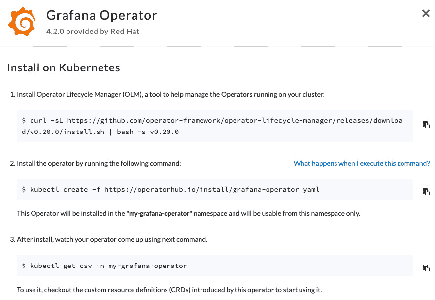

# 第九章：*第九章*：深入探讨常见问题与未来趋势

**Operator 框架**涵盖了许多不同的主题，其中许多主题已在本书中讨论过。在本章中，我们不会讨论任何新主题。相反，我们将以简短、易于消化的 FAQ 风格标题回顾从书籍开始以来所有主要内容。这些常见问题的目的是提供一个简短的参考和复习，帮助你回顾整个书中涵盖的内容。这将是一个很好的快速提醒，尤其是在你准备面试、认证考试或仅仅是想记住某个点的概述时。本节常见问题的框架将包括以下部分：

+   关于 Operator 框架的常见问题

+   关于 Operator 设计、**自定义资源定义**（**CRDs**）和 API 的常见问题

+   关于 Operator SDK 和编码控制器逻辑的常见问题

+   关于 OperatorHub 和 Operator 生命周期管理器的常见问题

+   Operator 框架的未来趋势

这些部分大致按书中的顺序排列，因此按顺序阅读本章将帮助你回忆并巩固你对这些主题的理解，正如它们最初呈现的那样。

# 关于 Operator 框架的常见问题

这些主题包括 Operator 框架概述、其基本组件以及 Operator 设计的一般词汇。来自本节的主题摘自 *第一章*，*介绍 Operator 框架*。

## 什么是 Operator？

Operator 是一种 Kubernetes 控制器。Operator 旨在自动化管理 Kubernetes 应用程序和集群组件。它们通过不断地工作，将集群的当前状态与用户或管理员定义的期望状态进行协调。

## Operator 对 Kubernetes 集群提供了什么好处？

Operator 为开发者提供了一种惯用的方式，将自动化的集群和应用程序管理逻辑编码到控制器中。Operator 还提供了将这种自动化的设置暴露给非开发者用户（例如集群管理员或客户）的方法。这种自动化释放了工程和 DevOps 资源，能够处理许多任务。

## Operator 与其他 Kubernetes 控制器有何不同？

Operator 与任何其他 **Kubernetes** 控制器非常相似。Kubernetes 中的一些内置控制器示例包括 **调度器**、API 服务器和控制器管理器（它本身管理其他控制器）。这些原生控制器都负责自动执行核心集群功能，例如将 Pod 放置到节点上并维护 Deployment 副本数。这些都属于 Operator 所表现的持续状态协调模式的一部分。

然而，尽管功能上相似，Operator 的定义通过概念性和语义性约定将其与标准控制器区分开来。这些包括构成 Operator Framework 的开发库、工具、部署方法和分发渠道。

## 什么是 Operator Framework？

Operator Framework 是一组开发和部署工具以及模式，它定义并支持构建 Operator 的标准流程。广义来说，这包括代码库和脚手架工具（Operator SDK），用于安装、运行和升级 Operator 的组件（**Operator 生命周期管理器** (**OLM**)，以及在 Kubernetes 社区中分发 Operator 的集中式索引（OperatorHub）。

## 什么是 Operand？

Operand 是由 Operator 管理的组件或资源。

## Operator Framework 的主要组成部分是什么？

Operator Framework 的主要组成部分如下：

+   **Operator SDK** – 一套用于从头开始构建 Operator 的常用库和命令行工具。这包括如 **Kubebuilder** 这样的工具的封装，用于生成在 Kubernetes 控制器中使用的代码。

+   **OLM** – 一个设计用来在 Kubernetes 集群中安装、运行和升级（或降级）Operator 的组件。Operator 开发者编写（或生成）描述 Operator 相关元数据的文件，使 OLM 可以自动化 Operator 的部署。OLM 还充当已安装 Operator 的集群内目录，并确保已安装的 Operator 之间没有 API 冲突。

+   **OperatorHub** – 一个集中式索引，包含由开源 GitHub 存储库支持的免费可用的 Operator。开发者可以将 Operator 提交到 [`operatorhub.io/`](https://operatorhub.io/)，以便用户可以进行索引和搜索。

现在，让我们来讨论可以用来编写 Operator 的编程语言。

## Operator 可以用哪些编程语言编写？

从技术上讲，Operator 可以用任何支持与 Kubernetes 集群交互所需的客户端和 API 调用的语言编写。但 Operator SDK 支持在 `operator-sdk` 命令行工具中编写 Operator，但这些 Operator 最终在能力上是有限的。在本书中，我们介绍了用 Go 编写 Operator 所需的代码，Go 提供了更多的功能，这是由 Operator 能力模型定义的。

## 什么是 Operator 能力模型？

能力模型是衡量 Operator 提供的功能并告知用户该功能级别的标准。它定义了五个递增的功能级别：

1.  **I 级 – 基本安装**：能够安装 Operand 的 Operator，如果适用，还会暴露该安装的配置选项。

1.  **II 级 – 无缝升级**：能够在不中断功能的情况下升级自身及其 Operand 的 Operator。

1.  **III 级 – 完整生命周期**：能够处理 Operand 备份创建和/或恢复、故障恢复的故障切换场景、更复杂的配置选项以及自动扩展 Operands 的 Operator。

1.  **IV 级 – 深度洞察**：报告自己或其 Operand 的指标的 Operator。

1.  **V 级 – 自动驾驶**：处理复杂自动化任务的 Operator，包括自动扩展（根据需要创建更多 Operand 副本或删除副本）、自动修复（根据自动报告如指标或警报，检测并恢复故障场景，无需干预）、自动调优（将 Operand Pods 重新分配到更合适的节点）、或异常检测（检测 Operand 性能与常规应用健康不符的情况）。

这些是第一章中涵盖的一些最基础的主题。本书接下来的章节在这些基础上进一步探讨了 Operator 设计概念。

# 关于 Operator 设计、CRD 和 API 的常见问题解答。

这些问题涵盖了有关 Operator 设计的信息，包括开发 Operator 的方法以及 Operator 如何在 Kubernetes 集群中运行。本节中的主题在*第二章*中介绍过，*理解 Operator 如何与 Kubernetes 交互*，以及*第三章*，*设计 Operator – CRD、API 和目标调解*。

## Operator 如何与 Kubernetes 交互？

Operator 通过事件触发的持续监控集群状态与 Kubernetes 交互，在此过程中，Operator 尝试将当前状态与用户指定的期望状态进行调解。从技术角度看，它通过一组标准的 Kubernetes 客户端库来完成这一过程，这些库允许它列出、获取、观察、创建和更新 Kubernetes 资源。

## Operator 作用于哪些集群资源？

Operator 可以作用于通过 Kubernetes API 可访问的任何资源（并且该 Operator 具有集群权限访问）。这包括原生 Kubernetes 资源（例如 Pods、ReplicaSets、Deployments、Volumes 和 Services）以及第三方 API 或 CRD 提供的**自定义资源**（**CRs**）。

## 什么是 CRD？

CRD（自定义资源定义）是 Kubernetes 原生 API 类型，允许开发者通过 CR 类型扩展 Kubernetes API，这些 CR 类型在外观和行为上与原生 Kubernetes API 资源完全一致。运维开发者可以创建一个 CRD 来定义其 Operator 的 API 类型（例如，`customresourcedefinitions/MyOperator`），然后该 CRD 提供一个模板，用于创建符合该类型定义的 CR 对象（例如，`MyOperators/foo`）。

## CRD 与 CR 对象有什么不同？

CR 对象是基于 CRD 模板的对象的单独表示。从编程的角度来看，它是抽象类型和该类型的对象实例化之间的区别。CR 对象是用户用来设置 Operator 配置的 API 对象，例如通过 `kubectl get MyOperators/foo` 等命令进行交互。

## Operator 在 Kubernetes 的哪些命名空间中运行？

Operator 可以是 `namespaced` 或 `cluster-scoped`。命名空间 Operator 运行在单个命名空间内，这允许在集群中安装多个相同的 Operator。集群范围 Operator 运行在集群级别，管理多个命名空间中的资源。Operator 的范围主要由其 CRD 中定义的命名空间范围以及分配给 Operator 服务的 **基于角色的访问控制** (**RBAC**) 策略决定。

## 用户如何与 Operator 进行交互？

用户首先通过安装 Operator 与其进行交互。安装方式可以是通过像 OperatorHub 这样的索引，或者直接从你所在组织的网站或 GitHub 页面安装。通常，Operator 可以通过一个 `kubectl create` 命令进行安装，尤其是在通过 OLM 安装时。

一旦安装，用户将主要通过创建一个 CR 对象与 Operator 进行交互，该对象是其 CRD 的表示。该 CR 对象将公开 API 字段，用于调整与 Operator 相关的各种设置。

## 如何在 Operator 生命周期的早期进行变更规划？

与许多软件项目一样，深思熟虑的设计可以使项目随着时间的推移更容易增长。在 Operator 的背景下，这意味着要及早考虑 Operator（更重要的是其 Operand）如何随着时间变化而变化。上游 API 和第三方依赖的支持周期可能与贵组织的支持周期不同，因此尽量减少这些依赖的暴露对于减少后续的工作非常有帮助。为此，从小规模开始设计 Operator，并根据需要扩展其功能可能会更有帮助。这正是能力模型背后的理念，每一层都有效地构建在上一层的基础上。

## Operator 的 API 如何与其 CRD 相关联？

Operator 提供的 API 是其 CRD 的代码定义。当使用 Operator SDK 在 Go 中编写 API 时，该 API 会通过 SDK 提供的工具生成 CRD。

## Operator API 的约定是什么？

Operator API 的约定通常遵循与本地 API 对象相同的上游 Kubernetes 约定。其中最重要的一点是，Operator 对象包含两个字段：`spec` 和 `status`，这为 Operator 执行集群状态协调循环提供了基础。`spec` 是 Operator 对象的用户输入部分，而 `status` 报告 Operator 当前的运行状态。

## 什么是结构化 CRD 架构？

结构化 CRD 架构是强制集群内存中已知字段的对象定义。Kubernetes 要求 CRD 定义结构化架构，这可以通过 Operator SDK 提供的工具生成。它们提供了安全优势，且通常比较复杂，因为建议使用自动生成而非手动编写。

## 什么是 OpenAPI v3 验证？

OpenAPI v3 验证是一种在创建或修改对象时提供字段类型和格式验证的格式。字段验证在 Go 代码中为 CRD 的 API 类型定义。这些验证以注释的形式存在（例如，`//+kubebuilder:validation…`）。当生成 Operator CRD 时，这些注释会被生成到验证架构中。

## 什么是 Kubebuilder？

Kubebuilder 是一个开源项目，提供了一个生成 Kubernetes API 和控制器的工具。Operator SDK 中的许多命令都是底层 Kubebuilder 命令的封装。了解这一点对于调试和排查 Operator SDK 问题时非常有帮助。

## 什么是对账循环？

**对账循环**，或称**控制循环**，是 Operator 的主要逻辑功能。从概念上讲，它是 Operator 执行的一系列持续检查，用以确保实际的集群状态与期望的状态相匹配。实际上，这通常不是一个持续循环，而是一个由事件触发的函数调用。

## Operator 的对账循环的主要功能是什么？

Operator 的对账循环是其核心逻辑，在此期间，Operator 会评估集群的当前状态，将其与期望状态进行比较，并在必要时执行所需的操作，以使集群的状态与期望状态一致。这可能意味着更新部署或调整工作负载约束以应对状态变化。

## 事件触发的两种类型是什么？

事件触发通常分为两类：**基于水平触发**和**基于边缘触发**。Operator 设计遵循基于水平触发的方法，在这种方法中，触发事件并不包含集群状态的全部上下文。相反，Operator 只需从事件中接收到足够的信息，以理解相关的集群状态。通过每次重建这些信息，Operator 确保由于延迟或丢失的事件而不会丢失任何状态信息。这与基于边缘触发的事件（仅由事件的传入动作激活对账）形成对比，后者可能导致信息丢失，不适合像 Kubernetes 这样的大型分布式系统。这些术语源自电子电路设计。

## 什么是 ClusterServiceVersion（CSV）？

`ClusterServiceVersion` 是由 Operator Framework 提供的 CRD，包含描述单个 Operator 版本的元数据。`ClusterServiceVersion` CRD 由 OLM 提供，OLM 是 Operator CSV 的主要消费者。OperatorHub 也使用 Operator CSV 向用户展示有关 Operator 的信息。

## Operator 如何处理升级和降级？

Operator 版本由其发布版本、镜像标签和 CSV 元数据定义。CSV 尤其提供了升级通道的概念，允许开发者定义升级和降级版本的订阅路径。OLM 然后通过这些元数据了解如何在版本间过渡已安装的 Operators。Operator API 版本在 Operator 的 CRD 中定义，可以包含有关多个版本的信息。这使得开发者能够发布一个支持多个 API 版本的 Operator 版本，从而允许用户在单个版本中进行版本间的过渡。

## Operator 如何报告故障？

Operator 有多种方式报告问题。这些方式包括标准的运行时日志、度量和遥测、状态条件以及 Kubernetes 事件。

## 什么是状态条件？

状态条件是 Operator 使用上游 Kubernetes API 类型（`v1.Condition`）的一种能力，能够通过 Operator 的 CRD 中的 `status` 字段快速向用户通报各种失败（或成功）状态。

## 什么是 Kubernetes 事件？

事件是 Kubernetes API 对象，可以被本地 Kubernetes 工具（如 `kubectl`）聚合、监控和过滤。与状态条件的定义相比，它们提供更丰富的信息，允许向用户报告更先进的信息。

# 关于 Operator SDK 和编写控制器逻辑的常见问题

本节的主题聚焦于使用 Operator SDK 开发 Operator 的技术内容。这包括生成 Operator 项目的初始模板代码、填充自定义的调解逻辑，并通过更多高级功能扩展代码。这些主题在 *第四章*，“使用 Operator SDK 开发 Operator” 和 *第五章*，“开发 Operator —— 高级功能”中介绍。

## 什么是 Operator SDK？

Operator SDK 是一个软件开发工具包，提供了代码库和工具，用于快速搭建和构建 Operator。它主要通过 `operator-sdk` 二进制文件使用，提供了初始化项目、创建模板 API 和控制器、生成代码以及在集群中构建和部署 Operators 的命令。

## 如何使用 operator-sdk 架构一个模板 Operator 项目？

创建 Operator SDK 项目的第一个命令是 `operator-sdk init`。该命令接受额外的标志以提供一些项目信息（例如项目的代码库位置），这些信息将在创建 Operator 的其他部分（如 API 和控制器）时填充变量。

## 一个 boilerplate Operator 项目包含哪些内容？

一个 boilerplate Operator 项目（即仅通过 `operator-sdk init` 创建且未做其他更改的项目）只包含一个包含一些基本标准代码的 `main.go` 文件，一个用于构建容器镜像的 `Dockerfile` 文件，一个提供更多构建和部署 Operator 命令的 `Makefile` 文件，以及一些附加的配置文件和依赖目录。

## 如何使用 operator-sdk 创建 API？

`operator-sdk create api` 命令初始化一个模板 API 文件结构，供开发者填写。它接受额外的标志来定义 API 版本和 Operator 的资源名称，甚至可以创建 Operator 的 boilerplate 控制器来处理 API 对象。

## 使用 operator-sdk 创建的基本 Operator API 是什么样子的？

`operator-sdk create api` 创建的空模板 API 包含一个 Operator `config` 对象的基本定义。该对象由上游元数据类型组成（包含如 `namespace` 和 `name` 之类的字段），以及两个子对象，分别表示 Operator CRD 的 `spec` 和 `status` 字段。

## operator-sdk 还生成了哪些其他代码？

除了供开发者修改的 boilerplate 模板代码外，`operator-sdk` 命令还生成了 `deepcopy` 和其他 Kubernetes 客户端使用的代码，这些代码不应修改。因此，定期重新运行 `operator-sdk` 提供的代码生成器非常重要，以确保这些自动生成的代码保持最新。

## Kubebuilder 标记的作用是什么？

Kubebuilder 标记是特殊格式的代码注释，放置在 API 对象的字段、类型和包上。它们定义了字段验证设置（如类型、长度和模式）以及其他控制 Operator CRD 生成的选项。它们允许在靠近相关代码的地方配置这些选项，从而使其非常清晰。

## Operator SDK 如何生成 Operator 资源清单？

Operator SDK 生成相关的资源清单（包括 Operator 的 CRD 以及其他必需资源，如 `make manifests` 命令）。该命令在基本 Operator 项目的标准 `Makefile` 文件中定义，并调用 `controller-gen` 二进制文件（Kubebuilder 工具集的一部分）来进行生成。

## 你还可以如何自定义生成的 Operator 清单？

生成的操作员清单可以根据需要进行自定义，超出 `controller-gen` 工具的默认操作。这个程序是生成资源文件的基础组件，手动运行它可以访问额外的命令和标志。

## 什么是 go-bindata 和 go:embed？

`go-bindata` 和 `go:embed` 是两种将原始文件编译成 Go 代码的方式。前者是可以导入项目作为库的包，而后者是 Go 编译器的原生指令。两者都是使与操作员相关的资源（例如 Operand 部署 YAML 文件）在代码中可访问并可供其他用户读取的有用选项。

## 控制/协调循环的基本结构是什么？

对于大多数操作员，控制循环的基本结构遵循以下步骤：

1.  检索操作员/集群的期望配置。

1.  评估集群的当前状态，结合操作员可用的信息，并将其与期望配置进行比较。

1.  如有必要，采取行动将当前集群状态过渡到期望状态。

在每个步骤中，操作员还应实现错误检查和状态报告分支，以便向用户报告任何故障（例如，如果操作员无法找到自己的配置，显然不应该继续）。

## 控制循环功能如何访问操作员配置设置？

主要控制循环功能（在 Operator SDK 项目中为 `Reconcile()`）通过其 CR 对象访问操作员的配置设置。这要求用户在集群中创建了 CR 对象的实例（如 CRD 所定义的）。由于 CR 对象可以通过 Kubernetes API 访问，操作员可以使用 Kubernetes 客户端和诸如 `Get()` 之类的功能来检索其配置。在 Operator SDK 中，这些客户端会自动填充并传递给 `Reconcile()` 函数，随时可以使用。

## 状态条件报告了哪些信息？

`v1.Condition` 对象包含描述状态的字段：`type`（状态的简短名称），`status`（表示状态的布尔值），以及 `reason`（提供更多信息的较长描述）。它还包含关于状态最后转换时间戳的时间戳信息。

## 指标的两种基本类型是什么？

指标大致分为两类：**服务指标**和**核心指标**。服务指标是为特定组件（或服务）定义的自定义指标，而核心指标是所有服务发布的通用指标（例如 CPU 和内存使用情况）。

## 如何收集指标？

核心指标可以使用 `metrics-server` 组件进行收集（[`github.com/kubernetes-sigs/metrics-server`](https://github.com/kubernetes-sigs/metrics-server)）。服务指标可以通过任何指标聚合工具收集，例如 Prometheus。

## 什么是 RED 指标？

**速率、错误和持续时间**（**RED**）是一个描述定义新指标最佳实践的缩写。建议服务的三种关键指标应包括速率、错误和持续时间。即分别报告每个周期的请求数量、失败的尝试数量和请求的延迟时间。

## 什么是领导者选举？

领导者选举是指运行多个副本的应用程序，其中一个副本（领导者）同时工作。这为应用程序提供了高可用性，因为如果一个副本失败，其他副本可以准备好替代它。这个概念适用于 Operator，因为在分布式系统中，可能需要确保 Operator 的正常运行时间。

## 领导者选举的两种主要策略是什么？

领导者选举可以实现为领导者与租约（leader-with-lease）或终身领导者（leader-for-life）。领导者与租约的方法是 Operator SDK 项目的默认策略，在这种方法中，当前的领导者会定期尝试续期其状态。这允许领导者的快速切换，若有需要时。终身领导者方法中，领导者只有在被删除时才会放弃其身份。这使得恢复变得较慢，但更加明确。

## 什么是健康检查和准备检查？

健康检查和准备检查是看门狗端点，允许应用程序指示何时处于健康状态（即运行顺畅）和准备就绪状态（即积极准备好接受请求）。Operator SDK 提供了一个基本的健康检查和准备检查，作为一个模板项目，但这些检查可以轻松扩展以适应自定义逻辑。

# 关于 OperatorHub 和 OLM 的常见问题

这些问题与 Operator 的构建、发布和部署有关。涵盖的主题包括使用 OLM 安装 Operator 和将 Operator 提交到 OperatorHub。这些主题来自于 *第六章*《构建与部署您的 Operator》和 *第七章*《使用 Operator 生命周期管理器安装和运行 Operator》。

## 有哪些不同的方法可以编译一个 Operator？

与许多云原生应用程序一样，Operator 可以被编译为本地二进制文件或构建为适用于直接部署到 Kubernetes 集群中的容器镜像。Operator SDK 提供了执行这两种操作的命令。

## 一个基础的 Operator SDK 项目是如何构建容器镜像的？

Operator SDK 提供了 `Makefile` 目标，可以通过 `make docker-build` 构建 Docker 镜像。默认情况下，这会将主 Operator 源代码（特别是主控制器和 API）以及其 `assets` 目录复制到 Docker 镜像中。

## 如何在 Kubernetes 集群中部署 Operator？

Operator 可以在 Docker 镜像构建完成后手动部署，类似于其他应用程序在 Kubernetes 集群中的部署方式。Operator SDK 通过 `make deploy` 命令简化了这个过程。Operator 也可以通过 OLM 安装。

## 什么是 OLM？

OLM 是 Operator Framework 提供的一个组件，用于管理 Operator 在集群中的安装、运行以及升级/降级。

## 使用 OLM 运行 Operator 有什么好处？

OLM 提供了一个方便的工具来安装 Operators（与手动部署 Operator 镜像等方法不同），并且可以监控集群中 Operator 的状态。它可以确保 Operator 不会与其他 Operator 发生冲突。它还可以处理集群中 Operator 的升级和降级。最后，它使集群中已安装的 Operator 列表对用户可用。

## 如何在集群中安装 OLM？

可以通过运行 `operator-sdk olm install` 来使用 `operator-sdk` 二进制文件安装 OLM。

## `operator-sdk olm status` 命令显示什么内容？

运行 `operator-sdk olm status`（在集群中安装 OLM 后）会通过列出 OLM 所需的资源（包括它安装的 CRD、RoleBindings、Deployment 和命名空间）来显示 OLM 的健康状态。

## 什么是 Operator 包？

包是用于打包 Operator 清单和 **ClusterServiceVersion**（**CSV**）的格式。

## 如何生成包？

使用 Operator SDK，可以通过运行 `make bundle` 来生成包。此命令是交互式的，会要求提供有关 Operator 和您的组织的信息，然后将这些信息编译到包中的 Operator 元数据中。

## 什么是包镜像？

包镜像是一个容器镜像，保存来自 Operator 包的信息。该镜像用于根据基础元数据在集群中部署 Operator。

## 如何构建包镜像？

可以通过运行 `make bundle-build` 使用 Operator SDK 构建包镜像。这将构建包含包信息的基本 Docker 镜像。

## 如何使用 OLM 部署包？

`operator-sdk run bundle` 命令使用 OLM 将包镜像部署到集群中。该命令需要一个额外的参数，即容器注册表中包镜像的位置，例如 `operator-sdk run bundle docker.io/myreg/myoperator-bundle:v0.0.1`。

## 什么是 OperatorHub？

OperatorHub 是一个集中管理的索引，收录了来自各种开发者和组织发布的 Operator。它的网址是 [`operatorhub.io`](https://operatorhub.io)。每个 Operator 都提供关于 Operator 和开发者的信息，以及安装指南、支持资源和源代码链接。它通过解析 Operator 包中的信息（主要来自 Operator CSV）来实现这一点。

## 如何从 OperatorHub 安装 Operator？

每个 OperatorHub 上的 Operator 页面都包括一个安装说明的链接。这些说明包含一系列简单的命令，通常使用 `kubectl create`：

图 9.1 – OperatorHub 安装说明截图

## 如何将 Operator 提交到 OperatorHub？

在 OperatorHub 上列出一个 Operator 涉及向 GitHub 仓库提交 **pull request** (**PR**)，该仓库作为支持 OperatorHub 的后端索引。要求包括提交一个有效的 CSV 文件，并按照目录结构排列，这样就可以直接从 Operator SDK 包生成命令的输出中复制。自动化测试会检查是否满足所有提交要求，然后合并提交的 PR，Operator 很快就会列出在 [`operatorhub.io`](https://operatorhub.io) 上。

# Operator 框架中的未来趋势

本节涉及的是你自己 Operator 的未来维护，以及与上游 Kubernetes 社区的持续工作对齐，以及它如何与第三方 Operator 开发相关。这些内容来自 *第八章*，*为 Operator 的持续维护做准备*。

## 如何发布 Operator 的新版本？

发布 Operator 的新版本主要取决于你组织的发布方法，包括时间安排和交付基础设施。然而，Operator 框架提供了一些方式来标注 Operator 版本，例如在 Operator 的 CSV 文件中的版本字段（该字段会显示在 OperatorHub 上）、新的 API 版本和发布通道。

## 何时适合添加新 API 版本？

添加新 API 版本最常见的时机是在引入对现有 API 的破坏性更改时。增加 API 版本也可以作为其稳定性水平的一个指示（例如，将 `v1alpha1` API 升级为 `v1beta1` 或 `v1`）。最重要的是，在用新版本替换旧版本时，遵循你所选择的支持时间表（或者，如果你选择采用 Kubernetes 时间表作为模板，则遵循 Kubernetes 时间表）。

## 如何添加新 API 版本？

可以通过 `operator-sdk create api` 命令添加新的 API。这个命令会像在项目中创建 Operator 初始 API 时一样，生成空的 Go 文件。一旦这些文件填充了新的 API 类型，生成的相应代码、CRD 和其他清单可以通过 `make generate` 和 `make manifests` 命令来更新。

## 什么是 API 转换？

API 转换指的是 Operator 能够在同一 API 的不兼容版本之间转换 API 对象。Operator 中的转换代码允许它在同一版本中支持多个 API 版本。通常，开发者会编写手动转换逻辑，确保两个 API 之间的不兼容字段能够相互转换（双向转换）而不丢失任何数据。这么做的最大好处是允许用户无缝地从废弃的 API 过渡到更新的版本。

## 如何在两个 API 版本之间转换？

在设计新的 API 时，考虑如何准确地将旧版本中的现有信息转换到新版本并反向转换。然后，你可以通过在 Operator 的代码中实现转换 webhook 来在两个版本的 API 之间进行转换。

## 什么是转换 webhook？

转换 webhook 是一个在 Operator Pod 中暴露的端点，它接收来自 API 服务器的请求，用于在不同版本之间对 API 对象进行编码和解码。

## 如何将转换 webhook 添加到 Operator 中？

转换 webhook 由两个必须为正在转换的 API 对象类型实现的 Go 接口组成。这两个接口是 `Convertible` 和 `Hub`，来自 `sigs.k8s.io/controller-runtime/pkg/conversion`。最重要的是，`Convertible` 接口要求实现两个函数，`ConvertTo()` 和 `ConvertFrom()`，开发者在这两个函数中手动编写逻辑，以便在两个对象之间转换字段。然后，可以使用 `operator-sdk create webhook` 命令创建暴露相关端点的 webhook 清单。这些清单通过在项目的 `Kustomization` 文件中取消注释 webhook 引用来启用。

## 什么是 kube-storage-version-migrator？

**kube-storage-version-migrator** 是一个工具，允许 Kubernetes 用户手动将现有的存储 API 对象转换为新的 API 版本。这对于帮助 Operator 版本之间的更新非常有用，尤其是当新 API 改变了 Operator CRD 对象的存储版本时。

## 如何更新 Operator 的 CSV？

Operator 的 CSV 包含有关 Operator 的信息，包括当前版本。为了提高 Operator 的版本，首先需要更新 CSV，使用 `replaces` 字段指示 Operator 的先前版本。换句话说，这告诉像 OLM 这样的工具，哪个版本是新版本的前一个版本，以便它能够升级到正确的版本。然后，需要在 Operator 项目的 `Makefile` 中更新 `VERSION` 变量为新版本号（例如 `0.0.2`）。使用 `make bundle` 和 `make bundle-build` 命令生成新的 CSV。

## 什么是升级渠道？

升级渠道是一种提供不同分发升级路径的方式。例如，Operator 的 CSV 可以定义 `alpha` 和 `stable` 渠道。用户可以选择订阅其中一个渠道，以便按照他们期望的节奏和稳定性级别获取更新版本。

## 如何在 OperatorHub 上发布新版本？

OperatorHub 在 GitHub 上托管 Operator 的捆绑信息。每个 Operator 都有一个独特的目录，里面包含该 Operator 的每个不同版本作为子目录。这些子目录中包含该版本的捆绑信息（例如其 CSV）。

## 什么是 Kubernetes 弃用政策？

Kubernetes 废弃政策定义了核心 Kubernetes 组件的 API 版本支持指南。这为下游和第三方开发者（以及用户）提供了基于 API 稳定性支持的保证时间表。它也是其他不严格遵守该政策但希望与上游 Kubernetes 政策保持一致的项目的良好模板。

## 在 Kubernetes 废弃政策中，如何移除 API 元素？

在 Kubernetes 废弃政策中，API 元素只能通过增加 API 版本来移除。换句话说，如果一个 Operator 遵循 Kubernetes 废弃政策，则不能从当前 API 中移除 CRD 字段。相反，它必须创建一个不包含该字段的新 API 版本。

## API 版本通常支持多长时间？

Kubernetes 废弃政策中 API 版本的支持时间表取决于其稳定性等级（alpha、beta 或 GA）。Alpha API 没有保证的时间表，可以随时更改。Beta API 支持 9 个月或三个发布版本（以较长者为准）。已经毕业的 GA API 不能被移除，但可以标记为废弃。

## Kubernetes 发布周期多长？

Kubernetes 小版本发布周期大约为 15 周，并包含多个里程碑日期，包括增强冻结（Enhancements Freeze）、代码冻结（Code Freeze）和 Retrospective。

## 什么是增强冻结（Enhancements Freeze）？

增强冻结（Enhancements Freeze）是发布周期中的一个节点，此时 **Kubernetes Enhancements**（**KEPs**）必须是可实现的，并承诺加入当前发布，或者正式推迟到至少下一个发布。

## 什么是代码冻结（Code Freeze）？

在代码冻结时，所有重要的代码更改必须合并到当前发布版本中，否则需要获得合理的延期例外。

## 什么是 Retrospective？

Retrospective 是一系列会议，这些会议在 Kubernetes 版本发布前后举行，社区成员在这些会议中反思发布中成功的领域，并指出可以改进的流程。

## Kubernetes 社区标准如何应用于 Operator 开发？

Operator 开发者没有义务遵守 Kubernetes 社区标准或参与上游开发。然而，了解 Kubernetes 项目的运作对 Operator 开发者非常有帮助，因为它提供了功能支持的指南，而 Operator 很多时候依赖于某些 Kubernetes 特性。这些标准还为 Operator 自身的开发流程提供了模板，可以呈现给 Operator 的用户。

# 总结

显然，在讨论操作符框架时，有太多的主题无法在一个简短的章节中涵盖所有内容。因此，本章的目标是回顾已经讨论过的最重要的要点，以简洁的方式解释它们，从头到尾。为了深入了解这些主题中的任何一个，已提供了它们原始章节作为资源。此外，本书中列出的众多精彩参考资料也可以为你提供支持，并进一步阅读所有这些主题。

在接下来的章节中，我们将研究在开源社区中开发的实际操作符。通过这样做，我们有机会将前面讨论的每个主题与具体示例联系起来，并比较本书中提供的示例与实际操作符之间的相似性和差异。
