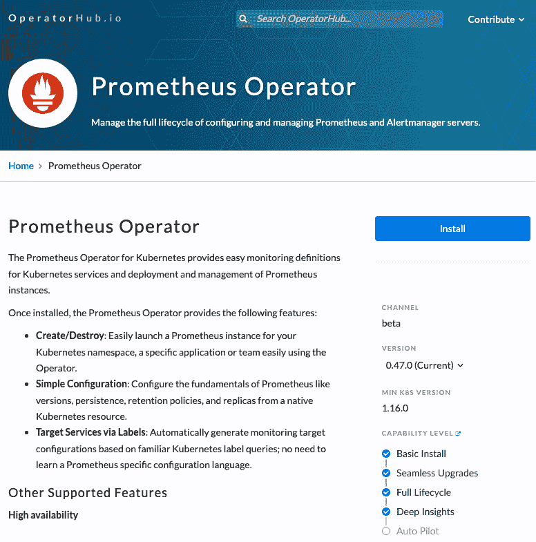

# *第十章*：可选 Operator 案例研究——Prometheus Operator

本书的重点是介绍、讨论和展示使用 Operator Framework 开发 Kubernetes Operator 的主要流程。为此，构建了一个具有管理 nginx 部署基本功能的示例 Operator。这个示例旨在作为 Operator 开发的教程，避免用过多的功能或复杂的背景知识使读者感到困扰，从而理解用例。希望它能很好地实现这一目的。

但是，这个 nginx Operator 的简单性可能使得 Operator Framework 中的一些步骤看起来显得多余。从学习示例 Operator 到理解现实世界用例的应用，这是一个很大的跨越。因此，在本章中，我们将研究 Prometheus Operator（[`prometheus-operator.dev/`](https://prometheus-operator.dev/)），该 Operator 用于管理 Prometheus 监控服务的单个部署（这个服务用于收集本书早期使用 nginx Operator 获取的指标）。在本章中，我们将其称为*可选* Operator，因为它管理的 Operand 是一个应用级别的组件，并不对集群的运行至关重要（与下章不同，下章将讨论如何通过 Operator 管理核心的集群级别组件）。关于 Prometheus Operator 的内容将在以下几个部分讨论：

+   一个现实世界的用例

+   Operator 设计

+   Operator 的分发与开发

+   更新与维护

当然，虽然 Prometheus Operator 和本书中示例的 nginx Operator（严格遵循 Operator Framework 模板）之间有许多相似之处，但同样重要的是要突出它们的差异。部分差异将在全章中提到，展示即使在 Operator Framework 内部，也没有一种统一的方式来开发 Operator。这正是像这样的开源软件的魅力所在：它的模式和差异促进了一个多元化的社区，孕育了各种各样的项目。

# 一个现实世界的用例

Prometheus（[`github.com/prometheus/prometheus`](https://github.com/prometheus/prometheus)）是一个用于通过收集应用程序导出的指标并以时间序列方式存储这些数据，从而监控应用程序和集群的工具。在*第五章*《开发 Operator - 高级功能》中，我们在 nginx Operator 中实现了基本的 Prometheus 指标，暴露了关于 Operator 总体调和尝试的汇总信息。这只是一个依赖 Prometheus 进行监控的潜在应用架构设计的小例子。

## Prometheus 概述

除了抓取和聚合度量标准，Prometheus 还定义了一个数据模型，用于创建不同类型的度量标准并在应用程序中实现它们。这个模型通过 Prometheus 提供的多种语言客户端来进行仪表化，包括 Ruby、Python、Java 和 Go。这些客户端使得应用程序开发者能够轻松地以与 Prometheus 服务器 API 兼容的格式导出度量标准（就像我们在示例 nginx Operator 中所做的那样）。

除了计数器度量类型（用于汇总 nginx Operator 中的 `reconciles_total` 度量标准），Prometheus 提供的其他度量类型包括 Gauge、Histogram 和 Summary。每种度量标准都可以通过标签的形式导出附加属性，从而为它们报告的数据提供额外的维度。

此外，Prometheus 允许用户使用其自身的查询语言 **PromQL** 来搜索度量标准。这种语言的功能，再加上度量标准本身灵活且广泛的实现可能性，帮助 Prometheus 成长为云原生应用程序（不仅仅是 Kubernetes）中领先的度量收集工具之一（如果不是的话）。

在本书的早期章节中，我们简要讨论了如何使用 Prometheus 客户端创建新的度量标准，并通过 PromQL (*第五章*，*开发操作员 – 高级功能*) 来检索这些度量标准，同时还构建了示例 Operator。这些主题虽然重要，但与 Prometheus Operator 关系不大（无论如何，它们在此处简要描述，以提供实际使用案例的完整背景）。Prometheus Operator 解决的更相关的方面是 Prometheus 作为操作数的安装和配置。

## 安装和运行 Prometheus

在 *第六章*，*构建和部署你的 Operator* 中，我们展示了一种通过在 nginx Operator 项目中引用 `kube-prometheus` 库来安装 Prometheus 到集群中的方法。kube-prometheus 的优点是它安装了一个完整的监控堆栈，包括 **Grafana** 等组件，但也包括 Prometheus Operator 本身。那么，在集群中安装 Prometheus 到底意味着什么？通过使用 kube-prometheus（进而使用 Prometheus Operator），我们节省了哪些步骤？为了回答这些问题，首先让我们退一步，了解 Prometheus 的工作原理。

Prometheus 实例的核心是 Prometheus 服务器，它作为一个单一的二进制文件运行，获取指标并将其提供给 Web UI、通知服务或长期存储。类似于 Operator（或任何旨在部署到 Kubernetes 的应用程序），这个二进制文件必须编译并打包成容器镜像。如 Prometheus 文档中所描述，预编译的二进制文件可以直接下载（作为可执行文件或容器镜像），或者可以从源代码构建（[`github.com/prometheus/prometheus#install`](https://github.com/prometheus/prometheus#install)）。这对于本地运行来说足够方便，但对于部署到 Kubernetes 集群（特别是生产环境）来说，还需要进一步的设置。

首先，通常不允许在没有某种配置形式的情况下将容器直接部署到集群中。Kubernetes 对象如 Deployments 会将容器封装在一个受管理和可配置的表示中，暴露诸如副本数和发布策略等选项。因此，手动在 Kubernetes 集群中安装 Prometheus 将需要自己定义 Kubernetes Deployment。

一旦它在集群中运行，Prometheus 就需要访问暴露指标的应用程序。这需要额外的资源，如 `ClusterRoles` 和 `RoleBindings`，以确保 Prometheus Pod 拥有从集群及其应用程序抓取指标的权限。这些 RBAC 权限必须通过 `ServiceAccount` 实例绑定到 Prometheus Pod 上。然后，用户访问 Web UI 需要一个 Service 来使前端在 Web 浏览器中可达。该 Service 只能通过 Ingress 对象暴露到集群外部。

对于初始安装来说，这已经是很多步骤了。然而，手动管理该安装也需要持续的关注和对每个资源及其角色的系统性理解。虽然这肯定是可行的，但有一个 Operator 来处理这些资源可以释放工程师的时间，并通过抽象复杂的清单声明来实现更好的扩展。

然而，正如本书中所讨论的，许多（如果不是大多数）Operator 不仅仅是安装它们的 Operand。通常，它们会继续管理已安装应用程序的生命周期，包括允许你更改正在运行的 Operand 的配置。Prometheus Operator 也为 Prometheus 做了这件事。

## 配置 Prometheus

作为一个功能齐全的应用程序，Prometheus 提供了一套丰富的配置选项，以适应不同的场景。这些配置在官方 Prometheus 文档中有详细说明，网址为 [`prometheus.io/docs/prometheus/latest/configuration/configuration/`](https://prometheus.io/docs/prometheus/latest/configuration/configuration/)。在这些设置中，有两组用于配置 Prometheus 的选项：

+   命令行标志：它们控制影响 Prometheus 服务器本身的设置，例如持久存储访问和日志记录设置。

+   YAML 配置：它通过命令行标志（`--config.file` 或 `--web.config.file`）传递给 Prometheus，并提供对 Prometheus 监控行为的声明式控制；例如，度量抓取设置。

这种设置类型的分离是一个很好的设计，通常用于 Kubernetes 应用程序、Operators 以及非 Kubernetes 软件中。它的好处是能清晰地将运行时应用设置与行为选项解耦，并且这种区分对用户而言是显而易见的。然而，从管理员的角度来看，这会创建两个需要单独跟踪的关注区域。

### 命令行标志

可以通过运行 `prometheus -h` 来查看 Prometheus 二进制文件的所有命令行标志。共有几十个选项，但它们大致可以分为以下几类：

+   Web

+   存储

+   规则

+   查询

+   日志记录

这些类别中的每一项都有最多 10 个（或更多）独立设置，控制 Prometheus 服务器的不同方面。此外，还有 `--enable-feature` 标志，它接受一个用逗号分隔的功能列表来启用（例如，`--enable-feature=agent,exemplar-storage,expand-internal-labels,memory-snapshot-on-shutdown` 启用这四个额外的功能门控）。

在 Kubernetes 部署清单中，这些标志将控制在 `spec.template.spec.containers.command`（或 `.args`）字段中。例如，以下是一个简单的 Prometheus 部署 YAML 文件，它传递了一个配置文件并启用了前述功能：

```
apiVersion: apps/v1
```

```
kind: Deployment
```

```
metadata:
```

```
  name: prometheus
```

```
  labels:
```

```
    app: prometheus
```

```
spec:
```

```
  replicas: 1
```

```
  selector:
```

```
    matchLabels:
```

```
      app: prometheus
```

```
  template:
```

```
    metadata:
```

```
      labels:
```

```
        app: prometheus
```

```
    spec:
```

```
      containers:
```

```
      - name: prometheus
```

```
        image: docker.io/prom/prometheus:latest
```

```
        command: ["prometheus"]
```

```
        args:
```

```
        - --config=/etc/prom/config-file.yaml
```

```
        - --enable-feature=agent,exemplar-storage,expand-internal-labels,memory-snapshot-on-shutdown
```

当然，配置文件还需要挂载到 Prometheus Pod 中，以便能够访问，如下代码所示。这展示了前述部署 YAML 文件，修改后添加了一个 `VolumeMount` 实例，使得配置文件像本地文件一样能够被 Prometheus Pod 访问（新代码已高亮显示）：

```
apiVersion: apps/v1
```

```
kind: Deployment
```

```
metadata:
```

```
  name: prometheus
```

```
  labels:
```

```
    app: prometheus
```

```
spec:
```

```
  replicas: 1
```

```
  selector:
```

```
    matchLabels:
```

```
      app: prometheus
```

```
  template:
```

```
    metadata:
```

```
      labels:
```

```
        app: prometheus
```

```
    spec:
```

```
      containers:
```

```
      - name: prometheus
```

```
        image: docker.io/prom/prometheus:latest
```

```
        command: ["prometheus"]
```

```
        args:
```

```
        - --config=/etc/prom/config-file.yaml
```

```
        - --enable-feature=agent,exemplar-storage,expand-internal-labels,memory-snapshot-on-shutdown
```

```
        volumeMounts:
```

```
        - name: prom-config
```

```
          mountPath: /etc/prom
```

```
      volumes:
```

```
      - name: prom-config
```

```
        configMap:
```

```
          name: prometheus-cfg
```

该配置文件（挂载为 `/etc/prom/config-file.yaml`）需要作为一个独立的 ConfigMap 创建。这将引出 Prometheus 配置文件所控制的第二组选项。

### YAML 配置设置

Prometheus 的 YAML 配置格式暴露了控制 Prometheus 一般抓取（度量收集）行为的设置。在可用选项中，包括平台特定的 **服务发现** (**SD**) 控制，这些控制适用于各个云服务提供商，包括 Azure、Amazon EC2 和 Google Compute Engine 实例。还有用于重新标记度量数据的选项，启用度量数据的远程读取和写入功能，以及配置 AlertManager 通知、追踪和示例等功能。最后，配置还提供了 TLS 和 OAuth 设置，以确保度量数据抓取的安全性。

所有这些选项已经为 Prometheus 配置提供了复杂的可能性。即使是 Prometheus 提供的示例配置文件，也有近 400 行！（不过，它是用来演示多种不同类型的指标设置。例如，看看[`github.com/prometheus/prometheus/blob/release-2.34/config/testdata/conf.good.yml`](https://github.com/prometheus/prometheus/blob/release-2.34/config/testdata/conf.good.yml)。）这可能会让人感觉不知所措，尤其是当你只想要一个简单的指标解决方案时（就像许多用户一样）。因此，我们将主要聚焦于 Prometheus 配置文件中的基本`scrape_config`部分。这是配置文件的主要部分，告诉 Prometheus 在哪里以及如何找到它感兴趣的指标。

该指令通过定义一系列`job`实例来执行。每个`job`提供关于某些指标目标的信息，并指示 Prometheus 如何从匹配这些标准的目标中发现新的指标。例如，`kubernetes_sd_config`设置（与抓取 Kubernetes 应用程序相关：[`prometheus.io/docs/prometheus/latest/configuration/configuration/#kubernetes_sd_config`](https://prometheus.io/docs/prometheus/latest/configuration/configuration/#kubernetes_sd_config)）可以控制对节点、Pod、服务、端点和 Ingress 对象的指标收集。

## 总结手动配置 Prometheus 的相关问题

本章并不打算介绍如何运行 Prometheus。相反，前面的部分旨在通过具体示例，展示运行任何复杂应用程序时可能出现的潜在复杂性，以及当该应用程序部署到像 Kubernetes 这样的平台时，这些复杂性如何成倍增加，因为 Kubernetes 本身也需要额外的维护开销。

总结来说，之前发现的问题可以分为几个类别，接下来我们将讨论这些问题。

### 过多的平台知识

从一开始（在集群内部安装 Prometheus 时），就需要比实际运行应用程序本身了解更多关于平台和部署资源的知识。从 ClusterRoles 和 RoleBindings，到甚至只是 Deployment 清单声明，管理员必须理解 Kubernetes 安装架构，才能开始运行 Prometheus。

这很糟糕，因为它分散了工程时间，原本这些时间可以用来做其他事情。然而，这也创造了一个不稳定的环境，在这个环境中，这种架构知识可能只在安装时学到一次，随后迅速被遗忘，或者至少没有像其他与应用程序相关的资源那样得到很好的文档记录。在灾难发生时，这会耗费宝贵的恢复时间，因为这些知识必须重新获得。

### 复杂的配置

一旦 Prometheus 被安装到集群内，不可变的服务器设置必须通过标志传递，而各个指标抓取任务必须在 YAML 文件中配置。对于这两个步骤，众多可用的设置和每个设置的灵活选项导致整体配置复杂。对于指标任务来说，随着更多服务添加到集群并需要抓取的指标增加，这种复杂性可能会随着时间的推移而增加。这个配置必须得到维护，任何更改都需要小心进行，以确保它们能够有效地推广。

### 需要重启才能启用更改

说到变化，无论是命令行标志还是配置文件设置，都不会立即生效。必须重新启动 Prometheus 应用程序才能使更改生效。对于命令行标志的更改，这不是大问题，因为显然需要停止当前正在运行的副本（通常，更改 Kubernetes Deployment 清单会触发一个新的副本来应用这些更改）。

但对于配置文件设置来说，这一点就不那么显而易见，可能会导致令人沮丧的困惑，因为看起来更改没有生效。这看起来可能是个小错误，但它是一个过于容易犯的错误，因此不建议在生产环境中冒这个风险。更糟糕的是，它可能会导致用户在意识到错误之前做出多次更改，导致新的 Deployment 在最终重启时应用了多个不小心的更改。

这些只是运行没有 Operator 的应用程序时可能遇到的几个简单问题的示例。在接下来的部分中，我们将更详细地讨论 Prometheus Operator 如何特别处理这些问题，目的是呈现一组可以在为你的应用程序构建 Operator 时考虑的抽象解决方案。

# 操作符设计

Prometheus Operator 旨在缓解之前提到的关于在 Kubernetes 集群中运行 Prometheus 实例时所涉及的复杂性问题。它通过将 Prometheus 可用的各种配置选项抽象为**自定义资源定义**（**CRD**），由 Operator 的控制器进行调和，以确保集群中的 Prometheus 安装与所期望的状态一致，无论该状态是什么（以及如何变化）。

当然，与之前教程中的 nginx Operator 示例相比，Prometheus Operator 管理的是一个更为复杂的应用程序，具有更多可能的状态，需要能够调和这些状态。但总体方法仍然相同，因此我们可以通过本书中展示的相同开发步骤来评估这个 Operator。

## CRDs 和 APIs

正如我们多次讨论过的，CRD（自定义资源定义）是构建许多 Operator 的主要对象。因为它们允许开发人员定义可以被 Operator 消费的自定义 API 类型。通常，用户通过 CRD 与 Operator 进行交互，通过与其 Operator 相关的 CRD 设置他们期望的集群状态。

本书主要聚焦于 Operator 提供单一配置 CRD 的概念（在示例中，这就是 `NginxOperators` 对象），但实际情况是，Operators 可以根据其功能提供多个不同的 CRD。这正是 Prometheus Operator 所做的。事实上，它提供了八个不同的 CRD（详见 [`github.com/prometheus-operator/prometheus-operator/blob/v0.55.1/Documentation/design.md`](https://github.com/prometheus-operator/prometheus-operator/blob/v0.55.1/Documentation/design.md)）。它提供的 CRD 完整列表定义了以下对象类型：

+   `Prometheus`

+   `Alertmanager`

+   `ThanosRuler`

+   `ServiceMonitor`

+   `PodMonitor`

+   `Probe`

+   `PrometheusRule`

+   `AlertmanagerConfig`

接下来我们将更详细地讨论这些对象类型。一般而言，这些 CRD 的目的大致可以分为几类：

+   操作对象部署管理

+   监控配置设置

+   附加配置对象

为了保持本章的内容聚焦，我们将深入探讨前两个 CRD 组，如前所述。（第三组，称为*附加配置对象*，包括 `Probe`、`PrometheusRule` 和 `AlertmanagerConfig` 类型，这些涉及到更高级的监控设置，超出了理解 Operator 用例的范围。）

### 操作对象部署管理

前三个 CRD，`Prometheus`、`Alertmanager` 和 `ThanosRuler`，允许用户控制 Operand 部署的设置。做个比较，我们的示例 `NginxOperator` CRD 控制了一个 nginx 实例的 Kubernetes 部署，暴露了如 `port` 和 `replicas` 等选项，直接影响该部署的配置。这些 Prometheus Operator CRD 也起到了相同的作用，只不过是针对三种不同类型的 Operand 部署。（从技术上讲，Prometheus Operator 将这些 Operand 作为 StatefulSets 运行，这是一种 Kubernetes 对象类型，而不是 Deployments，但相同的原则适用。）

这些与 Operand 相关的 CRD 被定义在 Operator 的代码中，位于 `pkg/apis/monitoring/v1/types.go`（请注意，`pkg/api/<version>` 模式与我们 Operator SDK 代码路径中使用的模式类似）。具体谈论 `Prometheus` 对象的顶层定义，它与我们的 `NginxOperator` CRD 完全相同：

prometheus-operator/pkg/apis/monitoring/v1/types.go:

```
type Prometheus struct {
```

```
     metav1.TypeMeta   `json:",inline"`
```

```
     metav1.ObjectMeta `json:"metadata,omitempty"`
```

```
     Spec PrometheusSpec `json:"spec"`
```

```
     Status *PrometheusStatus `json:"status,omitempty"`
```

```
}
```

仅凭 `TypeMeta`、`ObjectMeta`、`Spec` 和 `Status` 字段，这个定义看起来非常直接。然而，仔细查看 `PrometheusSpec` 对象，所提供的配置选项数量变得更加明显：

prometheus-operator/pkg/apis/monitoring/v1/types.go：

```
type PrometheusSpec struct {
```

```
     CommonPrometheusFields `json:",inline"`
```

```
     Retention string `json:"retention,omitempty"`
```

```
     DisableCompaction bool 
```

```
     WALCompression *bool 
```

```
     Rules Rules 
```

```
     PrometheusRulesExcludedFromEnforce []PrometheusRuleExcludeConfig 
```

```
     Query *QuerySpec 
```

```
     RuleSelector *metav1.LabelSelector 
```

```
     RuleNamespaceSelector *metav1.LabelSelector 
```

```
     Alerting *AlertingSpec 
```

```
     RemoteRead []RemoteReadSpec 
```

```
     AdditionalAlertRelabelConfigs *v1.SecretKeySelector 
```

```
     AdditionalAlertManagerConfigs *v1.SecretKeySelector 
```

```
     Thanos *ThanosSpec 
```

```
     QueryLogFile string 
```

```
     AllowOverlappingBlocks bool 
```

```
}
```

对于本章的目的，了解每个选项的作用并不是必要的。但众多的字段展示了一个 Operator 的 CRD 可以有多大，这突出了对 Operator API 进行仔细管理的必要性。可用选项的列表通过嵌入的`CommonPrometheusFields`类型进一步扩展，提供了对 Prometheus 副本数、Operand Pods 的 ServiceAccount 设置以及与 Prometheus 部署相关的其他设置的控制。

然而，从用户的角度来看，他们在集群中创建的 `Prometheus` 自定义资源对象可能看起来要简单得多。这是因为它类型定义中的所有字段都标记了 `omitempty` JSON 标签（为了清晰起见，它们已从前面的代码块中的所有字段中移除，除了一个字段）。这表示在 Kubebuilder CRD 生成器中，这些字段是可选的，如果没有设置，它们就不会显示。因此，一个示例 `Prometheus` 对象可能会像下面这样简单：

```
apiVersion: monitoring.coreos.com/v1
```

```
kind: Prometheus
```

```
metadata:
```

```
  name: sample
```

```
spec:
```

```
  replicas: 2
```

总的来说，`Prometheus` CRD 提供了一个集中位置，用于控制前述两类设置，如*配置 Prometheus*部分中所讨论的那样。也就是说，它将命令行标志选项和配置文件选项暴露在同一个地方（还包括 Kubernetes 特定的部署设置，如副本数量）。它通过控制监控选项的 CRD 来进一步解开这些设置，接下来我们将讨论这一点。

### 监控配置设置

虽然`Prometheus` CRD 允许用户配置 Prometheus 指标服务本身的设置，但`ServiceMonitor`和`PodMonitor` CRD 实际上转化为 Prometheus `job` 配置 YAML 设置，正如在*配置 Prometheus*部分中所描述的那样。在这一部分，我们将讨论如何通过 `ServiceMonitor` 配置 Prometheus，以便从特定的 Service 中抓取指标（同样的基本概念适用于 PodMonitor，它直接从 Pods 中抓取指标）。

为了演示这一转换，以下的 `ServiceMonitor` 对象将用于让 Prometheus Operator 配置 Prometheus，使其从带有 `serviceLabel: webapp` 标签的 Service 端点抓取指标：

```
apiVersion: monitoring.coreos.com/v1
```

```
kind: ServiceMonitor
```

```
metadata:
```

```
  name: web-service-monitor
```

```
  labels:
```

```
    app: web
```

```
spec:
```

```
  selector:
```

```
    matchLabels:
```

```
      serviceLabel: webapp
```

```
  endpoints:
```

```
  - port: http
```

更具体地说，这个对象被分为两个部分，这两个部分是大多数 Kubernetes 对象共有的：`metadata` 和 `spec`。每个部分都扮演着重要角色：

+   `metadata`字段定义了描述该`ServiceMonitor`对象的标签。这些标签必须传递给 Prometheus Operator（如*Operand 部署管理*部分所述，在`Prometheus`对象中），以告知它操作员应该监视哪些`ServiceMonitor`对象。

+   `spec`字段定义了一个`selector`字段，用于根据那些服务的标签指定哪些应用服务需要抓取指标。在这里，Prometheus 最终会知道要从标有`serviceLabel: webapp`的服务抓取应用指标。它将通过查询每个服务的端点上命名为`http`的端口来收集这些指标。

为了收集这些服务发现信息（并最终在 Prometheus YAML 配置中处理它），Prometheus Operator 必须被设置为监视具有`app: web`标签的`ServiceMonitors`。为此，可以创建类似于以下内容的`Prometheus` CRD 对象：

```
apiVersion: monitoring.coreos.com/v1
```

```
kind: Prometheus
```

```
metadata:
```

```
  name: prometheus
```

```
spec:
```

```
  serviceAccountName: prometheus
```

```
  serviceMonitorSelector:
```

```
    matchLabels:
```

```
      app: web
```

通过这个`Prometheus`对象，Prometheus Operator 会监视这些`ServiceMonitor`对象的实例，并自动生成等效的 Prometheus YAML 配置文件。对于之前提到的`ServiceMonitor`对象，Prometheus 配置文件看起来类似于以下内容（请注意，这段代码仅作为示例，目的是强调 Prometheus 配置的复杂性，并不需要深入理解它）：

```
global:
```

```
  evaluation_interval: 30s
```

```
  scrape_interval: 30s
```

```
  external_labels:
```

```
    prometheus: default/prometheus
```

```
    prometheus_replica: $(POD_NAME)
```

```
scrape_configs:
```

```
- job_name: serviceMonitor/default/web-service-monitor/0
```

```
  honor_labels: false
```

```
  kubernetes_sd_configs:
```

```
  - role: endpoints
```

```
    namespaces:
```

```
      names:
```

```
      - default
```

```
  relabel_configs:
```

```
  - source_labels:
```

```
    - job
```

```
    target_label: __tmp_prometheus_job_name
```

```
  - action: keep
```

```
    source_labels:
```

```
    - __meta_kubernetes_service_label_serviceLabel
```

```
    - __meta_kubernetes_service_labelpresent_serviceLabel
```

```
    regex: (webapp);true
```

```
  - action: keep
```

```
    source_labels:
```

```
    - __meta_kubernetes_endpoint_port_name
```

```
    regex: http
```

```
  - source_labels:
```

```
    - __meta_kubernetes_endpoint_address_target_kind
```

```
    - __meta_kubernetes_endpoint_address_target_name
```

```
    separator: ;
```

```
    regex: Node;(.*)
```

```
    replacement: ${1}
```

```
    target_label: node
```

```
  - source_labels:
```

```
    - __meta_kubernetes_endpoint_address_target_kind
```

```
    - __meta_kubernetes_endpoint_address_target_name
```

```
    separator: ;
```

```
    regex: Pod;(.*)
```

```
    replacement: ${1}
```

```
    target_label: pod
```

```
  - source_labels:
```

```
    - __meta_kubernetes_namespace
```

```
    target_label: namespace
```

```
  - source_labels:
```

```
    - __meta_kubernetes_service_name
```

```
    target_label: service
```

```
  - source_labels:
```

```
    - __meta_kubernetes_pod_name
```

```
    target_label: pod
```

```
  - source_labels:
```

```
    - __meta_kubernetes_pod_container_name
```

```
    target_label: container
```

```
  - source_labels:
```

```
    - __meta_kubernetes_service_name
```

```
    target_label: job
```

```
    replacement: ${1}
```

```
  - target_label: endpoint
```

```
    replacement: http
```

```
  - source_labels:
```

```
    - __address__
```

```
    target_label: __tmp_hash
```

```
    modulus: 1
```

```
    action: hashmod
```

```
  - source_labels:
```

```
    - __tmp_hash
```

```
    regex: $(SHARD)
```

```
    action: keep
```

```
  metric_relabel_configs: []
```

当然，这个完整的 YAML 配置非常长，手动创建（更别提维护）需要付出相当大的努力。为了本次讨论的目的，不需要详细解释完整的配置。它主要用来强调操作员将如此复杂的配置抽象为相对简单的 CRD 所做的工作。

正是`Prometheus`和`ServiceMonitor`等 CRD 之间的关系，以合理的方式实现了这种抽象。例如，发送一个包含监控服务设置的大型`Prometheus` CRD 是非常容易的。这也通过只要求操作员监控一种类型的 CRD 变化，从而简化了操作员的代码。

但解耦这些设置使得每个 CRD 对象保持可管理和可读性。此外，它还提供了对 Operand 设置修改的细粒度访问控制（换句话说，可以授予特定团队在其自己的命名空间内创建`ServiceMonitor`对象的能力）。这种临时配置设计使得集群租户能够控制自己项目的使用。

在对 Prometheus Operator 使用的 CRD 有了这样的总体了解之后，我们将更详细地探讨操作员如何从技术角度对这些对象进行对账。

## 对账逻辑

要更好地理解所有 Prometheus 操作符 CRD 的作用，了解操作符如何配置 Prometheus 操作数很有帮助。在幕后，Prometheus 操作符通过一个 secret（即 Kubernetes 对象，用于包含任意敏感数据）管理 Prometheus Pod 的配置。该 Secret 被挂载到 Prometheus Pod 中，就好像它是一个文件，并且通过 `--config.file` 标志传递给 Prometheus 二进制文件。

操作符知道更新此 secret（并重新部署 Prometheus 操作数，在此过程中重新加载配置文件），因为它监视集群中的 `Prometheus` CRD（以及其他 CRD，如 `ServiceMonitor` 和 `PodMonitor`）进行更改。

使用 Prometheus 重新加载配置更改

在技术上，Prometheus 操作符在不需要重新部署整个操作数的情况下在更改时重新加载 Prometheus 配置。它通过一个 sidecar 容器实现，运行在 Prometheus 服务器上的 `/-/reload` 端点。虽然 Prometheus 支持通过这种方式进行运行时配置重新加载，但许多应用程序不支持。因此，为了演示目的，本章节忽略了这个技术细节，重点是操作符的功能和更常见的用例。

一旦操作符被授予适当的 RBAC 权限，它就能够监视这些 CRD 对象。这是因为即使它在自己的项目中定义这些对象，Kubernetes 认证服务也不知道这一点。对于集群而言，操作符只是另一个运行任意应用程序的 Pod，因此它需要权限来列出、监视、获取或执行对任何类型的 API 对象的任何其他操作。

在 nginx 操作符示例中，访问我们操作符的 CRD 对象的 RBAC 规则是使用 Kubebuilder 标记自动生成的。相反，Prometheus 操作符为其用户提供了包含适当权限定义的示例 YAML 文件。

Prometheus 操作符为其支持的三种不同操作数（即 Prometheus、Alertmanager 和 Thanos）创建了三个单独的控制器。通过 Operator SDK，可以通过对每个需要自己调节逻辑的 CRD 运行 `operator-sdk create api --controller` 来实现相同的设计。

每个控制器都会监视相关对象的添加、更新和删除，以进行调解。对于 Prometheus 控制器，这些包括 `Prometheus`、`ServiceMonitor` 和 `PodMonitor` CRD。但是它还会监视诸如 Secrets 和 StatefulSets 的更改，因为正如前文所述，这些对象用于部署 Prometheus 操作数。因此，通过监视这些对象，它可以确保操作数对象本身保持在适当的设置，并且可以从任何偏离（例如，意外手动更改当前保存 Prometheus 配置 YAML 的 Secret）中恢复。

主要的控制器逻辑是通过名为`sync()`的函数实现的，这等同于操作员 SDK 自动创建的`Reconcile()`函数。`sync()`函数遵循与我们示例 nginx 操作员相同的一般结构。接下来将详细介绍 Prometheus `sync()`函数中的一些相关代码片段。

首先，函数获取`Prometheus` CRD 对象，这是 Prometheus Operand 部署存在所必需的。如果找不到该对象，控制器将返回错误。如果找到，则创建一个副本进行处理：

```
func (c *Operator) sync(ctx context.Context, key string) error {
```

```
     pobj, err := c.promInfs.Get(key)
```

```
     if apierrors.IsNotFound(err) {
```

```
          c.metrics.ForgetObject(key)
```

```
          return nil
```

```
     }
```

```
     if err != nil {
```

```
          return err
```

```
     }
```

```
     p := pobj.(*monitoringv1.Prometheus)
```

```
     p = p.DeepCopy()
```

接下来，它解析`Prometheus`对象（并收集任何相关的`ServiceMonitor`对象或`PodMonitor`对象进行解析）以生成 YAML 配置 Secret。这是在一个帮助函数中完成的，该函数还会检查是否已有 Secret，并在没有时创建一个：

```
     if err := c.createOrUpdateConfigurationSecret(…); err != nil {
```

```
          return errors.Wrap(err, "creating config failed")
```

```
     }
```

最后，它创建了 Prometheus StatefulSet，该 StatefulSet 运行 Operand 部署。与生成配置 Secret 类似，这一部分也使用帮助函数来检查是否存在现有的 StatefulSet，然后决定是更新它还是创建一个新的 StatefulSet：

```
ssetClient := c.kclient.AppsV1().StatefulSets(p.Namespace)
```

```
…
```

```
obj, err := c.ssetInfs.Get(…)
```

```
  exists := !apierrors.IsNotFound(err)
```

```
  if err != nil && !apierrors.IsNotFound(err) {
```

```
    return errors.Wrap(err, "retrieving statefulset failed")
```

```
  }
```

```
…
```

```
sset, err := makeStatefulSet(ssetName)
```

```
  if err != nil {
```

```
    return errors.Wrap(err, "making statefulset failed")
```

```
  }
```

```
…
```

```
if !exists {
```

```
    level.Debug(logger).Log("msg", "no current statefulset found")
```

```
    level.Debug(logger).Log("msg", "creating statefulset")
```

```
    if _, err := ssetClient.Create(ctx, sset, metav1.CreateOptions{}); err != nil {
```

```
      return errors.Wrap(err, "creating statefulset failed")
```

```
    }
```

```
    return nil
```

```
}
```

```
…
```

```
level.Debug(logger).Log("msg", "updating current statefulset")
```

```
err = k8sutil.UpdateStatefulSet(ctx, ssetClient, sset)
```

这相当于示例中的 nginx 操作员创建 Kubernetes 部署对象的方式。然而，Prometheus 操作员并不像我们最终使用的文件嵌入库那样，而是将 StatefulSet 对象构建在内存中。简单来说，这对于这个应用是合理的，因为 StatefulSet 的定义中有很多内容依赖于由代码中的逻辑设置的可变选项。因此，维持一个嵌入的文件来表示这个对象并没有太多优势。

在整个调和循环中，操作员广泛使用结构化日志和度量指标来向用户报告其健康状况。尽管它不像我们的 Nginx 操作员那样报告任何`Condition`更新，但它确实报告了在`Prometheus` CRD 的`PrometheusStatus`字段中自定义定义的其他字段：

pkg/apis/monitoring/v1/types.go：

```
type PrometheusStatus struct {
```

```
  Paused bool `json:"paused"`
```

```
  Replicas int32 `json:"replicas"`
```

```
  UpdatedReplicas int32 `json:"updatedReplicas"`
```

```
  AvailableReplicas int32 `json:"availableReplicas"`
```

```
  UnavailableReplicas int32 `json:"unavailableReplicas"`
```

```
}
```

这是一个很好的示例，证明了操作员 CRD 可以提供特定于应用的健康信息，而不仅仅依赖现有模式和上游 API 类型来传递详细的状态报告。结合多个`Prometheus` CRD 对象可以被创建，每个对象代表一个新的 Prometheus 部署，单个 Operand 部署的状态信息得以分离。

这只是 Prometheus 操作员调和逻辑的一个高级概述，许多具体的实现细节被省略，以便对比本书中关于操作员设计的相关概念。

# 操作员分发和[开发](https://github)

[The Pr](https://github)ometheus Operator 托管在 GitHub 上，网址为 [`github.com/prometheus-operator/prometheus-operator`](https://github.com/prometheus-operator/prometheus-operator)，其大部分文档也在[此处维护](https://operatorhub)。它也通过 OperatorHub 分发，网址为 [`operatorhub.io/operator/prometheus`](https://operatorhub.io/operator/prometheus)。



图 10.1 – OperatorHub.io 上的 Prometheus Operator 页面

如*第六章*《构建与部署您的 Operator》一节中讨论的那样，运行 Operator 有许多不同的方式。从本地构建到容器部署，每种方式都为不同的开发用例提供了优势。然后，在*第七章*《使用 Operator 生命周期管理器安装和运行 Operators》中，解释了 OperatorHub 的功能，作为分发索引和与**Operator 生命周期管理器**（**OLM**）结合使用时的安装方法。

实际上，Prometheus Operator 通过不同的分发和安装选项体现了这一范围。在其 GitHub 仓库中，Prometheus Operator 的维护者提供了一个单独的 `bundle.yaml` 文件，允许好奇的用户通过简单的 `kubectl create` 命令快速安装运行 Operator 所需的所有资源。

请注意，虽然这与为 OperatorHub 和 OLM 打包 Operator 时创建的捆绑包功能相似，但从技术上讲，它并不完全相同。因为它不包含**ClusterServiceVersion**（**CSV**）或其他 OLM 可用于管理 Prometheus Operator 安装的元数据。

然而，Prometheus Operator 确实在 OperatorHub 上提供了这些信息。相关的 CSV 文件以及 Operator 的 CRD 文件托管在其 GitHub 仓库中，网址为 [`github.com/k8s-operatorhub/community-operators/tree/main/operators/prometheus`](https://github.com/k8s-operatorhub/community-operators/tree/main/operators/prometheus)。此目录遵循*第七章*《使用 Operator 生命周期管理器安装和运行 Operators》中描述的相同结构。每个 Prometheus Operator 捆绑包的新版本都保存在其自己编号的目录中。


图 10.2 – OperatorHub 上的 Prometheus Operator 版本目录

各个版本包含每个 Operator 使用的 CRD 的 YAML 定义，以及提供 Operator 及其资源元数据的 CSV 文件。

为了展示此 CSV 的使用场景，我们可以简要查看一些相关部分，如以下代码所示。首先，它描述了 Operator 的基本信息，包括其能力级别（在此情况下，Prometheus Operator 是一个 IV 级别的 Operator，提供如其自身及 Operand 的指标等*深度洞察*）：

prometheusoperator.0.47.0.clusterserviceversion.yaml：

```
apiVersion: operators.coreos.com/v1alpha1
```

```
kind: ClusterServiceVersion
```

```
metadata:
```

```
  annotations:
```

```
    capabilities: Deep Insights
```

```
    categories: Monitoring
```

```
    certified: "false"
```

```
    containerImage: quay.io/prometheus -operator/prometheus -operator:v0.47.0
```

```
    createdAt: "2021-04-15T23:43:00Z"
```

```
    description: Manage the full lifecycle of configuring and managing Prometheus and Alertmanager servers.
```

```
    Repository: https://github.com/prometheus -operator/prometheus -operator
```

```
    support: Red Hat, Inc.
```

```
  name: prometheusoperator.0.47.0
```

```
  namespace: placeholder
```

接下来，它嵌入了各种 CRDs 及其字段描述。以下是 `Prometheus` CRD 描述的摘录：

```
spec:
```

```
  customresourcedefinitions:
```

```
    owned:
```

```
    - description: A running Prometheus instance
```

```
      displayName: Prometheus
```

```
      kind: Prometheus
```

```
      name: prometheuses.monitoring.coreos.com
```

```
      resources:
```

```
      - kind: StatefulSet
```

```
        version: v1beta2
```

```
      - kind: Pod
```

```
        version: v1
```

```
      - kind: ConfigMap
```

```
        version: v1
```

```
      - kind: Service
```

```
        version: v1
```

```
      specDescriptors:
```

```
      - description: Desired number of Pods for the cluster
```

```
        displayName: Size
```

```
        path: replicas
```

```
        x-descriptors:
```

```
        - urn:alm:descriptor:com.tectonic.ui:podCount
```

CSV 接下来定义了 Operator 的部署。这直接映射到 Kubernetes 的 Deployment 对象，它将运行 Operator Pods：

```
  install:
```

```
    spec:
```

```
      deployments:
```

```
      - name: prometheus -operator
```

```
        spec:
```

```
          replicas: 1
```

```
          selector:
```

```
            matchLabels:
```

```
                k8s-app: prometheus -operator
```

```
          template:
```

```
            metadata:
```

```
              labels:
```

```
                k8s-app: prometheus -operator
```

```
            spec:
```

```
              containers:
```

```
              - args:
```

```
                - --prometheus-instance-namespaces=$(NAMESPACES)
```

```
                - --prometheus-config-reloader=quay.io/prometheus -operator/prometheus -config-reloader:v0.47.0
```

最后，CSV 提供了 Operator 监控集群中相关资源所需的 RBAC 权限。此外，它还创建了实际 Prometheus Pods 所需的 RBAC 权限，这些权限与 Operator 所需的权限不同。这是因为 Operator 和其 Operand 在集群中是独立的实体，而 Prometheus 服务器本身需要访问不同的资源以收集指标（这与 Prometheus Operator 需要访问其 CRDs 不同）。

以下是用于访问其 CRDs 的 RBAC 权限，`verbs` 下的通配符（`*`）访问表示 Operator 可以对这些对象执行任何 API 操作（如 `get`、`create`、`delete` 等）：

```
     permissions:
```

```
      - rules:
```

```
        - apiGroups:
```

```
          - monitoring.coreos.com
```

```
          resources:
```

```
          - alertmanagers
```

```
          - alertmanagers/finalizers
```

```
          - alertmanagerconfigs
```

```
          - prometheuses
```

```
          - prometheuses/finalizers
```

```
          - thanosrulers
```

```
          - thanosrulers/finalizers
```

```
          - servicemonitors
```

```
          - podmonitors
```

```
          - probes
```

```
          - prometheusrules
```

```
          verbs:
```

```
          - '*'
```

```
          serviceAccountName: prometheus -operator
```

CSV 最后包含了维护者的联系信息，以及指向文档的链接和此版本的版本号。

提供多样的发行渠道，在这种情况下，GitHub 和 OperatorHub，有明显的好处——使得 Operator 能够触及更广泛的用户群体。但这些用户群体往往不完全由 Operator 的分发位置定义，更多是由 Operator 预期的使用方式决定。换句话说，从 OperatorHub 安装的用户更有可能在生产环境中评估（或实际运行）该 Operator（使用完整的 OLM 栈），而不是从 GitHub 安装 Operator 的用户。在后者的情况下，这些安装可能更多是实验性的，可能来自希望为项目做出贡献的用户。

在你的发行版选择中适配不同的 Operator 使用场景，不仅有助于项目的增长，还有助于其健康发展。回想一下在*第二章*中，*理解 Operator 如何与 Kubernetes 交互*，我们识别了几种潜在的用户类型，如集群用户和管理员。虽然从理论上讲，Operator 的功能可能只适用于一种类型的用户，但该 Operator 的安装和运行方式对于不同的用户类型（包括开发人员）可能有所不同。了解这些用户并为他们提供使用路径，可以提高 Operator 功能的覆盖面，增加识别 bug 和潜在功能的机会。

与本书中的许多其他话题一样，这些概念并不特定于 Operator 设计。但在讨论 Operator 时，值得注意的是，这些概念是如何在这里应用的。同样，尽管维护软件和提供更新的话题并不严格属于 Operators 的专属，但在接下来的章节中，我们仍会从这个 Operator 的角度来审视它们。

# 更新与维护

Prometheus Operator 的维护者社区非常活跃。到目前为止，已经有超过 400 名贡献者参与其中（[`github.com/prometheus-operator/prometheus-operator/graphs/contributors`](https://github.com/prometheus-operator/prometheus-operator/graphs/contributors)），其代码库通过持续的维护保持着活力。这使得 Prometheus Operator 能够在其 GitHub Releases 页面上定期发布版本（[`github.com/prometheus-operator/prometheus-operator/releases`](https://github.com/prometheus-operator/prometheus-operator/releases)）。与任何应用程序一样，定期发布更新能够通过展示项目拥有者对项目支持的积极投入，来增强潜在用户的信任。在 Kubernetes 项目中，像 Operators 这样的项目尤为重要，因为底层 Kubernetes 平台的发展变化较快且波动性大。否则，根据当前 Kubernetes 的弃用政策，Operator 可能在不到一年的时间内就会在新集群中变得不可用（见 *第八章*，*为你的 Operator 做好持续维护准备*）。

实际上，在大多数情况下，Operator 项目所使用的主要依赖项不会频繁地引入需要手动更新以保持与现有用户兼容的破坏性更改。相反，大多数更新只是版本号的提升，带来了安全性、性能以及边际情况优化的改进。为了自动化这一过程，Prometheus Operator 使用 GitHub 的 Dependabot，它会自动创建拉取请求以更新任何带有新版本的依赖项（[`docs.github.com/en/code-security/dependabot`](https://docs.github.com/en/code-security/dependabot)）。

像 Dependabot 这样的自动化依赖管理工具是确保你的 Operator 与其依赖项保持最新的一种有效方式，从而保证与用户所做的最新环境更新兼容。然而，根据你的实际情况，你可能仍然选择手动更新你的 Operator（例如，如果你对接了一个不同的发布节奏，上游的修补发布对你自己的发布并不重要）。

除了依赖更新，大多数 Operator 还会发布自己的更新；例如，发布新的 API 版本（如*第八章*中的*发布新版本的操作员*部分所涵盖的内容，*为持续维护做准备*）。以 Prometheus Operator 为例，从 API 版本`v1alpha1`到`v1`的过渡也涉及从 Kubernetes `AlertManager` CRD 从`v1alpha1`到`v1beta1`的迁移，利用转换 webhook 在两者之间进行转换（该提案已在[`github.com/prometheus-operator/prometheus-operator/issues/4677`](https://github.com/prometheus-operator/prometheus-operator/issues/4677)中追踪并记录）。

最后，Prometheus Operator 维护自己的 Slack 频道以供社区支持和讨论。因为该 Operator 是一个与 Prometheus 本身没有直接关联的第三方开源项目，公开宣传合适的支持渠道不仅有助于用户找到正确的联系方式，也尊重了 Prometheus 维护者的责任范围。通过这种方式，发布一个管理你不拥有的 Operand 的 Operator 是完全可以接受的。然而，如果没有明确说明这一点，模糊操作员和 Operand 之间的区别可能会对用户和该 Operand 的所有者造成干扰。

# 摘要

在本章中，我们以 Prometheus Operator 为例，应用了本书中涉及的许多概念。这个 Operator 是一个很好的例子，因为除了通过管理一个流行的应用程序来满足常见需求外，它实际上是最早的 Operator 之一（其第一个版本 v0.1.1 发布于 2016 年 12 月）。这比正式化的 Operator Framework 还要早，开发者今天可以从中受益，解释了它缺少 Operator SDK 库等特性，但也展示了早期开发决策在 Operator Framework 设计中的影响。

在本章开始时，我们简要概述了 Prometheus 本身。这为我们提供了关于 Prometheus Operator 使用案例的基础理解，特别是在 Prometheus 的安装和配置方面。这为理解 Prometheus Operator 如何缓解这些痛点奠定了基础。通过检查它使用的 CRD 以及它们是如何被调和的，我们展示了 Prometheus Operator 如何将底层功能从用户中抽象出来，并与书中早些章节（以及用于构建那些章节中的示例的简单 Nginx 操作员）作对比。最后，我们探讨了 Prometheus Operator 的更无形的方面，比如它的分发和维护，展示了流行的操作员如何应用 Operator Framework 中的这些概念。

在下一章中，我们将跟随一个类似的案例研究，但针对的是不同的操作员，即 etcd 操作员。
