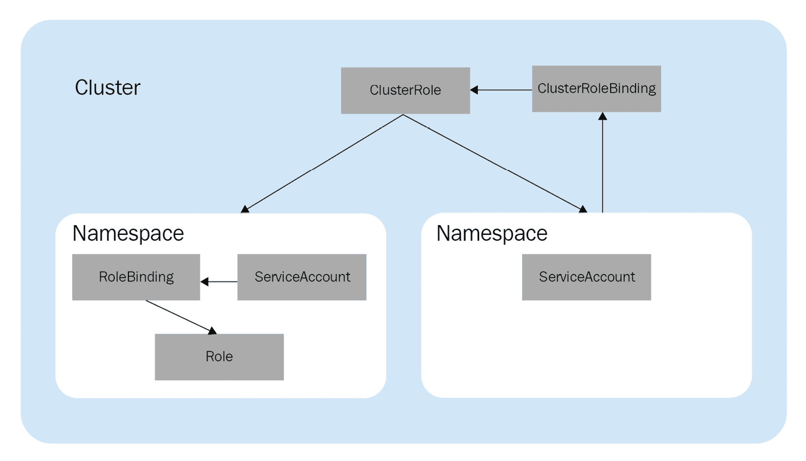
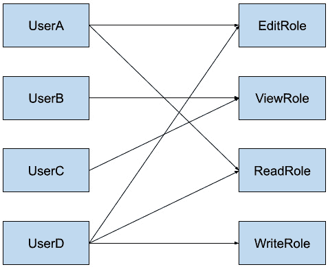
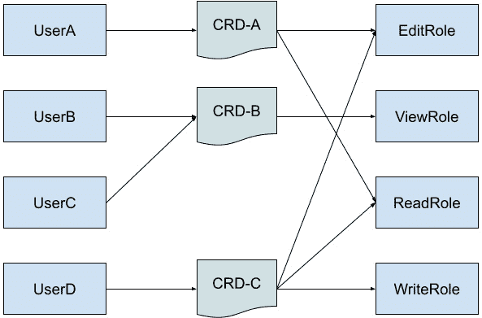
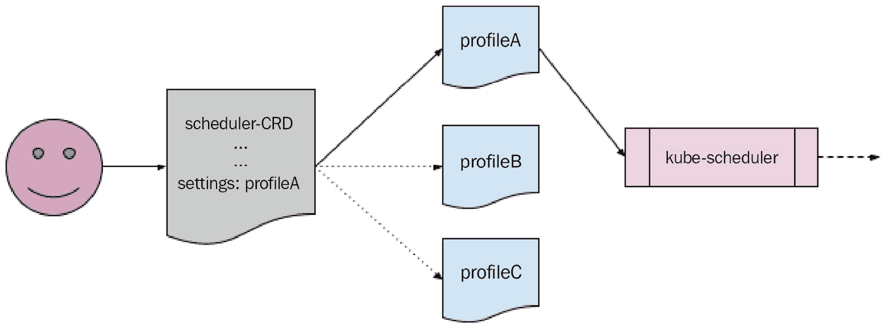

# 第十一章：*第十一章*：核心 Operator 案例研究 – Etcd Operator

在上一章（以及本书的大部分内容）中，我们讨论了 Operator 作为管理部署在 Kubernetes 上的应用程序的工具。对于大多数用例来说，这是 Operator 的主要功能。换句话说，Operator 的作用是自动化由组织开发的应用程序。这些应用程序是提供给用户的产品，自动化它们有助于顺利交付并保持用户的满意。除此之外，Kubernetes 本身只是基础架构的一部分。作为这一部分，通常假设 Kubernetes 无需像 Operator 所提供的额外自动化功能。毕竟，本书前几章的一个关键点就是，Operator 在功能上与构成 Kubernetes 控制平面的本地控制器套件并没有太大区别。

然而，在某些情况下，可以使用 Operator 来管理 Kubernetes 核心的某些方面。尽管这种情况比应用程序 Operator 少见，但讨论一些核心 Operator 的实例有助于展示 Operator 框架所提供的广泛能力。从这些例子入手，我们将重点探讨一个（尽管不如前面的案例深入），即 etcd Operator。最后，我们将解释一些与集群稳定性和升级相关的概念，这些概念在为 Kubernetes 开发 Operator 时非常重要。以下几个章节将帮助我们完成这一过程：

+   核心 Operator – 扩展 Kubernetes 平台

+   etcd Operator 设计

+   稳定性与安全性

+   升级 Kubernetes

# 核心 Operator – 扩展 Kubernetes 平台

在 Operator 框架中，没有区别对待管理面向用户的应用程序和基础设施的 Operator 与管理核心 Kubernetes 组件的 Operator。唯一的区别仅在于 Operator 设计和开发的概念如何应用到稍有不同的类问题上。不过，组成 Kubernetes 安装的各种 Pod 和控制循环可以被视为与它们部署和管理的工作负载 Pod 没有区别。

不谈太多存在主义，这种简化桥接了**Kubernetes 开发**和**Kubernetes 的开发**之间的概念差距，使得后者看起来更加容易接触。这一理念为系统管理员和 DevOps 专家提供了更大的控制和灵活性，使他们能够更加有效地管理他们所编排的云架构。

接下来，我们将查看一些扩展 Kubernetes 的高层次 Operator 实例。我们不会深入技术细节（如其 API 或调和逻辑），但我们将简要地了解这些例子，以理解它们的使用场景，并展示一些不同方式，说明 Operator 如何直接管理 Kubernetes 系统进程。我们将查看的 Operator 如下：

+   RBAC 管理器 ([`github.com/FairwindsOps/rbac-manager`](https://github.com/FairwindsOps/rbac-manager))

+   Kube 调度器操作员 ([`github.com/openshift/cluster-kube-scheduler-operator`](https://github.com/openshift/cluster-kube-scheduler-operator))

+   etcd 操作员 ([`github.com/coreos/etcd-operator`](https://github.com/coreos/etcd-operator))

在概述之后，我们将深入探讨 etcd 操作员的技术细节，以便提供与本书中*第十章*，“*可选操作员案例研究 - Prometheus 操作员*”相似的设计理念理解。

## RBAC 管理器

**基于角色的访问控制**（**RBAC**）策略是 Kubernetes 身份验证和授权的基石。Kubernetes 中的 RBAC 设置由三种类型的对象组成：

+   **Roles**（或**ClusterRoles**，视作用域而定），定义了用户或服务允许访问的权限级别

+   **ServiceAccounts**，是 Pod 的身份认证授权对象

+   **RoleBindings**（或**ClusterRoleBindings**），将 ServiceAccounts 映射到 Roles（或 ClusterRoles）

这三种类型的 Kubernetes API 对象在*第二章*，“*理解操作员如何与 Kubernetes 交互*”中已有解释。它们之间的关系可以通过下图进行概述（该图在该章节中也有使用）：



图 11.1 – RBAC 对象关系的示意图

这些对象为集群中的 RBAC 策略设计提供了灵活性和控制力。然而，它们可能会变得令人困惑，并且在管理时变得繁琐，尤其是在大规模集群中，涉及不同服务的不同访问权限时。例如，如果用户在不同命名空间中需要不同的授权权限，管理员需要为每个命名空间创建独立的 RoleBindings，并进行适当的授权。然后，如果该用户离职或更换职位，管理员就需要跟踪这些 RoleBindings，确保它们能够得到相应更新。虽然这种方法灵活，但对于大组织而言，它的扩展性较差。

**RBAC 管理器**通过在原生 Kubernetes RBAC 策略对象之上提供一层抽象，解决了这些问题。该抽象由一个**CustomResourceDefinition (CRD)**表示，允许管理员在一个位置有效地创建和管理一个用户的多个 RoleBindings（使用略微简化的语法）。

RBAC 管理器简化的授权方法的效果是，将 RoleBindings 的管理从集群管理员的手动职责中移除。这可能只是前面描述的关系型 RBAC 对象链中的一个对象，但它是最具重复性和细致性的，在大规模集群中难以追踪。这是因为其他对象，如 Roles/ClusterRoles 和 ServiceAccounts，基本上会与用户、服务和访问级别一一对应。但用户与访问级别的交集意味着这可能是一个多对多的关系，通过 RoleBindings 维持。

即使是一个简单的设置，其潜在复杂性也通过以下图示表现出来，其中四个用户拥有不同级别的访问权限（假设有 *读取*、*写入*、*查看* 和 *编辑* 等角色）。在该图中，每个箭头代表一个必须手动维护的 RoleBinding：



图 11.2 – 不同用户与 RBAC 级别的基本 RoleBinding 映射

RBAC 管理器通过在用户和角色定义之间插入其 CRD，简化了相同的设置，创建了一个单一的访问点来管理任何用户的权限。此外，**UserB** 和 **UserC** 可以共享一个 RBAC 管理器 CRD，因为他们拥有相同的角色。这在以下图示中展示：



图 11.3 – 一个 RBAC 管理器 CRD 管理 RoleBindings 的示意图

在这个设置中，CRD 和角色之间的每个单独箭头（每个仍代表一个 RoleBinding）由 RBAC 管理员操作器管理。这有一个优点，即减少了管理员需要协调的单个对象关系的数量。它还提供了操作器的状态对账功能，其中任何基础角色的更新或删除都会被操作器对账，以匹配操作器的 CRD 对象中声明的集群期望状态。这种行为是操作器不仅帮助创建和管理复杂系统，而且确保其持续稳定性的一个很好例子。

RBAC 管理器是一个操作器，它的唯一功能是在集群中管理原生 Kubernetes 对象。接下来，我们将讨论 Kube 调度器操作器，它进一步管理集群中的关键组件——调度器。

## Kube 调度器操作器

**Kube Scheduler** 是 Kubernetes 集群中的主要控制平面组件之一。它负责将新创建的 Pods 分配到节点上，并尽力以最优的方式进行分配。这个任务对 Kubernetes 作为云平台的功能至关重要，因为如果无法将 Pods 安排到节点上，那么 Pods 就无法在任何地方运行其应用程序代码。尽管可以手动将 Pods 部署到特定节点，但调度器进行的自动化评估和分配显然更具可扩展性。

此外，*最优*的 Pod 安排对于不同的组织（有时甚至是同一组织的不同集群）来说，定义可能截然不同。例如，一些管理员可能希望将工作负载 Pods 均匀分布在节点之间，以保持平均资源消耗相对较低，并防止某些节点过载。但其他系统管理员可能希望采取完全相反的做法，将尽可能多的 Pods 压缩到尽可能少的节点上，以最小化基础设施成本并最大化效率。为了满足这些不同的需求，调度器提供了一个配置 API，允许用户自定义其行为。

调度器所提供的功能性和灵活性非常有用，但操作集群中如此重要的部分可能存在风险。这是因为如果调度器失败，那么其他 Pods 将无法被调度（这包括一些系统 Pods）。此外，调度器复杂的配置语法也增加了这一风险的可能性。因此，许多 Kubernetes 用户避免对调度器进行自定义。

为了解决这些问题，OpenShift（Red Hat 的 Kubernetes 发行版）提供了 **Kube Scheduler Operator**（事实上，OpenShift 在很大程度上依赖于核心的 Operator，这一点在[`www.redhat.com/en/blog/why-operators-are-essential-kubernetes`](https://www.redhat.com/en/blog/why-operators-are-essential-kubernetes)中有更详细的讨论）。该 Operator 使用专门为 OpenShift Operators 开发的 Operator 库构建，而非 Operator SDK。这使得 Kube Scheduler Operator 能够以与 OpenShift 内置其他功能一致的方式管理关键调度器 Pods 的健康和稳定性。虽然大多数 Operator 开发者不需要编写自己的开发库，但这个例子表明，在某些特定用例中，如果你有 Operator SDK 不支持的独特需求，完全可以这样做。

Kube Scheduler Operator 遵循了 Operator 框架的其他设计方面，例如使用 CRD 作为用户与 Operator 逻辑之间的主要接口。这个 Operator 使用了两个 CRD。一个用于配置 Operator 特定的设置，并通过 Conditions 报告 Operator 的健康状态，而另一个则保存调度器配置选项，用于控制调度器如何将 Pods 分配到节点。通过第二个 CRD，该 Operator 进一步预定义了常见用例的调度器配置集，将底层 Operand 设置完全抽象为易于理解的选项供用户选择。

Kube Scheduler Operator 作为系统 Operator，管理 Kubernetes 集群中的核心组件，是一项重要任务。它的功能在于将 Pods 放置到合适的节点上，并且它从故障中恢复的能力有助于维持集群健康。在接下来的章节中，我们将看一下另一个执行类似管理任务的 Operator——etcd。

## etcd Operator

etcd ([`etcd.io/`](https://etcd.io/)) 是 Kubernetes 集群背后的主要键值存储。它是持久化存储集群中 API 对象的默认选项，因其可扩展的分布式设计而广受偏爱，适用于高性能云计算。

**etcd Operator** 旨在管理集群中的 etcd 组件。尽管它不再积极维护，但其 GitHub 存储库仍以存档状态存在，为未来的开发者提供历史参考。在本章中，etcd Operator 的保存状态为核心 Operator 的设计提供了一个永久且不变的参考。

Kubernetes 集群中的 etcd 集群可以通过 etcd Operator 进行各种功能的管理。这些功能包括创建 etcd 实例、调整 etcd 的联邦安装大小、从故障中恢复、在不中断运行时间的情况下升级 etcd，以及执行 etcd 实例的备份（以及从这些备份中恢复）。这一系列功能使 etcd Operator 在能力模型中被归类为三级 Operator。如果你还记得*第一章*，“引入 Operator 框架”，三级 Operator 被称为**全生命周期** Operator，表示它们能够管理超出简单安装的操作，并支持高级管理操作，如升级和备份。

在 Kubernetes 集群中手动安装和管理 etcd 对于大多数用户来说是一个相当高级的任务。大多数 Kubernetes 开发者理所当然地认为持久数据存储是可用的，假设他们的所有对象和集群状态信息始终可用。但如果 etcd 进程失败，可能会对整个 Kubernetes 集群产生灾难性的影响。

类似于任何其他数据库，集群中的 etcd 组件负责存储集群中所有存在的对象。未能这样做可能会导致甚至是基本的集群功能停止。这样的故障可能是由于 bug、不兼容的 API，或者甚至在尝试修改 etcd 安装时（例如，扩展以提供更高的可用性）输入格式错误所导致的。因此，集群的顺利运行依赖于对 etcd 中数据的高效和准确访问。

etcd Operator 旨在通过自动化创建、调整大小、升级、备份和恢复 etcd 集群所需的操作命令，简化 etcd 的管理，使用 Operator 的各种 CRD 来完成这些操作。在接下来的部分，我们将更详细地探讨 Operator 使用的 CRD，以及这些 CRD 是如何被协调以确保集群中 etcd 的当前状态与管理员的期望状态一致的。

# etcd Operator 设计

与大多数其他 Operator 一样，etcd Operator 是以 CRD 作为其用户交互的核心接口构建的。了解 Operator 提供的 CRD 是了解 Operator 工作原理的一个好方法，因此我们将从检查 etcd Operator 的 CRD 开始。

## CRDs

etcd Operator 使用的三个 CRD 是`EtcdCluster`、`EtcdBackup`和`EtcdRestore`。第一个 CRD，`EtcdCluster`，控制 etcd 安装的基本设置，例如要部署的操作数副本数量和应安装的 etcd 版本。基于这个 CRD 的一个示例对象如下所示：

simple-etcd-cr.yaml：

```
apiVersion: etcd.database.coreos.com/v1beta2
```

```
kind: EtcdCluster
```

```
metadata:
```

```
  name: example
```

```
spec:
```

```
  size: 3
```

```
  version: 3.5.3
```

在这个示例中，如果在集群中创建这个对象（`kubectl create -f simple-etcd-cr.yaml`），它将指示 etcd Operator 创建三个 etcd 版本 3.5.3 的副本。除了这些选项，`EtcdCluster` CRD 还提供了配置设置，用于指定从特定的仓库拉取 etcd 容器镜像、操作数 Pod 设置（例如`affinity`和`nodeSelector`设置），以及 TLS 配置。

前面提到的另外两个 CRD，`EtcdBackup`和`EtcdRestore`，协同工作，允许用户声明性地触发 etcd 数据在集群中的备份和随后的恢复。例如，可以通过创建以下自定义资源对象将 etcd 备份到**Google Cloud Storage**（**GCS**）存储桶：

etcd-gcs-backup.yaml：

```
apiVersion: etcd.database.coreos.com/v1beta2
```

```
kind: EtcdBackup
```

```
metadata:
```

```
  name: backup-etcd-to-gcs
```

```
spec:
```

```
  etcdEndpoints:
```

```
    - https://etcd-cluster-client:2379
```

```
  storageType: GCS
```

```
  gcs:
```

```
    path: gcsbucket/etcd
```

```
    gcpSecret: <gcp-secret>
```

这指示 Operator 备份集群端点[`etcd-cluster-client:2379`](https://etcd-cluster-client:2379)上的 etcd 数据，并将其发送到名为`gcsbucket/etcd`的 GCS 存储桶，使用`<gcp-secret>`进行身份验证。稍后可以通过创建以下`EtcdRestore`对象来恢复该数据：

etcd-gcs-restore.yaml：

```
apiVersion: etcd.database.coreos.com/v1beta2
```

```
kind: EtcdRestore
```

```
metadata:
```

```
  name: restore-etcd-from-gcs
```

```
spec:
```

```
  etcdCluster:
```

```
    name: sample-etcd-cluster
```

```
  backupStorageType: GCS
```

```
  gcs:
```

```
    path: gcsbucket/etcd
```

```
    gcpSecret: <gcp-secret> 
```

这些 CRD 使得备份 etcd 数据和恢复备份变得更加容易，通过将繁重的工作抽象并自动化到 Operator 控制器逻辑中，但它们也确保这些操作能够成功执行。通过消除备份过程中对人工干预的需求，它们也消除了在收集和传输 etcd 数据到备份位置时出现人为错误的可能性。如果 Operator 在执行备份时遇到错误，这些信息会通过该备份的自定义资源对象的 `Status` 部分报告出来。

## 协调逻辑

在 etcd Operator 的设计中，每个 CRD 类型都有自己的协调控制器。这是一个良好的 Operator 设计，符合 Operator Framework 文档中的最佳实践。类似于 *第十章* 中的 Prometheus Operator，*可选操作员案例研究–Prometheus Operator*，每个控制器监控涉及其协调的 CRD 的集群事件。这些事件随后触发一个基于级别的协调循环，该循环会创建（或修改）etcd 集群、执行正在运行的 etcd 集群的备份，或从先前的 etcd 集群恢复已备份的数据。

这部分协调逻辑涉及报告 Operand etcd Pods 的状态。在接收到事件并在随后的协调周期中，如果 Operator 检测到 etcd 集群状态发生变化，它会通过匹配的自定义资源对象的 `Status` 字段报告这一变化。该类型具有以下子字段：

```
type ClusterStatus struct {
```

```
     // Phase is the cluster running phase
```

```
     Phase  ClusterPhase `json:"phase"`
```

```
     Reason string       `json:"reason,omitempty"`
```

```
     // ControlPaused indicates the operator pauses the control of the cluster.
```

```
     ControlPaused bool `json:"controlPaused,omitempty"`
```

```
     // Condition keeps track of all cluster conditions, if they exist.
```

```
     Conditions []ClusterCondition `json:"conditions,omitempty"`
```

```
     // Size is the current size of the cluster
```

```
     Size int `json:"size"`
```

```
     // ServiceName is the LB service for accessing etcd nodes.
```

```
     ServiceName string `json:"serviceName,omitempty"`
```

```
     // ClientPort is the port for etcd client to access.
```

```
     // It's the same on client LB service and etcd nodes.
```

```
     ClientPort int `json:"clientPort,omitempty"`
```

```
     // Members are the etcd members in the cluster
```

```
     Members MembersStatus `json:"members"`
```

```
     // CurrentVersion is the current cluster version
```

```
     CurrentVersion string `json:"currentVersion"`
```

```
     // TargetVersion is the version the cluster upgrading to.
```

```
     // If the cluster is not upgrading, TargetVersion is empty.
```

```
     TargetVersion string `json:"targetVersion"`
```

```
}
```

请注意，etcd Operator 实现了自己的 `ClusterCondition` 类型（而不是在*第五章*中使用的 `Condition` 类型，*开发 Operator – 高级功能*）。这是因为 etch Operator 的活跃维护在本地 `Condition` 类型合并到上游 Kubernetes 之前不久被归档。不过，我们在这里提到这一点，是为了举例说明在发布周期中，了解上游 **Kubernetes 增强提案**（**KEP**）及其状态对第三方 Operator 开发的影响（参见 *第八章*，*为您的 Operator 的持续维护做准备*）。

除了协调 etcd 操作数的期望状态并报告其状态之外，etcd Operator 还具有从故障状态恢复的协调逻辑。

## 故障恢复

etcd Operator 收集 etcd Operands 的状态信息，并根据大多数 Operand Pods 的可用性（称为法定人数），在必要时尝试恢复 etcd 集群。在极端情况下，如果一个 etcd 集群没有运行中的 Operand Pods，Operator 必须做出有根据的决定，判断这是一个完全失败的 etcd 集群，还是一个尚未初始化的集群。在这种情况下，Operator 总是选择将其视为失败的集群，并尝试从备份中恢复该集群（如果有备份可用）。这不仅是 Operator 最简单的选择，也是最安全的选择（参见下面的*稳定性和安全性*部分），因为另一种选择（假设没有可用性只是未初始化）可能会导致忽视故障状态，而这些状态本应被恢复。

除了从其 Operands 的故障中恢复外，etcd Operator 还具有自我恢复的协调逻辑。其恢复路径的一部分取决于 etcd Operator 在集群中注册自己的 CRD。这一点很有趣，因为它与 Operator SDK 文档中推荐的最佳实践相矛盾。但通过将 CRD 的创建与 Operator 绑定（而不是让管理员来创建它——例如使用 `kubectl create -f`），Operator 可以通过该 CRD 的存在来确定自己是作为新安装运行，还是曾经在集群中运行过。

这适用的原因是，当任何 Pod 重新启动时，包括 Operator Pods，它们对其前一个实例没有任何固有的知识。从该 Pod 的角度来看，它是以全新的状态开始运行的。所以，如果 etcd Operator 启动并发现其 CRD 已经在 Kubernetes 集群中注册，那么该 CRD 就充当了一个金丝雀指示器，告知 Operator 应该开始重建任何现有 Operand Pods 的状态。

故障恢复是 Operator 提供的最有用的功能之一，因为自动化的错误处理使得集群日常操作中的小故障能够快速且优雅地被吸收。在 etcd Operator 的情况下，它在处理故障和管理自身 CRD 时做出有根据的决定，形成一个清晰定义其恢复程序的支持契约。这样做大大有助于集群的整体稳定性，而这正是下一部分的重点。

# 稳定性和安全性

Kubernetes 集群中的应用程序和组件偶尔会面临意外故障，例如网络超时或由于不可预见的错误导致的代码崩溃。Operator 的工作之一就是监控这些自发的故障，并尝试从中恢复。但当然，调整系统时的人工错误也是故障的另一个来源。因此，任何与 Kubernetes 核心系统组件的交互或修改都带有固有的风险。这种风险会加剧，因为对一个组件的手动调整可能包含错误（即使是微小的错误），而这些错误会引发多米诺效应，导致依赖它的其他组件开始对原始错误作出反应。

Operator 的主要目标可能是为生产环境提供稳定性和安全性。在这里，稳定性指的是 Operand 程序的持续高效运行，而安全性则是指 Operator 能够清理和验证对该程序的任何输入或修改。可以将 Operator 想象成一辆车，其目的是让其引擎在道路上平稳运行，同时允许驾驶员在合理的参数内控制它。在 Kubernetes 中，针对系统组件的 Operator 提供了一些优秀的设计示例，在这些设计中，特别注重提供一种安全的设计，以确保系统稳定运行。

我们之前提到的 Kube Scheduler Operator 通过对其提供的可用配置选项采取一种明确的方式来确保集群的稳定性。换句话说，可能的调度设置总数是有限制的（通过预定义的选项集合），仅限于那些已被测试并且已知对集群风险最小的安排。然后，这些设置的更改会由 Operator 中的自动化代码以预定的方式推送。通过不仅自动化更改，还限制可用更改，这大大减少了用户在更新集群时出错的机会。以下图示展示了这种抽象，在这个图示中，用户只需要与 CRD 进行交互，而预定义设置中的所有字段则作为黑盒选项被隐藏起来：



图 11.4 – Kube Scheduler Operator 配置抽象图示

etcd Operator 也有类似的安全措施。例如，卸载 Operator 并不会自动删除与其相关的自定义资源对象。虽然有些 Operator 可能会将这种垃圾回收作为一种功能来简化卸载过程，但 etcd Operator 的开发人员有意选择不这么做，以防止意外删除正在运行的 etcd 集群。

etcd Operator 为实现操作稳定性采取的另一种方法是将其 Operand Pods 分布开来。如前所述，etcd Operator 允许用户为其部署的 etcd Operand 实例配置单独的 Pod 设置，如 `nodeSelectors`。然而，有一个有趣的字段值得注意，那就是它提供了一个简单的布尔选项，称为 `antiAffinity`。这个值可以在 `EtcdCluster` CRD 中设置，如下所示：

```
spec:
```

```
  size: 3
```

```
  pod:
```

```
    antiAffinity: true
```

启用这个值相当于用 `antiAffinity` 字段标记 Operand etcd Pods 自己。其效果是，单独的 Pods 不会调度到同一节点。这有助于确保 Pods 以高度可用的方式分布，从而确保如果一个节点发生故障，不会导致大量 etcd Pods 一同宕机。

这行对 Operand Pods 的有效更改大致如下所示：

```
apiVersion: v1
```

```
kind: Pod
```

```
metadata:
```

```
  name: etcd-cluster-pod
```

```
spec:
```

```
  affinity:
```

```
    podAntiAffinity:
```

```
      requiredDuringSchedulingIgnoredDuringExecution:
```

```
      - labelSelector:
```

```
          matchLabels:
```

```
            etcd_cluster: <etcd-resource-name>
```

```
        topologyKey: kubernetes.io/hostname
```

将这部分打包成一行不仅节省了时间，还能避免用户可能犯的错误。例如，以下代码片段看起来与之前的非常相似。然而，它具有完全相反的效果，要求所有相似的 etcd Pods 都调度到同一个节点：

```
apiVersion: v1
```

```
kind: Pod
```

```
metadata:
```

```
  name: etcd-cluster-pod
```

```
spec:
```

```
  affinity:
```

```
    podAffinity:
```

```
      requiredDuringSchedulingIgnoredDuringExecution:
```

```
      - labelSelector:
```

```
          matchLabels:
```

```
            etcd_cluster: <etcd-resource-name>
```

```
        topologyKey: kubernetes.io/hostname
```

如果这个错误没有被发现，而托管所有 etcd Pods 的节点发生故障，可能会导致整个集群无法正常运行。

尽管最终`antiAffinity`设置已被弃用，转而允许用户提供完整的 Pod Affinity 块（如前所示），但它的存在提供了一个 Operators 可以提供的安全配置示例。将其替换为完整 Affinity 块的选项，在安全性和灵活性之间做出了权衡，这是 Operator 开发者在自己实现中必须平衡的一个微妙尺度。

这些只是 Operators 将复杂操作打包成面向用户的抽象设置，以提供安全界面和稳定集群管理的几种方式的例子。接下来，我们将探讨 Operators 如何在可能动荡的升级期间保持这种稳定性。

# 升级 Kubernetes

在软件中，升级通常是不可避免的事实。很少有单个软件能够在不升级代码到新版本的情况下持续运行。在*第八章*中，我们讨论了如何为 Operator 准备和发布新版本。在那一章中，我们还解释了 Kubernetes 发布周期的不同阶段以及它们如何影响 Operator 开发。对于那些深度嵌入 Kubernetes 平台组件的 Operators，这一点尤为重要。

对于系统操作员来说，上游 Kubernetes 代码库的波动性变化往往不仅仅是简单的功能更新。例如，当 `kube-scheduler` 被重构以接受一种完全不同的配置格式（称为调度器框架，和 Operator 框架没有关系——更多详情请见[`kubernetes.io/docs/concepts/scheduling-eviction/scheduling-framework/`](https://kubernetes.io/docs/concepts/scheduling-eviction/scheduling-framework/)——尽管在此并不技术相关）时，Kube Scheduler Operator 的 CRD 所处理的预定义设置配置文件需要完全重写以适应该变化。系统操作员绝对必须关注 Kubernetes 版本间这种变化，因为在许多情况下，他们自己就是执行升级到新版本的人。

etcd Operator 有处理其操作数（Operand）etcd 升级的逻辑。这增加了一些复杂性，因为从技术上讲，etcd 并不是运行集群的 Kubernetes 负载的一部分。因此，虽然上游的 Kubernetes 开发者必须协调他们的发布以支持特定版本的 etcd（因为 etcd 开发者在进行他们自己的发布工作），etcd Operator 的开发者则需要对这两者的依赖变化作出反应。

这样，操作数（Operand）也是操作员（Operator）的一个依赖，它带有必须遵守的自身约束。例如，在执行升级时，etcd Operator 首先验证所需的新版本是否被 etcd 支持的升级策略所允许。这表明，etcd 每次最多只能升级一个小版本（例如，从 3.4 升级到 3.5）。如果指定的版本超出了这个范围，etcd Operator 可以判断不应继续升级并终止该过程。

如果允许继续升级，etcd Operator 会使用**滚动升级**策略更新每一个操作数的 Pod。这是一种常见的应用版本升级方式，甚至 Kubernetes 本身也是如此，其中在可用的 Pod（或在 Kubernetes 的情况下是节点）中，一次只升级一个实例。这可以实现最小的停机时间，并且如果在升级某个实例时遇到错误，它还允许回滚（恢复到之前的工作版本）。这对任何操作员来说都是至关重要的稳定性优势，因为它提供了在稳定环境中诊断错误的机会。etcd Operator 使用其自身的备份和恢复工作流来处理这些类型的回滚操作。

升级 Kubernetes（与升级任何软件类似）可能是一个繁琐的过程，这也是为什么集群管理员通常会拖延升级，直到最后一刻。遗憾的是，这只会加剧问题，因为每跳过一个版本，就会引入更多的不兼容更改。但引入操作符来帮助处理这些更改，可以使升级过程更加顺利，或者至少帮助收集信息以诊断失败的升级。虽然大多数操作符开发者不会为系统级的 Kubernetes 组件编写操作符，但那些已经编写的操作符所带来的经验，将为如何处理即便是最关键任务场景下的升级提供借鉴。

# 总结

在本章中，我们最后一次回顾了负责 Kubernetes 集群中一些最关键任务的操作符示例。这些核心操作符（或系统操作符）自动管理 Kubernetes 管理员最复杂且最精细的工作流，同时平衡功能性与对操作对象的重要性的关注。通过这些类型的操作符，我们可以汲取关于操作符框架能力范围的教训。

本章的目的并不是将这些示例作为教程，或暗示许多开发者将编写自己的操作符来管理核心的 Kubernetes 组件。相反，它们作为极端案例，展示了操作符框架中的概念是如何应用到边缘问题集的。理解任何问题的边缘案例是形成对整个问题深刻理解的最佳途径。

我们通过从简要概述三个不同系统的操作符开始本章内容。接着，我们深入探讨了 etcd 操作符的技术细节，理解它如何利用 CRD 和协调逻辑来管理 Kubernetes 的数据备份存储。最后，我们通过探索如何像 etcd 操作符这样提供稳定和安全接口的操作符，结束了本章内容，即使在 Kubernetes 版本升级时也是如此。

至此，我们结束了对操作符框架的介绍。Kubernetes 操作符是一个广泛的主题，包含许多技术细节可供探索，且已有大量优秀文献由资深作者撰写。要简洁地整理出所有关于操作符的信息是非常困难的，因此在本书中，我们仅尝试以新颖且有趣的方式覆盖最重要的主题。希望这本书能为你提供深入的见解，并帮助你建立对操作符框架的理解，同时在构建自己的操作符时能应用这些经验。祝你编码愉快！
