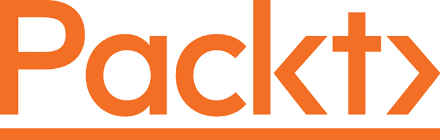

[Packt.com](http://Packt.com)

订阅我们的在线数字图书馆，您可以完全访问超过 7,000 本书籍和视频，以及行业领先的工具，帮助您规划个人发展并推动职业生涯。如需更多信息，请访问我们的网站。

# 为什么要订阅？

+   用来自超过 4,000 名行业专业人士的实用电子书和视频减少学习时间，更多时间用于编码

+   提升您的学习体验，使用专门为您打造的技能计划

+   每月获得一本免费的电子书或视频

+   完全可搜索，便于快速访问关键信息

+   复制、粘贴、打印和收藏内容

您知道 Packt 提供所有出版书籍的电子书版本，包括 PDF 和 ePub 格式文件吗？您可以在 [packt.com](http://packt.com) 升级到电子书版本，作为纸质书籍客户，您有权获得电子书的折扣。更多详情，请通过 customercare@packtpub.com 与我们联系。

在 [www.packt.com](http://www.packt.com)，您还可以阅读一系列免费的技术文章，注册各种免费的新闻通讯，并获得 Packt 图书和电子书的独家折扣和优惠。

# 其他您可能喜欢的书籍

如果您喜欢这本书，您可能对 Packt 出版的其他书籍感兴趣：

**Kubernetes 圣经**

Nassim Kebbani, Piotr Tylenda, Russ McKendrick

ISBN: 9781838827694

+   使用 Kubernetes 管理容器化应用程序

+   了解 Kubernetes 架构及各个组件的职责

+   在 Amazon Elastic Kubernetes Service、Google Kubernetes Engine 和 Microsoft Azure Kubernetes Service 上设置 Kubernetes

+   使用 Helm charts 部署如 Prometheus 和 Elasticsearch 等云应用程序

+   探索 Pod 调度和自动扩展集群的高级技术

+   了解 Kubernetes 中流量路由的可能方法

**学习 DevOps - 第二版**

Mikael Krief

ISBN: 9781801818964

+   了解基础设施即代码模式和实践的基础知识

+   了解 Git 命令和 Git 流程概述

+   安装并编写 Packer、Terraform 和 Ansible 代码，基于 Azure 示例进行云基础设施的配置和管理

+   使用 Vagrant 创建本地开发环境

+   使用 Docker 和 Kubernetes 容器化应用程序

+   采用 DevSecOps 进行合规性测试和保护 DevOps 基础设施

+   使用 Jenkins、Azure Pipelines 和 GitLab CI 构建 DevOps CI/CD 管道

+   探索蓝绿部署和开源项目的 DevOps 实践

# Packt 正在寻找像您这样的作者

如果您有兴趣成为 Packt 的作者，请访问 [authors.packtpub.com](http://authors.packtpub.com) 并立即申请。我们已经与成千上万的开发者和技术专业人士合作，帮助他们与全球技术社区分享他们的见解。您可以提交一般申请，申请我们正在招聘作者的具体热门话题，或者提交您自己的想法。

# 分享您的想法

现在您已经完成了*《Kubernetes 操作员框架书》*，我们很想听听您的想法！如果您是在 Amazon 上购买的这本书，请 [点击这里直接跳转到 Amazon 评价页面](https://packt.link/r/1803232854) 为此书分享您的反馈或在您购买书籍的网站上留下评论。

您的评价对我们和技术社区非常重要，将帮助我们确保提供优质的内容。
