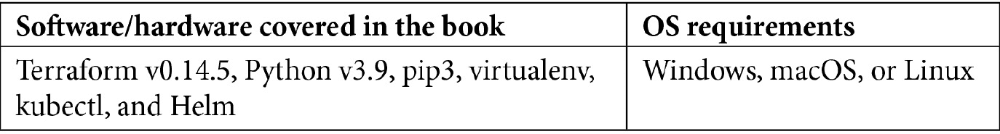

# 前言

Kubernetes 是一个开源容器编排平台，最初由 Google 开发，并于 2014 年对公众开放。Kubernetes 的普及帮助开发者更轻松地管理基于容器的复杂分布式系统的部署。自诞生以来，社区围绕 Kubernetes 建立了一个庞大的生态系统，许多开源项目使得管理功能的自动化成为可能。

本书专为 Kubernetes 管理员和 **站点可靠性工程师** (**SREs**) 设计，旨在快速帮助他们根据行业最佳实践以及来自大规模 Kubernetes 部署早期技术采用者的成熟技术，构建和管理生产级 Kubernetes 基础设施。

虽然我们使用 Amazon **弹性 Kubernetes 服务** (**EKS**) 来提供本书中的实际练习，但我们认为，所解释的 Kubernetes 设计、部署和配置概念与技术对其他云服务提供商仍然适用。在选择部署和配置工具时，我们决定使用如 Terraform 和 Ansible 等云无关工具，以确保跨云服务提供商的可移植性。

*生产环境中的 Kubernetes 最佳实践* 帮助你获得使用 Kubernetes 托管生产工作负载的信心，掌握构建集群所需的全面基础设施设计知识，并清楚地了解如何高效地管理和操作这些集群。

# 本书适用对象

本书非常适合那些具备 Kubernetes 基础知识，并愿意将云行业最佳实践应用于设计、构建和运营生产级 Kubernetes 集群的云基础设施架构师、SRE、DevOps 工程师、系统管理员和工程经理。

拥有基本的 Kubernetes、AWS、Terraform、Ansible 和 Bash 知识将是有益的。

# 本书的内容

*第一章*，*Kubernetes 基础设施与生产就绪性简介*，教你 Kubernetes 基础设施的基本知识，然后解释基础设施设计的原则，最后讲解生产就绪集群的特性。

*第二章*，*构建生产级 Kubernetes 基础设施架构*，教你在设计 Kubernetes 基础设施时需要考虑的各个方面、权衡以及最佳实践。

*第三章*，*使用 AWS 和 Terraform 部署 Kubernetes 集群*，教你如何使用 AWS、Terraform 和基础设施即代码技术来部署 Kubernetes 基础设施。

*第四章*，*使用 Ansible 管理集群配置*，教你如何使用 Ansible 为 Kubernetes 集群构建灵活且可扩展的配置管理解决方案。

*第五章*，*配置和增强 Kubernetes 网络服务*，教你如何配置和改善 Kubernetes 集群的网络，并使用必需的 Kubernetes 网络插件。

*第六章*，*有效地保护 Kubernetes 安全*，教你 Kubernetes 安全最佳实践，以及如何验证和确保集群的安全。

*第七章*，*管理存储和有状态应用程序*，教你如何使用 Kubernetes 中最好的存储管理解决方案克服存储挑战。

*第八章*，*部署无缝且可靠的应用程序*，教你容器和镜像的最佳实践，以及应用部署策略，以实现生产中的可扩展服务。

*第九章*，*监控、日志记录和可观测性*，教你 Kubernetes 可观测性最佳实践，监控的重要指标，以及市场上可用的监控和日志记录技术栈，及其使用场景。

*第十章*，*高效操作和维护 Kubernetes 集群*，教你 Kubernetes 操作的最佳实践，以及集群维护任务，如升级、轮换、备份和灾难恢复，和改善集群质量的解决方案。

# 最大化本书的价值

使用本书时，你需要访问计算机、服务器、AWS 或其他云服务提供商的服务，能够在这些服务上创建虚拟机实例。为了设置实验环境，你可能还需要更大的云实例，这些实例将需要你启用计费功能。



**如果你使用的是本书的数字版，建议你自己输入代码，或者通过 GitHub 仓库访问代码（链接将在下一节提供）。这样做将帮助你避免因复制粘贴代码而引发的潜在错误。**

# 下载示例代码文件

你可以从 GitHub 下载本书的示例代码文件，链接为 [`github.com/PacktPublishing/Kubernetes-in-Production-Best-Practices`](https://github.com/PacktPublishing/Kubernetes-in-Production-Best-Practices)。如果代码有更新，它将在现有的 GitHub 仓库中更新。

我们还有其他来自我们丰富书籍和视频目录中的代码包，可以在 [`github.com/PacktPublishing/`](https://github.com/PacktPublishing/) 查阅。快去看看吧！

# 代码实战

本书的《代码实战》视频可以在 [`bit.ly/36JpElI`](http://bit.ly/36JpElI) 查看。

# 下载彩色图片

我们还提供了一个 PDF 文件，包含本书中使用的截图/图表的彩色版本。您可以在此下载：`static.packt-cdn.com/downloads/9781800202450_ColorImages.pdf`。

# 使用的约定

本书中使用了多种文本约定。

`文本中的代码`：表示文本中的代码字、数据库表名、文件夹名、文件名、文件扩展名、路径名、虚拟网址、用户输入和 Twitter 账号。示例如下：“作为最佳实践，我们建议将任何特权 Pod 限制在`kube-system`命名空间内。”

代码块的显示方式如下：

```
terraform {
  required_version = "~> 0.12.24"
}
```

当我们希望引起您对某段代码的注意时，相关的行或项目会以粗体显示：

```
provider "aws" {
  region = var.aws_region
  version = "~> 2.52.0"
}
```

所有命令行输入或输出格式如下：

```
$ cd Chapter03/terraform/shared-state
$ terraform init
```

**粗体**：表示新术语、重要词汇或屏幕上显示的词语。例如，菜单或对话框中的词汇会以这种方式显示。示例如下：“在**管理**面板中选择**系统信息**。”

提示或重要注意事项

如此显示。

# 联系我们

我们始终欢迎读者的反馈。

**一般反馈**：如果您对本书的任何内容有疑问，请在邮件主题中注明书名，并发送至 customercare@packtpub.com。

**勘误**：尽管我们已尽最大努力确保内容的准确性，但错误难免。如果您在本书中发现任何错误，恳请您报告给我们。请访问 [www.packtpub.com/support/errata](http://www.packtpub.com/support/errata)，选择您的书籍，点击“Errata Submission Form”链接，并填写相关信息。

**盗版**：如果您在互联网上发现我们的作品的非法复制形式，恳请您提供相关的地址或网站名称。请通过 copyright@packt.com 与我们联系，并附上链接。

**如果您有意成为作者**：如果您在某个主题方面具有专业知识，并且有兴趣写作或参与编写书籍，请访问 [authors.packtpub.com](http://authors.packtpub.com)。

# 评论

请留下评论。在阅读和使用本书后，您为何不在购买平台上留下您的评论？潜在的读者可以看到并参考您的公正意见来做出购买决策，Packt 也能了解您对我们产品的看法，作者也能看到您对他们书籍的反馈。谢谢！

欲了解更多有关 Packt 的信息，请访问 [packt.com](http://packt.com)。
