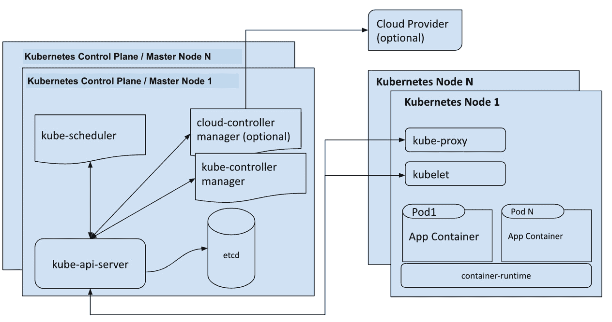
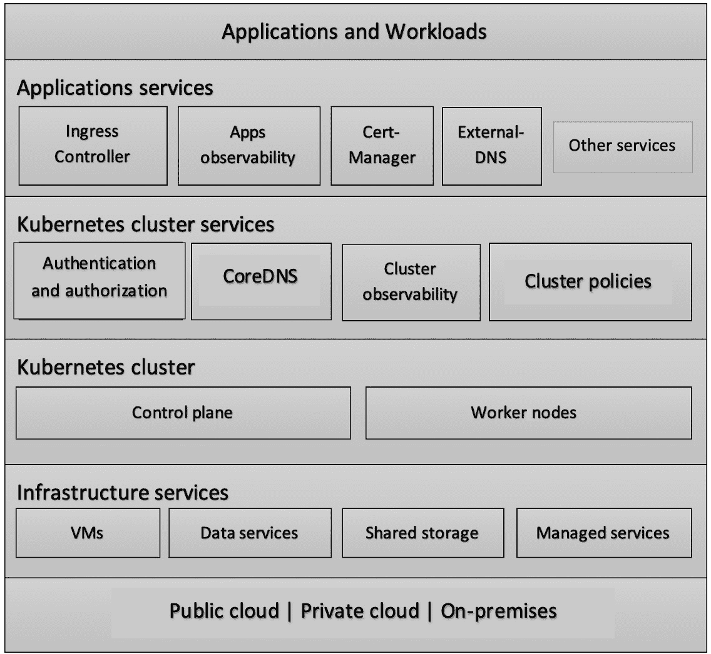

# 第一章：*第一章*：Kubernetes 基础设施与生产就绪简介

随着越来越多的组织采纳 Kubernetes 来管理基础设施，它正成为行业事实上的标准，用于在云端和本地环境中编排和管理分布式应用程序。

无论你是将公司应用迁移到云端的个人贡献者，还是领导云转型项目的决策者，你都应该规划 Kubernetes 的迁移之路，并了解其面临的挑战。

如果本书有一个核心目的，那就是引导你构建一个生产就绪的 Kubernetes 基础设施，同时避免常见的陷阱。这是我们撰写此主题的原因，因为我们在多年的 Kubernetes 集群建设和运营过程中见证了失败与成功。我们相信，你可以避免许多失败，节省时间和成本，提高可靠性，达成你的业务目标。

在本章中，你将学习如何使用最佳实践部署 Kubernetes 生产集群。我们将解释本书接下来要遵循的路线图，并解释设计和实施 Kubernetes 集群时常用的基础概念。理解这些概念及相关原则是构建和运营生产基础设施的关键。此外，我们还将设定你对本书内容范围的预期。

本书将讨论它将解决的核心问题，并简要涵盖诸如 Kubernetes 生产挑战、生产就绪特性、云原生环境以及基础设施设计与管理原则等主题。

本章将涵盖以下主题：

+   Kubernetes 基础设施的基础知识

+   为什么 Kubernetes 在生产中具有挑战性

+   Kubernetes 生产就绪性

+   Kubernetes 基础设施最佳实践

+   云原生方法

# Kubernetes 基础设施的基础知识

如果你正在阅读本书，说明你已经决定将 Kubernetes 基础设施提升到一个更高级别，这意味着你已经超越了评估技术的阶段。要构建生产级基础设施，投资仍然是一个负担，并且仍然需要向企业和组织领导层提供有力的理由。我们将在本节中尽可能具体地说明为什么我们需要一个可靠的 Kubernetes 基础设施，并澄清你在生产环境中应该预见到的挑战。

Kubernetes 在全球范围内的采用正在迅猛增长，预计这种增长将继续增加，因为**国际数据公司**（**IDC**）预测，到 2021 年，约 95% 的新微服务将部署在容器中。大多数公司发现，容器和 Kubernetes 有助于优化成本、简化部署和操作、缩短上市时间，并在混合云策略中发挥重要作用。类似地，Gartner 预测，到 2021 年，超过 70% 的组织将运行两个或更多容器化应用程序，而 2019 年这一比例不到 20%。

## Kubernetes 组件

“Kubernetes（K8s）是一个开源系统，用于自动化容器化应用程序的部署、扩展和管理。”

– kubernetes.io

由于我们关注构建一个可靠的 Kubernetes 集群，我们将介绍 Kubernetes 集群架构及其组件的概述，然后你将了解生产中的挑战。

Kubernetes 具有分布式系统架构——特别是客户端-服务器架构。这里有一个或多个主节点，Kubernetes 在这些节点上运行控制平面组件。

Kubernetes 部署 pod 和工作负载的地方是工作节点。一个集群最多可以管理 5000 个节点。Kubernetes 集群架构如以下图所示：

图 1.1 – Kubernetes 集群架构

上述图表展示了一个典型的高可用性 Kubernetes 集群架构，包括核心组件。它展示了 Kubernetes 各部分之间是如何相互通信的。虽然你已经对 Kubernetes 集群架构有了基本的了解，但我们仍然需要在接下来的章节中刷新这一知识，因为我们将在创建和调整集群配置时与这些组件进行更深入的互动。

### 控制平面组件

控制平面组件是构建 Kubernetes 主节点的核心软件部分。除 `etcd` 外，它们都属于 Kubernetes 项目，`etcd` 是一个独立的项目。这些组件遵循分布式系统架构，可以轻松地水平扩展以增加集群容量并提供高可用性：

+   `kube-apiserver`：API 服务器是集群组件的管理者，负责处理和提供管理 API，充当集群组件之间通信的中介。

+   `etcd`：这是一个分布式、高可用的键值数据存储，作为集群的核心支撑，存储着所有数据。

+   `kube-controller-manager`：它管理控制集群的控制器进程——例如，控制节点的节点控制器、控制部署的复制控制器，以及控制集群中暴露的服务端点的端点控制器。

+   `kube-scheduler`：该组件负责在各个节点之间调度 Pod。它根据调度算法、可用资源和位置配置决定哪些 Pod 运行在哪些节点上。

### 节点组件

节点组件是一组在每个工作节点上运行的软件代理，用于维护正在运行的 Pod，并提供网络代理服务以及容器的基础运行时环境：

+   `kubelet`：这是一个在集群中每个节点上运行的代理服务，它会定期获取一组 Pod 规格（描述 Pod 规格的 YAML 格式清单文件），并确保通过这些规格描述的 Pod 正常运行。此外，它还负责向主节点报告其运行的节点的健康状况。

+   `kube-proxy`：这是一个代理服务，在集群中的每个节点上运行，用于在节点上创建、更新和删除网络角色，通常使用 Linux iptables。 这些网络规则允许 Kubernetes 集群内外部的 Pod 之间进行通信。

+   `containerd` 用于运行容器，而 `kubevirt` 和 `virtlet` 用于运行虚拟机。

# 为什么 Kubernetes 在生产环境中充满挑战

Kubernetes 安装起来可能很简单，但操作和维护却非常复杂。Kubernetes 在生产环境中会带来许多挑战和困难，涵盖从扩展、正常运行时间和安全性，到弹性、可观察性、资源利用和成本管理等方面。Kubernetes 在解决容器管理和调度方面取得了成功，并在计算服务之上创建了一个标准层。然而，Kubernetes 仍然缺乏对一些关键服务的适当或完整支持，例如**身份和访问管理**（**IAM**）、存储和镜像仓库。

通常，一个 Kubernetes 集群属于一个更大的公司生产基础设施的一部分，其中包括数据库、IAM、**轻量级目录访问协议**（**LDAP**）、消息传递、流媒体等。将 Kubernetes 集群投入生产需要将其与这些外部基础设施连接起来。

即使是在云转型项目中，我们也希望 Kubernetes 管理并与本地基础设施和服务进行集成，这将生产环境的复杂性提升到一个新的层次。

另一个挑战出现在团队开始采用 Kubernetes 时，他们假设它能够解决应用程序的扩展性和正常运行时间问题，但通常没有规划好第二天的运维问题。这最终会导致在安全性、扩展性、正常运行时间、资源利用、集群迁移、升级和性能调优方面出现灾难性的后果。

除了技术挑战外，还有管理上的挑战，特别是在我们将 Kubernetes 应用于拥有多个团队的大型组织时，如果该组织未能做好准备，未能建立适当的团队结构来运营和管理 Kubernetes 基础设施，这可能会导致团队在标准工具、最佳实践和交付工作流上难以达成一致。

# Kubernetes 生产就绪

“当你的产品超越客户预期，以支持业务增长的方式提供时，它就是生产就绪的。”

– 卡特·摩根（Carter Morgan），开发者倡导者，Google

生产就绪是我们在本书中需要实现的目标，尽管我们可能没有一个明确的定义来界定这个流行词。它可能意味着一个能够以可靠且安全的方式服务生产工作负载和真实流量的集群。我们可以进一步扩展这个定义，但许多专家一致认为，在你将集群标记为生产就绪之前，有一组最基本的要求需要你满足。

我们根据典型的 Kubernetes 生产层（如下图所示）收集并分类了这些准备要求。我们理解，每个组织的生产使用场景仍然不同，产品增长和业务目标深刻影响着这些使用场景，从而影响生产准备要求。然而，我们可以合理地认为以下生产就绪检查清单是大多数主流用例的必备清单：

图 1.2 – Kubernetes 基础设施层

该图描述了 Kubernetes 基础设施的典型层次。共有六个层次，包括物理、本地或云基础设施；基础设施服务层；集群层；集群服务层；应用支持服务层；最后是应用层。你将在本书中深入了解这些层次，并了解如何设计一个能够无缝集成这些层次的 Kubernetes 生产架构。

## 生产就绪检查清单

我们已经将生产就绪检查清单项进行了分类，并将它们映射到相应的基础设施层次。每个检查清单项代表了一个设计和实施的关注点，你需要完成这些才能认为你的集群已经准备好投入生产。在本书中，我们将涵盖检查清单项及其设计和实施的详细信息。

### 集群基础设施

以下检查清单项涵盖了集群层面的生产就绪要求：

+   在两个独立的节点组上运行`etcd`。这样做通常是为了简化`etcd`的操作，如升级和备份，并减少控制平面故障的影响范围。

    此外，对于大型 Kubernetes 集群，这可以通过在特定节点类型上运行`etcd`，从而为其分配适当的资源，以满足其大量 I/O 需求。

    最后，避免将 Pods 部署到控制平面节点。

+   **运行高可用的工作节点组**：您可以通过运行一个或多个具有三个或更多实例的工作节点组来实现。如果您使用公共云提供商来运行这些工作节点组，您应该将它们部署在自动伸缩组内，并分布在不同的可用区。

    实现工作节点高可用性的另一个基本要求是部署 Kubernetes 集群自动扩展器，它允许工作节点根据集群的使用情况进行水平扩展和缩减。

+   **使用共享存储管理解决方案**：您应该考虑使用共享存储管理解决方案来持久化和管理有状态应用程序的数据。有很多选择，无论是开源还是商业的，例如 AWS **弹性块存储**（**EBS**）、**弹性文件系统**（**EFS**）、Google Persistent Disk、Azure 磁盘存储、ROOK、Ceph 和 Portworx。它们之间没有绝对对错的选择，但取决于您的应用场景和需求。

+   **部署基础设施可观测性栈**：收集关于节点、网络、存储和其他基础设施组件的日志和指标对于监控集群的基础设施至关重要，同时也有助于获得集群性能、利用率和故障排除的有用信息。

    您应该部署一个监控和警报栈，如 Node Exporter、Prometheus 和 Grafana，并部署一个集中式日志栈，如 ELK（Elasticsearch、Logstash 和 Kibana）。另外，您还可以考虑使用完整的商业解决方案，如 Datadog、New Relic、AppDynamics 等。

完成上述要求将确保集群基础设施的生产就绪性。稍后本书中，我们将更详细地展示如何通过基础设施设计、Kubernetes 配置调优和第三方工具使用来实现这些要求。

### 集群服务

以下检查清单项涵盖了集群服务级别的生产就绪要求：

+   **控制集群访问**：Kubernetes 引入了认证和授权选项，并允许集群管理员根据需要配置它们。作为最佳实践，您应该确保身份验证和授权配置已调优并到位。集成外部身份验证提供者来验证集群用户，如 LDAP、**OpenID Connect**（**OIDC**）和 AWS IAM。

    对于授权，您需要配置集群以启用 **基于角色的访问控制**（**RBAC**）、**基于属性的访问控制**（**ABAC**）和 Webhooks。

+   `kube-system` 命名空间。对于托管应用程序 Pods 的所有其他命名空间，我们建议分配一个限制性的默认 PSP。

+   **强制执行自定义策略和规则**：规则和策略的强制执行对每个 Kubernetes 集群都至关重要。这适用于小型单租户集群和大型多租户集群。Kubernetes 引入了本地对象来实现这一目的，如 Pod 安全策略、网络策略、资源限制和配额。

    对于自定义规则的强制执行，您可以部署一个开放政策代理，如 OPA Gatekeeper。这将使您能够强制执行规则，如 pod 必须设置资源限制、命名空间必须具有特定标签、镜像必须来自已知的仓库等，其他规则也可以执行。

+   **部署并微调集群 DNS**：运行 Kubernetes 集群的 DNS 对于名称解析和服务连接至关重要。托管 Kubernetes 已经预部署了集群 DNS，例如 CoreDNS。对于自我管理的集群，您也应该考虑部署 CoreDNS。作为最佳实践，您应该微调 CoreDNS 以减少错误和故障率，优化性能，调整缓存和解析时间。

+   **部署并限制网络策略**：Kubernetes 允许单个集群内的所有 Pod 之间进行流量交换。这种行为在多租户集群中是不安全的。作为最佳实践，您需要在集群中启用网络策略，创建一个默认的拒绝所有流量的策略来阻止 Pod 之间的所有流量，然后根据需要创建具有较少限制的 ingress/egress 规则的网络策略，以允许特定 Pod 之间的流量。

+   `kube-scan` 用于安全配置扫描，`kube-bench` 用于安全基准测试，Sonobuoy 用于对集群运行 Kubernetes 标准符合性测试。

+   `etcd` 数据库。

+   `control-plane`、`kubelet`、容器运行时等。您应该部署一个监控和告警栈，如 Node Exporter、Prometheus 和 Grafana，并部署一个中央日志栈，如 EFK（Elasticsearch、Fluentd 和 Kibana）。

完成以上要求将确保集群服务的生产就绪性。在本书后面，我们将更详细地介绍如何通过 Kubernetes 配置调整和第三方工具的使用来实现这些要求。

### 应用和部署

以下清单项涵盖了应用和部署级别的生产就绪要求：

+   **自动化镜像质量和漏洞扫描**：运行低质量应用或使用不良规格编写的应用镜像可能会影响集群的可靠性以及在集群中运行的其他应用。安全漏洞的镜像也是如此。为此，您应运行一个流水线，扫描部署到集群中的镜像，查找安全漏洞和偏离质量标准的情况。

+   **部署 Ingress 控制器**：默认情况下，你可以使用负载均衡器和节点端口将 Kubernetes 服务暴露到集群外部。然而，大多数应用有更复杂的路由需求，部署像 Nginx 的 Ingress 控制器这样的解决方案是你应该在集群中使用的事实标准。

+   `Secrets` 对象有助于在集群内创建和管理秘密及证书。除此之外，你还可以通过部署其他第三方服务来扩展 Secrets 对象，例如使用 Sealed Secrets 进行加密秘密管理，使用 Cert-Manager 自动管理来自证书提供商（如 Let's Encrypt 或 Vault）的证书。

+   **部署应用可观察性栈**：你应该利用 Kubernetes 内置的监控功能，例如为 Pod 定义就绪和存活探针。除此之外，还应部署一个中央日志栈来监控应用的 Pod。部署一个黑盒监控解决方案，或使用托管服务来监控应用的端点。最后，考虑使用应用性能监控解决方案，如 New Relic APM、Datadog APM、AppDynamics APM 等。

满足上述要求将确保应用和部署具备生产就绪性。本书后续将详细介绍如何通过 Kubernetes 配置调整和第三方工具的使用来实现这些要求。

# Kubernetes 基础设施最佳实践

我们已经了解了 Kubernetes 基础设施的基本知识，并对 Kubernetes 集群的生产就绪性特征有了初步的理解。现在，你已经准备好深入学习基础设施最佳实践和设计原则，这些将引导你建立和运营生产集群的过程。

## 基础设施设计和管理的 12 项原则

构建一个具有弹性和可靠性的 Kubernetes 基础设施不仅仅是使用配置工具让你的集群运行起来。稳固的基础设施设计是一系列架构决策及其实施的结果。幸运的是，许多组织和专家已经将这些原则和架构决策付诸实际测试。

以下列表总结了可能引导决策者进行 Kubernetes 基础设施设计的核心原则，在本书中，你将详细学习这些原则，并在实践中应用它们：

1.  **Go 管理服务**：尽管托管服务看起来比自托管服务更贵，但它仍然比自托管服务更受青睐。在几乎所有场景中，托管服务比自托管服务更高效且更可靠。我们将这一原则应用于 Kubernetes 托管服务，如 **Google Kubernetes Engine**（**GKE**）、**Azure Kubernetes Service**（**AKS**）和 **Elastic Kubernetes Service**（**EKS**）。这一原则不仅适用于 Kubernetes，还适用于每一项基础设施服务，如数据库、对象存储、缓存以及许多其他服务。有时，托管服务可能比自托管服务可定制性差或更昂贵，但在其他所有情况下，您应该始终优先考虑托管服务。

1.  **简化**：Kubernetes 不是一个简单的平台，无论是设置还是操作。它解决了在一个应用程序可以扩展到为数百万用户提供服务的互联网规模工作负载管理的复杂性，在这个世界中，云原生和微服务架构是大多数现代应用程序的首选方法。

    对于基础设施的创建和操作，我们不需要增加额外的复杂性，因为基础设施本身旨在对产品透明并无缝对接。组织的主要关注点和焦点应始终是产品，而非基础设施。

    这就是简化原则的作用，它并不意味着应用琐碎的解决方案，而是简化复杂的解决方案。这使我们做出像选择更少的 Kubernetes 集群进行操作，或者避免多云等决策；只要我们没有一个坚实的用例来证明其必要性。

    简化原则适用于我们部署到集群的基础设施功能和服务，因为将每个服务都加到集群中可能看起来很有吸引力，我们会认为这样可以构建一个功能强大且富有特性的集群。相反，这样做最终会使操作复杂化，并降低平台的可靠性。此外，我们也可以将同样的原则应用于我们选择的技术栈和工具，因为统一团队之间的工具和技术栈被证明比使用一套不一致的工具更高效，后者最终难以管理，即使这些工具中的某一个对特定用例来说是最佳选择，简化总是会带来回报。

1.  **一切皆代码（XaC）**：这是现代基础设施和 DevOps 团队的默认实践。推荐的做法是使用声明式的 **基础设施即代码**（**IaC**）和 **配置即代码**（**CaC**）工具与技术，优于它们的命令式对等工具。

1.  **不可变基础设施**：不可变性是一种基础设施配置概念和原则，在每次部署时，我们会替换系统组件，而不是在原地更新它们。我们始终通过镜像或声明式代码创建不可变组件，在这些组件上我们可以构建、测试并验证这些不可变系统，每次都能得到相同的可预测结果。Docker 镜像和 AWS EC2 AMI 就是这一概念的例子。

    这个重要原则使我们能够实现 Kubernetes 集群的一个目标特性，即将集群视为牲畜而非宠物。

1.  **自动化**：我们生活在一个软件自动化的时代，我们倾向于将一切自动化；这样更高效，管理和扩展也更容易，但我们需要将 Kubernetes 中的自动化提升到更高的层次。Kubernetes 用于自动化容器生命周期管理，它还带来了先进的自动化概念，如操作员（Operators）和 GitOps，它们高效且能真正实现自动化的自动化。

1.  **标准化**：拥有一套标准有助于减少团队在对齐和协作中的困难，简化流程的扩展，提升整体质量，并增加生产力。这对计划在生产环境中使用 Kubernetes 的公司和团队来说至关重要，因为这涉及到与不同基础设施部分的集成、将服务从本地迁移到云端，以及更多的复杂性。

    定义一套标准涵盖了操作手册和执行手册的流程，以及技术标准化，例如在团队中使用 Docker、Kubernetes 和标准工具。这些工具应具备特定的特点：开源但经过生产环境验证，支持其他原则，如基础设施即代码、不变性、云中立，并且易于使用和部署，且基础设施要求最低。

1.  **真实数据来源**：拥有单一的数据源是现代基础设施管理和配置的基石和推动力。源代码控制系统，如 Git，是存储和版本控制基础设施代码的标准选择，其中拥有一个专门用于基础设施的源代码仓库是一种推荐的做法。

1.  **设计可用性**：Kubernetes 是基础设施和应用层高可用性的关键推动力。自第一天起就将高可用性作为设计支柱，对充分发挥 Kubernetes 的全部功能至关重要。因此，在每个设计层面，您都应考虑高可用性，从云层和**基础设施即服务**（**IaaS**）层开始，通过选择多区域或多可用区架构，然后在 Kubernetes 层设计多主集群，最后在应用层部署每个服务的多个副本。

1.  **云中立**：云中立意味着你可以在任何云平台上运行工作负载，且尽量减少对特定供应商的依赖，但要注意不要过于痴迷于这个理念，也不要将其作为唯一目标。Docker 和 Kubernetes 是社区应对创建和管理云中立平台的解决方案。这一原则也延伸到其他技术和工具的选择（例如 Terraform 与 CloudFormation 的对比）。

1.  **业务持续性**：公有云通过其弹性解决了一个长期困扰在线服务业务连续性的问题，特别是在几乎实现即时扩展基础设施的情况下，使得小型企业也能享受到以前只有大型科技公司才能拥有的基础设施奢侈。

    然而，应对日益增长的扩展需求并实现实时性仍然是一个挑战，随着容器的引入，部署和运行工作负载应用变得可以在几秒钟内轻松部署和扩展。这将压力重新转移到了 Kubernetes 和底层基础设施层面，要求它们支持容器的实时扩展能力。你需要为未来做出扩展决策，以支持业务扩展和持续性。诸如是否使用单一大型集群还是多个较小集群，如何管理基础设施成本，节点的合适大小是什么，以及高效的资源利用策略是什么等问题……所有这些问题都需要具体的答案和重要的决策！

1.  **为故障做好计划**：许多分布式系统特性适用于 Kubernetes 容器化应用；特别是容错性，我们预期会发生故障，并为系统组件故障做出规划。在设计 Kubernetes 集群时，你必须使用高可用性原则来设计它，以便在发生中断和故障时依然能生存下来。但你还必须有意识地为故障做计划。你可以通过应用混沌工程思想、灾难恢复解决方案、基础设施测试和基础设施 CI/CD 来实现这一目标。

1.  **操作效率**：公司通常低估了在生产环境中操作容器所需的努力——如何应对第二天及以后的问题，以及如何为故障、集群升级、备份、性能调优、资源利用和成本控制做好准备。在这个阶段，公司需要弄清楚如何持续交付更改到不断增加的生产和非生产环境中，如果没有适当的操作实践，这可能会造成瓶颈并减缓业务增长，更严重的是，导致系统不可靠，无法满足客户的期望。我们见证了成功的 Kubernetes 生产环境部署，但最终，由于运维团队和薄弱的实践，事情还是崩溃了。

这 12 条原则已被证明是成功的大规模云基础设施部署的常见模式。我们将在本书的大部分章节中应用这些原则，并在做出相关技术决策时，尽量突出每一条原则。

## 应用定义和部署

可能，一个成功且高效的 Kubernetes 集群无法挽救应用程序糟糕的设计和实现。通常，当应用程序未遵循容器化最佳实践和高可用设计时，它将失去由底层 Kubernetes 提供的云原生优势：

+   **容器化**：这是云工作负载的事实标准交付和部署形式。为了确保生产环境的可靠性，容器化的最佳实践起着至关重要的作用。你将在接下来的章节中详细了解这一原则。不良的实践可能导致生产环境的不稳定和灾难性的停机，例如忽视容器的优雅关机和进程终止信号，以及不恰当的应用程序重试连接到依赖服务。

+   **应用程序高可用性**：通过部署两个或更多应用副本，并利用 Kubernetes 的高级调度技术（节点选择器、污点、亲和性和标签）将副本部署到不同的节点和可用区，同时定义 Pod 中断策略来实现这一目标。

+   **应用程序监控**：通过定义就绪和存活探针，并进行不同检查，部署 **应用程序性能监控**（**APM**），以及使用著名的监控方法，如 RED（请求率、错误率和持续时间）和 USE（利用率、饱和度和错误），来实现这一目标。

+   **部署策略**：Kubernetes 和云原生使部署变得比以往更简单。这些频繁的部署为企业带来了好处，比如缩短上市时间、更快的客户反馈以及整体提高产品质量。然而，这也有一些负面影响，因为如果没有正确规划和管理，频繁的部署可能会影响产品的可靠性和正常运行时间。在这种情况下，定义部署和回滚策略（滚动更新、重建、金丝雀、蓝绿部署和常规部署）成为应用部署的最佳实践之一。

这四个领域的考虑将确保应用程序顺利部署到 Kubernetes 集群中并顺利运行，尽管在这些领域下，基于你组织的偏好和 Kubernetes 使用案例，仍然需要做出更为详细的技术决策。

## 流程、团队与文化

云转型带来了对组织文化和流程的巨大变化，以及它们管理和运维基础设施和应用程序的方式。DevOps 反映了这种深刻影响，它体现了将云思维融入组织文化中的影响，改变了公司如何进行开发和运维，以及其内部团队的组织方式。

一天又一天，开发与运维之间的界限越来越模糊，通过引入 Kubernetes 和云原生方法，DevOps 团队正朝着**站点可靠性工程**（**SRE**）模型转型，并且还在招聘专门的平台团队，因为这两种方法都考虑了管理和操作 Kubernetes 的团队结构推荐实践。

# 云原生方法

**云原生计算基金会**（**CNCF**）将云原生定义为在现代动态环境中运行的可扩展应用，使用容器、微服务和声明式 API 等技术。Kubernetes 是 CNCF 的第一个项目，也是世界上最受欢迎的容器编排平台。

云原生计算使用开源的现代商业第三方软件堆栈来构建、打包和部署微服务形式的应用程序。容器和容器编排工具如 Kubernetes 是云原生方法中的关键元素，它们使得实现云原生状态并满足 12 因素应用方法论的要求成为可能。这些技术提升了资源利用、分布式系统的可靠性、扩展性和可观察性等方面。

12 因素应用方法论

12 因素应用方法论定义了开发者和 DevOps 工程师在构建和运营软件即服务时需要遵循的特性和设计方面。它与云原生架构和方法紧密相关。了解更多内容，请访问：[`12factor.net/`](https://12factor.net/)。

## 云原生计算基金会

2014 年，谷歌开源了 Kubernetes，它与谷歌内部的容器调度器 Borg 非常相似。谷歌多年来一直在其数据中心使用 Borg 来调度容器和工作负载。后来，谷歌与 Linux 基金会合作创建了 CNCF，并将 Borg 的实现重写为 Go 语言，改名为 Kubernetes。之后，许多科技公司加入了 CNCF，包括谷歌的云竞争对手：微软和亚马逊。

CNCF 的目标是为现代应用开发构建和管理平台及解决方案。它监督和协调支持云原生软件开发的开源技术和项目，但也包括一些商业提供商的关键项目。

## 我们为什么应该关注云原生

CNCF 声明如下：

“公司意识到，他们需要成为一家软件公司，即使他们不在软件行业。例如，Airbnb 正在彻底改变酒店业，而更多传统酒店则在竞争中挣扎。云原生使得 IT 和软件可以更快发展。采用云原生技术和实践使公司能够自行开发软件，促使业务人员与 IT 人员紧密合作，赶上竞争对手，并为客户提供更好的服务。CNCF 技术使得云的可移植性成为可能，而不受供应商锁定的限制。”

CNCF 的云原生建议和软件堆栈是高质量、最新 Kubernetes 基础设施的基石，这是我们打算交付和运营的生产级基础设施的关键部分。遵循 CNCF 并跟踪其解决方案生态是 Kubernetes 平台创建者和用户应该将其列为清单首位的最佳实践之一。

## 云原生生态系统与景观

云原生景观是一个结合了开源和商业软件项目的生态系统，由 CNCF 及其成员监督和支持。CNCF 根据云原生功能和基础设施层次对这些项目进行了分类。基本上，云原生景观分为四个层次：

+   **提供**：这一层包括基础设施自动化和配置管理的项目，如 Ansible 和 Terraform，还有容器注册表，如 Quay 和 Harbor，然后是安全性和设备，如 Falco、TUF 和 Aqua，最后是密钥管理，如 Vault。

+   **运行时**：这一层包括容器运行时的项目，如 containerd 和 CRI-O，云原生存储，如 Rook 和 Ceph，最后是云原生网络插件，如 CNI、Calico 和 Cilium。

+   **编排与管理**：这是 Kubernetes 作为调度器和编排工具的领域，还有其他关键项目，如 CoreDNS、Istio、Envoy、gRPC 和 KrakenD。

+   **应用定义与开发**：这一层主要涉及应用程序及其生命周期，涵盖了 CI/CD 工具，如 Jenkins 和 Spinnaker，构建与应用定义，如 Helm 和 Packer，最后是分布式数据库、流处理和消息传递。

CNCF 生态系统提供了涵盖云原生和 Kubernetes 需求的各个方面的建议。每当适用时，我们将利用这些 CNCF 项目来满足集群需求。

## 云原生路径图

**云原生路径图**是 CNCF 推荐的穿越云原生景观的路径。虽然这个路线图是为云原生转型而设计的，但它仍然与我们的 Kubernetes 生产路径相交，因为将 Kubernetes 部署为编排管理工具是这个路径图中的一个重要里程碑。

我们不得不承认，大多数 Kubernetes 用户正在启动他们的云转型之旅或正在其中，因此理解这个路径图是规划和实施成功的 Kubernetes 部署的基石。

CNCF 推荐以下阶段用于任何云原生转型，这些阶段也得到了云原生生态系统中不同项目的支持：

1.  **容器化**：容器是云原生应用程序的打包标准，这是你进行应用程序云迁移的第一阶段。Docker 容器被证明高效、轻量且便于移植。

1.  **持续集成与持续交付/部署（CI/CD）**：CI/CD 是在将应用程序容器化后自然而然的第二步，你需要自动化构建容器镜像，每当代码发生更改时，这将简化测试和应用程序在不同环境中的交付，包括开发、测试、阶段环境，甚至进一步到生产环境。

1.  **编排与应用定义**：一旦你部署了应用程序的容器并自动化了这一过程，你将面临容器生命周期管理的挑战，并且最终会创建大量的自动化脚本来处理容器的重启、扩展、日志管理、健康检查和调度。这时，编排工具就登场了，它们提供开箱即用的管理服务，使用像 Kubernetes 这样的编排工具，你不仅能够进行更多的容器生命周期管理，还能得到管理云底层基础设施的层次，并在其上构建云原生和微服务的基础。

1.  **可观察性与分析**：监控和日志记录是云原生应用程序的组成部分；这些信息和指标能够帮助你高效地操作系统，获得可行性，并维护健康的应用程序和 **服务级目标**（**SLOs**）。

1.  **服务代理、发现与服务网格**：在这一阶段，你的云原生应用和服务变得越来越复杂，你将寻求提供服务发现、DNS、高级负载均衡和路由、A/B 测试、金丝雀测试和部署、速率限制以及访问控制等服务。

1.  **网络与策略**：Kubernetes 和分布式容器的网络模型为你的基础设施带来了复杂性，这就产生了对标准化且灵活的网络标准的迫切需求，比如 CNCF CNI。因此，你需要部署符合要求的插件，如 Calico、Cilium 或 Weave，以支持网络策略、数据过滤和其他网络需求。

1.  **分布式数据库与存储**：云原生应用模型强调可扩展性，而传统的数据库无法满足云原生扩展需求的速度。这正是 CNCF 分布式数据库填补空白的地方。

1.  **流式处理与消息传递**：CNCF 提议使用 gRPC 或 NATS，它们提供比 JSON-REST 更高的性能。gRPC 是一个高性能的开源 RPC 框架。NATS 是一个简单且安全的消息传递系统，可以在任何地方运行，从大型服务器和云实例到边缘网关和物联网设备。

1.  **容器注册表和运行时**：容器注册表是存储和管理容器镜像的集中位置。选择合适的注册表，具备包括性能、漏洞分析和访问控制等功能，是云原生之旅中的一个重要阶段。运行时是负责运行容器的软件层。通常，在容器化阶段开始时，你会使用 Docker 运行时，但最终你可能会考虑使用 CNCF 支持的运行时，如 CRI-O 或 containerd。

1.  **软件分发**：**更新框架**（**TUF**）及其 Notary 实现都是由 CNCF 资助的项目，它们提供现代的云原生软件分发解决方案。

将前面的云原生转型阶段视为推荐路径是明智的做法。公司不太可能严格按照这张路线图执行，但它为启动你的云转型之旅提供了一个很好的基础。

# 总结

构建生产级、可靠的 Kubernetes 基础设施和集群不仅仅是配置集群并将应用程序部署到其中。这是一个持续的过程，结合了基础设施和服务的规划、设计、实施、CI/CD、运营和维护。

每个方面都有自己的一套技术决策需要做出，遵循的最佳实践，以及需要克服的挑战。

到现在为止，你已经对 Kubernetes 基础设施的基本知识、生产挑战和就绪功能有了简要了解。最后，我们探讨了构建和管理成功的 Kubernetes 生产环境的行业最佳实践，并了解了云原生方法。

在下一章中，我们将学习如何设计和架构一个成功的 Kubernetes 集群及相关基础设施的实际细节，同时探讨在部署生产集群时需要处理的技术和架构决策、选择和替代方案。

# 进一步阅读

如果你不熟悉 Kubernetes 的基本概念，可以参考以下书籍：

*Kubernetes 入门 – 第三版*：[`www.packtpub.com/virtualization-and-cloud/getting-started-kubernetes-third-edition`](https://www.packtpub.com/virtualization-and-cloud/getting-started-kubernetes-third-edition)
