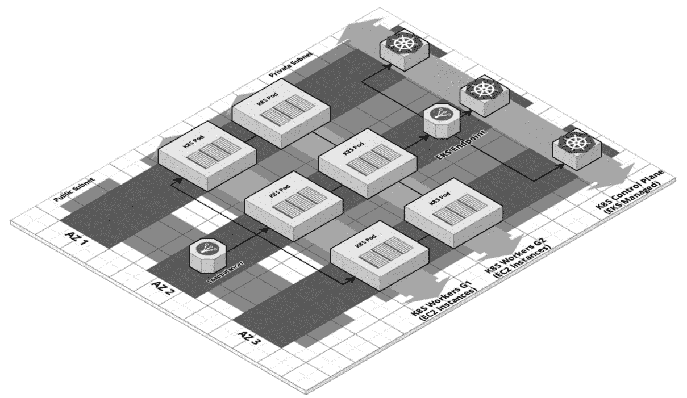

# 第二章：*第二章*：构建生产级 Kubernetes 基础设施架构

在上一章中，您了解了 Kubernetes 的核心组件和基础设施基础知识，以及为何将 Kubernetes 部署到生产环境是一个充满挑战的过程。我们介绍了 Kubernetes 集群的生产就绪特性，并提供了我们的推荐检查清单，帮助确保您的集群满足生产就绪的要求。

我们还介绍了一组通过构建生产级云环境所学到的基础设施设计原则。在本书中，当我们做出架构和设计决策时，我们将这些原则作为指导，并强烈建议云基础设施团队在为 Kubernetes 和云平台架构新基础设施时考虑这些原则。

在本章中，您将了解在设计 Kubernetes 基础设施时需要解决的重要架构决策。我们将探讨每个决策的替代方案和选择，以及可能的优缺点。此外，您还将学习有关云架构的考虑因素，如扩展性、可用性、安全性和成本。我们的目的是提供指导而非做出最终决策，因为每个组织的需求和使用场景不同。我们的角色是探索这些选项，并引导您进行决策。在可能的情况下，我们会阐明我们在本书中的偏好选择，并在实际练习中遵循这些选择。

在本章中，我们将涵盖以下主题：

+   理解 Kubernetes 基础设施设计考虑因素

+   探索 Kubernetes 部署策略的替代方案

+   设计 Amazon EKS 基础设施

# 理解 Kubernetes 基础设施设计考虑因素

在 Kubernetes 基础设施设计方面，有一些虽然重要但需要考虑的因素。几乎每种云基础设施架构都包含相同的一组考虑因素；然而，我们将从 Kubernetes 视角讨论这些考虑因素，并对其进行阐释。

## 扩展性和弹性

公有云基础设施，如 AWS、Azure 和 GCP，引入了前所未有的扩展性和弹性功能。Kubernetes 和容器化技术应运而生，基于这些功能并进一步扩展。

在设计 Kubernetes 集群基础设施时，您应该确保架构涵盖以下两个方面：

+   可扩展的 Kubernetes 基础设施

+   部署到 Kubernetes 集群的可扩展工作负载

为了实现第一个要求，有些部分依赖于底层基础设施，无论是公有云还是本地部署，其他部分则依赖于 Kubernetes 集群本身。

当你选择使用托管 Kubernetes 服务（如 EKS、AKS 或 GKE）时，通常可以解决第一部分的问题，因为集群的控制平面和工作节点将具有可扩展性，并受到其他可扩展基础设施层的支持。

然而，在某些使用场景中，你可能需要部署一个自管理的 Kubernetes 集群，无论是在本地还是在云端。在这种情况下，你需要考虑如何支持扩展性和弹性，以使你的 Kubernetes 集群能够充分发挥其容量。

在所有公共云基础设施中，都有计算自动扩展组的概念，Kubernetes 集群就是建立在这些基础之上的。然而，由于 Kubernetes 上运行的工作负载的特点，扩展需求应与集群调度操作同步。这就是 Kubernetes 集群自动扩展器为我们提供帮助的地方。

**集群自动扩展器**（**CAS**）是一个 Kubernetes 集群附加组件，你可以选择将其部署到集群中，它会根据你在 CAS 中指定的条件和配置自动扩展或缩减工作节点的大小。基本上，当由于计算资源不足而导致 Pod 无法调度时，它会触发集群的扩展；而当存在未充分利用的节点时，它会触发集群缩减，并将这些节点的 Pod 重新调度到其他节点上。你需要考虑云提供商启动新节点所需的时间，因为这可能对时间敏感的应用程序构成问题，在这种情况下，你可以考虑配置 CAS 以启用节点的过度预配。

如需了解更多有关 CAS 的信息，请参阅以下链接：[`github.com/kubernetes/autoscaler/tree/master/cluster-autoscaler`](https://github.com/kubernetes/autoscaler/tree/master/cluster-autoscaler)。

为了实现第二个扩展需求，Kubernetes 提供了两种解决方案来实现 Pod 的自动扩展：

+   **水平 Pod 自动扩展器 (HPA)**：它的工作原理类似于云端自动扩展组，但作用在 Pod 部署层面。可以将 Pod 看作虚拟机实例。HPA 根据特定的度量阈值扩展 Pod 的数量。这些度量值可以是 CPU 或内存利用率，或者你也可以定义自定义度量。要了解 HPA 的工作原理，你可以继续阅读相关内容：[`kubernetes.io/docs/tasks/run-application/horizontal-pod-autoscale/`](https://kubernetes.io/docs/tasks/run-application/horizontal-pod-autoscale/)。

+   **垂直 Pod 自动缩放器（VPA）**：它通过根据 Pod 的使用指标增加 CPU 和内存限制，来垂直扩展 Pod。可以把 VPA 想象成通过更改公有云中虚拟机实例的类型来进行扩容/缩容。VPA 可能会影响 CAS 并触发扩容事件，因此你应该修订 CAS 和 VPA 配置，以使它们保持一致，避免任何不可预见的扩展行为。要了解 VPA 的工作原理，你可以继续阅读这里的内容：[`github.com/kubernetes/autoscaler/tree/master/vertical-pod-autoscaler`](https://github.com/kubernetes/autoscaler/tree/master/vertical-pod-autoscaler)。

我们强烈建议在生产部署中使用 HPA 和 VPA（在非生产环境中则不必要）。我们将在*第八章*，*部署无缝且可靠的应用程序*中，给出如何使用它们部署生产级应用程序和服务的示例。

## 高可用性和可靠性

Uptime 意味着可靠性，通常是基础设施团队衡量和提升的主要指标。Uptime 驱动**服务级目标**（**SLOs**）和与客户的**服务水平协议**（**SLAs**），它还表明你的系统和**软件即服务**（**SaaS**）产品有多稳定和可靠。高可用性是提升 Uptime 的关键，当涉及到 Kubernetes 集群的基础设施时，同样的规则依然适用。这就是为什么设计一个高度可用的集群和工作负载是生产级 Kubernetes 集群的基本要求。

你可以在不同的可用性级别上架构一个高度可用的 Kubernetes 基础设施，具体如下：

+   单一区域的公有云集群（单一数据中心）：这被认为是所有架构中最简单的，但也是风险最高的。我们不推荐这种解决方案。

+   多区域（多个数据中心）但在同一云区域中的集群：这仍然容易实现，提供了更高的可用性，并且是 Kubernetes 集群的常见架构。然而，当你的云服务提供商的某个区域发生完全故障时，整个集群将完全不可用。虽然这种区域故障很少发生，但你仍然需要为这种情况做好准备。

+   跨多区域集群，但在同一云服务提供商内：在这种架构中，通常会运行多个联合的 Kubernetes 集群来承载生产工作负载。这通常是高可用性的首选解决方案，但它需要付出一定的代价，使其实现和运维变得困难，特别是可能存在的网络性能差，以及有状态应用的共享存储。我们不推荐这种架构，因为对于大多数 SaaS 产品来说，在单一区域和多个可用区部署 Kubernetes 已经足够。然而，如果出于除高可用性之外的其他原因，您有多区域的需求，您可以考虑将多区域 Kubernetes 联合集群作为解决方案。

+   跨多云部署的多个集群：由于云服务提供商之间的兼容性限制、集群间网络复杂性、跨云提供商的网络流量成本增加以及实施和运维的挑战，这种架构仍然不太流行。然而，值得一提的是，越来越多的多云管理解决方案正致力于解决这些挑战，您可能会考虑使用 Google 的 Anthos 等多集群管理解决方案。您可以在这里了解更多信息：[`cloud.google.com/anthos`](https://cloud.google.com/anthos)。

如您所见，Kubernetes 在高可用性设置方面有不同的架构选择，我可以说，拥有不同的选择使得 Kubernetes 在不同的用例中更具强大功能。虽然第二种选择目前是最常见的，因为它在实现和运维的简便性与高可用性水平之间取得了平衡。我们乐观地期待着一个时刻的到来，那时我们可以轻松地跨云提供商部署 Kubernetes 集群，并在不增加运维负担和成本的情况下，获得所有的高可用性优势。

至于集群的可用性本身，我相信不言而喻，Kubernetes 组件应该以高度可用的模式运行，即控制平面有三台或更多节点，或者最好是让云平台为您管理控制平面，如 EKS、AKE 或 GKE。至于工作节点，您需要运行一个或多个自动扩展组或节点组/池，这样可以确保高可用性。

另一个需要考虑的领域是您将部署到集群中的 Pods 和工作负载的高可用性。虽然这超出了本书的范围，但仍然值得一提的是，开发新应用和服务，或现代化现有应用使其能够以高可用性模式运行，是利用强大的 Kubernetes 基础设施所提供的众多功能的唯一方式。否则，您将拥有一个非常强大的集群，但只能运行单实例的单体应用！

## 安全性和合规性

Kubernetes 的基础设施安全性贯穿于集群的所有层面，从网络层开始，到操作系统层，再到集群服务和工作负载。幸运的是，Kubernetes 在安全性、加密、身份验证和授权方面提供了强有力的支持。我们将在本书的*第六章*《有效地保障 Kubernetes 安全性》中学习安全相关内容。然而，在设计集群基础设施时，您应关注与安全相关的重要决策，例如保护 Kubernetes API 服务器端点、集群网络设计、安全组、防火墙、控制平面组件、工作节点和公共互联网之间的网络策略等。

您还需要提前规划基础设施组件或集群与身份管理提供商之间的集成。这通常取决于贵组织的安全政策，您需要与 IT 和安全团队进行对接。

另一个需要考虑的方面是集群的审计和合规性。大多数组织都有云治理政策和合规要求，您需要在继续部署生产环境到 Kubernetes 之前了解这些要求。

如果决定使用多租户集群，安全要求可能会更加复杂，明确集群租户之间以及来自不同内部团队的集群用户之间的边界，可能会导致诸如部署服务网格、强化集群网络策略、以及实施更严格的**基于角色的访问控制**（**RBAC**）机制等决策。这一切都会影响您在架构第一个生产集群基础设施时的决策。

Kubernetes 社区非常重视合规性和质量，因此有多种工具和测试可以确保您的集群达到可接受的安全性和合规性水平。在*第六章*《有效地保障 Kubernetes 安全性》中，我们将学习这些工具和测试。

## 成本管理和优化

云成本管理是所有采用云技术的组织面临的重要因素，无论是刚开始使用云的组织，还是已经在云中的组织。将 Kubernetes 加入云基础设施预计将带来成本节省，因为容器化可以使你高效利用计算资源，规模上是虚拟机无法比拟的。一些组织在迁移到容器和 Kubernetes 后实现了高达 90% 的成本节省。

然而，如果没有适当的成本控制，成本可能会再次上升，最终导致许多基础设施成本浪费，并且 Kubernetes 集群无法控制。有许多工具和最佳实践可以考虑用于成本管理，但我们主要希望专注于在基础设施设计过程中需要考虑的行动和技术决策。

我们认为有两个重要方面需要决策，而这些决策将无疑影响你的集群基础设施架构：

+   运行一个单一的多租户集群与多个集群（即，每个租户一个集群）之间的对比

+   集群容量：是运行少量的大型工作节点，还是运行大量的小型工作节点，或是两者的混合？

没有明确正确的决策，但我们将在下一节探讨这些选择，以及如何做出决策。

以下是关于成本优化的其他考虑因素，在此可以做出提前决策：

+   **使用临时/可抢占实例**：这一做法已被证明能够实现巨大的成本节省；然而，它也有代价！任何时候都有失去工作负载的风险，这会影响产品的正常运行时间和可靠性。有一些选项可以克服这一问题，例如将临时实例用于非生产工作负载，如开发环境或 CI/CD 流水线，或任何可以容忍中断的生产工作负载，例如数据批处理。

    我们强烈建议使用临时实例作为工作节点，你可以将它们运行在各自的节点组/池中，并将它们分配给那些不太关注会被中断的工作负载。

+   **Kubernetes 成本可观察性**：大多数云平台为所有云资源提供成本可视化和分析。然而，在集群的部署/服务层级上具有成本可视化至关重要，这需要提前规划，因此你需要使用隔离的工作负载、团队、用户、环境，并且使用命名空间并为其分配资源配额。通过这样做，你将确保使用成本报告工具时，能够生成与服务或集群操作相关的使用情况报告。这对于进一步的成本削减决策非常重要。

+   **Kubernetes 集群管理**：当你运行一个单租户集群，或者为每个开发环境创建一个集群时，你通常会在账户中拥有大量的集群，这可能会导致云成本的增加。解决这一问题的方法是从第一天起就设置集群管理解决方案。这个解决方案可以像一个简单的集群自动缩放脚本，在空闲期间减少工作节点，或者可以是一个完整的自动化系统，配有仪表盘和主集群来管理其余的集群。

在*第九章*《*监控、日志记录与可观测性*》和*第十章*《*高效 Kubernetes 集群的操作与维护*》中，我们将学习成本可观测性和集群操作。

## 可管理性与操作效率

通常，当一个组织开始建立 Kubernetes 基础设施时，他们将大部分时间、精力和关注投入到基础设施设计和部署的紧急和关键需求中，我们通常称之为 Day 0 和 Day 1。一个组织很难把精力投入到未来可能遇到的操作和可管理性问题上（Day 2）。

这一点可以通过缺乏 Kubernetes 经验以及操作挑战的种类来解释，或者是被驱动于获得 Kubernetes 带来的好处，尤其是与开发相关的，如提高开发人员的生产力与敏捷性，自动化发布和部署。

所有这些都导致组织和团队对 Day 2 的准备不足。在本书中，我们尝试在设计、实现和操作之间保持平衡，并阐明操作中的重要方面，学习如何从 Day 0 开始进行规划，特别是与可靠性、可用性、安全性和可观测性相关的内容。

### Kubernetes 的操作挑战

这些是大多数团队在将 Kubernetes 部署到生产环境后所面临的常见操作和可管理性挑战。在这一阶段，你需要重新思考并提前考虑解决方案，以便妥善应对这些挑战：

+   **可靠性与扩展性**：当你的基础设施进行扩展时，你可能会拥有数十个或数百个集群，或拥有成百上千个节点的集群，以及不同环境类型的大量配置。这使得管理应用程序的 SLA/SLO 变得更加困难，甚至维护正常运行时间目标以及诊断集群问题也可能非常具有挑战性。团队需要不断提升 Kubernetes 知识和故障排除技能。

+   **可观察性**：毫无疑问，Kubernetes 是复杂的，这使得监控和日志记录成为必备服务，一旦你的集群投入生产，否则你将很难识别问题和故障。在这方面，你需要部署监控和日志记录工具，并定义基本的可观察性指标和阈值。

+   `etcd`、`kube-proxy`、Docker 镜像以及集群插件的配置在集群生命周期中变得难以管理。这要求从一开始就需要正确的工具。自动化和基础设施即代码（IaC）工具，如 Terraform、Ansible 和 Helm，通常用于帮助解决这一问题。

+   **灾难恢复**：当你的集群出现部分或完全故障时，会发生什么？恢复计划是什么？如何减轻这种风险，并缩短恢复集群和工作负载的平均时间？这需要部署正确的工具，并编写备份、恢复和危机管理的操作手册。

+   **安全性与治理**：你需要确保在生产集群和工作负载方面，应用并执行安全最佳实践和治理政策。由于 Kubernetes 的复杂性、软隔离技术、灵活性以及它带来的开发和发布生命周期的快速步伐，这变得具有挑战性。

还有其他运营挑战。然而，我们发现，只要我们遵循以下基础设施最佳实践和标准，大多数这些问题都可以得到缓解：

+   **基础设施即代码（IaC）**：这是现代基础设施和 DevOps 团队的默认实践。使用声明式的 IaC 工具和技术，而非命令式工具，是推荐的方法。

+   **自动化**：我们生活在软件自动化的时代，我们倾向于自动化一切；这样做更高效，更容易管理和扩展，但我们需要将 Kubernetes 的自动化提升到另一个层次。Kubernetes 本身就具备自动化容器生命周期的能力，同时也具备高级自动化概念，如操作员（operators）和 GitOps，这些概念高效且能够真正实现自动化的自动化。

+   **标准化**：拥有一套标准可以帮助减少团队在对齐和协作方面的困难，简化流程的扩展，提高整体质量，并增加生产力。对于计划在生产中使用 Kubernetes 的公司和团队来说，这尤为重要，因为这涉及到与不同基础设施部分的集成、将服务从本地迁移到云端以及许多进一步的复杂性。

    定义你的标准集包括操作手册和执行手册的流程，以及技术标准化——在团队间使用 Docker、Kubernetes 和标准工具。这些工具应该具备特定特点：开源但在生产环境中经过充分验证，能够支持其他原则，如基础设施即代码（IaC）、不可变性、云无关性，并且能够简单使用和部署，且对基础设施的要求最低。

+   **单一真实来源**：拥有一个真实来源是现代基础设施管理和配置的基石和推动力。源代码控制系统，如 Git，已成为存储和版本化基础设施代码的标准选择，在基础设施代码管理中，拥有一个单一且专门的源代码库是推荐的最佳实践。

管理 Kubernetes 基础设施是关于管理复杂性的问题。因此，拥有一个稳固的基础设施设计，应用最佳实践和标准，提升团队的 Kubernetes 专业技能和经验，都会帮助确保操作顺畅和易于管理。

# 探索 Kubernetes 部署策略的替代方案

Kubernetes 及其生态系统提供了关于部署、编排和操作工作负载的广泛选择。这种灵活性是一个巨大的优势，使得 Kubernetes 能够适应不同的使用场景，从本地和云端的常规应用到物联网（IoT）和边缘计算。然而，选择意味着责任，在本章中，我们将了解在集群部署架构中需要评估并做出的技术决策。

需要考虑和决策的一个重要问题是：你应该在哪里部署集群，以及你可能需要多少个集群来运行容器化工作负载？答案通常由业务和技术因素共同驱动；例如现有基础设施、云转型计划、云预算、团队规模和业务增长目标等。这些因素都会影响决策，这也是为什么 Kubernetes 项目的负责人需要与组织内的团队和高层管理人员合作，达成关于决策驱动因素的共同理解，并商定业务的正确方向。

我们将探索一些常见的 Kubernetes 部署架构替代方案，包括它们的使用场景、优点和缺点：

+   **多可用区集群**：这是在公有云中部署**高可用性**（**HA**）集群的主流架构。因为大多数公有云提供商都支持在多可用区中运行集群，同时，这也能实现一个可接受的高可用性水平。因此，绝大多数新的 Kubernetes 用户选择这种方案。然而，如果你有必须在不同区域运行工作负载的需求，这个选项就不太适用了。

+   **多区域集群**：除非你有在多个区域运行集群的需求，否则很少有动机选择这种架构。虽然公共云服务提供商失去整个区域的情况非常罕见，但如果你有足够的预算进行合理的设计并克服操作上的挑战，那么可以选择多区域配置。它肯定会为你提供更高的高可用性和可靠性水平。

+   **混合云集群**：混合云是一个常见的做法，适用于那些从本地迁移到公共云的组织，并且正处于过渡期，工作负载或数据在旧基础设施和新云基础设施之间分割。混合云也可以是一个永久性的配置，组织希望将部分基础设施保留在本地，无论是出于安全原因（例如敏感数据）还是因为无法迁移到云端。Kubernetes 是混合云模型的推动者，特别是通过像 Google Anthos 这样的托管集群管理解决方案。不过，这无疑会带来更高的资源配置和运营成本。

+   **多云集群**：与混合云集群不同，我认为多云集群是一个不太常见的模式，因为它通常缺乏强有力的推动力。你可以在多云集群中运行多个不同的系统，出于各种原因，但通过 Kubernetes 在两个或更多云中部署单一系统并不常见，在朝这个方向发展之前，你应该谨慎考虑。然而，我能理解一些组织这样做的动因，比如避免与某个特定云提供商的绑定，利用不同提供商的定价模型进行成本优化，减少延迟，甚至实现工作负载的终极可靠性。

+   **本地集群**：如果一个组织决定不迁移到云端，Kubernetes 仍然可以在本地管理他们的基础设施。实际上，Kubernetes 是管理本地工作负载的现代化合理选择，然而，目前提供稳固的本地管理 Kubernetes 解决方案的还非常少。

+   **边缘集群**：Kubernetes 在边缘计算和物联网领域越来越受到关注。它为底层硬件提供了抽象，非常适合分布式计算需求，而且庞大的 Kubernetes 生态系统帮助推出了多个符合边缘计算特点的开源和第三方项目，如 KubeEdge 和 K3s。

+   **本地集群**：你可以使用像 Minikube 或 Kind（Kubernetes in Docker）这样的工具在本地机器上运行 Kubernetes。使用本地集群的目的是进行试验、学习和开发者使用。

我们已经讨论了各种集群部署架构和可用的模型及其应用场景。在接下来的章节中，我们将学习如何设计本书中将使用的 Kubernetes 基础设施，以及围绕它的技术决策。

# 设计 Amazon EKS 基础设施

在本章中，我们讨论并探讨了 Kubernetes 集群设计的各个方面，以及在设计时需要考虑的不同架构因素。现在，我们需要将这些内容汇总成本书中将要遵循的设计方案。我们在这里做出的决定并不意味着它们是唯一正确的选择，但这是我们在本书的实际练习中为确保最基本可接受的生产集群所采取的首选设计。你当然可以采用相同的设计，但可以进行修改，比如集群大小调整。

在接下来的章节中，我们将探讨有关云服务提供商、配置和配置工具的选择，以及整体基础设施架构。在后续章节中，我们将基于这些选择进行构建，并使用它们来部署类似生产环境的集群，同时在集群上部署配置和服务。

## 选择基础设施提供商

正如我们在前面的章节中所学，部署 Kubernetes 有多种方式。你可以在本地、内网，或公有云、私有云、混合云、多云环境或边缘位置进行部署。每种基础设施类型都有其使用场景、优点和缺点。然而，最常见的还是公有云，其次是混合云模式。其余选项通常仅适用于特定场景。

在像我们这样的单本书中，我们无法讨论每种基础设施平台，因此我们决定选择一种最常见的 Kubernetes 部署方式，即使用公有云之一（AWS、Azure 或 GCP）。你仍然可以使用其他云服务提供商、私有云，甚至是本地部署，书中讨论的大多数概念和最佳实践依然适用。

在选择公有云时，我们并不推崇某一特定云服务提供商，当然我们推荐使用你已经在现有基础设施中使用的云服务提供商，但如果你刚开始云计算之旅，我们建议你对各大公有云进行深入的基准测试分析，看看哪个更适合你的业务。

本书中的实际练习将使用 AWS 和**弹性 Kubernetes 服务**（**EKS**）。在前一章中，我们已经解释了基础设施设计原则，始终倾向于选择托管服务而非自管理的服务，选择 EKS 而不是在 AWS 上构建自管理集群时也适用这一原则。

## 选择集群和节点大小

在规划集群时，你需要决定集群和节点的大小。这个决策应基于你工作负载的预估利用率，你可以根据旧基础设施提前了解这些信息，或者可以大致计算并在生产环境上线后进行调整。在任何情况下，你都需要先决定初始的集群和节点大小，然后不断调整它们，直到达到正确的利用率水平，以实现成本和可靠性之间的平衡。除非你有充分的理由使用不同的利用率水平，否则你可以设定目标利用率为 70%到 80%之间。

这些是你可以单独或组合考虑的常见集群和节点大小选择：

+   **少量的大集群**：在这种配置中，你部署了少数几个大集群。这些集群可以是生产集群或非生产集群。大集群在节点大小、节点数量或两者方面可能都较大。大集群通常更易于管理，因为它们数量较少。它们在成本上也更具效率，因为你可以实现更高的每节点和每集群的资源利用率（假设你正在运行适量的工作负载），这种提高的利用率来自于节省系统管理所需的资源。然而，大集群缺乏对多租户的硬隔离，因为你只能使用命名空间在租户之间实现软隔离。它们还会为你的生产环境引入单点故障（尤其是当你运行单个集群时）。还有另一个限制，由于任何 Kubernetes 集群最多只能管理 5000 个节点，如果你运行大量的 Pod，那么当你使用单个集群时，可能会遇到这个上限。

+   **多个小集群**：在这种配置中，你部署了大量的小集群。这些集群可能在节点大小、节点数量或两者方面都较小。小集群在安全性方面表现优越，因为它们能够在资源和租户之间提供严格的隔离，同时为有多个团队和部门的组织提供强大的访问控制。它们还能减少故障的影响范围，并避免出现单点故障。然而，小集群也带来了操作上的开销，因为你需要管理一组集群。它们在资源使用效率方面也较低，因为你无法像大集群那样实现高效的资源利用率，此外，由于需要更多的控制平面资源来管理这组小集群，而这些小集群管理的工作节点总数与大集群相同，所以也增加了成本。

+   **大节点**：这涉及集群中节点的大小。当你在集群中部署大节点时，你将更高效地利用节点（假设你部署的工作负载利用了节点 70-80%的资源）。这是因为大节点能够应对应用程序的波动，并能处理高 CPU/内存要求的应用程序。除此之外，一个充分利用的大节点通常会带来成本节约，因为它减少了系统管理所需的整体集群资源，并且你可以从云服务商处以折扣价格购买这种类型的节点。另一方面，大节点可能会引入较大的故障波及范围，从而影响集群和应用程序的可靠性。另外，在扩容时向集群中添加一个新的大节点会带来许多可能不需要的额外成本，因此，如果你的集群在短时间内遇到多次弹性扩展事件，大节点可能不是一个好的选择。再者，Kubernetes 在单个节点上运行的 Pods 数量有上限，无论节点的类型和大小如何，若是大节点，这一限制可能会导致资源的低效利用。

+   `etcd`、`kube-proxy`等的管理成本高于管理相同计算能力的较大节点，此外，小节点每个节点的 Pods 限制较低。

+   **集中的集群与分散的集群**：组织通常采用这两种方式之一来管理它们的 Kubernetes 集群。

    在分散的方式中，组织内的团队或个人可以创建并管理他们自己的 Kubernetes 集群。这种方法为团队提供了灵活性，允许他们最大限度地利用集群，并根据需求进行定制；另一方面，这也增加了操作开销、云成本，并使得在集群间执行标准化、安全性、最佳实践和工具的统一变得更加困难。这种方法更适合那些高度分散的组织，或者在进行云转型、产品生命周期过渡期，或探索和创新新技术和解决方案的组织。

    在集中的方法中，团队或个人共享一个单一的集群或一小组相同的集群，这些集群使用类似的标准、配置和服务。这种方法克服并减少了分散模型的缺点；然而，它可能会缺乏灵活性，减缓云转型，并降低团队的敏捷性。这种方法更适合那些在向成熟、平台稳定性、提高云成本削减、执行并推广标准与最佳实践以及更注重产品而非底层平台方面努力的组织。

一些组织可以从上述替代方案中运行混合模型，例如根据应用需求，拥有大、中、小节点来充分利用每种类型的优点。然而，我们建议您进行实验，决定哪种模型最适合您的工作负载性能，并且能够实现云成本降低目标。

## 选择集群部署和管理工具

在 Kubernetes 的早期，我们曾经从零开始部署，它通常被称为**Kubernetes 硬核方式**。时至今日，Kubernetes 社区发展壮大，涌现出许多工具来自动化部署。这些工具的种类从简单的自动化到完整的一键部署不等。

在本书的上下文中，我们不会详细解释市场上所有这些工具（它们有很多），也不会进行比较和基准测试。然而，我们将提出我们的选择，并简要说明选择的理由。

### 基础设施提供

当您第一次部署 Kubernetes 时，很可能会使用一个命令行工具，通过单一命令来部署集群，或者您可能会使用云提供商的网页控制台来进行部署。无论哪种方式，这种方法适用于实验和学习目的，但当涉及到在生产和开发环境中的实际实施时，部署工具就成为了必须。

大多数考虑部署 Kubernetes 的组织，已经拥有现有的云基础设施，或者正在进行云迁移过程。这使得 Kubernetes 并非他们将使用的唯一云基础设施。因此，我们更倾向于选择一个能够实现以下目标的部署工具：

+   它可以用来提供 Kubernetes 以及其他基础设施组件（数据库、文件存储、API 网关、无服务器架构、监控、日志记录等）。

+   它支持并增强了基础设施即代码（IaC）原则。

+   它是一个与云平台无关的工具。

+   它已被其他公司和团队在生产环境中经过实际验证。

+   它有社区支持和活跃的开发。

我们在 Terraform 中找到了这些特点，这也是我们选择在我们管理的生产集群中使用它，并在本书的实践练习中使用它的原因。我们也强烈推荐您使用 Terraform，但如果您更喜欢其他的部署工具，您可以跳过本章，继续阅读本书，并应用相同的概念和最佳实践。

### 配置管理

Kubernetes 配置本质上是声明式的，因此，在部署集群之后，我们需要管理其配置。已部署的附加组件为各种功能领域提供服务，包括网络、安全、监控和日志记录。这也是为什么在您的工具集中需要一个可靠且多功能的配置管理工具。

以下是一些可靠的选择：

+   常规的配置管理工具，如 Ansible、Chef 和 Puppet

+   Kubernetes 特定的工具，如 Helm 和 Kustomize

+   Terraform

我们推荐的适用工具顺序如下：

1.  Ansible

1.  Helm

1.  Terraform

我们可以讨论这个顺序，我们认为这些工具中的任何一个都可以满足 Kubernetes 集群的配置管理需求。然而，我们更倾向于使用 Ansible，因为它具有多功能性和灵活性，既可以用于 Kubernetes，也可以用于其他环境中的配置管理需求，这使得它比 Helm 更具优势。另一方面，Ansible 比 Terraform 更受青睐，因为它本质上是一个供应工具，虽然它可以处理配置管理，但它并不是做配置管理的最佳工具。

在本书的动手练习中，我们决定使用 Ansible 结合 Kubernetes 模块和 Jinja2 模板。

## 决定集群架构

每个组织都有自己管理云账户的方式。然而，我们建议至少拥有两个 AWS 账户，一个用于生产环境，另一个用于非生产环境。生产 Kubernetes 集群放置在生产账户中，非生产 Kubernetes 集群放置在非生产账户中。这种结构在安全性、可靠性和操作效率方面更为优越。

基于我们在前几节中做出的技术决策和选择，我们提出了以下适用于本书中使用的 Kubernetes 集群的 AWS 架构，您也可以使用该架构来部署您自己的生产和非生产集群：

图 2.1 – 集群架构图

在之前的架构图中，我们决定进行如下操作：

+   为集群网络创建一个独立的 VPC；我们选择了**无类域间路由**（**CIDR**）范围，该范围具有足够的 IPv4 地址容量，能够支持未来的扩展。每个 Kubernetes 节点、Pod 和服务都会拥有自己的 IP 地址，我们需要记住的是，服务的数量将会增加。

+   创建公有和私有子网。公有子网中放置公共可访问资源，如负载均衡器和堡垒机，私有子网中放置私有可访问资源，如 Kubernetes 节点、数据库和缓存。

+   为了实现高可用性，我们在三个不同的可用区中创建了资源。我们在每个可用区内放置了一个私有子网和一个公有子网。

+   为了扩展，我们运行多个 EKS 节点组。

我们将在下一章节讨论这些设计规格的细节，以及集群架构中其他技术方面的内容。

# 总结

使用现代工具和托管云服务，部署一个 Kubernetes 集群可能只需要 5 分钟；然而，这远远不是一个生产级的 Kubernetes 基础设施，只适用于教育和试验。构建一个生产级的 Kubernetes 集群需要在设计和架构底层基础设施、集群以及上面运行的核心服务方面付出艰苦的努力。

到目前为止，您已经了解了在设计、构建和操作 Kubernetes 集群时需要考虑的不同方面和挑战。我们探索了部署 Kubernetes 集群的不同架构选择，以及与此过程相关的重要技术决策。然后，我们讨论了提出的集群设计，这将作为本书中实践练习的基础，并重点介绍了我们选择的基础设施平台、工具和架构。

在下一章中，我们将学习如何将所有内容整合在一起，使用本章讨论的设计概念编写基础设施即代码（IaC），并使用 Terraform 遵循行业最佳实践来配置我们的第一个 Kubernetes 集群。

# 进一步阅读

欲了解本章涉及的更多信息，请参考以下链接：

+   *掌握 Kubernetes——第三版*: [`www.packtpub.com/product/mastering-kubernetes-third-edition/9781839211256`](https://www.packtpub.com/product/mastering-kubernetes-third-edition/9781839211256)

+   *Kubernetes 在 AWS 上的应用*: [`www.packtpub.com/product/kubernetes-on-aws/9781788390071`](https://www.packtpub.com/product/kubernetes-on-aws/9781788390071)
