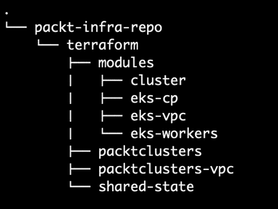
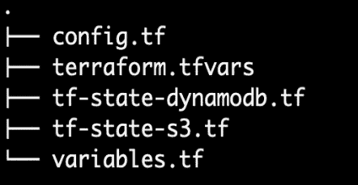
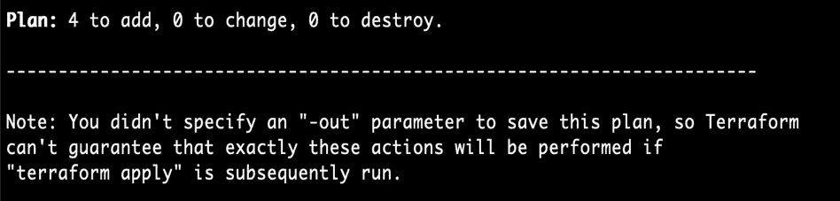
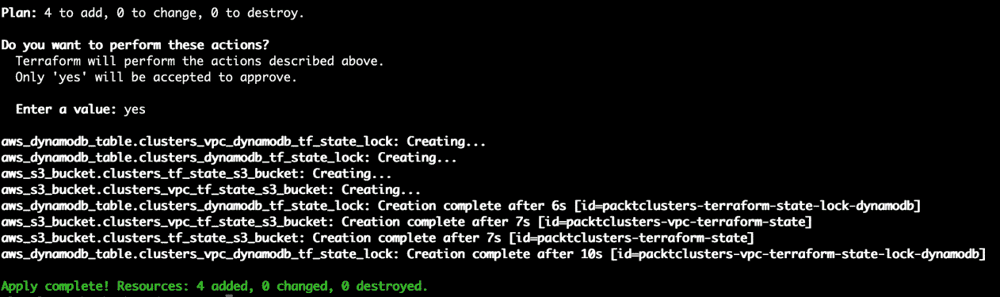
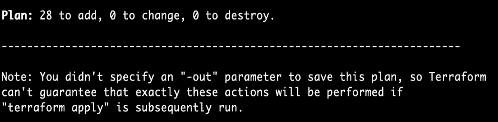
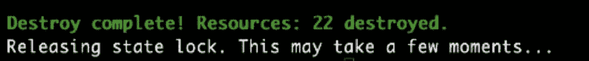
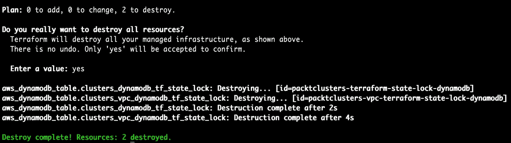

# *第三章*：使用 AWS 和 Terraform 配置 Kubernetes 集群

在上一章中，我们了解了 Kubernetes 集群和基础设施设计，以及如何创建一个部署架构来实现最佳实践和标准。在设计和构建 Kubernetes 平台时有多种选择。选择一个适合你用例并满足生产就绪目标的解决方案并不是一件容易的事。Kubernetes、其底层技术以及周围的生态系统仍然面临着挑战和局限性。

在本章中，我们将详细讲解基础设施设计的实现过程。基本上，我们将学习如何使用 Terraform 声明性地创建 Kubernetes 基础设施。在配置基础设施的过程中，我们将学习一些实现最佳实践，例如将基础设施组件封装成可重用的模块、在不增加运维开销和复杂度的情况下按环境分离 Kubernetes 集群。此外，你还将通过简单的 Terraform 命令，实践如何部署第一个 Kubernetes 集群及集群组。

本章将涵盖以下主题：

+   实现原则和最佳实践

+   集群部署和发布策略

+   准备 Terraform

+   创建网络基础设施

+   创建集群基础设施

+   清理并销毁基础设施资源

# 技术要求

本章需要提前安装 Terraform 工具。

除了这个工具，你还需要准备好 AWS 账户和用户凭证。请确保 AWS CLI 已用你的 AWS 凭证进行了身份验证。你可以参考 AWS 文档获取更多说明，网址为[`docs.aws.amazon.com/cli/latest/userguide/cli-chap-configure.html`](https://docs.aws.amazon.com/cli/latest/userguide/cli-chap-configure.html)。

本章的代码位于[`github.com/PacktPublishing/Kubernetes-in-Production-Best-Practices/tree/master/Chapter03`](https://github.com/PacktPublishing/Kubernetes-in-Production-Best-Practices/tree/master/Chapter03)。

请访问以下链接查看《代码实践》视频：

[`bit.ly/39Ocoyq`](https://bit.ly/39Ocoyq)

## 安装 Terraform

Terraform 二进制文件是一个命令行工具，用于开发**基础设施即代码**（**IaC**），并规划和执行资源的创建，管理基础设施提供商，如 AWS、Azure、GCP、Fastly、OKTA 等。

你可以根据官方文档的说明，在[`www.terraform.io/downloads.html`](https://www.terraform.io/downloads.html)下载最新版本的 Terraform。

安装完 Terraform 后，你就可以开始进行接下来的实践操作。

# 实现原则和最佳实践

在 *第一章*，*Kubernetes 基础设施与生产就绪性简介* 中，你了解了本书中我们将遵循的 12 条基础设施设计原则。我想通过强调推动我们实施集群基础设施的原则来开始本章。以下是影响本章实现决策的三个原则：

1.  **基础设施即代码**：在本章中，你将以声明方式编写每一段基础设施代码。你将通过使用 Terraform 来实现这一目标。

1.  **Go 管理**：创建 Kubernetes 集群有两种基本方式——要么自己构建并操作 Kubernetes 控制平面和工作节点（在本地或云上），要么使用云中的 *托管* Kubernetes 服务，如 **Google Kubernetes Engine** (**GKE**)、**Azure Kubernetes Service** (**AKS**) 和 AWS **Elastic Kubernetes Service** (**EKS**)。在本书中，我将使用 EKS，因为它符合 *托管服务* 原则。

1.  **标准化**：当我们选择 Terraform 作为我们的配置和基础设施即代码（IaC）工具时，我们应用了这一原则。Terraform 并不是启动 Kubernetes 集群的最简单方式，且有其他工具可能更快速且易于学习。然而，我们需要将我们的基础设施工具集标准化，尽量使用更少的工具。因此，Terraform 是合适的选择，因为在大多数使用场景中，你的生产环境并不仅仅是 Kubernetes。还有数据库、缓存服务、内容分发、负载均衡等。这些类型的基础设施组件更容易通过 Terraform 创建和管理。

# 集群部署和推广策略

在前一章中，我们探讨了不同的基础设施设计备选方案、限制和边角情况。我们做出了满足生产级 Kubernetes 集群基础设施设计原则的架构决策。最后，我们提出了一个完整的 Kubernetes 基础设施部署架构，我们将在本书中构建并使用。当然，在从一章过渡到下一章的过程中，我们将不断完善我们的基础设施设计和实现，增加更多功能，使其更好。

在实现方面，我们应该解决如何部署集群并进行推广的问题。具体来说，我们追求的是可扩展性、简洁性和操作效率。在接下来的章节中，我们将遵循这些原则：

1.  **开发通用基础设施模块**：通过将每个基础设施资源封装到可重用的代码模块中，这将使我们能够通过最小或零代码更改来自动化集群的配置。这也促进了代码重用的实践，这对于简化基础设施即代码（IaC）至关重要，并提高了操作效率。

1.  **支持单集群和多集群**：在实际应用中，Kubernetes 部署团队需要多个集群来为整个公司或特定产品提供服务。在本章中，我们将采取一种策略，使用相同的基础设施代码和配置创建一组集群。此外，我们还将创建多个不同配置的集群组。这将帮助我们为多个生产和非生产集群提供服务，并自动化其配置和操作。该实现具有可扩展性，因为我们可以根据底层 IaaS 提供商的限制来配置多个集群，而无需扩展基础设施团队。

1.  **通过最小化更改分离生产环境和非生产环境**：推荐的做法之一是为生产环境和非生产环境分别使用两个 AWS 账户，我们的实现也支持这种模型，且仅需最小的代码更改和管理工作。

1.  **自动化基础设施部署**：每一块基础设施都由 Terraform 管理，通过少量的命令，我们就可以配置整个 Kubernetes 集群。我们可以使用传统的 CI/CD 工具（如 Jenkins）来构建自动化的基础设施部署和测试流水线。

实际上，集群部署并非一次性任务。它是一个持续的过程，影响集群的质量、稳定性和运营，此外，还会影响其上运行的产品和服务。因此，我们希望建立一个稳固的基础设施部署策略，我们将在本章的实现过程中遵循这一策略，并在全书中持续改进。

# 准备 Terraform

在创建 Kubernetes 集群的 Terraform 配置和代码之前，你需要为基础设施创建一个新的源代码仓库，并创建 Terraform 目录结构。此外，你还将学习如何配置和使用 Terraform 的共享状态，这是在生产环境中管理基础设施即代码（IaC）的一个关键最佳实践。

## Terraform 目录结构

Terraform 目录是你在源代码仓库中存放所有 Terraform 源代码的地方。我建议创建一个独立的源代码仓库，该仓库应包含所有基础设施代码和配置。以下是我们将在接下来的章节中开发的 Terraform 源代码目录结构：



图 3.1 – Terraform 目录结构

## 持久化 Terraform 状态

Terraform 会保存其管理下的基础设施资源的状态，以便能够将其映射到实际世界中的现有资源。默认情况下，状态存储在本地文件中。然而，这不推荐用于生产规模的基础设施，因为在这种情况下，保持一致的状态以及在分布式团队成员之间共享状态是至关重要的。

作为推荐的 Terraform 最佳实践，你应该配置 Terraform 使其保持远程状态并加锁：

+   **远程**：由于你已经使用 AWS 作为基础设施提供商，你可以利用 S3 存储桶远程存储 Terraform 状态文件。

+   **锁定**：你可以通过使用 DynamoDB 表来实现 Terraform 状态锁定。然后，Terraform 状态将在当前用户操作完成之前锁定，直到此用户完成操作，其他用户才能获得锁定。

## 创建 Terraform 状态配置

按照以下步骤创建 Terraform 目录结构以及共享状态配置的目录：

1.  创建一个名为 `terraform` 的根目录。这是所有 Terraform 源代码的根目录。

1.  创建一个名为 `shared-state` 的子目录。这个目录将包含用于配置 S3 存储桶和 DynamoDB 表的 Terraform 源代码。这两个资源都用于存储共享状态。

在接下来的步骤中，你将在 `shared-state` 目录下创建共享状态的 Terraform 代码，目录结构如下：



图 3.2 – 共享状态目录结构

重要说明

你可以在 [`github.com/PacktPublishing/Kubernetes-in-Production-Best-Practices/tree/master/Chapter03/terraform/shared-state`](https://github.com/PacktPublishing/Kubernetes-in-Production-Best-Practices/tree/master/Chapter03/terraform/shared-state) 找到共享状态 Terraform 配置的完整源代码。

现在，让我们在 `shared-state` 目录下创建 Terraform 文件：

1.  Terraform 可以创建和管理云端以及本地的基础设施资源，它可以通过与外部基础设施的通信来实现这一点，使用的提供商是一种软件插件，可以将 Terraform 命令翻译为基础设施提供商可以理解和执行的 API。

1.  在 `config.tf` 文件中，你定义了在本章中将使用的提供商配置。对于每个提供商，你需要定义其名称以及你打算使用的版本。要了解如何定义“所需提供商版本”，请访问 [Terraform 官方文档](https://www.terraform.io/docs/configuration/terraform.html#specifying-required-provider-versions)

    明确地定义版本非常重要，特别是在 Terraform 被多个用户或自动化工具使用时。这是为了避免升级到可能会破坏 Terraform 状态的新版：

    ```
    terraform {
      required_version = "~> 0.14.5"
    }
    ```

    这个代码块定义了 AWS 提供商的配置。你只需要指定 AWS 区域和提供商的版本：

    ```
    provider "aws" {
      region = var.aws_region
      version = "~> 3.27.0"
    }
    ```

1.  在`terraform.tfvars`文件中，你定义了 Terraform 在配置基础设施资源时需要使用的环境变量。使用 Terraform `tfvars`文件是将环境变量传递给 Terraform 的良好实践。这样做能让你把所有配置，包括环境变量，版本化存储在源代码控制中，作为你的“真实来源”：

    ```
    aws_region            = "us-east-1"
    clusters_name_prefix = "packtclusters"
    ```

    我们使用`us-east-1`作为默认的 AWS 区域，但你可以使用任何其他区域，只要你在其他练习中保持一致。

    第二个环境变量是*集群名称前缀*，你将使用它为你的集群命名，将它们识别为一组集群。这个名称前缀可以代表你公司的名称或产品的名称，当然，你可以自由使用任何合适的命名约定。

1.  在`variables.tf`文件中，你定义了 Terraform 代码将使用的输入变量。你将在本章的练习中使用两个输入变量，第一个是 AWS 区域，第二个是集群名称前缀。这两个变量的值都来自于前面的`terraform.tfvars`文件：

    ```
    variable "aws_region" {
      type = string
    }
    variable "clusters_name_prefix" {
      type = string
    }
    ```

1.  在`tf-state-s3.tf`文件中，你定义了两个 S3 存储桶资源。第一个存储桶存储 VPC 和网络资源的状态，第二个存储桶存储 Kubernetes 集群资源的状态，如 EKS 和工作节点组。

    以下代码片段使用了一个名为`aws_s3_bucket`的 Terraform 资源，这是 Terraform AWS 提供程序中的内置资源，可用于创建 AWS S3 存储桶并设置其配置参数。

    我们将使用这个 S3 存储桶来持久化 Terraform 状态。正如你在以下代码中所看到的，这个 S3 存储桶有私有访问权限，以确保它不被公众访问。它还启用了删除保护，以防止其被意外删除：

    ```
    resource "aws_s3_bucket" "clusters_tf_state_s3_bucket" {
      bucket = "${var.clusters_name_prefix}-terraform-state"
      acl    = "private"
      versioning {
        enabled = true
      }
      lifecycle {
        prevent_destroy = true
      }
      tags = {
        Name      = "${var.clusters_name_prefix} S3 Remote Terraform State Store"
        ManagedBy = "terraform"
      }
    }
    ```

    代码的第二部分与之前的部分类似，但它用于创建网络基础设施或**虚拟私有云**（**VPC**）资源状态的 S3 存储桶：

    ```
    resource "aws_s3_bucket" "clusters_vpc_tf_state_s3_bucket" {
      bucket = "${var.clusters_name_prefix}-vpc-terraform-state"
      acl    = "private"
      versioning {
        enabled = true
      }
      lifecycle {
        prevent_destroy = true
      }
      tags = {
        Name      = "${var.clusters_name_prefix} VPC S3 Remote Terraform State Store"
        ManagedBy = "terraform"
      }
    }
    ```

    将基础设施状态分为两个文件，如我们在前面的代码中所做的，值得商榷。然而，我们倾向于使用一种平衡的方法，除非资源的生命周期与 Kubernetes 集群独立，否则我们不会为资源使用单独的状态。这种分离有助于资源的变更管理，并且将关键资源解耦。

1.  在`tf-state-dynamodb.tf`文件中，你创建了两个 DynamoDB 表，第一个用于 VPC 资源状态锁定，第二个用于 Kubernetes 集群资源。

    以下代码片段使用了一个名为`aws_dynamodb_table`的 Terraform 资源，这是 Terraform AWS 提供程序中的内置资源，用于创建 AWS DynamoDB 表并设置其配置参数。

    这段代码创建了一个 DynamoDB 表，用于存储 Kubernetes 集群资源的共享 Terraform 状态的锁。这个锁将防止多个并行执行的操作对相同的状态文件或相同资源进行修改，从而防止用户同时对基础设施进行变更。这样做可能会非常危险，对吧？

    ```
    resource "aws_dynamodb_table" "clusters_dynamodb_tf_state_lock" {
      name           = "${var.clusters_name_prefix}-terraform-state-lock-dynamodb"
      hash_key       = "LockID"
      read_capacity  = 20
      write_capacity = 20
      attribute {
        name = "LockID"
        type = "S"
      }
    }
    ```

    `tf-state-dynamodb.tf` 文件的第二部分创建了一个 DynamoDB 表，用于存储 VPC 资源的共享 Terraform 状态的锁：

    ```
    resource "aws_dynamodb_table" "clusters_vpc_dynamodb_tf_state_lock" {
      name           = "${var.clusters_name_prefix}-vpc-terraform-state-lock-dynamodb"
      hash_key       = "LockID"
      read_capacity = 20
      write_capacity = 20
      attribute {
        name = "LockID"
        type = "S"
      }
    }
    ```

当你应用之前的 Terraform 代码文件时，它将创建两个 DynamoDB 表。在接下来的章节中，我们将学习如何配置 Terraform 来使用它们。然后，Terraform 将能够为其共享状态文件创建锁。

## 配置 Terraform 状态

在为共享状态资源创建了之前的 Terraform 代码文件之后，你需要执行以下操作来在你的 AWS 账户中配置资源：

1.  初始化 Terraform 状态：

    ```
    $ cd Chapter03/terraform/shared-state
    $ terraform init
    Initializing modules...
    Initializing the backend...
    Initializing provider plugins...
    - Checking for available provider plugins...
    - Downloading plugin for provider "aws" (hashicorp/aws) 3.27.0...
    Terraform has been successfully initialized!
    You may now begin working with Terraform. Try running "terraform plan" to see
    any changes that are required for your infrastructure. All Terraform commands
    should now work.
    If you ever set or change modules or backend configuration for Terraform,
    rerun this command to reinitialize your working directory. If you forget, other
    commands will detect it and remind you to do so if necessary.
    ```

1.  运行 `terraform plan` 命令，验证计划的更改，然后再应用它们：

    ```
    $ terraform plan
    ```

1.  在 `terraform plan` 命令成功完成后，你将得到如下输出。需要添加四个资源——两个 S3 存储桶和两个 DynamoDB 表：

    图 3.3 – Terraform plan 命令输出

1.  执行 `terraform apply` 命令。当系统提示确认执行时，输入 `yes`：

    ```
    $ terraform apply
    ```

1.  在 `terraform apply` 命令成功完成后，你将得到如下输出。到那时，Terraform 已成功创建了四个 AWS 资源：



图 3.4 – Terraform apply 命令输出

现在你已完成 AWS 资源的配置，以持久化和管理 Terraform 的共享状态。在接下来的章节中，你将学习如何配置 VPC 和其他网络资源，以运行你的第一个 Kubernetes 集群。

## 使用 Terraform 工作区

在上一节中，你学习了 Terraform 配置有一个后端，它定义了操作是如何执行的，以及基础设施状态存储的位置，比如 S3 存储桶。Terraform 使用工作区来组织和隔离单个后端下的多个状态。

当用户希望运行多个相同基础设施的实例，而不创建多个后端和状态文件时，这个概念变得非常有用。假设你想使用 Terraform 来配置一个 Kubernetes 集群 ClusterA，并希望使用相同的配置来配置第二个集群 ClusterB。在这种情况下，工作区提供了一种开箱即用且可扩展的解决方案，因为你将能够为所有集群（*N* 个集群）使用单一后端，但在每个工作区中为每个集群配置独立的状态文件。

如果你有一个名为 `k8s_s3_backend` 的 Terraform 配置后端，并且你希望使用相同的 Terraform 基础代码配置 *N* 个 Kubernetes 集群，那么你可以执行以下操作：

```
$ terraform workspace new cluster1
Created and switched to workspace "cluster1"!
You're now on a new, empty workspace. Workspaces isolate their state,
so if you run "terraform plan" Terraform will not see any existing state
for this configuration.
$ terraform apply 
<apply outputs>
```

然后，对每个*N*集群重复相同的过程：

```
$ terraform workspace new clusterN
Created and switched to workspace "clusterN"!
You're now on a new, empty workspace. Workspaces isolate their state,
so if you run "terraform plan" Terraform will not see any existing state
for this configuration.
$ terraform apply 
<apply outputs>
```

# 创建网络基础设施

在*第二章*，《*构建生产级 Kubernetes 基础设施*》中，你详细了解了基础设施架构设计建议以及在 Kubernetes 集群的生产就绪状态方面应该做出的技术决策。在本节中，你将使用 Terraform 来配置 Kubernetes 生产基础设施的网络层。

这些是你将在本节中使用 Terraform 代码配置的 AWS 网络资源：

+   AWS VPC

+   私有子网

+   公有子网

+   路由表

+   Internet 和 NAT 网关

将 AWS 资源封装为可重用的代码模块是一种推荐的 IaC 实践。在接下来的小节中，你将创建一个包含之前 AWS 资源的 VPC Terraform 模块。然后，你可以重复使用该模块，无需修改代码，便可为多个 Kubernetes 集群配置 VPC。

## 开发 VPC Terraform 模块

在`terraform`根目录下，创建一个名为`modules`的目录。然后，创建一个名为`eks-vpc`的子目录。该子目录将包含以下 Terraform 代码文件：

+   `variables.tf`

+   `main.tf`

+   `outputs.tf`

### 输入变量

这些是该模块接受的输入变量。模块的用户应该为这些变量提供相应的值：

+   `10.40.0.0/17`。

+   `1` 或其他前缀，如 `10.40.64.0/20`。

+   `1` 或其他前缀，如 `10.40.0.0/20`。

+   **集群名称前缀**：用于命名 VPC 资源的集群名称前缀的值。

+   **常见标签**：任何你想要分配给 VPC 资源的 AWS 标签，以帮助后续识别和分类它们。

`variables.tf`文件定义如下：

```
variable "eks_vpc_block" {
  type = string
}
variable "eks_private_subnets_prefix_list" {
  type = list(string)
}
variable "eks_public_subnets_prefix_list" {
  type = list(string)
}
variable "clusters_name_prefix" {
  type = string
}
variable "common_tags" {
  type = map(string)
}
```

前面的代码片段定义了五个 Terraform 变量块及其所有类型字符串。在*创建集群 VPC*部分，你将使用这个 VPC 模块并学习如何传递这些变量的值。

### 模块主资源

`main.tf`文件定义了创建 Kubernetes AWS 网络组件所需的网络资源，包括公有和私有子网、互联网和 NAT 网关以及路由表。

以下代码片段使用了名为`aws_vpc`的 Terraform 资源，这是 Terraform AWS 提供程序中的内置资源，可用于创建 AWS VPC 并设置其配置参数。

在下面的代码块中，你定义了 VPC 资源和一个数据资源，该数据资源用于检索你在`main.tf`文件中使用的 AWS 可用区的值：

```
resource "aws_vpc" "eks_vpc" {
  cidr_block           = var.eks_vpc_block
  enable_dns_hostnames = true
  tags = merge(
    var.common_tags,
    {
      Name = "${var.clusters_name_prefix}-vpc"
    },
  )
  lifecycle {
    ignore_changes = [
      tags
    ]
  }
}
data "aws_availability_zones" "availability_zones" {
}
```

以下代码片段使用了名为`aws_subnet`的 Terraform 资源，这是 Terraform AWS 提供程序中的内置资源，可用于创建 AWS 子网并设置其配置参数。

这段代码使用了 Terraform 内置的 `count` 结构，根据私有子网前缀的数量来创建一个或多个子网：

```
resource "aws_subnet" "eks_private_subnets" {
  count             = length(var.eks_private_subnets_prefix_list)
  cidr_block        = element(var.eks_private_subnets_prefix_list, count.index)
  vpc_id            = aws_vpc.eks_vpc.id
  availability_zone = data.aws_availability_zones.availability_zones.names[count.index]
  tags = merge(
    var.common_tags,
    {
      Name = "eks-private-${var.clusters_name_prefix}-${data.aws_availability_zones.availability_zones.names[count.index]}"
    },
  )
  lifecycle {
    ignore_changes = [
      tags
    ]
  }
}
```

在 `main.tf` 文件的其余部分，你定义了一个 `aws_subnet` 资源，类似于私有子网资源，但这是为公共子网设计的。同时，你还会创建补充的 VPC 网络资源，处理路由，将子网连接在一起并与互联网连接，比如 NAT 和互联网网关、路由表、以及 NAT IP。你可以在 [`github.com/PacktPublishing/Kubernetes-in-Production-Best-Practices/blob/master/Chapter03/terraform/modules/eks-vpc/main.tf`](https://github.com/PacktPublishing/Kubernetes-in-Production-Best-Practices/blob/master/Chapter03/terraform/modules/eks-vpc/main.tf) 找到完整的源代码。

### 输出值

`outputs.tf` 文件定义了 `VPC` 模块的输出值。Terraform 需要这些值，将其作为 Kubernetes 集群模块的输入，以便在你进行集群部署时使用。`VPC` 模块有四个输出：VPC ID；私有子网 ID；公共子网 ID；和 NAT IP。

`outputs.tf` 文件定义如下：

```
output "eks_cluster_vpc_id" {
  value = aws_vpc.eks_vpc.id
}
output "eks_private_subnet_ids" {
  value = aws_subnet.eks_private_subnets.*.id
}
output "eks_public_subnet_ids" {
  value = aws_subnet.eks_public_subnets.*.id
}
output "eks_nat_ips" {
  value = aws_eip.eks_nat_ips.*.public_ip
}
```

上述代码片段定义了五个 Terraform 输出块。在 *部署集群* 部分，你将把这些输出作为输入，传递给 Kubernetes Terraform 模块。

## 开发集群 VPC

在 `terraform` 根目录下，创建一个目录并命名为 `packtclusters-vpc`。该目录将包含以下 Terraform 代码文件：

+   `config.tf`

+   `terraform.tfvars`

+   `variables.tf`

+   `main.tf`

+   `outputs.tf`

前面列出的 Terraform 文件构成了你的 Kubernetes 集群 VPC。你将在接下来的子部分中了解每个代码和配置文件的详细内容。

### 配置

`config.tf` 包含了 Terraform 共享状态配置和 AWS 提供程序定义：

```
terraform {
  backend "s3" {
    bucket         = "packtclusters-vpc-terraform-state"
    key            = "packtclusters-vpc.tfstate"
    region         = "us-east-1"
    dynamodb_table = "packtclusters-vpc-terraform-state-lock-dynamodb"
  }
  required_version = "~> 0.14.5"
  required_providers {
    aws = "~> 3.27"
  }
}
provider "aws" {
  region  = var.aws_region
  version = "~> 3.27"
}
```

上述代码块告诉 Terraform 使用哪个 S3 存储桶来持久化状态，并指定了 Terraform 和 AWS 提供程序的版本。

### 环境变量

`terraform.tfvars` 文件定义了输入变量的值。这些值是 VPC 模块所需的，用于设置这些输入的值：AWS 区域；VPC IP CIDR；私有子网前缀列表；以及公共子网前缀列表。

`terraform.tfvars` 文件定义如下：

```
aws_region           = "us-east-1"
clusters_name_prefix = "packtclusters"
vpc_block            = "10.40.0.0/17"
public_subnets_prefix_list = [
  "10.40.0.0/20",
  "10.40.16.0/20",
  "10.40.32.0/20",
]
private_subnets_prefix_list = [
  "10.40.64.0/20",
  "10.40.80.0/20",
  "10.40.96.0/20",
]
```

对于上述代码，你可以根据网络拓扑和应用需求选择不同的 CIDR 块作为 VPC IP 范围，以及不同的子网前缀。

重要说明

你应该确保 VPC CIDR 不被你自己 AWS VPC 中的其他 VPC 使用，以避免 IP 冲突。你还需要确保 VPC CIDR 拥有足够数量的 IP 地址，超过你 Kubernetes 集群中预期的最大 pod 数量。

### 输入变量

`variables.tf` 文件定义了 Terraform 在创建 VPC 模块资源时将使用的五个输入变量。它与之前的 `variables.tf` 文件非常相似。您可以在此处查看其完整源代码：[`github.com/PacktPublishing/Kubernetes-in-Production-Best-Practices/blob/master/Chapter03/terraform/packtclusters-vpc/variables.tf`](https://github.com/PacktPublishing/Kubernetes-in-Production-Best-Practices/blob/master/Chapter03/terraform/packtclusters-vpc/variables.tf)。

### 集群 VPC

`main.tf` 文件包含两个代码块：`vpc` 模块块，它创建一个 `eks-vpc` 模块的实例，以及 `locals` 代码块，它定义了要分配给 VPC 资源的 `common_tags`。

`main.tf` 文件定义如下：

```
locals {
  common_tags = {
    ManagedBy = "terraform"
  }
}
module "vpc" {
  source                          = "../modules/eks-vpc"
  clusters_name_prefix            = var.clusters_name_prefix
  eks_vpc_block                   = var.vpc_block
  eks_public_subnets_prefix_list  = var.public_subnets_prefix_list
  eks_private_subnets_prefix_list = var.private_subnets_prefix_list
  common_tags                     = local.common_tags
}
```

多亏了 Terraform 模块，这使得前面的代码变得简洁清晰，因为它隐藏了创建 AWS VPC 的复杂性。在下一小节中，您将创建在创建集群 VPC 时使用的 Terraform 输出。

### 输出值

`outputs.tf` 文件定义了在创建集群 VPC 后需要获取的输出值。这些输出值包括 VPC ID、私有子网 ID 和公共子网 ID。

`outputs.tf` 文件定义如下：

```
output "vpc_id" {
  value = module.vpc.eks_cluster_vpc_id
}
output "private_subnet_ids" {
  value = module.vpc.eks_private_subnet_ids
}
output "public_subnet_ids" {
  value = module.vpc.eks_public_subnet_ids
}
```

上一个代码块的输出作为下一节 Kubernetes 集群 Terraform 模块的输入。

## 部署集群 VPC

一旦您完成了前面章节中 VPC Terraform 文件的开发，您现在可以部署 VPC 资源并将其创建到您的 AWS 账户中：

1.  初始化 Terraform 状态：

    ```
    $ cd Chapter03/terraform/packtclusters-vpc
    $ terraform init
    Initializing modules...
    - vpc in ../../modules/eks-vpc
    Initializing the backend...
    Initializing provider plugins...
    - Checking for available provider plugins...
    - Downloading plugin for provider "aws" (hashicorp/aws) 3.27.0...
    Terraform has been successfully initialized!
    You may now begin working with Terraform. Try running "terraform plan" to see
    any changes that are required for your infrastructure. All Terraform commands
    should now work.
    If you ever set or change modules or backend configuration for Terraform,
    rerun this command to reinitialize your working directory. If you forget, other
    commands will detect it and remind you to do so if necessary.
    ```

1.  执行 `terraform plan` 命令，查看计划中的更改，然后再应用它们：

    ```
    terraform plan command. There are 28 resources in the Terraform plan, and when you execute the terraform apply command, these 28 resources will be created in your AWS account:Figure 3.5 – The terraform plan command output
    ```

1.  执行 `terraform apply` 命令。在提示确认执行时，输入 `yes`：

    ```
    $ cd Chapter03/terraform/packtclusters-vpc
    $ terraform apply
    ```

1.  当 `terraform apply` 命令成功完成后，您将获得以下输出，此时 Terraform 已成功创建了 28 个网络资源：

![图 3.6 – terraform apply 命令输出]

](img/B16192_03_006.jpg)

图 3.6 – terraform apply 命令输出

完成本节后，您应该已经成功在 AWS 账户中创建了 Kubernetes 集群 VPC 及其网络组件。现在，它已经准备好部署在其上的集群，您将在下一节中学习如何操作。

# 创建集群基础设施

在本节中，您将开发以下 Terraform 模块：

+   一个 EKS 模块

+   一个 Kubernetes 工作节点模块

+   一个封装了 EKS 控制平面和工作节点的 Kubernetes 集群模块

然后，您将使用这些模块来 Terraform 您的第一个集群 `Packt cluster`，并将其部署到您的 AWS 账户中。

## 开发 EKS Terraform 模块

在 `terraform/modules` 目录下，创建一个名为 `eks-cp` 的子目录。该目录将包含以下 EKS 控制平面模块的 Terraform 源代码文件：

+   `variables.tf`

+   `main.tf`

+   `security-groups.tf`

+   `iam.tf`

+   `outputs.tf`

上述文件列表共同构成了 EKS Terraform 模块。你将在接下来的子章节中学习这些代码和配置文件的详细内容。

### 输入变量

`variables.tf` 文件定义了在 EKS 模块中接受的输入变量。模块用户应提供这些变量的值：

+   完整的集群名称

+   集群 Kubernetes 版本

+   VPC ID

+   私有子网 ID

+   公共子网 ID

+   常见标签

这个文件类似于你在 VPC 模块中创建的 `variables.tf` 文件。你可以在这里查看它的完整源代码：[`github.com/PacktPublishing/Kubernetes-in-Production-Best-Practices/blob/master/Chapter03/terraform/modules/eks-cp/variables.tf`](https://github.com/PacktPublishing/Kubernetes-in-Production-Best-Practices/blob/master/Chapter03/terraform/modules/eks-cp/variables.tf)。

### 模块主资源

`main.tf` 文件定义了配置和创建 EKS 所需的资源。这些资源包括集群名称、版本和集群 IAM 角色 ARN。

以下代码片段使用了一个名为 `aws_eks_cluster` 的 Terraform 资源，这是 Terraform AWS 提供程序中的内建资源，可以用来创建一个 AWS EKS 集群并设置其配置参数。

`main.tf` 文件定义如下：

```
resource "aws_eks_cluster" "eks_cluster" {
  name     = var.cluster_full_name
  version  = var.cluster_version
  role_arn = aws_iam_role.eks_cluster_role.arn
  vpc_config {
    security_group_ids = [aws_security_group.eks_cluster_sg.id]
    subnet_ids         = concat(var.private_subnets, var.public_subnets)
  }
  depends_on = [
    aws_iam_role_policy_attachment.eks_clusterrole_policy_attachment,
    aws_iam_role_policy_attachment.eks_servicerole_policy_attachment,
  ]
}
```

在之前的代码中，你会注意到 EKS 资源引用了 EKS IAM 角色和 EKS 安全组的值。这两者都在 EKS 模块中创建，但分别存放在两个不同的 Terraform 文件中，以便更好地组织和清晰代码。你将在接下来的子章节中学习如何创建 EKS 安全组和 IAM 角色。

### 安全组

以下代码片段使用了一个名为 `aws_security_group` 的 Terraform 资源，这是 Terraform AWS 提供程序中的内建资源，可以用来创建一个 AWS 安全组并设置其配置参数。

以下 `security-groups.tf` 文件为 EKS 控制平面定义了一个安全组：

```
resource "aws_security_group" "eks_cluster_sg" {
  name        = "${var.cluster_full_name}-cluster"
  description = "EKS cluster Security group"
  vpc_id      = var.vpc_id
  tags = merge(
    var.common_tags,
    {
      Name                                             = "${var.cluster_full_name}-cluster-sg"
      "kubernetes.io/cluster/${var.cluster_full_name}" = "owned"
    },
  )
}
```

如果你注意到，之前的安全组没有定义 ingress/egress 规则。这些规则将在集群工作节点模块中定义。

### IAM 角色和策略

`iam.tf` 文件使用了一个名为 `aws_iam_role` 的 Terraform 资源，这是 Terraform AWS 提供程序中的内建资源，可以用来创建一个 AWS IAM 角色并设置其配置参数。

EKS 集群必须获得特定的策略才能正常运行：

+   `AmazonEKSClusterPolicy`

+   `AmazonEKSServicePolicy`

这些策略必须附加到我们将在下一个代码片段中创建的 EKS 集群 IAM 角色上。要了解更多关于这些策略的信息，您可以查看 EKS 官方文档：[`docs.aws.amazon.com/eks/latest/userguide/service_IAM_role.html`](https://docs.aws.amazon.com/eks/latest/userguide/service_IAM_role.html)。

以下 `iam.tf` 文件定义了一个 IAM 角色，并将两个策略与该角色关联：

```
resource "aws_iam_role" "eks_cluster_role" {
  name = "${var.cluster_full_name}-cluster-role"
  assume_role_policy = <<POLICY
{
  "Version": "2012-10-17",
  "Statement": [
    {
      "Effect": "Allow",
      "Principal": {
        "Service": "eks.amazonaws.com"
      },
      "Action": "sts:AssumeRole"
    }
  ]
}
POLICY
  tags = var.common_tags
}
```

相关的两个 IAM 策略是 `AmazonEKSClusterPolicy` 和 `AmazonEKSServicePolicy`。它们都是 AWS 预定义的 IAM 策略：

```
data "aws_iam_policy" "AmazonEKSClusterPolicy" {
  arn = "arn:aws:iam::aws:policy/AmazonEKSClusterPolicy"
}
data "aws_iam_policy" "AmazonEKSServicePolicy" {
  arn = "arn:aws:iam::aws:policy/AmazonEKSServicePolicy"
}
resource "aws_iam_role_policy_attachment" "eks_clusterrole_policy_attachment" {
  policy_arn = data.aws_iam_policy.AmazonEKSClusterPolicy.arn
  role       = aws_iam_role.eks_cluster_role.name
  depends_on = [data.aws_iam_policy.AmazonEKSClusterPolicy]
}
resource "aws_iam_role_policy_attachment" "eks_servicerole_policy_attachment" {
  policy_arn = data.aws_iam_policy.AmazonEKSServicePolicy.arn
  role       = aws_iam_role.eks_cluster_role.name
  depends_on = [data.aws_iam_policy.AmazonEKSServicePolicy]
}
```

你需要将前面代码中定义的 IAM 角色附加到 EKS 集群，以使其能够在 AWS 环境中运行。在下一节中，你将定义 EKS 模块的输出。

### 输出值

`outputs.tf` 文件定义了 EKS 模块的输出值。共有三个输出：安全组 ID；集群 **证书颁发机构**（**CA**）；以及集群 API 服务器端点。

`outputs.tf` 文件定义如下：

```
output "security_group" {
  value = aws_security_group.eks_cluster_sg.id
}
output "kubeconfig" {
  value = local.kubeconfig
}
output "ca" {
  value = aws_eks_cluster.eks_cluster.certificate_authority[0].data
}
output "endpoint" {
  value = aws_eks_cluster.eks_cluster.endpoint
}
```

在本节中，你学习了如何为 EKS 开发 Terraform 模块。你将与其他模块一起使用它，来构建你的集群基础设施。在下一节中，你将学习如何为集群工作节点开发 Terraform 模块。

## 开发工作节点的 Terraform 模块

在 `terraform/modules` 目录下，创建一个子目录，并命名为 `eks-workers`。该目录将包含以下 Terraform 代码文件：

+   `variables.tf`

+   `main.tf`

+   `security-groups.tf`

+   `iam.tf`

+   `user-data.tf`

+   `authconfig.tf`

+   `outputs.tf`

    重要说明

    AWS 最近推出了托管 EKS 节点组，这是一个由 EKS 服务代为管理工作节点的服务。这是一个新服务，缺少一些重要功能，如无法提供自定义用户数据，而自定义用户数据对于优化工作节点性能和 `kubelet` 参数至关重要。因此，推荐继续使用自管理工作节点，直到 AWS 实现此功能。

### 输入变量

`variables.tf` 文件定义了此模块所需的输入变量。工作节点模块有多个输入，例如工作节点 AMI ID、EC2 实例类型、用户数据和实例存储大小。

`variables.tf` 文件定义如下：

```
variable "workers_ami_id" {
  type = string
}
variable "workers_instance_type" {
  type = string
}
variable "workers_storage_size" {
  type = string
}
```

重要说明

AWS 定期发布优化过的 EKS 工作节点 AMI。要选择其中之一，请查看 EKS 文档 [`docs.aws.amazon.com/eks/latest/userguide/eks-optimized-ami.html`](https://docs.aws.amazon.com/eks/latest/userguide/eks-optimized-ami.html)。

你仍然可以为 EKS 工作节点构建自己的 AMI，并且可以使用 [`github.com/awslabs/amazon-eks-ami`](https://github.com/awslabs/amazon-eks-ami) 中的 EKS AMI 开源项目。

请在 [`github.com/PacktPublishing/Kubernetes-in-Production-Best-Practices/blob/master/Chapter03/terraform/modules/eks-workers/variables.tf`](https://github.com/PacktPublishing/Kubernetes-in-Production-Best-Practices/blob/master/Chapter03/terraform/modules/eks-workers/variables.tf) 查看其余变量和完整源代码。

### 模块主资源

`main.tf` 文件定义了工作节点的资源及其属性。该模块包含两个 AWS 资源：

+   自动伸缩组

+   启动模板

自动伸缩组使用启动模板，根据启动规格添加工作实例。

以下代码片段使用了名为`aws_autoscaling_group`的 Terraform 资源，这是 Terraform AWS 提供程序中的内置资源，可用于创建 AWS 自动缩放组并设置其配置参数。

`main.tf`文件定义如下：

```
resource "aws_autoscaling_group" "workers" {
  name                = "${var.cluster_full_name}-workers-asg-${var.workers_instance_type}"
  max_size            = var.workers_number_max
  min_size            = var.workers_number_min
  vpc_zone_identifier = var.private_subnet_ids
  launch_template {
    id      = aws_launch_template.workers.id
    version = "$Latest"
  }
}
```

请查看[`github.com/PacktPublishing/Kubernetes-in-Production-Best-Practices/blob/master/Chapter03/terraform/modules/eks-workers/main.tf`](https://github.com/PacktPublishing/Kubernetes-in-Production-Best-Practices/blob/master/Chapter03/terraform/modules/eks-workers/main.tf)上`main.tf`源代码的其余部分。

### 安全组

`security-groups.tf`文件定义了工作节点的安全组及其控制流量的入站/出站规则，以及控制平面与工作节点之间的流量。

请参考*第二章*，*构建生产级别的 Kubernetes 基础设施*，以了解有关安全组入站/出站规则和允许端口的更多详细信息。

`security-groups.tf`文件定义如下：

```
resource "aws_security_group" "workers" {
  name        = "${var.cluster_full_name}-workers"
  description = "Security group for all nodes in the ${var.cluster_full_name} cluster"
  vpc_id      = var.vpc_id
  egress {
    from_port   = 0
    to_port     = 0
    protocol    = "-1"
    cidr_blocks = ["0.0.0.0/0"]
  }
}
```

您可以查看[`github.com/PacktPublishing/Kubernetes-in-Production-Best-Practices/blob/master/Chapter03/terraform/modules/eks-workers/security-groups.tf`](https://github.com/PacktPublishing/Kubernetes-in-Production-Best-Practices/blob/master/Chapter03/terraform/modules/eks-workers/security-groups.tf)上的完整源代码。

### IAM 角色和策略

`iam.tf`文件定义了一个 IAM 角色，并将两个策略与该角色关联：

```
resource "aws_iam_role" "workers" {
  name               = "${var.cluster_full_name}-workers"
  assume_role_policy = <<POLICY
{
  "Version": "2012-10-17",
  "Statement": [
    {
      "Effect": "Allow",
      "Principal": {
        "Service": "ec2.amazonaws.com"
      },
      "Action": "sts:AssumeRole"
    }
  ]
}
POLICY
}
```

IAM 策略包括`AmazonEKSWorkerNodePolicy`，`AmazonEKS_CNI_Policy`，`AmazonEC2ContainerRegistryReadOnly`和`CloudWatchAgentServerPolicy`。它们都是标准预定义的 IAM 策略：

```
resource "aws_iam_role_policy_attachment" "AmazonEKSWorkerNodePolicy" {
  policy_arn = "arn:aws:iam::aws:policy/AmazonEKSWorkerNodePolicy"
  role       = aws_iam_role.workers.name
}
resource "aws_iam_role_policy_attachment" "AmazonEKS_CNI_Policy" {
  policy_arn = "arn:aws:iam::aws:policy/AmazonEKS_CNI_Policy"
  role       = aws_iam_role.workers.name
}
resource "aws_iam_role_policy_attachment" "AmazonEC2ContainerRegistryReadOnly" {
  policy_arn = "arn:aws:iam::aws:policy/AmazonEC2ContainerRegistryReadOnly"
  role       = aws_iam_role.workers.name
}
resource "aws_iam_role_policy_attachment" "CloudWatchAgentServerPolicy" {
  policy_arn = "arn:aws:iam::aws:policy/CloudWatchAgentServerPolicy"
  role       = aws_iam_role.workers.name
}
resource "aws_iam_instance_profile" "workers" {
  name = "${var.cluster_full_name}-workers"
  role = aws_iam_role.workers.name
}
```

您需要将前述代码中定义的 IAM 角色附加到工作节点，以使它们能够在 AWS 环境中运行。

### 用户数据

`user-data.tf`文件定义了在工作实例启动时执行的用户数据脚本。

以下代码片段使用了名为`locals`的特殊 Terraform 代码块，用于定义一组键/值配置。在我们的解决方案中，我们使用它来构建工作节点用户数据脚本。

`user-data.tf`文件定义如下：

```
locals {
  kubelet_extra_args = <<ARGS
--v=3 \
ARGS
  userdata = <<USERDATA
#!/bin/bash
set -o xtrace
/etc/eks/bootstrap.sh --b64-cluster-ca "${var.cluster_ca}" --apiserver-endpoint "${var.cluster_endpoint}" \
USERDATA
  workers_userdata = "${local.userdata} --kubelet-extra-args \"${local.kubelet_extra_args}\"  \"${var.cluster_full_name}\""
}
```

本书稍后将更新前述代码，以优化参数启动`kubelet`以调整工作节点的性能。

### Worker 身份验证

Kubernetes 要求对工作节点进行身份验证，以便能够加入集群并与`kube-api-server`通信。EKS 提供了自己的解决方案来执行此类型的身份验证，因为它需要集群管理员创建一个包含工作节点 IAM 角色 ARN 的 ConfigMap，并将其映射到 Kubernetes 系统节点组。通过这样做，工作节点可以加入集群。

为了自动化此过程，`authconfig.tf`文件定义了`authconfig` YAML 文件的内容，您将使用它来注册和验证与 EKS 控制平面的工作节点。

值得一提的是，`authconfig` 可以通过 `kubectl` 单独应用于集群。然而，我建议使用 Terraform 立即在 EKS 配置后注册节点，然后你可以在 Kubernetes 配置管理的一部分中再次应用它，向 `authconfig` 添加更多用户和组。

`authconfig.tf` 文件定义如下：

```
locals {
  authconfig = <<AUTHCONFIG
apiVersion: v1
kind: ConfigMap
metadata:
  name: aws-auth
  namespace: kube-system
data:
  mapRoles: |
    - rolearn: "${aws_iam_role.workers.arn}"
      username: system:node:{{EC2PrivateDNSName}}
      groups:
        - system:bootstrappers
        - system:nodes
AUTHCONFIG
}
```

在 *第四章*，*使用 Ansible 管理集群配置* 中，我们将学习如何扩展 `aws-auth` 来认证其他用户与集群的连接。

### 输出值

`outputs.tf` 文件定义了来自 `Workers` 模块的输出值，例如工作节点的实例配置文件 ARN、IAM 角色 ARN 和其他输出。请查看 `outputs.tf` 的完整源代码，链接地址为 [`github.com/PacktPublishing/Kubernetes-in-Production-Best-Practices/blob/master/Chapter03/terraform/modules/eks-workers/outputs.tf`](https://github.com/PacktPublishing/Kubernetes-in-Production-Best-Practices/blob/master/Chapter03/terraform/modules/eks-workers/outputs.tf)。

在这一部分，你学会了为集群工作节点开发一个 Terraform 模块。你将与其他模块一起使用它来组合你的集群基础设施。在下一部分，你将学习如何开发一个 Terraform 模块，将 EKS 和工作节点封装在一个模块中，代表整个 Kubernetes 集群。

## 开发 Kubernetes 集群的 Terraform 模块

在 `terraform/modules` 目录下，创建一个子目录并命名为 `cluster`。该目录将包含以下 Terraform 代码文件：

+   `config.tf`

+   `terraform.tfvars`

+   `variables.tf`

+   `main.tf`

+   `outputs.tf`

这个 `cluster` 模块是 EKS 模块和工作节点模块的包装器。你会注意到，进出这个模块的输入和输出是 EKS 模块和工作节点模块的组合。

### 输入变量

`variables.tf` 文件定义了此模块所需的输入变量。这些输入是 EKS 模块和工作节点模块的组合。请查看完整的变量列表源代码，链接地址为 [`github.com/PacktPublishing/Kubernetes-in-Production-Best-Practices/blob/master/Chapter03/terraform/modules/cluster/variables.tf`](https://github.com/PacktPublishing/Kubernetes-in-Production-Best-Practices/blob/master/Chapter03/terraform/modules/cluster/variables.tf)。

### EKS 控制平面

`eks-cp.tf` 文件定义了一个 EKS 模块的实例。它的定义如下：

```
module "eks" {
  source            = "../eks-cp"
  vpc_id            = var.vpc_id
  private_subnets   = var.private_subnets
  public_subnets    = var.public_subnets
  cluster_full_name = var.cluster_full_name
  cluster_version   = var.cluster_version
  common_tags       = var.common_tags
}
```

前面的代码块通过创建 EKS 模块的实例并传递所需的输入，来创建 EKS 控制平面。

### EKS 工作节点

`workers.tf` 文件定义了 `workers` 模块的一个实例：

```
module "workers" {
  source                 = "../eks-workers"
  vpc_id                 = var.vpc_id
  private_subnet_ids     = var.private_subnets
  cluster_full_name      = var.cluster_full_name
  cluster_endpoint       = module.eks.endpoint
  cluster_ca             = module.eks.ca
  cluster_security_group = module.eks.security_group
  workers_ami_id         = var.workers_ami_id
  workers_instance_type  = var.workers_instance_type
  workers_number_max     = var.workers_number_max
  workers_number_min     = var.workers_number_min
  workers_storage_size   = var.workers_storage_size
  common_tags            = var.common_tags
}
```

前面的代码块通过创建 `workers` 模块的实例并传递所需的输入，来创建集群工作节点。这两个代码文件共同组成了完整的 Kubernetes 集群。

### 输出值

`outputs.tf` 文件包含来自 `cluster` 模块的输出值，例如集群的全名、集群端点、`authconfig` 等。请在[此处](https://github.com/PacktPublishing/Kubernetes-in-Production-Best-Practices/blob/master/Chapter03/terraform/modules/cluster/outputs.tf)查看完整源代码。

在本节中，你学习了开发一个 Terraform 模块，该模块将 EKS 和工作节点包装成一个单独的模块，用于配置整个 Kubernetes 集群。在下一节中，你将使用之前的模块来开发你的第一个集群——Packt 集群。

## 将所有模块组合在一起

现在是时候将所有模块结合起来，创建你的第一个集群组 `packtclusters` 和第一个集群 `prod1`。

在根 `terraform` 目录下，创建一个子目录并命名为 `packtclusters`。然后，在该目录下创建以下 Terraform 代码文件：

+   `config.tf`

+   `terraform.tfvars`

+   `variables.tf`

+   `main.tf`

+   `outputs.tf`

在接下来的子章节中，你将创建上面列表中的代码文件，并了解它们的所有细节。

### 配置

`config.tf` 文件包含 Terraform 共享状态配置和 AWS 提供程序定义。此文件类似于你在 *开发集群 VPC* 部分创建的 `config.tf` 文件。请在[此处](https://github.com/PacktPublishing/Kubernetes-in-Production-Best-Practices/blob/master/Chapter03/terraform/packtclusters/config.tf)查看完整源代码。

### 环境变量

`terraform.tfvars` 文件定义了传递给 `cluster` 模块的输入值。其中一些值是 VPC 模块的输出值。要获取这些输出，您需要执行以下命令：

```
$ cd Chapter03/terraform/packtclusters-vpc
$ terraform output
```

然后，复制以下输出值：

+   VPC ID

+   私有子网 ID

+   公共子网 ID

然后，将这些值粘贴到 `terraform.tfvars` 文件的相应位置。

`terraform.tfvars` 文件定义如下：

```
aws_region = "us-east-1"
private_subnet_ids = [
  "subnet-xxxxxxxx",
  "subnet-xxxxxxxx",
  "subnet-xxxxxxxx",
]
public_subnet_ids = [
  "subnet-xxxxxxxx",
  "subnet-xxxxxxxx",
  "subnet-xxxxxxxx",
] 
vpc_id                = "vpc-xxxxxxxxxx"
clusters_name_prefix  = "packtclusters"
cluster_version       = "1.16"
workers_instance_type = "t3.medium"
workers_number_min    = 1
workers_number_max    = 3
workers_storage_size  = 10
```

前述的一些值可以根据你的基础架构要求进行调整，特别是实例类型和工作节点实例数的最小/最大限制。

为了教学目的，你可以使用前面代码块中的现有值。然而，当你决定将集群迁移到生产环境时，请参考 *第二章*，*生产级 Kubernetes 基础架构设计* 中的工作节点规格部分。

### 输入变量

`variables.tf`文件定义了 Terraform 在创建`packtclusters-prod1`集群时将使用的输入。你可以在[`github.com/PacktPublishing/Kubernetes-in-Production-Best-Practices/blob/master/Chapter03/terraform/packtclusters/variables.tf`](https://github.com/PacktPublishing/Kubernetes-in-Production-Best-Practices/blob/master/Chapter03/terraform/packtclusters/variables.tf)查看完整的源代码。

### 集群的主要资源

`main.tf`文件定义了集群模块。它接受配置 EKS 和工作节点所需的输入变量。

`main.tf`文件定义如下：

```
module "packtcluster" {
  source                = "../modules/cluster"
  vpc_id                = var.vpc_id
  public_subnets        = var.public_subnet_ids
  private_subnets       = var.private_subnet_ids
  cluster_full_name     = "${var.clusters_name_prefix}-${terraform.workspace}"
  cluster_version       = var.cluster_version
  workers_instance_type = var.workers_instance_type
  workers_ami_id        = data.aws_ssm_parameter.workers_ami_id.value
  workers_number_min    = var.workers_number_min
  workers_number_max    = var.workers_number_max
  workers_storage_size  = var.workers_storage_size
  common_tags           = local.common_tags
  aws_region            = var.aws_region
}
```

在前面的代码块中，`cluster_full_name`输入是通过连接`cluster_name_prefix`（即`packtclusters`）和 Terraform 工作区名称`prod1`来构造的。通过这种方式，你可以在一个集群组下创建多个集群，例如`packtclusters`。你所需要做的只是创建一个新的 Terraform 工作区，并执行你的`terraform plan`。

### 输出值

`outputs.tf`文件定义了来自`packtclusters`的输出，主要是`authconfig`，用于将工作节点与控制平面进行身份验证。你可以在[`github.com/PacktPublishing/Kubernetes-in-Production-Best-Practices/blob/master/Chapter03/terraform/packtclusters/outputs.tf`](https://github.com/PacktPublishing/Kubernetes-in-Production-Best-Practices/blob/master/Chapter03/terraform/packtclusters/outputs.tf)查看完整的源代码。

完成此部分后，你将拥有一个完整的 Terraform 代码库，能够创建完整的 Kubernetes 集群。在下一部分中，你将学习使用该代码库来配置第一个生产集群的 Terraform 命令。

## 集群基础设施的配置

在完成前几节中的集群 Terraform 模块开发后，你现在可以在 AWS 帐户中配置并创建你的第一个 Kubernetes 集群：

1.  初始化 Terraform 状态：

    ```
    $ cd Chapter03/terraform/packtclusters
    $ terraform init
    ```

1.  为第一个集群创建一个新的 Terraform 工作区，并命名为`prod1`：

    ```
    $ terraform workspace new prod1
    ```

1.  执行`terraform plan`命令，在应用之前审查计划中的更改：

    ```
    $ terraform plan
    ```

1.  这是你应该获得的`terraform plan`命令的输出：![图 3.7 – Terraform 计划命令输出]

    ](img/B16192_03_007.jpg)

    图 3.7 – Terraform 计划命令输出

1.  执行`terraform apply`命令。在提示批准计划执行时，输入`yes`：

    ```
    $ terraform apply
    ```

1.  在`terraform apply`命令成功完成后，你将看到以下输出。这意味着 Terraform 已成功创建了 22 个资源：![图 3.8 – Terraform apply 命令输出]

    ](img/B16192_03_008.jpg)

    图 3.8 – Terraform apply 命令输出

1.  获取集群的`kubeconfig`文件：

    ```
    $ aws eks --region $(terraform output aws_region) update-kubeconfig --name $(terraform output cluster_full_name)
    Added new context arn:aws:eks:us-east-1:698782116220:cluster/packtclusters-prod1 to ~/.kube/config
    ```

1.  应用`authconfig`以验证工作节点与 EKS 控制平面的身份：

    ```
    $ terraform output authconfig | kubectl -n kube-system create -f –
    configmap/aws-auth created
    ```

1.  确保集群的工作节点已启动并处于准备就绪状态：

    ```
    $ kubectl get nodes
    NAME			   STATUS	ROLES	 AGE	 VERSION
    ip-10-40-98-176.ec2.internal	Ready	<none>	 90s	v1.15.10-eks-bac369
    ```

完成前面的操作后，您已成功启动并运行 Kubernetes 集群，但它仍未准备好部署生产工作负载。在接下来的章节中，您将向集群部署更多服务，并优化其配置，使其能够运行生产工作负载。

# 清理并销毁基础设施资源

完成本章的动手操作后，您可以按照本节中的说明销毁 Kubernetes 集群及其 AWS 资源。

您将按创建的反向顺序销毁资源。首先销毁 Kubernetes 集群资源，然后销毁 VPC 资源，最后销毁共享状态资源。

## 销毁集群资源

按照以下 Terraform 命令销毁您在本章前面部分创建的所有`packtclusters`资源：

1.  初始化 Terraform 状态：

    ```
    $ cd Chapter03/terraform/packtclusters
    $ terraform init
    ```

1.  执行`terraform destroy`命令。当系统提示确认销毁时，输入`yes`：

    ```
    $ terraform destroy
    ```

1.  在`terraform destroy`命令成功完成后，您将看到以下输出。这意味着 Terraform 已成功销毁了集群中的 22 个资源：



图 3.9 – terraform destroy 命令输出

根据前面的操作，`packtclusters-prod1`已完全销毁。在下一小节中，您将销毁 VPC 资源。

## 销毁 VPC 资源

按照以下 Terraform 命令销毁您在本章前面部分创建的所有`packtclusters-vpc`资源：

1.  初始化 Terraform 状态：

    ```
    $ cd Chapter03/terraform/packtclusters-vpc
    $ terraform init
    ```

1.  执行`terraform destroy`命令。当系统提示确认销毁时，输入`yes`：

    ```
    $ terraform destroy
    ```

1.  在`terraform destroy`命令成功完成后，您将看到以下输出。这意味着 Terraform 已成功销毁了 28 个网络资源：


图 3.10 – terraform destroy 命令输出

根据前面的操作，`packtclusters-vpc`已完全销毁。在下一小节中，您将销毁共享状态资源。

## 销毁共享状态资源

通常，您不需要删除共享状态文件。然而，出于教学目的，您可以按照以下说明销毁这些资源。

1.  由于共享状态 S3 桶启用了销毁防护和版本控制，您应该首先清空并销毁 Terraform 共享状态 S3 桶：

    ```
    $ aws s3 rm s3://packtclusters-terraform-state --recursive
    $ aws s3 rm s3://packtclusters-vpc-terraform-state --recursive
    $ aws s3 rb s3://packtclusters-terraform-state --force
    $ aws s3 rb s3://packtclusters-vpc-terraform-state --force
    ```

1.  初始化 Terraform 状态以销毁共享状态 DynamoDB 表：

    ```
    $ cd Chapter03/terraform/shared-state
    $ terraform init
    ```

1.  执行`terraform destroy`命令。当系统提示确认销毁时，输入`yes`：

    ```
    $ terraform destroy
    ```

1.  在`terraform destroy`命令成功完成后，您将看到以下输出。此时，Terraform 已成功销毁了两个 DynamoDB 表：



图 3.11 – terraform destroy 命令输出

到目前为止，您已经成功销毁了您的 Kubernetes 集群以及 AWS 账户中的所有 AWS 资源。

我建议您练习这些指令，重复进行集群的提供和销毁，并通过添加新的 Terraform 工作区（如 prod2 和 prod3）创建多个集群。

# 总结

在本章中，您学习了如何使用 Terraform 和 AWS 开发 Kubernetes 集群的基础设施代码。您通过实际步骤实现了这段代码。我们从创建网络组件开始，接着是集群组件，使用了 AWS VPC、EKS、自动扩展组和其他 AWS 服务。

本章向您介绍了 Terraform 的实用开发及其在生产基础设施提供中的应用。它展示了如何遵循声明式基础设施即代码（IaC）的最佳实践，并将 IaC 拆分为模块并将它们结合起来，以创建 Kubernetes 集群的最佳实践。

所有这些为接下来的章节奠定了基础，我们将在这些章节中基于本章介绍的知识，进一步推动 Kubernetes 集群进入生产就绪的下一阶段。

在下一章中，您将详细了解 Kubernetes 集群配置管理。您将开发一个动态模板解决方案，可以将其应用于集群级别的配置，并且您将学习如何使您的解决方案能够扩展到多个集群，而无需引入额外的运营开销和复杂性。

# 进一步阅读

若要了解本章所涵盖的主题，您可以参考以下书籍：

+   *Terraform 入门 – 第二版*：[`www.packtpub.com/networking-and-servers/getting-started-terraform-second-edition`](https://www.packtpub.com/networking-and-servers/getting-started-terraform-second-edition)

+   *在 AWS 上使用 Terraform 进行基础设施自动化实战*：[`www.packtpub.com/big-data-and-business-intelligence/hands-infrastructure-automation-terraform-aws-video`](https://www.packtpub.com/big-data-and-business-intelligence/hands-infrastructure-automation-terraform-aws-video)
