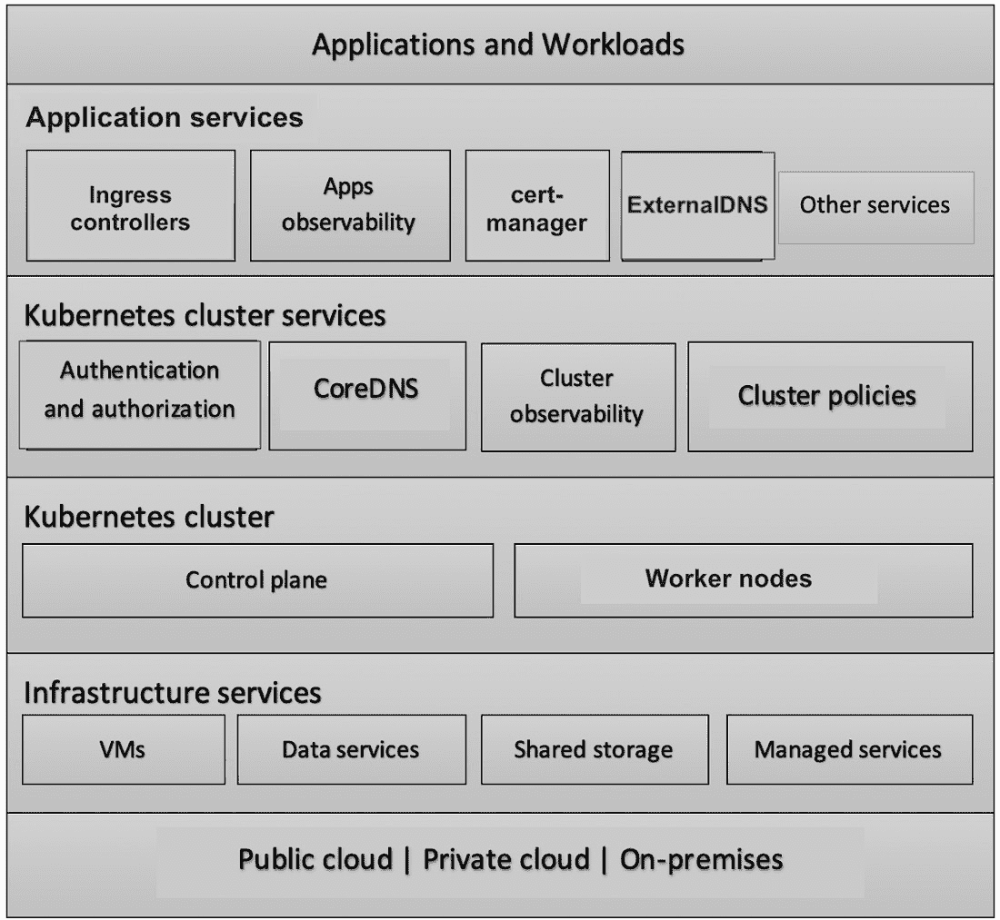
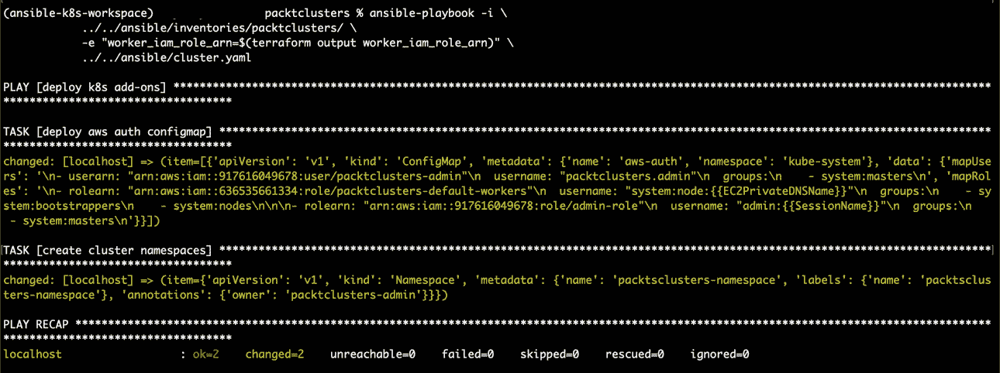
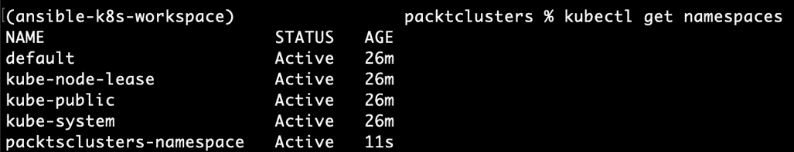

# 第四章：*第四章*：使用 Ansible 管理集群配置

在*第三章*，*使用 AWS 和 Terraform 部署 Kubernetes 集群*中，你学习了如何使用 Terraform 和 AWS 创建 Kubernetes 基础设施，并且学会了如何开发基础设施即代码，并为你的第一个生产类集群进行了部署。

这只是构建可操作和生产就绪的 Kubernetes 集群的第一步。到目前为止，你应该已经有一个运行中的集群，并且通过 Terraform 基础设施模块来部署其他类似的集群。

这些集群仍然是普通的，它们没有经过配置或优化以运行生产工作负载。为了让这些集群完全可用，我们只需要部署和配置所需的 Kubernetes 服务。

在本章中，你将设计并开发一个配置管理解决方案，用于管理 Kubernetes 集群及其支持服务的配置。该解决方案是自动化和可扩展的，且需要最小的维护和操作工作量。

本章将涵盖以下主题：

+   了解 Kubernetes 配置管理的挑战

+   为 Kubernetes 设计配置管理解决方案

+   使用 Ansible 开发配置管理解决方案

+   应用该解决方案配置 Kubernetes 集群

# 技术要求

除了你在*第三章*，*使用 AWS 和 Terraform 部署 Kubernetes 集群*中安装的工具外，你还需要安装以下工具：

+   `python3`

+   `pip3`

+   `virtualenv`

我将在下一节中详细讲解这些工具的安装和配置。如果你已经知道如何操作，可以直接开始安装它们。

你需要根据*第三章*，*使用 AWS 和 Terraform 部署 Kubernetes 集群*中的说明，拥有一个运行中的 Kubernetes 集群。

本章的代码位于 [`github.com/PacktPublishing/Kubernetes-in-Production-Best-Practices/tree/master/Chapter04`](https://github.com/PacktPublishing/Kubernetes-in-Production-Best-Practices/tree/master/Chapter04)。

查看以下链接，观看《代码实战》视频：

[`bit.ly/3cGtqjx`](https://bit.ly/3cGtqjx)

# 安装所需工具

`python3`、`pip3`和`virtualenv`是执行我们将在本章中开发的 Ansible 配置剧本的先决条件。如果你的系统上没有这些工具，你可以按照以下说明安装：

+   执行以下命令在 Ubuntu Linux 上安装`python3`、`pip3`和`virtualenv`：

    ```
    $ sudo apt-get update
    $ sudo apt-get install python3
    $ sudo apt-get install python3-pip
    $ sudo pip3 install virtualenv
    ```

+   执行以下命令在 Amazon Linux 2 上安装`python3`、`pip3`和`virtualenv`：

    ```
    $ sudo yum update
    $ sudo yum install python3
    $ sudo python3 -m pip install --upgrade pip
    $ sudo python3 -m pip install virtualenv
    ```

+   执行以下命令在 macOS 上安装`python3`、`pip3`和`virtualenv`：

    ```
    $ brew install python3
    $ curl -O https://bootstrap.pypa.io/get-pip.py
    $ sudo python3 get-pip.py
    $ sudo -H pip3 install virtualenv
    ```

+   执行以下命令以在 Windows 上安装 `python3`、`pip3` 和 `virtualenv`：

    ```
    C:\> choco install python3
    C:\> pip install virtualenv 
    ```

通过安装`python3`、`pip3`和`virtualenv`，你将能够在 Kubernetes 集群上执行 Ansible playbook。你将在本章后续部分学习如何操作，但首先，我们需要了解 Kubernetes 配置管理解决方案的设计细节。

# 实现原则

在*第一章*《Kubernetes 基础设施与生产就绪性介绍》中，你了解了本书中将遵循的基础设施设计原则。我想通过强调那些影响本章配置管理解决方案和技术决策的关键原则来开始这一章：

+   **一切皆代码**：在本章中，我们将坚持将基础设施的一切都作为代码——集群配置也不例外。你将通过使用 Ansible 创建一个 Kubernetes 集群的配置管理解决方案来实现这一目标。

+   **自动化**：在上一章中，我们使用了 Terraform 工具来自动化基础设施的配置。我们围绕 Terraform 设计了解决方案，可以在无需扩展基础设施团队的情况下，支持越来越多的集群。在这里，你将创建一个类似的解决方案来管理 Kubernetes 配置，同时保持其自动化、可扩展性，并易于操作和维护。

+   **简洁性**：Ansible 在许多方面实现了这一原则，因为它容易学习和使用。与其他配置管理工具相比，它的语法简单。它使用 YAML，写它时不需要学习编程语言。此外，它是无代理的，这意味着你不需要服务器来运行它，可以直接从你的计算机运行 Ansible。它还是模块化的，这使得关注点分离和代码重用成为可能，这与 Terraform 相似。因此，它们可以轻松地共存，简化基础设施的自动化。

# Kubernetes 配置管理

Kubernetes 的美在于它的每个部分都被抽象为一个对象，可以通过其 API 服务器使用 YAML 或 JSON 进行声明式管理和配置。这使得 Kubernetes 配置更容易作为代码进行管理。然而，当你有多个集群，且这些集群运行着数百个附加组件和服务时，管理这些配置依然是一个挑战。

假设你正在管理一个公司使用 Kubernetes 的基础设施，并且你有多个集群用于开发、测试和生产。再加上 Kubernetes 服务层运行的集群附加组件，如下图所示：



图 4.1 – Kubernetes 基础设施层次

这意味着你可以拥有*N*个集群，并且随着附加组件数量的增加以及不同环境类型（如开发、QA 和生产）的变化，配置也会越来越复杂。如果我们将这些因素结合起来，就会面临一个复杂且冗余的配置管理问题。

管理集群配置的推荐方式是通过**配置即代码**（**CaC**）。我们将把这些服务和附加组件部署到集群中，并将它们的配置清单添加到源代码控制中。通过采用这种模式，你将能够以无缝和自动化的方式重新部署相同的配置到集群中。当你从单个集群开始时，这种解决方案看起来很简单，但当需要为多个集群提供不同配置值时，它将变得难以维护和扩展。

这促使我们提出了一种增强的解决方案，即配置模板化。假设你有一组集群用于产品 X，这些集群有不同的配置，比如不同的用户认证与授权、命名空间、资源配额等。

这个解决方案使用了 Ansible 模板和 Jinja2。你只需编写一次 Kubernetes 清单的模板，然后 Ansible 会在这些模板中替换变量，为每个目标集群生成相应的清单。这个解决方案具有可扩展性且易于维护，并且满足我们在*第一章*《Kubernetes 基础设施与生产就绪介绍》中提出的基础设施设计原则。

## Kubernetes 配置管理工作流程

在考虑了前述的模板化解决方案后，我们的 Kubernetes 配置管理工作流程如下所示：

1.  为你想要配置和部署的 Kubernetes 集群服务创建 Ansible Jinja2 模板。

1.  定义变量的值，并根据环境和集群组对其进行分类。

1.  使用 Terraform 进行集群的配置。

1.  将 Terraform 输出传递给 Ansible。

1.  将 Ansible 模板中的变量替换为相应的值。

1.  使用 Ansible 将 Kubernetes 清单应用到目标集群。

在接下来的章节中，我们将使用 Ansible 和 Jinja2 模板来实现这个工作流程，然后通过一个基本示例来学习如何使用它。

## 使用 Ansible 进行配置管理

在本章中，我们将使用 Ansible 作为配置管理工具，并围绕它构建我们的 Kubernetes 配置管理解决方案。在本节中，我们将简要讨论选择 Ansible 的理由以及一些 Ansible 的关键概念。如果你想深入了解 Ansible，可以访问其官方指南：[`www.ansible.com/resources/get-started`](https://www.ansible.com/resources/get-started)。

### 为什么选择 Ansible？

当涉及到 Kubernetes 配置模板化时，我们有经过实践验证的工具。最著名的工具是 Ansible 和 Helm，它们各有优缺点。但我这里并不是要做它们的全面对比。我做出选择的依据是曾经在生产环境中使用过这两个工具，以及我们的具体用例。当涉及到纯粹的配置管理和模板化时，Ansible 仍然是最强的竞争者。虽然 Helm 支持模板化，但它更像是一个 Kubernetes 包管理工具，而不是一个完整的配置管理工具。这就是我们决定使用 Ansible 来开发 Kubernetes 基础设施配置管理解决方案的原因。

### 什么是 Ansible？

Ansible 是一款自动化和**配置管理（CM）**工具。它可以配置系统，部署应用和容器，及配置云资源。它能够协调高级任务，如持续部署和滚动更新。

在本书中，我们不会深入探讨 Ansible 的特性和使用案例。我们认为有很多优秀的书籍专门讨论这个主题；我们的主要关注点是如何以简单且高效的方式使用 Ansible 来解决 Kubernetes 的配置管理（CM）问题。

### Ansible 关键概念

本书中我们将实施并使用的配置管理解决方案是基于 Ansible 的关键概念构建的。我不会深入讲解这些概念，而是简要说明它们，并突出我们将如何在配置管理框架中使用它们。

+   **清单（Inventory）**：Ansible 用来将相似的主机分组。通过定义包含主机地址的清单文件来实现这一点。

+   **模块（Modules）**：这是 Ansible 如何抽象并将特定任务分组，以便在你的主机清单上重复使用；模块甚至可以公开，并被其他 Ansible 用户使用。在我们的解决方案中，我们将使用一个现成的 Kubernetes 模块来对集群执行配置清单。

+   **任务（Tasks）**：这是我们指示 Ansible 执行步骤的地方；它可能是安装一款软件或配置一个完整的系统。在我们的解决方案中，我们将为每个 Kubernetes 组件和插件创建一个单独的任务。

+   **剧本（Playbooks）**：这是 Ansible 的构建块。它们用来将所有内容集合在一起，并提供一系列指令，涉及到其他 Ansible 块，如任务、变量和模块。然后它们指示 Ansible 如何配置目标系统，以达到期望的状态。在我们的解决方案中，我们将使用一个剧本来保存所有集群所需的组件和插件的配置任务，并且我们还会使用变量和选择器来允许集群管理员切换特定插件的启用/禁用。

+   **变量**：我们将使用变量来存储每个集群附加组件配置所需的值，并将这些变量分组，代表不同的集群和环境。

+   **模板**：Ansible 使用 Jinja2 模板来启用动态表达式，并使用变量。这使得 Ansible 可以在执行时根据这些模板生成新的配置文件。在我们的解决方案中，我们将 Kubernetes 清单定义为 Ansible Jinja2 模板，在配置执行时，Ansible 将能够根据提供的或预定义的变量为每个集群生成正确的 Kubernetes 清单。

之前的 Ansible 概念对于理解 Ansible 的工作原理至关重要。在接下来的章节中，我们将利用它们开发 CM 解决方案。你将随着章节的推进，学习每个概念及其使用方法。

# 配置集群

现在我们将把前一节中设计的解决方案付诸实践。我们将从开发 Ansible 框架骨架开始，骨架将由以下部分组成：

+   `group_vars`：该目录包含带有变量默认值的清单配置文件，除非集群在其自己的库存中定义了私有变量。

+   `inventories`：该目录包含带有变量值的配置文件，这些配置文件特定于每个集群或集群组，意味着此处定义的变量会覆盖 `groups_vars` 目录下定义的默认变量。

+   `tasks`：在这个目录中，我们为每个集群服务和附加组件定义一个独立的任务，并且任务定义文件在各个任务之间是标准化的，因为我们将使用 Ansible 的 k8s 模块并将 YAML 模板传递给它以在目标集群上进行部署。

+   `templates`：该目录包含我们需要管理的每个 Kubernetes 对象的 Kubernetes 清单 YAML 文件和配置文件，这些模板文件将采用 Jinja2 表达式格式书写所需的变量。

+   `cluster.yaml`：这是传递给 Ansible 以在目标集群上执行的主要 playbook。它包含我们需要调用的所有任务，以配置集群对象和附加组件。该 playbook 还为每个任务添加了标签，这使得集群维护人员可以在需要时为每个目标集群开启/关闭特定任务。

在为 Kubernetes 集群配置管理创建 Ansible 框架骨架后，我们将能够扩展它以处理更多的集群服务和部署。开发工作流如下：

1.  为你想要部署的集群附加组件编写 Kubernetes 清单 YAML 格式的文件，然后将它们部署到测试集群以确保正确性。

1.  将 Kubernetes 清单从 YAML 转换为 Jinja2 模板。

1.  创建一个任务文件来调用这些模板，并将该文件添加到 Ansible `tasks` 目录下。

1.  创建变量值：

    - 对于默认的变量值，在 `group_vars` 目录下，添加你在模板中创建的变量值，并将其写入适当的 YAML 文件。

    - 对于集群特定的变量，在 `inventories` 目录下，创建一个新目录，命名为你要目标的集群或集群组的名称，然后创建它自己的 `group_vars` 目录，并在该目录下创建一个 YAML 文件，用于包含变量值映射。

1.  更新 playbook 文件，并添加步骤以调用目标任务。然后，将适当的标签和属性关联到该任务。

在实际操作中，我们将配置 `aws-auth` 并创建一个 Kubernetes 命名空间，演示该 Ansible 解决方案是如何工作的。在接下来的章节中，我们将使用这个解决方案在 Kubernetes 上部署更多的服务和插件。

## ansible 目录的结构

`ansible` 目录是你的基础设施仓库中所有 Ansible 源代码所在的位置。作为最佳实践，我建议你拥有一个专门的基础设施源代码仓库，里面包含所有基础设施代码和你 Kubernetes 集群及其他基础设施的配置。以下是我们将在本章开发的 Ansible 配置的提议目录结构：

![图 4.2 – Ansible 目录结构]

](img/B16192_04_002.jpg)

图 4.2 – Ansible 目录结构

你将通过详细的学习和实践，了解如何开发此解决方案，以及在 `ansible` 目录下的所有配置代码。

## 创建 Ansible 模板

在本节中，你将创建两个模板，学习如何将 Kubernetes 清单转换为 Ansible Jinja2 格式。

第二个模板是 Kubernetes 命名空间，你将使用它来创建新的命名空间。

### 创建 aws-auth 模板

第一个模板是 `aws-auth` ConfigMap，你将使用它来定义 AWS IAM 用户和角色，并将它们认证到集群。你将在*第六章*中详细了解 `aws-auth` 以及如何在 *有效保护 Kubernetes* 中使用它进行集群访问。

你将为 `aws-auth` ConfigMap 创建一个 Jinja2 模板。但是，在我们开始模板化之前，先看一下默认的 `aws-auth` ConfigMap：

```
apiVersion: v1
kind: ConfigMap
metadata:
  name: aws-auth
  namespace: kube-system
data:
  mapRoles: |
    - rolearn: <ARN of instance role (not instance profile)>
      username: system:node:{{EC2PrivateDNSName}}
      groups:
        - system:bootstrappers
        - system:nodes
```

前面的代码块创建了一个`aws-auth` ConfigMap，并为工作节点 EC2 创建了一个角色。但是，如果我们需要添加更多角色和用户怎么办？如果我们需要将相同的 ConfigMap 用于不同的集群，并且每个集群都需要不同的工作节点 `aws-auth` ConfigMap，该怎么办？

下一个 `aws-auth` 模板的代码块定义了一组特定的用户和角色，这些用户和角色可以访问集群。在代码的第一部分，你需要定义 Kubernetes 的 `apiVersion`，对象类型为 `ConfigMap`，以及元数据：

```
apiVersion: v1
kind: ConfigMap
metadata:
  name: aws-auth
```

在代码的第二部分，你定义了 ConfigMap `data`部分，其中包含了带有 Jinja2 变量的`for`循环，这些变量可以在执行时由 Ansible 替换。你会注意到，我们使用了`for`循环，以便可以添加多个用户：

```
data:
  mapUsers: |

    - userarn: "{{ user.arn }}"
      username: "{{ user.name }}"
      groups:
        - system:masters

```

在代码的第二部分，你定义了另一个 ConfigMap `data`部分，其中包括 IAM 角色。首先，不是将每个用户的数据（姓名、ARN 和 Kubernetes 组）逐个添加，而是将它们定义在一个 Jinja2 的`for`循环中，Jinja2 变量可以在执行时由 Ansible 替换。你会注意到，我们使用了`for`循环，以便可以添加多个角色：

```
  mapRoles: |

    - rolearn: "{{ role }}"
      username:  "system:node:{{ '{{' }}EC2PrivateDNSName{{ '}}' }}" 
      groups:
        - system:bootstrappers
        - system:nodes


    - rolearn: "{{ role }}"
      username:  "admin:{{ '{{' }}SessionName{{ '}}' }}" 
      groups:
        - system:masters

```

之前的模板可以验证 IAM 用户和角色对任何集群的身份，并且你甚至可以根据需要进一步扩展，添加不同的组类型。但原始概念保持不变，你有一个针对任何集群、任何用户和角色都能使用的`aws-auth` ConfigMap 的单一模板。

### 创建 Kubernetes 命名空间模板

下一个代码块是一个 Jinja2 模板，用于生成 Kubernetes 命名空间清单的 YAML 文件。此模板定义了基本的命名空间配置，如名称、标签和注释。

该模板可以创建多个命名空间，因为它从目标集群的 Ansible 变量中读取命名空间列表，并为每一个命名空间生成 Kubernetes 清单 YAML 文件。

```

---
apiVersion: v1
kind: Namespace
metadata:
  name: {{ namespace.name }}
  labels:
    name: {{ namespace.name }}
    owner: {{ namespace.owner }}    

```

之前的模板是一个示例，展示了你如何为 Kubernetes 对象创建自己的模板。我建议在编写这些模板时，访问 Ansible Jinja2 的官方文档，以便获得更多关于代码块及其使用方法的灵感：[`docs.ansible.com/ansible/latest/user_guide/playbooks_templating.html`](https://docs.ansible.com/ansible/latest/user_guide/playbooks_templating.html)。

## 创建 Ansible 变量

正如你在本章前面学到的，Ansible 的`group_vars`将包含你想要应用于所有集群的全局配置变量，除非你希望为特定集群指定不同的值。在这一部分，你将为`aws-auth` ConfigMap 中的管理员用户定义默认变量，并定义一个新的命名空间。

### 定义 aws-auth 变量

以下代码片段定义了集群配置的默认变量，当集群没有自己的私有变量时，将使用这些默认变量。第一个变量是`worker_iam_role_arn`。Ansible 将从 Terraform 的输出中获取`worker_iam_role_arn`的值。第二个变量是集群的管理员。你还添加了被称为`admin`的 ARN 或 IAM 用户：

```
map_roles:
  workers_roles:
    - "{{ worker_iam_role_arn }}"
  system_masters: []
map_users:
  system_masters:
    - arn: "<ARN of the admin user>"
      name: "admin"
```

你可以扩展之前的变量，根据需要为集群添加更多角色和用户。你还将在*第六章*《*有效保护 Kubernetes*》中学习到 Kubernetes 的**基于角色的访问控制**（**RBAC**）和访问管理最佳实践。

重要说明

在 Jinja2 模板中，你需要在双括号 `{{ }}` 中定义变量。请参考 Ansible 模板文档：[`docs.ansible.com/ansible/latest/user_guide/playbooks_templating.html`](https://docs.ansible.com/ansible/latest/user_guide/playbooks_templating.html)。

### 配置默认命名空间

你将把一个命名空间添加到 `namespaces_list` 变量中。不过，你可以根据需要添加更多的命名空间。这是一个展示如何与 Ansible 配合使用命名空间配置的示例：

```
namespaces_list:
- name: default-namespace
  owner: admin
```

在本节中，你应该已经学会了如何为你的集群创建默认配置变量。这是一个简单的配置机制，但非常强大和高效。

## 创建 Ansible 清单

不是所有集群都是相同的。在上一节中，你学习了如何为你的配置设置默认变量。但是，如果你需要为某个集群设置不同的值呢？Ansible 清单就是答案。在这一节中，你将创建清单来定义本地集群变量，以覆盖默认变量。

### 创建 Ansible 清单

Ansible 配置主机（服务器/虚拟机）的方法非常简单。通常，存在一个主机或一组主机，你有配置任务要应用于这些主机。但是我们的解决方案是一个不同的用例，因为我们将使用相同的概念，但不是针对任何远程主机。因为实际上，我们并不配置主机——我们配置的是 Kubernetes 集群。Ansible 只需要与 Kubernetes API 服务器进行通信。

你需要做的就是将 Ansible 的 `hosts` 设置为目标 `localhost`。然后，`localhost` 将使用 `kubeconfig` 中定义的 `kube-server` API 端点来应用预定的配置：

```
[all]
localhost
[override]
localhost
```

如你在前面的代码块中所看到的，Ansible 的目标主机只定义了 `localhost` 值。这个 `hosts` 文件应该为 Ansible 管理的每个清单都存在。

### 覆盖 aws-auth 变量

要覆盖在 `group_vars` 中定义的 `aws-auth` 默认变量，你需要在 `packtclusters` 清单下重新创建 `aws-auth` 模板文件，并为新变量设置相应值。以下代码块展示了如何覆盖 `aws-auth`。定义了两个 IAM 角色：第一个角色为工作节点，第二个角色为集群管理员角色。代码的第二部分定义了一个不同于默认用户的用户：

```
map_roles:
  workers_roles: 
    - "{{ worker_iam_role_arn }}"
  system_masters:
    - "<ARN of the admin-role user>"
map_users:
  system_masters:
    - arn: "arn:aws:iam::AWS_ACCOUNT_NO:user/packtclusters-admin"
      name: "packtclusters-admin"
```

之前的配置模板将替换 `packtclusters` 的默认模板。你可以对任何其他模板执行相同操作。

### 覆盖命名空间变量

要覆盖 `group_vars` 中定义的 `namespaces` 默认变量，你需要在 `packtclusters` 库存中重新创建 `namespaces` 模板文件，并填入新变量的值。在下面的代码块中，有一个新变量，它将用名为 `packtclusters-namespace` 的新值覆盖 `default-namespace`。因此，当你应用此配置时，`packtclusters` 将使用新的命名空间，而不是默认的命名空间：

```
namespaces_list:
- name: packtsclusters-namespace
  owner: packtclusters-admin
```

在这一部分中，你已经学习了如何覆盖 Ansible 的默认变量，以便根据集群使用不同的配置值。

## 创建 Ansible 任务

创建 Ansible 模板后的第二步是创建 Ansible 任务。在这一部分中，你将学习如何创建 Ansible 任务来部署你的配置模板。

这些任务将使用 Ansible 的 k8s 模块。该模块接受模板化的 Kubernetes YAML 文件，然后指示 Ansible 将这些任务应用于目标集群。Ansible 可以通过当前上下文中的 `kubeconfig` 文件识别目标集群。

重要说明

你可以通过官方文档了解更多关于 Ansible 的 k8s 模块：[`docs.ansible.com/ansible/latest/user_guide/modules_intro.html`](https://docs.ansible.com/ansible/latest/user_guide/modules_intro.html)。

### 创建 aws-auth 任务

以下任务指导 Ansible 如何生成并将 `aws-auth` ConfigMap 应用到集群中。它以模板文件的路径作为输入，并将其应用于目标集群。

在下面的代码块中，你定义了任务规格，包含 `name`、`kubeconfig` 路径、`state` 以及是否强制将配置应用到集群等属性。然后，任务定义了要加载哪个 Jinja2 模板，并将其变量替换为来自 `group_vars` 或 `inventory` 目录的值。

如果有多个 Jinja2 模板需要通过 `k8s` 模块应用，你会注意到有一个 `loop` 指令。其他重要参数包括 `retries`，它告诉 Ansible 任务成功之前需要重试的次数，以及 `delay`，它告诉 Ansible 每次重试之间的时间间隔（单位：秒）：

```
# ansible/tasks/auth/aws-auth.yaml
- name: deploy aws auth ConfigMap
  k8s:
    definition: "{{ item }}"
    kubeconfig: "{{ k8s_kubeconfig }}"
    state: "{{ k8s_manifests_state }}"
    force: "{{ k8s_force }}"
  loop: 
    - "{{ lookup('template', k8s_manifests_base_dir + 'auth/aws-auth.yaml') | from_yaml_all | list }}"
  register: k8s_result
  until: k8s_result is success
  retries: 3
  delay: 2
  no_log: "{{ k8s_no_log }}"  
```

上述 `aws-auth` 任务的代码将在稍后本章中学习到的 Ansible 剧本中调用。

### 创建命名空间任务

以下 Ansible 任务文件用于创建集群的命名空间。它接收命名空间对象模板文件的路径，并将其应用到目标集群。

`namespaces` 任务的代码结构与之前的 `aws-auth` 任务非常相似，唯一不同的是它有一个不同的名称，并且它读取一个不同的 Jinja2 模板文件 `namespaces.yaml`：

```
# ansible/tasks/namespaces.yaml
- name: create cluster namespaces
  k8s:
    definition: "{{ item }}"
    kubeconfig: "{{ k8s_kubeconfig }}"
    state: "{{ k8s_manifests_state }}"
    force: "{{ k8s_force }}"
  loop: "{{ lookup('template', k8s_manifests_base_dir + 'namespaces/namespaces.yaml') | from_yaml_all | list }}"
  register: k8s_result
  until: k8s_result is success
  retries: 3
  delay: 2
  no_log: "{{ k8s_no_log }}"
```

上述 `namespaces` 任务的代码将在稍后本章中学习到的 Ansible 剧本中调用。

## 创建集群的剧本

Ansible playbook 是一个 Ansible 文件，你将在其中按顺序放置所有任务，指定 Ansible 执行它们的顺序。以下集群 playbook 是一个简单的标准 Ansible playbook，包含三个部分：第一部分是定义目标主机，第二部分是定义在执行过程中任务使用的任何变量，第三部分是 Ansible 将要执行的任务列表。

以下代码块定义了主机和连接类型。在我们的解决方案中，正如之前所述，我们将使用`localhost`作为目标主机：

```
# ansible/cluster.yaml
---
- name: deploy k8s add-ons
  hosts: localhost
  connection: local
  gather_facts: no
```

以下代码块定义了执行任务过程中所需的变量。最值得注意的是指向`kubeconfig`文件的物理路径和存放 Kubernetes 模板的基础目录。这些变量会覆盖`group_vars`和`inventory`目录中任何具有相似名称的变量：

```
  vars:
    Ansible_python_interpreter: "{{ Ansible_playbook_python }}"
    k8s_kubeconfig: ~/.kube/config
    k8s_manifests_base_dir: templates/
    k8s_manifests_state: present
    k8s_force: false
    k8s_no_log: false
```

以下代码块定义了 Ansible 针对目标集群执行的任务列表。你可以将新任务添加到此列表，并为其分配有意义的标签：

```
  tasks:
  - import_tasks: tasks/aws-auth.yaml
    tags: aws-auth
  - import_tasks: tasks/namespaces.yaml
    tags: namespaces
```

通过完成 playbook、任务及所有配置的开发，你就准备好将所有 Ansible 部分整合在一起，应用 playbook 并让 Ansible 配置你的集群。在下一部分中，你将使用前一章中创建的`packtclusters-prod1`集群来应用 Ansible playbook。

## 应用集群的 Ansible playbook

接下来的指令将部署 Ansible playbook，配置你的集群以达到预期的配置：

1.  初始化 Terraform 状态并通过以下命令选择工作区：

    ```
    $ cd terraform/packtclusters
    $ terraform init
    $ terraform workspace select prod1
    ```

1.  获取并配置目标集群的 localhost `kubeconfig`：

    ```
    $ aws eks --region $(terraform output aws_region) update-kubeconfig --name $(terraform output cluster_full_name)
    ```

1.  使用 Python 的`virtualenv`安装并执行 Ansible：

    ```
    $ virtualenv $HOME/ansible-k8s-workspace
    $ source $HOME/ansible-k8s-workspace/bin/activate
    ```

1.  安装 Ansible 及其先决模块`openshift`、`pyyaml`和`requests`：

    ```
    $ pip install ansible==2.9 openshift pyyaml requests
    ```

1.  执行 Ansible playbook：

    ```
    $ ansible-playbook -i \
    ../../ansible/inventories/packtclusters/ \
    -e "worker_iam_role_arn=$(terraform output worker_iam_role_arn)" \
    ../../ansible/cluster.yaml
    ```

    执行成功后，你将得到以下输出：

    

    图 4.3 – Ansible 执行输出

1.  执行以下`kubectl`命令，确保集群配置已成功应用：

    ```
    packtclusters-namespace:
    ```



图 4.4 – 集群命名空间列表

你按照之前的指示应用了集群的 playbook 和任务。在接下来的章节中，你将学习如何使用相同的配置管理解决方案创建其他任务，以便在集群上部署和配置服务。

# 销毁集群的资源

你可以按照*第三章*《使用 AWS 和 Terraform 部署 Kubernetes 集群》中的*销毁网络和集群基础设施*部分的指示，销毁 Kubernetes 集群及其相关的 AWS 资源。请确保按以下顺序销毁资源：

1.  集群`packtclusters`资源

1.  集群 VPC 资源

1.  Terraform 共享状态资源

在执行完前面的步骤后，所有集群的 AWS 资源应已成功销毁。你仍然可以登录 AWS 网页控制台，仔细检查资源销毁情况，以避免任何不必要的 AWS 费用。

# 总结

在本章中，你学习了 Kubernetes 配置管理的挑战，以及如何扩展你的配置管理解决方案以管理多个集群和环境。我们设计并开发了一个基于 Ansible 的解决方案，并通过实践操作示例部署了这段代码。

我们从为 Kubernetes 对象和附加组件创建 Ansible 模板开始。接着，我们开发了任务和剧本，以顺序执行 Ansible 配置，针对目标集群进行操作。

本章介绍了 Ansible 的基本概念。它向你展示了如何使用基础设施和配置作为代码、自动化和 Ansible 开发的最佳实践。

这为接下来的章节奠定了基础，在这些章节中，你将使用这个配置管理解决方案来配置和部署集群的附加组件和服务，这些附加组件对于实现生产就绪至关重要。

在下一章中，你将学习 Kubernetes 网络和连接性。将涵盖部署和配置 Kubernetes 网络插件、集群 DNS、入口控制器、网络策略和服务网格的最佳实践。

# 进一步阅读

你可以参考以下链接，了解本章中涉及的更多信息：

+   *Ansible 2 配置管理 [视频]*：[`www.packtpub.com/product/ansible-2-for-configuration-management-video/9781838826475`](https://www.packtpub.com/product/ansible-2-for-configuration-management-video/9781838826475)

+   *实用 Ansible 2*：[`www.packtpub.com/product/practical-ansible-2/9781789807462`](https://www.packtpub.com/product/practical-ansible-2/9781789807462)

+   *使用 Ansible 剧本自动化 [视频]*：[`www.packtpub.com/product/automation-with-ansible-playbooks-video/9781800206496`](https://www.packtpub.com/product/automation-with-ansible-playbooks-video/9781800206496)
