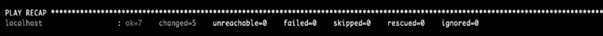
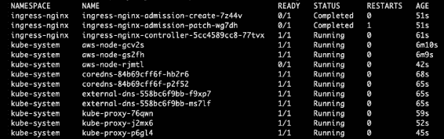

# 第五章：*第五章*：配置和增强 Kubernetes 网络服务

在上一章中，你学习了如何使用 Ansible 为 Kubernetes 开发配置管理解决方案。完成该解决方案后，你现在可以着手构建 Kubernetes 集群的上层，并在其上部署网络服务和附加组件。

本章中，我们将学习如何增强和微调核心的网络服务和附加组件，如 CoreDNS、ExternalDNS 和 Ingress Controller。我们不会深入讲解 Kubernetes 网络的基本概念。诸如 Kubernetes 网络模型、Pod 间通信、Pod 内部通信、集群服务以及基本负载均衡等主题将不在本章覆盖范围内，因为本书更关注如何将集群带到生产就绪状态，而不是深入基础知识，这些内容可以在 Kubernetes 入门书籍中学习。

本章中，我们将重点讲解如何通过重新配置已部署的服务，使集群的网络更加接近生产环境的准备状态，并且部署 Kubernetes 集群中必不可少的其他网络服务。你将学习 Kubernetes 网络最佳实践的特点，并了解如何为 Kubernetes 网络服务创建部署模板，并对其进行微调。

本章中，我们将涵盖以下主题：

+   引入网络生产环境准备性

+   配置 Kube Proxy

+   配置 Amazon CNI 插件

+   配置 CoreDNS

+   配置 ExternalDNS

+   配置 NGINX Ingress Controller

+   部署集群的网络服务

+   销毁集群的资源

# 技术要求

本章的代码位于 [`github.com/PacktPublishing/Kubernetes-in-Production-Best-Practices/tree/master/Chapter05`](https://github.com/PacktPublishing/Kubernetes-in-Production-Best-Practices/tree/master/Chapter05)。

查看以下链接，观看代码演示视频：

[`bit.ly/3rmhLdX`](https://bit.ly/3rmhLdX)

# 引入网络生产环境准备性

自从 Docker 和容器化时代开始以来，处理和管理容器网络一直面临着不同的挑战和复杂性。在过去的几年里，行业领导者和社区贡献者一直在努力寻找解决方案以应对这些挑战，这些努力仍在进行中。

在 Kubernetes 生态系统中，有多种容器网络模型、网络插件和工具，支持主流的用例或特定的边缘用例。你可以在 CNCF 的云原生网络地图中了解更多关于这些项目和工具的信息，链接为 [`landscape.cncf.io/category=cloud-native-network&format=card-mode`](https://landscape.cncf.io/category=cloud-native-network&format=card-mode)。在本章中，我们将专注于那些对一般 Kubernetes 用例至关重要并且具备生产就绪性的服务，例如 CoreDNS、NGINX Ingress Controller 和 ExternalDNS。

在接下来的章节中，您将学习如何增强和配置预先部署的网络组件，这些组件通常是与 AWS **弹性 Kubernetes 服务** (**EKS**) 一起提供的，并且如何改进它们。这是在部署对网络功能、操作和可靠性至关重要的网络服务和附加组件之外的内容。

以下是我们将覆盖的网络服务和附加组件：

+   `kube-proxy`

+   亚马逊 VPC K8s CNI

+   CoreDNS

+   ExternalDNS

+   NGINX Ingress Controller

对于这些组件，我们将使用 Ansible 配置管理方案进行部署和配置，具体步骤如下：

1.  在集群的 Ansible `group_vars` 目录下定义配置变量，目录可在 [`github.com/PacktPublishing/Kubernetes-in-Production-Best-Practices/tree/master/Chapter05/ansible/group_vars/all`](https://github.com/PacktPublishing/Kubernetes-in-Production-Best-Practices/tree/master/Chapter05/ansible/group_vars/all) 找到，以及在 `inventories` 目录下，目录可在 [`github.com/PacktPublishing/Kubernetes-in-Production-Best-Practices/tree/master/Chapter05/ansible/inventories/packtclusters/group_vars/override`](https://github.com/PacktPublishing/Kubernetes-in-Production-Best-Practices/tree/master/Chapter05/ansible/inventories/packtclusters/group_vars/override) 找到

1.  开发部署模板

1.  创建 Ansible 任务

1.  向集群剧本添加条目

如果有些代码和模板的内容没有引入新概念或改变配置，我们不会在本章中包含它们的源代码。相反，您可以在书籍的 GitHub 源代码库中查看它们，链接为 [`github.com/PacktPublishing/Kubernetes-in-Production-Best-Practices/tree/master/Chapter05`](https://github.com/PacktPublishing/Kubernetes-in-Production-Best-Practices/tree/master/Chapter05)。

# 配置 Kube Proxy

`kube-proxy` 是一种代理服务，在集群中的每个节点上运行，负责在节点上创建、更新和删除网络规则，通常通过使用 Linux iptables。这些网络规则允许 Kubernetes 集群内部和外部的 Pod 之间进行通信。

无论是使用自管 Kubernetes 集群还是托管集群，您都需要控制传递给`kube-proxy`的配置选项。由于我们使用的是 EKS，`kube-proxy`已经随集群预部署，这使我们无法完全控制其配置，因此需要对此进行更改。

在集群生命周期中，您需要控制`kube-proxy`的周期性更新，并将它们包含在集群更新的管道中。此外，您还需要通过控制运行时参数来优化其性能，包括`--iptables-sync-period`、`--iptables-min-sync-period`和`--proxy-mode`。

要了解其余的配置选项，请查看以下链接：[`kubernetes.io/docs/reference/command-line-tools-reference/kube-proxy/#options`](https://kubernetes.io/docs/reference/command-line-tools-reference/kube-proxy/#options)。

重要说明

您可以在以下链接找到完整的源代码：[`github.com/PacktPublishing/Kubernetes-in-Production-Best-Practices/blob/master/Chapter05/ansible/templates/kube-proxy/kube-proxy.yaml`](https://github.com/PacktPublishing/Kubernetes-in-Production-Best-Practices/blob/master/Chapter05/ansible/templates/kube-proxy/kube-proxy.yaml)。

现在，让我们为`kube-proxy`创建 Ansible 模板和配置：

1.  定义配置变量并将它们添加到此路径下的`group_vars`目录中：`ansible/group_vars/all/kube-proxy.yaml`。基本配置包含镜像及其标签，这对于跟踪部署到集群中的`kube-proxy`版本以及控制其升级非常有用：

    ```
    kube_proxy:
      image: "602401143452.dkr.ecr.us-west-2.amazonaws.com/eks/kube-proxy"
      tag: "v1.15.11"
    ```

1.  在以下路径下创建`kube-proxy` DaemonSet 的部署模板：`ansible/templates/kube-proxy/kube-proxy.yaml`。

    以下代码片段是该模板的一部分，您需要修改的代码行仅是定义`image`和`command`规格的地方：

    ```
    apiVersion: apps/v1
    kind: DaemonSet
    metadata:
      labels:
        eks.amazonaws.com/component: kube-proxy
        k8s-app: kube-proxy
      name: kube-proxy
      namespace: kube-system
    spec:
      selector:
        matchLabels:
          k8s-app: kube-proxy
      template:
        metadata:
          labels:
            k8s-app: kube-proxy
    ```

    在模板的以下部分中，您可以定义并微调`kube-proxy`的运行时选项，并将它们传递给容器的入口命令：

    ```
        spec:
          containers:
          - command:
            - kube-proxy
            - --v=2
            - --iptables-sync-period=20s
            - --config=/var/lib/kube-proxy-config/config        image: {{ kube_proxy.image }}:{{ kube_proxy.tag }}
    ```

以下是您需要考虑的`kube-proxy`配置选项：

+   `--proxy-mode`：默认情况下，`kube-proxy`使用`iptables`模式，因为它在生产环境中经过加固，且对于小型集群更快。另一方面，如果您有一个扩展集群，服务数量超过 5000，则建议使用`ipvs`模式，因为`ipvs`实现确保了更高的性能。

+   `--kube-api-qps`：此配置选项限制了`kube-proxy`对`kube-apiserver`的请求次数。该选项的默认值为`5`，但如果你预期你的集群会运行超过 5000 个服务，建议将其增加到`10`。然而，`kube-proxy`向`kube-apiserver`发送的 QPS 越高，`kube-apiserver`就会越繁忙，这可能会影响其性能。你应该根据集群的规模（运行的服务数量）和控制平面容量选择合适的 QPS 限制，以确保集群能够及时处理所有`kube-proxy`请求。

+   `--iptables-sync-period`：此选项定义了`iptables`规则刷新的最大时间间隔。默认情况下，设置为`30s`，但对于小型集群，建议将其减少到`20s`。集群管理员需要根据实际情况决定合适的时间间隔，并在不同优先级之间权衡。

    假设你将同步间隔减少到`1s`。这意味着`kube-proxy`需要每`1s`执行一次同步操作，这将增加运行`kube-proxy`的工作节点的负载，同时使得`iptables`处于繁忙状态，并阻塞其他操作。另一方面，如果你增加同步周期并减少同步频率，可能会导致一小段时间内 Pods 与`iptables`不同步，这可能会导致事务丢失。

还有其他选项可以处理`ipvs`、`conntrack`、`config`和`metrics`的配置。然而，修改这些配置时需要小心，如果你决定修改它们，必须先将更改部署到非生产集群中，检查性能，然后再将其推广到生产环境。

要查看完整的`kube-proxy`配置选项，请参阅 Kubernetes 官方文档：[`kubernetes.io/docs/reference/command-line-tools-reference/kube-proxy/`](https://kubernetes.io/docs/reference/command-line-tools-reference/kube-proxy/)。

# 配置 Amazon CNI 插件

在 Kubernetes 中，**容器网络接口**（**CNI**）提供了编写容器网络插件的规范和框架，以管理容器网络，包括 Pod 通信和**IP 地址管理**（**IPAM**）。在本书的上下文中，我们不会深入讨论 CNI 插件及其工作原理。我们关注的是如何充分利用 CNI 插件，以及如何正确配置它。

有多种 CNI 插件经过多年的实践考验。一些插件满足一般用例的需求，例如 Calico，这是一款高度推荐的 CNI 插件，而其他 CNI 插件则倾向于解决特定的用例。

经生产测试的 CNI 插件列表包括 Calico、Cilium、Azure CNI、Contiv、Flannel、Weave Net 和 AWS CNI 等。你可以从 Kubernetes 官方文档中获取支持的 CNI 插件及其特性的完整列表：[`kubernetes.io/docs/concepts/cluster-administration/networking/`](https://kubernetes.io/docs/concepts/cluster-administration/networking/)。

对于本书中我们配置的集群，我们将使用 AWS CNI 插件（**amazon-vpc-cni-k8s**），因为它是 EKS 的默认插件，并且它的开发旨在覆盖通用的网络使用场景，确保 Kubernetes 与 AWS 配合顺畅运行。

AWS CNI 插件已预先部署到集群中，并设置了默认配置。对于简单集群来说，这可能足够了；然而，我们需要对配置进行完全控制，因此我们决定覆盖其 DaemonSet 并将其添加到集群的 Ansible 配置中，以便更方便地管理。

在集群生命周期中，你需要控制对 `amazon-vpc-cni-k8s` 的定期更新，并将其包含在集群更新的管道中。此外，你还需要通过调整传递给它的配置变量来优化其性能，如 `MINIMUM_IP_TARGET`、`WARM_IP_TARGET` 和 `AWS_VPC_ENI_MTU`。

若要了解其他 CNI 配置选项，请查看此链接：[`docs.aws.amazon.com/eks/latest/userguide/cni-env-vars.html`](https://docs.aws.amazon.com/eks/latest/userguide/cni-env-vars.html)。

重要提示

当你将更新后的 `amazon-vpc-cni-k8s` DaemonSet 重新部署到集群时，CNI Pods 会被重启。更新后的 Pods 会依次推出，但这仍然会导致短暂的 CNI 插件不可用，这在集群繁忙时可能会显得明显。

你可以在 [`github.com/PacktPublishing/Kubernetes-in-Production-Best-Practices/blob/master/Chapter05/ansible/templates/cni/amazon-k8s-cni.yaml`](https://github.com/PacktPublishing/Kubernetes-in-Production-Best-Practices/blob/master/Chapter05/ansible/templates/cni/amazon-k8s-cni.yaml) 找到完整的源代码。

现在，让我们为 `amazon-vpc-cni-k8s` 创建 Ansible 模板和配置：

1.  定义配置变量并将其添加到以下路径的 `group_vars` 目录中：`ansible/group_vars/all/cni.yaml`。基本配置包含镜像及其标签，这对于跟踪已部署到集群中的 `amazon-vpc-cni-k8s` 版本并控制其升级非常有用。

    集群性能有两个重要的配置值：

    - `MINIMUM_IP_TARGET`，它对预扩展非常重要，因为它指定了在节点上为 Pod 分配的最小 IP 地址数量

    - `WARM_IP_TARGET`，它对动态扩展非常重要，因为它指定了 `ipamD` 守护进程应尝试保持可用的空闲 IP 地址数量，以供节点上 Pod 分配。

    这两个变量一起确保为新 Pods 提供足够的 IP 地址，从而改善 Pods 的启动时间，并提高集群的正常运行时间和恢复时间。您可以根据集群中运行的 Pods 预估数量以及高峰时段的数量来指定这些变量的值：

    ```
    cni_warm_ip_target: 2
    cni_min_ip_target: 10
    aws_cni:
      image: "602401143452.dkr.ecr.us-west-2.amazonaws.com/amazon-k8s-cni"
      tag: "v1.6.2"
    ```

1.  在此路径下创建 `amazon-vpc-cni-k8s` DaemonSet 的部署模板：`ansible/templates/cni/amazon-k8s-cni.yaml`。

    以下代码片段是此模板的一部分，您需要修改的唯一代码行是定义 `image` 和 `env` 规格的地方：

    ```
    ---
          containers:
            - image: {{ aws_cni.image }}:{{ aws_cni.tag }}
              imagePullPolicy: Always 
              env:
                - name: AWS_VPC_K8S_CNI_LOGLEVEL
                  value: DEBUG
                - name: AWS_VPC_K8S_CNI_VETHPREFIX
                  value: eni
                - name: AWS_VPC_ENI_MTU
                  value: "9001"
                - name: MINIMUM_IP_TARGET
                  value: "{{ cni_min_ip_target }}"
                - name: WARM_IP_TARGET
                  value: "{{ cni_warm_ip_target }}"
                - name: MY_NODE_NAME
                  valueFrom:
                    fieldRef:
                      fieldPath: spec.nodeName
    ```

您可以通过将其他选项添加到容器环境变量中来配置 `amazon-vpc-cni-k8s`，就像在 DaemonSet 模板中为容器部分编写的代码片段一样。

# 配置 CoreDNS

Kubernetes 曾使用 `kube-dns` 作为默认的集群 DNS 服务，但从版本 1.11 开始，它改用了 CoreDNS。此外，大多数托管的 Kubernetes 服务，包括我们在本书中使用的 EKS，都会预先部署 CoreDNS。

对于其他仍然使用 `kube-dns` 的 Kubernetes 托管服务，例如 GKE，我们建议参考 `kube-dns` 的官方文档。

CoreDNS 非常灵活，因为它是模块化和可插拔的。它拥有丰富的插件集，可以启用以增强 DNS 功能。这也是它强大且通常优于 `kube-dns` 和其他 Kubernetes DNS 解决方案的原因。要了解更多支持的插件，请参阅以下列表：[`coredns.io/plugins/`](https://coredns.io/plugins/)。

在集群生命周期中，您需要将 CoreDNS 配置作为代码进行管理，并定期更新，并将所有这些内容包含在集群的部署流水线中。同时，您还需要优化集群的 DNS 性能，并通过启用 CoreDNS 插件来添加额外的 DNS 功能。

推荐调整 CoreDNS 的资源配额（如 CPU 和内存）以提高集群 DNS 的性能，尤其是在集群大规模扩展的情况下。有关详细的资源配置和扩展，请查看此链接：[`github.com/coredns/deployment/blob/master/kubernetes/Scaling_CoreDNS.md#`](https://github.com/coredns/deployment/blob/master/kubernetes/Scaling_CoreDNS.md#)。

重要提示

您可以在 [`github.com/PacktPublishing/Kubernetes-in-Production-Best-Practices/blob/master/Chapter05/ansible/templates/core-dns/core-dns.yaml`](https://github.com/PacktPublishing/Kubernetes-in-Production-Best-Practices/blob/master/Chapter05/ansible/templates/core-dns/core-dns.yaml) 查找本节的完整源代码。

现在，让我们为 `coredns` 创建 Ansible 模板和配置：

1.  定义配置变量并将其添加到此路径中的`group_vars`目录：`ansible/group_vars/all/core-dns.yaml`。基础配置包含镜像及其标签，这对于跟踪部署到集群的 CoreDNS 版本并控制其升级非常有用。

    集群 DNS 的默认 IP 通常是`172.20.0.10`，除非你决定更改它。你可以通过设置副本数来指定整个集群中的 CoreDNS Pod 数量：

    ```
    core_dns_replicas: 2
    dns_cluster_ip: 172.20.0.10
    core_dns:
      image: "602401143452.dkr.ecr.us-east-1.amazonaws.com/eks/coredns"
      tag: "v1.6.6"
    ```

1.  在此路径中创建 CoreDNS Pods 的部署模板：`ansible/templates/core-dns/core-dns.yaml`。

    以下代码片段是此模板的一部分，模板中值得注意的配置是 CoreDNS 副本的数量和 Docker 镜像：

    ```
    ---
    apiVersion: apps/v1
    kind: Deployment
    metadata:
      name: coredns
      namespace: kube-system
      labels:
        k8s-app: kube-dns
        kubernetes.io/name: "CoreDNS"
        eks.amazonaws.com/component: coredns
    spec:
      replicas: {{ core_dns_replicas }}
    ```

    在以下代码片段中，你配置了 CoreDNS 镜像和标签：

    ```
    containers:
    - name: coredns
      image: {{ core_dns.image }}:{{ core_dns.tag }}
    ```

1.  在以下代码片段中，你指定了`ConfigMap` CoreDNS，在其中你可以修改`Corefile`以启用额外的插件并微调其配置：

    ```
    ---
    apiVersion: v1
    kind: ConfigMap
    metadata:
      name: coredns
      namespace: kube-system
      labels:
        eks.amazonaws.com/component: coredns
        k8s-app: kube-dns
    data:
      Corefile: |
        .:53 {
            errors
            health
            ready
            kubernetes cluster.local {
              pods insecure
              upstream
              fallthrough in-addr.arpa ip6.arpa
            }
            prometheus :9153
            forward . /etc/resolv.conf
            cache 300
            loop
            reload
            loadbalance
            autopath @kubernetes
        }
    ```

在前面的`ConfigMap`代码中，我们添加了额外的插件，这些插件有助于提高集群的 DNS 性能，如下所示：

+   `ready`：当所有能够信号就绪的插件完成时，端口`8181`上的 HTTP 端点将返回`200 OK`。

+   `loop`：此插件会在检测到转发循环时停止 CoreDNS 进程。

+   `reload`：此插件会在`Corefile`发生变化时自动重新加载。

+   `loadbalance`：此插件会随机排列 DNS 记录的顺序，并作为一个轮询 DNS 负载均衡器。

+   `autopath @kubernetes`：此插件会跟随搜索路径元素链，并返回第一个不是`NXDOMAIN`的回复。

+   `cache`：此插件启用前端缓存。默认情况下启用；然而，默认的缓存持续时间为`30`秒，我们建议将此值增加到`300`秒，以便在大规模集群中获得更好的性能。

我鼓励你使用前面提到的 CoreDNS 插件，还可以查看`plugins`目录，里面可能有其他有趣且有用的插件，能解决特定问题或为你的应用提供更多选项，链接：[`coredns.io/manual/plugins/`](https://coredns.io/manual/plugins/)。

# 配置 ExternalDNS

虽然 CoreDNS 充当 Kubernetes 集群的内部 DNS 服务器，但 ExternalDNS 是一个 Kubernetes 附加组件，用于管理集群的外部 DNS 提供商，包括 Route 53、AzureDNS 和 Google Cloud DNS。

它使 Kubernetes 部署和服务能够通过公共 DNS 服务（如 Route 53）进行发现。它查询 Kubernetes API 以检索服务和入口的列表，然后与公共 DNS 通信并注册这些记录。

ExternalDNS 允许你通过 Kubernetes 服务和入口动态地控制 DNS 记录（通过云 DNS 服务，如 AWS Route 53 或 Google Cloud DNS）。

ExternalDNS 并没有预安装在集群中，因此你需要部署它并指定其配置，包括其 Docker 镜像、要运行的副本数量、DNS 记录同步和间隔更新、云提供商类型（例如 AWS、Azure 等）以及托管区域 ID（以 AWS Route 53 为例）。

重要提示

你可以在 [`github.com/PacktPublishing/Kubernetes-in-Production-Best-Practices/blob/master/Chapter05/ansible/templates/external-dns/external-dns.yaml`](https://github.com/PacktPublishing/Kubernetes-in-Production-Best-Practices/blob/master/Chapter05/ansible/templates/external-dns/external-dns.yaml) 找到完整的源代码。

现在，让我们为 ExternalDNS 创建 Ansible 模板和配置：

1.  定义配置变量，并将其添加到此路径中的 `group_vars` 目录：`ansible/group_vars/all/external-dns.yaml`。基本配置包含镜像及其标签，便于跟踪已部署到集群的 ExternalDNS 版本，并控制其升级。

    此外，你还需要为其他配置变量指定值，包括 `log_level`、`provider`、`aws_zone_type`、`interval`、`route53_zone_type` 和 `external_dns_replicas`：

    ```
    log_level: error
    provider: aws
    aws_zone_type: private
    interval: 1m
    route53_zone_id: Z09817802WZ9HZYSUI2RE
    external_dns_replicas: 2
    external_dns:
      image: "registry.opensource.zalan.do/teapot/external-dns"
      tag: "v0.5.9"
    ```

1.  在以下路径创建 ExternalDNS Pod 的部署模板：`ansible/templates/external-dns/external-dns.yaml`。

    在以下模板的代码片段中，你可以配置 ExternalDNS 的副本数量：

    ```
    ---
    apiVersion: apps/v1
    kind: Deployment
    metadata:
      name: external-dns
      namespace: kube-system
    spec:
      replicas: {{ external_dns_replicas }}
    ```

1.  然后，你配置 ExternalDNS 镜像和标签，除了 ExternalDNS 的运行时配置变量，包括 `log-level`、`source`、`provider`、`aws-zone-id`、`interval`、`registry` 和 `txt-owner-id`：

    ```
        spec:
          serviceAccountName: external-dns
          containers:
          - name: external-dns
            image: {{ external_dns.image }}:{{ external_dns.tag }}
            args:
            - --log-level={{ log_level }}
            - --source=service
            - --source=ingress
            - --provider={{ provider }}
            - --aws-zone-type={{ aws_zone_type }}
            - --interval={{ interval }}
            - --registry=txt
            - --txt-owner-id={{ route53_zone_id }}-{{ cluster_name }}
    ```

1.  为了使 ExternalDNS 正常运行，它需要访问 Route 53 的 DNS 资源。这就是为什么你需要创建以下 IAM 策略，以允许 ExternalDNS 列出托管的区域、列出 DNS 记录集并修改 DNS 记录：

    ```
    resource "aws_iam_policy" "external_dns_policy" {
      name        = "${var.cluster_full_name}-ExternalDNSPolicy"
      path        = "/"
      description = "Allows workers nodes to use route53 resources"
      policy = <<EOF
    {
     "Version": "2012-10-17",
     "Statement": [
       {
         "Effect": "Allow",
         "Action": [
           "route53:ChangeResourceRecordSets"
         ],
         "Resource": ["*"]
       },
       {
         "Effect": "Allow",
         "Action": [
           "route53:ListHostedZones",
           "route53:ListResourceRecordSets"
         ],
         "Resource": ["*"]
       }
     ]
    }
    EOF
    }
    ```

    如果你没有创建上述 IAM 策略并将其附加到工作节点或 Pod 上，则 ExternalDNS 将无法正常运行。

ExternalDNS 可以配置为使用大多数 DNS 提供商，包括 AzureDNS、Google Cloud DNS、CloudFlare 和 DNSimple。

要获取更多关于如何将 ExternalDNS 与你的 DNS 提供商以及 Kubernetes 部署一起使用的详细信息和代码示例，请查看官方文档：[`github.com/kubernetes-sigs/external-dns`](https://github.com/kubernetes-sigs/external-dns)。

# 配置 NGINX Ingress Controller

有三种主要方式可以将 Kubernetes 服务暴露到外部：NodePort、负载均衡器和 Ingress。本节将重点讨论 Ingress，因为它满足了大多数工作负载和 Kubernetes 集群中部署的需求。

Ingress 暴露 TCP/IP L7 服务（如 HTTP/HTTPS），并将来自集群外部的流量路由到集群内的服务。Ingress 通过为每个 Ingress 资源定义的一组规则和/或所有 Ingress 资源的全局配置来控制流量路由。

Ingress 可以控制许多配置，包括为服务提供外部 URL、SSL/TLS 终止、会话有效性和基于名称的虚拟主机。Ingress 控制器是负责履行 Ingress 的 Kubernetes 资源。

最受欢迎且经过充分测试的 Ingress 是 NGINX Ingress Controller。它是一个 Kubernetes 的 Ingress 控制器，使用 NGINX 作为反向代理和负载均衡器。

NGINX Ingress Controller 并未预装在集群中，因此您需要在集群上部署并配置它，包括其 Docker 镜像、运行的副本数量、运行时参数以及服务和云负载均衡器规格。

重要说明

您可以在[`github.com/PacktPublishing/Kubernetes-in-Production-Best-Practices/blob/master/Chapter05/ansible/templates/ingress-nginx/ingress-nginx.yaml`](https://github.com/PacktPublishing/Kubernetes-in-Production-Best-Practices/blob/master/Chapter05/ansible/templates/ingress-nginx/ingress-nginx.yaml)找到完整的源代码。

现在，让我们创建`ingress-nginx`的 Ansible 模板和配置：

1.  创建配置变量并将其添加到此路径中的`group_vars`目录：`ansible/group_vars/all/ingress-nginx.yaml`。基本配置包含`nginx-ingress-controller`及其 webhook 的镜像。这对于跟踪部署到集群中的`ingress-nginx`版本以及控制其升级非常有用：

    ```
    nginx_ingress_controller:
      image: "quay.io/kubernetes-ingress-controller/nginx-ingress-controller"
      tag: "0.32.0"
    nginx_ingress_webhook_certgen:
      image: "jettech/kube-webhook-certgen"
      tag: "v1.2.0"
    ```

1.  在此路径下创建`ingress-nginx`部署的模板：`ansible/templates/ingress-nginx/ingress-nginx.yaml`：

    ```
    ---
    apiVersion: apps/v1
    kind: Deployment
    ```

1.  在下面的代码片段中，部署从`ingress-nginx` `group_vars`目录获取容器镜像的值：

    ```
        spec:
          dnsPolicy: ClusterFirst
          containers:
            - name: controller
              image: {{ nginx_ingress_controller.image }}:{{ nginx_ingress_controller.tag }}
    ```

1.  在下面的代码片段中，您创建一个`ConfigMap`来配置`nginx-ingress`：

    ```
    ---
    apiVersion: v1
    kind: ConfigMap
    metadata:
      labels:
        app.kubernetes.io/name: ingress-nginx
        app.kubernetes.io/instance: ingress-nginx
        app.kubernetes.io/component: controller
      name: ingress-nginx-controller
      namespace: ingress-nginx
    data:
    ```

1.  在下面的代码片段中，您创建了用于将`nginx-ingress`控制器暴露给公网的服务。这是通过配置 AWS `nginx-ingress`服务来实现的：

    ```
    ---
    apiVersion: v1
    kind: Service
    metadata:
      annotations:
        service.beta.kubernetes.io/aws-load-balancer-backend-protocol: tcp
        service.beta.kubernetes.io/aws-load-balancer-connection-idle-timeout: '60'
        service.beta.kubernetes.io/aws-load-balancer-cross-zone-load-balancing-enabled: 'true'
        service.beta.kubernetes.io/aws-load-balancer-type: nlb
      labels:
        app.kubernetes.io/name: ingress-nginx
        app.kubernetes.io/instance: ingress-nginx
        app.kubernetes.io/component: controller
      name: ingress-nginx-controller
      namespace: ingress-nginx
    spec:
      type: LoadBalancer
      externalTrafficPolicy: Local
    ```

完成使用 Ansible 模板创建网络服务和附加组件后，您准备好部署它们并将 Ansible 剧本应用到您的集群。在接下来的部分中，您将使用在上一章中创建的`packtclusters-prod1`集群来应用所有这些更改。

# 部署集群的网络服务

以下指令将部署 Ansible 剧本并使用网络服务和附加组件配置来配置您的集群：

1.  通过运行以下命令初始化 Terraform 状态并选择工作区：

    ```
    $ cd terraform/packtclusters
    $ terraform init
    $ terraform workspace select prod1
    ```

1.  执行 Terraform 以应用本章中添加的基础设施——IAM 策略和 ExternalDNS 的策略附加：

    ```
    $ terraform apply -auto-approve
    ```

    然后你应该会看到以下输出：

    ```
    Apply complete! Resources: 2 added, 0 changed, 0 destroyed.
    Releasing state lock. This may take a few moments...
    ```

1.  获取并配置目标集群的 `kubeconfig`：

    ```
    $ aws eks --region $(terraform output aws_region) update-kubeconfig --name $(terraform output cluster_full_name)
    ```

1.  创建 `virtualenv` 来安装和执行 Ansible：

    ```
    $ virtualenv $HOME/Ansible-k8s-workspace
    $ source $HOME/Ansible-k8s-workspace/bin/activate
    ```

1.  安装 Ansible 以及所需的模块 `openshift`、`pyyaml` 和 `requests`：

    ```
    $ pip install Ansible==2.8.10 openshift pyyaml requests
    ```

1.  执行 Ansible playbook：

    ```
    $ Ansible-playbook -i \
    ../../Ansible/inventories/packtclusters/ \
    -e "worker_iam_role_arn=$(terraform output worker_iam_role_arn)" \
    ../../Ansible/cluster.yaml
    ```

1.  执行 Ansible 成功后，你将看到以下输出：

    图 5.1 – Ansible 执行输出

1.  执行以下 `kubectl` 命令以获取集群中运行的所有 Pod。这允许你验证集群配置是否已成功应用：

    ```
    $ kubectl get pods --all-namespaces
    ```

    你应该会看到以下输出，列出了集群中运行的所有 Pod，包括网络附加组件的新 Pod：



图 5.2 – 所有 Pod 的列表

现在，你已经完成了按照前述指示应用集群配置的工作，并且集群已经部署并配置了所有网络服务和附加组件，准备好承担生产工作负载。

# 销毁集群资源

首先，你应该删除 `ingress-nginx` 服务，指示 AWS 销毁与入口控制器相关联的 NLB。此步骤是必需的，因为 terraform 将无法销毁此 NLB，因为它是由 Kubernetes 创建的：

```
$ kubectl -n nginx-ingress delete svc nginx-ingress
```

然后，你可以按照*第三章*《构建和配置 Kubernetes 集群》一节中的剩余说明，销毁 Kubernetes 集群和所有相关的 AWS 资源。请确保资源按照以下顺序被销毁：

1.  Kubernetes 集群 `packtclusters` 资源

1.  集群 VPC 资源

1.  Terraform 共享状态资源

执行前述步骤后，所有 Kubernetes 和 AWS 基础设施资源应该已被销毁并清理干净，为下一章的实操练习做准备。

# 总结

在本章中，你了解了 Kubernetes 网络组件和服务，这些组件和服务使集群能够投入生产环境。你使用 Ansible 开发了这些服务的模板和配置代码。

尽管这些组件中的一些是随 AWS EKS 一起预部署的，但你仍然需要对它们的配置进行微调，以满足集群在扩展性、可用性、安全性和性能方面的要求。你还部署了额外的附加组件和服务，包括 ExternalDNS 和 NGINX Ingress Controller，它们对于 Kubernetes 的网络需求至关重要。

通过使用我们在前一章中介绍的 Ansible 配置管理解决方案，编写这些服务的 Kubernetes 清单变得简单、可扩展且易于维护。我们遵循相同的框架和步骤来配置每个服务，这一过程会重复应用于本书中您将开发的所有服务和附加配置。

本章介绍了 Kubernetes 集群的网络生产就绪性，但还有相关主题将在后续章节中涉及，包括网络安全、网络策略、服务网格和网络服务可观察性。

在下一章，您将详细了解 Kubernetes 安全；包括安全最佳实践、工具、附加组件和配置，这些是您在生产级集群中部署和优化所必需的。

# 进一步阅读

您可以参考以下链接，了解本章涵盖的更多信息：

+   *Kubernetes 入门 – 第三版* （*第三章*，*与网络、负载均衡器和 Ingress 的工作*）：[`www.packtpub.com/virtualization-and-cloud/getting-started-kubernetes-third-edition`](https://www.packtpub.com/virtualization-and-cloud/getting-started-kubernetes-third-edition)

+   *Kubernetes 精通 – 第二版* （*第十章*，*高级 Kubernetes 网络*）：[`www.packtpub.com/application-development/mastering-kubernetes-second-edition`](https://www.packtpub.com/application-development/mastering-kubernetes-second-edition)

+   Hands-On Kubernetes 网络 [视频]：[`www.packtpub.com/virtualization-and-cloud/hands-kubernetes-networking-video`](https://www.packtpub.com/virtualization-and-cloud/hands-kubernetes-networking-video)
