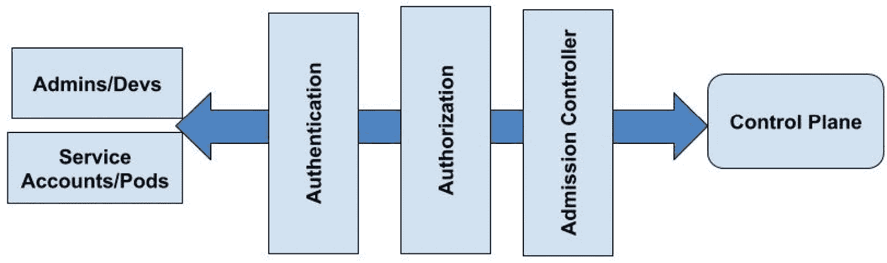
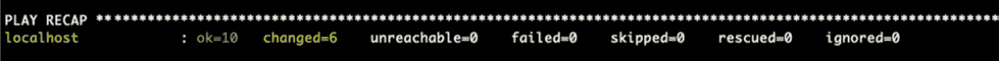
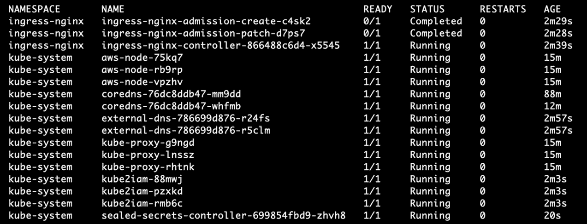

# 第六章：*第六章*：有效地保护 Kubernetes

在之前的章节中，你学习了如何设计和配置 Kubernetes 集群的基础设施，微调它们的配置，并在集群上部署额外的插件和服务，例如网络、安全、监控和扩展。

在本章中，你将学习 Kubernetes 安全的不同方面，重点是使集群具备生产级别的安全性。我们将采取端到端的安全方法，涵盖每个生产集群应具备的所有重要领域。我们将了解如何通过微调集群及其基础设施的安全配置、部署新的安全插件和工具，最终确保集群的安全合规性以及遵循安全标准和检查，从而使集群的安全性更加接近生产准备状态。

在本章中，我们将涵盖以下主题：

+   保护 Kubernetes 基础设施

+   管理集群访问

+   管理密钥和证书

+   保护工作负载和应用程序

+   确保集群安全和合规性

+   额外的安全提示

+   部署安全配置

+   销毁集群

# 技术要求

你应该已经在之前的章节中安装了以下工具：

+   AWS CLI V2

+   AWS IAM Authenticator

+   `kubectl`

+   Terraform

+   Python3

+   PIP 3

+   virtualenv

+   你需要有一个正在运行的 Kubernetes 集群

本章的代码可以在[`github.com/PacktPublishing/Kubernetes-in-Production-Best-Practices/tree/master/Chapter06`](https://github.com/PacktPublishing/Kubernetes-in-Production-Best-Practices/tree/master/Chapter06)获取。

查看以下链接，观看《代码实践》视频：

[`bit.ly/2MBwZNk`](https://bit.ly/2MBwZNk)

# 保护 Kubernetes 基础设施

在*第二章*，*构建生产级 Kubernetes 基础设施* 中，我们讨论了 Kubernetes 集群网络基础设施的最佳实践，并提出了对集群基础设施安全至关重要的设计指南。虽然这些指南对于你考虑和遵循非常重要，但你仍然需要评估整个网络安全需求，以确保你为你的环境和产品提供了完整且适当的安全解决方案。

这些安全建议和最佳实践大多已经在我们之前章节中使用的 Terraform 和 Ansible 配置中实现：

+   使用多个可用区（三个或更多）来部署你的 Kubernetes 集群，以确保高可用性。

+   仅在私有子网中部署控制平面和工作节点。将公共子网用于面向互联网的负载均衡器。

+   不允许公共访问工作节点。通过负载均衡器或入口控制器对外暴露服务，而不是通过节点端口。

+   在 API 服务器与其他控制平面组件或工作节点之间传输的所有流量都应通过 TLS 进行加密。

+   限制对 Kubernetes API 端点的网络访问。

+   阻止对 `kubelet` 的访问。

+   使用安全组来阻止对工作节点和控制平面端口的访问，除非是安全端口。

+   禁用对工作节点的 SSH 访问。您可以使用 AWS Systems Manager Session Manager 来代替运行 SSHD 连接到节点。

+   限制对 EC2 实例配置文件凭证的访问。默认情况下，Pod 中的容器使用与节点实例配置文件关联的相同 IAM 权限。这被认为是一种不安全的行为，因为它赋予容器对节点和底层 AWS 服务的完全控制。为了避免这种行为，您必须通过在节点内执行以下 `iptables` 命令来禁用 Pod 对节点实例配置文件的访问：

    ```
    kube2iam add-on. It manages the pod's IAM access, and it will block the containers from accessing the instance profile credentials. You will learn about kube2iam in detail later in this chapter.
    ```

+   由于我们使用的是 EKS，强烈建议使用常规的 `kubelet` 代理。避免使用 EKS 节点组的另一个原因是它强制要求工作节点附加公共 IP，这可能带来安全威胁。

上述列表涵盖了 Kubernetes 集群生产基础设施安全的基本指南。所有这些指南都通过集群配置和管理来涵盖，我们在前几章中实现了这些内容。值得一提的是，您的集群基础设施可能有额外的安全要求，您应在基础设施设计和部署过程中加以考虑。

# 管理集群访问

集群用户的请求，无论是人类用户还是服务账户，都需要通过认证和授权阶段，然后才能到达 API 服务器并操作所需的 Kubernetes 对象。一个典型的请求需要经过三个访问阶段，才能决定是否被允许或拒绝：



图 6.1 – Kubernetes 访问阶段

请求必须通过认证阶段，使用 Kubernetes 支持的任一机制验证客户端身份，然后通过授权阶段验证该用户允许执行的操作，最后通过准入控制阶段决定是否需要进行任何修改。您将在以下子章节中了解这些过程。

## 集群认证

Kubernetes 集群用户需要成功认证才能访问集群对象。然而，普通的集群用户，如开发人员和管理员，不应由 Kubernetes 管理，而应由集群外部的外部服务进行管理，如 **轻量级目录访问协议** (**LDAP**)、**OpenID Connect** (**OIDC**)、AWS **身份与访问管理** (**IAM**)，甚至是一个包含用户和密码对的文件。另一方面，服务账户由 Kubernetes 管理，您可以使用 Kubernetes API 调用来添加或删除它们。

作为集群所有者，您需要决定如何管理集群的普通用户，换句话说，选择使用哪个外部服务进行认证。对于生产集群的用户认证，我们建议使用 AWS IAM 作为认证服务。但也可以使用 OIDC 身份提供者，如 Azure Active Directory 或 GitHub。

值得一提的是，Kubernetes 针对不同的认证方式（如客户端 TLS 证书、密码和令牌）有不同的认证模块。集群管理员可以在集群配置过程中配置其中的一部分或全部。

### 使用 AWS IAM 进行用户认证

EKS 支持 webhook 令牌认证和服务账户令牌。Webhook 认证验证承载令牌。这些承载令牌由 `aws-iam-authenticator` 客户端在执行 `kubectl` 命令时生成。然后，令牌会传递到 `kube-apiserver`，在转发到认证 webhook 之前，认证 webhook 返回用户的账户和 ARN 给 `kube-apiserver`。

一旦用户的身份通过 AWS IAM 服务认证，`kube-apiserver` 会读取 `kube-system` 命名空间中的 `aws-auth` ConfigMap，以确定 `aws-auth` ConfigMap 用于在 IAM 用户、角色和 Kubernetes RBAC 组之间创建映射，以便进行授权。这些 RBAC 组可以在 Kubernetes ClusterRoleBindings 或 RoleBindings 中引用。

我们已经在*第四章*《使用 Ansible 管理集群配置》中了解了如何创建自定义的 `aws-auth` ConfigMap，在该章节中，我们可以添加用户可以承担的 IAM 用户和 IAM 角色，以访问集群。请在此查看 `aws-auth` ConfigMap 的完整配置代码：[`github.com/PacktPublishing/Kubernetes-in-Production-Best-Practices/blob/master/Chapter06/ansible/templates/auth/aws-auth.yaml`](https://github.com/PacktPublishing/Kubernetes-in-Production-Best-Practices/blob/master/Chapter06/ansible/templates/auth/aws-auth.yaml)。

我们建议使用 IAM 角色来管理生产集群的访问权限，您可以将这些 IAM 角色分配给 IAM 组和用户，这使得 Kubernetes 认证更易于操作和扩展。

### 修改 EKS 集群创建者

值得注意的是，EKS 会授予创建集群的 IAM 用户或 IAM 角色对集群 Kubernetes API 服务的永久管理员认证。AWS 并未提供任何方式来更改此设置或将其转移到不同的 IAM 用户或角色。为了尽量减少这一限制的安全隐患，我们建议采取以下措施：

1.  使用专门的临时 IAM 角色来配置每个新的集群。

1.  配置完集群后，删除此角色的所有 IAM 权限。

1.  更新 `kube-system` 命名空间中的 `aws-auth` ConfigMap，添加更多的 IAM 用户和角色，以便能够管理和使用集群。

1.  根据需要将这些组作为`RoleBindings`和`ClusterRoleBindings`的主体，添加到集群的 RBAC 中。

你已经在*第四章*，*使用 Ansible 管理集群配置*中学到了如何在 Ansible 集群配置中处理这一缺陷，我们创建了自定义的`aws-auth` ConfigMap 和`ClusterRoleBindings`。

## 集群授权

集群访问的第二个阶段是授权。这决定了请求的操作是否被允许。为了使 Kubernetes 授权请求，它考虑三个输入；首先是发起请求的用户，然后是请求的操作，最后是操作将修改的 Kubernetes 资源，如 pods 和服务。

当你创建集群时，你通过将其值传递给 API 服务器来配置授权模式。然而，在 EKS 中，所有授权模式（RBAC、基于属性的访问控制和 Webhooks）默认启用，Kubernetes 将检查它们以授权请求。

## 审批控制器

集群访问的最终阶段是通过审批控制器。在此步骤中，请求根据审批控制器定义的规则和请求的对象进行验证。还有另一种类型的审批控制器，称为变更控制器（mutating controller），它可以修改请求，例如注入 side car 容器或在将请求发送到`kube-api-server`之前修改 pod 规格。

审批控制器是一种强大的授权机制，可以通过集群用户或第三方进行扩展，以在集群用户上执行特殊的验证和规则。

# 管理机密和证书

机密和 TLS 证书是现代应用程序的基本安全需求，虽然 Kubernetes 提供了原生解决方案来创建和使用机密及敏感数据，但仍需要进一步的加固。另一方面，Kubernetes 没有原生的证书颁发和管理解决方案，这就是我们将部署其中一个流行的附加组件并使用它来实现这一目的的原因。

## 创建和管理机密

Kubernetes 具有一种机密资源类型，可以用来存储敏感数据，例如密码、令牌、证书和 SSH 密钥。Pods 可以通过将它们挂载为卷或环境变量来使用这些机密。然而，我们不推荐使用环境变量，因为它们可能泄露并被篡改。

这里的另一个挑战出现在用户决定将包含机密的 YAML 清单存储在 Git 仓库时。在这种情况下，敏感数据容易受到泄露，因为机密没有使用加密，而是采用 Base64 编码，而 Base64 编码可以轻松解码。

封装机密通过提供一种加密机密敏感数据的机制来解决此问题，使其可以安全地存储在 Git 仓库中。

封装机密由两部分组成：

1.  一种命令行工具，`kubeseal`，用于将**自定义资源定义**（**CRD**）的机密转换为封装的机密。

1.  Sealed Secrets 控制器用于生成加密密钥，并将密封的秘密解密为供 pods 使用的秘密。

要了解有关 Sealed Secrets 和 `kubeseal` 客户端的更多信息，请查看以下链接：[`github.com/bitnami-labs/sealed-secrets`](https://github.com/bitnami-labs/sealed-secrets)。

它是这样工作的。`kubeseal` 与 Sealed Secrets 控制器通信，获取加密公钥，然后使用该公钥将秘密 CRD 加密成密封的秘密 CRD。当 pod 需要使用密封的秘密时，控制器会使用加密私钥解密密封的秘密 CRD，并将其转换为常规的秘密 CRD。

值得一提的是，Sealed Secrets 通过引入作用域的概念，在多租户集群中缓解了与秘密相关的安全风险。它限制了在命名空间内或集群范围内的秘密使用和操作，并且可以限制或更改秘密的名称和命名空间。有关这一点的详细原因，可以在官方文档中找到：[`github.com/bitnami-labs/sealed-secrets#scopes`](https://github.com/bitnami-labs/sealed-secrets#scopes)。

现在，让我们创建 Ansible 模板和配置，将 Sealed Secrets 控制器部署到集群中：

1.  定义所需的配置变量，并将其添加到 `group_vars` 目录中的此路径 —— `ansible/group_vars/all/sealed-secrets.yaml`。基本配置包括部署副本数量和镜像标签，有助于跟踪已部署的版本并控制其升级：

    ```
    sealed_secrets_replicas: 1
    seald_secrets:
      image: "quay.io/bitnami/sealed-secrets-controller"
      tag: "v0.12.4"
    ```

    重要提示

    你可以在此链接找到 Sealed Secrets 部署模板的完整源代码：[`github.com/PacktPublishing/Kubernetes-in-Production-Best-Practices/blob/master/Chapter06/ansible/templates/sealed-secrets`](https://github.com/PacktPublishing/Kubernetes-in-Production-Best-Practices/blob/master/Chapter06/ansible/templates/sealed-secrets)。

1.  在以下路径创建 Sealed Secrets 控制器的部署模板 —— `ansible/templates/sealed-secrets/sealed-secrets.yaml`。在该控制器中，我们将仅设置部署副本和镜像标签的变量。你可以在此链接查看完整的清单 YAML 文件：[`github.com/PacktPublishing/Kubernetes-in-Production-Best-Practices/blob/master/Chapter06/ansible/templates/sealed-secrets/sealed-secrets.yaml`](https://github.com/PacktPublishing/Kubernetes-in-Production-Best-Practices/blob/master/Chapter06/ansible/templates/sealed-secrets/sealed-secrets.yaml)。

1.  按照以下方式为 macOS 安装 `kubeseal` CLI：

    ```
    $ brew install kubeseal
    ```

    使用以下命令为 Linux 安装：

    ```
    $ wget https://github.com/bitnami-labs/sealed-secrets/releases/download/v0.12.4/kubeseal-linux-amd64 -O kubeseal
    $ sudo install -m 755 kubeseal /usr/local/bin/kubeseal
    ```

要部署 Sealed Secrets 控制器，请按照本章最后“*部署安全配置*”部分的部署步骤进行操作。

## 使用 Cert-Manager 管理 TLS 证书

Cert-Manager 是一个 Kubernetes 插件和控制器，允许从不同来源颁发证书，例如 SelfSigned、CA、Vault 和 ACME/Let's Encrypt，以及外部颁发者，如 AWS 私有证书颁发机构和 AWS 密钥管理服务。它还确保证书的有效性，并自动续期和轮换证书。你可以在这里了解更多关于该项目的信息：[`cert-manager.io/docs/`](https://cert-manager.io/docs/)。

Cert-Manager 将为 Kubernetes 工作负载提供现成的 TLS 证书，它使得在 Kubernetes 集群内发放和管理这些证书成为一个本地特性，易于管理和操作。

Cert-Manager 并不会预装在集群中，所以你需要自行部署它并指定其配置，包括其 Docker 镜像、要运行的副本数、证书颁发机构、DNS Route 53 区域等。

为了部署 Cert-Manager，我们将创建三个 Kubernetes 清单文件：命名空间、控制器和证书颁发者。

Cert-Manager 支持多种证书颁发者。请在这里查看：[`cert-manager.io/docs/configuration/`](https://cert-manager.io/docs/configuration/)。在本章中，我们决定使用 Let's Encrypt，因为它是免费的并且被广泛使用，但你可以使用 Cert-Manager 文档，并使用相同的部署来支持其他任何颁发者。

现在，让我们创建 Ansible 模板并为其配置：

重要提示

你可以在这里找到 Cert-Manager 部署模板的完整源代码：[`github.com/PacktPublishing/Kubernetes-in-Production-Best-Practices/tree/master/Chapter06/ansible/templates/cert-manager`](https://github.com/PacktPublishing/Kubernetes-in-Production-Best-Practices/tree/master/Chapter06/ansible/templates/cert-manager)。

1.  定义所需的配置变量并将其添加到这个路径下的`group_vars`目录中 – `ansible/group_vars/all/cert-manager.yaml`。基本配置包含部署副本数和控制器、webhook 以及`cainjector`的镜像标签，这对于跟踪已部署的版本和控制升级非常有用。此外，还包含了`prod`和`nonprod` ACME URL 的 Let's Encrypt 颁发者配置：

    ```
    log_level: error
    letsencrypt_email: security@packt.com
    letsencrypt_prod_url: https://acme-v02.api.letsencrypt.org/directory
    letsencrypt_nonprod_url: https://acme-staging-v02.api.letsencrypt.org/directory
    cert_manager_replicas: 1
    cert_manager_controller:
      image: "quay.io/jetstack/cert-manager-controller"
      tag: "v0.15.2"
    cert_manager_cainjector:
      image: "quay.io/jetstack/cert-manager-cainjector"
      tag: "v0.15.2"
    cert_manager_webhook:
      image: "quay.io/jetstack/cert-manager-webhook"
      tag: "v0.15.2"
    ```

1.  在这个路径下创建 Cert-Manager 的命名空间 – `ansible/templates/cert-manager/namespace.yaml`：

    ```
    ---
    apiVersion: v1
    kind: Namespace
    metadata:
      name: cert-manager
      labels:
        certmanager.k8s.io/disable-validation: "true"
    ```

1.  在这个路径下创建 Cert-Manager 控制器资源的部署模板 – `ansible/templates/cert-manager/cert-manager.yaml`。在这个控制器中，我们将只设置部署副本数和镜像标签的变量。你可以在这里查看完整的清单 YAML 文件：[`github.com/PacktPublishing/Kubernetes-in-Production-Best-Practices/blob/master/Chapter06/ansible/templates/cert-manager/cert-manager.yaml`](https://github.com/PacktPublishing/Kubernetes-in-Production-Best-Practices/blob/master/Chapter06/ansible/templates/cert-manager/cert-manager.yaml)。

1.  在路径`ansible/templates/cert-manager/letsencrypt-clusterissuer.yaml`中创建 Let's Encrypt 的发行者配置。在此文件中，有两个配置，第一个是用于生产工作负载的证书，另一个是用于非生产工作负载的证书。主要的区别在于，Let's Encrypt 会允许你为非生产环境发行任意数量的证书，但对于生产环境的证书，每周的数量是有限的：

    ```
    ---
    apiVersion: certmanager.k8s.io/v1alpha1
    kind: ClusterIssuer
    metadata:
      name: letsencrypt-prod
    spec:
      acme:
        email: {{ letsencrypt_email }}
        server: {{ letsencrypt_prod_url }}
        privateKeySecretRef:
          name: letsencrypt-prod
        solvers:
        - http01:
            ingress:
              class: nginx
        - selector:
            matchLabels:
              use-dns01-solver: "true"
          dns01:
            route53:
              region: {{ aws_default_region }}
              hostedZoneID: {{ route53_zone_id }}
    ```

    上述发行者配置的第二部分与生产发行者非常相似，但使用了不同的 Let's Encrypt 服务器。

要部署 Cert-Manager 插件，请在本章末尾的*部署安全配置*部分中应用部署步骤。

这里是如何使用 Cert-Manager 和 Let's Encrypt 并将其与 Ingress 控制器和域名关联的示例：

```
apiVersion: extensions/v1beta1
kind: Ingress
metadata:
  annotations:
    cert-manager.io/cluster-issuer: letsencrypt-prod
  name: test-ingress
  namespace: test-ingress
spec:
  rules:
  - host: example.com
    http:
      paths:
      - backend:
          serviceName: myservice
          servicePort: 80
        path: /
  tls: 
  - hosts:
    - example.com
    secretName: example-cert
```

之前的`Ingress`资源使用 Cert-Manager 注解来连接到 Let's Encrypt TLS 生产证书发行者，并定义了一个主机，使用样本 DNS `example.com`和`secretName`为`example-cert`，Cert-Manager 将在此存储从 Let's Encrypt 获取的 TLS 证书，并供该`Ingress`资源使用。你也可以使用相同的`Ingress`资源，但搭配一个你拥有的域名。

要了解如何在其他使用场景中使用 Cert-Manager，请查看官方文档：[`cert-manager.io/docs/usage/`](https://cert-manager.io/docs/usage/)。

# 确保工作负载和应用程序的安全

Kubernetes 提供了不同的内置和第三方解决方案，以确保你的生产工作负载安全运行。在进入生产前，我们将探讨我们认为对你的集群至关重要的配置，如工作负载隔离技术、Pod 安全策略、网络策略和监控工作负载运行时安全。

## 隔离关键工作负载

Kubernetes 设计上每个集群只有一个控制平面，这使得在多个租户和工作负载之间共享单一集群变得具有挑战性，并且要求集群所有者拥有清晰的集群多租户和资源共享策略。

在需要处理租户和工作负载隔离的不同使用场景中，这一点至关重要：

+   在许多组织中，有多个团队、产品或环境共享一个集群。

+   有些情况是你将 Kubernetes 作为服务提供给你自己或外部组织。

+   此外，常见的一种情况是，当你的 Kubernetes 基础设施用于提供**软件即服务**（**SaaS**）产品时。

对于前述的使用场景，我们需要确保集群具备所需的工作负载隔离配置，通过使用各种 Kubernetes 对象，如命名空间、RBAC、配额和限制范围来实现软多租户。这也是你在本节及本章中将要学习的内容。

现在，我们需要探讨实现租户隔离的不同技术，同时减少与 Kubernetes 单租户设计相关的风险。

### 使用命名空间

命名空间是 Kubernetes 提供的第一层隔离机制。它们为 Kubernetes 资源创建边界，提供了软多租户机制。许多 Kubernetes 安全控制，例如网络策略、访问控制、密钥、证书以及其他重要的安全控制，都可以在命名空间级别进行作用域限制。通过将租户工作负载分配到各自的命名空间，您将能够限制安全攻击的影响，以及集群用户的有意或无意的错误。

### 创建独立的节点组

我们通常避免使用特权容器，但在某些情况下，例如系统 pod 或产品特定的技术要求，这些容器是不可避免的。为了减少安全漏洞的影响，我们将这些 pod 隔离在专用节点和节点组上，这样其他租户的工作负载就无法在这些节点上调度。对于包含敏感数据的 pod 也可以采取相同的做法。该方法可以减少敏感数据被共享工作节点上不太安全的应用程序访问的风险。然而，它也带来了一定的缺点，例如可能会增加基础设施成本，在做出这一设计决策时，您需要权衡安全性与成本之间的关系。

### 实施严格的多租户架构

在特定的使用场景下，严格的多租户架构是必须的，这通常是由于法律和监管要求。在这种情况下，可以通过为每个租户提供独立的集群来实现多租户架构，这就是我们所说的严格多租户架构。然而，这种方式也有其缺点，例如随着集群数量的增加，管理这些集群的挑战、整体成本的增加以及每个集群的计算资源利用率下降。

## 强化默认的 pod 安全策略

**Pod 安全策略** (**PSP**) 是一种 Kubernetes 资源，用于确保 pod 在创建之前必须满足特定的要求。

PSPs 有不同的安全设置，您可以通过增加或减少 pod 权限来进行配置，包括允许容器的 Linux 能力、主机网络访问以及文件系统访问等方面。

仍然值得一提的是，PSP 仍处于测试版阶段，对于拥有严格生产政策的公司来说，部署测试版特性并不受欢迎。

您可以在集群中定义多个 PSP，并将它们分配给不同类型的 pod 和命名空间，以确保每个工作负载和租户都具有正确的访问权限。EKS 集群自带一个默认的 PSP，名为 `eks.privileged`，它会在您创建集群时自动生成。您可以通过描述该 PSP 来查看 `eks.privileged` PSP 的规格：

```
$ kubectl describe psp eks.privileged
Name:  eks.privileged
Settings:
  Allow Privileged:                       true
  Allow Privilege Escalation:             0xc0004ce5f8
  Default Add Capabilities:               <none>
  Required Drop Capabilities:             <none>
  Allowed Capabilities:                   *
  Allowed Volume Types:                   *
  Allow Host Network:                     true
  Allow Host Ports:                       0-65535
  Allow Host PID:                         true
  Allow Host IPC:                         true
  Read Only Root Filesystem:              false
  SELinux Context Strategy: RunAsAny
    User:                                 <none>
    Role:                                 <none>
    Type:                                 <none>
    Level:                                <none>
  Run As User Strategy: RunAsAny
    Ranges:                               <none>
  FSGroup Strategy: RunAsAny
    Ranges:                               <none>
  Supplemental Groups Strategy: RunAsAny
    Ranges:                               <none>
```

这个默认的 `eks.privileged` PSP 允许任何经过身份验证的用户在所有命名空间中运行特权容器。此行为旨在允许像 AWS VPC CNI 和 `kube-proxy` 这样的系统 Pod 以特权模式运行，因为它们负责配置主机的网络设置。然而，你必须限制其他类型的 Pod 和命名空间的此类行为。

作为最佳实践，我们建议将特权 Pod 限制为 `kube-system` 命名空间中的服务账户，或任何你用来隔离系统 Pod 的其他命名空间。对于所有托管其他类型 Pod 的命名空间，我们建议分配一个限制性的默认 PSP。以下清单定义了一个 PSP，用于限制特权 Pod，并禁止访问主机网络。我们将把这个清单添加到我们的 Ansible 模板的自动化路径中：`ansible/templates/psp/default-psp.yaml`：

```
---
apiVersion: extensions/v1beta1
kind: PodSecurityPolicy
metadata:
  name: default-psp
  annotations:
    seccomp.security.alpha.kubernetes.io/allowedProfileNames: 'docker/default,runtime/default'
    apparmor.security.beta.kubernetes.io/allowedProfileNames: 'runtime/default'
    seccomp.security.alpha.kubernetes.io/defaultProfileName:  'runtime/default'
    apparmor.security.beta.kubernetes.io/defaultProfileName:  'runtime/default'
```

以下代码片段定义了默认 PSP 的规范。它不允许特权容器，禁用容器特权提升，并删除所有 Linux 能力：

```
spec:
  privileged: false
  defaultAllowPrivilegeEscalation: false
  allowedCapabilities: []
  requiredDropCapabilities:
    - ALL
```

你可以在这里查看之前 PSP 资源的完整源代码：[`github.com/PacktPublishing/Kubernetes-in-Production-Best-Practices/tree/master/Chapter06/ansible/templates/psp`](https://github.com/PacktPublishing/Kubernetes-in-Production-Best-Practices/tree/master/Chapter06/ansible/templates/psp)。

以下 `ClusterRole` 定义允许所有绑定到它的角色使用之前的 `default-psp` PSP：

```
---
apiVersion: rbac.authorization.k8s.io/v1
kind: ClusterRole
metadata:
  name: default-psp-user
rules:
- apiGroups:
  - extensions
  resources:
  - podsecuritypolicies
  resourceNames:
  - default-psp
  verbs:
  - use
```

以下 `ClusterRoleBinding` 定义将 `default-psp-user` `ClusterRole` 绑定到 `system:authenticated` RBAC 用户组，这意味着任何被添加到集群 RBAC 用户组 `system:authenticated` 的用户，都必须创建符合 `default-psp` PSP 的 Pod：

```
---
apiVersion: rbac.authorization.k8s.io/v1
kind: ClusterRoleBinding
metadata:
  name: default-psp-users
subjects:
- kind: Group
  name: system:authenticated
roleRef:
   apiGroup: rbac.authorization.k8s.io
   kind: ClusterRole
   name: default-psp-user
```

你可以根据安全要求创建额外的 Pod 安全策略，但基本上，你的集群需要有两种 Pod 安全策略；第一种是 `eks.privileged`，用于 `kube-system` 命名空间中的 Pod，第二种是 `default-psp`，用于任何其他命名空间。

## 限制 Pod 访问

通常，Pod 需要访问底层的云服务，例如对象存储、数据库和 DNS。理想情况下，你不希望生产环境中的 Pod 访问所有服务，或访问它们不应该使用的服务。这就是为什么我们需要将 Pod 访问限制为它们所用的服务。

在 AWS 环境中，可以通过利用 IAM 角色并将此角色及访问策略附加到 Pod 来实现这一点。`kube2iam` 是 Kubernetes 的一个附加组件，可以高效地完成这项工作。它是一个经过实际生产环境考验的开源项目，易于部署、配置和使用。你可以在这里了解更多信息：[`github.com/jtblin/kube2iam`](https://github.com/jtblin/kube2iam)。

`kube2iam`并未预安装在集群中，因此你需要部署它并指定其配置，包括其 Docker 镜像、iptables 控制和主机网络接口。

现在，让我们为它们创建 Ansible 模板和配置：

重要提示

你可以在[`github.com/PacktPublishing/Kubernetes-in-Production-Best-Practices/tree/master/Chapter06/ansible/templates/kube2iam`](https://github.com/PacktPublishing/Kubernetes-in-Production-Best-Practices/tree/master/Chapter06/ansible/templates/kube2iam)找到完整的源代码。

1.  定义所需的配置变量并将其添加到此路径中的`group_vars`目录——`ansible/group_vars/all/kube2iam.yaml`。基本配置包含`kube2iam` DaemonSet 的镜像标签，这对于跟踪已部署版本和控制其升级非常有用：

    ```
    kube2iam:
      image: "jtblin/kube2iam"
      tag: "0.10.9"
    ```

1.  在此路径中创建 Cert-Manager 控制器资源的部署模板——`ansible/templates/cert-manager/cert-manager.yaml`。在该控制器中，我们将仅设置部署副本数和镜像标签的变量：

    ```
    ---
    apiVersion: apps/v1
    kind: DaemonSet
    metadata:
      name: kube2iam
      namespace: kube-system
      labels:
        app: kube2iam
    ```

    以下代码片段是`kube2iam` DaemonSet 的规范。规格中最重要的部分是容器运行时参数的部分：

    ```
    spec:
    ---
          containers:
            - image: {{ kube2iam.image }}:{{ kube2iam.tag }}
              name: kube2iam
              args:
                - "--auto-discover-base-arn"
                - "--auto-discover-default-role=true"
                - "--iptables=true"
                - "--host-ip=$(HOST_IP)"
                - "--node=$(NODE_NAME)"
                - "--host-interface=eni+"
                - "--use-regional-sts-endpoint"
    ```

    之前 YAML 文件中最显著的配置参数是`"--iptables=true"`，它允许`kube2iam`添加 iptables 规则，以阻止 Pods 访问底层工作节点的实例配置文件。

要部署`kube2iam`，请按照本章最后部分*部署集群安全配置*中的步骤进行操作。

要在 Pod 中使用`kube2iam`，你必须将`iam.amazonaws.com/role annotation`添加到 Pod 注释部分，并添加 Pod 要使用的 IAM 角色。以下是一个示例，说明如何在 Pods 中使用`kube2iam`：

```
apiVersion: v1
kind: Pod
metadata:
  name: aws-cli
  labels:
    name: aws-cli
  annotations:
    iam.amazonaws.com/role: <add-role-arn-here>
spec:
  containers:
  - image: fstab/aws-cli
    command:
      - "/home/aws/aws/env/bin/aws"
      - "s3"
      - "ls"
      - "add-any-bucket-name-here"
    name: aws-cli
```

上述 Pod 将运行一个`aws-cli`容器，该容器执行 S3 列表命令以获取某个桶的内容。请确保在注释部分用有效的 IAM 角色 ARN 替换占位符，并在容器命令部分用有效的 S3 桶名称替换。

## 使用 Calico 创建网络策略

集群内所有 Pod 之间的通信默认是允许的。这种行为是不安全的，尤其是在多租户集群中。之前，你已经学习了集群网络基础设施，以及如何使用安全组控制集群节点之间的网络流量。然而，安全组在控制 Pod 之间的流量时并不起作用。这就是 Kubernetes 提供**网络策略 API**的原因。这些网络策略允许集群的用户强制执行入口和出口规则，以允许或拒绝 Pod 之间的网络流量。

Kubernetes 定义了网络策略 API 规范，但并未提供内建的能力来强制执行这些网络策略。因此，要强制执行它们，你必须使用网络插件，如 Calico 网络策略。

你可以通过使用以下 `kubectl` 命令检查集群中是否有生效的网络策略：

```
$ kubectl get networkpolicies --all-namespaces
No resources found.
```

Calico 是一个可以部署到 Kubernetes 的网络策略引擎，它与 EKS 也能顺利配合使用。Calico 实现了 Kubernetes 的所有网络策略功能，但还支持一组额外的、更丰富的功能，包括策略顺序、优先级、拒绝规则和灵活的匹配规则。Calico 网络策略可以应用于不同类型的端点，包括 Pod、虚拟机和主机接口。与 Kubernetes 的网络策略不同，Calico 策略可以应用于命名空间、Pod、服务账户，或在集群范围内全局应用。

### 创建默认拒绝策略

作为安全最佳实践，网络策略应允许最小特权访问。你可以通过创建一个拒绝所有流量的策略，使用 Calico 全球限制所有入站和出站流量。

以下 Calico 全局网络策略实现了在集群中默认的拒绝所有入口和出口流量的策略：

```
apiVersion: crd.projectcalico.org/v1
kind: GlobalNetworkPolicy
metadata:
  name: default-deny
spec:
  selector: all()
  types:
  - Ingress
  - Egress
```

一旦你有了默认的拒绝所有流量的网络策略，你可以在需要时为你的 Pod 添加允许规则。其中一个策略是添加一个全局规则，允许 Pod 查询 CoreDNS 进行 DNS 解析：

```
apiVersion: crd.projectcalico.org/v1
kind: GlobalNetworkPolicy
metadata:
  name: allow-dns-egress
spec:
  selector: all()
  types:
  - Egress
  egress:
  - action: Allow
    protocol: UDP  
    destination:
      namespaceSelector: name == "kube-system"
      ports: 
      - 53
```

上述策略将允许任何命名空间中的 Pod 发出的出口网络流量查询位于 `kube-system` 命名空间中的 CoreDNS。

EKS 默认并未安装 Calico，因此我们将在 Ansible 配置中包含它。你可以在这里查看完整的源代码：[`github.com/PacktPublishing/Kubernetes-in-Production-Best-Practices/tree/master/Chapter06/ansible/templates/calico-np`](https://github.com/PacktPublishing/Kubernetes-in-Production-Best-Practices/tree/master/Chapter06/ansible/templates/calico-np)。

## 使用 Falco 监控运行时

监控工作负载和容器在运行时的安全违规行为至关重要。Falco 使集群用户能够及时应对严重的安全威胁和违规行为，或者捕捉那些绕过集群安全扫描和测试的安全问题。

Falco 是一个开源项目，最初由 Sysdig 开发，核心功能是 Kubernetes 中的威胁检测。它能够检测违规行为和异常行为的应用程序，并发送相关警报。你可以在这里了解更多关于 Falco 项目的信息：[`github.com/falcosecurity/falco`](https://github.com/falcosecurity/falco)。

Falco 作为守护进程在 Kubernetes 的工作节点上运行，它在配置文件中定义了违规规则，你可以根据自己的安全需求进行自定义。

在你希望监控的工作节点上执行以下命令。这将安装并部署 Falco：

```
curl -o install_falco -s https://falco.org/script/install
sudo bash install_falco
```

为了自动化部署 Falco，我们将在本文件中使用 Terraform 将之前的命令包含到工作节点的引导用户数据中：`terraform/modules/eks-workers/user-data.tf`。

Falco 可以检测到的安全运行时违规的一个示例是在容器内部启动 shell 时的检测。此违规的 Falco 规则如下所示：

```
- macro: container
  condition: container.id != host
- macro: spawned_process
  condition: evt.type = execve and evt.dir=<
- rule: run_shell_in_container
  desc: a shell was spawned by a non-shell program in a container. Container entrypoints are excluded.
  condition: container and proc.name = bash and spawned_process and proc.pname exists and not proc.pname in (bash, docker)
  output: "Shell spawned in a container other than entrypoint (user=%user.name container_id=%container.id container_name=%container.name shell=%proc.name parent=%proc.pname cmdline=%proc.cmdline)"
  priority: WARNING
```

你可以在你的 Falco 配置中使用和定义大量规则。要了解更多信息，请参考 Falco 文档和示例：[`falco.org/docs/examples/`](https://falco.org/docs/examples/)。

# 确保集群安全和合规性

有许多影响 Kubernetes 集群安全的移动部件和配置。在部署安全附加组件并添加更多配置后，我们需要确保以下内容：

+   集群安全配置有效完整

+   根据**互联网中心安全**（**CIS**）基准，集群符合标准安全指南

+   集群通过 CNCF 及其合作伙伴和社区定义的一致性测试

在本节中，您将学习如何通过使用相关工具验证和保证上述每一点。

## 执行 Kubernetes 一致性测试

Kubernetes 社区和 CNCF 已定义了一组测试，您可以针对任何 Kubernetes 集群运行这些测试，以确保该集群在特定存储功能、性能测试、扩展测试、提供者测试以及由 CNCF 和 Kubernetes 社区定义的其他验证类型方面通过测试。这使得集群操作者可以信心满满地将其用于生产服务。

Sonobuoy 是一个工具，您可以使用它来运行这些一致性测试，并建议为新集群以及定期更新集群时执行。Sonobuoy 使您更容易确保集群状态，而无需影响其操作或造成任何停机时间。

### 安装 Sonobuoy

应用以下指令在本地主机上安装 Sonobuoy：

1.  下载与您的操作系统匹配的最新 Sonobuoy 版本：[`github.com/vmware-tanzu/sonobuoy/releases`](https://github.com/vmware-tanzu/sonobuoy/releases)。

1.  提取 Sonobuoy 二进制归档：

    ```
    $ tar -xvf <RELEASE_TARBALL_NAME>.tar.gz
    ```

1.  将 Sonobuoy 二进制归档移动到您的`bin`文件夹或`PATH`系统的任何目录中。

### 运行 Sonobuoy

应用以下指令运行 Sonobuoy，然后查看一致性测试结果：

1.  执行以下命令让 Sonobuoy 运行一致性测试，并等待其完成：

    ```
    $ sonobuoy run --wait --mode quick
    ```

1.  要获取测试结果，请执行以下命令：

    ```
    $ sonobuoy_results=$(sonobuoy retrieve)
    $ sonobuoy results $sonobuoy_results
    ```

1.  完成后，您可以删除 Sonobuoy，它将删除其命名空间和为测试目的创建的任何资源：

    ```
    $ sonobuoy delete --wait
    ```

为确保您的 Kubernetes 集群处于一致性状态，我们建议定期自动化执行 Sonobuoy 测试，可以每天或在基础设施部署和 Kubernetes 系统级更改后执行。我们不建议频繁和持续运行 Sonobuoy 测试，以避免给集群带来过多负荷。

## 扫描集群安全配置

完成集群一致性测试后，你需要扫描配置和安全设置，确保没有不安全或高风险的配置。为此，我们将使用`kube-scan`，它是一个安全扫描工具，用于扫描集群工作负载和运行时设置，并为每项打分，评分范围从 0（无风险）到 10（高风险）。`kube-scan`采用基于 Kubernetes 常见配置评分系统（CCSS）框架的评分公式。

### 安装 kube-scan

`kube-scan`通过以下`kubectl`命令作为 Kubernetes 部署安装在你的集群中：

```
$ kubectl apply -f https://raw.githubusercontent.com/octarinesec/kube-scan/master/kube-scan.yaml
```

`kube-scan`在启动时会扫描集群，并会每天定期扫描一次。这样，你可以通过重启`kube-scan` Pod 来强制重新扫描。

### 运行 kube-scan

按照以下指令运行`kube-scan`并查看扫描结果：

1.  要访问`kube-scan`结果，你需要将`kube-scan`服务端口转发到本地机器的`8080`端口：

    ```
    $ kubectl port-forward --namespace kube-scan svc/kube-scan-ui 8080:80
    ```

1.  然后，在浏览器中打开`http://localhost:8080`以查看扫描结果。

1.  完成后，你可以使用以下`kubectl`命令删除`kube-scan`及其资源：

    ```
    $ kubectl delete -f https://raw.githubusercontent.com/octarinesec/kube-scan/master/kube-scan.yaml
    ```

我们建议将`kube-scan`部署到集群中，并自动化扫描结果验证，确保每天定期运行，或者在部署基础设施和 Kubernetes 系统级别更改后运行。我们不建议频繁且持续地运行 Sonobuoy 测试，以避免可能给集群带来的过大负载。

## 执行 CIS Kubernetes 基准

在集群的最终安全验证阶段，你应该测试集群是否按照 CIS 开发的 Kubernetes 基准进行部署和配置。

要执行此测试，你将使用`kube-bench`，它是一个用于运行 CIS Kubernetes 基准检查的工具。

重要说明

对于托管的 Kubernetes 服务（例如 EKS），由于无法访问主节点，因此无法使用`kube-bench`检查主节点。但是，仍然可以使用`kube-bench`检查工作节点。

### 安装 kube-bench

有多种方式安装`kube-bench`，其中一种是使用 Docker 容器将二进制文件和配置复制到主机。以下命令将进行安装：

```
$ docker run --rm -v `pwd`:/host aquasec/kube-bench:latest install
```

### 运行 kube-bench

在 Kubernetes 节点上执行`kube-bench`，并指定 Kubernetes 版本，例如 1.14 或任何其他支持的版本：

```
$ kube-bench node --version 1.14
```

你可以使用 CIS 基准版本，而不是指定 Kubernetes 版本，例如以下版本：

```
$ kube-bench node --benchmark cis-1.5
```

对于 EKS，你被允许运行以下特定目标：`master`、`node`、`etcd`和`policies`：

```
$ kube-bench --benchmark cis-1.5 run --targets master,node,etcd,policies
```

输出结果包括`PASS`；`FAIL`，表示测试完成；`WARN`，表示测试需要人工干预；`INFO`是一个无需采取任何行动的提示性输出。

重要说明

我们建议自动化执行 Sonobuoy、`kube-scan` 和 `kube-bench`，以便每天验证集群的安全性和合规性。

## 启用审计日志

确保启用了集群审计日志，并且监控它们是否有异常或不需要的 API 调用，尤其是任何授权失败。对于 EKS，您需要选择启用这些日志，并将它们流式传输到 CloudWatch。

要启用此功能，您需要更新此文件 `terraform/modules/eks-cp/main.tf` 中的 Terraform EKS 资源，并添加以下代码行：

```
enabled_cluster_log_types = var.cluster_log_types
```

在将此 Terraform 更改应用于 EKS 配置后，集群审计日志将被流式传输到 CloudWatch，您可以从那里创建警报。

# 额外的安全建议

这些是一些通用的安全最佳实践和建议，它们没有适合前面任何章节的内容。然而，我认为它们很有用：

1.  始终将 Kubernetes 更新到最新版本。

1.  将工作节点的 AMI 更新到最新版本。您需要小心，因为此更改可能会引入一些停机时间，特别是当您没有使用托管节点组时。

1.  不要在 Docker 中运行 Docker 或将套接字挂载到容器中。

1.  限制使用 `hostPath`，或者如果 `hostPath` 必须使用，限制可使用的前缀并将卷配置为只读。

1.  为每个容器设置请求和限制，以避免资源竞争和 **拒绝服务**（**DoS**）攻击。

1.  在可能的情况下，使用优化过的操作系统来运行容器。

1.  使用不可变的基础设施，并自动化集群工作节点的轮换。

1.  不应启用 Kubernetes 仪表板。

1.  启用 AWS VPC 流日志，以捕获流经 VPC 的流量的元数据，然后进一步分析可疑活动。

Kubernetes 安全是一个快速发展的领域，您应该不断跟随最新的指南和最佳实践，并将它们集成到您的流程和 DevSecOps 自动化中。

# 部署安全配置

以下说明将部署集群的 Ansible playbook，它将向集群部署安全附加组件和配置：

1.  通过运行以下命令初始化 Terraform 状态并选择工作区：

    ```
    $ cd terraform/packtclusters
    $ terraform workspace select prod1
    ```

1.  获取并配置目标集群的 `kubeconfig`：

    ```
    $ aws eks --region $(terraform output aws_region) update-kubeconfig --name $(terraform output cluster_full_name)
    ```

1.  执行 Ansible playbook：

    ```
    $ source ~/ansible/bin/activate
    $ ansible-playbook -i \
    ../../ansible/inventories/packtclusters/ \
    -e "worker_iam_role_arn=$(terraform output worker_iam_role_arn) \
    cluster_name=$(terraform output cluster_full_name)
    aws_default_region=$(terraform output aws_region)" \
    ../../ansible/cluster.yaml
    ```

1.  在成功执行 Ansible 后，您将得到以下输出：

    图 6.2 – Ansible 执行输出

1.  执行以下 `kubectl` 命令以获取集群中运行的所有 pods。这将确保集群配置已成功应用：

    ```
    $ kubectl get pods --all-namespaces
    ```

    您应该得到以下输出，其中列出了集群中运行的所有 pods，包括用于安全附加组件的新 pods：



图 6.3 – 所有 pods 的列表

现在，您已经完成了按照之前的指示应用集群配置。您的集群已经部署了所有安全附加组件和配置，并准备好为生产环境提供服务。

# 销毁集群

首先，您应删除`ingress-nginx`服务，以指示 AWS 销毁与入口控制器相关联的 NLB。我们需要执行此步骤，因为 Terraform 会因 NLB 是由 Kubernetes 创建而无法销毁该 NLB：

```
$ kubectl -n nginx-ingress destroy svc nginx-ingress
```

然后，您可以按照*第三章*中*销毁网络和集群基础设施*部分的其余指示，销毁 Kubernetes 集群和所有相关的 AWS 资源。请确保按以下顺序销毁这些资源：

1.  Kubernetes 集群`packtclusters`资源

1.  集群 VPC 资源

1.  Terraform 共享状态资源

通过执行之前的步骤，您应该已经销毁并清理了所有 Kubernetes 和 AWS 基础设施资源，为下一个章节的实际操作做好准备。

# 总结

在本章中，您学习了 Kubernetes 安全最佳实践，并学习了如何将端到端的安全方法应用到集群的基础设施、网络、容器、应用、密钥、应用以及工作负载的运行时。您还学会了如何应用和验证安全合规性检查和测试。您开发了所有所需的模板和配置代码，用于这些最佳实践、控制器和附加组件，使用了 Ansible 和 Terraform。

您部署了 Kubernetes 附加组件和控制器，以提供诸如`kube2iam`、Cert-Manager、Sealed Secrets 和 Falco 等基本服务，并对 Kubernetes 原生的安全功能（如 Pod 安全策略、网络策略和 RBAC）进行了调优。

您在本章中已经掌握了 Kubernetes 安全的基本知识，但您应当详细评估您的集群安全需求，并采取进一步的措施，部署可能需要的额外工具和配置。

在下一章，您将详细了解 Kubernetes 的可观察性，以及监控和日志记录的最佳实践、工具、附加组件和配置，这些是您需要为生产级集群部署和优化的内容。

# 深入阅读

您可以参考以下链接，获取更多关于本章所涵盖主题的信息：

+   *Kubernetes 入门 – 第三版*（*第十四章*，*加固 Kubernetes*）：[`www.packtpub.com/virtualization-and-cloud/getting-started-kubernetes-third-edition`](https://www.packtpub.com/virtualization-and-cloud/getting-started-kubernetes-third-edition)

+   *掌握 Kubernetes – 第二版* (*第五章*, *配置 Kubernetes 安全、限制和账户*): [`www.packtpub.com/application-development/mastering-kubernetes-second-edition`](https://www.packtpub.com/application-development/mastering-kubernetes-second-edition)

+   *学习 Kubernetes 安全性*: [`www.packtpub.com/security/learn-kubernetes-security`](https://www.packtpub.com/security/learn-kubernetes-security)
