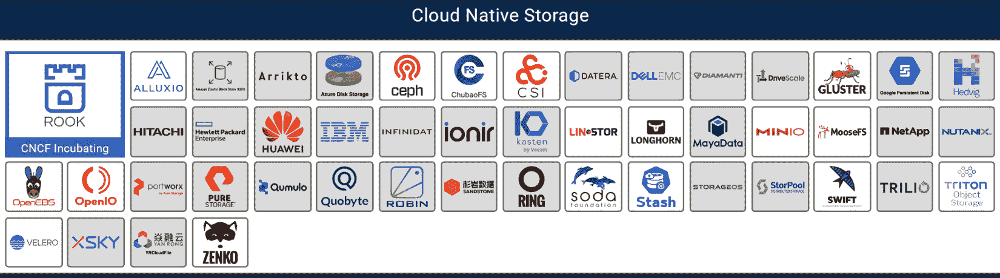
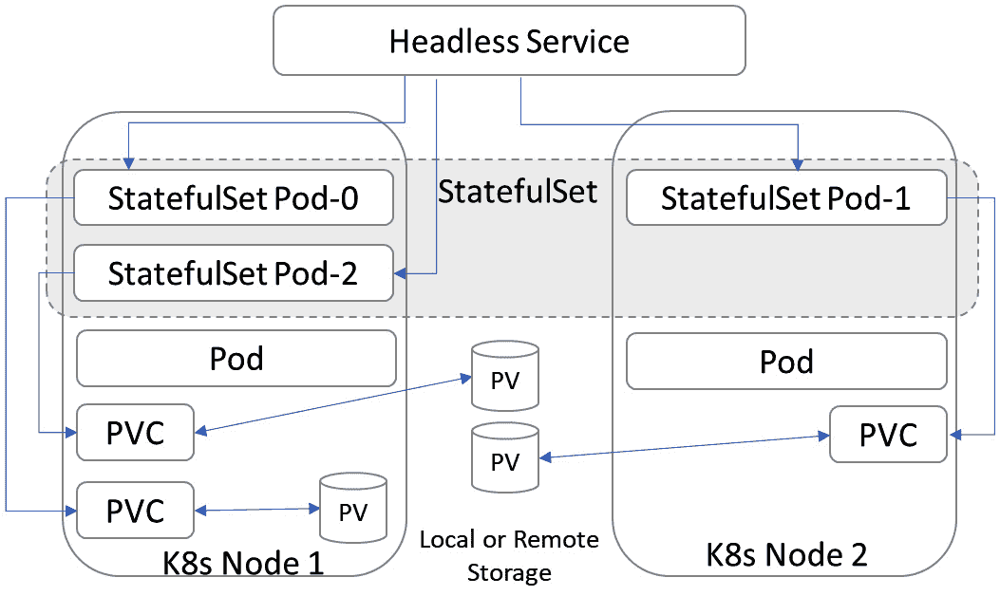
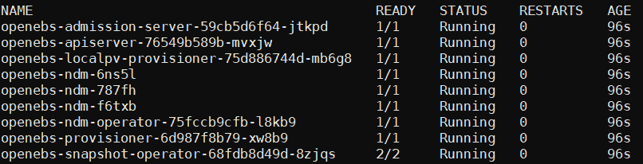

# 第七章：*第七章*：管理存储和有状态应用程序

在前几章中，我们学习了如何配置和准备 Kubernetes 集群以处理生产工作负载。在将应用程序和数据引入 Kubernetes 之前，配置并调优包括网络、安全、监控、日志、可观测性和扩展等零日任务是生产就绪的关键要求之一。Kubernetes 最初是为主要处理无状态应用程序而设计的，以确保容器的可移植性。因此，数据管理和运行有状态应用程序仍然是云原生领域中的主要挑战之一。有多种方法和不同的解决方案可以满足存储需求。新的解决方案每天都在 Kubernetes 和云原生生态系统中出现；因此，我们将从目前流行的生产解决方案开始，并学习评估未来解决方案时需要关注的方法和标准。

在本章中，我们将学习与 Kubernetes 上有状态应用程序相关的技术挑战。我们将完全遵循云原生的方法来调优 Kubernetes 集群，以实现持久存储。我们将了解不同的存储解决方案及其不足之处，以及如何使用和配置它们与我们的 Kubernetes 集群。

在本章中，我们将讨论以下主要主题：

+   理解有状态应用程序的挑战

+   调优 Kubernetes 存储

+   选择持久存储解决方案

+   部署有状态应用程序

# 技术要求

您应该已经安装了以下来自前几章的工具：

+   AWS CLI V2

+   AWS IAM 身份验证器

+   `kubectl`

我们还需要安装以下工具：

+   Helm

+   CSI 驱动程序

您需要按照*第三章*《使用 AWS 和 Terraform 配置 Kubernetes 集群》中的说明，确保您的 Kubernetes 集群已启动并运行。

本章的代码位于[`github.com/PacktPublishing/Kubernetes-Infrastructure-Best-Practices/tree/master/Chapter07`](https://github.com/PacktPublishing/Kubernetes-Infrastructure-Best-Practices/tree/master/Chapter07)。

请查看以下链接观看《代码实战》视频：

[`bit.ly/3jemcot`](https://bit.ly/3jemcot)

## 安装所需的工具

在本节中，我们将安装在本章及接下来的章节中用于使用 Helm charts 部署应用程序并为 Kubernetes 基础设施中的有状态应用程序提供动态供应卷的工具。作为云计算和 Kubernetes 学习者，您可能已经熟悉这些工具。

### 安装 Helm

Helm 是 Kubernetes 的包管理器。Helm 也是在 Kubernetes 上查找和部署供应商及社区发布的应用程序的好方法。我们将使用 Helm 在我们的 Kubernetes 集群上部署应用程序。如果您的集群中没有安装 Helm，可以按照这些说明进行安装。

执行以下命令以在你的 Kubernetes 集群中安装 Helm 3：

```
$ curl -fsSL -o get_helm.sh https://raw.githubusercontent.com/helm/helm/master/scripts/get-helm-3
$ chmod 700 get_helm.sh
$ ./get_helm.sh
```

接下来，我们将安装 CSI 驱动程序。

### 安装 CSI 驱动程序

**容器存储接口**（**CSI**）是扩展 Kubernetes 的标准化 API，用于支持第三方存储提供商解决方案。CSI 驱动程序是供应商特定的，当然，如果你在 AWS 基础设施上运行（包括 EC2 或基于 EKS 的集群），你只需要 AWS EBS CSI 驱动程序。要安装最新的 AWS EBS CSI 驱动程序，请参考 Amazon EKS 官方文档，网址为 [`docs.aws.amazon.com/eks/latest/userguide/ebs-csi.htm`](https://docs.aws.amazon.com/eks/latest/userguide/ebs-csi.htm)。

如果你正在使用自管理的 Kubernetes 解决方案、裸金属/本地部署或虚拟化环境，你可能需要使用其他供应商的 CSI 驱动程序或 **容器附加存储**（**CAS**）解决方案。要安装其他 CSI 供应商的驱动程序，你可以参考官方 CSI 文档中的具体驱动程序说明，网址为 [`kubernetes-csi.github.io/docs/drivers.html`](https://kubernetes-csi.github.io/docs/drivers.html)。

现在我们已经安装了本章中部署 Helm Charts 和使用 CSI 驱动程序访问 AWS EBS 卷所需的前提条件，让我们来回顾一下我们将遵循的实施原则，在做出存储提供商决策时，要着眼于解决有状态应用程序的挑战。

# 实现原则

在*第一章*，《Kubernetes 基础设施与生产就绪介绍》中，我们学习了在本书中我们将遵循的基础设施设计原则。我想从本章开始时，强调影响本章云原生数据管理建议和技术决策的重要原则：

+   **简化**：在本章中，我们将继续坚持简化原则。除非你在多云环境中操作，否则没有必要引入新工具来使操作复杂化。在公有云中，我们将使用提供的原生存储数据管理技术栈，这些技术栈由你的托管服务供应商支持。如今，许多有状态应用程序设计为能够容错并提供内建的高可用性功能。我们将识别不同类型的有状态应用程序，并学习如何简化数据路径并进行性能微调。我们还将学习额外的设计原则，以实现跨可用区的更高可用性，并统一本地和混合云环境中的数据管理。

+   **云无关性**：数据具有引力。当运行无状态应用时，云厂商锁定可能不那么重要，因为容器镜像几乎可以在任何基础设施上即时启动，但当处理有状态工作负载时，就很容易进入这种情况。我们将使用云原生解决方案来抽象存储层并消除依赖。我们将实现的解决方案将在任何云提供商、托管 Kubernetes 服务，甚至是自主管理的本地环境中以相同方式工作。

+   **为高可用性设计**：CSI 非常棒，但同时，它不过是标准化的 API。你的数据仍然需要存储在某个高可用的介质上。考虑存储解决方案的爆炸半径非常重要。将松散耦合的应用存储在单一的可扩展存储解决方案或传统存储设备上是没有意义的。这样做会造成规模瓶颈，最终会拖慢你的进程。我们将学习云原生存储解决方案的优势。我们还将学习如何使用快照、克隆和备份来提高服务可用性并快速恢复服务。

+   **自动化**：除非所有内容都可以动态配置，否则你无法自动化你的 CI/CD 流水线。我们将学习 Kubernetes 存储原语以及动态配置器的使用。

在本节中，我们已经介绍了在做出存储提供商决策时将遵循的实施原则。现在让我们来看看一些常见的有状态应用挑战，我们需要解决这些问题。

# 理解有状态应用程序面临的挑战

Kubernetes 最初是为无状态应用构建的，以保持容器的可移植性。即使我们运行有状态应用，应用本身实际上也经常是无状态容器，状态存储在一个叫做**持久卷**（**PV**）的资源中，并且是单独挂载的。我们将学习用于维护状态的不同资源类型，并且在稍后的*理解 Kubernetes 中的存储原语*部分中保持一定的灵活性。

我想强调在本章中我们将尝试解决的六个显著的有状态应用挑战：

+   **部署挑战**：尤其是在生产环境中运行关键任务服务时，找到理想的有状态应用部署方法从一开始就可能具有挑战性。我们应该使用在博客文章、开源库示例、Helm charts 或操作器中找到的 YAML 文件吗？你的选择将影响未来的可扩展性、可管理性、升级和服务可恢复性。我们将在本章稍后的*部署有状态应用程序*部分中学习部署有状态应用程序的最佳实践。

+   **持久性挑战**：存储使应用程序具有状态的实际持久数据需要仔细选择。你永远不应将状态存储在应用程序容器内部，因为容器镜像和 Pod 可以被重启和更新，这会导致数据丢失。同样，如果你在 EBS 卷上跨多个可用区运行集群，当某个节点重启时，应用程序可能会启动在一个位于不同可用区的节点上，而无法访问之前的 EBS 卷。在这种情况下，你应该考虑具有跨 **可用区** (**AZ**) 复制功能的容器附加存储解决方案。

    另一方面，如果你的应用程序是具有内建高可用性的分布式数据库，来自存储提供商的额外高可用性层将对容量、成本和性能产生负面影响。持久性决策需要仔细考虑应用程序的需求。

+   **可扩展性挑战**：Kubernetes 编排平台受欢迎的主要原因之一是它能够灵活扩展服务。Kubernetes 平台允许你从单个工作节点开始，根据需求和不断增加的负载动态扩展到数千个节点。并非每个存储解决方案都为扩展而设计。稍后在本章的 *选择持久存储解决方案* 部分中，我们将学习应遵循的最佳实践以及部署可扩展有状态应用程序时需要考虑的存储选项之间的差异。

+   **移动性挑战**：数据移动性意味着能够在需要时获取数据，尤其是在要求使用混合云或多云架构的基础设施中，存储提供商的选择成为关键因素。这个需求也与我们在*第一章*中介绍的与云无关的设计原则相一致，*Kubernetes 基础设施与生产就绪性简介*。如果需要，你的有状态应用程序应该能够迁移到不同的区域，甚至不同的存储和云供应商。

+   **生命周期可管理性挑战**：真正的挑战开始于你部署有状态应用程序之后。第二天的操作需要在生产服务之前提前规划好。这有时会对你的部署方法产生依赖和要求。你需要选择支持滚动升级、监控、可观察性和故障排除的部署方法。

+   **灾难恢复（DR）和备份挑战**：你需要为应用程序和/或基础设施故障的情况下规划服务可用性。你的数据需要定期备份。一些应用程序可能要求应用一致的备份，而一些可能仅仅要求崩溃一致的备份。CSI 操作的快照和将数据复制到对象存储的操作需要进行调度。备份是问题的一方面，而能够及时从备份中恢复则是另一个挑战。当发生服务中断时，最终用户服务的影响通常通过两个数据点来衡量；**恢复时间目标**（**RTO**）和**恢复点目标**（**RPO**）。RTO 衡量恢复服务所需的时间，而 RPO 衡量备份频率。随着你的应用程序投入生产，数据可能会迅速增长。从类似 S3 的对象存储中恢复大量数据将需要时间。在这种情况下，需要考虑流备份解决方案。这个需求也与我在*第一章*《Kubernetes 基础设施与生产就绪性简介》中介绍的*可用性设计*设计原则相一致。如果需要，你的应用程序应该能够在最短的停机时间内快速切换到灾难恢复副本。

这六个核心挑战促成了我们在运行有状态应用程序时需要做出的架构设计决策。稍后在本章中，当我们评估存储选项并基于此做出相关技术决策时，我们将考虑这些挑战。

# 调优 Kubernetes 存储

在某些时候，我们都曾体验过存储性能的限制，并为此感到沮丧。在本章中，我们将学习 Kubernetes 存储的基础知识，包括存储原语、创建静态**持久卷**（**PVs**）以及使用存储类来动态配置 PV，以简化管理。

理解容器化有状态应用程序要求我们进入云原生的思维方式。尽管被称为有状态，但 pods 使用的数据要么是远程访问的，要么是作为独立资源在 Kubernetes 中编排和存储的。因此，保持一定的灵活性，使得应用程序能够跨工作节点调度，并在需要时更新而不丢失数据。在我们开始调优之前，让我们先理解一些 Kubernetes 中的基本存储原语。

## 理解 Kubernetes 中的存储原语

Kubernetes 的魅力在于它的每个部分都被抽象为可以通过`kube-api`服务器使用 YAML 或 JSON 声明性地管理和配置的对象。这使得 Kubernetes 的配置更容易以代码的形式进行管理。存储也是作为抽象对象进行处理的。为了能够理解最佳实践背后的推理，我强烈建议你学习存储对象的分离。在本节中，我们将学习以下核心存储原语，以便从 Kubernetes 请求持久存储并通过与其相关的存储提供商进行编排：

+   卷

+   **持久卷** (**PV**)

+   **持久卷声明** (**PVC**)

+   **存储类** (**SC**)

接下来我们将在以下部分讨论这些内容。

### 卷

Kubernetes 卷基本上只是一个目录，供运行在 pod 中的容器中的应用程序访问。这个目录如何创建、保护，以及它存储在哪里，实际上取决于使用的卷类型，这使得这是在生产中运行有状态应用程序时的一个关键决策。Kubernetes 支持多种类型的卷。有关支持的卷类型的详细列表，请参考官方 Kubernetes 文档：[`kubernetes.io/docs/concepts/storage/volumes/`](https://kubernetes.io/docs/concepts/storage/volumes/)。一些卷类型是临时的，换句话说，它们的生命周期仅限于其 pod。因此，它们应该仅用于无状态应用程序，这些应用程序的数据在重启后不需要持久化。在有状态应用程序的上下文中，我们关注的是 PV 类型，包括远程 PV 和本地 PV。现在让我们了解 PV 对象的使用。

### PVs

PVs 是可以在 pod 重启或其他资源故障期间保持数据的卷。PVs 可以在预先静态创建，或者在用户应用程序请求时动态创建。我将通过一个实际示例来解释静态或动态 PV 对象的使用，同时我们部署一个 Percona 服务器。

重要说明

你可以在[`github.com/PacktPublishing/Kubernetes-in-Production-Best-Practices/blob/master/Chapter07/stateful/percona/pv-percona.yaml`](https://github.com/PacktPublishing/Kubernetes-in-Production-Best-Practices/blob/master/Chapter07/stateful/percona/pv-percona.yaml)找到完整的源代码。

让我们从静态卷开始，了解它的限制，换句话说，理解动态供给背后的价值和逻辑：

1.  创建一个 AWS Elastic Block Store 卷，大小为 100 GB，使用卷类型`gp2`。确保 EBS 卷与 Kubernetes 工作节点位于同一可用区：

    ```
    $ aws ec2 create-volume --size=10 --availability-zone=us-east-1a --volume-type=gp2
    ```

1.  重复前一步骤，为集群中每个可用的工作节点创建一个卷。如果有三个节点可用，那么创建三个卷。执行以下命令以获取节点的`InstanceId`字符串列表：

    ```
    $ aws ec2 describe-instances | grep InstanceId
    ```

1.  执行以下命令，使用 AWS CLI 将您创建的每个卷依次附加到集群中的一个工作节点。将`WORKER_NODE_ID`和`VOLUME_ID`替换为第 1 步输出的内容：

    ```
    $ aws ec2 attach-volume --device /dev/sdf --instance-id <WORKER_NODE_ID> --volume-id <YOUR_VOLUME_ID>
    ```

1.  在以下路径`stateful/percona/pv-percona.yaml`中创建一个名为`percona-pv1`，大小为`5Gi`的 Kubernetes PV。确保将`volumeID`替换为您的 EBS 卷的有效卷 ID：

    ```
    apiVersion: v1
    kind: PersistentVolume
    metadata:
      name : percona-pv1
    spec:
      accessModes:
      - ReadWriteOnce
      capacity:
        storage: 5Gi
      persistentVolumeReclaimPolicy: Retain
      awsElasticBlockStore:
        volumeID: <YOUR EBS VOLUME ID HERE>
        fsType: xfs
    ```

1.  执行以下`kubectl`命令以在集群中创建静态 PV：

    ```
    $ kubectl apply -f pv-percona.yaml
    ```

现在您已经创建了一个可以绑定到有状态应用程序的 PV。如您所见，如果您有一个动态扩展的环境，提前手动创建卷将无法提供可扩展的选项。

### PV 声明

**PV 声明**（**PVC**）是对存储的请求。PVC 请求可以通过静态或动态的 PV 来满足。

重要说明

您可以在[`github.com/PacktPublishing/Kubernetes-in-Production-Best-Practices/blob/master/Chapter07/stateful/percona/pvc-percona.yaml`](https://github.com/PacktPublishing/Kubernetes-in-Production-Best-Practices/blob/master/Chapter07/stateful/percona/pvc-percona.yaml)找到完整的源代码。

在这里，我们将创建一个 PVC 清单，以请求我们之前创建的静态 PV：

1.  创建一个名为`percona-pv1`，大小为`5Gi`的 PVC，路径为`stateful/percona/pvc-percona.yaml`：

    ```
    kind: PersistentVolumeClaim
    apiVersion: v1
    metadata:
      name: percona-pvc
    spec:
      accessModes:
        - ReadWriteOnce
      resources:
        requests:
          storage: 5Gi
    ```

1.  在模板的以下部分，我们将`storageClassName`设置为空白。否则，将使用默认的存储类，并且会使用默认的存储提供程序动态创建 PV。这一次，我们特意请求一个没有指定存储类的 PV，因此它只能绑定到我们现有的 PV：

    ```
      storageClassName: ""
    ```

1.  执行以下`kubectl`命令以在集群中创建 PVC 对象：

    ```
    $ kubectl apply -f pv-percona.yaml
    ```

    重要说明

    您可以在[`github.com/PacktPublishing/Kubernetes-in-Production-Best-Practices/blob/master/Chapter07/stateful/percona/deployment-percona.yaml`](https://github.com/PacktPublishing/Kubernetes-in-Production-Best-Practices/blob/master/Chapter07/stateful/percona/deployment-percona.yaml)找到完整的源代码。

在以下代码片段中，您将创建`percona`部署，该部署将使用 PVC 请求我们之前创建的 PV：

1.  执行以下命令创建一个 Kubernetes 密钥以保存 Percona 的 root 密码。这个密钥将在稍后的部署中使用。您可以在[`kubernetes.io/docs/concepts/configuration/secret/`](https://kubernetes.io/docs/concepts/configuration/secret/)中阅读有关 Kubernetes 密钥的详细用法：

    ```
    $ kubectl create secret generic mysql-root \
         --from-literal=mysql-root-passwd=MyP@ssW0rcl \
         --dry-run -o yaml | kubectl apply -f -
    ```

1.  在以下路径`stateful/percona/deployment-percona.yaml`中创建`percona`部署的模板：

    ```
    ---
    apiVersion: apps/v1
    kind: Deployment
    metadata:
      name: percona
    spec:
      selector:
        matchLabels:
          app: percona
      template:
        metadata:
          labels:
            app: percona
        spec:
          containers:
          - image: percona
            name: percona
            env:
            - name: MYSQL_ROOT_PASSWORD
              valueFrom:
                secretKeyRef:
                  name: mysql-root
                  key: mysql-root-passwd
            ports:
            - containerPort: 3306
              name: percona
    ```

1.  在模板的以下部分，我们将使用名称`percona-volume`定义`volumeMounts`，并将`mountPath`参数配置为路径`/var/lib/mysql`，这是您的 PV 将在容器内挂载的路径：

    ```
            volumeMounts:
            - name: percona-volume
              mountPath: /var/lib/mysql
    ```

1.  最后，在模板的以下部分，我们将定义您的请求将被指向的位置。就我们而言，正如之前在`claimName`的案例中定义的，这应该是`percona-pvc`：

    ```
         volumes:
            - name: percona-volume
              persistentVolumeClaim:
                claimName: percona-pvc
    ```

1.  执行以下`kubectl`命令，以在集群中创建`percona`部署：

    ```
    $ kubectl apply -f deployment-percona.yaml
    ```

现在，您已经创建了一个有状态应用程序部署，并绑定到一个静态 PV。虽然了解如何克隆现有卷并将其挂载到新 Pod 可能会有用，但这并不是一个可扩展的解决方案。因此，我们现在将学习如何使用`StorageClass`进行 PV 的动态配置。

### 存储类

`StorageClass`对象允许通过 PVC 进行动态配置请求。您可以维护多个类，这些类映射到不同的可用性和 QoS 级别，使用内部或外部第三方供应者。`StorageClass`概念类似于传统存储解决方案中的层级或配置文件。

重要说明

您可以在[`github.com/PacktPublishing/Kubernetes-in-Production-Best-Practices/blob/master/Chapter07/stateful/percona/deployment-percona.yaml`](https://github.com/PacktPublishing/Kubernetes-in-Production-Best-Practices/blob/master/Chapter07/stateful/percona/deployment-percona.yaml)找到完整的源代码。

让我们回顾一下用于在 AWS 上配置 EBS 卷的`StorageClass`模板：

```
apiVersion: storage.k8s.io/v1
kind: StorageClass
metadata:
  name: gp2
```

在模板的以下部分，我们将`StorageClass`设置为默认存储类。强烈推荐将默认存储类设置为最佳实践，这样如果 PVC 缺少`storageClassName`字段，它会自动分配到您的默认类：

```
  annotations:
    storageclass.kubernetes.io/is-default-class: "true"
```

在模板的以下部分，我们将 EBS 卷类型设置为`gp2`，并使用 AWS EBS 卷类型`io1`、`gp2`、`sc1`或`st1`。您可以在官方 AWS 文档中阅读有关这些类型的差异，网址为[`docs.aws.amazon.com/AWSEC2/latest/UserGuide/ebs-volume-types.html`](https://docs.aws.amazon.com/AWSEC2/latest/UserGuide/ebs-volume-types.html)。我们还将`fsType`设置为`ext4`：

```
parameters:
  type: gp2
  fsType: ext4
```

在模板的以下部分，我们将`provisioner`类型设置为`kubernetes.io/aws-ebs`。此字段可以是内部或外部供应者。在我们接下来的模板中，它设置为 Kubernetes 的内部`aws-ebs`供应者`kubernetes.io/aws-ebs`。我们将在本章稍后*选择持久存储解决方案*部分中回顾可用的存储选项：

```
provisioner: kubernetes.io/aws-ebs
reclaimPolicy: Retain
allowVolumeExpansion: true
volumeBindingMode: Immediate
```

`reclaimPolicy`可以设置为`Delete`、`Recycle`或`Retain`，它定义了当相应的 PVC 被删除时的操作。当选择`Retain`时，PVC 被移除后，PV 将转移到`Released`状态。因此，建议选择`Retain`以避免意外发生。

`allowVolumeExpansion`字段用于在稍后需要请求更大大小的 PVC 时，并希望调整相同卷的大小，而不是获取新的卷。只有当存储类的`allowVolumeExpansion`参数设置为`true`时，才能扩展 PVC。

注意

AWS EBS 卷扩展可能需要时间，并且每 6 小时允许进行一次修改。

`volumeBindingMode`可以设置为`Immediate`或`WaitForFirstConsumer`。此参数规定了何时进行卷绑定。

要了解更多`StorageClass`参数的信息，请查看 Kubernetes 官方文档：[`kubernetes.io/docs/concepts/storage/storage-classes/`](https://kubernetes.io/docs/concepts/storage/storage-classes/)。

重要提示

您可以在[`github.com/PacktPublishing/Kubernetes-in-Production-Best-Practices/blob/master/Chapter07/stateful/percona/deployment-percona-sc.yaml`](https://github.com/PacktPublishing/Kubernetes-in-Production-Best-Practices/blob/master/Chapter07/stateful/percona/deployment-percona-sc.yaml)找到完整的源代码。

现在，我们将修改`pvc-percona.yaml`和`deployment-percona.yaml`清单文件。我们将调整`percona`部署，使其通过 PVC 动态请求 PV，并使用存储类：

1.  使用您喜欢的文本编辑器编辑此路径下的`percona-pvc` PVC 模板：`stateful/percona/pvc-percona.yaml`，并根据以下内容调整`name`和`storageClassName`字段：

    ```
    kind: PersistentVolumeClaim
    apiVersion: v1
    metadata:
      name: percona-pvc-gp2
    spec:
      accessModes:
        - ReadWriteOnce
      resources:
        requests:
          storage: 5Gi
      storageClassName: gp2
    ```

1.  使用您喜欢的文本编辑器编辑此路径下的`percona`部署模板：`stateful/percona/deployment-percona.yaml`，并根据以下内容调整最后一行的`claimName`字段：

    ```
                claimName: percona-pvc-gp2
    ```

1.  执行以下`kubectl`命令，在集群中使用动态配置的 PV 创建`percona`部署：

    ```
    $ kubectl apply -f pv-percona.yaml
    $ kubectl apply -f deployment-percona.yaml
    ```

现在，您已经创建了一个与动态配置的 PV 绑定的有状态应用部署，使用了`StorageClass`。这个步骤完全消除了手动创建 EBS 卷的需求。因此，在本章稍后创建新的有状态应用时，我们将使用这种方法。

# 选择一个持久存储解决方案

在 Kubernetes 中，最大的两个有状态应用挑战是存储编排和数据管理。市场上有无数解决方案。首先，我们将解释在评估存储替代方案时需要考虑的主要存储属性和拓扑结构。让我们回顾一下最常见存储系统所使用的拓扑结构：

+   **集中式**：传统的，也称为单体存储系统，通常与专有硬件和内部通信协议紧密耦合。它们通常与向上扩展的模型相关，因为难以扩展紧密耦合的存储节点组件。

+   **分布式**：分布式存储系统更可能是软件定义的解决方案，它们的架构可能会偏向可用性、一致性、耐久性、性能或可扩展性。通常，分布式系统比其他系统更能支持多个存储服务器节点并行扩展。

+   **超融合**：超融合存储解决方案旨在利用应用程序运行所在的相同网络和计算资源。它们主要设计为软件运行，并由与应用程序、虚拟机或容器管理相同的平台进行编排，如虚拟化管理程序或容器编排器。

+   **分片**：分片存储解决方案将数据分割成多个数据集，并将它们分布存储在多个节点上。分片存储解决方案可能管理起来比较复杂，需要重新平衡，而且性能受限于数据集所在单个节点的性能。

云原生应用可用的存储解决方案类别被**云原生计算基金会**（**CNCF**）定义为云原生存储。目前，列出了 17 个开源解决方案和 32 个专有解决方案，总共 49 个解决方案。

如需查看最新的解决方案列表，请参考官方的 CNCF 云原生互动生态文档：[`landscape.cncf.io/`](https://landscape.cncf.io/)：



图 7.1 – CNCF 云原生生态图，包含云原生存储提供商

考虑到*理解有状态应用面临的挑战*部分提到的挑战，针对块存储的简化部署和生命周期管理，**容器附加存储**（**CAS**）和**云存储**优于集中式拓扑。为了满足跨不同基础设施和数据流动性的持久性要求，应该优先选择**CAS**和**分布式**解决方案，而非右侧的解决方案。在讨论 Kubernetes 级别的可扩展性时，**云存储**和**CAS**解决方案也显著优于集中式拓扑。总体而言，**CAS**和**云存储**提供商能够满足所有架构需求。尽管如此，在许多情况下，我们仍然需要利用公司现有的投资。云存储仅在云服务商提供的基础设施上可用，如果你是在本地/私有云环境中运行，可能需要利用现有的硬件解决方案。在这种情况下，你仍然可以利用**CAS**解决方案来统一数据管理，增加云原生存储的优势，包括数据流动性和可扩展性，并简化 PV 生命周期管理。

现在你已经了解了最常见存储解决方案使用的存储拓扑结构，接下来我们来关注如何使用 CAS 解决方案来部署有状态应用。

# 部署有状态应用

Kubernetes 提供了多个控制器 API 来管理 Kubernetes 集群中 Pod 的部署。这些控制器最初是为无状态应用程序设计的，旨在根据需求将 Pod 分组。在本节中，我们将简要了解以下 Kubernetes 对象的区别——Pod、ReplicaSets、Deployments 和 StatefulSets。如果节点发生故障，个别 Pod 不会被重新调度到其他节点。因此，在运行有状态工作负载时，应避免使用这些对象。

**部署** 用于管理 Pod，而 **副本集** 用于在需要对副本 Pod 进行更新时。副本集和部署都用于配置无状态应用程序。要了解更多关于部署的信息，请查阅官方 Kubernetes 文档：[`kubernetes.io/docs/concepts/workloads/controllers/deployment/`](https://kubernetes.io/docs/concepts/workloads/controllers/deployment/)。

**StatefulSets** 是另一种控制器，在 Kubernetes 1.9 发布时达到了 **正式发布**（**GA**）的里程碑。随着 StatefulSets 对象的引入，有状态应用程序的真正采用开始了。通过 StatefulSets，每个 Pod 副本都有自己的状态，换句话说，就是它自己的卷，因此在重启后仍能保持其状态和身份。在部署有状态应用程序时，当我们需要存储保持状态时，我们将使用 StatefulSets。以下图示显示了使用 StatefulSets 部署的应用程序组件：



](img/B16192_07_002.jpg)

图 7.2 – Kubernetes StatefulSet 部署示意图

StatefulSets 需要一个无头服务来处理相关 Pod 的网络身份。当 StatefulSet 请求创建卷时，它使用 StorageClass 来调用 PV 配置器。在本章前面，你已经学习了如何使用 StorageClass 动态配置 PV。

在我们部署有状态应用程序之前，我们将学习如何安装一个流行的开源存储配置器选项——OpenEBS，这也是我们在 *选择持久化存储解决方案* 部分提到过的。

## 安装 OpenEBS

OpenEBS 是一个开源的 CNCF 项目，旨在使 Kubernetes 中的有状态应用程序能够轻松访问动态本地 PV，或复制的高可用 PV。OpenEBS 是一种新的云原生存储解决方案类别（称为 CAS）的例子。CAS 解决方案易于维护，具有可移植性，能在任何平台上运行，具备可扩展性，并且符合我在 *第一章* *Kubernetes 基础设施和生产就绪性介绍* 中介绍的基础设施设计原则。

要了解有关 OpenEBS 的更多先决条件和详细用法，请参考以下链接：[`docs.openebs.io/`](https://docs.openebs.io/)。

现在，让我们在 Kubernetes 集群上安装 OpenEBS，并为您的集群准备动态供应的 PV：

1.  创建一个名为 `openebs` 的命名空间：

    ```
    $ kubectl create ns openebs
    ```

1.  将 OpenEBS Helm chart 仓库添加到本地仓库列表中：

    ```
    $ helm repo add openebs https://openebs.github.io/charts
    ```

1.  更新 Helm chart 仓库：

    ```
    $ helm repo update
    ```

1.  从 Helm 仓库安装 `openebs`：

    ```
    $ helm install --namespace openebs openebs openebs/openebs
    ```

1.  通过执行以下命令验证安装是否成功：

    ```
    $ kubectl get pods -n openebs
    ```

1.  上述命令的输出应如下所示：



图 7.3 – 安装成功后运行的 OpenEBS Pods 列表

既然您可以使用 OpenEBS 动态创建 PV，您可以创建一个新的 SC 或使用 OpenEBS 提供的默认存储类之一。

OpenEBS 提供了各种类型的块存储选项，包括名为 `Jiva`、`cStor` 和 `Mayastor` 的存储引擎，适用于需要在节点故障期间保证高可用卷的持久化工作负载，以及适用于分布式应用程序（如 Cassandra、Elastic、Kafka 或 MinIO）的 `Dynamic Local PV`（设备、主机路径、ZFS）替代方案。

执行以下命令以获取集群中默认存储类的列表：

```
$ kubectl get sc
```

您将注意到新添加到列表中的存储类：`openebs-device`、`openebs-hostpath`、`openebs-jiva-default` 和 `openebs-snapshot-promoter`。

这是一个 YAML 清单示例，用于使用默认的 `openebs-jiva-default` 存储类创建 PVC：

```
---
kind: PersistentVolumeClaim
apiVersion: v1
metadata:
  name: openebs-pvc
spec:
  storageClassName: openebs-jiva-default
  accessModes:
    - ReadWriteOnce
  resources:
    requests:
      storage: 5G
---
```

现在您已经学习了如何使用开源 CAS 替代方案 OpenEBS 为有状态应用程序创建 PV。

从现在开始，如果运行在 AWS 基础设施上，您可以继续使用现有的 EBS 卷，使用 `gp2` 存储类或先前通过 `Amazon_EBS_CSI_Driver` 创建的 `ebs-sc` 存储类，或者利用 OpenEBS 来抽象化数据管理。与 CAS 解决方案相似，OpenEBS 帮助减少了我们在本章 *理解有状态应用程序的挑战* 部分中描述的许多挑战。

现在我们已经学习了如何使用存储提供者动态提供 PV，让我们将其与有状态应用程序一起使用，以简化数据管理的生命周期。

## 在 OpenEBS 卷上部署有状态应用程序

OpenEBS 提供了一个灵活的数据平面，拥有多个存储引擎选项，针对不同的应用和性能需求进行了优化。您可以在官方 OpenEBS 文档网站 [`docs.openebs.io/docs/next/casengines.html`](https://docs.openebs.io/docs/next/casengines.html) 阅读有关存储引擎差异的详细信息。在这里，我们将深入了解其中一个默认选项，即低占用存储引擎选项 `Jiva`。

接下来，我们将修改 `pvc-percona.yaml` 和 `deployment-percona.yaml` 清单文件。我们将调整 `percona` 部署，以便使用 StorageClass 动态请求通过 PVC 创建 PV：

1.  在以下路径 `stateful/percona/sc-openebs-jiva.yaml` 中创建一个名为 `openebs-jiva-3r` 的 `StorageClass`，并设置 `ReplicaCount` 为 `3`。这将创建三个副本的卷，并在节点故障时提供高可用性：

    ```
    apiVersion: storage.k8s.io/v1
    kind: StorageClass
    metadata:
      name: openebs-jiva-3r
      annotations:
        openebs.io/cas-type: jiva
        cas.openebs.io/config: |
          - name: ReplicaCount
            value: "3"
          - name: StoragePool
            value: default
    provisioner: openebs.io/provisioner-iscsi
    ```

1.  执行以下 `kubectl` 命令创建 StorageClass：

    ```
    $ kubectl apply -f sc-openebs-jiva.yaml
    ```

1.  使用您喜欢的文本编辑器编辑此路径下的 `percona-pvc` PVC 模板，`stateful/percona/pvc-percona.yaml`。调整名称和 `storageClassName` 字段，如下所示：

    ```
      storageClassName: openebs-jiva-3r
    ```

1.  使用您喜欢的文本编辑器编辑此路径下的 `percona` 部署模板，`stateful/percona/deployment-percona.yaml`。调整最后一行 `claimName`，如下所示：

    ```
                claimName: percona-pvc-openebs
    ```

1.  执行以下 `kubectl` 命令，在集群中使用动态供应的 PV 创建 `percona` 部署：

    ```
    $ kubectl apply -f pvc-percona.yaml
    $ kubectl apply -f deployment-percona.yaml
    ```

现在，您已经创建了一个由动态创建的 OpenEBS PVs 支持的有状态应用程序部署。这一步帮助我们在云端、裸金属或基于虚拟机的 Kubernetes 集群中抽象了数据管理。

# 总结

在本章中，我们了解了有状态应用程序的挑战，并讨论了在选择最佳存储管理解决方案时应考虑的最佳实践，包括开源和商业解决方案。最后，还介绍了在使用 Kubernetes 的 StatefulSet 和部署对象将其部署到生产环境时需要考虑的有状态应用程序问题。

我们部署了 AWS EBS CSI 驱动程序和 OpenEBS，并使用 OpenEBS 创建了高度可用的复制存储，并将我们的应用程序部署在 OpenEBS 卷上。

我们在本章中深入了解了 Kubernetes 存储，但您应对您的集群存储需求进行详细评估，并采取进一步措施，部署任何可能需要的额外工具和配置，包括存储提供商的 CSI 驱动程序。

在下一章中，我们将详细了解无缝且可靠的应用程序。我们还将掌握容器化的最佳实践，以便轻松地扩展我们的应用程序。

# 深入阅读

您可以参考以下链接，了解更多关于本章所涵盖主题的信息：

+   *Kubernetes – 完整的 DevOps 手册*（*第五章*，*为有状态工作负载做准备*）：[`www.packtpub.com/product/kubernetes-a-complete-devops-cookbook/9781838828042`](https://www.packtpub.com/product/kubernetes-a-complete-devops-cookbook/9781838828042)。

+   *Kubernetes 容器存储接口（CSI）文档*：[`kubernetes-csi.github.io/docs/introduction.html`](https://kubernetes-csi.github.io/docs/introduction.html)

+   *OpenEBS 快速入门指南*：[`docs.openebs.io/docs/next/quickstart.html`](https://docs.openebs.io/docs/next/quickstart.html)
