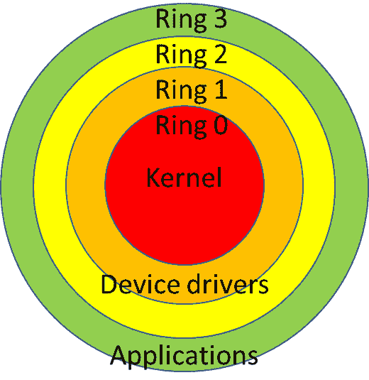
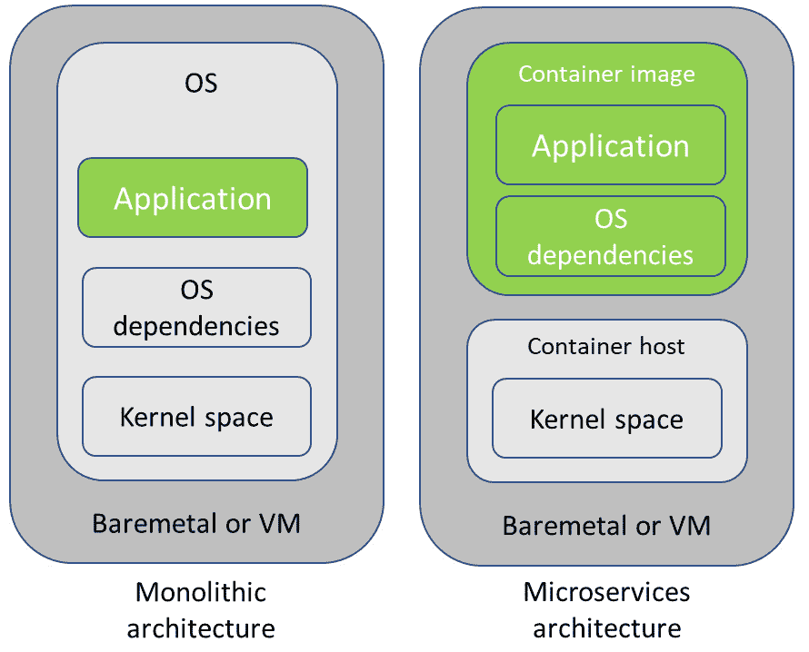
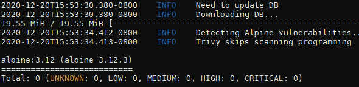
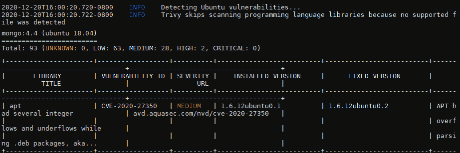
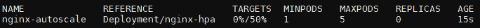

# 第八章：*第八章*：部署无缝且可靠的应用程序

在前面的章节中，我们学习了如何为生产使用准备平台和基础设施组件。我们还了解了 Kubernetes 数据管理的注意事项以及存储最佳实践，以使用 Operator Framework 部署我们的第一个有状态应用程序。容器编排中最被低估的话题之一是容器镜像管理。尽管在本书中不涉及在 Kubernetes 中开发应用程序，但我们需要了解镜像的关键组件。我们可以通过多个来源、公共容器注册表和供应商来找到现成的应用程序镜像。错误处理容器镜像不仅可能导致集群资源的过度使用，更重要的是，还可能影响我们服务的可靠性和安全性。

本章我们将讨论容器和镜像管理等话题。我们将了解在选择或创建影响 Kubernetes 集群稳定性和安全性的应用程序镜像时遇到的技术挑战。我们将重点关注在将生产服务部署到集群之前，如何在应用程序发布中采用最佳实践，以避免集群不稳定或误用。这将帮助我们充分利用 Kubernetes 安全地编排我们的服务。

本章我们将涵盖以下主要内容：

+   理解容器镜像面临的挑战

+   学习应用程序部署策略

+   扩展应用程序并实现更高的可用性

# 技术要求

你应该已经安装了前几章中提到的以下工具：

+   `kubectl`

+   `metrics-server`

你需要根据 *第三章*《使用 AWS 和 Terraform 配置 Kubernetes 集群》中的说明，拥有一个正在运行的 Kubernetes 集群。

本章的代码位于 [`github.com/PacktPublishing/Kubernetes-in-Production-Best-Practices/tree/master/Chapter08`](https://github.com/PacktPublishing/Kubernetes-in-Production-Best-Practices/tree/master/Chapter08)。

查看以下链接，观看“代码实战”视频：

[`bit.ly/3rpWeRN`](https://bit.ly/3rpWeRN)

# 理解容器镜像面临的挑战

本节中，我们将了解行业专家在构建或选择正确的容器镜像时的注意事项和最佳实践。在讨论挑战并深入探讨我们的选择之前，让我们了解容器镜像的组成。

## 探索容器镜像的组成

要理解容器镜像的行为，我们需要具备基本的**操作系统**（**OS**）和层级保护域的知识。为了安全隔离，操作系统将虚拟内存分为两层，称为**内核空间**和**用户空间**。基本上，内核运行在最特权的保护环中，叫做**环 0**，并直接与诸如 CPU 和内存等关键资源进行交互。内核需要保持稳定，因为任何问题或不稳定都会导致整个系统的不稳定，进而使系统进入崩溃状态。正如我们在*图 8.1*中看到的，驱动程序、低级系统组件以及所有用户应用程序都运行在最不特权的保护环和用户空间中：



](img/B16192_08_001.jpg)

图 8.1 – 特权环，也称为层级保护域

若要了解用户空间的详细信息，请查看这里的详细解释：[`debian-handbook.info/browse/stable/sect.user-space.html`](https://debian-handbook.info/browse/stable/sect.user-space.html)。

Linux 容器在安全隔离方面更进一步，使我们能够在所谓的**容器主机**和**容器镜像**中分别管理应用程序和操作系统的依赖项。

容器主机是操作系统与**容器运行时**（一些流行的容器运行时包括**containerd**、**CRI-O**、**Firecracker** 和 **Kata**）以及**容器引擎**（一些流行的容器引擎包括 Docker 和 **Linux 容器守护进程**（**LXD**））一起运行的地方。在本书中，我们不会讨论容器运行时和引擎之间的区别，因为它们大多数时候是平台的一部分，这不在我们的讨论范围内。在传统的单体架构中，我们在操作系统上运行应用程序及其操作系统依赖项和其他应用程序，而在云原生微服务架构中，我们将应用程序及其依赖项运行在容器镜像中（见*图 8.2*）：



图 8.2 – 单体架构与微服务架构的比较

当我们在 Kubernetes 中运行应用程序时，例如 NGINX、Cassandra、Kafka、MongoDB 等，我们的容器引擎会从容器注册中心将容器镜像拉取到本地注册中心，然后将一个或多个容器封装成一个叫做**pod**的对象，并将其**调度**到可用的工作节点上。

在这个过程中使用的容器镜像（大多数时候，这个术语被误用为*基础镜像*）是一个分层镜像，包含了用户应用程序和容器基础镜像。

容器基础镜像包含操作系统的可交换用户空间组件。容器镜像遵循 Docker 镜像或**开放容器倡议**（**OCI**）的行业标准进行打包。这就是我们面临的选择和挑战。大多数容器基础镜像包含具有操作系统分发版最小用户空间应用程序的根文件系统，以及其他一些外部库、实用工具和文件。容器镜像通常用于软件开发，并提供一个用常见编程语言编写的功能性应用程序。编程语言，包括编译型和解释型语言，依赖于外部驱动程序和库。这些依赖关系使得容器基础镜像的选择至关重要。

在我们构建应用程序或在生产环境中运行基于现有镜像的应用程序之前，我们需要理解流行的容器基础镜像之间的关键区别。现在你已经了解了容器镜像的构成，让我们来学习常见的容器基础镜像之间的区别，以及选择正确镜像类型的一些最佳实践。

## 选择正确的容器基础镜像

选择容器基础镜像与选择容器主机的 Linux 发行版没有太大区别。需要考虑的类似标准包括安全性、性能、依赖性、核心实用工具、包管理器、社区和生态系统的规模，以及安全响应和支持等。

我想重点介绍在本章中我们将尝试解决的五个显著的容器镜像挑战：

+   **镜像大小**：容器镜像的一个重要优势是便携性。较小的容器镜像大小减少了构建和发布的时间，因为拉取镜像本身会更快。通过限制额外的二进制文件来实现更小的镜像，这也带来了最小化的攻击面和增强的安全性优势。

+   **稳定性**：更新基础镜像并不有趣，但更新每一个容器镜像则是最糟糕的。仅包含你的应用程序及其运行时依赖项的容器镜像，如 distroless 镜像，可能听起来很有吸引力。然而，在修补**常见漏洞和暴露**（**CVE**）时，你需要更新所有容器，这可能会引入稳定性问题。

    重要提示

    Distroless 镜像是没有包管理器或任何其他应用程序的容器镜像。你可以在这里阅读更多关于 distroless Docker 镜像的内容并观看演讲：[`github.com/GoogleContainerTools/distroless`](https://github.com/GoogleContainerTools/distroless)。

+   **安全性**: 每添加到容器镜像中的二进制文件都会为整体平台安全性带来不可预测的风险。在选择基础镜像时，其更新频率、生态系统和社区规模以及漏洞跟踪方法（如 CVE 数据库和 **开放漏洞评估语言** (**OVAL**) 数据）是需要考虑的重要因素。检查可执行文件的属性，如 **位置独立执行文件** (**PIE**)、**只读重定位** (**RELRO**)、**Linux 内核补丁** (**PaX**)、金丝雀、**地址空间布局随机化** (**ASLR**)、FORTIFY_SOURCE 以及 RPATH 和 RUNPATH 运行时搜索路径。

    重要提示

    你可以在这里找到检查二进制硬化工具属性的 Bash 脚本：[`github.com/slimm609/checksec.sh`](https://github.com/slimm609/checksec.sh)。

+   **速度/性能**: 流行的容器基础镜像不一定是最快的。虽然 Alpine 以其小巧著称，并且在某些情况下推荐使用，但它可能会导致严重的构建性能问题。如果你使用 Go 语言，Alpine 可能是可以接受的。然而，如果使用 Python，你会很快注意到 Alpine 镜像有时会变得大两到三倍，构建速度比普通镜像慢 10 倍以上，甚至可能导致构建问题。

    重要提示

    你可以在这里找到与 Kubernetes 相关的性能测试工具：[`github.com/kubernetes/perf-tests`](https://github.com/kubernetes/perf-tests)。

+   `glibc`，Alpine 包含 `muslc` 并可以显示实现差异。此外，镜像中包含的故障排除和支持工具也需要考虑。

以下是一些常见容器基础镜像选项，按其大小、安全性和支持选项进行比较：

+   带有包管理器的 `busybox`。已知 `glibc`/`musl` 库的差异会引起难以追踪的问题和性能问题：

    - **大小**: 2.6 MB。

    - **安全性**: 社区更新；Alpine Linux 错误跟踪器可以在 [`bugs.alpinelinux.org/projects/alpine/issues`](https://bugs.alpinelinux.org/projects/alpine/issues) 访问。

    - **支持**: 通过社区提供支持。支持 386、AMD64、ARMv6、ARMv7、ARM64v8、ppc64le 和 S390x 架构。

+   **Amazon Linux 2 (amazonlinux:2)**: 由 **亚马逊 Web 服务** (**AWS**) 维护的 Linux 镜像，用于在 Amazon EC2 实例上使用。与 RHEL 和 CentOS 二进制兼容：

    - **大小**: 59.14 MB。

    - **安全性**: 厂商更新；Amazon Linux 安全中心可以在 [`alas.aws.amazon.com/alas2.html`](https://alas.aws.amazon.com/alas2.html) 访问。

    - **支持**: 包括 AWS EC2 的 LTS 支持；支持 AMD64 和 ARM64v8 架构。

+   **CentOS (centos:8)**: 由社区驱动的流行 Linux 发行版的容器基础镜像。由于 CentOS Stream 的推出，其未来尚不明确。目前，最好等待替代的 Rocky Linux 基础镜像，或使用 Amazon Linux 2：

    - **大小**: 71.7 MB。

    - **安全性**：由社区更新；可以在这里找到 CentOS 的安全警报：[`lwn.net/Alerts/CentOS/`](https://lwn.net/Alerts/CentOS/)。

    - **支持**：仅通过社区提供支持。支持 AMD64、ARM64v8 和 ppc64le 架构。

+   `libc`）包含在 Debian 镜像中：

    - **大小**：26.47 MB

    - **安全性**：由社区更新；安全漏洞跟踪器([`security-tracker.debian.org/tracker/`](https://security-tracker.debian.org/tracker/))和 OVAL 数据在[`www.debian.org/security/oval/`](https://www.debian.org/security/oval/)。

    - **支持**：仅通过社区提供支持。支持 386、AMD64 和 ARM64v5 架构。

+   **Ubuntu (ubuntu:21.04)**：基于 Debian 的大型社区和企业支持的 Linux 发行版基础镜像：

    - **大小**：29.94 MB

    - **安全性**：Ubuntu CVE 跟踪器在[`people.canonical.com/~ubuntu-security/cve/`](https://people.canonical.com/~ubuntu-security/cve/)和云镜像错误跟踪器在[`bugs.launchpad.net/cloud-images`](https://bugs.launchpad.net/cloud-images)。

    - **支持**：社区和商业支持。支持 AMD64、ARMv7 和 ARM64v8 架构。

+   `microdnf`作为包管理器。它在运行`ubi-minimal`）、标准(`ubi`）和多服务(`ubi-init`)时被首选，用于不同的使用场景：

    - **大小**：37.6 MB。

    - **安全性**：在漏洞检查的完整性方面，是最好的容器基础镜像。在[`access.redhat.com/errata`](https://access.redhat.com/errata)提供 Errata，并在[`www.redhat.com/security/data/oval/`](https://www.redhat.com/security/data/oval/)提供 OVAL 数据。

    - **支持**：社区和商业支持。支持 AMD64、ARM64v8、ppc64le 和 S390x 架构。

+   **Distroless (gcr.io/distroless/base-debian10)**：由 Google 在 Debian 发行版基础上构建。它们不包含包管理器或 shell。因其安全性和小巧性而受青睐。更多构建可以在[`console.cloud.google.com/gcr/images/distroless/GLOBAL`](https://console.cloud.google.com/gcr/images/distroless/GLOBAL)找到：

    - **大小**：75.1 MB

    - **安全性**：避免了镜像的漏洞，但引入了另一个挑战，即每个容器镜像的依赖库更新需要仔细跟踪。

    - **支持**：仅通过社区提供支持。支持 AMD64、ARM、ARM64、ppc64le 和 S390x 架构。

现在你已经了解了选择正确的容器基础镜像时所面临的挑战，以及最常见的流行基础镜像的对比。接下来，让我们探讨一些减少最终镜像大小和扫描容器镜像漏洞的最佳实践。

## 减少容器镜像大小

实现更小容器镜像的一个优秀方法是从小型基础镜像开始，如 Alpine、`ubi-minimal`或 distroless 基础镜像。

注意

为了实现可复现的构建和部署，你还可以使用 Nix 包管理器来创建精简的构建。Nix 受到很多热情的关注，但由于其陡峭的学习曲线和自定义表达语言的使用，我们在本书中不会讨论 Nix。你可以在官方 NixOS 文档页面了解关于使用 Nix 构建容器镜像的内容：[`nixos.org/guides/building-and-running-docker-images.html`](https://nixos.org/guides/building-and-running-docker-images.html)。

排除一些不必要的文件，使用 `.dockerignore` 文件可以帮助我们减少镜像的大小。以下是一个 `.dockerignore` 文件的示例：

```
# ignoring git folder
.git
#ignoring visual studio code related temp data
.vs
.vscode
# other files and CI manifests
.DS_Store
.dockerignore
.editorconfig
.gitignore
.gitlab-ci.yml
.travis.yml
# ignore all files and directories starting with temp 
# in any subdirectory 
*/temp*
# ignore all files and directories starting with temp
# in any subdirectory two levels below root
*/*/temp*
# ignore all files and directories starting with temp
# followed by any character 
temp? 
```

通过利用多阶段构建并避免额外的层，可以实现优化大小的镜像。多阶段构建增加了一些新的语法，允许我们在 Dockerfile 中多次使用`FROM`部分来启动构建的新阶段，并且只复制我们希望从之前阶段获取的工件。你可以在官方 Docker 文档网站上了解更多关于多阶段构建的信息：[`docs.docker.com/develop/develop-images/multistage-build/`](https://docs.docker.com/develop/develop-images/multistage-build/)。

下面是一个包含两个阶段的 Dockerfile 示例：

```
FROM node:14.15 AS base
ADD . /app
WORKDIR /app
RUN npm install
FROM gcr.io/distroless/nodejs AS stage2
COPY --from=base /app /app
WORKDIR /app
EXPOSE 8080
CMD ["server.js"]
```

在我们之前的示例中，第一个阶段 `base` 使用 `node:14.15` 的 Node.js 基础镜像。我们将应用程序代码复制到 `/app` 目录并执行 `npm install` 命令。

接下来我们进入第二阶段，称为 `stage2`，这次使用 `distroless/nodejs` 基础镜像。然后，我们使用 `COPY --from=base /app /app` 语法从第一个阶段复制应用程序代码和 `node_modules`。通过这种方式，我们既减少了容器镜像的大小，又减少了攻击面，因为 distroless 镜像不包含 `bash` 或其他可能被恶意执行的工具。

你可以在[`docs.docker.com/develop/develop-images/dockerfile_best-practices/`](https://docs.docker.com/develop/develop-images/dockerfile_best-practices/)阅读编写 Dockerfile 的最佳实践。

现在我们已经学习了一些减少容器镜像大小的技巧。接下来，看看我们如何主动扫描镜像中的安全漏洞，并在将其投入生产环境之前及时修复。

## 扫描容器镜像中的漏洞

我们已经构建了容器镜像或从供应商提供的镜像中拉取了一些到本地注册表，现在我们准备在生产环境中运行它们。我们如何知道它们是安全的？我们如何知道它们已经修补了最新的安全漏洞？如今，大多数**持续集成（CI）**和**持续交付（CD）**解决方案都配有额外的安全扫描工具。一个黄金法则是在将任何服务投入生产之前，一定要通过管道中的快速镜像验证。为此，我们将学习一个流行的开源解决方案，叫做**Trivy**。

Trivy 是一个全面的容器镜像漏洞扫描工具。Trivy 能够检测大多数基于流行基础镜像的漏洞，包括 Alpine、CentOS 和 Red Hat UBI，以及如 `npm`、`yarn`、`bundler` 和 `composer` 等应用程序包的依赖关系。

在这里，我们将手动安装 `trivy` 二进制文件并进行漏洞分析：

1.  让我们获取 `trivy` 的最新版本标签，并将其保存在名为 `TRIVYVERSION` 的变量中：

    ```
    $ TRIVYVERSION=$(curl –silent "https://api.github.com/repos/aquasecurity/trivy/releases/latest" | grep '"tag_name":' | \
    sed -E 's/.*"v([^"]+)".*/\1/')
    ```

1.  现在，下载最新的 `trivy` 二进制文件并进行安装：

    ```
    $ curl --silent --location "https://github.com/aquasecurity/trivy/releases/download/v${TRIVYVERSION}/trivy_${TRIVYVERSION}_Linux-64bit.tar.gz" | tar xz -C /tmp
    $ sudo mv /tmp/trivy /usr/local/bin
    ```

1.  通过执行以下命令确认安装已成功完成：

    ```
    $ trivy --version
    Version: 0.14.0
    ```

1.  运行 `trivy` 检查时，需要指定目标镜像位置及其标签。在我们的示例中，我们扫描了来自官方 Docker Hub 仓库的 `alpine:3.12` 基础镜像：

    ```
    $ trivy alpine:3.12
    ```

    由于在特定容器镜像中未发现任何问题，前述命令的输出应如下所示：

    

    图 8.3 – 没有已知漏洞的容器镜像的 Trivy 扫描结果

1.  现在，让我们扫描一个公开的流行 MongoDB 数据库容器镜像。MongoDB 被许多现代云原生应用和服务使用：

    ```
    $ trivy mongo:4.4
    ```

1.  你会注意到，Trivy 返回了`93`个已知漏洞，其中包括`2`个高危和`28`个中危问题：



图 8.4 – 显示漏洞的 Trivy 扫描结果

在 Trivy 扫描器返回的详细分析中，你可以找到漏洞 ID 和严重性 URL，以便了解更多问题。你还可以看到一些问题源自容器镜像中使用的 Ubuntu 18.04 基础镜像，并且可以通过仅更新容器的基础镜像来解决。

Trivy 支持大多数 CI 工具，包括 Travis CI、CircleCI、Jenkins 和 GitLab CI。如需了解更多关于 Trivy 及其集成的详细信息，可以阅读官方文档：[`github.com/aquasecurity/trivy`](https://github.com/aquasecurity/trivy)。

现在我们已经学习了如何测试容器镜像中的已知漏洞。强烈建议在构建流水线中设置测试条件。接下来，让我们看看如何测试从公共仓库下载容器镜像的影响。

## 测试容器镜像的下载速度

CI 是自动化的关键组成部分，减少流水线执行中的每一秒都至关重要。下载时间也会影响新容器镜像推送到生产环境的速度。因此，我们需要考虑所使用容器镜像的下载速度。

在这里，我们将使用 Linux 中的 `time` 命令执行 `docker run`，并在指定的容器基础镜像中比较该过程中实际用户 CPU 时间和系统 CPU 时间的总结：

1.  在 `debian:buster-slim` Debian 基础镜像中安装 `curl` 工具：

    ```
    $ time docker run --rm debian:buster-slim sh -c "apt-get update && apt-get install curl -y"
    real    0m43.837s
    user    0m0.024s
    sys     0m0.043s
    ```

1.  进行比较时，现在线我们在`alpine:3.12`镜像中运行相同的命令：

    ```
    $ time docker run --rm alpine:3.12 sh -c "apk update && apk add --update curl"
    real    0m2.644s
    user    0m0.034s
    sys     0m0.021s
    ```

请注意，这两个镜像在本地注册表中都不可用，首次从公共 Docker Hub 拉取。正如你所见，Alpine 镜像几乎在 2 秒内完成任务，而相同的请求使用 Debian 镜像时则多花了超过 40 秒的时间才完成。

现在我们已经了解了基于不同基础镜像测量容器中命令执行速度的情况。让我们将本节所学的所有内容总结为一个简短的容器镜像最佳实践清单。

## 应用容器基础镜像最佳实践

从技术上讲，大多数应用程序将运行在所有常见且流行的容器基础镜像之上的容器中。这可能适用于开发和测试目的，但在将任何容器镜像推向生产环境之前，我们应该考虑一些常识性的最佳实践：

+   容器镜像的大小很重要，只要容器基础镜像不会引入性能损失和漏洞。相比节省几兆字节，使用稳定、兼容和支持的基础镜像是更优的选择。

+   在构建容器镜像时，切勿使用`latest`标签来拉取基础镜像。

+   确保使用经过测试和验证的容器镜像的确切版本。你也可以通过将`<image-name>:<tag>`替换为`<image-name>@<digest>`来指定其摘要，从而生成稳定且可重复的构建。

+   检查应用程序清单中的`imagePullPolicy`。除非另有要求，建议使用`IfNotPresent`。

+   在可能的情况下，尽量在容器主机和容器镜像中使用相同的基础操作系统。

+   将镜像漏洞扫描工具集成到 CI 流水线中，确保在将镜像部署到生产环境之前，清除至少高危和严重漏洞。

+   监控容器镜像大小随时间的变化，并在发现突发的大幅度变化时通知维护人员。

+   使用公共容器注册表时，建议将容器镜像存储在多个注册表中。一些公共注册表包括 Docker Hub、GitLab Container Registry、Red Hat Quay、Amazon ECR、Azure Container Registry 和 Google Cloud Container Registry。

+   为了提高安全性，使用私有容器注册表，并监控公共容器注册表拉取到生产环境的情况。

现在我们已经了解了选择容器镜像和生产最佳实践的挑战。接下来，我们将看看不同的部署策略及其应用场景。

# 学习应用程序部署策略

没有应用程序部署策略设计专业知识的组织，在将其服务投入生产用户之前，可能会在管理应用生命周期时面临巨大的操作复杂性。许多用户在数字化转型过程中仍然面临容器和微服务采用问题，最终不得不回退到更昂贵的**数据库即服务**（**DbaaS**）模型，甚至使用传统的虚拟机部署方法。为了避免常见的错误和生产中的反模式，我们需要意识到一些常见的策略，这些策略将确保我们在 Kubernetes 上成功部署和管理应用程序。

我们在*第七章*中的*部署有状态应用程序*部分学习了不同 Kubernetes 控制器之间的区别，如 Deployments、ReplicaSets 和 StatefulSets，*管理存储和有状态应用程序*。

在本节中，我们将学习以下容器化应用部署最佳实践：

+   选择部署模型

+   监控部署

+   使用就绪探针和存活探针

让我们在接下来的部分中讨论每个策略。

## 选择部署模型

在 Kubernetes 中，应用程序可以按照不同的部署流程进行发布。选择正确的策略并不总是容易的，因为它实际上取决于你的服务以及应用程序如何被用户访问。现在，我们将回顾最常见的模型：

+   A/B 测试

+   蓝绿部署

+   金丝雀发布

+   清洁部署

+   增量部署

让我们在接下来的部分中了解每种方法的优点。

### A/B 测试

A/B 测试部署允许根据 HTTP 头、位置、浏览器 Cookie 或其他用户元数据等条件将一组用户路由到新的部署。A/B 测试部署适用于需要在特定用户群体中测试应用程序的某个功能，并且根据转化率继续推广的情况。价格和用户体验测试也使用 A/B 测试。除了需要管理的参数的复杂性外，这是最灵活的模型，具有低云成本、对用户的最小影响和快速回滚时间。

### 蓝绿部署

在蓝绿部署模型中，集群中每个应用程序的实例数量相等。该模型可以通过流量切换或当使用像 Istio 这样的服务网格时通过流量镜像来执行。它适用于在没有实际用户影响的情况下测试服务变更的负载和合规性。当指标返回成功数据时，新部署（绿色）将被推广。该模型不能用于针对特定用户群体，并且由于其完全部署模型，在云资源消耗方面可能会很昂贵。

### 金丝雀发布

金丝雀部署基于百分比逐渐将流量从一个部署切换到另一个部署，有时会根据成功率或健康状况等指标触发。当对新版本的信心不高或在完全新平台上部署版本时，金丝雀发布是首选。无法针对特定用户组进行部署。此方法不会增加公共云成本，并且回滚时间可能非常快。

### 清洁部署

在这种方法中，一个版本的应用程序被销毁，新的版本被部署。由于这是最简单的方法，因此在部署时首选此方法，尽管除非服务未使用，否则不应在生产环境中使用。如果部署失败，相比其他方法，回滚时间将是最高的，服务停机时间也将是最长的。

### 增量部署

在这种方法中，应用程序的新版本以滚动更新的方式部署并逐步迁移。与全新部署相比，这种模型唯一的优点是增量部署不会引入停机时间。

一些方法只能通过 **服务网格** 解决方案来实现，例如 Istio、Linkerd 或 AWS App Mesh，以及包括 Contour、Gloo、NGINX 或 Traefik 在内的入口控制器。

多种部署策略的编排可能变成一个复杂的配置难题。在这种情况下，应用程序交付操作符的使用会非常有帮助。**Flagger** 是 Kubernetes 生态系统中最完整的渐进交付 Kubernetes 操作符之一。Flagger 可以使用 Istio、Linkerd、App Mesh、NGINX、Skipper、Contour、Gloo 或 Traefik 基于 Prometheus 收集的指标分析自动化复杂的滚动场景。要了解更多有关 Flagger 操作符以及涵盖这里讨论的模型的教程，你可以阅读官方文档，网址是 [`docs.flagger.app/`](https://docs.flagger.app/)。

## 监控部署

平稳、生产就绪的应用程序部署和金丝雀分析无法在没有监控应用程序使用指标的情况下实现。我们可以使用诸如 Prometheus、Datadog 或 Splunk 等工具来监控我们的应用程序。

我们将在*第九章*《监控、日志记录与可观测性》中介绍监控、可视化、日志记录、追踪解决方案，以及如何制作与生产需求相关的可视化仪表板。

## 使用就绪性和存活性容器探针

当新的 Pod 在我们的 Kubernetes 集群中被调度时，其阶段由 `PodStatus` 对象表示。这些阶段报告为 `Pending`、`Running`、`Succeeded`、`Failed` 或 `Unknown`，它们并不代表或保证我们的应用程序的预期功能。你可以在 Kubernetes 官方文档网站上阅读有关 Pod 生命周期及其各阶段的更多信息，网址是 [`kubernetes.io/docs/concepts/workloads/pods/pod-lifecycle/`](https://kubernetes.io/docs/concepts/workloads/pods/pod-lifecycle/)。

为了监控容器内应用程序的真实健康状态，可以执行定期的诊断任务。这些周期性执行的诊断测试被称为 `kubelet`，可以执行三种类型的容器探针，具体如下：

+   `livenessProbe`

+   `readinessProbe`

+   `startupProbe`

强烈建议至少使用就绪探针和存活探针，在 Kubernetes 集群中调度应用程序时，控制应用程序的健康状况，并定期检查其状态。当启用时，`kubelet` 可以调用三种不同的处理程序，`ExecAction`、`TCPSocketAction` 和 `HTTPGetAction`，以验证应用程序的健康状态。

重要提示

您可以在 [`github.com/PacktPublishing/Kubernetes-in-Production-Best-Practices/blob/master/Chapter08/probes/liveness/busybox.yaml`](https://github.com/PacktPublishing/Kubernetes-in-Production-Best-Practices/blob/master/Chapter08/probes/liveness/busybox.yaml) 找到完整的源代码。

在接下来的代码片段中，我们将创建一个使用 `livenessProbe` 的 `busybox` Pod 示例，以执行容器镜像中的命令来检查 Pod 的存活状态。

在 `probes/liveness/busybox.yaml` 路径下创建 `busybox` Pod 的模板：

```
apiVersion: v1
kind: Pod
metadata:
  labels:
    test: liveness
  name: liveness-execaction
spec:
  containers:
  - name: liveness
    image: k8s.gcr.io/busybox
    args:
    - /bin/sh
    - -c
    - touch /tmp/alive; sleep 30; rm -rf /tmp/alive; sleep 300
    livenessProbe:
      exec:
        command:
        - cat
        - /tmp/alive
      initialDelaySeconds: 10
      periodSeconds: 10
```

当容器启动时，它会执行 `args` 部分指定的命令。该命令首先在 `/tmp/alive` 下创建一个文件，然后等待 30 秒并将其删除。`livenessProbe` 如同在同一文件中指定的那样，首先等待 10 秒（由 `initialDelaySeconds` 参数定义），然后每 10 秒（由 `periodSeconds` 参数定义）定期执行 `cat /tmp/alive` 命令。在前 30 秒，命令将成功执行；一旦文件被删除，`livenessProbe` 将失败，Pod 将因丧失存活状态而被重启。确保通过设置合理的 `initialDelaySeconds` 值来为 Pod 启动留出足够的时间。

同样，我们可以通过将 `livenessProbe` 字段替换为 `readinessProbe` 来添加 `readinessProbe`。

现在我们已经学习了 Kubernetes 上生产部署的最佳实践，也了解了滚动生产应用程序的常见部署策略，以及如何使用容器探针验证应用程序的健康状况。接下来，我们将学习如何扩展应用程序。

# 扩展应用程序并实现更高的可用性

Kubernetes 容器编排平台提供了广泛的功能，帮助我们以可扩展和高可用的方式部署应用程序。在设计支持水平扩展服务和应用程序的架构时，我们需要了解一些常见的策略，这些策略有助于我们在 Kubernetes 集群上成功地扩展应用程序。

在前一节中，*学习应用程序部署策略*，我们介绍了一些有助于扩展应用程序的策略，包括部署策略和通过容器探针实现健康检查。在本节中，我们将学习如何使用**水平 Pod 自动缩放器**（**HPA**）来扩展应用程序。

当我们首次在 Kubernetes 集群上部署应用程序时，应用程序很可能不会立即被访问，使用量会随着时间的推移逐渐增加。在这种情况下，推出多个副本的部署会浪费我们的基础设施资源。Kubernetes 中的 HPA（水平 Pod 自动缩放）帮助我们在不同场景下增加必要的资源。

重要说明

你可以在 [`github.com/PacktPublishing/Kubernetes-in-Production-Best-Practices/blob/master/Chapter08/hpa/deployment-nginx.yaml`](https://github.com/PacktPublishing/Kubernetes-in-Production-Best-Practices/blob/master/Chapter08/hpa/deployment-nginx.yaml) 找到完整的源代码。

现在，我们将学习如何基于 CPU 利用率指标配置基础的 HPA。你可以在 Kubernetes 官方文档网站上阅读更多关于 HPA 的内容，网址为 [`kubernetes.io/docs/tasks/run-application/horizontal-pod-autoscale/`](https://kubernetes.io/docs/tasks/run-application/horizontal-pod-autoscale/)：

1.  如果你之前没有安装过，确保通过执行以下命令安装 **Metrics Server**：

    ```
    $ kubectl apply -f https://github.com/kubernetes-sigs/metrics-server/releases/download/v0.4.1/components.yaml
    ```

1.  在 `hpa/deployment-nginx.yaml` 路径下创建一个名为 `nginx-hpa` 的部署，并设置 `replicas` 数量为 `1`。确保设置 `resources.request.cpu`，否则 HPA 将无法正常工作。在我们的示例中，我们使用了 NGINX 部署。你可以使用任何你想要应用 HPA 的部署：

    ```
    apiVersion: apps/v1
    kind: Deployment
    metadata:
      name: nginx-hpa
      namespace: default
    spec:
      replicas: 1
      selector:
        matchLabels:
          app: nginx-hpa
      template:
        metadata:
          labels:
            app: nginx-hpa
        spec:
          containers:
          - name: nginx-hpa
            image: nginx:1.19.6
            ports:
            - containerPort: 80
            resources:
              requests:
                cpu: "200m"
    ```

1.  执行以下命令以创建部署：

    ```
    $ kubectl apply -f deployment-nginx.yaml
    ```

1.  通过检查状态确认部署是否成功：

    ```
    $ kubectl get deployments
    NAME        READY   UP-TO-DATE   AVAILABLE   AGE
    nginx-hpa   1/1     1            1           11s
    ```

1.  现在在 `hpa/hpa-nginx.yaml` 路径下创建一个名为 `nginx-autoscale` 的 HPA，设置 `minReplicas` 数量为 `1`，`maxReplicas` 数量为 `5`，并将 `targetCPUUtilizationPercentage` 设置为 `50`：

    ```
    apiVersion: autoscaling/v1
    kind: HorizontalPodAutoscaler
    metadata:
    name: nginx-autoscale 
      namespace: default
    spec:
      scaleTargetRef:
        apiVersion: apps/v1
        kind: Deployment
        name: nginx-hpa
      minReplicas: 1
      maxReplicas: 5
      targetCPUUtilizationPercentage: 50
    ```

1.  执行以下命令以创建部署：

    ```
    $ kubectl apply -f hpa-nginx.yaml
    ```

1.  确认我们的 HPA 是否成功创建：

    ```
    $ kubectl get hpa
    NAME              REFERENCE              TARGETS         MINPODS   MAXPODS   REPLICAS   AGE
    nginx-autoscale   Deployment/nginx-hpa   0%/50%   1         5         0          15s
    ```

1.  上述命令的输出应如下所示：



图 8.5 – 使用 HPA 监控 CPU 指标以扩展应用程序

在前面的示例中，我们使用了 CPU 利用率作为指标。HPA 可以使用多个指标，包括 CPU、内存以及其他自定义的外部指标，如服务延迟和 I/O 负载，通过**自定义指标适配器**。除了 HPA，我们还可以使用**Pod 中断预算**（**PDB**）来避免自愿和非自愿的中断，从而提供更高的可用性。你可以在 [`kubernetes.io/docs/tasks/run-application/configure-pdb/`](https://kubernetes.io/docs/tasks/run-application/configure-pdb/) 上阅读更多关于为应用程序指定 PDB 的内容。

# 总结

在本章中，我们探讨了容器镜像的组成部分，创建容器镜像的最佳实践以及选择正确的基础镜像类型。我们通过删除不必要的文件和使用多阶段构建来减小容器镜像的大小。我们学习了如何主动扫描容器镜像中的漏洞。我们学习了关于应用部署策略，测试和推出应用程序新功能和版本的方法。我们创建了一个 HPA 来扩展我们的应用程序。本章提到的所有建议和最佳实践都帮助我们减少攻击面，增加稳定性，以提高生产环境中的效率。

在下一章中，我们将学习 Kubernetes 的可观察性以及在生产环境中监视的关键指标。我们将了解要使用或构建的工具和堆栈，比较生态系统中的最佳工具，并学习如何从站点可靠性的角度处理可观察性。

# 进一步阅读

您可以参考以下链接了解本章涵盖的主题的更多信息：

+   *容器术语实用介绍*：[`developers.redhat.com/blog/2018/02/22/container-terminology-practical-introduction/`](https://developers.redhat.com/blog/2018/02/22/container-terminology-practical-introduction/)

+   开放容器倡议：[`opencontainers.org/`](https://opencontainers.org/)

+   *使用 Relocation Read-Only（RELRO）加固 ELF 二进制文件*：[`www.redhat.com/en/blog/hardening-elf-binaries-using-relocation-read-only-relro`](https://www.redhat.com/en/blog/hardening-elf-binaries-using-relocation-read-only-relro)

+   *Linux 容器镜像比较*：[`crunchtools.com/comparison-linux-container-images/`](http://crunchtools.com/comparison-linux-container-images/)

+   *Alpine 使得 Python Docker 构建速度慢了太多（50×），而且镜像变大了两倍（2×）*：[`lih-verma.medium.com/alpine-makes-python-docker-builds-way-too-50-slower-and-images-double-2-larger-61d1d43cbc79`](https://lih-verma.medium.com/alpine-makes-python-docker-builds-way-too-50-slower-and-images-double-2-larger-61d1d43cbc79)

+   *为什么 Elastic 从 Alpine 转移到 CentOS 基础镜像*：[`www.elastic.co/blog/docker-base-centos7`](https://www.elastic.co/blog/docker-base-centos7)

+   *引入亚马逊 ECR 多架构容器镜像*：[`aws.amazon.com/blogs/containers/introducing-multi-architecture-container-images-for-amazon-ecr/`](https://aws.amazon.com/blogs/containers/introducing-multi-architecture-container-images-for-amazon-ecr/)

+   如何使用 distroless Docker 镜像：[`github.com/GoogleContainerTools/distroless`](https://github.com/GoogleContainerTools/distroless)

+   *构建容器的最佳实践*：[`cloud.google.com/solutions/best-practices-for-building-containers`](https://cloud.google.com/solutions/best-practices-for-building-containers)

+   *基于日志或指标的 Helm 发布自动回滚*： [`blog.container-solutions.com/automated-rollback-helm-releases-based-logs-metrics`](https://blog.container-solutions.com/automated-rollback-helm-releases-based-logs-metrics)

+   *Kubernetes – 完整的 DevOps 手册* (*第七章*，*应用的扩展与升级*): [`www.packtpub.com/product/kubernetes-a-complete-devops-cookbook/9781838828042`](https://www.packtpub.com/product/kubernetes-a-complete-devops-cookbook/9781838828042)
