# *第九章*：监控、日志记录与可观察性

在前几章中，我们学习了如何在 Kubernetes 上部署应用的最佳实践，以实现架构现代化。我们了解了 Kubernetes 如何在一组容器主机上创建一个抽象层，使应用部署更加简便，同时也改变了开发团队相较于传统单体应用的责任。采用微服务架构需要实施新的可观察性实践，以高效监控 Kubernetes 平台引入的各层结构。无论你计划扩展现有的监控堆栈以包括 Kubernetes，还是寻找完整的云原生解决方案，了解关键的监控指标并制定提升可观察性的策略，在故障排除和采取有效措施时至关重要。

在本章中，我们将讨论关键的基础设施组件和 Kubernetes 对象指标。我们将了解如何定义生产环境中的**服务级目标**（**SLOs**）。我们将学习市场上可用的监控和日志记录堆栈与解决方案，以及何时使用它们。我们将学习如何部署核心的可观察性（监控和日志记录）堆栈，为基础设施使用仪表板，并通过添加新仪表板来微调应用程序的可观察性，结合可视化工具使用。通过本章的学习，你将能够检测集群和应用程序的异常，并准确找出关键问题。

在本章中，我们将覆盖以下主要内容：

+   理解 Kubernetes 可观察性面临的挑战

+   学习网站可靠性最佳实践

+   监控、指标和可视化

+   日志记录与追踪

# 技术要求

你应该已经安装了前几章中提到的以下工具：

+   `kubectl`

+   **Helm 3**

+   `metrics-server`

+   **KUDO Operator**

+   `cert-manager`

+   一个 Cassandra 实例

你需要根据 *第三章*《使用 AWS 和 Terraform 配置 Kubernetes 集群》的说明，准备好并运行 Kubernetes 集群。

本章的代码位于[`github.com/PacktPublishing/Kubernetes-in-Production-Best-Practices/tree/master/Chapter09`](https://github.com/PacktPublishing/Kubernetes-in-Production-Best-Practices/tree/master/Chapter09)。

请查看以下链接，观看《代码实战》视频：

[`bit.ly/36IMIRH`](https://bit.ly/36IMIRH)

# 理解 Kubernetes 可观察性面临的挑战

在本节中，我们将从 Kubernetes 角度了解监控与可观察性之间的区别。我们将保留需要监控的关键指标，以便快速解决故障。在讨论最佳实践并选择监控选项之前，让我们了解在 Kubernetes 中被认为重要的指标是什么。

## 探索 Kubernetes 指标

当我们在 *第八章* 《无缝且可靠应用的部署》中探索容器镜像的组件时，我们还比较了单体架构和微服务架构，并了解了 **容器主机** 的功能。当我们将应用容器化时，我们的容器主机 (**2**) 需要在操作系统之上运行容器运行时 (**4**) 和 Kubernetes 层 (**5**)，以协调 Pod 的调度。然后，我们的容器镜像 (**6**) 会在 Kubernetes 节点上进行调度。在调度操作期间，运行在这些新层上的应用程序状态需要被探测（见 *图 9.1*）：

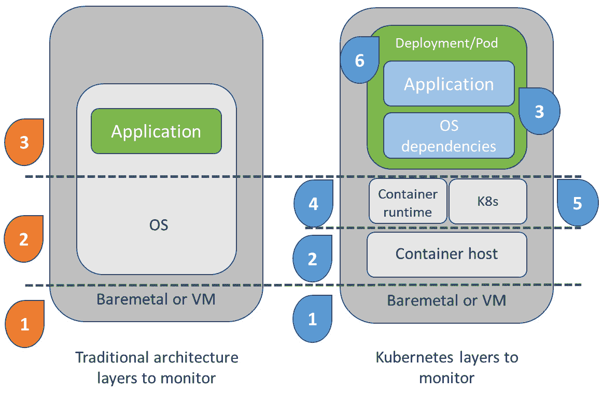

图 9.1 – 单体架构与微服务架构监控层的比较

考虑到我们引入的所有新层次和故障点，我们可以将最重要的指标总结为三大类：

+   **Kubernetes 集群健康和资源利用率指标**

+   **应用部署和 Pod 资源利用率指标**

+   **应用健康和性能指标**

在生产集群中，由于资源不足或缺少标签和注释，遇到调度问题是非常常见的。当发生调度问题时，您的应用程序可能会迅速进入不稳定状态，直接影响服务的可用性。多个原因可能触发这些问题，开始故障排除的最佳方法是观察关键集群健康和资源利用率指标的变化。Kubernetes 提供了每个层级的详细信息，以检测影响集群性能的瓶颈。

大多数有用的指标可以通过 Metrics API 和 HTTP 服务器的 `/metrics` 端点实时获取。建议定期将指标抓取到类似 Prometheus 服务器的时间序列数据库中进行存储。您可以在 Kubernetes 官方文档网站上阅读更多关于资源指标管道的内容：[`kubernetes.io/docs/tasks/debug-application-cluster/resource-metrics-pipeline/`](https://kubernetes.io/docs/tasks/debug-application-cluster/resource-metrics-pipeline/)。

下面是我们需要关注的一些有用的集群资源和内部指标的简要列表。

### Kubernetes 集群健康和资源利用率指标

活跃节点的数量是一个关键指标，它可以告诉我们集群成本和健康的直接影响。可以通过观察此处列出的指标来查看节点资源的利用率：

+   CPU 利用率、CPU 请求承诺和 CPU 限制承诺

+   内存使用情况、内存请求承诺和内存限制承诺

+   网络 I/O 压力

+   磁盘 I/O、磁盘空间使用情况和卷空间使用情况

Kubernetes 控制平面在多个组件的帮助下做出关键的调度决策，包括 Kubernetes API 服务器（`kube-apiserver`）、高可用键值存储（`etcd`）、调度器功能（`kube-scheduler`）以及处理 Kubernetes 控制循环的守护进程（`kube-controller-manager`）。Kubernetes 控制平面通常运行在专用的主节点上。因此，控制平面的健康和可用性对我们集群的调度能力至关重要。我们可以通过观察此处列出的指标来监控控制平面的状态：

+   **API 服务器的可用性和 API 服务器读/写服务级指标（SLI）**

+   **etcd 的正常运行时间和 etcd 总领导者选举次数**

+   **调度器的正常运行时间、调度速率、POST 请求延迟和 GET 请求延迟**

+   **控制器管理器的正常运行时间、工作队列添加速率和工作队列延迟**

此处列出的所有指标共同指示了我们 Kubernetes 集群中的资源和控制平面可用性。

### 应用部署和 Pod 资源利用率指标

从应用 Pod 和部署健康监控的角度来看，资源分配是我们需要关注的重点。我们可以观察以下按 Kubernetes 构造（如 Pod、部署、命名空间、工作负载和 StatefulSets）分类的指标，以便排查待处理或失败的部署：

+   **计算资源（按命名空间、Pod 和工作负载）**

+   **StatefulSet 期望副本数与当前版本的副本数**

+   **Kubelet 的正常运行时间、Pod 启动时长和操作错误率**

我们应当关注单个节点资源利用率的异常，以保持在节点之间均匀分布 Pod。我们还可以通过命名空间或工作负载的资源利用率来计算项目和团队的费用分摊。

### 应用健康和性能指标

Pod 和部署的资源利用率，甚至它们的状态，通常不能为我们提供应用的完整视图。每个应用都有不同的期望，因此也会有特定的应用提供的指标需要关注。例如，对于 **Prometheus** 应用，诸如目标同步、抓取失败、附加的样本以及正常运行时间等指标是我们需要关注的。而对于其他应用，例如 **Cassandra**，我们可能需要关注如节点总数、故障节点数、修复比率、集群操作、读写操作、延迟、超时等指标。在本章稍后的 *使用 Grafana 监控应用* 部分，我们将学习如何为我们的应用启用指标导出器，并将其仪表板添加到 Grafana 中进行监控。

现在，我们已经了解了一些 Kubernetes 观察性挑战和关键指标。接下来，让我们看看如何运用我们的知识，通过最佳网站可靠性实践来应用于实际生产用例。

# 学习网站可靠性最佳实践

在本节中，我们将了解行业站点可靠性专家在面对技术性站点可用性问题时的考虑因素和最佳实践。

**站点可靠性工程**（**SRE**）是 Google 工程团队提出的一门学科。Google 的核心服务大规模运营的方式至今仍然代表着 SRE 最佳实践的典范。你可以在 Google SRE 资源网站上了解更多关于其基础和实践的内容，网址是 [`sre.google/resources/`](https://sre.google/resources/)。在我们学习监控和指标可视化工具之前，先来看看一些常识性的 SRE 最佳实践：

+   **尽可能自动化，并立即自动化**：SRE 应该抓住一切机会来自动化耗时的基础设施任务。作为 DevOps 文化的一部分，SRE 与自主团队合作，选择自己的服务，这使得工具的统一几乎变得不可能，但任何针对工具和服务的标准化努力都能帮助小型 SRE 团队支持非常大的团队和服务。

+   **使用增量部署策略**：在 *第八章*，《部署无缝且可靠的应用程序》一节中，我们学习了不同服务的替代部署策略，这些策略可以帮助你实施这一最佳实践。

+   **定义有意义的警报，并设定正确的响应优先级和行动**：如果我们所有的通知和警报都发送到一个桶或者邮箱地址，无法期待 SRE 对不同级别的响应速度。应将警报分类，至少分为三类或更多响应类别，如 *必须立即响应*（呼叫器），*稍后响应*（工单），和 *可供分析的日志*（日志）。

+   **为扩展做好规划，并始终预期故障**：设定资源利用阈值，并规划容量以应对服务过载和基础设施故障。混沌工程也是一种非常好的实践，能够帮助避免生产环境中的意外情况。

+   **从最终用户的角度定义 SLO**：这包括优先考虑客户端度量，而非服务器端度量。如果用户体验的延迟较高，那么单靠服务器端的正向指标是不能接受的。

现在我们已经了解了 Kubernetes 可观察性挑战和站点可靠性最佳实践。接下来，我们将探讨如何在 Kubernetes 上部署监控栈，并可视化从度量导出工具收集到的指标。

# 监控、指标和可视化

在本节中，我们将了解云原生生态系统中流行的监控解决方案，以及如何快速启动和运行监控栈。监控、日志记录和追踪常常被误用为可互换的工具，因此，理解每个工具的目的非常重要。

最新的 2020 **云原生计算基金会**（**CNCF**）调查表明，企业使用多个工具（平均五个或更多）来监控它们的云原生服务。流行工具和项目的名单包括 Prometheus、OpenMetrics、Datadog、Grafana、Splunk、Sentry、CloudWatch、Lightstep、StatsD、Jaeger、Thanos、OpenTelemetry 和 Kiali。研究表明，最常见和最被采纳的工具是开源的。你可以通过访问 [`radar.cncf.io/2020-09-observability`](https://radar.cncf.io/2020-09-observability) 阅读更多关于 CNCF 社区雷达观察的内容。

Prometheus 和 Grafana 一起使用是 Kubernetes 工作负载的最相关组合解决方案。本书无法涵盖所有工具，因此我们将重点介绍流行的 Prometheus 和 Grafana 解决方案。我们将学习如何安装这些技术栈，以获取一些核心集群和应用程序的度量数据。

## 在 Kubernetes 上安装 Prometheus 技术栈

Prometheus 是生态系统中最被采纳的开源监控和告警解决方案。Prometheus 提供了一个多维数据模型，并使用一个灵活的查询语言，名为 `kube-state-metrics`，以及 Grafana。你可以通过访问官方 Prometheus 文档站点 [`prometheus.io/docs/introduction/overview/`](https://prometheus.io/docs/introduction/overview/) 阅读更多关于 Prometheus 及其概念的信息。

现在，让我们使用 `kube-prometheus-stack`（前身为 Prometheus Operator）安装 Prometheus，并准备我们的集群开始监控 Kubernetes API 服务器的变化：

1.  创建一个名为 `monitoring` 的命名空间：

    ```
    $ kubectl create ns monitoring
    ```

1.  将 `kube-prometheus-stack` Helm Chart 仓库添加到你的本地仓库列表：

    ```
    $ helm repo add prometheus-community https://prometheus-community.github.io/helm-charts
    ```

1.  将 Helm `stable` chart 仓库添加到你的本地仓库列表：

    ```
    $ helm repo add stable https://charts.helm.sh/stable
    ```

1.  更新 Helm Chart 仓库：

    ```
    $ helm repo update
    ```

1.  从其 Helm 仓库安装 `kube-prometheus-stack`：

    ```
    $ helm install --namespace monitoring prometheus prometheus-community/kube-prometheus-stack
    ```

1.  执行以下命令验证安装是否成功：

    ```
    $ kubectl get pods -n monitoring
    ```

1.  上述命令的输出应如下所示：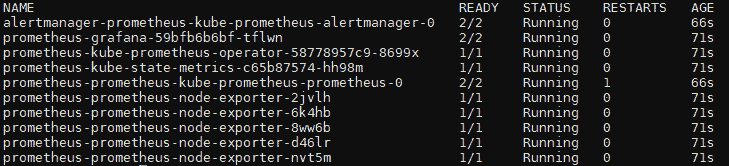

    图 9.2 – 安装成功后运行的 Prometheus Pod 列表

1.  现在我们已经安装了 `kube-prometheus-stack`。让我们访问包含的 Grafana 服务实例。创建端口转发以便在本地访问 Prometheus 界面和 Grafana 仪表板：

    ```
    NodePort to LoadBalancer.
    ```

1.  执行以下命令验证服务 IP：

    ```
    $ kubectl get svc -n monitoring
    ```

1.  上述命令的输出应如下所示：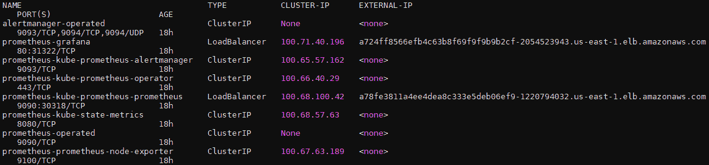

    图 9.3 – 监控命名空间中暴露的服务列表

1.  如果您使用了端口转发，您可以通过 `http://localhost:9090`（用于 Prometheus）和 `http://localhost:3000`（用于 Grafana）访问主机上的服务界面。如果您改用 `LoadBalancer`，则可以使用 `kubectl get svc -nmonitoring` 命令输出的外部 IP 和端口地址。您将看到一个类似以下的 Grafana 登录界面：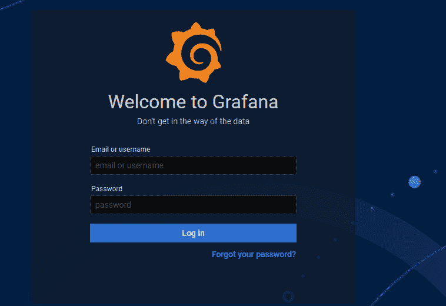

    图 9.4 – Grafana 服务登录界面

1.  使用默认的 `admin` Grafana 用户名和 `prom-operator` 密码访问 Grafana 仪表盘。如果您使用了自定义密码，可以通过执行以下命令从其 secret 资源中获取密码：

    ```
    $ kubectl get secret \
         --namespace monitoring prometheus-grafana \
         -o jsonpath="{.data.admin-password}" \
         | base64 --decode ; echo
    ```

1.  点击仪表盘左上角的 **搜索** 按钮，搜索可用的仪表盘并选择您想查看的仪表盘。您可以通过选择 **Kubernetes / 计算资源 / 集群** 仪表盘，查看命名空间中 Pod 使用的集群资源消耗，类似以下截图所示：

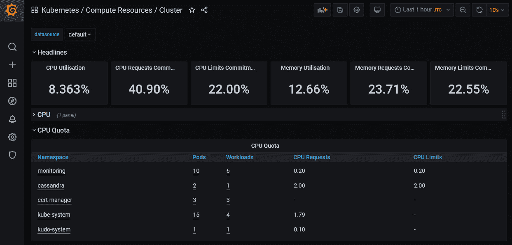

图 9.5 – Grafana 中的 Kubernetes 集群资源仪表盘

作为 `kube-prometheus` 堆栈的一部分，您可以立即开始监控约 20 个仪表盘。以下是一些重要仪表盘的列表：

+   **etcd**

+   **Kubernetes: API 服务器**

+   **Kubernetes / 计算资源 / 集群 - 命名空间（pods）、命名空间（工作负载）、节点（pods）、Pod、工作负载**

+   **Kubernetes / 控制器管理器**

+   **Kubernetes / Kubelet**

+   **Kubernetes / 网络 / 集群 - 命名空间（Pods）、命名空间（工作负载）、Pod、工作负载**

+   **Kubernetes / 持久化存储卷：**

+   **Kubernetes / 代理**

+   **Kubernetes / 调度器**

+   **Kubernetes / StatefulSets**

+   **节点**

我们现在已经学习了如何获取必要的组件，以便在 Kubernetes 集群上运行基于 Prometheus 的监控堆栈。接下来，让我们向 Grafana 实例添加新的仪表盘，以便监控我们的应用。

## 使用 Grafana 监控应用程序

Grafana 是一个开源的可观察性平台，用于通过插件可视化来自各种数据库的数据。Grafana 常常与 Prometheus 配合使用，以可视化来自 Kubernetes 端点的度量指标。Grafana 拥有庞大的社区，使得创建可观察性仪表盘或使用其官方和社区驱动的仪表盘变得非常容易。现在，我们将学习如何将额外的仪表盘添加到 Grafana 界面，以观察我们的应用状态。

您可以在官方 Grafana 文档网站上阅读更多关于 Grafana 及其概念的内容：[`grafana.com/docs/grafana/latest/`](https://grafana.com/docs/grafana/latest/)。

在*第七章*，《管理存储和有状态应用程序》一节的 *有状态工作负载操作符* 部分中，我们使用 KUDO 部署了一个 Cassandra 实例。在这里，我们将使用现有的实例并将一个仪表盘添加到 Grafana，以监控其状态。如果你没有部署 Cassandra 实例，可以参考 *第七章*，《管理存储和有状态应用程序》中的说明来配置它，或者使用这些说明作为监控其他应用程序的指南。

现在，启用我们现有 Cassandra 实例上的 Prometheus 导出器，并添加仪表盘：

1.  默认情况下，我们的 KUDO 操作的应用实例上的 Prometheus 导出器是禁用的。我们可以通过执行以下命令来启用度量导出器：

    ```
    $ kubectl kudo update \
         -p PROMETHEUS_EXPORTER_ENABLED=true \
         --instance $instance_name -n $namespace_name
    ```

1.  更新 `servicemonitor` 标签，以从我们的 Prometheus 实例中获取度量数据：

    ```
    $ kubectl label servicemonitor cassandra-monitor \
          -n $namespace_name release=prometheus --overwrite
    ```

1.  点击 Grafana 界面左上角的 **+** 按钮，并选择 **导入**：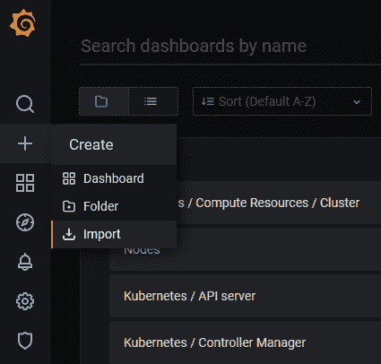

    图 9.6 – 导入菜单视图以添加新的 Grafana 仪表盘

1.  将 [`grafana.com/api/dashboards/10849/revisions/1/download`](https://grafana.com/api/dashboards/10849/revisions/1/download) 链接粘贴到 **通过 garafana.com 导入** 字段，并点击 **加载** 按钮。

1.  在下一个屏幕中，选择 **Prometheus** 作为数据源，并点击 **导入** 按钮来加载仪表盘，类似于下面截图中显示的界面：

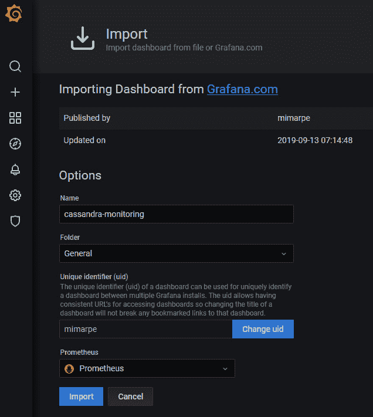

图 9.7 – 从 Grafana.com 导入新的仪表盘

现在，我们已经学会了如何添加自定义仪表盘来监控 Kubernetes 中应用程序的状态。同样，您可以在 Grafana 网站上找到社区构建的仪表盘，[`grafana.com/grafana/dashboards`](https://grafana.com/grafana/dashboards)，以便监控您的应用程序和常见的 Kubernetes 组件。

# 日志记录与追踪

本节我们将了解云原生生态系统中流行的日志解决方案，以及如何快速部署一个日志栈。

在 Kubernetes 上运行的应用程序的日志处理与传统应用程序的日志处理方式有很大不同。在单体应用中，当服务器或应用崩溃时，我们的服务器仍然可以保留日志。但在 Kubernetes 中，当一个 Pod 崩溃时，会调度一个新的 Pod，从而导致旧的 Pod 及其记录被清除。容器化应用与传统应用的主要区别在于我们如何以及在哪里运输和存储日志以备后用。

两个专注于云原生的流行日志栈是**Elasticsearch、Fluentd 和 Kibana**（**EFK**）栈和**Promtail、Loki 和 Grafana**（**PLG**）栈。两者在设计和架构上有根本的差异。EFK 栈使用 Elasticsearch 作为对象存储，Fluentd 用于日志路由和聚合，Kibana 用于日志的可视化。PLG 栈基于由 Grafana 团队设计的一个水平可扩展的日志聚合系统，使用 Promtail 代理将日志发送到 Loki 集群。你可以在[`grafana.com/oss/loki/`](https://grafana.com/oss/loki/)上了解更多关于 Loki 的信息。

在本节中，我们将专注于 EFK 栈作为我们的集中式日志解决方案。我们将学习如何安装该栈以存储和可视化我们的日志。

## 在 Kubernetes 上安装 EFK 栈

让我们按照以下步骤启动我们的日志解决方案。我们将从使用 Elasticsearch Operator 安装 Elasticsearch 开始，然后部署 Kibana 实例，最后添加 Fluent Bit 来聚合我们的日志：

重要提示

你可以在[`github.com/PacktPublishing/Kubernetes-in-Production-Best-Practices/blob/master/Chapter09/logging/eck/elastic.yaml`](https://github.com/PacktPublishing/Kubernetes-in-Production-Best-Practices/blob/master/Chapter09/logging/eck/elastic.yaml)找到完整的源代码。

1.  将 `elastic` Helm Chart 仓库添加到本地仓库列表中：

    ```
    $ helm repo add elastic https://helm.elastic.co
    ```

1.  更新 Helm Chart 仓库：

    ```
    $ helm repo update
    ```

1.  安装 `eck-operator` 及其**自定义资源定义**（**CRD**）从其 Helm 仓库：

    ```
    $ helm install eck-operator \
         elastic/eck-operator --version 1.3.1
    ```

1.  执行以下命令验证 CRD 已创建并且安装成功：

    ```
    kubectl -n elastic-system logs -f statefulset.apps/elastic-operator command.
    ```

1.  上述命令的输出应如下所示：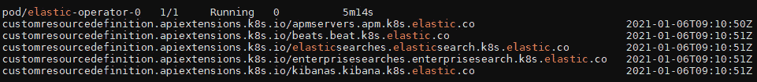

    图 9.8 – 成功安装后运行的 ECK pod 列表和创建的 CRD

1.  创建一个名为`logging`的命名空间：

    ```
    $ kubectl create ns logging
    ```

1.  创建一个名为 `elastic` 的 Elasticsearch 实例清单，设置所需的节点数量，并在 `logging/eck/elastic.yaml` 路径中将 `NodeSets.count` 设置为 `3`。如果你希望部署较新版本，请确保更改 `version`：

    ```
    apiVersion: elasticsearch.k8s.elastic.co/v1
    kind: Elasticsearch
    metadata:
      name: elastic
      namespace: logging
    spec:
      version: 7.10.1
      nodeSets:
      - name: default
        count: 3
        config:
          node.store.allow_mmap: false
    ```

1.  执行以下 `kubectl` 命令在集群中创建一个 Elasticsearch 实例：

    ```
    $ kubectl apply -f elastic.yaml
    ```

1.  通过执行以下命令验证我们创建的 Elasticsearch 节点的状态：

    ```
    $ kubectl get pods -n logging 
    ```

1.  上述命令的输出应如下所示：![图 9.9 – 所有 Elasticsearch 节点处于准备就绪状态]

    ](img/B16192_09_009.jpg)

    图 9.9 – 所有 Elasticsearch 节点处于准备就绪状态

1.  我们可以通过执行以下命令来验证 Elasticsearch pod 的状态：

    ```
    $ kubectl get elasticsearch -n logging 
    ```

1.  上述命令的输出应如下所示：![图 9.10 – 所有 Elasticsearch pod 已准备好并正在运行]

    ](img/B16192_09_010.jpg)

    图 9.10 – 所有 Elasticsearch pod 已准备好并正在运行

1.  将为 `elastic` 用户创建的凭据存储在名为 `ES_PASSWORD` 的变量中：

    ```
    $ ES_PASSWORD=$(kubectl get secret \
         elastic-es-elastic-user -n logging \
         -o go-template='{{.data.elastic | base64decode}}')
    ```

1.  获取在日志命名空间中创建的服务列表：

    ```
    $ kubectl get svc -n logging
    ```

1.  前述命令的输出应如下所示：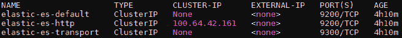

    ](img/B16192_09_011.jpg)

    图 9.11 – Elasticsearch Operator 创建的服务列表

    重要提示

    当从我们的工作站访问时，我们可以通过以下命令创建端口转发，将服务端点转发到`localhost`：`$ kubectl port-forward service/elastic-es-http 9200`。

1.  通过执行以下命令，使用我们保存的密码和服务名称获取 Elasticsearch 端点的地址：

    ```
    $ curl -u "elastic:$ES_PASSWORD" \
         -k https://elastic-es-http:9200
    ```

1.  前述命令的输出应如下所示：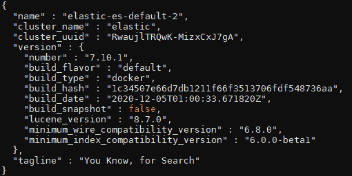

    ](img/B16192_09_012.jpg)

    图 9.12 – Elasticsearch Operator 创建的服务列表

    重要提示

    你可以在[`github.com/PacktPublishing/Kubernetes-in-Production-Best-Practices/blob/master/Chapter09/logging/eck/kibana.yaml`](https://github.com/PacktPublishing/Kubernetes-in-Production-Best-Practices/blob/master/Chapter09/logging/eck/kibana.yaml)找到完整的源代码。

1.  现在，我们已经部署了 Elasticsearch 实例。接下来，部署一个 Kibana 实例，并将其与现有的 Elasticsearch 实例捆绑。创建一个名为`kibana`的 Kibana 实例清单，指定`3`个节点，并将其保存在`logging/eck/kibana.yaml`路径中。如果需要部署更新版本，请确保替换`version`字段：

    ```
    apiVersion: kibana.k8s.elastic.co/v1
    kind: Kibana
    metadata:
      name: kibana
      namespace: logging
    spec:
      version: 7.10.1
      count: 3
      elasticsearchRef:
        name: elastic
    ```

1.  执行以下`kubectl`命令在集群中创建一个 Kibana 实例：

    ```
    $ kubectl apply -f kibana.yaml
    ```

1.  通过执行以下命令来验证我们创建的 Kibana 节点的状态：

    ```
    $ kubectl get kibana -n logging 
    ```

1.  前述命令的输出应如下所示：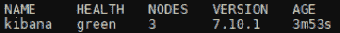

    ](img/B16192_09_013.jpg)

    图 9.13 – 所有 Kibana 节点处于健康状态

1.  我们可以通过执行以下命令来验证相关 Kibana Pod 的状态：

    ```
    $ kubectl get pods -n logging  \
         --selector='kibana.k8s.elastic.co/name=kibana'
    ```

1.  前述命令的输出应如下所示：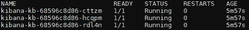

    图 9.14 – 所有 Kibana Pod 都已准备好并正在运行

1.  获取在日志命名空间中创建的服务列表：

    ```
    $ kubectl get svc -n logging \
         --selector='kibana.k8s.elastic.co/name=kibana'
    ```

1.  当从本地工作站访问时，我们可以通过以下命令创建端口转发，将服务端点转发到`localhost`：

    ```
    $ kubectl port-forward service/kibana-kb-http 5601
    ```

1.  通过执行以下命令获取我们之前获得的`elastic`用户密码：

    ```
    $ echo $ES_PASSWORD
    ```

1.  现在，在浏览器中打开`https://localhost:5601`。使用`elastic`用户和我们从上一步复制的密码访问 Kibana 界面。

    重要提示

    你可以在[`github.com/PacktPublishing/Kubernetes-in-Production-Best-Practices/blob/master/Chapter09/logging/eck/fluent-bit-values.yaml`](https://github.com/PacktPublishing/Kubernetes-in-Production-Best-Practices/blob/master/Chapter09/logging/eck/fluent-bit-values.yaml)找到完整的源代码。

1.  现在，我们已经安装了 Elasticsearch 和 Kibana 实例。作为最后一步，让我们部署 `fluent-bit` 实例以聚合日志。创建一个名为 `fluent-bit-values.yaml` 的 Helm 配置文件。如果需要，请确保替换 `host` 地址和 `http_password` 参数：

    ```
    backend:
      type: es
      es:
        host: elastic-es-http
        port: 9200
        http_user: elastic
        http_passwd: ${ES_PASSWORD}
        tls: "on"
        tls_verify: "off"
    parsers:
      enabled: true
      regex:
        - name: log_parser
          regex: ^(?<logtimestamp>[^ ]+) (?<stream>stdout|stderr) (?<logtag>[^ ]*) (?<log>.*)$
          timeKey: logtimestamp
          timeFormat: "%Y-%m-%dT%H:%M:%S.%L%z"
    input:
      tail:
        parser: log_parser
    ```

1.  将 Helm `stable` Chart 仓库添加到本地仓库列表：

    ```
    $ helm repo add stable https://charts.helm.sh/stable
    ```

1.  更新 Helm Chart 仓库：

    ```
    $ helm repo update
    ```

1.  从 Helm 仓库安装 `fluent-bit`：

    ```
    $ helm install fluent-bit stable/fluent-bit \
         -n logging -f fluent-bit-values.yaml
    ```

1.  通过执行以下命令验证安装是否成功：

    ```
    $ kubectl get pods -n logging
    ```

1.  上述命令的输出应该如下所示：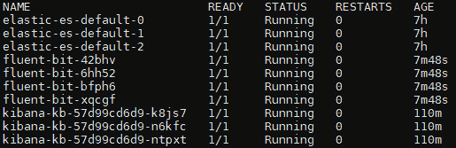

    ](img/B16192_09_015.jpg)

    图 9.15 – 完成日志堆栈所需的所有 pods 列表

1.  现在，我们将切换到浏览器中的 Kibana 界面。如果你关闭了浏览器窗口，请重复*步骤 26*和*步骤 27*以访问 Kibana 界面。点击仪表板上的**Kibana**图标。

1.  在 Kibana 入门仪表板上，点击**添加数据**按钮。仪表板应该看起来像下面的截图：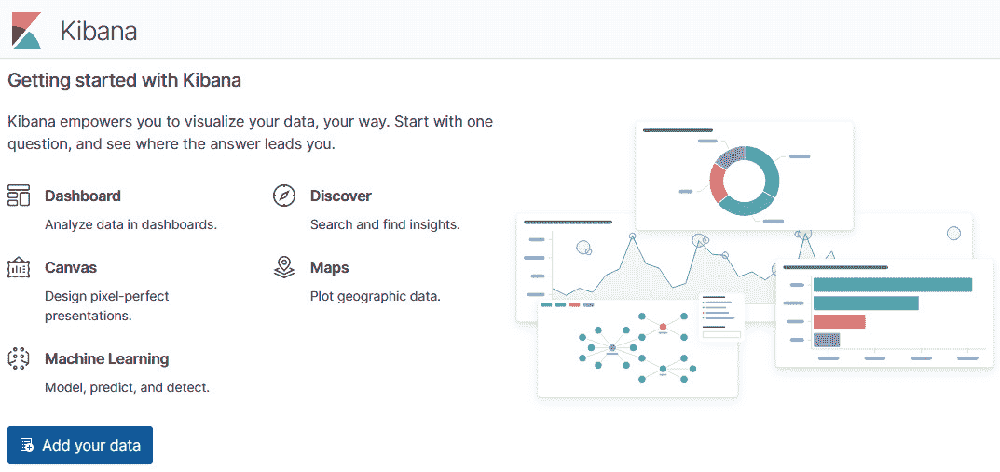

    ](img/B16192_09_016.jpg)

    图 9.16 – Kibana 的入门界面

1.  现在，Kibana 会检测到 Fluent Bit 转发的数据。在下一个屏幕上，点击**创建索引模式**按钮，创建一个与我们的索引匹配的索引模式。

1.  如下图所示，Fluent Bit 创建的索引遵循 `kubernetes_cluster-YYY.MM.DD` 模式。在这里，使用 `kubernetes_cluster-*` 作为我们的索引模式名称，然后点击**下一步**按钮继续：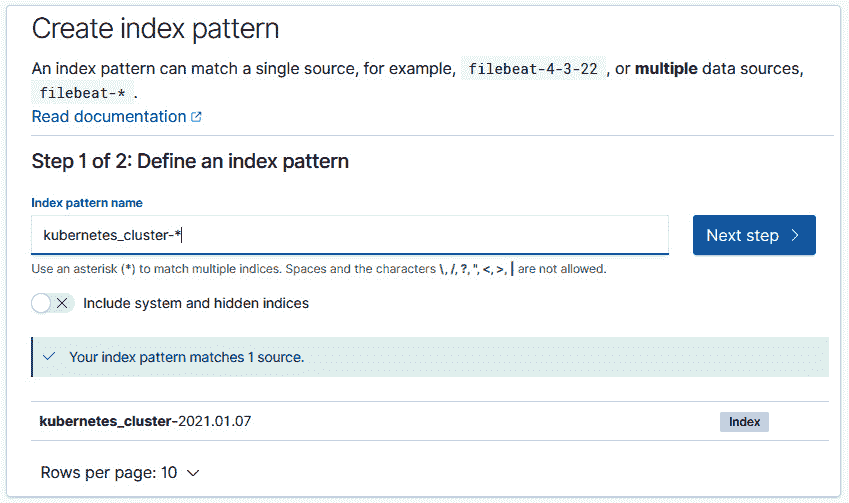

    ](img/B16192_09_017.jpg)

    图 9.17 – 在 Kibana 上创建索引模式以匹配源数据

1.  最后，在**时间过滤器**字段中输入 `@timestamp`，然后点击**创建索引模式**按钮以完成索引。

现在我们已经学习了如何在 Kubernetes 堆栈上部署基于 ECK 堆栈的日志解决方案，以聚合和可视化我们的集群日志。在生产环境中运行时，请确保将运行日志堆栈的集群与从中收集日志的集群分开。我们需要确保，在集群由于任何原因无法访问时，我们的日志以及用于故障排除的日志堆栈仍然可以访问。

# 总结

在本章中，我们探讨了 Kubernetes 的重要指标，并学习了 SRE（站点可靠性工程）在维持更高可用性方面的最佳实践。我们学习了如何搭建基于 Prometheus 和 Grafana 的监控与可视化堆栈，并将自定义应用仪表板添加到我们的 Grafana 实例中。我们还学习了如何在 Kubernetes 集群上搭建基于 Elasticsearch、Kibana 和 Fluent Bit 的 ECK 日志堆栈。

在接下来的最后一章中，我们将学习 Kubernetes 操作的最佳实践。我们将涵盖集群维护的主题，如升级与轮换、灾难恢复与避免、集群与应用故障排除、质量控制、持续改进和治理。

# 深入阅读

你可以参考以下链接，了解本章中涉及的主题的更多信息：

+   *CNCF 终端用户技术雷达：可观察性*: [`www.cncf.io/blog/2020/09/11/cncf-end-user-technology-radar-observability-september-2020/`](https://www.cncf.io/blog/2020/09/11/cncf-end-user-technology-radar-observability-september-2020/)

+   *Hands-On 基础设施监控与 Prometheus*: [`www.packtpub.com/product/hands-on-infrastructure-monitoring-with-prometheus/9781789612349`](https://www.packtpub.com/product/hands-on-infrastructure-monitoring-with-prometheus/9781789612349)

+   *Prometheus 官方文档*: [`prometheus.io/docs/introduction/overview/`](https://prometheus.io/docs/introduction/overview/)

+   *学习 Grafana 7.0*: [`www.packtpub.com/product/learn-grafana-7-0/9781838826581`](https://www.packtpub.com/product/learn-grafana-7-0/9781838826581)

+   *Grafana 官方及社区构建的仪表板*: [`grafana.com/grafana/dashboards`](https://grafana.com/grafana/dashboards)

+   *ECK 操作员官方文档*: [`www.elastic.co/guide/en/cloud-on-k8s/current/k8s-operating-eck.html`](https://www.elastic.co/guide/en/cloud-on-k8s/current/k8s-operating-eck.html)

+   *Kubernetes 日志记录：EFK 与 PLG 堆栈*: [`www.cncf.io/blog/2020/07/27/logging-in-kubernetes-efk-vs-plg-stack/`](https://www.cncf.io/blog/2020/07/27/logging-in-kubernetes-efk-vs-plg-stack/)
