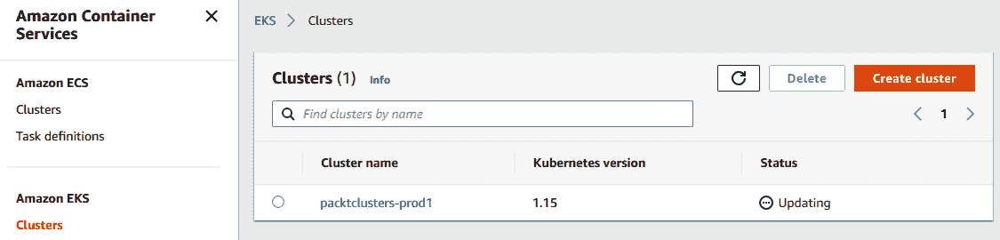

# *第十章*: 高效操作与维护 Kubernetes 集群

在前几章中，我们学习了自动化 Kubernetes 及其基础设施组件的生产最佳实践。我们讨论了在集群中配置无状态工作负载的挑战，包括如何让持久化存储正常运行、选择容器镜像和部署策略。我们还了解了生态系统中重要的可观察性工具，并在集群中构建监控和日志堆栈，为故障排除需求提供坚实基础。一旦我们拥有一个生产就绪的集群并开始提供工作负载，维持集群的高效运作以保证集群的维护、可用性以及其他**服务级目标**（**SLOs**）就变得至关重要。

本章将重点介绍 Kubernetes 操作最佳实践，并涵盖与集群维护相关的主题，如升级和轮换、备份、灾难恢复与避免、集群以及控制平面、工作节点和应用程序故障的故障排除。最后，我们将学习用于验证和改善集群质量的解决方案。

本章我们将讨论以下主要主题：

+   学习集群维护和升级

+   准备备份和灾难恢复

+   验证集群质量

# 技术要求

你应该已经安装了以下工具（来自前几章）：

+   AWS CLI v2

+   AWS IAM 认证器

+   `kubectl`

+   Terraform

+   Helm 3

+   `metrics-server`

+   MinIO 实例（作为备份的 S3 目标， 可选）

你需要根据 *第三章* 中的指示，拥有一个正常运行的 Kubernetes 集群，*使用 AWS 和 Terraform 配置 Kubernetes 集群*。

本章的代码位于 [`github.com/PacktPublishing/Kubernetes-in-Production-Best-Practices/tree/master/Chapter10`](https://github.com/PacktPublishing/Kubernetes-in-Production-Best-Practices/tree/master/Chapter10)。

查看以下链接，观看实际操作视频：

[`bit.ly/3aAdPzl`](https://bit.ly/3aAdPzl)

# 学习集群维护和升级

在本节中，我们将学习如何升级生产环境中的 Kubernetes 集群。通常，新的 Kubernetes 主版本会每季度发布一次，每个次版本在发布后的大约 12 个月内提供支持。按照软件升级的一般规则，除非是紧急的、时间敏感的安全补丁，否则不常在新版本发布后立即进行升级。云服务提供商也遵循相同的做法，并在向公众发布新镜像之前进行合规性测试。因此，云服务提供商的 Kubernetes 版本通常会滞后于 Kubernetes 上游发布的几个版本。如果你想了解最新的版本发布，可以在 Kubernetes 官方文档站点找到相关的发布说明，网址为 [`kubernetes.io/docs/setup/release/notes/`](https://kubernetes.io/docs/setup/release/notes/)。

在 *第三章*，*使用 AWS 和 Terraform 部署 Kubernetes 集群* 中，我们了解了集群部署和发布策略。我们还了解到，集群部署不是一次性任务，而是一个持续的过程，它影响集群的质量、稳定性和运营，甚至影响基于集群运行的产品和服务。在之前的章节中，我们建立了坚实的基础设施部署策略，现在我们将在本章中继续遵循它，实施生产级的升级最佳实践。

在 *第三章*，*使用 AWS 和 Terraform 部署 Kubernetes 集群* 中，我们通过 Terraform 自动化了集群部署。现在让我们使用相同的集群，将其升级到一个更新的 Kubernetes 版本。

## 升级 kubectl

首先，我们将升级 `kubectl` 到最新版本。你的 `kubectl` 版本应该至少等于或大于你计划升级到的 Kubernetes 版本：

1.  下载最新的 `kubectl` 二进制文件并将其复制到 `bin` 目录：

    ```
    $ curl -LO https://storage.googleapis.com/kubernetes-release/release/$(curl -s https://storage.googleapis.com/kubernetes-release/release/stable.txt)/bin/linux/amd64/kubectl
    $ chmod +x ./kubectl && sudo mv ./kubectl /usr/local/bin/kubectl 
    ```

1.  通过执行以下命令确认 `kubectl` 二进制文件已更新为较新版本：

    ```
    $ kubectl version --short Client Version: v1.20.1
    Server Version: v1.15.12-eks-31566f
    ```

1.  现在，通过执行以下命令检查你的节点状态和版本：

    ```
    $ kubectl get nodes
    ```

    上述命令的输出应如下所示：


图 10.1 – kubectl 命令显示节点状态及其版本

在这里，我们已经将 `kubectl` 升级到最新版本。接下来，继续进行下一步，升级我们的集群版本。

## 升级 Kubernetes 控制平面

AWS EKS 集群每次只能升级一个版本。这意味着，如果我们当前的版本是 1.15，我们可以先升级到 1.16，然后再升级到 1.17，以此类推。

重要说明

你可以在 [`github.com/PacktPublishing/Kubernetes-in-Production-Best-Practices/tree/master/Chapter10/terraform`](https://github.com/PacktPublishing/Kubernetes-in-Production-Best-Practices/tree/master/Chapter10/terraform) 查找到完整的源代码。

让我们使用我们在*第三章*中也使用过的 Terraform 脚本来升级我们的控制节点，*通过 AWS 和 Terraform 提供 Kubernetes 集群*：

1.  编辑 `terraform.tfvars` 文件，该文件位于 `Chapter10/terraform/packtclusters` 目录下，并将 `cluster_version` 值增加到下一个发布版本号。在我们的示例中，我们已将版本从 `1.15` 升级到 `1.16`：

    ```
    aws_region = "us-east-1"
    private_subnet_ids = [
      "subnet-0b3abc8b7d5c91487",
      "subnet-0e692b14dbcd957ac",
      "subnet-088c5e6489d27194e",
    ]
    public_subnet_ids = [
      "subnet-0c2d82443c6f5c122",
      "subnet-0b1233cf80533aeaa",
      "subnet-0b86e5663ed927962",
    ]
    vpc_id = "vpc-0565ee349f15a8ed1"
    clusters_name_prefix  = "packtclusters"
    cluster_version       = "1.16"        #Upgrade from 1.15
    workers_instance_type = "t3.medium"
    workers_number_min    = 2
    workers_number_max    = 3
    workers_storage_size  = 10
    ```

1.  运行 `terraform plan` 命令以验证计划的更改，确保应用这些更改之前没有问题：

    ```
    terraform plan command completes successfully. There is one resource to change. We are only changing the cluster version:Figure 10.2 – The terraform plan command output
    ```

1.  执行 `terraform apply` 命令。当提示您确认本地更新时，输入 `yes`：

    ```
    $ terraform apply
    ```

    在升级过程中，我们可以通过命令行或 AWS 控制台跟踪进度。AWS 控制台中的集群状态将类似于以下截图：



图 10.3 – AWS 控制台输出显示集群状态为“正在更新”

`terraform apply` 命令成功完成后，您将获得以下结果。此时，Terraform 已成功更改了一个 AWS 资源：


图 10.4 – terraform apply 命令输出

在这里，我们已经将 Kubernetes 控制平面更新到下一个可用版本。接下来，继续进行下一步，升级我们的节点组。

## 升级 Kubernetes 组件

升级 Kubernetes 控制平面并不会升级工作节点或我们的 Kubernetes 附加组件，如 `kube-proxy`、CoreDNS 和 Amazon VPC CNI 插件。因此，在升级控制平面后，如果需要，我们需要仔细升级每个组件到支持的版本。您可以在 Amazon EKS 文档网站上了解更多有关支持的组件版本和 Kubernetes 升级先决条件的内容：[`docs.aws.amazon.com/eks/latest/userguide/update-cluster.html`](https://docs.aws.amazon.com/eks/latest/userguide/update-cluster.html)。以下图示例显示了我们将在示例中遵循的升级路径支持矩阵表：


图 10.5 – Kubernetes 组件支持矩阵示例

某些版本升级可能还需要在应用程序的 YAML 清单中进行更改，以引用新的 API。强烈建议使用持续集成工作流测试应用程序的行为。

现在我们的 EKS 控制平面已经升级，让我们升级 `kube-proxy`：

1.  执行以下命令以获取当前版本的 `kube-proxy` 组件：

    ```
    $ kubectl get daemonset kube-proxy --namespace kube-system -o=jsonpath='{$.spec.template.spec.containers[:1].image}'
    ```

    上述命令的输出应如下所示。请注意，您的账户 ID 和区域将不同：

    ```
    123412345678.dkr.ecr.us-east-1.amazonaws.com/eks/kube-proxy:v1.15.11-eksbuild.1
    ```

1.  现在，通过使用之前命令的输出，将 `kube-proxy` 镜像升级到支持的版本，该版本见 *图 10.5*：

    ```
    $ kubectl set image daemonset.apps/kube-proxy \
        -n kube-system \
        kube-proxy=123412345678.dkr.ecr.us-west-2.amazonaws.com/eks/kube-proxy:v1.16.15-eksbuild.1
    ```

1.  运行*步骤 1*中的命令以确认版本更改。这时，前一个命令的输出应该如下所示：

    ```
    123412345678.dkr.ecr.us-east-1.amazonaws.com/eks/kube-proxy:v1.16.15-eksbuild.1
    ```

1.  让我们了解如何在需要时升级 `coredns`。请注意，只有从 1.17 升级到 1.18 时，`coredns` 版本需要为 1.7.0。通过执行以下命令确认您的集群使用 `coredns` 作为 DNS 提供程序：

    ```
    $ kubectl get pod -n kube-system -l k8s-app=kube-dns
    ```

    前一个命令的输出应该如下所示：

    

    图 10.6 – 在 Kubernetes 集群中运行的 CoreDNS pod

1.  通过执行以下命令获取当前 `coredns` 组件的版本：

    ```
    $ kubectl get deployment coredns --namespace kube-system -o=jsonpath='{$.spec.template.spec.containers[:1].image}'
    ```

    前一个命令的输出应该如下所示。请注意，您的账户 ID 和区域会有所不同：

    ```
    123412345678.dkr.ecr.us-east-1.amazonaws.com/eks/ coredns:v1.6.6-eksbuild.1
    ```

1.  现在，使用前一个命令的输出，将 `coredns` 镜像升级到支持的版本（参考*图 10.5*）：

    ```
    $ kubectl set image deployment.apps/coredns \
        -n kube-system \
        coredns=123412345678.dkr.ecr.us-west-2.amazonaws.com/eks/coredns:v1.7.0-eksbuild.1
    ```

1.  运行*步骤 1*中的命令以确认版本更改。这时，前一个命令的输出应该如下所示：

    ```
    123412345678.dkr.ecr.us-east-1.amazonaws.com/eks/coredns:v1.7.0-eksbuild.1
    ```

在这里，我们已将 Kubernetes 组件更新到下一个可用版本。接下来，我们将继续升级工作节点。

## 升级 Kubernetes 工作节点

升级 AWS EKS 控制器后，我们将继续添加使用更新的 AMI 镜像的新工作节点。我们将排空旧节点，并帮助 Kubernetes 将工作负载迁移到新创建的节点。

让我们升级我们的工作节点：

1.  编辑 `Chapter03/terraform/packtclusters` 目录下的 `config.tf` 文件，并将工作节点的 AMI ID 的版本从 `1.15` 更改为 `1.16`：

    ```
    terraform {
      backend "s3" {
        bucket         = "packtclusters-terraform-state"
        key            = "packtclusters.tfstate"
        region         = "us-east-1"
        dynamodb_table = "packtclusters-terraform-state-lock-dynamodb"
      }
      required_version = "~> 0.12.24"
      required_providers {
        aws = "~> 2.54"
      }
    }
    provider "aws" {
      region  = var.aws_region
      version = "~> 2.54.0"
    }
    data "aws_ssm_parameter" "workers_ami_id" {
      name            = "/aws/service/eks/optimized-ami/1.16/amazon-linux-2/recommended/image_id"
      with_decryption = false
    }
    ```

1.  编辑 `Chapter03/terraform/packtclusters` 目录下的 `terraform.tfvars` 文件，如果需要，增加 `workers_number_min`：

    ```
    aws_region = "us-east-1"
    private_subnet_ids = [
      "subnet-0b3abc8b7d5c91487",
      "subnet-0e692b14dbcd957ac",
      "subnet-088c5e6489d27194e",
    ]
    public_subnet_ids = [
      "subnet-0c2d82443c6f5c122",
      "subnet-0b1233cf80533aeaa",
      "subnet-0b86e5663ed927962",
    ]
    vpc_id = "vpc-0565ee349f15a8ed1"
    clusters_name_prefix  = "packtclusters"
    cluster_version       = "1.16"
    workers_instance_type = "t3.medium"
    workers_number_min    = 2
    workers_number_max    = 5
    workers_storage_size  = 10
    ```

1.  运行 `terraform plan` 命令来验证计划中的更改，确认无误后再应用：

    ```
    terraform plan command completes successfully. There is one resource to change. We are only changing the cluster version:Figure 10.7 – The terraform plan command output
    ```

1.  执行 `terraform apply` 命令。当提示确认进行就地更新时，输入 `yes`：

    ```
    terraform apply command completes successfully. By then, Terraform has successfully changed one AWS resource:Figure 10.8 – The Terraform command output after changes are applied
    ```

1.  执行 `kubectl get nodes` 命令以获取旧节点的名称。您将看到以下输出，正如我们所见，集群中三个节点中的两个仍在使用 v1.15.12：

    ](img/B16192_10_009.jpg)

    图 10.9 – 显示节点名称和版本的 kubectl 输出

1.  现在我们已经确认新节点已添加到集群中，接下来需要将 pod 从旧节点迁移到新节点。首先，一个一个地对旧节点进行标记，并将其排空：

    ```
    $ kubectl taint nodes ip-10-40-102-5.ec2.internal key=value:NoSchedule
    node/ip-10-40-102-5.ec2.internal tainted
    $ kubectl drain ip-10-40-102-5.ec2.internal --ignore-daemonsets --delete-emptydir-data
    ```

1.  然后，从集群中移除旧节点。新的节点将自动创建并添加到集群中。让我们通过执行 `kubectl get nodes` 命令来确认所有节点已升级。该命令的输出应该如下所示：


图 10.10 – 显示更新后的节点版本的 kubectl 输出

我们现在已经学会了如何使用 Terraform 升级 Kubernetes 控制平面和工作节点。定期备份我们集群中的持久数据和应用程序是一种生产最佳实践。在接下来的部分，我们将专注于备份应用程序，并为我们的集群做好灾难恢复的准备。

# 为备份和灾难恢复做准备

在这一部分，我们将对运行在集群中的应用程序进行完整、即时或定期备份。并非每个应用程序都需要或能够利用常规备份。无状态应用程序的配置通常存储在 Git 仓库中，并且可以在需要时作为**持续集成和持续交付**（**CI/CD**）流水线的一部分轻松部署。当然，对于有状态应用程序，如数据库、用户数据和内容，情况并非如此。我们的在线业务服务可能面临法律要求和行业特定法规的挑战，需要保留一定时间的数据副本。

由于集群外部或内部的原因，我们可能会丢失应用程序或整个集群，并且可能需要尽快恢复服务。在这种情况下，对于灾难恢复的使用场景，我们将学习如何使用存储在 S3 目标位置的备份数据来恢复服务。

在这一部分，我们将使用开源的 Velero 项目作为我们的备份解决方案。我们将学习如何安装 Velero，定期备份我们的数据并恢复它。

## 在 Kubernetes 上安装 Velero

传统备份解决方案以及云服务提供商提供的类似服务，主要关注保护节点资源。在 Kubernetes 中，运行在节点上的应用程序可以动态地在节点之间移动，因此备份节点资源无法满足容器编排平台的要求。云原生应用程序需要细粒度、了解应用程序的备份解决方案。这正是云原生备份解决方案（如 Velero）关注的方向。Velero 是一个开源项目，用于备份和恢复 Kubernetes 资源及其持久化卷。Velero 可以用于在 Kubernetes 资源上执行迁移操作和灾难恢复。你可以在 Velero 官方文档网站[`velero.io/docs/main/`](https://velero.io/docs/main/)上阅读更多关于 Velero 及其概念的内容。

信息

你可以在[`github.com/PacktPublishing/Kubernetes-in-Production-Best-Practices/tree/master/Chapter10/velero`](https://github.com/PacktPublishing/Kubernetes-in-Production-Best-Practices/tree/master/Chapter10/velero)找到完整的源代码。

现在，让我们使用最新版本安装 Velero，并准备我们的集群开始备份我们的资源：

1.  让我们获取`velero`的最新发布版本标签，并将其保存在名为`VELEROVERSION`的变量中：

    ```
    $ VELEROVERSION=$(curl –silent "https://api.github.com/repos/vmware-tanzu/velero/releases/latest" | grep '"tag_name":' | \
         sed -E 's/.*"v([^"]+)".*/\1/')
    ```

1.  现在，下载最新的`velero`发布二进制文件，并通过执行以下命令进行安装：

    ```
    $ curl --silent --location "https://github.com/vmware-tanzu/velero/releases/download/v${VELEROVERSION}/velero-v${VELEROVERSION}-linux-amd64.tar.gz" | tar xz -C /tmp
    $ sudo mv /tmp/velero-v${VELEROVERSION}-linux-amd64/velero /usr/local/bin
    ```

1.  确认 `velero` 命令可以执行：

    ```
    $ velero version
    Client:
            Version: v1.5.2
            Git commit: e115e5a191b1fdb5d379b62a35916115e77124a4
    <error getting server version: no matches for kind "ServerStatusRequest" in version "velero.io/v1">
    ```

1.  在此 `chapter10/velero/credentials-velero` 路径中创建 Velero 用于访问您的 S3 目标的凭证文件。用您的 AWS ID 和访问密钥替换 `aws_access_key_id` 和 `aws_secret_access_key`，然后保存该文件：

    ```
    [default]
    aws_access_key_id = MY_KEY
    aws_secret_access_key = MY_ACCESS_KEY
    ```

1.  在运行以下命令之前，请使用您的 AWS S3 存储桶地址或兼容 S3 的对象存储（如 MinIO 对象存储服务器地址）更新 `s3Url`。通过执行以下命令安装 Velero 服务器组件：

    ```
    $ velero install \
        --provider aws \
        --plugins velero/velero-plugin-for-aws:v1.0.0 \
        --bucket velero \
        --secret-file ./credentials-velero \
        --use-restic \
        --backup-location-config region=minio,s3ForcePathStyle="true",s3Url=http://abcd123456789-1234567891.us-east-1.elb.amazonaws.com:9000
    ```

    前面命令的输出应如下所示：

    

    ](img/B16192_10_011.jpg)

    图 10.11 – Velero 安装程序输出显示安装成功

1.  通过执行以下命令确认 Velero 服务器组件已成功安装：

    ```
    $ kubectl get deployments -l component=velero -n velero
    ```

    前面命令的输出应如下所示：


图 10.12 – Velero 部署状态显示已准备就绪

现在我们已经安装并配置了 Velero，以便将资源备份到 S3 目标。接下来，我们将学习如何对 Kubernetes 资源进行打包备份。

## 使用 Velero 备份特定资源

让我们按照此处的步骤获取我们想要保护的 Kubernetes 资源的备份。对于此示例，我们将需要一个有状态应用程序。我们将部署一个 MinIO 对象存储工作负载，上传一些文件，并对所有资源进行备份，以演示备份和恢复功能。您可以对任何想要的应用程序应用相同的步骤：

信息

您可以在 [`github.com/PacktPublishing/Kubernetes-in-Production-Best-Practices/tree/master/Chapter10/velero/backup`](https://github.com/PacktPublishing/Kubernetes-in-Production-Best-Practices/tree/master/Chapter10/velero/backup) 查找完整的源代码。

1.  如果您已经有一个带有持久卷的有状态应用程序需要保护，您可以跳过到 *步骤 4*。否则，执行以下命令部署一个 MinIO 实例以继续此场景：

    ```
    $ kubectl apply -f https://raw.githubusercontent.com/PacktPublishing/Kubernetes-Infrastructure-Best-Practices/master/Chapter10/velero/backup/deployment-minio.yaml
    ```

1.  通过执行以下命令验证 MinIO pod、服务和持久卷是否已创建：

    ```
    $ kubectl get pods,svc,pvc -nminio-demo
    ```

    前面命令的输出应如下所示：

    

    图 10.13 – MinIO pod、服务和持久卷的状态

1.  现在，我们将为所有具有 `app=minio` 标签的资源创建备份。如果您使用不同的标签，请确保匹配选择器。执行以下命令以创建备份：

    ```
    --schedule="0 1 * * *" or --schedule="@daily" parameters. Later, you can get a list of scheduled backup jobs using the velero schedule get command.
    ```

1.  运行以下命令以验证备份作业是否完成：

    ```
    $ velero backup describe minio-backup
    ```

1.  作为替代方案，我们可以备份整个命名空间中的资源。让我们再做一次备份，这次使用命名空间，通过执行以下命令：

    ```
    $ velero backup create minio-backup-ns --include-namespaces minio-demo
    ```

现在，我们已经学习了如何在 Kubernetes 中创建第一个资源组和命名空间的备份。接下来，让我们模拟一个灾难场景，并测试恢复我们的应用程序。

## 使用 Velero 从备份恢复应用程序资源

让我们按照以下步骤完全删除命名空间中的资源，并恢复之前的备份以恢复它们。你可以对任何应用程序应用相同的步骤，以便从一个集群迁移到另一个集群。这种方法还可以作为集群升级策略，以减少升级时间：

1.  通过执行以下命令删除应用程序命名空间中的所有资源：

    ```
    $ kubectl delete ns minio-demo
    ```

1.  创建一个新的命名空间，并执行以下命令，从备份中恢复应用程序及其资源：

    ```
    $ kubectl create ns minio-demo
    $ velero restore create –from-backup minio-backup
    ```

1.  等待几秒钟让资源恢复，并通过执行以下命令验证你的 MinIO pods、服务和持久卷是否已恢复：

    ```
    $ kubectl get pods,svc,pvc -nminio-demo
    ```

1.  前面的命令输出应如下所示：


图 10.14 – MinIO pods、服务和持久卷的状态

现在，我们已经学习了如何恢复生产 Kubernetes 集群中服务的资源组备份。接下来，让我们看看如何通过持续验证集群质量和排查问题来进行改进。

# 验证集群质量

在本节中，我们将学习生态系统中一些最佳实践和工具，以提高 Kubernetes 集群的各个方面的质量。持续改进是一个广泛的概念，涵盖了从提供流畅平台到在 Kubernetes 上提供服务、为资源设置特定的**服务质量**（**QoS**），以及确保资源均匀分配和释放未使用资源，以减少集群资源的压力和提供服务的整体成本。改进的定义本身正逐渐变得更加细化，它并不限于我们将在这里讨论的实践。在了解一致性和成本管理工具之前，先让我们了解一些常识性的质量最佳实践，供我们参考：

+   **生成集群状态报告**：尽管预计无论是由公有云提供商提供的托管 Kubernetes 服务、特定供应商提供的分发版本，还是基于上游 Kubernetes 的自管集群，Kubernetes 集群应表现一致，但实际上，可能会有一些限制和配置差异，我们应该进行验证。合规性测试是确保我们支持的集群被正确配置并符合官方 Kubernetes 规范的一个很好的方式。

+   `Guaranteed`、`Burstable` 或 `BestEffort`。

+   **减少延迟，接近用户的位置**：云服务提供商在不同地理位置提供集群是有原因的。通常，我们会从本地开始，观察最终用户的延迟和流量情况，然后再在不同的地理位置启动集群。观察问题和瓶颈，并在需要时扩展到更接近用户的其他区域。

+   **定义具有不同 QoS 的存储类**：在 Kubernetes 集群中，CPU、内存以及一定程度上的网络 QoS 可以由 Kubernetes 管理。存储 QoS 预计由存储提供商处理。存储可以来自集群的外部存储或外部的超融合 **容器附加存储** (**CAS**) 。最佳实践是将数据管理从特定存储供应商中抽象出来，以便使用存储类提供供应商无关的服务灵活性。根据应用的需求，可以使用不同的存储类来提供冷存储、SSD 或 NVMe 支持的存储。我们在*第七章*《管理存储和有状态应用程序》中了解了如何调整 Kubernetes 存储并选择存储解决方案。

+   **优化容器镜像**：建议持续监控集群资源的主要消耗者，改善其消耗情况，并寻找优化消耗的方式。优化容器镜像对资源利用率和性能有显著影响。你可以在*第八章*《部署无缝且可靠的应用程序》中阅读有关改善容器镜像的挑战和最佳实践。

+   **优化集群资源支出**：理论上，云服务提供商资源的唯一限制是你的预算。建议监控资源和项目分配的成本，以获取运行产品的全部成本。

现在我们已经学习了改善集群质量的最佳实践，并且已经涉及了前几章的一些内容。接下来，让我们深入了解尚未覆盖的其他领域，包括如何以非破坏性的方式验证集群资源，以及如何监控资源成本。

## 生成合规报告

有许多方法和工具可以让 Kubernetes 集群顺利运行。维护一个合适的配置是一个管理挑战。幸运的是，有一些工具可以验证报告并检测配置问题。Sonobuoy 是一个流行的开源工具，能够运行 Kubernetes 合规性测试并验证我们的集群健康状态。Sonobuoy 是集群无关的，可以生成我们集群特征的报告。这些报告用于确保最佳实践的应用，通过消除特定于发行版的问题，使得符合规范的集群能够迁移到我们的集群中。你可以在 Sonobuoy 的官方网站文档中了解更多关于使用插件和集成 **端到端**（**e2e**）测试的自定义数据收集功能，网址：[`sonobuoy.io/docs/v0.20.0/`](https://sonobuoy.io/docs/v0.20.0/)。现在，让我们安装 Sonobuoy 的最新版本并通过运行 Kubernetes 合规性测试来验证集群：

1.  获取 Sonobuoy 的最新发布版本标签，并将其保存在一个名为`SONOBUOYVERSION`的变量中：

    ```
    $ SONOBUOYVERSION=$(curl –silent "https://api.github.com/repos/vmware-tanzu/sonobuoy/releases/latest" | grep '"tag_name":' | \
         sed -E 's/.*"v([^"]+)".*/\1/')
    ```

1.  现在，下载最新的 `sonobuoy` 发布二进制文件，并通过执行以下命令进行安装（[`github.com/vmware-tanzu/sonobuoy/releases/download/v0.20.0/sonobuoy_0.20.0_linux_amd64.tar.gz`](https://github.com/vmware-tanzu/sonobuoy/releases/download/v0.20.0/sonobuoy_0.20.0_linux_amd64.tar.gz)）：

    ```
    $ curl --silent --location "https://github.com/vmware-tanzu/sonobuoy/releases/download/v${SONOBUOYVERSION}/sonobuoy_${SONOBUOYVERSION}_linux_amd64.tar.gz" | tar xz -C /tmp
    $ sudo mv /tmp/sonobuoy /usr/local/bin
    ```

1.  确认 Sonobuoy 已安装，并且可以执行命令：

    ```
    $ sonobuoy version
    Sonobuoy Version: v0.20.0
    MinimumKubeVersion: 1.17.0
    MaximumKubeVersion: 1.99.99
    GitSHA: f6e19140201d6bf2f1274bf6567087bc25154210
    ```

1.  确保集群有足够的资源来执行所有测试。你可以在 Sonobuoy 的源代码库中找到每个提供商的具体建议，网址：[`github.com/cncf/k8s-conformance/tree/master/v1.16`](https://github.com/cncf/k8s-conformance/tree/master/v1.16)。对于 EKS，建议的集群规模是 10 个 `c5.xlarge` 工作节点实例。在 EKS 集群上执行以下命令以启动合规性测试：

    ```
    $ sonobuoy run --wait \
         --sonobuoy-image projects.registry.vmware.com/sonobuoy/sonobuoy:v0.20.0
    ```

1.  为了缩短测试时间并验证配置，而不是进行完整的认证合规性测试，我们可以使用 `--mode quick` 选项运行测试：

    ```
    $ sonobuoy run --wait --mode quick
    ```

1.  验证过程可能需要最多一小时的时间，具体取决于执行的测试。完成后，执行以下命令获取插件的结果并检查失败的结果。有关检查结果的详细选项列表，请参阅文档：[`sonobuoy.io/docs/v0.20.0/results/`](https://sonobuoy.io/docs/v0.20.0/results/)：

    ```
    $ results=$(sonobuoy retrieve) $ sonobuoy results $results
    ```

    上述命令的输出应如下所示：

    

    图 10.15 – Sonobuoy 验证结果

1.  删除集群中的 Sonobuoy 组件并清理资源：

    ```
    $ sonobuoy delete --wait
    ```

现在我们已经学习了如何验证 Kubernetes 集群配置。接下来，让我们看看如何检测过度配置的空闲资源，并优化集群的总成本。

## 管理和优化集群资源成本

监控项目成本和团队费用分摊，以及管理集群总支出，是在公共云提供商上管理 Kubernetes 的一些重大挑战。由于我们可以通过云供应商获得理论上无限的扩展能力，如果不加以管理，利用费用很容易迅速上涨并成为问题。Kubecost 帮助您监控并持续改进 Kubernetes 集群的成本。您可以在 Kubecost 的官方文档网站上了解更多关于成本和容量管理的功能：[`docs.kubecost.com/`](https://docs.kubecost.com/)。

现在，让我们使用 Helm 安装 Kubecost，并开始分析集群中的成本分配：

1.  创建一个名为 `kubecost` 的命名空间：

    ```
    $ kubectl create ns kubecost
    ```

1.  将 `cost-analyzer` Helm Chart 仓库添加到本地仓库列表：

    ```
    $ helm repo add kubecost \
         https://kubecost.github.io/cost-analyzer/
    ```

1.  更新 Helm Chart 仓库：

    ```
    $ helm repo update
    ```

1.  从其 Helm 仓库安装 `cost-analyzer`：

    ```
    $ helm install kubecost kubecost/cost-analyzer \     --namespace kubecost \     --set kubecostToken="bXVyYXRAbWF5YWRhdGEuaW8=xm343yadf98"
    ```

1.  执行以下命令以验证安装是否成功：

    ```
    kube-state-metrics in the kubecost namespace. Your existing Prometheus and Grafana instance deployment of the node-exporter pod can get stuck in the pending state due to a port number conflict with the existing instances. You can resolve this issue by changing port number instances deployed with the Kubecost chart.
    ```

1.  现在我们已经安装了 `cost-analyzer`。让我们访问 Kubecost 仪表盘。创建端口转发以便在本地访问 Kubecost 界面：

    ```
    NodePort to LoadBalancer.
    ```

1.  打开浏览器窗口并访问 `http://localhost:9090`，该地址会转发到运行在集群中的 `kubecost-cost-analyzer` 服务。仪表盘将立即显示集群的月度运行成本，类似于以下内容：

    图 10.17 – Kubecost 可用集群屏幕

1.  从列表中点击您的集群，进入 Kubecost 仪表盘。仪表盘的顶部将显示总成本摘要和任何可能识别出的节省，类似于以下截图：

    图 10.18 – Kubecost 仪表盘

1.  让我们向下滚动仪表盘屏幕，找到控制器组件和服务分配的摘要。在仪表盘的底部，我们将看到健康评分。健康评分是对基础设施可靠性和性能风险的评估：

    图 10.19 – Kubecost 仪表盘显示集群健康评估评分

1.  仪表盘上最重要的快速摘要页面是健康评估和估算节省详情页面。让我们点击每个页面，查看您可以改进集群成本和性能的区域。在以下截图中，我们可以看到 Kubecost 在分析集群后提供的一个显著节省建议：

    图 10.20 – Kubecost 估算节省仪表盘

1.  点击节省类别旁边的箭头按钮，查看优化集群成本的建议。

现在我们已经学会了如何通过优化请求大小、清理废弃工作负载以及采用多种方法管理集群中的未充分利用节点，来识别每月集群成本、资源效率、成本分配和潜在节省。

# 总结

本章中，我们探讨了 Kubernetes 操作的最佳实践，并涵盖了集群维护主题，如升级、备份和灾难恢复。我们学习了如何验证我们的集群配置，以避免集群和应用程序问题。最后，我们了解了如何检测和改善资源分配以及集群资源的成本。

通过完成本书的最后一章，我们现在具备了建立和管理符合生产级别的 Kubernetes 基础设施的完整知识，这些基础设施遵循行业最佳实践，并借鉴了早期技术采用者和现实中大规模 Kubernetes 部署的成熟技术。Kubernetes 提供了一个非常活跃的用户和合作伙伴生态系统。在本书中，我们重点介绍了目前已知的最佳实践。尽管原则不会迅速改变，但与每一项新技术一样，始终会有新的解决方案和新方法来解决相同的问题。如果您有任何建议，请通过*前言*部分提到的方式联系我们，帮助我们改进本书。

# 进一步阅读

你可以参考以下链接，获取更多关于本章所涉及主题的信息：

+   *Amazon EKS Kubernetes 发布日历*: https://docs.aws.amazon.com/eks/latest/userguide/kubernetes-versions.html#kubernetes-release-calendar

+   Uber 的多区域 Kafka 灾难恢复: [`eng.uber.com/kafka/`](https://eng.uber.com/kafka/)

+   *为您的 Kubernetes 集群做好灾难恢复准备*: [`rancher.com/blog/2020/disaster-recovery-preparedness-kubernetes-clusters`](https://rancher.com/blog/2020/disaster-recovery-preparedness-kubernetes-clusters)

+   Velero 项目的官方网站: [`velero.io/`](https://velero.io/)

+   Sonobuoy 项目的官方网站: [`sonobuoy.io/`](https://sonobuoy.io/)

+   KubeDR，一个替代的开源 Kubernetes 集群备份解决方案: [`github.com/catalogicsoftware/kubedr`](https://github.com/catalogicsoftware/kubedr)

+   Kasten，一个替代的 Kubernetes 备份、灾难恢复和移动性解决方案: [`www.kasten.io/`](https://www.kasten.io/%20)
