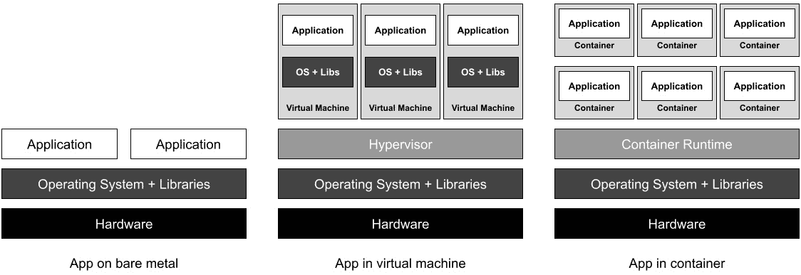
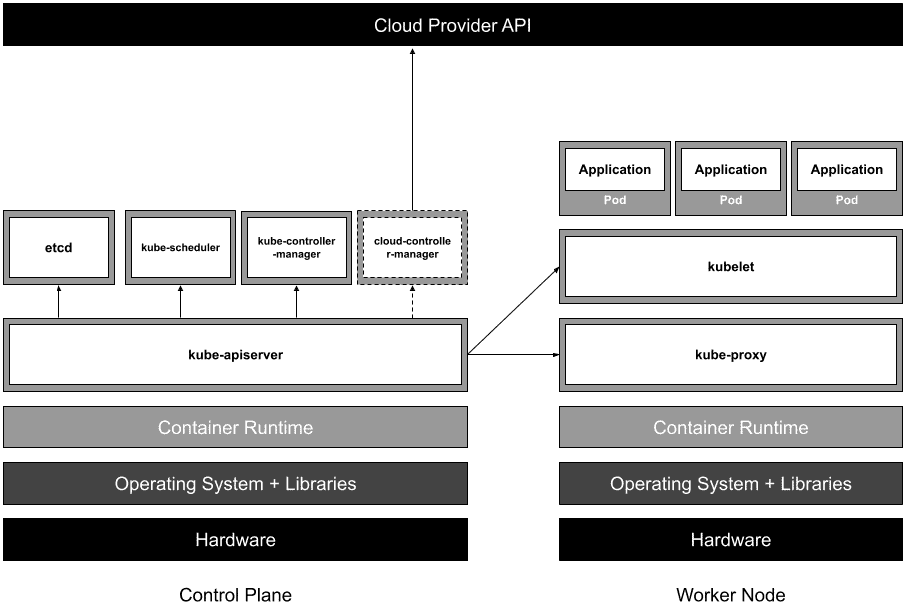
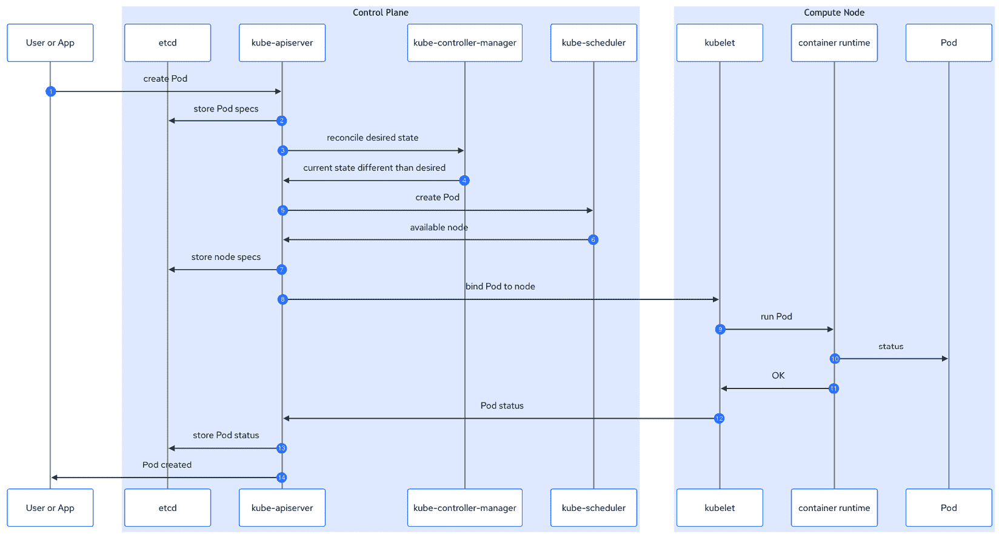
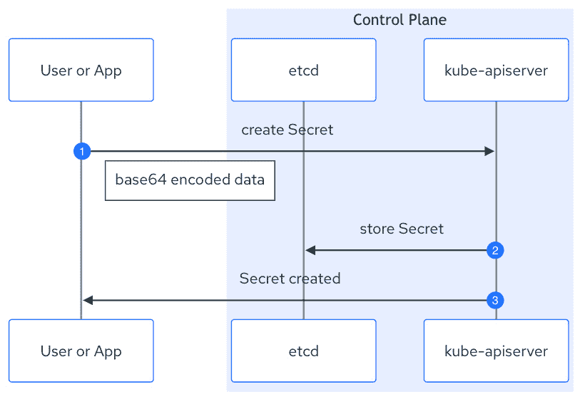
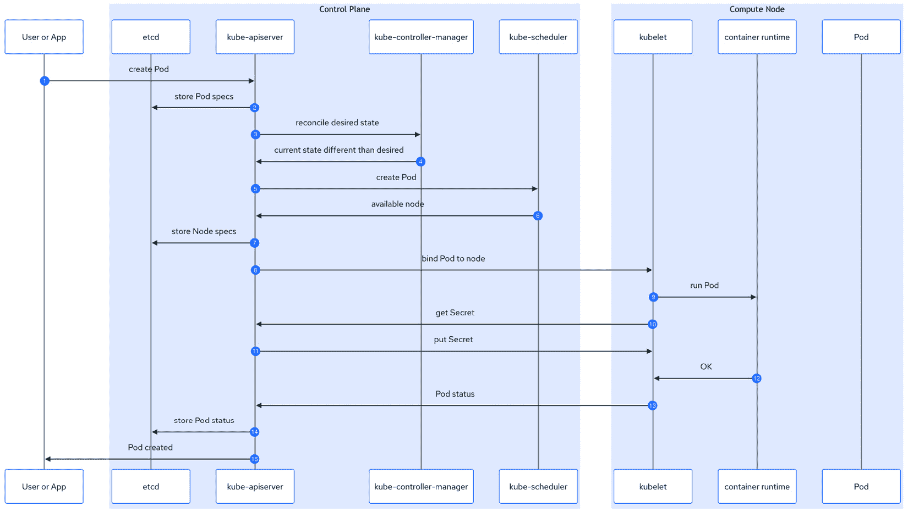

# 1

# 理解 Kubernetes Secrets 管理

本章将为您提供容器的复习内容，以及 Kubernetes 和其 Secrets 管理实现的全面概述。在这个第一部分的实践中，所有角色（开发人员、平台和安全工程师）都将了解如何设计和实现这些主题，并通过一系列实际示例加以说明。在这些示例中，我们将重点突出本书将解决的相应安全问题，涵盖一系列用例，最终为混合多云场景提供一个生产级的解决方案，包括业务连续性视角。

本章将涵盖以下主题：

+   理解 Kubernetes 的起源和设计原则

+   设置我们的第一个 Kubernetes 测试环境

+   探索 Kubernetes 的 `Secret` 和 `ConfigMap` 对象

+   分析为什么 Kubernetes Secrets 很重要

+   揭示与 Kubernetes Secrets 管理相关的挑战和风险

+   本书目标和范围的映射

# 技术要求

为完成本章的实践部分，我们将利用一系列常用于与容器、Kubernetes 和 Secrets 管理交互的工具和平台。在本章中，我们将一起设置这个环境，并通过一个友好的桌面图形解决方案进行第一组示例的启动。别担心——我们为您准备了 Code in Action 和 GitHub 仓库，其中包含 macOS 安装示例。以下是所需工具的列表：

+   在用户级别使用 `systemd` 来自动启动容器/Pods。

+   **Podman Desktop** ([`podman-desktop.io`](https://podman-desktop.io)) 是一款开源软件，提供图形用户界面用于构建、启动和调试容器，运行本地 Kubernetes 实例，简化从容器到 Pod 的迁移，甚至可以连接到如 Red Hat OpenShift、Azure Kubernetes Engine 等远程平台。

+   **Golang** ([`go.dev`](https://go.dev)) 或 Go 是我们示例中将使用的编程语言。请注意，Kubernetes 及其大多数第三方组件都是用 Go 编写的。

+   **Git** ([`git-scm.com`](https://git-scm.com)) 是我们将用来展示本书示例的版本控制系统，也将在我们探索 Secrets 管理解决方案时发挥作用。

本书的 GitHub 仓库包含与本书相关的数字资料：[`github.com/PacktPublishing/Kubernetes-Secrets-Handbook`](https://github.com/PacktPublishing/Kubernetes-Secrets-Handbook)。

# 理解 Kubernetes 的起源和设计原则

尽管从一个平台到另一个平台的演变可能显而易见，但其中的关键事件和内部机制可能并不明显。为了在 Kubernetes 中安全地处理敏感数据，我们必须理解其历史和架构演变。这将帮助我们为关键业务应用程序实施一个安全的生产级环境。

接下来的几个章节将介绍一系列概念，探索并通过一个简单的容器运行时和 Kubernetes 集群进行实践，并建立这些概念与本手册将要解决的安全问题之间的直接联系。

重要说明

尽管我们希望你在阅读的同时进行实际操作示例，但我们理解你可能没有机会这样做。因此，我们为每个实际操作示例提供了简要说明和回顾。

## 从裸金属到容器

四十年前，应用程序的部署通常是在物理服务器上完成，这种方式通常被称为*裸金属*安装。这种方法使工作负载可以直接访问物理资源，提供最佳的原生性能。然而，由于从软件角度来看资源管理的局限性，在物理服务器上部署多个应用程序一直是一个运营挑战，这导致了一个次优的模型，根本原因如下：

+   **物理资源利用率**：在物理机器上部署较少的应用程序，以限制由于缺乏有效资源管理能力而导致的服务质量下降，这些能力本可以帮助解决某些应用程序占用所有计算资源的问题。

+   **可扩展性、灵活性和市场响应时间**：采购、安装、配置物理机器，并安装应用程序的时间通常需要几周甚至几个月，这会影响业务增长。

+   **拥有总成本**（**TCO**）**与创新**：物理服务器的采购、集成、运维和生命周期管理，加上由于高成本和长交付周期而导致的资源低利用和有限的原型开发，减缓了组织的创新能力。

然后，在 2000 年代初，虚拟化或*虚拟机监控程序*开始在商品化的开放系统中得到应用。虚拟机监控程序是一种集成到操作系统中的软件，安装在裸金属服务器上，允许 IT 部门创建虚拟机。通过这一技术，运维团队能够根据应用程序的具体需求创建和定制这些虚拟机，并在应用生命周期中根据业务需求调整计算资源。得益于合理的资源管理和隔离，多个虚拟机可以在单一服务器上运行，而不会因邻近虚拟机的影响导致潜在的服务降级。

这一模型提供了巨大的优化，帮助加速了服务的数字化，并引入了一个除了传统数据中心业务外的新市场——云计算。然而，虚拟化模型也带来了新的挑战：

+   虚拟机的数量由于持续创新而不断增加。这种资产的指数级增长加剧了维护和保障操作系统、库和应用程序的运营负担。

+   对于大规模复杂基础设施和安全组件进行日常**创建、读取、更新和删除**（**CRUD**）操作的自动化需求日益增加。

+   需要一个经过深思熟虑的治理框架来强制执行，以解决数千个服务的生命周期、安全性和业务连续性，从而支持组织关键应用程序的业务连续性。

最终，容器作为下一层优化方式崭露头角。尽管容器的构建并不新颖，与虚拟化一样，它需要一个重要的参与者在商品化的开放系统上进行投资，使其有机地成为下一次（r）革命。

我们可以把容器看作是一种轻量级的虚拟机，但不需要完整的操作系统，从而减少了与软件开发生命周期和安全管理相关的整体资源消耗和运营负担。相反，多个应用程序作为容器共享底层物理主机，无需虚拟化管理程序的开销，并且能够获得接近本机性能的好处。容器为您提供以下优点：

+   OCI（[`opencontainers.org`](https://opencontainers.org)）提供了一个明确定义的标准，便于在任何符合 OCI 规范的平台上构建、（重新）分发和部署容器。

+   一种高度高效、可预测且不可变的介质，应用程序中心化，只包含必要的库和应用程序运行时

+   由于基础设施和平台无关的解决方案，实现了应用程序的可移植性

+   开发人员和平台工程师之间有机的关注点分离，因为不需要访问物理或虚拟主机操作系统就能开发、构建、测试和部署应用程序

+   采纳自动化优先的方法和 DevOps 实践，来处理基础设施、应用程序和安全管理

如果不提及一些挑战，那就是不对的，以下是一些挑战：

+   大多数 IT 组织在架构和管理方面都难以接受这一新范式

+   考虑到开发人员和平台工程师之间的有机关注点分离，以支持各自的孤岛结构

+   关于微服务的炒作过头了，这可能导致潜在的次优应用架构，既没有性能优化，又增加了复杂性

以下图示展示了自下而上的堆栈，显示了每台物理服务器上按各自部署类型划分的潜在应用密度：



图 1.1 – 裸机、虚拟机和容器之间的层次比较

我们已经列出了许多好处，但仍应强调一些额外的好处，这些好处有助于快速原型制作、更快部署、轻松的实时功能测试等：

+   每个微服务的代码基础较小，便于维护和扩展，同时支持更容易的上线/回滚操作

+   当其中一个微服务失败而其他微服务仍正常运行时，具备在降级模式下运行的能力

+   在不影响整个应用程序的情况下，能够故障排除行为不正常的微服务

+   故障恢复速度更快，因为只需要重新调度相关的微服务

+   细粒度计算资源分配和可扩展性

微服务不仅帮助解耦大型单体应用，还引入了新的设计模式以加速创新。

听起来很棒，不是吗？确实如此，但我们这里仍然缺少一个关键要素：像 Docker 或 Podman 这样的容器运行时在出现故障时并不提供任何容错能力。为了实现这一点，容器运行时需要一个额外的软件层，提供高可用性能力来支持应用程序。大规模管理数百个微服务需要一个强大且高度可靠的调度器，以确保应用程序的业务连续性，同时保证对底层基础设施的高度自动化和抽象。这将实现无摩擦的构建、部署和运行操作，改善 IT 员工日常处理部署在应用平台上的工作负载的责任。

这是一个大挑战，许多 IT 部门都在面对并尝试解决这个问题，尤其是在传统模式下。解决这个复杂问题的答案是 Kubernetes，一个容器平台，或者我们应该称之为应用平台。

## Kubernetes 概述

没有比 Kubernetes 项目维护者的话更能描述 Kubernetes 的本质了：“*容器是打包和运行应用程序的好方法。在生产环境中，你需要管理运行应用程序的容器，确保没有停机。例如，如果一个容器出现故障，另一个容器需要启动。如果这种行为由* *一个系统来处理，岂不是更容易？*”

*这就是 Kubernetes 来拯救的地方！Kubernetes 为你提供了一个框架，可以可靠地运行分布式系统。它负责应用程序的扩展和故障转移，提供部署模式，以及* *更多功能。*”（[`kubernetes.io/docs/concepts/overview/#why-you-need-kubernetes-and-what-can-it-do`](https://kubernetes.io/docs/concepts/overview/#why-you-need-kubernetes-and-what-can-it-do)）

Kubernetes 的同一页面列出以下 Kubernetes 的优势：

+   服务发现和负载平衡

+   存储编排

+   自动化的部署和回滚

+   自动的装箱

+   自愈

+   Secret 和配置管理

在阅读本手册时，我们将探索并实践所有这些优势，同时为关键工作负载设计生产级别的 Secrets 管理解决方案。

## Kubernetes 的设计原则

我们已经建立了关于容器的演变和采用的背景，以及 Kubernetes 在考虑到我们的应用程序需要具备弹性、可伸缩性和部署模式的情况下的能力。但是，Kubernetes 如何实现如此无摩擦的体验？

基于作为 Red Hat 专业服务组织中的前云架构师的经验，我尝试回答这个问题：

+   从工作负载的角度来看，应用程序将使用的每个基础设施需求都以声明方式简单定义，无需网络、存储、安全等领域专家介入。描述`Pod`、`Service`和`Deployment`对象期望状态的 YAML 清单然后由 Kubernetes 作为服务代理处理，供应商为每个具有 Kubernetes 集成的特定供应商编写一个与环境和 Kubernetes 发行版无关的清单。

+   从基础设施的角度来看，堆栈的每个组件都有相应的 Kubernetes API 对象。如果没有，供应商可以通过标准的 Kubernetes API 对象`CustomResourceDefinition`（也称为**CRD**）引入自己的对象。这确保了一个共同的标准，即使与第三方软件、硬件或云供应商交互时也是如此。

当 Kubernetes 收到具有有效对象定义的请求时，编排器将应用相关的 CRUD 操作。换句话说，Kubernetes 引入了本地自动化和编排。同样的原则应适用于作为容器运行的每个 Kubernetes 组件，以便它们从自愈、弹性和可伸缩性中受益，同时不依赖于底层软件、硬件或云提供商。

这种方法不仅支持容器化应用程序的可移植性，还支持整个应用程序平台的可移植性，同时减少了在部署应用程序、维护平台甚至通过新功能或组件丰富 Kubernetes 项目时需要技术专家参与的需求。

定义 Kubernetes API 对象的 YAML 清单的概念已经流行了一段时间。现在是时候看一个简单的例子，显示`Pod`对象（一个或多个容器的逻辑分组）的期望状态：

```
apiVersion: v1
 kind: Pod
 metadata:
   name: hello-app
 spec:
   containers:
   - name: hello-world
     image: hello-path:0.1
     ports:
     - containerPort: 8080
```

此`Pod`对象的定义为 Kubernetes 提供了以下必要信息：

+   定义具有名称`hello-app`的`Pod`对象的期望状态。

+   指定有`containers`，其中一个名为`hello-world`，并使用`hello-path`的容器镜像。为此，我们希望从容器注册表中拉取`0.1`版本。

+   接受传入流量到`hello-world`应用程序，使用容器级别的`8080`端口。

就这样！这是我们第一个`Pod`定义。它允许我们部署一个简单的容器化应用程序，无需复杂操作且对底层基础设施没有任何了解。

## Kubernetes 架构

这背后没有太多魔力，多个组件的工作提供了极好的弹性和抽象级别，并且带来顺畅的体验。以下图表概述了运行在 Kubernetes 实例中的组件：



图 1.2 – Kubernetes 组件

一个 Kubernetes 集群可以分为两个逻辑组——控制平面（一些发行版将其称为主节点）和（工作）节点。我们来深入了解每个逻辑组及其相应的组件：

+   控制平面：

    +   `kube-apiserver`：该组件负责暴露 Kubernetes API，并启用有关对象定义及其在`etcd`中的状态的 CRUD 操作。

    +   `etcd`：该组件是一个键值存储，并作为资产管理服务。如果`etcd`损坏，将导致完全灾难性的情况。

    +   `kube-scheduler`：该组件跟踪 `Pod` 的期望状态，并处理集群内可能的漂移。例如，如果创建或修改了 `Pod` 对象定义，`kube-scheduler` 会调整其状态，确保容器仅在健康节点上运行。

    +   `kube-controller-manager`：该组件运行一系列控制器，负责处理节点、作业、端点和服务帐户的期望状态。控制器是协调循环，跟踪对象的期望状态与当前状态之间的差异，并调整后者以使其匹配最新的对象定义。

    +   `cloud-controller-manager`（*可选*）：类似于 `kube-controller-manager`，当在云中部署 Kubernetes 时，该组件通过增强集群与相关云提供商服务的交互，提供额外的抽象。

+   节点（控制平面也包括在内！）：

    +   `kubelet`：该组件与`kube-apiserver`交互，以验证和调整绑定到节点的 Pod 的期望状态。

    +   `kubeproxy`：该组件在每个节点上提供基本的网络连接，同时维护网络规则，以允许（或不允许）内外部网络流量访问 Pod。

    +   `container runtime`：该组件负责运行容器。

还有一些附加组件，应该作为附加项进行考虑，因为它们直接依赖于 Kubernetes 发行版。这些附加项负责处理诸如 DNS、日志记录、度量、用户界面等服务。

重要说明

在开发/测试环境中，可以部署单个节点作为同时充当控制平面和工作节点的控制平面。然而，出于弹性目的，生产级环境应考虑至少三个控制平面，带有专用的工作节点来提高弹性和关注点分离，以及为应用程序分配计算资源。

## 从本地容器到 Kubernetes Pod 的实际操作

容器的主要优点是其可移植性和平台无关性。使用 Docker、Podman 或 Kubernetes 在容器中部署著名的*Hello World*应用程序不应该需要修改应用程序代码。我甚至会进一步说，我们不应关心底层基础设施。另一方面，使用裸金属或虚拟化方法部署应用程序时会有大量的约束要处理。

在开始之前，我们假设您具备以下条件：

+   本章开头提到的所有技术要求

+   访问本书的 GitHub 存储库（[`github.com/PacktPublishing/Kubernetes-Secrets-Handbook`](https://github.com/PacktPublishing/Kubernetes-Secrets-Handbook)）

+   此示例位于`ch01/example01`文件夹中；

让我们看一个简单的示例，说明基本的软件供应链：

+   **构建应用程序二进制文件**：该示例是一个简单的 Go 应用程序，展示了 HTTP 服务和控制台日志功能

+   **构建包含应用程序二进制文件的容器镜像**：将使用 Golang 工具集容器镜像构建应用程序；第二个小型容器镜像将用于携带应用程序二进制文件

+   **使用 Podman 运行容器化应用程序**：这是第一次运行，将利用 Podman 桌面的图形界面来说明运行容器的相当简单的过程

+   使用`kubectl`命令行展示如何处理我们的第一个 YAML 清单以创建一个 Kubernetes `Pod`对象

注意，这个示例与整个过程将发生的 CPU 架构无关。这意味着您可以在不同的 CPU 目标上安全地执行相同的练习，而无需重写代码或更改任何配置文件。

有趣的是，像 Docker 或 Podman 这样的容器运行时用于构建应用程序和包含应用程序二进制文件的容器镜像。这是通过一个称为 Dockerfile 的文本文件完成的，该文件定义了构建容器镜像所需的所有步骤：

```
FROM registry.access.redhat.com/ubi8/go-toolset@sha256:168ac23af41e6c5a6fc75490ea2ff9ffde59702c6ee15d 8c005b3e3a3634fcc2 AS build
COPY ./hello/* .
RUN go mod init hello
RUN go mod tidy
RUN go build .
FROM registry.access.redhat.com/ubi8/ubi-micro@sha256:6a56010de933f172b195a1a575855d37b70a4968be8edb 35157f6ca193969ad2
LABEL org.opencontainers.image.title "Hello from Path"
LABEL org.opencontainers.inage.description "Kubernetes Secrets Handbook - Chapter 01 - Containter Build Example"
COPY --from=build ./opt/app-root/src/hello .
EXPOSE 8080
ENTRYPOINT ["./hello"]
```

Dockerfile 的构建步骤如下：

1.  获取`go-toolset`镜像用于构建。

1.  将所有应用程序内容放入该镜像中。

1.  运行 Go 构建过程。

1.  获取`ubi-micro`镜像作为目标容器。

1.  设置一些容器镜像元数据。

1.  将二进制文件从构建镜像复制到目标镜像。

1.  设置应用程序的端口暴露。这里是`8080`。

1.  运行应用程序二进制文件。

就这样！一旦应用程序构建完成，容器镜像成功创建并推送到注册中心，容器镜像将可在本地容器注册中心使用，之后可以使用 Docker 或 Podman 启动容器。只需通过一个简单的命令行加上几个参数即可完成此操作，尽管你也可以利用 Podman Desktop 图形界面。

另一方面，在像 Kubernetes 这样的应用平台上运行容器需要不同的方法——也就是说，声明性地使用 YAML 清单。一个示例已在本章前面提供，并可以在本书的 GitHub 仓库中找到。此 YAML 清单通过诸如 `kubectl` 之类的工具提交给 `kube-apiserver`。

这是 Kubernetes `Pod` 对象创建的事务性概览：



图 1.3 – Kubernetes Pod 创建

如我们所见，`etcd` 记录在 `Pod` 对象创建期间持续更新。所需状态被保存；过程中的每个组件的当前状态也被保存，从而生成一种审计轨迹。这种设计使得当未达到预期结果时，调试变得更加容易。

一旦 `Pod` 对象在 `etcd` 中注册，所有 Kubernetes 组件便会开始执行任务，向所需状态聚合，无论是否存在网络分区、节点故障等潜在问题。这就是在单台机器上使用本地容器运行时（如 Docker 或 Podman）运行容器与使用像 Kubernetes 这样的容器平台进行大规模编排的区别。

这里有一些值得思考的内容：

+   我写了“*运行容器化应用程序*”和“*部署容器化应用程序*”来说明容器运行时（如 Docker 或 Podman）运行容器化应用程序与 Kubernetes 调度容器并编排其他资源（如网络、存储、密钥等）之间的区别。请注意，Kubernetes 中有一个名为`Deployment`的对象，用于处理发布管理和可扩展性功能。更多细节请参见 [`kubernetes.io/docs/concepts/workloads/controllers/deployment/`](https://kubernetes.io/docs/concepts/workloads/controllers/deployment/)。

+   即使在非生产环境中使用虚拟机执行这样的操作，也可能需要几天甚至几周的时间。

+   使用容器开发应用程序，无论是单体架构还是微服务架构，都可以实现真正敏捷的开发周期，要求一切都必须是持续的（开发、集成、改进和部署）。

+   使用 YAML 清单部署应用程序将引发 Git 仓库的有机使用，进而激发另一种实践——GitOps。简而言之，应用程序及其基础设施管理的每一个期望状态定义都会存储在 Git 仓库中，默认情况下为*应用程序*和*基础设施*团队提供了一个集中配置管理点，包括授权、同行评审和组织等功能。

通过这个过程，我们已经从通过本地容器运行目标应用程序过渡到通过 Kubernetes Pod 运行它。这样，我们掌握了如何创建 Pod，涉及到哪些 Kubernetes 组件，以及其中的交互和更多内容。

## Kubernetes 中的 Secrets

在这一部分，我们回顾了容器和 Kubernetes 的基础知识，并通过实际操作的例子帮助我们建立了关键概念，如下所示：

+   通过时代与技术演变的应用部署

+   为什么选择容器和 Kubernetes

+   Kubernetes 的架构和原则

+   使用 Podman Desktop 和 Kubernetes 构建和运行容器

借助我们已掌握的知识，我们可以开始深入了解 Kubernetes 中的 Secrets 这一更高级的概念。我们将探讨 Secrets 如何在 Kubernetes 中存储，如何注入到最小执行单元——Pod 中，以及我们需要解决的安全问题。

## Secrets 概念

有趣的是，在我设计和部署 Red Hat OpenShift 的过程中，这个话题总是被我所合作的客户和合作伙伴团队认为与他们无关。经过反思，我得出结论，这与我们过去二三十年来使用的遗留模式有关。

在传统环境中，无论是物理机器还是虚拟机器，关注点分离原则都会产生明确的结果。基础设施团队关注基础设施，应用团队关注应用程序。这包括管理诸如凭证、令牌、许可证密钥、证书等 Secrets。应用团队的成员不会与基础设施团队共享 MySQL 数据库的凭证。

在 Kubernetes 中，这些问题按设计合并为一个入口点：应用平台。尽管关注点有所分离，Kubernetes 与外部 API 驱动服务的集成仍需要凭证、令牌或证书来进行身份验证和信任。这些 Secrets 必须保持在平台内部，以确保集群和应用的韧性、可扩展性和编排能力。

在容器镜像设计中，Secrets 不能被硬编码或包含在容器镜像中。硬编码 Secrets 会让所有能够访问容器镜像注册表的内部和外部人员都能够获得这些敏感信息。如果容器镜像被推送到公共注册表（为了便于重新分发，通常会这么做），它将使 Secrets 被更广泛的受众获取。

这就是 Kubernetes 内置 Secrets 管理框架的原因，提供了一个名为 `Secret` 的专用 API 对象。以下是 `Secret` 对象定义的大致概览：

```
apiVersion: v1
kind: Secret
metadata:
  name: mysecret
type: Opaque
data:
  username: YWRtaW4K
  password: UGFja3QxMjMhCg==
```

让我们一起看看清单：

+   我们告知 Kubernetes 我们想要创建一个 `Secret` 对象。

+   这个对象的名称是 `mysecret`，我们定义了一个名为 `Opaque` 的类型，这意味着我们自己定义了 `data` 字段的容器。

+   `data` 字段由两个键值对组成

现在，让我们更仔细地看看这些键值对。看似随机的一组字符其实是经过 `base64` 编码的数据。

为什么使用 `base64`？虽然我们可以假设需要加密诸如凭证之类的敏感数据，但使用 `base64` 仅是为了简化通过命令行、网络和 `kube-apiserver` 进行的处理，以避免由于特殊字符而导致有效负载被截断。

这两个条目可以在每个操作系统或提供 `base64` 编码/解码工具的网站上解码。那么，我们是否可以假设在 `kube-apiserver` 将有效负载保存在 `etcd` 密钥存储中时，会加密数据？嗯，本手册已经给出了一个明确的提示：不会！

另一个 API 对象有一个类似的数据字段，可以用来与应用程序共享敏感数据：`ConfigMap`。虽然 `ConfigMap` 最初设计用于存储环境变量和应用程序参数，但开发人员已经迅速将其用于包含类似于许可证密钥文件的高级应用程序配置。因此，这个对象的内容可能被恶意黑客利用，从而访问容器，获取平台内外其他工作负载的访问权限，甚至控制 Kubernetes 集群。因此，`ConfigMap` 应该像 `Secret` 对象一样小心处理。以下是 `ConfigMap` 对象的概述：

```
apiVersion: v1
kind: ConfigMap
metadata:
  name: app-environment
data:
  appversion1: dev
```

如你所见，`Secret` 的 `data` 字段和 `ConfigMap` 的 `data` 字段有一个显著的区别——编码部分。`ConfigMap` 的 `data` 字段规格要求 UTF-8 字符串，而 `Secret` 的要求是键值对，其中值需要用 `base64` 编码。这个示例展示了如何将应用程序设置为 `dev` 模式，从而启用额外的调试工具。

## 在 Kubernetes 上存储 Secrets

现在是进行第二个实际操作示例的好时机，这样我们可以理解 `Secrets` 和其他 Kubernetes 对象（如 `ConfigMap`）之间的差异。在开始之前，我们假设你已经具备以下条件：

+   本章开头提到的所有技术要求

+   访问本书的 GitHub 仓库：[`github.com/PacktPublishing/Kubernetes-Secrets-Handbook`](https://github.com/PacktPublishing/Kubernetes-Secrets-Handbook)

+   当前示例可在 `ch01/example02` 文件夹中找到

让我们来看看通过这个示例我们达成了什么：

1.  首先，我们使用提供的 YAML 清单创建一个 `Secret` 对象，类似于我们之前为 `mysecret` 创建的秘密定义。我们还检查它的状态以及如何从 Kubernetes 恢复其定义。当我们想恢复对象的当前状态并稍后重新创建时，这非常有用。我们还解码了 `base64` 负载以揭示键值对。

1.  接着，我们从 Kubernetes 恢复 YAML 清单，展示了一种非常简单的方式来恢复我们的 `Secret` 对象及其敏感数据。换句话说，如果恶意黑客成功与 `kube-apiserver` 交互，他们就可以从 Kubernetes 集群中提取部分或全部 `Secret` 对象。

1.  接下来，我们从头开始创建一个新的 `Secret` 对象，通过将键值对编码为 `base64`，编写 YAML 清单，并通过命令行推送。以下是 Kubernetes `Secret` 对象创建的事务概述：



图 1.4 – Secret 创建

1.  下一步是从 `Pod` 对象中访问 `Secret` 负载。在这个示例中，我们使用了一种名为 `busybox` 的特殊类型容器，它提供了一个小巧的环境，非常适合进行测试/调试。`Pod` 清单包括对我们新创建的 `Secret` 对象的引用，并将其值分配给一个环境变量，我们将从 `busybox` 中使用 `echo` 命令输出。这将出现在容器日志中。以下是一个 Kubernetes `Pod` 对象创建的事务概述，其中包括注入的 `Secret` 对象：



图 1.5 – 将 Secret 注入 Pod

1.  请注意，`kubelet` 组件将负责解码 `base64` 负载。这是为了确保负载能够在不同组件之间以及跨网络传输。

1.  然后，我们通过其 API 访问 `etcd` 键存储。这表明通过这种方式检索的数据既没有加密也没有 `base64` 编码！此时，成功攻破 `etcd` Pod 的恶意黑客可以完全访问 Kubernetes 资产管理，并可以控制应用平台的整个命运，甚至是部署在云提供商账户中的平台。

1.  最后，我们进一步通过提取本地 `etcd` 文件并进行检查，来获取我们最后创建的 `Secret` 对象。这看起来像是一个牵强的场景，但请想一想文件系统访问或备份中的 Kubernetes 集群，这些备份包括了 `etcd` 文件。即使 Kubernetes 集群经过良好的加固，且安全暴露较少，恶意黑客如果攻破了存储和/或备份系统，依然可以从这些文件中恢复所有 `Secret` 对象。

与之前的 `Pod` 创建工作流相比，从交易的角度来看，我们可以确定其对整体过程的影响较小。请注意，我们的第一个示例展示了如何将 `Secret` 键值对作为环境变量加载。然而，其他选项也存在；我们将在本书后面探讨它们的潜在缓解措施。

重要说明

只有在其 `Pod` 配置中定义了环境变量的容器才能访问这些键值对。然而，运行 `privileged: true` 的容器将能够访问它运行的节点上的所有 Secrets，这会导致重大的安全暴露。

## 我们为什么要关注这个问题？

虽然 Kubernetes 为平台和应用团队提供了顺畅的体验，但它并没有为你提供加固的解决方案。

解决此安全问题的第一种方法是利用一个保险库解决方案（如 HashiCorp Vault、CyberArk Conjure 或 Azure Key Vault）。然而，这只会确保应用程序端的安全性。我们仍然需要考虑使用 `ConfigMap` 或多集群服务，如应用程序互联，这涉及到使用证书进行相互认证，而这些证书是在应用平台内生成和部署的。

那么，让我们将需求重新思考成简单的层次结构：

+   `Secret` 对象是为了让内部组件与其他组件（存储、网络、执行单元、控制器等）进行交互而创建的。后续部署的第三方组件以丰富平台的功能时，也会遵循相同的模型。这些 `Secret` 对象不应为提高可用性而转移到保险库解决方案中。如果与外部 Vault 解决方案存在任何类型的分区，Kubernetes 集群将开始崩溃，所有工作负载也会随之崩溃。

+   `ConfigMap` 对象、其卷的加密密钥、TLS 证书等。

    与平台相关的 `Secret` 对象类似，这些对象应该存储在 Kubernetes 中，以确保应用平台的调度、自愈和可操作性。

按照设计，Kubernetes 不会成为一个存储系统或加密的 Vault 来保护敏感数据。相反，Kubernetes 将提供必要的框架，以实现第三方解决方案之间的互联，并利用它们在各自领域的专业知识来解决特定需求。

考虑到这些方面，解决 Kubernetes 中 Secrets 管理的安全问题并不像勾选一个框那么简单。

## 安全暴露

在本章中，我们已阐明了在 Kubernetes 上运行容器化应用的好处，但也暴露了此类应用平台上 Secrets 管理的安全挑战。

通过我们的实践示例，我们意识到我们在 `Secret` 和 `ConfigMap` 对象中的敏感数据是多么不安全。我们还可以列出一系列安全暴露点，这些点可能被利用来破坏应用平台，包括外部服务：

+   **kube-apiserver**：这是 Kubernetes 的主要组件，恶意黑客可以利用这个应用平台的第一个入口点。

+   `etcd` 不提供任何加密功能。数据库文件是一个二进制文件，可以轻松读取。

+   `kube-apiserver` 组件，`etcd` 是一个基于 API 的服务，任何访问或网络跟踪都可能暴露数据。

+   `Pod` 对象意味着访问写入数据库文件的文件系统。

+   `etcd` Pod 的文件系统托管在一个卷上，以提供持久存储。该卷附加在节点上，通过访问该节点，可以通过附加的卷访问数据。*`etcd` 文件。访问备份可能会暴露数据。

Secrets 可能以多种方式暴露。例如，您可以与 Kubernetes 组件如 `kube-apiserver` 和 `etcd` 交互来实现，或者通过物理层面如直接节点访问或访问备份来实现。

# 总结

在本章中，我们介绍了容器、Kubernetes 和 Secrets。我们回顾了迄今为止的历史，了解了裸机、虚拟机和基于容器的部署概念。我们有机会理解容器化的好处，并介绍了容器编排引擎。我们深入学习了 Kubernetes 及其组件，这使得我们能够运行第一个 Kubernetes secret 示例，并深入探讨了参与其中的 Kubernetes 组件，从而便于 Secret 的使用。这帮助我们识别了使用 Kubernetes Secrets 时所面临的安全性和健壮性问题。

在下一章中，我们将重点介绍 Kubernetes Secrets 的不同类型、它们的用途以及与 Secrets 一起出现的交叉问题，如审计和访问权限。
